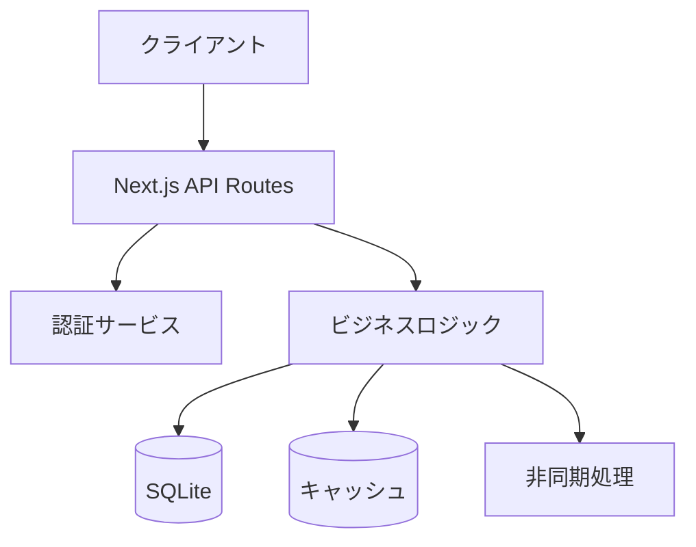
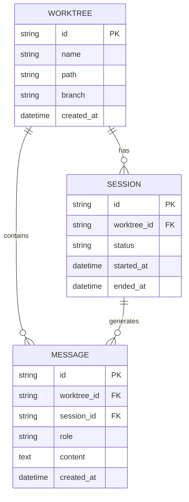

# 設計方針作成コマンド

## 概要
アーキテクチャ設計、技術選定、設計判断を支援するコマンドです。

## 使用方法
```bash
/design-policy [要件概要]
```

**例**:
```bash
/design-policy ユーザー認証機能の追加
/design-policy リアルタイム通知システム
```

## 実行内容

あなたはソフトウェアアーキテクトです。以下の観点から設計方針を策定してください：

### 1. アーキテクチャ設計

#### システム構成図


#### レイヤー構成
- プレゼンテーション層（`src/app/`）
- ビジネスロジック層（`src/lib/`）
- データアクセス層（`src/lib/db.ts`）
- インフラストラクチャ層

### 2. 技術選定

| カテゴリ | 選定技術 | 選定理由 |
|---------|---------|---------|
| 言語/フレームワーク | TypeScript/Next.js 14 | 既存技術スタック |
| データベース | SQLite | 軽量、ファイルベース |
| スタイル | Tailwind CSS | 既存技術スタック |
| テスト | Vitest/Playwright | 高速、型安全 |
| 監視/ログ | console/file | シンプル運用 |

### 3. 設計パターン

適用する設計パターンと理由：

#### Repository パターン
データアクセスを抽象化し、ビジネスロジックとデータ永続化を分離

```typescript
// src/lib/repositories/worktree-repository.ts
export interface WorktreeRepository {
  findAll(): Promise<Worktree[]>
  findById(id: string): Promise<Worktree | null>
  create(data: CreateWorktreeInput): Promise<Worktree>
  update(id: string, data: UpdateWorktreeInput): Promise<Worktree>
  delete(id: string): Promise<void>
}
```

#### Factory パターン
複雑なオブジェクト生成を集約

#### Service パターン
ビジネスロジックをサービスクラスに集約

### 4. データモデル設計

#### ER図


#### 主要テーブル設計
- テーブル名、カラム、インデックス

### 5. API設計

#### RESTful API
```
GET    /api/worktrees          - 一覧取得
GET    /api/worktrees/:id      - 詳細取得
POST   /api/worktrees          - 新規作成
PUT    /api/worktrees/:id      - 更新
DELETE /api/worktrees/:id      - 削除
```

#### リクエスト/レスポンス形式
```typescript
// Response
interface ApiResponse<T> {
  success: boolean
  data?: T
  error?: {
    code: string
    message: string
  }
}
```

#### エラーハンドリング
- 400: バリデーションエラー
- 401: 認証エラー
- 404: リソース不在
- 500: サーバーエラー

### 6. セキュリティ設計
- 認証/認可方式
- データ暗号化
- 入力バリデーション
- XSS/CSRF対策

### 7. パフォーマンス設計
- キャッシング戦略
- 非同期処理
- スケーリング方針
- データベースインデックス

### 8. 設計上の決定事項とトレードオフ

#### 採用した設計
| 決定事項 | 理由 | トレードオフ |
|---------|------|-------------|
| SQLite使用 | シンプル、軽量 | スケーラビリティ制限 |
| Server Components優先 | パフォーマンス | クライアント側の柔軟性 |
| App Router | 最新機能 | 学習コスト |

#### 代替案との比較
- 代替案1: PostgreSQL
  - メリット: スケーラビリティ
  - デメリット: 複雑性増加
- 代替案2: Prisma ORM
  - メリット: 型安全性
  - デメリット: オーバーヘッド

## 制約条件の確認

CLAUDE.mdの以下の原則に準拠：
- SOLID原則
- KISS原則
- YAGNI原則
- DRY原則

## 出力フォーマット

設計方針書（design-policy.md）形式で出力。図表を含む構造化されたMarkdownドキュメント。

**出力先**: `dev-reports/design/<機能名>-design-policy.md`

## 関連コマンド

- `/architecture-review`: 設計レビュー
- `/work-plan`: 作業計画立案
- `/issue-split`: Issue分割
