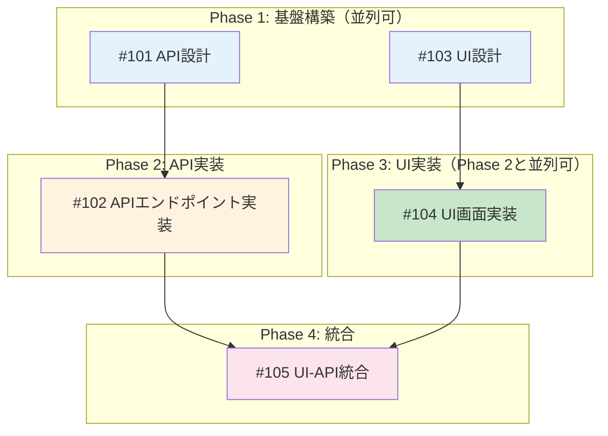

# Issue分割コマンド

## 概要
Feature全体を実装可能な単位のIssueに分割し、依存関係を整理するコマンドです。

## 使用方法
```bash
/issue-split [Feature概要]
```

**例**:
```bash
/issue-split ダークモード機能を追加
/issue-split
```

## 実行内容

あなたはプロジェクトマネージャー兼テックリードです。Feature全体を適切なIssueに分割してください：

### 1. Issue分割戦略

#### 分割の原則
- **縦割り（Vertical Slice）優先**
  - 各Issueが独立してデプロイ可能
  - UI + API + DB + テストを1つのIssueに含める
  - フェーズ（要件→設計→実装）で分割しない

#### Issue サイズの目安

| サイズ | Story Point | 作業時間 | 推奨 |
|-------|------------|---------|------|
| XS | 1 | 2-4時間 | ✅ 小さなバグ修正 |
| S | 2 | 0.5-1日 | ✅ 単純な機能追加 |
| M | 3-5 | 1-3日 | ✅ 標準的な機能 |
| L | 8 | 3-5日 | ⚠️ 分割を推奨 |
| XL | 13+ | 1週間以上 | ❌ 必ず分割 |

### 2. Issue一覧の作成

各Issueについて以下を定義：

```markdown
## Feature: [Feature名]

### Issue #1: [タイトル]
**概要**: [1-2文で説明]
**サイズ**: S/M/L
**優先度**: High/Medium/Low
**作業見積**: [X]時間
**担当候補**: Backend/Frontend/Full-stack

**スコープ**:
- [ ] 実装内容1
- [ ] 実装内容2
- [ ] テスト作成
- [ ] ドキュメント更新

**技術スタック**:
- 言語/FW: TypeScript/Next.js 14
- データベース: SQLite
- その他: Tailwind CSS

**受入基準 (Acceptance Criteria)**:

#### 🤖 自動検証可能な基準（pm-auto-devが実施）

**機能要件**:
- [ ] APIエンドポイント `/api/v1/[リソース]` が実装される
- [ ] バリデーションエラーが適切に返される
- [ ] データベースに正常にデータが保存される

**品質基準**:
- [ ] 単体テストカバレッジ 80%以上
- [ ] 結合テストカバレッジ 50%以上
- [ ] ESLint/TypeScript エラーゼロ
- [ ] レスポンスタイム 500ms以内

**テストケース**:
- [ ] 正常系: [具体的なテストケース]
- [ ] 異常系: [具体的なテストケース]
- [ ] エッジケース: [具体的なテストケース]

#### 👤 手動検証が必要な基準（ユーザーが実施）

**UX/UI検証**:
- [ ] 画面のレイアウトが仕様通り
- [ ] エラーメッセージが分かりやすく表示される
- [ ] 操作フローが自然

**ビジネスロジック検証**:
- [ ] 実際のデータで動作確認
- [ ] 外部APIと連携確認
- [ ] セキュリティ要件確認

**運用検証**:
- [ ] ログが適切に出力される
- [ ] 管理画面で正常に表示される
- [ ] エラー時のハンドリングが機能する

#### ✅ 完了条件
- `/pm-auto-dev` 完了時点: 🤖 自動検証可能な基準 → 全て✅
- ユーザー動作確認後: 👤 手動検証が必要な基準 → 全て✅
- 上記完了後に `/create-pr` 実行可能

### Issue #2: [タイトル]
...
```

### 3. Phase毎のイシュー管理

Feature全体をPhaseに分割し、各PhaseにIssueを配置：

#### Phase 1: 基盤構築（並列実行可能）

| Issue | 概要 | 依存 | 担当 | 見積 |
|-------|------|------|------|------|
| #101 | API設計・スキーマ定義 | なし | Backend | 4h |
| #103 | UI設計・コンポーネント設計 | なし | Frontend | 4h |

**Phase 1 完了条件**:
- [ ] API仕様書作成完了
- [ ] UIモックアップ承認完了

#### Phase 2: API実装（Phase 1完了後）

| Issue | 概要 | 依存 | 担当 | 見積 |
|-------|------|------|------|------|
| #102 | APIエンドポイント実装 | #101 | Backend | 1日 |

**Phase 2 完了条件**:
- [ ] `/pm-auto-dev 102` 完了（自動検証済み）
- [ ] API単体動作確認OK（手動）

#### Phase 3: UI実装（Phase 1完了後、Phase 2と並列可）

| Issue | 概要 | 依存 | 担当 | 見積 |
|-------|------|------|------|------|
| #104 | UI画面実装 | #103 | Frontend | 1日 |

**Phase 3 完了条件**:
- [ ] `/pm-auto-dev 104` 完了（自動検証済み）
- [ ] UI表示確認OK（手動）

#### Phase 4: 統合（Phase 2, 3完了後）

| Issue | 概要 | 依存 | 担当 | 見積 |
|-------|------|------|------|------|
| #105 | UI-API統合 | #102, #104 | Full-stack | 0.5日 |

**Phase 4 完了条件**:
- [ ] `/pm-auto-dev 105` 完了（E2Eテスト自動検証済み）
- [ ] 実際のユーザー操作フロー確認OK（手動）

### 4. 依存関係グラフ（Phase + Issue）

Issue間の依存関係とPhaseを可視化：



#### 並列実行可能性マトリクス

| Phase | 並列実行可能なIssue | 理由 |
|-------|-------------------|------|
| Phase 1 | #101, #103 | 相互依存なし |
| Phase 2-3 | #102, #104 | 異なるレイヤー（Backend/Frontend） |

#### 依存関係マトリクス（詳細版）

| Issue | 依存先 | 並列実行可能 | ブロッカー |
|-------|--------|-------------|------------|
| #101 | なし | Yes | なし |
| #103 | なし | Yes（#101と並列可） | なし |
| #102 | #101 | No | #101の完了待ち |
| #104 | #103 | Yes（#102と並列可） | #103の完了待ち |
| #105 | #102, #104 | No | #102,#104の完了待ち |

### 5. マイルストーン計画

Phase完了順序とマイルストーン：

**Milestone 1: 基盤・実装（Week 1-2）**
- Phase 1: 基盤構築（並列実行）
- Phase 2: API実装
- Phase 3: UI実装（Phase 2と並列実行可能）

**Milestone 2: 統合・品質保証（Week 3）**
- Phase 4: UI-API統合
- Phase 5: 品質保証テスト（並列実行）

### 6. リソース配分

| 役割 | 必要人数 | スキル要件 | 担当Issue |
|------|---------|-----------|-----------|
| Backend | 1名 | TypeScript/Next.js | #1, #2 |
| Frontend | 1名 | React/TypeScript | #3 |
| Full-stack | 1名 | Next.js/SQLite | #4, #5 |

### 7. リスク評価

| Issue | リスク | 影響度 | 対策 |
|-------|-------|-------|------|
| #101 | API設計の変更 | 高 | 早期レビュー・承認 |
| #102 | 技術的複雑性 | 中 | 早期プロトタイピング |
| #104 | UI/UXの要件変更 | 中 | モックアップ事前承認 |
| #105 | 統合時の不具合 | 高 | 段階的統合・E2Eテスト |

### 8. 分割判断チェックリスト

各Issueについて確認：
- [ ] 独立してデプロイ可能か
- [ ] 1-3日で完了可能か
- [ ] 明確な完了条件があるか（受入基準が2層構造で定義されているか）
- [ ] テストが定義できるか
- [ ] 他Issueへの影響が最小か
- [ ] Phase間の依存関係が明確か
- [ ] 並列実行可能なIssueが識別されているか

## 出力フォーマット

GitHub Projects や Issue に直接転記可能なMarkdown形式。

**必須項目**:
1. Issue一覧（受入基準の2層構造含む）
2. Phase毎のイシュー管理
3. 依存関係グラフ（Phase + Issue）
4. 並列実行可能性マトリクス
5. マイルストーン計画

**出力先**: `dev-reports/feature/issue/<親Issue番号>/issue-split.md`

## 次のステップ

Issue分割後は `/issue-create` コマンドでGitHub Issueを一括作成し、各Issueの詳細な作業計画は `/work-plan` で立案してください。

## 関連コマンド

- `/issue-create`: GitHub Issueの一括作成
- `/work-plan`: 各Issue単位の詳細作業計画立案
- `/pm-auto-dev`: 自動開発実行
