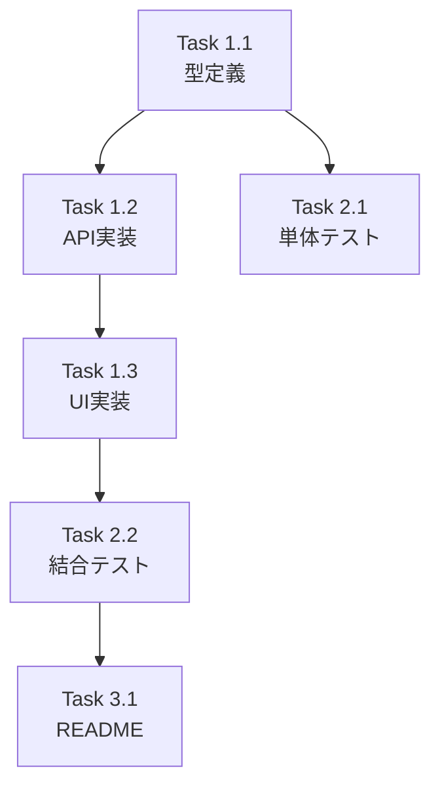

# 作業計画立案スキル（Issue単位）

## 概要
Issue単位での具体的な作業計画を立案し、実装タスクの詳細化を策定するスキルです。

## 使用方法
- `/work-plan [Issue番号または概要]`
- 「Issue #123の作業計画を立案してください」

## 前提条件
- 対象Issueの概要と要件が明確
- GitHubリポジトリにアクセス可能

## 実行内容

あなたはテックリードです。1つのIssue実装のための具体的な作業計画を立案してください：

### 1. Issue概要の確認

まずIssue情報を取得します：

```bash
gh issue view {issue_number} --json number,title,body,labels,assignees
```

以下の形式で概要をまとめます：

```markdown
## Issue: [タイトル]
**Issue番号**: #XXX
**サイズ**: S/M/L
**優先度**: High/Medium/Low
**依存Issue**: #YYY（あれば）
```

### 2. 詳細タスク分解

#### 実装タスク（Phase 1）
- [ ] **Task 1.1**: データモデル/型定義
  - 成果物: `src/types/xxx.ts`
  - 依存: なし

- [ ] **Task 1.2**: APIエンドポイント実装
  - 成果物: `src/app/api/xxx/route.ts`
  - 依存: Task 1.1

- [ ] **Task 1.3**: UIコンポーネント実装
  - 成果物: `src/components/xxx.tsx`
  - 依存: Task 1.2

#### テストタスク（Phase 2）
- [ ] **Task 2.1**: 単体テスト
  - 成果物: `tests/unit/xxx.test.ts`
  - カバレッジ目標: 80%以上

- [ ] **Task 2.2**: 結合テスト
  - 成果物: `tests/integration/xxx.test.ts`

#### ドキュメントタスク（Phase 3）
- [ ] **Task 3.1**: README更新（必要な場合）
  - 成果物: `README.md`

### 3. タスク依存関係



### 4. 品質チェック項目

| チェック項目 | コマンド | 基準 |
|-------------|----------|------|
| ESLint | `npm run lint` | エラー0件 |
| TypeScript | `npx tsc --noEmit` | 型エラー0件 |
| Unit Test | `npm run test:unit` | 全テストパス |
| Build | `npm run build` | 成功 |

### 5. 成果物チェックリスト

#### コード
- [ ] 型定義ファイル
- [ ] APIエンドポイント
- [ ] UIコンポーネント

#### テスト
- [ ] 単体テスト
- [ ] 結合テスト

#### ドキュメント
- [ ] README更新（必要な場合）

### 6. Definition of Done

Issue完了条件：
- [ ] すべてのタスクが完了
- [ ] 単体テストカバレッジ80%以上
- [ ] CIチェック全パス（lint, type-check, test, build）
- [ ] コードレビュー承認
- [ ] ドキュメント更新完了

### 7. 次のアクション

作業計画承認後：
1. **ブランチ作成**: `feature/{issue_number}-[feature-name]`
2. **タスク実行**: 計画に従って実装
3. **進捗報告**: `/progress-report`で定期報告
4. **PR作成**: `/create-pr`で自動作成

## 出力フォーマット

GitHub Issueのコメントやプロジェクト管理ツールに転記可能なMarkdown形式。

## 出力先

`dev-reports/issue/{issue_number}/work-plan.md`
