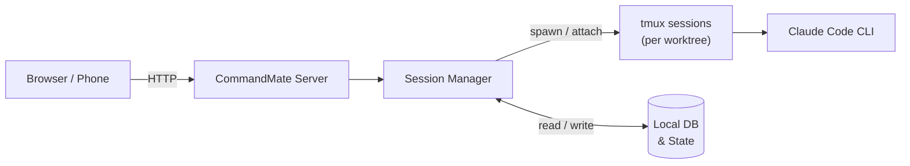

# CommandMate


**Status: Beta**

[English](./README.md) | [日本語](./docs/ja/README.md)

<!-- TODO: Add a 30-second demo GIF here to boost adoption -->
<!-- Example:  -->

> **Your AI coding companion — never miss a prompt, work from anywhere.**

- **Detect prompt/confirmation state** in real-time
- **Send instructions from mobile or desktop** — no need to sit at your PC
- **Manage sessions per Git worktree** — run parallel tasks with ease

```bash
npm install -g commandmate
```


## Table of Contents

- [What is this?](#what-is-this)
- [Who is this for?](#who-is-this-for)
- [What makes it unique?](#what-makes-it-unique)
- [Quick Start](#quick-start-3-steps)
- [Troubleshooting](#troubleshooting)
- [How it works](#how-it-works)
- [Key Features](#key-features)
- [Use Cases](#use-cases)
- [Security](#security)
- [CLI Commands](#cli-commands)
- [Developer Setup](#developer-setup)
- [FAQ](#faq)
- [Documentation](#documentation)
- [Contributing](#contributing)

---

## What is this?

A development companion tool that manages Claude Code sessions per Git worktree and lets you send instructions from your browser.

During your commute, childcare breaks, or lunch — send the next instruction as easily as replying to an email, and keep your side projects moving forward.

## Who is this for?

**Great fit:**
- Developers juggling childcare, commutes, or meetings — can't sit at the PC all day
- Users who miss Claude Code's input prompts and lose flow
- Teams using Git worktree for parallel development but finding tmux management tedious

**Not ideal for:**
- GUI IDE-only workflows (CommandMate is terminal/CLI-based)
- Multi-user SaaS expectations (CommandMate is designed for local, individual use)

## What makes it unique?

CommandMate is not a terminal replacement. It **complements** Claude Code by focusing on three things:

- **Prompt detection** — know instantly when Claude Code needs your input
- **Response UI** — reply from any browser, including your phone
- **Worktree organization** — manage multiple sessions in one place

Supports **Claude Code**, **Codex CLI**, and **Gemini CLI**. Built with the Strategy pattern for extensibility — adding new CLI tools is straightforward.

---

## Quick Start (3 Steps)

**Prerequisites:** macOS / Linux, Node.js v20+, npm, git, tmux, openssl

> Windows is not supported due to the tmux dependency. WSL2 has not been tested.

```bash
# 1. Install
npm install -g commandmate

# 2. Initialize (dependency check, environment setup, DB init)
commandmate init

# 3. Start
commandmate start --daemon
```

Open http://localhost:3000 in your browser.

**Useful commands:**

```bash
commandmate status    # Check server status
commandmate stop      # Stop the server
```

See the [CLI Setup Guide](./docs/en/user-guide/cli-setup-guide.md) for details.

---

## Troubleshooting

**Claude CLI not found / path changed?**
If you switch between npm and standalone versions of Claude CLI, the path may change. CommandMate auto-detects the new path on the next session start. To set a custom path, add `CLAUDE_PATH=/path/to/claude` to `.env`.

**Port conflict?**
```bash
commandmate start -p 3001
```

**Session stuck or not responding?**
Check tmux sessions directly. CommandMate manages sessions with the naming format `mcbd-{tool}-{worktree}`:

```bash
# List all CommandMate sessions
tmux list-sessions | grep mcbd

# View session output (without attaching)
tmux capture-pane -t "mcbd-claude-feature-123" -p

# Attach to inspect (detach with Ctrl+b then d)
tmux attach -t "mcbd-claude-feature-123"

# Kill a broken session
tmux kill-session -t "mcbd-claude-feature-123"
```

> **Note:** When attached, avoid typing directly into the session — this can interfere with CommandMate's session management. Use `Ctrl+b` then `d` to detach and operate through the CommandMate UI instead.

**Sessions fail when launching from within Claude Code?**
Claude Code sets `CLAUDECODE=1` to prevent nesting. CommandMate removes this automatically, but if it persists, run: `tmux set-environment -g -u CLAUDECODE`

---

## How it works

CommandMate treats Claude Code (CLI) as a managed "execution session", making its state (running / waiting for input / idle) visible through a web UI.



Each Git worktree gets its own tmux session, so you can run multiple tasks in parallel without interference.

---

## Key Features

- **Prompt/confirmation detection** — Real-time status display in the sidebar (idle/ready/running/waiting)
- **Send instructions from browser** — Operate via message UI from both mobile and desktop
- **Execution history & notes** — Retains conversation history per branch with note-taking support
- **Markdown log viewer** — View Claude's detailed output in Markdown format
- **File viewer** — Browse worktree files from the browser with file operations (move, copy, delete)
- **File timestamps** — Display file creation time in the file tree
- **Auto Yes mode** — Control automatic approval with a confirmation dialog
- **Repository management** — Remove repositories from app management (actual files are not deleted)
- **Clone URL registration** — Clone and register repositories by specifying HTTPS/SSH URLs
- **Multi-CLI support** — Optimized for Claude Code, with Codex CLI and Gemini CLI support
- **Responsive UI** — Two-column layout on desktop, tab-based layout on mobile

<details>
<summary>Screenshots</summary>

### Worktree Detail View (Message / Console / History)

| Desktop | Mobile (History) | Mobile (Terminal) |
|---------|-----------------|-------------------|
|  |  |  |

### Top Page (Mobile)


</details>

---

## Use Cases

### 1. Commute — pick up where you left off

- **Morning:** Kick off a task with Claude Code before leaving
- **Commute:** Check status on your phone, send the next instruction
- **Evening:** Review the results and merge when you get home

### 2. Childcare — 5-minute windows add up

- Split tasks across worktrees so each runs independently
- Check which sessions are waiting via CommandMate
- In a 5-minute break, send the next instruction and keep things moving

### 3. Parallel development — one UI for all your worktrees

- No need to juggle tmux panes manually
- See status of all worktrees at a glance in the sidebar
- Focus on decisions, not terminal management

---

## Security

CommandMate runs **entirely locally** — the app, database, and sessions all stay on your machine. The only external communication is Claude CLI's own API calls.

**Recommended setup:**
- Use on `localhost` or within the same LAN
- For remote access, use a VPN or authenticated reverse proxy (Basic Auth, OIDC, etc.)
- Enabling external access via `commandmate init` sets `CM_BIND=0.0.0.0` — access from the same LAN at `http://<your-PC-IP>:3000`

**Do NOT:**
- Expose to the internet without authentication (never bind `0.0.0.0` without a reverse proxy)

See the [Security Guide](./docs/security-guide.md) and [Trust & Safety](./docs/en/TRUST_AND_SAFETY.md) for details.

---

## CLI Commands

### Basic

| Command | Description |
|---------|-------------|
| `commandmate init` | Initial setup (interactive) |
| `commandmate init --defaults` | Initial setup (default values) |
| `commandmate init --force` | Overwrite existing configuration |
| `commandmate start` | Start the server (foreground) |
| `commandmate start --daemon` | Start in background |
| `commandmate start --dev` | Start in development mode |
| `commandmate start -p 3001` | Start on a specific port |
| `commandmate stop` | Stop the server |
| `commandmate stop --force` | Force stop (SIGKILL) |
| `commandmate status` | Check status |

### Worktree Parallel Development

Run separate servers per Issue/worktree with automatic port allocation.

| Command | Description |
|---------|-------------|
| `commandmate start --issue 123` | Start server for Issue #123 worktree |
| `commandmate start --issue 123 --auto-port` | Start with automatic port allocation |
| `commandmate start --issue 123 -p 3123` | Start on a specific port |
| `commandmate stop --issue 123` | Stop server for Issue #123 |
| `commandmate status --issue 123` | Check status for Issue #123 |
| `commandmate status --all` | Check status for all servers |

### GitHub Issue Management

Requires [gh CLI](https://cli.github.com/) to be installed.

| Command | Description |
|---------|-------------|
| `commandmate issue create` | Create a new issue |
| `commandmate issue create --bug` | Create with bug report template |
| `commandmate issue create --feature` | Create with feature request template |
| `commandmate issue create --question` | Create with question template |
| `commandmate issue create --title <title>` | Specify issue title |
| `commandmate issue create --body <body>` | Specify issue body |
| `commandmate issue create --labels <labels>` | Add labels (comma-separated) |
| `commandmate issue search <query>` | Search issues |
| `commandmate issue list` | List issues |

### Documentation

| Command | Description |
|---------|-------------|
| `commandmate docs` | Show documentation |
| `commandmate docs -s <section>` | Show a specific section |
| `commandmate docs -q <query>` | Search documentation |
| `commandmate docs --all` | List all available sections |

See `commandmate --help` for all options.

---

## Developer Setup

For contributors or those building a development environment, use git clone.

```bash
git clone https://github.com/Kewton/CommandMate.git
cd CommandMate
./scripts/setup.sh  # Auto-runs dependency check, env setup, build, and launch
```

<details>
<summary>Manual Setup (for customization)</summary>

```bash
git clone https://github.com/Kewton/CommandMate.git
cd CommandMate
./scripts/preflight-check.sh          # Dependency check
npm install
./scripts/setup-env.sh                # Interactive .env generation
npm run db:init
npm run build
npm start
```

> **Note**: `./scripts/*` scripts are only available in the development environment. For global installs (`npm install -g`), use the `commandmate` CLI.

> **Note**: Legacy environment variable names (`MCBD_*`) are still supported for backward compatibility, but using the new names (`CM_*`) is recommended.

</details>

---

## FAQ

**Q: Is tmux required?**
A: CommandMate uses tmux internally to manage CLI sessions. You don't need to operate tmux directly — CommandMate handles it for you. If something goes wrong, you can inspect sessions via tmux commands (see [Troubleshooting](#troubleshooting)).

**Q: What about Claude Code's permissions?**
A: Claude Code's own permission settings apply as-is. CommandMate does not expand permissions. See [Trust & Safety](./docs/en/TRUST_AND_SAFETY.md) for details.

**Q: Can multiple people use it?**
A: Currently designed for individual use. Simultaneous multi-user access is not supported.

---

## Documentation

| Document | Description |
|----------|-------------|
| [CLI Setup Guide](./docs/en/user-guide/cli-setup-guide.md) | Installation and initial setup |
| [Web App Guide](./docs/en/user-guide/webapp-guide.md) | Basic web app operations |
| [Quick Start](./docs/en/user-guide/quick-start.md) | Using Claude Code commands |
| [Concept](./docs/en/concept.md) | Vision and problems solved |
| [Architecture](./docs/en/architecture.md) | System design |
| [Deployment Guide](./docs/en/DEPLOYMENT.md) | Production environment setup |
| [Migration Guide](./docs/en/migration-to-commandmate.md) | Migrating from MyCodeBranchDesk |
| [UI/UX Guide](./docs/en/UI_UX_GUIDE.md) | UI implementation details |
| [Trust & Safety](./docs/en/TRUST_AND_SAFETY.md) | Security and permissions |

## Contributing

Bug reports, feature suggestions, and documentation improvements are welcome. See [CONTRIBUTING.md](./CONTRIBUTING.md) for details.

## License

[MIT License](./LICENSE) - Copyright (c) 2026 Kewton
