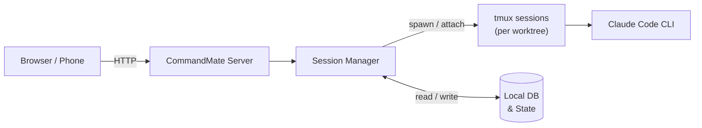

# CommandMate

[](https://github.com/Kewton/CommandMate)


**Status: Beta**

[English](./README.md) | [日本語](./docs/ja/README.md)

<p align="center">
  
</p>

> **Claude Code keeps coding while you're away. Check in from your phone.**

Not a "remote control" — a **mobile dev cockpit**.

```bash
npx commandmate
```

**From install to mobile monitoring in 60 seconds.** macOS / Linux · Node.js v20+ · npm · git · tmux · openssl

---

AI writes code for you — but you're stuck watching a terminal, afraid to walk away.
Close the lid and every session dies.
**CommandMate keeps it alive, and puts the controls on your phone.**

Of course, it works great on desktop too — the two-column layout gives you a full overview of all sessions and worktrees at a glance.

<p align="center">
  
</p>

---

## Key Features

| Feature | What it does | Why it matters |
|---------|-------------|----------------|
| **Auto Yes Mode** | Agent runs without stopping for confirmations | No babysitting — Claude Code keeps working while you're away |
| **Git Worktree Sessions** | One session per worktree, parallel execution | Multiple tasks progress simultaneously |
| **Mobile Web UI** | Full session control from any browser | Monitor and steer from your phone |
| **File Viewer** | Browse worktree files from the browser | Review code changes without touching your PC |
| **Markdown Editor** | Edit Markdown files in the browser | Update AI instructions on the go |
| **Screenshot Instructions** | Attach images to your prompts | Snap a bug → "Fix this" — the agent sees the screenshot |
| **Token Authentication** | SHA-256 hashed token + HTTPS + rate limiting | Secure remote access — no credentials leaked, brute-force protected |
| **Scheduled Execution** | Cron-based auto-run via CMATE.md | Daily reviews, nightly tests — Claude Code works on a schedule |

---

## Use Cases

| Scenario | How CommandMate helps |
|----------|----------------------|
| **Couch coding** | Start a task on your PC, then monitor and steer from the sofa |
| **Commute review** | Review AI-generated code changes on the train |
| **Overnight runs** | Let Claude Code work all night — check progress from bed |
| **Visual bug fix** | Snap a UI bug on your phone, send it with "Fix this" |
| **Parallel tasks** | Run multiple worktree sessions, manage them all from one dashboard |

---

## Comparison

| Feature | CommandMate | Remote Control (Official) | Happy Coder | claude-squad | Omnara |
|---------|:-----------:|:------------------------:|:-----------:|:------------:|:------:|
| Auto Yes Mode | Yes | No | No | Yes (TUI only) | No |
| Git Worktree Management | Yes | No | No | Yes (TUI only) | No |
| Parallel Sessions | Yes | **No (1 only)** | Yes | Yes | No |
| Mobile Web UI | Yes | Yes (claude.ai) | Yes | **No** | Yes |
| File Viewer | Yes | No | No | No | No |
| Markdown Editor | Yes | No | No | No | No |
| Screenshot Instructions | Yes | No | No | Not possible | No |
| Scheduled Execution | Yes | No | No | No | No |
| Survives Laptop Close | Yes (daemon) | **No (terminal must stay open)** | Yes | Yes | Yes |
| Token Authentication | Yes | N/A (Anthropic account) | N/A (app) | No | N/A (cloud) |
| Free / OSS | Yes | Requires Pro/Max | Free + Paid | Yes | $20/mo |
| Runs 100% Locally | Yes | Via Anthropic API | Server-routed | Yes | Cloud fallback |

---

## Screenshots

### Desktop


### Mobile

| Top Page | Worktree (History) | Worktree (Terminal) |
|----------|-------------------|-------------------|
|  |  |  |

### Worktree Detail (Desktop)


---

## Security

Runs **100% locally**. No external server, no cloud relay, no account required. The only network traffic is Claude CLI's own API calls.

- Fully open-source ([MIT License](./LICENSE))
- Local database, local sessions
- For remote access, use a tunneling service ([Cloudflare Tunnel](https://developers.cloudflare.com/cloudflare-one/connections/connect-networks/), [ngrok](https://ngrok.com/), [Pinggy](https://pinggy.io/)), a VPN, or an authenticated reverse proxy

See the [Security Guide](./docs/security-guide.md) and [Trust & Safety](./docs/en/TRUST_AND_SAFETY.md) for details.

---

## How it works



Each Git worktree gets its own tmux session, so multiple tasks run in parallel without interference.

---

<details>
<summary><strong>Quick Start (detailed)</strong></summary>

```bash
# Install & start in one command
npx commandmate

# Or install globally
npm install -g commandmate
commandmate init
commandmate start --daemon
```

Open http://localhost:3000 in your browser.

See the [CLI Setup Guide](./docs/en/user-guide/cli-setup-guide.md) for details.

</details>

<details>
<summary><strong>CLI Commands</strong></summary>

### Basic

| Command | Description |
|---------|-------------|
| `commandmate init` | Initial setup (interactive) |
| `commandmate init --defaults` | Initial setup (default values) |
| `commandmate init --force` | Overwrite existing configuration |
| `commandmate start` | Start the server (foreground) |
| `commandmate start --daemon` | Start in background |
| `commandmate start --dev` | Start in development mode |
| `commandmate start -p 3001` | Start on a specific port |
| `commandmate stop` | Stop the server |
| `commandmate stop --force` | Force stop (SIGKILL) |
| `commandmate status` | Check status |

### Worktree Parallel Development

Run separate servers per Issue/worktree with automatic port allocation.

| Command | Description |
|---------|-------------|
| `commandmate start --issue 123` | Start server for Issue #123 worktree |
| `commandmate start --issue 123 --auto-port` | Start with automatic port allocation |
| `commandmate start --issue 123 -p 3123` | Start on a specific port |
| `commandmate stop --issue 123` | Stop server for Issue #123 |
| `commandmate status --issue 123` | Check status for Issue #123 |
| `commandmate status --all` | Check status for all servers |

### GitHub Issue Management

Requires [gh CLI](https://cli.github.com/) to be installed.

| Command | Description |
|---------|-------------|
| `commandmate issue create` | Create a new issue |
| `commandmate issue create --bug` | Create with bug report template |
| `commandmate issue create --feature` | Create with feature request template |
| `commandmate issue create --question` | Create with question template |
| `commandmate issue create --title <title>` | Specify issue title |
| `commandmate issue create --body <body>` | Specify issue body |
| `commandmate issue create --labels <labels>` | Add labels (comma-separated) |
| `commandmate issue search <query>` | Search issues |
| `commandmate issue list` | List issues |

### Documentation

| Command | Description |
|---------|-------------|
| `commandmate docs` | Show documentation |
| `commandmate docs -s <section>` | Show a specific section |
| `commandmate docs -q <query>` | Search documentation |
| `commandmate docs --all` | List all available sections |

See `commandmate --help` for all options.

</details>

<details>
<summary><strong>Troubleshooting & FAQ</strong></summary>

### Claude CLI not found / path changed?

If you switch between npm and standalone versions of Claude CLI, the path may change. CommandMate auto-detects the new path on the next session start. To set a custom path, add `CLAUDE_PATH=/path/to/claude` to `.env`.

### Port conflict?

```bash
commandmate start -p 3001
```

### Session stuck or not responding?

Check tmux sessions directly. CommandMate manages sessions with the naming format `mcbd-{tool}-{worktree}`:

```bash
# List all CommandMate sessions
tmux list-sessions | grep mcbd

# View session output (without attaching)
tmux capture-pane -t "mcbd-claude-feature-123" -p

# Attach to inspect (detach with Ctrl+b then d)
tmux attach -t "mcbd-claude-feature-123"

# Kill a broken session
tmux kill-session -t "mcbd-claude-feature-123"
```

> **Note:** When attached, avoid typing directly into the session — this can interfere with CommandMate's session management. Use `Ctrl+b` then `d` to detach and operate through the CommandMate UI instead.

### Sessions fail when launching from within Claude Code?

Claude Code sets `CLAUDECODE=1` to prevent nesting. CommandMate removes this automatically, but if it persists, run: `tmux set-environment -g -u CLAUDECODE`

### FAQ

**Q: How do I use CommandMate from my phone?**
A: CommandMate runs a web server on your PC. To access it from your phone, your phone and PC must be on the same network (Wi-Fi). Run `commandmate init` and enable external access — this sets `CM_BIND=0.0.0.0`. Then open `http://<your-PC-IP>:3000` in your phone's browser.

**Q: Can I access it from outside my home network?**
A: Yes. Use a tunneling service to securely expose your local server without opening router ports:

- [Cloudflare Tunnel](https://developers.cloudflare.com/cloudflare-one/connections/connect-networks/) — free, requires Cloudflare account
- [ngrok](https://ngrok.com/) — free tier available, easy setup
- [Pinggy](https://pinggy.io/) — no sign-up required, simple SSH-based tunnel

Alternatively, a VPN or an authenticated reverse proxy (Basic Auth, OIDC, etc.) also works. **Do not** expose the server directly to the internet without authentication.

**Q: Does it work on iPhone / Android?**
A: Yes. CommandMate's Web UI is responsive and works on any modern mobile browser (Safari, Chrome, etc.). No app install required.

**Q: Is tmux required?**
A: CommandMate uses tmux internally to manage CLI sessions. You don't need to operate tmux directly — CommandMate handles it for you.

**Q: What about Claude Code's permissions?**
A: Claude Code's own permission settings apply as-is. CommandMate does not expand permissions. See [Trust & Safety](./docs/en/TRUST_AND_SAFETY.md) for details.

**Q: Can multiple people use it?**
A: Currently designed for individual use. Simultaneous multi-user access is not supported.

</details>

<details>
<summary><strong>Developer Setup</strong></summary>

For contributors or those building a development environment:

```bash
git clone https://github.com/Kewton/CommandMate.git
cd CommandMate
./scripts/setup.sh  # Auto-runs dependency check, env setup, build, and launch
```

### Manual Setup (for customization)

```bash
git clone https://github.com/Kewton/CommandMate.git
cd CommandMate
./scripts/preflight-check.sh          # Dependency check
npm install
./scripts/setup-env.sh                # Interactive .env generation
npm run db:init
npm run build
npm start
```

> **Note**: `./scripts/*` scripts are only available in the development environment. For global installs (`npm install -g`), use the `commandmate` CLI.

</details>

---

## Documentation

| Document | Description |
|----------|-------------|
| [CLI Setup Guide](./docs/en/user-guide/cli-setup-guide.md) | Installation and initial setup |
| [Web App Guide](./docs/en/user-guide/webapp-guide.md) | Basic web app operations |
| [Quick Start](./docs/en/user-guide/quick-start.md) | Using Claude Code commands |
| [Concept](./docs/en/concept.md) | Vision and problems solved |
| [Architecture](./docs/en/architecture.md) | System design |
| [Deployment Guide](./docs/en/DEPLOYMENT.md) | Production environment setup |
| [UI/UX Guide](./docs/en/UI_UX_GUIDE.md) | UI implementation details |
| [Trust & Safety](./docs/en/TRUST_AND_SAFETY.md) | Security and permissions |

## Contributing

Bug reports, feature suggestions, and documentation improvements are welcome. See [CONTRIBUTING.md](./CONTRIBUTING.md) for details.

## License

[MIT License](./LICENSE) - Copyright (c) 2026 Kewton
