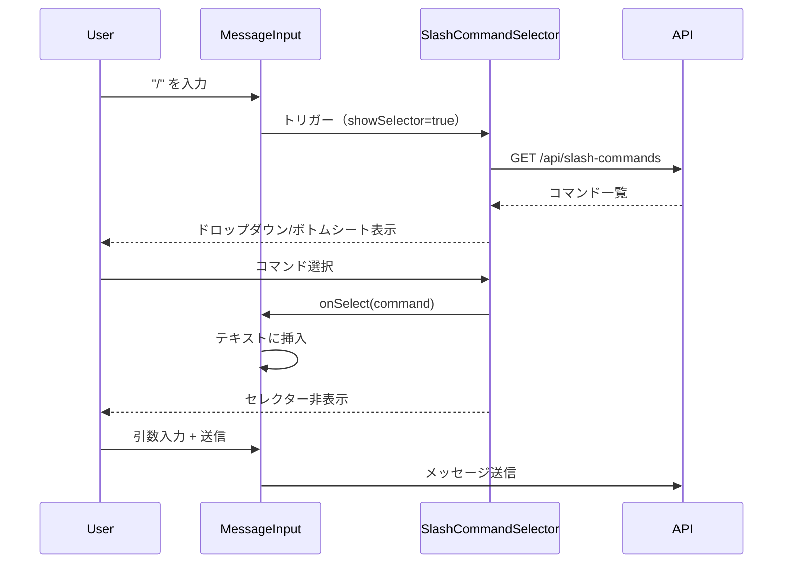
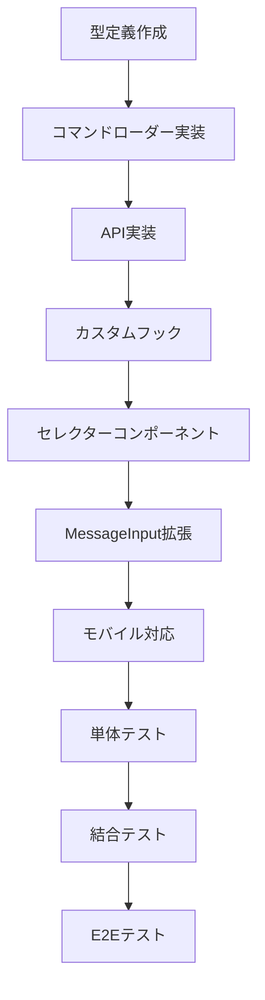

# Issue #10: スラッシュコマンド対応 - 設計方針書

**作成日**: 2026-01-09
**Issue**: #10 - スラッシュコマンド対応
**ステータス**: ドラフト

---

## 1. 概要

### 1.1 背景と目的

ユーザーがスマホおよびPCでメッセージ送信時に、Claude Codeのスラッシュコマンドを選択可能にする機能を実装する。

**課題**:
- スラッシュコマンドが多く（12種類）、覚えきれない
- タイプミスの可能性がある
- コマンドの説明を確認するためにドキュメントを参照する必要がある

**目標**:
- UIからスラッシュコマンドを簡単に選択できるようにする
- PC/モバイル両対応のシームレスなUXを提供
- コマンドの説明をインラインで表示し、学習コストを下げる

### 1.2 スコープ

**対象**:
- メッセージ入力コンポーネント（`MessageInput.tsx`）
- モバイルプロンプトシート（`MobilePromptSheet.tsx`）
- スラッシュコマンド定義の取得と表示

**対象外**:
- スラッシュコマンドの実行ロジック変更（既存のまま）
- 新規スラッシュコマンドの追加

---

## 2. 利用可能なスラッシュコマンド一覧

現在 `.claude/commands/` に定義されているコマンド:

| コマンド | 説明 | 用途 |
|---------|------|------|
| `/work-plan` | Issue単位の作業計画立案 | 計画 |
| `/create-pr` | PR自動作成 | 開発 |
| `/progress-report` | 進捗報告書作成 | 報告 |
| `/tdd-impl` | TDD実装 | 開発 |
| `/pm-auto-dev` | 自動開発フロー | 自動化 |
| `/bug-fix` | バグ修正ワークフロー | 修正 |
| `/refactoring` | リファクタリング実行 | 改善 |
| `/acceptance-test` | 受け入れテスト | テスト |
| `/issue-create` | Issue一括作成 | 計画 |
| `/issue-split` | Issue分割計画 | 計画 |
| `/architecture-review` | アーキテクチャレビュー | レビュー |
| `/design-policy` | 設計方針策定 | 設計 |

---

## 3. アーキテクチャ設計

### 3.1 システム構成図

```mermaid
graph TD
    subgraph Frontend
        MI[MessageInput] --> SCS[SlashCommandSelector]
        SCS --> SCD[SlashCommandDropdown PC]
        SCS --> SCBS[SlashCommandBottomSheet Mobile]
    end

    subgraph API Layer
        API[/api/slash-commands] --> SCL[SlashCommandLoader]
    end

    subgraph Data Source
        SCL --> CMD[.claude/commands/*.md]
    end

    MI --> API
```

### 3.2 コンポーネント構成

```
src/
├── components/
│   ├── worktree/
│   │   ├── MessageInput.tsx          # 既存（拡張）
│   │   └── SlashCommandSelector.tsx  # 新規
│   └── ui/
│       └── CommandPalette.tsx        # 新規（汎用UI）
├── lib/
│   └── slash-commands.ts             # 新規（コマンド定義読み込み）
├── hooks/
│   └── useSlashCommands.ts           # 新規（カスタムフック）
├── types/
│   └── slash-commands.ts             # 新規（型定義）
└── app/
    └── api/
        └── slash-commands/
            └── route.ts              # 新規（API）
```

### 3.3 レイヤー構成

```
┌─────────────────────────────────────────────────────┐
│ Presentation Layer (UI Components)                  │
│ - SlashCommandSelector                             │
│ - CommandPalette (Dropdown/BottomSheet)            │
├─────────────────────────────────────────────────────┤
│ Application Layer (Hooks & State)                   │
│ - useSlashCommands                                 │
│ - useCommandSearch                                 │
├─────────────────────────────────────────────────────┤
│ Domain Layer (Business Logic)                       │
│ - SlashCommandLoader                               │
│ - Command filtering & sorting                      │
├─────────────────────────────────────────────────────┤
│ Infrastructure Layer (Data Access)                  │
│ - File system access (.claude/commands/)           │
│ - API route                                        │
└─────────────────────────────────────────────────────┘
```

---

## 4. データモデル設計

### 4.1 型定義

```typescript
// src/types/slash-commands.ts

/**
 * スラッシュコマンドのカテゴリ
 */
export type SlashCommandCategory =
  | 'planning'     // 計画系
  | 'development'  // 開発系
  | 'testing'      // テスト系
  | 'review'       // レビュー系
  | 'automation'   // 自動化系
  | 'reporting';   // 報告系

/**
 * スラッシュコマンド定義
 */
export interface SlashCommand {
  /** コマンド名（例: "work-plan"） */
  name: string;

  /** 表示用コマンド名（例: "/work-plan"） */
  displayName: string;

  /** 説明文 */
  description: string;

  /** カテゴリ */
  category: SlashCommandCategory;

  /** 使用例 */
  example?: string;

  /** 引数が必要か */
  requiresArgs?: boolean;

  /** 引数のプレースホルダー */
  argsPlaceholder?: string;
}

/**
 * コマンドグループ（カテゴリ別表示用）
 */
export interface SlashCommandGroup {
  category: SlashCommandCategory;
  label: string;
  commands: SlashCommand[];
}
```

### 4.2 コマンドメタデータ抽出

`.claude/commands/*.md` ファイルのフロントマターから情報を抽出:

```yaml
---
model: opus
description: "Issue単位の具体的な作業計画立案"
---
```

**抽出ルール**:
- `description`: フロントマターから取得
- `category`: ファイル内容から推論、またはデフォルト値
- `example`: ファイル内の「使用方法」セクションから抽出

---

## 5. API設計

### 5.1 スラッシュコマンド一覧取得API

**エンドポイント**: `GET /api/slash-commands`

**レスポンス**:

```typescript
interface SlashCommandsResponse {
  success: boolean;
  data: {
    commands: SlashCommand[];
    groups: SlashCommandGroup[];
  };
}
```

**レスポンス例**:

```json
{
  "success": true,
  "data": {
    "commands": [
      {
        "name": "work-plan",
        "displayName": "/work-plan",
        "description": "Issue単位の具体的な作業計画立案",
        "category": "planning",
        "requiresArgs": true,
        "argsPlaceholder": "[Issue番号または概要]"
      }
    ],
    "groups": [
      {
        "category": "planning",
        "label": "計画",
        "commands": [...]
      }
    ]
  }
}
```

### 5.2 キャッシング戦略

- **サーバーサイド**: コマンド一覧は起動時に読み込み、メモリキャッシュ
- **クライアントサイド**: SWRまたはReact Queryで5分間キャッシュ
- **理由**: コマンド定義は頻繁に変更されないため

---

## 6. UI/UX設計

### 6.1 トリガー方法

**PC**:
1. テキストエリアで `/` を入力 → オートコンプリートドロップダウン表示
2. テキストエリア横のボタンクリック → コマンドパレット表示

**モバイル**:
1. テキストエリアで `/` を入力 → ボトムシート表示
2. コマンドアイコンタップ → ボトムシート表示

### 6.2 UI ワイヤーフレーム

#### PC版 - インラインドロップダウン

```
┌─────────────────────────────────────────────────────────┐
│ Type your message... (Shift+Enter for line break)      │
│ /work                                                   │
├─────────────────────────────────────────────────────────┤
│ ┌─────────────────────────────────────────────────────┐ │
│ │ 📋 計画                                             │ │
│ │ ├─ /work-plan    Issue単位の作業計画立案           │ │
│ │ ├─ /issue-split  Issue分割計画                     │ │
│ │ └─ /issue-create Issue一括作成                     │ │
│ │                                                     │ │
│ │ 🛠 開発                                             │ │
│ │ ├─ /tdd-impl     TDD実装                           │ │
│ │ └─ /create-pr    PR自動作成                        │ │
│ └─────────────────────────────────────────────────────┘ │
└─────────────────────────────────────────────────────────┘
```

#### モバイル版 - ボトムシート

```
┌─────────────────────────────────────────┐
│                 ─────                    │ ← ドラッグハンドル
│                                         │
│  スラッシュコマンドを選択                  │
│                                         │
│  🔍 コマンドを検索...                    │
│                                         │
│  📋 計画                                │
│  ┌─────────────────────────────────────┐│
│  │ /work-plan                          ││
│  │ Issue単位の作業計画立案              ││
│  └─────────────────────────────────────┘│
│  ┌─────────────────────────────────────┐│
│  │ /issue-split                        ││
│  │ Issue分割計画                        ││
│  └─────────────────────────────────────┘│
│                                         │
│  🛠 開発                                │
│  ┌─────────────────────────────────────┐│
│  │ /tdd-impl                           ││
│  │ TDD実装                              ││
│  └─────────────────────────────────────┘│
└─────────────────────────────────────────┘
```

### 6.3 インタラクションフロー



### 6.4 キーボードナビゲーション（PC）

| キー | アクション |
|------|-----------|
| `↑` / `↓` | コマンド選択移動 |
| `Enter` | 選択確定 |
| `Escape` | キャンセル |
| `Tab` | 次のグループへ |
| 文字入力 | フィルタリング |

### 6.5 アクセシビリティ

- `role="listbox"` / `role="option"` の適用
- `aria-label` によるスクリーンリーダー対応
- フォーカス管理（セレクター表示時は自動フォーカス）
- 高コントラストモード対応

---

## 7. コンポーネント詳細設計

### 7.1 SlashCommandSelector

```typescript
// src/components/worktree/SlashCommandSelector.tsx

export interface SlashCommandSelectorProps {
  /** セレクター表示状態 */
  visible: boolean;

  /** 現在の入力テキスト（フィルタリング用） */
  filterText: string;

  /** コマンド選択時のコールバック */
  onSelect: (command: SlashCommand) => void;

  /** キャンセル時のコールバック */
  onCancel: () => void;

  /** アンカー要素（ドロップダウン位置決め用） */
  anchorRef?: React.RefObject<HTMLElement>;
}
```

### 7.2 useSlashCommands フック

```typescript
// src/hooks/useSlashCommands.ts

export interface UseSlashCommandsResult {
  /** コマンド一覧 */
  commands: SlashCommand[];

  /** グループ化されたコマンド */
  groups: SlashCommandGroup[];

  /** 読み込み中 */
  loading: boolean;

  /** エラー */
  error: Error | null;

  /** コマンドをフィルタリング */
  filterCommands: (query: string) => SlashCommand[];
}

export function useSlashCommands(): UseSlashCommandsResult;
```

### 7.3 MessageInput 拡張

```typescript
// 既存のMessageInputに追加するstate
const [showCommandSelector, setShowCommandSelector] = useState(false);
const [commandFilterText, setCommandFilterText] = useState('');

// "/" 入力時の処理
const handleChange = (e: ChangeEvent<HTMLTextAreaElement>) => {
  const value = e.target.value;
  setMessage(value);

  // "/" で始まる場合、コマンドセレクターを表示
  if (value.startsWith('/')) {
    setShowCommandSelector(true);
    setCommandFilterText(value.slice(1)); // "/" を除いた部分
  } else {
    setShowCommandSelector(false);
  }
};

// コマンド選択時の処理
const handleCommandSelect = (command: SlashCommand) => {
  const prefix = `/${command.name}`;
  setMessage(command.requiresArgs ? `${prefix} ` : prefix);
  setShowCommandSelector(false);
  textareaRef.current?.focus();
};
```

---

## 8. パフォーマンス設計

### 8.1 最適化ポイント

| 項目 | 対策 |
|------|------|
| コマンド読み込み | サーバーサイドでメモリキャッシュ、起動時1回のみ |
| フィルタリング | `useMemo` でメモ化、デバウンス（150ms） |
| レンダリング | `React.memo` でコマンドアイテムをメモ化 |
| バンドルサイズ | コマンドセレクターをlazy import |

### 8.2 Lazy Loading

```typescript
// MessageInput.tsx
const SlashCommandSelector = lazy(() =>
  import('./SlashCommandSelector')
);

// 使用時
{showCommandSelector && (
  <Suspense fallback={<div className="p-2">Loading...</div>}>
    <SlashCommandSelector {...props} />
  </Suspense>
)}
```

---

## 9. 技術選定

### 9.1 使用ライブラリ

| 用途 | ライブラリ | 選定理由 |
|------|-----------|---------|
| MDファイルパース | gray-matter | フロントマター抽出に最適、軽量 |
| データフェッチ | 標準fetch | 追加依存なし、シンプル |
| 状態管理 | React useState/useEffect | 既存パターン踏襲 |
| アニメーション | Tailwind CSS | 既存スタイル統一 |

### 9.2 代替案の検討

| 代替案 | メリット | デメリット | 採否 |
|--------|---------|-----------|------|
| SWR使用 | 自動リフェッチ | 追加依存 | 不採用 |
| Headless UI Combobox | アクセシビリティ | 学習コスト | 検討中 |
| 静的JSON定義 | シンプル | 手動更新必要 | 不採用 |

---

## 10. セキュリティ設計

### 10.1 入力バリデーション

- コマンド名: 英数字とハイフンのみ許可
- 引数: XSS対策としてサニタイズ
- ファイルパス: `.claude/commands/` 配下のみアクセス許可

### 10.2 エラーハンドリング

```typescript
// API側
try {
  const commands = await loadSlashCommands();
  return NextResponse.json({ success: true, data: commands });
} catch (error) {
  console.error('Failed to load slash commands:', error);
  return NextResponse.json(
    { success: false, error: 'Failed to load commands' },
    { status: 500 }
  );
}
```

---

## 11. 実装タスク

### Phase 1: 基盤構築

| タスク | 成果物 | 依存 |
|--------|--------|------|
| 型定義作成 | `src/types/slash-commands.ts` | なし |
| コマンドローダー実装 | `src/lib/slash-commands.ts` | 型定義 |
| API実装 | `src/app/api/slash-commands/route.ts` | ローダー |

### Phase 2: フック・コンポーネント

| タスク | 成果物 | 依存 |
|--------|--------|------|
| カスタムフック | `src/hooks/useSlashCommands.ts` | API |
| セレクターコンポーネント | `src/components/worktree/SlashCommandSelector.tsx` | フック |
| MessageInput拡張 | `src/components/worktree/MessageInput.tsx` | セレクター |

### Phase 3: モバイル対応

| タスク | 成果物 | 依存 |
|--------|--------|------|
| ボトムシートUI | `SlashCommandSelector.tsx` (レスポンシブ) | Phase 2 |
| タッチ操作対応 | スワイプ・タップ処理 | ボトムシート |

### Phase 4: テスト・ドキュメント

| タスク | 成果物 | 依存 |
|--------|--------|------|
| 単体テスト | `tests/unit/slash-commands.test.ts` | Phase 2 |
| 結合テスト | `tests/integration/slash-commands.test.ts` | Phase 3 |
| E2Eテスト | `tests/e2e/slash-commands.spec.ts` | Phase 3 |

---

## 12. タスク依存関係



---

## 13. 品質チェック項目

| チェック項目 | コマンド | 基準 |
|-------------|----------|------|
| ESLint | `npm run lint` | エラー0件 |
| TypeScript | `npx tsc --noEmit` | 型エラー0件 |
| Unit Test | `npm run test:unit` | 全テストパス |
| Build | `npm run build` | 成功 |

---

## 14. 設計上の決定事項とトレードオフ

### 14.1 採用した設計

| 決定事項 | 理由 | トレードオフ |
|---------|------|-------------|
| ファイルベースのコマンド定義 | 既存構造を活用、追加DB不要 | 動的変更には再起動必要 |
| インライン表示（PC） | 操作効率、コンテキスト維持 | 画面スペース使用 |
| ボトムシート（モバイル） | タッチ操作に最適 | 追加実装コスト |
| サーバーサイドキャッシュ | 高速レスポンス | メモリ使用 |

### 14.2 将来の拡張性

- **カスタムコマンド追加**: ファイル追加のみで対応可能
- **コマンド引数補完**: 型定義拡張で対応可能
- **お気に入り機能**: localStorageで実装可能
- **使用履歴**: DBスキーマ拡張で対応可能

---

## 15. リスクと対策

| リスク | 影響 | 対策 |
|--------|------|------|
| コマンド定義の変更検知 | 古い情報表示 | キャッシュTTL設定、手動リフレッシュボタン |
| モバイル入力時のキーボード干渉 | UX低下 | ビューポート計算、スクロール制御 |
| 大量コマンド時のパフォーマンス | 表示遅延 | 仮想スクロール検討（現状12件で不要） |

---

## 16. Definition of Done

Issue #10 完了条件:

- [ ] すべてのタスクが完了
- [ ] PC/モバイル両方で動作確認
- [ ] 全12コマンドが正しく表示・選択可能
- [ ] キーボードナビゲーション動作
- [ ] アクセシビリティ基準クリア
- [ ] 単体テストカバレッジ80%以上
- [ ] CIチェック全パス（lint, type-check, test, build）

---

## 17. 参考資料

- [CLAUDE.md](../../CLAUDE.md) - プロジェクトガイドライン
- [MessageInput.tsx](../../src/components/worktree/MessageInput.tsx) - 既存入力コンポーネント
- [MobilePromptSheet.tsx](../../src/components/mobile/MobilePromptSheet.tsx) - モバイルUIパターン
- [.claude/commands/](../../.claude/commands/) - スラッシュコマンド定義

---

*Generated by Claude Code /design-policy*
