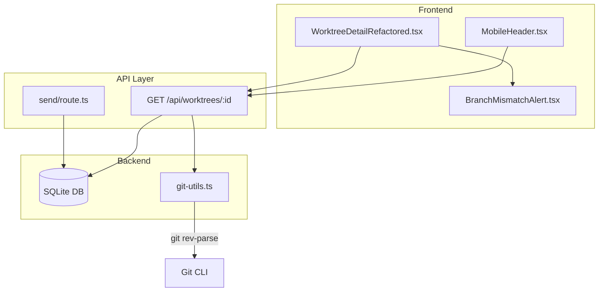
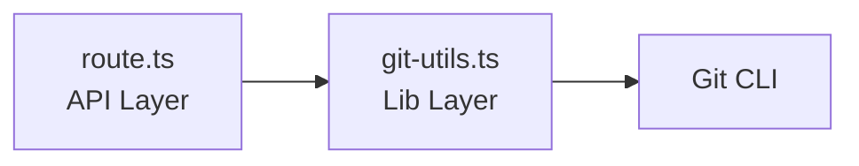

# 設計方針書: Issue #111 現在の作業ブランチ可視化機能

## 1. 概要

### 1.1 目的
セッション中の作業ブランチを可視化し、ブランチ切り替わり時にユーザーへ警告を表示する機能を実装する。

### 1.2 背景
- Claude Codeが意図せずブランチを切り替えるケースが多い
- 誤ったブランチでの作業は不具合を生じやすい
- 現状はワークツリー名がセッション開始時のブランチ名として表示されるのみ

### 1.3 スコープ
- **対象**: ワークツリー詳細画面のヘッダー、モバイルヘッダー
- **除外**: `aheadBehind`フィールド（リモートとの差分）は別Issue

---

## 2. アーキテクチャ設計

### 2.1 システム構成図



### 2.2 データフロー

1. **セッション開始時**: `send/route.ts`でセッション開始後、`initial_branch`をDBに保存
2. **ポーリング時**: `GET /api/worktrees/:id`でgitコマンド実行、`gitStatus`を返却
3. **フロントエンド**: `isBranchMismatch`がtrueの場合、警告コンポーネントを表示

---

## 3. DBスキーマ設計

### 3.1 Migration #15

**Migration名**: `add-initial-branch-column`

```sql
ALTER TABLE worktrees ADD COLUMN initial_branch TEXT;
```

| カラム名 | 型 | 説明 |
|---------|-----|------|
| initial_branch | TEXT | セッション開始時のブランチ名（NULL許可） |

### 3.2 実装詳細

- **CURRENT_SCHEMA_VERSION**: 14 → 15
- **既存データ**: `initial_branch = NULL`（後方互換性維持）
- **保存タイミング**: `send/route.ts`内の`startSession()`呼び出し直後

**Rollback手順（down関数）**:
```typescript
// SQLiteはALTER TABLE DROP COLUMNをサポートしないため、テーブル再作成が必要
down: (db) => {
  db.exec(`
    -- 1. バックアップテーブル作成（initial_branch以外のカラム）
    CREATE TABLE worktrees_backup AS
    SELECT id, name, path, repository_path, repository_name, description,
           last_user_message, last_user_message_at, favorite, status,
           link, cli_tool_id, updated_at, last_viewed_at
    FROM worktrees;

    -- 2. 元テーブル削除
    DROP TABLE worktrees;

    -- 3. テーブル再作成（initial_branchカラムなし）
    CREATE TABLE worktrees (...);  -- 既存スキーマ

    -- 4. データ復元
    INSERT INTO worktrees SELECT * FROM worktrees_backup;

    -- 5. バックアップ削除
    DROP TABLE worktrees_backup;
  `);
}
```

> **参考**: Migration #7, #8のdown()パターンを参照。

### 3.3 DB操作関数（SRP準拠）

```typescript
// src/lib/db.ts に追加
/**
 * セッション開始時の初期ブランチを保存
 * @remarks send/route.ts からはこの関数を呼び出すのみ（責務分離）
 */
export function saveInitialBranch(
  db: Database.Database,
  worktreeId: string,
  branchName: string
): void;

/**
 * ワークツリーの初期ブランチを取得
 */
export function getInitialBranch(
  db: Database.Database,
  worktreeId: string
): string | null;
```

**SQL実装例（SQLインジェクション防止）**:
```typescript
// src/lib/db.ts - プリペアドステートメント使用
export function saveInitialBranch(
  db: Database.Database,
  worktreeId: string,
  branchName: string
): void {
  db.prepare('UPDATE worktrees SET initial_branch = ? WHERE id = ?')
    .run(branchName, worktreeId);
}
```

> **設計意図**: ブランチ保存ロジックを`db.ts`に集約し、`send/route.ts`の責務過多を防止（SRP準拠）。

---

## 4. 型定義設計

### 4.1 GitStatus interface

```typescript
// src/types/models.ts
/**
 * Git status information for a worktree
 *
 * @remarks
 * 新規フィールド追加時は全てオプショナル (?) とすること（後方互換性維持）
 *
 * @future 将来の拡張候補:
 * - aheadBehind?: { ahead: number; behind: number } - リモートとの差分（別Issue対応）
 * - stashCount?: number - スタッシュ数
 * - lastCommitMessage?: string - 最新コミットメッセージ
 */
export interface GitStatus {
  /** 現在のgitブランチ名 (e.g., "main", "feature/xxx", "(detached HEAD)", "(unknown)") */
  currentBranch: string;
  /** セッション開始時のブランチ名（未記録時null） */
  initialBranch: string | null;
  /** currentBranchとinitialBranchが異なる場合true */
  isBranchMismatch: boolean;
  /** 短縮コミットハッシュ (e.g., "abc1234") */
  commitHash: string;
  /** 未コミット変更があるかどうか */
  isDirty: boolean;
}
```

> **拡張ポリシー**: 将来フィールド追加時は全てオプショナル (?) とし、後方互換性を維持すること。

### 4.2 Worktree interface拡張

```typescript
export interface Worktree {
  // ... 既存フィールド
  gitStatus?: GitStatus; // オプショナル（後方互換性）
}
```

---

## 5. API設計

### 5.1 GET /api/worktrees/:id 拡張

**レイヤー間依存関係（DIP準拠）**:



- **route.ts**: `getGitStatus(worktreePath)` 関数を呼び出すのみ
- **git-utils.ts**: gitコマンド実行の詳細をカプセル化

**レスポンス構造（既存パターンに追加）**:
```typescript
// 既存のスプレッドパターンにgitStatusを追加
return NextResponse.json({
  ...worktree,
  gitStatus,  // 追加フィールド
  isSessionRunning: anyRunning,
  isWaitingForResponse: anyWaiting,
  isProcessing: anyProcessing,
  sessionStatusByCli,
});
```

**WorktreeResponse型**:
```typescript
interface WorktreeResponse {
  // 既存フィールド（id は string 型）
  id: string;  // NOTE: number ではなく string
  name: string;
  path: string;
  // ...

  // 追加フィールド
  gitStatus?: GitStatus;
}
```

**git-utils.ts API**:
```typescript
// src/lib/git-utils.ts
export async function getGitStatus(worktreePath: string, initialBranch: string | null): Promise<GitStatus>;
```

### 5.2 エラーハンドリング

| 状態 | currentBranch | isBranchMismatch | 備考 |
|------|--------------|------------------|------|
| 正常 | ブランチ名 | true/false | 通常の比較 |
| detached HEAD | `(detached HEAD)` | false | 警告表示しない |
| gitコマンド失敗 | `(unknown)` | false | 警告表示しない |
| タイムアウト | キャッシュ値 or `(unknown)` | false | 警告表示しない |

### 5.3 パフォーマンス対策

- **タイムアウト**: gitコマンド実行に1秒のタイムアウト設定
- **想定オーバーヘッド**: 10-50ms/回（ローカルディスク）
- **タイムアウト値の根拠**: ローカルSSD想定で10-50ms、10倍マージンで1秒を設定
- **タイムアウト時のユーザーフィードバック**: ブランチ情報は `(unknown)` と表示、アラートは表示しない

### 5.4 API応答サイズ評価

**gitStatusフィールドサイズ**:
```json
{
  "gitStatus": {
    "currentBranch": "feature/xxx",      // ~20-50 bytes
    "initialBranch": "main",              // ~10-20 bytes
    "isBranchMismatch": true,             // ~20 bytes
    "commitHash": "abc1234",              // ~15 bytes
    "isDirty": false                      // ~15 bytes
  }
}
```
- **想定サイズ**: 100-200 bytes/response
- **帯域消費**: ポーリング2秒間隔 × 200 bytes = 100 bytes/秒 = **360 KB/時間**
- **モバイル影響**: 4G環境では問題なし。低速3G環境でも許容範囲内。

---

## 6. フロントエンド設計

### 6.1 BranchMismatchAlert.tsx

**Props Interface（ISP準拠）**:
```typescript
// gitStatus全体ではなく必要なフィールドのみを受け取る
interface BranchMismatchAlertProps {
  /** ブランチ不一致かどうか */
  isBranchMismatch: boolean;
  /** 現在のブランチ名 */
  currentBranch: string;
  /** セッション開始時のブランチ名 */
  initialBranch: string | null;
}
```

| 項目 | 内容 |
|------|------|
| 表示条件 | `isBranchMismatch === true && !dismissed` |
| 配置場所 | DesktopHeader と flex-1 div（WorktreeDesktopLayout含む）の間 |
| スタイル | 警告色（amber/yellow）、AlertTriangle アイコン |
| アニメーション | なし（点滅は視認性低下のため） |
| 閉じるボタン | あり |
| 再表示条件 | ブランチ再変更時（`currentBranch`変更時に`dismissed`自動リセット）、画面リロード時 |

### 6.2 状態管理（KISS準拠・簡素化版）

```typescript
// BranchMismatchAlert内部 - シンプルな状態管理
const [dismissed, setDismissed] = useState(false);

// currentBranchが変わったらdismissedを自動リセット
useEffect(() => {
  setDismissed(false);
}, [currentBranch]);

// シンプルな表示条件
const showAlert = isBranchMismatch && !dismissed;
```

> **設計意図**: `previousBranch`状態は不要。`useEffect`でブランチ変更を検知し、`dismissed`をリセットするだけで十分。

---

## 7. 設計原則への準拠

### 7.1 SOLID原則

| 原則 | 適用 |
|------|------|
| SRP | GitStatus取得、DB操作、UI表示を分離 |
| OCP | GitStatus interfaceで拡張可能 |
| LSP | Worktreeの既存動作を維持（gitStatusオプショナル） |
| ISP | GitStatusは必要なフィールドのみ定義 |
| DIP | git操作を抽象化（git-utils.ts） |

### 7.2 KISS原則

- 単純な文字列比較でブランチ不一致を検出
- 複雑なキャッシュ機構は将来の最適化として別Issue

### 7.3 YAGNI原則

- `aheadBehind`（リモート差分）はスコープ外
- 自動ブランチ切り替えは将来検討

### 7.4 DRY原則

- gitコマンド実行を`git-utils.ts`に集約
- エラーハンドリングパターンを統一

---

## 8. セキュリティ設計

### 8.1 コマンドインジェクション対策

```typescript
// 安全なgitコマンド実行
const { execFile } = require('child_process');
execFile('git', ['rev-parse', '--abbrev-ref', 'HEAD'], {
  cwd: worktreePath,
  timeout: 1000
});
```

- `execFile`使用（シェル解釈なし）
- 引数は固定文字列のみ
- ユーザー入力はコマンドに含めない

> **Note**: 既存の`worktrees.ts`は`exec()`を使用している（シェル解釈あり）。
> git-utils.tsでは`execFile()`を採用し、新規コードではより安全なパターンを使用する。
> worktreePath はDBから取得した信頼できる値のため、既存コードの`exec()`も許容範囲内。
> 将来的には`worktrees.ts`も`execFile()`への移行を検討（別Issue）。

### 8.2 パストラバーサル対策

- `worktreePath`はDBから取得した値のみ使用
- 外部からのパス指定は受け付けない

**信頼境界（Trust Boundary）の明示**:
```typescript
// src/lib/git-utils.ts
/**
 * ワークツリーのgitステータスを取得
 * @param worktreePath - DBから取得した信頼されたパス（ユーザー入力禁止）
 * @param initialBranch - DBから取得した初期ブランチ名（null許可）
 */
export async function getGitStatus(
  worktreePath: string,  // Trust: DB only
  initialBranch: string | null
): Promise<GitStatus>;
```

### 8.3 XSS対策

**ブランチ名表示のXSS防止**:
- Reactの自動エスケープ機能に依存（JSX内の変数は自動エスケープされる）
- `dangerouslySetInnerHTML`の使用禁止
- ブランチ名はgitコマンド出力から直接取得（安全な経路）

```tsx
// ✅ 安全: Reactが自動エスケープ
<span>{gitStatus.currentBranch}</span>

// ❌ 禁止: XSSリスク
<span dangerouslySetInnerHTML={{ __html: gitStatus.currentBranch }} />
```

### 8.4 エラーログ方針

**クライアントへの情報漏洩防止**:
- エラー詳細（スタックトレース、パス情報）はサーバーログのみに出力
- クライアントには汎用エラー値 `(unknown)` のみを返却
- worktreePathがログに含まれる場合、センシティブ情報として扱う

```typescript
// git-utils.ts内のエラーハンドリング例
try {
  // git command execution
} catch (error) {
  // サーバーログ（詳細）
  console.error(`[git-utils] Failed to get branch for ${worktreeId}:`, error);
  // クライアントレスポンス（汎用値）
  return { currentBranch: '(unknown)', isBranchMismatch: false, ... };
}
```

---

## 9. テスト設計

### 9.1 新規テスト

| テストファイル | 内容 |
|---------------|------|
| `tests/unit/db-migrations.test.ts` | Migration #15のテスト |
| `tests/unit/git-utils.test.ts` | gitコマンド実行・タイムアウト・エラーハンドリング |
| `tests/unit/components/BranchMismatchAlert.test.tsx` | 表示条件・閉じるボタン・再表示ロジック |
| `tests/integration/api-worktrees-git-status.test.ts` | gitStatusレスポンス検証 |

### 9.2 既存テスト修正

| テストファイル | 修正内容 |
|---------------|---------|
| `tests/unit/db.test.ts` | gitStatusフィールドのundefinedケースカバー |
| `tests/integration/api-worktrees.test.ts` | gitStatusフィールド存在/非存在テスト |

> **互換性**: gitStatusはオプショナルフィールドのため、既存テストは基本的にパスする。
> 明示的にgitStatus非存在ケースをカバーするテストを追加推奨。

### 9.3 git-utils.tsモック戦略

```typescript
// tests/unit/git-utils.test.ts
import { vi } from 'vitest';
import { execFile } from 'child_process';

vi.mock('child_process', () => ({
  execFile: vi.fn()
}));

describe('getGitStatus', () => {
  it('正常系: ブランチ名取得', async () => {
    (execFile as Mock).mockImplementation((cmd, args, opts, cb) => {
      cb(null, 'feature/test\n', '');
    });
    // ...
  });

  it('タイムアウト: (unknown)を返す', async () => {
    (execFile as Mock).mockImplementation((cmd, args, opts, cb) => {
      const err = new Error('ETIMEDOUT');
      (err as any).code = 'ETIMEDOUT';
      cb(err, '', '');
    });
    // ...
  });
});
```

---

## 10. 影響範囲

| ファイル | 変更内容 |
|---------|---------|
| `src/lib/db-migrations.ts` | Migration #15追加、VERSION 15更新 |
| `src/types/models.ts` | GitStatus interface追加、Worktree拡張 |
| `src/lib/db.ts` | 初期ブランチ保存・取得関数 |
| `src/lib/git-utils.ts` | **新規**: gitコマンド実行ユーティリティ |
| `src/app/api/worktrees/[id]/route.ts` | gitStatus取得・返却 |
| `src/app/api/worktrees/[id]/send/route.ts` | initial_branch保存 |
| `src/components/worktree/WorktreeDetailRefactored.tsx` | ブランチ表示UI |
| `src/components/mobile/MobileHeader.tsx` | モバイル用ブランチ表示 |
| `src/components/worktree/BranchMismatchAlert.tsx` | **新規**: 警告コンポーネント |
| `CLAUDE.md` | 最近の実装機能セクション更新 |

---

## 11. 実装タスク

1. **Task 1**: DBマイグレーション（Migration #15）
2. **Task 2**: 型定義追加（GitStatus, Worktree拡張）
3. **Task 3**: git-utils.ts作成（gitコマンド実行）
4. **Task 4**: initial_branch保存処理（send/route.ts）
5. **Task 5**: API拡張（GET /api/worktrees/:id）
6. **Task 6**: BranchMismatchAlert.tsx作成
7. **Task 7**: ヘッダー統合（Desktop/Mobile）
8. **Task 8**: テスト追加
9. **Task 9**: CLAUDE.md更新

---

## 12. 設計上のトレードオフ

| 決定事項 | 採用理由 | トレードオフ |
|---------|---------|-------------|
| 既存API拡張 | ポーリング処理変更不要 | レスポンスサイズ微増 |
| gitStatusオプショナル | 後方互換性維持 | 型チェック時の?.必要 |
| タイムアウト1秒 | UX優先 | 遅いストレージでの失敗可能性 |
| アラート非点滅 | 視認性・アクセシビリティ | 見逃しリスク微増 |

---

## 版数履歴

| 版数 | 日付 | 変更内容 |
|-----|------|---------|
| 1.0 | 2026-02-02 | 初版作成 |
| 1.1 | 2026-02-02 | Stage 1 設計原則レビュー指摘対応 |
| 1.2 | 2026-02-02 | Stage 2 整合性レビュー指摘対応 |
| 1.3 | 2026-02-02 | Stage 3 影響分析レビュー指摘対応 |
| 1.4 | 2026-02-02 | Stage 4 セキュリティレビュー指摘対応 |

---

## Review History

### Stage 1 Review (2026-02-02) - 設計原則レビュー

| ID | 優先度 | 対応内容 |
|----|--------|----------|
| MF-1 | Must Fix | API層のDIP準拠: route.tsからgit-utils.ts呼び出しに変更、レイヤー間依存関係を明記 |
| MF-2 | Must Fix | BranchMismatchAlert状態管理をKISS準拠に簡素化: previousBranch削除、useEffectでdismissedリセット |
| SF-1 | Should Fix | tmux.tsとの exec/execFile 差異を備考として記録（別Issue対応） |
| SF-2 | Should Fix | send/route.tsのSRP改善: saveInitialBranch関数をdb.tsに切り出し |
| SF-3 | Should Fix | GitStatus interfaceに将来拡張候補をJSDocで明記、拡張ポリシーを追加 |

### Stage 2 Review (2026-02-02) - 整合性レビュー

| ID | 優先度 | 対応内容 |
|----|--------|----------|
| CON-MF-001 | Must Fix | exec vs execFile の差異をセクション8.1に明記、worktrees.ts との整合性を説明 |
| CON-MF-002 | Must Fix | セクション5.1のWorktree id型を number → string に修正 |
| CON-SF-001 | Should Fix | セクション3.1にMigration名 'add-initial-branch-column' を追加 |
| CON-SF-003 | Should Fix | セクション5.1にレスポンス構造（既存スプレッドパターンへの追加）を明記 |
| CON-SF-004 | Should Fix | セクション6.1のBranchMismatchAlert配置場所を具体化 |

### Stage 3 Review (2026-02-02) - 影響分析レビュー

| ID | 優先度 | 対応内容 |
|----|--------|----------|
| IMP-MF-001 | Must Fix | セクション3.2にMigration #15のdown()関数（rollback手順）を追加 |
| IMP-MF-002 | Must Fix | セクション5.4にAPI応答サイズの定量的評価を追加（100-200 bytes, 360 KB/時間） |
| IMP-SF-001 | Should Fix | セクション9.2に既存テスト互換性の説明を追加 |
| IMP-I-002 | Info | セクション9.3にgit-utils.tsのモック戦略を追加 |

### Stage 4 Review (2026-02-02) - セキュリティレビュー

| ID | 優先度 | 対応内容 |
|----|--------|----------|
| SEC-MF-001 | Must Fix | セクション8.4にエラーログ方針を追加（クライアントへの情報漏洩防止） |
| SEC-MF-002 | Must Fix | セクション8.3にXSS対策を追加（React自動エスケープ依存、dangerouslySetInnerHTML禁止） |
| SEC-SF-001 | Should Fix | セクション8.2に信頼境界（Trust Boundary）の明示を追加 |
| SEC-SF-002 | Should Fix | セクション3.3にSQL実装例（プリペアドステートメント）を追加 |
| SEC-SF-003 | Should Fix | セクション5.3にタイムアウト値の根拠を追加 |

---

*Generated by /design-policy command*
