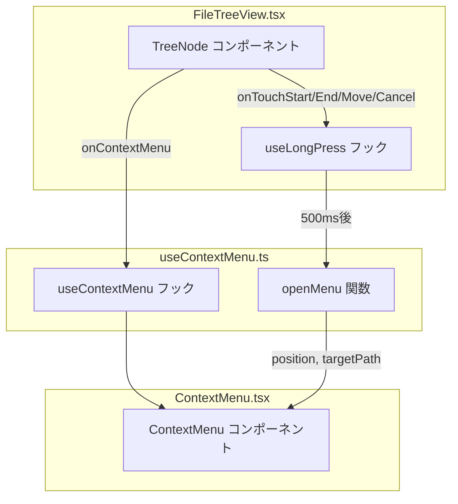
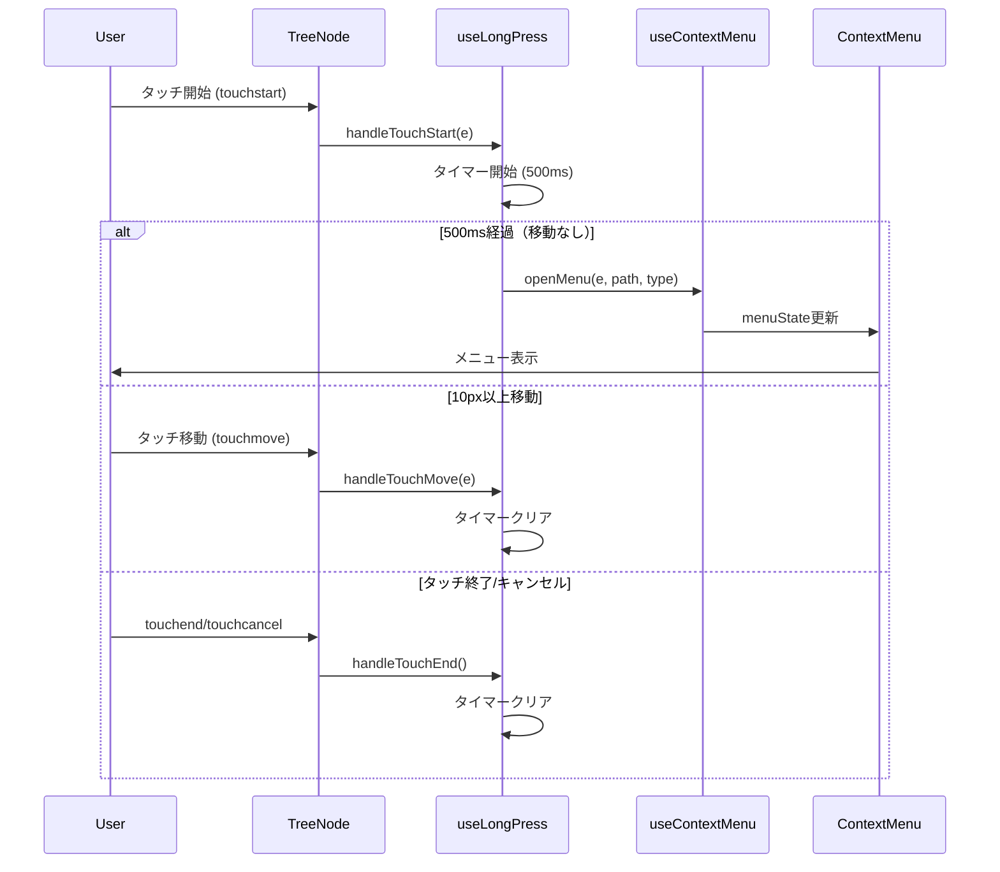
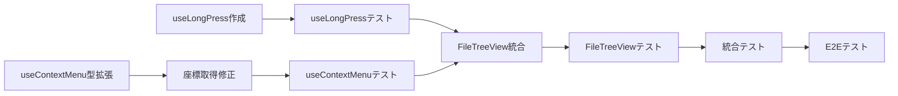

# Issue #123 iPad タッチ対応コンテキストメニュー 設計方針書

## 1. 概要

### 1.1. 背景
iPadでファイルツリーを長押ししてもコンテキストメニューが表示されない問題を解決する。
iPad Safari/Chromeでは`onContextMenu`イベントが長押しでトリガーされない仕様のため、タッチイベントベースの長押し検出を実装する必要がある。

### 1.2. 目的
- iPadおよびiPhoneでタッチ長押しによりコンテキストメニューを表示可能にする
- PC（マウス右クリック）の既存動作を維持する
- 既存コードへの影響を最小限に抑える

### 1.3. スコープ
| 対象 | 説明 |
|------|------|
| 対象デバイス | iPad Safari/Chrome, iPhone Safari/Chrome |
| 対象機能 | FileTreeViewのコンテキストメニュー |
| スコープ外 | Android、キーボードナビゲーション、触覚フィードバック |

---

## 2. アーキテクチャ設計

### 2.1. コンポーネント構成図



### 2.2. データフロー



### 2.3. レイヤー構成

| レイヤー | ファイル | 責務 |
|---------|---------|------|
| プレゼンテーション | `FileTreeView.tsx` | UIレンダリング、イベントバインディング |
| フック | `useLongPress.ts` (新規) | 長押し検出ロジック |
| フック | `useContextMenu.ts` | メニュー状態管理 |
| コンポーネント | `ContextMenu.tsx` | メニュー表示 |

---

## 3. 技術選定

### 3.1. 技術スタック

| カテゴリ | 技術 | 選定理由 |
|---------|------|---------|
| イベント処理 | React合成イベント | 既存パターンとの整合性 |
| 状態管理 | useRef + useCallback | パフォーマンス最適化 |
| タイマー | setTimeout/clearTimeout | 標準API、シンプル |
| 型定義 | TypeScript | 既存技術スタック |

### 3.2. 代替案との比較

| 選択肢 | メリット | デメリット | 採用 |
|--------|---------|----------|------|
| **useLongPressフック (新規)** | 再利用可能、テスト容易 | ファイル追加 | ✅ |
| TreeNode内に直接実装 | ファイル追加なし | 可読性低下、テスト困難 | ❌ |
| サードパーティライブラリ | 検証済み | 依存追加、バンドルサイズ増 | ❌ |

---

## 4. 設計パターン

### 4.1. Custom Hook パターン

長押し検出ロジックを`useLongPress`フックとして分離し、再利用性とテスト容易性を確保。

```typescript
// src/hooks/useLongPress.ts
export interface UseLongPressOptions {
  /** 長押し検出までの時間（ms） */
  delay?: number;
  /** 移動キャンセル閾値（px） */
  moveThreshold?: number;
  /** 長押し検出時のコールバック */
  onLongPress: (e: React.TouchEvent) => void;
}

export interface UseLongPressReturn {
  onTouchStart: (e: React.TouchEvent) => void;
  onTouchMove: (e: React.TouchEvent) => void;
  onTouchEnd: () => void;
  onTouchCancel: () => void;
}

export function useLongPress(options: UseLongPressOptions): UseLongPressReturn;
```

### 4.2. Union Type パターン

`useContextMenu`の`openMenu`関数をマウスイベントとタッチイベントの両方に対応させる。

```typescript
// Before
openMenu: (e: React.MouseEvent, path: string, type: 'file' | 'directory') => void;

// After
openMenu: (e: React.MouseEvent | React.TouchEvent, path: string, type: 'file' | 'directory') => void;
```

### 4.3. 定数抽出パターン

閾値を定数として定義し、テストとメンテナンスを容易にする。

```typescript
// src/hooks/useLongPress.ts
export const LONG_PRESS_DELAY = 500; // ms
export const MOVE_THRESHOLD = 10; // px
```

---

## 5. 詳細設計

### 5.1. useLongPress フック

```typescript
// src/hooks/useLongPress.ts
'use client';

import { useRef, useCallback, useEffect } from 'react';

export const LONG_PRESS_DELAY = 500;
export const MOVE_THRESHOLD = 10;

export interface UseLongPressOptions {
  delay?: number;
  moveThreshold?: number;
  onLongPress: (e: React.TouchEvent) => void;
}

export interface UseLongPressReturn {
  onTouchStart: (e: React.TouchEvent) => void;
  onTouchMove: (e: React.TouchEvent) => void;
  onTouchEnd: () => void;
  onTouchCancel: () => void;
}

export function useLongPress({
  delay = LONG_PRESS_DELAY,
  moveThreshold = MOVE_THRESHOLD,
  onLongPress,
}: UseLongPressOptions): UseLongPressReturn {
  const timerRef = useRef<ReturnType<typeof setTimeout> | null>(null);
  const startPosRef = useRef<{ x: number; y: number } | null>(null);
  const touchEventRef = useRef<React.TouchEvent | null>(null);

  // クリーンアップ関数
  const clearTimer = useCallback(() => {
    if (timerRef.current) {
      clearTimeout(timerRef.current);
      timerRef.current = null;
    }
    startPosRef.current = null;
    touchEventRef.current = null;
  }, []);

  // コンポーネントアンマウント時のクリーンアップ
  useEffect(() => {
    return () => clearTimer();
  }, [clearTimer]);

  const onTouchStart = useCallback(
    (e: React.TouchEvent) => {
      if (e.touches.length !== 1) return;

      const touch = e.touches[0];
      startPosRef.current = { x: touch.clientX, y: touch.clientY };
      touchEventRef.current = e;

      timerRef.current = setTimeout(() => {
        if (touchEventRef.current) {
          onLongPress(touchEventRef.current);
        }
        clearTimer();
      }, delay);
    },
    [delay, onLongPress, clearTimer]
  );

  const onTouchMove = useCallback(
    (e: React.TouchEvent) => {
      if (!startPosRef.current || e.touches.length !== 1) return;

      const touch = e.touches[0];
      const dx = touch.clientX - startPosRef.current.x;
      const dy = touch.clientY - startPosRef.current.y;
      const distance = Math.sqrt(dx * dx + dy * dy);

      if (distance > moveThreshold) {
        clearTimer();
      }
    },
    [moveThreshold, clearTimer]
  );

  const onTouchEnd = useCallback(() => {
    clearTimer();
  }, [clearTimer]);

  const onTouchCancel = useCallback(() => {
    clearTimer();
  }, [clearTimer]);

  return {
    onTouchStart,
    onTouchMove,
    onTouchEnd,
    onTouchCancel,
  };
}
```

### 5.2. useContextMenu 変更

```typescript
// src/hooks/useContextMenu.ts - 変更箇所

// 型定義の変更（行39付近）
export interface UseContextMenuReturn {
  menuState: ContextMenuState;
  openMenu: (
    e: React.MouseEvent | React.TouchEvent,
    path: string,
    type: 'file' | 'directory'
  ) => void;
  closeMenu: () => void;
  resetMenu: () => void;
}

// openMenu関数の変更（行85-96付近）
const openMenu = useCallback(
  (e: React.MouseEvent | React.TouchEvent, path: string, type: 'file' | 'directory') => {
    e.preventDefault();

    // タッチイベントとマウスイベントで座標取得方法を分岐
    let x: number, y: number;
    if ('touches' in e && e.touches.length > 0) {
      x = e.touches[0].clientX;
      y = e.touches[0].clientY;
    } else if ('clientX' in e) {
      x = e.clientX;
      y = e.clientY;
    } else {
      return; // 座標取得不可
    }

    setMenuState({
      isOpen: true,
      position: { x, y },
      targetPath: path,
      targetType: type,
    });
  },
  []
);
```

### 5.3. FileTreeView 変更

```typescript
// src/components/worktree/FileTreeView.tsx - TreeNode内の変更

// TreeNodePropsインターフェースへの追加（行59-76付近）
interface TreeNodeProps {
  // ... 既存props
  // 【Stage 2 DISC-002対応】onContextMenu型をTouchEvent対応に拡張
  onContextMenu?: (
    e: React.MouseEvent | React.TouchEvent,
    path: string,
    type: 'file' | 'directory'
  ) => void;
  // 長押し検出用タッチイベントハンドラ（オプショナル）
  onTouchStart?: (e: React.TouchEvent) => void;
  onTouchMove?: (e: React.TouchEvent) => void;
  onTouchEnd?: () => void;
  onTouchCancel?: () => void;
}

// TreeNode内でuseLongPressを使用
const TreeNode = memo(function TreeNode({
  // ... 既存props
}: TreeNodeProps) {
  // ... 既存コード

  // 【Stage 2 REC-003対応】handleContextMenuの型をTouchEvent対応に拡張
  const handleContextMenu = useCallback(
    (e: React.MouseEvent | React.TouchEvent) => {
      e.preventDefault();
      onContextMenu?.(e, fullPath, isDirectory ? 'directory' : 'file');
    },
    [fullPath, isDirectory, onContextMenu]
  );

  // 長押しハンドラ
  const handleLongPress = useCallback(
    (e: React.TouchEvent) => {
      onContextMenu?.(e, fullPath, isDirectory ? 'directory' : 'file');
    },
    [fullPath, isDirectory, onContextMenu]
  );

  const longPressHandlers = useLongPress({
    onLongPress: handleLongPress,
  });

  // div要素への追加（行292-302付近）
  return (
    <>
      <div
        // ... 既存属性
        onContextMenu={handleContextMenu}
        onTouchStart={longPressHandlers.onTouchStart}
        onTouchMove={longPressHandlers.onTouchMove}
        onTouchEnd={longPressHandlers.onTouchEnd}
        onTouchCancel={longPressHandlers.onTouchCancel}
        style={{
          ...indentStyle,
          WebkitTouchCallout: 'none',
          touchAction: 'manipulation',
        }}
      >
        {/* ... 既存コンテンツ */}
      </div>
      {/* ... 子要素 */}
    </>
  );
});
```

---

## 6. セキュリティ設計

### 6.1. 考慮事項

| リスク | 対策 | 影響度 |
|--------|------|--------|
| XSS | 既存のReact自動エスケープを維持 | 低 |
| イベントハイジャック | 標準イベントハンドラのみ使用 | 低 |
| DoS（タイマー大量生成） | useEffectクリーンアップで適切に解放 | 低 |

### 6.2. 検証項目

- [x] ユーザー入力は直接DOMに挿入されない
- [x] タイマーはコンポーネントアンマウント時にクリア
- [x] 外部URLへのアクセスなし
- [x] 認証/認可への影響なし

### 6.3. Stage 4 セキュリティレビュー結果（OWASP Top 10評価）

| カテゴリ | 評価 | 備考 |
|----------|------|------|
| Injection | PASS | ユーザー入力は直接実行されない。タッチ座標は数値のみ |
| Broken Authentication | N/A | 認証機構への影響なし |
| Sensitive Data Exposure | PASS | タッチイベント処理で機密データを扱わない |
| XML External Entities | N/A | XML処理なし |
| Broken Access Control | N/A | ファイル操作は既存ContextMenuのアクセス制御を使用 |
| Security Misconfiguration | PASS | 標準ブラウザTouch APIを使用、設定変更なし |
| XSS | PASS | 座標は数値プリミティブ。ユーザー制御文字列はDOMに挿入されない |
| Insecure Deserialization | N/A | 外部データのデシリアライズなし |
| Insufficient Logging | PASS | クライアントサイドUI操作。セキュリティ関連ログ不要 |
| DoS | PASS | useEffectでタイマー適切にクリーンアップ。1タッチにつき1タイマー |

### 6.4. セキュリティ詳細分析結果

#### XSS分析
| 項目 | 状態 | 詳細 |
|------|------|------|
| タッチ座標の安全性 | SAFE | clientX/clientYはTouchEventの読み取り専用数値プロパティ。実行可能コードを含まない |
| DOM操作の安全性 | SAFE | メニュー位置はReact styleプロップで設定。Reactが値をエスケープ |
| 既存セーフガード | 維持 | React自動エスケープ、rehype-sanitize、セキュリティ境界に変更なし |

#### Injection分析
| 項目 | 状態 | 詳細 |
|------|------|------|
| イベントハンドラ安全性 | SAFE | イベントハンドラはReact.TouchEventオブジェクトを受け取る。文字列解析やeval()なし |
| 型ガード安全性 | SAFE | `'touches' in e`型ガードは安全なランタイムチェック。ユーザー入力を実行しない |

#### DoS分析
| 項目 | 状態 | 詳細 |
|------|------|------|
| タイマー管理 | SAFE | タッチジェスチャごとに1つのsetTimeout。touchend/touchcancel/unmountでクリア |
| メモリリーク防止 | SAFE | タイマー/位置格納にuseRef使用。アンマウント時にガベージコレクション対象 |
| リソース制限 | SAFE | 同時に1つのタイマーのみアクティブ。timerRef.currentを新規作成前にチェック |

#### イベントハイジャック分析
| 項目 | 状態 | 詳細 |
|------|------|------|
| 標準API使用 | SAFE | 標準React合成イベント使用。直接DOMイベント操作なし |
| イベント伝播 | SAFE | e.preventDefault()でネイティブ長押し動作を防止。他のイベントハンドラに干渉しない |

#### クリックジャッキング分析
| 項目 | 状態 | 詳細 |
|------|------|------|
| タッチ意図確認 | SAFE | 500ms遅延と10px移動閾値で誤操作を防止。意図的な長押しが必要 |
| 視覚的フィードバック | SAFE | コンテキストメニューはタッチ位置に表示。隠れたUI要素なし |

### 6.5. リスク評価サマリー

| 評価項目 | レベル |
|----------|--------|
| 技術リスク | Low |
| セキュリティリスク | Low |
| 運用リスク | Low |
| 総合評価 | Low |

### 6.6. 考慮事項（SEC-CONSIDER-001）

**タイトル:** タッチ座標検証コメント

**説明:** openMenu関数内でclientX/clientYがブラウザTouch APIからの安全な数値であることを説明するコメントの追加を検討。

**優先度:** P3

**理由:** セキュリティ観点をレビューする将来のメンテナーにとってコードの明確性が向上する。

---

## 7. パフォーマンス設計

### 7.1. 最適化ポイント

| 項目 | 対策 | 効果 |
|------|------|------|
| 再レンダリング防止 | useCallback/useMemo使用 | TreeNode個別レンダリング回避 |
| メモリリーク防止 | useEffectクリーンアップ | タイマー解放 |
| イベントハンドラ | 関数参照の安定化 | 不要なリスナー再登録防止 |

### 7.2. 計測項目

- [ ] タッチ操作時のFPS（60fps維持）
- [ ] メモリ使用量（タイマー生成/破棄サイクル）
- [ ] 長押し検出のレイテンシ（500ms ± 50ms）

---

## 8. テスト設計

### 8.1. ユニットテスト

```typescript
// tests/unit/hooks/useLongPress.test.ts
describe('useLongPress', () => {
  it('500ms後にonLongPressが呼ばれる', async () => {});
  it('10px以上移動でタイマーがクリアされる', () => {});
  it('touchendでタイマーがクリアされる', () => {});
  it('touchcancelでタイマーがクリアされる', () => {});
  it('アンマウント時にタイマーがクリアされる', () => {});
  it('マルチタッチ（2本指以上）では発火しない', () => {});
});

// tests/unit/hooks/useContextMenu.test.ts
describe('useContextMenu', () => {
  it('TouchEventでopenMenuを呼び出せる', () => {});
  it('タッチ座標からメニュー位置が設定される', () => {});
});

// tests/unit/components/worktree/FileTreeView.test.tsx
describe('FileTreeView touch support', () => {
  it('長押し（500ms）でコンテキストメニューが表示される', () => {});
  it('10px以上移動でメニューがキャンセルされる', () => {});
  it('タッチキャンセル時にタイマーがクリアされる', () => {});
  it('アンマウント時にタイマーがクリアされる', () => {});
});

// 【ADD-003対応】マウス右クリック既存動作のベースラインテスト
// tests/unit/components/worktree/FileTreeView.test.tsx（追加）
describe('FileTreeView mouse context menu', () => {
  it('マウス右クリックでコンテキストメニューが表示される', () => {});
  it('ファイル右クリックでファイルメニューが表示される', () => {});
  it('ディレクトリ右クリックでディレクトリメニューが表示される', () => {});
  it('右クリック座標にメニューが表示される', () => {});
});
```

### 8.2. 統合テスト

```typescript
// tests/integration/touch-context-menu.test.tsx
describe('Touch Context Menu Integration', () => {
  it('タッチ長押し→メニュー表示→項目選択の一連のフロー', () => {});
  it('マウス右クリックとタッチ長押しが共存する', () => {});
});
```

### 8.3. E2Eテスト

```typescript
// tests/e2e/touch-menu.spec.ts (Playwright)
test.describe('iPad Touch Menu', () => {
  test('長押しでコンテキストメニューが表示される', async ({ page }) => {
    // タッチエミュレーション使用
  });
});
```

---

## 9. 影響範囲

### 9.1. 変更ファイル一覧

| ファイル | 変更内容 | 影響度 |
|---------|---------|--------|
| `src/hooks/useLongPress.ts` | 新規作成 | - |
| `src/hooks/useContextMenu.ts` | 型定義拡張、座標取得ロジック追加 | 低 |
| `src/components/worktree/FileTreeView.tsx` | タッチイベントハンドラ追加、CSS追加 | 中 |

### 9.2. 依存コンポーネント（動作確認必要）

- `WorktreeDetailRefactored.tsx` - FileTreeViewの親
- `ContextMenu.tsx` - メニュー表示（変更不要）

### 9.3. 型定義への影響

- `ContextMenuState`型 - 変更不要（座標系同一）
- `TreeNodeProps`型 - 内部型のため外部影響なし

---

## 10. 実装計画

### 10.1. タスク分解

| # | タスク | 依存 | 見積 |
|---|--------|------|------|
| 1 | useLongPressフック作成 | - | S |
| 2 | useLongPressテスト作成 | 1 | S |
| 3 | useContextMenu型拡張 | - | XS |
| 4 | useContextMenu座標取得修正 | 3 | XS |
| 5 | useContextMenuテスト追加 | 4 | XS |
| 6 | FileTreeView統合 | 1,4 | S |
| 7 | FileTreeViewテスト追加 | 6 | S |
| 8 | 統合テスト | 7 | S |
| 9 | E2Eテスト（タッチエミュレーション） | 8 | M |

### 10.2. 実装順序



---

## 11. 受け入れ条件

### 11.1. 機能要件

- [ ] iPadで長押し（500ms以上）によりコンテキストメニューが表示される
- [ ] 長押し中に10px以上移動した場合はメニューが表示されない
- [ ] PC（マウス右クリック）の既存動作が維持される
- [ ] iPhone（iOS）でも同様に動作する
- [ ] タッチキャンセル時にタイマーが適切にクリアされる

### 11.2. 非機能要件

- [ ] コンポーネントアンマウント時にタイマーがクリアされる
- [ ] useCallback/useRefでハンドラを最適化
- [ ] 既存テストが全てパス
- [ ] 新規テストカバレッジ80%以上

---

## 12. 付録

### 12.1. 参照実装

- `src/components/worktree/PaneResizer.tsx` - タッチドラッグの参照パターン、getPosition関数（line 70-81）に座標取得ロジック（ADD-001）
- `src/components/mobile/MobilePromptSheet.tsx` - スワイプ操作の参照パターン、タッチイベントパターン整合性確認対象（ADD-002）

### 12.2. 外部参照

- [Apple HIG - Touch](https://developer.apple.com/design/human-interface-guidelines/gestures)
- [MDN touch-action](https://developer.mozilla.org/docs/Web/CSS/touch-action)
- [MDN TouchEvent](https://developer.mozilla.org/docs/Web/API/TouchEvent)

---

## 13. レビュー履歴

| 日付 | ステージ | 結果 | 対応内容 |
|------|---------|------|---------|
| 2026-02-04 | Stage 1（通常レビュー） | PASS_WITH_NOTE | SF-001, SF-002の検討結果を追記 |
| 2026-02-04 | Stage 2（整合性レビュー） | PASS_WITH_NOTES | DISC-002, REC-001, REC-003の指摘を反映 |
| 2026-02-04 | Stage 3（影響分析レビュー） | PASS_WITH_NOTES | ADD-001〜003、RR-001〜004の分析結果を反映 |
| 2026-02-04 | Stage 4（セキュリティレビュー） | APPROVED (5/5) | OWASP Top 10評価完了、SEC-CONSIDER-001を考慮事項として記録 |

---

## 14. レビュー指摘事項サマリー

### 14.1. Stage 1: 通常レビュー（設計原則）

| ID | 原則 | 重要度 | 指摘内容 | 対応方針 |
|----|------|--------|---------|---------|
| SF-001 | DRY | Medium | 座標取得ロジックのユーティリティ関数化検討 | YAGNI優先で現状維持、将来拡張時に検討 |
| SF-002 | ISP | Low | TreeNodePropsへのタッチイベントプロパティ追加方法 | スプレッド可能設計を検討したが現設計で進行 |

### 14.2. Stage 2: 整合性レビュー

| ID | カテゴリ | 重要度 | 指摘内容 | 対応方針 |
|----|----------|--------|---------|---------|
| DISC-001 | Interface Location | Low | TreeNodePropsへのタッチプロパティ追加は5.3節でオプショナルとして記載済み | 対応不要（設計意図は明確） |
| DISC-002 | onContextMenu Type | Medium | TreeNodeProps.onContextMenuの型更新が設計書に明示されていない | セクション5.3に型定義を追加 |
| REC-001 | 型更新 | Medium | TreeNodeProps.onContextMenuを`React.MouseEvent \| React.TouchEvent`に更新 | 実装時に対応、チェックリストに追加 |
| REC-003 | 型更新 | Low | handleContextMenuコールバック型の更新 | 実装時に対応、チェックリストに追加 |

### 14.3. Stage 3: 影響分析レビュー

| ID | カテゴリ | 重要度 | 指摘内容 | 対応方針 |
|----|----------|--------|---------|---------|
| ADD-001 | 既存パターン | Low | PaneResizer.tsxのgetPosition関数（line 70-81）が類似の座標取得ロジックを持つ | 将来event-utils.ts統合時の参照として記録、SF-001と関連 |
| ADD-002 | パターン整合性 | Low | MobilePromptSheet.tsxもタッチイベント使用、パターン整合性確認推奨 | 実装時にパターン整合性を確認 |
| ADD-003 | テストカバレッジ | Medium | 既存テストにコンテキストメニュー関連テストがない | マウス右クリックテストを追加（8.1節に反映） |

### 14.6. Stage 4: セキュリティレビュー

| ID | カテゴリ | 重要度 | 指摘内容 | 対応方針 |
|----|----------|--------|---------|---------|
| SEC-CONSIDER-001 | コード明確性 | Low | openMenu内でtouch座標が安全な数値であることを説明するコメント追加を検討 | 実装時に検討（6.6節に記録） |

#### OWASP Top 10評価結果サマリー

| 評価項目 | 結果 | 脆弱性数 |
|----------|------|---------|
| Injection | PASS | 0 |
| Authentication | N/A | - |
| Sensitive Data | PASS | 0 |
| XXE | N/A | - |
| Access Control | N/A | - |
| Misconfiguration | PASS | 0 |
| XSS | PASS | 0 |
| Deserialization | N/A | - |
| Logging | PASS | 0 |
| DoS | PASS | 0 |

**総合評価:** APPROVED (スコア: 5/5)

**結論:** 本設計はセキュリティ態勢が強固であり、脆弱性は特定されなかった。タッチ座標は本質的に安全な数値である。タイマー管理は適切なクリーンアップを伴うReactベストプラクティスに従っている。既存のセキュリティ対策（XSS保護、ファイルパスサニタイズ）は変更なく維持される。

### 14.4. Stage 3 リグレッションリスク評価

| ID | エリア | 説明 | 発生可能性 | 影響度 | 緩和策 |
|----|--------|------|-----------|--------|--------|
| RR-001 | マウス右クリック | 既存のマウス右クリック動作への影響 | Low | High | Union型使用により後方互換性確保。既存テストで回帰確認必須 |
| RR-002 | スクロールとの競合 | 長押し検出とスクロール操作の競合 | Medium | Medium | 10px移動閾値でスクロール開始時にキャンセル。touchAction: 'manipulation'でブラウザデフォルト制御 |
| RR-003 | TreeNodeパフォーマンス | タッチイベントハンドラ追加による再レンダリング増加 | Low | Low | useCallback使用でハンドラ参照安定化。TreeNodeはmemo化済み |
| RR-004 | z-index競合 | コンテキストメニュー表示時のModal/Editorとの重なり | Low | Low | 既存z-index管理（z-50 for ContextMenu）を維持。変更なし |

### 14.5. Stage 2 評価結果

#### 整合性チェック結果

| カテゴリ | 評価 | 備考 |
|----------|------|------|
| ファイルパス正確性 | PASS | 参照されるファイルパスは全て正確 |
| 行番号正確性 | WARNING | 行番号は概算値として扱う（コード変更で変動の可能性） |
| 型定義整合性（UseContextMenuReturn） | NEEDS_ATTENTION | Union型拡張は後方互換性あり（DISC-002で対応） |
| 型定義整合性（TreeNodeProps） | PASS | 設計通りオプショナルプロパティで追加可能 |
| 既存パターン整合性（PaneResizer） | PASS | タッチ座標取得パターンは既存実装と一貫性あり |
| 既存パターン整合性（ContextMenuState） | PASS | 既存型定義と完全一致 |
| Reactイベントパターン | PASS | useCallback, useRef, useEffectパターンは既存と一貫 |
| CSS技術正確性 | PASS | touch-action, WebkitTouchCalloutは有効なCSSプロパティ |
| TypeScript型安全性 | PASS | 'touches' in e による型ガードは正しい手法 |
| フック戻り値構造 | PASS | UseLongPressReturn構造はReact規約に準拠 |

#### リスク評価

| 項目 | 評価 |
|------|------|
| 全体リスク | Low |
| 破壊的変更 | なし |
| 後方互換性 | あり |

### 14.5. Stage 1 評価結果

#### SOLID原則評価

| 原則 | 評価 | 備考 |
|------|------|------|
| SRP | PASS | useLongPressは長押し検出のみに責任、useContextMenuと責務分離が明確 |
| OCP | PASS | delay/moveThresholdがオプション引数で変更可能 |
| LSP | PASS | 型契約に従った実装、型安全性担保 |
| ISP | PASS_WITH_NOTE | 戻り値は最小限だがTreeNodePropsへの追加は改善余地あり（SF-002） |
| DIP | PASS | onLongPressコールバックを受け取り具体実装に依存しない |

#### その他原則評価

| 原則 | 評価 | 備考 |
|------|------|------|
| KISS | PASS | サードパーティ不使用、標準イベントとsetTimeoutで実装 |
| YAGNI | PASS | 必要な機能のみ実装、触覚FB等は含まず |
| DRY | PASS_WITH_NOTE | 座標取得ロジック抽出は将来検討（SF-001） |

---

## 15. レビュー指摘検討詳細

### 15.1. SF-001: 座標取得ロジックのユーティリティ関数化

**指摘内容:**
タッチイベント/マウスイベント座標取得の条件分岐ロジックが、将来的に他のコンポーネントで再利用される可能性があるが、ユーティリティ関数として抽出されていない。

**該当コード:**
```typescript
// useContextMenu.ts openMenu関数内
if ('touches' in e && e.touches.length > 0) {
  x = e.touches[0].clientX;
  y = e.touches[0].clientY;
} else if ('clientX' in e) {
  x = e.clientX;
  y = e.clientY;
}
```

**検討結果:**
- **現時点での採用: 見送り（YAGNI優先）**
- 理由:
  1. 使用箇所が現在1箇所（useContextMenu.ts）のみ
  2. ユーティリティ関数化によるメリット（コード共有）が即時には発生しない
  3. YAGNI原則に基づき、「将来必要になるかもしれない」抽象化は避ける
- 将来対応:
  - 2箇所以上で同一ロジックが必要になった時点で`src/lib/event-utils.ts`に`getEventCoordinates(e: MouseEvent | TouchEvent): { x: number, y: number }`を抽出
  - その時点でリファクタリングの工数は小さい（単純な関数抽出）

**代替設計案（将来実装時）:**
```typescript
// src/lib/event-utils.ts
export function getEventCoordinates(
  e: React.MouseEvent | React.TouchEvent
): { x: number; y: number } | null {
  if ('touches' in e && e.touches.length > 0) {
    return { x: e.touches[0].clientX, y: e.touches[0].clientY };
  }
  if ('clientX' in e) {
    return { x: e.clientX, y: e.clientY };
  }
  return null;
}
```

**ADD-001関連（Stage 3で発見）:**
`src/components/worktree/PaneResizer.tsx`のgetPosition関数（line 70-81）に類似の実装が存在する。将来的にevent-utils.tsへ統合する場合は、PaneResizerのgetPositionも統合対象に含める。

### 15.2. SF-002: TreeNodePropsへのタッチイベントプロパティ追加方法

**指摘内容:**
TreeNodePropsに4つのオプショナルプロパティ（onTouchStart, onTouchMove, onTouchEnd, onTouchCancel）が追加されているが、これらは常にセットで使用されるため、インターフェースの凝集度が低下する。

**該当コード:**
```typescript
interface TreeNodeProps {
  onTouchStart?: (e: React.TouchEvent) => void;
  onTouchMove?: (e: React.TouchEvent) => void;
  onTouchEnd?: () => void;
  onTouchCancel?: () => void;
}
```

**検討結果:**
- **現時点での採用: 見送り（現設計で進行）**
- 理由:
  1. TreeNodeはFileTreeView.tsx内部のプライベートコンポーネントであり、外部公開APIではない
  2. オプショナルプロパティとすることで、長押し機能を使用しないTreeNodeの利用シーンにも対応可能
  3. スプレッド構文で展開する設計に変更した場合、TreeNode側で必要なプロパティが不明確になる可能性がある
  4. 現設計は明示的で可読性が高い
- 将来対応:
  - TreeNodeが外部公開される場合や、他のコンポーネントでも同様のパターンが増える場合に再検討

**代替設計案（検討のみ）:**
```typescript
// スプレッド展開パターン（採用見送り）
interface TreeNodeProps {
  // ... 既存props
  touchHandlers?: UseLongPressReturn;
}

// 使用側
<TreeNode {...touchHandlers} />

// TreeNode内部でスプレッド
<div {...props.touchHandlers} />
```

**見送り理由:**
- TypeScriptの型推論でスプレッド対象のプロパティが不明確になる
- 明示的なプロパティ指定の方がコードレビュー時に把握しやすい
- 既存のReactパターン（明示的イベントハンドラ）との整合性

---

## 16. 実装チェックリスト（レビュー指摘反映版）

### 16.1. 必須項目

- [ ] useLongPressフック作成（src/hooks/useLongPress.ts）
- [ ] useLongPressユニットテスト作成
- [ ] useContextMenu型拡張（MouseEvent | TouchEvent）
- [ ] useContextMenu座標取得ロジック実装
- [ ] useContextMenuテスト追加
- [ ] FileTreeView統合（タッチイベントハンドラ追加）
- [ ] FileTreeViewテスト追加
- [ ] 統合テスト作成
- [ ] E2Eテスト作成（タッチエミュレーション）

### 16.2. Stage 1レビュー指摘対応項目

- [ ] **SF-001対応**: useContextMenu.tsの座標取得ロジックにコメント追加（「将来2箇所以上で使用する場合はevent-utils.tsへ抽出検討」）
- [ ] **SF-002対応**: TreeNodePropsのタッチイベントプロパティにJSDocコメント追加（「セットで使用。内部コンポーネントのため個別定義を維持」）
- [ ] **NH-003対応**: useLongPress.tsのtouchEventRefにコメント追加（「SyntheticEventの参照保持のため。React 17以降はpooling廃止だが安全のため維持」）

### 16.6. Stage 4レビュー指摘対応項目（考慮事項）

- [ ] **SEC-CONSIDER-001対応（任意）**: useContextMenu.ts openMenu関数内にtouch座標がブラウザTouch APIからの安全な数値であることを説明するコメント追加を検討

### 16.3. Stage 2レビュー指摘対応項目

- [ ] **DISC-002/REC-001対応**: TreeNodeProps.onContextMenu型を`(e: React.MouseEvent | React.TouchEvent, path: string, type: 'file' | 'directory') => void`に更新（FileTreeView.tsx 行69付近）
- [ ] **REC-003対応**: TreeNode内のhandleContextMenuコールバック型を`React.MouseEvent | React.TouchEvent`に更新（FileTreeView.tsx 行282付近）

### 16.4. Stage 3レビュー指摘対応項目

- [ ] **ADD-001対応**: SF-001検討結果にPaneResizer.getPosition（line 70-81）を将来的な統合対象として追記（15.1節参照）
- [ ] **ADD-002対応**: 実装時にMobilePromptSheet.tsxのタッチイベントパターンとの整合性を確認
- [ ] **ADD-003対応**: FileTreeView.test.tsxにマウス右クリックのベースラインテストを追加（8.1節に追加済み）
- [ ] **RR-001対応**: 既存のマウス右クリック動作をテストで確認（回帰テスト）
- [ ] **RR-002対応**: スクロール操作との競合テストを統合テストに追加
- [ ] **RR-003対応**: TreeNode再レンダリング回数のパフォーマンステストを検討
- [ ] **RR-004対応**: z-index競合テストをE2Eテストで確認（モーダル表示中のコンテキストメニュー）

### 16.5. 品質確認項目

- [ ] 全既存テストがパス
- [ ] 新規テストカバレッジ80%以上
- [ ] ESLintエラーなし
- [ ] TypeScript型チェックパス

---

*作成日: 2026-02-04*
*最終更新: 2026-02-04（Stage 4セキュリティレビュー反映）*
*Issue: #123 iPad利用時ファイルの追加が出来ない*
