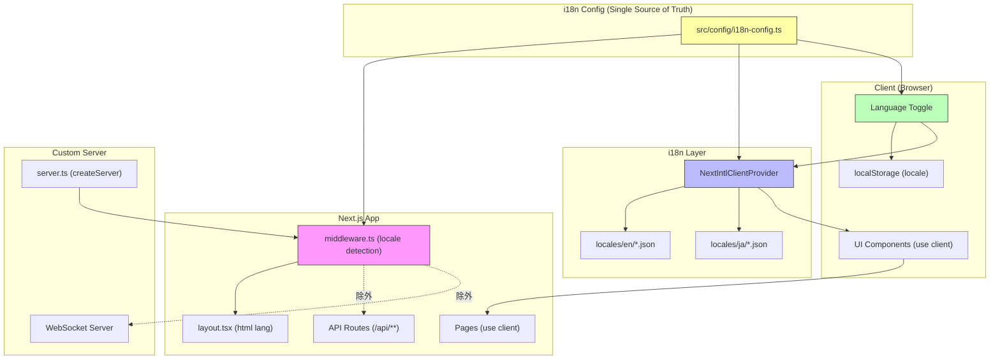
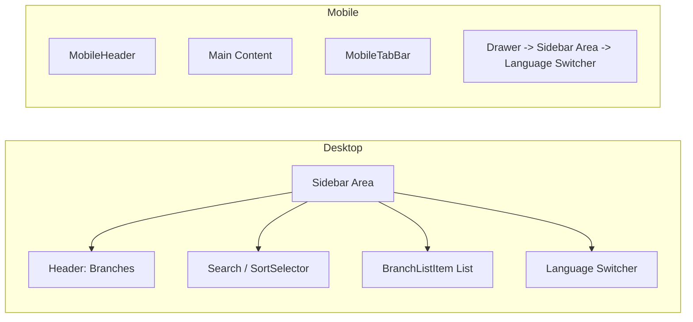

# Issue #124 i18n設計方針書

## レビュー履歴

| 日付 | ステージ | レビュー種別 | 結果 | スコア |
|------|---------|-------------|------|--------|
| 2026-02-11 | Stage 1 | 通常レビュー（設計原則） | 条件付き承認 | 4/5 |
| 2026-02-11 | Stage 2 | 整合性レビュー | 条件付き承認 | 4/5 |

---

## スコープ定義 [SF-S2-005対応]

### 本設計書のスコープ

本設計書はIssue #124のうち、**UI文言のi18n化（Phase 1-6）** を対象とする。

### スコープ外（別Issue分割推奨）

| 項目 | 理由 | 推奨対応 |
|------|------|---------|
| **Phase 5: ドキュメント英語化**（README.md、ユーザーガイド等30+ファイル） | UI i18nとドキュメント英語化は独立した作業であり、スコープを分離することで各Issueの完了判定が明確になる。ドキュメント英語化は翻訳ライブラリに依存せず、テキスト置換のみで完結するため技術的にも独立している。 | 別Issueとして分割し、UI i18n完了後に着手する |

**判断根拠**: Issue #124の原文にはPhase 5としてドキュメント英語化が含まれているが、UI i18n（next-intl導入、コンポーネント翻訳）とドキュメント英語化（マークダウンファイルの翻訳）は技術的に独立しており、同一設計書で扱うと設計の焦点がぼやける。UI i18nの品質を優先し、ドキュメント英語化は本設計書のスコープ外とする。

---

## レビュー指摘事項サマリー

### Stage 1: Must Fix（必須対応）

| ID | 原則 | タイトル | 重要度 | 対応セクション | 状態 |
|----|------|---------|--------|---------------|------|
| MF-001 | DRY | LOCALE_LABELS定数とサポート言語リストが複数箇所に散在する設計 | medium | Section 3, 9, 10, 11 | 反映済 |
| MF-002 | SRP | useLocaleSwitch hookがCookieとlocalStorageの二重永続化責務を持つ | medium | Section 3, 6 | 反映済 |

### Stage 1: Should Fix（推奨対応）

| ID | 原則 | タイトル | 重要度 | 対応セクション | 状態 |
|----|------|---------|--------|---------------|------|
| SF-001 | OCP | DURATION_OPTIONSのi18n対応がopen/closedの観点で不完全 | low | Section 13 | 反映済 |
| SF-002 | KISS | middleware.tsのロケール検出フォールバックチェーンが暗黙的 | low | Section 10 | 反映済 |
| SF-003 | DRY | 翻訳対象の日本語文字列が11ファイル・84箇所に散在 | medium | Section 12 | 反映済 |
| SF-004 | KISS | date-fnsロケール（ja）のi18n統合方針が未定義 | medium | Section 3 | 反映済 |

### Stage 1: Consider（将来検討）

| ID | 原則 | タイトル | 重要度 | 対応 |
|----|------|---------|--------|------|
| CO-001 | YAGNI | Server Components翻訳の将来対応 | info | ADRとして記録（Section 8） |
| CO-002 | DIP | 翻訳プロバイダーの抽象化レベル | info | 現時点では直接依存で可。将来検討事項として記録 |
| CO-003 | ISP | namespace粒度の適切性 | info | worktree.jsonが50キー超過時に分割検討 |
| CO-004 | KISS | window.location.reload()によるロケール切替 | info | 現方針維持（適切な簡素化判断） |

### Stage 2: Must Fix（必須対応）

| ID | カテゴリ | タイトル | 重要度 | 対応セクション | 状態 |
|----|---------|---------|--------|---------------|------|
| MF-S2-001 | ファイル構成の不一致 | 翻訳対象ファイルリストにPromptPanel.tsx, MessageList.tsx, WorktreeDetailRefactored.tsxが含まれていない | high | Section 4, 12, 16 Phase 4 | 反映済 |
| MF-S2-002 | Namespace設計の不整合 | PromptPanel.tsxのprompt namespaceマッピングが未定義 | medium | Section 4, 12 | 反映済 |

### Stage 2: Should Fix（推奨対応）

| ID | カテゴリ | タイトル | 重要度 | 対応セクション | 状態 |
|----|---------|---------|--------|---------------|------|
| SF-S2-001 | 技術選定の整合性 | next.config.jsのCommonJS形式でのcreateNextIntlPlugin適用方法が未記載 | medium | Section 9, 16 Phase 1 | 反映済 |
| SF-S2-002 | layout.tsxの整合性 | layout.tsxのlang属性動的化の具体的手順が不足 | medium | Section 3, 9, 16 Phase 3 | 反映済 |
| SF-S2-003 | AppProviders.tsxの整合性 | AppProviders.tsxのインターフェース変更とlayout.tsx側の依存関係が未記載 | low | Section 3, 9 | 反映済 |
| SF-S2-004 | テスト戦略の整合性 | テスト修正対象ファイルリストが翻訳対象追加分と不一致 | low | Section 12 | 反映済 |
| SF-S2-005 | Issueとの整合性 | Phase 5ドキュメント英語化のスコープ判断が未記載 | low | スコープ定義セクション | 反映済 |

### Stage 2: Consider（将来検討）

| ID | カテゴリ | タイトル | 重要度 | 対応 |
|----|---------|---------|--------|------|
| CO-S2-001 | Sidebar.tsxの整合性 | Sidebar.tsxが存在しない | low | 実際のコンポーネント構成に合わせて修正（Section 11, 12） |
| CO-S2-002 | コメント日本語 | MermaidCodeBlock.tsxのコメント内日本語がCIチェックでfalse positiveを生む | info | CIチェックスクリプトにコメント行除外ルールを追加（Section 12） |
| CO-S2-003 | JSDocコメント | clipboard-utils.tsのJSDocコメント内日本語の対象判断 | info | JSDocコメントは翻訳対象外とする方針を明記（Section 12） |
| CO-S2-004 | package.jsonのfiles配列 | locales/ディレクトリの扱いが未記載 | info | npm publishの配布要件を明記（Section 9） |

---

## 1. アーキテクチャ設計

### システム構成図（i18n対応後）



### レイヤー構成

| レイヤー | 責務 | i18n関連ファイル |
|---------|------|-----------------|
| **i18n設定層** | サポートロケール・デフォルト言語・ラベルの一元管理 | `src/config/i18n-config.ts` **[MF-001対応: 新規追加]** |
| **ロケール検出層** | リクエストからロケール判定 | `middleware.ts` |
| **Provider層** | 翻訳コンテキスト提供 | `AppProviders.tsx` + `NextIntlClientProvider` |
| **メッセージ定義層** | 翻訳キー・値管理 | `locales/en/*.json`, `locales/ja/*.json` |
| **UI層** | 翻訳テキスト表示 | 各コンポーネント (`useTranslations()`) |
| **ユーティリティ層** | Cookie永続化等の共通処理 | `src/lib/locale-cookie.ts` **[MF-002対応: 新規追加]** |
| **日付フォーマット層** | date-fnsロケール連動 | `src/lib/date-locale.ts` **[SF-004対応: 新規追加]** |
| **設定層** | i18nライブラリ設定 | `i18n.ts`, `next.config.js` |

---

## 2. 技術選定

### 確定技術

| カテゴリ | 選定技術 | 選定理由 |
|---------|---------|---------|
| i18nライブラリ | **next-intl** | Next.js 14 App Router最適化、Server/Client Components両対応、TypeScript型安全 |
| ロケール検出 | Cookie/Headerベース（非パスプレフィックス） | カスタムサーバー互換性、URL構造維持、WebSocket/API無影響 |
| ロケール保存 | localStorage + Cookie | クライアント永続化 + サーバー側検出 |
| デフォルト言語 | 英語 (en) | OSS国際化の標準 |
| サポート言語 | en, ja | 初期リリーススコープ |
| 日付フォーマット | date-fns + ロケールマッピング | **[SF-004対応]** 既存date-fns利用箇所との統合 |

### ロケール検出方式の選定根拠

**Cookie/Headerベース方式を採用する理由:**

| 比較項目 | URLパスプレフィックス方式 | Cookie/Headerベース方式（採用） |
|---------|------------------------|-----------------------------|
| URL構造 | `/en/worktrees/...`, `/ja/worktrees/...` | `/worktrees/...`（変更なし） |
| カスタムサーバー互換 | 追加検証必要 | 互換性高い |
| WebSocket影響 | リダイレクトリスクあり | 影響なし |
| APIルート影響 | 除外設定必要 | 影響なし |
| ナビゲーションパス | 5箇所の変更必要 | 変更不要 |
| ディレクトリ移動 | `[locale]/`配下に全ページ移動 | 不要 |
| CSPヘッダー影響 | 検証必要 | 影響なし |
| SEO | ロケール別URL可能 | `hreflang`タグで対応 |
| 実装コスト | 高（構造変更大） | 低（構造維持） |

**結論**: 本プロジェクトはカスタムサーバー（`server.ts`）+ WebSocket構成であり、URL構造を維持するCookie/Headerベース方式がリスクが最小。SEO要件も限定的（ツールUI）であるため、URLプレフィックスの必要性は低い。

### 代替技術との比較

| ライブラリ | メリット | デメリット | 判定 |
|-----------|---------|-----------|------|
| **next-intl** | App Router最適化、型安全、Server Components対応 | 比較的新しい | 採用 |
| react-i18next | 成熟、大規模エコシステム | App Router統合にボイラープレート多い | 不採用 |
| react-intl | ICUメッセージ形式 | Next.js固有最適化なし | 不採用 |
| i18n直接置換（ライブラリなし） | シンプル | 切替機能が複雑に、型安全性なし | 不採用 |

---

## 3. 設計パターン

### i18n設定の一元管理パターン [MF-001対応]

**設計根拠**: サポートロケールリスト、デフォルトロケール、ロケールラベルが middleware.ts、i18n.ts、LocaleSwitcher.tsx の3箇所に散在するとDRY原則に違反する。`src/config/i18n-config.ts` に集約し、全参照先から単一の定義を利用する。

```typescript
// src/config/i18n-config.ts [MF-001: Single Source of Truth]
export const SUPPORTED_LOCALES = ['en', 'ja'] as const;
export type SupportedLocale = (typeof SUPPORTED_LOCALES)[number];

export const DEFAULT_LOCALE: SupportedLocale = 'en';

export const LOCALE_LABELS: Record<SupportedLocale, string> = {
  en: 'English',
  ja: '日本語',
};
```

**参照関係**:
- `middleware.ts` -- `SUPPORTED_LOCALES`, `DEFAULT_LOCALE` を参照
- `i18n.ts` -- `SUPPORTED_LOCALES`, `DEFAULT_LOCALE` を参照
- `LocaleSwitcher.tsx` -- `LOCALE_LABELS`, `SUPPORTED_LOCALES` を参照
- `useLocaleSwitch.ts` -- `SupportedLocale` 型を参照

**新言語追加時**: `src/config/i18n-config.ts` の `SUPPORTED_LOCALES` と `LOCALE_LABELS` に追加するだけで、全参照箇所に自動反映される。

### Provider パターン（i18n Context提供）[SF-S2-002, SF-S2-003対応: layout.tsxとの連携を明示]

**設計根拠**: `NextIntlClientProvider`を最外層に配置し、全子コンポーネントで`useTranslations()`を利用可能にする。

**[SF-S2-003対応]** 現行のAppProvidersは`{children}`のみを受け取るインターフェースであるため、`locale`と`messages`のprops追加が必要。layout.tsx側の呼び出しも同時に修正する必要がある。

```typescript
// src/components/providers/AppProviders.tsx [SF-S2-003: インターフェース変更]
'use client';

import { NextIntlClientProvider } from 'next-intl';

// 変更前: AppProvidersProps = { children: React.ReactNode }
// 変更後: locale と messages を追加
interface AppProvidersProps {
  children: React.ReactNode;
  locale: string;
  messages: Record<string, unknown>;
}

export function AppProviders({
  children,
  locale,
  messages
}: AppProvidersProps) {
  return (
    <NextIntlClientProvider locale={locale} messages={messages}>
      <SidebarProvider>
        <WorktreeSelectionProvider>
          {children}
        </WorktreeSelectionProvider>
      </SidebarProvider>
    </NextIntlClientProvider>
  );
}
```

**[SF-S2-002対応]** layout.tsx（Server Component）からのロケール取得とAppProvidersへの受け渡し:

```typescript
// src/app/layout.tsx [SF-S2-002: Server Componentからのロケール取得]
import { getLocale, getMessages } from 'next-intl/server';

export default async function RootLayout({
  children,
}: {
  children: React.ReactNode;
}) {
  // next-intlのServer側APIでロケールとメッセージを取得
  // getLocale()はmiddleware.tsが設定したロケール情報を読み取る
  const locale = await getLocale();
  const messages = await getMessages();

  return (
    <html lang={locale}> {/* 変更前: <html lang="ja"> */}
      <body>
        <AppProviders locale={locale} messages={messages}>
          {children}
        </AppProviders>
      </body>
    </html>
  );
}
```

**依存関係の明示 [SF-S2-003]**:
1. `layout.tsx`が`getLocale()`と`getMessages()`でロケール情報を取得
2. `layout.tsx`が`AppProviders`に`locale`と`messages`をpropsとして渡す
3. `AppProviders`が`NextIntlClientProvider`にこれらを渡す
4. 子コンポーネントが`useTranslations()`で翻訳テキストを取得

> **[CO-002: 将来検討]** 現時点ではnext-intlへの直接依存で問題ない。i18nライブラリ変更が必要になった場合に備え、`useTranslations()`のインポート元を`@/hooks/useTranslations`とする薄いラッパーを検討してもよいが、必須ではない。

### Namespace パターン（翻訳キー分割）

```
locales/
├── en/
│   ├── common.json        # 共通（ボタン、ステータス等）
│   ├── worktree.json      # ワークツリー関連
│   ├── autoYes.json       # Auto-Yes関連
│   ├── error.json         # エラーメッセージ
│   └── prompt.json        # プロンプト関連
└── ja/
    ├── common.json
    ├── worktree.json
    ├── autoYes.json
    ├── error.json
    └── prompt.json
```

**設計根拠**: 機能単位でnamespaceを分割し、各コンポーネントが必要なnamespaceのみを参照。コード分割の粒度とメンテナンス性のバランス。

> **[CO-003: 将来検討]** 初期リリースでは現在の5 namespace構成を維持する。worktree.jsonが50キーを超えた時点で、session/fileOps/errorsなどへの分割を検討する。

### Hook パターン（翻訳取得）

```typescript
// コンポーネント内での使用
'use client';
import { useTranslations } from 'next-intl';

export function WorktreeCard() {
  const t = useTranslations('worktree');

  return (
    <button>{t('endSession')}</button>
    // en: "End Session", ja: "セッションを終了"
  );
}
```

### Cookie永続化ユーティリティ [MF-002対応]

**設計根拠**: useLocaleSwitch hookがCookie設定・localStorage設定・画面リロードの3責務を持つとSRP違反となる。Cookie永続化ロジックを独立したユーティリティ関数に分離し、セキュリティフラグ（SameSite=Lax; Secure）を確実に含める。

```typescript
// src/lib/locale-cookie.ts [MF-002: Cookie永続化の分離]
import type { SupportedLocale } from '@/config/i18n-config';

const LOCALE_COOKIE_NAME = 'locale';
const LOCALE_COOKIE_MAX_AGE = 31536000; // 1年

/**
 * ロケールCookieを設定する。
 * セキュリティ: SameSite=Lax, Secure（HTTPS環境）, Path=/
 */
export function setLocaleCookie(locale: SupportedLocale): void {
  const isSecure = window.location.protocol === 'https:';
  const securePart = isSecure ? ';Secure' : '';
  document.cookie = `${LOCALE_COOKIE_NAME}=${locale};path=/;max-age=${LOCALE_COOKIE_MAX_AGE};SameSite=Lax${securePart}`;
}
```

### Custom Hook パターン（ロケール管理）[MF-002対応: SRP準拠に改善]

**設計根拠**: hookは「ロケール切替のオーケストレーション」のみを責務とし、Cookie永続化の詳細は `setLocaleCookie` ユーティリティに委譲する。

```typescript
// src/hooks/useLocaleSwitch.ts [MF-002: SRP準拠]
'use client';
import { useLocale as useNextIntlLocale } from 'next-intl';
import { SUPPORTED_LOCALES } from '@/config/i18n-config';
import type { SupportedLocale } from '@/config/i18n-config';
import { setLocaleCookie } from '@/lib/locale-cookie';

export function useLocaleSwitch() {
  const currentLocale = useNextIntlLocale();

  const switchLocale = (newLocale: string) => {
    // バリデーション: サポート対象ロケールのみ許可
    if (!SUPPORTED_LOCALES.includes(newLocale as SupportedLocale)) {
      return;
    }
    // Cookie永続化（ユーティリティに委譲）
    setLocaleCookie(newLocale as SupportedLocale);
    // localStorage永続化
    localStorage.setItem('locale', newLocale);
    // Provider再初期化のためリロード
    window.location.reload();
  };

  return { currentLocale, switchLocale };
}
```

### date-fnsロケール連動パターン [SF-004対応]

**設計根拠**: PromptMessage.tsxとWorktreeCard.tsxでdate-fnsの`ja`ロケールを直接インポートしているが、next-intlのロケールとdate-fnsのロケールを連動させる方式が未定義だった。ロケールマッピング関数を作成し、useTranslations利用コンポーネントと同様にロケール切替に追従する。

```typescript
// src/lib/date-locale.ts [SF-004: date-fnsロケール統合]
import { ja } from 'date-fns/locale/ja';
import { enUS } from 'date-fns/locale/en-US';
import type { Locale } from 'date-fns';
import type { SupportedLocale } from '@/config/i18n-config';

const DATE_FNS_LOCALE_MAP: Record<SupportedLocale, Locale> = {
  en: enUS,
  ja: ja,
};

/**
 * next-intlのロケールからdate-fnsのLocaleオブジェクトを取得する。
 * 新言語追加時はDATE_FNS_LOCALE_MAPにエントリを追加する。
 */
export function getDateFnsLocale(locale: string): Locale {
  return DATE_FNS_LOCALE_MAP[locale as SupportedLocale] ?? enUS;
}
```

**使用例**:
```typescript
// コンポーネント内
import { useLocale } from 'next-intl';
import { getDateFnsLocale } from '@/lib/date-locale';
import { format } from 'date-fns';

const locale = useLocale();
const dateFnsLocale = getDateFnsLocale(locale);
const formatted = format(date, 'PPpp', { locale: dateFnsLocale });
```

---

## 4. データモデル設計

### ロケールファイル構造

#### common.json（共通翻訳）

```json
{
  "cancel": "Cancel",
  "confirm": "Confirm",
  "save": "Save",
  "delete": "Delete",
  "close": "Close",
  "back": "Back",
  "loading": "Loading...",
  "sending": "Sending...",
  "yes": "Yes",
  "no": "No",
  "send": "Send",
  "status": {
    "running": "Running",
    "idle": "Idle",
    "thinking": "Thinking",
    "prompt": "Prompt",
    "disconnected": "Disconnected",
    "responseWaiting": "Waiting for response",
    "responseComplete": "Response complete",
    "sessionStarting": "Starting session",
    "selectionWaiting": "Waiting for selection"
  },
  "favorites": {
    "add": "Add to favorites",
    "remove": "Remove from favorites"
  },
  "realTimeUpdate": "Real-time update",
  "latestOutput": "Latest output"
}
```

> **[MF-S2-001対応]** MessageList.tsxで使用される「はい/Yes」「いいえ/No」「送信」「キャンセル」「セッション起動中」「選択待ち」「リアルタイム更新」「最新の出力」等のテキストをcommon.jsonに追加。これらは複数コンポーネントで共有される可能性が高いため、共通namespaceに配置する。

#### worktree.json（ワークツリー関連）

```json
{
  "session": {
    "endConfirmTitle": "End {tool} session?",
    "endConfirmMessage": "Chat history will be cleared.",
    "endButton": "End Session",
    "ending": "Ending...",
    "running": "Session running",
    "thinking": "Thinking..."
  },
  "fileOps": {
    "createFileFailed": "Failed to create file",
    "createDirFailed": "Failed to create directory",
    "renameFailed": "Failed to rename",
    "deleteConfirm": "Delete?",
    "deleteFailed": "Failed to delete"
  },
  "errors": {
    "sessionEndFailed": "Failed to end session",
    "favoriteUpdateFailed": "Failed to update favorite",
    "statusUpdateFailed": "Failed to update status"
  }
}
```

> **[MF-S2-001対応]** WorktreeDetailRefactored.tsxで使用されるworktree関連テキストを追加。ファイル操作エラーメッセージ（作成失敗、リネーム失敗、削除確認等）は既にworktree.fileOpsに含まれている。

#### prompt.json（プロンプト関連）[MF-S2-002対応: PromptPanel.tsxとのマッピング明示]

```json
{
  "header": "Confirmation from Claude",
  "default": "Default",
  "answered": "Answered: {answer}",
  "inputPlaceholder": "Enter a value...",
  "sendFailed": "Failed to send response. Please try again."
}
```

**Namespace-コンポーネントマッピング [MF-S2-002対応]**:

| キー | 使用コンポーネント | 日本語テキスト |
|------|-------------------|--------------|
| `prompt.header` | PromptMessage.tsx, **PromptPanel.tsx** | 「Claudeからの確認」 |
| `prompt.default` | PromptMessage.tsx, **PromptPanel.tsx** | 「デフォルト」 |
| `prompt.answered` | PromptMessage.tsx | 「回答済み: {answer}」 |
| `prompt.inputPlaceholder` | PromptMessage.tsx, **PromptPanel.tsx** | 「値を入力してください...」 |
| `prompt.sendFailed` | PromptMessage.tsx | 「応答の送信に失敗しました。もう一度お試しください。」 |

> **[MF-S2-002]** PromptPanel.tsxの「送信中...」はcommon.jsonの`sending`キーを使用する（共通化判断）。PromptPanel.tsxは`prompt`と`common`の2つのnamespaceを参照する。

#### autoYes.json（Auto-Yes関連）

```json
{
  "title": "Enable Auto Yes mode?",
  "description": "Auto Yes mode automatically responds 'yes' to all confirmation prompts.",
  "features": {
    "title": "What this mode does:",
    "item1": "Automatically accepts all confirmation prompts",
    "item2": "Runs for a specified duration",
    "item3": "Can be disabled at any time"
  },
  "durations": {
    "1h": "1 hour",
    "3h": "3 hours",
    "8h": "8 hours"
  },
  "agree": "Agree and Enable",
  "disclaimer": "Use at your own risk. Review operations carefully."
}
```

#### error.json（エラー関連）

```json
{
  "boundary": {
    "componentError": "An error occurred in {componentName}",
    "genericError": "An error occurred",
    "retry": "Retry"
  },
  "fallback": {
    "title": "Something went wrong",
    "description": "An unexpected error occurred.",
    "reload": "Reload page",
    "goHome": "Go to home"
  }
}
```

### DBスキーマへの影響

**影響なし**: ロケール設定はクライアント側（localStorage + Cookie）で管理し、サーバー側DBには保存しない。

---

## 5. API設計

### ロケール関連APIは不要

**設計判断**: ロケール設定はクライアント側で完結するため、ロケール関連の新規APIエンドポイントは作成しない。

| 項目 | 方式 | 理由 |
|------|------|------|
| ロケール保存 | localStorage + Cookie | サーバーDB不要、Cookie経由でmiddlewareが読取可能 |
| ロケール検出 | middleware.ts | Accept-Language -> Cookie -> デフォルト(en) |
| 翻訳データ取得 | ビルド時バンドル | JSONファイルをビルド時に読み込み |

### 既存APIルートへの影響

**影響なし**: Cookie/Headerベース方式のため、`/api/**` のURL構造は変更されない。APIルートのレスポンスメッセージは英語のまま維持する（API利用者はプログラム的にハンドリングするため）。

---

## 6. セキュリティ設計

### CSPヘッダーとの互換性

| 項目 | 対応 |
|------|------|
| Cookie方式採用 | URL構造変更なし -> 既存CSP設定に影響なし |
| locale Cookie | `SameSite=Lax`、`Secure` フラグ設定 **[MF-002対応: コード例にも反映済]** |
| 翻訳JSONのXSS | next-intlが自動エスケープ |
| ユーザー入力の翻訳キー混入 | 翻訳キーはコード内固定、ユーザー入力は変数としてのみ渡す |

### Cookie永続化のセキュリティ要件 [MF-002対応]

locale Cookieの設定は `src/lib/locale-cookie.ts` に一元化し、以下のセキュリティフラグを必須とする:

| フラグ | 値 | 理由 |
|--------|-----|------|
| `SameSite` | `Lax` | CSRF防止。ロケールCookieはナビゲーション時にのみ送信されれば十分 |
| `Secure` | HTTPS環境時のみ付与 | ローカル開発（HTTP）でも動作可能にしつつ、本番では暗号化通信を保証 |
| `Path` | `/` | 全パスで有効（middleware.tsがルートで読み取るため） |
| `Max-Age` | 31536000（1年） | 長期保持でユーザーの言語設定を維持 |

### i18n固有のセキュリティ考慮

```typescript
// 安全: 変数はnext-intlが自動エスケープ
t('answered', { answer: userInput });

// 危険（しない）: dangerouslySetInnerHTML での翻訳使用
<div dangerouslySetInnerHTML={{ __html: t('message') }} />
```

---

## 7. パフォーマンス設計

### バンドルサイズ影響

| 項目 | サイズ見積り | 影響度 |
|------|-----------|--------|
| next-intl パッケージ | ~15KB (gzip) | 軽微 |
| locales/en/*.json（全namespace） | ~3-5KB | 軽微 |
| locales/ja/*.json（全namespace） | ~5-8KB | 軽微 |
| **合計追加サイズ** | **~25-30KB (gzip)** | **軽微** |

### ロケール切替時のパフォーマンス

**方式**: `window.location.reload()` によるフルリロード

**理由**:
- next-intlのClientProviderは`messages`プロパティでロケールを受け取るため、切替時はProvider再初期化が必要
- SPA的な動的切替は可能だが、初期実装としてはリロード方式で十分
- 言語切替は頻繁に行う操作ではないため、UX影響は限定的

> **[CO-004: 確認済]** window.location.reload()によるロケール切替は、KISS原則に合致した適切な簡素化判断。ユーザーからの改善要望がない限り、動的切替は導入しない。

**将来改善**: 必要であればReact state + dynamic import で非リロード切替に変更可能。

### middleware処理オーバーヘッド

- Cookie読み取り + ロケール判定: **<1ms**
- 全リクエストで実行されるが無視できるレベル

---

## 8. 設計上の決定事項とトレードオフ

### 採用した設計

| 決定事項 | 理由 | トレードオフ |
|---------|------|-------------|
| Cookie/Headerベース方式 | カスタムサーバー互換、URL維持 | SEOでの多言語URL不可（ツールUIなので許容） |
| next-intl | App Router最適化、型安全 | react-i18nextより事例が少ない |
| クライアント側ロケール管理 | DB変更不要、シンプル | サーバー側でのロケール参照が間接的 |
| namespace分割 | メンテナンス性向上 | ファイル数増加 |
| リロード方式の言語切替 | 実装シンプル、確実 | 切替時に画面フラッシュ |
| デフォルト英語 | OSS標準、海外ユーザー優先 | 既存日本語ユーザーは初回に切替が必要 |
| i18n設定の一元管理 **[MF-001]** | DRY原則準拠、言語追加時の変更箇所を1ファイルに限定 | 参照先からの間接的import |
| Cookie永続化の分離 **[MF-002]** | SRP準拠、セキュリティフラグの確実な適用 | ファイル数が1つ増加 |
| date-fnsロケール連動 **[SF-004]** | next-intlとdate-fnsのロケール統一 | マッピング関数のメンテナンスが必要 |
| ドキュメント英語化のスコープ外 **[SF-S2-005]** | UI i18nに焦点を絞り品質を担保 | 別Issueでの対応が必要 |

### 不採用とした設計

| 代替案 | 不採用理由 |
|--------|-----------|
| URLパスプレフィックス方式 | カスタムサーバー・WebSocket・ナビゲーション5箇所への影響が大きすぎる |
| DB保存方式 | 認証なしツールでユーザー識別不要、localStorage+Cookieで十分 |
| Server Components翻訳 | 全ページがuse clientのため実質不要 |
| 動的import翻訳 | 初期スコープでは過剰、JSONサイズが小さい |

> **[CO-001: ADR]** Server Components翻訳は現時点で不採用（YAGNI）。将来Server Componentsが導入された場合、next-intlの`getTranslations()`を導入する。この判断はServer Components未使用の現状では適切であり、マイグレーションパスはnext-intlのドキュメントに沿って対応可能。

---

## 9. ファイル構成（新規・変更）

```
commandmate/
├── locales/                          # 新規: 翻訳ファイル
│   ├── en/
│   │   ├── common.json
│   │   ├── worktree.json
│   │   ├── autoYes.json
│   │   ├── error.json
│   │   └── prompt.json
│   └── ja/
│       ├── common.json
│       ├── worktree.json
│       ├── autoYes.json
│       ├── error.json
│       └── prompt.json
├── src/
│   ├── config/
│   │   └── i18n-config.ts           # 新規 [MF-001]: ロケール定数の一元管理
│   ├── i18n.ts                       # 新規: next-intl設定（i18n-config.tsを参照）
│   ├── middleware.ts                  # 新規: ロケール検出ミドルウェア（i18n-config.tsを参照）
│   ├── app/
│   │   └── layout.tsx                # 変更 [SF-S2-002]: lang属性動的化、getLocale()/getMessages()追加
│   ├── components/
│   │   ├── providers/
│   │   │   └── AppProviders.tsx      # 変更 [SF-S2-003]: NextIntlClientProvider追加、locale/messages props追加
│   │   ├── common/
│   │   │   └── LocaleSwitcher.tsx    # 新規: 言語切替コンポーネント（i18n-config.tsを参照）
│   │   ├── worktree/
│   │   │   ├── PromptPanel.tsx       # 変更 [MF-S2-001]: useTranslations()適用（prompt, common namespace）
│   │   │   ├── MessageList.tsx       # 変更 [MF-S2-001]: useTranslations()適用（common, worktree namespace）
│   │   │   └── WorktreeDetailRefactored.tsx  # 変更 [MF-S2-001]: useTranslations()適用（worktree namespace）
│   │   └── ...（既存コンポーネント） # 変更: useTranslations()適用
│   ├── hooks/
│   │   └── useLocaleSwitch.ts        # 新規 [MF-002]: ロケール切替カスタムフック（SRP準拠）
│   └── lib/
│       ├── locale-cookie.ts          # 新規 [MF-002]: Cookie永続化ユーティリティ
│       └── date-locale.ts            # 新規 [SF-004]: date-fnsロケールマッピング
├── next.config.js                    # 変更 [SF-S2-001]: createNextIntlPlugin適用（CommonJS形式対応）
├── package.json                      # 変更: next-intl追加、files更新
└── tests/
    ├── setup.ts                      # 変更: next-intlモック追加
    └── helpers/
        └── intl-test-utils.ts        # 新規: テスト用翻訳ヘルパー
```

### next.config.js の CommonJS 形式での適用 [SF-S2-001対応]

**設計根拠**: 既存の`next.config.js`はCommonJS形式（`require`/`module.exports`）で記述されている。next-intlの`createNextIntlPlugin`はESM形式のドキュメントが多いが、CommonJS形式でも以下のパターンで適用可能。

```javascript
// next.config.js [SF-S2-001: CommonJS形式での適用]
const createNextIntlPlugin = require('next-intl/plugin');

const withNextIntl = createNextIntlPlugin();

/** @type {import('next').NextConfig} */
const nextConfig = {
  // 既存の設定（セキュリティヘッダー等）をそのまま維持
  // ...
};

module.exports = withNextIntl(nextConfig);
```

**代替案**: `next.config.mjs`への移行（ESM形式）も可能だが、既存設定の移行コストと他のCommonJS依存を考慮し、現時点ではCommonJS形式を維持する。Phase 1のPoC時にCommonJS形式での動作を検証し、問題があれば`.mjs`移行を検討する。

### package.json の files 配列 [CO-S2-004対応]

**設計判断**: `locales/`ディレクトリはnext-intlのビルド時にバンドルされるため、`package.json`の`files`配列への追加は**不要**。ただし、npm publishでの配布を考慮する場合は以下を確認する:

- next-intlはビルド時にlocalesファイルを`.next/`にバンドルする
- CLIモジュール（`commandmate`コマンド）はlocalesを直接参照しない
- よって、`files`配列の変更は`next-intl`パッケージ追加の`dependencies`反映のみ

---

## 10. middleware.ts 設計

### ロケール検出フォールバック順序 [SF-002対応: 明示的文書化]

middleware.tsのロケール検出は以下の優先順序でフォールバックする。この順序はnext-intlの`createMiddleware`の内部実装に依存するため、ライブラリアップデート時は結合テストで検証すること。

| 優先度 | 検出方法 | 説明 |
|--------|---------|------|
| 1 | Cookie (`locale`) | ユーザーが明示的に設定した言語設定 |
| 2 | Accept-Language ヘッダー | ブラウザの言語設定から自動検出 |
| 3 | デフォルトロケール (`en`) | 上記いずれも該当しない場合のフォールバック |

### middleware.ts 実装設計

```typescript
// src/middleware.ts (※ Next.js App Routerではsrc/middleware.tsを認識する)
import createMiddleware from 'next-intl/middleware';
import { SUPPORTED_LOCALES, DEFAULT_LOCALE } from '@/config/i18n-config'; // [MF-001]

export default createMiddleware({
  locales: SUPPORTED_LOCALES,         // [MF-001: i18n-config.tsから参照]
  defaultLocale: DEFAULT_LOCALE,      // [MF-001: i18n-config.tsから参照]
  localeDetection: true,              // Accept-Languageヘッダー検出
  localePrefix: 'never'               // Cookie/Headerベース、URLプレフィックスなし
});

// [SF-002: フォールバック順序]
// 1. Cookie 'locale' -> 2. Accept-Language -> 3. DEFAULT_LOCALE ('en')
// この順序はnext-intl createMiddlewareの内部実装に依存する。
// ライブラリアップデート時は結合テストで検証すること。

export const config = {
  // API, WebSocket, 静的ファイル, プロキシを除外
  matcher: [
    '/((?!api|_next|proxy|.*\\..*).*)'
  ]
};
```

**設計根拠**:
- `localePrefix: 'never'` でURL構造を維持
- `matcher` でAPI・WebSocket・静的ファイルを除外し、カスタムサーバーとの干渉を防止
- **[MF-001]**: `locales`と`defaultLocale`は`i18n-config.ts`から参照し、ハードコードを排除
- **[SF-002]**: フォールバック順序をコメントで明示し、結合テストでの検証を義務化

---

## 11. 言語切替UI設計

### 配置場所 [CO-S2-001対応: 実在コンポーネントを明記]

**サイドバー下部**（デスクトップ）+ **ドロワー内**（モバイル）

> **[CO-S2-001対応]** コードベースには`Sidebar.tsx`は存在しない。サイドバーは`BranchListItem.tsx`、`BranchStatusIndicator.tsx`、`SortSelector.tsx`で構成されている。LocaleSwitcherはサイドバーの親コンポーネント（`page.tsx`のサイドバー領域、またはサイドバーレイアウトを管理するコンポーネント）に配置する。実装時にサイドバー下部への配置を実現する適切な親コンポーネントを特定すること。



**設計根拠**:
- サイドバーは常に表示される主要ナビゲーション -> 言語切替が自然にアクセス可能
- モバイルではドロワー内に配置 -> 初回設定後は頻繁に変更しないため許容
- AppShellやHeaderに追加するよりも、既存構造への影響が最小

### コンポーネント設計 [MF-001対応: i18n-config.tsから参照]

```typescript
// src/components/common/LocaleSwitcher.tsx
'use client';
import { useLocaleSwitch } from '@/hooks/useLocaleSwitch';
import { LOCALE_LABELS, SUPPORTED_LOCALES } from '@/config/i18n-config'; // [MF-001]

export function LocaleSwitcher() {
  const { currentLocale, switchLocale } = useLocaleSwitch();

  return (
    <select
      value={currentLocale}
      onChange={(e) => switchLocale(e.target.value)}
      className="..."
    >
      {SUPPORTED_LOCALES.map((locale) => (
        <option key={locale} value={locale}>{LOCALE_LABELS[locale]}</option>
      ))}
    </select>
  );
}
```

**変更点 [MF-001]**: `LOCALE_LABELS`をコンポーネント内で定義せず、`src/config/i18n-config.ts`からインポートする。`SUPPORTED_LOCALES`を使用してイテレーションすることで、新言語追加時の変更箇所を`i18n-config.ts`のみに限定する。

---

## 12. テスト戦略

### テストモック方式

**グローバルセットアップ方式（方式B）を採用**

```typescript
// tests/setup.ts に追加
import { vi } from 'vitest';

// next-intl のモック
vi.mock('next-intl', () => ({
  useTranslations: () => (key: string, params?: Record<string, string>) => {
    // テスト時はキーをそのまま返す or 英語メッセージを返す
    return key;
  },
  useLocale: () => 'en',
  NextIntlClientProvider: ({ children }: { children: React.ReactNode }) => children,
}));
```

**選定理由**:
- 既存テスト40ファイルの`render()`呼び出しを個別修正する必要がない
- `tests/setup.ts`に集約でメンテナンスコスト低
- 既存の`@vitest-environment jsdom`アノテーションとの互換性も維持可能

### テスト修正方針 [SF-S2-004対応: 翻訳対象追加に伴うテスト修正対象更新]

| テストファイル | 修正内容 |
|--------------|---------|
| `PromptMessage.test.tsx` | 日本語文字列アサーション -> 翻訳キー or 英語文字列 |
| `MobilePromptSheet.test.tsx` | 同上 |
| `AutoYesConfirmDialog.test.tsx` | DURATION_LABELSのアサーション更新 |
| `AutoYesToggle.test.tsx` | 同上 |
| `auto-yes-config.test.ts` | DURATION_LABELSの値テスト更新 |
| `HistoryPane.test.tsx` | 日本語メッセージアサーション更新 |
| `PromptPanel.test.tsx` **[SF-S2-004/MF-S2-001]** | 日本語文字列アサーション -> 翻訳キー or 英語文字列（存在する場合） |
| `MessageList.test.tsx` **[SF-S2-004/MF-S2-001]** | 日本語文字列アサーション -> 翻訳キー or 英語文字列（存在する場合） |
| `WorktreeDetailRefactored.test.tsx` **[SF-S2-004/MF-S2-001]** | 日本語文字列アサーション -> 翻訳キー or 英語文字列（存在する場合） |

> **[SF-S2-004]** 実装時に上記3テストファイルが存在するか確認し、存在する場合はアサーションを更新する。存在しない場合は翻訳適用後にテストを追加する必要性を判断する。

### 翻訳対象ファイル完全リスト [SF-003対応, MF-S2-001対応: 3ファイル追加]

**設計根拠**: 14コンポーネントファイルに計約100箇所の日本語ハードコードが存在する。テスト修正方針のファイルだけでなく、全翻訳対象ファイルを網羅的にリスト化し、抽出漏れを防止する。

> **[MF-S2-001対応]** Stage 1時点では11ファイル・84箇所としていたが、整合性レビューにより PromptPanel.tsx（4箇所）、MessageList.tsx（17箇所）、WorktreeDetailRefactored.tsx（13箇所）の3ファイル・計34箇所が追加で判明した。合計14ファイル・約118箇所。

| ファイル | 日本語箇所数（概算） | 対応namespace | 備考 |
|---------|---------------------|---------------|------|
| `src/components/worktree/WorktreeCard.tsx` | 多数 | worktree | |
| `src/components/worktree/PromptMessage.tsx` | 多数 | prompt | |
| `src/components/worktree/PromptPanel.tsx` | 4箇所 | prompt, common | **[MF-S2-001追加]** 「Claudeからの確認」「送信中...」「デフォルト」「値を入力してください...」 |
| `src/components/worktree/MessageList.tsx` | 17箇所 | common, worktree | **[MF-S2-001追加]** 「選択待ち」「はい/Yes」「いいえ/No」「送信」「キャンセル」「回答済み」「セッション実行中」「考え中...」「思考中」「最新の出力」「リアルタイム更新」「セッション起動中」等 |
| `src/components/worktree/WorktreeDetailRefactored.tsx` | 13箇所 | worktree, common | **[MF-S2-001追加]** 「ファイルの作成に失敗しました」「ディレクトリの作成に失敗しました」「リネームに失敗しました」「削除しますか？」「セッションを終了しますか？」「チャット履歴がクリアされます」「キャンセル」「終了する」等 |
| `src/components/worktree/InterruptButton.tsx` | 少数 | worktree | |
| `src/components/worktree/AutoYesConfirmDialog.tsx` | 多数 | autoYes | |
| `src/components/worktree/AutoYesToggle.tsx` | 少数 | autoYes | |
| `src/components/worktree/HistoryPane.tsx` | 少数 | worktree | |
| `src/components/mobile/MobilePromptSheet.tsx` | 多数 | prompt | |
| `src/components/error/ErrorBoundary.tsx` | 少数 | error | |
| `src/components/error/fallbacks.tsx` | 少数 | error | |
| `src/config/auto-yes-config.ts` | 少数 | autoYes | |

> **[CO-S2-001対応]** 以前のリストに含まれていた`src/components/sidebar/Sidebar.tsx`を削除。このコンポーネントはコードベースに存在しない。サイドバー関連コンポーネント（`BranchListItem.tsx`、`BranchStatusIndicator.tsx`、`SortSelector.tsx`）には翻訳対象の日本語ハードコードが存在しないことを確認済み。LocaleSwitcherは新規作成コンポーネントとして別途追加する。

**注意**: 上記は設計時の調査に基づく概算。実装前に以下のコマンドで最新の日本語残存チェックを行うこと:

```bash
grep -rn '[ぁ-ん\|ァ-ヶ\|亜-熙]' src/components/ src/config/ --include='*.tsx' --include='*.ts'
```

### コメント・JSDocの言語方針 [CO-S2-002, CO-S2-003対応]

**方針**: コードコメントおよびJSDocコメント内の日本語は**翻訳対象外**とする。

| 対象 | 翻訳対象 | 理由 |
|------|---------|------|
| UI表示テキスト（JSX内の文字列リテラル） | 対象 | ユーザーに表示されるため |
| コードコメント（`//`, `/* */`） | 対象外 | ユーザーに表示されない |
| JSDocコメント（`/** */`） | 対象外 | ユーザーに表示されない。開発者向けドキュメント |
| console.logメッセージ | 対象外 | 本番では残留しない（CLAUDE.md規約） |

### CI/CDでの翻訳漏れ検出 [SF-003対応, CO-S2-002対応: コメント行除外]

実装完了後、CIパイプラインに日本語残存チェックを組み込む:

```bash
# src/components/ および src/config/ 内のTSX/TSファイルから
# 日本語文字列（コメント・import文を除く）の残存を検出
# コメント行（// や * で始まる行）を除外してfalse positiveを防止
# 0件であればパス、1件以上あれば警告（初期は警告のみ、安定後にエラー化）

# 除外対象:
# - コメント行（//, /*, *, */）
# - import文
# - JSDocコメント内の日本語（CO-S2-002, CO-S2-003対応）
# - MermaidCodeBlock.tsxのSF2-001説明コメント等
```

**具体的なチェック方針**:
1. まず全日本語を含む行を抽出
2. コメント行（`//`、`*`、`/*`、`*/`で始まる行）をフィルタ除外
3. import文をフィルタ除外
4. 残った行があれば翻訳漏れとして報告

### middleware フォールバック結合テスト [SF-002対応]

以下のテストケースを結合テストに追加し、ロケール検出のフォールバック順序を検証する:

| テストケース | 条件 | 期待結果 |
|-------------|------|---------|
| Cookie優先 | Cookie=ja, Accept-Language=en | ja |
| Accept-Languageフォールバック | Cookie未設定, Accept-Language=ja | ja |
| デフォルトフォールバック | Cookie未設定, Accept-Language未設定 | en |
| 非サポートロケール | Cookie未設定, Accept-Language=fr | en |

---

## 13. DURATION_LABELS のi18n設計 [SF-001対応: OCP準拠に改善]

### 既存ALLOWED_DURATIONS維持 + 翻訳キーマッピング方式

**設計根拠**: 既存の`ALLOWED_DURATIONS`はサーバー側のバリデーションに使用されるミリ秒リテラル配列であり、これを変更するとサーバー側への影響が発生する。OCP（開放閉鎖原則）に従い、既存の`ALLOWED_DURATIONS`はそのまま維持し、翻訳キーのマッピングのみを追加する。

**変更前の問題点**: 設計書では`DURATION_OPTIONS`（`{value: 1, unit: 'hour'}`形式）の新規導入を提案していたが、これは既存の`ALLOWED_DURATIONS`との二重管理を引き起こすリスクがあった。

**改善後の設計**:

```typescript
// src/config/auto-yes-config.ts

// 既存: サーバー側バリデーション用（変更なし）
export const ALLOWED_DURATIONS = [3600000, 10800000, 28800000] as const;

// 新規 [SF-001]: i18n翻訳キーマッピング
// ALLOWED_DURATIONSの各値に対応する翻訳キーを定義
export const DURATION_LABELS: Record<number, string> = {
  3600000: 'autoYes.durations.1h',
  10800000: 'autoYes.durations.3h',
  28800000: 'autoYes.durations.8h',
};
```

**クライアント側の使用**:

```typescript
// AutoYesConfirmDialog.tsx
const t = useTranslations('autoYes');

{ALLOWED_DURATIONS.map((duration) => (
  <option key={duration} value={duration}>
    {t(DURATION_LABELS[duration].replace('autoYes.', ''))}
  </option>
))}
```

**利点**:
- `ALLOWED_DURATIONS`は変更不要（サーバー側互換性維持）
- 新しい期間を追加する場合は`ALLOWED_DURATIONS`と`DURATION_LABELS`の両方にエントリを追加するだけ
- `DURATION_OPTIONS`の新規導入が不要になり、既存コードへの影響を最小化

---

## 14. 制約条件の確認

### CLAUDE.md準拠確認

| 原則 | 適用 |
|------|------|
| **SOLID - 単一責任** | 翻訳は`locales/`に分離、コンポーネントは表示責務のみ。**[MF-002]** Cookie永続化はユーティリティに分離 |
| **SOLID - 開放閉鎖** | 新言語追加は`src/config/i18n-config.ts`と`locales/`にディレクトリ追加のみ。**[SF-001]** DURATION追加はALLOWED_DURATIONSとDURATION_LABELSにエントリ追加のみ |
| **KISS** | Cookie/Headerベース方式で既存構造を維持、最小限の変更。**[SF-002]** フォールバック順序を明示的に文書化 |
| **YAGNI** | 初期は2言語（en/ja）のみ、動的翻訳読み込み等は不要時は実装しない |
| **DRY** | **[MF-001]** ロケール定数をi18n-config.tsに一元管理。翻訳キーをnamespaceで管理、重複テキストはcommon.jsonに集約。**[SF-003]** 翻訳対象の完全リスト化とCI検出で抽出漏れ防止 |

---

## 15. リスクと軽減策

| リスク | 影響度 | 軽減策 |
|-------|--------|--------|
| カスタムサーバーでmiddleware.tsが動作しない | 高 | Phase 1の最初に技術検証（PoC）を実施 |
| next.config.jsのCommonJS形式との互換性 **[SF-S2-001]** | 中 | Phase 1のPoC時にCommonJS形式での動作を検証。問題あれば`.mjs`移行を検討 |
| 翻訳漏れ（日本語文字列の取り残し） | 中 | **[SF-003, MF-S2-001]** 14ファイル・約118箇所の完全リスト化 + grep/CIチェック + コメント行除外ルール |
| 既存テストの大量破壊 | 中 | グローバルモック方式で影響を最小化 |
| layout.tsxのServer Component制約 **[SF-S2-002]** | 低 | next-intl/serverの`getLocale()`/`getMessages()`で対応（Section 3に具体例記載） |
| AppProviders.tsxインターフェース変更の波及 **[SF-S2-003]** | 低 | layout.tsx側の呼び出し変更を同時に実施（Section 3に依存関係明示） |
| next-intlのバージョン互換性 | 低 | package.jsonでバージョン固定 |
| 翻訳キーのタイポ | 低 | TypeScript型定義でコンパイル時検出 |
| middlewareフォールバック順序の変化 | 低 | **[SF-002]** 結合テストで検証、ライブラリアップデート時の回帰テスト |
| date-fnsロケールの不整合 | 低 | **[SF-004]** getDateFnsLocale()マッピング関数で一元管理 |
| CIチェックのfalse positive **[CO-S2-002]** | 低 | コメント行除外ルールをCIスクリプトに組み込み |

---

## 16. 実装チェックリスト

### Phase 1: 基盤構築

- [ ] **[MF-001]** `src/config/i18n-config.ts` を作成し、SUPPORTED_LOCALES / DEFAULT_LOCALE / LOCALE_LABELS を定義する
- [ ] **[MF-002]** `src/lib/locale-cookie.ts` を作成し、setLocaleCookie() を実装する（SameSite=Lax, Secure対応）
- [ ] **[SF-004]** `src/lib/date-locale.ts` を作成し、getDateFnsLocale() マッピング関数を実装する
- [ ] next-intl パッケージをインストールする
- [ ] `src/i18n.ts` を作成する（i18n-config.ts の定数を参照）
- [ ] `src/middleware.ts` を作成する（i18n-config.ts の定数を参照）
- [ ] **[SF-002]** middleware.ts にフォールバック順序をコメントで明記する
- [ ] **[SF-S2-001]** `next.config.js` に createNextIntlPlugin を CommonJS形式で適用する（`const createNextIntlPlugin = require('next-intl/plugin')`）
- [ ] **[SF-S2-001]** CommonJS形式での動作をPoC検証する。問題がある場合は `next.config.mjs` への移行を検討する
- [ ] カスタムサーバー（server.ts）でmiddleware.tsが動作することをPoC検証する

### Phase 2: 翻訳ファイル作成

- [ ] `locales/en/` 配下に5つのnamespaceファイルを作成する
- [ ] `locales/ja/` 配下に5つのnamespaceファイルを作成する
- [ ] **[MF-S2-001]** common.jsonにMessageList.tsx用の共通テキスト（yes, no, send, cancel, selectionWaiting, sessionStarting, realTimeUpdate, latestOutput等）を追加する
- [ ] **[MF-S2-002]** prompt.jsonのキーとPromptPanel.tsx/PromptMessage.tsxの対応マッピングを確認する
- [ ] **[SF-001]** auto-yes-config.ts に DURATION_LABELS 翻訳キーマッピングを追加する（ALLOWED_DURATIONSは変更しない）

### Phase 3: Provider・UI統合

- [ ] **[SF-S2-003]** `AppProviders.tsx` のインターフェースを `{children}` から `{children, locale, messages}` に変更し、NextIntlClientProvider を追加する
- [ ] **[SF-S2-002]** `layout.tsx` に `getLocale()` と `getMessages()` を追加し、html lang 属性を動的化する（`import { getLocale, getMessages } from 'next-intl/server'`）
- [ ] **[SF-S2-002/SF-S2-003]** `layout.tsx` から `AppProviders` に locale と messages を props として渡す
- [ ] **[MF-001]** `LocaleSwitcher.tsx` を作成する（LOCALE_LABELS / SUPPORTED_LOCALES を i18n-config.ts から参照）
- [ ] **[MF-002]** `useLocaleSwitch.ts` を作成する（setLocaleCookie ユーティリティに委譲、SRP準拠）
- [ ] **[CO-S2-001]** サイドバー領域の適切な親コンポーネントを特定し、LocaleSwitcher を配置する（Sidebar.tsxは存在しないため、実際の構成に基づいて配置先を決定）

### Phase 4: コンポーネント翻訳適用

- [ ] **[SF-003]** 実装前に grep で全翻訳対象箇所を最新確認する
- [ ] 以下の全13ファイルで日本語ハードコードを useTranslations() に置換する:
  - [ ] WorktreeCard.tsx
  - [ ] PromptMessage.tsx
  - [ ] **[MF-S2-001]** PromptPanel.tsx（prompt, common namespace使用。「送信中...」はcommon.sendingを使用）
  - [ ] **[MF-S2-001]** MessageList.tsx（common, worktree namespace使用。17箇所の日本語テキストを翻訳キーに置換）
  - [ ] **[MF-S2-001]** WorktreeDetailRefactored.tsx（worktree, common namespace使用。13箇所の日本語テキストを翻訳キーに置換）
  - [ ] InterruptButton.tsx
  - [ ] AutoYesConfirmDialog.tsx
  - [ ] AutoYesToggle.tsx
  - [ ] HistoryPane.tsx
  - [ ] MobilePromptSheet.tsx
  - [ ] ErrorBoundary.tsx
  - [ ] fallbacks.tsx
  - [ ] auto-yes-config.ts
- [ ] **[SF-004]** date-fns利用箇所（PromptMessage.tsx, WorktreeCard.tsx）で getDateFnsLocale() を使用する

### Phase 5: テスト対応

- [ ] `tests/setup.ts` に next-intl グローバルモックを追加する
- [ ] `tests/helpers/intl-test-utils.ts` を作成する
- [ ] テスト修正方針に記載の6ファイルのアサーションを更新する
- [ ] **[SF-S2-004]** PromptPanel.test.tsx、MessageList.test.tsx、WorktreeDetailRefactored.test.tsx が存在する場合、アサーションを更新する
- [ ] **[SF-002]** middleware フォールバック結合テスト（4ケース）を追加する
- [ ] **[SF-003]** 日本語残存チェックを実行し、翻訳漏れがないことを確認する

### Phase 6: CI/CD対応

- [ ] **[SF-003, CO-S2-002]** CIパイプラインに日本語残存チェックスクリプトを組み込む（コメント行除外ルール付き、初期は警告のみ）

---

## 17. 整合性マトリクス [Stage 2レビュー追加]

Stage 2整合性レビューで検証された設計書とコードベースの整合性:

| 設計項目 | 設計書の記載 | 実際のコード状態 | ギャップ | 対応状況 |
|---------|-------------|----------------|---------|---------|
| 翻訳対象ファイル | 11ファイル | 14ファイル（PromptPanel.tsx, MessageList.tsx, WorktreeDetailRefactored.tsx追加） | high | MF-S2-001で修正済 |
| prompt.jsonマッピング | PromptMessage.tsx向けのみ | PromptPanel.tsxでも使用 | medium | MF-S2-002で修正済 |
| next.config.js形式 | createNextIntlPlugin適用のみ記載 | CommonJS形式（require/module.exports） | medium | SF-S2-001で修正済 |
| layout.tsxロケール取得 | 「lang属性動的化」のみ記載 | Server Component、`<html lang='ja'>`ハードコード | medium | SF-S2-002で修正済 |
| AppProviders.tsxインターフェース | `{children, locale, messages}` | 現行は`{children}`のみ | medium | SF-S2-003で修正済 |
| Sidebar.tsx | 翻訳対象として記載 | コンポーネント不在 | low | CO-S2-001で修正済 |
| テスト修正対象 | 6ファイル | 追加3ファイル分も必要 | low | SF-S2-004で修正済 |
| ドキュメント英語化スコープ | 未記載 | Issue原文にPhase 5として記載 | low | SF-S2-005で修正済 |
| 技術選定（next-intl） | next-intl採用 | 未導入（設計段階） | none | -- |
| ロケール検出方式 | Cookie/Header | 未実装（設計段階） | none | -- |
| ALLOWED_DURATIONS | DURATION_LABELS追加 | 現行コードと整合 | none | -- |
| date-fns連動 | getDateFnsLocale() | 現行`ja`ハードコードを検出済 | none | -- |

---

*Generated by design-policy command for Issue #124*
*Date: 2026-02-11*
*Stage 1 レビュー指摘反映: 2026-02-11*
*Stage 2 整合性レビュー指摘反映: 2026-02-11*
