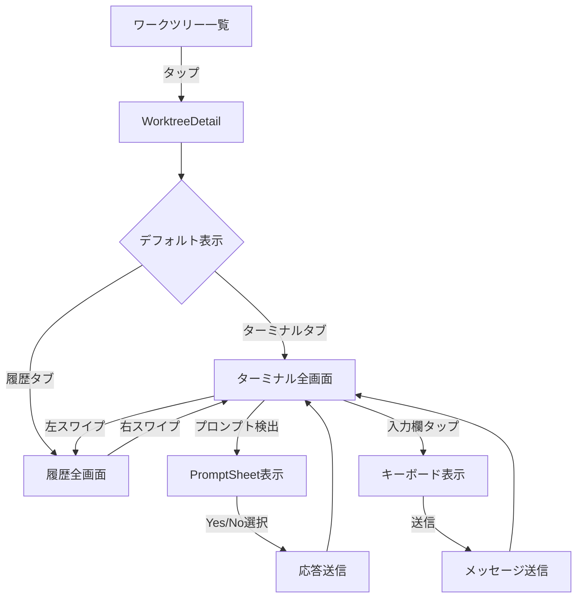
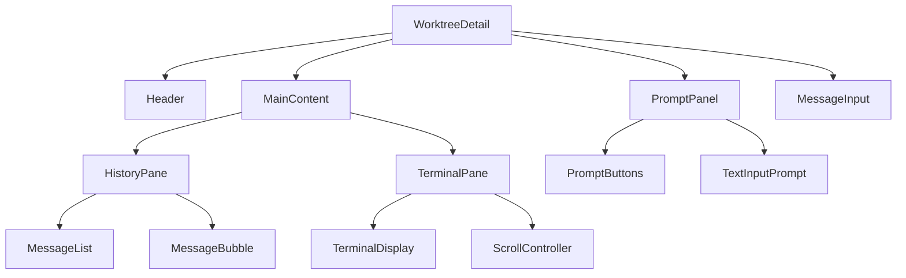
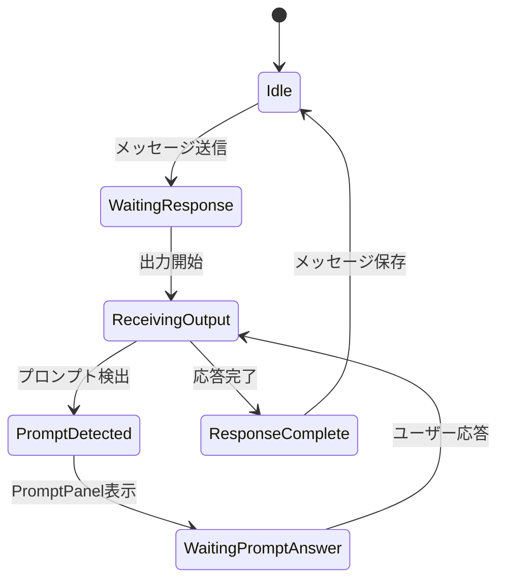

# Issue #13 UX改善 設計方針書

## 1. 概要

### 1.1 目的
Claude Codeとの対話UIを改善し、長いレスポンスや多量の出力による視認性低下を解消する。

### 1.2 背景
- SWEエージェント（Claude Code）からのレスポンスボリュームが多く会話が長くなりがち
- メッセージリストが増えると重要な情報が埋もれる
- プロンプト（yes/no確認）の見落としが発生しやすい
- ターミナル出力とメッセージが混在し見にくい

### 1.3 スコープ
- **対象**: Claude Code連携画面（WorktreeDetail）
- **対象外**: Codex/Gemini連携（将来的に適用可能な設計）

---

## 2. アーキテクチャ設計

### 2.1 画面ブロック構成

Issue #13の要件に基づき、画面を4つの論理ブロックに分割：

| ブロック | 役割 | 表示条件 |
|---------|------|---------|
| **A. ターミナル** | Claude Codeのリアルタイム出力 | 常時表示 |
| **B. プロンプト応答** | yes/no/複数選択への回答 | プロンプト検出時のみ |
| **C. ユーザー入力** | ユーザーからのメッセージ送信 | 常時表示 |
| **D. 入力履歴** | 過去のユーザー入力一覧 | タブ切替で表示 |

### 2.2 レイアウト設計

```
┌─────────────────────────────────────────────────────────────┐
│ ヘッダー (sticky top, z-10)                                │
│ [ワークツリー名] [接続状態] [Refresh] [Terminal] [タブ...]  │
├─────────────────────────────────────────────────────────────┤
│                                                             │
│  ┌────────────────────────┬────────────────────────────┐   │
│  │                        │                            │   │
│  │  D. 入力履歴           │  A. ターミナル出力         │   │
│  │  (メッセージリスト)    │  (リアルタイム)            │   │
│  │                        │                            │   │
│  │  - 独立スクロール      │  - 独立スクロール          │   │
│  │  - 過去の会話表示      │  - 最新出力追従(※1)       │   │
│  │                        │  - ANSI色対応              │   │
│  │                        │                            │   │
│  └────────────────────────┴────────────────────────────┘   │
│                                                             │
├─────────────────────────────────────────────────────────────┤
│ B. プロンプト応答パネル (条件付き表示, z-[5])              │
│ [Yes] [No] [オプション1] [オプション2] ...                  │
├─────────────────────────────────────────────────────────────┤
│ C. ユーザー入力 (sticky bottom, z-[1])                     │
│ [テキストエリア                              ] [送信]       │
└─────────────────────────────────────────────────────────────┘

※1: ユーザーがスクロール中は追従を一時停止
```

### 2.3 レスポンシブ対応

```
【デスクトップ (lg以上: 1024px~)】
- 2カラムレイアウト（履歴 | ターミナル）
- 左右50%ずつ、またはリサイズ可能
- ホバー効果あり

【タブレット (md: 768px~1023px)】
- 2カラムレイアウト（比率調整可能）
- タッチ操作対応

【スマートフォン (sm未満: ~767px)】
- 1カラム全画面レイアウト
- 下部タブバーで画面切替
- スワイプジェスチャー対応
- プロンプトパネルは常に下部固定（最優先表示）
```

---

## 3. モバイル設計（スマートフォン対応）

### 3.1 モバイルレイアウト設計

スマートフォンでは画面を有効活用するため、フルスクリーン＋下部タブバー構成を採用。

```
┌─────────────────────────────────┐
│ ヘッダー（コンパクト）          │
│ [←] [ワークツリー名] [状態]     │
├─────────────────────────────────┤
│                                 │
│                                 │
│  メインコンテンツエリア         │
│  （選択中のタブに応じて表示）   │
│                                 │
│  - ターミナル（全画面）         │
│  - 履歴（全画面）               │
│                                 │
│                                 │
├─────────────────────────────────┤
│ プロンプト応答                  │
│ [Yes] [No] (条件付き表示)       │
├─────────────────────────────────┤
│ ユーザー入力エリア              │
│ [テキスト入力...        ] [送信]│
├─────────────────────────────────┤
│ 下部タブバー                    │
│ [ターミナル] [履歴] [ログ] [情報]│
│        ↑ アクティブ状態表示     │
└─────────────────────────────────┘
```

### 3.2 タッチ操作・ジェスチャー対応

#### タップターゲットサイズ
```typescript
// モバイル向けの最小タップサイズ（Apple HIG / Material Design 準拠）
const MOBILE_TAP_TARGETS = {
  minSize: '44px',           // 最小タップ領域
  buttonHeight: '48px',      // ボタン高さ
  iconSize: '24px',          // アイコンサイズ
  spacing: '8px',            // 要素間スペース
}
```

#### スワイプジェスチャー
```typescript
// src/hooks/useSwipeGesture.ts
interface SwipeConfig {
  onSwipeLeft?: () => void   // ターミナル → 履歴
  onSwipeRight?: () => void  // 履歴 → ターミナル
  threshold: number          // スワイプ判定閾値（デフォルト: 50px）
}

// 使用例: ターミナル↔履歴の画面切替
function useMobileNavigation() {
  const [activePane, setActivePane] = useState<'terminal' | 'history'>('terminal')

  const swipeHandlers = useSwipeGesture({
    onSwipeLeft: () => setActivePane('history'),
    onSwipeRight: () => setActivePane('terminal'),
    threshold: 50,
  })

  return { activePane, setActivePane, swipeHandlers }
}
```

#### プルトゥリフレッシュ
```typescript
// ターミナル/履歴画面の更新
interface PullToRefreshConfig {
  onRefresh: () => Promise<void>
  threshold: number  // 引っ張り距離閾値（デフォルト: 80px）
}
```

### 3.3 モバイルビューポート対応

#### Safe Area 対応（ノッチ・ホームインジケーター）
```tsx
// メインレイアウト
<div className="min-h-screen flex flex-col pb-safe pt-safe">
  {/* コンテンツ */}
</div>

// Tailwind CSS設定追加
// tailwind.config.js
module.exports = {
  theme: {
    extend: {
      padding: {
        'safe': 'env(safe-area-inset-bottom)',
      },
      margin: {
        'safe-bottom': 'env(safe-area-inset-bottom)',
        'safe-top': 'env(safe-area-inset-top)',
      },
    },
  },
}
```

#### キーボード表示時の対応
```typescript
// src/hooks/useVirtualKeyboard.ts
function useVirtualKeyboard() {
  const [keyboardVisible, setKeyboardVisible] = useState(false)
  const [keyboardHeight, setKeyboardHeight] = useState(0)

  useEffect(() => {
    // Visual Viewport API を使用
    if ('visualViewport' in window) {
      const viewport = window.visualViewport!

      const handleResize = () => {
        const heightDiff = window.innerHeight - viewport.height
        setKeyboardVisible(heightDiff > 150)
        setKeyboardHeight(heightDiff)
      }

      viewport.addEventListener('resize', handleResize)
      return () => viewport.removeEventListener('resize', handleResize)
    }
  }, [])

  return { keyboardVisible, keyboardHeight }
}

// 使用例: キーボード表示時に入力欄を見えるように調整
function MessageInput() {
  const { keyboardVisible, keyboardHeight } = useVirtualKeyboard()

  return (
    <div style={{
      paddingBottom: keyboardVisible ? keyboardHeight : 0,
      transition: 'padding-bottom 0.2s ease'
    }}>
      <textarea ... />
    </div>
  )
}
```

### 3.4 モバイル専用コンポーネント

#### MobileTabBar（下部タブバー）
```typescript
// src/components/mobile/MobileTabBar.tsx

interface MobileTabBarProps {
  activeTab: 'terminal' | 'history' | 'logs' | 'info'
  onTabChange: (tab: string) => void
  hasNewOutput?: boolean      // ターミナルに新しい出力がある
  hasPrompt?: boolean         // プロンプト待ち状態
}

// 機能:
// - 4つのタブボタン
// - アクティブ状態のハイライト
// - 新着出力時のバッジ表示（赤丸）
// - プロンプト時の点滅アニメーション
```

#### MobileHeader（コンパクトヘッダー）
```typescript
// src/components/mobile/MobileHeader.tsx

interface MobileHeaderProps {
  worktreeName: string
  connectionStatus: 'connected' | 'disconnected' | 'reconnecting'
  onBack?: () => void
  onRefresh?: () => void
}

// 機能:
// - 戻るボタン（ワークツリー一覧へ）
// - ワークツリー名（省略表示対応）
// - 接続状態インジケーター
// - 更新ボタン
```

#### MobilePromptSheet（ボトムシート型プロンプト）
```typescript
// src/components/mobile/MobilePromptSheet.tsx

interface MobilePromptSheetProps {
  promptData: PromptData | null
  visible: boolean
  onRespond: (answer: string) => void
}

// 機能:
// - ボトムシート形式で表示
// - 大きなタップターゲット（48px以上）
// - スワイプダウンで閉じない（誤操作防止）
// - 振動フィードバック対応
```

### 3.5 モバイルパフォーマンス最適化

```typescript
// モバイル向けポーリング間隔（バッテリー消費考慮）
const MOBILE_POLLING_INTERVALS = {
  idle: 15000,           // 15秒（デスクトップより長め）
  waiting: 2000,         // 2秒
  receiving: 1000,       // 1秒
  background: 30000,     // 30秒（アプリがバックグラウンド時）
}

// モバイル判定（SSR対応）
function useIsMobile() {
  // 初期値はnull（SSR時は判定不可）
  const [isMobile, setIsMobile] = useState<boolean | null>(null)

  useEffect(() => {
    // クライアントサイドでのみ実行
    const checkMobile = () => {
      setIsMobile(window.innerWidth < 768)
    }
    checkMobile()
    window.addEventListener('resize', checkMobile)
    return () => window.removeEventListener('resize', checkMobile)
  }, [])

  return isMobile
}

// 使用例：ローディング状態を考慮
function WorktreeDetail() {
  const isMobile = useIsMobile()

  // SSR時やハイドレーション中はスケルトン表示
  if (isMobile === null) {
    return <LayoutSkeleton />
  }

  return isMobile ? <MobileLayout /> : <DesktopLayout />
}

// バックグラウンド検出
function useAppState() {
  const [appState, setAppState] = useState<'active' | 'background'>('active')

  useEffect(() => {
    const handleVisibility = () => {
      setAppState(document.hidden ? 'background' : 'active')
    }
    document.addEventListener('visibilitychange', handleVisibility)
    return () => document.removeEventListener('visibilitychange', handleVisibility)
  }, [])

  return appState
}
```

### 3.6 モバイルユーザーフロー



### 3.7 モバイル表示の具体例

#### ターミナル画面（スマホ）
```
┌─────────────────────────────────┐
│ ← feature-123      ● Connected │  ← コンパクトヘッダー
├─────────────────────────────────┤
│ $ claude                        │
│ > Running task...              │
│ [████████░░░░] 65%             │
│                                │
│ ✓ File created: src/index.ts  │
│ ✓ Tests passed: 12/12         │
│                                │
│ Do you want to continue?       │
│                                │  ← 全画面ターミナル
│                                │
│                                │
├─────────────────────────────────┤
│ ┌─────────┐ ┌─────────┐        │
│ │   Yes   │ │   No    │        │  ← プロンプトボタン(48px高)
│ └─────────┘ └─────────┘        │
├─────────────────────────────────┤
│ [メッセージを入力...     ] [➤] │  ← 入力エリア
├─────────────────────────────────┤
│  📟        📜       📋      ⓘ  │
│ Terminal  History  Logs   Info │  ← 下部タブバー
│    ●                           │     (アクティブ表示)
└─────────────────────────────────┘
```

#### 履歴画面（スマホ）
```
┌─────────────────────────────────┐
│ ← feature-123      ● Connected │
├─────────────────────────────────┤
│ ┌─────────────────────────────┐│
│ │ You           10:30        ││
│ │ テスト追加して            ││
│ └─────────────────────────────┘│
│ ┌─────────────────────────────┐│
│ │ Claude        10:31        ││
│ │ テストファイルを作成しま  ││
│ │ した。実行しますか？      ││
│ └─────────────────────────────┘│
│ ┌─────────────────────────────┐│
│ │ You           10:32        ││
│ │ はい                       ││
│ └─────────────────────────────┘│
│                                │
├─────────────────────────────────┤
│ [メッセージを入力...     ] [➤] │
├─────────────────────────────────┤
│  📟        📜       📋      ⓘ  │
│ Terminal  History  Logs   Info │
│             ●                  │
└─────────────────────────────────┘
```

### 3.8 モバイルアクセシビリティ

```typescript
// タッチフィードバック
const TOUCH_FEEDBACK = {
  // 触覚フィードバック（対応デバイスのみ）
  haptic: {
    light: () => navigator.vibrate?.(10),
    medium: () => navigator.vibrate?.(20),
    heavy: () => navigator.vibrate?.(30),
  },

  // 視覚フィードバック（Tailwind）
  visual: 'active:scale-95 active:opacity-80 transition-transform',
}

// ボタンコンポーネント例
function MobileButton({ onClick, children }) {
  const handleClick = () => {
    TOUCH_FEEDBACK.haptic.light()
    onClick()
  }

  return (
    <button
      onClick={handleClick}
      className={`
        min-h-[48px] min-w-[48px] px-4
        ${TOUCH_FEEDBACK.visual}
      `}
    >
      {children}
    </button>
  )
}
```

### 3.9 オフライン対応（将来検討）

```typescript
// Service Worker による基本的なオフライン対応
// （将来のPWA化に向けた設計）

interface OfflineCapabilities {
  // 閲覧可能（キャッシュ済みデータ）
  viewCachedMessages: boolean
  viewCachedLogs: boolean

  // 操作不可（オフライン時）
  sendMessages: false
  respondToPrompt: false

  // 再接続時の同期
  pendingActions: PendingAction[]
}
```

### 3.10 ランドスケープモード（横向き）対応

スマートフォンの横向き表示時は、タブレットに近いレイアウトを適用。

```
【横向き（スマートフォン）】
┌─────────────────────────────────────────────────────────────┐
│ [←] feature-123                              ● Connected   │
├───────────────────────────────┬─────────────────────────────┤
│                               │                             │
│  履歴                         │  ターミナル                  │
│  (40%)                        │  (60%)                      │
│                               │                             │
├───────────────────────────────┴─────────────────────────────┤
│ [Yes] [No]                    [メッセージ入力...      ] [➤] │
└─────────────────────────────────────────────────────────────┘
```

```typescript
// src/hooks/useOrientation.ts
function useOrientation() {
  const [orientation, setOrientation] = useState<'portrait' | 'landscape'>('portrait')

  useEffect(() => {
    const checkOrientation = () => {
      const isLandscape = window.innerWidth > window.innerHeight
      setOrientation(isLandscape ? 'landscape' : 'portrait')
    }

    checkOrientation()
    window.addEventListener('resize', checkOrientation)
    window.addEventListener('orientationchange', checkOrientation)

    return () => {
      window.removeEventListener('resize', checkOrientation)
      window.removeEventListener('orientationchange', checkOrientation)
    }
  }, [])

  return orientation
}

// レイアウト判定
function useLayoutMode() {
  const isMobile = useIsMobile()
  const orientation = useOrientation()

  if (!isMobile) return 'desktop'
  if (orientation === 'landscape') return 'mobile-landscape'
  return 'mobile-portrait'
}
```

**横向き時の変更点:**
- 下部タブバーを非表示
- 2カラムレイアウト（履歴40%:ターミナル60%）
- プロンプトと入力欄を横並び
- キーボード表示時は入力欄のみ表示

### 3.11 エラー状態・接続不良時のUI

モバイル環境では通信状態が不安定なため、エラー状態の適切な表示が重要。

```typescript
// src/types/error-state.ts
interface MobileErrorState {
  type: 'connection' | 'timeout' | 'server_error' | 'network_slow'
  message: string
  retryable: boolean
  retryCount: number
}

// src/hooks/useConnectionStatus.ts
function useConnectionStatus() {
  const [status, setStatus] = useState<'online' | 'offline' | 'slow'>('online')

  useEffect(() => {
    // オンライン/オフライン検出
    const handleOnline = () => setStatus('online')
    const handleOffline = () => setStatus('offline')

    window.addEventListener('online', handleOnline)
    window.addEventListener('offline', handleOffline)

    // 接続速度検出（Network Information API）
    if ('connection' in navigator) {
      const conn = (navigator as Navigator & { connection: NetworkInformation }).connection
      const checkSpeed = () => {
        if (conn.effectiveType === '2g' || conn.effectiveType === 'slow-2g') {
          setStatus('slow')
        }
      }
      conn.addEventListener('change', checkSpeed)
    }

    return () => {
      window.removeEventListener('online', handleOnline)
      window.removeEventListener('offline', handleOffline)
    }
  }, [])

  return status
}
```

```tsx
// エラー表示コンポーネント
function MobileErrorBanner({ error, onRetry }: { error: MobileErrorState; onRetry: () => void }) {
  return (
    <div className="fixed top-0 left-0 right-0 z-50 bg-red-500 text-white p-3 safe-area-top">
      <div className="flex items-center justify-between">
        <span className="text-sm">{error.message}</span>
        {error.retryable && (
          <button
            onClick={onRetry}
            className="px-3 py-1 bg-white text-red-500 rounded text-sm font-medium"
          >
            再試行
          </button>
        )}
      </div>
    </div>
  )
}

// オフラインインジケーター
function OfflineIndicator() {
  return (
    <div className="fixed bottom-20 left-1/2 -translate-x-1/2 bg-gray-800 text-white px-4 py-2 rounded-full text-sm">
      📴 オフライン - 接続を確認してください
    </div>
  )
}
```

**エラー時の動作:**
| エラー種別 | 表示 | 動作 |
|-----------|------|------|
| 接続エラー | 上部バナー（赤） | 自動リトライ（exponential backoff） |
| タイムアウト | 上部バナー | 手動リトライボタン |
| オフライン | 中央インジケーター | 接続回復時に自動再接続 |
| 低速通信 | 上部バナー（黄） | ポーリング間隔を延長 |

### 3.12 アクセシビリティ強化

```typescript
// 動きを抑制するユーザー向け設定
const ACCESSIBILITY_CONFIG = {
  // prefers-reduced-motion 対応
  reducedMotion: {
    disableAnimations: true,
    disableAutoScroll: false,  // スクロールは維持
  },

  // スクリーンリーダー対応
  ariaLabels: {
    terminalPane: 'Claude Codeターミナル出力',
    historyPane: 'メッセージ履歴',
    promptPanel: 'プロンプト応答パネル',
    messageInput: 'メッセージ入力欄',
    tabBar: 'ナビゲーションタブ',
  },
}
```

```css
/* 動きを抑制するユーザー向けスタイル */
@media (prefers-reduced-motion: reduce) {
  /* アニメーション無効化 */
  .prompt-panel-enter,
  .terminal-new-content,
  .tab-transition {
    animation: none !important;
    transition: none !important;
  }

  /* スクロールの smooth を無効化 */
  * {
    scroll-behavior: auto !important;
  }
}

/* ハイコントラストモード対応 */
@media (prefers-contrast: high) {
  .terminal-output {
    background: black;
    color: white;
  }

  .prompt-button {
    border: 2px solid currentColor;
  }
}

/* フォーカス表示の強化 */
:focus-visible {
  outline: 3px solid #3b82f6;
  outline-offset: 2px;
}
```

```tsx
// アクセシブルなタブバー
function MobileTabBar({ activeTab, onTabChange }) {
  return (
    <nav
      role="tablist"
      aria-label="メインナビゲーション"
      className="flex justify-around"
    >
      {tabs.map((tab) => (
        <button
          key={tab.id}
          role="tab"
          aria-selected={activeTab === tab.id}
          aria-controls={`panel-${tab.id}`}
          tabIndex={activeTab === tab.id ? 0 : -1}
          onClick={() => onTabChange(tab.id)}
          className="min-h-[48px] min-w-[48px]"
        >
          <span className="sr-only">{tab.label}</span>
          <tab.Icon aria-hidden="true" />
        </button>
      ))}
    </nav>
  )
}
```

**アクセシビリティチェックリスト:**
- [ ] 全ボタンが48px以上のタップターゲット
- [ ] フォーカス順序が論理的
- [ ] スクリーンリーダーで操作可能
- [ ] 色のみに依存しない情報伝達
- [ ] prefers-reduced-motion 対応
- [ ] キーボード操作可能（デスクトップ）

---

## 4. コンポーネント設計

### 4.1 コンポーネント構成図



### 4.2 新規コンポーネント

#### 4.2.1 TerminalDisplay

```typescript
// src/components/worktree/TerminalDisplay.tsx

interface TerminalDisplayProps {
  output: string           // リアルタイム出力
  isActive: boolean        // セッション実行中フラグ
  isThinking: boolean      // 思考中フラグ
  autoScroll?: boolean     // 自動スクロール有効（デフォルト: true）
  onScrollStart?: () => void   // ユーザースクロール開始
  onScrollEnd?: () => void     // ユーザースクロール終了（底部到達時）
}

// 機能:
// - ANSI色対応のターミナル出力表示
// - 自動スクロール（最新出力追従）
// - ユーザースクロール時の追従一時停止
// - 思考中・実行中のステータス表示
```

#### 4.2.2 PromptPanel

```typescript
// src/components/worktree/PromptPanel.tsx

interface PromptPanelProps {
  promptData: PromptData | null  // プロンプト情報
  visible: boolean               // 表示フラグ
  onRespond: (answer: string) => void  // 応答コールバック
  disabled?: boolean             // 無効化フラグ
}

// 機能:
// - yes/no ボタン表示
// - 複数選択オプション表示
// - テキスト入力オプション対応
// - アニメーション付き表示/非表示
```

#### 4.2.3 HistoryPane

```typescript
// src/components/worktree/HistoryPane.tsx

interface HistoryPaneProps {
  messages: ChatMessage[]
  onMessageClick?: (message: ChatMessage) => void
  filter?: 'all' | 'user' | 'assistant'
}

// 機能:
// - 過去メッセージのリスト表示
// - フィルタリング機能
// - 独立スクロール
```

### 4.3 既存コンポーネントの修正

#### 4.3.1 WorktreeDetail

```typescript
// 変更内容:
// 1. レイアウト構造をグリッド化
// 2. PromptPanel の状態管理追加
// 3. TerminalDisplay の統合
// 4. スクロール連動ロジック

// 状態追加:
const [autoScrollEnabled, setAutoScrollEnabled] = useState(true)
const [activePrompt, setActivePrompt] = useState<PromptData | null>(null)
const [layoutMode, setLayoutMode] = useState<'split' | 'tabs'>('split')
```

#### 4.3.2 MessageList

```typescript
// 変更内容:
// 1. リアルタイム出力表示を削除（TerminalDisplayへ移行）
// 2. プロンプト応答UIを削除（PromptPanelへ移行）
// 3. 純粋なメッセージ履歴表示に特化
```

---

## 5. 状態管理設計

### 5.1 状態フロー図



### 5.2 状態定義

```typescript
// src/types/ui-state.ts

interface WorktreeUIState {
  // 基本状態
  phase: 'idle' | 'waiting' | 'receiving' | 'prompt' | 'complete'

  // ターミナル関連
  terminal: {
    output: string
    isActive: boolean
    isThinking: boolean
    autoScroll: boolean
  }

  // プロンプト関連
  prompt: {
    data: PromptData | null
    visible: boolean
    answering: boolean
  }

  // レイアウト関連
  layout: {
    mode: 'split' | 'tabs'
    activeTab: 'history' | 'terminal'
    historyWidth: number  // リサイズ対応
  }
}
```

### 5.3 スクロール制御ロジック

```typescript
// ターミナル自動スクロール制御

// 1. デフォルト: 自動スクロール有効
// 2. ユーザーが上方向にスクロール → 自動スクロール停止
// 3. ユーザーが底部まで戻る → 自動スクロール再開
// 4. 新しいプロンプト検出 → 強制的に底部へスクロール

const handleTerminalScroll = (event: React.UIEvent<HTMLDivElement>) => {
  const { scrollTop, scrollHeight, clientHeight } = event.currentTarget
  const isAtBottom = scrollHeight - scrollTop - clientHeight < 50 // 50px余裕

  if (!isAtBottom && autoScrollEnabled) {
    setAutoScrollEnabled(false) // ユーザースクロール開始
  } else if (isAtBottom && !autoScrollEnabled) {
    setAutoScrollEnabled(true)  // 底部到達で再開
  }
}
```

---

## 6. API設計

### 6.1 既存APIの継続利用

| エンドポイント | 用途 | 変更 |
|---------------|------|------|
| `GET /api/worktrees/:id/messages` | メッセージ取得 | 変更なし |
| `POST /api/worktrees/:id/send` | メッセージ送信 | 変更なし |
| `POST /api/worktrees/:id/respond` | プロンプト応答 | 変更なし |
| `GET /api/worktrees/:id/current-output` | リアルタイム出力 | 変更なし |

### 6.2 ポーリング戦略

```typescript
// 最適化されたポーリング間隔

const POLLING_INTERVALS = {
  idle: 10000,           // 10秒（アイドル時）
  waiting: 1000,         // 1秒（応答待ち時）
  receiving: 500,        // 500ms（出力受信中）
  prompt: 2000,          // 2秒（プロンプト表示中）
  websocket: 15000,      // 15秒（WebSocket接続時）
}
```

---

## 7. スタイル設計

### 7.1 Tailwind CSS クラス構成

```tsx
// メインレイアウト
<div className="min-h-screen flex flex-col">
  {/* ヘッダー */}
  <header className="sticky top-0 z-10 bg-gray-50 border-b">
    {/* ... */}
  </header>

  {/* メインコンテンツ */}
  <main className="flex-1 flex flex-col md:flex-row overflow-hidden">
    {/* 履歴ペイン */}
    <section className="flex-1 md:w-1/2 overflow-y-auto border-r">
      {/* MessageList */}
    </section>

    {/* ターミナルペイン */}
    <section className="flex-1 md:w-1/2 overflow-y-auto bg-gray-900">
      {/* TerminalDisplay */}
    </section>
  </main>

  {/* プロンプトパネル */}
  <div className={cn(
    "sticky bottom-16 z-[5] bg-yellow-50 border-t border-b p-3",
    "transform transition-transform duration-200",
    promptVisible ? "translate-y-0" : "translate-y-full hidden"
  )}>
    {/* PromptPanel */}
  </div>

  {/* 入力フォーム */}
  <footer className="sticky bottom-0 z-[1] bg-gray-50 border-t p-3">
    {/* MessageInput */}
  </footer>
</div>
```

### 7.2 カラースキーム

```typescript
// ターミナル配色
const TERMINAL_COLORS = {
  background: 'bg-gray-900',
  text: 'text-gray-100',
  scrollbar: 'scrollbar-thin scrollbar-thumb-gray-600',
  status: {
    active: 'text-green-400',
    thinking: 'text-yellow-400',
    idle: 'text-gray-500',
  }
}

// プロンプトパネル配色
const PROMPT_COLORS = {
  background: 'bg-yellow-50',
  border: 'border-yellow-200',
  button: {
    yes: 'bg-green-500 hover:bg-green-600 text-white',
    no: 'bg-gray-500 hover:bg-gray-600 text-white',
    option: 'bg-blue-500 hover:bg-blue-600 text-white',
  }
}
```

### 7.3 アニメーション

```css
/* プロンプトパネルの表示アニメーション */
@keyframes slideUp {
  from {
    transform: translateY(100%);
    opacity: 0;
  }
  to {
    transform: translateY(0);
    opacity: 1;
  }
}

.prompt-panel-enter {
  animation: slideUp 0.2s ease-out;
}

/* ターミナル出力の更新ハイライト */
@keyframes highlight {
  from {
    background-color: rgba(34, 197, 94, 0.2);
  }
  to {
    background-color: transparent;
  }
}

.terminal-new-content {
  animation: highlight 0.5s ease-out;
}
```

---

## 8. 設計パターン

### 8.1 Container/Presentational パターン

```
Container (ロジック)          Presentational (表示)
────────────────────         ──────────────────────
WorktreeDetail               TerminalDisplay
├─ 状態管理                  ├─ props受け取り
├─ APIコール                 ├─ 純粋な表示
├─ イベントハンドリング      └─ スタイリング
└─ 子コンポーネントへprops渡し
```

### 8.2 Compound Component パターン

```typescript
// PromptPanel のサブコンポーネント構成
<PromptPanel>
  <PromptPanel.Question>...</PromptPanel.Question>
  <PromptPanel.Options>
    <PromptPanel.YesNo onSelect={...} />
    <PromptPanel.MultiChoice options={...} onSelect={...} />
    <PromptPanel.TextInput onSubmit={...} />
  </PromptPanel.Options>
</PromptPanel>
```

### 8.3 Custom Hook パターン

```typescript
// src/hooks/useTerminalScroll.ts
function useTerminalScroll(ref: RefObject<HTMLDivElement>) {
  const [autoScroll, setAutoScroll] = useState(true)

  const scrollToBottom = useCallback(() => {
    if (ref.current && autoScroll) {
      ref.current.scrollTop = ref.current.scrollHeight
    }
  }, [ref, autoScroll])

  const handleScroll = useCallback((e: UIEvent) => {
    // スクロール位置判定ロジック
  }, [])

  return { autoScroll, setAutoScroll, scrollToBottom, handleScroll }
}

// src/hooks/usePromptDetection.ts
function usePromptDetection(output: string) {
  const [promptData, setPromptData] = useState<PromptData | null>(null)

  useEffect(() => {
    const result = detectPrompt(output)
    if (result.isPrompt) {
      setPromptData(result.promptData)
    }
  }, [output])

  return { promptData, clearPrompt: () => setPromptData(null) }
}
```

---

## 9. データモデル

### 9.1 既存モデルの継続利用

```typescript
// src/types/models.ts - 変更なし

interface ChatMessage {
  id: string
  worktreeId: string
  role: 'user' | 'assistant'
  content: string
  timestamp: Date
  messageType: 'normal' | 'prompt' | 'prompt_response'
  promptData?: PromptData
  cliToolId?: CLIToolType
}

type PromptData = YesNoPromptData | MultipleChoicePromptData
```

### 9.2 UIステート用型定義（新規）

```typescript
// src/types/ui-state.ts

interface TerminalState {
  output: string
  isActive: boolean
  isThinking: boolean
  lastUpdated: Date | null
}

interface PromptState {
  data: PromptData | null
  messageId: string | null
  visible: boolean
  answering: boolean
}

interface LayoutState {
  mode: 'split' | 'tabs'
  mobileActivePane: 'history' | 'terminal'
  splitRatio: number  // 0.3 ~ 0.7
}
```

---

## 10. セキュリティ設計

### 10.1 入力バリデーション

```typescript
// プロンプト応答のバリデーション
function validatePromptResponse(
  answer: string,
  promptType: PromptData['type']
): boolean {
  if (promptType === 'yes_no') {
    return ['yes', 'no', 'y', 'n'].includes(answer.toLowerCase())
  }
  if (promptType === 'multiple_choice') {
    return /^\d+$/.test(answer) || answer.length <= 1000
  }
  return false
}
```

### 10.2 XSS対策

```typescript
// ターミナル出力のサニタイズ
// ansi-to-html ライブラリは信頼できるため、
// 追加のサニタイズは不要だが、念のためエスケープ確認

import AnsiToHtml from 'ansi-to-html'
import DOMPurify from 'dompurify'

const converter = new AnsiToHtml({ escapeXML: true })

function sanitizeTerminalOutput(output: string): string {
  const html = converter.toHtml(output)
  return DOMPurify.sanitize(html, { ALLOWED_TAGS: ['span'], ALLOWED_ATTR: ['style'] })
}
```

> **依存関係の追加が必要:**
> ```bash
> npm install dompurify
> npm install -D @types/dompurify
> ```

---

## 11. パフォーマンス設計

### 11.1 レンダリング最適化

```typescript
// メモ化戦略

// 1. ターミナル出力の差分更新
const MemoizedTerminalDisplay = React.memo(TerminalDisplay, (prev, next) => {
  return prev.output === next.output && prev.isActive === next.isActive
})

// 2. メッセージリストの仮想化（大量メッセージ対応）
import { FixedSizeList } from 'react-window'

function VirtualizedMessageList({ messages }) {
  return (
    <FixedSizeList
      height={600}
      itemCount={messages.length}
      itemSize={80}
    >
      {({ index, style }) => (
        <MessageBubble message={messages[index]} style={style} />
      )}
    </FixedSizeList>
  )
}
```

### 11.2 ポーリング最適化

```typescript
// 適応型ポーリング
function useAdaptivePolling(phase: UIPhase) {
  const [interval, setInterval] = useState(POLLING_INTERVALS.idle)

  useEffect(() => {
    setInterval(POLLING_INTERVALS[phase])
  }, [phase])

  // 画面非表示時はポーリング停止
  useEffect(() => {
    const handleVisibility = () => {
      if (document.hidden) {
        // ポーリング停止
      } else {
        // ポーリング再開
      }
    }
    document.addEventListener('visibilitychange', handleVisibility)
    return () => document.removeEventListener('visibilitychange', handleVisibility)
  }, [])

  return interval
}
```

### 11.3 バンドルサイズ

```typescript
// 動的インポートで初期バンドル削減
const TerminalDisplay = dynamic(() => import('./TerminalDisplay'), {
  loading: () => <TerminalSkeleton />,
  ssr: false
})

const LogViewer = dynamic(() => import('./LogViewer'), {
  loading: () => <LogSkeleton />
})
```

---

## 12. 設計判断とトレードオフ

### 12.1 採用した設計

| 決定事項 | 理由 | トレードオフ |
|---------|------|-------------|
| 2カラム分割 | ターミナルとメッセージを同時表示可能 | 画面幅が狭いと見にくい |
| プロンプト専用パネル | 見落とし防止、操作の明確化 | 画面下部の占有面積増加 |
| 自動スクロール制御 | ユーザーが過去の出力を確認しやすい | 実装複雑度の増加 |
| CSS Grid レイアウト | 柔軟なリサイズ対応 | IE非対応（許容） |

### 12.2 代替案との比較

#### 代替案1: タブ切替のみ（モバイルファースト）
- **メリット**: シンプルな実装、モバイル最適化
- **デメリット**: デスクトップでの情報密度低下
- **却下理由**: Claude Codeはデスクトップ利用が主

#### 代替案2: フローティングターミナル
- **メリット**: 画面を占有しない
- **デメリット**: 操作が複雑、実装コスト高
- **却下理由**: KISS原則に反する

#### 代替案3: 既存UIのまま最適化
- **メリット**: 変更量が少ない
- **デメリット**: 根本的な問題解決にならない
- **却下理由**: Issue #13の要件を満たさない

---

## 13. 実装計画

### 13.1 フェーズ分割

```
Phase 1: 基盤コンポーネント
├─ TerminalDisplay コンポーネント新規作成
├─ useTerminalScroll フック実装
├─ useIsMobile フック実装
└─ 単体テスト作成

Phase 2: デスクトップレイアウト再構成
├─ WorktreeDetail のグリッド化
├─ HistoryPane 分離
├─ 2カラムレイアウト実装
└─ 結合テスト

Phase 3: プロンプト分離
├─ PromptPanel コンポーネント新規作成
├─ MessageList からプロンプト表示削除
├─ アニメーション実装
└─ 結合テスト

Phase 4: モバイル対応
├─ MobileTabBar 新規作成
├─ MobileHeader 新規作成
├─ MobilePromptSheet 新規作成
├─ useSwipeGesture フック実装
├─ useVirtualKeyboard フック実装
├─ Safe Area 対応
├─ タッチフィードバック実装
└─ モバイル結合テスト

Phase 5: 最適化・仕上げ
├─ パフォーマンスチューニング（モバイル含む）
├─ アクセシビリティ対応
├─ E2Eテスト（デスクトップ/モバイル）
└─ ドキュメント更新
```

### 13.2 ファイル変更一覧

| ファイル | 変更種別 | 内容 |
|---------|---------|------|
| **共通コンポーネント** | | |
| `src/components/worktree/TerminalDisplay.tsx` | 新規 | ターミナル表示 |
| `src/components/worktree/PromptPanel.tsx` | 新規 | プロンプト応答 |
| `src/components/worktree/HistoryPane.tsx` | 新規 | メッセージ履歴 |
| `src/components/worktree/WorktreeDetail.tsx` | 修正 | レイアウト変更 |
| `src/components/worktree/MessageList.tsx` | 修正 | 表示機能削減 |
| **モバイル専用コンポーネント** | | |
| `src/components/mobile/MobileTabBar.tsx` | 新規 | 下部タブバー |
| `src/components/mobile/MobileHeader.tsx` | 新規 | コンパクトヘッダー |
| `src/components/mobile/MobilePromptSheet.tsx` | 新規 | ボトムシート型プロンプト |
| `src/components/mobile/MobileButton.tsx` | 新規 | タッチ最適化ボタン |
| `src/components/mobile/MobileErrorBanner.tsx` | 新規 | エラー表示バナー |
| `src/components/mobile/OfflineIndicator.tsx` | 新規 | オフラインインジケーター |
| **カスタムフック** | | |
| `src/hooks/useTerminalScroll.ts` | 新規 | スクロール制御 |
| `src/hooks/usePromptDetection.ts` | 新規 | プロンプト検出 |
| `src/hooks/useIsMobile.ts` | 新規 | モバイル判定 |
| `src/hooks/useSwipeGesture.ts` | 新規 | スワイプジェスチャー |
| `src/hooks/useVirtualKeyboard.ts` | 新規 | キーボード検出 |
| `src/hooks/useAppState.ts` | 新規 | アプリ状態（バックグラウンド検出） |
| `src/hooks/useOrientation.ts` | 新規 | 画面向き検出 |
| `src/hooks/useLayoutMode.ts` | 新規 | レイアウトモード判定 |
| `src/hooks/useConnectionStatus.ts` | 新規 | 接続状態検出 |
| **型定義・設定** | | |
| `src/types/ui-state.ts` | 新規 | UI状態型定義 |
| `src/types/error-state.ts` | 新規 | エラー状態型定義 |
| `tailwind.config.js` | 修正 | Safe Area対応追加 |
| `package.json` | 修正 | dompurify依存追加 |
| **テスト** | | |
| `tests/unit/components/TerminalDisplay.test.tsx` | 新規 | ターミナル単体テスト |
| `tests/unit/components/PromptPanel.test.tsx` | 新規 | プロンプト単体テスト |
| `tests/unit/hooks/useSwipeGesture.test.ts` | 新規 | スワイプフック単体テスト |
| `tests/e2e/mobile-ux.spec.ts` | 新規 | モバイルE2Eテスト |

---

## 14. テスト戦略

### 14.1 単体テスト

```typescript
// tests/unit/components/TerminalDisplay.test.tsx
describe('TerminalDisplay', () => {
  it('ANSI色付き出力を正しく表示する')
  it('自動スクロールが有効な場合、新しい出力で底部にスクロールする')
  it('ユーザースクロール時に自動スクロールを停止する')
  it('底部に戻った時に自動スクロールを再開する')
})

// tests/unit/components/PromptPanel.test.tsx
describe('PromptPanel', () => {
  it('yes/noプロンプトでボタンを2つ表示する')
  it('複数選択プロンプトで全オプションを表示する')
  it('ボタンクリックでonRespondが呼ばれる')
  it('visible=falseの場合に非表示になる')
})
```

### 14.2 結合テスト

```typescript
// tests/integration/worktree-ux.test.ts
describe('WorktreeDetail UX', () => {
  it('ターミナル出力とメッセージ履歴が並列表示される')
  it('プロンプト検出時にPromptPanelが表示される')
  it('プロンプト応答後にPromptPanelが非表示になる')
  it('モバイル表示でタブ切替が機能する')
})
```

### 14.3 E2Eテスト（デスクトップ）

```typescript
// tests/e2e/worktree-ux.spec.ts
test('Claude Code出力中にユーザーがスクロールできる', async ({ page }) => {
  // セッション開始
  // ターミナル出力開始
  // ユーザースクロール
  // 新しい出力追加
  // スクロール位置が変わらないことを確認
})
```

### 14.4 E2Eテスト（モバイル）

```typescript
// tests/e2e/mobile-ux.spec.ts
import { test, devices } from '@playwright/test'

// モバイルデバイス設定
test.use({ ...devices['iPhone 14'] })

describe('Mobile WorktreeDetail UX', () => {
  test('下部タブバーでターミナル/履歴が切り替わる', async ({ page }) => {
    // タブバーのTerminalタップ → ターミナル全画面表示
    // タブバーのHistoryタップ → 履歴全画面表示
  })

  test('プロンプト時にボトムシートが表示される', async ({ page }) => {
    // プロンプト検出
    // MobilePromptSheet 表示確認
    // ボタンのタップ可能サイズ確認（48px以上）
  })

  test('キーボード表示時にレイアウトが調整される', async ({ page }) => {
    // 入力欄タップ
    // キーボード表示
    // 入力欄が見える位置に調整されることを確認
  })

  test('スワイプジェスチャーで画面切替できる', async ({ page }) => {
    // ターミナル画面で左スワイプ → 履歴へ
    // 履歴画面で右スワイプ → ターミナルへ
  })

  test('Safe Areaが正しく適用される', async ({ page }) => {
    // ノッチ領域を避けてコンテンツが表示
    // ホームインジケーター領域を避けてタブバーが表示
  })
})

// 複数デバイスでのテスト
const mobileDevices = ['iPhone 14', 'iPhone SE', 'Pixel 7', 'Galaxy S21']
for (const device of mobileDevices) {
  test.describe(`${device} specific tests`, () => {
    test.use({ ...devices[device] })

    test('基本表示が正常', async ({ page }) => {
      // 各デバイスで基本的なレイアウトが崩れないことを確認
    })
  })
}
```

---

## 15. 制約条件の確認

### CLAUDE.md 準拠チェック

| 原則 | 対応状況 |
|-----|---------|
| **SOLID** | ✅ 単一責任: 各コンポーネントが1つの役割 |
| **KISS** | ✅ シンプルな2カラム+パネル構成 |
| **YAGNI** | ✅ 必要最小限の機能に限定 |
| **DRY** | ✅ カスタムフックで共通ロジック抽出 |

### 技術制約

- Next.js 14 App Router 対応
- TypeScript strict mode
- Tailwind CSS のみ（外部CSSフレームワーク不使用）
- SQLite/better-sqlite3（DBスキーマ変更なし）

---

## 16. 状態管理設計（useReducer導入）

### 16.1 導入背景

現在の`WorktreeDetail.tsx`では18個のuseStateが分散しており、状態の依存関係が複雑化している。
`useReducer`を導入することで、状態遷移を明確化し、保守性を向上させる。

### 16.2 状態構造

```typescript
// src/types/ui-state.ts

/**
 * UI Phase (状態遷移の中心)
 */
export type UIPhase = 'idle' | 'waiting' | 'receiving' | 'prompt' | 'complete';

/**
 * ターミナル状態
 */
export interface TerminalState {
  output: string;
  realtimeSnippet: string;
  isActive: boolean;
  isThinking: boolean;
  autoScroll: boolean;
  lastUpdated: Date | null;
}

/**
 * プロンプト状態
 */
export interface PromptState {
  data: PromptData | null;
  messageId: string | null;
  visible: boolean;
  answering: boolean;
}

/**
 * レイアウト状態
 */
export interface LayoutState {
  mode: 'split' | 'tabs';
  mobileActivePane: 'history' | 'terminal';
  splitRatio: number;
}

/**
 * エラー状態
 */
export interface ErrorState {
  type: 'connection' | 'timeout' | 'server_error' | 'network_slow' | null;
  message: string | null;
  retryable: boolean;
  retryCount: number;
}

/**
 * 統合UI状態
 */
export interface WorktreeUIState {
  phase: UIPhase;
  terminal: TerminalState;
  prompt: PromptState;
  layout: LayoutState;
  error: ErrorState;
  messages: ChatMessage[];
  wsConnected: boolean;
}
```

### 16.3 アクション定義

```typescript
// src/types/ui-actions.ts

export type WorktreeUIAction =
  // Phase transitions
  | { type: 'SET_PHASE'; phase: UIPhase }

  // Terminal actions
  | { type: 'SET_TERMINAL_OUTPUT'; output: string; realtimeSnippet: string }
  | { type: 'SET_TERMINAL_ACTIVE'; isActive: boolean }
  | { type: 'SET_TERMINAL_THINKING'; isThinking: boolean }
  | { type: 'SET_AUTO_SCROLL'; enabled: boolean }

  // Prompt actions
  | { type: 'SHOW_PROMPT'; data: PromptData; messageId: string }
  | { type: 'CLEAR_PROMPT' }
  | { type: 'SET_PROMPT_ANSWERING'; answering: boolean }

  // Layout actions
  | { type: 'SET_LAYOUT_MODE'; mode: 'split' | 'tabs' }
  | { type: 'SET_MOBILE_ACTIVE_PANE'; pane: 'history' | 'terminal' }
  | { type: 'SET_SPLIT_RATIO'; ratio: number }

  // Error actions
  | { type: 'SET_ERROR'; error: ErrorState }
  | { type: 'CLEAR_ERROR' }
  | { type: 'INCREMENT_RETRY_COUNT' }

  // Message actions
  | { type: 'SET_MESSAGES'; messages: ChatMessage[] }
  | { type: 'ADD_MESSAGE'; message: ChatMessage }
  | { type: 'UPDATE_MESSAGE'; id: string; updates: Partial<ChatMessage> }
  | { type: 'CLEAR_MESSAGES' }

  // Connection actions
  | { type: 'SET_WS_CONNECTED'; connected: boolean }

  // Compound actions (複数状態を同時更新)
  | { type: 'START_WAITING_FOR_RESPONSE'; cliToolId: CLIToolType }
  | { type: 'RESPONSE_RECEIVED'; message: ChatMessage }
  | { type: 'SESSION_ENDED' };
```

### 16.4 Reducer実装

```typescript
// src/hooks/useWorktreeUIReducer.ts

const initialState: WorktreeUIState = {
  phase: 'idle',
  terminal: {
    output: '',
    realtimeSnippet: '',
    isActive: false,
    isThinking: false,
    autoScroll: true,
    lastUpdated: null,
  },
  prompt: {
    data: null,
    messageId: null,
    visible: false,
    answering: false,
  },
  layout: {
    mode: 'split',
    mobileActivePane: 'terminal',
    splitRatio: 0.5,
  },
  error: {
    type: null,
    message: null,
    retryable: false,
    retryCount: 0,
  },
  messages: [],
  wsConnected: false,
};

function worktreeUIReducer(
  state: WorktreeUIState,
  action: WorktreeUIAction
): WorktreeUIState {
  switch (action.type) {
    // Phase transitions
    case 'SET_PHASE':
      return { ...state, phase: action.phase };

    // Terminal actions
    case 'SET_TERMINAL_OUTPUT':
      return {
        ...state,
        terminal: {
          ...state.terminal,
          output: action.output,
          realtimeSnippet: action.realtimeSnippet,
          lastUpdated: new Date(),
        },
      };

    case 'SET_TERMINAL_ACTIVE':
      return {
        ...state,
        terminal: { ...state.terminal, isActive: action.isActive },
      };

    case 'SET_TERMINAL_THINKING':
      return {
        ...state,
        terminal: { ...state.terminal, isThinking: action.isThinking },
      };

    case 'SET_AUTO_SCROLL':
      return {
        ...state,
        terminal: { ...state.terminal, autoScroll: action.enabled },
      };

    // Prompt actions
    case 'SHOW_PROMPT':
      return {
        ...state,
        phase: 'prompt',
        prompt: {
          data: action.data,
          messageId: action.messageId,
          visible: true,
          answering: false,
        },
      };

    case 'CLEAR_PROMPT':
      return {
        ...state,
        prompt: { ...initialState.prompt },
      };

    case 'SET_PROMPT_ANSWERING':
      return {
        ...state,
        prompt: { ...state.prompt, answering: action.answering },
      };

    // Layout actions
    case 'SET_LAYOUT_MODE':
      return {
        ...state,
        layout: { ...state.layout, mode: action.mode },
      };

    case 'SET_MOBILE_ACTIVE_PANE':
      return {
        ...state,
        layout: { ...state.layout, mobileActivePane: action.pane },
      };

    // Error actions
    case 'SET_ERROR':
      return { ...state, error: action.error };

    case 'CLEAR_ERROR':
      return { ...state, error: { ...initialState.error } };

    case 'INCREMENT_RETRY_COUNT':
      return {
        ...state,
        error: { ...state.error, retryCount: state.error.retryCount + 1 },
      };

    // Message actions
    case 'SET_MESSAGES':
      return { ...state, messages: action.messages };

    case 'ADD_MESSAGE':
      return { ...state, messages: [...state.messages, action.message] };

    case 'UPDATE_MESSAGE':
      return {
        ...state,
        messages: state.messages.map((msg) =>
          msg.id === action.id ? { ...msg, ...action.updates } : msg
        ),
      };

    case 'CLEAR_MESSAGES':
      return { ...state, messages: [] };

    // Connection actions
    case 'SET_WS_CONNECTED':
      return { ...state, wsConnected: action.connected };

    // Compound actions
    case 'START_WAITING_FOR_RESPONSE':
      return {
        ...state,
        phase: 'waiting',
        terminal: {
          ...state.terminal,
          isActive: true,
          output: '',
          realtimeSnippet: '',
        },
        prompt: { ...initialState.prompt },
      };

    case 'RESPONSE_RECEIVED':
      return {
        ...state,
        phase: 'complete',
        messages: [...state.messages, action.message],
        terminal: {
          ...state.terminal,
          isActive: false,
          isThinking: false,
        },
      };

    case 'SESSION_ENDED':
      return {
        ...state,
        phase: 'idle',
        terminal: { ...initialState.terminal },
        prompt: { ...initialState.prompt },
      };

    default:
      return state;
  }
}
```

### 16.5 カスタムフック

```typescript
// src/hooks/useWorktreeUIState.ts

import { useReducer, useCallback, useMemo } from 'react';

export function useWorktreeUIState() {
  const [state, dispatch] = useReducer(worktreeUIReducer, initialState);

  // Memoized action creators
  const actions = useMemo(() => ({
    setPhase: (phase: UIPhase) => dispatch({ type: 'SET_PHASE', phase }),

    setTerminalOutput: (output: string, realtimeSnippet: string) =>
      dispatch({ type: 'SET_TERMINAL_OUTPUT', output, realtimeSnippet }),

    showPrompt: (data: PromptData, messageId: string) =>
      dispatch({ type: 'SHOW_PROMPT', data, messageId }),

    clearPrompt: () => dispatch({ type: 'CLEAR_PROMPT' }),

    setError: (error: ErrorState) => dispatch({ type: 'SET_ERROR', error }),

    clearError: () => dispatch({ type: 'CLEAR_ERROR' }),

    setMessages: (messages: ChatMessage[]) =>
      dispatch({ type: 'SET_MESSAGES', messages }),

    startWaitingForResponse: (cliToolId: CLIToolType) =>
      dispatch({ type: 'START_WAITING_FOR_RESPONSE', cliToolId }),

    responseReceived: (message: ChatMessage) =>
      dispatch({ type: 'RESPONSE_RECEIVED', message }),

    sessionEnded: () => dispatch({ type: 'SESSION_ENDED' }),

    setAutoScroll: (enabled: boolean) =>
      dispatch({ type: 'SET_AUTO_SCROLL', enabled }),

    setMobileActivePane: (pane: 'history' | 'terminal') =>
      dispatch({ type: 'SET_MOBILE_ACTIVE_PANE', pane }),
  }), []);

  return { state, dispatch, actions };
}
```

### 16.6 移行計画

1. **Phase 1**: `useWorktreeUIState`フックを実装
2. **Phase 2**: `WorktreeDetail`内の個別useStateを段階的に移行
3. **Phase 3**: 子コンポーネントへのprops受け渡しを最適化
4. **Phase 4**: テスト追加・動作確認

---

## 17. エラーバウンダリ設計

### 17.1 設計方針

各ペイン（ターミナル、履歴、プロンプト）に独立したError Boundaryを設置し、
一部のエラーがアプリケーション全体をクラッシュさせないようにする。

### 17.2 コンポーネント構成

```
WorktreeDetail
├─ ErrorBoundary (グローバル)
│  ├─ HistoryPane
│  │  └─ ErrorBoundary (履歴専用)
│  │     └─ MessageList
│  │
│  ├─ TerminalPane
│  │  └─ ErrorBoundary (ターミナル専用)
│  │     └─ TerminalDisplay
│  │
│  └─ PromptPanel
│     └─ ErrorBoundary (プロンプト専用)
│        └─ PromptButtons
```

### 17.3 実装

```typescript
// src/components/error/ErrorBoundary.tsx

'use client';

import React, { Component, ErrorInfo, ReactNode } from 'react';

interface Props {
  children: ReactNode;
  fallback?: ReactNode;
  onError?: (error: Error, errorInfo: ErrorInfo) => void;
  componentName?: string;
}

interface State {
  hasError: boolean;
  error: Error | null;
}

export class ErrorBoundary extends Component<Props, State> {
  constructor(props: Props) {
    super(props);
    this.state = { hasError: false, error: null };
  }

  static getDerivedStateFromError(error: Error): State {
    return { hasError: true, error };
  }

  componentDidCatch(error: Error, errorInfo: ErrorInfo) {
    console.error(`[ErrorBoundary:${this.props.componentName}]`, error, errorInfo);
    this.props.onError?.(error, errorInfo);
  }

  handleRetry = () => {
    this.setState({ hasError: false, error: null });
  };

  render() {
    if (this.state.hasError) {
      if (this.props.fallback) {
        return this.props.fallback;
      }
      return (
        <DefaultErrorFallback
          componentName={this.props.componentName}
          error={this.state.error}
          onRetry={this.handleRetry}
        />
      );
    }

    return this.props.children;
  }
}
```

### 17.4 フォールバックUI

```typescript
// src/components/error/fallbacks.tsx

'use client';

import React from 'react';

interface ErrorFallbackProps {
  componentName?: string;
  error: Error | null;
  onRetry?: () => void;
}

/**
 * デフォルトのエラーフォールバック
 */
export function DefaultErrorFallback({
  componentName,
  error,
  onRetry,
}: ErrorFallbackProps) {
  return (
    <div className="p-4 bg-red-50 border border-red-200 rounded-lg">
      <div className="flex items-center gap-2 text-red-800 mb-2">
        <svg className="w-5 h-5" fill="currentColor" viewBox="0 0 20 20">
          <path
            fillRule="evenodd"
            d="M18 10a8 8 0 11-16 0 8 8 0 0116 0zm-7 4a1 1 0 11-2 0 1 1 0 012 0zm-1-9a1 1 0 00-1 1v4a1 1 0 102 0V6a1 1 0 00-1-1z"
            clipRule="evenodd"
          />
        </svg>
        <span className="font-medium">
          {componentName ? `${componentName}でエラーが発生しました` : 'エラーが発生しました'}
        </span>
      </div>
      {error && (
        <p className="text-sm text-red-600 mb-3">{error.message}</p>
      )}
      {onRetry && (
        <button
          onClick={onRetry}
          className="px-4 py-2 bg-red-600 text-white rounded hover:bg-red-700 transition-colors text-sm"
        >
          再試行
        </button>
      )}
    </div>
  );
}

/**
 * ターミナル専用フォールバック
 */
export function TerminalErrorFallback({
  error,
  onRetry,
}: ErrorFallbackProps) {
  return (
    <div className="h-full flex items-center justify-center bg-gray-900 text-gray-100 p-4">
      <div className="text-center">
        <div className="text-red-400 mb-2">
          <svg className="w-12 h-12 mx-auto" fill="none" stroke="currentColor" viewBox="0 0 24 24">
            <path
              strokeLinecap="round"
              strokeLinejoin="round"
              strokeWidth={2}
              d="M12 9v2m0 4h.01m-6.938 4h13.856c1.54 0 2.502-1.667 1.732-3L13.732 4c-.77-1.333-2.694-1.333-3.464 0L3.34 16c-.77 1.333.192 3 1.732 3z"
            />
          </svg>
        </div>
        <h3 className="text-lg font-medium mb-2">ターミナル表示エラー</h3>
        <p className="text-sm text-gray-400 mb-4">
          {error?.message || 'ターミナル出力の表示中にエラーが発生しました'}
        </p>
        {onRetry && (
          <button
            onClick={onRetry}
            className="px-4 py-2 bg-gray-700 text-white rounded hover:bg-gray-600 transition-colors text-sm"
          >
            再読み込み
          </button>
        )}
      </div>
    </div>
  );
}

/**
 * 履歴ペイン専用フォールバック
 */
export function HistoryErrorFallback({
  error,
  onRetry,
}: ErrorFallbackProps) {
  return (
    <div className="h-full flex items-center justify-center bg-gray-50 p-4">
      <div className="text-center">
        <div className="text-yellow-500 mb-2">
          <svg className="w-12 h-12 mx-auto" fill="none" stroke="currentColor" viewBox="0 0 24 24">
            <path
              strokeLinecap="round"
              strokeLinejoin="round"
              strokeWidth={2}
              d="M8 12h.01M12 12h.01M16 12h.01M21 12c0 4.418-4.03 8-9 8a9.863 9.863 0 01-4.255-.949L3 20l1.395-3.72C3.512 15.042 3 13.574 3 12c0-4.418 4.03-8 9-8s9 3.582 9 8z"
            />
          </svg>
        </div>
        <h3 className="text-lg font-medium text-gray-800 mb-2">メッセージ履歴の読み込みエラー</h3>
        <p className="text-sm text-gray-600 mb-4">
          {error?.message || '履歴の表示中にエラーが発生しました'}
        </p>
        {onRetry && (
          <button
            onClick={onRetry}
            className="px-4 py-2 bg-blue-600 text-white rounded hover:bg-blue-700 transition-colors text-sm"
          >
            再読み込み
          </button>
        )}
      </div>
    </div>
  );
}

/**
 * プロンプトパネル専用フォールバック
 */
export function PromptErrorFallback({
  error,
  onRetry,
}: ErrorFallbackProps) {
  return (
    <div className="p-4 bg-yellow-50 border border-yellow-200 rounded-lg">
      <div className="flex items-center gap-2 text-yellow-800 mb-2">
        <svg className="w-5 h-5" fill="currentColor" viewBox="0 0 20 20">
          <path
            fillRule="evenodd"
            d="M8.257 3.099c.765-1.36 2.722-1.36 3.486 0l5.58 9.92c.75 1.334-.213 2.98-1.742 2.98H4.42c-1.53 0-2.493-1.646-1.743-2.98l5.58-9.92zM11 13a1 1 0 11-2 0 1 1 0 012 0zm-1-8a1 1 0 00-1 1v3a1 1 0 002 0V6a1 1 0 00-1-1z"
            clipRule="evenodd"
          />
        </svg>
        <span className="font-medium">プロンプト応答エラー</span>
      </div>
      <p className="text-sm text-yellow-700 mb-3">
        {error?.message || '選択肢の表示中にエラーが発生しました'}
      </p>
      {onRetry && (
        <button
          onClick={onRetry}
          className="px-4 py-2 bg-yellow-600 text-white rounded hover:bg-yellow-700 transition-colors text-sm"
        >
          再試行
        </button>
      )}
    </div>
  );
}
```

### 17.5 使用例

```typescript
// src/components/worktree/WorktreeDetail.tsx での使用

import { ErrorBoundary } from '@/components/error/ErrorBoundary';
import {
  TerminalErrorFallback,
  HistoryErrorFallback,
  PromptErrorFallback,
} from '@/components/error/fallbacks';

function WorktreeDetail({ worktreeId }: WorktreeDetailProps) {
  return (
    <div className="min-h-screen flex flex-col">
      {/* ... header ... */}

      <main className="flex-1 flex">
        {/* 履歴ペイン */}
        <ErrorBoundary
          componentName="履歴"
          fallback={<HistoryErrorFallback onRetry={() => window.location.reload()} />}
        >
          <HistoryPane messages={messages} />
        </ErrorBoundary>

        {/* ターミナルペイン */}
        <ErrorBoundary
          componentName="ターミナル"
          fallback={<TerminalErrorFallback onRetry={() => window.location.reload()} />}
        >
          <TerminalDisplay output={terminalOutput} />
        </ErrorBoundary>
      </main>

      {/* プロンプトパネル */}
      <ErrorBoundary
        componentName="プロンプト"
        fallback={<PromptErrorFallback onRetry={() => window.location.reload()} />}
      >
        <PromptPanel promptData={promptData} />
      </ErrorBoundary>
    </div>
  );
}
```

---

## 18. XSS対策・セキュリティテスト設計

### 18.1 対策方針

ターミナル出力にはANSIエスケープコードが含まれるため、`ansi-to-html`でHTML変換後、
`DOMPurify`でサニタイズを行う。

### 18.2 依存パッケージ

```bash
# isomorphic-dompurifyはNode.js/ブラウザ両環境で動作
npm install isomorphic-dompurify
```

### 18.3 サニタイズ関数

```typescript
// src/lib/sanitize.ts

import DOMPurify from 'isomorphic-dompurify';
import AnsiToHtml from 'ansi-to-html';

const ansiConverter = new AnsiToHtml({
  fg: '#d1d5db',  // gray-300
  bg: '#1f2937',  // gray-800
  newline: true,
  escapeXML: true,  // 重要: XMLエスケープを有効化
});

/**
 * ターミナル出力をサニタイズしてHTMLに変換
 *
 * @param output - ANSIエスケープコードを含む可能性のあるターミナル出力
 * @returns サニタイズされたHTML文字列
 */
export function sanitizeTerminalOutput(output: string): string {
  // Step 1: ANSIコードをHTMLに変換（escapeXML: true で基本的なエスケープ済み）
  const html = ansiConverter.toHtml(output);

  // Step 2: DOMPurifyで追加サニタイズ
  // spanタグとstyle属性のみ許可（ANSI色用）
  const sanitized = DOMPurify.sanitize(html, {
    ALLOWED_TAGS: ['span', 'br'],
    ALLOWED_ATTR: ['style'],
    ALLOW_DATA_ATTR: false,
  });

  return sanitized;
}

/**
 * ユーザー入力テキストをサニタイズ
 *
 * @param input - ユーザーからの入力テキスト
 * @returns サニタイズされたテキスト
 */
export function sanitizeUserInput(input: string): string {
  return DOMPurify.sanitize(input, {
    ALLOWED_TAGS: [],  // すべてのHTMLタグを除去
    ALLOWED_ATTR: [],
  });
}
```

### 18.4 テストケース

```typescript
// tests/unit/lib/sanitize.test.ts

import { describe, it, expect } from 'vitest';
import { sanitizeTerminalOutput, sanitizeUserInput } from '@/lib/sanitize';

describe('sanitizeTerminalOutput', () => {
  describe('XSS攻撃ベクター対策', () => {
    it('should escape script tags', () => {
      const malicious = '<script>alert("xss")</script>';
      const result = sanitizeTerminalOutput(malicious);
      expect(result).not.toContain('<script>');
      expect(result).not.toContain('alert');
    });

    it('should escape script tags within ANSI codes', () => {
      const malicious = '\x1b[31m<script>alert("xss")</script>\x1b[0m';
      const result = sanitizeTerminalOutput(malicious);
      expect(result).not.toContain('<script>');
    });

    it('should escape img onerror handlers', () => {
      const malicious = '';
      const result = sanitizeTerminalOutput(malicious);
      expect(result).not.toContain('onerror');
      expect(result).not.toContain(' {
      const malicious = '<svg onload="alert(1)">';
      const result = sanitizeTerminalOutput(malicious);
      expect(result).not.toContain('onload');
      expect(result).not.toContain('<svg');
    });

    it('should escape javascript: URLs', () => {
      const malicious = '<a href="javascript:alert(1)">click</a>';
      const result = sanitizeTerminalOutput(malicious);
      expect(result).not.toContain('javascript:');
    });

    it('should escape data: URLs with scripts', () => {
      const malicious = '<a href="data:text/html,<script>alert(1)</script>">click</a>';
      const result = sanitizeTerminalOutput(malicious);
      expect(result).not.toContain('data:');
    });

    it('should escape event handlers', () => {
      const malicious = '<div onclick="alert(1)">click me</div>';
      const result = sanitizeTerminalOutput(malicious);
      expect(result).not.toContain('onclick');
    });

    it('should escape style-based attacks', () => {
      const malicious = '<div style="background:url(javascript:alert(1))">test</div>';
      const result = sanitizeTerminalOutput(malicious);
      expect(result).not.toContain('javascript:');
    });

    it('should handle encoded attacks', () => {
      const malicious = '&lt;script&gt;alert(1)&lt;/script&gt;';
      const result = sanitizeTerminalOutput(malicious);
      // Double-encoded should remain safe
      expect(result).not.toMatch(/<script>/i);
    });

    it('should escape unicode obfuscation attempts', () => {
      // Using unicode escape sequences
      const malicious = '\u003cscript\u003ealert(1)\u003c/script\u003e';
      const result = sanitizeTerminalOutput(malicious);
      expect(result).not.toContain('<script>');
    });
  });

  describe('正常なANSI出力の保持', () => {
    it('should preserve red colored text', () => {
      const input = '\x1b[31mError: Something went wrong\x1b[0m';
      const result = sanitizeTerminalOutput(input);
      expect(result).toContain('Error: Something went wrong');
      expect(result).toContain('style=');  // 色スタイルが適用されている
    });

    it('should preserve green colored text', () => {
      const input = '\x1b[32mSuccess!\x1b[0m';
      const result = sanitizeTerminalOutput(input);
      expect(result).toContain('Success!');
    });

    it('should preserve bold text', () => {
      const input = '\x1b[1mBold Text\x1b[0m';
      const result = sanitizeTerminalOutput(input);
      expect(result).toContain('Bold Text');
    });

    it('should preserve multiple colors', () => {
      const input = '\x1b[31mRed\x1b[0m \x1b[32mGreen\x1b[0m \x1b[34mBlue\x1b[0m';
      const result = sanitizeTerminalOutput(input);
      expect(result).toContain('Red');
      expect(result).toContain('Green');
      expect(result).toContain('Blue');
    });

    it('should preserve newlines', () => {
      const input = 'Line 1\nLine 2\nLine 3';
      const result = sanitizeTerminalOutput(input);
      expect(result).toContain('Line 1');
      expect(result).toContain('Line 2');
      expect(result).toContain('Line 3');
    });
  });

  describe('エッジケース', () => {
    it('should handle empty string', () => {
      const result = sanitizeTerminalOutput('');
      expect(result).toBe('');
    });

    it('should handle very long output', () => {
      const longText = 'a'.repeat(100000);
      const result = sanitizeTerminalOutput(longText);
      expect(result.length).toBeGreaterThan(0);
    });

    it('should handle nested ANSI codes', () => {
      const input = '\x1b[31m\x1b[1mBold Red\x1b[0m\x1b[0m';
      const result = sanitizeTerminalOutput(input);
      expect(result).toContain('Bold Red');
    });

    it('should handle malformed ANSI codes', () => {
      const input = '\x1b[Red text without proper code';
      const result = sanitizeTerminalOutput(input);
      // Should not throw and should handle gracefully
      expect(typeof result).toBe('string');
    });
  });
});

describe('sanitizeUserInput', () => {
  it('should strip all HTML tags', () => {
    const input = '<b>Bold</b> and <i>italic</i>';
    const result = sanitizeUserInput(input);
    expect(result).not.toContain('<b>');
    expect(result).not.toContain('<i>');
  });

  it('should strip script tags', () => {
    const input = '<script>alert(1)</script>';
    const result = sanitizeUserInput(input);
    expect(result).not.toContain('<script>');
  });

  it('should preserve plain text', () => {
    const input = 'Hello, World!';
    const result = sanitizeUserInput(input);
    expect(result).toBe('Hello, World!');
  });
});
```

### 18.5 統合テスト

```typescript
// tests/integration/security/xss-prevention.test.ts

import { describe, it, expect, beforeEach } from 'vitest';
import { render, screen } from '@testing-library/react';
import { TerminalDisplay } from '@/components/worktree/TerminalDisplay';

describe('TerminalDisplay XSS Prevention', () => {
  it('should not execute injected scripts', () => {
    const maliciousOutput = '<script>window.xssExecuted = true;</script>';

    render(<TerminalDisplay output={maliciousOutput} isActive={false} />);

    // @ts-expect-error - checking for XSS side effect
    expect(window.xssExecuted).toBeUndefined();
  });

  it('should safely render terminal with potentially dangerous content', () => {
    const mixedContent = `
      \x1b[32m$ npm install\x1b[0m
      Installing packages...
      <script>alert('xss')</script>
      \x1b[32mDone!\x1b[0m
    `;

    const { container } = render(
      <TerminalDisplay output={mixedContent} isActive={false} />
    );

    // Script tags should be escaped or removed
    expect(container.innerHTML).not.toContain('<script>');

    // Normal content should be preserved
    expect(screen.getByText(/Installing packages/)).toBeInTheDocument();
  });
});
```

### 18.6 CI統合

```yaml
# .github/workflows/security-tests.yml に追加

jobs:
  security-tests:
    runs-on: ubuntu-latest
    steps:
      - uses: actions/checkout@v4

      - name: Setup Node.js
        uses: actions/setup-node@v4
        with:
          node-version: '20'

      - name: Install dependencies
        run: npm ci

      - name: Run XSS prevention tests
        run: npm run test:unit -- --grep "XSS"

      - name: Run security audit
        run: npm audit --audit-level=high
```

---

## 19. 関連ドキュメント

- [CLAUDE.md](../../CLAUDE.md) - プロジェクトガイドライン
- [README.md](../../README.md) - プロジェクト概要
- [models.ts](../../src/types/models.ts) - 型定義
- [WorktreeDetail.tsx](../../src/components/worktree/WorktreeDetail.tsx) - 現行実装
- [アーキテクチャレビュー](../review/2026-01-06-issue-13-architecture-review.md) - 設計レビュー結果

---

## 20. 承認

| 役割 | 名前 | 日付 | 承認 |
|-----|------|------|------|
| 設計担当 | Claude | 2026-01-06 | ✅ |
| レビュー | Claude (Architect) | 2026-01-06 | ✅ 条件付き承認 |
| 承認者 | - | - | - |

---

## 21. 更新履歴

| 日付 | 更新内容 | 担当 |
|------|---------|------|
| 2026-01-06 | 初版作成 | Claude |
| 2026-01-06 | 状態管理設計（useReducer）追加 | Claude |
| 2026-01-06 | エラーバウンダリ設計追加 | Claude |
| 2026-01-06 | XSS対策・セキュリティテスト設計追加 | Claude |

---

*本設計方針書は Issue #13 の要件に基づき作成されました。*
