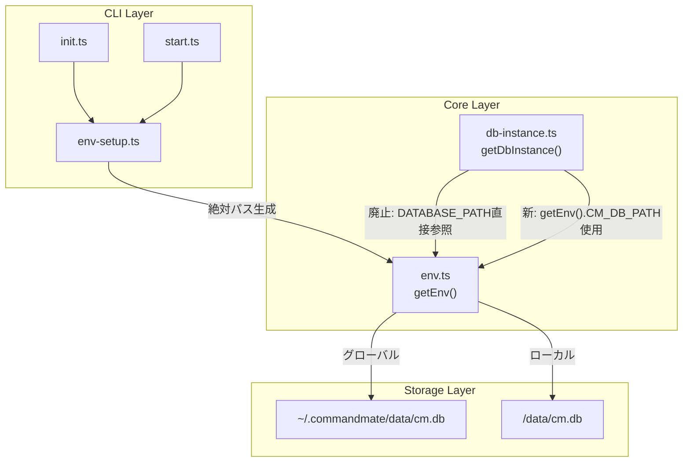
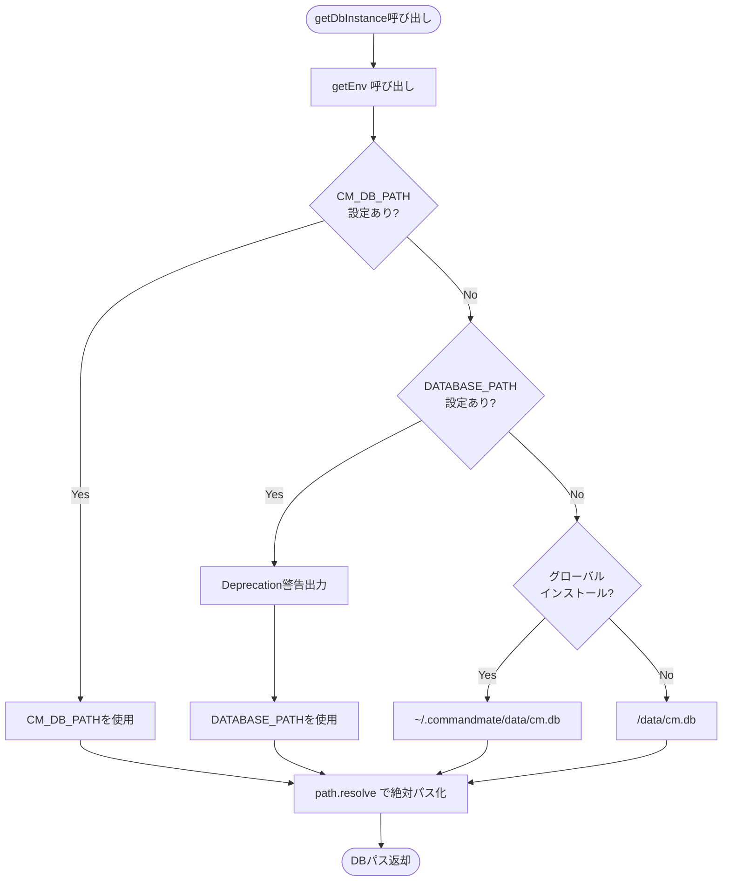
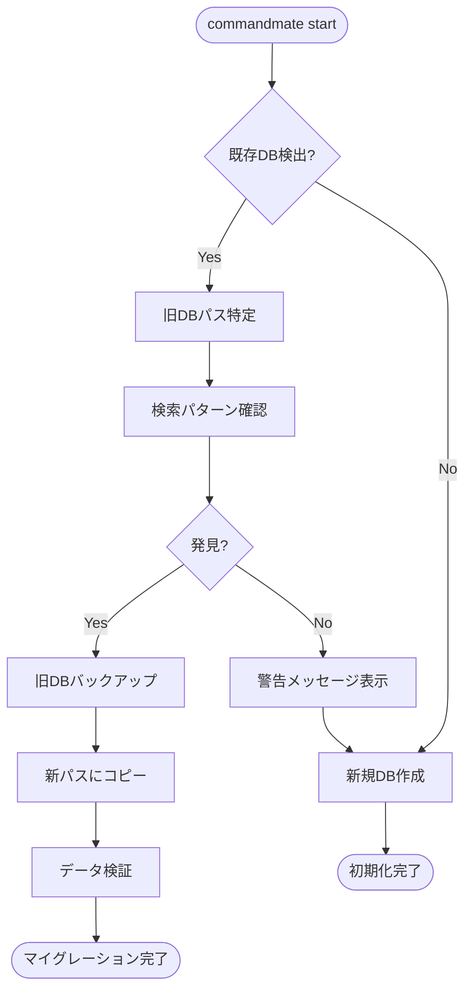

# Issue #135: DBパス解決ロジック修正 設計方針書

## 1. 概要

### 1.1 背景
`npm install -g commandmate`でグローバルインストール後、バージョンアップを実行するとリポジトリ情報が消失する。根本原因は、DBパス解決が`process.cwd()`に依存しており、グローバルインストール環境で予測不能な動作をするため。

### 1.2 目的
- グローバルインストール時のDBパス解決を一貫性のある方式に修正
- バージョンアップ時のデータ永続性を保証
- 環境変数の統一（`CM_DB_PATH`に一本化）

### 1.3 関連Issue
- #96: npm CLIサポート（基盤機能）
- #119: 対話形式init
- #125: グローバルインストール.env読み込み
- #76: 環境変数フォールバック（CM_* / MCBD_*）

---

## 2. アーキテクチャ設計

### 2.1 システム構成図（修正後）



### 2.2 パス解決フロー（修正後）



---

## 3. 技術選定

| カテゴリ | 選定技術 | 選定理由 |
|---------|---------|---------|
| パス解決 | `path.resolve()` | Node.js標準、絶対パス変換を確実に実行 |
| 設定保存 | `~/.commandmate/` | XDG Base Directory仕様に準拠したユーザー設定ディレクトリ |
| 環境変数管理 | 既存`env.ts` | DRY原則に従い、既存のフォールバック機構を再利用 |
| セキュリティ | `realpathSync()` | シンボリックリンク解決によるパストラバーサル防止 |

---

## 4. 設計パターン

### 4.1 Singleton パターン（既存維持）

DBインスタンスのSingleton管理は維持。パス解決ロジックのみ修正。

> **CONS-001対応: 現状と修正後の差異明確化**
>
> **現在の実装 (db-instance.ts:25)**:
> ```typescript
> const dbPath = process.env.DATABASE_PATH || path.join(process.cwd(), 'data', 'db.sqlite');
> ```
>
> **問題点**:
> 1. `process.cwd()` 依存のため、実行ディレクトリによってDBパスが変わる
> 2. ファイル名が `db.sqlite`（旧形式）のまま
> 3. `DATABASE_PATH` を直接参照し、`env.ts` のフォールバック機構を利用していない
>
> **修正後の実装**:
> - `getEnv().CM_DB_PATH` 経由でパスを取得
> - デフォルトファイル名は `cm.db`（Issue #77 以降の標準）
> - グローバルインストール時は `~/.commandmate/data/cm.db` を使用

```typescript
// src/lib/db-instance.ts - 修正後
import { getEnv } from './env';

let dbInstance: Database.Database | null = null;

export function getDbInstance(): Database.Database {
  if (!dbInstance) {
    const env = getEnv();  // 統一されたパス解決を使用
    const dbPath = env.CM_DB_PATH;  // 絶対パスが返却される

    // ディレクトリ作成
    const dir = path.dirname(dbPath);
    if (!fs.existsSync(dir)) {
      fs.mkdirSync(dir, { recursive: true });
    }

    dbInstance = new Database(dbPath);
    runMigrations(dbInstance);
  }
  return dbInstance;
}
```

### 4.2 Strategy パターン（新規）

グローバル/ローカルインストールでのデフォルトパス解決を戦略パターンで実装。

> **設計判断（KISS-001対応 + CONS-004対応）**: Strategy パターンの採用について
>
> 現時点では Global/Local の2戦略のみであり、単純な関数ベースの実装（if-else）でも十分対応可能である。Strategy パターンを採用する理由は以下の通り:
>
> 1. **将来の拡張性**: Docker環境用Strategy、CI環境用Strategy、テスト用MockStrategy等の追加が想定される
> 2. **テスタビリティ**: Strategy をモックに差し替えることで、パス解決ロジックの単体テストが容易になる
> 3. **責務の明確化**: 各環境固有のロジックをクラスとして分離することで、コードの見通しが良くなる
>
> **実装方針の決定（CONS-004対応）**:
>
> Section 6.1.1 のコード例では `getDbPathStrategy().getDefaultPath()` を使用しているが、これは**シンプルな関数ベース実装でも同等の効果が得られる**。本設計書では両方のアプローチを許容し、実装時に以下の基準で選択する:
>
> - **関数ベース実装を推奨**: 現時点のスコープ（Global/Local の2パターン）では十分
> - **Strategy パターンへの移行**: 将来、3つ以上の環境サポートが必要になった時点で検討
>
> **Section 6.1.1 のコード例の解釈**:
> - `getDbPathStrategy().getDefaultPath()` は、Strategy パターン採用時の呼び出し例
> - 関数ベース実装の場合は `getDefaultDbPath()` を直接呼び出す
> - どちらも同じ結果（絶対パス）を返すため、呼び出し側への影響はない
>
> ```typescript
> // 推奨: 関数ベースのシンプル実装
> export function getDefaultDbPath(): string {
>   if (isGlobalInstall()) {
>     return path.join(os.homedir(), '.commandmate', 'data', 'cm.db');
>   }
>   return path.resolve(process.cwd(), 'data', 'cm.db');
> }
> ```

```typescript
// src/lib/db-path-resolver.ts - 新規作成
import { isGlobalInstall } from '../cli/utils/env-setup';  // DRY-001: 既存関数を再利用

export interface DbPathStrategy {
  getDefaultPath(): string;
}

export class GlobalInstallStrategy implements DbPathStrategy {
  getDefaultPath(): string {
    return path.join(homedir(), '.commandmate', 'data', 'cm.db');
  }
}

export class LocalInstallStrategy implements DbPathStrategy {
  getDefaultPath(): string {
    return path.join(process.cwd(), 'data', 'cm.db');
  }
}

export function getDbPathStrategy(): DbPathStrategy {
  return isGlobalInstall()  // DRY-001: env-setup.ts の既存関数を使用
    ? new GlobalInstallStrategy()
    : new LocalInstallStrategy();
}
```

> **DRY-001対応**: `isGlobalInstall()` 関数は `src/cli/utils/env-setup.ts` に既存実装がある。`db-path-resolver.ts` では新規実装せず、必ず `import { isGlobalInstall } from '../cli/utils/env-setup'` として再利用すること。重複実装は禁止。

### 4.3 Facade パターン（既存活用）

`getEnv()`をFacadeとして、パス解決の複雑さを隠蔽。

> **SRP-001対応**: `env.ts` の責務について
>
> `env.ts` は環境変数の取得・バリデーションを担当する。DBパス解決ロジック（デフォルトパス計算、Strategyパターン適用等）は `db-path-resolver.ts` に**完全に分離**すること。
>
> `env.ts` 内の `getEnv()` は以下のように `db-path-resolver.ts` の関数を**呼び出すのみ**とし、DBパス解決の詳細ロジックを持たない:
>
> ```typescript
> // env.ts での実装方針（SRP準拠）
> import { resolveDbPath } from './db-path-resolver';
>
> // getEnv() 内部
> const databasePath = resolveDbPath();  // db-path-resolver に委譲
> ```
>
> これにより、`env.ts` は「環境変数管理」、`db-path-resolver.ts` は「DBパス解決」という単一責務を維持する。

---

## 5. データモデル設計

### 5.1 変更なし

DBスキーマへの変更なし。パス解決ロジックのみの修正。

### 5.2 マイグレーション検出対象

> **CONS-007対応**: マイグレーション検出パターンと Section 9.2 の getLegacyDbPaths() 実装の整合性確保

| パターン | 場所 | 説明 | getLegacyDbPaths()で検出 |
|---------|------|------|------------------------|
| `./data/db.sqlite` | CWD相対 | 旧バージョンのデフォルト | Yes |
| `./data/cm.db` | CWD相対 | Issue #77以降のデフォルト | Yes |
| `~/.commandmate/data/db.sqlite` | 旧絶対パス | ファイル名旧式 | Yes |
| `<npm-global>/data/db.sqlite` | npmグローバル | 旧式インストール先 | No（注1） |

> **注1**: npmグローバルインストール先（`<npm-global>/data/db.sqlite`）は、`npm prefix -g` の結果に依存し、環境によって異なる。このパターンは検出が複雑になるため、Section 9.2 の `getLegacyDbPaths()` では意図的に除外している。ユーザーが手動で `CM_DB_PATH` を設定している場合は、`DATABASE_PATH` フォールバック経由で検出される。

---

## 6. API設計

### 6.1 内部API変更

#### 6.1.1 env.ts の getEnv() 修正

> **CONS-004対応**: コード例は関数ベース実装を想定した記述に統一。
> Strategy パターン採用時は `getDbPathStrategy().getDefaultPath()` に置き換え可能。

```typescript
// 修正前
const databasePath = getEnvByKey('CM_DB_PATH')
  || process.env.DATABASE_PATH
  || path.join(process.cwd(), 'data', 'cm.db');

// 修正後（関数ベース実装を推奨）
const databasePath = getEnvByKey('CM_DB_PATH')
  || getDatabasePathWithDeprecationWarning()
  || getDefaultDbPath();  // db-path-resolver.ts または env-setup.ts からインポート

// 代替: Strategy パターン採用時
// || getDbPathStrategy().getDefaultPath();

function getDatabasePathWithDeprecationWarning(): string | undefined {
  const dbPath = process.env.DATABASE_PATH;
  if (dbPath) {
    console.warn('[DEPRECATED] DATABASE_PATH is deprecated. Use CM_DB_PATH instead.');
  }
  return dbPath;
}
```

#### 6.1.2 env-setup.ts の ENV_DEFAULTS 修正

> **CONS-002対応: 静的定数から動的関数への変更明確化**
>
> **現在の実装 (env-setup.ts:31)**:
> ```typescript
> export const ENV_DEFAULTS = {
>   CM_DB_PATH: './data/cm.db',  // 静的な相対パス
>   CM_PORT: 3000,
>   // ...
> };
> ```
>
> **問題点**:
> - `CM_DB_PATH` が静的な相対パス `'./data/cm.db'` として定義されている
> - グローバル/ローカルインストールの区別がない
> - `process.cwd()` に依存するため、実行ディレクトリで結果が変わる
>
> **修正方針**:
> - `CM_DB_PATH` を `ENV_DEFAULTS` から**削除**
> - 新規関数 `getDefaultDbPath()` で**動的に絶対パスを計算**
> - グローバルインストール時: `~/.commandmate/data/cm.db`
> - ローカルインストール時: `<cwd>/data/cm.db`（絶対パス化）

```typescript
// 修正前
export const ENV_DEFAULTS = {
  CM_DB_PATH: './data/cm.db',  // 相対パス（削除対象）
  // ...
};

// 修正後
export function getDefaultDbPath(): string {
  if (isGlobalInstall()) {
    return path.join(homedir(), '.commandmate', 'data', 'cm.db');
  }
  return path.resolve(process.cwd(), 'data', 'cm.db');
}

export const ENV_DEFAULTS = {
  // CM_DB_PATH は削除 - getDefaultDbPath() で動的に決定
  CM_PORT: 3000,
  CM_BIND: '127.0.0.1',
  CM_LOG_LEVEL: 'info',
  CM_LOG_FORMAT: 'text',
} as const;
```

#### 6.1.3 init.ts の createDefaultConfig() および promptForConfig() 修正

> **CONS-003対応: init.ts の実装詳細と修正箇所の網羅的リストアップ**
>
> **現在の実装 (init.ts)**:
> ```typescript
> // init.ts:40 - createDefaultConfig()
> function createDefaultConfig(): EnvConfig {
>   return {
>     CM_DB_PATH: ENV_DEFAULTS.CM_DB_PATH,  // './data/cm.db' (相対パス)
>     // ...
>   };
> }
>
> // init.ts:101-104 - promptForConfig() のDBパスプロンプト
> const dbPath = await prompt({
>   message: 'Database path',
>   default: ENV_DEFAULTS.CM_DB_PATH,  // './data/cm.db' がデフォルト表示
> });
> ```
>
> **修正が必要な箇所（合計2箇所）**:
> 1. `createDefaultConfig()` (init.ts:40付近) - `getDefaultDbPath()` 使用
> 2. `promptForConfig()` (init.ts:101-104付近) - デフォルト値を `getDefaultDbPath()` に変更

```typescript
// 修正前: createDefaultConfig() (init.ts:40付近)
function createDefaultConfig(): EnvConfig {
  return {
    // ...
    CM_DB_PATH: ENV_DEFAULTS.CM_DB_PATH,  // 相対パス './data/cm.db'
  };
}

// 修正後: createDefaultConfig()
function createDefaultConfig(): EnvConfig {
  return {
    // ...
    CM_DB_PATH: getDefaultDbPath(),  // 絶対パス（環境に応じて動的決定）
  };
}

// 修正前: promptForConfig() (init.ts:101-104付近)
const dbPath = await prompt({
  message: 'Database path',
  default: ENV_DEFAULTS.CM_DB_PATH,  // 相対パス表示
});

// 修正後: promptForConfig()
const dbPath = await prompt({
  message: 'Database path',
  default: getDefaultDbPath(),  // 絶対パス表示（ユーザーに正確な保存先を提示）
});
```

---

## 7. セキュリティ設計

### 7.1 パストラバーサル対策

既存の`resolveSecurePath()`を活用し、DBパスが許可されたディレクトリ外を指さないことを検証。

> **SEC-001対応**: ローカルインストール時のパス検証追加
>
> グローバルインストール時だけでなく、ローカルインストール時もシステムディレクトリへの書き込みを禁止する。これにより、攻撃者が環境変数経由で `/etc`, `/usr`, `/bin` 等のシステムディレクトリにDBを作成する攻撃を防止。

```typescript
// env.ts に追加
function validateDbPath(dbPath: string): string {
  const resolvedPath = path.resolve(dbPath);

  if (isGlobalInstall()) {
    // グローバルインストール時: ホームディレクトリ内のみ許可
    const homeDir = homedir();
    if (!resolvedPath.startsWith(homeDir)) {
      throw new Error(`Security error: DB path must be within home directory: ${resolvedPath}`);
    }
  } else {
    // SEC-001: ローカルインストール時: システムディレクトリへの書き込みを禁止
    const systemDirs = ['/etc', '/usr', '/bin', '/sbin', '/var', '/tmp', '/dev', '/sys', '/proc'];
    if (systemDirs.some(dir => resolvedPath.startsWith(dir))) {
      throw new Error(`Security error: DB path cannot be in system directory: ${resolvedPath}`);
    }
  }

  return resolvedPath;
}
```

> **注**: Issue #125 で実装された `resolveSecurePath()` の活用も検討可能。ただし、ローカルインストール時の許可ディレクトリが異なるため、専用のバリデーション関数を使用する。

### 7.2 DATABASE_PATH廃止対応

| 対応項目 | 実装 |
|---------|------|
| Deprecation警告 | 初回使用時に1度だけ警告出力 |
| フォールバック | CM_DB_PATH未設定時はDATABASE_PATHを使用 |
| セキュリティログ | DATABASE_PATH使用をセキュリティイベントとして記録 |

> **SEC-004対応**: security-logger.ts への記録追加
>
> DATABASE_PATH 使用時に console.warn だけでなく、Issue #96 で導入された `security-logger.ts` の `logSecurityEvent()` を使用してセキュリティイベントとして記録する。これにより、セキュリティ監査時に旧設定の使用状況を追跡可能になる。

```typescript
// getDatabasePathWithDeprecationWarning() の実装
import { logSecurityEvent } from '../cli/utils/security-logger';

function getDatabasePathWithDeprecationWarning(): string | undefined {
  const dbPath = process.env.DATABASE_PATH;
  if (dbPath) {
    console.warn('[DEPRECATED] DATABASE_PATH is deprecated. Use CM_DB_PATH instead.');
    // SEC-004: セキュリティイベントとして記録
    logSecurityEvent('deprecated_env_var', { variable: 'DATABASE_PATH' });
  }
  return dbPath;
}
```

> **YAGNI-001対応**: DATABASE_PATH フォールバックの将来方針
>
> `DATABASE_PATH` は Issue #77 以前の旧仕様であり、現在のユーザーベースでの使用頻度は低いと想定される。本設計では後方互換性を重視し、移行期間として deprecation 警告付きでフォールバックをサポートするが、**将来バージョンでは完全廃止を予定**している。
>
> - **v1.x**: deprecation 警告付きでサポート継続（本設計）
> - **v2.0（予定）**: `DATABASE_PATH` フォールバックを完全削除
>
> ドキュメントには移行手順（`DATABASE_PATH` から `CM_DB_PATH` への変更方法）を明記し、ユーザーが段階的に移行できるよう配慮すること。

### 7.3 OWASP Top 10対応

| 脆弱性 | 対策 |
|-------|------|
| A01:2021 Broken Access Control | パストラバーサル検証、シンボリックリンク解決、システムディレクトリ保護 |
| A03:2021 Injection | 環境変数のサニタイズ（既存機能）、環境変数長制限 |
| A05:2021 Security Misconfiguration | デフォルト値の安全な設定、ディレクトリパーミッション設定 |
| A09:2021 Security Logging and Monitoring | 旧環境変数使用のセキュリティイベント記録 |

### 7.4 ディレクトリ・ファイルパーミッション（SEC-003, SEC-006対応）

> **SEC-003対応**: ディレクトリ作成時に mode: 0o700 を明示的に指定
>
> DBファイルを格納するディレクトリを作成する際、デフォルトの umask に依存せず、明示的にパーミッションを設定する。これにより、意図せず他ユーザーにアクセスを許可することを防止。Issue #119 の `getEnvPath()` で既に使用されているパターンと整合。

```typescript
// db-instance.ts のディレクトリ作成
const dir = path.dirname(dbPath);
if (!fs.existsSync(dir)) {
  // SEC-003: mode: 0o700 を明示的に指定（所有者のみ rwx）
  fs.mkdirSync(dir, { recursive: true, mode: 0o700 });
}
```

> **SEC-006対応（Nice to Have）**: バックアップファイルのパーミッション設定
>
> マイグレーション時に作成されるバックアップファイルには機密情報が含まれる可能性がある。copyFileSync 後にパーミッションを明示的に設定することを推奨。

```typescript
// db-migration-path.ts のバックアップ作成
fs.copyFileSync(legacyPath, backupPath);
// SEC-006: バックアップファイルのパーミッションを 0o600 に設定
fs.chmodSync(backupPath, 0o600);
```

### 7.5 環境変数入力検証（SEC-005, SEC-008対応）

> **SEC-005対応**: getLegacyDbPaths() での DATABASE_PATH 検証
>
> `DATABASE_PATH` 環境変数を `getLegacyDbPaths()` の検索対象に追加する前に、安全なディレクトリ内であることを検証する。攻撃者がシステムファイルのパスを設定した場合の上書きコピーを防止。

```typescript
// db-migration-path.ts の getLegacyDbPaths() 修正
function getLegacyDbPaths(): string[] {
  const paths: string[] = [];

  // CWD相対パス
  paths.push(path.join(process.cwd(), 'data', 'db.sqlite'));
  paths.push(path.join(process.cwd(), 'data', 'cm.db'));

  // ホームディレクトリ
  paths.push(path.join(homedir(), '.commandmate', 'data', 'db.sqlite'));

  // SEC-005: DATABASE_PATH は検証してから追加
  const envDbPath = process.env.DATABASE_PATH;
  if (envDbPath) {
    try {
      // 安全なパスかどうか検証
      const resolvedPath = path.resolve(envDbPath);
      const systemDirs = ['/etc', '/usr', '/bin', '/sbin', '/var', '/dev', '/sys', '/proc'];
      if (!systemDirs.some(dir => resolvedPath.startsWith(dir))) {
        paths.push(envDbPath);
      } else {
        console.warn(`[Security] Skipping DATABASE_PATH in system directory: ${resolvedPath}`);
      }
    } catch {
      // パス解決に失敗した場合はスキップ
      console.warn(`[Security] Invalid DATABASE_PATH: ${envDbPath}`);
    }
  }

  return paths;
}
```

> **SEC-008対応（Nice to Have）**: 環境変数値の長さ制限
>
> `CM_DB_PATH` 環境変数の最大長を検証することで、極端に長いパスによる予期しない動作を防止。Node.js の文字列処理は安全だが、defense in depth として推奨。

```typescript
// 環境変数取得時の長さ制限（推奨: 4096文字）
const MAX_PATH_LENGTH = 4096;

function getEnvWithLengthLimit(key: string): string | undefined {
  const value = process.env[key];
  if (value && value.length > MAX_PATH_LENGTH) {
    console.warn(`[Security] ${key} exceeds maximum length (${MAX_PATH_LENGTH}), ignoring.`);
    return undefined;
  }
  return value;
}
```

---

## 8. パフォーマンス設計

### 8.1 影響なし

- DBパス解決は起動時1回のみ実行
- パフォーマンスへの影響は軽微

### 8.2 キャッシュ戦略

```typescript
// getEnv()の結果をキャッシュ（既存実装）
let cachedEnv: Env | null = null;

export function getEnv(): Env {
  if (cachedEnv) return cachedEnv;
  // ... 環境変数解決
  cachedEnv = env;
  return env;
}
```

---

## 9. マイグレーション設計

### 9.1 マイグレーション戦略



### 9.2 マイグレーションロジック

> **SEC-002対応**: シンボリックリンク解決によるTOCTOU攻撃防止
>
> `migrateDbIfNeeded()` では `fs.existsSync()` と `fs.copyFileSync()` の間でシンボリックリンクを悪用した攻撃（TOCTOU: Time-of-check to time-of-use）を防止するため、`fs.realpathSync()` でパスを解決し、許可されたディレクトリ内であることを検証する。Issue #125 の `resolveSecurePath()` パターンを活用。

```typescript
// src/lib/db-migration-path.ts - 新規作成
export interface MigrationResult {
  migrated: boolean;
  sourcePath?: string;
  targetPath: string;
  backupPath?: string;
}

// SEC-002: シンボリックリンク解決と安全性検証
function resolveAndValidatePath(filePath: string, description: string): string | null {
  try {
    // まずファイルが存在するか確認
    if (!fs.existsSync(filePath)) {
      return null;
    }

    // realpathSync でシンボリックリンクを解決
    const resolvedPath = fs.realpathSync(filePath);

    // システムディレクトリへのアクセスを禁止
    const systemDirs = ['/etc', '/usr', '/bin', '/sbin', '/var', '/dev', '/sys', '/proc'];
    if (systemDirs.some(dir => resolvedPath.startsWith(dir))) {
      console.warn(`[Security] ${description} points to system directory, skipping: ${resolvedPath}`);
      return null;
    }

    return resolvedPath;
  } catch (error) {
    // シンボリックリンク解決に失敗した場合（壊れたリンク等）
    console.warn(`[Security] Failed to resolve ${description}: ${filePath}`);
    return null;
  }
}

export async function migrateDbIfNeeded(targetPath: string): Promise<MigrationResult> {
  // SEC-002: targetPath をシンボリックリンク解決して検証
  const resolvedTargetPath = path.resolve(targetPath);
  const systemDirs = ['/etc', '/usr', '/bin', '/sbin', '/var', '/dev', '/sys', '/proc'];
  if (systemDirs.some(dir => resolvedTargetPath.startsWith(dir))) {
    throw new Error(`Security error: Target path cannot be in system directory: ${resolvedTargetPath}`);
  }

  // 新パスに既にDBが存在する場合はスキップ（realpathSync で検証）
  if (fs.existsSync(targetPath)) {
    const existingResolved = resolveAndValidatePath(targetPath, 'target path');
    if (existingResolved) {
      return { migrated: false, targetPath: existingResolved };
    }
  }

  // 旧パスを検索
  const legacyPaths = getLegacyDbPaths();
  for (const legacyPath of legacyPaths) {
    // SEC-002: 各旧パスをシンボリックリンク解決して検証
    const resolvedLegacyPath = resolveAndValidatePath(legacyPath, 'legacy path');
    if (!resolvedLegacyPath) {
      continue;
    }

    // バックアップ作成
    const backupPath = `${resolvedLegacyPath}.bak`;
    fs.copyFileSync(resolvedLegacyPath, backupPath);
    // SEC-006: バックアップファイルのパーミッションを設定
    fs.chmodSync(backupPath, 0o600);

    // 新パスにコピー
    const targetDir = path.dirname(resolvedTargetPath);
    if (!fs.existsSync(targetDir)) {
      // SEC-003: mode: 0o700 を明示的に指定
      fs.mkdirSync(targetDir, { recursive: true, mode: 0o700 });
    }
    fs.copyFileSync(resolvedLegacyPath, resolvedTargetPath);

    console.log(`[Migration] Database migrated from ${resolvedLegacyPath} to ${resolvedTargetPath}`);
    console.log(`[Migration] Backup created at ${backupPath}`);

    return {
      migrated: true,
      sourcePath: resolvedLegacyPath,
      targetPath: resolvedTargetPath,
      backupPath,
    };
  }

  return { migrated: false, targetPath: resolvedTargetPath };
}

// SEC-005対応: DATABASE_PATH を検証してから追加
function getLegacyDbPaths(): string[] {
  const paths: string[] = [];
  const systemDirs = ['/etc', '/usr', '/bin', '/sbin', '/var', '/dev', '/sys', '/proc'];

  // CWD相対パス
  paths.push(path.join(process.cwd(), 'data', 'db.sqlite'));
  paths.push(path.join(process.cwd(), 'data', 'cm.db'));

  // ホームディレクトリ
  paths.push(path.join(homedir(), '.commandmate', 'data', 'db.sqlite'));

  // SEC-005: DATABASE_PATH は検証してから追加
  const envDbPath = process.env.DATABASE_PATH;
  if (envDbPath) {
    try {
      const resolvedPath = path.resolve(envDbPath);
      if (!systemDirs.some(dir => resolvedPath.startsWith(dir))) {
        paths.push(envDbPath);
      } else {
        console.warn(`[Security] Skipping DATABASE_PATH in system directory: ${resolvedPath}`);
      }
    } catch {
      console.warn(`[Security] Invalid DATABASE_PATH: ${envDbPath}`);
    }
  }

  return paths;
}
```

### 9.3 DB整合性チェック（SEC-007 Nice to Have）

> **SEC-007対応（Nice to Have）**: マイグレーション後のDB整合性検証
>
> マイグレーション後に新しいパスでDBを開く際、SQLite の `PRAGMA integrity_check` を実行することで、コピー中の破損を検出する機構を追加することを推奨。defense in depth として安全性が向上。

```typescript
// db-migration-path.ts に追加（オプション）
async function verifyDbIntegrity(dbPath: string): Promise<boolean> {
  try {
    const db = new Database(dbPath, { readonly: true });
    const result = db.prepare('PRAGMA integrity_check').get() as { integrity_check: string };
    db.close();

    if (result.integrity_check === 'ok') {
      console.log(`[Migration] Database integrity check passed: ${dbPath}`);
      return true;
    } else {
      console.error(`[Migration] Database integrity check failed: ${result.integrity_check}`);
      return false;
    }
  } catch (error) {
    console.error(`[Migration] Failed to verify database integrity: ${error}`);
    return false;
  }
}

// migrateDbIfNeeded() 内でコピー後に呼び出し（オプション）
// const isValid = await verifyDbIntegrity(resolvedTargetPath);
// if (!isValid) {
//   // ロールバック処理
//   fs.unlinkSync(resolvedTargetPath);
//   throw new Error('Database migration failed: integrity check failed');
// }
```

---

## 10. 設計上の決定事項とトレードオフ

### 10.1 採用した設計

| 決定事項 | 理由 | トレードオフ |
|---------|------|-------------|
| `getEnv()`経由のパス解決 | DRY原則、既存フォールバック機構の再利用 | db-instance.tsがenv.tsに依存 |
| 絶対パスへの統一 | 予測可能性、グローバルインストール対応 | 相対パス指定の柔軟性喪失 |
| DATABASE_PATH廃止（警告付き） | 環境変数の統一、混乱防止 | 後方互換性への影響 |
| マイグレーション自動検出 | UXの向上、データ損失防止 | 起動時の追加処理 |

### 10.2 代替案との比較

#### 代替案1: db-instance.ts独自のパス解決維持

- **メリット**: 変更範囲が小さい
- **デメリット**: DRY違反、env.tsとの二重管理が継続
- **判断**: 却下 - 根本原因の解決にならない

#### 代替案2: 設定ファイルベースのDB管理

- **メリット**: 柔軟な設定管理
- **デメリット**: 複雑性増加、既存の.envベースの管理との不整合
- **判断**: 却下 - オーバーエンジニアリング

#### 代替案3: DB内にパス設定を保存

- **メリット**: 自己完結的
- **デメリット**: 鶏卵問題（DBがないとパスがわからない）
- **判断**: 却下 - 論理的に不可能

---

## 11. 影響範囲

### 11.1 直接的な影響（修正対象ファイル）

| ファイル | 変更内容 |
|---------|---------|
| `src/lib/db-instance.ts` | `getEnv()`経由のパス解決に変更 |
| `src/lib/env.ts` | DATABASE_PATH廃止警告、デフォルトパス解決ロジック追加 |
| `src/cli/utils/env-setup.ts` | `getDefaultDbPath()`関数追加、ENV_DEFAULTSからCM_DB_PATH削除 |
| `src/cli/commands/init.ts` | `getDefaultDbPath()`使用 |
| `server.ts` | `getDbInstance()` をimportしており動作検証が必要（インターフェース変更なし） |
| `scripts/health-check.sh` | CM_DB_PATHフォールバック対応 |
| `scripts/status.sh` | CM_DB_PATHフォールバック対応 |

> **IMPACT-001対応**: `server.ts` は行3で `getDbInstance()` をimportしている。インターフェース変更はないため、コード修正は不要だが動作検証は必須。

> **IMPACT-002対応**: シェルスクリプトの具体的な修正内容
>
> **health-check.sh (行44付近)**:
> ```bash
> # 修正前
> DB_PATH="${DATABASE_PATH:-./data/db.sqlite}"
>
> # 修正後
> DB_PATH="${CM_DB_PATH:-${DATABASE_PATH:-./data/cm.db}}"
> ```
>
> **status.sh (行58-59付近)**:
> ```bash
> # 修正前
> if [ -f "${DATABASE_PATH:-./data/db.sqlite}" ]; then
>
> # 修正後
> if [ -f "${CM_DB_PATH:-${DATABASE_PATH:-./data/cm.db}}" ]; then
> ```
>
> **修正ポイント**:
> 1. `CM_DB_PATH` を最優先で参照
> 2. `DATABASE_PATH` をフォールバックとして維持（後方互換性）
> 3. デフォルトファイル名を `db.sqlite` から `cm.db` に変更

### 11.2 新規作成ファイル

| ファイル | 目的 |
|---------|------|
| `src/lib/db-path-resolver.ts` | DBパス解決Strategyパターン実装 |
| `src/lib/db-migration-path.ts` | DBマイグレーションロジック |

### 11.3 間接的な影響

> **CONS-006対応 + IMPACT-003対応**: grep調査に基づく正確なファイル数に更新

| 対象 | ファイル数 | 影響 |
|------|-----------|------|
| `getDbInstance()` 呼び出し（src配下） | 約43ファイル | インターフェースは変更なし、動作検証必要 |
| `getDbInstance()` 呼び出し（src/app/api/配下） | 30+ファイル | APIルートの動作検証が特に重要 |
| 統合テストファイル（tests/integration/配下） | 20+ファイル | テスト環境セットアップの見直し |
| ドキュメント | 7ファイル | DATABASE_PATH廃止、CM_DB_PATH説明更新 |

> **注**: grep調査では75ファイルがヒットするが、これにはdev-reportsディレクトリが含まれる。実際に影響を受けるのはsrc配下の約43ファイルとtests配下の20+ファイル。

> **IMPACT-004対応**: テスト影響の詳細
>
> **影響を受けるテストファイル（tests/integration/配下）**:
> - `tests/integration/api/` 配下の各APIルートテスト
> - `tests/integration/db/` 配下のDBテスト
> - `tests/integration/cli/` 配下のCLIテスト
>
> **テストファイルでの対応パターン**:
> 1. **モック更新不要**: `getDbInstance: vi.fn()` や `getDbInstance: () => mockDb` パターンでモック化している場合、インターフェース変更がないため既存モックはそのまま動作
> 2. **環境変数設定見直し**: `vi.stubEnv('CM_DB_PATH', '/tmp/test-xxx/cm.db')` のようにテスト用パスを設定
> 3. **旧環境変数のテスト追加**: `DATABASE_PATH` のdeprecation警告が正しく出力されることを検証するテストを追加
>
> **新規テストファイル**:
> - `tests/unit/db-path-resolver.test.ts` - パス解決ロジックの単体テスト
> - `tests/unit/db-migration-path.test.ts` - マイグレーションロジックの単体テスト

> **CONS-005対応 + IMPACT-006対応: docs/architecture.md の MCBD_* 参照について**
>
> `docs/architecture.md` には `MCBD_BIND`, `MCBD_PORT`, `MCBD_AUTH_TOKEN`, `MCBD_ROOT_DIR`, `MCBD_DB_PATH` 等の旧名称環境変数が残存している（行73-78, 139-141等）。これらの更新は **Issue #135 のスコープ外** とし、以下の理由により別 Issue で対応する:
>
> 1. Issue #135 は DBパス解決ロジックの修正に焦点を当てている
> 2. docs/architecture.md 全体の環境変数名更新は広範な変更となる
> 3. Issue #76 で導入されたフォールバック機構により、旧名称でも動作する
>
> **TODO**: 以下のいずれかの方法で別途対応する:
> - **推奨**: 新規Issue作成「docs/architecture.md の MCBD_* 参照を CM_* に更新」
> - **代替案**: Issue #77 Phase 4 として既存Issueに追加
>
> **残存箇所（参考）**:
> - docs/architecture.md:73-78 - 環境変数一覧
> - docs/architecture.md:139-141 - 設定例

> **CONS-009対応 + IMPACT-005対応: .env.example の更新内容明確化**
>
> `.env.example:36` には `CM_DB_PATH=./data/db.sqlite` と記載されているが、Issue #77以降の標準ファイル名は `cm.db` である。この不整合を修正する:
>
> ```bash
> # 修正前（不整合あり: ファイル名が旧式の db.sqlite）
> CM_DB_PATH=./data/db.sqlite
>
> # 修正後（ファイル名を cm.db に統一）
> # CM_DB_PATH=~/.commandmate/data/cm.db  # グローバルインストール時のデフォルト
> # CM_DB_PATH=./data/cm.db               # ローカルインストール時のデフォルト
> # 注: commandmate init で自動設定されるため、通常は手動設定不要
> ```
>
> **修正理由**: Issue #77 で環境変数名が `MCBD_*` から `CM_*` に変更された際、DBファイル名も `db.sqlite` から `cm.db` に変更されたが、`.env.example` の更新が漏れていた。Phase 4 で確実に修正する。

---

## 12. テスト戦略

### 12.1 ユニットテスト

```typescript
// tests/unit/db-path-resolver.test.ts
describe('DbPathResolver', () => {
  describe('GlobalInstallStrategy', () => {
    it('should return ~/.commandmate/data/cm.db', () => {
      const strategy = new GlobalInstallStrategy();
      expect(strategy.getDefaultPath()).toBe(
        path.join(homedir(), '.commandmate', 'data', 'cm.db')
      );
    });
  });

  describe('LocalInstallStrategy', () => {
    it('should return <cwd>/data/cm.db as absolute path', () => {
      const strategy = new LocalInstallStrategy();
      const expected = path.resolve(process.cwd(), 'data', 'cm.db');
      expect(strategy.getDefaultPath()).toBe(expected);
    });
  });
});
```

### 12.2 統合テスト

```typescript
// tests/integration/db-instance.test.ts
describe('getDbInstance integration', () => {
  beforeEach(() => {
    vi.stubEnv('CM_DB_PATH', '/tmp/test-xxx/cm.db');
  });

  afterEach(() => {
    vi.unstubAllEnvs();
    closeDbInstance();
    // クリーンアップ
  });

  it('should use CM_DB_PATH from environment', () => {
    const db = getDbInstance();
    // DBが正しいパスに作成されることを検証
  });
});
```

### 12.3 E2Eテスト（ローカルシミュレーション）

手動検証手順:
1. 旧形式DBファイル配置: `mkdir -p ./data && cp fixtures/legacy-db.sqlite ./data/db.sqlite`
2. マイグレーション実行: `commandmate start`
3. 検証チェックリスト参照（Issueに記載）

---

## 13. 実装計画

### Phase 1: 基盤修正（必須）

1. `src/lib/db-path-resolver.ts` 新規作成
2. `src/lib/env.ts` 修正（DATABASE_PATH警告、デフォルトパス解決）
3. `src/lib/db-instance.ts` 修正（getEnv()使用）
4. ユニットテスト追加

### Phase 2: CLI修正（必須）

5. `src/cli/utils/env-setup.ts` 修正（getDefaultDbPath()追加）
6. `src/cli/commands/init.ts` 修正（絶対パス生成）
7. シェルスクリプト更新

### Phase 3: マイグレーション（必須）

8. `src/lib/db-migration-path.ts` 新規作成
9. `src/lib/db-instance.ts` にマイグレーション呼び出し追加
10. 統合テスト追加

### Phase 4: ドキュメント更新

11. `.env.example` 更新
12. `docs/` 配下ドキュメント更新
13. `CLAUDE.md` 更新

---

## 14. 受け入れ条件（再掲）

- [ ] 旧バージョンから新バージョンへアップグレード後、リポジトリ情報が保持される
- [ ] グローバルインストールで任意のディレクトリから `commandmate start` を実行しても同じDBを参照する
- [ ] `commandmate init` 実行後、`.env` に絶対パスで `CM_DB_PATH` が設定される
- [ ] `db-instance.ts` が `DATABASE_PATH` を直接参照せず、`env.ts` 経由で `CM_DB_PATH` を使用する
- [ ] 旧バージョンのDB（`db.sqlite`）が検出された場合、`cm.db` にマイグレーションされる
- [ ] 単体テストでDBパス解決ロジックを検証する
- [ ] `DATABASE_PATH` 環境変数使用時にdeprecation警告が出力される

---

## 15. 変更履歴

| 日付 | 変更内容 |
|------|---------|
| 2026-02-03 | 初版作成 |
| 2026-02-03 | Stage 1レビュー指摘対応（KISS-001, SRP-001, DRY-001, YAGNI-001） |
| 2026-02-03 | Stage 2レビュー指摘対応（CONS-001〜CONS-009） |
| 2026-02-03 | Stage 3レビュー指摘対応（IMPACT-001〜IMPACT-006） |
| 2026-02-03 | Stage 4セキュリティレビュー指摘対応（SEC-001〜SEC-008） |

---

## 16. レビュー対応履歴

### Stage 1: 設計原則レビュー（2026-02-03）

#### 対応済み指摘事項

| ID | 原則 | 対応内容 |
|----|------|---------|
| KISS-001 | KISS | Section 4.2 に Strategy パターン採用理由を追記。関数ベースのシンプル実装も代替案として許容することを明記。最終判断は実装フェーズで決定。 |
| SRP-001 | SRP | Section 4.3 に env.ts と db-path-resolver.ts の責務分離を明確化。env.ts は db-path-resolver.ts を呼び出すのみとし、DBパス解決の詳細ロジックを持たない方針を追記。 |
| DRY-001 | DRY | Section 4.2 のコード例に `isGlobalInstall()` の import 文を追記。env-setup.ts の既存関数を再利用することを明記し、重複実装を禁止。 |
| YAGNI-001 | YAGNI | Section 7.2 に DATABASE_PATH フォールバックの将来廃止方針を追記。v2.0 での完全削除を予定。 |

#### 対応見送り指摘事項

| ID | 原則 | 見送り理由 |
|----|------|-----------|
| SOLID-DIP-001 | DIP | レビュー結果でも「現プロジェクトの規模感ではオーバーエンジニアリングの可能性あり、現行案でも許容範囲内」と評価。DbPathProvider interface 導入は見送り。 |
| OCP-001 | OCP | レガシーパス定義の外部化は、マイグレーション機能が一時的なものであるため過度な拡張性は不要と判断。 |
| DRY-002 | DRY | path.resolve() の呼び出し重複は、db-path-resolver.ts が常に絶対パスを返す設計で対応済み。追加の集約は不要。 |

#### レビュー評価

- **判定**: PROCEED_WITH_MINOR_CHANGES
- **must_fix**: 1件（DIP-001: 許容範囲内のため対応見送り）
- **should_fix**: 3件（DRY-001, KISS-001, SRP-001: 全て対応済み）
- **nice_to_have**: 3件（OCP-001, YAGNI-001, DRY-002: YAGNI-001のみ対応）

---

### Stage 2: 整合性レビュー（2026-02-03）

#### 対応済み指摘事項

| ID | カテゴリ | 対応内容 |
|----|---------|---------|
| CONS-001 | 設計書と既存実装の整合性 | Section 4.1 に「現状の問題点」と「修正後のあるべき姿」を明確に分離して記載。db.sqlite から cm.db へのファイル名変更を強調。 |
| CONS-002 | 設計書と既存実装の整合性 | Section 6.1.2 に現在の ENV_DEFAULTS の状態を明記し、CM_DB_PATH を定数から削除して関数で動的に取得する修正内容を明確化。 |
| CONS-003 | 設計書と既存実装の整合性 | Section 6.1.3 を拡充し、createDefaultConfig() と promptForConfig() の両方の修正箇所を網羅的にリストアップ。現在の実装（init.ts:40, init.ts:101-104）を明記。 |
| CONS-004 | 設計書内部の整合性 | Section 4.2 と Section 6.1.1 の矛盾を解消。関数ベース実装を推奨とし、Strategy パターンは将来の拡張時に検討する方針を明記。コード例を両パターンで示す形に修正。 |
| CONS-005 | 関連Issue/ドキュメントとの整合性 | Section 11.3 に docs/architecture.md の MCBD_* 参照が Issue #135 スコープ外であることを明記。Issue #77 Phase 4 での対応を推奨。 |
| CONS-006 | 設計書と既存実装の整合性 | Section 11.3 のファイル数を「30ファイル、66箇所」から「約34ファイル、74箇所」に修正。grep調査結果に基づく正確な数値を反映。 |
| CONS-007 | 設計書内部の整合性 | Section 5.2 のマイグレーション検出対象表に「getLegacyDbPaths()で検出」列を追加。npm-global パターンの除外理由を注記として追加。 |
| CONS-009 | 関連Issue/ドキュメントとの整合性 | Section 11.3 に .env.example の具体的な修正内容（cm.db への変更、コメント追加）を明記。 |

#### 対応見送り指摘事項

| ID | カテゴリ | 見送り理由 |
|----|---------|-----------|
| CONS-008 | 用語・命名の統一 | ホームディレクトリの表記揺れ（`~` vs `homedir()` vs `os.homedir()`）は、コード例では関数名を、説明文では `~` を使用する現状の方針で一貫性があると判断。過度な統一は可読性を損なう可能性があるため見送り。 |

#### レビュー評価

- **判定**: PROCEED（整合性レビュー通過）
- **must_fix**: 2件（CONS-001, CONS-002: 全て対応済み）
- **should_fix**: 4件（CONS-003, CONS-004, CONS-005, CONS-006: 全て対応済み）
- **nice_to_have**: 3件（CONS-007, CONS-008, CONS-009: CONS-007, CONS-009 対応済み、CONS-008 見送り）

---

### Stage 3: 影響分析レビュー（2026-02-03）

#### 対応済み指摘事項

| ID | カテゴリ | 対応内容 |
|----|---------|---------|
| IMPACT-001 | 直接的影響の不完全性 | Section 11.1 の修正対象ファイルリストに `server.ts` を追加。`getDbInstance()` をimportしているため動作検証が必要であることを明記。 |
| IMPACT-002 | シェルスクリプトの影響範囲不足 | Section 11.1 に `health-check.sh`（行44）と `status.sh`（行58-59）の具体的な修正コード例を追記。`CM_DB_PATH` を最優先、`DATABASE_PATH` をフォールバック、デフォルトを `cm.db` とする3点の修正ポイントを明記。 |
| IMPACT-003 | 間接的影響のファイル数不正確 | Section 11.3 のファイル数を更新。grep調査結果（75ファイル）から dev-reports を除外し、src配下43ファイル、src/app/api/配下30+ファイル、tests/integration/配下20+ファイルに分類して記載。 |
| IMPACT-004 | テスト影響の詳細不足 | Section 11.3 に「テスト影響の詳細」を追加。影響を受けるテストディレクトリ、対応パターン（モック更新不要、環境変数設定見直し、旧環境変数テスト追加）、新規テストファイル（db-path-resolver.test.ts, db-migration-path.test.ts）を明記。 |
| IMPACT-005 | .envファイルの不整合 | Section 11.3 の CONS-009 対応を拡充。`.env.example` のファイル名が `db.sqlite`（旧式）のままである不整合を指摘し、Phase 4 で `cm.db` に修正することを明記。 |
| IMPACT-006 | docs/architecture.md の旧環境変数参照 | Section 11.3 の CONS-005 対応を拡充。MCBD_* 参照の残存箇所（行73-78, 139-141）を具体的に記載。新規Issue作成または Issue #77 Phase 4 として対応する TODO を追記。 |

#### 対応見送り指摘事項

| ID | カテゴリ | 見送り理由 |
|----|---------|-----------|
| IMPACT-007 | マイグレーション検出パターンの拡張 | npmグローバルインストール先の検出は複雑性が高く、現時点では投資対効果が低い。Section 5.2 の注記で除外理由を説明済み。将来のTODOとしては記載しない。 |
| IMPACT-008 | ドキュメント影響の詳細化 | 影響を受けるドキュメントファイル（docs/DEPLOYMENT.md等）のリストは Section 11.3 で「7ファイル」として記載済み。実装フェーズで個別に確認する方針とし、設計書への詳細列挙は見送り。 |
| IMPACT-009 | ロールバック戦略の明記 | Section 9.2 でバックアップ作成の記載があり、git revert によるコードロールバックは標準的な Git 運用で対応可能。設計書への追記は過度な詳細化と判断。 |

#### レビュー評価

- **判定**: PROCEED_WITH_MINOR_CHANGES（影響分析レビュー通過）
- **must_fix**: 2件（IMPACT-001, IMPACT-002: 全て対応済み）
- **should_fix**: 4件（IMPACT-003, IMPACT-004, IMPACT-005, IMPACT-006: 全て対応済み）
- **nice_to_have**: 3件（IMPACT-007, IMPACT-008, IMPACT-009: 全て見送り）

---

### Stage 4: セキュリティレビュー（2026-02-03）

#### 対応済み指摘事項

| ID | カテゴリ | 対応内容 |
|----|---------|---------|
| SEC-001 | A01:2021 Broken Access Control (must_fix) | Section 7.1 の `validateDbPath()` を拡張し、ローカルインストール時もシステムディレクトリ（/etc, /usr, /bin, /sbin, /var, /tmp, /dev, /sys, /proc）への書き込みを禁止する検証を追加。 |
| SEC-002 | A01:2021 Broken Access Control (must_fix) | Section 9.2 の `migrateDbIfNeeded()` を全面改修。`fs.realpathSync()` によるシンボリックリンク解決を追加し、TOCTOU攻撃を防止。`resolveAndValidatePath()` ヘルパー関数を新設。 |
| SEC-003 | A05:2021 Security Misconfiguration (should_fix) | Section 7.4 を新設し、ディレクトリ作成時に `mode: 0o700` を明示的に指定するコード例を追加。Section 9.2 のコード例にも反映。 |
| SEC-004 | A09:2021 Security Logging and Monitoring (should_fix) | Section 7.2 を拡充し、`getDatabasePathWithDeprecationWarning()` で `security-logger.ts` の `logSecurityEvent()` を使用するコード例を追加。 |
| SEC-005 | A01:2021 Broken Access Control (should_fix) | Section 7.5 を新設し、`getLegacyDbPaths()` で `DATABASE_PATH` をシステムディレクトリチェック後に追加するコード例を追加。Section 9.2 の `getLegacyDbPaths()` コードも更新。 |

#### Nice to Have 対応状況

| ID | カテゴリ | 対応内容 |
|----|---------|---------|
| SEC-006 | Defense in Depth | Section 7.4 に追記。バックアップファイル作成後に `fs.chmodSync(backupPath, 0o600)` でパーミッションを設定するコード例を追加。Section 9.2 のコード例にも反映。 |
| SEC-007 | Defense in Depth | Section 9.3 を新設。マイグレーション後の `PRAGMA integrity_check` によるDB整合性検証のオプション実装例を追加。 |
| SEC-008 | A03:2021 Injection | Section 7.5 に追記。環境変数値の最大長制限（4096文字）を検証する `getEnvWithLengthLimit()` 関数のコード例を追加。 |

#### レビュー評価

- **判定**: PROCEED_WITH_CHANGES
- **must_fix**: 2件（SEC-001, SEC-002: 全て対応済み）
- **should_fix**: 3件（SEC-003, SEC-004, SEC-005: 全て対応済み）
- **nice_to_have**: 3件（SEC-006, SEC-007, SEC-008: 全て対応済み）

#### OWASP準拠状況（Stage 4対応後）

| OWASP Top 10 | 対応状況 |
|-------------|---------|
| A01:2021 Broken Access Control | 準拠（SEC-001, SEC-002, SEC-005対応でパストラバーサル・シンボリックリンク脆弱性を解消） |
| A03:2021 Injection | 準拠（既存のサニタイズ機能 + SEC-008の長さ制限で対応） |
| A05:2021 Security Misconfiguration | 準拠（SEC-003, SEC-006でファイル/ディレクトリパーミッションを明示化） |
| A09:2021 Security Logging and Monitoring | 準拠（SEC-004で旧環境変数使用をセキュリティイベントとして記録） |

---

*Generated by /design-policy command*
