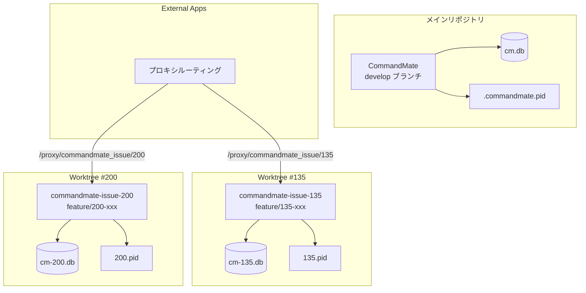
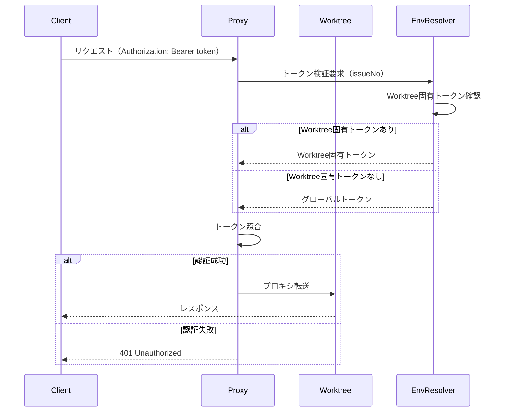

# 設計方針書: Issue #136 - Git Worktree 並列開発環境の整備

## 1. 概要

Git worktree を活用した並列開発環境を整備し、複数の Issue/機能を同時に開発できるようにする。

### 1.1 目的

- 複数機能の並列開発を可能にする
- コンテキストスイッチのコストを削減
- 各Issueごとに独立した開発環境を提供

### 1.2 スコープ

- ブランチ戦略の変更（main <- develop <- feature/*）
  - **注記（SF-CONS-004対応）**: develop ブランチ導入は Phase 1 のスコープ外。本 Issue では feature/* から main への直接 PR フローを維持する。ブランチ戦略変更は別 Issue（Phase 2 以降）で段階的に導入する。CI/CD変更も Phase 2 以降に延期。
  - **注記（SF-IMP-001対応）**: Phase 2 で別途 CI/CD 変更の詳細設計を行う。ci-pr.yml のブランチ条件追加、テストマトリクス拡張等の影響範囲は Phase 2 設計書に記載する。
- Worktree別リソース分離（DB、ポート、PID、ログ）
- External Apps連携（プロキシルーティング）
- Claude Codeスキル（/worktree-setup, /worktree-cleanup）
- CLIコマンド拡張（--issue フラグ）

## 2. アーキテクチャ設計

### 2.1 システム構成図



### 2.2 ディレクトリ構成

```
~/.commandmate/
├── .env                    # グローバル設定（AUTH_TOKEN 等）
├── .commandmate.pid        # メイン用PID（後方互換性維持）
├── data/
│   ├── cm.db               # メイン（develop/main）用
│   ├── cm-135.db           # Issue #135 用
│   └── cm-200.db           # Issue #200 用
├── pids/
│   ├── 135.pid             # Issue別PIDファイル
│   └── 200.pid
└── logs/
    ├── commandmate.log     # メインログ（Issue番号プレフィックスで識別）
    ├── commandmate-135.log # Issue #135 用（ファイル名に番号含む）
    └── commandmate-200.log # Issue #200 用
```

**注記**: ログのディレクトリ分離（logs/135/ 等）は現時点では行わない。ファイル名にIssue番号を含める方式で十分な可能性があり、運用要件が明確になった段階で再検討する（NTH-001参照）。

### 2.3 レイヤー構成

| レイヤー | 責務 | 主要コンポーネント |
|---------|------|------------------|
| CLI層 | コマンド処理 | start, stop, status, init |
| ユーティリティ層 | リソース管理 | port-allocator, worktree-detector, pid-manager |
| データ層 | データ永続化 | db-path-resolver, db-migrations |
| 設定層 | 環境変数管理 | env-setup, daemon |

## 3. 技術選定

| カテゴリ | 選定技術 | 選定理由 |
|---------|---------|---------|
| ポート管理 | DBベース（SQLite） | External Appsとの統一、トランザクション管理、Single Source of Truth |
| プロセス管理 | PIDファイル | 既存実装との互換性、シンプル |
| 環境変数マージ | dotenv v16+ | override オプションサポート |
| Worktree管理 | git worktree | Git標準機能、安定性 |

**SF-IMP-002対応（dotenv バージョン確認）**:
- Phase 0 で package.json の dotenv バージョンを確認し、v16 未満の場合はバージョンアップの影響範囲を分析する
- 既存の dotenv.config() 呼び出し箇所（src/cli/utils/daemon.ts, src/cli/commands/start.ts, src/cli/commands/status.ts）で override オプションを使用していない場合は後方互換
- バージョンアップが必要な場合、CHANGELOG に記載する

## 4. 設計パターン

### 4.1 Strategy パターン（リソース解決）

DBパス、PIDパス、ログパスの解決を統一的に扱う。

**前提条件（MF-001対応）**: 実装前に `getDefaultDbPath()` を `db-path-resolver.ts` に一元化する。`env-setup.ts` からは `db-path-resolver.ts` をimportして使用する形にリファクタリングを先行実施すること。

**循環インポート問題の解決（MF-CONS-003対応）**: 現状、`env-setup.ts` と `db-path-resolver.ts` の両方に `getDefaultDbPath()` が存在し、「両方を同期して維持する」とコメントされている。これは循環インポートを避けるための意図的な設計だが、DRY原則に反する。

解決方針:
1. **共通モジュールへの抽出**: `isGlobalInstall()` と `getConfigDir()` を `src/cli/utils/install-context.ts` として新規作成
2. **依存関係の整理**: `env-setup.ts` と `db-path-resolver.ts` の両方が `install-context.ts` をimportする形に変更
3. **getDefaultDbPath()の一元化**: `db-path-resolver.ts` に実装を残し、`env-setup.ts` の重複実装を削除

```typescript
// src/cli/utils/install-context.ts (新規作成)
export function isGlobalInstall(): boolean {
  // 既存実装と同じロジック
}

export function getConfigDir(): string {
  // 既存実装と同じロジック
}

// src/lib/db-path-resolver.ts (一元化先)
import { isGlobalInstall, getConfigDir } from '../cli/utils/install-context';

export function getDefaultDbPath(): string {
  // 唯一の実装
}

// src/cli/utils/env-setup.ts (重複削除)
import { getDefaultDbPath } from '../../lib/db-path-resolver';
// getDefaultDbPath()の重複実装を削除
```

**SF-SEC-001対応（TOCTOU脆弱性対策）**: `validate()` メソッドでは `existsSync` + `realpathSync` の二段階チェックではなく、`try-catch` で `realpathSync` を直接呼び出し、ENOENT は catch で処理する。これにより競合状態（Time-Of-Check-Time-Of-Use）を回避する。

```typescript
interface ResourcePathResolver {
  resolve(issueNo?: number): string;
  validate(path: string): boolean;
}

// DBパス解決
class DbPathResolver implements ResourcePathResolver {
  resolve(issueNo?: number): string {
    if (issueNo) {
      return path.join(getConfigDir(), 'data', `cm-${issueNo}.db`);
    }
    return getDefaultDbPath(); // db-path-resolver.ts から提供
  }

  validate(path: string): boolean {
    const configDir = getConfigDir();
    // SF-SEC-001対応: try-catchでTOCTOU脆弱性を回避
    // 既存実装 resolveSecurePath() のパターンを参照
    try {
      const resolved = fs.realpathSync(path);
      return resolved.startsWith(configDir);
    } catch (error) {
      if ((error as NodeJS.ErrnoException).code === 'ENOENT') {
        // 新規作成時: 親ディレクトリの検証
        const parentDir = path.dirname(path);
        try {
          const resolvedParent = fs.realpathSync(parentDir);
          return resolvedParent.startsWith(configDir);
        } catch {
          return false;
        }
      }
      return false;
    }
  }
}

// PIDパス解決（SF-001対応）
class PidPathResolver implements ResourcePathResolver {
  resolve(issueNo?: number): string {
    if (issueNo) {
      return path.join(getConfigDir(), 'pids', `${issueNo}.pid`);
    }
    return path.join(getConfigDir(), '.commandmate.pid'); // 後方互換性
  }

  validate(path: string): boolean {
    const configDir = getConfigDir();
    // SF-SEC-001対応: try-catchでTOCTOU脆弱性を回避
    try {
      const resolved = fs.realpathSync(path);
      return resolved.startsWith(configDir);
    } catch (error) {
      if ((error as NodeJS.ErrnoException).code === 'ENOENT') {
        const parentDir = path.dirname(path);
        try {
          const resolvedParent = fs.realpathSync(parentDir);
          return resolvedParent.startsWith(configDir);
        } catch {
          return false;
        }
      }
      return false;
    }
  }
}

// ログパス解決（SF-001対応）
class LogPathResolver implements ResourcePathResolver {
  resolve(issueNo?: number): string {
    const logsDir = path.join(getConfigDir(), 'logs');
    if (issueNo) {
      return path.join(logsDir, `commandmate-${issueNo}.log`);
    }
    return path.join(logsDir, 'commandmate.log');
  }

  validate(path: string): boolean {
    const logsDir = path.join(getConfigDir(), 'logs');
    // SF-SEC-001対応: try-catchでTOCTOU脆弱性を回避
    try {
      const resolved = fs.realpathSync(path);
      return resolved.startsWith(logsDir);
    } catch (error) {
      if ((error as NodeJS.ErrnoException).code === 'ENOENT') {
        try {
          const resolvedLogsDir = fs.realpathSync(logsDir);
          return resolvedLogsDir.startsWith(getConfigDir());
        } catch {
          return false;
        }
      }
      return false;
    }
  }
}
```

**既存実装との整合性**: `getPidFilePath()` は `PidPathResolver` を使用するようリファクタリングし、DRY原則を維持する。

### 4.2 Factory パターン（External App生成）

Worktree用External Appの生成ルールを集約。

**MF-CONS-001対応**: 設計書の型定義を既存実装に合わせて修正。

**SF-SEC-003対応（エラーメッセージ分離）**: Factory および関連コンポーネントでのエラーメッセージは、クライアント向けとサーバーログ向けを分離する。内部パス（configDir, targetPath等）はサーバーログにのみ記録し、クライアントには汎用的なエラーコードのみを返却する。

```typescript
// 既存実装に合わせた型（src/types/external-apps.ts 参照）
function createWorktreeExternalApp(issueNo: number, port: number): CreateWorktreeExternalAppInput {
  return {
    name: `worktree-${issueNo}`,
    displayName: `Worktree #${issueNo}`,
    description: `Worktree for Issue #${issueNo}`,
    appType: 'other', // 既存の appType: 'sveltekit' | 'streamlit' | 'nextjs' | 'other' に合わせる
    targetPort: port, // 既存フィールド名 targetPort に合わせる
    targetHost: 'localhost', // 既存フィールド（必須）
    pathPrefix: `commandmate_issue/${issueNo}`,
    enabled: true,
    issueNo,
    // 以下は既存フィールドのデフォルト値
    websocketEnabled: false,
    websocketPathPattern: null,
  };
}
```

### 4.3 Facade + Command パターン（Worktreeセットアップ）

**MF-002対応**: Facade内部の各ステップを独立したCommandとして実装し、Facadeはオーケストレーションのみを担当する。これにより各ステップが独立したライフサイクルを持ち、単体テスト・エラーハンドリング・ロールバックが容易になる。

**NTH-CONS-003対応**: WorktreeSetupFacadeでのログ出力方針として、CLILoggerをコンストラクタで注入する設計を採用。

**SF-SEC-005対応（セキュリティイベントログ）**: WorktreeSetupFacade の各ステップ成功/失敗を `logSecurityEvent()` で記録する。issueNo、操作種別、結果、タイムスタンプを含める。これは Phase 1 で実装する（将来検討から昇格）。

**MF-SEC-001対応（入力検証）**: CreateWorktreeCommand で git worktree add を呼び出す前に、issueNo およびブランチ名の厳密な入力検証を行う。

```typescript
// MF-SEC-001対応: 入力検証仕様
const MAX_ISSUE_NO = 2147483647; // 2^31 - 1（NTH-SEC-002対応）
const BRANCH_NAME_PATTERN = /^[a-zA-Z0-9_/-]+$/; // ホワイトリスト検証

function validateIssueNo(issueNo: unknown): asserts issueNo is number {
  if (typeof issueNo !== 'number' || !Number.isInteger(issueNo)) {
    throw new Error('INVALID_ISSUE_NO');
  }
  if (issueNo <= 0 || issueNo > MAX_ISSUE_NO) {
    throw new Error('ISSUE_NO_OUT_OF_RANGE');
  }
}

function validateBranchName(branchName: string): void {
  if (!BRANCH_NAME_PATTERN.test(branchName)) {
    throw new Error('INVALID_BRANCH_NAME');
  }
  if (branchName.length > 255) {
    throw new Error('BRANCH_NAME_TOO_LONG');
  }
}

// Command インターフェース
interface SetupCommand {
  execute(context: SetupContext): Promise<void>;
  rollback(context: SetupContext): Promise<void>;
}

// 各ステップを独立した Command として実装
class AllocatePortCommand implements SetupCommand {
  constructor(private portAllocator: PortAllocator) {}

  async execute(context: SetupContext): Promise<void> {
    context.port = await this.portAllocator.allocate();
  }

  async rollback(context: SetupContext): Promise<void> {
    if (context.port) {
      await this.portAllocator.release(context.port);
    }
  }
}

class CreateWorktreeCommand implements SetupCommand {
  constructor(private worktreeCreator: WorktreeCreator) {}

  async execute(context: SetupContext): Promise<void> {
    // MF-SEC-001対応: 入力検証（コマンドインジェクション防止）
    validateIssueNo(context.issueNo);
    const branchName = `feature/${context.issueNo}-worktree`;
    validateBranchName(branchName);

    // git コマンド実行には spawn/execFile を使用（exec 禁止）
    // 既存実装 git-utils.ts の execFile パターンを参照
    await this.worktreeCreator.create(context.issueNo, branchName);
    context.worktreeCreated = true;
  }

  async rollback(context: SetupContext): Promise<void> {
    if (context.worktreeCreated) {
      await this.worktreeCreator.remove(context.issueNo);
    }
  }
}

class GenerateEnvCommand implements SetupCommand {
  constructor(private envGenerator: EnvGenerator) {}

  async execute(context: SetupContext): Promise<void> {
    await this.envGenerator.generate(context.issueNo, context.port!);
    context.envGenerated = true;
  }

  async rollback(context: SetupContext): Promise<void> {
    if (context.envGenerated) {
      await this.envGenerator.remove(context.issueNo);
    }
  }
}

class RegisterExternalAppCommand implements SetupCommand {
  constructor(
    private externalAppRegistrar: ExternalAppRegistrar,
    private cacheInvalidator?: ExternalAppCacheInvalidator // SF-IMP-004対応
  ) {}

  async execute(context: SetupContext): Promise<void> {
    await this.externalAppRegistrar.register(context.issueNo, context.port!);
    context.externalAppRegistered = true;
    // SF-IMP-004対応: Worktree登録後にキャッシュを即座に無効化
    // TTL内でも新規Worktreeへのルーティングが成功するようにする
    if (this.cacheInvalidator) {
      await this.cacheInvalidator.invalidate(context.issueNo);
    }
  }

  async rollback(context: SetupContext): Promise<void> {
    if (context.externalAppRegistered) {
      await this.externalAppRegistrar.unregister(context.issueNo);
      if (this.cacheInvalidator) {
        await this.cacheInvalidator.invalidate(context.issueNo);
      }
    }
  }
}

class StartServerCommand implements SetupCommand {
  constructor(private serverStarter: ServerStarter) {}

  async execute(context: SetupContext): Promise<void> {
    await this.serverStarter.start(context.issueNo);
    context.serverStarted = true;
  }

  async rollback(context: SetupContext): Promise<void> {
    if (context.serverStarted) {
      await this.serverStarter.stop(context.issueNo);
    }
  }
}

// Context（各Commandが共有する状態）
interface SetupContext {
  issueNo: number;
  port?: number;
  worktreeCreated?: boolean;
  envGenerated?: boolean;
  externalAppRegistered?: boolean;
  serverStarted?: boolean;
}

// Facade はオーケストレーションのみを担当
// NTH-CONS-003対応: CLILoggerを注入
// SF-SEC-005対応: logSecurityEventでセキュリティイベントを記録
class WorktreeSetupFacade {
  private commands: SetupCommand[];

  constructor(
    portAllocator: PortAllocator,
    worktreeCreator: WorktreeCreator,
    envGenerator: EnvGenerator,
    externalAppRegistrar: ExternalAppRegistrar,
    serverStarter: ServerStarter,
    private logger: CLILogger, // ログ出力用
    private securityLogger: SecurityLogger // SF-SEC-005対応
  ) {
    this.commands = [
      new AllocatePortCommand(portAllocator),
      new CreateWorktreeCommand(worktreeCreator),
      new GenerateEnvCommand(envGenerator),
      new RegisterExternalAppCommand(externalAppRegistrar),
      new StartServerCommand(serverStarter),
    ];
  }

  async setup(issueNo: number): Promise<WorktreeSetupResult> {
    const context: SetupContext = { issueNo };
    const executedCommands: SetupCommand[] = [];

    // SF-SEC-005対応: セットアップ開始をログ
    this.securityLogger.logSecurityEvent({
      event: 'WORKTREE_SETUP_START',
      issueNo,
      timestamp: new Date().toISOString(),
    });

    try {
      for (const command of this.commands) {
        this.logger.info(`Executing ${command.constructor.name}...`);
        await command.execute(context);
        executedCommands.push(command);
        // SF-SEC-005対応: 各ステップ成功をログ
        this.securityLogger.logSecurityEvent({
          event: 'WORKTREE_SETUP_STEP',
          issueNo,
          step: command.constructor.name,
          result: 'success',
          timestamp: new Date().toISOString(),
        });
      }

      // SF-SEC-005対応: セットアップ成功をログ
      this.securityLogger.logSecurityEvent({
        event: 'WORKTREE_SETUP_SUCCESS',
        issueNo,
        port: context.port,
        timestamp: new Date().toISOString(),
      });

      return {
        issueNo,
        port: context.port!,
        path: this.getWorktreePath(issueNo),
      };
    } catch (error) {
      // ロールバック（逆順で実行）
      this.logger.warn('Setup failed, rolling back...');

      // SF-SEC-005対応: セットアップ失敗をログ
      this.securityLogger.logSecurityEvent({
        event: 'WORKTREE_SETUP_FAILED',
        issueNo,
        error: error instanceof Error ? error.message : 'Unknown error',
        timestamp: new Date().toISOString(),
      });

      for (const command of executedCommands.reverse()) {
        await command.rollback(context).catch((rollbackError) => {
          // ロールバックエラーはログのみ
          this.logger.error(`Rollback failed for ${command.constructor.name}: ${rollbackError}`);
          // SF-SEC-005対応: ロールバック失敗もログ
          this.securityLogger.logSecurityEvent({
            event: 'WORKTREE_ROLLBACK_FAILED',
            issueNo,
            step: command.constructor.name,
            error: rollbackError instanceof Error ? rollbackError.message : 'Unknown error',
            timestamp: new Date().toISOString(),
          });
        });
      }
      throw error;
    }
  }

  private getWorktreePath(issueNo: number): string {
    return path.join(process.env.HOME!, 'repos', `commandmate-issue-${issueNo}`);
  }
}
```

### 4.4 Factory パターン（DaemonManager生成）- SF-002対応

CLI コマンドが DaemonManager の具象クラスに直接依存する問題を解決するため、Factory パターンを導入する。

**MF-CONS-002対応**: 既存の `DaemonManager` は `constructor(pidFilePath: string)` で文字列のみを受け取る。破壊的変更を避けるため、Factory パターンで新しいインターフェースを提供しつつ、内部では既存コンストラクタを使用する。

```typescript
// DaemonManager インターフェース（抽象化）
interface IDaemonManager {
  start(options: DaemonStartOptions): Promise<void>;
  stop(): Promise<void>;
  getStatus(): DaemonStatus;
}

// Factory パターンで生成
// MF-CONS-002対応: 既存コンストラクタとの後方互換性を維持
class DaemonManagerFactory {
  create(issueNo?: number): IDaemonManager {
    const pidPath = new PidPathResolver().resolve(issueNo);
    const envPath = getEnvPath(issueNo);
    const dbPath = new DbPathResolver().resolve(issueNo);

    // 既存の DaemonManager(pidFilePath: string) を使用
    // 追加パラメータは環境変数またはコンテキストで渡す
    const manager = new DaemonManager(pidPath);

    // 必要に応じて追加設定をラップ
    return new DaemonManagerWrapper(manager, {
      pidPath,
      envPath,
      dbPath,
      issueNo,
    });
  }
}

// 既存DaemonManagerをラップしてIDaemonManagerを実装
class DaemonManagerWrapper implements IDaemonManager {
  constructor(
    private innerManager: DaemonManager,
    private config: {
      pidPath: string;
      envPath: string;
      dbPath: string;
      issueNo?: number;
    }
  ) {}

  async start(options: DaemonStartOptions): Promise<void> {
    // 環境変数にdbPath等を設定してから既存メソッドを呼び出す
    process.env.CM_DB_PATH = this.config.dbPath;
    await this.innerManager.startDaemon(options);
  }

  async stop(): Promise<void> {
    await this.innerManager.stopDaemon();
  }

  getStatus(): DaemonStatus {
    return this.innerManager.getDaemonStatus();
  }
}

// start.ts での使用例
const factory = new DaemonManagerFactory();
const daemonManager = factory.create(options.issue);
await daemonManager.start(options);
```

## 5. データモデル設計

### 5.1 external_apps テーブル拡張

**SF-CONS-002対応**: Migration #16 は `issue_no` カラム追加のみ。external_apps テーブルは既に Migration #12 で作成済みであり、既存スキーマ（targetPort, targetHost, websocketEnabled 等）はそのまま維持する。

```sql
-- Migration #16: issue_no カラム追加のみ
-- 既存テーブル構造（Migration #12）への追加
ALTER TABLE external_apps ADD COLUMN issue_no INTEGER;
CREATE INDEX IF NOT EXISTS idx_external_apps_issue_no ON external_apps(issue_no);
```

**既存スキーマとの整合性**:
- `external_apps` テーブルは Migration #12 で以下のカラムを持つ:
  - id (TEXT PRIMARY KEY) - UUID形式
  - name, displayName, description
  - appType ('sveltekit' | 'streamlit' | 'nextjs' | 'other')
  - targetPort, targetHost
  - pathPrefix, enabled
  - websocketEnabled, websocketPathPattern
  - createdAt, updatedAt
- Migration #16 では上記構造を変更せず、`issue_no` カラムのみを追加

**MF-IMP-002対応（既存データの取り扱い）**:
- Migration #16 適用後、既存レコードの `issue_no` は NULL のまま維持される
- NULL = メインアプリ（非Worktree）として解釈
- getEnabledExternalApps() に issue_no フィルタオプションを追加:
  ```typescript
  // src/lib/external-apps/db.ts
  interface GetExternalAppsOptions {
    issueNo?: number | null; // null = メインアプリのみ、undefined = 全て
  }

  function getEnabledExternalApps(options?: GetExternalAppsOptions): ExternalApp[] {
    if (options?.issueNo === null) {
      // メインアプリのみ（issue_no IS NULL）
      return db.prepare('SELECT * FROM external_apps WHERE enabled = 1 AND issue_no IS NULL').all();
    } else if (options?.issueNo !== undefined) {
      // 特定Issue用（issue_no = ?）
      return db.prepare('SELECT * FROM external_apps WHERE enabled = 1 AND issue_no = ?').all(options.issueNo);
    }
    // 全て（フィルタなし）
    return db.prepare('SELECT * FROM external_apps WHERE enabled = 1').all();
  }
  ```

**MF-IMP-002対応（キャッシュ戦略）**:
- ExternalAppCache のキャッシュキー: `pathPrefix` のみ（issueNo は pathPrefix に含まれるため分離不要）
- Worktree 追加時のキャッシュ無効化: RegisterExternalAppCommand 内で明示的に invalidate 実行
- 運用者向け周知: DB マイグレーション時に既存 external_apps データの issue_no が NULL になることを CHANGELOG に記載

### 5.2 型定義拡張（SF-004対応: ISP準拠）

**設計方針**: ExternalApp 基本インターフェースに issueNo を追加せず、Worktree専用の派生型を定義することで ISP (Interface Segregation Principle) に準拠する。

**MF-CONS-001対応**: 設計書の型定義を既存実装（src/types/external-apps.ts）に合わせて修正。

```typescript
// src/types/external-apps.ts

// 基本インターフェース（既存実装に合わせる - MF-CONS-001対応）
export interface ExternalApp {
  id: string; // UUID形式（既存実装に合わせる）
  name: string;
  displayName: string;
  description?: string;
  appType: 'sveltekit' | 'streamlit' | 'nextjs' | 'other'; // 既存実装に合わせる
  targetPort: number; // 既存フィールド名（port ではなく targetPort）
  targetHost: string; // 既存フィールド
  pathPrefix: string;
  enabled: boolean;
  websocketEnabled: boolean; // 既存フィールド
  websocketPathPattern?: string | null; // 既存フィールド
  createdAt: string;
  updatedAt: string;
}

// Worktree用派生型（ISP準拠）
export interface WorktreeExternalApp extends ExternalApp {
  issueNo: number;
}

// 入力型も同様に分離
// SF-CONS-003対応: 既存の CreateExternalAppInput を正しく拡張
export interface CreateExternalAppInput {
  name: string;
  displayName: string;
  description?: string;
  appType: 'sveltekit' | 'streamlit' | 'nextjs' | 'other';
  targetPort: number;
  targetHost: string;
  pathPrefix: string;
  enabled?: boolean;
  websocketEnabled?: boolean;
  websocketPathPattern?: string | null;
}

// Worktree用入力型（既存定義を拡張）
export interface CreateWorktreeExternalAppInput extends CreateExternalAppInput {
  issueNo: number;
}

// 型ガード関数
export function isWorktreeExternalApp(app: ExternalApp): app is WorktreeExternalApp {
  return 'issueNo' in app && typeof (app as WorktreeExternalApp).issueNo === 'number';
}

// src/cli/types/index.ts
// SF-CONS-001対応: 既存 StopOptions への issue オプション追加の影響範囲を明記
export interface StopOptions {
  force?: boolean;
  issue?: number; // 新規追加: 指定Issueのサーバー停止
}

// 影響範囲:
// - src/cli/commands/stop.ts: --issue フラグ追加、PidPathResolver使用
// - stop コマンドのヘルプテキスト更新

export interface StatusOptions {
  issue?: number; // 新規追加: 指定Issueの状態確認
}

// 影響範囲:
// - src/cli/commands/status.ts: --issue フラグ追加、PidPathResolver使用
// - status コマンドのヘルプテキスト更新
```

**DBレイヤーでの対応**: DB取得時に issueNo の有無で型を判別し、適切な型として返却する。

## 6. API設計

### 6.1 CLI コマンド

| コマンド | フラグ | 動作 |
|---------|-------|------|
| `commandmate start` | `--auto-port` | 空きポートを自動割り当て |
| `commandmate stop` | `--issue <number>` | 指定Issueのサーバー停止 |
| `commandmate status` | `--issue <number>` | 指定Issueの状態確認 |
| `commandmate status` | `--all` | 全Worktreeサーバー状態一覧（SF-IMP-003対応） |

**SF-CONS-001対応**: --issue フラグ追加に伴う変更箇所:
- `src/cli/commands/stop.ts`: --issue オプションパース、PidPathResolver.resolve(issueNo) 使用
- `src/cli/commands/status.ts`: --issue オプションパース、PidPathResolver.resolve(issueNo) 使用
- `src/cli/index.ts`: commander設定に --issue オプション追加

**SF-IMP-005対応（commander 設定例）**:
```typescript
// src/cli/index.ts
program
  .command('stop')
  .description('Stop CommandMate server')
  .option('--issue <number>', 'Issue number for worktree server', parseInt)
  .option('-f, --force', 'Force stop without confirmation')
  .action(async (options: StopOptions) => {
    await stopCommand(options);
  });

program
  .command('status')
  .description('Show CommandMate server status')
  .option('--issue <number>', 'Issue number for worktree server', parseInt)
  .option('--all', 'Show all running worktree servers')
  .action(async (options: StatusOptions) => {
    await statusCommand(options);
  });
```

**SF-IMP-003対応（リソース監視）**:
- `status --all` オプションで起動中の全 Worktree サーバー状態を一覧表示
- pids/ ディレクトリ内の全 PID ファイルをスキャンし、各サーバーの状態を表示
- 複数ログファイルの統合閲覧については docs/dev-guide/worktree-development.md に運用ガイドを追加

### 6.2 プロキシルーティング

```
GET /proxy/commandmate_issue/{issueNo}/*
  -> localhost:{port}/*

ルーティング解決:
1. pathPrefix から issueNo を抽出
2. external_apps テーブルから port を取得（Single Source of Truth）
3. localhost:{port} にプロキシ
```

## 7. セキュリティ設計

### 7.1 認証トークン管理

- グローバル `.env` の `CM_AUTH_TOKEN` を全Worktreeで共有（デフォルト）
- Worktree固有トークンが必要な場合は Worktree の `.env` で上書き可能

**MF-SEC-002対応（認証トークン共有のセキュリティ境界）**:

**トークン優先順位（明確化）**:
1. Worktree固有トークン（~/.commandmate/worktrees/{issueNo}/.env の CM_AUTH_TOKEN）
2. グローバルトークン（~/.commandmate/.env の CM_AUTH_TOKEN）

**独立トークン生成オプション**:
- /worktree-setup スキル実行時に `--independent-token` オプションを提供
- 指定時は Worktree 毎に独立した認証トークン（`crypto.randomBytes(32)`）を生成
- デフォルトはグローバルトークン共有（後方互換性維持）

**リスクドキュメント化**:

> **警告**: グローバルトークン共有使用時のリスク
>
> 単一の `CM_AUTH_TOKEN` を全 Worktree で共有する場合、1つのトークンが漏洩すると
> 全ての Worktree 環境へのアクセスが可能になります。
>
> 機密性の高い開発や複数人での Worktree 共有時は、`--independent-token` オプション
> または Worktree 毎の独自 `.env` 設定を推奨します。

**認証フローシーケンス**:


### 7.2 ポート範囲制限

- 自動割り当て範囲: 3001-3100
  - **NTH-CONS-001対応（根拠）**: ポート3000はメイン用に予約。100個は同時worktree数の想定上限（通常の開発では5-10個程度を想定）。1024以上の非特権ポートを使用。
- 特権ポート（1-1023）の使用禁止
- 設定による範囲変更可能

**SF-SEC-002対応（ポート枯渇攻撃対策）**:

**Worktree数上限**:
- ユーザー毎のWorktree数上限を設定可能（デフォルト: 10個）
- 環境変数 `CM_MAX_WORKTREES` で設定変更可能
- 上限到達時はエラーメッセージを表示し、新規 Worktree 作成を拒否

**ポート割り当てクールダウン**:
- 同一 issueNo での連続ポート割り当てにクールダウン期間（60秒）を設定
- クールダウン中は「ポート割り当て待機中」メッセージを表示

**リソース制限連携**:
```typescript
// src/cli/utils/port-allocator.ts
class PortAllocator {
  private readonly MAX_WORKTREES = parseInt(process.env.CM_MAX_WORKTREES || '10', 10);
  private readonly COOLDOWN_MS = 60000;

  async allocate(issueNo: number): Promise<number> {
    // 既存Worktree数チェック
    const currentCount = await this.getActiveWorktreeCount();
    if (currentCount >= this.MAX_WORKTREES) {
      throw new Error('MAX_WORKTREES_EXCEEDED');
    }

    // クールダウンチェック
    const lastAllocation = await this.getLastAllocationTime(issueNo);
    if (lastAllocation && Date.now() - lastAllocation < this.COOLDOWN_MS) {
      throw new Error('ALLOCATION_COOLDOWN');
    }

    // ポート割り当てロジック
    return await this.findAvailablePort();
  }
}
```

**管理者向けリソース制限設定ドキュメント**:
- docs/dev-guide/worktree-development.md に設定方法を記載

### 7.3 PIDファイル競合防止

- `O_EXCL` によるアトミック書き込み継続
- `pids/` ディレクトリのパーミッション: 0700
- PIDファイルの所有者チェック

**SF-SEC-004対応（ディレクトリ作成時の権限設定）**:

```typescript
// src/cli/utils/pid-manager.ts
import { mkdirSync, chmodSync, statSync } from 'fs';

function ensurePidsDirectory(): void {
  const pidsDir = path.join(getConfigDir(), 'pids');

  try {
    // ディレクトリ作成時に mode を明示的に指定
    mkdirSync(pidsDir, { recursive: true, mode: 0o700 });
  } catch (error) {
    if ((error as NodeJS.ErrnoException).code !== 'EEXIST') {
      throw error;
    }
  }

  // 既存ディレクトリの場合もパーミッション確認/修正
  const stats = statSync(pidsDir);
  const currentMode = stats.mode & 0o777;
  if (currentMode !== 0o700) {
    // 警告ログ出力
    console.warn(`pids directory has insecure permissions (${currentMode.toString(8)}), fixing to 0700`);
    chmodSync(pidsDir, 0o700);
  }
}

// PidManager 初期化時に呼び出し
class PidManager {
  constructor() {
    ensurePidsDirectory();
  }
}
```

### 7.4 パストラバーサル対策

- Issue番号の数値バリデーション
- `fs.realpathSync()` によるシンボリックリンク解決
- ホームディレクトリ外へのアクセス禁止

### 7.5 入力検証仕様（MF-SEC-001対応）

**issueNo 検証**:
- 型: number（整数）
- 範囲: 1 <= issueNo <= 2^31 - 1（MAX_ISSUE_NO定数）
- 検証関数: `validateIssueNo(issueNo)`

**ブランチ名検証**:
- パターン: `/^[a-zA-Z0-9_/-]+$/`（ホワイトリスト）
- 最大長: 255文字
- 検証関数: `validateBranchName(branchName)`

**git コマンド実行**:
- `exec()` 禁止: シェル展開によるコマンドインジェクションリスク
- `spawn()` / `execFile()` 使用: 引数は配列で渡す
- 既存実装 `src/lib/git-utils.ts` の execFile パターンを参照

```typescript
// 正しい実装例
import { execFile } from 'child_process';

function createWorktree(issueNo: number, branchName: string): Promise<void> {
  // 入力検証（必須）
  validateIssueNo(issueNo);
  validateBranchName(branchName);

  const worktreePath = path.join(getConfigDir(), 'worktrees', `issue-${issueNo}`);

  return new Promise((resolve, reject) => {
    execFile('git', ['worktree', 'add', worktreePath, '-b', branchName], (error) => {
      if (error) reject(error);
      else resolve();
    });
  });
}
```

### 7.6 エラーメッセージセキュリティ（SF-SEC-003対応）

**設計方針**: クライアント向けエラーメッセージとサーバーログを分離し、内部パス情報の露出を防止する。

**エラーメッセージ分類**:

| エラーコード | クライアント向けメッセージ | サーバーログ内容 |
|-------------|-------------------------|-----------------|
| INVALID_TARGET_PATH | Invalid target path | Full path: /home/user/.commandmate/... |
| WORKTREE_NOT_FOUND | Worktree not found | Path checked: /home/user/repos/... |
| PORT_ALLOCATION_FAILED | Port allocation failed | Range: 3001-3100, Attempted ports: [...] |
| DB_CONNECTION_ERROR | Database error | DB path: /home/user/.commandmate/data/cm.db |

**実装パターン**:
```typescript
// src/lib/errors.ts
interface AppError {
  code: string;
  clientMessage: string;  // クライアントに返却
  serverDetails?: object; // サーバーログのみ
}

const ERROR_DEFINITIONS: Record<string, AppError> = {
  INVALID_TARGET_PATH: {
    code: 'INVALID_TARGET_PATH',
    clientMessage: 'Invalid target path',
    // serverDetails は呼び出し時に追加
  },
  // ...
};

function createAppError(code: string, serverDetails?: object): AppError {
  const definition = ERROR_DEFINITIONS[code];
  if (serverDetails) {
    // サーバーログに詳細を記録
    logger.error(`[${code}]`, serverDetails);
  }
  return {
    ...definition,
    serverDetails: undefined, // クライアントには含めない
  };
}
```

**既存実装参照**: `src/lib/git-utils.ts` の「Error details are logged server-side, not exposed to client」パターンを全体に適用。

## 8. パフォーマンス設計

### 8.1 リソース使用量の制限

| リソース | 1サーバーあたり | 推奨上限 |
|---------|----------------|---------|
| メモリ | 約200-500MB | 同時5-10個 |
| CPU | 軽負荷（アイドル時） | マシンスペック依存 |
| ポート | 1ポート | 最大100個 |
| ディスク | 数MB〜 | ローテーションで管理 |

### 8.2 キャッシュ戦略（SF-003対応: 簡素化）

**設計方針**: DBを Single Source of Truth として一本化し、キャッシュファイル（worktree-ports.json）は使用しない。

- External Apps: 既存のpathPrefixベースキャッシュを継続
- ポートマッピング: external_apps テーブルのみで管理（キャッシュファイル不使用）

**理由**: DB とキャッシュファイルの二重管理は同期問題を引き起こしやすい。SQLite は十分高速であり、追加キャッシュの必要性は低い。

**SF-IMP-004対応（キャッシュ無効化機構）**:
- Worktree 登録時（RegisterExternalAppCommand.execute）で即座にキャッシュを無効化
- ExternalAppCache に invalidate(issueNo) メソッドを追加:
  ```typescript
  // src/lib/external-apps/cache.ts
  class ExternalAppCache {
    private cache: Map<string, CachedApp>;

    invalidate(issueNo: number): void {
      const pathPrefix = `commandmate_issue/${issueNo}`;
      this.cache.delete(pathPrefix);
    }

    invalidateAll(): void {
      this.cache.clear();
    }
  }
  ```
- TTL（30秒）内でも新規 Worktree へのルーティングが即座に成功するよう保証
- write-through キャッシュ戦略: DB 書き込み時に同時にキャッシュも更新する方式を検討（将来最適化）

## 9. 設計上の決定事項とトレードオフ

### 9.1 採用した設計

| 決定事項 | 理由 | トレードオフ |
|---------|------|-------------|
| DBベースポート管理 | External Appsとの統一、Single Source of Truth | ファイルベースより複雑 |
| developブランチ導入 | リリース管理の柔軟性 | CI/CD変更が必要 |
| 後方互換性維持 | 既存ユーザーへの影響最小化 | コード複雑化 |
| Issue番号ベースの識別 | シンプルな命名規則 | Issueなし開発は対象外 |

**注記（NTH-002、SF-CONS-004）**: develop ブランチ導入は Phase 1 のスコープ外とする。feature/* から main への直接 PR でも並列 worktree 開発は可能。ブランチ戦略変更は別 Issue で段階的に導入し、CLAUDE.md の更新もその時点で実施する。

### 9.2 代替案との比較

**ポート管理**:
- 代替案1: ファイルベース（worktree-ports.json）
  - メリット: シンプル、外部ツール連携容易
  - デメリット: External Appsとの二重管理
- 採用案: DBベース
  - メリット: 一元管理、トランザクション
  - デメリット: 外部ツール連携には追加実装必要

**ブランチ戦略**:
- 代替案1: trunk-based development
  - メリット: シンプル
  - デメリット: 並列開発に不向き
- 採用案: develop + feature branches
  - メリット: 並列開発、段階的リリース
  - デメリット: マージ管理の複雑化

## 10. 依存関係

### 10.1 ブロッキング依存

- **Issue #135** (DBパス解決ロジック修正): 先に完了が必要
  - db-path-resolver.ts への変更が競合するため
  - **NTH-CONS-002対応**: db-path-resolver.ts は既に存在する。Issue #135 の完了状態を確認し、完了済みであれば本依存は解消済みとする。
- **DRY準拠リファクタリング**: getDefaultDbPath() の db-path-resolver.ts への一元化を先行実施（MF-001、MF-CONS-003）
  - 循環インポート問題を解決するため、install-context.ts の新規作成を含む

### 10.2 関連Issue

- #96: npm CLIサポート（CLI拡張の基盤）
- #125: グローバルインストール.env読み込み
- #42: External Apps プロキシルーティング（既存実装として参照）

## 11. 影響範囲

### 11.1 変更対象ファイル

| ファイル | 変更内容 |
|---------|---------|
| `CLAUDE.md` | ブランチ戦略更新（Phase 2以降で実施） |
| `src/lib/db-path-resolver.ts` | getIssueDbPath()追加、getDefaultDbPath()一元化 |
| `src/lib/db-migrations.ts` | Migration #16追加（issue_noカラムのみ） |
| `src/cli/utils/env-setup.ts` | getPidFilePath()拡張、db-path-resolver.ts import、重複getDefaultDbPath()削除 |
| `src/cli/utils/pid-manager.ts` | Issue番号対応、PidPathResolver使用 |
| `src/cli/commands/start.ts` | --auto-portフラグ、DaemonManagerFactory使用 |
| `src/cli/commands/stop.ts` | --issueフラグ、PidPathResolver使用（SF-CONS-001） |
| `src/cli/commands/status.ts` | --issueフラグ、PidPathResolver使用、dotenvConfig()追加（SF-CONS-001） |
| `src/cli/index.ts` | commander設定（--issueオプション追加） |
| `src/cli/types/index.ts` | StopOptions, StatusOptions（issue追加） |
| `src/types/external-apps.ts` | WorktreeExternalApp派生型、既存型との整合（MF-CONS-001） |
| `src/lib/external-apps/db.ts` | DB型定義拡張、isWorktreeExternalApp、getEnabledExternalApps issue_no フィルタ（MF-IMP-002） |
| `src/lib/external-apps/cache.ts` | invalidate(issueNo) メソッド追加（SF-IMP-004） |
| `.github/workflows/ci-pr.yml` | developブランチ対応（Phase 2以降で実施、SF-IMP-001） |

### 11.2 新規作成ファイル

| ファイル | 内容 |
|---------|------|
| `src/cli/utils/install-context.ts` | isGlobalInstall(), getConfigDir()（MF-CONS-003対応） |
| `src/cli/utils/worktree-detector.ts` | Worktree検出 |
| `src/cli/utils/port-allocator.ts` | ポート割り当て |
| `src/cli/utils/resource-resolvers.ts` | ResourcePathResolver実装群 |
| `src/cli/utils/daemon-factory.ts` | DaemonManagerFactory、DaemonManagerWrapper |
| `src/cli/utils/setup-commands.ts` | Commandパターン実装群 |
| `src/cli/utils/input-validators.ts` | validateIssueNo(), validateBranchName()（MF-SEC-001対応） |
| `.claude/skills/worktree-setup/SKILL.md` | セットアップスキル |
| `.claude/skills/worktree-cleanup/SKILL.md` | クリーンアップスキル |
| `docs/dev-guide/worktree-development.md` | 開発者ガイド（SF-IMP-003: ログ集約運用ガイド含む） |
| `src/lib/external-apps/cache-invalidator.ts` | ExternalAppCacheInvalidator インターフェース（SF-IMP-004） |
| `src/lib/errors.ts` | AppError定義、createAppError()（SF-SEC-003対応） |

**注記（NTH-003）**: Claude Code スキル（/worktree-setup, /worktree-cleanup）は CLI コマンドを呼び出すラッパーとして実装し、ビジネスロジックの重複を避ける。

## 12. テスト計画

### 12.1 ユニットテスト

- `install-context.ts`: isGlobalInstall(), getConfigDir() テスト（MF-CONS-003対応）
- `db-path-resolver.ts`: getIssueDbPath()テスト、getDefaultDbPath()一元化テスト
- `resource-resolvers.ts`: DbPathResolver, PidPathResolver, LogPathResolver テスト
  - validate() メソッドの存在/非存在パステスト（SF-CONS-005対応）
  - **SF-SEC-001対応**: TOCTOU脆弱性対策（try-catch方式）のテスト
- `env-setup.ts`: getPidFilePath(issueNo)テスト（PidPathResolver使用）
  - **MF-IMP-001対応**: 既存のメインサーバー用パス（.commandmate.pid）が引数なし時に維持されることを確認する回帰テスト
  - **MF-IMP-001対応**: getPidFilePath()引数なし呼び出しが既存テスト全てで動作することを確認
- `port-allocator.ts`: 空きポート検出テスト
  - **SF-SEC-002対応**: Worktree数上限テスト、クールダウンテスト
- `worktree-detector.ts`: Worktree検出テスト
- `daemon-factory.ts`: Issue番号に応じたDaemonManager生成テスト、Wrapper動作テスト（MF-CONS-002対応）
- `setup-commands.ts`: 各Commandの execute/rollback テスト
- `external-apps/db.ts`: getEnabledExternalApps の issue_no フィルタテスト（MF-IMP-002対応）
- `external-apps/cache.ts`: invalidate(issueNo) テスト（SF-IMP-004対応）
- `input-validators.ts`: validateIssueNo(), validateBranchName() テスト（MF-SEC-001対応）
  - 正常値テスト
  - 境界値テスト（0, MAX_ISSUE_NO, MAX_ISSUE_NO+1）
  - 不正入力テスト（シェルメタキャラクタ、非整数、負数）
- `errors.ts`: createAppError() テスト（SF-SEC-003対応）
  - クライアント向けメッセージにパスが含まれないことを確認
  - サーバーログに詳細情報が記録されることを確認
- `pid-manager.ts`: ensurePidsDirectory() テスト（SF-SEC-004対応）
  - ディレクトリ作成時のパーミッション確認
  - 既存ディレクトリのパーミッション修正確認

### 12.2 統合テスト

- 複数Worktreeの同時起動テスト
- External Appsプロキシ経由アクセステスト
- DBマイグレーション（Migration #16）動作確認
- WorktreeSetupFacadeのロールバックテスト
- --issue フラグによる stop/status コマンドテスト（SF-CONS-001対応）
- **SF-SEC-005対応**: セキュリティイベントログ出力確認テスト

### 12.3 E2Eテスト

- /worktree-setupスキル実行テスト
- /worktree-cleanupスキル実行テスト
- ブランチ作成からPRマージまでの一連フロー

### 12.4 セキュリティテスト（MF-SEC-001、MF-SEC-002対応）

- **コマンドインジェクションテスト**:
  - issueNo にシェルメタキャラクタ（`;`, `|`, `$()`, `` ` ``）を含む入力が拒否されること
  - ブランチ名に許可されていない文字が含まれる場合に拒否されること
- **認証トークン境界テスト**:
  - Worktree固有トークンがグローバルトークンを上書きすること
  - 独立トークン生成オプションが正しく動作すること
  - 異なるWorktree間でトークンが分離されていること（独立トークン使用時）

## 13. 実装計画

### Phase 0: DRY準拠リファクタリング（MF-001、MF-CONS-003対応）
- install-context.ts 新規作成（isGlobalInstall, getConfigDir を抽出）
- getDefaultDbPath() を db-path-resolver.ts に一元化
- env-setup.ts から重複した getDefaultDbPath() を削除
- env-setup.ts から db-path-resolver.ts をimportする形にリファクタリング
- **MF-IMP-003対応**: 既存テストファイルの import パス更新
  - tests/unit/cli/commands/init.test.ts
  - tests/unit/cli/commands/start.test.ts
  - tests/unit/cli/commands/stop.test.ts
  - tests/unit/cli/commands/status.test.ts
  - tests/unit/cli/utils/*.test.ts
  - install-context.ts からの re-export を一時的に提供し、段階的に移行することも検討
- **SF-IMP-002対応**: dotenv バージョン確認
  - package.json の dotenv バージョンを確認
  - v16 未満の場合は影響範囲分析を実施
- 既存テストの更新（import パス修正含む）

### Phase 1: 基盤整備
- ~~ブランチ戦略更新（CLAUDE.md、CI/CD）~~ Phase 2以降に延期（SF-CONS-004対応）
- ResourcePathResolver実装（DbPathResolver, PidPathResolver, LogPathResolver）
  - validate() メソッドに try-catch 方式を採用（SF-SEC-001対応）
- **MF-SEC-001対応**: 入力検証モジュール実装
  - src/cli/utils/input-validators.ts 新規作成
  - validateIssueNo(), validateBranchName() 実装
  - MAX_ISSUE_NO 定数定義（NTH-SEC-002対応）
- **MF-IMP-001対応**: getPidFilePath() の後方互換性テスト追加
  - 引数なし時のパス（.commandmate.pid）維持確認
  - 既存 CLI コマンド（start/stop/status）との動作確認
- **SF-SEC-005対応**: セキュリティイベントログ実装
  - WorktreeSetupFacade に SecurityLogger 注入
  - Worktree 作成/削除/起動/停止のログ記録
- Worktree識別ユーティリティ
- ポート自動割り当て
  - **SF-SEC-002対応**: Worktree数上限、クールダウン実装
- **NTH-IMP-003対応**: CLAUDE.md の「開発コマンド」セクションに新 CLI フラグ（--auto-port, --issue）を追加

### Phase 2: リソース分離
- DB分離（db-path-resolver.ts拡張）
- DBマイグレーション（Migration #16: issue_noカラム追加のみ）（SF-CONS-002対応）
  - **MF-IMP-002対応**: 既存レコードは issue_no = NULL のまま維持
  - **MF-IMP-002対応**: getEnabledExternalApps() に issue_no フィルタオプション追加
  - **MF-IMP-002対応**: CHANGELOG に既存データ影響を記載
- PID分離、ログ分離
  - **SF-SEC-004対応**: pids/ ディレクトリ作成時のパーミッション設定
- **SF-IMP-004対応**: ExternalAppCache に invalidate() メソッド追加

### Phase 3: CLI/スキル
- DaemonManagerFactory, DaemonManagerWrapper導入（SF-002、MF-CONS-002対応）
- --auto-port、--issueフラグ
- **SF-IMP-003対応**: --all フラグ（status コマンド）
- CLI型定義拡張（StopOptions, StatusOptions）（SF-CONS-001対応）
- **SF-IMP-005対応**: commander 設定に具体的な .option() 追加
- /worktree-setup、/worktree-cleanupスキル（CLIラッパー）
  - **MF-SEC-002対応**: --independent-token オプション追加

### Phase 4: External Apps連携
- ExternalApp型定義を既存実装に合わせて修正（MF-CONS-001対応）
- WorktreeExternalApp派生型定義（SF-004対応）
- CreateWorktreeExternalAppInput が既存定義を拡張（SF-CONS-003対応）
- DB型定義拡張
- プロキシルーティング
- **SF-SEC-003対応**: エラーメッセージ分離実装
  - src/lib/errors.ts 新規作成
  - 既存エラーハンドリングのリファクタリング

### Phase 5: ドキュメント・テスト
- ~~CLAUDE.md更新（ブランチ戦略部分）~~ ブランチ戦略変更時に実施（Phase 2以降）
- 開発者ガイド作成
  - **SF-IMP-003対応**: 複数ログファイルの統合閲覧方法（tail -f logs/*.log 等）
  - リソース超過時の警告・対処法
  - **MF-SEC-002対応**: 認証トークン共有リスクとベストプラクティス
- 統合テスト・E2Eテスト
- セキュリティテスト（Section 12.4）

## 14. 実装チェックリスト

### 14.1 事前条件（実装開始前に確認）

- [ ] **MF-001**: getDefaultDbPath() が db-path-resolver.ts に一元化されていること
- [ ] **MF-001**: env-setup.ts が db-path-resolver.ts をimportしていること
- [ ] **MF-CONS-003**: install-context.ts が作成され、循環インポートが解消されていること
- [ ] Issue #135 が完了していること（NTH-CONS-002: 完了状態を確認）

### 14.2 Phase 0: DRY準拠リファクタリング

- [ ] **MF-CONS-003**: src/cli/utils/install-context.ts を新規作成
- [ ] **MF-CONS-003**: isGlobalInstall() を install-context.ts に移動
- [ ] **MF-CONS-003**: getConfigDir() を install-context.ts に移動
- [ ] db-path-resolver.ts に getDefaultDbPath() を実装（または移動）
- [ ] env-setup.ts から重複した getDefaultDbPath() を削除
- [ ] env-setup.ts から db-path-resolver.ts を import
- [ ] **MF-IMP-003**: tests/unit/cli/commands/init.test.ts の import パス更新
- [ ] **MF-IMP-003**: tests/unit/cli/commands/start.test.ts の import パス更新
- [ ] **MF-IMP-003**: tests/unit/cli/commands/stop.test.ts の import パス更新
- [ ] **MF-IMP-003**: tests/unit/cli/commands/status.test.ts の import パス更新
- [ ] **MF-IMP-003**: tests/unit/cli/utils/*.test.ts の import パス更新
- [ ] **SF-IMP-002**: package.json の dotenv バージョンを確認（v16+ 必要）
- [ ] **SF-IMP-002**: dotenv バージョンアップが必要な場合は影響範囲を分析
- [ ] 既存テストが全てパスすることを確認

### 14.3 Phase 1-5 実装項目

**Phase 1: 基盤整備**
- [ ] **SF-001**: PidPathResolver クラス実装
- [ ] **SF-001**: LogPathResolver クラス実装
- [ ] **SF-001**: getPidFilePath() が PidPathResolver を使用
- [ ] **SF-SEC-001**: 全 Resolver の validate() に try-catch 方式を採用（TOCTOU対策）
- [ ] **MF-SEC-001**: src/cli/utils/input-validators.ts を新規作成
- [ ] **MF-SEC-001**: validateIssueNo() 実装（Number.isInteger, 範囲チェック）
- [ ] **MF-SEC-001**: validateBranchName() 実装（ホワイトリスト検証）
- [ ] **MF-SEC-001**: MAX_ISSUE_NO 定数定義（2^31 - 1）
- [ ] **MF-SEC-001**: CreateWorktreeCommand で入力検証を呼び出す
- [ ] **MF-SEC-001**: git コマンド実行に execFile を使用（exec 禁止）
- [ ] **SF-SEC-005**: WorktreeSetupFacade に SecurityLogger を注入
- [ ] **SF-SEC-005**: Worktree 作成/削除/起動/停止の logSecurityEvent() 呼び出し追加
- [ ] **MF-IMP-001**: getPidFilePath() 引数なし時に .commandmate.pid を返すことを確認する回帰テスト追加
- [ ] **MF-IMP-001**: 既存 start.ts / stop.ts / status.ts での getPidFilePath() 呼び出しが正常動作することを確認
- [ ] **SF-SEC-002**: PortAllocator に MAX_WORKTREES 制限を追加
- [ ] **SF-SEC-002**: PortAllocator にクールダウン機能を追加
- [ ] **NTH-IMP-003**: CLAUDE.md「開発コマンド」セクションに新 CLI フラグ（--auto-port, --issue, --all）を追加

**Phase 2: リソース分離**
- [ ] **SF-CONS-002**: Migration #16 が issue_no カラム追加のみであること確認
- [ ] **MF-IMP-002**: Migration #16 で既存レコードが issue_no = NULL のまま維持されることを確認
- [ ] **MF-IMP-002**: getEnabledExternalApps() に issue_no フィルタオプションを追加
- [ ] **MF-IMP-002**: CHANGELOG に既存 external_apps データへの影響を記載
- [ ] **SF-SEC-004**: ensurePidsDirectory() で mkdirSync に { mode: 0o700 } を指定
- [ ] **SF-SEC-004**: 既存 pids/ ディレクトリのパーミッション確認/修正ロジック追加
- [ ] **SF-IMP-004**: ExternalAppCache に invalidate(issueNo) メソッド追加
- [ ] **SF-IMP-004**: RegisterExternalAppCommand に CacheInvalidator 注入

**Phase 3: CLI/スキル**
- [ ] **SF-002**: IDaemonManager インターフェース定義
- [ ] **SF-002**: DaemonManagerFactory 実装
- [ ] **MF-CONS-002**: DaemonManagerWrapper 実装（既存コンストラクタとの互換性維持）
- [ ] **SF-002**: start.ts が Factory 経由で DaemonManager を取得
- [ ] **SF-003**: worktree-ports.json 関連コードが存在しないこと確認
- [ ] **SF-CONS-001**: StopOptions に issue?: number 追加
- [ ] **SF-CONS-001**: StatusOptions に issue?: number, all?: boolean 追加
- [ ] **SF-CONS-001**: stop.ts に --issue フラグ実装
- [ ] **SF-CONS-001**: status.ts に --issue フラグ実装
- [ ] **SF-IMP-003**: status.ts に --all フラグ実装（全 Worktree 状態一覧）
- [ ] **SF-IMP-005**: src/cli/index.ts に commander .option() 設定追加（具体例通り）
- [ ] **MF-SEC-002**: /worktree-setup スキルに --independent-token オプション追加

**Phase 4: External Apps連携**
- [ ] **MF-CONS-001**: ExternalApp 型定義を既存実装（id: string, targetPort, appType variants）に合わせる
- [ ] **SF-004**: WorktreeExternalApp 派生型定義
- [ ] **SF-004**: isWorktreeExternalApp 型ガード実装
- [ ] **SF-CONS-003**: CreateWorktreeExternalAppInput が既存 CreateExternalAppInput を正しく拡張
- [ ] **SF-SEC-003**: src/lib/errors.ts を新規作成
- [ ] **SF-SEC-003**: ERROR_DEFINITIONS にクライアント向けメッセージを定義
- [ ] **SF-SEC-003**: createAppError() で内部パスをサーバーログのみに記録

**Phase 5: ドキュメント・テスト**
- [ ] **MF-002**: SetupCommand インターフェース実装
- [ ] **MF-002**: 各 Command クラス実装（5種）
- [ ] **MF-002**: WorktreeSetupFacade が Command 経由でオーケストレーション
- [ ] **MF-002**: ロールバック機構のテスト
- [ ] **NTH-CONS-003**: WorktreeSetupFacade に CLILogger を注入
- [ ] **SF-IMP-003**: docs/dev-guide/worktree-development.md にログ集約運用ガイド追加
- [ ] **MF-SEC-002**: docs/dev-guide/worktree-development.md に認証トークン共有リスクを記載
- [ ] **MF-SEC-001**: 入力検証のセキュリティテスト追加（Section 12.4）
- [ ] **MF-SEC-002**: 認証トークン境界テスト追加（Section 12.4）

### 14.4 将来検討事項（実装不要、記録のみ）

- [ ] **NTH-001**: ログディレクトリの Issue 別分離（運用要件明確化後）
- [ ] **NTH-002、SF-CONS-004**: develop ブランチ導入（別 Issue で段階的実施、CLAUDE.md 更新含む）
- [ ] **NTH-003**: スキルが CLI ラッパーとして実装されていることの確認
- [ ] **NTH-CONS-001**: ポート範囲 3001-3100 の根拠がドキュメント化されていること
- [ ] **NTH-CONS-002**: Issue #135 の完了状態確認
- [ ] **NTH-IMP-001**: Issue 番号以外の識別子（PR番号、カスタム名）サポート（YAGNI により現時点では不要）
- [ ] **NTH-SEC-001**: Worktree間通信の暗号化（TLS対応プロキシオプション、リモート/コンテナ環境向け）
- [ ] **NTH-SEC-002**: Issue番号の上限（MAX_ISSUE_NO）は Phase 1 で実装済み
- [ ] **NTH-SEC-003**: 認証トークンのローテーション機能（トークン有効期限と更新機能）

---

## レビュー履歴

### Stage 1: 設計原則レビュー（2026-02-03）

**ステータス**: 条件付き承認（スコア: 4/5）

**Must Fix（必須対応）**:

| ID | 原則 | 内容 | 対応方針 |
|----|------|------|----------|
| MF-001 | DRY | getDefaultDbPath() 重複実装の拡大リスク | db-path-resolver.ts に一元化、Phase 0 で先行対応 |
| MF-002 | SRP | WorktreeSetupFacade の責務過多 | Command パターンで各ステップを分離、Facade はオーケストレーションのみ |

**Should Fix（推奨対応）**:

| ID | 原則 | 内容 | 対応方針 |
|----|------|------|----------|
| SF-001 | SOLID/OCP | ResourcePathResolver 実装不足 | PidPathResolver, LogPathResolver 追加 |
| SF-002 | DIP | CLI と DaemonManager の直接依存 | Factory パターンで抽象化 |
| SF-003 | KISS | ポート管理の二重システム | worktree-ports.json 廃止、DB を Single Source of Truth に |
| SF-004 | ISP | ExternalApp への issueNo 追加 | WorktreeExternalApp 派生型で分離 |

**Consider（将来検討）**:

| ID | 原則 | 内容 | 備考 |
|----|------|------|------|
| NTH-001 | YAGNI | ログディレクトリの Issue 別分離 | ファイル名方式で十分な可能性 |
| NTH-002 | KISS | develop ブランチ導入の複雑性 | 別 Issue で段階的導入を検討 |
| NTH-003 | DRY | スキルと CLI の重複処理 | スキルは CLI ラッパーとして実装 |

**設計原則チェックリスト結果**:

| 原則 | ステータス | 備考 |
|------|-----------|------|
| 単一責任の原則 (SRP) | partial | WorktreeSetupFacade -> Command パターンで改善 |
| 開放閉鎖の原則 (OCP) | partial | Resolver 実装追加で改善 |
| リスコフの置換原則 (LSP) | ok | ResourcePathResolver は LSP 適合 |
| インターフェース分離の原則 (ISP) | concern | WorktreeExternalApp 派生型で改善 |
| 依存性逆転の原則 (DIP) | partial | Factory パターンで改善 |
| 簡潔さ (KISS) | partial | キャッシュ廃止で改善 |
| 早期最適化禁止 (YAGNI) | ok | - |
| コード重複禁止 (DRY) | concern | getDefaultDbPath() 一元化で改善 |

---

### Stage 2: 整合性レビュー（2026-02-03）

**ステータス**: 条件付き承認（スコア: 3/5）

**Must Fix（必須対応）**:

| ID | カテゴリ | 内容 | 対応方針 |
|----|----------|------|----------|
| MF-CONS-001 | 設計書と既存コードの整合性 | ExternalApp 型定義の不一致（id: number vs string UUID, port vs targetPort, appType 選択肢）| Section 4.2, 5.2 を既存実装に合わせて修正 |
| MF-CONS-002 | 設計書と既存コードの整合性 | DaemonManager コンストラクタシグネチャの不整合（オプションオブジェクト vs string） | DaemonManagerWrapper で既存コンストラクタをラップし後方互換性維持 |
| MF-CONS-003 | 依存関係の整合性 | getDefaultDbPath() 重複実装が既に存在、循環インポート問題 | install-context.ts 新規作成で循環インポート解決、Phase 0 に追加 |

**Should Fix（推奨対応）**:

| ID | カテゴリ | 内容 | 対応方針 |
|----|----------|------|----------|
| SF-CONS-001 | インターフェース整合性 | StopOptions, StatusOptions への issue オプション追加の影響範囲未記載 | Section 5.2, 6.1, 11.1 に影響範囲を明記 |
| SF-CONS-002 | 設計書内の整合性 | Migration #16 の定義（既存テーブル構造との不一致）| issue_no カラム追加のみに限定、既存スキーマとの整合性を明記 |
| SF-CONS-003 | インターフェース整合性 | CreateExternalAppInput の既存定義との差異 | CreateWorktreeExternalAppInput が既存定義を正しく拡張する形に修正 |
| SF-CONS-004 | CLAUDE.md との整合性 | ブランチ戦略変更の詳細不足、CI/CD変更内容不明確 | Phase 1 スコープ外に明確化、別 Issue で段階的導入 |
| SF-CONS-005 | 設計書内の整合性 | ResourcePathResolver の validate メソッドの例外処理（ENOENT） | existsSync チェック後に realpathSync を呼び出す設計に修正 |

**Consider（将来検討）**:

| ID | カテゴリ | 内容 | 備考 |
|----|----------|------|------|
| NTH-CONS-001 | 設計書内の整合性 | ポート範囲 3001-3100 の根拠未記載 | Section 7.2 に根拠を追記 |
| NTH-CONS-002 | 依存関係の整合性 | Issue #135 の完了状態が不明 | Section 10.1 に確認事項として追記 |
| NTH-CONS-003 | インターフェース整合性 | CLI logger の一貫性（WorktreeSetupFacade でのログ出力方針）| Section 4.3 に CLILogger 注入を明記 |

**整合性マトリクス結果**:

| 比較対象 | 項目 | ステータス |
|----------|------|-----------|
| 設計書 vs 既存実装 | ExternalApp | 不一致 -> 修正済（MF-CONS-001） |
| 設計書 vs 既存実装 | DaemonManager | 不一致 -> 修正済（MF-CONS-002） |
| 設計書 vs 既存実装 | getDefaultDbPath | 部分的不一致 -> 修正済（MF-CONS-003） |
| 設計書 vs 既存実装 | PidManager | 整合 |
| 設計書 vs 既存実装 | CLI Types | 部分的不一致 -> 修正済（SF-CONS-001） |
| 設計書内 | 型定義とDBスキーマ | 不一致 -> 修正済（SF-CONS-002） |
| 設計書内 | 入力型と基本型 | 部分的不一致 -> 修正済（SF-CONS-003） |
| 設計書内 | フェーズ間の依存 | 整合 |
| 設計書内 | セキュリティ設計 | 整合 |
| 設計書 vs CLAUDE.md | ブランチ戦略 | 部分的不一致 -> 修正済（SF-CONS-004） |
| 設計書 vs CLAUDE.md | コーディング規約 | 整合 |
| 設計書 vs CLAUDE.md | モジュール構成 | 整合 |

**リスク評価**:

| カテゴリ | レベル | 備考 |
|----------|--------|------|
| 技術リスク | medium | 型定義・API整合性の問題は設計書修正で対応 |
| セキュリティリスク | low | セキュリティ設計は整合 |
| 運用リスク | medium | ブランチ戦略は Phase 2 以降に延期で低減 |

---

### Stage 3: 影響分析レビュー（2026-02-03）

**ステータス**: 条件付き承認（スコア: 3/5）

**Must Fix（必須対応）**:

| ID | カテゴリ | 内容 | 対応方針 |
|----|----------|------|----------|
| MF-IMP-001 | 後方互換性 | getPidFilePath() の既存利用箇所への破壊的影響。引数なし時のパス維持とテストが必要。 | Section 12.1, 13, 14.3 に回帰テスト要件を追加。既存 CLI コマンドの動作確認を明記。 |
| MF-IMP-002 | DB マイグレーション影響 | Migration #16 の既存データ取り扱い不明確。getEnabledExternalApps() への影響。 | Section 5.1 に既存データ（issue_no = NULL）の扱いを明記。フィルタオプション設計を追加。キャッシュ戦略を明確化。 |
| MF-IMP-003 | テスト影響 | install-context.ts 作成による既存テストの import パス変更が必要。 | Section 13 Phase 0 に「既存テストファイルの import パス更新」タスクを追加。対象ファイル一覧を明記。 |

**Should Fix（推奨対応）**:

| ID | カテゴリ | 内容 | 対応方針 |
|----|----------|------|----------|
| SF-IMP-001 | CI/CD 影響 | Phase 2 での CI/CD 変更内容の詳細が不足 | Section 1.2 に「Phase 2 で別途 CI/CD 変更の詳細設計を行う」注記を追加 |
| SF-IMP-002 | 依存ライブラリ影響 | dotenv v16+ バージョン要件の波及効果未分析 | Section 3 にバージョン確認タスクを追加。Section 14.2 にチェックリスト項目追加 |
| SF-IMP-003 | 運用影響 | 複数サーバー同時起動時のリソース監視方法不明確 | Section 6.1 に status --all オプションを追加。Phase 5 にログ集約ガイド作成を追加 |
| SF-IMP-004 | パフォーマンス影響 | Worktree 追加直後のルーティング TTL 問題 | Section 4.3, 8.2 にキャッシュ無効化機構を追加。RegisterExternalAppCommand に CacheInvalidator 注入 |
| SF-IMP-005 | 型定義影響 | commander 設定への具体的実装例不足 | Section 6.1 に commander .option() の具体例を追加 |

**Consider（将来検討）**:

| ID | カテゴリ | 内容 | 備考 |
|----|----------|------|------|
| NTH-IMP-001 | 将来の拡張性 | Issue 番号以外の識別子サポート | YAGNI により現時点では不要。Section 14.4 に記録 |
| NTH-IMP-002 | セキュリティ監査への影響 | 複数サーバー起動による監査ポイント増加 | logSecurityEvent への issueNo 追加を将来検討。Section 14.4 に記録 |
| NTH-IMP-003 | ドキュメント影響 | CLAUDE.md の更新タイミング | Phase 1 完了後に CLI フラグ追加を実施。Section 13 Phase 1 に追加 |

**影響マトリクス結果**:

| ファイル | 変更内容 | リスク | 備考 |
|----------|----------|--------|------|
| src/cli/utils/env-setup.ts | getPidFilePath(issueNo?) 追加 | high | 既存 CLI に影響 -> 回帰テスト追加で対応 |
| src/lib/db-path-resolver.ts | getDefaultDbPath() 一元化 | medium | 循環インポート解決に伴う |
| src/lib/db-migrations.ts | Migration #16 追加 | medium | 既存データ影響 -> 明記で対応 |
| src/cli/commands/start.ts | --auto-port フラグ | medium | 既存起動ロジック変更 |
| src/lib/external-apps/db.ts | issue_no フィルタ追加 | medium | API 変更 -> フィルタオプションで対応 |
| src/lib/external-apps/cache.ts | invalidate() 追加 | medium | キャッシュ戦略変更 |
| tests/unit/cli/**/*.test.ts | import パス変更 | medium | Phase 0 で対応 |

**リスク評価**:

| カテゴリ | レベル | 備考 |
|----------|--------|------|
| 技術リスク | medium | 型定義・API 整合性は設計書修正で対応済み |
| セキュリティリスク | low | セキュリティ設計は整合 |
| 運用リスク | medium | status --all とログ集約ガイドで対応 |
| 後方互換性リスク | medium | 回帰テストと明示的なパス維持で対応 |
| パフォーマンスリスク | low | キャッシュ無効化機構で対応 |

**テスト影響**:

| 項目 | 値 |
|------|-----|
| 影響を受けるユニットテスト | 15 ファイル |
| 影響を受ける統合テスト | 5 ファイル |
| 新規作成が必要なテスト | 25 ファイル |
| 回帰リスク | medium |

**デプロイ時の注意事項**:

1. DB マイグレーション（Migration #16）は自動適用されるが、既存 external_apps データの issue_no が NULL になることを運用者に周知
2. 複数 Worktree 同時起動による一時的なリソース増加の可能性
3. 既存 PID ファイル（.commandmate.pid）との互換性は維持される

---

### Stage 4: セキュリティレビュー（2026-02-03）

**ステータス**: 条件付き承認（スコア: 4/5）

**Must Fix（必須対応）**:

| ID | カテゴリ | OWASP | 内容 | 対応方針 |
|----|----------|-------|------|----------|
| MF-SEC-001 | コマンドインジェクション | A03:2021 | git worktree add コマンドの入力検証不足。issueNo/ブランチ名にシェルメタキャラクタを含む場合のリスク。 | Section 4.3, 7.5 に入力検証仕様を追加。validateIssueNo(), validateBranchName() 実装。execFile使用を必須化。 |
| MF-SEC-002 | 認証/認可 | A01:2021 | Worktree間の認証トークン共有によるセキュリティ境界の曖昧さ。単一トークン漏洩で全環境アクセス可能。 | Section 7.1 にトークン優先順位明確化、独立トークンオプション、リスクドキュメント、認証フローシーケンス図を追加。 |

**Should Fix（推奨対応）**:

| ID | カテゴリ | OWASP | 内容 | 対応方針 |
|----|----------|-------|------|----------|
| SF-SEC-001 | パストラバーサル | A01:2021 | ResourcePathResolver の validate() に TOCTOU 脆弱性リスク。existsSync と realpathSync の間で競合状態発生の可能性。 | Section 4.1 を try-catch 方式に修正。realpathSync 直接呼び出しで ENOENT は catch で処理。 |
| SF-SEC-002 | DoS対策 | A05:2021 | ポート枯渇攻撃への対策不足。大量 Worktree 作成でポートを枯渇させるシナリオ。 | Section 7.2 に Worktree 数上限（CM_MAX_WORKTREES）、クールダウン期間、リソース制限連携を追加。 |
| SF-SEC-003 | 機密情報漏洩 | A04:2021 | エラーメッセージでの内部パス露出。configDir, targetPath 等がクライアントに露出するリスク。 | Section 7.6 を新設。エラーメッセージ分離（クライアント向け/サーバーログ）、src/lib/errors.ts 新規作成。 |
| SF-SEC-004 | 権限管理 | A05:2021 | pids/ ディレクトリ作成時の権限設定タイミング。mkdirSync 時のパーミッション保証が不明確。 | Section 7.3 に ensurePidsDirectory() 実装詳細を追加。mode: 0o700 明示指定、既存ディレクトリのパーミッション確認/修正。 |
| SF-SEC-005 | セキュリティログ | A09:2021 | Worktree 操作のセキュリティイベントログ不足。作成/削除/起動/停止は監査必須イベント。 | Section 4.3 に SecurityLogger 注入、logSecurityEvent() 呼び出しを追加。優先度を Phase 1 に昇格。 |

**Consider（将来検討）**:

| ID | カテゴリ | 内容 | 備考 |
|----|----------|------|------|
| NTH-SEC-001 | 暗号化 | Worktree間通信の暗号化（TLS対応プロキシ） | リモート/コンテナ環境向け将来拡張 |
| NTH-SEC-002 | 入力検証 | Issue番号の上限設定（2^31-1） | Phase 1 で MAX_ISSUE_NO として実装 |
| NTH-SEC-003 | 監査 | 認証トークンのローテーション機能 | トークン有効期限と更新機能を将来追加 |

**OWASPチェックリスト結果**:

| OWASP カテゴリ | ステータス | 備考 |
|----------------|-----------|------|
| A01:2021 - Broken Access Control | partial | パストラバーサル対策済み。TOCTOU対策（SF-SEC-001）、トークン境界（MF-SEC-002）で改善。 |
| A02:2021 - Cryptographic Failures | ok | トークンは randomBytes(32) 生成、パーミッション 0600 保護。 |
| A03:2021 - Injection | concern -> improved | 入力検証仕様追加（MF-SEC-001）、execFile必須化で改善。 |
| A04:2021 - Insecure Design | partial -> improved | エラーメッセージ分離（SF-SEC-003）で改善。 |
| A05:2021 - Security Misconfiguration | partial -> improved | ポート枯渇対策（SF-SEC-002）、パーミッション設定（SF-SEC-004）で改善。 |
| A06:2021 - Vulnerable Components | ok | dotenv v16+ バージョン確認済み。 |
| A07:2021 - Auth Failures | partial -> improved | トークン優先順位明確化、独立トークンオプション（MF-SEC-002）で改善。 |
| A08:2021 - Software Data Integrity | ok | DBマイグレーションロールバック、PIDアトミック書き込み設計済み。 |
| A09:2021 - Logging Monitoring | partial -> improved | セキュリティイベントログ（SF-SEC-005）で改善。Phase 1 に昇格。 |
| A10:2021 - SSRF | ok | プロキシは localhost のみ対象、外部URLリスク低。 |

**リスク評価**:

| カテゴリ | レベル | 備考 |
|----------|--------|------|
| 技術リスク | medium | 入力検証・エラー処理の改善で対応 |
| セキュリティリスク | medium | OWASP 指摘事項を全て設計書に反映 |
| 運用リスク | low | ドキュメント化で対応 |

---

## レビュー指摘事項サマリー

### Stage 4 セキュリティレビュー指摘事項

| ID | 深刻度 | カテゴリ | 内容 | ステータス |
|----|--------|----------|------|-----------|
| MF-SEC-001 | critical | コマンドインジェクション | git worktree add 入力検証不足 | 設計書反映済 |
| MF-SEC-002 | high | 認証/認可 | トークン共有のセキュリティ境界 | 設計書反映済 |
| SF-SEC-001 | medium | パストラバーサル | TOCTOU脆弱性リスク | 設計書反映済 |
| SF-SEC-002 | medium | DoS対策 | ポート枯渇攻撃対策 | 設計書反映済 |
| SF-SEC-003 | medium | 機密情報漏洩 | エラーメッセージのパス露出 | 設計書反映済 |
| SF-SEC-004 | medium | 権限管理 | pidsディレクトリ権限設定 | 設計書反映済 |
| SF-SEC-005 | low | セキュリティログ | Worktree操作のログ不足 | 設計書反映済 |
| NTH-SEC-001 | low | 暗号化 | Worktree間通信暗号化 | 将来検討 |
| NTH-SEC-002 | low | 入力検証 | Issue番号上限設定 | Phase 1で実装 |
| NTH-SEC-003 | low | 監査 | トークンローテーション | 将来検討 |

---

*Generated by Claude Code - Issue #136 設計方針書*
*Last Updated: 2026-02-03 (Stage 4 Security Review Applied)*
