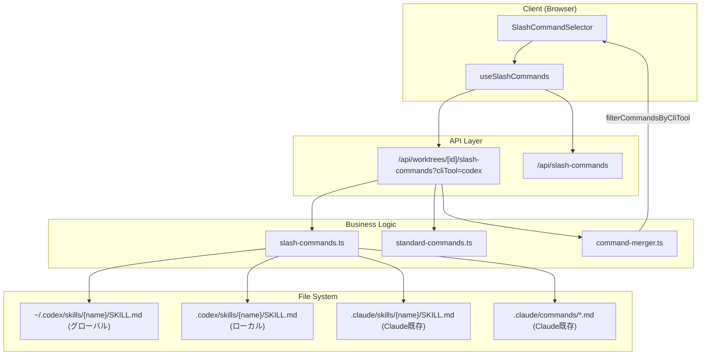

# 設計方針書: Issue #166 - Codexカスタムスキル読込対応（.codex/skills/, ~/.codex/skills/）

## 1. 概要

### 目的
Codex CLIのカスタムスキル（`~/.codex/skills/`, `.codex/skills/`）をCommandMateのスラッシュコマンドセレクターで読み込み・表示できるようにする。Codexタブ選択時のみ表示し、既存のClaude用コマンド表示には影響を与えない。

### スコープ
- `~/.codex/skills/{name}/SKILL.md`（グローバル）の読み込みと表示
- `.codex/skills/{name}/SKILL.md`（ローカル/worktreeごと）の読み込みと表示
- Codexタブ選択時のみ表示（`cliTools: ['codex']`で自動フィルタリング）
- `SlashCommandSource`型への`'codex-skill'`追加
- セキュリティ対策（パストラバーサル防御・symlink防御・サイズ/数制限）

### スコープ外
- Custom Prompts（`~/.codex/prompts/`）: 非推奨のため対象外
- Codex Skills固有のUI（アイコン・バッジ等）
- Skills引数（`$1`〜`$9`等）の高度なUI表示

### 参考実装: Issue #343
Issue #343（`.claude/skills/`対応）で実装された以下のパターンを基本として踏襲する：
- `loadSkills()`: ディレクトリスキャン + SKILL.mdパース
- `parseSkillFile()`: ファイルサイズ制限、safeParseFrontmatter、regexフォールバック
- セキュリティ: パストラバーサル防御（`..`拒否）、resolvedPath検証
- `deduplicateByName()`: 名前重複時の優先度制御

---

## 2. アーキテクチャ設計

### システム構成図



### レイヤー構成

| レイヤー | 変更対象ファイル | 変更内容 |
|---------|----------------|---------|
| 型定義 | `src/types/slash-commands.ts` | `SlashCommandSource`に`'codex-skill'`追加、JSDocコメント修正 |
| ビジネスロジック | `src/lib/slash-commands.ts` | `loadCodexSkills()`追加、`getSlashCommandGroups()`拡張、`clearCache()`拡張 |
| API | `src/app/api/worktrees/[id]/slash-commands/route.ts` | `sources.codexSkill`集計追加 |
| テスト | `tests/unit/slash-commands.test.ts` | 新規関数のテスト追加 |

---

## 3. 詳細設計

### 3.1 型定義の変更

#### `src/types/slash-commands.ts`

```typescript
// SlashCommandSource に 'codex-skill' を追加
export type SlashCommandSource = 'standard' | 'mcbd' | 'worktree' | 'skill' | 'codex-skill';

// cliTools フィールドの JSDoc を正確に修正（現在の記述が実装と矛盾）
export interface SlashCommand {
  // ...
  /**
   * CLI tools this command is available for (Issue #4)
   * - undefined: Claude Code only (backward compatible; filterCommandsByCliTool() treats undefined as claude-only)
   * - ['claude']: Claude Code only (explicit)
   * - ['codex']: Codex CLI only
   * - ['claude', 'codex']: both tools
   *
   * NOTE: undefined does NOT mean "all tools" — it means claude-only.
   * See filterCommandsByCliTool() in command-merger.ts for the authoritative behavior.
   */
  cliTools?: CLIToolType[];
}
```

**新カテゴリ追加判断**: 既存の`'skill'`カテゴリを`source: 'codex-skill'`でCodexスキルにも共用する設計とする。新カテゴリ追加不要（CATEGORY_LABELS/CATEGORY_ORDER変更不要）。

**既存コードのドキュメントバグ修正（Issue #166実装スコープに含む）[D2-002, D2-003]**:
Stage 2整合性レビューにより、以下の既存コードドキュメントバグをIssue #166の実装スコープとして追加する：
1. `src/types/slash-commands.ts` の `cliTools` フィールドJSDoc修正 — 現在の記述が `filterCommandsByCliTool()` の実装と矛盾しているため、上記の正確なJSDocに修正する
2. `src/lib/slash-commands.ts` のD009コメント修正 — セクション3.5に記載の修正後コメントに更新する

### 3.2 `loadCodexSkills()` の設計

#### ファイルパス: `src/lib/slash-commands.ts`

```typescript
/** Codex global skills base directory under home */
const CODEX_SKILLS_SUBDIR = path.join('.codex', 'skills');

/**
 * Load Codex skills from ~/.codex/skills/ (global) or .codex/skills/ (local).
 *
 * Uses same security measures as loadSkills():
 * - Path traversal prevention
 * - Resolved path validation
 * - File size limit
 * - Skill count limit
 *
 * @param basePath - If provided, loads from basePath/.codex/skills/ (local).
 *                   If not provided, loads from ~/.codex/skills/ (global, uses os.homedir()).
 *
 * NOTE: loadSkills()のbasePath未指定は process.cwd() ベースだが、
 * loadCodexSkills()のbasePath未指定は os.homedir() ベース
 * （グローバルスキルは ~/.codex/skills/ を指す）。
 * この非対称性は意図的な設計である。[D1-001]
 *
 * @returns Promise resolving to array of SlashCommand objects with cliTools: ['codex']
 */
export async function loadCodexSkills(basePath?: string): Promise<SlashCommand[]> {
  const root = basePath ?? os.homedir();
  const skillsDir = path.join(root, CODEX_SKILLS_SUBDIR);

  if (!fs.existsSync(skillsDir)) {
    return [];
  }

  const entries = fs.readdirSync(skillsDir, { withFileTypes: true });
  const skills: SlashCommand[] = [];

  for (const entry of entries) {
    if (skills.length >= MAX_SKILLS_COUNT) {
      logger.warn('codex-skills-count-limit');
      break;
    }

    if (!entry.isDirectory()) continue;
    if (entry.name.includes('..')) continue;  // パストラバーサル防御

    const resolvedPath = path.resolve(skillsDir, entry.name);
    if (!resolvedPath.startsWith(path.resolve(skillsDir) + path.sep)) continue;  // symlink防御

    const skill = parseSkillFile(resolvedPath, entry.name);
    if (skill) {
      // Codexスキルには cliTools: ['codex'] を自動設定
      skills.push({
        ...skill,
        source: 'codex-skill',
        cliTools: ['codex'],
      });
    }
  }

  skills.sort((a, b) => a.name.localeCompare(b.name));
  return skills;
}
```

#### 設計ポイント
- `os.homedir()`でホームディレクトリを解決（`~`の展開はNodeJSでは自動されないため必須）
- `parseSkillFile()`は既存のものを共用（DRY原則）
- `cliTools: ['codex']`を自動設定することで`filterCommandsByCliTool()`によるフィルタリングが機能
- `source: 'codex-skill'`でAPI集計時に区別可能
- **filePathの用途制限 [D2-004]**: グローバルスキルの`filePath`は`path.relative(process.cwd(), skillPath)`計算により`../../.codex/skills/xxx/SKILL.md`等の不自然なパスになる可能性がある。UIでのファイルパス表示には使用せず、デバッグ・ログ用途に限定すること
- **readdirSync例外伝播の設計方針 [D4-003]**: `readdirSync()`の権限エラー等は呼び出し元のtry-catchまたはAPIルートのエラーハンドラーで捕捉される。`loadCodexSkills()`は`existsSync()`による存在確認以外の例外は上位に伝播させる設計とする

#### 共通ヘルパー抽出の推奨 [D1-002]
`loadCodexSkills()`と`loadSkills()`のスキャンロジックは90%以上同一である（ディレクトリ走査、パストラバーサル防御、resolvedPath検証、`parseSkillFile()`呼び出し、ソート）。共通の内部ヘルパー関数 `scanSkillDirectory(skillsDir, overrides)` への抽出を推奨する。ただし現時点ではYAGNI原則に従い保留とし、3つ目のスキルソースが追加される時点で抽出を実施する。

### 3.3 キャッシュ管理の設計

```typescript
// 既存キャッシュのみ使用（Codex スキルはworktree API経由で都度読み込み）
let commandsCache: SlashCommand[] | null = null;   // 既存
let skillsCache: SlashCommand[] | null = null;      // 既存 (.claude/skills)
// codexSkillsCache は不要（決定6: MCBD APIではCodexスキルを含めない）
// Codexスキルはworktree APIルートでのみ loadCodexSkills(basePath) により都度読み込む

/**
 * Clear all caches
 */
export function clearCache(): void {
  commandsCache = null;
  skillsCache = null;
  // codexSkillsCache は存在しないためクリア不要
}
```

> **[D2-001]** Stage 2整合性レビューにより、決定6（MCBD APIではCodexグローバルスキルキャッシュ不要）との矛盾を解消。`codexSkillsCache` 変数の定義・使用・クリアを全て削除した。

### 3.4 `getSlashCommandGroups()` の拡張

```typescript
export async function getSlashCommandGroups(basePath?: string): Promise<SlashCommandGroup[]> {
  if (basePath) {
    // worktree固有: Claude commands + Claude skills + Codex local skills
    const commands = await loadSlashCommands(basePath);
    const claudeSkills = await loadSkills(basePath);
    const codexLocalSkills = await loadCodexSkills(basePath);
    const deduplicated = deduplicateByName([...claudeSkills, ...codexLocalSkills], commands);
    return groupByCategory(deduplicated);
  }
  // MCBD共通（basePath未指定）: CodexスキルはMCBDパスには含めない（決定6）
  if (commandsCache === null) commandsCache = await loadSlashCommands();
  if (skillsCache === null) skillsCache = await loadSkills().catch(() => []);
  // codexSkillsCache はここでは使用しない（決定6に従い、MCBD APIではCodexスキルを返さない）
  const deduplicated = deduplicateByName(skillsCache, commandsCache);
  return groupByCategory(deduplicated);
}
```

> **[D2-001]** Stage 2整合性レビューにより、basePath未指定時（MCBDパス）のCodexスキル読み込みを削除。決定6との自己矛盾を解消した。

#### 重複排除の優先度とデータフロー [D1-003]

`deduplicateByName(skills, commands)` の仕様（既存）:
- `skills`が先に登録され、`commands`で上書き（commands優先）
- Codex local skillsはグローバルskillsより後に渡すことで、ローカル優先を実現

**worktree APIルート（`/api/worktrees/[id]/slash-commands`）でのデータフロー**:

1. worktree APIは `getSlashCommandGroups(basePath)` を呼び出して `worktreeGroups` を取得する
2. 同時にMCBD API経由で `standardGroups` を取得する（MCBD側にはCodexスキルを含まない — 決定6）
3. `mergeCommandGroups(standardGroups, worktreeGroups)` により統合される
4. `mergeCommandGroups()` は `worktreeGroups` が優先されるため、**同名スキルはローカル版（worktree側）が勝つ**

**`getSlashCommandGroups(basePath)` でのbasePath指定時の挙動**:
- `basePath` 指定時: ローカルスキル（`.codex/skills/`）のみを `loadCodexSkills(basePath)` で読み込む
- グローバルスキル（`~/.codex/skills/`）は `getSlashCommandGroups()` では読み込まない（MCBD APIにもworktreeグループにも含まれない）
- グローバルCodexスキルは **worktree APIルートで別途 `loadCodexSkills()` を明示的に呼び出して取得する**（後述のセクション3.7参照）

**スコープ別の読み込み設計**:
| スコープ | 読み込み場所 | 読み込み方法 | キャッシュ |
|---------|------------|------------|---------|
| グローバル(`~/.codex/skills/`) | worktree APIルート (`route.ts`) | `loadCodexSkills()`（basePath未指定 = `os.homedir()`） | キャッシュなし（都度読み込み） |
| ローカル(`.codex/skills/`) | `getSlashCommandGroups(basePath)` 内 | `loadCodexSkills(basePath)` | キャッシュなし（都度読み込み） |

> **[D3-001, D3-002]** Stage 3影響分析レビューにより、グローバルCodexスキルの読み込みフローを明確化。`getSlashCommandGroups()` はローカルCodexスキルのみを返し、グローバルCodexスキルはworktree APIルートで別途読み込む設計とした。

### 3.5 D009コメントの修正

```typescript
// src/lib/slash-commands.ts:126-130 修正前（誤記）
// [D009] Note on cliTools: SKILL.md may contain an `allowed-tools` frontmatter field,
// ...
// Skills currently do not set cliTools, making them available for all CLI tools via filterCommandsByCliTool().

// 修正後
// [D009] Note on cliTools: .claude/skills/ skills do not set cliTools (left as undefined),
// which means filterCommandsByCliTool() treats them as claude-only (cliToolId === 'claude').
// Codex skills (.codex/skills/) set cliTools: ['codex'] explicitly in loadCodexSkills().
// See filterCommandsByCliTool() in command-merger.ts for the authoritative behavior.
```

### 3.6 APIレスポンス型の変更

#### `src/app/api/worktrees/[id]/slash-commands/route.ts`

```typescript
interface SlashCommandsResponse {
  groups: SlashCommandGroup[];
  sources: {
    standard: number;
    worktree: number;
    mcbd: number;
    skill: number;        // .claude/skills
    codexSkill: number;   // 追加: .codex/skills / ~/.codex/skills
  };
  cliTool: CLIToolType;
}

// 集計ロジック
const filteredCodexSkillCount = allFilteredCommands.filter(cmd => cmd.source === 'codex-skill').length;

return NextResponse.json({
  groups: filteredGroups,
  sources: {
    standard: filteredStandardCount,
    worktree: filteredWorktreeCount,
    mcbd: 0,
    skill: filteredSkillCount,
    codexSkill: filteredCodexSkillCount,  // 追加
  },
  cliTool,
});
```

### 3.7 worktree APIルートでのグローバルCodexスキル読み込み設計 [D3-001, D3-002]

Stage 3影響分析レビューにより、グローバルCodexスキル（`~/.codex/skills/`）の読み込みフローに設計上の欠落が判明した。`getSlashCommandGroups(basePath)` はローカルCodexスキルのみを返し、MCBD API（`standardGroups`）もCodexスキルを含まない（決定6）ため、グローバルCodexスキルはどこからも読み込まれない状態であった。

**解決策**: worktree APIルート（`src/app/api/worktrees/[id]/slash-commands/route.ts`）でグローバルCodexスキルを **別途** `loadCodexSkills()` を呼び出して取得し、ローカル優先でマージする。

#### 変更対象ファイル
| ファイル | 変更内容 |
|---------|---------|
| `src/lib/slash-commands.ts` | `loadCodexSkills()` を named export としてエクスポート（worktree APIルートから直接呼び出し可能にする） |
| `src/app/api/worktrees/[id]/slash-commands/route.ts` | グローバルCodexスキルの読み込みとマージ処理を追加 |

#### worktree APIルートの疑似コード

```typescript
// src/app/api/worktrees/[id]/slash-commands/route.ts での実装例
import { getSlashCommandGroups, loadCodexSkills } from '@/lib/slash-commands';

// Step 1: worktreeグループ取得（ローカルCodexスキル含む）
const worktreeGroups = await getSlashCommandGroups(worktreePath);

// Step 2: グローバルCodexスキル取得（~/.codex/skills/）
const globalCodexSkills = await loadCodexSkills(); // basePath未指定 = os.homedir()ベース

// Step 3: グローバルCodexスキルをworktreeGroupsにマージ（ローカル優先）
// deduplicateByName() は後に登録されたものが優先されるため、
// globalCodexSkills を先に、ローカルCodexSkills（worktreeGroups内）を後に配置する
// これにより同名スキルはローカル版が優先される
```

#### ローカル優先の実現メカニズム

1. `getSlashCommandGroups(worktreePath)` がローカルCodexスキル（`.codex/skills/`）を含む `worktreeGroups` を返す
2. worktree APIルートで `loadCodexSkills()` によりグローバルCodexスキル（`~/.codex/skills/`）を取得
3. グローバルCodexスキルを `worktreeGroups` のスキルカテゴリに **先に** 挿入し、ローカルスキルを **後に** 配置することで `deduplicateByName()` のローカル優先を実現
4. `mergeCommandGroups(standardGroups, worktreeGroups)` で最終統合

---

## 4. セキュリティ設計

### パストラバーサル防御
Issue #343で実装済みのパターンを踏襲：
1. ディレクトリエントリに`..`が含まれる場合はスキップ
2. `path.resolve()`で絶対パスに変換し、`skillsDir`配下であることを確認
3. symlinkによるエスケープ：`resolvedPath.startsWith(path.resolve(skillsDir) + path.sep)`で検証

**symlink防御の制限事項 [D4-001]**: symlink防御は`path.resolve()`によるレキシカル検証（シンボリックリンクの実際のリンク先は確認しない）。`fs.realpathSync()`による実パス解決を行う場合は`loadSkills()`と同時に別Issueで対応すること（本Issueでは既存`loadSkills()`と同一パターンを採用し一貫性を優先）。

### ファイルサイズ/数制限
既存定数を共用（新定数不要）：
- `MAX_SKILL_FILE_SIZE_BYTES = 65536` (64KB)
- `MAX_SKILLS_COUNT = 100`

**MAX_SKILLS_COUNTのソース別独立適用について [D1-006]**: `MAX_SKILLS_COUNT` は `loadSkills()`（Claude skills）、`loadCodexSkills()`（グローバルCodex skills）、`loadCodexSkills(basePath)`（ローカルCodex skills）のそれぞれに独立適用される。そのため合計最大件数は300件（100 x 3）となりうる。現時点ではUIのスラッシュコマンドセレクターでの表示件数として許容範囲と判断する。

### JSエンジン無効化
`safeParseFrontmatter()`を使用（既存関数、共用）

---

## 5. 設計上の決定事項とトレードオフ

### 決定1: 新カテゴリ追加不要
| 決定 | 既存`'skill'`カテゴリを共用し`source: 'codex-skill'`で区別 |
|------|------|
| 理由 | CATEGORY_LABELS/CATEGORY_ORDER/テストの3箇所連動更新が不要。CodexスキルとClaudeスキルは同じ「Skills」カテゴリに表示されるが、filterCommandsByCliTool()でツール別に自動フィルタリングされるため問題なし |
| トレードオフ | UIで「Codex Skills」という別カテゴリ表示はできないが、YAGNI原則に従いシンプルさを優先 |

### 決定2: `parseSkillFile()`は共用
| 決定 | `.claude/skills/`と`.codex/skills/`で同一の`parseSkillFile()`を共用 |
|------|------|
| 理由 | SKILL.mdのフォーマットは共通（frontmatter: name, description）。DRY原則に従い共用 |
| トレードオフ | Codex固有のフィールド（`allowed-tools`等）を将来的に解析するには分離が必要になる可能性があるが、現時点では不要 |

### 決定3: Custom Prompts対象外
| 決定 | `~/.codex/prompts/`は非推奨のためスコープ外 |
|------|------|
| 理由 | Codex公式が非推奨と明言。技術的負債を避けるためSkillsのみを実装 |
| トレードオフ | 既存ユーザーの`~/.codex/prompts/`が表示されないが、Codex公式の推奨に従う |

### 決定4: `sources.codexSkill`を別プロパティに
| 決定 | `sources.skill`（Claude skills）と`sources.codexSkill`（Codex skills）を分離 |
|------|------|
| 理由 | 将来的なデバッグ・監視の観点から分離が有益。`source: 'codex-skill'`で既に区別されている |
| トレードオフ | APIレスポンス型の変更が必要（後方互換性は新プロパティ追加のため問題なし） |

### 決定5: `parseSkillFile()`のsource/cliTools上書きパターン [D1-005]
| 決定 | `parseSkillFile()`は`source:'skill'`かつ`cliTools`未設定で返し、`loadCodexSkills()`でスプレッドにより`source:'codex-skill'`、`cliTools:['codex']`に上書きする |
|------|------|
| 理由 | KISS原則に従い、`parseSkillFile()`自体はシンプルなパーサーとして維持する。呼び出し元がソース固有の属性を付与する責務を持つ |
| トレードオフ | 将来的にCLIツールがさらに増えた場合、各`loadXxxSkills()`でスプレッド上書きが増殖する可能性がある。その時点で`parseSkillFile(overrides?: Partial<SlashCommand>)`のようなoverridesパラメータ追加を検討すること（OCP拡張点） |

### 決定6: MCBD APIではCodexグローバルスキルキャッシュは不要 [D1-004]
| 決定 | MCBD API（`/api/slash-commands`）ではCodexグローバルスキルのキャッシュ（`codexSkillsCache`）を使用しない。worktree API（`/api/worktrees/[id]/slash-commands?cliTool=codex`）経由でのみCodexスキルを返す設計とする |
|------|------|
| 理由 | MCBD APIは主にClaude用コマンドを返す用途で使用される。Codexユーザーは必ずworktreeコンテキストで操作するため、MCBD API側にCodexスキルを含める必要がない（YAGNI） |
| トレードオフ | MCBD APIからCodexスキルを取得したいユースケースが発生した場合は追加対応が必要。ただし現時点ではそのようなユースケースは想定されない |

---

## 6. テスト設計

### Unit Tests（`tests/unit/slash-commands.test.ts`）

| テストケース | 目的 |
|------------|------|
| `loadCodexSkills()` - 存在しないディレクトリ | 空配列を返すこと |
| `loadCodexSkills()` - 正常ケース（`basePath`指定） | SKILL.mdを読み込みcliTools: ['codex']が設定されること |
| `loadCodexSkills()` - `basePath`なし（グローバル） | `os.homedir()`を使用すること |
| `loadCodexSkills()` - パストラバーサル攻撃 | `..`を含むディレクトリをスキップすること |
| `loadCodexSkills()` - symlink防御 | resolvedPathがskillsDir外の場合スキップすること |
| `loadCodexSkills()` - ファイルサイズ超過 | 64KB超のファイルをスキップすること |
| `loadCodexSkills()` - MAX_SKILLS_COUNT超 | 100件以上はスキップすること |
| `clearCache()` | `commandsCache`/`skillsCache`がクリアされること（`codexSkillsCache`は存在しない） |
| `filterCommandsByCliTool(groups, 'codex')` | `cliTools: ['codex']`のCodexスキルのみ表示されること |
| `filterCommandsByCliTool(groups, 'claude')` | Codexスキルが非表示になること |

### Integration Tests（`tests/integration/api-worktree-slash-commands.test.ts`）

| テストケース | 目的 |
|------------|------|
| グローバル + ローカルスキルの統合読み込み | 両方が読み込まれること |
| 同名スキルのローカル優先 | ローカル（`.codex/skills/`）がグローバル（`~/.codex/skills/`）より優先されること |
| `cliTool=codex` でCodexスキルのみ返却 | フィルタリングが正しく動作すること |
| `sources.codexSkill` カウント | 正しくカウントされること |
| `sources.codexSkill` がグローバル+ローカル合算で正しくカウントされること [D3-005] | worktree APIルートでグローバルCodexスキルとローカルCodexスキルが統合された後、`sources.codexSkill` にその合計（重複排除後）が正しく反映されること |

---

## 7. 実装順序

### Step 1: 型定義の更新
1. `src/types/slash-commands.ts` - `SlashCommandSource`に`'codex-skill'`追加、JSDoc修正

### Step 2: コアロジックの実装
2. `src/lib/slash-commands.ts` - `loadCodexSkills()`追加、`getSlashCommandGroups()`拡張（basePath指定時のみCodexスキル読み込み）、D009コメント修正、cliTools JSDoc修正

### Step 3: APIレスポンスの更新
3. `src/app/api/worktrees/[id]/slash-commands/route.ts` - `sources.codexSkill`追加

### Step 4: テストの追加
4. `tests/unit/slash-commands.test.ts` - Unit Tests追加
5. `tests/integration/api-worktree-slash-commands.test.ts` - Integration Tests追加

---

## 8. 関連ファイル一覧

| ファイル | 変更種別 | 変更内容 |
|---------|---------|---------|
| `src/types/slash-commands.ts` | 変更 | `SlashCommandSource`追加、JSDoc修正 |
| `src/lib/slash-commands.ts` | 変更 | `loadCodexSkills()`追加・named export、`getSlashCommandGroups()`拡張（basePath指定時のみ）、D009コメント修正 |
| `src/app/api/worktrees/[id]/slash-commands/route.ts` | 変更 | `sources.codexSkill`追加、グローバルCodexスキルの読み込み・マージ処理追加 [D3-001, D3-002] |
| `tests/unit/slash-commands.test.ts` | 変更 | Unit Tests追加 |
| `tests/integration/api-worktree-slash-commands.test.ts` | 変更 | Integration Tests追加 |

**変更不要ファイル**:
- `src/lib/command-merger.ts` - `filterCommandsByCliTool()`は変更不要
- `src/app/api/slash-commands/route.ts` - MCBD APIは変更不要
- `src/lib/cli-tools/types.ts` - `'codex'`は既に定義済み

---

## 9. レビュー指摘反映サマリー

### Stage 1: 通常レビュー（2026-03-14反映）

| ID | 重要度 | 内容 | 反映先セクション |
|----|--------|------|----------------|
| D1-003 | Must Fix | `deduplicateByName()`でのCodexローカル優先の実現方法（データフロー）を明記 | 3.4 |
| D1-001 | Should Fix | `loadCodexSkills()`と`loadSkills()`のbasePath挙動の非対称性をJSDocに明記 | 3.2 |
| D1-002 | Should Fix | 共通スキャンロジックの内部ヘルパー化の推奨を記載 | 3.2 |
| D1-005 | Should Fix | `parseSkillFile()`のsource/cliTools上書きパターンについての注記 | 5（決定5） |
| D1-006 | Nice to Have | `MAX_SKILLS_COUNT`のソース別独立適用（合計最大300件）を明記 | 4 |
| D1-004 | Nice to Have | MCBD APIではCodexグローバルスキルキャッシュ不要の設計決定を明記 | 5（決定6） |

### Stage 2: 整合性レビュー（2026-03-14反映）

| ID | 重要度 | 内容 | 反映先セクション |
|----|--------|------|----------------|
| D2-001 | Must Fix | 設計書の自己矛盾を解消（決定6 vs セクション3.3/3.4のMCBDパスでの`codexSkillsCache`使用）。basePath未指定時のCodexスキル読み込みとキャッシュを削除 | 3.3, 3.4 |
| D2-002 | Should Fix | `src/types/slash-commands.ts` の `cliTools` フィールドJSDoc修正をIssue #166実装スコープに明記 | 3.1 |
| D2-003 | Should Fix | `src/lib/slash-commands.ts` のD009コメント修正をIssue #166実装スコープに明記 | 3.1 |
| D2-004 | Nice to Have | グローバルスキルの`filePath`が不自然なパスになる件の注記追加 | 3.2 |
| D2-005 | Nice to Have | スコープ外のため記載不要 | - |

### Stage 3: 影響分析レビュー（2026-03-14反映）

| ID | 重要度 | 内容 | 反映先セクション |
|----|--------|------|----------------|
| D3-001 | Should Fix | グローバルCodexスキルの読み込みフローがworktree APIルートに欠落。`loadCodexSkills()`をworktree APIルートで別途呼び出す設計を追加 | 3.4, 3.7 |
| D3-002 | Should Fix | スコープ別読み込みテーブルの更新（グローバルスキルの読み込み場所を明確化） | 3.4 |
| D3-005 | Nice to Have | 統合テスト計画に `sources.codexSkill` のグローバル+ローカル合算検証を追加 | 6 |
| D3-003 | - | スキップ（設計書に記載済み） | - |
| D3-004 | - | スキップ（設計書に記載済み） | - |
| D3-006 | - | スキップ（スコープ外） | - |

### Stage 4: セキュリティレビュー（2026-03-14反映）

| ID | 重要度 | 内容 | 反映先セクション |
|----|--------|------|----------------|
| D4-001 | Should Fix | symlink防御の制限事項（レキシカル検証のみ）を設計書に注記。`fs.realpathSync()`対応は別Issue | 4 |
| D4-003 | Nice to Have | `readdirSync()`の例外伝播方針を設計ポイントに追記 | 3.2 |
| D4-002 | - | スキップ | - |

### 実装チェックリスト

Stage 1 / Stage 2レビュー指摘を踏まえた実装時の確認項目:

- [ ] [D1-003] worktree APIでの`mergeCommandGroups(standardGroups, worktreeGroups)`によるローカル優先統合が正しく動作すること
- [ ] [D1-003] `getSlashCommandGroups(basePath)`のbasePath指定時にローカルスキルのみ読み込まれることを確認
- [ ] [D1-001] `loadCodexSkills()`のJSDocに`os.homedir()`ベースである旨が記載されていること
- [ ] [D1-005] `loadCodexSkills()`内でスプレッドによる`source`/`cliTools`上書きが正しく行われること
- [ ] [D1-006] `MAX_SKILLS_COUNT`がソース別に独立適用されることをテストで確認
- [ ] [D1-004] MCBD API（`/api/slash-commands`）がCodexスキルを返さないことを確認
- [ ] [D2-001] `getSlashCommandGroups()`のbasePath未指定時にCodexスキルを読み込まないこと（決定6との整合性）
- [ ] [D2-001] `codexSkillsCache` 変数が存在しないこと（キャッシュ管理から完全削除）
- [ ] [D2-001] `clearCache()` に `codexSkillsCache` のクリアが含まれないこと
- [ ] [D2-002] `src/types/slash-commands.ts` の `cliTools` フィールドJSDocが `filterCommandsByCliTool()` の実装と一致すること
- [ ] [D2-003] `src/lib/slash-commands.ts` のD009コメントが正確であること
- [ ] [D2-004] グローバルスキルの`filePath`をUIでのファイルパス表示に使用していないこと
- [ ] [D3-001] worktree APIルートで `loadCodexSkills()` を呼び出してグローバルCodexスキルを取得していること
- [ ] [D3-002] グローバルCodexスキルがローカルCodexスキルより先に配置され、ローカル優先が実現されていること
- [ ] [D3-005] 統合テストで `sources.codexSkill` がグローバル+ローカル合算（重複排除後）で正しくカウントされることを検証していること
- [ ] [D4-001] symlink防御が`path.resolve()`によるレキシカル検証であり、`fs.realpathSync()`を使用していないこと（既存`loadSkills()`と同一パターン）
- [ ] [D4-003] `loadCodexSkills()`が`existsSync()`以外の例外を上位に伝播させる設計であること（内部try-catchで握りつぶしていないこと）

---

## 10. 関連Issue
- **#166**: 本Issue
- **#343**: `.claude/skills/`対応（設計参考・実装パターン）
- **#4**: Codex CLI対応（親Issue）
