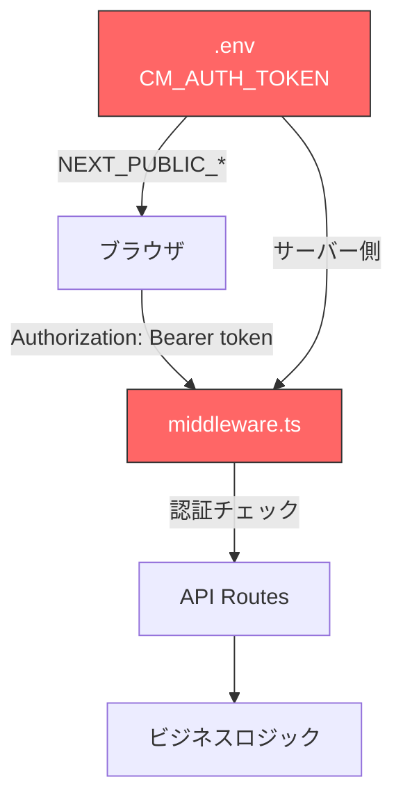
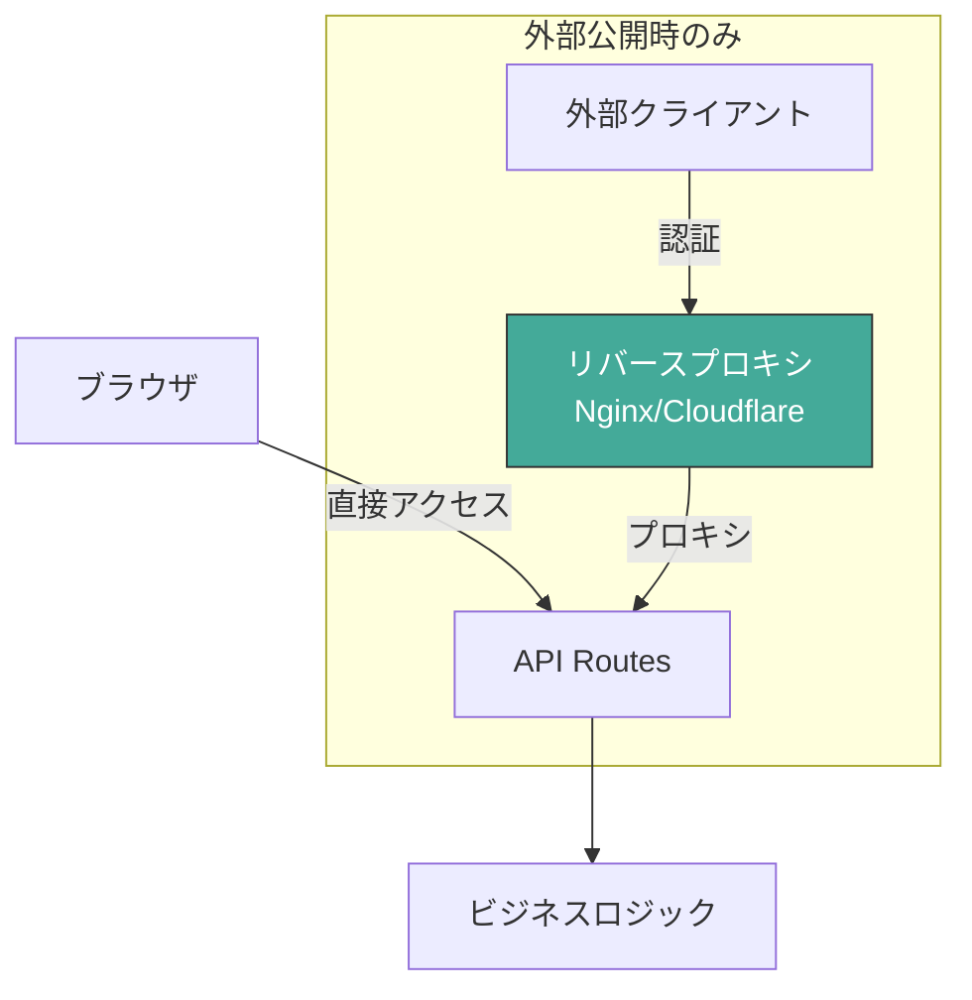

# Issue #179: CM_AUTH_TOKEN認証機能削除 設計方針書

## 1. 概要

### 目的
現在の`CM_AUTH_TOKEN`による認証機能を完全に削除し、外部公開時はリバースプロキシでの認証を推奨する方針に変更する。

### 背景
`NEXT_PUBLIC_CM_AUTH_TOKEN`がクライアントJSに埋め込まれるため、DevToolsやビルド成果物から容易にトークンを取得可能であり、セキュリティとして機能していない（セキュリティシアター）。

### スコープ
- 認証ミドルウェア（`src/middleware.ts`）のファイル削除
- 認証関連環境変数の削除（`CM_AUTH_TOKEN`, `NEXT_PUBLIC_CM_AUTH_TOKEN`, レガシー`MCBD_AUTH_TOKEN`）
- CLI警告メッセージのリバースプロキシ推奨への置換
- セキュリティガイドの新規作成
- 関連ドキュメント更新（10件）
- 関連テスト更新（6件）

## 2. アーキテクチャ設計

### 変更前（現在）



### 変更後



### 設計原則
- **YAGNI**: 機能していない認証コードを維持しない
- **KISS**: 認証はリバースプロキシに委譲し、アプリケーション層をシンプルに保つ
- **SRP**: CommandMateはワークツリー管理に集中、認証は外部インフラの責務

## 3. 変更対象ファイル

### 3.1 削除対象ファイル（2件）

| ファイル | 行数 | 理由 |
|---------|------|------|
| `src/middleware.ts` | 89行 | 全体が認証ロジック。将来必要時に再作成 |
| `tests/unit/middleware.test.ts` | 182行 | middleware.ts削除に伴う |

### 3.2 ソースコード修正（8件）

| ファイル | 変更内容 | 影響度 |
|---------|---------|--------|
| `src/lib/api-client.ts` | Authorizationヘッダー送信削除 | HIGH |
| `src/lib/env.ts` | CM_AUTH_TOKEN関連の型・検証・マッピング削除 | HIGH |
| `src/lib/logger.ts` | AUTH_TOKENマスキングパターン削除 | LOW |
| `src/cli/utils/security-logger.ts` | AUTH_TOKENマスキング処理削除 | LOW |
| `src/cli/commands/init.ts` | トークン生成プロンプト削除、リバースプロキシ警告追加 | MEDIUM |
| `src/cli/commands/start.ts` | セキュリティ警告をリバースプロキシ推奨に置換 | MEDIUM |
| `src/cli/utils/daemon.ts` | セキュリティ警告をリバースプロキシ推奨に置換 | MEDIUM |
| `src/cli/utils/env-setup.ts` | generateAuthToken()・validateConfig()の認証チェック削除 | MEDIUM |

### 3.3 型定義修正（1件）

| ファイル | 変更内容 |
|---------|---------|
| `src/cli/types/index.ts` | EnvConfig interfaceからCM_AUTH_TOKENフィールド削除 |

### 3.4 設定ファイル修正（3件）

| ファイル | 変更内容 |
|---------|---------|
| `.env.example` | CM_AUTH_TOKEN行（行29）削除、CM_BIND説明コメント（行17）の`auth required`を`reverse proxy auth recommended`に更新、AUTH_TOKEN関連コメント（行26-28）削除、MCBD_AUTH_TOKENコメント行（行67）削除 |
| `.env.production.example` | AUTH_TOKEN削除、セキュリティセクション書き換え、Legacy SupportセクションからMCBD_AUTH_TOKEN行削除 |
| `scripts/setup-env.sh` | AUTH_TOKEN関連の全削除（ヘルプテキスト行50、generate_token関数行168-171、auth_token変数・条件分岐行231-240、CM_AUTH_TOKEN/NEXT_PUBLIC_CM_AUTH_TOKEN書き込み行297-314、サマリー表示行372-374、トークン保存警告行379-382） |

### 3.5 テストファイル修正（5件）

| ファイル | 変更内容 |
|---------|---------|
| `tests/unit/env.test.ts` | CM_AUTH_TOKEN関連テスト削除・更新（ENV_MAPPINGテスト行226-249: マッピング数を8から7に変更、toEqual()からCM_AUTH_TOKENエントリ削除） |
| `tests/unit/logger.test.ts` | AUTH_TOKENマスキングテスト削除 |
| `tests/unit/cli/utils/env-setup.test.ts` | generateAuthToken関連テスト削除、validateConfigテスト（行510-523: `should pass when auth token is provided for 0.0.0.0 bind`）を更新（CM_BIND=0.0.0.0でもAUTH_TOKEN不要でvalidation通過を確認するテストに変更） |
| `tests/unit/cli/utils/daemon.test.ts` | 警告テストをリバースプロキシ推奨に更新 |
| `tests/unit/cli/utils/security-logger.test.ts` | AUTH_TOKENマスキングテスト削除 |

### 3.6 ドキュメント更新（10件）+ 新規作成（1件）

| ファイル | 変更内容 |
|---------|---------|
| `docs/security-guide.md` | **新規作成**: リバースプロキシ認証ガイド |
| `docs/DEPLOYMENT.md` | セキュリティセクション書き換え、AUTH_TOKEN削除 |
| `docs/TRUST_AND_SAFETY.md` | 外部アクセスセクション（行28）の`MCBD_BIND`/`MCBD_AUTH_TOKEN`を更新、非推奨設定リスト（行40-42）の「認証トークンなしでMCBD_BIND=0.0.0.0を設定すること」を「リバースプロキシ認証を設定せずにCM_BIND=0.0.0.0でサーバーを公開すること」に更新 |
| `docs/migration-to-commandmate.md` | AUTH_TOKENマッピング・トラブルシューティング更新 |
| `README.md` | モバイルアクセスセクション更新 |
| `docs/concept.md` | CM_AUTH_TOKEN参照削除 |
| `docs/architecture.md` | MCBD_AUTH_TOKEN参照をリバースプロキシ方式に |
| `docs/user-guide/webapp-guide.md` | CM_AUTH_TOKEN参照削除 |
| `docs/internal/PRODUCTION_CHECKLIST.md` | AUTH_TOKENチェック項目更新 |
| `docs/internal/TESTING_GUIDE.md` | AUTH_TOKEN参照削除 |
| `docs/internal/swe-agents.md` | MCBD_AUTH_TOKEN参照更新 |
| `docs/internal/requirements-design.md` | NFR-SEC-02要件更新 |
| `CHANGELOG.md` | 破壊的変更として記載 |

## 4. 詳細設計

### 4.1 src/middleware.ts の削除

**方針**: ファイル全体を削除する。Next.jsのミドルウェア機構はmiddleware.tsが存在しない場合、自動的にスキップされるため副作用なし。

### 4.2 src/lib/api-client.ts の変更

**削除対象**:
- `clientAuthTokenWarned` 変数
- `authToken` 取得ロジック（`NEXT_PUBLIC_CM_AUTH_TOKEN` / `NEXT_PUBLIC_MCBD_AUTH_TOKEN`参照）
- deprecation警告ロジック
- `Authorization` ヘッダー設定

**変更前**:
```typescript
let clientAuthTokenWarned = false;
// ... (Authorization header logic)
if (authToken) {
  headers['Authorization'] = `Bearer ${authToken}`;
}
```

**変更後**:
```typescript
// Authorization header logic removed - authentication delegated to reverse proxy
```

### 4.3 src/lib/env.ts の変更

**削除対象**:
- `ENV_MAPPING` からCM_AUTH_TOKENエントリ（EnvKey型に自動波及）
- `Env` interfaceの`CM_AUTH_TOKEN`フィールド
- `getEnv()`内の`authToken`変数取得およびreturnオブジェクトの`CM_AUTH_TOKEN`プロパティ
- `CM_BIND=0.0.0.0` 時の`CM_AUTH_TOKEN`必須チェック（throw文、行228-229）
- `isAuthRequired()` 関数（行276-279。exportされているが、srcディレクトリ内に呼び出し箇所がないことを確認済み）

**重要**: `CM_BIND` 関連の処理は残す（リバースプロキシ警告で使用）

**validateEnv()への影響**: `getEnv()`からthrow文を削除することで、`validateEnv()`が`CM_BIND=0.0.0.0`時にも`valid: true`を返すようになる。これは意図した動作変更である（認証機能削除により、外部バインド時のAUTH_TOKEN必須チェックが不要になるため）。

**getEnvWithFallback()の維持**: `getEnvWithFallback()`は`getEnvByKey()`の内部実装として引き続き使用されるためexportを維持する。middleware.tsからの直接呼び出しは削除される。

**getEnv() throw文削除の波及効果**: `getEnv()`は`db-instance.ts`（行33）等から呼び出される。現在、`CM_BIND=0.0.0.0` + `CM_AUTH_TOKEN`未設定の組み合わせでは`getEnv()`がthrowするためサーバー起動自体が失敗する。throw文削除後は`getEnv()`が正常に`Env`オブジェクトを返すようになり、`db-instance.ts`のDB初期化やAPI routeでの`CM_ROOT_DIR`取得が正常に動作する。これにより`CM_BIND=0.0.0.0`でサーバーが無認証で起動可能になる。これは認証機能削除の意図した結果である。

### 4.4 CLI警告メッセージの置換

`src/cli/commands/start.ts`、`src/cli/utils/daemon.ts`、`src/cli/commands/init.ts` の既存セキュリティ警告を共通定数に置換する。

**警告メッセージ定数**: `src/cli/config/security-messages.ts` に定義

```typescript
// src/cli/config/security-messages.ts
export const REVERSE_PROXY_WARNING = `
\x1b[1m\x1b[31m⚠️  セキュリティ警告: 認証なしで外部ネットワークに公開されます\x1b[0m

リバースプロキシでの認証設定なしでの外部公開は
重大なセキュリティリスクです。

\x1b[1mリスク:\x1b[0m
  ファイルの読み書き削除、コマンド実行が
  第三者から可能になります。

\x1b[1m推奨される認証方法:\x1b[0m
  • Nginx + Basic認証
  • Cloudflare Access
  • Tailscale

詳細: https://github.com/Kewton/CommandMate/blob/main/docs/security-guide.md
`;
```

**注記**: ANSIエスケープシーケンスを使用して赤色/ボールドで表示し、視覚的な緊急性を伝達する（`\x1b[1m`=ボールド、`\x1b[31m`=赤色、`\x1b[0m`=リセット）。

**設計判断**: 警告メッセージを`src/cli/config/security-messages.ts`に共通定数として定義し、`start.ts`、`daemon.ts`、`init.ts`の3箇所から参照する（DRY原則）。メッセージにはURL、箇条書き、フォーマット済みテキストが含まれるため、変更時の同期漏れを防止する。

**start.ts/daemon.tsの削除対象**: `start.ts`（行166）の`const authToken = env.CM_AUTH_TOKEN`宣言とそれを使用する条件分岐（行171-174）、`daemon.ts`（行75）の`authToken = env.CM_AUTH_TOKEN`とその条件分岐（行81-84）をすべて削除し、`CM_BIND=0.0.0.0`時は`REVERSE_PROXY_WARNING`定数を直接表示する。

**注記**: `start.ts`/`daemon.ts`での警告は、ユーザーが`commandmate init`を再実行せずに`CM_BIND=0.0.0.0`の`.env`で直接startした場合にも適切にリバースプロキシ推奨警告が表示される。

### 4.5 src/cli/utils/env-setup.ts の変更

**削除対象**:
- `generateAuthToken()` メソッド（行278-280: `randomBytes(32).toString('hex')`）
- `validateConfig()` 内の`CM_AUTH_TOKEN`必須チェック（行300: `CM_BIND=0.0.0.0`時のバリデーション）
- `createEnvFile()` 内の`CM_AUTH_TOKEN`書き込み（行245-247）

### 4.6 commandmate init の変更

`src/cli/commands/init.ts` の変更:

**削除対象**:
- `promptForConfig()` 内の`authToken`変数宣言（行90）
- `EnvSetup.generateAuthToken()` 呼び出し（行95）
- トークン情報のログ出力（行97-99）
- `displayConfigSummary()` 関数内のCM_AUTH_TOKEN条件付き表示（行133-135）
- トークン保存警告メッセージ（行141-145: "Save your auth token securely!"）

**追加**:
- `CM_BIND=0.0.0.0` 選択時に`REVERSE_PROXY_WARNING`（`src/cli/config/security-messages.ts`から参照）を表示
- `.env` ファイル生成から `CM_AUTH_TOKEN` 行を除去

### 4.7 docs/security-guide.md の新規作成

以下の構成で作成:
1. はじめに（CommandMateのセキュリティモデル）
2. **脅威モデル** - 無認証公開時の具体的な攻撃シナリオ
   - RCE相当リスク: `/api/worktrees/:id/send`エンドポイント経由でCLIツールに任意のプロンプトを送信可能
   - ファイル操作: `/api/worktrees/:id/files`経由でファイルの読み書き削除が可能
   - セッション操作: `kill-session`、`auto-yes`エンドポイントによるセッション制御
   - 情報漏洩: `current-output`、`messages`、`logs`エンドポイントによる出力内容の取得
3. ネットワーク構成の推奨
4. 既存ユーザーの移行手順（CM_AUTH_TOKEN認証からリバースプロキシへ）
   - **冒頭に強い警告**: 「CM_BIND=0.0.0.0で運用中のユーザーは、必ずリバースプロキシの設定と動作確認を完了してからアップグレードしてください。先にアップグレードすると、認証なしでサーバーが外部公開されます。」
   - 手順1: リバースプロキシを設定する
   - 手順2: CommandMateをアップグレードする
   - 手順3: .envからCM_AUTH_TOKEN/NEXT_PUBLIC_CM_AUTH_TOKENを削除する（任意、削除しなくても動作に影響なし）
   - 手順4: 動作確認する
5. Nginx + Basic認証の設定例（レート制限設定 `limit_req_zone` を含む）
6. Cloudflare Access の設定概要
7. Tailscale の設定概要
8. セキュリティチェックリスト

### 4.8 CHANGELOG の更新

[Unreleased]セクションに破壊的変更を追記する。既存のCHANGELOGエントリ（Issue #76, #77等の過去バージョン記述）は歴史的記録として変更しない。

```markdown
## [Unreleased]

### Removed
- **BREAKING CHANGE**: `CM_AUTH_TOKEN`/`NEXT_PUBLIC_CM_AUTH_TOKEN`認証機能を削除
  - `src/middleware.ts`を削除（認証ミドルウェア）
  - Issue #76で導入されたCM_AUTH_TOKEN/MCBD_AUTH_TOKENフォールバック機能を削除
  - 外部公開時はリバースプロキシでの認証を推奨
  - **CM_BIND=0.0.0.0で運用中の方**: アップグレード前に必ずリバースプロキシの認証設定を完了してください。詳細: docs/security-guide.md

### Added
- 外部公開時のリバースプロキシ認証推奨警告（`commandmate init`/`start`/daemon）
- セキュリティガイド（`docs/security-guide.md`）を新規作成
```

## 5. セキュリティ設計

### 5.1 セキュリティモデル

| シナリオ | 対応 |
|---------|------|
| ローカル開発（127.0.0.1） | 認証不要（信頼されたネットワーク） |
| LAN内アクセス（0.0.0.0） | リバースプロキシ推奨警告を表示 |
| 外部公開 | リバースプロキシでの認証必須（ドキュメントで案内） |

### 5.2 破壊的変更の影響

| ユーザータイプ | 影響度 | 必要な対応 |
|--------------|--------|-----------|
| CM_BIND=0.0.0.0で運用中 | **CRITICAL** | リバースプロキシ設定が必要 |
| CM_BIND=127.0.0.1で運用中 | NONE | 対応不要 |
| CI/CDでCM_AUTH_TOKENを設定 | LOW | 設定削除は任意（エラーにはならない） |

### 5.3 後方互換性

- 既存の `CM_AUTH_TOKEN` / `MCBD_AUTH_TOKEN` 環境変数が設定されていても**エラーにはならない**（単に無視される）
- `NEXT_PUBLIC_CM_AUTH_TOKEN` が設定されていても無害（参照するコードが削除されるため）

## 6. テスト方針

### 6.1 削除するテスト

- `tests/unit/middleware.test.ts` - ファイル全体（182行）
- `tests/unit/env.test.ts` 内のCM_AUTH_TOKEN関連テスト
- `tests/unit/logger.test.ts` 内のAUTH_TOKENマスキングテスト
- `tests/unit/cli/utils/env-setup.test.ts` 内のgenerateAuthToken関連テスト
- `tests/unit/cli/utils/security-logger.test.ts` 内のAUTH_TOKENマスキングテスト

### 6.2 更新するテスト

- `tests/unit/cli/utils/daemon.test.ts` - セキュリティ警告テストをリバースプロキシ推奨警告テストに更新

### 6.3 品質基準

- `npx tsc --noEmit` パス
- `npm run lint` パス
- `npm run test:unit` 全テストパス

## 7. 実装順序

1. **ソースコード削除**（依存関係の上流から）
   - `src/middleware.ts` 削除
   - `src/lib/env.ts` からAUTH_TOKEN関連削除
   - `src/lib/api-client.ts` からAuthorization送信削除
   - `src/lib/logger.ts` からマスキングパターン削除
   - `src/cli/utils/security-logger.ts` からマスキング削除
2. **CLI修正**
   - `src/cli/config/security-messages.ts` 新規作成（共通警告メッセージ定数）
   - `src/cli/utils/env-setup.ts` 修正
   - `src/cli/types/index.ts` 修正
   - `src/cli/commands/init.ts` 修正
   - `src/cli/commands/start.ts` 警告置換
   - `src/cli/utils/daemon.ts` 警告置換
3. **設定ファイル修正**
   - `.env.example` / `.env.production.example` / `scripts/setup-env.sh`
4. **テスト更新**
   - テストファイル6件の削除・更新
5. **ドキュメント更新**
   - `docs/security-guide.md` 新規作成
   - 既存ドキュメント10件の更新
   - `CHANGELOG.md` 更新

## 8. 設計上の決定事項とトレードオフ

| 決定事項 | 理由 | トレードオフ |
|---------|------|-------------|
| middleware.ts全体を削除 | 認証ロジックのみで構成。将来必要時に再作成 | 将来ミドルウェアが必要な場合は新規作成が必要 |
| 警告メッセージを共通定数化 | 3箇所で使用、URL・箇条書き含む複雑なテキスト（DRY原則） | 1ファイル追加（`src/cli/config/security-messages.ts`） |
| 既存AUTH_TOKEN設定を無視（エラーにしない） | 後方互換性。CI/CD設定の即座変更が不要 | 不要な設定が残る可能性 |
| リバースプロキシ認証への委譲 | 業界標準の方式。アプリ層のシンプル化 | ユーザーの設定負担増（外部公開時のみ） |

## 9. 影響範囲サマリー

### ファイル数

| カテゴリ | 件数 |
|---------|------|
| 削除 | 2（middleware.ts, middleware.test.ts） |
| ソースコード修正 | 8 |
| ソースコード新規作成 | 1（`src/cli/config/security-messages.ts`） |
| 型定義修正 | 1 |
| 設定ファイル修正 | 3 |
| テスト修正 | 5 |
| ドキュメント更新 | 10 |
| ドキュメント新規作成 | 1 |
| CHANGELOG更新 | 1 |
| **合計** | **32** |

## 10. ロールバック計画

- **Git revert**: ソースコード復元は可能。`middleware.ts`のファイル削除もrevertで復元される
- **npm publish後**: マイナーバージョンで認証機能を復元したバージョンをリリース可能
- **ユーザー影響**: 認証機能の復元とリバースプロキシ方式は共存可能であり、ロールバックによるユーザー影響は限定的
- **注意**: 本変更はファイル削除と広範な変更（32ファイル）を含むため、ロールバック時はテスト網羅性の確認が必要
