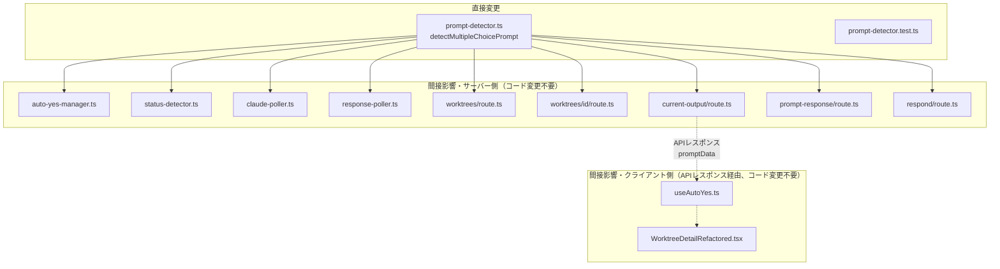

# 設計方針書: Issue #181 複数行オプションを含むmultiple choiceプロンプト検出修正

## 1. 概要

### 1-1. 対象Issue
- **Issue番号**: #181
- **タイトル**: fix: 複数行オプションを含むmultiple choiceプロンプトが検出されない
- **種別**: バグ修正

### 1-2. 問題概要

Claude CLIのmultiple choiceプロンプトで、オプションのテキストが長くターミナル幅で折り返される場合、折り返し後の行が継続行として認識されず、プロンプト検出が失敗する。

### 1-3. 再現シナリオ

```
Do you want to proceed?
❯ 1. Yes
  2. Yes, and don't ask again for curl and python3 commands in
/Users/maenokota/share/work/github_kewton/comma
ndmate-issue-161
  3. No

Esc to cancel · Tab to amend · ctrl+e to explain
```

オプション2のテキストがターミナル幅で折り返され、`/Users/...` と `ndmate-issue-161` が独立した行として出現する。逆順スキャンがこれらの行で中断し、オプション1・2が検出されないため、`options.length < 2` で非検出となる。

---

## 2. アーキテクチャ設計

### 2-1. 変更対象

本修正は `src/lib/prompt-detector.ts` の `detectMultipleChoicePrompt()` 関数内部のみの変更であり、アーキテクチャレベルの変更は不要。

```
src/lib/prompt-detector.ts
└── detectMultipleChoicePrompt()
    └── Pass 2: 逆順スキャン
        └── 継続行検出ロジック ← 修正対象
```

> **[C-004対応]** 行番号によるハードコード参照は実装変更時に陳腐化するため、関数名・コードブロック参照を使用する。

### 2-2. 影響スコープ



> **[S2-004対応][S3-001対応][S3-002対応][S3-003対応]** 上図の略称とファイルパスの対応:
> - PD: `src/lib/prompt-detector.ts`
> - AYM: `src/lib/auto-yes-manager.ts`
> - SD: `src/lib/status-detector.ts`
> - CP: `src/lib/claude-poller.ts`（detectPrompt呼び出しが複数箇所に存在）
> - RP: `src/lib/response-poller.ts`（detectPrompt呼び出しが3箇所に存在: extractResponse内早期チェック、非完了時のフォールバック、完了レスポンス分析）
> - WR: `src/app/api/worktrees/route.ts`
> - WIR: `src/app/api/worktrees/[id]/route.ts`
> - COR: `src/app/api/worktrees/[id]/current-output/route.ts`
> - PRR: `src/app/api/worktrees/[id]/prompt-response/route.ts`
> - RR: `src/app/api/worktrees/[id]/respond/route.ts`（getAnswerInput使用。detectPrompt()の結果であるpromptData.typeに間接的に依存するが、Issue #181では型構造を変更しないため影響なし）
>
> **クライアント側間接影響（APIレスポンス経由）:**
> - UAY: `src/hooks/useAutoYes.ts`（current-output API経由でpromptDataを受信し、resolveAutoAnswer()で応答を決定）
> - WDR: `src/components/worktree/WorktreeDetailRefactored.tsx`（UIレンダリング）
>
> Issue #181では型構造（PromptDetectionResult, PromptData, MultipleChoicePromptData）の変更がないため、クライアント側への実質的な影響はない。サーバー側の影響スコープで十分だが、網羅性の観点から記載している。

### 2-3. 型構造への影響

**変更なし**。`PromptDetectionResult`, `PromptData`, `MultipleChoicePromptData` の型定義は一切変更しない。修正は内部の検出ロジックのみ。

---

## 3. 技術選定

| カテゴリ | 選定技術 | 選定理由 |
|---------|---------|---------|
| 言語 | TypeScript | 既存技術スタック |
| テスト | Vitest | 既存テストフレームワーク |
| 正規表現 | Anchored pattern | ReDoSリスク排除のため |

---

## 4. 設計パターン

### 4-1. 既存パターンの維持

本修正は既存の設計パターンを変更しない。以下のパターンを維持する：

| パターン | 適用箇所 | 説明 |
|---------|---------|------|
| 2パス検出方式 | detectMultipleChoicePrompt | Pass 1: ❯存在チェック、Pass 2: オプション収集 |
| 多層防御 | Layer 1-4 | thinking → ❯検出 → 連番検証 → オプション数検証 |
| 逆順スキャン | Pass 2 | 末尾から先頭に向かって行をスキャン |

> **[S2-006対応]** 上記の多層防御 Layer 1（thinking状態チェック）は `auto-yes-manager.ts` で実装されており、Issue #181 の変更スコープ外である。Issue #181 はLayer 2内部の逆順スキャンロジック（`detectMultipleChoicePrompt` 関数内）のみを修正対象とする。Layer 1への言及は、全体の防御構造を理解するための参考情報として記載している。

### 4-2. 修正の設計方針

**継続行検出の拡張** - 継続行判定を独立関数 `isContinuationLine()` として抽出し、各条件に明確な責務を持たせる。

> **[SF-002対応]** 継続行判定条件を名前付き関数に抽出し、責務を明確化する。テスト時にも個別条件の検証が容易になる。

#### 修正前の継続行条件

```typescript
const hasLeadingSpaces = rawLine.match(/^\s{2,}[^\d]/) && !rawLine.match(/^\s*\d+\./);
const isShortFragment = line.length < 5 && !line.endsWith('?');
const isContinuationLine = hasLeadingSpaces || isShortFragment;
```

#### 修正後の継続行条件

> **[S2-002対応]** 以下の `isContinuationLine()` 関数は、`detectMultipleChoicePrompt()` 内の Pass 2 逆順スキャンにおいて、`options.length > 0` のガード条件が成立している場合にのみ呼び出される。つまり、少なくとも1つのオプション行が既に検出された後でのみ継続行判定が行われる。

```typescript
/**
 * 継続行判定関数
 * ターミナル折り返しなどにより、オプション行の続きと判断される行を検出する。
 *
 * 呼び出しコンテキスト（detectMultipleChoicePrompt内）:
 *   const rawLine = lines[i];       // インデント保持のオリジナル行
 *   const line = lines[i].trim();   // 前後空白除去済みの行
 *   if (options.length > 0 && line && !line.match(/^[-─]+$/)) {
 *     if (isContinuationLine(rawLine, line)) { continue; }
 *     // ... オプション検出ロジック
 *   }
 *
 * 各条件の責務:
 *   - hasLeadingSpaces: インデント付き非オプション行（ラベルの折り返し）
 *   - isShortFragment: 短い断片（ファイル名末尾など）
 *   - isPathContinuation: パス文字列の折り返し行
 *
 * @param rawLine - Original line with indentation preserved (lines[i])
 * @param line - Trimmed line (lines[i].trim())
 * @returns true if the line should be treated as a continuation of a previous option
 */
function isContinuationLine(rawLine: string, line: string): boolean {
  // インデント付き非オプション行
  const hasLeadingSpaces = rawLine.match(/^\s{2,}[^\d]/) && !rawLine.match(/^\s*\d+\./);
  // 短い断片（5文字未満、疑問文末尾を除外）
  const isShortFragment = line.length < 5 && !line.endsWith('?');
  // パス文字列の折り返し（/またはで~始まる行、または英数字のみの行で2文字以上）
  const isPathContinuation = /^[\/~]/.test(line) || (line.length >= 2 && /^[a-zA-Z0-9_-]+$/.test(line));
  return hasLeadingSpaces || isShortFragment || isPathContinuation;
}
```

> **[SF-001対応]** `/^[a-zA-Z0-9_-]+$/` パターンに `line.length >= 2` の最小長チェックを追加する。これにより、1文字の英単語（例: 'Y', 'N'）が誤って継続行と判定されるリスクを排除する。また、'Proceed', 'Continue' 等の単語はマッチするが、`options.length > 0` の場合のみ評価されるため、逆順スキャンの走査がスキップされるのみで実害はない。

#### 追加される2つの条件

1. **`/^[\/~]/.test(line)`**: `/`または`~`で始まる行 → ファイルパスの折り返し行
2. **`line.length >= 2 && /^[a-zA-Z0-9_-]+$/.test(line)`**: 英数字・ハイフン・アンダースコアのみで構成される2文字以上の行 → パス断片やファイル名の折り返し

#### 設計判断の根拠

- **`line`（trimmed）を使用**: `rawLine`ではなく`line`を使用する。ターミナル折り返しで先頭にスペースが付与される場合もtrim後にパスパターンを正しく検出できるため
- **条件の加算的追加**: `||` で追加するため、既存の `hasLeadingSpaces` や `isShortFragment` の動作に影響しない
- **処理順序による安全性**: `DEFAULT_OPTION_PATTERN` と `NORMAL_OPTION_PATTERN` のマッチングが先に行われるため、正当なオプション行は `isPathContinuation` の評価に到達しない
- **最小長制約**: `/^[a-zA-Z0-9_-]+$/` に `line.length >= 2` を追加し、1文字行の誤マッチを防止（SF-001）
- **関数抽出**: `isContinuationLine()` を独立関数とし、各条件にJSDocコメントを付与（SF-002）

---

## 5. 偽陽性リスク分析

### 5-1. `/^[\/~]/.test(line)` のリスク

| リスク | レベル | 理由 |
|-------|--------|------|
| 質問文が `/` で始まる | 低 | 質問文が `/` で始まることは稀 |
| パス表示が含まれる通常出力 | 低 | `options.length > 0` の場合のみ評価される |

### 5-2. `line.length >= 2 && /^[a-zA-Z0-9_-]+$/.test(line)` のリスク

| リスク | レベル | 緩和要因 |
|-------|--------|---------|
| 単語のみの行（例: `Proceed`） | 中 | `options.length > 0` の場合のみ評価。`continue` でスキップされるのみで、ラベルには連結されない |
| 1文字の行（例: `Y`, `N`） | 低（SF-001で対策済） | `line.length >= 2` の最小長チェックにより除外 |
| オプションラベルの誤スキップ | なし | オプション行は `NORMAL_OPTION_PATTERN` で先にキャッチされる |

### 5-3. 継続行スキップの動作

> **[C-003対応]** 逆順スキャンのコンテキストに合わせた表現に修正。

継続行と判定された行は `continue` でスキップされるのみ。最後に検出されたオプション（逆順スキャンで直近に発見されたオプション）の `label` には **連結されない**。

- オプション2のラベル: `"Yes, and don't ask again for curl and python3 commands in"` （途中で切れる）
- **Auto-Yesへの影響**: `resolveAutoAnswer()` は `option.number` を使用するため、ラベルの不完全さは機能に影響しない
- **UI表示**: ラベルが途中で切れた状態で表示される（許容範囲）

### 5-4. yes/noプロンプトへの交差影響

`detectMultipleChoicePrompt()` は Pattern 0 として最初に評価される。`isPrompt: false` を返せば、後続の Pattern 1-5（yes/no）が `lastLines`（最後10行）に対して評価される。修正による影響：

- 逆順スキャンの走査範囲が広がるが、`options.length >= 2 && hasDefaultIndicator` の条件を満たすには numbered option pattern にマッチする行が2つ以上＋❯インジケータが必要
- 実際の偽陽性リスクは低い

---

## 6. テスト設計

### 6-1. テストファイル

`tests/unit/prompt-detector.test.ts` に以下のテストケースを追加する。

### 6-2. テストカテゴリ

| カテゴリ | テスト内容 | テスト数 |
|---------|----------|---------|
| 正常系: 複数行折り返し | パスを含むオプションの折り返し検出 | 2-3 |
| 正常系: パス以外の継続行 | 説明文の折り返し | 1 |
| 偽陽性テスト | 通常テキスト、yes/no交差影響、**英単語行の境界値テスト（C-003）**、**SF-001効果検証（S2-003）** | 5-6 |
| 回帰テスト | 既存の動作が壊れないこと | 既存テストで担保 |
| ターミナル幅テスト | 異なる折り返し位置 | 2 |
| ラベル非連結検証 | 継続行がラベルに連結されないこと | 1 |

> **[C-002(S3)対応]** 既存の `tests/unit/lib/auto-yes-manager.test.ts` および `tests/unit/api/prompt-response-verification.test.ts` は `detectPrompt` をモックしており、Issue #181 の修正が実際にこれらのモジュールと正しく連携するかを検証するには統合テストが必要になる。ただし、Issue #181 の回帰テストは `tests/unit/prompt-detector.test.ts` の既存テスト＋新規追加テストで担保されるため、統合テストは Issue #181 のスコープ外とする。

### 6-3. 具体的なテストケース

> **[S2-001対応]** 以下のテストコード例で使用している `isMultipleChoicePrompt(result.promptData)` 型ガードは、`src/lib/prompt-detector.ts` からはエクスポートされていない。既存のテストファイル `tests/unit/prompt-detector.test.ts` のトップレベルにローカル定義として存在している（L11-13相当）。以下のテストケースは既存の describe ブロック内に追加される前提であり、このローカル型ガードを利用可能である。
>
> ```typescript
> // tests/unit/prompt-detector.test.ts 内の既存ローカル定義
> function isMultipleChoicePrompt(data: PromptData | undefined): data is MultipleChoicePromptData {
>   return data?.type === 'multiple_choice';
> }
> ```

#### 6-3-1. 正常系: 複数行折り返しオプション検出

```typescript
it('should detect multiple choice with multiline option text (path wrapping)', () => {
  const output = [
    'Do you want to proceed?',
    '❯ 1. Yes',
    "  2. Yes, and don't ask again for curl and python3 commands in",
    '/Users/maenokota/share/work/github_kewton/comma',
    'ndmate-issue-161',
    '  3. No',
    '',
    'Esc to cancel · Tab to amend · ctrl+e to explain',
  ].join('\n');

  const result = detectPrompt(output);

  expect(result.isPrompt).toBe(true);
  if (isMultipleChoicePrompt(result.promptData)) {
    expect(result.promptData.options).toHaveLength(3);
    expect(result.promptData.options[0].label).toBe('Yes');
    expect(result.promptData.options[0].isDefault).toBe(true);
    expect(result.promptData.options[1].label).toBe(
      "Yes, and don't ask again for curl and python3 commands in"
    );
    expect(result.promptData.options[2].label).toBe('No');
  }
});
```

#### 6-3-2. 偽陽性テスト: パス行を含むyes/noプロンプト

```typescript
it('should detect yes/no prompt with path lines (not false-positive multiple choice)', () => {
  const output = [
    'File /Users/maenokota/share/work/github_kewton/comma',
    'ndmate-issue-161/src/lib/test.ts already exists',
    'Do you want to overwrite? (y/n)',
  ].join('\n');

  const result = detectPrompt(output);

  expect(result.isPrompt).toBe(true);
  expect(result.promptData?.type).toBe('yes_no');
});
```

#### 6-3-3. ラベル非連結検証

```typescript
it('should not concatenate continuation line text to option labels', () => {
  const output = [
    'Do you want to proceed?',
    '❯ 1. Yes',
    "  2. Yes, and don't ask again for curl and python3 commands in",
    '/Users/maenokota/share/work/github_kewton/comma',
    'ndmate-issue-161',
    '  3. No',
  ].join('\n');

  const result = detectPrompt(output);

  expect(result.isPrompt).toBe(true);
  if (isMultipleChoicePrompt(result.promptData)) {
    // ラベルは折り返し前の部分のみ（継続行のテキストは連結されない）
    expect(result.promptData.options[1].label).not.toContain('ndmate-issue-161');
    expect(result.promptData.options[1].label).not.toContain('/Users/');
  }
});
```

#### 6-3-4. 偽陽性テスト: 英単語行の境界値テスト（C-003対応）

> **[C-003対応]** isPathContinuation の `/^[a-zA-Z0-9_-]+$/` パターンに対する境界値テストを追加する。

```typescript
it('should not false-positive on English word-only lines between options', () => {
  // 「Options」「Proceed」等の英単語のみの行がオプション間に存在するケース
  const output = [
    'Some output text',
    'Options',
    'Proceed',
    'Do you want to continue? (y/n)',
  ].join('\n');

  const result = detectPrompt(output);

  // 英単語のみの行がmultiple choiceプロンプトとして誤検出されないこと
  if (result.isPrompt) {
    expect(result.promptData?.type).not.toBe('multiple_choice');
  }
});

it('should treat single character lines correctly with minimum length check', () => {
  // 1文字の行がisPathContinuationにマッチしないことを確認
  // 注意: 'Y' は1文字であり isShortFragment (line.length < 5) にも該当するため、
  // SF-001 (line.length >= 2) の有無にかかわらず継続行として扱われる。
  // このテストは isShortFragment による保護が先に働くケースを確認している。
  // SF-001 の効果（isPathContinuation 単独での1文字除外）は、
  // isShortFragment に該当しない入力（5文字以上の行）でのテストで間接的に検証される。
  const output = [
    'Do you want to proceed?',
    '❯ 1. Option A',
    'Y',
    '  2. Option B',
  ].join('\n');

  const result = detectPrompt(output);

  // 'Y' は isShortFragment で継続行としてスキップされ、Option A, Option B が検出される
  expect(result.isPrompt).toBe(true);
  if (isMultipleChoicePrompt(result.promptData)) {
    expect(result.promptData.options).toHaveLength(2);
  }
});

it('should exclude single character from isPathContinuation via minimum length check (SF-001)', () => {
  // SF-001 の効果を直接検証するテスト
  // 5文字以上の英数字行は isShortFragment に該当しないが、
  // isPathContinuation にマッチして継続行としてスキップされる
  const output = [
    'Do you want to proceed?',
    '❯ 1. Option A',
    'SomeFragment',
    '  2. Option B',
  ].join('\n');

  const result = detectPrompt(output);

  // 'SomeFragment' は isPathContinuation でスキップされ、Option A, Option B が検出される
  expect(result.isPrompt).toBe(true);
  if (isMultipleChoicePrompt(result.promptData)) {
    expect(result.promptData.options).toHaveLength(2);
  }
});
```

---

## 7. セキュリティ設計

### 7-1. ReDoSリスク

追加される2つの正規表現はいずれもanchored pattern（`^` で始まる）であり、バックトラッキングが発生しない。ReDoSリスクなし。

| パターン | 分析 |
|---------|------|
| `/^[\/~]/` | 先頭1文字のみチェック。O(1) |
| `/^[a-zA-Z0-9_-]+$/` | 先頭から末尾まで文字クラスマッチ。O(n), n=行長。バックトラッキングなし |

### 7-2. コマンドインジェクション

本修正は正規表現による文字列マッチングのみであり、外部コマンド実行やDB操作は行わない。コマンドインジェクションリスクなし。

### 7-3. XSS

検出されたラベルテキストはReactコンポーネントで表示される。React自動エスケープにより、XSSリスクなし。

> **[S4-004対応]** option.labelは `PromptMessage.tsx`（L117）および `PromptPanel.tsx`（L286）でJSXテキストノードとして表示されており、`dangerouslySetInnerHTML` は使用されていない。将来的にリッチテキスト表示（HTMLレンダリング）を導入する場合はサニタイズ処理の追加が必要。

### 7-4. スコープ外のセキュリティ参考情報（Stage 4レビューより）

以下はIssue #181のスコープ外であるが、Stage 4セキュリティレビューで参考情報として記録された事項である。

| ID | カテゴリ | 内容 | 場所 |
|----|---------|------|------|
| S4-001 | ReDoS（スコープ外） | `cli-patterns.ts` の `ANSI_PATTERN`（`/\x1b\[[0-9;]*[a-zA-Z]\|\x1b\][^\x07]*\x07\|\[[0-9;]*m/g`）は非アンカーかつグローバルフラグ付き。理論上のパフォーマンス懸念があるが、実際のtmux出力サイズ（数千行程度）では問題にならない | `src/lib/cli-patterns.ts` L167 |
| S4-003 | コマンドインジェクション（スコープ外） | `sendKeys()` は `exec()` を使用しシングルクォートエスケープに依存。Issue #181の修正はresolveAutoAnswer()が数値文字列のみを返すため影響しないが、`respond/route.ts` のカスタムテキスト入力パスではユーザー入力がそのまま渡される既存設計がある | `src/lib/tmux.ts` L207-225, `src/app/api/worktrees/[id]/respond/route.ts` L97-101 |

---

## 8. パフォーマンス設計

### 8-1. 追加オーバーヘッド

| 項目 | 値 |
|------|-----|
| 追加される正規表現数 | 2 |
| 実行コンテキスト | Pass 2の逆順スキャン内、非オプション行に対してのみ |
| 計算量 | O(n) per line（n = line.length） |

### 8-2. 影響コンテキスト

| 呼び出し元 | 頻度 |
|----------|------|
| サイドバーAPI | ページロード時、全worktree × 3 CLIツール |
| ポーラー（3種） | 2秒間隔 |
| current-output API | クライアントpolling依存 |

追加される処理は既存のポーリング間隔と比較して無視できるレベル。**対応不要**。

---

## 9. 設計上の決定事項とトレードオフ

### 9-1. 採用した設計

| 決定事項 | 理由 | トレードオフ |
|---------|------|-------------|
| `isPathContinuation` 条件の追加 | 明示的なパターンマッチで偽陽性を制御 | 全ての折り返しパターンをカバーしきれない可能性 |
| `line`（trimmed）の使用 | ターミナル折り返しのインデントに依存しない | `rawLine` の情報（元のインデント）を活用しない |
| ラベル非連結 | 既存の `continue` スキップを維持 | UIでラベルが途中切れになる |
| `isContinuationLine()` 関数抽出（SF-002） | 条件の責務を明確化、テスト容易性向上 | 関数呼び出しオーバーヘッド（無視可能） |
| 最小長チェック `line.length >= 2`（SF-001） | 1文字行の誤マッチ防止、KISS原則 | 2文字の英単語（例: `OK`）はマッチするが実害なし |

### 9-2. 代替案との比較

#### 代替案A: 全非オプション行を継続行として扱う

```typescript
// オプション番号パターンに一致しない行はすべて継続行
const isContinuationLine = !line.match(/^\d+\./);
```

- **メリット**: シンプル、全ての折り返しパターンに対応
- **デメリット**: 質問文自体も継続行として取り込む。逆順スキャンの停止条件が不明確になる
- **不採用理由**: 偽陽性リスクが高すぎる

#### 代替案B: 継続行のテキストをラベルに連結

```typescript
if (isContinuationLine && options.length > 0) {
  options[0].label = line + ' ' + options[0].label;
  continue;
}
```

- **メリット**: UIで完全なラベルが表示される
- **デメリット**: 複雑性の増加。ターミナル折り返しによる改行とオリジナルの改行を区別できない
- **不採用理由**: KISS原則。`resolveAutoAnswer()` は `number` を使用するため、ラベルの完全性は機能要件に影響しない

#### 代替案C: コンテキスト判定（直前の行がパスを含むか）（SF-001検討事項）

- **メリット**: `/^[a-zA-Z0-9_-]+$/` の適用範囲をパスの折り返しに限定できる
- **デメリット**: 現状の逆順スキャン構造では直前行の参照が困難。スキャン方向が逆のため「直前の行」は「次にスキャンされる行」であり、先読みが必要
- **不採用理由**: 最小長チェック（`line.length >= 2`）で十分なリスク緩和が得られるため、構造変更を伴うコンテキスト判定は過剰

### 9-3. 既知の制限事項

1. **オプション番号行自体の折り返し**: オプション行（例: `  2. Yes, and`）がターミナル幅で折り返される場合、折り返し後の行（例: `don't ask again...`）は本修正のスコープ外。`hasLeadingSpaces` 条件で捕捉される可能性があるが、ターミナルの折り返し挙動に依存する
2. **UIラベルの途中切れ**: 継続行はスキップされるためラベルが不完全になるが、Auto-Yes動作には影響しない
3. **英単語行のスキップ**: `isPathContinuation` は英単語のみの行（例: `Proceed`, `Continue`）もマッチする。ただし `options.length > 0` の場合のみ評価され、`continue` でスキップされるのみのため実害はない（SF-001で分析済）
4. **[C-003(S3)対応] status-detector.ts の入力サイズの違い**: `detectPrompt()` の呼び出し元ごとに渡される入力テキストのサイズが異なる。`status-detector.ts` は最後15行のみ、`current-output/route.ts` は全出力、`worktrees/route.ts` と `worktrees/[id]/route.ts` はセッション出力全体を渡している。Issue #181 の修正は `detectMultipleChoicePrompt()` 内の50行ウィンドウ計算で統一的に処理されるため、入力サイズの違いは結果に影響しない。ただし、15行以内に収まらない折り返しパターン（例: 非常に長い3つ以上のオプション＋折り返し行）では `status-detector.ts` 経由の検出と他の経路の検出で結果が異なる可能性がある。現状の再現シナリオ（3オプション＋2行折り返し = 約8行）では15行以内に収まるため問題ない

### 9-4. 将来のリファクタリング候補（SF-003、C-002）

> **[SF-003対応]** 継続行パターン追加時に関数内部を直接修正する現在の設計は、将来的にOCPに違反する可能性がある。本Issue内での対応は必須ではないが、以下のリファクタリングを将来のIssueとして検討する。

> **[C-002対応]** `detectMultipleChoicePrompt` 関数はPass 1/2、継続行判定、連番検証、質問文抽出と複数の責務を持つ。将来的には各Passやバリデーションを独立関数に分離することを検討する。

#### 将来の設計案: パターン配列による継続行判定

```typescript
// 継続行パターンを配列として外部化
const CONTINUATION_PATTERNS: Array<{
  name: string;
  test: (rawLine: string, line: string) => boolean;
}> = [
  {
    name: 'leadingSpaces',
    test: (rawLine, line) => !!rawLine.match(/^\s{2,}[^\d]/) && !rawLine.match(/^\s*\d+\./),
  },
  {
    name: 'shortFragment',
    test: (_, line) => line.length < 5 && !line.endsWith('?'),
  },
  {
    name: 'pathContinuation',
    test: (_, line) => /^[\/~]/.test(line) || (line.length >= 2 && /^[a-zA-Z0-9_-]+$/.test(line)),
  },
];

function isContinuationLine(rawLine: string, line: string): boolean {
  return CONTINUATION_PATTERNS.some(p => p.test(rawLine, line));
}
```

- **メリット**: 新パターン追加時に配列への追加のみで済む（OCP準拠）
- **メリット**: 各パターンの個別テストが容易
- **対応時期**: 本Issue完了後、継続行パターンがさらに追加される必要が生じた場合

---

## 10. 実装タスク

### 10-1. タスク一覧

| # | タスク | 対象ファイル | 見積 | レビュー対応 |
|---|-------|------------|------|------------|
| 1 | `isContinuationLine()` 関数の抽出 | `src/lib/prompt-detector.ts` | 小 | SF-002 |
| 2 | `isPathContinuation` に最小長チェック追加 | `src/lib/prompt-detector.ts` | 小 | SF-001 |
| 3 | 継続行検出条件の拡張 | `src/lib/prompt-detector.ts` | 小 | - |
| 4 | 正常系テスト追加（折り返し検出） | `tests/unit/prompt-detector.test.ts` | 中 | - |
| 5 | 偽陽性テスト追加（英単語境界値含む） | `tests/unit/prompt-detector.test.ts` | 中 | C-003, S2-003 |
| 6 | 回帰テスト確認 | 既存テスト実行 | 小 | - |
| 7 | ラベル非連結検証テスト追加 | `tests/unit/prompt-detector.test.ts` | 小 | - |
| 8 | 将来リファクタリングIssue起票検討 | - | 小 | SF-003, C-002 |

### 10-2. 実装順序

```
1. テスト追加（Red） → 2. 関数抽出+実装修正（Green） → 3. リファクタリング → 4. 全テスト実行
```

TDDサイクルに従い、テストを先に書いてから実装を行う。

---

## 11. 受け入れ条件

- [ ] 複数行にまたがるオプションテキストを含むmultiple choiceプロンプトが正しく検出されること
- [ ] Auto-Yesが当該プロンプトで動作すること（`resolveAutoAnswer()` が `option.number` で正しく応答）
- [ ] UIにプロンプトメッセージとボタンが表示されること（型構造変更なし）
- [ ] 既存のプロンプト検出（yes/no、標準的なmultiple choice）が退行しないこと
- [ ] テスト要件に記載のテストケースが追加されていること
- [ ] 継続行テキストがオプションラベルに連結されないことがテストで検証されていること（C-002）
- [ ] `isContinuationLine()` が独立関数として抽出されていること（SF-002）
- [ ] `isPathContinuation` の `/^[a-zA-Z0-9_-]+$/` に `line.length >= 2` の最小長チェックが含まれていること（SF-001）
- [ ] 英単語行の境界値テストが追加されていること（C-003）
- [ ] `npx tsc --noEmit` パス
- [ ] `npm run lint` パス
- [ ] `npm run test:unit` パス

---

## 12. 関連ドキュメント

- [Issue #181](https://github.com/Kewton/CommandMate/issues/181)
- [Issue #161 設計書](./issue-161-auto-yes-false-positive-design-policy.md) - 2パス検出方式の設計背景
- [Issue #180](https://github.com/Kewton/CommandMate/issues/180) - ステータス表示の不整合（本修正で部分的に改善の可能性あり）

---

## 13. レビュー履歴

### Stage 1: 通常レビュー（2026-02-07）

- **ステータス**: 条件付き承認（conditionally_approved）
- **スコア**: 4/5
- **リスク評価**: 技術: low / セキュリティ: low / 運用: low

#### 設計原則評価

| 原則 | スコア | コメント |
|------|--------|---------|
| SRP | 4 | 変更対象が1関数に限定。関数自体の責務拡大傾向は将来的な課題 |
| OCP | 3 | 継続行パターン追加が関数内部の直接修正を要求。パターン外部化で改善可能 |
| LSP | 5 | 型変更なし。契約維持 |
| ISP | 5 | インターフェース変更なし |
| DIP | 5 | 依存関係変更なし |
| KISS | 4 | 2つの正規表現追加はシンプルだが、英数字パターンの適用範囲が広い点が懸念 |
| YAGNI | 5 | 不必要な機能は含まれていない。ラベル連結の不採用判断は適切 |
| DRY | 4 | 条件の列挙方法が関数抽出によりDRYにできる余地がある |

### Stage 2: 整合性レビュー（2026-02-07）

- **ステータス**: 条件付き承認（conditionally_approved）
- **スコア**: 4/5
- **リスク評価**: 技術: low / セキュリティ: low / 運用: low

#### 整合性評価

| 評価軸 | スコア | コメント |
|--------|--------|---------|
| 設計 vs コード | 4 | 関数名・変数名・パターン定義は正確。options.length > 0 ガード条件の省略やrawLine/lineの取得コンテキストの不足がある |
| 設計 vs Issue | 5 | 問題、根本原因分析、修正方針が一貫 |
| セクション間整合性 | 4 | 修正案、テスト設計、受け入れ条件に重大な不整合なし。テストケース6-3-4の2番目のテストがSF-001の効果を正確に検証できていない点が軽微な不整合 |
| 設計 vs Issue #161 | 5 | 2パス検出方式、多層防御Layer 1-4、パターン参照が全て正確。用語の一貫性も維持 |
| テスト vs 設計 | 4 | テストケースの期待値は設計と概ね整合。テストケース6-3-4のSF-001効果検証の精度に課題あり。isMultipleChoicePrompt型ガードの前提条件が不明確 |

### Stage 3: 影響範囲レビュー（2026-02-07）

- **ステータス**: 条件付き承認（conditionally_approved）
- **スコア**: 4/5
- **リスク評価**: 技術: low / セキュリティ: low / 運用: low

#### 影響スコープ評価

| 評価軸 | スコア | コメント |
|--------|--------|---------|
| 直接変更対象 | 5 | prompt-detector.ts, prompt-detector.test.ts の記載は正確 |
| 間接影響・サーバー側 | 4 | 概ね正確だが、respond/route.ts が欠落（S3-001）。response-poller.ts の呼び出し箇所数の注記がない（S3-003） |
| 間接影響・クライアント側 | 3 | useAutoYes.ts のAPI経由間接影響パスが未記載（S3-002）。影響がないことは確認済みだが網羅性に欠ける |
| 型構造への影響 | 5 | 型構造変更なしの記載は正確。実際のコードと一致を確認 |
| テストカバレッジ | 4 | 直接変更対象に対して十分。status-detector.ts のテストファイルが存在しない点は注意事項（C-001(S3)） |
| 後方互換性 | 5 | 既存動作への後方互換性は維持。加算的変更のため既存判定結果に影響しない |

### Stage 4: セキュリティレビュー（2026-02-07）

- **ステータス**: 承認（approved）
- **スコア**: 5/5
- **リスク評価**: 技術: low / セキュリティ: low / 運用: low

#### セキュリティチェックリスト評価

| チェック項目 | 結果 | 詳細 |
|-------------|------|------|
| ReDoS防止 | pass | 追加される2つの正規表現はいずれもアンカー付き。`/^[\/~]/` はO(1)、`/^[a-zA-Z0-9_-]+$/` は両端アンカー付き単一文字クラスでO(n)、バックトラッキングなし |
| コマンドインジェクション | pass | 修正箇所は正規表現マッチングのみ。外部コマンド実行・DB操作は一切なし。Auto-Yes経由でsendKeys()に渡される値はresolveAutoAnswer()が返す数値文字列のみ |
| XSS防止 | pass | option.labelはReact JSXテキストノードとして表示。React自動エスケープによりXSSリスクなし |
| 偽陽性セキュリティ影響 | pass | 偽陽性が発生しても、Auto-Yesはデフォルト選択肢を送信するのみ。CLI側で不正な選択肢番号は拒否される。4層防御により偽陽性リスクは極めて低い |
| Auto-Yesセキュリティ | pass | worktreeId検証、同時ポーラー制限（MAX_CONCURRENT_POLLERS=50）、タイムアウト、バックオフ、重複応答防止は既存機構が維持される。Issue #181はこれらに変更を加えない |

#### OWASP Top 10 評価

| カテゴリ | 結果 | 詳細 |
|---------|------|------|
| A01: アクセス制御 | pass | 変更なし。worktreeId検証、API認証は既存機構が維持される |
| A02: 暗号化 | N/A | 暗号処理への変更なし |
| A03: インジェクション | pass | 正規表現マッチングのみ。外部コマンド・SQLへの入力は行わない |
| A04: 安全でない設計 | pass | 多層防御設計が維持される。偽陽性/偽陰性のトレードオフが文書化されている |
| A05: セキュリティ設定 | N/A | 設定変更なし |
| A06: 脆弱なコンポーネント | N/A | 依存ライブラリの追加なし |
| A07: 認証 | N/A | 認証機構への変更なし |
| A08: データ整合性 | pass | tmux出力の読み取りのみ。データ改竄の入力パスなし |
| A09: ログ・監視 | pass | 既存のログ機構が維持される |
| A10: SSRF | N/A | 外部リクエストへの変更なし |

#### 設計書セキュリティセクション評価

| セクション | 正確性 | コメント |
|-----------|--------|---------|
| 7-1 ReDoS | 正確 | `/^[\/~]/` がO(1)、`/^[a-zA-Z0-9_-]+$/` がバックトラッキングなしO(n)という分析はコードと一致 |
| 7-2 コマンドインジェクション | 正確 | 修正箇所は正規表現マッチングのみ。sendKeys()への影響経路はresolveAutoAnswer()が数値文字列のみを返すことで遮断されている |
| 7-3 XSS | 正確 | React自動エスケープの記述は正確。PromptMessage.tsx, PromptPanel.tsxでJSXテキストノードでの表示を確認済み。dangerouslySetInnerHTMLの使用は存在しない |

---

## 14. レビュー指摘事項サマリー

### Must Fix

なし。

### Should Fix

| ID | 原則 | タイトル | 対応方針 | 設計書反映箇所 |
|----|------|---------|---------|-------------|
| SF-001 | KISS | isPathContinuation の `/^[a-zA-Z0-9_-]+$/` パターンが過度に広い | `line.length >= 2` の最小長チェックを追加 | セクション4-2, 5-2, 9-1, 11 |
| SF-002 | DRY | 継続行判定条件の複雑化と条件分散 | `isContinuationLine()` を独立関数として抽出し、各条件にJSDocドキュメントを付与 | セクション4-2, 9-1, 10-1, 11 |
| SF-003 | OCP | 継続行パターン追加時に既存コード内部を直接修正する設計 | 将来のリファクタリングIssueとして記録。本Issue内では `isContinuationLine()` の関数抽出（SF-002）までを対応 | セクション9-4, 10-1 |

### Consider（参考情報として記録）

| ID | 原則 | タイトル | 対応 |
|----|------|---------|------|
| C-001 | YAGNI | ラベル連結の代替案を明示的に不採用としている点は適切 | 対応不要（肯定的評価） |
| C-002 | SRP | detectMultipleChoicePrompt 関数の責務が拡大傾向にある | セクション9-4に将来リファクタリング候補として記録 |
| C-003 | テスト設計 | 偽陽性テストで英単語行の境界値テストを追加すべき | セクション6-2, 6-3-4に境界値テストケースを追加 |
| C-004 | 設計整合性 | 設計書の行番号参照は保守性に課題 | セクション2-1の行番号参照を関数名参照に修正 |

### Stage 2: 整合性レビュー指摘事項

#### Must Fix

| ID | カテゴリ | タイトル | 対応方針 | 設計書反映箇所 |
|----|---------|---------|---------|-------------|
| S2-001 | test_code_reference | テストコードの isMultipleChoicePrompt 型ガードのローカル定義前提が不明確 | テストコード例が既存describeブロック内に追加される前提であり、既存のローカル型ガードを利用可能であることを注記 | セクション6-3（テストケース冒頭に注記追加） |

#### Should Fix

| ID | カテゴリ | タイトル | 対応方針 | 設計書反映箇所 |
|----|---------|---------|---------|-------------|
| S2-002 | code_reference | 修正前コードが options.length > 0 ガード条件を省略 | isContinuationLine() の呼び出し元コンテキスト（ガード条件含む）をJSDocに追加 | セクション4-2（修正後コード例に呼び出しコンテキスト追記） |
| S2-003 | cross_section | テストケース6-3-4の2番目のテストがSF-001を正確に検証できていない | テストにisShortFragmentが先に働くことの注記を追加し、SF-001の効果を直接検証するテストケースを新規追加 | セクション6-3-4（テスト修正+追加） |
| S2-004 | cross_section | 影響スコープ図のPRRノードのファイルパス対応が不明確 | mermaid図の直後に略称とファイルパスの対応表を追加 | セクション2-2（対応表追加） |
| S2-005 | code_reference | isContinuationLine関数のrawLine/lineパラメータ定義が不明確 | JSDocに@paramでrawLineとlineの定義を明記 | セクション4-2（JSDoc拡張） |
| S2-006 | issue_design | 多層防御テーブルでLayer 1がIssue #181変更スコープ外であることが不明確 | Layer 1がスコープ外であることの注記を追加 | セクション4-1（注記追加） |

#### Consider（参考情報として記録）

| ID | カテゴリ | タイトル | 対応 |
|----|---------|---------|------|
| C-001(S2) | test_coverage | フッター行の有無でテスト結果が変わる可能性 | 現行テストで動作は一貫する見込み。将来のテスト拡充時に考慮 |
| C-002(S2) | cross_section | 受け入れ条件にラベル非連結検証テストの明示がない | セクション11に明示的な受け入れ条件を追加 |
| C-003(S2) | design_consistency | 逆順スキャンでの「直前のオプション」表現が不正確 | セクション5-3の表現を「最後に検出されたオプション」に修正 |
| C-004(S2) | code_reference | claude-poller.tsのdetectPrompt呼び出し箇所が複数存在 | セクション2-2の対応表で注記済み |

### Stage 3: 影響範囲レビュー指摘事項

#### Must Fix

なし。

#### Should Fix

| ID | カテゴリ | タイトル | 対応方針 | 設計書反映箇所 |
|----|---------|---------|---------|-------------|
| S3-001 | impact_scope_omission | 影響スコープ図に respond/route.ts が欠落 | mermaid図にRR[respond/route.ts]ノードを追加し、略称対応表にも追記。変更による影響なしであることもコメント付記 | セクション2-2（mermaid図・対応表更新） |
| S3-002 | impact_scope_omission | 影響スコープ図にクライアント側 useAutoYes.ts フックが欠落 | mermaid図に別サブグラフとしてクライアント側間接影響を追加し、APIレスポンス経由の影響パスを記載 | セクション2-2（mermaid図・注記追加） |
| S3-003 | impact_scope_accuracy | response-poller.ts の detectPrompt 呼び出し箇所数が設計書で不明確 | 略称対応表のRPエントリに3箇所の呼び出しコンテキスト（extractResponse内早期チェック、非完了時のフォールバック、完了レスポンス分析）を追記 | セクション2-2（対応表更新） |

#### Consider（参考情報として記録）

| ID | カテゴリ | タイトル | 対応 |
|----|---------|---------|------|
| C-001(S3) | test_coverage | status-detector.ts 経由の影響パスに専用テストがない | Issue #181のスコープ外。将来的に tests/unit/status-detector.test.ts の作成を検討 |
| C-002(S3) | test_coverage | auto-yes-manager.test.ts と prompt-response-verification.test.ts が detectPrompt をモックしている | セクション6-2にモックベーステストに関する注記を追加。統合テストはIssue #181のスコープ外 |
| C-003(S3) | compatibility | status-detector.ts における入力サイズの違い（15行 vs 全出力） | セクション9-3に既知の制限事項として追記。現状の再現シナリオでは問題なし |
| C-004(S3) | performance | パフォーマンス影響の評価は妥当 | 対応不要（肯定的評価） |
| C-005(S3) | related_issue | Issue #180との関連性の記載は適切 | 対応不要（肯定的評価） |

### Stage 4: セキュリティレビュー指摘事項

#### Must Fix

なし。

#### Should Fix

なし。

#### Consider（参考情報として記録）

| ID | カテゴリ | タイトル | 対応 |
|----|---------|---------|------|
| S4-001 | redos | 既存の ANSI_PATTERN にグローバルフラグ付き非アンカーパターンが存在する（Issue #181スコープ外） | Issue #181スコープ外。将来的なパフォーマンスレビューで確認する程度でよい |
| S4-002 | auto_yes_safety | Auto-Yes自動応答における偽陽性検出の安全性は多層防御で十分に担保されている | 対応不要（肯定的評価）。4層防御（thinking/cursor/consecutive/count）が有効に機能 |
| S4-003 | command_injection_adjacent | sendKeys() 関数の shell コマンド構築はシングルクォートエスケープに依存（Issue #181スコープ外） | Issue #181スコープ外。将来的に sendKeys() を execFile() ベースに移行するか、入力値サニタイズ強化を検討 |
| S4-004 | xss_defense_depth | option.label の XSS 防御は React 自動エスケープで十分だが、dangerouslySetInnerHTML の将来的な使用に注意 | 現状は対応不要。将来的に HTML レンダリングを導入する場合はサニタイズ処理を追加すること |

---

## 15. 実装チェックリスト（レビュー指摘反映）

以下はレビュー指摘事項を反映した実装時の確認チェックリストである。

### SF-001: isPathContinuation 最小長チェック
- [ ] `/^[a-zA-Z0-9_-]+$/` の評価前に `line.length >= 2` チェックを追加
- [ ] 1文字行（'Y', 'N' 等）がisPathContinuationにマッチしないことをテストで確認

### SF-002: isContinuationLine 関数抽出
- [ ] `isContinuationLine(rawLine: string, line: string): boolean` を独立関数として抽出
- [ ] 各条件（hasLeadingSpaces, isShortFragment, isPathContinuation）にJSDocコメントを付与
- [ ] `detectMultipleChoicePrompt` 内部から抽出した関数を呼び出す形に変更

### SF-003: 将来リファクタリング候補の記録
- [ ] 本Issue完了後、CONTINUATION_PATTERNS配列化のリファクタリングを将来Issue候補として認識（即時対応不要）

### C-003: 偽陽性境界値テスト追加
- [ ] 英単語のみの行（'Options', 'Proceed' 等）がmultiple choiceとして誤検出されないテストを追加
- [ ] 1文字行の境界値テストを追加

### C-004: 行番号参照の修正
- [ ] 設計書内の行番号によるハードコード参照を関数名参照に置換（本設計書更新で対応済み）

### S2-001: テストコードの型ガード前提条件の明示（Stage 2 Must Fix）
- [x] テストコード例が既存describeブロック内への追加前提であることを注記（設計書更新で対応済み）
- [x] isMultipleChoicePrompt ローカル型ガードの定義コードを設計書に明記（設計書更新で対応済み）

### S2-002: options.length > 0 ガードコンテキストの明示（Stage 2 Should Fix）
- [x] isContinuationLine() のJSDocに呼び出し元コンテキスト（ガード条件含む）を追加（設計書更新で対応済み）
- [ ] 実装時に isContinuationLine() のJSDocが設計書と一致していることを確認

### S2-003: SF-001効果検証テストの精度改善（Stage 2 Should Fix）
- [x] 既存テストケースにisShortFragmentが先に働くことの注記を追加（設計書更新で対応済み）
- [x] SF-001の効果を直接検証する新テストケースを設計書に追加（設計書更新で対応済み）
- [ ] 実装時に新テストケースが正しく動作することを確認

### S2-005: rawLine/lineパラメータ定義の明確化（Stage 2 Should Fix）
- [x] JSDocに @param で rawLine と line の定義を明記（設計書更新で対応済み）
- [ ] 実装時に JSDoc パラメータ説明が設計書と一致していることを確認

### S2-006: Layer 1スコープ外注記（Stage 2 Should Fix）
- [x] 多層防御テーブルにLayer 1がIssue #181変更スコープ外であることの注記を追加（設計書更新で対応済み）

### C-002(S2): 受け入れ条件のラベル非連結検証明示（Stage 2 Consider）
- [x] セクション11の受け入れ条件に「継続行テキストがオプションラベルに連結されないこと」を追加（設計書更新で対応済み）

### C-003(S2): 逆順スキャン表現の修正（Stage 2 Consider）
- [x] セクション5-3の「直前のオプション」を「最後に検出されたオプション」に修正（設計書更新で対応済み）

### S3-001: 影響スコープ図への respond/route.ts 追加（Stage 3 Should Fix）
- [x] mermaid図にRR[respond/route.ts]ノードを追加（設計書更新で対応済み）
- [x] 略称対応表にRRエントリを追加し、getAnswerInput使用・影響なしのコメントを付記（設計書更新で対応済み）

### S3-002: クライアント側間接影響の追記（Stage 3 Should Fix）
- [x] mermaid図にクライアント側間接影響サブグラフ（useAutoYes.ts, WorktreeDetailRefactored.tsx）を追加（設計書更新で対応済み）
- [x] APIレスポンス経由の影響パスの説明を追記（設計書更新で対応済み）
- [x] 型構造変更なしのため実質的影響がないことを注記（設計書更新で対応済み）

### S3-003: response-poller.ts の detectPrompt 呼び出し箇所数の注記（Stage 3 Should Fix）
- [x] 略称対応表のRPエントリに3箇所の呼び出しコンテキストを追記（設計書更新で対応済み）

### C-003(S3): status-detector.ts 入力サイズの既知制限（Stage 3 Consider）
- [x] セクション9-3の既知の制限事項に、呼び出し元ごとの入力サイズの違い（15行 vs 全出力）を追記（設計書更新で対応済み）

### C-002(S3): モックベーステストに関する注記（Stage 3 Consider）
- [x] セクション6-2に、auto-yes-manager.test.tsとprompt-response-verification.test.tsがdetectPromptをモックしていることの注記を追加（設計書更新で対応済み）

### S4-001: ANSI_PATTERN のパフォーマンス懸念（Stage 4 Consider、スコープ外）
- [ ] 将来的なパフォーマンスレビューで `cli-patterns.ts` の `ANSI_PATTERN` を確認（Issue #181スコープ外、即時対応不要）

### S4-003: sendKeys() の exec() ベースコマンド構築（Stage 4 Consider、スコープ外）
- [ ] 将来的に `tmux.ts` の `sendKeys()` を `execFile()` ベースに移行するか、入力値サニタイズ強化を検討（Issue #181スコープ外、即時対応不要）

### S4-004: option.label の XSS 防御に関する将来的な注意（Stage 4 Consider）
- [ ] `dangerouslySetInnerHTML` を将来的に導入する場合はサニタイズ処理を追加すること（現状は対応不要、React自動エスケープで十分）

---

*Generated by /design-policy command*
*Updated by /apply-review agent (Stage 1: 2026-02-07)*
*Updated by /apply-review agent (Stage 2: 2026-02-07)*
*Updated by /apply-review agent (Stage 3: 2026-02-07)*
*Updated by /apply-review agent (Stage 4: 2026-02-07)*
