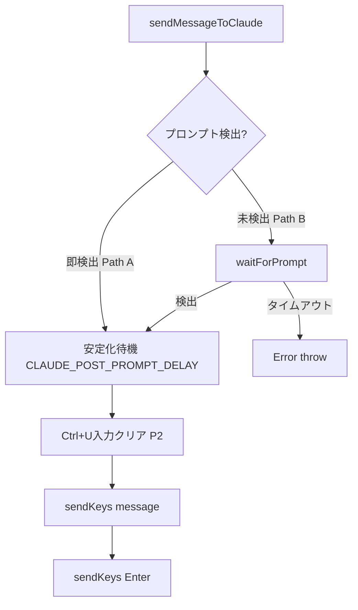

# Issue #187: セッション初回メッセージ送信信頼性改善 設計方針書

## 1. 概要

### 背景
新規セッション開始時に、最初のメッセージがClaude CLIに正しく送信されないケースが多発している。Issue #152で`startClaudeSession()`側の改善は行われたが、`sendMessageToClaude()`側に残存する問題が本Issueの対象。

### 変更対象
- `src/lib/claude-session.ts` - P0/P1/P2全ての修正
- `src/lib/cli-patterns.ts` - P2のみ（stripAnsi改善）
- `tests/unit/lib/claude-session.test.ts` - テスト更新・追加

### 設計原則
- **KISS**: 最小限の変更で最大の効果を達成
- **DRY**: 既存の定数（`CLAUDE_POST_PROMPT_DELAY`）を再利用
- **OCP**: 定数化によるタイムアウト値の設定可能性維持
- **SRP**: 各関数の責務を維持（安定化待機のロジックを適切な位置に配置）

---

## 2. アーキテクチャ設計

### 変更の構造



### 既存フロー vs 修正後フロー

**既存フロー（問題あり）**:
```
capturePane -> プロンプト検出判定 -> [waitForPrompt] -> 即sendKeys
```

**修正後フロー**:
```
capturePane -> プロンプト検出判定 -> [waitForPrompt] -> 安定化待機(500ms) -> [Ctrl+U] -> sendKeys
```

---

## 3. 詳細設計

### 3.1 P0: sendMessageToClaude() 安定化待機追加

#### 修正箇所
`src/lib/claude-session.ts` `sendMessageToClaude()` 関数

#### 設計方針
安定化待機 `CLAUDE_POST_PROMPT_DELAY` をif文の外側（waitForPrompt/即検出の両パス共通）に配置する。

#### 変更前（L360-394）

> **[S2-F-1]** 関数シグネチャはL360から開始。L374は関数本体中の`// Verify prompt state before sending`コメント行に対応する。
> **[S2-F-2]** 以下のコードスニペットでは可読性のためインラインコメント（L374-377, L379-380, L384等）を省略している。実装時は実際のソースコードを参照すること。

```typescript
export async function sendMessageToClaude(
  worktreeId: string,
  message: string
): Promise<void> {
  const sessionName = getSessionName(worktreeId);
  const exists = await hasSession(sessionName);
  if (!exists) {
    throw new Error(`Claude session ${sessionName} does not exist. Start the session first.`);
  }

  const output = await capturePane(sessionName, { startLine: -50 });
  if (!CLAUDE_PROMPT_PATTERN.test(stripAnsi(output))) {
    try {
      await waitForPrompt(sessionName, 10000);
    } catch {
      console.warn(`[sendMessageToClaude] Prompt not detected, sending anyway`);
    }
  }

  await sendKeys(sessionName, message, false);
  await sendKeys(sessionName, '', true);
  console.log(`Sent message to Claude session: ${sessionName}`);
}
```

#### 変更後
```typescript
export async function sendMessageToClaude(
  worktreeId: string,
  message: string
): Promise<void> {
  const sessionName = getSessionName(worktreeId);
  const exists = await hasSession(sessionName);
  if (!exists) {
    throw new Error(`Claude session ${sessionName} does not exist. Start the session first.`);
  }

  // Verify prompt state before sending (CONS-006, DRY-001)
  const output = await capturePane(sessionName, { startLine: -50 });
  if (!CLAUDE_PROMPT_PATTERN.test(stripAnsi(output))) {
    // Path B: Prompt not detected - wait for it (P1: throw on timeout)
    await waitForPrompt(sessionName, CLAUDE_SEND_PROMPT_WAIT_TIMEOUT);
  }

  // P0: Stability delay after prompt detection (both Path A and Path B)
  // Same delay as startClaudeSession() to ensure Claude CLI input handler is ready
  // NOTE: This 500ms delay also applies to 2nd+ messages. Currently acceptable since
  // Claude CLI response time (seconds to tens of seconds) dwarfs this overhead.
  // If future batch-send use cases arise, this could be optimized to first-message-only,
  // but that optimization is deferred per YAGNI principle. (ref: F-3)
  await new Promise((resolve) => setTimeout(resolve, CLAUDE_POST_PROMPT_DELAY));

  // Send message using sendKeys consistently (CONS-001)
  await sendKeys(sessionName, message, false);
  await sendKeys(sessionName, '', true);
  console.log(`Sent message to Claude session: ${sessionName}`);
}
```

#### 設計判断
- **安定化待機の位置**: if文の外側に配置し、Path A（即検出）とPath B（waitForPrompt経由）の両方をカバー
- **既存定数の再利用**: `CLAUDE_POST_PROMPT_DELAY`（500ms）を使用（DRY原則）
- **レイテンシトレードオフ**: 2回目以降のメッセージにも500ms遅延が発生するが、Claude CLIの応答時間（数秒~数十秒）に対して許容範囲。初回のみの条件分岐は状態管理の複雑性が上回るため不採用
- **[F-3] 将来のバッチ送信**: 現時点では最適化不要（YAGNI）。将来バッチ送信やテスト自動化で多数のメッセージを連続送信するユースケースが出た場合、累積遅延が問題になる可能性があるため、その時点で初回のみ条件分岐を検討する
- **[S3-F-8] auto-yes-managerへの影響なし**: `auto-yes-manager.ts`の`pollAutoYes()`はL312で`sendKeys`を直接呼び出しており、`sendMessageToClaude()`を経由しない。そのため、P0の安定化待機（500ms）は`auto-yes-manager`には適用されない。これは設計上の意図的な判断であり、auto-yesの自動応答には即時性が求められるため、`sendMessageToClaude()`のような安定化待機を挟む必要がない

#### [F-5] 責務の監視
P0/P1/P2の変更後、`sendMessageToClaude()`は7ステップの責務を持つ:
1. セッション存在確認
2. プロンプト状態検証
3. プロンプト待機
4. 安定化待機
5. 入力クリア（P2）
6. メッセージ送信
7. Enter送信

各ステップが1-2行であり全体で20行程度に収まるため、現時点での関数分割は不要。ただし、今後さらにステップが追加される場合（例: リトライ機構、メッセージ検証）は、「プロンプト準備」と「メッセージ送信」を分離するextract methodを検討すること。

### 3.2 P1-1: startClaudeSession() セパレータパターン除外

#### 修正箇所
`src/lib/claude-session.ts` L325

#### 変更前
```typescript
if (CLAUDE_PROMPT_PATTERN.test(cleanOutput) || CLAUDE_SEPARATOR_PATTERN.test(cleanOutput)) {
```

#### 変更後
```typescript
if (CLAUDE_PROMPT_PATTERN.test(cleanOutput)) {
```

#### 設計判断
- **DRY-002の経緯**: Issue #152で追加されたが、セパレータ早期検出がプロンプト未到達での復帰を引き起こすリスクが信頼性低下の原因
- **影響**: 初期化検出が1~3秒遅くなる可能性があるが、`CLAUDE_INIT_TIMEOUT`（15秒）の猶予で十分カバー可能
- **[F-7] インポート整理（必須）**: `CLAUDE_SEPARATOR_PATTERN`のインポートを`claude-session.ts`から**削除する**こと。P1-1でセパレータパターンの使用箇所が除去された後、このインポートが残留するとESLintのunused-importsルール違反となる。`CLAUDE_SEPARATOR_PATTERN`自体の正当性テストは`cli-patterns.ts`のテストファイル（別ファイル）で検証する構成とする

### 3.3 P1-2: タイムアウト時のエラースロー

#### 修正箇所
`src/lib/claude-session.ts` `sendMessageToClaude()` 内のtry-catch

#### 変更前
```typescript
try {
  await waitForPrompt(sessionName, 10000);
} catch {
  console.warn(`[sendMessageToClaude] Prompt not detected, sending anyway`);
}
```

#### 変更後
`waitForPrompt()`がタイムアウトでthrowしたエラーをそのまま伝播させる。P0の設計（上記3.1）でtry-catchを削除し、`waitForPrompt()`を直接awaitする。

#### 設計判断
- タイムアウト時にメッセージを強制送信するのは、消失するメッセージを送るより明示的なエラーの方がデバッグしやすい
- 呼び出し元（`ClaudeTool.sendMessage()` -> API route）でエラーをキャッチしてHTTP 500を返す

#### [S3-F-3] エラー伝播パス

P1-2適用後のエラー伝播チェーンを以下に示す:

```
waitForPrompt() throws Error('Prompt detection timeout (10000ms)')
  -> sendMessageToClaude() propagates (try-catch削除済み)
    -> ClaudeTool.sendMessage() propagates (try-catchなし、意図的にエラーを透過)
      -> send/route.ts L140-148 catches -> HTTP 500 レスポンス返却
```

**設計判断**: `ClaudeTool.sendMessage()`（`src/lib/cli-tools/claude.ts` L66）は`sendMessageToClaude()`を`try-catch`なしで直接`await`している。これはエラーをラップ・変換せず呼び出し元に透過させる意図的な設計判断である。エラーのラッピングはAPIルート層（`send/route.ts`）で一元的に行い、HTTP 500に変換する。中間層でのエラー変換を避けることで、デバッグ時にオリジナルのエラーメッセージとスタックトレースが保持される。

### 3.4 P1-3: タイムアウト定数統一

#### 新規定数
`src/lib/claude-session.ts` に以下の定数を追加:

> **[S2-F-10]** 配置場所: `CLAUDE_PROMPT_WAIT_TIMEOUT`（L83）の直後、`CLAUDE_PROMPT_POLL_INTERVAL`（L91）の直前に配置すること。プロンプト待機関連の定数をグループ化するための論理的な順序。

```typescript
/**
 * Prompt wait timeout before message send (milliseconds).
 *
 * Used exclusively by sendMessageToClaude() to limit how long we wait
 * for Claude to return to a prompt state before sending a user message.
 * This is separate from CLAUDE_PROMPT_WAIT_TIMEOUT (5000ms, the default
 * for waitForPrompt()) because sendMessageToClaude() may be called
 * shortly after session initialization, where Claude CLI needs additional
 * time to become ready.
 *
 * Relationship to other timeout constants:
 * - CLAUDE_PROMPT_WAIT_TIMEOUT (5000ms): Default for waitForPrompt()
 * - CLAUDE_SEND_PROMPT_WAIT_TIMEOUT (10000ms): sendMessageToClaude() specific
 * - CLAUDE_INIT_TIMEOUT (15000ms): Session initialization timeout
 *
 * @see Issue #187 - Constant unification for sendMessageToClaude timeout
 */
export const CLAUDE_SEND_PROMPT_WAIT_TIMEOUT = 10000;
```

#### 設計判断
- 既存の`CLAUDE_PROMPT_WAIT_TIMEOUT`（5000ms）は`waitForPrompt()`のデフォルト値として適切
- `sendMessageToClaude()`では初期化直後のケースを考慮して10秒が妥当
- ハードコード値を別の定数として明示化し、役割の違いを明確にする
- **[F-1] JSDocコメント**: 定数名に'SEND'を含めて使用コンテキストをエンコードしている。将来他の箇所でも「送信前のプロンプト待ち」が必要になった場合の曖昧さを避けるため、JSDocで「sendMessageToClaude専用」であること、および`CLAUDE_PROMPT_WAIT_TIMEOUT`との関係を明確に記述すること（上記コード例を参照）

### 3.5 P2-1: Ctrl+U入力クリア

#### 修正箇所
`src/lib/claude-session.ts` `sendMessageToClaude()` のsendKeys呼び出し前

#### 変更内容
```typescript
// P2: Clear any existing input in Claude CLI prompt
// Ctrl+U clears from cursor to beginning of line
await sendKeys(sessionName, 'C-u', false);
```

ただし、`tmux send-keys`でCtrl+Uを送る場合、通常の`sendKeys`ラッパーではエスケープされてしまうため、`execAsync`を直接使用するか、`tmux.ts`の`sendSpecialKey`に`C-u`を追加する。

#### 推奨実装: `sendSpecialKey`の拡張

**[S2-F-6]** SpecialKey型定義の所在: `src/lib/tmux.ts` L362

```typescript
// src/lib/tmux.ts L362
// 変更前: export type SpecialKey = 'Escape' | 'C-c' | 'C-d';
// 変更後:
export type SpecialKey = 'Escape' | 'C-c' | 'C-d' | 'C-u';
```

`sendSpecialKey`関数は既に存在し（L364以降）、`tmux send-keys -t "${sessionName}" ${key}`形式で送信するため、`C-u`を`SpecialKey`型に追加するだけで対応可能。

#### 適用箇所
- `sendMessageToClaude()`のみ（auto-yes-managerやrespond APIには不要）
- 理由: ユーザー入力メッセージのみサジェスト結合リスクがあるため

#### [F-8] P2-1テスト要件
P2-1を実装する場合、以下のテストを追加すること:
```typescript
it('should call sendSpecialKey with C-u before sendKeys (P2-1)', async () => {
  vi.mocked(capturePane).mockResolvedValue('> ');

  const promise = sendMessageToClaude('test-worktree', 'Hello');
  await vi.advanceTimersByTimeAsync(CLAUDE_POST_PROMPT_DELAY);
  await promise;

  // Verify C-u was sent before the message
  expect(sendSpecialKey).toHaveBeenCalledWith(sessionName, 'C-u');
  // sendSpecialKey should be called before sendKeys
  const specialKeyOrder = sendSpecialKey.mock.invocationCallOrder[0];
  const sendKeysOrder = sendKeys.mock.invocationCallOrder[0];
  expect(specialKeyOrder).toBeLessThan(sendKeysOrder);
});
```

### 3.6 P2-2: stripAnsi DEC Private Mode対応

#### 修正箇所
`src/lib/cli-patterns.ts` L167

#### 変更前
```typescript
const ANSI_PATTERN = /\x1b\[[0-9;]*[a-zA-Z]|\x1b\][^\x07]*\x07|\[[0-9;]*m/g;
```

#### 変更後
```typescript
const ANSI_PATTERN = /\x1b\[[\x30-\x3f]*[\x20-\x2f]*[\x40-\x7e]|\x1b\][^\x07]*\x07|\[[\x30-\x3f]*m/g;
```

#### 変更の説明
- `[\x30-\x3f]*` : パラメータバイト（`0-9:;<=>?`）を許容。これにより`\x1b[?25h`等のDEC Private Modeに対応
- `[\x20-\x2f]*` : 中間バイト（スペースから`/`まで）を許容。一部のエスケープシーケンスで使用
- `[\x40-\x7e]` : 最終バイト（`@`から`~`まで）。従来の`[a-zA-Z]`より広い範囲をカバー

#### 波及影響
7つのソースファイルに波及するが、変更は「より多くのエスケープシーケンスを除去する」方向のため、基本的に正の効果。回帰テストで確認。

> **[S3-F-4] response-poller.ts の高密度stripAnsi使用に関するリグレッションテスト方針**:
> `response-poller.ts`は`stripAnsi`を9箇所（L59, L233, L247, L262, L310, L349, L464, L532）で使用しており、P2-2の`ANSI_PATTERN`拡張による間接影響が最も高密度なファイルである。出力解析ロジックが複雑であるため、`stripAnsi`の挙動変更がレスポンスパースに予期しない影響を与える可能性がある。
>
> **P2-2実装時の必須手順**:
> 1. P2-2適用前に`response-poller`の既存テスト（`tests/unit/lib/response-poller.test.ts`）を全件パスすることを確認
> 2. P2-2適用後に同テストを再実行し、全件パスすることを確認
> 3. 万が一テストが失敗した場合、`response-poller.ts`の該当箇所を個別に調査し、DEC Private Modeシーケンスの除去が出力解析に悪影響を与えていないか確認する

#### [F-2] YAGNI考慮事項
P2-2は予防的な改善であり、実際にClaude CLIが出力するDEC Private Modeシーケンス（例: `\x1b[?25h` カーソル表示）がプロンプト検出を妨害した具体例が確認されていない。

**実装判断基準**:
- P2-2の実装を進める場合、実際にClaude CLIが出力するDEC Private Modeシーケンスがプロンプト検出を妨害した**具体例をテストケースとして追加**すること
- 具体例がない場合は、P2-2は延期を推奨する（YAGNIの観点）
- P0/P1のみで初回メッセージ送信の信頼性が十分に改善される場合、P2-2は別Issueとして切り出すことを検討

---

## 4. テスト設計

### 4.1 既存テストの修正（事前対応）

> **[F-4 MUST FIX] 実装順序の厳守**: 以下の修正1は、P0/P1の実装に**先立って**修正する必要がある。
> 既存テストL108では`waitForPrompt()`の`capturePane`呼び出しが`{ startLine: -10 }`を期待しているが、
> 実装では`{ startLine: -50 }`を使用しており不整合が存在する。この不整合を放置したままP0/P1を
> 実装するとテストが不安定になるため、**必ずSection 8の実装順序ステップ1で修正を完了させること**。

#### 修正1: waitForPrompt() capturePane引数（L108）
```typescript
// 変更前
expect(capturePane).toHaveBeenCalledWith(sessionName, { startLine: -10 });
// 変更後
expect(capturePane).toHaveBeenCalledWith(sessionName, { startLine: -50 });
```

#### [S3-F-7] L89-92 CLAUDE_SEPARATOR_PATTERNテストの扱い
P1-1でセパレータパターンの使用箇所が`claude-session.ts`から除去されるが、L89-92の独立テスト（`should use CLAUDE_SEPARATOR_PATTERN from cli-patterns`）は以下の方針とする:
- `CLAUDE_SEPARATOR_PATTERN`自体は`cli-patterns.ts`に残存するため、テストファイルでのインポートと独立テストは**維持してよい**
- ただし、テストの意味が「claude-session.tsでの使用を検証」から「パターン自体の正当性検証」に変わるため、テストのdescribe/itメッセージの修正を推奨（例: `should correctly match separator pattern`）

#### 修正2: セパレータ検出テスト（L232-246）
DRY-002テストを「セパレータのみではポーリング継続」のテストに変更:

> **[S2-F-8]** `startClaudeSession()`のL343-345にある外側のtry-catchが、内部エラーを
> `'Failed to start Claude session: Claude initialization timeout (15000ms)'`形式でラップして再throwする。
> そのため、`toThrow`のアサーションは**部分一致**を使用する必要がある（完全一致だとプレフィックスの不一致で失敗する）。

```typescript
it('should not treat separator-only output as initialization complete', async () => {
  // capturePane always returns separator only (no prompt)
  vi.mocked(capturePane).mockResolvedValue('────────────────────');

  const options = {
    worktreeId: 'test-worktree',
    worktreePath: '/path/to/worktree',
  };

  const promise = startClaudeSession(options);

  // Advance past CLAUDE_INIT_TIMEOUT
  await vi.advanceTimersByTimeAsync(CLAUDE_INIT_TIMEOUT + 1000);

  // Use partial match: actual error is wrapped as 'Failed to start Claude session: Claude initialization timeout (...)'
  await expect(promise).rejects.toThrow('Claude initialization timeout');
});
```

#### 修正3: タイムアウトテスト（L337-346）

> **[S2-F-3] 既存テストの二重不整合**:
> 現行テストL337-346には2つの問題が同時に存在する:
> 1. **タイムアウト値の不一致**: テストが`CLAUDE_PROMPT_WAIT_TIMEOUT + 100`（5100ms）で時間を進めるが、実装は`waitForPrompt(sessionName, 10000)`で10秒タイムアウトを使用しており、テストの時間進行では実際にはタイムアウトに到達しない
> 2. **try-catchによるエラー吸収**: 現行実装のL381-386のtry-catchが`waitForPrompt()`のタイムアウトエラーを吸収し、`console.warn`でログ出力した後`sendKeys`に進むため、`sendMessageToClaude()`自体はrejectしない
>
> P1-2（try-catch削除）とP1-3（CLAUDE_SEND_PROMPT_WAIT_TIMEOUT定数化）の**両方を適用**することで、これら2つの問題が同時に解決される。P1-2でエラーが伝播するようになり、P1-3でテストと実装のタイムアウト値が一致する。

```typescript
it('should throw error if prompt not detected within timeout', async () => {
  vi.mocked(capturePane).mockResolvedValue('Still processing...');

  const promise = sendMessageToClaude('test-worktree', 'Hello');

  // Advance past CLAUDE_SEND_PROMPT_WAIT_TIMEOUT
  await vi.advanceTimersByTimeAsync(CLAUDE_SEND_PROMPT_WAIT_TIMEOUT + 100);

  await expect(promise).rejects.toThrow(`Prompt detection timeout (${CLAUDE_SEND_PROMPT_WAIT_TIMEOUT}ms)`);
  // Verify sendKeys was NOT called (message not sent on timeout)
  expect(sendKeys).not.toHaveBeenCalled();
});
```

### 4.2 新規テスト

#### P0テスト: 安定化待機の検証

```typescript
describe('sendMessageToClaude() - P0: stability delay', () => {
  it('should wait CLAUDE_POST_PROMPT_DELAY after immediate prompt detection (Path A)', async () => {
    vi.mocked(capturePane).mockResolvedValue('> ');

    const promise = sendMessageToClaude('test-worktree', 'Hello');

    // sendKeys should NOT be called yet (waiting for stability delay)
    expect(sendKeys).not.toHaveBeenCalled();

    // Advance through stability delay
    await vi.advanceTimersByTimeAsync(CLAUDE_POST_PROMPT_DELAY);

    await promise;

    // Now sendKeys should have been called
    expect(sendKeys).toHaveBeenCalledTimes(2);
  });

  it('should wait CLAUDE_POST_PROMPT_DELAY after waitForPrompt returns (Path B)', async () => {
    // [S2-F-11] Mock setup: sendMessageToClaude's initial capturePane (L376) returns
    // non-prompt, triggering the waitForPrompt path. waitForPrompt's first internal
    // capturePane call (the 2nd overall) returns non-prompt, requiring a poll cycle.
    // The 3rd capturePane call (after one CLAUDE_PROMPT_POLL_INTERVAL) returns prompt.
    let callCount = 0;
    vi.mocked(capturePane).mockImplementation(async () => {
      callCount++;
      if (callCount <= 2) return 'Processing...';
      return '> ';
    });

    const promise = sendMessageToClaude('test-worktree', 'Hello');

    // Advance through waitForPrompt polling (one full poll cycle needed)
    await vi.advanceTimersByTimeAsync(CLAUDE_PROMPT_POLL_INTERVAL);

    // sendKeys should NOT be called yet (waiting for stability delay)
    expect(sendKeys).not.toHaveBeenCalled();

    // Advance through stability delay
    await vi.advanceTimersByTimeAsync(CLAUDE_POST_PROMPT_DELAY);

    await promise;

    expect(sendKeys).toHaveBeenCalledTimes(2);
  });
});
```

#### P1テスト: 定数エクスポート

```typescript
it('should export CLAUDE_SEND_PROMPT_WAIT_TIMEOUT as 10000ms', () => {
  expect(CLAUDE_SEND_PROMPT_WAIT_TIMEOUT).toBe(10000);
});
```

---

## 5. セキュリティ設計

### 本修正のセキュリティ影響
- **コマンドインジェクション**: 変更なし。`sendKeys`の既存エスケープ処理を継続使用
- **Ctrl+U送信（P2）**: `sendSpecialKey`関数を使用し、tmux専用のキー送信パスを経由。ユーザー入力は含まれない
- **stripAnsi変更（P2）**: 正規表現の変更のみ。ANSIエスケープシーケンスの除去範囲が広がるが、セキュリティ的にはプラス方向

### [S4-F-1] 既知の制限事項: getSessionName() のバリデーション欠如

`claude-session.ts`の`getSessionName()`（L169-171）は`worktreeId`を検証せずに`mcbd-claude-${worktreeId}`を返し、この値は`hasSession()`、`capturePane()`、`sendKeys()`等でtmuxコマンドのシェル引数として使用される。`BaseCLITool.getSessionName()`は`validateSessionName()`を呼んでいるが、`ClaudeTool.sendMessage()`は`sendMessageToClaude()`を経由し、そこで`claude-session.ts`独自の`getSessionName()`が使われるため、バリデーションが迂回される。

**既存の緩和策（実質的な攻撃リスクは低い）**:
- `generateWorktreeId()`による`[a-z0-9-]`サニタイズ（worktreeId生成時）
- APIルートで`getWorktreeById()`によるDB存在チェック
- `tmux.ts`の`sendKeys()`でシングルクォートエスケープ

**防御の深層（Defense in Depth）としての改善推奨**:
`claude-session.ts`の`getSessionName()`に`validateSessionName()`を追加するか、`BaseCLITool.getSessionName()`を共通利用するようリファクタリングすることが望ましい。本Issue #187のスコープ外であるため、別Issueとして切り出すことを推奨する。

**OWASP分類**: A03:2021-Injection

### [S4-F-7] 一貫性改善: stopClaudeSession() の execAsync 直接呼び出し

`stopClaudeSession()`のL448で`execAsync(`tmux send-keys -t "${sessionName}" C-d`)`が`sendSpecialKey()`を使わずに`execAsync`を直接呼び出している。`sessionName`はダブルクォートで囲まれているが、S4-F-1と同様に`claude-session.ts`の`getSessionName()`にバリデーションがないため、防御の深層が不足している。

**改善推奨**: L448を`await sendSpecialKey(sessionName, 'C-d');`に変更し、`sendSpecialKey`の`SpecialKey`型に`'C-d'`が既に含まれていることを活用する。これによりtmuxコマンドの構築が一元化され、セキュリティレビューの対象箇所が減少する。

**対応時期**: P2-1でSpecialKey型に`C-u`を追加するリファクタリングと同時に実施するか、別Issueとして切り出す。

**OWASP分類**: A03:2021-Injection

### セキュリティ考慮事項（nice-to-have）

以下の項目は、Stage 4セキュリティレビューで特定された追加考慮事項である。いずれも現時点での実質的な攻撃リスクは低いが、将来の保守性とセキュリティベストプラクティスの観点から記録する。

#### [S4-F-2] sendKeys() シングルクォートエスケープの防御的コメント
`tmux.ts`の`sendKeys()`はシングルクォートのみをエスケープし、コマンドをシングルクォートで囲んで構築している。シングルクォート内ではシェル変数展開やコマンド置換が無効化されるため現行実装は安全であるが、将来のリファクタリングでダブルクォートに変更された場合に脆弱性が発生するリスクがある。`sendKeys()`にシングルクォートを使用する理由（シェルインジェクション防止）を防御的コメントとして明記し、将来的には`execFile()`への移行を検討する。

#### [S4-F-3] sendSpecialKey() のランタイムホワイトリストチェック
P2-1で使用する`sendSpecialKey()`では、`key`パラメータが`SpecialKey`型に制限されているがランタイムバリデーションがない。TypeScriptの型システムは実行時に型チェックを行わないため、防御的プログラミングとして`const VALID_SPECIAL_KEYS = new Set(['Escape', 'C-c', 'C-d', 'C-u'])`によるランタイムチェックの追加を検討する。

#### [S4-F-4] エラーメッセージによる内部構造の露出
`claude-session.ts`の複数箇所でセッション名がエラーメッセージに含まれ、`send/route.ts`経由でHTTPレスポンスに伝播する。これによりセッション名の命名規則やtmuxの使用がクライアントに露出する。CommandMateはローカル開発ツールであるため実害は限定的だが、APIルート層でのエラーメッセージ抽象化（固定メッセージ返却+サーバーログのみ詳細記録）を将来的に検討する。

#### [S4-F-5] P0 安定化待機 500ms による累積的 DoS の可能性（理論的）
大量メッセージの短時間送信では500ms * Nの累積遅延が発生しうるが、Claude CLI自体の応答時間（数秒から数十秒）がボトルネックであり、APIルートの同期設計で直列化されるため、実質的なDoS要因にならない。現時点では対応不要。

#### [S4-F-6] P2-2 stripAnsi ANSI_PATTERN 拡張の ReDoS リスク（確認済み: 安全）
P2-2で提案されている`ANSI_PATTERN`拡張は、各代替パターンの量化子にネストされた量化子やオーバーラップする文字クラスがなく、バックトラッキングが発生しにくい構造である。ReDoSリスクは増加しない。

#### [S4-F-8] P1-2 エラー伝播後のタイミング情報露出
P1-2適用後、`waitForPrompt()`のタイムアウトエラーにタイムアウト値（10000ms）が含まれ、内部のタイミングパラメータがクライアントに露出する。S4-F-4と同様、APIルート層でのエラーメッセージ抽象化で対応可能。ローカル開発ツールの文脈では許容範囲。

### OWASP Top 10 リスク評価

| OWASP カテゴリ | リスク | 備考 |
|---|---|---|
| A01: Broken Access Control | 該当なし | アクセス制御への変更なし |
| A02: Cryptographic Failures | 該当なし | 暗号化処理への変更なし |
| A03: Injection | 低 | getSessionName()バリデーション欠如（S4-F-1）あるが上流サニタイズで実質安全 |
| A04: Insecure Design | 低 | エラーメッセージに内部情報含む（S4-F-4, S4-F-8）がローカルツールで許容 |
| A05: Security Misconfiguration | 該当なし | - |
| A06: Vulnerable Components | 該当なし | サードパーティ依存関係の変更なし |
| A07: Auth Failures | 該当なし | 認証メカニズムへの変更なし |
| A08: Data Integrity Failures | 該当なし | - |
| A09: Logging & Monitoring | 影響なし | 既存コンソールログによるモニタリング維持 |
| A10: SSRF | 該当なし | サーバーサイドリクエストへの変更なし |

---

## 6. パフォーマンス設計

### レイテンシ影響
| 操作 | 変更前 | 変更後 | 差分 |
|------|--------|--------|------|
| 初回メッセージ送信 | 0ms（安定化待機なし） | 500ms | +500ms |
| 2回目以降メッセージ送信 | 0ms | 500ms | +500ms |
| セッション初期化 | セパレータ検出で即完了 | プロンプト待ちで1-3秒追加 | +1-3秒 |

### 許容性の根拠
- Claude CLIの応答時間: 数秒~数十秒
- 500ms追加はUX上ほぼ知覚不能
- 初期化の1-3秒追加は15秒タイムアウト内で十分

---

## 7. 設計上の決定事項とトレードオフ

| 決定事項 | 理由 | トレードオフ |
|---------|------|-------------|
| 安定化待機をif文の外側に配置 | Path A/B両方をカバー、コードシンプル | 2回目以降にも500ms遅延 |
| 初回のみ条件分岐を不採用 | 状態管理の複雑性回避 | 不要な遅延が毎回発生 |
| セパレータパターン除外 | 初期化の信頼性向上 | 初期化検出が1-3秒遅延 |
| エラースロー方式 | デバッグ容易性、失敗の明示化 | 一時的なプロンプト遅延で送信失敗 |
| 専用定数 CLAUDE_SEND_PROMPT_WAIT_TIMEOUT | 用途別のタイムアウト管理 | 定数が1つ増加 |
| Ctrl+UをsendSpecialKey経由で送信 | 既存インフラ活用、型安全 | SpecialKey型の拡張が必要 |

### 代替案の検討

#### 代替案1: 初回メッセージのみ安定化待機
- メリット: 2回目以降の遅延なし
- デメリット: 「初回」の定義が曖昧（セッション起動後？最後のメッセージから一定時間後？）、状態管理の複雑性
- **不採用理由**: KISSに反する

#### 代替案2: waitForPrompt内に安定化待機を組み込む
- メリット: waitForPromptの呼び出し元すべてに適用
- デメリット: waitForPromptの責務が「検出」から「検出+安定化」に拡大（SRP違反）、auto-yes-managerなど不要な箇所にも影響
- **不採用理由**: SRPに反し、影響範囲が広すぎる

#### 代替案3: sendMessageToClaudeでのリトライ
- メリット: 失敗しても自動回復
- デメリット: 問題の根本解決ではない、リトライ回数/間隔の設計が複雑
- **不採用理由**: 根本原因の修正が優先

---

## 8. 実装順序

> **[F-4] 重要**: ステップ1の事前対応（特にL108のcapturePane引数修正）は、P0/P1の実装に**必ず先立って**完了させること。既存テストと実装の不整合（テストが`{ startLine: -10 }`を期待、実装は`{ startLine: -50 }`）を放置したままP0/P1を実装すると、テスト結果が不安定になり、新規実装の正当性が検証できなくなる。

1. **事前対応（必須・最優先）**: 既存テスト不整合の修正
   - L108: `waitForPrompt()` capturePane引数 `{ startLine: -10 }` -> `{ startLine: -50 }` に修正
   - L337-346: タイムアウトテストの修正
   - **このステップ完了後、既存テストが全てパスすることを確認してから次へ進む**
2. **P0実装**: `sendMessageToClaude()`への安定化待機追加
3. **P1-1実装**: `startClaudeSession()`からセパレータパターン除外
   - **[F-7] 同時に実施**: `claude-session.ts`から`CLAUDE_SEPARATOR_PATTERN`のインポートを削除すること（ESLint unused-imports対策）
4. **P1-2実装**: タイムアウト時のエラースロー（P0で同時に対応済み）
5. **P1-3実装**: `CLAUDE_SEND_PROMPT_WAIT_TIMEOUT`定数追加と使用
   - **[F-1]**: JSDocコメントにsendMessageToClaude専用であることとCLAUDE_PROMPT_WAIT_TIMEOUTとの関係を明記
6. **テスト更新**: 既存テスト修正 + 新規テスト追加
7. **P2-1実装**（任意）: Ctrl+U入力クリア + SpecialKey型拡張
   - **[F-8]**: 実装する場合、`sendSpecialKey('C-u')`がsendKeysの前に呼ばれることを検証するテストを必ず追加
8. **P2-2実装**（任意・条件付き）: stripAnsi DEC Private Mode対応
   - **[F-2]**: 実装する場合、Claude CLIが実際に出力するDEC Private Modeシーケンスがプロンプト検出を妨害した具体例をテストケースとして追加すること。具体例がない場合は延期を推奨

---

## 9. 影響範囲

### 直接修正ファイル

| ファイル | 修正内容 |
|---------|---------|
| `src/lib/claude-session.ts` | P0/P1: 安定化待機、セパレータ除外、エラースロー、定数、CLAUDE_SEPARATOR_PATTERNインポート削除 |
| `src/lib/cli-patterns.ts` | P2: ANSI_PATTERN拡張 |
| `src/lib/tmux.ts` | P2: SpecialKey型にC-u追加 |
| `tests/unit/lib/claude-session.test.ts` | テスト修正・追加 |

### 間接影響ファイル

#### P0/P1変更時
- `src/lib/cli-tools/claude.ts` - sendMessageToClaude呼び出し元（500ms遅延増加、P1-2後はエラー伝播）
- `src/app/api/worktrees/[id]/send/route.ts` - タイムアウトエラー時のHTTP 500
- **[S3-F-1]** `tests/integration/api-send-cli-tool.test.ts` - L17で`sendMessageToClaude`をモックしているが、P1-2のエラースロー変更後はタイムアウト時にErrorがthrowされるようになるため、モック設定がエラーケースをカバーしていない。`send/route.ts`のL140-148のtry-catchがこのエラーをHTTP 500に変換する動作を検証するインテグレーションテストの追加が必要

#### P2変更時（stripAnsi間接影響）
- `src/lib/status-detector.ts` - detectSessionStatus()内部でstripAnsi使用
- **[S3-F-2]** `src/app/api/worktrees/route.ts` - detectSessionStatus()経由でstripAnsiを間接使用
- **[S3-F-2]** `src/app/api/worktrees/[id]/route.ts` - detectSessionStatus()経由でstripAnsiを間接使用
- `src/lib/auto-yes-manager.ts` - stripAnsi使用
- `src/lib/response-poller.ts` - stripAnsiを9箇所で使用（高密度、[S3-F-4]参照）
- `src/lib/assistant-response-saver.ts` - stripAnsi使用
- `src/app/api/worktrees/[id]/prompt-response/route.ts` - stripAnsi使用
- `src/app/api/worktrees/[id]/current-output/route.ts` - stripAnsi使用
- **[S3-F-2]** `tests/unit/lib/cli-patterns.test.ts` - L165-174にstripAnsiのテストケースが存在。P2-2適用時にはこのテストファイルの更新・拡充が必要

#### [S3-F-5] waitForPrompt() 使用箇所（明示的列挙）
- `sendMessageToClaude()` L382 - 直接呼び出し（P0/P1の主要変更対象）
- `startClaudeSession()` - 直接呼び出しなし（独自のポーリングループで同等処理を実施）
- テストファイルを除き、上記2箇所のみ

#### [S3-F-6] 影響なし判定ファイル
- `src/lib/claude-poller.ts` - `claude-session.ts`から`captureClaudeOutput`と`isClaudeRunning`をインポートしているが、Issue #187の変更対象関数（`sendMessageToClaude`, `waitForPrompt`, `startClaudeSession`）は使用していないため、直接影響なし

> **[S2-F-12]** 実装時に間接影響ファイルの動作確認を推奨: 特にP1-2（try-catch削除）後はタイムアウトエラーが`sendMessageToClaude()`から伝播するようになるため、`claude.ts`のsendMessage()および`send/route.ts`のAPIルートでエラーが適切にキャッチされHTTP 500として返却されることを確認すること。

---

## 10. レビュー指摘事項サマリー

### Stage 1: 通常レビュー（設計原則）

| ID | 重要度 | 原則 | 指摘内容 | 対応状況 |
|---|---|---|---|---|
| F-1 | should_fix | DRY | CLAUDE_SEND_PROMPT_WAIT_TIMEOUTのJSDocにsendMessageToClaude専用であることとCLAUDE_PROMPT_WAIT_TIMEOUTとの関係を明記 | Section 3.4に反映 |
| F-2 | nice_to_have | YAGNI | P2-2 stripAnsi DEC Private Mode対応は具体的な不具合実例がなければ延期推奨 | Section 3.6, Section 8 ステップ8に反映 |
| F-3 | nice_to_have | KISS | 将来のバッチ送信ユースケースでの累積遅延についてコメント記載 | Section 3.1に反映 |
| F-4 | **must_fix** | DRY | 既存テストL108のcapturePane引数不整合（-10 vs -50）をP0/P1実装前に修正必須 | Section 4.1, Section 8 ステップ1に強調反映 |
| F-5 | should_fix | SOLID (SRP) | sendMessageToClaudeの7ステップ責務を監視し、追加時はextract methodを検討 | Section 3.1に反映 |
| F-6 | nice_to_have | KISS | P2-1 SpecialKey型拡張は適切（変更なし） | 確認済み |
| F-7 | should_fix | SOLID (OCP) | P1-1実施時にclaude-session.tsからCLAUDE_SEPARATOR_PATTERNインポートを削除（ESLint対策） | Section 3.2, Section 8 ステップ3, Section 9に反映 |
| F-8 | nice_to_have | DRY | P2-1実装時にsendSpecialKey('C-u')のテストケースを追加 | Section 3.5, Section 8 ステップ7に反映 |

### Stage 1 レビュー評価
- **ステータス**: conditionally_approved
- **スコア**: 4/5
- **リスク評価**: 技術的リスク: low / セキュリティリスク: low / 運用リスク: low

### Stage 2: 整合性レビュー

| ID | 重要度 | カテゴリ | 指摘内容 | 対応状況 |
|---|---|---|---|---|
| S2-F-1 | **must_fix** | line_number_mismatch | sendMessageToClaude()の行番号参照がL374-393だが実際はL360-394。関数シグネチャはL360開始 | Section 3.1に反映（行番号修正+注記追加） |
| S2-F-2 | should_fix | code_snippet_mismatch | 変更前コードスニペットにインラインコメント（L374-377, L379-380, L384）が省略されている | Section 3.1に注記追加 |
| S2-F-3 | **must_fix** | code_snippet_mismatch | L337-346テストの二重不整合（タイムアウト値不一致+try-catchエラー吸収）をP1-2+P1-3が同時解決することを明記 | Section 4.1 修正3に詳細説明追加 |
| S2-F-4 | should_fix | line_number_mismatch | Section 3.2のL325参照は正確（変更不要） | 確認済み（変更不要） |
| S2-F-5 | nice_to_have | code_snippet_mismatch | Section 3.6のL167 ANSI_PATTERN参照は正確（変更不要） | 確認済み（変更不要） |
| S2-F-6 | should_fix | code_snippet_mismatch | SpecialKey型定義の行番号（src/lib/tmux.ts L362）を明記 | Section 3.5に反映 |
| S2-F-7 | must_fix | code_snippet_mismatch | L108テスト不整合（-10 vs -50）は正確に記載済み（変更不要） | 確認済み（変更不要） |
| S2-F-8 | should_fix | other | 修正2のセパレータテストで外側try-catchによるエラーラッピングを考慮し、toThrowを部分一致に変更 | Section 4.1 修正2に反映 |
| S2-F-9 | should_fix | other | 修正3のタイマー進行はP1-2/P1-3適用後に整合（変更不要） | 確認済み（変更不要） |
| S2-F-10 | nice_to_have | other | CLAUDE_SEND_PROMPT_WAIT_TIMEOUT定数の配置場所（L83の直後）を明記 | Section 3.4に反映 |
| S2-F-11 | should_fix | other | Path Bテストのモック設定を修正（3回目のcapturePaneでプロンプト返却に変更） | Section 4.2に反映 |
| S2-F-12 | nice_to_have | other | 間接影響ファイルの動作確認（エラー伝播のHTTP 500化）を推奨 | Section 9に反映 |

### Stage 2 レビュー評価
- **ステータス**: conditionally_approved
- **スコア**: 4/5
- **概要**: 設計書は概ねコードベースと整合。must_fix 3件（行番号修正、テスト二重不整合の文書化、toThrow部分一致化）を反映済み

### Stage 3: 影響分析レビュー

| ID | 重要度 | カテゴリ | 指摘内容 | 対応状況 |
|---|---|---|---|---|
| S3-F-1 | **must_fix** | missing_impact | `tests/integration/api-send-cli-tool.test.ts`がSection 9の間接影響ファイルに欠落。P1-2のエラースロー変更後、モック設定がエラーケースをカバーしていない | Section 9, Section 11に反映 |
| S3-F-2 | should_fix | missing_impact | P2間接影響リストに3ファイル欠落: `worktrees/route.ts`、`worktrees/[id]/route.ts`（detectSessionStatus経由）、`cli-patterns.test.ts`（stripAnsiテスト） | Section 9に反映 |
| S3-F-3 | should_fix | missing_impact | エラー伝播パスの説明が不完全。waitForPrompt -> sendMessageToClaude -> ClaudeTool.sendMessage -> send/route.tsのチェーンを明示すべき | Section 3.3に反映 |
| S3-F-4 | should_fix | incorrect_impact | response-poller.tsのstripAnsi 9箇所の高密度使用に対するリグレッションテスト方針が未記載 | Section 3.6に反映 |
| S3-F-5 | nice_to_have | missing_impact | waitForPrompt()の使用箇所を明示的に列挙（sendMessageToClaude L382のみ、startClaudeSessionは独自ループ） | Section 9に反映 |
| S3-F-6 | nice_to_have | missing_impact | claude-poller.tsが変更対象関数を使用していないことを「影響なし判定」として明示 | Section 9に反映 |
| S3-F-7 | nice_to_have | test_coverage | L89-92のCLAUDE_SEPARATOR_PATTERNテストの扱い（インポート維持、itメッセージ修正推奨） | Section 4.1に反映 |
| S3-F-8 | should_fix | missing_impact | auto-yes-managerがsendKeysを直接使用しsendMessageToClaudeを経由しないため、P0の安定化待機の影響を受けないことを明示 | Section 3.1に反映 |

### Stage 3 レビュー評価
- **ステータス**: conditionally_approved
- **スコア**: 4/5
- **リスク評価**: 技術的リスク: low / セキュリティリスク: low / 運用リスク: low
- **概要**: 影響範囲の分析は概ね正確。must_fix 1件（インテグレーションテストの影響欠落）、should_fix 4件（間接影響ファイル不足、エラー伝播パスの明確化、リグレッションテスト方針、auto-yes-manager影響なし判定）を反映済み

### Stage 4: セキュリティレビュー

| ID | 重要度 | カテゴリ | 指摘内容 | 対応状況 |
|---|---|---|---|---|
| S4-F-1 | should_fix | command_injection | `claude-session.ts`の`getSessionName()`にセッション名バリデーションが欠如。`generateWorktreeId()`による上流サニタイズで実質安全だが、Defense in Depthとして改善推奨 | Section 5に既知の制限事項として文書化。別Issue切り出し推奨 |
| S4-F-2 | nice_to_have | command_injection | `sendKeys()`のシングルクォートエスケープのみ。将来のリファクタリングでダブルクォート変更時のリスク。防御的コメント追記推奨 | Section 5のセキュリティ考慮事項に記載 |
| S4-F-3 | nice_to_have | command_injection | P2-1 `sendSpecialKey()`にランタイムホワイトリストチェック追加の検討 | Section 5のセキュリティ考慮事項に記載 |
| S4-F-4 | nice_to_have | information_leakage | エラーメッセージにセッション名含み内部構造露出。ローカルツールで許容範囲 | Section 5のセキュリティ考慮事項に記載 |
| S4-F-5 | nice_to_have | dos | P0 500ms安定化待機の累積DoS（理論的）。Claude CLI応答時間と直列処理で実質問題なし | Section 5のセキュリティ考慮事項に記載 |
| S4-F-6 | nice_to_have | other | P2-2 `ANSI_PATTERN`拡張のReDoSリスク評価: 安全（バックトラッキング脆弱性なし） | Section 5のセキュリティ考慮事項に記載（確認済み: 安全） |
| S4-F-7 | should_fix | command_injection | `stopClaudeSession()` L448のexecAsync直接呼び出し。`sendSpecialKey()`経由に統一推奨 | Section 5に一貫性改善として文書化。P2-1と同時対応または別Issue |
| S4-F-8 | nice_to_have | information_leakage | P1-2エラー伝播後のタイムアウト値露出。S4-F-4と同じ対応方針 | Section 5のセキュリティ考慮事項に記載 |

### Stage 4 レビュー評価
- **ステータス**: conditionally_approved
- **スコア**: 4/5
- **リスク評価**: 技術的リスク: low / セキュリティリスク: medium / 運用リスク: low
- **概要**: Issue #187の設計方針書はセキュリティ観点から概ね適切。P0/P1/P2のいずれも新たなセキュリティ脆弱性を導入しない。must_fix指摘なし。should_fix 2件（getSessionName()バリデーション欠如の文書化、stopClaudeSession() execAsync直接呼び出しの一貫性改善文書化）、nice_to_have 6件を設計書に反映済み

---

## 11. 実装チェックリスト

### 事前対応（必須）
- [ ] **[F-4]** L108: `waitForPrompt()` capturePane引数を `{ startLine: -50 }` に修正
- [ ] L337-346: タイムアウトテストを `CLAUDE_SEND_PROMPT_WAIT_TIMEOUT` 使用に修正
- [ ] 事前対応後、既存テストが全パスすることを確認

### P0: 安定化待機
- [ ] `sendMessageToClaude()`にCLAUDE_POST_PROMPT_DELAY安定化待機を追加（if文の外側）
- [ ] **[F-3]** コメントに将来のバッチ送信最適化の余地を記載

### P1-1: セパレータパターン除外
- [ ] `startClaudeSession()`のif条件からCLAUDE_SEPARATOR_PATTERN.testを削除
- [ ] **[F-7]** `claude-session.ts`からCLAUDE_SEPARATOR_PATTERNのインポートを削除

### P1-2: エラースロー
- [ ] `sendMessageToClaude()`のtry-catchを削除し、waitForPromptのエラーを伝播

### P1-3: タイムアウト定数
- [ ] CLAUDE_SEND_PROMPT_WAIT_TIMEOUT定数を追加（10000ms）
- [ ] **[F-1]** JSDocにsendMessageToClaude専用であることとCLAUDE_PROMPT_WAIT_TIMEOUTとの関係を明記
- [ ] **[S2-F-10]** CLAUDE_PROMPT_WAIT_TIMEOUT（L83）の直後に配置

### テスト
- [ ] P0テスト: Path A（即検出）の安定化待機検証
- [ ] P0テスト: Path B（waitForPrompt経由）の安定化待機検証（**[S2-F-11]** モック設定: 3回目のcapturePaneでプロンプト返却）
- [ ] P1テスト: CLAUDE_SEND_PROMPT_WAIT_TIMEOUT定数エクスポート検証
- [ ] L232-246: セパレータのみではポーリング継続するテストに変更（**[S2-F-8]** toThrowは部分一致を使用）
- [ ] **[S2-F-3]** L337-346: P1-2/P1-3の両方適用後にテストが正しく動作することを確認（二重不整合の同時解決）

### P2-1: Ctrl+U入力クリア（任意）
- [ ] **[S2-F-6]** SpecialKey型にC-uを追加（`src/lib/tmux.ts` L362）
- [ ] sendMessageToClaude()でsendSpecialKey('C-u')を呼び出し
- [ ] **[F-8]** sendSpecialKeyがsendKeysの前に呼ばれることを検証するテストを追加

### P2-2: stripAnsi DEC Private Mode対応（任意・条件付き）
- [ ] **[F-2]** Claude CLIのDEC Private Mode出力がプロンプト検出を妨害する具体例を確認
- [ ] 具体例がある場合のみANSI_PATTERNを拡張
- [ ] 具体例がない場合は延期（別Issue化）

### [F-5] 責務監視
- [ ] 実装完了後、sendMessageToClaude()の総ステップ数を確認（7以下であること）
- [ ] 7を超える場合、「プロンプト準備」と「メッセージ送信」のextract methodを検討

### [S2-F-12] 間接影響ファイルの動作確認
- [ ] `src/lib/cli-tools/claude.ts`のsendMessage()がタイムアウトエラーを適切にハンドリングすることを確認
- [ ] `src/app/api/worktrees/[id]/send/route.ts`がエラー時にHTTP 500を返却することを確認
- [ ] **[S3-F-1]** `tests/integration/api-send-cli-tool.test.ts`にエラーケースのテストを追加（sendMessageToClaudeがタイムアウトでErrorをthrowした場合にHTTP 500が返却されることを検証）

### [S3-F-7] テストメッセージ修正（推奨）
- [ ] L89-92のCLAUDE_SEPARATOR_PATTERNテストのitメッセージを更新（例: `should correctly match separator pattern`）

### [S3-F-4] P2-2リグレッションテスト（P2-2実装時のみ）
- [ ] P2-2適用前に`response-poller`の既存テストを全件パスすることを確認
- [ ] P2-2適用後に`response-poller`の既存テストを再実行し全件パスすることを確認
- [ ] P2-2適用後に`tests/unit/lib/cli-patterns.test.ts`のstripAnsiテストを更新・拡充

### [S3-F-2] P2変更時の追加確認
- [ ] `src/app/api/worktrees/route.ts`のdetectSessionStatus経由のstripAnsi動作を確認
- [ ] `src/app/api/worktrees/[id]/route.ts`のdetectSessionStatus経由のstripAnsi動作を確認

### [S4-F-1] セキュリティ: getSessionName() バリデーション（別Issue推奨）
- [ ] `claude-session.ts`の`getSessionName()`に`validateSessionName()`追加、または`BaseCLITool.getSessionName()`の共通利用をリファクタリングする別Issueを作成
- [ ] 本Issue #187のスコープでは対応不要（設計書に既知の制限事項として記載済み）

### [S4-F-7] セキュリティ: stopClaudeSession() sendSpecialKey統一（P2-1同時対応または別Issue）
- [ ] P2-1実装時: `stopClaudeSession()` L448の`execAsync(`tmux send-keys -t "${sessionName}" C-d`)`を`await sendSpecialKey(sessionName, 'C-d');`に変更
- [ ] P2-1を実装しない場合: 別Issueとして切り出し

---

## 12. レビュー履歴

| 日付 | ステージ | レビュー種別 | 結果 | スコア |
|------|---------|------------|------|-------|
| 2026-02-08 | Stage 1 | 通常レビュー（設計原則） | conditionally_approved | 4/5 |
| 2026-02-08 | Stage 2 | 整合性レビュー | conditionally_approved | 4/5 |
| 2026-02-08 | Stage 3 | 影響分析レビュー | conditionally_approved | 4/5 |
| 2026-02-08 | Stage 4 | セキュリティレビュー | conditionally_approved | 4/5 |

---

*Generated by design-policy command for Issue #187*
*Updated by apply-review-agent: Stage 1 review findings applied (2026-02-08)*
*Updated by apply-review-agent: Stage 2 consistency review findings applied (2026-02-08)*
*Updated by apply-review-agent: Stage 3 impact analysis review findings applied (2026-02-08)*
*Updated by apply-review-agent: Stage 4 security review findings applied (2026-02-08)*
