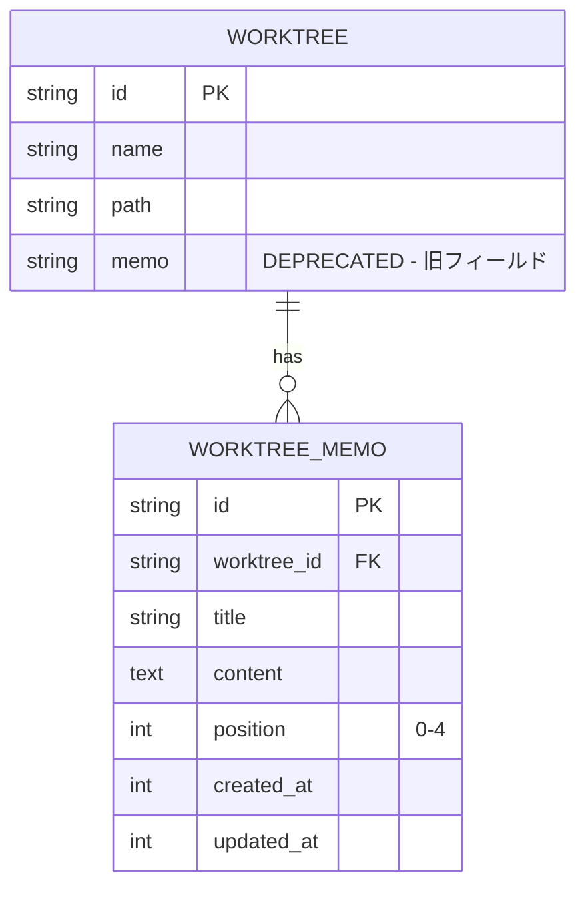

# Issue #19 メモ機能改善 設計方針書

**作成日**: 2026-01-10
**更新日**: 2026-01-10
**対象Issue**: [#19 メモ機能改善](https://github.com/Kewton/MyCodeBranchDesk/issues/19)
**ステータス**: Approved（レビュー承認済み）

---

## 1. 要件概要

### 1.1 Issue概要
現在のメモ機能を改善し、以下の2点を実現する:

1. **タブからのアクセス性向上**: 現在はInfoモーダル内でのみ編集可能だが、タブから直接選択・編集可能にする
2. **複数メモ対応**: 現在は1つのメモのみだが、最大5つまでメモできるように拡張する

### 1.2 ユーザー価値
- Claude Codeへの指示直後に、作業内容や備忘録を素早く記録したい
- 現在の状況やよく使うコマンドを記録しておきたい

---

## 2. アーキテクチャ設計

### 2.1 現状分析

#### 現在のメモ機能の実装
```
┌─────────────────────────────────────────────────┐
│ WorktreeDetailRefactored                        │
│  ├── DesktopHeader (Info ボタン)                │
│  │      └── InfoModal                           │
│  │           └── Memo編集 (単一メモ)            │
│  └── MobileTabBar                               │
│       └── Info タブ                             │
│            └── MobileInfoContent                │
│                 └── Memo編集 (単一メモ)         │
└─────────────────────────────────────────────────┘
```

#### 現在のデータモデル
```typescript
// src/types/models.ts - Worktree
interface Worktree {
  memo?: string;  // 単一メモ (テキスト)
  // ...他のフィールド
}
```

#### 現在のDB構造
```sql
-- worktreesテーブル
memo TEXT  -- 単一カラム
```

### 2.2 改善後のアーキテクチャ

```mermaid
graph TD
    subgraph UI Layer
        LPT[LeftPaneTabSwitcher] --> MemoTab[Memo Tab]
        MTB[MobileTabBar] --> MemoTabMobile[Memo Tab]
        MemoTab --> MemoPane[MemoPane Component]
        MemoTabMobile --> MemoPane
    end

    subgraph Data Layer
        MemoPane --> API[/api/worktrees/:id/memos]
        API --> DB[(SQLite)]
    end

    subgraph DB Tables
        DB --> worktrees[worktrees table]
        DB --> worktree_memos[worktree_memos table NEW]
    end
```

---

## 3. 技術選定

| カテゴリ | 選定技術 | 選定理由 |
|---------|---------|---------|
| DB設計 | 新規テーブル `worktree_memos` | 1:N関係の正規化、拡張性確保 |
| UI | 新規タブ + 既存コンポーネント拡張 | 既存パターンとの一貫性 |
| 状態管理 | ローカルstate + API | シンプルな実装、既存パターン踏襲 |
| バリデーション | フロントエンド + API層 | 両方でメモ数制限をチェック |

---

## 4. 設計パターン

### 4.1 データモデル設計

#### 新規テーブル: `worktree_memos`
```sql
CREATE TABLE worktree_memos (
  id TEXT PRIMARY KEY,
  worktree_id TEXT NOT NULL,
  title TEXT NOT NULL DEFAULT 'Memo',
  content TEXT NOT NULL DEFAULT '',
  position INTEGER NOT NULL DEFAULT 0,  -- 0-4 (最大5つ)
  created_at INTEGER NOT NULL,
  updated_at INTEGER NOT NULL,

  FOREIGN KEY (worktree_id) REFERENCES worktrees(id) ON DELETE CASCADE,
  UNIQUE(worktree_id, position)
);

CREATE INDEX idx_worktree_memos_worktree
  ON worktree_memos(worktree_id, position);
```

#### ER図


#### TypeScript型定義
```typescript
// src/types/models.ts

/**
 * Individual memo item
 */
export interface WorktreeMemo {
  id: string;
  worktreeId: string;
  title: string;
  content: string;
  position: number;  // 0-4
  createdAt: Date;
  updatedAt: Date;
}

/**
 * Worktree with memos (extended)
 */
export interface Worktree {
  // 既存フィールド
  id: string;
  name: string;
  // ...

  // 新規フィールド
  memos?: WorktreeMemo[];  // 最大5つ
}
```

### 4.2 API設計

#### RESTful API エンドポイント
```
GET    /api/worktrees/:id/memos          - メモ一覧取得
POST   /api/worktrees/:id/memos          - メモ新規作成
PUT    /api/worktrees/:id/memos/:memoId  - メモ更新
DELETE /api/worktrees/:id/memos/:memoId  - メモ削除
PATCH  /api/worktrees/:id/memos/reorder  - メモ並び替え
```

#### リクエスト/レスポンス形式
```typescript
// GET /api/worktrees/:id/memos
interface GetMemosResponse {
  memos: WorktreeMemo[];
}

// POST /api/worktrees/:id/memos
interface CreateMemoRequest {
  title?: string;    // デフォルト: "Memo"
  content?: string;  // デフォルト: ""
  position?: number; // 省略時: 次の空きposition
}

interface CreateMemoResponse {
  memo: WorktreeMemo;
}

// PUT /api/worktrees/:id/memos/:memoId
interface UpdateMemoRequest {
  title?: string;
  content?: string;
}

// PATCH /api/worktrees/:id/memos/reorder
interface ReorderMemosRequest {
  memoIds: string[];  // 新しい順序でのID配列
}
```

### 4.3 コンポーネント設計

#### 新規コンポーネント階層
```
src/components/worktree/
├── MemoPane.tsx          # メモタブのメインコンテナ（リスト表示含む）
├── MemoCard.tsx          # 個別メモカード (編集可能)
└── MemoAddButton.tsx     # 新規メモ追加ボタン
```

> **Note**: レビュー指摘により `MemoCardList.tsx` は不要と判断。
> MemoPane内で直接 `memos.map(memo => <MemoCard />)` でレンダリングする。

#### MemoPane Component
```typescript
// src/components/worktree/MemoPane.tsx

interface MemoPaneProps {
  worktreeId: string;
  className?: string;
}

/**
 * MemoPane - メモタブのメインコンポーネント
 *
 * Features:
 * - 最大5つのメモを表示・編集
 * - インライン編集対応
 * - 新規メモ追加 (5つ未満の場合)
 * - メモ削除
 */
export function MemoPane({ worktreeId, className }: MemoPaneProps) {
  // ...
}
```

#### UI設計イメージ (Desktop)
```
┌─────────────────────────────────────────────────────┐
│ [History] [Files] [Memo]  ← タブ追加                │
├─────────────────────────────────────────────────────┤
│ ┌───────────────────────────────────────────────┐   │
│ │ Memo 1                              [x]       │   │
│ │ ┌─────────────────────────────────────────┐   │   │
│ │ │ 現在の作業状況:                         │   │   │
│ │ │ - Issue #19 実装中                      │   │   │
│ │ │ - TDDでテストから作成                   │   │   │
│ │ └─────────────────────────────────────────┘   │   │
│ └───────────────────────────────────────────────┘   │
│ ┌───────────────────────────────────────────────┐   │
│ │ Memo 2                              [x]       │   │
│ │ ┌─────────────────────────────────────────┐   │   │
│ │ │ よく使うコマンド:                       │   │   │
│ │ │ npm run test:unit                       │   │   │
│ │ │ npm run build                           │   │   │
│ │ └─────────────────────────────────────────┘   │   │
│ └───────────────────────────────────────────────┘   │
│                                                     │
│              [+ Add Memo] (残り3つ)                 │
│                                                     │
└─────────────────────────────────────────────────────┘
```

#### UI設計イメージ (Mobile)
```
┌─────────────────────────────────────────┐
│ ← MyCodeBranchDesk              ⋮      │
├─────────────────────────────────────────┤
│ ┌─────────────────────────────────────┐ │
│ │ Memo 1                         [x]  │ │
│ │ 現在の作業状況: Issue #19 ...       │ │
│ └─────────────────────────────────────┘ │
│ ┌─────────────────────────────────────┐ │
│ │ Memo 2                         [x]  │ │
│ │ よく使うコマンド: npm run...        │ │
│ └─────────────────────────────────────┘ │
│                                         │
│          [+ Add Memo]                   │
│                                         │
├─────────────────────────────────────────┤
│ [Terminal][History][Files][Memo][Info]  │
│                      ^^^^^ 新規タブ追加  │
└─────────────────────────────────────────┘
```

> **Note**: Logsタブは事前に削除済み（レビュー指摘対応）。
> 現在のタブ構成: Terminal, History, Files, Info（4タブ）
> Memo追加後: Terminal, History, Files, Memo, Info（5タブ）

---

## 5. データマイグレーション

### 5.1 マイグレーション計画 (Version 10)

```typescript
// src/lib/db-migrations.ts

{
  version: 10,
  name: 'add-worktree-memos-table',
  up: (db) => {
    // 1. 新規テーブル作成
    db.exec(`
      CREATE TABLE worktree_memos (
        id TEXT PRIMARY KEY,
        worktree_id TEXT NOT NULL,
        title TEXT NOT NULL DEFAULT 'Memo',
        content TEXT NOT NULL DEFAULT '',
        position INTEGER NOT NULL DEFAULT 0,
        created_at INTEGER NOT NULL,
        updated_at INTEGER NOT NULL,

        FOREIGN KEY (worktree_id) REFERENCES worktrees(id) ON DELETE CASCADE,
        UNIQUE(worktree_id, position)
      );
    `);

    // 2. インデックス作成
    db.exec(`
      CREATE INDEX idx_worktree_memos_worktree
        ON worktree_memos(worktree_id, position);
    `);

    // 3. 既存memoデータをマイグレーション
    const worktrees = db.prepare(`
      SELECT id, memo FROM worktrees WHERE memo IS NOT NULL AND memo != ''
    `).all();

    const insertStmt = db.prepare(`
      INSERT INTO worktree_memos (id, worktree_id, title, content, position, created_at, updated_at)
      VALUES (?, ?, 'Memo', ?, 0, ?, ?)
    `);

    const now = Date.now();
    for (const wt of worktrees) {
      insertStmt.run(randomUUID(), wt.id, wt.memo, now, now);
    }
  },
  down: (db) => {
    db.exec('DROP TABLE IF EXISTS worktree_memos');
  }
}
```

### 5.2 後方互換性

- 既存の `worktrees.memo` カラムは残す (DEPRECATED)
- 新規APIは `worktree_memos` テーブルを使用
- 旧API (`updateMemo`) は引き続き動作するが、内部で新テーブルに書き込む

---

## 6. セキュリティ設計

### 6.1 入力バリデーション

| フィールド | バリデーション |
|-----------|---------------|
| title | 最大100文字、XSSエスケープ |
| content | 最大10000文字、XSSエスケープ |
| position | 0-4の整数のみ |
| memoId | UUID形式チェック |

### 6.2 APIセキュリティ

- worktree_idの存在確認
- メモ数制限（最大5つ）の強制
- SQLインジェクション対策（プリペアドステートメント使用）

---

## 7. パフォーマンス設計

### 7.1 データベース最適化

- `worktree_id, position` の複合インデックス
- メモは最大5つなので、JOINクエリでも軽量

### 7.2 フロントエンド最適化

- メモデータはworktree取得時に一括fetch（N+1回避）
- 編集時のdebounce（300ms）
- オートセーブ機能（詳細は下記）

### 7.3 オートセーブ設計（レビュー指摘対応）

#### トリガー条件
1. **入力停止後300ms**: debounced save でAPI呼び出し
2. **onBlurイベント**: フォーカスが外れた時点で即座に保存

#### 実装パターン
```typescript
// useAutoSave hook
const useAutoSave = (memoId: string, content: string) => {
  const [isSaving, setIsSaving] = useState(false);

  // 300ms debounce
  const debouncedSave = useMemo(
    () => debounce(async (value: string) => {
      setIsSaving(true);
      await memoApi.update(memoId, { content: value });
      setIsSaving(false);
    }, 300),
    [memoId]
  );

  // onBlur時の即時保存
  const saveNow = async () => {
    debouncedSave.cancel();
    await memoApi.update(memoId, { content });
  };

  return { debouncedSave, saveNow, isSaving };
};
```

#### エラーハンドリング
- ネットワークエラー時: 3回までリトライ（exponential backoff）
- 保存失敗時: ローカルに一時保存し、次回アクセス時に再試行
- UI表示: 保存中インジケーター、エラー時はトースト通知

### 7.4 reorder API 実装詳細（レビュー指摘対応）

#### UNIQUE制約下での並び替え
position カラムに UNIQUE 制約があるため、並び替え時は一時的に負値を使用:

```typescript
// PATCH /api/worktrees/:id/memos/reorder 実装
export async function reorderMemos(worktreeId: string, memoIds: string[]) {
  const db = getDatabase();

  db.transaction(() => {
    // Step 1: 全てのpositionを負値に変更（一時的に制約を回避）
    const resetStmt = db.prepare(`
      UPDATE worktree_memos
      SET position = -1 - position
      WHERE worktree_id = ?
    `);
    resetStmt.run(worktreeId);

    // Step 2: 新しい順序でpositionを割り当て
    const updateStmt = db.prepare(`
      UPDATE worktree_memos
      SET position = ?, updated_at = ?
      WHERE id = ?
    `);
    const now = Date.now();
    memoIds.forEach((memoId, index) => {
      updateStmt.run(index, now, memoId);
    });
  })();
}
```

---

## 8. 設計上の決定事項とトレードオフ

### 8.1 決定事項

| 決定 | 理由 | トレードオフ |
|------|------|-------------|
| 別テーブル方式 | 正規化、将来の拡張性 | JOIN必要、若干の複雑性増加 |
| タブ追加方式 | Issueの要件に合致、一貫したUI | タブ数増加 |
| position カラム | 並び替え対応、固定スロット方式 | 動的追加より若干制限あり |
| 最大5メモ制限 | Issueの要件、UIの見やすさ | 柔軟性の制限 |

### 8.2 代替案との比較

#### 代替案1: JSON配列でmemoカラムに格納
- **メリット**: スキーマ変更不要
- **デメリット**: 部分更新困難、バリデーション難しい
- **却下理由**: データの整合性を保つため正規化を優先

#### 代替案2: モーダル内でタブ切り替え
- **メリット**: UI変更が最小限
- **デメリット**: Issueの「タブから選択可能」要件に合致しない
- **却下理由**: ユーザー要件を満たさない

#### 代替案3: メモ数を無制限に
- **メリット**: 柔軟性向上
- **デメリット**: UIが煩雑になる可能性、パフォーマンス懸念
- **却下理由**: Issueで「最大5つ」と明記されている

---

## 9. 影響範囲

### 9.1 変更が必要なファイル

#### 新規作成
- `src/lib/db-migrations.ts` (Version 10追加)
- `src/app/api/worktrees/[id]/memos/route.ts`
- `src/app/api/worktrees/[id]/memos/[memoId]/route.ts`
- `src/components/worktree/MemoPane.tsx`
- `src/components/worktree/MemoCard.tsx`
- `src/components/worktree/MemoAddButton.tsx`
- `src/hooks/useAutoSave.ts` （オートセーブ用カスタムフック）

#### 変更
- `src/types/models.ts` (WorktreeMemo型追加)
- `src/types/ui-state.ts` (LeftPaneTab, MobileActivePane拡張)
- `src/components/worktree/LeftPaneTabSwitcher.tsx` (Memoタブ追加)
- `src/components/mobile/MobileTabBar.tsx` (Memoタブ追加) ※Logsタブは削除済み
- `src/components/worktree/WorktreeDetailRefactored.tsx` (Memoペイン統合)
- `src/lib/api-client.ts` (メモAPI追加)

#### 事前対応済み（2026-01-10）
- `src/components/mobile/MobileTabBar.tsx` - Logsタブ削除
- `src/types/ui-state.ts` - MobileActivePaneから'logs'削除
- `src/components/worktree/WorktreeDetailRefactored.tsx` - logsケース削除
- `tests/unit/components/mobile/MobileTabBar.test.tsx` - テスト更新

### 9.2 テスト計画

#### 単体テスト
- `MemoPane.test.tsx`
- `MemoCard.test.tsx`
- `MemoAddButton.test.tsx`
- `useAutoSave.test.ts`
- `db-migrations.test.ts` (Version 10)

#### 結合テスト
- `/api/worktrees/:id/memos` エンドポイント
- メモCRUD操作

#### E2Eテスト
- メモの追加・編集・削除フロー
- モバイルでのメモタブ操作

---

## 10. 実装優先順位

### Phase 1: データ層 (高優先)
1. DBマイグレーション (Version 10)
2. 型定義更新
3. APIエンドポイント実装

### Phase 2: UI実装 (中優先)
4. MemoPane/MemoCardコンポーネント
5. タブ統合 (Desktop/Mobile)
6. WorktreeDetailRefactored統合

### Phase 3: UX改善 (低優先)
7. オートセーブ機能
8. 並び替え機能
9. タイトル編集機能

---

## 11. 制約条件の確認

### CLAUDE.mdの原則への準拠

| 原則 | 対応 |
|------|------|
| SOLID | 単一責任: 各コンポーネントは1つの役割<br>開放閉鎖: タブ追加でも既存コードへの影響最小 |
| KISS | シンプルなCRUD操作、既存パターンの再利用 |
| YAGNI | 要件で明示された5メモ制限を実装、過度な拡張性は追加しない |
| DRY | MemoCardコンポーネントの再利用、共通バリデーション |

---

## 12. 次のステップ

1. 本設計方針のレビュー・承認
2. `/work-plan` コマンドで詳細作業計画を作成
3. TDDアプローチでの実装開始
4. PR作成・レビュー

---

**関連ドキュメント**:
- [Issue #19](https://github.com/Kewton/MyCodeBranchDesk/issues/19)
- [CLAUDE.md](../../CLAUDE.md)
