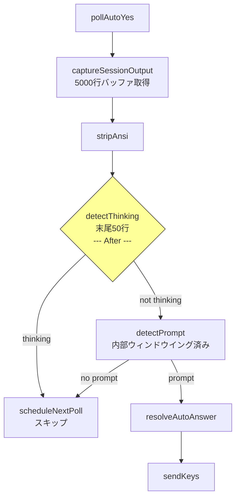

# Issue #191: Auto-Yes detectThinking() ウィンドウイング 設計方針書

## 1. 概要

### 問題
Auto-Yesモード有効時、`auto-yes-manager.ts`の`pollAutoYes()`が`detectThinking()`にtmuxバッファ全体（5000行）を渡しているため、過去のthinkingサマリー行（例: `· Simmering… (4m 16s)`）がthinking状態と誤検出され、プロンプト検出が永続的にスキップされる。

### 修正方針
`detectThinking()`の呼び出し箇所（`auto-yes-manager.ts` L284）で、バッファ末尾50行のみを検索対象とするウィンドウイングを適用する。

### 影響範囲
- 修正対象: `src/lib/auto-yes-manager.ts`（1箇所）
- テスト追加: `tests/unit/lib/auto-yes-manager.test.ts`
- ドキュメント更新: `CLAUDE.md`

## 2. アーキテクチャ設計

### 修正箇所のコンテキスト

**注: 以下の図は修正後（After）のフローを示す。修正前（Before）では、`detectThinking` にバッファ全体（5000行）が渡されていた。**



### `detectThinking()` 呼び出し元のウィンドウイング比較

| モジュール | 現状 | 修正後 | 用途 |
|-----------|------|-------|------|
| `auto-yes-manager.ts` L284 | 5000行全体 | **末尾50行** | サーバー側Auto-Yesポーリング |
| `status-detector.ts` L99 | 末尾15行 | 変更なし | ステータス表示 |
| `current-output/route.ts` L83 | 末尾15行（stripAnsi + 非空行フィルタ後） | 変更なし | クライアント側Auto-Yes / ステータス |

## 3. 技術設計

### 3-1. auto-yes-manager.ts の修正

**変更箇所**: L276-287（`pollAutoYes()`内）

```typescript
// Before (現状):
const output = await captureSessionOutput(worktreeId, cliToolId, 5000);
const cleanOutput = stripAnsi(output);

if (detectThinking(cliToolId, cleanOutput)) {
  scheduleNextPoll(worktreeId, cliToolId);
  return;
}

// After (修正後):
const output = await captureSessionOutput(worktreeId, cliToolId, 5000);
const cleanOutput = stripAnsi(output);

// Issue #191: Apply windowing to detectThinking() to prevent stale thinking
// summary lines (e.g., "· Simmering…") from blocking prompt detection.
// Window size matches detectPrompt()'s multiple_choice scan range (50 lines).
//
// Safety: Claude CLI does not emit prompts during thinking, so narrowing
// the window cannot cause false auto-responses (see IA-003 in design doc).
//
// Processing order: stripAnsi -> split -> slice -> join
// stripAnsi is applied BEFORE split to ensure ANSI escape sequences spanning
// line boundaries do not affect line counting (IA-002).
//
// Boundary case: if buffer has fewer than 50 lines, slice(-50) returns the
// entire array (Array.prototype.slice specification), which is safe degradation
// equivalent to pre-fix behavior (IA-001).
const recentLines = cleanOutput.split('\n').slice(-THINKING_CHECK_LINE_COUNT).join('\n');
if (detectThinking(cliToolId, recentLines)) {
  scheduleNextPoll(worktreeId, cliToolId);
  return;
}
```

**定数追加**:

```typescript
/**
 * Number of lines from the end to check for thinking indicators (Issue #191)
 * Matches detectPrompt()'s multiple_choice scan range (50 lines in prompt-detector.ts)
 * to ensure Issue #161 Layer 1 defense covers the same scope as prompt detection.
 *
 * IMPORTANT: This value is semantically coupled to the hardcoded 50 in
 * prompt-detector.ts detectMultipleChoicePrompt() (L268: Math.max(0, lines.length - 50)).
 * See SF-001 in Stage 1 review. A cross-reference test validates this coupling.
 */
export const THINKING_CHECK_LINE_COUNT = 50;
```

### 3-2. ウィンドウサイズ 50行の根拠

1. **`detectPrompt()`のmultiple_choice検出**: `prompt-detector.ts` L268で`Math.max(0, lines.length - 50)`を使用
2. **Layer 1防御の整合性**: thinking検出のウィンドウが`detectPrompt()`のウィンドウより小さいと、thinking行がウィンドウ外にありながらmultiple_choiceプロンプトが検出される領域が生じ、Issue #161の防御が部分的に無効化される
3. **`status-detector.ts`との差異**: status-detector.tsは15行だが、これはステータス表示専用。Auto-Yesの文脈ではprompt検出と同じスコープが必要

#### [SF-001] ウィンドウサイズ定数の意味的結合に関する注意事項

`THINKING_CHECK_LINE_COUNT = 50` は `prompt-detector.ts` L268 の `slice(-50)` と意味的に結合している。両者は「multiple_choice検出のスキャン範囲」という同一の概念を表しており、一方の値を変更する場合はもう一方も追従する必要がある。

**現設計での対応方針**: 共有定数の導入ではなく、テストによる整合性検証を採用する。

理由:
- `prompt-detector.ts` はCLIツール非依存の設計原則を持つ（Issue #161参照）。`auto-yes-manager.ts` 由来の定数をインポートさせると、この設計原則に反する
- 共通定数モジュール（例: `cli-patterns.ts`）に配置する案もあるが、`prompt-detector.ts` が `cli-patterns.ts` に依存を持つことはアーキテクチャ上望ましくない
- テストでの検証（「`THINKING_CHECK_LINE_COUNT` と `prompt-detector.ts` のmultiple_choiceウィンドウサイズが一致すること」）は、コメントのみの担保よりも信頼性が高い

**実装指針**:
- `auto-yes-manager.ts` の定数コメントに `prompt-detector.ts` L268 への相互参照を明記する（上記 3-1 の定数定義を参照）
- テスト3（後述 4-1）で両者の値が一致することを検証する

### 3-3. detectPrompt()への変更は不要

`detectPrompt()`は内部で独自のウィンドウイングを自己適用する:
- yes/no: `slice(-10)` で末尾10行
- multiple_choice: `Math.max(0, length-50)` で末尾50行

したがって、`auto-yes-manager.ts` L290で`detectPrompt(cleanOutput)`にフルバッファを渡しても安全に動作する。修正対象は`detectThinking()`のみ。

### 3-4. [SF-002] split-slice-join パターンの重複に関する設計判断

バッファ末尾N行を取得する `output.split('\n').slice(-N).join('\n')` パターンは以下の箇所で使用されている:

| 箇所 | ウィンドウサイズ | 用途 |
|------|----------------|------|
| `status-detector.ts` L83 | 15行 (`STATUS_CHECK_LINE_COUNT`) | ステータス検出 |
| `current-output/route.ts` L73-74 | 15行 | クライアント側出力取得 |
| `auto-yes-manager.ts` (本修正) | 50行 (`THINKING_CHECK_LINE_COUNT`) | thinking検出ウィンドウイング |

**設計判断: 本Issueのスコープではユーティリティ関数の抽出は行わない**

理由:
- 3箇所の使用であり、各箇所のウィンドウサイズが異なる（15行 vs 50行）ため、パラメータ化されたユーティリティの恩恵が限定的
- パターン自体が1行のイディオム（`output.split('\n').slice(-N).join('\n')`）であり、関数化による可読性向上が小さい
- 本Issueのスコープは最小限の修正（auto-yes-manager.tsのみ）に留める方針

**将来の改善候補**: 今後同パターンの使用箇所がさらに増加する場合、`getLastNLines(output: string, n: number): string` ユーティリティ関数を `src/lib/utils.ts` に追加し、各呼び出し箇所を置き換えることを検討する。この改善は別Issueとして起票することを推奨する。

## 4. テスト設計

### 4-1. 新規テストケース

> **[C-C02] テスト実装パターンに関する注記**: 以下のテスト例では `vi.mocked()` をトップレベルで使用する形式で記載しているが、実装時には既存の Issue #161 テスト（L429-498）で使用されている `await import()` による動的インポートパターンに合わせること。これにより `vi.resetModules()` によるモジュール再読み込みテストとの一貫性が保たれる。

#### テスト1: 5000行バッファ + 先頭にthinkingサマリー + 末尾にプロンプト

```typescript
it('should detect prompt when stale thinking summary exists in early buffer lines (Issue #191)', async () => {
  // 5000行バッファを構成:
  // - 先頭100行にthinkingサマリー行を配置
  // - 中間は空行/通常出力
  // - 末尾10行にyes/noプロンプトを配置
  const staleThinkingLines = Array(100).fill('· Simmering… (4m 16s · ↓ 8.0k tokens · thought for 53s)');
  const normalLines = Array(4880).fill('normal output line');
  const promptLines = [
    'Do you want to proceed?',
    '',
    '  Yes / No',
    '',
    'Do you want to proceed? (y/n)',
  ];
  const paddingLines = Array(5).fill('');
  const fullBuffer = [...staleThinkingLines, ...normalLines, ...promptLines, ...paddingLines].join('\n');

  vi.mocked(captureSessionOutput).mockResolvedValue(fullBuffer);
  vi.mocked(sendKeys).mockResolvedValue(undefined);

  // pollAutoYes should detect the prompt (not blocked by stale thinking lines)
  // sendKeys should be called
  expect(sendKeys).toHaveBeenCalled();
});
```

#### テスト2: 末尾50行以内にthinkingパターンがある場合はスキップ

```typescript
it('should skip prompt detection when thinking pattern is within last 50 lines (Issue #191)', async () => {
  // 末尾30行目にthinkingパターンを配置
  const normalLines = Array(4970).fill('normal output');
  const thinkingLine = '✻ Analyzing…';
  const recentLines = Array(29).fill('some output');
  const fullBuffer = [...normalLines, thinkingLine, ...recentLines].join('\n');

  vi.mocked(captureSessionOutput).mockResolvedValue(fullBuffer);

  // pollAutoYes should skip prompt detection (thinking detected in recent window)
  // sendKeys should NOT be called
  expect(sendKeys).not.toHaveBeenCalled();
});
```

#### テスト3: [SF-001対応] THINKING_CHECK_LINE_COUNT と prompt-detector.ts のウィンドウサイズ一致検証

```typescript
it('should have THINKING_CHECK_LINE_COUNT matching prompt-detector multiple_choice scan window (SF-001)', () => {
  // SF-001: THINKING_CHECK_LINE_COUNT と prompt-detector.ts の
  // detectMultipleChoicePrompt() ウィンドウサイズ (50行) が一致することを検証する。
  // これにより、コメントのみに依存しない形で意味的結合を担保する。
  //
  // 検証方法:
  // - THINKING_CHECK_LINE_COUNT をエクスポートして直接値を検証
  // - prompt-detector.ts の multiple_choice ウィンドウサイズを
  //   テストで間接的に検証（50行目にのみ選択肢を配置し、検出されることを確認）
  //
  // 注: C-002の指摘を踏まえ、単純な「定数値 === 50」のアサートではなく、
  // 「auto-yes-manager.ts の THINKING_CHECK_LINE_COUNT と
  //  prompt-detector.ts のウィンドウサイズが一致すること」を検証する。
  // これにより、将来的に値を変更する正当な理由が生じた場合でも、
  // 両方を同時に更新すればテストが壊れない設計とする。
});
```

### 4-2. 既存テスト（変更なし）

- `Issue #161: pollAutoYes thinking state skip` の2テスト: 3行入力のため50行ウィンドウ内に収まり、動作に影響なし
- **[IA-005] 注記**: 既存テストの入力サイズが50行未満であるため、ウィンドウイングの有無に関わらず同一挙動となる（`slice(-50)` がバッファ全体を返すため）。ウィンドウイングの境界効果（50行目境界でのthinking行の除外）は新規テスト1・2で検証する

## 5. セキュリティ設計

本修正はセキュリティへの影響なし:
- 入力バリデーション変更なし（worktreeId検証は既存）
- 外部入力の処理変更なし
- `detectThinking()`の検索範囲を狭めるのみ（縮小方向の変更）

### [SEC-C02] ウィンドウイングのAuto-Yes安全性に関するコードコメント推奨

Stage 4セキュリティレビューにて、50行ウィンドウイングがAuto-Yesの誤自動応答を新たに生み出さない理由をコードコメントで明文化することが推奨された。具体的には、ウィンドウイングにより51行目以降のthinking行が検出されなくなるが、**Claude CLIはthinking中にプロンプトを出力しない**ため、「thinkingが検出されないのにプロンプトが存在する」という状況は実際には発生しない。この安全性の根拠（IA-003分析と同一）を、ウィンドウイング適用箇所のコードコメントに簡潔に記載することで、将来の保守者が設計意図を迅速に理解できるようにする。

**実装指針**: Section 3-1 の修正コードコメントに以下の趣旨を1行追記する:
```
// Safety: Claude CLI does not emit prompts during thinking, so narrowing
// the window cannot cause false auto-responses (see IA-003).
```

## 6. パフォーマンス設計

- `split('\n').slice(-50)` は5000行バッファに対して軽量な操作
- 2秒ポーリング間隔で実行されるため、パフォーマンス影響は無視できる
- メモリ: 一時的に50行分の文字列を生成するが、GCですぐに回収される

## 7. 設計上の決定事項とトレードオフ

### 採用: 案1（ウィンドウイング方式）

| 決定事項 | 理由 | トレードオフ |
|---------|------|-------------|
| 末尾50行ウィンドウ | `detectPrompt()`のmultiple_choice範囲と一致 | `status-detector.ts`の15行とは異なる（用途が異なるため許容） |
| `auto-yes-manager.ts`のみ修正 | `detectThinking()`関数自体は変更不要 | 呼び出し元での前処理が必要 |
| 定数名 `THINKING_CHECK_LINE_COUNT` | 既存の`STATUS_CHECK_LINE_COUNT`と命名一貫性 | モジュールごとに独立した定数（SF-001参照: テストで整合性担保） |
| テストによる定数整合性検証（SF-001） | コメントのみの担保より信頼性が高い | テスト実行が必要だが、CIで自動検証される |
| split-slice-join パターンの重複許容（SF-002） | 1行イディオムで関数化の恩恵が小さい | 将来的に使用箇所が増えた場合は別Issueで対応 |

### 不採用: 案2（thinking/prompt優先順位変更）

- Issue #161のLayer 1防御を覆すリスク
- 3つの呼び出し元のうち2つがthinking優先であり、整合性の問題

### 不採用: 案3（サマリー行除外パターン）

- ブラックリスト方式の脆弱性（Claude CLIバージョンアップで追従不能）
- パターンの保守コストが高い

### 不採用: 共有定数モジュール方式（SF-001代替案）

- `prompt-detector.ts` のCLIツール非依存設計原則に反する依存関係が生じる
- 共通定数モジュールへの依存追加も同様のアーキテクチャ上の懸念がある
- テストによる整合性検証で十分に担保可能

### 将来検討事項

以下の項目はレビューで指摘されたが、本Issueのスコープ外とし将来の検討課題とする:

- **[C-001] ウィンドウサイズ差異のコードコメント強化**: `status-detector.ts`（15行）と`auto-yes-manager.ts`（50行）のウィンドウサイズが異なる理由を、各モジュールのコードコメントでより明確に記述する。用途の違い（ステータス表示 vs Auto-Yesポーリング）を明文化することで、将来の開発者の混乱を防止できる
- **[C-003] detectThinking()へのwindowSize引数追加**: 呼び出し元での前処理を不要にし、ウィンドウイングの責務をdetect系関数内に統一する設計。ただし現時点では呼び出し元が3箇所のみで、各々異なるウィンドウサイズを使う正当な理由があるため、YAGNI違反となる。呼び出し元が増加した場合に再検討
- **[SF-002] getLastNLines() ユーティリティ関数の抽出**: `output.split('\n').slice(-N).join('\n')` パターンの使用箇所が4箇所以上になった場合に、別Issueとして起票し対応を検討
- **[C-C01] current-output/route.ts の非空行フィルタリングの差異の明文化**: `current-output/route.ts` の15行は非空行フィルタリング後の15行であるのに対し、`status-detector.ts` の15行は空行を含む全行である。この差異をコードコメントや設計書で明確に記述することで、将来の保守者の混乱を防止できる
- **[SEC-C01] pollAutoYes error.message のtmuxバッファ内容漏洩の認識**: `auto-yes-manager.ts` L329のエラーログで `error.message` を使用しており、tmuxバッファ内容やセッション名が含まれる可能性がある。現状は `error.message` のみ（スタックトレースやバッファ全体は含まない）であり、warn レベルのログとして適切な範囲に留まっている。本Issueでの変更は不要だが、将来的にログレベルや出力先を変更する場合は再評価が必要（OWASP A09:2021 - Security Logging and Monitoring Failures）

## 8. 実装チェックリスト

### コア実装
- [ ] `auto-yes-manager.ts`: `THINKING_CHECK_LINE_COUNT` 定数追加（`export`、SF-001対応のコメント含む。テスト3でインポートして値を検証するため`export`が必須）
- [ ] `auto-yes-manager.ts`: `pollAutoYes()` L284の`detectThinking()`呼び出しをウィンドウイング適用に変更
- [ ] `auto-yes-manager.ts`: [SEC-C02] ウィンドウイング適用箇所のコードコメントにAuto-Yes安全性の根拠を追記（「Claude CLIはthinking中にプロンプトを出力しないため、ウィンドウ縮小により誤自動応答は発生しない」旨。IA-003への参照を含む）

### テスト
- [ ] `tests/unit/lib/auto-yes-manager.test.ts`: テスト1 - 5000行バッファ + stale thinking + prompt のテスト追加
- [ ] `tests/unit/lib/auto-yes-manager.test.ts`: テスト2 - 末尾50行以内にthinkingパターンがある場合のテスト追加
- [ ] `tests/unit/lib/auto-yes-manager.test.ts`: テスト3 - [SF-001] THINKING_CHECK_LINE_COUNTとprompt-detector.tsのウィンドウサイズ一致検証テスト追加

### 検証
- [ ] 既存テスト全パス確認: `npm run test:unit`
- [ ] 静的解析: `npx tsc --noEmit && npm run lint`

### ドキュメント
- [ ] `CLAUDE.md` のIssue #191セクション追加

## 9. 影響分析

### 影響なし
- `detectThinking()` 関数自体（変更なし）
- `detectPrompt()` 関数（変更なし、内部ウィンドウイング済み）
- `status-detector.ts`（変更なし、既にウィンドウイング済み: 空行含む末尾15行）
- `current-output/route.ts`（変更なし、既にウィンドウイング済み: stripAnsi + 非空行フィルタ後の末尾15行）
  - **[IA-004] 根拠**: `current-output/route.ts` の非空行フィルタリングは `auto-yes-manager.ts` の修正（空行含む末尾50行のウィンドウイング追加）とは質的に異なるが、本修正の対象は `auto-yes-manager.ts` の `detectThinking()` 呼び出し箇所のみであり、`current-output/route.ts` の処理パイプラインには一切変更を加えない。`current-output/route.ts` での `detectThinkingState()` は既に非空行フィルタ後の15行を使用しており、stale thinkingサマリー行が残存する可能性は元々低い
- `auto-yes-resolver.ts`（変更なし）
- クライアント側Auto-Yesフック（変更なし）

### 回帰リスク
- **低**: 修正は検索範囲を狭める方向（5000行→50行）であり、新たな誤検出を導入しない
- **既存テスト**: 3行入力のテストは50行ウィンドウ内に収まるため影響なし
- **[IA-003] 50行ウィンドウ内でのthinkingサマリー行の残存シナリオ**: thinking完了後、サマリー行（例: `· Simmering... (4m 16s)`）は `CLAUDE_THINKING_PATTERN` にマッチする（これがIssue #191の根本原因）。50行ウィンドウ内にサマリー行が残存する期間は、サマリー表示後にClaude CLIが50行以上の新規出力を生成するまでに限られる。大量出力の場合この期間は数秒で解消される。一方、thinking完了直後で新規出力が少ない段階ではサマリー行が50行内に残りうるが、この時点ではプロンプト行（`(y/n)` や選択肢）もまだ出現していないため、prompt検出スキップの実害は発生しない。したがって50行ウィンドウはthinking完了直後のサマリー行残存に対して安全に動作する

## 10. レビュー履歴

| ステージ | 日付 | レビュー種別 | 結果 | スコア |
|---------|------|-------------|------|--------|
| Stage 1 | 2026-02-08 | 通常レビュー（設計原則） | conditionally_approved | 4/5 |
| Stage 2 | 2026-02-08 | 整合性レビュー | conditionally_approved | 4/5 |
| Stage 3 | 2026-02-08 | 影響分析レビュー | conditionally_approved | 4/5 |
| Stage 4 | 2026-02-08 | セキュリティレビュー | approved | 5/5 |

## 11. レビュー指摘事項サマリー

### Stage 1: 通常レビュー（設計原則）

#### Must Fix
なし

#### Should Fix

| ID | 原則 | タイトル | 重要度 | 工数 | 対応状況 | 反映箇所 |
|----|------|---------|--------|------|---------|---------|
| SF-001 | DRY | ウィンドウイング定数の分散定義 | medium | low | 反映済 | Section 3-1 (定数コメント), Section 3-2 (SF-001対応方針), Section 4-1 (テスト3), Section 7 (設計決定), Section 8 (チェックリスト) |
| SF-002 | DRY | split-slice-join パターンの重複 | low | low | 反映済 | Section 3-4 (設計判断), Section 7 (設計決定/将来検討) |

#### Consider（将来検討）

| ID | 原則 | タイトル | 反映箇所 |
|----|------|---------|---------|
| C-001 | KISS | status-detector.ts と auto-yes-manager.ts のウィンドウサイズ差異の明文化 | Section 7 (将来検討事項) |
| C-002 | YAGNI | テスト3(定数値テスト)の必要性 | Section 4-1 (テスト3をSF-001対応の一致検証テストに改善) |
| C-003 | OCP | detectThinking() 側でウィンドウイングを内包する設計の将来検討 | Section 7 (将来検討事項) |

#### リスク評価

| カテゴリ | リスクレベル |
|---------|------------|
| 技術リスク | low |
| セキュリティリスク | low |
| 運用リスク | low |

### Stage 2: 整合性レビュー

#### Must Fix
なし

#### Should Fix

| ID | タイトル | 重要度 | 工数 | 対応状況 | 反映箇所 |
|----|---------|--------|------|---------|---------|
| SF-C01 | prompt-detector.ts L268 のコード形式の記述が不正確 | medium | low | 反映済 | Section 3-1 (定数コメント `slice(-50)` -> `Math.max(0, lines.length - 50)`), Section 3-2 項目1 (同修正) |
| SF-C02 | THINKING_CHECK_LINE_COUNT のエクスポート指定がチェックリストに未記載 | medium | low | 反映済 | Section 3-1 (定数定義に `export` 追加), Section 8 (チェックリスト項目に `export` 明記) |

#### Consider（将来検討）

| ID | タイトル | 反映箇所 |
|----|---------|---------|
| C-C01 | current-output/route.ts の非空行フィルタリングの差異 | Section 7 (将来検討事項) |
| C-C02 | テスト設計例のモックパターンが既存テストと異なる | Section 4-1 (動的インポートパターンの注記を追加) |
| C-C03 | Mermaid図が提案後のフローを描写している旨の明記 | Section 2 (Mermaid図に「修正後（After）」の注釈を追加) |

#### リスク評価

| カテゴリ | リスクレベル |
|---------|------------|
| 技術リスク | low |
| セキュリティリスク | low |
| 運用リスク | low |

### Stage 3: 影響分析レビュー

#### Must Fix
なし

#### Should Fix

| ID | カテゴリ | タイトル | 重要度 | 工数 | 対応状況 | 反映箇所 |
|----|---------|---------|--------|------|---------|---------|
| IA-004 | 影響範囲の網羅性 | current-output/route.tsのdetectThinkingState呼び出しとの差異が影響分析で不十分 | low | low | 反映済 | Section 2 (ウィンドウイング比較表: "末尾15行（stripAnsi + 非空行フィルタ後）"に修正), Section 9 (影響なしの根拠にIA-004として非空行フィルタ差異の説明を追記) |

#### Nice to Have（補足記載）

| ID | カテゴリ | タイトル | 反映箇所 |
|----|---------|---------|---------|
| IA-001 | 影響範囲の正確性 | slice(-50)のバッファ50行未満時の安全な縮退の明文化 | Section 3-1 (コード例のコメントに境界ケースの説明を追記) |
| IA-002 | 影響範囲の正確性 | stripAnsiをsplit前に適用する処理順序の重要性 | Section 3-1 (コード例のコメントに処理順序の説明を追記) |
| IA-003 | 回帰リスク | 50行境界でのthinkingサマリー行の取りこぼしシナリオの分析 | Section 9 (回帰リスクにIA-003としてサマリー行残存シナリオの分析を追記) |
| IA-005 | テスト影響 | 既存テストの入力サイズとウィンドウイング後の挙動の明確化 | Section 4-2 (既存テストがウィンドウイングの境界効果を区別できない点を注記) |

#### 影響範囲検証

| 検証項目 | 結果 |
|---------|------|
| 全呼び出し元の識別 | 検証済（3箇所） |
| 間接呼び出しの有無 | なし（re-export不在） |
| 境界見逃しリスク | 低（thinking中はCLI出力なし） |
| 回帰リスク評価 | 妥当（検索範囲縮小方向） |
| tmuxエッジケース | 安全（stripAnsi先行適用） |
| 50行未満バッファ | 安全（slice仕様による全体返却） |

#### リスク評価

| カテゴリ | リスクレベル |
|---------|------------|
| 技術リスク | low |
| セキュリティリスク | low |
| 運用リスク | low |
| 回帰リスク | low |

### Stage 4: セキュリティレビュー

#### Must Fix
なし

#### Should Fix
なし

#### Consider（認識事項）

| ID | カテゴリ | タイトル | 重要度 | 工数 | 対応状況 | 反映箇所 |
|----|---------|---------|--------|------|---------|---------|
| SEC-C01 | 情報開示 (A09:2021) | pollAutoYes error logging may include tmux buffer content in error.message | low | low | 認識済（変更不要） | Section 7 (将来検討事項) |
| SEC-C02 | Auto-Yes安全性 | Document the safety argument for 50-line window not creating false-positive auto-responses | low | low | 反映済 | Section 5 (SEC-C02), Section 8 (チェックリスト) |

#### セキュリティチェックリスト

| 検証項目 | 結果 |
|---------|------|
| インジェクション防止 | pass（新規コマンド構築なし） |
| 入力バリデーション | pass（新規入力ベクターなし） |
| DoS防止 | pass（処理量削減方向の変更） |
| 情報開示 | pass（ログ出力変更なし） |
| レースコンディション | pass（新規TOCTOU問題なし） |
| Auto-Yes安全性 | pass（thinking中はプロンプト非出力） |
| XSS防止 | N/A（サーバーサイドのみ） |
| 認証・認可 | N/A（変更なし） |
| 機密データ保護 | pass（新規データ永続化なし） |
| セキュリティ設定 | N/A（設定変更なし） |

#### リスク評価

| カテゴリ | リスクレベル |
|---------|------------|
| 技術リスク | low |
| セキュリティリスク | low |
| 運用リスク | low |

---

*Generated by design-policy command for Issue #191*
*Stage 1 review findings applied: 2026-02-08*
*Stage 2 review findings applied: 2026-02-08*
*Stage 3 review findings applied: 2026-02-08*
*Stage 4 review findings applied: 2026-02-08*
