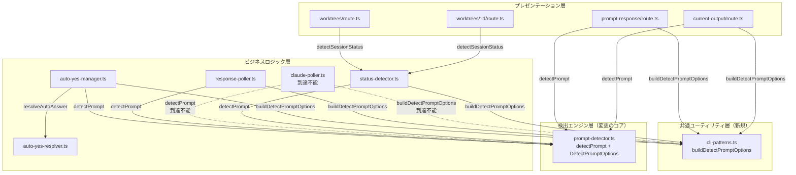

# Issue #193: Claude Code複数選択肢プロンプト検出 設計方針書

## 1. 概要

### 問題
Claude Codeからの複数選択肢メッセージ（1~4の選択肢）に対し、CommandMateのUIから回答を送信できない。Auto-Yesモードでもタスクが進まない。

### 根本原因
`prompt-detector.ts`の`detectMultipleChoicePrompt()`は2パス❯検出方式を採用しており、以下の2つの独立したゲートが❯マーカーなしの選択肢形式をブロックしている:

1. **Pass 1 (L274-288)**: `DEFAULT_OPTION_PATTERN`（❯ U+276F）の存在チェック → ❯なしで即`isPrompt: false`
2. **Layer 4 (L344-350)**: `hasDefaultIndicator`チェック → `options.some(opt => opt.isDefault)`がfalseで`isPrompt: false`

### 対象CLIツール
Claude Code（❯マーカーなしの特定プロンプト形式）

---

## 2. アーキテクチャ設計

### 変更のレイヤー構成



### データフロー

```
tmux capture-pane → stripAnsi() → detectPrompt(output, options?) → PromptDetectionResult
                                         ↓
                                  detectMultipleChoicePrompt(output, options?)
                                         ↓
                               Pass 1: ❯存在チェック（requireDefaultIndicator=falseでスキップ→直接Pass 2へ進行）
                                         ↓
                               Pass 2: 選択肢収集（❯付き + 番号のみ）+ 逆スキャンで質問行検出（questionEndIndex）
                               ※Pass 1スキップ時もPass 2は無条件で実行される（early returnがないため）
                                         ↓
                               Layer 3: 連番検証（維持）
                                         ↓
                               Layer 4: hasDefaultIndicator チェック（requireDefaultIndicator=falseでスキップ）
                                         ↓
                               Layer 5【SEC-001】: questionEndIndex === -1 ガード
                               （requireDefaultIndicator=false かつ questionEndIndex === -1 の場合 → isPrompt: false）
                               ※質問行が見つからない番号リストのみの出力をブロック
                                         ↓
                               PromptDetectionResult { isPrompt, promptData, cleanContent }
```

---

## 3. 技術選定

### アプローチ: ケースB（パターンのパラメータ化）

Issue #193のPhase 1調査によりケースB（❯マーカーなし形式）が最も可能性が高いため、`detectPrompt()`にoptionalパラメータを追加する方式を採用する。

| 項目 | 選定内容 | 理由 |
|------|---------|------|
| 方式 | `DetectPromptOptions` interface + optional parameter | 後方互換性維持、CLIツール非依存性原則準拠 |
| パラメータ | `requireDefaultIndicator?: boolean` | Pass 1とLayer 4を同時に制御する最小限のフラグ |
| デフォルト値 | `true` | 既存動作を完全維持（破壊的変更なし） |
| CLIツール判定 | `cli-patterns.ts`の`buildDetectPromptOptions()`ヘルパー関数に集約（レビュー指摘MF-001対応） | prompt-detector.tsのCLIツール非依存性を維持（Issue #161原則）かつDRY原則準拠 |

### 代替案との比較

| 方式 | メリット | デメリット | 判定 |
|------|---------|-----------|------|
| **案B: パラメータ化**（採用） | 後方互換性維持、CLIツール非依存性維持、最小変更 | P0+P1で7呼び出し箇所（5ファイル）を更新、P2含む合計9呼び出し箇所（7ファイル）（ヘルパー関数で判定ロジックは1箇所に集約） | 採用 |
| 案A: パターン修正のみ | 変更箇所最小 | ❯なし形式には対応不可 | 不採用 |
| 案C: ウィンドウサイズ変更 | 簡単 | 根本原因（❯なし形式）を解決しない | 不採用 |
| detectPrompt内でcliToolIdを受け取る | 呼び出し元の変更不要 | CLIツール非依存性原則に違反 | 不採用 |

---

## 4. 設計パターン

### 4.1 DetectPromptOptions Interface

```typescript
/**
 * Options for prompt detection behavior customization.
 * Maintains prompt-detector.ts CLI tool independence (Issue #161 principle).
 *
 * 【将来拡張メモ（レビュー指摘SF-001）】
 * 現在のrequireDefaultIndicatorはPass 1（❯存在チェック）とLayer 4（hasDefaultIndicator
 * チェック）を同時に制御する単一フラグ。将来的にCLIツールごとにPass 1のみスキップまたは
 * Layer 4のみスキップする要件が生じた場合は、以下のように個別フラグに分割する:
 *   skipPass1Gate?: boolean;   // Pass 1の❯存在チェックをスキップ
 *   skipLayer4Gate?: boolean;  // Layer 4のhasDefaultIndicatorチェックをスキップ
 * 現時点ではその要件は存在しないため、YAGNI原則に基づき単一フラグを維持する。
 */
export interface DetectPromptOptions {
  /**
   * Controls Pass 1 (L274-288) DEFAULT_OPTION_PATTERN existence check and
   * Layer 4 (L344-350) hasDefaultIndicator check.
   * - true (default): Marker required (existing behavior)
   * - false: Detect choices without marker (Claude Code special format)
   *
   * When false:
   * - Pass 1: Skip hasDefaultLine check entirely
   * - Layer 4: Skip hasDefaultIndicator check, require only options.length >= 2
   */
  requireDefaultIndicator?: boolean;
}
```

### 4.2 detectPrompt() シグネチャ変更

```typescript
// Before:
export function detectPrompt(output: string): PromptDetectionResult

// After:
export function detectPrompt(output: string, options?: DetectPromptOptions): PromptDetectionResult
```

### 4.3 detectMultipleChoicePrompt() 変更

```typescript
// Before:
function detectMultipleChoicePrompt(output: string): PromptDetectionResult

// After:
function detectMultipleChoicePrompt(output: string, options?: DetectPromptOptions): PromptDetectionResult
```

**変更箇所**:

1. **Pass 1 (L274-288)**: `requireDefault`が`true`の場合のみ❯存在チェックを実行
2. **Pass 2 (L290-332)**: 変更なし（❯あり/なし両方のパターンで収集は既存動作）
3. **Layer 3 (L334-341)**: 変更なし（連番検証は維持）
4. **Layer 4 (L343-350)**: `requireDefault`が`true`の場合のみ`hasDefaultIndicator`チェックを実行
5. **Layer 5 (新規追加 -- SEC-001対応)**: `requireDefault`が`false`かつ`questionEndIndex === -1`の場合に`isPrompt: false`を返す。質問行が存在しない番号付きリストのみの出力でAuto-Yesが誤動作するリスクを防止

```typescript
// レビュー指摘C-003対応: 二重否定 (!== false) を ?? true に置き換えて可読性向上
const requireDefault = options?.requireDefaultIndicator ?? true;

// Pass 1 変更
if (requireDefault) {
  // 既存: ❯存在チェック
  let hasDefaultLine = false;
  for (let i = scanStart; i < lines.length; i++) {
    const line = lines[i].trim();
    if (DEFAULT_OPTION_PATTERN.test(line)) {
      hasDefaultLine = true;
      break;
    }
  }
  if (!hasDefaultLine) {
    return { isPrompt: false, cleanContent: output.trim() };
  }
}

// Layer 4 変更
const hasDefaultIndicator = collectedOptions.some(opt => opt.isDefault);
if (requireDefault) {
  if (collectedOptions.length < 2 || !hasDefaultIndicator) {
    return { isPrompt: false, cleanContent: output.trim() };
  }
} else {
  // requireDefaultIndicator = false: options.length >= 2 のみ
  if (collectedOptions.length < 2) {
    return { isPrompt: false, cleanContent: output.trim() };
  }
}

// Layer 5【SEC-001対応】: questionEndIndex === -1 ガード
// requireDefaultIndicator=false 時、質問行が見つからない場合（questionEndIndex === -1）は
// ジェネリック質問文 'Please select an option:' にフォールバックしてisPrompt=trueが
// 返される実装を防止する。質問行がない番号リストのみの出力はプロンプトではない。
if (!requireDefault && questionEndIndex === -1) {
  return { isPrompt: false, cleanContent: output.trim() };
}
```

### 4.4 buildDetectPromptOptions() ヘルパー関数（レビュー指摘MF-001/SF-002対応）

**配置先**: `src/lib/cli-patterns.ts`

CLIツール別の`DetectPromptOptions`構築ロジックを1箇所に集約し、DRY原則違反（最大9箇所分散）を解消する。`cli-patterns.ts`はCLIツール別パターン定義の既存モジュールであり、CLIToolTypeのimportが自然な位置にある。prompt-detector.tsはCLIToolTypeに依存せず、抽象的なDetectPromptOptionsのみに依存する構造を維持する（Issue #161原則、DIP準拠）。

```typescript
import { CLIToolType } from '@/lib/cli-tools/types';
import { DetectPromptOptions } from '@/lib/prompt-detector';

/**
 * CLIツール別のDetectPromptOptionsを構築するヘルパー関数。
 * cliToolId判定ロジックの一元化（DRY原則 - MF-001対応）。
 *
 * prompt-detector.tsのCLIツール非依存性を維持するため、
 * 判定ロジックはprompt-detector.ts外部（本関数）に配置する。
 *
 * 【将来拡張メモ（レビュー指摘C-002）】
 * CLIツール数が増加した場合（現在3ツール）、CLIToolConfigレジストリパターンで
 * ツール別設定（promptDetectionOptions含む）を管理する方式への移行を検討する。
 * 現時点では条件分岐で十分簡潔。
 *
 * @param cliToolId - CLIツール識別子
 * @returns DetectPromptOptions | undefined
 */
export function buildDetectPromptOptions(
  cliToolId: CLIToolType
): DetectPromptOptions | undefined {
  if (cliToolId === 'claude') {
    return { requireDefaultIndicator: false };
  }
  return undefined; // デフォルト動作（requireDefaultIndicator = true）
}
```

**呼び出し元の統一パターン**:

```typescript
// 全呼び出し元で同一パターン（MF-001解消）
import { buildDetectPromptOptions } from '@/lib/cli-patterns';

const promptOptions = buildDetectPromptOptions(cliToolId);
const promptCheck = detectPrompt(cleanOutput, promptOptions);
```

**SF-002対応**: `status-detector.ts`は自身でoptions構築ロジックを持たず、`buildDetectPromptOptions()`を呼び出すのみ。これによりSRP違反（status-detector.tsへの判定ロジック埋め込み）が解消される。

**モジュール依存方向の明示（IA-002対応）**: `buildDetectPromptOptions()`の追加により、`cli-patterns.ts`から`prompt-detector.ts`へのtype-only importが新規追加される。循環依存は発生しない。以下に依存方向を示す:

```
変更前:
  cli-patterns.ts → cli-tools/types.ts (CLIToolType)
  prompt-detector.ts → types/models.ts (PromptData)

変更後:
  cli-patterns.ts → cli-tools/types.ts (CLIToolType)
  cli-patterns.ts → prompt-detector.ts (type-only: DetectPromptOptions)  ※新規
  prompt-detector.ts → types/models.ts (PromptData)  ※変更なし

循環依存チェック:
  cli-patterns.ts → prompt-detector.ts → types/models.ts (終端)
  → 循環なし
```

type-only importであるため、ランタイムの依存関係は変更されない。TypeScriptコンパイル時のみの依存であり、バンドルサイズへの影響もない。

### 4.5 response-poller.ts内部ヘルパー（レビュー指摘SF-003/IA-001対応）

`response-poller.ts`内では`detectPrompt()`が3箇所（L248, L442, L556）で呼び出される。変更漏れリスクを低減するため、ファイル内部にprivateヘルパー関数を設ける。

**stripAnsi()一元化方針（IA-001対応）**: `detectPromptWithOptions()`ヘルパー内で一律`stripAnsi()`を適用する。L248では呼び出し前にstripAnsi済みの入力を渡しているが、`stripAnsi()`は冪等（idempotent）であるため二重適用は無害である。この方針により、セクション6.3で記載するL442/L556のANSI未ストリップ問題も本ヘルパー内で一括対処できる。呼び出し前ではなくヘルパー内に一元化することで、stripAnsi適用漏れを構造的に防止する。

```typescript
// response-poller.ts内部ヘルパー
// stripAnsiはヘルパー内で一律適用（IA-001: 冪等性により二重適用は無害）
function detectPromptWithOptions(
  output: string,
  cliToolId: CLIToolType
): PromptDetectionResult {
  const promptOptions = buildDetectPromptOptions(cliToolId);
  return detectPrompt(stripAnsi(output), promptOptions);
}
```

**L248のClaude専用ガードに関する注記（IC-002対応）**: L248は`if (cliToolId === 'claude')`ガード内に位置する。`detectPromptWithOptions()`ヘルパーは汎用的にcliToolIdを受け取るため、将来的にこのガードブロック外に移動またはコピーされた場合でも正しく動作する。現時点ではClaude専用ガード内であるためcliToolIdは常に`'claude'`だが、ヘルパー経由とすることで一貫性を維持する。L248ではヘルパー呼び出し前に既にstripAnsi済みだが、ヘルパー内の一律stripAnsi適用は冪等であるため問題なし。

**L556のresult.responseのANSI状態に関する注記（IC-002対応）**: L556で渡される`result.response`は`extractResponse()`の戻り値である。`extractResponse()`内部ではL310で`stripAnsi()`を適用した`cleanLine`をパターンマッチに使用するが、`responseLines.push(line)`（L330）では生の`line`をpushしている。そのため、`result.response`にはANSIエスケープシーケンスが残存している行が混在する。ヘルパー内の一律`stripAnsi()`適用（IA-001方針）によりこの問題は自動的に解消される。

### 4.6 Issue #161 多層防御との整合性

| Layer | 防御内容 | requireDefaultIndicator=false時 |
|-------|---------|-------------------------------|
| Layer 1 | thinking状態スキップ（呼び出し元） | **維持** |
| Layer 2 | 2パス❯検出 | Pass 1の❯存在チェックをスキップ。Pass 2の収集ロジックは維持 |
| Layer 3 | 連番検証 | **維持** |
| Layer 4 | hasDefaultIndicator + options.length >= 2 | hasDefaultIndicatorスキップ。options.length >= 2は**維持** |
| Layer 5 | questionEndIndex === -1 ガード【SEC-001新規】 | `questionEndIndex === -1`（質問行未検出）の場合に`isPrompt: false`を返す。番号付きリストのみの出力での誤検出を防止 |

**UIコンポーネント（PromptPanel.tsx等）への影響なし（IA-003対応）**:

`requireDefaultIndicator = false`により、`PromptDetectionResult.promptData.options`の各要素で`isDefault`が全て`false`となるケースが増加する。UIコンポーネント（`PromptPanel.tsx`、`MobilePromptSheet.tsx`、`WorktreeDetailRefactored.tsx`）はpromptDataの`options`を表示する際に`isDefault`フラグに基づく条件分岐（スタイル変更や強調表示など）を行っていない。具体的には:

- `PromptPanel.tsx`: `promptData.options`をリスト表示するが、`isDefault`による表示分岐なし
- `MobilePromptSheet.tsx`: 同上
- `WorktreeDetailRefactored.tsx`: promptDataをpropsとして受け渡すのみ

したがって、`isDefault`が全て`false`になってもUI表示に影響はない。仮に将来的にisDefaultに基づくデフォルト選択肢のハイライト表示を追加する場合は、そのUI実装時に`requireDefaultIndicator = false`ケースの表示仕様を明確化する必要がある。

**auto-yes-resolver.tsのisDefaultフォールバック動作（IC-005対応）**:

`requireDefaultIndicator = false`でLayer 4の`hasDefaultIndicator`チェックがスキップされた場合、`PromptDetectionResult.promptData.options`の各要素の`isDefault`は全て`false`となる。`auto-yes-resolver.ts`の`resolveAutoAnswer()`（L24-25）では`const defaultOpt = promptData.options.find(opt => opt.isDefault)`で`defaultOpt = undefined`となり、nullish coalescing（`const target = defaultOpt ?? promptData.options[0]`）により最初の選択肢（`options[0]`）にフォールバックする。この動作は意図的であり、❯マーカーなし形式では「最初の選択肢を自動選択する」というAuto-Yesの合理的なデフォルト動作となる。

---

## 5. 変更対象ファイル一覧

### コア変更

| ファイル | 変更内容 | 優先度 |
|---------|---------|-------|
| `src/lib/prompt-detector.ts` | `DetectPromptOptions` interface定義、`detectPrompt()`/`detectMultipleChoicePrompt()` optionalパラメータ追加、Pass 1/Layer 4の条件分岐（`?? true`パターン使用） | P0 |
| `src/lib/cli-patterns.ts` | `buildDetectPromptOptions(cliToolId)` ヘルパー関数追加（MF-001対応） | P0 |
| `src/app/api/worktrees/[id]/prompt-response/route.ts` | `buildDetectPromptOptions()` + `detectPrompt(cleanOutput, promptOptions)` | P0 |
| `src/lib/auto-yes-manager.ts` | `buildDetectPromptOptions()` + `detectPrompt(cleanOutput, promptOptions)` — L290修正 | P0 |
| `src/lib/status-detector.ts` | `buildDetectPromptOptions()` + `detectPrompt(lastLines, promptOptions)` — L87修正。`detectSessionStatus()`の既存引数`cliToolId`（L77）を`buildDetectPromptOptions(cliToolId)`に渡してoptionsを構築する（IC-003対応）。stripAnsi()は既に適用済み(L81)。自身でoptions構築ロジックを持たない（SF-002対応） | P0 |

### ANSI未ストリップ修正 + Options追加

| ファイル | 変更内容 | 優先度 |
|---------|---------|-------|
| `src/lib/response-poller.ts` | `detectPromptWithOptions()`内部ヘルパー追加（SF-003対応）。ヘルパー内で`stripAnsi()`を一律適用する方針に統一（IA-001対応）。L248/L442/L556の3箇所をヘルパー経由に統一。L248は既にstripAnsi済みだが冪等性により二重適用は無害 | P1 |
| `src/app/api/worktrees/[id]/current-output/route.ts` | `buildDetectPromptOptions()` + `detectPrompt(cleanOutput, promptOptions)` — L88修正。cliToolIdはL40で取得済み。L88のthinking条件分岐（thinking時にdetectPrompt()をスキップしisPrompt:falseを返す構造）は維持し、detectPrompt()が呼ばれるケースでのみpromptOptionsを渡す（IC-004対応） | P1 |

### 到達不能コード対応（レビュー指摘C-001対応）

| ファイル | 変更内容 | 優先度 |
|---------|---------|-------|
| `src/lib/claude-poller.ts` L164 | TODOコメント追加: 到達不能コードであること、将来のリファクタリング/廃止時にまとめて対応する旨を明記。併せて`stripAnsi()` + `buildDetectPromptOptions()` + options引数追加（一貫性のため、必須ではない） | P2 |
| `src/lib/claude-poller.ts` L232 | 同上 | P2 |

> **C-001対応方針**: 到達不能コードの修正よりも、到達不能であることのドキュメント化（TODOコメント）を優先する。YAGNI原則に基づき、実行されないコードへの変更は工数対効果が低いため、コメント追加を最低限の対応とし、実際の修正はオプショナルとする。将来的にclaude-poller.tsを廃止またはリファクタリングする際にまとめて対応する。

### テスト

| ファイル | 変更内容 | 優先度 |
|---------|---------|-------|
| `tests/unit/prompt-detector.test.ts` | 新規テスト追加: ❯なし形式の検出、`requireDefaultIndicator: false`動作、リグレッションテスト | P0 |
| `tests/unit/lib/auto-yes-resolver.test.ts` | `isDefault: false`フォールバック動作テストの確認・追加 | P1 |
| `tests/unit/api/prompt-response-verification.test.ts` | cli-patternsモックに`buildDetectPromptOptions`を追加する必要がある。detectPromptのモック（vi.fn()）自体はoptionsパラメータを無視するため破壊されないが、テスト内でdetectPromptの呼び出し引数を`toHaveBeenCalledWith()`で検証している箇所がある場合、optionsパラメータの追加に伴い更新が必要（IA-004対応） | P1 |
| `src/lib/__tests__/status-detector.test.ts` | 既存テストはそのまま通過（内部実装変更のみ）。Claude用❯なし形式テスト追加推奨（IA-003対応） | P1 |

### ドキュメント

| ファイル | 変更内容 | 優先度 |
|---------|---------|-------|
| `CLAUDE.md` | Issue #193セクション追加 | P2 |

---

## 6. セキュリティ設計

### 6.1 誤検出防止（Issue #161との整合、SEC-001対応）

`requireDefaultIndicator = false`により❯なし形式を受け入れる場合、通常の番号付きリスト（例: 「1. ファイルを作成\n2. テストを実行」）との誤検出リスクが増加する。以下の多層防御で対処:

| 防御層 | 対策 | 状態 |
|-------|------|------|
| Layer 1 | thinking状態スキップ（呼び出し元で実施） | 維持 |
| Layer 3 | 連番検証（1始まり連続番号） | 維持 |
| Layer 5【SEC-001】 | `questionEndIndex === -1`ガード: `requireDefaultIndicator=false`時に質問行が見つからない場合は`isPrompt: false`を返す。ジェネリック質問文`'Please select an option:'`へのフォールバックによる誤検出を防止 | **新規** |
| 追加防御 | `requireDefaultIndicator: false`はClaude Codeコンテキストでのみ使用（`buildDetectPromptOptions()`で集約管理） | 新規 |
| 追加防御 | Pass 2の逆スキャンで質問行を検出（番号リストのみの場合は質問なしで除外） | 既存動作で維持 |

**SEC-001の背景と詳細**:

`requireDefaultIndicator=false`により、Layer 2（Pass 1の❯存在チェック）とLayer 4（hasDefaultIndicatorチェック）の2層がスキップされる。残存する防御はLayer 1（thinking状態スキップ）とLayer 3（連番検証）のみとなる。Claude Codeがidleプロンプト状態で番号付きリストを出力した場合（例: 前回のレスポンスに残る「1. foo\n2. bar\n3. baz」）、Layer 1はスキップされず（thinking=false）、Layer 3は連番であれば通過し、Auto-Yesが「1」を自動送信する可能性がある。

現行コードでは`questionEndIndex === -1`の場合、`question = 'Please select an option:'`というジェネリック質問文が使用されて`isPrompt: true`が返される実装になっており、番号リストのみの出力でもプロンプトとして検出されてしまう。

**対策**: Layer 5として、`requireDefaultIndicator=false`かつ`questionEndIndex === -1`の場合に明示的に`isPrompt: false`を返す条件を追加する。質問行（`?`で終わる行、`:`で終わる行等）が検出されない番号付きリストは、プロンプトではなく通常の出力として扱う。

### 6.2 入力バリデーション

`DetectPromptOptions`のフィールドはbooleanのみであり、外部入力に依存しないため追加のバリデーションは不要。

### 6.3 ANSI未ストリップ修正（IA-001統一方針）

**方針**: `response-poller.ts`の`detectPromptWithOptions()`ヘルパー内で`stripAnsi()`を一律適用する（セクション4.5参照）。`stripAnsi()`は冪等（idempotent）であるため、L248のように既にstripAnsi済みの入力に対して二重適用しても問題なし。この方針により、以下の全ケースを構造的に解決する:

| 呼び出し箇所 | 入力のANSI状態 | ヘルパー内stripAnsi | 備考 |
|-------------|---------------|-------------------|------|
| L248 | stripAnsi済み（L247） | 二重適用（冪等で無害） | Claude専用ガード内 |
| L442 | 未ストリップ（lines.joinの結果） | 適用により解消 | fullOutput |
| L556 | 未ストリップ（extractResponse戻り値） | 適用により解消 | result.response |

**L556のデータフロー詳細（IC-002対応）**: L556の`result.response`は`extractResponse()`（L310付近）の戻り値であるが、`extractResponse()`内部では`cleanLine = stripAnsi(line)`をパターンマッチ用に使用する一方、`responseLines.push(line)`（L330）では元の`line`をそのままpushする。そのため、`result.response`にはANSIエスケープシーケンスが残存した行が混在する。ヘルパー内の一律`stripAnsi()`適用により自動的に解消される。

**claude-poller.ts L164/L232**: 到達不能コードのためP2対応。将来のリファクタリング時に同様のヘルパーパターンを適用する。

### 6.4 ANSI_PATTERNの網羅性制限事項（SEC-002対応）

`cli-patterns.ts`の`ANSI_PATTERN`（`/\x1b\[[0-9;]*[a-zA-Z]|\x1b\][^\x07]*\x07|\[[0-9;]*m/g`）は以下のANSIエスケープパターンをカバーしていない:

1. **8-bit CSI (0x9B)**: C1制御コードとしてのCSI
2. **ESC[?シーケンス**: DEC private modes（`ESC[?25h`等のカーソル表示制御）
3. **文字セット切替**: `ESC(0`/`ESC(B`等
4. **RGB色指定の一部形式**: `ESC[38;2;r;g;bm`

**実運用リスク評価**: tmux capture-paneの`-e`オプションの出力仕様上、これらのシーケンスが実際に含まれるケースは限定的であり、実運用上のリスクは低い。

**対応方針**:
- `stripAnsi()`のJSDocにカバー範囲と既知の制限事項を記載する
- 将来検討事項としてnpmパッケージ`strip-ansi`の採用を記録する
- 現時点では追加のパターン拡張は不要（YAGNI原則）

### 6.5 getAnswerInput()のエラーメッセージ安全性（SEC-003対応）

`prompt-detector.ts`の`getAnswerInput()`が`throw new Error(`Invalid answer for multiple choice: ${answer}`)`でユーザー入力（answer）をそのままエラーメッセージに含めている。

**リスク評価**:
- **XSSリスク**: 低い。現行のAPIルートでは`NextResponse.json()`経由のJSON出力であるためHTMLコンテキストでのレンダリングは行われない
- **ログインジェクションリスク**: 低い。構造化ログ（logger）がサニタイズ機能を持つため、`console.error`への直接出力を避ければリスクは最小化される
- **影響範囲**: ロギングのみでUI非表示のため影響は限定的

**対応方針**:
- エラーメッセージからユーザー入力を除去するか、文字列長を制限した上で含める
- 具体的には`answer`を`String(answer).slice(0, 50)`のようにトランケートし、制御文字を除去する
- または固定エラーメッセージ`'Invalid answer for multiple choice prompt'`に変更する

### 6.6 セキュリティ検討事項（SEC-004/005/006）

以下はIssue #193の変更に直接起因するリスクではないが、関連するセキュリティ検討事項として記録する。

**SEC-004: sendKeys()のシェルインジェクション対策の信頼チェーン確認**

`sendKeys()`は`execAsync()`を使用しており、`sessionName`はdouble quote内に展開される。`sessionName`の検証は`validateSessionName()`（`cli-tools/validation.ts`）で行われるが、`sendKeys()`自身は検証を行わない。Auto-Yesでの自動応答パスで使用されるため、呼び出しパスにおける`sessionName`の検証が確実に行われていることをテストで確認することが望ましい。

- 確認ポイント: `auto-yes-manager.ts`の`pollAutoYes()`で`CLIToolManager.getTool().getSessionName()`経由で`sessionName`を取得しており、`getSessionName()`内で`validateSessionName()`が呼ばれているか

**SEC-005: buildDetectPromptOptions()のcliToolId入力の信頼境界**

`buildDetectPromptOptions()`は`CLIToolType`型（`'claude' | 'codex' | 'gemini'`のunion literal）を受け取る。TypeScriptの型チェックと、APIルートでの`isCliTool()`/`CLI_TOOL_IDS.includes()`による検証により、外部入力経由の不正な`cliToolId`は排除されている。現状の信頼境界は適切であり追加対応は不要。

**SEC-006: detectPrompt()のログ出力における機密情報**

`prompt-detector.ts`の`detectPrompt()`は`logger.info()`で`question`と`optionsCount`をログ出力する。tmux出力に機密情報（APIキー等）が含まれる場合、ログに残存する可能性がある。ただしIssue #193固有のリスクではない。将来的に`logger.ts`側のsanitize機能で`question`フィールドをマスクすることを検討する。

---

## 7. パフォーマンス設計

### 影響分析

| 項目 | 影響 |
|------|------|
| `detectPrompt()` 実行コスト | options引数チェック（`?? true`）のオーバーヘッドは無視可能 |
| Pass 1スキップ時 | `requireDefaultIndicator = false`でPass 1のループが省略されるため、むしろ高速化の可能性 |
| `stripAnsi()`追加 | `response-poller.ts` L442/L556で追加呼び出し。正規表現ベースだが短い文字列に対しては負荷は小さい |
| `buildDetectPromptOptions()` | 関数呼び出しオーバーヘッドは無視可能（単純な条件分岐のみ） |
| ポーリング間隔 | 変更なし（既存のまま） |

---

## 8. 設計上の決定事項とトレードオフ

### 採用した設計

| 決定事項 | 理由 | トレードオフ |
|---------|------|-------------|
| optionalパラメータ方式 | 後方互換性を完全維持 | P0+P1で7呼び出し箇所（5ファイル）の更新が必要、P2含む合計9箇所（7ファイル）（ヘルパー関数で判定ロジックは1箇所に集約） |
| `requireDefaultIndicator`フラグ | 最小限の概念でPass 1/Layer 4を同時制御 | 将来的にCLIツール別の細かい制御が必要な場合はskipPass1Gate/skipLayer4Gateに分割（SF-001） |
| `buildDetectPromptOptions()`ヘルパー | DRY原則準拠、cliToolId判定の1箇所集約（MF-001） | cli-patterns.tsへの新関数追加 |
| CLIツール判定を呼び出し元で実施 | prompt-detector.tsのCLIツール非依存性維持（Issue #161原則） | 呼び出し元で`buildDetectPromptOptions()`のimportが必要 |
| claude-poller.tsはTODOコメント優先 | YAGNI原則に基づき到達不能コードへの実装変更は最低優先度（C-001） | コードの完全な一貫性はやや低下するが、工数効率は向上 |

### リスクと緩和策

| リスク | 影響度 | 確率 | 緩和策 |
|-------|-------|------|--------|
| ❯なし形式で通常の番号付きリストを誤検出 | 高 | 低 | Layer 1 (thinking skip) + Layer 3 (連番検証) + Layer 5 (questionEndIndexガード -- SEC-001) + Claude限定使用（buildDetectPromptOptions()で集約管理） |
| requireDefaultIndicator=false時にquestionEndIndex=-1でジェネリック質問にフォールバックしAuto-Yes誤動作【SEC-001】 | 高 | 中 | Layer 5: questionEndIndex === -1 ガードで明示的にisPrompt: falseを返す |
| 既存の❯付き形式の検出に影響 | 高 | 極低 | デフォルト値`true`で既存動作維持 + リグレッションテスト |
| Phase 1調査で異なるケースが判明 | 中 | 中 | ケースA/Cへのフォールバック設計がIssueに記載済み |
| CLIツール数増加時のoptions構築パターン膨張 | 低 | 低 | 3ツール程度では条件分岐で十分。増加時はCLIToolConfigレジストリパターンを検討（C-002） |
| Auto-Yesで❯なし選択肢の自動応答が最初の選択肢固定 | 低 | 中 | isDefault=false時はoptions[0]にフォールバック（auto-yes-resolver.ts L25のnullish coalescing）。Claude Codeの選択肢形式では最初の選択肢がデフォルト相当と想定される（IC-005対応） |
| ANSI_PATTERNが一部エスケープシーケンスをカバーしない【SEC-002】 | 低 | 低 | tmux capture-pane出力では実際に含まれるケースが限定的。JSDocに制限事項を記載。将来的にstrip-ansiパッケージ検討 |

### 将来拡張に関する設計方針（レビュー指摘C-002対応）

現在のCLIツール数は3（Claude, Codex, Gemini）であり、`buildDetectPromptOptions()`内の条件分岐で十分簡潔に管理できる。将来的にCLIツール数が大幅に増加する場合は、以下のようなレジストリパターンへの移行を検討する:

```typescript
// 将来検討: CLIToolConfigレジストリパターン
interface CLIToolConfig {
  promptDetectionOptions?: DetectPromptOptions;
  thinkingPattern?: RegExp;
  separatorPattern?: RegExp;
  // ...他のCLIツール別設定
}

const CLI_TOOL_CONFIGS: Record<CLIToolType, CLIToolConfig> = {
  claude: { promptDetectionOptions: { requireDefaultIndicator: false } },
  codex: {},
  gemini: {},
};
```

現時点ではYAGNI原則に基づきこの実装は行わない。

---

## 9. 実装順序

### Step 1: コア変更（prompt-detector.ts + cli-patterns.ts）
1. `DetectPromptOptions` interfaceをexport定義（将来拡張メモをJSDocに記載 -- SF-001）
2. `detectPrompt(output, options?)` シグネチャ変更
3. `detectMultipleChoicePrompt(output, options?)` シグネチャ変更
4. `const requireDefault = options?.requireDefaultIndicator ?? true;` 変数代入（C-003対応）
5. Pass 1に`requireDefault`条件分岐追加
6. Layer 4に`requireDefault`条件分岐追加
7. **Layer 5追加【SEC-001対応】**: `!requireDefault && questionEndIndex === -1`の場合に`isPrompt: false`を返す条件追加（質問行未検出時のジェネリック質問フォールバック防止）
8. `cli-patterns.ts`に`buildDetectPromptOptions(cliToolId)`ヘルパー関数追加（MF-001対応）

### Step 2: テスト追加（prompt-detector.test.ts）
1. `requireDefaultIndicator: false`での❯なし形式検出テスト
2. `requireDefaultIndicator: true`（デフォルト）での既存動作テスト（リグレッション）
3. `requireDefaultIndicator: false`で連番検証が維持されることのテスト
4. `requireDefaultIndicator: false`で`options.length < 2`がブロックされることのテスト
5. **SEC-001テスト**: `requireDefaultIndicator: false`かつ質問行なし（番号リストのみ）で`isPrompt: false`が返ることのテスト（questionEndIndex === -1 ガード検証）
6. **SEC-001テスト**: `requireDefaultIndicator: false`かつ質問行あり（例: 「Which option?」+番号リスト）で`isPrompt: true`が返ることのテスト

### Step 3: 呼び出し元修正（P0）
1. `prompt-response/route.ts` — `buildDetectPromptOptions()` + detectPrompt呼び出し
2. `auto-yes-manager.ts` — `buildDetectPromptOptions()` + detectPrompt呼び出し
3. `status-detector.ts` — `buildDetectPromptOptions(cliToolId)`で既存引数cliToolId（L77）からoptions構築 + detectPrompt呼び出し（自身でoptions構築ロジックを持たない -- SF-002、IC-003対応）

### Step 4: ANSI修正 + 呼び出し元修正（P1）
1. `response-poller.ts` — `detectPromptWithOptions()`内部ヘルパー追加（SF-003対応）。ヘルパー内で`stripAnsi()`を一律適用（IA-001統一方針: 冪等性によりL248の二重適用は無害）
2. `response-poller.ts` L248/L442/L556 — ヘルパー経由に統一（個別のstripAnsi呼び出しはヘルパー内で一括対応）
3. `current-output/route.ts` — `buildDetectPromptOptions()` + options追加。thinking条件分岐は維持し、detectPrompt()が呼ばれるケースでのみpromptOptionsを渡す（IC-004対応）

### Step 5: 到達不能コード対応（P2 -- C-001対応）
1. `claude-poller.ts` L164 — TODOコメント追加（到達不能である旨の明記）。オプショナルで`stripAnsi()` + options引数追加
2. `claude-poller.ts` L232 — 同上

### Step 5.5: セキュリティレビュー指摘対応（SEC-002/SEC-003）
1. **SEC-002**: `cli-patterns.ts`の`stripAnsi()`のJSDocにカバー範囲と既知制限事項を記載（DEC private modes、C1制御コード等の非カバーパターン）。将来検討事項としてstrip-ansiパッケージの採用を記録
2. **SEC-003**: `prompt-detector.ts`の`getAnswerInput()`のエラーメッセージからユーザー入力を除去、またはトランケート+制御文字除去で安全化

### Step 6: 追加テスト
1. `auto-yes-resolver.test.ts` — `isDefault: false`フォールバック確認
2. `prompt-response-verification.test.ts` — cli-patternsモックに`buildDetectPromptOptions`を追加。detectPromptの呼び出し引数検証（`toHaveBeenCalledWith()`）がある場合はoptionsパラメータを含めるよう更新（IA-004対応）
3. `status-detector.test.ts` — Claude用❯なし形式テスト追加を検討（IA-003対応）
4. 既存テスト全パス確認

### Step 7: ドキュメント
1. `CLAUDE.md` — Issue #193セクション追加

---

## 10. 受入条件

- [ ] Claude Codeの複数選択肢にUIから番号を入力して回答を送信できること
- [ ] Auto-YesモードでClaude Codeの選択肢に自動応答されること
- [ ] 既存の❯マーカー付き選択肢検出に影響がないこと（リグレッションテスト）
- [ ] サイドバーステータスが正しく'waiting'（黄色）になること
- [ ] `detectPrompt()`全9箇所でANSI未ストリップの生出力が渡されていないこと
- [ ] ユニットテストが追加・パスしていること
- [ ] 既存テストが全パスしていること
- [ ] `buildDetectPromptOptions()`ヘルパー関数がcli-patterns.tsに配置されていること（MF-001）
- [ ] P0+P1の呼び出し元7箇所（5ファイル）全てが`buildDetectPromptOptions()`を使用していること（DRY確認）。P2の2箇所（claude-poller.ts）はTODOコメント優先
- [ ] `options?.requireDefaultIndicator ?? true`パターンが使用されていること（C-003可読性）
- [ ] `response-poller.ts`の`detectPromptWithOptions()`ヘルパー内で`stripAnsi()`が一律適用されていること（IA-001統一方針）
- [ ] `cli-patterns.ts`から`prompt-detector.ts`へのtype-only importが循環依存を生じないこと（IA-002）
- [ ] `tests/unit/api/prompt-response-verification.test.ts`のcli-patternsモックに`buildDetectPromptOptions`が含まれていること（IA-004）
- [ ] `requireDefaultIndicator=false`かつ`questionEndIndex === -1`の場合に`isPrompt: false`が返ること（SEC-001）
- [ ] `stripAnsi()`のJSDocにカバー範囲と既知制限事項が記載されていること（SEC-002）
- [ ] `getAnswerInput()`のエラーメッセージにユーザー入力が直接埋め込まれていないこと（SEC-003）

---

## 11. 実装チェックリスト（レビュー指摘反映）

### Must Fix

- [ ] **MF-001 (DRY)**: `cli-patterns.ts`に`buildDetectPromptOptions(cliToolId: CLIToolType): DetectPromptOptions | undefined`ヘルパー関数を追加
- [ ] **MF-001 (DRY)**: 呼び出し元全9箇所で`buildDetectPromptOptions()`を使用（P0: prompt-response/route.ts x1, auto-yes-manager.ts x1, status-detector.ts x1 = 3呼び出し箇所。P1: response-poller.ts x3, current-output/route.ts x1 = 4呼び出し箇所。P2: claude-poller.ts x2 = 2呼び出し箇所。合計9呼び出し箇所/7ファイル）
- [ ] **MF-001 (DRY)**: `cliToolId === 'claude' ? { requireDefaultIndicator: false } : undefined`のインライン判定が残存していないことを確認

### Should Fix

- [ ] **SF-001 (OCP)**: `DetectPromptOptions`のJSDocに将来拡張メモ（skipPass1Gate/skipLayer4Gate分割の可能性）を記載
- [ ] **SF-002 (SRP)**: `status-detector.ts`が自身でoptions構築ロジックを持たず、`buildDetectPromptOptions()`を呼び出す構造になっていること
- [ ] **SF-003 (SRP/KISS)**: `response-poller.ts`内に`detectPromptWithOptions()`内部ヘルパーを設け、3箇所のdetectPrompt呼び出しを集約

### 整合性レビュー指摘（Stage 2）

#### Must Fix

- [ ] **IC-001 (整合性)**: セクション3, 8, 10, 11の呼び出し箇所数が正確であること（P0+P1: 7呼び出し箇所/5ファイル、P2含む合計: 9呼び出し箇所/7ファイル）

#### Should Fix

- [ ] **IC-002 (整合性)**: `response-poller.ts`の`detectPromptWithOptions()`ヘルパーまたはL556呼び出し前で`stripAnsi()`を適用すること（`extractResponse()`のresult.responseはANSIエスケープ残存の可能性あり）
- [ ] **IC-003 (整合性)**: `status-detector.ts`で`detectSessionStatus()`の既存引数`cliToolId`を`buildDetectPromptOptions(cliToolId)`に渡していること

#### Consider

- [ ] **IC-004 (整合性)**: `current-output/route.ts`のthinking条件分岐を維持し、`detectPrompt()`が呼ばれるケースでのみpromptOptionsを渡す構造になっていること
- [ ] **IC-005 (整合性)**: `auto-yes-resolver.ts`の`isDefault=false`フォールバック動作（options[0]選択）が想定通りであることをテストで確認

### 影響分析レビュー指摘（Stage 3）

#### Must Fix

- [ ] **IA-001 (影響範囲)**: `response-poller.ts`の`detectPromptWithOptions()`ヘルパー内で`stripAnsi()`を一律適用する方針に統一。`stripAnsi()`は冪等であるため、L248のような既にstripAnsi済み入力への二重適用は無害。セクション4.5と6.3の記述が本方針に統一されていること

#### Should Fix

- [ ] **IA-002 (影響範囲)**: `cli-patterns.ts`から`prompt-detector.ts`への新規type-only import（`DetectPromptOptions`）の依存方向が設計書に明記されていること。循環依存が発生しないことの根拠が記載されていること
- [ ] **IA-003 (影響範囲)**: `PromptPanel.tsx`等のUIコンポーネントが`isDefault`フラグによる表示分岐を行っていないため、`requireDefaultIndicator=false`でisDefaultが全てfalseとなっても影響がないことの根拠が設計書に記載されていること。`status-detector.test.ts`にClaude用❯なし形式テストの追加を検討
- [ ] **IA-004 (影響範囲)**: `tests/unit/api/prompt-response-verification.test.ts`のcli-patternsモックに`buildDetectPromptOptions`を追加する必要がある旨が記載されていること。detectPromptの呼び出し引数検証（`toHaveBeenCalledWith()`）がある場合のoptions引数追加も記載されていること

#### Consider

- [ ] **IA-005 (影響範囲)**: UIコンポーネント（PromptPanel, MobilePromptSheet, WorktreeDetailRefactored）への間接影響が限定的であることの確認（isDefaultフィールドはUI表示に使用されていない）
- [ ] **IA-006 (影響範囲)**: Codex/Gemini CLIツールへの影響がないことの確認（buildDetectPromptOptionsがundefinedを返し既存動作を維持）
- [ ] **IA-007 (影響範囲)**: claude-poller.tsの到達不能コードへの影響は実質ゼロであることの確認（P2のTODOコメント対応で十分）
- [ ] **IA-008 (影響範囲)**: useAutoYes.tsクライアントフックへの間接影響確認（auto-yes-resolver.tsのoptions[0]フォールバックが正しく動作）

### セキュリティレビュー指摘（Stage 4）

#### Must Fix

- [ ] **SEC-001 (セキュリティ)**: `detectMultipleChoicePrompt()`にLayer 5を追加。`requireDefaultIndicator=false`かつ`questionEndIndex === -1`（質問行未検出）の場合に`isPrompt: false`を返す条件を追加。ジェネリック質問文`'Please select an option:'`へのフォールバックによるAuto-Yes誤検出を防止
- [ ] **SEC-001 (テスト)**: `requireDefaultIndicator: false`かつ質問行なし（番号リストのみ）で`isPrompt: false`が返ることのユニットテスト追加
- [ ] **SEC-001 (テスト)**: `requireDefaultIndicator: false`かつ質問行あり（正規の選択肢プロンプト）で`isPrompt: true`が返ることのユニットテスト追加

#### Should Fix

- [ ] **SEC-002 (文書化)**: `cli-patterns.ts`の`stripAnsi()`のJSDocにカバー範囲を記載: SGR（`ESC[Nm`）、OSC（`ESC]...BEL`）、CSI（`ESC[...letter`）。既知の非カバーパターンを記載: 8-bit CSI（0x9B）、DEC private modes（`ESC[?25h`等）、文字セット切替（`ESC(0`/`ESC(B`）。将来検討事項として`strip-ansi`パッケージ採用を記載
- [ ] **SEC-003 (安全化)**: `prompt-detector.ts`の`getAnswerInput()`のエラーメッセージからユーザー入力（answer）を除去、またはトランケート（50文字制限）+制御文字除去で安全化。推奨: 固定メッセージ`'Invalid answer for multiple choice prompt'`への変更

#### Consider

- [ ] **SEC-004 (信頼チェーン)**: `sendKeys()`呼び出しパスにおける`sessionName`の検証が確実に行われていることを統合テストで確認。`auto-yes-manager.ts` -> `CLIToolManager.getTool().getSessionName()` -> `validateSessionName()`のチェーン確認
- [ ] **SEC-005 (信頼境界)**: `buildDetectPromptOptions()`の`cliToolId`入力の信頼境界が適切であることの確認（現状は適切。追加対応不要）
- [ ] **SEC-006 (ログマスク)**: 将来的に`logger.ts`のsanitize機能で`detectPrompt()`のログ出力の`question`フィールドをマスクすることを検討（Issue #193固有のリスクではない）

### Consider（Stage 1）

- [ ] **C-001 (YAGNI)**: `claude-poller.ts` L164/L232に到達不能コードである旨のTODOコメントを追加（実装変更はオプショナル）
- [ ] **C-002 (OCP)**: `buildDetectPromptOptions()`のJSDocに将来のCLIToolConfigレジストリパターンへの移行検討メモを記載
- [ ] **C-003 (KISS)**: `options?.requireDefaultIndicator !== false`ではなく`const requireDefault = options?.requireDefaultIndicator ?? true;`を使用

---

## 12. レビュー指摘事項サマリー

### Stage 1: 通常レビュー（設計原則）

#### レビュー情報

| 項目 | 内容 |
|------|------|
| レビューステージ | Stage 1: 通常レビュー（設計原則） |
| レビュー日 | 2026-02-08 |
| 総合評価 | 条件付き承認（conditionally_approved） |
| スコア | 4/5 |
| リスク評価 | 技術: low / セキュリティ: low / 運用: low |

#### 指摘事項一覧

| ID | 区分 | 原則 | タイトル | 重要度 | 対応状況 |
|----|------|------|---------|-------|---------|
| MF-001 | Must Fix | DRY | cliToolId判定パターンの複数箇所分散 | medium | 設計反映済み（セクション4.4, 5, 9, 11） |
| SF-001 | Should Fix | OCP | DetectPromptOptions将来拡張性の記載 | low | 設計反映済み（セクション4.1, 8, 11） |
| SF-002 | Should Fix | SRP | status-detector.tsの責務拡大 | low | 設計反映済み（セクション4.4, 5, 9, 11） |
| SF-003 | Should Fix | KISS | response-poller.ts内detectPrompt()3箇所分散 | low | 設計反映済み（セクション4.5, 5, 9, 11） |
| C-001 | Consider | YAGNI | claude-poller.ts到達不能コード修正の工数対効果 | info | 設計反映済み（セクション5, 8, 9, 11） |
| C-002 | Consider | OCP | CLIToolType拡張時のレジストリパターン検討 | info | 設計反映済み（セクション4.4, 8, 11） |
| C-003 | Consider | KISS | requireDefaultIndicator !== false の二重否定 | info | 設計反映済み（セクション4.3, 9, 11） |

#### 設計原則チェックリスト結果

| 原則 | 判定 | 備考 |
|------|------|------|
| SRP | pass_with_notes | prompt-detector.tsはCLIツール非依存性維持。buildDetectPromptOptions()によりstatus-detector.tsのSRP違反も解消 |
| OCP | pass | DetectPromptOptions interfaceによる拡張ポイント設計は適切。将来拡張メモ記載済み |
| LSP | not_applicable | 継承関係なし |
| ISP | pass | DetectPromptOptionsはoptionalフィールドのみ。呼び出し元は必要なフィールドのみ指定可能 |
| DIP | pass | prompt-detector.tsはCLIToolTypeに依存せず、抽象的なoptionsインターフェースのみに依存 |
| KISS | pass_with_notes | 単一フラグで簡潔。二重否定パターンは ?? true 変数代入で解消 |
| YAGNI | pass_with_notes | 到達不能コードはTODOコメント優先で工数効率向上 |
| DRY | needs_improvement -> resolved | buildDetectPromptOptions()ヘルパー関数で複数箇所分散を1箇所に集約 |

---

### Stage 2: 整合性レビュー

#### レビュー情報

| 項目 | 内容 |
|------|------|
| レビューステージ | Stage 2: 整合性レビュー |
| レビュー日 | 2026-02-09 |
| 総合評価 | 条件付き承認（conditionally_approved） |
| スコア | 4/5 |
| リスク評価 | 技術: low / セキュリティ: low / 運用: low |
| レビュー対象ファイル数 | 12 |

#### 指摘事項一覧

| ID | 区分 | タイトル | 重要度 | 対応状況 |
|----|------|---------|-------|---------|
| IC-001 | Must Fix | 変更対象呼び出し元数の記載不整合（「6箇所」が実態と不一致） | medium | 設計反映済み（セクション3, 5, 8, 10, 11を正確な数値に修正） |
| IC-002 | Should Fix | response-poller.ts L556のresult.responseのANSI状態の明確化不足 | low | 設計反映済み（セクション4.5にデータフロー注記追加） |
| IC-003 | Should Fix | status-detector.tsのcliToolId伝搬経路が不明確 | low | 設計反映済み（セクション5, 9にcliToolId伝搬パス明記） |
| IC-004 | Consider | current-output/route.tsのthinking条件分岐との統合の明示 | info | 設計反映済み（セクション5, 9にthinking分岐維持を明記） |
| IC-005 | Consider | auto-yes-resolver.tsのisDefault=falseフォールバック動作の記載 | info | 設計反映済み（セクション4.6, 8にフォールバック動作を明記） |

#### 整合性マトリクス結果

| 項目 | 一致 | 備考 |
|------|------|------|
| prompt-detector.ts 行番号（Pass 1, Layer 4） | 一致 | Layer 4の開始行L343/L344は範囲として一致 |
| detectPrompt()シグネチャ | 一致 | L44 |
| detectMultipleChoicePrompt()シグネチャ | 一致 | L264 |
| cli-patterns.tsのCLIToolType import | 一致 | 既にimport済み（L6） |
| status-detector.ts detectPrompt() L87 | 一致 | stripAnsi()はL81で適用済み |
| response-poller.ts detectPrompt() L248 | 一致 | stripAnsi()はL247で適用済み |
| response-poller.ts detectPrompt() L442 | 一致 | stripAnsi()未適用（設計通り追加が必要） |
| response-poller.ts detectPrompt() L556 | 一致 | stripAnsi()未適用（設計通り追加が必要） |
| auto-yes-manager.ts detectPrompt() L290 | 一致 | stripAnsi()はL279で適用済み |
| auto-yes-resolver.ts isDefaultフォールバック | 一致 | L25のnullish coalescing動作確認 |
| claude-poller.ts L164/L232 | 一致 | 到達不能である点も確認済み |
| prompt-response/route.ts | 一致 | cliToolIdはL50で取得 |
| current-output/route.ts L88 | 一致 | thinking分岐の三項演算子内 |
| detectPrompt()呼び出し箇所の総数 | 一致 | 9箇所（7ファイル） |
| **変更対象数「6箇所」（セクション3）** | **不一致** | **IC-001: P0+P1で7呼び出し箇所。修正済み** |

---

### Stage 3: 影響分析レビュー

#### レビュー情報

| 項目 | 内容 |
|------|------|
| レビューステージ | Stage 3: 影響分析レビュー |
| レビュー日 | 2026-02-09 |
| 総合評価 | 条件付き承認（conditionally_approved） |
| スコア | 4/5 |
| リスク評価 | 技術: low / セキュリティ: low / 運用: low |
| レビュー対象ファイル数 | 21（ソースコード15 + テスト5 + 設計書1） |

#### 指摘事項一覧

| ID | 区分 | タイトル | 重要度 | 対応状況 |
|----|------|---------|-------|---------|
| IA-001 | Must Fix | response-poller.tsのdetectPromptWithOptions()ヘルパー内でstripAnsi()一律適用に統一 | medium | 設計反映済み（セクション4.5, 5, 6.3, 9, 11） |
| IA-002 | Should Fix | cli-patterns.tsからprompt-detector.tsへのtype-only import依存方向の明記 | low | 設計反映済み（セクション4.4に依存グラフ追加） |
| IA-003 | Should Fix | PromptPanel.tsx等UIコンポーネントへのisDefaultフラグ影響なしの根拠記載 | low | 設計反映済み（セクション4.6、テストセクション5, 9, 11） |
| IA-004 | Should Fix | prompt-response-verification.test.tsのcli-patternsモックにbuildDetectPromptOptions追加 | low | 設計反映済み（セクション5テスト、9, 11） |
| IA-005 | Consider | UIコンポーネントへの間接影響は限定的 | info | 設計反映済み（セクション4.6, 11） |
| IA-006 | Consider | Codex/Gemini CLIツールへの影響なし確認 | info | 設計反映済み（セクション11） |
| IA-007 | Consider | claude-poller.ts到達不能コードへの影響ゼロ確認 | info | 設計反映済み（セクション11） |
| IA-008 | Consider | useAutoYes.tsクライアントフックへの間接影響確認 | info | 設計反映済み（セクション11） |

#### 影響マトリクス要約

| 影響区分 | ファイル数 | リスク |
|---------|----------|-------|
| 直接変更 | 7 | low-medium |
| 間接影響（コード変更不要） | 7 | none |
| テスト更新 | 5 | low |
| 影響なし | 6 | none |

#### 依存関係変更

| 変更 | 種別 | 循環依存 |
|------|------|---------|
| cli-patterns.ts -> prompt-detector.ts (DetectPromptOptions) | type-only import（新規） | なし |

---

### Stage 4: セキュリティレビュー

#### レビュー情報

| 項目 | 内容 |
|------|------|
| レビューステージ | Stage 4: セキュリティレビュー |
| レビュー日 | 2026-02-09 |
| 総合評価 | 条件付き承認（conditionally_approved） |
| スコア | 4/5 |
| リスク評価 | 技術: low / セキュリティ: medium / 運用: low |
| レビュー対象ファイル数 | 14 |

#### 指摘事項一覧

| ID | 区分 | タイトル | 重要度 | 対応状況 |
|----|------|---------|-------|---------|
| SEC-001 | Must Fix | requireDefaultIndicator=false時のAuto-Yes誤検出によるコマンド実行リスクの緩和策不足 | medium | 設計反映済み（セクション2, 4.3, 4.6, 6.1, 8, 9, 10, 11） |
| SEC-002 | Should Fix | ANSI_PATTERNの網羅性に関する制限事項の文書化 | low | 設計反映済み（セクション6.4, 9, 10, 11） |
| SEC-003 | Should Fix | getAnswerInput()のエラーメッセージへのユーザー入力反映 | low | 設計反映済み（セクション6.5, 9, 10, 11） |
| SEC-004 | Consider | tmux.tsのsendKeys()のシェルインジェクション対策の確認 | info | 設計反映済み（セクション6.6, 11） |
| SEC-005 | Consider | buildDetectPromptOptions()のcliToolId入力の信頼境界 | info | 設計反映済み（セクション6.6, 11） |
| SEC-006 | Consider | detectPrompt()のログ出力における機密情報の確認 | info | 設計反映済み（セクション6.6, 11） |

#### セキュリティチェックリスト結果

| 項目 | 判定 | 備考 |
|------|------|------|
| インジェクション防止 | pass | detectPrompt()の入力はtmux capture-pane出力であり外部ユーザーが直接制御不可。sendKeys()はsessionName検証済みパスを使用。正規表現パターンはanchored |
| 認証・認可 | not_applicable | 本変更は認証・認可ロジックに影響しない |
| 機密情報保護 | pass_with_notes | ログ出力にquestionフィールドが含まれるがtmux出力由来であり外部公開されない（SEC-006） |
| XSS防止 | pass | promptData.optionsはReactコンポーネントで自動エスケープ。APIレスポンスはJSON形式 |
| セキュリティ設定ミス | pass | デフォルト値true（requireDefaultIndicator）により既存動作を維持。誤設定リスクは低い |
| ReDoS防止 | pass | DEFAULT_OPTION_PATTERNとNORMAL_OPTION_PATTERNは両端アンカー付き。繰り返し量指定子の入れ子なし |
| ANSIバイパス防止 | pass_with_notes | response-poller.tsのdetectPromptWithOptions()ヘルパー内で一律stripAnsi()適用により構造的に防止。ANSI_PATTERNの網羅性に制限事項あり（SEC-002） |

#### SEC-001の根本的なリスクシナリオ

```
1. Claude Codeがidleプロンプト状態で前回レスポンスに番号付きリストが残存
   例: "1. Create file\n2. Run tests\n3. Deploy"
2. requireDefaultIndicator=false によりPass 1（❯存在チェック）がスキップ
3. Layer 4（hasDefaultIndicatorチェック）もスキップ
4. Layer 1（thinking状態）: thinking=false なのでスキップされない
5. Layer 3（連番検証）: 1始まり連番なので通過
6. questionEndIndex === -1（質問行なし）→ ジェネリック質問 'Please select an option:' で
   isPrompt=true が返る
7. Auto-Yesが「1」を自動送信 → Claude CLIに意図しない入力が発生

対策: Layer 5（questionEndIndex === -1 ガード）により手順6でisPrompt=falseを返す
```
