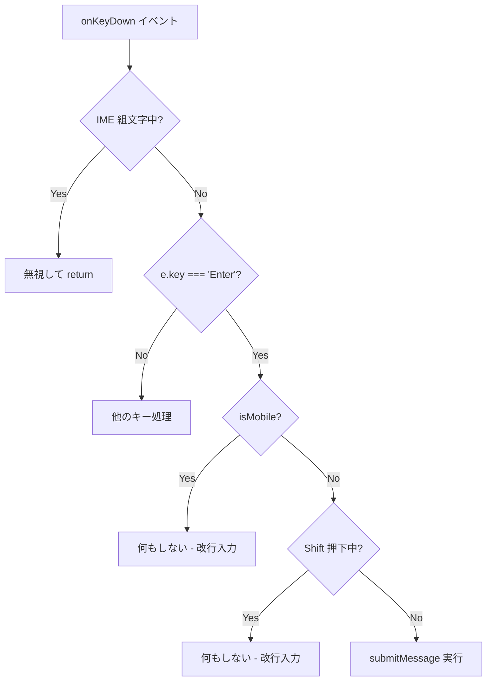

# 設計方針書: Issue #20 スマホ利用時決定キーで改行

## 概要

| 項目 | 内容 |
|------|------|
| **Issue** | #20 |
| **タイトル** | スマホ利用時決定キーでチャット送信ではなく改行したい |
| **作成日** | 2026-01-10 |
| **ステータス** | Draft |

### 要件サマリ

スマートフォンの仮想キーボードでEnter（決定）キーを押した際に、メッセージが送信されてしまう現状を改善し、**改行が入力される**ようにする。送信は専用の送信ボタンで行う。

---

## 1. 現状分析

### 1.1 現在の動作

| デバイス | Enter キー | Shift+Enter | 送信方法 |
|---------|-----------|-------------|---------|
| デスクトップ | 送信 | 改行 | Enter または送信ボタン |
| モバイル | 送信 | 改行 | Enter または送信ボタン |

### 1.2 問題点

1. **モバイルでのShift+Enter操作が困難**
   - 仮想キーボードではShiftキーとEnterキーの同時押しが手間
   - 多くのユーザーはShift+Enterを知らない

2. **誤送信リスク**
   - 改行したいだけで意図せず送信してしまう
   - 長文入力時に特に問題

3. **モバイルUIの標準慣例との乖離**
   - LINE、Slack等の主要アプリはモバイルで「送信ボタン」方式を採用
   - ユーザー期待との不一致

### 1.3 関連コンポーネント

```
src/
├── components/
│   └── worktree/
│       └── MessageInput.tsx    ← 主要変更対象
├── hooks/
│   ├── useIsMobile.ts          ← 既存（利用）
│   └── useVirtualKeyboard.ts   ← 既存（参考）
```

---

## 2. 設計方針

### 2.1 基本方針

**デバイス別にEnterキーの動作を分岐する**

| デバイス | Enter キー | Shift+Enter | 送信方法 |
|---------|-----------|-------------|---------|
| デスクトップ | 送信（現状維持） | 改行 | Enter |
| モバイル | **改行（変更）** | 改行 | 送信ボタンのみ |

### 2.2 設計原則

1. **最小限の変更**
   - 既存のIME対応ロジックを維持
   - `useIsMobile` フックを再利用

2. **段階的な拡張性**
   - 将来的に設定画面での切り替え対応を考慮
   - タブレット+物理キーボード対応の余地を残す

3. **UXの一貫性**
   - モバイルでは送信ボタンを視覚的に強調
   - プレースホルダーテキストをデバイス別に最適化

---

## 3. アーキテクチャ設計

### 3.1 処理フロー



### 3.2 コンポーネント設計

#### MessageInput コンポーネントの変更

```typescript
// src/components/worktree/MessageInput.tsx

const handleKeyDown = (e: React.KeyboardEvent<HTMLTextAreaElement>) => {
  // IME composition check (既存ロジック維持)
  const { keyCode } = e.nativeEvent;
  if (keyCode === 229) {
    return;
  }

  // Escape handling (既存ロジック維持)
  if (e.key === 'Escape' && showCommandSelector) {
    e.preventDefault();
    handleCommandCancel();
    return;
  }

  // IME composition end handling (既存ロジック維持)
  if (justFinishedComposingRef.current && e.key === 'Enter') {
    justFinishedComposingRef.current = false;
    return;
  }

  // Enter key handling - デバイス別分岐
  if (e.key === 'Enter' && !isComposing && !showCommandSelector) {
    if (isMobile) {
      // モバイル: Enterで改行（デフォルト動作を許可）
      // 送信は送信ボタンでのみ行う
      return;
    }

    // デスクトップ: Shift+Enterで改行、Enterのみで送信
    if (!e.shiftKey) {
      e.preventDefault();
      void submitMessage();
    }
  }
};
```

### 3.3 UI/UX 設計

#### プレースホルダーテキスト

| デバイス | プレースホルダー |
|---------|----------------|
| デスクトップ | `"Type your message... (/ for commands, Shift+Enter for line break)"` |
| モバイル | `"Type your message..."` |

※ モバイルでは「Shift+Enter」の説明を省略（不要なため）

#### 送信ボタンの視認性

現在の送信ボタンは十分に視認性があるため、特別な変更は不要。

```tsx
<button
  type="submit"
  disabled={!message.trim() || sending}
  className="flex-shrink-0 p-2 text-blue-600 hover:bg-blue-50 rounded-full transition-colors disabled:text-gray-300"
>
  {/* 送信アイコン */}
</button>
```

---

## 4. データモデル

本機能はUI動作の変更のみであり、データモデルへの変更は不要。

---

## 5. API設計

本機能はクライアントサイドの動作変更のみであり、API変更は不要。

---

## 6. 技術的考慮事項

### 6.1 IME対応の維持

日本語入力（IME）での誤送信防止は重要機能であり、以下のロジックを維持する：

```typescript
// 1. keyCode 229 チェック（IME組文字中）
if (keyCode === 229) {
  return;
}

// 2. composition イベント監視
const [isComposing, setIsComposing] = useState(false);
const handleCompositionStart = () => setIsComposing(true);
const handleCompositionEnd = () => {
  setIsComposing(false);
  justFinishedComposingRef.current = true;
  setTimeout(() => {
    justFinishedComposingRef.current = false;
  }, 300);
};

// 3. 組文字終了直後のEnterキー無視
if (justFinishedComposingRef.current && e.key === 'Enter') {
  justFinishedComposingRef.current = false;
  return;
}
```

### 6.2 デバイス判定

既存の `useIsMobile` フックを使用：

```typescript
// src/hooks/useIsMobile.ts
export function useIsMobile() {
  const [isMobile, setIsMobile] = useState(false);

  useEffect(() => {
    const checkMobile = () => setIsMobile(window.innerWidth < 768);
    checkMobile();
    window.addEventListener('resize', checkMobile);
    return () => window.removeEventListener('resize', checkMobile);
  }, []);

  return isMobile;
}
```

### 6.3 将来の拡張性

#### 設定による切り替え（将来対応）

```typescript
// 将来的な設定オプション
interface InputSettings {
  mobileEnterBehavior: 'send' | 'newline';
}

// 設定に応じた動作切り替え
const shouldSendOnEnter = isMobile
  ? settings.mobileEnterBehavior === 'send'
  : !e.shiftKey;
```

#### タブレット+物理キーボード対応（将来対応）

```typescript
// 仮想キーボード検出との組み合わせ
const { isKeyboardVisible } = useVirtualKeyboard();
const shouldUseMobileBehavior = isMobile && isKeyboardVisible;
```

---

## 7. セキュリティ設計

本機能はUI動作の変更のみであり、セキュリティ上の考慮事項はなし。

---

## 8. パフォーマンス設計

### 8.1 影響評価

- キーイベントハンドラ内の条件分岐追加のみ
- パフォーマンスへの影響は無視できるレベル

### 8.2 最適化

特別な最適化は不要。既存の実装パターンを踏襲。

---

## 9. テスト戦略

### 9.1 ユニットテスト

```typescript
// src/components/worktree/__tests__/MessageInput.test.tsx

describe('MessageInput - Enter key behavior', () => {
  describe('Desktop (isMobile = false)', () => {
    it('should submit message on Enter key', async () => {
      // Arrange
      mockUseIsMobile.mockReturnValue(false);
      render(<MessageInput {...defaultProps} />);

      // Act
      const textarea = screen.getByRole('textbox');
      await userEvent.type(textarea, 'test message');
      await userEvent.keyboard('{Enter}');

      // Assert
      expect(mockOnMessageSent).toHaveBeenCalled();
    });

    it('should insert newline on Shift+Enter', async () => {
      // Arrange
      mockUseIsMobile.mockReturnValue(false);
      render(<MessageInput {...defaultProps} />);

      // Act
      const textarea = screen.getByRole('textbox');
      await userEvent.type(textarea, 'line1{Shift>}{Enter}{/Shift}line2');

      // Assert
      expect(textarea).toHaveValue('line1\nline2');
      expect(mockOnMessageSent).not.toHaveBeenCalled();
    });
  });

  describe('Mobile (isMobile = true)', () => {
    it('should insert newline on Enter key', async () => {
      // Arrange
      mockUseIsMobile.mockReturnValue(true);
      render(<MessageInput {...defaultProps} />);

      // Act
      const textarea = screen.getByRole('textbox');
      await userEvent.type(textarea, 'line1{Enter}line2');

      // Assert
      expect(textarea).toHaveValue('line1\nline2');
      expect(mockOnMessageSent).not.toHaveBeenCalled();
    });

    it('should submit message on send button click', async () => {
      // Arrange
      mockUseIsMobile.mockReturnValue(true);
      render(<MessageInput {...defaultProps} />);

      // Act
      const textarea = screen.getByRole('textbox');
      await userEvent.type(textarea, 'test message');
      const sendButton = screen.getByRole('button', { name: /send/i });
      await userEvent.click(sendButton);

      // Assert
      expect(mockOnMessageSent).toHaveBeenCalled();
    });
  });
});
```

### 9.2 E2Eテスト

```typescript
// e2e/mobile-enter-key.spec.ts

import { test, expect, devices } from '@playwright/test';

test.describe('Mobile Enter Key Behavior', () => {
  test.use({ ...devices['iPhone 13'] });

  test('Enter key should insert newline on mobile', async ({ page }) => {
    await page.goto('/worktree/1');

    const textarea = page.getByRole('textbox');
    await textarea.fill('First line');
    await textarea.press('Enter');
    await textarea.type('Second line');

    await expect(textarea).toHaveValue('First line\nSecond line');
  });

  test('Send button should submit message on mobile', async ({ page }) => {
    await page.goto('/worktree/1');

    const textarea = page.getByRole('textbox');
    await textarea.fill('Test message');

    const sendButton = page.getByRole('button', { name: /send/i });
    await sendButton.click();

    // メッセージがリストに追加されることを確認
    await expect(page.getByText('Test message')).toBeVisible();
  });
});
```

---

## 10. 設計上の決定事項とトレードオフ

### 10.1 採用した設計

| 決定事項 | 理由 | トレードオフ |
|---------|------|-------------|
| デバイス幅による判定 (768px) | 既存インフラの再利用、シンプル | タブレットの判定が曖昧 |
| モバイルでEnter=改行固定 | ユーザー期待との一致 | 一部ユーザーの習慣変更 |
| 設定オプション未実装 | YAGNI原則、初期リリースの簡潔化 | カスタマイズ性の欠如 |

### 10.2 代替案との比較

#### 代替案1: 設定画面での切り替え

```
メリット:
- ユーザーが好みの動作を選択可能
- 既存ユーザーへの影響を最小化

デメリット:
- 実装工数の増加
- 設定UIの複雑化
- 大多数のユーザーには不要な機能
```

**判断**: 初期リリースでは見送り。ユーザーフィードバックに応じて将来対応。

#### 代替案2: 仮想キーボード検出による動的切り替え

```
メリット:
- iPad + 物理キーボード時にデスクトップ動作
- より正確なデバイス状態判定

デメリット:
- visualViewport API の信頼性にばらつき
- 実装複雑度の増加
- エッジケースの増加
```

**判断**: 既存フックは保持するが、初期リリースでは幅ベース判定のみ使用。

#### 代替案3: 長押しで送信

```
メリット:
- 誤送信防止
- デバイス統一の動作

デメリット:
- 非標準的なUI
- ユーザー学習コスト
- アクセシビリティ懸念
```

**判断**: 却下。標準的なUI慣例から逸脱しすぎる。

---

## 11. 実装計画

### 11.1 変更ファイル一覧

| ファイル | 変更内容 | 優先度 |
|---------|--------|--------|
| `src/components/worktree/MessageInput.tsx` | handleKeyDown の条件分岐追加 | 必須 |
| `src/components/worktree/__tests__/MessageInput.test.tsx` | ユニットテスト追加 | 必須 |
| `e2e/mobile-enter-key.spec.ts` | E2Eテスト追加 | 推奨 |

### 11.2 実装ステップ

1. **MessageInput.tsx の handleKeyDown 修正**
   - isMobile 条件分岐の追加
   - IME対応ロジックの維持確認

2. **ユニットテストの追加**
   - デスクトップ動作のテスト
   - モバイル動作のテスト
   - IME対応のテスト

3. **E2Eテストの追加**
   - モバイルエミュレーションでのテスト

4. **手動テスト**
   - 実機（iOS/Android）での動作確認
   - Chrome DevToolsのモバイルエミュレーションでの確認

---

## 12. リスク評価

| リスク | 影響度 | 発生確率 | 対策 |
|-------|--------|---------|------|
| IME対応の破損 | 高 | 低 | 既存テストの維持、手動テスト |
| ユーザー混乱 | 中 | 低 | プレースホルダーでの説明 |
| タブレット判定の曖昧さ | 低 | 中 | 将来的に設定オプション追加 |

---

## 13. まとめ

### 設計方針サマリ

1. **シンプルな条件分岐**で実装
   - `useIsMobile` フックによるデバイス判定
   - handleKeyDown 内での早期return

2. **既存ロジックの維持**
   - IME対応は完全に維持
   - 送信ボタン動作は変更なし

3. **段階的な拡張性**
   - 設定オプション追加の余地を残す
   - 仮想キーボード検出との統合可能

### 承認依頼事項

- [ ] 基本方針（モバイルでEnter=改行）の承認
- [ ] 設定オプション未実装の承認
- [ ] テスト戦略の承認

---

## 付録: 参考コード

### 現在のhandleKeyDown実装（変更前）

```typescript
// src/components/worktree/MessageInput.tsx (行 148-176)
const handleKeyDown = (e: React.KeyboardEvent<HTMLTextAreaElement>) => {
  const { keyCode } = e.nativeEvent;
  if (keyCode === 229) {
    return;
  }

  if (e.key === 'Escape' && showCommandSelector) {
    e.preventDefault();
    handleCommandCancel();
    return;
  }

  if (justFinishedComposingRef.current && e.key === 'Enter') {
    justFinishedComposingRef.current = false;
    return;
  }

  if (e.key === 'Enter' && !e.shiftKey && !isComposing && !showCommandSelector) {
    e.preventDefault();
    void submitMessage();
  }
};
```

### 変更後のhandleKeyDown実装

```typescript
const handleKeyDown = (e: React.KeyboardEvent<HTMLTextAreaElement>) => {
  const { keyCode } = e.nativeEvent;
  if (keyCode === 229) {
    return;
  }

  if (e.key === 'Escape' && showCommandSelector) {
    e.preventDefault();
    handleCommandCancel();
    return;
  }

  if (justFinishedComposingRef.current && e.key === 'Enter') {
    justFinishedComposingRef.current = false;
    return;
  }

  // Enter key handling with device-specific behavior
  if (e.key === 'Enter' && !isComposing && !showCommandSelector) {
    if (isMobile) {
      // Mobile: Enter inserts newline (default behavior)
      // Submit only via send button
      return;
    }

    // Desktop: Enter submits, Shift+Enter inserts newline
    if (!e.shiftKey) {
      e.preventDefault();
      void submitMessage();
    }
  }
};
```
