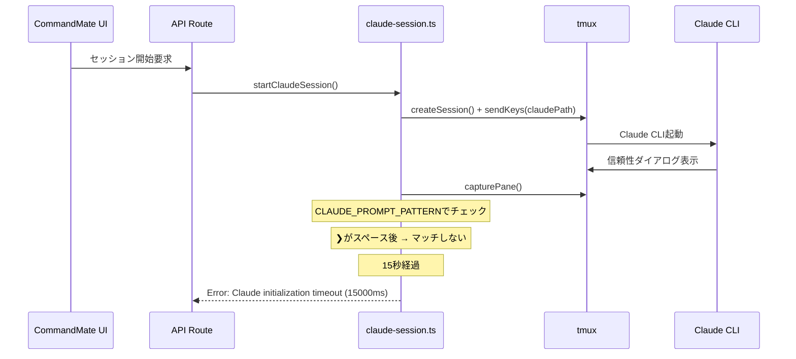
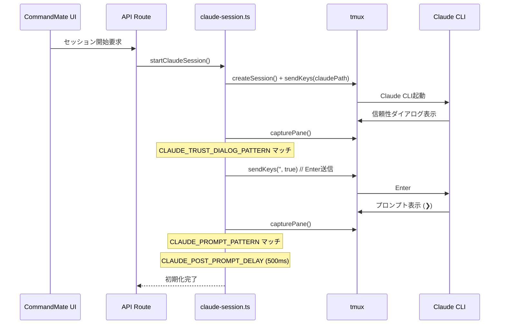
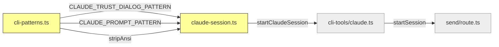

# Issue #201: 信頼性確認ダイアログ自動応答 - 設計方針書

## 概要

Claude CLI v2.xが初回アクセスのワークスペースで表示する「Quick safety check」ダイアログに対し、`startClaudeSession()`が自動でEnterを送信して応答する機能を追加する。

## 問題の背景

### 現在の動作



### 修正後の動作



## アーキテクチャ設計

### レイヤー構成

本修正は既存のアーキテクチャ内で完結し、新規レイヤーの追加は不要。

```
変更対象レイヤー:
├─ ビジネスロジック層 (src/lib/)
│   ├─ cli-patterns.ts    ← パターン定数追加
│   └─ claude-session.ts  ← 初期化ポーリングループ修正
└─ テスト層 (tests/, src/lib/__tests__/)
    ├─ claude-session.test.ts   ← ダイアログ応答テスト追加
    └─ cli-patterns.test.ts     ← パターンマッチテスト追加
```

### 変更範囲



黄色: 変更対象、灰色: 間接影響（変更不要）

## 設計パターン

### 既存パターンの踏襲

本修正は既存の初期化ポーリングループに条件分岐を追加するのみであり、新規の設計パターン導入は不要。以下の既存パターンに準拠する。

#### 1. パターン定数の外部化（DRY-001）

`cli-patterns.ts`にパターン定数を集約し、`claude-session.ts`からインポートする既存パターンに従う。

```typescript
// cli-patterns.ts - 既存パターンと同じ場所に追加
// 意図的に行頭アンカー(^)なしの部分一致:
// tmux出力バッファではダイアログテキストが行頭以外の位置に出現する可能性がある。
// CLAUDE_PROMPT_PATTERN等は行頭アンカー付きだが、ダイアログ検出は部分一致が必要。
// (SF-001: アンカリング方針の違いをインラインコメントで明示)
export const CLAUDE_TRUST_DIALOG_PATTERN = /Yes, I trust this folder/m;
```

**設計根拠**:
- `CLAUDE_PROMPT_PATTERN`、`CLAUDE_THINKING_PATTERN`等と同じ管理単位
- テスト容易性（パターン単体でのテストが可能）
- 将来のパターン変更時に1箇所修正で済む
- **SF-001**: 行頭アンカー(`^`)を意図的に使用しない（部分一致）。他のパターン定数（`CLAUDE_PROMPT_PATTERN`、`CLAUDE_SEPARATOR_PATTERN`等）は行頭アンカー付きだが、本パターンはtmux出力バッファ内の任意位置でマッチする必要があるため。この設計判断をコード内のインラインコメント（JSDocまたは行コメント）で明示すること

#### 2. ポーリングループ内のフラグベースガード

```typescript
// claude-session.ts - startClaudeSession()内
let trustDialogHandled = false;

while (Date.now() - startTime < maxWaitTime) {
  // ... capturePane ...
  if (CLAUDE_PROMPT_PATTERN.test(cleanOutput)) {
    // 既存: プロンプト検出 → 初期化完了
    break;
  }
  if (!trustDialogHandled && CLAUDE_TRUST_DIALOG_PATTERN.test(cleanOutput)) {
    // 新規: ダイアログ検出 → Enter送信（1回のみ）
    await sendKeys(sessionName, '', true);
    trustDialogHandled = true;
    console.log('Trust dialog detected, sending Enter to confirm');
    // ポーリング継続（プロンプト検出を待つ）
  }
  // ... 次のポーリングへ ...
}
```

**設計根拠**:
- **二重送信防止**: `trustDialogHandled`フラグにより、ダイアログがバッファに残存している間（300msポーリング間隔）の再送信を防止
- **スコープ**: フラグは`startClaudeSession()`関数内・ポーリングループ外で宣言。セッション間の状態リーク防止
- **条件分岐の順序**: `CLAUDE_PROMPT_PATTERN`チェックを先に実行。ダイアログ応答後の正常フローでは最短パスで初期化完了
- **OCP準拠**: 既存の条件分岐を変更せず、新しい条件を追加する形式

## セキュリティ設計

### 脅威分析

| 脅威 | 対策 | リスク |
|------|------|--------|
| 信頼性ダイアログの誤検出 | パターンが英語の固定文字列「Yes, I trust this folder」に限定 | 低 |
| ダイアログ以外への誤応答 | Enter送信のみ（コマンド文字列なし）、1回限定 | 低 |
| ログへの機密情報漏洩 | ログ出力は固定メッセージのみ（パス・ユーザー入力を含めない） | 低 |
| 部分一致による敵対的バッファ内容の誤検出（Stage4-C-001） | 初期化フェーズのみ・固定英語フレーズ・trustDialogHandledフラグ・Enter送信のみ（コマンドなし） | 極低（理論的リスク） |
| ログメッセージ情報漏洩（Stage4-C-002） | 固定文字列ログ（SEC-003準拠）。sessionNameはSESSION_NAME_PATTERNで`[a-zA-Z0-9_-]+`に検証済み | 低 |

### セキュリティ判断

**自動応答の正当性**: CommandMateでセッション開始する時点で、ユーザーはUIでworktreeを明示的に選択しており、そのワークスペースで作業する意図がある。デフォルトで「Yes, I trust this folder」が選択済みのため、Enter送信は安全である。

### OWASP Top 10チェックリスト（Stage 4セキュリティレビュー）

| OWASP カテゴリ | ステータス | 詳細 |
|---------------|-----------|------|
| A01: Broken Access Control | not_applicable | 本変更はstartClaudeSession()内で動作し、既存の認証済みAPIルートチェーン（POST /api/worktrees/:id/send）を経由。新規アクセス制御パスの導入なし |
| A02: Cryptographic Failures | not_applicable | 暗号化操作なし。秘密情報・トークン・暗号化データの処理なし |
| A03: Injection | pass | 自動応答は空文字列+Enter（`sendKeys(sessionName, '', true)`）。sessionNameはSESSION_NAME_PATTERN(`/^[a-zA-Z0-9_-]+$/`)で検証済み。sendKeysはシングルクォートエスケープ済み。keysが空文字列のためシェルインジェクションベクターなし |
| A04: Insecure Design | pass | ダイアログ応答はEnter1回のみ、trustDialogHandledフラグで再実行防止。ユーザーがUIでworktreeを選択した時点でワークスペース信頼の意図が確立されており、冗長な確認ステップの除去に過ぎない |
| A05: Security Misconfiguration | pass | 新規設定サーフェスなし。新規環境変数・設定ファイル・設定値の導入なし。CLAUDE_INIT_TIMEOUT（15s）は共有だが不変 |
| A06: Vulnerable and Outdated Components | not_applicable | 新規依存パッケージなし。既存モジュール（cli-patterns.ts, tmux.ts）とNode.js組み込み機能のみ使用 |
| A07: Identification and Authentication Failures | not_applicable | 認証・セッション管理の変更なし。trust dialogへの応答はtmuxレベルのキーボード入力であり認証メカニズムではない |
| A08: Software and Data Integrity Failures | pass | CLAUDE_TRUST_DIALOG_PATTERNはコンパイル時定数。外部入力や設定からの派生なし。デシリアライゼーション・外部データ処理なし |
| A09: Security Logging and Monitoring Failures | pass | ダイアログ検出ログは固定文字列（SEC-003準拠）。ユーザー入力・動的コンテンツを含めないためログインジェクション防止。既存セッション初期化ログ（L347, L361）のsessionNameは検証済み英数字 |
| A10: Server-Side Request Forgery | not_applicable | 外部URLへのサーバーサイドリクエストなし。ローカルtmuxセッション管理内で完結 |

### セキュリティ分析詳細（Stage 4セキュリティレビュー）

**攻撃面の変化**: 最小限。ポーリングサイクルあたり1回のregex test（CLAUDE_TRUST_DIALOG_PATTERN.test()）と条件付きで1回のsendKeys()呼び出しが追加。新規APIエンドポイント、ネットワーク接続、ユーザー向け入力の追加なし。攻撃面はClaude CLI初期化の狭いウィンドウにおけるtmuxセッションバッファ内容に限定。

**入力検証**: 十分。sendKeys()で使用されるsessionNameはworktreeIdから構成されSESSION_NAME_PATTERNで検証済み。CLAUDE_TRUST_DIALOG_PATTERNはコンパイル時定数。sendKeysパラメータは空文字列（ユーザー入力なし）。新規外部入力の導入なし。

**セキュリティ境界**: 維持。CommandMateとClaude CLI間の信頼境界は維持。自動応答はEnterキー押下のみ（デフォルト選択の承認、任意コマンドではない）。trustDialogHandledフラグによりセッション初期化あたり最大1回に制限。Claude CLIのセキュリティモデルをバイパスしない。

**Auto-Yesとの相互作用**: 安全。startClaudeSession()内のtrust dialog応答とauto-yes-manager.tsのAuto-Yesポーリングはライフサイクルフェーズが重複しない。Trust dialog処理は初期化中（startClaudeSession()の戻り前）に発生。Auto-Yesポーリングはセッション初期化後かつユーザーがauto-yesモードを有効化した後にのみ開始。

**正規表現セキュリティ**: 安全。`/Yes, I trust this folder/m`は量指定子・選択・バックトラッキング起因構造のない単純固定文字列マッチ。ReDoS脆弱性なし。

**競合状態分析**: 安全。trustDialogHandledフラグはstartClaudeSession()内のローカル変数であり、単一イベントループ内で逐次実行されるasync関数。並行アクセスなし。ポーリングループは逐次的（capturePane -> pattern test -> sendKeys -> 次のイテレーション）。

### リスク評価（Stage 4セキュリティレビュー）

| 観点 | リスク |
|------|--------|
| 技術的リスク | low |
| セキュリティリスク | low |
| 運用リスク | low |

## テスト設計

### テスト対象

#### 1. パターンテスト（`src/lib/__tests__/cli-patterns.test.ts`）

| テストケース | 期待値 | 目的 |
|-------------|--------|------|
| 信頼性ダイアログ全文テキスト | マッチ | 正常系 |
| 前後にtmux出力が付加された場合 | マッチ | 部分一致 |
| `No, exit` | 非マッチ | 類似文字列の除外 |
| 通常のCLI出力 | 非マッチ | 誤検出防止 |

#### 2. セッション初期化テスト（`tests/unit/lib/claude-session.test.ts`）

| テストケース | 期待値 | 目的 |
|-------------|--------|------|
| ダイアログ検出時にEnter送信 | sendKeys('', true)が1回呼ばれる | 正常系 |
| Enter送信後にプロンプト検出で初期化完了 | resolves | 正常フロー |
| 二重送信防止 | sendKeysが1回のみ | ガード条件検証 |
| ダイアログなしの既存フロー | 変更なし | 回帰テスト |

### テスト手法

既存テストの`vi.useFakeTimers()`と`vi.mocked(capturePane)`パターンを踏襲。

```typescript
// テスト戦略: capturePaneのモック応答を段階的に変更
// 1回目: ダイアログ表示中のバッファ
// 2回目: Enter送信後もダイアログ残存（二重送信テスト用）
// 3回目: プロンプト表示
```

### 将来検討: 結合テスト（Stage3-C-001）

現時点では単体テスト（`claude-session.test.ts`、`cli-patterns.test.ts`）でコアロジックのカバレッジは十分である。以下の結合テストは将来のフォローアップまたは別Issueで検討する。

| テストケース | テストファイル | 目的 |
|-------------|-------------|------|
| POST /api/worktrees/:id/send でtrust dialogシナリオ | `tests/integration/api-send-cli-tool.test.ts`（既存）または新規 | send/route.ts -> ClaudeTool.startSession() -> startClaudeSession()のフル呼び出しチェーン検証 |

**実装イメージ**: `capturePane`をモックして初回呼び出しでtrust dialogテキストを返し、APIルート経由でセッション初期化が正常完了することを検証する。

## 設計上の決定事項とトレードオフ

### 採用した設計

| 決定事項 | 理由 | トレードオフ |
|---------|------|-------------|
| パターン文字列マッチ | シンプル、既存パターンと統一 | Claude CLIのUI変更で動作しなくなる可能性 |
| `trustDialogHandled`フラグ | 単純で確実な二重送信防止 | ダイアログが複数種類に増えた場合の拡張性（C-001: 現時点ではYAGNI原則に従い維持。複数ダイアログ対応が必要になった時点でダイアログハンドラーの配列化を検討） |
| `startClaudeSession()`のみ修正 | 影響範囲の最小化 | `sendMessageToClaude()`での検出は未対応（不要と判断） |
| `console.log`（infoレベル） | 既存のclaude-session.ts内のログ出力方式と統一 | 構造化ログではない（cli-patterns.tsはcreateLoggerを使用しており方式が混在）。SF-002: 将来のログ構造化統一は別Issueで対応検討。TODOコメントを残すこと |

### 代替案との比較

| 案 | メリット | デメリット | 判定 |
|---|---------|----------|------|
| A: ポーリングループ内でEnter送信（採用） | シンプル、既存フローに自然に統合 | Claude CLIの文言変更に弱い | ✅ 採用 |
| B: `claude --trust-workspace`フラグ | Claude CLI側で完結 | フラグが存在しない | ❌ |
| C: settings.json事前設定 | ダイアログ自体を回避 | CLI内部形式に依存、互換性リスク高 | ❌ |
| D: UI通知＋手動操作 | ユーザー判断を尊重 | tmux経由で操作不可、UX悪化 | ❌ |

## 前提条件と制約

### 前提条件

1. **Claude CLI言語**: 英語UIのみ。多言語対応時は別Issueでパターン更新
2. **ダイアログ形式**: 「Yes, I trust this folder」が❯インジケータ付きでデフォルト選択済み
3. **ワークスペース信頼**: ユーザーがUIでworktreeを選択した時点で、そのワークスペースでの作業意図がある

### 後方互換性

- `CLAUDE_TRUST_DIALOG_PATTERN`はダイアログ非表示時にマッチしない → 既存動作に影響なし
- 関数シグネチャの変更なし
- 新規export追加のみ（`CLAUDE_TRUST_DIALOG_PATTERN`）

### 制約

- **タイムアウト共有**: ダイアログ応答と通常のプロンプト待機は同一の`CLAUDE_INIT_TIMEOUT`（15秒）を共有。ダイアログ応答にN秒消費した場合、残り(15-N)秒でプロンプト検出まで到達する必要がある。実測ではダイアログ応答は300ms（ポーリング間隔）+Enter送信で1秒未満のため十分なマージンがある（C-002: `CLAUDE_INIT_TIMEOUT`定数のJSDocにダイアログ応答分の消費について注記すること。将来タイムアウト値を短縮する場合はこの制約を考慮する必要がある）
- **ポーリング間隔**: 300ms（`CLAUDE_INIT_POLL_INTERVAL`）。ダイアログ検出からEnter送信まで最大300msの遅延

## 実装ガイドライン

### コーディング規約

1. **パターン定数名**: `CLAUDE_TRUST_DIALOG_PATTERN`（既存の`CLAUDE_*_PATTERN`命名に準拠）
2. **フラグ変数名**: `trustDialogHandled`（boolean、初期値`false`）
3. **ログメッセージ**: 固定文字列、パス・ユーザー入力を含めない。`console.log`を使用（既存のclaude-session.ts内ログと統一）。SF-002: ログ方式の統一は別Issueで対応検討する旨のTODOコメントを残すこと
4. **条件分岐の順序**: CLAUDE_PROMPT_PATTERN → CLAUDE_TRUST_DIALOG_PATTERN（プロンプト検出を優先）
5. **SF-001**: `CLAUDE_TRUST_DIALOG_PATTERN`定数の直上にインラインコメントで「意図的に行頭アンカーなし（部分一致）」の理由を記載すること
6. **C-002 / Stage2-SF-001**: `CLAUDE_INIT_TIMEOUT`定数のJSDoc（claude-session.ts L39-49付近）に以下の英語注記を追加すること: 「This timeout also covers trust dialog auto-response time (typically <1s). When reducing this value, consider dialog response overhead.」。Stage 2整合性レビューで、設計チェックリストに記載されているが実装コード側に未反映であることが確認された。実装フェーズで確実に反映すること

### SOLID原則への準拠

- **SRP**: `cli-patterns.ts`はパターン定義、`claude-session.ts`はセッション管理の責務を維持
- **OCP**: 既存条件分岐を変更せず、新条件を追加
- **DRY**: パターン定数を`cli-patterns.ts`に集約
- **KISS**: フラグベースの二重送信防止（最小限の実装）
- **YAGNI**: 将来の多言語対応・複数ダイアログ対応は含めない

## 変更ファイル一覧

| ファイル | 変更種別 | 変更内容 |
|---------|---------|---------|
| `src/lib/cli-patterns.ts` | 追加 | `CLAUDE_TRUST_DIALOG_PATTERN`定数（約3行） |
| `src/lib/claude-session.ts` | 修正 | ポーリングループにダイアログ検出・自動応答ロジック（約15行） |
| `tests/unit/lib/claude-session.test.ts` | 追加 | ダイアログ関連テスト3件（約50行） |
| `src/lib/__tests__/cli-patterns.test.ts` | 追加 | パターンマッチテスト3-4件（約20行） |
| `CLAUDE.md` | 更新 | 「最近の実装機能」にIssue #201概要追記（約15行） |

## 影響分析（Stage 3レビュー結果）

### リスク評価

| 観点 | リスク |
|------|--------|
| 技術的リスク | low |
| セキュリティリスク | low |
| 運用リスク | low |

### 間接影響ファイル（変更不要）

以下のファイルは`cli-patterns.ts`または`claude-session.ts`からインポートしているが、本修正の影響を受けない。

| ファイル | 理由 |
|---------|------|
| `src/lib/cli-tools/claude.ts` | startClaudeSession()呼び出し元。関数シグネチャ不変のため変更不要 |
| `src/app/api/worktrees/[id]/send/route.ts` | cliTool.startSession()呼び出し元。ダイアログ自動応答は透過的 |
| `src/lib/status-detector.ts` | cli-patterns.tsの変更対象外関数のみ使用 |
| `src/lib/auto-yes-manager.ts` | セッション初期化後のみ動作。ダイアログに遭遇しない |
| `src/lib/response-poller.ts` | メッセージ送信後のみ動作。初期化ダイアログに遭遇しない |
| `src/lib/assistant-response-saver.ts` | stripAnsiのみインポート。セッション初期化と無関係 |
| `src/lib/claude-poller.ts` | レガシーポーラー。captureClaudeOutput/isClaudeRunningをインポートするが両関数は未変更（Stage3-C-002） |
| `src/lib/tmux.ts` | sendKeys()/capturePane()提供元。既存APIをそのまま消費 |
| `src/app/api/worktrees/[id]/prompt-response/route.ts` | アクティブセッション操作のみ |
| `src/app/api/worktrees/[id]/current-output/route.ts` | アクティブセッション読取のみ |

### 影響なし確認領域

| 領域 | 根拠 |
|------|------|
| データベーススキーマ | DBへの変更なし。ダイアログ処理はランタイムのみ |
| APIコントラクト | エンドポイントシグネチャ、リクエスト/レスポンス形式、HTTPステータスコード変更なし |
| UIコンポーネント | UI変更なし。ダイアログ自動応答はフロントエンドに対して透過的 |
| 設定/環境変数 | 新規環境変数や設定値の導入なし。CLAUDE_INIT_TIMEOUT（15s）は不変 |
| ビルド/CIパイプライン | ビルド設定変更なし。既存パイプラインで対応可能 |
| Codex/Gemini CLIツール | trust dialog検出はClaude CLI固有。Codex/Geminiは別セッション管理パスを使用 |

### 回帰リスク分析

| 既存フロー | リスク | 根拠 |
|-----------|--------|------|
| ダイアログなし通常初期化 | none | CLAUDE_TRUST_DIALOG_PATTERN.test()がfalseを返し、フラグは読まれない |
| タイムアウト（プロンプト未検出） | none | 追加のregex testに副作用なし。タイムアウトパスは不変 |
| sendMessageToClaude() | none | 完全に未変更。ダイアログは初期化時のみ表示 |
| waitForPrompt() | none | 完全に未変更。CLAUDE_PROMPT_PATTERNのみ使用 |
| restartClaudeSession() | none | 修正後のstartClaudeSession()は再起動時にもダイアログを正しく処理 |

## 実装チェックリスト

### 必須実装項目

- [ ] `src/lib/cli-patterns.ts`: `CLAUDE_TRUST_DIALOG_PATTERN`定数を追加
- [ ] `src/lib/cli-patterns.ts`: パターン定数の直上に「意図的にアンカーなし（部分一致）」のインラインコメントを記載（SF-001）
- [ ] `src/lib/claude-session.ts`: `startClaudeSession()`ポーリングループにダイアログ検出・Enter自動送信ロジックを追加
- [ ] `src/lib/claude-session.ts`: `trustDialogHandled`フラグによる二重送信防止
- [ ] `src/lib/claude-session.ts`: ログ出力は`console.log`で固定文字列のみ
- [ ] `src/lib/claude-session.ts`: 条件分岐の順序はCLAUDE_PROMPT_PATTERN（先）→ CLAUDE_TRUST_DIALOG_PATTERN（後）
- [ ] `tests/unit/lib/claude-session.test.ts`: ダイアログ検出時Enter送信テスト
- [ ] `tests/unit/lib/claude-session.test.ts`: 二重送信防止テスト
- [ ] `tests/unit/lib/claude-session.test.ts`: ダイアログなし既存フロー回帰テスト
- [ ] `src/lib/__tests__/cli-patterns.test.ts`: パターンマッチテスト（正常系・部分一致・非マッチ）

### レビュー指摘対応項目

- [ ] SF-001: `CLAUDE_TRUST_DIALOG_PATTERN`のインラインコメントに「他のパターン定数（CLAUDE_PROMPT_PATTERN等）は行頭アンカー付きだが、本パターンはtmux出力バッファ内の任意位置でマッチする必要があるため意図的に部分一致」を明記
- [ ] SF-002: ダイアログ検出ログ出力箇所の近くに`// TODO: ログ出力方式の統一（console.log vs createLogger）は別Issueで対応検討`コメントを追加
- [ ] C-002 / Stage2-SF-001: `CLAUDE_INIT_TIMEOUT`定数のJSDoc（claude-session.ts L39-49）に以下の注記を追加すること: 「This timeout also covers trust dialog auto-response time (typically <1s). When reducing this value, consider dialog response overhead.」（Stage 2整合性レビューで実装時の未反映リスクとして再指摘）

### 品質チェック

- [ ] `npm run lint` パス
- [ ] `npx tsc --noEmit` パス
- [ ] `npm run test:unit` パス
- [ ] `npm run build` パス

## レビュー履歴

| 日付 | ステージ | レビュー種別 | スコア | ステータス |
|------|---------|-------------|--------|-----------|
| 2026-02-09 | Stage 1 | 設計原則レビュー | 5 | approved |
| 2026-02-09 | Stage 2 | 整合性レビュー | 5 | approved |
| 2026-02-09 | Stage 3 | 影響分析レビュー | 5 | approved |
| 2026-02-09 | Stage 4 | セキュリティレビュー | 5 | approved |

## レビュー指摘事項サマリー

### Stage 1: 設計原則レビュー（2026-02-09）

**総合評価**: approved (スコア: 5)
**Must Fix**: 0件 / **Should Fix**: 2件 / **Consider**: 2件

| ID | 分類 | タイトル | 重要度 | 原則 | 対応状況 |
|----|------|---------|--------|------|---------|
| SF-001 | Should Fix | CLAUDE_TRUST_DIALOG_PATTERN正規表現のアンカリング統一 | low | KISS | 設計書に反映済み |
| SF-002 | Should Fix | console.logの使用に関する既存コードとの一貫性確認 | low | DRY / Consistency | 設計書に反映済み |
| C-001 | Consider | 初期化ダイアログ検出をStrategy Patternに一般化する拡張性 | - | OCP / YAGNI | 設計書に反映済み（YAGNI維持、トレードオフ表に拡張パス記載） |
| C-002 | Consider | タイムアウト共有制約のドキュメント補強 | - | KISS | 設計書に反映済み（JSDoc注記をチェックリストに追加） |

### SF-001 詳細: 正規表現アンカリング

**指摘**: `CLAUDE_TRUST_DIALOG_PATTERN`は行頭アンカー(`^`)なしの部分一致だが、他のパターン定数は行頭アンカー付き。意図的な差異であればコード内コメントで明示すべき。

**対応**: 設計書の「パターン定数の外部化（DRY-001）」セクションおよび「実装ガイドライン」に反映。実装時にインラインコメントでアンカリング方針の違いと理由を記載することを必須とした。部分一致方針自体は正しい（tmux出力バッファ内の任意位置でマッチする必要がある）。

### SF-002 詳細: ログ出力方式の一貫性

**指摘**: 新規ダイアログ検出ログは`console.log`を使用するが、`cli-patterns.ts`は`createLogger('cli-patterns')`を使用しており方式が混在。既存のclaude-session.tsが`console.log`を使用している以上、今回は`console.log`で問題ないが、将来の技術的負債になりうる。

**対応**: 設計書の「トレードオフ」表および「コーディング規約」に反映。実装時にTODOコメントでログ方式統一の別Issue対応検討を残すことを必須とした。

### C-001 詳細: Strategy Pattern一般化

**指摘**: 現在はtrust dialogのみだが、将来他の初期化ダイアログが追加される可能性がある。

**対応**: YAGNI原則に従い現設計を維持。トレードオフ表に拡張パス（ダイアログハンドラーの配列化）を明記済み。

### C-002 詳細: タイムアウト共有制約

**指摘**: ダイアログ応答所要時間とタイムアウトの関係について、マージン不足ケースの対処が明示されていない。

**対応**: 制約セクションに実測値（1秒未満）と十分なマージンがある旨を追記。`CLAUDE_INIT_TIMEOUT`定数のJSDocへの注記を実装チェックリストに追加。

### Stage 2: 整合性レビュー（2026-02-09）

**総合評価**: approved (スコア: 5)
**Must Fix**: 0件 / **Should Fix**: 1件 / **Consider**: 2件

| ID | 分類 | タイトル | 重要度 | 対応状況 |
|----|------|---------|--------|---------|
| Stage2-SF-001 | Should Fix | CLAUDE_INIT_TIMEOUT定数のJSDocにC-002注記が未反映 | low | 設計書に反映済み（チェックリスト・ガイドラインを強化） |
| Stage2-C-001 | Consider | Issue本文のCLAUDE_PROMPT_PATTERNパターン記述との差異 | - | 対応不要（設計書は正確なパターンを前提。Issue本文の簡略記述は本質に影響しない） |
| Stage2-C-002 | Consider | テストファイルの配置場所の二重性 | - | 対応不要（設計書で`src/lib/__tests__/cli-patterns.test.ts`を明示済み。Issueレビュー Stage 7で解消済み） |

#### 整合性チェック結果

Stage 2レビューでは以下の3観点で整合性を検証し、全項目「整合」と判定された。

**1. 設計書 vs コードベース（8項目全て整合）**:
- CLAUDE_TRUST_DIALOG_PATTERNの配置場所（cli-patterns.ts）
- startClaudeSession()のポーリングループ構造
- sendKeys()のAPI呼び出し形式（`sendKeys(sessionName, '', true)`）
- stripAnsi()の適用（既存cleanOutput変数を使用）
- 条件分岐の順序（CLAUDE_PROMPT_PATTERN先、CLAUDE_TRUST_DIALOG_PATTERN後）
- ログ出力方式（console.log/console.error一貫使用）
- import文の拡張（cli-patterns.tsから追加インポート）
- タイムアウト値の共有（CLAUDE_INIT_TIMEOUT = 15000）

**2. 設計書 vs Issue（5項目全て整合）**:
- 問題の根本原因、対応方針、変更ファイル、受入条件、パターン文字列が全て一致

**3. 設計書 vs 既存パターン（5項目全て整合）**:
- パターン定数の命名規則、export方式、テスト配置、capturePane呼び出し、Issue #152/187との継続性が全て一致

#### Stage2-SF-001 詳細: CLAUDE_INIT_TIMEOUT JSDoc注記

**指摘**: 設計書のチェックリスト（C-002項目）で`CLAUDE_INIT_TIMEOUT`定数のJSDocにダイアログ応答分の時間消費注記が明記されているが、現在のclaude-session.ts L39-49のJSDocにはダイアログ応答に関する記述がない。実装時に漏れないよう強調が必要。

**対応**: 実装チェックリストのC-002項目に具体的なJSDocテキスト（英語）を追記し、実装フェーズでの反映漏れリスクを低減。コーディング規約セクションにも対応するコード行番号と具体的テキストを追記。

#### Stage2-C-001 詳細: Issue本文のパターン記述差異

**指摘**: Issue本文では`CLAUDE_PROMPT_PATTERN`を`/^[>❯]/m`と記載しているが、実際のコード（cli-patterns.ts L48）は`/^[>❯](\s*$|\s+\S)/m`。設計書は正確なパターンを前提としているため問題なし。

**対応**: 対応不要。Issue本文の簡略記述は「行頭マッチ」という本質に影響しない。仮説検証レポートで既に指摘済み。

#### Stage2-C-002 詳細: テストファイル配置の二重性

**指摘**: `cli-patterns.test.ts`が`src/lib/__tests__/`と`tests/unit/lib/`の2箇所に存在する。

**対応**: 対応不要。設計書では`src/lib/__tests__/cli-patterns.test.ts`をパターンテストの追加先として明示済み。Issueレビュー Stage 7で解消済みの事項。

### Stage 3: 影響分析レビュー（2026-02-09）

**総合評価**: approved (スコア: 5)
**Must Fix**: 0件 / **Should Fix**: 0件 / **Consider**: 2件

| ID | 分類 | タイトル | 重要度 | 対応状況 |
|----|------|---------|--------|---------|
| Stage3-C-001 | Consider | send/route.ts呼び出しチェーンの結合テストカバレッジ | informational | 設計書に反映済み（テスト設計セクションに将来検討項目として追記） |
| Stage3-C-002 | Consider | claude-poller.tsからclaude-session.tsへのモジュール依存 | informational | 対応不要（既存importは変更対象外。export surfaceは安定） |

#### 影響分析結果

Stage 3レビューでは直接変更ファイル5件、間接影響ファイル10件、テストファイル6件を分析し、全体のリスクは「低」と判定された。

**直接変更ファイル（5件、全てlow risk）**:
- `src/lib/cli-patterns.ts` - パターン定数追加（追加のみ、既存7消費者に影響なし）
- `src/lib/claude-session.ts` - ポーリングループ修正（startClaudeSession()スコープ内、関数シグネチャ変更なし）
- `tests/unit/lib/claude-session.test.ts` - テスト3件追加
- `src/lib/__tests__/cli-patterns.test.ts` - テスト3-4件追加
- `CLAUDE.md` - ドキュメント更新のみ

**間接影響ファイル（10件、全てrisk: none）**:
- `src/lib/cli-tools/claude.ts` - startClaudeSession()呼び出し元。関数シグネチャ不変のため変更不要
- `src/app/api/worktrees/[id]/send/route.ts` - cliTool.startSession()呼び出し元。ダイアログ自動応答は透過的
- `src/lib/status-detector.ts` - cli-patterns.tsからインポートあるが変更対象外の関数のみ使用
- `src/lib/auto-yes-manager.ts` - セッション初期化後のみ動作。ダイアログシナリオに遭遇しない
- `src/lib/response-poller.ts` - メッセージ送信後のみ動作。初期化ダイアログに遭遇しない
- `src/lib/assistant-response-saver.ts` - stripAnsiのみインポート。セッション初期化と無関係
- `src/app/api/worktrees/[id]/prompt-response/route.ts` - アクティブセッション操作のみ
- `src/app/api/worktrees/[id]/current-output/route.ts` - アクティブセッション読取のみ
- `src/lib/claude-poller.ts` - レガシーポーラー。captureClaudeOutput/isClaudeRunningをインポートするが両関数は未変更
- `src/lib/tmux.ts` - sendKeys()/capturePane()提供元。既存APIをそのまま消費

**影響なし確認（6領域）**:
- データベーススキーマ、APIコントラクト、UIコンポーネント、設定/環境変数、ビルド/CIパイプライン、Codex/Gemini CLIツール

#### 回帰リスク分析

Stage 3レビューでは以下5つの既存フローについて回帰リスクを分析し、全て「risk: none」と判定された。

| 既存フロー | リスク | 根拠 |
|-----------|--------|------|
| ダイアログなし通常初期化 | none | CLAUDE_TRUST_DIALOG_PATTERN.test()がfalseを返し、trustDialogHandledフラグは読まれない。ポーリングループは従来通り動作 |
| タイムアウト（プロンプト未検出） | none | 新パターンチェックは追加のregex testだが副作用なし。タイムアウトパスは不変 |
| sendMessageToClaude() | none | 完全に未変更（L379-412）。ダイアログは初期化時のみ表示 |
| waitForPrompt() | none | 完全に未変更（L257-276）。CLAUDE_PROMPT_PATTERNのみ使用（初期化後の呼び出し） |
| restartClaudeSession() | none | stopClaudeSession() + startClaudeSession()を呼び出し。修正後のstartClaudeSession()は再起動時にもダイアログを正しく処理 |

#### Stage3-C-001 詳細: 結合テストカバレッジ

**指摘**: `send/route.ts` -> `ClaudeTool.startSession()` -> `startClaudeSession()`の呼び出しチェーンが主要な消費経路である。`claude-session.test.ts`の単体テストは設計書に計画されているが、完全なAPIルート呼び出しパス（POST /api/worktrees/:id/send）のtrust dialogシナリオをカバーする結合テストがない。`tests/integration/api-send-cli-tool.test.ts`は存在するが初期化ダイアログケースをカバーしていない。

**推奨**: `api-send-cli-tool.test.ts`または新規テストファイルで、capturePaneをモックして最初の呼び出しでtrust dialogテキストを返す結合テストの追加を検討。単体テストがコアロジックを十分にカバーしているためブロッキングではない。

**対応**: 設計書のテスト設計セクションに将来検討項目として追記。現時点では単体テストでコアロジックのカバレッジは十分であり、結合テスト追加は別Issueまたはフォローアップとして検討する。

#### Stage3-C-002 詳細: claude-poller.tsモジュール依存

**指摘**: `claude-poller.ts`（レガシーポーラー）は`claude-session.ts`から`captureClaudeOutput`と`isClaudeRunning`をインポートしている。これらの関数は`startClaudeSession()`および本修正の変更対象とは無関係だが、モジュール依存が存在する。`claude-session.ts`のimport構造が変更された場合（例: barrel re-export）、下流に影響する可能性がある。

**対応**: 対応不要。本修正は新規import（`CLAUDE_TRUST_DIALOG_PATTERN`）の追加と`startClaudeSession()`本体の修正のみであり、モジュールのexport surfaceは安定している。

### Stage 4: セキュリティレビュー（2026-02-09）

**総合評価**: approved (スコア: 5)
**Must Fix**: 0件 / **Should Fix**: 0件 / **Consider**: 2件

| ID | 分類 | タイトル | 重要度 | OWASP | 対応状況 |
|----|------|---------|--------|-------|---------|
| Stage4-C-001 | Consider | CLAUDE_TRUST_DIALOG_PATTERN部分一致の敵対的バッファ内容に対するスコープ | informational | N/A（ローカルツール自動化、Web非公開） | 対応不要（理論的リスク、既にSF-001で文書化済み） |
| Stage4-C-002 | Consider | ログメッセージ情報漏洩評価 | informational | A09:2021 | 対応不要（固定文字列アプローチがSEC-003準拠、SF-002 TODOで将来対応計画済み） |

#### OWASP Top 10チェック結果

Stage 4セキュリティレビューでは、OWASP Top 10の全10カテゴリについて本修正の影響を評価した。

- **pass（安全性確認済み）**: A03 Injection, A04 Insecure Design, A05 Security Misconfiguration, A08 Data Integrity, A09 Logging
- **not_applicable（該当なし）**: A01 Access Control, A02 Cryptographic Failures, A06 Outdated Components, A07 Auth Failures, A10 SSRF

全カテゴリで問題なしと判定された。詳細は「セキュリティ設計 > OWASP Top 10チェックリスト」セクションを参照。

#### Stage4-C-001 詳細: 部分一致の敵対的バッファ内容

**指摘**: `CLAUDE_TRUST_DIALOG_PATTERN`は`/Yes, I trust this folder/m`で行頭アンカーなしの部分一致を使用している。理論上、敵対的または予期しないプログラム出力がtmuxバッファ内に正確な部分文字列「Yes, I trust this folder」を含む場合、初期化中にEnter自動送信がトリガーされる可能性がある。

**リスク評価**: 極めて低い。以下の理由による:
1. 初期化はClaude CLI起動時（制御された環境）のみ発生
2. パターンは任意の出力に出現する可能性が極めて低い特定の英語フレーズ
3. 誤検出時の結果はbenign（コマンドインジェクションやデータ漏洩なし、Enter1回のみ）
4. `trustDialogHandled`フラグにより1セッションあたり1回に制限

**対応**: 対応不要。設計書では既にSF-001で意図的な部分一致の決定と理由をインラインコメントで明示することを必須としている。理論的リスクの爆発半径（単一のEnterキー押下）は無視可能。

#### Stage4-C-002 詳細: ログメッセージ情報漏洩

**指摘**: ダイアログ検出ログ`console.log('Trust dialog detected, sending Enter to confirm')`は動的コンテンツを含まない固定文字列であり、プロジェクトのセキュリティ慣行（SEC-003パターン: `prompt-detector.ts` `getAnswerInput()`で使用）と一致している。既存のセッション初期化ログ（L347, L361）に含まれるsessionNameはSESSION_NAME_PATTERNで`[a-zA-Z0-9_-]+`文字のみに検証されているためログインジェクションリスクなし。

**対応**: 対応不要。固定メッセージアプローチは適切。SF-002 TODOコメントによる将来のログ構造統一が既に計画されている。

## 関連Issue・設計書

- Issue #152: セッション初回メッセージ送信の信頼性向上
- Issue #187: セッション初回メッセージ送信信頼性改善
- Issue #198: epic: CLI操作の信頼性改善バッチ
- 仮説検証レポート: `dev-reports/issue/201/issue-review/hypothesis-verification.md`
- Issueレビュー完了報告: `dev-reports/issue/201/issue-review/summary-report.md`

---

*Generated by design-policy command for Issue #201*
*Updated by apply-review agent: Stage 1 設計原則レビュー対応 (2026-02-09)*
*Updated by apply-review agent: Stage 2 整合性レビュー対応 (2026-02-09)*
*Updated by apply-review agent: Stage 3 影響分析レビュー対応 (2026-02-09)*
*Updated by apply-review agent: Stage 4 セキュリティレビュー対応 (2026-02-09)*
