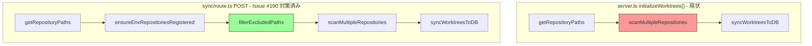
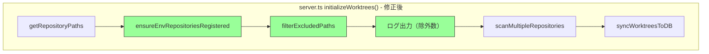

# 設計方針書: Issue #202 サーバー再起動時の削除済みリポジトリ復活防止

## 1. 概要

### 対象Issue
- **Issue #202**: fix: サーバー再起動時に削除済みリポジトリが復活する
- **関連Issue**: #190（Sync All復活防止は対策済み）

### 目的
UIでリポジトリを削除した後、サーバーを再起動しても削除済みリポジトリが復活しないようにする。

### 根本原因
`server.ts` の `initializeWorktrees()` が、Issue #190 で `sync/route.ts` に適用された除外フィルタリング（`ensureEnvRepositoriesRegistered()` + `filterExcludedPaths()`）を持たないため、サーバー起動時に削除済みリポジトリが再スキャン・再登録される。

## 2. アーキテクチャ設計

### 現状の処理フロー



### 修正後の処理フロー



### 既知の制限事項（SF-IA-001 / SF-SEC-001）

> **注意**: `POST /api/repositories/scan`（`scan/route.ts`）は個別リポジトリパスを直接受け取り、`filterExcludedPaths()` を経由せずにスキャンを実行する経路が存在する。この経路はUI上の手動パス入力操作が必要であり、自動的な復活ではないためリスクは限定的だが、フォローアップ Issue で除外チェックの追加または仕様明文化を検討する必要がある。
>
> **OWASP分類** (Stage 4 セキュリティレビュー SF-SEC-001): A03:2021 Injection に該当。`isPathSafe()` によるパストラバーサル防御は適用されているが、除外状態チェックが欠如している。フォローアップ Issue で `getRepositoryByPath()` による `enabled=0` チェックを追加し、除外済みの場合は 400 エラーまたは警告を返す対応を行う。

### レイヤー構成

本修正は以下のレイヤーに影響する：

| レイヤー | ファイル | 変更 |
|---------|---------|------|
| インフラストラクチャ層 | `server.ts` | **修正対象** |
| ビルド設定 | `tsconfig.server.json` | **修正対象** |
| ビジネスロジック層 | `src/lib/db-repository.ts` | 変更なし（既存関数を呼び出すのみ） |
| 設定層 | `src/config/system-directories.ts` | 変更なし（間接依存） |

## 3. 技術選定

### 採用方針: 既存関数の再利用

| カテゴリ | 選定 | 理由 |
|---------|------|------|
| 除外ロジック | `filterExcludedPaths()` | Issue #190 で実装・テスト済み |
| 登録ロジック | `ensureEnvRepositoriesRegistered()` | Issue #190 で実装・テスト済み |
| import形式 | `./src/lib/...` 相対パス | server.ts の既存import文との一貫性 |
| ログ出力 | `console.log` | server.ts の既存ログ形式との一貫性 |

### 代替案との比較

| 方式 | メリット | デメリット | 採否 |
|------|---------|----------|------|
| **A: 既存関数の再利用（採用）** | 実装済み・テスト済み・sync/route.ts と同一パターン | server.ts と sync/route.ts に同一フローが重複 | **採用** |
| B: 共通関数への抽出 | DRY原則準拠 | スコープ拡大、リファクタリングリスク | 見送り（フォローアップ Issue 候補） |
| C: syncWorktreesToDB内部に除外ロジック追加 | 呼び出し元の修正不要 | 既存テスト大幅修正、単一責任原則違反 | 却下 |

**方式A を採用する理由**: 最小限の変更でバグを修正でき、sync/route.ts の参考実装があるためリスクが低い。DRY原則の共通化はフォローアップ Issue として検討する。

## 4. 設計パターン

### 適用パターン: 参照実装の転写

sync/route.ts（Issue #190 で実装済み）の処理フローを server.ts に転写する。新しいパターンの導入は不要。

### 呼び出し順序制約

```typescript
// 1. 必ずこの順序で呼び出す
ensureEnvRepositoriesRegistered(db, repositoryPaths);  // 先: 登録
const filteredPaths = filterExcludedPaths(db, repositoryPaths);  // 後: フィルタ
```

**理由**: `filterExcludedPaths()` は `repositories` テーブルの `enabled` 状態を参照する。初回起動時に未登録のリポジトリは `repositories` テーブルに存在しないため、先に `ensureEnvRepositoriesRegistered()` で登録する必要がある。

### 呼び出し順序制約のドキュメント化（SF-001対応）

> **レビュー指摘 SF-001**: 呼び出し順序制約が暗黙的であり、将来の保守時にフロー不一致のリスクがある。

上記の呼び出し順序制約は **暗黙的な依存関係** であるため、以下の方法で明示的にドキュメント化する：

1. **server.ts のインラインコメント**: `ensureEnvRepositoriesRegistered()` と `filterExcludedPaths()` の呼び出し箇所に、順序制約の理由を明記するコメントを追加する（Section 7-1 の修正後コードに反映済み）
2. **sync/route.ts のインラインコメント**: 既存の sync/route.ts 側にも同様のコメントが存在することを確認し、不足していれば追加する
3. **db-repository.ts の JSDoc**: `filterExcludedPaths()` の JSDoc に `@requires ensureEnvRepositoriesRegistered()` を呼び出し済みであることを前提条件として明記する
4. **フォローアップ Issue**: 共通関数（例: `initializeFilteredRepositories(db, repositoryPaths)`）への抽出を検討するフォローアップ Issue を作成し、呼び出し順序制約をカプセル化する

## 5. データモデル設計

### 使用テーブル（変更なし）

```
repositories テーブル
├── id: TEXT PRIMARY KEY
├── name: TEXT
├── path: TEXT (UNIQUE)
├── enabled: INTEGER (0=除外, 1=有効)  ← フィルタリングに使用
├── clone_url: TEXT
├── normalized_clone_url: TEXT
├── clone_source: TEXT
├── is_env_managed: INTEGER
├── created_at: TEXT
└── updated_at: TEXT
```

### フィルタリングの仕組み

1. `ensureEnvRepositoriesRegistered()`: 環境変数のパスを `repositories` テーブルに登録（`enabled=1`、冪等）
2. UIで削除: `enabled=0` に更新
3. `filterExcludedPaths()`: `enabled=0` のパスを除外

## 6. 変更ファイル一覧

### 直接変更

| ファイル | 変更内容 |
|---------|---------|
| `server.ts` | import文追加、`initializeWorktrees()` に除外フィルタリングとログ出力を追加 |
| `tsconfig.server.json` | include配列に `src/lib/db-repository.ts`, `src/config/system-directories.ts` を追加 |

### 間接依存（変更なし）

| ファイル | 依存関係 | tsconfig.server.json |
|---------|----------|---------------------|
| `src/lib/db-repository.ts` | server.ts から直接import | 追加が必要 |
| `src/config/system-directories.ts` | db-repository.ts が import | 追加が必要 |
| `src/types/clone.ts` | db-repository.ts が型参照 | 既に含まれている |

## 7. 具体的な修正内容

### 7-1. server.ts の修正

#### import文の追加（L42の後に追加）

```typescript
import { ensureEnvRepositoriesRegistered, filterExcludedPaths } from './src/lib/db-repository';
```

#### initializeWorktrees() の修正（L77-94）

**修正前**:
```typescript
// Get repository paths from environment variables
const repositoryPaths = getRepositoryPaths();

if (repositoryPaths.length === 0) {
  console.warn('Warning: No repository paths configured');
  console.warn('Set WORKTREE_REPOS (comma-separated) or MCBD_ROOT_DIR');
  return;
}

console.log(`Configured repositories: ${repositoryPaths.length}`);
repositoryPaths.forEach((path, i) => {
  console.log(`  ${i + 1}. ${path}`);
});

// Scan all repositories
const worktrees = await scanMultipleRepositories(repositoryPaths);

// Sync to database
syncWorktreesToDB(db, worktrees);
```

**修正後**:
```typescript
// Get repository paths from environment variables
const repositoryPaths = getRepositoryPaths();

if (repositoryPaths.length === 0) {
  console.warn('Warning: No repository paths configured');
  console.warn('Set WORKTREE_REPOS (comma-separated) or MCBD_ROOT_DIR');
  return;
}

console.log(`Configured repositories: ${repositoryPaths.length}`);
repositoryPaths.forEach((path, i) => {
  console.log(`  ${i + 1}. ${path}`);
});

// Issue #202: Register environment variable repositories to repositories table (idempotent)
// NOTE: Must be called BEFORE filterExcludedPaths() - see Section 4 of design policy
ensureEnvRepositoriesRegistered(db, repositoryPaths);

// Issue #202: Filter out excluded (enabled=0) repositories
// NOTE: Requires ensureEnvRepositoriesRegistered() to have been called first
const filteredPaths = filterExcludedPaths(db, repositoryPaths);
const excludedCount = repositoryPaths.length - filteredPaths.length;
if (excludedCount > 0) {
  console.log(`Excluded repositories: ${excludedCount}, Active repositories: ${filteredPaths.length}`);
  // SF-SEC-003: Log excluded repository paths for audit/troubleshooting
  const excludedPaths = repositoryPaths.filter(p => !filteredPaths.includes(p));
  excludedPaths.forEach(p => {
    console.log(`  [excluded] ${p}`);
  });
}

// Scan filtered repositories (excluded repos are skipped)
const worktrees = await scanMultipleRepositories(filteredPaths);

// Sync to database
syncWorktreesToDB(db, worktrees);
```

### 7-2. tsconfig.server.json の修正

**修正前**:
```json
"include": [
  "server.ts",
  "src/lib/env.ts",
  "src/lib/ws-server.ts",
  "src/lib/worktrees.ts",
  "src/lib/db.ts",
  "src/lib/db-instance.ts",
  "src/lib/db-migrations.ts",
  "src/lib/response-poller.ts",
  "src/lib/cli-session.ts",
  "src/lib/prompt-detector.ts",
  "src/lib/conversation-logger.ts",
  "src/lib/claude-output.ts",
  "src/lib/cli-patterns.ts",
  "src/lib/cli-tools/**/*.ts",
  "src/types/**/*.ts"
]
```

**修正後**:
```json
"include": [
  "server.ts",
  "src/lib/env.ts",
  "src/lib/ws-server.ts",
  "src/lib/worktrees.ts",
  "src/lib/db.ts",
  "src/lib/db-instance.ts",
  "src/lib/db-migrations.ts",
  "src/lib/db-repository.ts",
  "src/lib/response-poller.ts",
  "src/lib/cli-session.ts",
  "src/lib/prompt-detector.ts",
  "src/lib/conversation-logger.ts",
  "src/lib/claude-output.ts",
  "src/lib/cli-patterns.ts",
  "src/lib/cli-tools/**/*.ts",
  "src/config/system-directories.ts",
  "src/types/**/*.ts"
]
```

> **Stage 3 影響分析確認（SF-IA-002）**: `db-repository.ts` が `@/types/clone` と `@/config/system-directories` を `@/` パスエイリアスで import しているため、`tsc-alias` によるパス変換が正しく動作する必要がある。`tsc-alias` は import グラフを辿ったファイルにも適用されるが、明示的に include へ追加する方針がより安全であることが Stage 3 レビューで確認された。**実装後は必ず `npm run build:server` でビルド成功を検証すること。**

### 7-3. db-repository.ts の JSDoc 追加（SF-001対応）

`filterExcludedPaths()` の既存 JSDoc に以下の前提条件を追記する：

```typescript
/**
 * Filter out excluded repository paths (enabled=0).
 *
 * @requires ensureEnvRepositoriesRegistered() must be called before this function
 *           to ensure all paths exist in the repositories table.
 *           Without prior registration, unregistered paths will not be filtered correctly.
 * @param db - Database instance
 * @param repositoryPaths - Array of repository paths to filter
 * @returns Filtered array excluding disabled repositories
 */
```

### 7-4. sync/route.ts の順序制約コメント確認（SF-001対応）

sync/route.ts 側の `ensureEnvRepositoriesRegistered()` と `filterExcludedPaths()` の呼び出し箇所にも、順序制約のインラインコメントが存在することを確認する。不足している場合は以下のコメントを追加する：

```typescript
// NOTE: Must be called BEFORE filterExcludedPaths() - order dependency
ensureEnvRepositoriesRegistered(db, repositoryPaths);

// NOTE: Requires ensureEnvRepositoriesRegistered() to have been called first
const filteredPaths = filterExcludedPaths(db, repositoryPaths);
```

## 8. セキュリティ設計

### セキュリティへの影響: 軽微（既存対策で緩和済み）

- 既存のセキュリティ対策（`isSystemDirectory`、`resolveRepositoryPath`、パストラバーサル対策等）は `db-repository.ts` 内に既に実装済み
- server.ts は既存関数を呼び出すのみで、新たなセキュリティリスクは発生しない
- `ensureEnvRepositoriesRegistered()` は冪等操作であり、既登録のリポジトリに対しては何もしない

### セキュリティ監査ログの改善（SF-SEC-003対応）

> **レビュー指摘 SF-SEC-003** (OWASP A09:2021): 除外フィルタリングで除外されたリポジトリの「数」はログ出力されるが、「どのリポジトリが除外されたか」のパス情報がログに含まれない。セキュリティ監査やトラブルシューティングの観点から、具体的なパスをデバッグレベルで出力することが望ましい。

server.ts の除外ログ出力に、除外されたリポジトリのパスをデバッグレベルで出力するログ行を追加する。`NODE_ENV` や `CM_LOG_LEVEL` 等のログレベル制御により本番環境では抑制可能とする。

```typescript
if (excludedCount > 0) {
  console.log(`Excluded repositories: ${excludedCount}, Active repositories: ${filteredPaths.length}`);
  // SF-SEC-003: Log excluded repository paths at debug level for audit/troubleshooting
  const excludedPaths = repositoryPaths.filter(p => !filteredPaths.includes(p));
  excludedPaths.forEach(p => {
    console.log(`  [excluded] ${p}`);
  });
}
```

### リポジトリパス数の上限チェック（SF-SEC-002対応）

> **レビュー指摘 SF-SEC-002** (OWASP A04:2021): `server.ts` の `initializeWorktrees()` は環境変数 `WORKTREE_REPOS` から取得したパスを全て DB に登録するが、極端に多数のパスが設定された場合に起動時間が増大する可能性がある。ただし、環境変数はサーバー管理者のみが設定可能であり、外部からの攻撃ベクタではないためリスクは限定的。

本 Issue のスコープでは対応しないが、フォローアップとして以下を検討する：
- 環境変数からのパス数に上限（例: `MAX_WORKTREES=100`）を設定
- 超過時は警告ログを出力して先頭N件のみ処理

### scan/route.ts の除外チェック欠如（SF-SEC-001対応）

> **レビュー指摘 SF-SEC-001** (OWASP A03:2021): `POST /api/repositories/scan` は `filterExcludedPaths()` を経由せずにスキャンを実行する。ユーザーが削除済みリポジトリのパスを手動入力した場合、`enabled=0` の除外状態を無視してワークツリーが DB に再登録される可能性がある。`isPathSafe()` によるパストラバーサル防御は適用されているが、除外状態チェックが欠如している。

Stage 3 の SF-IA-001 と同一の制限事項であり、Section 2 に既知の制限として記載済み。セキュリティレビューにより OWASP カテゴリが明確化された。フォローアップ Issue で `getRepositoryByPath()` による `enabled=0` チェックを追加し、除外済みの場合は 400 エラーまたは警告を返す対応を行う。

## 9. パフォーマンス設計

### パフォーマンスへの影響: 軽微

- `ensureEnvRepositoriesRegistered()`: 起動時1回のみ実行。リポジトリ数分のSELECT + 必要に応じてINSERT。通常数個のため影響なし
- `filterExcludedPaths()`: 起動時1回のみ実行。`SELECT path FROM repositories WHERE enabled = 0` の軽量クエリ
- フィルタリングにより除外リポジトリのスキャンが省略されるため、実質的にはパフォーマンス改善

## 10. テスト方針

### ユニットテスト
- `ensureEnvRepositoriesRegistered()` と `filterExcludedPaths()` は Issue #190 で既にテスト済み（`tests/unit/lib/db-repository-exclusion.test.ts`）
- server.ts の `initializeWorktrees()` は Next.js の `app.prepare()` コールバック内にネストされており、ユニットテストの切り出しが困難
- **新規ユニットテストは不要**（既存テストがカバー）

### 結合テスト
- `tests/integration/repository-exclusion.test.ts` の既存テスト（Exclusion -> Sync フロー）が引き続きパスすること

### ビルド検証
- `npm run build:server` が成功すること
- `npm run build` が成功すること

### 手動テスト
1. リポジトリを削除
2. サーバー再起動（`npm run build && npm start`）
3. 削除済みリポジトリが表示されないことを確認

### server.ts initializeWorktrees() のテスト可能性改善（SF-002対応）

> **レビュー指摘 SF-002**: server.ts の initializeWorktrees() に対する統合テストが不足しており、呼び出し順序の正しさを検証するテストがない。

本 Issue のスコープではテスト追加は行わないが、以下の方針を定める：

#### 方針A: ビジネスロジックの関数抽出（フォローアップ Issue で検討）

`initializeWorktrees()` 内のビジネスロジック部分（register -> filter -> scan -> sync の4ステップ）を独立した関数として抽出し、テスト可能にする。これは SF-001 のフォローアップ Issue（共通関数への抽出）と同時に対応可能である。

```typescript
// 抽出候補: initializeFilteredRepositories()
// server.ts と sync/route.ts の両方から呼び出す
export async function initializeFilteredRepositories(
  db: Database,
  repositoryPaths: string[]
): Promise<void> {
  ensureEnvRepositoriesRegistered(db, repositoryPaths);
  const filteredPaths = filterExcludedPaths(db, repositoryPaths);
  const worktrees = await scanMultipleRepositories(filteredPaths);
  syncWorktreesToDB(db, worktrees);
}
```

#### 方針B: 手動テストシナリオの明文化（本 Issue で対応）

フォローアップ Issue が完了するまでの間、以下の手動テストシナリオを検証手順として明文化する：

| # | テストシナリオ | 期待結果 |
|---|--------------|---------|
| 1 | 初回起動（DBなし） | 全リポジトリが登録・表示される |
| 2 | リポジトリ削除後に再起動 | 削除済みリポジトリが復活しない |
| 3 | 全リポジトリ削除後に再起動 | サイドバーが空の状態で表示される |
| 4 | 削除後にSync All実行 | 削除済みリポジトリが復活しない（Issue #190 で対策済み） |
| 5 | 削除 -> 再起動 -> Sync All | 削除済みリポジトリが復活しない（両経路で除外が機能） |

## 11. 設計上の決定事項とトレードオフ

| 決定事項 | 理由 | トレードオフ |
|---------|------|-------------|
| 既存関数の再利用 | 実装・テスト済み、リスク最小 | sync/route.ts との重複 |
| 相対パスimport | server.ts の既存パターンに準拠 | `@/` エイリアスとの不整合 |
| ログ出力は条件付き | 除外がない場合は不要な情報 | デバッグ時に常時表示が欲しい場合がある |
| 除外パスの個別ログ出力（SF-SEC-003） | セキュリティ監査・トラブルシューティングに有用 | ログ量が増加する（除外数が多い場合） |
| tsconfig.server.json への明示的追加 | tsc-aliasのパス変換保証 | 新しい依存追加時にメンテ必要 |

## 12. 制約条件

### CLAUDE.md 原則への準拠

| 原則 | 準拠状況 |
|------|---------|
| SOLID - 単一責任 | 準拠: `initializeWorktrees()` の責務（初期化）に除外フィルタリングを追加するのは適切 |
| KISS | 準拠: sync/route.ts と同一パターンの転写。新しい概念の導入なし |
| YAGNI | 準拠: 共通関数化は行わず、最小限の修正に留める |
| DRY | 条件付き準拠: sync/route.ts との重複あり。フォローアップ Issue で共通関数化を検討（SF-001） |

## 13. レビュー履歴

| 日付 | ステージ | 結果 | スコア |
|------|---------|------|-------|
| 2026-02-09 | Stage 1: 通常レビュー | 条件付き承認（conditionally_approved） | 4/5 |
| 2026-02-09 | Stage 2: 整合性レビュー | 条件付き承認（conditionally_approved） | 4/5 |
| 2026-02-09 | Stage 3: 影響分析レビュー | 条件付き承認（conditionally_approved） | 4/5 |
| 2026-02-09 | Stage 4: セキュリティレビュー | 条件付き承認（conditionally_approved） | 4/5 |

## 14. レビュー指摘事項サマリー

### Stage 1: 通常レビュー（2026-02-09）

| ID | 分類 | 重要度 | タイトル | 対応状況 |
|----|------|-------|---------|---------|
| SF-001 | Should Fix | medium | server.ts と sync/route.ts のワークツリー初期化フローが重複（DRY） | 設計方針に反映済み |
| SF-002 | Should Fix | low | server.ts の initializeWorktrees() に対する統合テストが不足 | 設計方針に反映済み |
| C-001 | Consider | - | 除外フィルタリングの拡張性（OCP） | 現時点では対応不要（YAGNI） |
| C-002 | Consider | - | ログ出力の条件分岐による一貫性 | 現行設計を維持 |

### SF-001: server.ts と sync/route.ts のワークツリー初期化フローが重複

- **原則**: DRY
- **指摘内容**: `ensureEnvRepositoriesRegistered()` -> `filterExcludedPaths()` -> `scanMultipleRepositories()` -> `syncWorktreesToDB()` の4ステップの呼び出しシーケンスが server.ts と sync/route.ts に重複する。呼び出し順序制約（ensureEnvRepositoriesRegistered を filterExcludedPaths の前に呼ぶ必要がある）が暗黙的であり、将来の保守時にフロー不一致のリスクがある。
- **推奨対応**: フォローアップ Issue で共通関数への抽出を検討。両方の呼び出し箇所に順序制約をJSDoc/インラインコメントで明記。
- **設計方針への反映**:
  - Section 4: 「呼び出し順序制約のドキュメント化」セクションを追加
  - Section 7-1: server.ts の修正後コードに順序制約コメントを追加
  - Section 7-3: db-repository.ts の JSDoc に `@requires` を追記する方針を追加
  - Section 7-4: sync/route.ts 側のコメント確認・追加方針を追加
  - 実装チェックリスト: フォローアップ Issue 作成を必須項目として追加

### SF-002: server.ts の initializeWorktrees() に対する統合テストが不足

- **原則**: テスト方針
- **指摘内容**: server.ts 内で ensureEnvRepositoriesRegistered() と filterExcludedPaths() を正しい順序で呼び出すことを検証するテストがない。
- **推奨対応**: ビジネスロジック部分を独立関数として抽出してテスト可能にするか、手動テストシナリオを明文化する。
- **設計方針への反映**:
  - Section 10: 「server.ts initializeWorktrees() のテスト可能性改善」セクションを追加
  - 方針A（関数抽出）と方針B（手動テストシナリオ明文化）を定義
  - 手動テストシナリオ表を追加（5シナリオ）
  - 実装チェックリスト: 手動テスト実施を必須項目として追加

### Stage 2: 整合性レビュー（2026-02-09）

| ID | 分類 | 重要度 | タイトル | 対応状況 |
|----|------|-------|---------|---------|
| SF-CS-001 | Should Fix | medium | filterExcludedPaths() の JSDoc に @requires 前提条件が未実装 | 設計方針に反映済み（Stage 1 SF-001 の推奨項目を必須に昇格） |
| SF-CS-002 | Should Fix | low | sync/route.ts に順序制約コメントが不足 | 設計方針に反映済み（Stage 1 SF-001 の推奨項目を必須に昇格） |
| C-CS-001 | Consider | - | tsconfig.server.json の include と実際のトランスパイル依存関係の暗黙的解決 | 設計方針通りの明示的追加で対応（変更なし） |

### SF-CS-001: filterExcludedPaths() の JSDoc に @requires 前提条件が未実装

- **カテゴリ**: 整合性
- **指摘内容**: 設計方針書 Section 7-3 では `filterExcludedPaths()` の JSDoc に `@requires ensureEnvRepositoriesRegistered() must be called before this function` を追記する方針が明記されている。しかし、現在の `db-repository.ts` (L400-408) の `filterExcludedPaths()` にはその JSDoc が存在しない。設計書で SF-001 対応として推奨項目に含まれており、実装チェックリストにも明記されている。
- **実装状態**: `src/lib/db-repository.ts` L399: JSDoc なし（関数コメントのみ）
- **ギャップ**: 設計書の記載あり、実装なし
- **推奨対応**: 実装時に `filterExcludedPaths()` の JSDoc に `@requires` 前提条件を追記すること。
- **設計方針への反映**:
  - Section 15: 推奨項目から必須項目へ昇格（整合性レビューで再指摘されたため）
  - Section 7-3 の方針は既に正確であり変更不要

### SF-CS-002: sync/route.ts に順序制約コメントが不足

- **カテゴリ**: 整合性
- **指摘内容**: 設計方針書 Section 7-4 では `sync/route.ts` の `ensureEnvRepositoriesRegistered()` と `filterExcludedPaths()` の呼び出し箇所に順序制約のインラインコメントを確認・追加する方針が明記されている。現在の `sync/route.ts` (L26-30) には 'Issue #190' というコメントはあるが、呼び出し順序制約に関する明示的なコメント（'NOTE: Must be called BEFORE filterExcludedPaths()' 等）は存在しない。
- **実装状態**: `src/app/api/repositories/sync/route.ts` L26-30: 'Issue #190' コメントのみ
- **ギャップ**: 設計書の記載あり、実装なし
- **推奨対応**: 実装時に `sync/route.ts` の呼び出し箇所にも順序制約コメントを追加すること。
- **設計方針への反映**:
  - Section 15: 推奨項目から必須項目へ昇格（整合性レビューで再指摘されたため）
  - Section 7-4 の方針は既に正確であり変更不要

### Stage 3: 影響分析レビュー（2026-02-09）

| ID | 分類 | 重要度 | タイトル | 対応状況 |
|----|------|-------|---------|---------|
| SF-IA-001 | Should Fix | medium | scan/route.ts がフィルタリングなしで個別リポジトリをスキャンする経路が残存 | 設計方針に反映済み（フォローアップ Issue または仕様明文化で対応） |
| SF-IA-002 | Should Fix | low | tsconfig.server.json の tsc-alias パス変換に対する db-repository.ts の @/ import 依存 | 設計方針に反映済み（既存方針の妥当性を確認、ビルド検証を強調） |
| C-IA-001 | Consider | - | CLI commandmate start --issue によるworktree別サーバーでの影響 | 現時点では対応不要（スコープ外） |
| C-IA-002 | Consider | - | restore/route.ts の復元経路との整合性 | 現行設計は正しい。追加対応不要 |
| C-IA-003 | Consider | - | clone-manager.ts の db-repository.ts 依存 | 追加対応不要 |

### SF-IA-001: scan/route.ts がフィルタリングなしで個別リポジトリをスキャンする経路が残存

- **カテゴリ**: 影響範囲
- **指摘内容**: `POST /api/repositories/scan`（`src/app/api/repositories/scan/route.ts`）は個別のリポジトリパスを受け取り、`filterExcludedPaths()` を経由せずに `scanWorktrees()` -> `syncWorktreesToDB()` を直接呼び出している。ユーザーが削除済みリポジトリのパスを手動で指定した場合、除外状態を無視してワークツリーがDBに再登録される可能性がある。ただし、この経路はUI上の明示的な操作（手動パス入力）が必要であり、自動的な復活ではないためリスクは限定的。
- **推奨対応**: 本 Issue のスコープ外だが、以下のいずれかをフォローアップで対応する：
  - **案1**: scan/route.ts に除外チェック（`getRepositoryByPath()` で `enabled=0` かを確認）を追加するフォローアップ Issue を作成
  - **案2**: scan は意図的な操作であるため除外を無視する仕様として明文化
- **設計方針への反映**:
  - Section 2: アーキテクチャ設計に scan/route.ts の経路を既知の制限事項として記載
  - Section 15: フォローアップ項目に scan/route.ts の除外チェック対応を追加

### SF-IA-002: tsconfig.server.json の tsc-alias パス変換に対する db-repository.ts の @/ import 依存

- **カテゴリ**: 影響範囲
- **指摘内容**: `db-repository.ts` は `@/types/clone` と `@/config/system-directories` を `@/` パスエイリアスで import している。server.ts のビルド（`npm run build:server`）は `tsc + tsc-alias` を使用しており、`tsc-alias` が `@/` エイリアスを相対パスに変換する。`tsconfig.server.json` の include に `db-repository.ts` と `system-directories.ts` を追加する設計方針は正しいが、`tsc-alias` の変換対象は include に含まれるファイルだけでなく、コンパイル対象となる全ファイル（import グラフを辿ったもの）に適用される。ただし、明示的な include 追加がより安全であるという設計判断は妥当。
- **推奨対応**: 設計書通りに明示的に include へ追加する方針を維持すること。ビルド成功を `npm run build:server` で必ず検証すること。
- **設計方針への反映**:
  - Section 7-2: tsconfig.server.json の修正方針の妥当性を Stage 3 で確認済みであることを注記
  - Section 15: `npm run build:server` のビルド検証を重要項目として強調

### C-IA-001: CLI commandmate start --issue によるworktree別サーバーでの影響（参考情報）

- **指摘内容**: Issue #136 で追加された `commandmate start --issue` により worktree 別のサーバーインスタンスが起動可能。各インスタンスは独自の DB を持つが、同じ `server.ts` の `initializeWorktrees()` を実行する。本修正は全サーバーインスタンスで除外フィルタリングが有効になるため正しい動作。ただし worktree 別サーバーでは DB が異なるため、メインサーバーでの削除操作が worktree 別サーバーには反映されない点を認識しておく必要がある。
- **対応**: worktree 別サーバー間での除外状態の同期は本 Issue のスコープ外。必要に応じてフォローアップで検討する。

### C-IA-002: restore/route.ts の復元経路との整合性（参考情報）

- **指摘内容**: `PUT /api/repositories/restore` は `restoreRepository()` で `enabled=1` に復元した後、`scanWorktrees()` -> `syncWorktreesToDB()` を直接呼び出す。この経路は除外済みリポジトリを意図的に復元する操作であるため、`filterExcludedPaths()` を通さないのは正しい設計。
- **対応**: 現行設計は正しい。追加対応不要。

### C-IA-003: clone-manager.ts の db-repository.ts 依存（参考情報）

- **指摘内容**: `src/lib/clone-manager.ts` は `db-repository.ts` から複数の関数を import しているが、clone-manager.ts は Next.js の API ルート経由で使用されるため、server.ts のビルド（tsconfig.server.json）とは異なるビルドパス。本修正の影響なし。
- **対応**: 追加対応不要。

### Stage 4: セキュリティレビュー（2026-02-09）

| ID | 分類 | 重要度 | OWASP | タイトル | 対応状況 |
|----|------|-------|-------|---------|---------|
| SF-SEC-001 | Should Fix | medium | A03:2021 Injection | scan/route.ts が filterExcludedPaths() を経由せず削除済みリポジトリを再登録可能（既知制限） | 設計方針に反映済み（SF-IA-001 と同一、OWASP 分類追加） |
| SF-SEC-002 | Should Fix | low | A04:2021 Insecure Design | server.ts の initializeWorktrees() にリポジトリパス数の上限チェックが未実装 | 設計方針に反映済み（フォローアップ項目として追加） |
| SF-SEC-003 | Should Fix | low | A09:2021 Security Logging | server.ts の除外フィルタリングで除外されたリポジトリのパスがログに出力されない | 設計方針に反映済み（修正後コードに反映） |
| C-SEC-001 | Consider | - | A01:2021 Broken Access Control | API エンドポイントの認証・認可メカニズムが未実装（プロジェクト全体の既存課題） | 本 Issue のスコープ外 |
| C-SEC-002 | Consider | - | A05:2021 Security Misconfiguration | worktree 別サーバー間での DB 分離による除外状態の非同期 | C-IA-001 と同一（スコープ外） |
| C-SEC-003 | Consider | - | A08:2021 Software and Data Integrity Failures | ensureEnvRepositoriesRegistered() と filterExcludedPaths() の呼び出し順序がコード上の規約に依存 | SF-001 のフォローアップ Issue で対応予定 |

### SF-SEC-001: scan/route.ts が filterExcludedPaths() を経由せず削除済みリポジトリを再登録可能

- **カテゴリ**: セキュリティ（OWASP A03:2021 Injection）
- **指摘内容**: `POST /api/repositories/scan` は個別リポジトリパスを受け取り、`filterExcludedPaths()` を経由せずに `scanWorktrees()` -> `syncWorktreesToDB()` を直接呼び出す。ユーザーが削除済みリポジトリのパスを手動入力した場合、`enabled=0` の除外状態を無視してワークツリーが DB に再登録される。`isPathSafe()` によるパストラバーサル防御は適用済み。
- **Stage 3 との関連**: SF-IA-001 として既に認識済み。セキュリティレビューにより OWASP カテゴリ（A03:2021）が明確化された。
- **推奨対応**: フォローアップ Issue で scan/route.ts に `getRepositoryByPath()` による `enabled=0` チェックを追加し、除外済みの場合は 400 エラーまたは警告を返す。
- **設計方針への反映**:
  - Section 8: セキュリティ設計に SF-SEC-001 の詳細を追加
  - Section 15: フォローアップ項目に OWASP 分類を追記

### SF-SEC-002: server.ts の initializeWorktrees() にリポジトリパス数の上限チェックが未実装

- **カテゴリ**: セキュリティ（OWASP A04:2021 Insecure Design）
- **指摘内容**: `server.ts` の `initializeWorktrees()` は `getRepositoryPaths()` から環境変数 `WORKTREE_REPOS` のパスを取得し、全て DB に登録する。極端に多数のパスが設定された場合（例: 数万件）、DB INSERT が大量発生し起動時間が著しく増大する可能性がある。ただし環境変数はサーバー管理者のみが設定可能であり、外部攻撃ベクタではないためリスクは限定的。
- **推奨対応**: 環境変数からのパス数に上限（例: `MAX_WORKTREES=100`）を設け、超過時は警告ログを出力して先頭N件のみ処理する方式を検討。優先度は低い。
- **設計方針への反映**:
  - Section 8: セキュリティ設計に上限チェックの検討方針を追加
  - Section 15: フォローアップ項目に上限チェック検討を追加

### SF-SEC-003: server.ts の除外フィルタリングで除外されたリポジトリのパスがログに出力されない

- **カテゴリ**: セキュリティ（OWASP A09:2021 Security Logging and Monitoring Failures）
- **指摘内容**: 除外されたリポジトリの「数」はログ出力されるが、「どのリポジトリが除外されたか」のパス情報はログに含まれない。セキュリティ監査やトラブルシューティングの観点から、除外されたリポジトリの具体的なパスをログで出力することが望ましい。
- **推奨対応**: 除外リポジトリのパスを `[excluded]` プレフィックス付きで出力するログ行を追加する。
- **設計方針への反映**:
  - Section 7-1: 修正後コードに除外パスのログ出力を追加
  - Section 8: セキュリティ設計にセキュリティ監査ログの改善方針を追加
  - Section 15: 必須項目に除外パスのログ出力実装を追加

## 15. 実装チェックリスト

### 必須項目

- [ ] server.ts に `ensureEnvRepositoriesRegistered` と `filterExcludedPaths` の import を追加
- [ ] server.ts の `initializeWorktrees()` に除外フィルタリングロジックを追加
- [ ] server.ts の呼び出し箇所に順序制約のインラインコメントを追加（SF-001）
- [ ] server.ts の除外ログに除外されたリポジトリのパスを出力するログ行を追加（SF-SEC-003 / Section 7-1 / Section 8）
- [ ] tsconfig.server.json に `src/lib/db-repository.ts` と `src/config/system-directories.ts` を追加
- [ ] db-repository.ts の `filterExcludedPaths()` JSDoc に `@requires` 前提条件を追記（SF-001 / SF-CS-001 / Section 7-3）
- [ ] sync/route.ts 側の順序制約コメントの確認・追加（SF-001 / SF-CS-002 / Section 7-4）
- [ ] `npm run build:server` が成功することを確認
- [ ] `npm run build` が成功することを確認
- [ ] `npm run test:unit` が全パスすることを確認
- [ ] 手動テストシナリオ（Section 10）を実施（SF-002）

### フォローアップ項目（別 Issue で対応）

- [ ] 共通関数 `initializeFilteredRepositories()` への抽出を検討する Issue を作成（SF-001 / C-SEC-003）
- [ ] 共通関数抽出後に統合テストを追加（SF-002 / 方針A）
- [ ] scan/route.ts に除外チェック（`getRepositoryByPath()` で `enabled=0` 確認）を追加する Issue を作成（SF-IA-001 / SF-SEC-001 / OWASP A03:2021）
- [ ] 環境変数 `WORKTREE_REPOS` のパス数に上限チェック（例: `MAX_WORKTREES=100`）を設ける検討 Issue を作成（SF-SEC-002 / OWASP A04:2021）
- [ ] worktree 別サーバー間での除外状態の同期を検討（C-IA-001 / C-SEC-002、必要に応じて）
- [ ] プロジェクト全体の認証メカニズム導入の検討（C-SEC-001 / OWASP A01:2021、特に CM_BIND=0.0.0.0 時のリスク文書化）

---

*Generated by design-policy command for Issue #202*
*Date: 2026-02-09*
*Updated: 2026-02-09 (Stage 1 レビュー指摘事項反映)*
*Updated: 2026-02-09 (Stage 2 整合性レビュー指摘事項反映)*
*Updated: 2026-02-09 (Stage 3 影響分析レビュー指摘事項反映)*
*Updated: 2026-02-09 (Stage 4 セキュリティレビュー指摘事項反映)*
