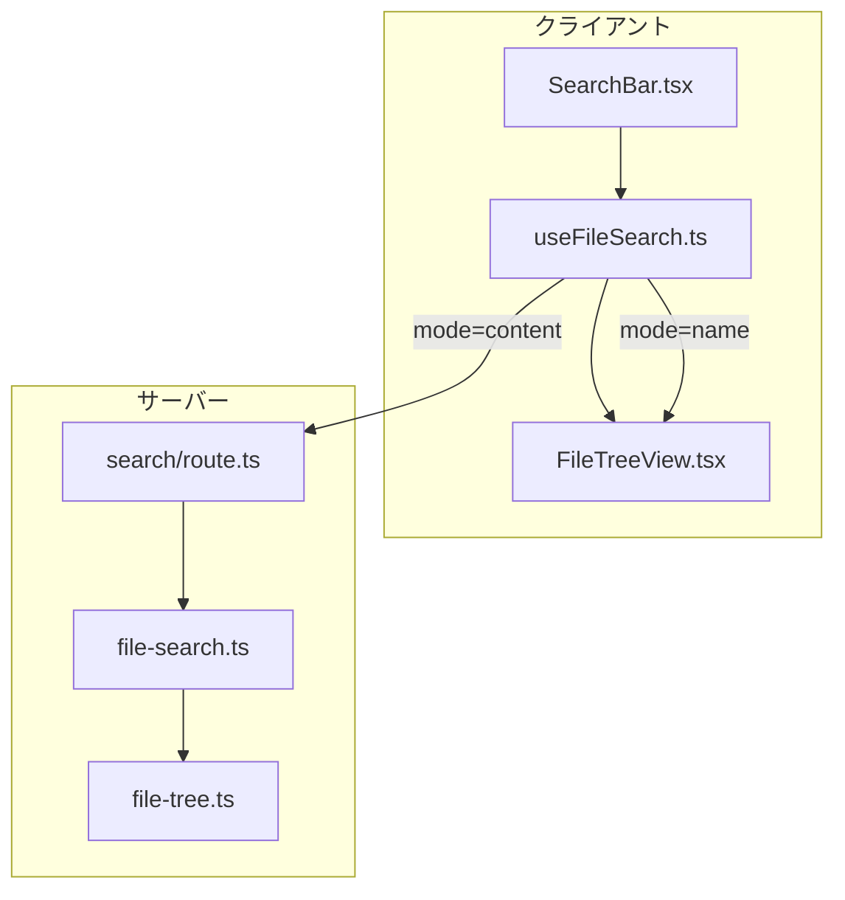

# Issue #21: ファイルツリー検索機能 - 設計方針書

## 1. 概要

### 1.1 目的
ファイルツリーに検索機能を追加し、PC・スマホ両方で快適にファイルを探せるようにする。

### 1.2 スコープ
- ファイル名検索（クライアントサイド）
- ファイル内容検索（サーバーサイド）
- 検索モード切替UI
- PC/スマホ両対応のレスポンシブUI

### 1.3 対象外
- 正規表現検索
- 大文字/小文字の区別オプション
- 検索履歴の保存
- 複数ワークツリーを跨いだ検索
- 検索キャンセル機能
- 検索インデックスの事前構築

---

## 2. アーキテクチャ設計

### 2.1 システム構成図



### 2.2 ディレクトリ構成

```
src/
├── app/api/worktrees/[id]/
│   └── search/
│       └── route.ts           # ファイル内容検索API
├── components/worktree/
│   ├── SearchBar.tsx          # 検索UI（新規）
│   └── FileTreeView.tsx       # ツリー表示（変更）
├── hooks/
│   └── useFileSearch.ts       # 検索状態管理（新規）
├── lib/
│   ├── file-search.ts         # 検索ロジック（新規）
│   ├── file-tree.ts           # ツリー構築（既存）
│   └── utils.ts               # ユーティリティ（変更: escapeRegExp追加）
└── types/
    └── models.ts              # 型定義（変更: 検索関連型追加）
```

### 2.3 レイヤー構成

| レイヤー | 責務 | ファイル |
|---------|------|----------|
| プレゼンテーション | 検索UI表示、ユーザー入力処理 | `SearchBar.tsx`, `FileTreeView.tsx` |
| 状態管理 | 検索状態、debounce、API呼び出し | `useFileSearch.ts` |
| ビジネスロジック | 検索処理、フィルタリング | `file-search.ts` |
| インフラストラクチャ | ファイルシステムアクセス | `file-tree.ts` |

---

## 3. 技術選定

### 3.1 既存技術の活用

| カテゴリ | 選定技術 | 選定理由 |
|---------|---------|---------|
| フレームワーク | Next.js 14 App Router | 既存技術スタック |
| 状態管理 | React Hooks (useState, useEffect) | シンプル、十分な機能 |
| debounce | 既存 `src/lib/utils.ts` | 再利用、DRY原則 |
| タイムアウト | AbortController + setTimeout | 標準API、キャンセル可能 |

### 3.2 新規追加なし

- 外部ライブラリの追加なし（React標準機能で実装）
- DOMPurifyは不要（Reactの自動エスケープで十分）

---

## 4. 詳細設計

### 4.1 検索モード

| モード | 実行場所 | 特徴 |
|--------|----------|------|
| ファイル名検索 | クライアントサイド | APIコール不要、高速、既存ツリーデータをフィルタ |
| ファイル内容検索 | サーバーサイド | grep的全文検索、テキストファイルのみ対象 |

### 4.2 コンポーネント設計

#### 4.2.1 SearchBar.tsx

**責務**: 検索UI（入力欄、モード切替、ローディング表示）

```typescript
interface SearchBarProps {
  query: string;
  mode: SearchMode;
  isSearching: boolean;
  onQueryChange: (query: string) => void;
  onModeChange: (mode: SearchMode) => void;
  onClear: () => void;
}
```

**UI仕様**:
- デスクトップ: 常時表示
- モバイル: アイコンタップで表示/非表示
  - モバイルUIのスタイル競合に注意（MobileContent、MobileTabBarとの調整が必要）
  - デスクトップ版を先行実装し、モバイル対応は後続フェーズで実施可能

> **影響分析レビュー指摘 (IMPACT-NTH-003)**: 検索バーの表示位置やアニメーションをMobileContentのUI設計と整合させる必要がある。デスクトップ版を先に実装し、モバイル対応は後続フェーズで対応することを推奨。

#### 4.2.2 useFileSearch.ts

**責務**: 検索状態管理、debounce処理、API呼び出し

```typescript
interface UseFileSearchReturn {
  query: string;
  mode: SearchMode;
  isSearching: boolean;
  results: SearchResult | null;
  error: string | null;
  setQuery: (query: string) => void;
  setMode: (mode: SearchMode) => void;
  clearSearch: () => void;
}

export function useFileSearch(worktreeId: string): UseFileSearchReturn;
```

**実装方針**:
- debounce: 300ms（既存 `debounce` 関数を使用）
- ファイル名検索: クライアントサイドでフィルタリング
- ファイル内容検索: API呼び出し

> **設計レビュー指摘 (DP-002)**: useFileSearchフックは「検索状態管理」「debounce処理」「API呼び出し」「エラーハンドリング」の4つの責務を持つ。初期実装ではフック内で完結させるが、将来的なリファクタリングとしてAPIクライアントロジックを`src/lib/search-api-client.ts`として分離することを検討する。これによりテスタビリティと再利用性が向上する。

> **影響分析レビュー指摘 (IMPACT-SF-001)**: WorktreeDetailRefactored.tsxは既に1600行超の大規模コンポーネントであり、useFileSearchフック統合により状態管理がさらに複雑化する可能性がある。実装時は既存の`useWorktreeUIState`パターンを参考にし、状態をreducer化することで可読性を維持すること。検索状態(query, mode, isSearching, results, error)の追加については、「検索状態とUI」と「API呼び出しロジック」の責務分離を検討する。

#### 4.2.3 file-search.ts

**責務**: ファイル内容検索ビジネスロジック

```typescript
interface SearchOptions {
  query: string;
  maxResults?: number;      // default: 100
  timeoutMs?: number;       // default: 5000
  maxFileSize?: number;     // default: 1MB
  maxDepth?: number;        // default: 10
}

interface SearchResultItem {
  filePath: string;
  matches: Array<{
    line: number;
    content: string;
  }>;
}

export async function searchFileContents(
  basePath: string,
  options: SearchOptions,
  signal?: AbortSignal
): Promise<SearchResultItem[]>;
```

### 4.3 API設計

#### 4.3.1 検索API

```
GET /api/worktrees/:id/search?q=<query>&mode=content
```

> **影響分析レビュー指摘 (IMPACT-MF-002)**: 新規APIエンドポイント追加時の実装方針:
> 1. 既存の`/api/worktrees/[id]/tree/route.ts`を参考に、同様のパターンでworktree存在チェック、パス検証を実装する
> 2. `middleware.ts`の認証対象パターン（`/api/*`）に自動的に含まれることを確認する
> 3. 他の既存エンドポイント（tree, files等）とのURLパターン競合はなし

**リクエスト**:
| パラメータ | 型 | 必須 | 説明 |
|-----------|-----|------|------|
| q | string | Yes | 検索クエリ |
| mode | "content" | Yes | 検索モード（contentのみ） |

**レスポンス（成功時）**:
```typescript
// 整合性レビュー指摘 (CONS-MF-002) 対応: 既存APIパターンに統一
interface SearchSuccessResponse {
  success: true;
  results: SearchResultItem[];
  totalMatches: number;
  truncated: boolean;  // 100件超えた場合true
  executionTimeMs: number;
}
```

**レスポンス（エラー時）**:
```typescript
interface SearchErrorResponse {
  success: false;
  error: {
    code: string;
    message: string;
  };
}
```

> **整合性レビュー指摘 (CONS-MF-002)**: APIレスポンス形式を既存パターンに統一。既存のファイル操作APIでは`{ success: true, ...data }`形式を使用しているため、`data`プロパティでラップせず直接プロパティを展開する形式に変更。

**エラーコード**:
| コード | HTTPステータス | 説明 |
|--------|---------------|------|
| INVALID_QUERY | 400 | クエリが空または不正 |
| WORKTREE_NOT_FOUND | 404 | ワークツリーが見つからない |
| SEARCH_TIMEOUT | 408 | 検索タイムアウト（5秒） |
| INTERNAL_ERROR | 500 | サーバーエラー |

### 4.4 データモデル設計

#### 4.4.1 型定義（src/types/models.ts に追加）

```typescript
export type SearchMode = 'name' | 'content';

export interface SearchQuery {
  query: string;
  mode: SearchMode;
}

export interface SearchResult {
  mode: SearchMode;
  query: string;
  results: SearchResultItem[];
  totalMatches: number;
  truncated: boolean;
  executionTimeMs: number;
}

export interface SearchResultItem {
  filePath: string;   // worktreeルートからの相対パス（SEC-SF-001対応）
  fileName: string;
  matches?: Array<{
    line: number;
    content: string;  // 最大500文字でトランケート（SEC-SF-002対応）
    highlight?: { start: number; end: number };
  }>;
}
```

> **影響分析レビュー指摘 (IMPACT-SF-002)**: models.tsは既に269行あり肥大化傾向にある。現時点では検索関連型をmodels.tsに追加で問題ないが、将来的に型定義が300行を超える場合は`src/types/search.ts`など専用ファイルへの分離を検討すること。

---

## 5. セキュリティ設計

### 5.1 機密ファイル除外

**EXCLUDED_PATTERNS準拠**（`src/lib/file-tree.ts`からインポートして使用）:

> **整合性レビュー指摘 (CONS-SF-001)**: 設計書では代表的なパターンのみ記載するが、実装時は`file-tree.ts`の`EXCLUDED_PATTERNS`配列を直接インポートして使用すること。完全なパターンリストは`src/lib/file-tree.ts`を参照。

```typescript
// file-search.ts での使用例
import { EXCLUDED_PATTERNS, isExcludedPattern } from './file-tree';

// 検索対象から除外
if (isExcludedPattern(fileName, EXCLUDED_PATTERNS)) {
  continue;
}
```

主な除外パターン:
- `.git` - Gitメタデータ
- `.env`, `.env.*` - 環境変数（機密情報）
- `node_modules` - 依存パッケージ
- `*.pem`, `*.key` - 秘密鍵ファイル

### 5.2 パストラバーサル対策

既存の `isPathSafe()` 関数を再利用:
```typescript
// 注意: isPathSafeはpath-validator.tsに定義されている
import { isPathSafe } from './path-validator';

// 検索前にパス検証
// 整合性レビュー指摘 (CONS-MF-001) 対応: 引数順序を実装に合わせて修正
// isPathSafe(targetPath: string, rootDir: string): boolean
if (!isPathSafe(filePath, basePath)) {
  continue; // スキップ
}
```

> **設計レビュー指摘 (DP-001)**: `isPathSafe`関数は`file-tree.ts`ではなく`path-validator.ts`に定義されている。実装時は正しいインポート元を使用すること。

> **整合性レビュー指摘 (CONS-MF-001)**: `isPathSafe`関数のシグネチャは`isPathSafe(targetPath: string, rootDir: string)`の順。設計書では`isPathSafe(basePath, filePath)`と記載していたが、正しくは`isPathSafe(filePath, basePath)`の順で呼び出す。

### 5.3 XSS対策

**方針**: Reactの自動エスケープを活用

```tsx
// 安全なハイライト実装（クライアントサイドのみ）
function HighlightedText({ text, query }: { text: string; query: string }) {
  const parts = text.split(new RegExp(`(${escapeRegExp(query)})`, 'gi'));
  return <>
    {parts.map((part, i) =>
      part.toLowerCase() === query.toLowerCase()
        ? <mark key={i}>{part}</mark>
        : part
    )}
  </>;
}
```

> **整合性レビュー指摘 (CONS-SF-002)**: `escapeRegExp`関数は現在`utils.ts`に存在しないため新規追加が必要。具体的な実装は以下の通り:
> ```typescript
> // src/lib/utils.ts に追加
> export function escapeRegExp(str: string): string {
>   return str.replace(/[.*+?^${}()|[\]\\]/g, '\\$&');
> }
> ```

- `dangerouslySetInnerHTML` は使用しない
- DOMPurifyは不要（Reactの自動エスケープで十分）

### 5.4 ReDoS対策（サーバーサイド検索）

> **セキュリティレビュー指摘 (SEC-MF-001)**: サーバーサイドでの検索処理ではReDoS（Regular Expression Denial of Service）攻撃を防止するため、正規表現を使用しない。

**方針**: サーバーサイド検索では文字列マッチングのみを使用（正規表現禁止）

```typescript
// file-search.ts でのファイル内容検索
// 正規表現は使用せず、indexOf/includesによる文字列マッチングを使用
function searchInFile(content: string, query: string): boolean {
  // 大文字小文字を区別しない検索
  return content.toLowerCase().includes(query.toLowerCase());
}

// マッチ行の抽出
function findMatchingLines(
  content: string,
  query: string
): Array<{ line: number; content: string }> {
  const lines = content.split('\n');
  const lowerQuery = query.toLowerCase();
  const matches: Array<{ line: number; content: string }> = [];

  for (let i = 0; i < lines.length; i++) {
    if (lines[i].toLowerCase().includes(lowerQuery)) {
      matches.push({
        line: i + 1,
        content: lines[i].slice(0, 500) // SEC-SF-002: 500文字制限
      });
    }
  }

  return matches;
}
```

> **重要**: 正規表現（`new RegExp(query)`）はクライアントサイドのハイライト表示（`HighlightedText`コンポーネント）でのみ使用し、その際は必ず`escapeRegExp()`でエスケープする。サーバーサイドでは正規表現を一切使用しない。

### 5.5 検索結果のセキュリティ

> **セキュリティレビュー指摘 (SEC-SF-001, SEC-SF-002)**: 検索結果のレスポンスに含まれる情報のセキュリティを確保する。

#### 5.5.1 ファイルパスの取り扱い

**方針**: 検索結果のfilePathはworktreeルートからの相対パスのみを返却

```typescript
// SearchResultItemのfilePathは相対パス
interface SearchResultItem {
  filePath: string;  // worktreeルートからの相対パス（絶対パスは露出しない）
  // ...
}

// 実装時の保証
import path from 'path';

function formatSearchResult(
  absolutePath: string,
  worktreeRoot: string
): string {
  // 必ずpath.relative()を使用して相対パスを返却
  return path.relative(worktreeRoot, absolutePath);
}
```

> **注意**: 絶対パスはサーバー構成情報の露出となるため、クライアントには絶対に返却しない。

#### 5.5.2 コンテンツ行の長さ制限

**方針**: 検索結果のmatchesに含まれるcontent（マッチした行の内容）は500文字でトランケート

```typescript
interface SearchMatch {
  line: number;
  content: string;  // 最大500文字でトランケート
}

// トランケート処理
function truncateContent(content: string, maxLength: number = 500): string {
  if (content.length <= maxLength) {
    return content;
  }
  return content.slice(0, maxLength) + '...';
}
```

> **理由**: 機密情報を含む可能性のある長い行がログ等で露出するリスクを抑制。

### 5.6 検索APIアクセスログ

> **セキュリティレビュー指摘 (SEC-SF-003)**: セキュリティ監査とDoS検出のため、検索APIへのアクセスをログに記録する。

**方針**: 検索API呼び出し時に構造化ログを出力

```typescript
import { createLogger } from '@/lib/logger';

const logger = createLogger('api-search');

// 検索API実行時のログ出力
async function handleSearchRequest(
  worktreeId: string,
  query: string,
  startTime: number
) {
  const executionTimeMs = Date.now() - startTime;

  // 正常系ログ（INFOレベル）
  logger.info('Search API called', {
    worktreeId,
    queryHash: hashQuery(query),  // プライバシー保護のためハッシュ化
    executionTimeMs,
    resultCount: results.length,
    truncated: results.length >= 100
  });
}

// クエリ内容のハッシュ化（プライバシー保護）
function hashQuery(query: string): string {
  // 簡易ハッシュ（SHA-256等は不要、識別用途のみ）
  return Buffer.from(query).toString('base64').slice(0, 8);
}
```

**ログ項目**:
| 項目 | 説明 | プライバシー考慮 |
|------|------|-----------------|
| worktreeId | 対象ワークツリーID | 識別子のみ |
| queryHash | 検索クエリのハッシュ | クエリ内容は記録しない |
| executionTimeMs | 検索実行時間 | なし |
| resultCount | 検索結果件数 | なし |
| truncated | 100件制限で切り捨てたか | なし |

> **注意**: クエリ内容自体はプライバシー保護のため直接ログに記録しない。ハッシュ化により同一クエリの識別は可能。

### 5.7 入力バリデーション

```typescript
function validateSearchQuery(query: string): boolean {
  // 空文字チェック
  if (!query || query.trim().length === 0) return false;
  // 最大長チェック
  if (query.length > 1000) return false;
  return true;
}
```

---

## 6. パフォーマンス設計

### 6.1 制約値

| 項目 | 制限値 | 参照 |
|------|--------|------|
| 検索対象ファイルの最大サイズ | 1MB | `LIMITS.MAX_FILE_SIZE_PREVIEW` (file-tree.ts) |
| ディレクトリ深さ | 10階層 | `LIMITS.MAX_DEPTH` (file-tree.ts) |
| 検索結果の最大件数 | 100件 | 新規設定 |
| 検索タイムアウト | 5秒 | AbortController |
| debounce遅延 | 300ms | 入力時のAPI呼び出し抑制 |

> **整合性レビュー指摘 (CONS-SF-003)**: `MAX_DEPTH`は`file-tree.ts`の`LIMITS`オブジェクト内に定義されているため、`LIMITS.MAX_DEPTH`として参照する。Stage 1レビューで`MAX_FILE_SIZE_PREVIEW`は修正済み。

### 6.2 タイムアウト実装

```typescript
const controller = new AbortController();
const timeoutId = setTimeout(() => controller.abort(), 5000);

try {
  const results = await searchFileContents(basePath, options, controller.signal);
  return results;
} catch (error) {
  if (error.name === 'AbortError') {
    throw new SearchTimeoutError('Search timed out after 5 seconds');
  }
  throw error;
} finally {
  clearTimeout(timeoutId);
}
```

### 6.3 バイナリファイル除外

```typescript
// 拡張子ベースの事前除外
// 設計レビュー指摘(DP-004)により、設定ファイルとして分離
// src/config/binary-extensions.ts
// 影響分析レビュー指摘(IMPACT-SF-004): image-extensions.tsとの整合性を確保
import { IMAGE_EXTENSIONS } from './image-extensions';

export const BINARY_EXTENSIONS = [
  // 画像（image-extensions.tsからインポートして整合性を保つ）
  ...IMAGE_EXTENSIONS,
  // 実行ファイル
  '.exe', '.dll', '.so', '.dylib',
  // アーカイブ
  '.zip', '.tar', '.gz', '.tar.gz', '.rar', '.7z',
  // その他バイナリ
  '.pdf', '.woff', '.woff2', '.ttf', '.otf', '.eot',
] as const;

export type BinaryExtension = typeof BINARY_EXTENSIONS[number];

// 拡張性: 新しいバイナリ拡張子を追加する場合は上記配列に追記する
// Note: 画像拡張子はimage-extensions.tsで管理し、ここではインポートして使用
```

> **影響分析レビュー指摘 (IMPACT-SF-004)**: `binary-extensions.ts`では`image-extensions.ts`から画像拡張子をインポートして再利用することで、拡張子の重複定義を避け、整合性を確保する。将来的に画像ファイルを検索対象から除外する際の参照元が明確になる。

```typescript
// file-search.ts での使用例
import { BINARY_EXTENSIONS } from '../config/binary-extensions';

// 読み込み時のバイナリ検出（フォールバック）
function isBinaryContent(content: Buffer): boolean {
  return content.includes(0x00); // NULLバイト検出
}
```

> **設計レビュー指摘 (DP-004)**: BINARY_EXTENSIONSをfile-search.ts内でハードコードするのではなく、`src/config/binary-extensions.ts`として設定ファイル化する。これにより:
> 1. 既存の`image-extensions.ts`との整合性を確保
> 2. 他モジュール（画像ビューワ等）との共有が容易
> 3. ユーザーによるカスタマイズ拡張が可能
> 4. OCP（開放閉鎖原則）に従った拡張性の確保

---

## 7. エラーハンドリング設計

### 7.1 エラー種別と対応

| エラー種別 | ユーザーへの表示 | ログ |
|-----------|----------------|------|
| 検索タイムアウト | 「検索がタイムアウトしました。検索条件を絞り込んでください」 | WARN |
| ファイルアクセス権限エラー | 表示なし（スキップ） | WARN |
| 非UTF-8ファイル | 表示なし（スキップ） | DEBUG |
| バイナリファイル | 表示なし（スキップ） | DEBUG |
| ワークツリー不在 | 「ワークツリーが見つかりません」 | ERROR |
| 空クエリ | 検索実行せず全ファイル表示 | - |

### 7.2 エラーレスポンス形式

```typescript
interface SearchError {
  code: string;
  message: string;
  details?: string;
}
```

---

## 8. 設計上の決定事項とトレードオフ

### 8.1 採用した設計

| 決定事項 | 理由 | トレードオフ |
|---------|------|-------------|
| ファイル名検索をクライアントサイドで実装 | 高速、APIコール不要 | 大量ファイル時のメモリ使用 |
| SearchBarを別コンポーネント化 | FileTreeViewの複雑化回避、SRP | コンポーネント間のprops受け渡し増加 |
| Reactの自動エスケープ活用 | DOMPurify不要、シンプル | HTMLリッチテキスト非対応 |
| AbortControllerでタイムアウト | 標準API、キャンセル可能 | IE非対応（問題なし） |
| 検索インデックスなし | 実装シンプル | 大規模リポジトリでの性能 |

### 8.2 代替案との比較

#### 検索インデックス構築
- メリット: 大規模リポジトリでの高速検索
- デメリット: 初期構築コスト、インデックス更新の複雑性
- 結論: 将来検討（YAGNIに従い初期実装では不採用）

#### Web Workerでのバックグラウンド検索
- メリット: UIブロッキング回避
- デメリット: 実装複雑性増加
- 結論: 将来検討（初期実装では不採用）

---

## 9. 既存コードとの整合性

### 9.1 再利用するモジュール

| モジュール | 用途 |
|-----------|------|
| `src/lib/file-tree.ts` | EXCLUDED_PATTERNS, isExcludedPattern(), LIMITS.MAX_DEPTH, LIMITS.MAX_FILE_SIZE_PREVIEW |
| `src/lib/path-validator.ts` | isPathSafe() |
| `src/lib/utils.ts` | debounce() |

> **設計レビュー指摘 (DP-001, DP-003)**:
> - `isPathSafe()`は`file-tree.ts`ではなく`path-validator.ts`に定義されている
> - `MAX_FILE_SIZE_PREVIEW`は`file-operations.ts`ではなく`file-tree.ts`の`LIMITS`オブジェクト内に定義されている（`LIMITS.MAX_FILE_SIZE_PREVIEW`）

### 9.2 変更が必要なモジュール

| モジュール | 変更内容 |
|-----------|----------|
| `src/components/worktree/FileTreeView.tsx` | 検索クエリprops、フィルタリングロジック |
| `src/components/worktree/WorktreeDetailRefactored.tsx` | useFileSearch統合、SearchBar配置 |
| `src/types/models.ts` | SearchQuery, SearchResult, SearchMode型追加 |
| `src/lib/utils.ts` | escapeRegExp関数追加（CONS-SF-002対応） |

> **影響分析レビュー指摘 (IMPACT-MF-001)**: FileTreeViewProps拡張時の後方互換性確保:
> ```typescript
> // FileTreeViewPropsへの追加（全てオプショナル）
> interface FileTreeViewProps {
>   // 既存props...
>   searchQuery?: string;           // オプショナル
>   searchMode?: SearchMode;        // オプショナル
>   onSearchResultSelect?: (path: string) => void;  // オプショナル
> }
> ```
> 新規propsは全てオプショナル(?)として定義し、WorktreeDetailRefactored.tsx内のFileTreeView使用箇所（デスクトップ、モバイル両方）で新規propsを追加しても既存動作に影響を与えないようにする。

> **整合性レビュー指摘 (CONS-SF-002)**: `escapeRegExp`関数の具体的な実装:
> ```typescript
> // src/lib/utils.ts に追加
> export function escapeRegExp(str: string): string {
>   return str.replace(/[.*+?^${}()|[\]\\]/g, '\\$&');
> }
> ```

---

## 10. テスト設計

### 10.1 ユニットテスト

| テストファイル | テスト対象 |
|---------------|-----------|
| `tests/unit/lib/file-search.test.ts` | 検索ロジック、EXCLUDED_PATTERNS、タイムアウト、バイナリ除外 |
| `tests/unit/components/worktree/SearchBar.test.tsx` | UI操作、モード切替、ローディング |
| `tests/unit/hooks/useFileSearch.test.ts` | 状態管理、debounce、エラーハンドリング |
| `tests/unit/lib/utils.test.ts` | **既存ファイルにescapeRegExpテストケース追加（IMPACT-SF-003対応）** |

> **影響分析レビュー指摘 (IMPACT-SF-003)**: `utils.ts`にescapeRegExp関数を追加するため、既存の`tests/unit/lib/utils.test.ts`にテストケースを追加する必要がある。テスト項目:
> - 特殊文字エスケープ（`.*+?^${}()|[]\`）
> - 空文字列
> - 日本語文字列
> - 実際の検索パターンケース

### 10.2 結合テスト

| テストファイル | テスト対象 |
|---------------|-----------|
| `tests/integration/api-search.test.ts` | 検索API正常系/異常系 |

### 10.3 E2Eテスト

| テストファイル | テスト対象 |
|---------------|-----------|
| `tests/e2e/file-search.spec.ts` | 検索フロー全体（PC/モバイル） |

> **影響分析レビュー指摘 (IMPACT-NTH-002)**: E2Eテスト実行時のテストデータ準備について:
> - 検索対象ファイルを含むworktreeのセットアップが必要
> - 既存のE2Eテスト用フィクスチャ（もし存在すれば）を参考にする
> - テスト用ファイル（検索対象テキストファイル、バイナリファイル等）の準備方法を実装時に検討

---

## 11. 実装チェックリスト

### Phase 1: 基盤
- [ ] `src/types/models.ts` に検索関連型追加
  - [ ] 将来的に300行超えの場合は`src/types/search.ts`への分離を検討（IMPACT-SF-002対応）
  - [ ] SearchResultItem.filePathはworktreeルートからの相対パスとしてコメント記載（SEC-SF-001対応）
  - [ ] SearchResultItem.matches.contentは最大500文字としてコメント記載（SEC-SF-002対応）
- [ ] `src/lib/utils.ts` に escapeRegExp 追加（CONS-SF-002対応）
- [ ] `src/config/binary-extensions.ts` 作成 (DP-004対応)
  - [ ] `image-extensions.ts`からIMAGE_EXTENSIONSをインポートして整合性確保（IMPACT-SF-004対応）
- [ ] `src/lib/file-search.ts` 作成（`path-validator.ts`から`isPathSafe`をインポート: DP-001対応）
  - [ ] isPathSafe呼び出し時の引数順序を`isPathSafe(filePath, basePath)`で統一（CONS-MF-001対応）
  - [ ] EXCLUDED_PATTERNSは`file-tree.ts`からインポートして使用（CONS-SF-001対応）
  - [ ] LIMITS.MAX_DEPTH, LIMITS.MAX_FILE_SIZE_PREVIEWを参照（CONS-SF-003対応）
  - [ ] **サーバーサイド検索では正規表現を使用せず、indexOf/includesによる文字列マッチングを使用（SEC-MF-001対応）**
  - [ ] **検索結果のfilePathはpath.relative()で相対パスに変換して返却（SEC-SF-001対応）**
  - [ ] **マッチした行のcontentは500文字でトランケート（SEC-SF-002対応）**

### Phase 2: API
- [ ] `src/app/api/worktrees/[id]/search/route.ts` 作成
  - [ ] レスポンス形式を`{ success: true, results, totalMatches, ... }`に統一（CONS-MF-002対応）
  - [ ] 既存の`/api/worktrees/[id]/tree/route.ts`を参考に、同様のパターンでworktree存在チェック、パス検証を実装（IMPACT-MF-002対応）
  - [ ] `middleware.ts`の認証対象パターン（`/api/*`）に自動的に含まれることを確認（IMPACT-MF-002対応）
  - [ ] **検索APIアクセスログを構造化ログで出力（SEC-SF-003対応）**
    - [ ] worktreeId、queryHash、executionTimeMs、resultCount、truncatedを記録
    - [ ] クエリ内容自体は記録しない（プライバシー保護）
- [ ] タイムアウト処理実装
- [ ] EXCLUDED_PATTERNS適用

### Phase 3: フロントエンド
- [ ] `src/hooks/useFileSearch.ts` 作成
  - [ ] 既存の`useWorktreeUIState`パターンを参考にし、状態のreducer化を検討（IMPACT-SF-001対応）
- [ ] `src/components/worktree/SearchBar.tsx` 作成
  - [ ] モバイルUIスタイルの競合に注意（MobileContent、MobileTabBarとの調整）（IMPACT-NTH-003対応）
- [ ] `src/components/worktree/FileTreeView.tsx` 変更
  - [ ] 新規propsは全てオプショナルとして定義（searchQuery?, searchMode?, onSearchResultSelect?）（IMPACT-MF-001対応）
- [ ] `src/components/worktree/WorktreeDetailRefactored.tsx` 変更
  - [ ] FileTreeView使用箇所（デスクトップ、モバイル両方）で新規props追加（IMPACT-MF-001対応）
- [ ] `src/components/worktree/HighlightedText.tsx` 作成
  - [ ] **クライアントサイドのみでescapeRegExp使用（サーバーサイドでは使用しないことを確認）（SEC-MF-001対応）**

### Phase 4: テスト
- [ ] ユニットテスト作成
  - [ ] **既存の`tests/unit/lib/utils.test.ts`にescapeRegExpテストケース追加（IMPACT-SF-003対応）**
    - [ ] 特殊文字エスケープ（`.*+?^${}()|[]\`）
    - [ ] 空文字列
    - [ ] 日本語文字列
    - [ ] 実際の検索パターンケース
  - [ ] **file-search.tsのセキュリティテスト追加**
    - [ ] 文字列マッチング検索（正規表現不使用）のテスト（SEC-MF-001対応）
    - [ ] 相対パス返却のテスト（SEC-SF-001対応）
    - [ ] コンテンツ500文字トランケートのテスト（SEC-SF-002対応）
- [ ] 結合テスト作成
  - [ ] **検索APIアクセスログ出力のテスト（SEC-SF-003対応）**
- [ ] E2Eテスト作成
  - [ ] テストデータ準備（検索対象ファイルを含むworktreeのセットアップ）

### Phase 5: ドキュメント
- [ ] CLAUDE.md更新

---

## 12. 関連ドキュメント

- [Issue #21](https://github.com/Kewton/CommandMate/issues/21) - 元のIssue
- [Issueレビュー結果](./dev-reports/issue/21/issue-review/) - マルチステージレビュー
- [file-tree.ts](./src/lib/file-tree.ts) - 既存ファイルツリーロジック
- [CLAUDE.md](./CLAUDE.md) - プロジェクトガイドライン

---

## 13. レビュー履歴

### Stage 1: 設計原則レビュー (2026-01-31)

**レビュー結果ファイル**: `dev-reports/issue/21/multi-stage-design-review/stage1-review-result.json`

#### 指摘事項サマリ

| カテゴリ | 件数 |
|---------|------|
| Must Fix | 1件 |
| Should Fix | 3件 |
| Nice to Have | 4件 |

#### Must Fix対応

| ID | タイトル | 対応内容 |
|----|---------|----------|
| DP-001 | isPathSafe関数のインポート元が誤っている | セクション5.2, 9.1のインポート元を`file-tree.ts`から`path-validator.ts`に修正 |

#### Should Fix対応

| ID | タイトル | 対応内容 |
|----|---------|----------|
| DP-002 | useFileSearchフックの責務が多い | セクション4.2.2に将来のリファクタリング方針を追記（APIクライアント分離の検討） |
| DP-003 | MAX_FILE_SIZE_PREVIEW定数の参照元が不統一 | セクション9.1の参照元を`file-operations.ts`から`file-tree.ts`の`LIMITS.MAX_FILE_SIZE_PREVIEW`に修正 |
| DP-004 | BINARY_EXTENSIONSの拡張性が考慮されていない | セクション6.3を更新し、`src/config/binary-extensions.ts`として設定ファイル化する方針を追記 |

#### Nice to Have（対応見送り）

| ID | タイトル | 見送り理由 |
|----|---------|-----------|
| DP-005 | searchFileContentsのファイルシステム依存 | 現状のスコープではオーバーエンジニアリング。将来検討 |
| DP-006 | SearchOptionsインターフェースが細分化可能 | 全オプションがoptionalなため実用上の問題なし |
| DP-007 | HighlightedTextコンポーネントの正規表現処理 | 検索結果100件制限によりパフォーマンス問題は発生しない |
| DP-008 | 将来検討項目が適切にスコープ外化されている | ポジティブフィードバック（対応不要） |

#### レビュー評価ポイント

- **DRY**: debounce関数、EXCLUDED_PATTERNS、MAX_DEPTH定数などの既存コード再利用が適切
- **SRP**: SearchBarコンポーネントをFileTreeViewから分離し単一責任を維持
- **KISS**: 外部ライブラリ追加なし、React標準機能とAbortControllerで実装
- **YAGNI**: 検索インデックス、Web Worker、正規表現検索を明確にスコープ外化
- **OCP**: SearchModeを型で定義し将来のモード追加に対応可能

#### 結論

設計方針書は全体的にSOLID原則、KISS、YAGNI、DRYに従った良い設計になっている。Must Fixは1件（isPathSafeのインポート元誤り）のみで軽微な記載ミス。Should Fixの3件も設計書内の参照先の不整合であり、設計思想自体に問題はない。

---

### Stage 2: 整合性レビュー (2026-01-31)

**レビュー結果ファイル**: `dev-reports/issue/21/multi-stage-design-review/stage2-review-result.json`

#### 指摘事項サマリ

| カテゴリ | 件数 |
|---------|------|
| Must Fix | 2件 |
| Should Fix | 3件 |
| Nice to Have | 2件 |
| Positive Feedback | 5件 |

#### Must Fix対応

| ID | タイトル | 対応内容 |
|----|---------|----------|
| CONS-MF-001 | isPathSafe関数のシグネチャが逆順 | セクション5.2のコード例を修正。`isPathSafe(filePath, basePath)`の順に変更し、関数シグネチャ`isPathSafe(targetPath: string, rootDir: string)`との整合性を確保 |
| CONS-MF-002 | APIレスポンス形式の不一致 | セクション4.3.1のレスポンス形式を既存APIパターンに統一。`{ success: true, results, totalMatches, ... }`形式に変更（`data`プロパティでラップしない） |

#### Should Fix対応

| ID | タイトル | 対応内容 |
|----|---------|----------|
| CONS-SF-001 | EXCLUDED_PATTERNSの完全なパターンリストへの参照明記 | セクション5.1に`file-tree.ts`からインポートして使用する旨を追記。コード例とともに明記 |
| CONS-SF-002 | escapeRegExp関数の具体的な実装詳細の追記 | セクション5.3, 9.2に具体的な実装コードを追記。`str.replace(/[.*+?^${}()|[\]\\]/g, '\\$&')` |
| CONS-SF-003 | MAX_DEPTHをLIMITS.MAX_DEPTHとして参照するよう統一 | セクション6.1の表を更新。`LIMITS.MAX_DEPTH`として参照元を明記 |

#### Nice to Have（対応見送り）

| ID | タイトル | 見送り理由 |
|----|---------|-----------|
| CONS-NTH-001 | binary-extensions.tsの配置が既存パターンと異なる可能性 | isBinaryExtension関数の追加は将来の拡張時に検討 |
| CONS-NTH-002 | CLAUDE.mdへの更新内容が未定義 | 実装完了時に具体的な内容を決定 |

#### Positive Feedback

| ID | タイトル |
|----|---------|
| CONS-POS-001 | 既存モジュールの再利用が適切（DRY原則） |
| CONS-POS-002 | Stage 1レビュー指摘事項が反映済み |
| CONS-POS-003 | ファイル構成がプロジェクト規約に準拠 |
| CONS-POS-004 | FileTreeViewへの統合設計が既存実装と整合 |
| CONS-POS-005 | セキュリティ対策が既存パターンに準拠 |

#### 結論

設計方針書は既存コードベースとの整合性が高く、既存モジュールの再利用も適切に計画されている。Must Fixの2件（isPathSafe引数順序、APIレスポンス形式）は実装時に問題となる可能性があったため修正済み。Should Fixの3件も参照方法の明確化により実装者の混乱を防止。Stage 3（影響範囲分析）への移行準備が完了。

---

### Stage 3: 影響分析レビュー (2026-01-31)

**レビュー結果ファイル**: `dev-reports/issue/21/multi-stage-design-review/stage3-review-result.json`

#### 指摘事項サマリ

| カテゴリ | 件数 |
|---------|------|
| Must Fix | 2件 |
| Should Fix | 4件 |
| Nice to Have | 3件 |
| Positive Feedback | 5件 |

#### Must Fix対応

| ID | タイトル | 対応内容 |
|----|---------|----------|
| IMPACT-MF-001 | FileTreeViewへの検索クエリprops追加による破壊的変更 | セクション9.2、11にFileTreeViewPropsの新規propsをオプショナルとして定義する方針を追記。`searchQuery?`, `searchMode?`, `onSearchResultSelect?`として定義し後方互換性を維持 |
| IMPACT-MF-002 | 新規APIエンドポイント追加に伴うルーティング影響 | セクション4.3.1、11に既存パターン踏襲の方針を追記。`/api/worktrees/[id]/tree/route.ts`を参考にworktree存在チェック、パス検証を実装。middleware.ts認証対象パターン確認 |

#### Should Fix対応

| ID | タイトル | 対応内容 |
|----|---------|----------|
| IMPACT-SF-001 | useFileSearchフック追加によるWorktreeDetailRefactoredの複雑度増加 | セクション4.2.2に既存`useWorktreeUIState`パターンを参考にし、状態のreducer化を検討する方針を追記 |
| IMPACT-SF-002 | models.tsへの型追加による型定義ファイル肥大化 | セクション4.4.1に将来的に300行超えの場合は`src/types/search.ts`への分離を検討する方針を追記 |
| IMPACT-SF-003 | utils.tsへのescapeRegExp追加とテストカバレッジ | セクション10.1、11に既存`tests/unit/lib/utils.test.ts`へのテストケース追加を明記。テスト項目（特殊文字、空文字列、日本語、実際の検索パターン）を記載 |
| IMPACT-SF-004 | binary-extensions.tsとimage-extensions.tsとの整合性 | セクション6.3を更新し、`image-extensions.ts`からIMAGE_EXTENSIONSをインポートして整合性を確保する方針を追記 |

#### Nice to Have（対応見送り）

| ID | タイトル | 見送り理由 |
|----|---------|-----------|
| IMPACT-NTH-001 | 検索結果ハイライト時のレンダリングパフォーマンス | 検索結果100件制限により通常ケースでは問題なし（DP-007で確認済み）。パフォーマンス問題発生時にReact.memo等で最適化 |
| IMPACT-NTH-002 | ファイル内容検索API追加によるサーバー負荷 | 設計書で制限値（タイムアウト5秒、結果100件、ファイルサイズ1MB、深さ10階層）が設定済み。本番環境でexecutionTimeMsを監視 |
| IMPACT-NTH-003 | モバイルUIでの検索バー表示/非表示アニメーション | セクション4.2.1にモバイルUI考慮点を追記。デスクトップ版先行実装、モバイル対応は後続フェーズで実施可能 |

#### Positive Feedback

| ID | タイトル |
|----|---------|
| IMPACT-POS-001 | 既存モジュールの適切な再利用（file-tree.ts, path-validator.ts, utils.ts） |
| IMPACT-POS-002 | 段階的な実装計画（Phase 1-5）により各フェーズで影響範囲を限定 |
| IMPACT-POS-003 | テスト計画の明確化（ユニット、結合、E2E） |
| IMPACT-POS-004 | オプショナルな機能追加設計（既存ファイルツリー機能に影響を与えない） |
| IMPACT-POS-005 | 循環依存のリスクなし（新規モジュールは既存モジュールに一方向で依存） |

#### 依存関係分析

新規モジュールの依存関係を確認し、循環依存のリスクがないことを確認:

| 新規モジュール | 依存先 | 被依存 |
|---------------|--------|--------|
| `src/config/binary-extensions.ts` | `image-extensions.ts` | `file-search.ts` |
| `src/lib/file-search.ts` | `file-tree.ts`, `path-validator.ts`, `binary-extensions.ts` | `search/route.ts` |
| `src/hooks/useFileSearch.ts` | `utils.ts`, `models.ts` | `WorktreeDetailRefactored.tsx` |
| `src/components/worktree/SearchBar.tsx` | `models.ts`, `utils.ts` | `WorktreeDetailRefactored.tsx` |

#### 結論

影響分析の結果、設計方針書は既存コードベースへの影響を最小限に抑えた設計となっている。Must Fixの2件（FileTreeViewProps拡張の後方互換性、新規APIエンドポイントの認証確認）は、オプショナルプロパティ化と既存パターン踏襲で解決。Should Fixの4件も設計書に反映済み。循環依存のリスクなし、テスト計画も明確。Stage 4（セキュリティレビュー）への移行準備完了。

---

### Stage 4: セキュリティレビュー (2026-01-31)

**レビュー結果ファイル**: `dev-reports/issue/21/multi-stage-design-review/stage4-review-result.json`

**レビュー観点**: OWASP Top 10準拠

#### 指摘事項サマリ

| カテゴリ | 件数 |
|---------|------|
| Must Fix | 1件 |
| Should Fix | 3件 |
| Nice to Have | 2件 |
| Positive Feedback | 8件 |

#### Must Fix対応

| ID | タイトル | 重大度 | 対応内容 |
|----|---------|--------|----------|
| SEC-MF-001 | 検索クエリの正規表現インジェクション対策が不十分（ReDoS攻撃リスク） | High | セクション5.4を新設し、サーバーサイド検索での正規表現使用禁止を明記。indexOf/includesによる文字列マッチングのみを使用する方針を追加。実装チェックリストにも反映。 |

#### Should Fix対応

| ID | タイトル | 重大度 | 対応内容 |
|----|---------|--------|----------|
| SEC-SF-001 | 検索結果のファイルパス露出 | Medium | セクション5.5.1を新設し、SearchResultItem.filePathはworktreeルートからの相対パスのみを返却する方針を明記。path.relative()使用を必須化。型定義にもコメント追加。 |
| SEC-SF-002 | 検索結果のコンテンツ行に対するサニタイズ方針が未定義 | Medium | セクション5.5.2を新設し、マッチした行のcontentを500文字でトランケートする方針を明記。機密情報露出リスクの抑制。 |
| SEC-SF-003 | 検索API呼び出しのログ記録が未定義 | Medium | セクション5.6を新設し、検索APIアクセスログの構造化ログ出力方針を明記。worktreeId、queryHash（プライバシー保護）、executionTimeMs、resultCount、truncatedを記録。 |

#### Nice to Have（対応見送り）

| ID | タイトル | 見送り理由 |
|----|---------|-----------|
| SEC-NTH-001 | レート制限の設計追加 | タイムアウト5秒・結果100件制限でDoS対策は一定レベル実施済み。YAGNIに従い対応見送り。将来検討。 |
| SEC-NTH-002 | 検索キーワードの一時的なメモリ保持 | ローカル開発ツールとしての用途では許容範囲。将来セキュリティ要件が高まった場合に検討。 |

#### Positive Feedback

| ID | タイトル | OWASPカテゴリ |
|----|---------|--------------|
| SEC-POS-001 | パストラバーサル対策が適切（isPathSafe再利用） | A03: インジェクション |
| SEC-POS-002 | XSS対策が適切（React自動エスケープ、dangerouslySetInnerHTML不使用） | A03: インジェクション |
| SEC-POS-003 | 機密ファイル除外パターンが網羅的（EXCLUDED_PATTERNS） | A04: 安全でない設計 |
| SEC-POS-004 | タイムアウト・制限値によるDoS対策（5秒、100件、1MB、10階層） | A04: 安全でない設計 |
| SEC-POS-005 | 既存認証ミドルウェアの自動適用 | A07: 認証の失敗 |
| SEC-POS-006 | 入力バリデーションが適切（validateSearchQuery） | A08: ソフトウェアとデータの整合性の障害 |
| SEC-POS-007 | 外部ライブラリ追加なし | A06: 脆弱で古いコンポーネント |
| SEC-POS-008 | バイナリファイル除外による安全性 | A04: 安全でない設計 |

#### OWASP Top 10準拠状況

| OWASPカテゴリ | 状況 | 備考 |
|--------------|------|------|
| A01: アクセス制御の不備 | Pass with recommendations | パストラバーサル対策済み。SEC-SF-001対応済み |
| A02: 暗号化の失敗 | Pass | 機密情報の暗号化はスコープ外 |
| A03: インジェクション | Resolved | SEC-MF-001（ReDoS対策）対応済み |
| A04: 安全でない設計 | Pass with recommendations | SEC-SF-002（コンテンツ長制限）対応済み |
| A05: セキュリティ設定のミス | Pass | 既存パターン準拠 |
| A06: 脆弱で古いコンポーネント | Pass | 外部ライブラリ追加なし |
| A07: 認証の失敗 | Pass | middleware.ts自動適用 |
| A08: ソフトウェアとデータの整合性の障害 | Pass | 入力バリデーション設計済み |
| A09: セキュリティログと監視の失敗 | Resolved | SEC-SF-003対応済み |
| A10: SSRF | Not applicable | 外部リクエストなし |

#### 結論

セキュリティレビューの結果、設計方針書はOWASP Top 10の主要な観点でセキュリティ対策が適切に設計されていることを確認。特にパストラバーサル対策（isPathSafe）、XSS対策（React自動エスケープ）、機密ファイル除外（EXCLUDED_PATTERNS）、DoS対策（タイムアウト・制限値）、認証（middleware自動適用）は優れている。

Must Fix 1件（SEC-MF-001: ReDoS対策）は、サーバーサイドでの正規表現使用禁止を明記し対応完了。Should Fix 3件（SEC-SF-001: パス露出、SEC-SF-002: コンテンツ長制限、SEC-SF-003: アクセスログ）も設計書に反映済み。

全指摘事項を設計書に反映し、実装フェーズへの移行準備が完了。
