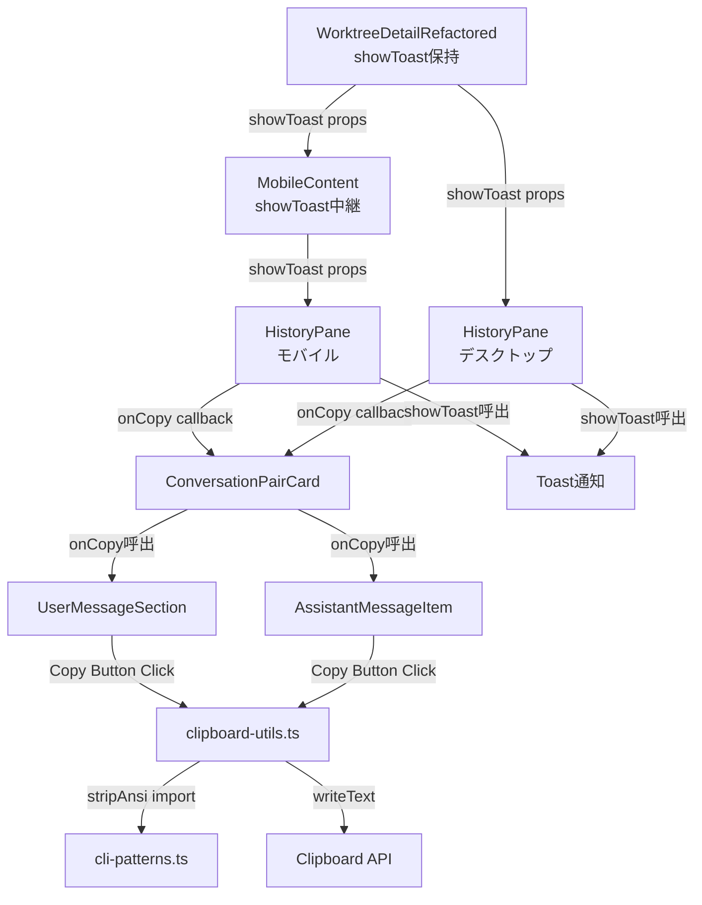

# 設計方針書: Issue #211 - 履歴メッセージコピーボタン機能

## 1. 概要

### 目的
HistoryPane（履歴タブ）に表示される各メッセージ（ユーザー入力・Assistant応答）にコピーボタンを追加し、メッセージ内容をクリップボードにコピーできるようにする。

### スコープ
- Phase 1（本Issue）: ConversationPairCard（現行コンポーネント）へのコピーボタン追加
- Phase 2（別Issue化）: MessageList（レガシーコンポーネント）へのコピーボタン追加は、MessageListの構造（ReactMarkdown、AnsiToHtml、カスタム比較関数等）がConversationPairCardと大きく異なるため、別Issueとして設計・実装する（SF-2対応）

---

## 2. アーキテクチャ設計

### コンポーネント階層とデータフロー



> **注意（MF-S2-1対応）**: 上記ダイアグラムのコンポーネント位置は設計時点のソースコードに基づく。行番号は実装の進行に伴いずれる可能性があるため、特定の行番号への依存を避け、コンポーネント名・Props名で参照すること。

### レイヤー構成

| レイヤー | ファイル | 責務 |
|---------|---------|------|
| プレゼンテーション | `ConversationPairCard.tsx` | コピーボタンUI表示、クリック時に`onCopy`呼出 |
| 統合 | `HistoryPane.tsx` | `showToast` + `copyToClipboard`を組み合わせた`onCopy`コールバック作成 |
| Props伝搬（デスクトップ） | `WorktreeDetailRefactored.tsx` | `showToast`をHistoryPaneに直接渡す |
| Props伝搬（モバイル） | `WorktreeDetailRefactored.tsx` -> `MobileContent` | `showToast`をMobileContent経由でHistoryPaneに渡す（SF-S2-2対応） |
| ユーティリティ | `clipboard-utils.ts` | クリップボードコピーのラッパー関数（stripAnsi + writeText） |
| 既存共通 | `cli-patterns.ts` | `stripAnsi()`関数（変更なし） |
| 既存共通 | `Toast.tsx` | `useToast`フック（変更なし） |

---

## 3. 技術選定

| カテゴリ | 選定技術 | 選定理由 |
|---------|---------|---------|
| クリップボードAPI | `navigator.clipboard.writeText()` | モダンブラウザ標準API、非同期対応 |
| アイコン | lucide-react `Copy` | プロジェクト既存のアイコンライブラリ（C-S2-1: v0.554.0でのCopyアイコン存在を実装時に確認すること） |
| ANSI除去 | `stripAnsi()` from `cli-patterns.ts` | 既存関数の再利用、DRY原則 |
| Toast通知 | 既存`useToast`フック | 新規コンポーネント追加不要 |
| メモ化 | `React.memo` + `useCallback` | 既存パターンとの一貫性 |

---

## 4. 設計パターン

### 4.1 Props Drilling パターン（Toast伝搬）

`showToast`をprops経由で伝搬する。Context APIは使用しない。

**デスクトップレイアウト（2段伝搬）**:
`WorktreeDetailRefactored` -> `HistoryPane` -> `ConversationPairCard`

**モバイルレイアウト（3段伝搬）（SF-S2-2対応）**:
`WorktreeDetailRefactored` -> `MobileContent` -> `HistoryPane` -> `ConversationPairCard`

> **重要（SF-S2-2対応）**: モバイルレイアウトではWorktreeDetailRefactoredがHistoryPaneを直接レンダリングせず、MobileContentコンポーネントを経由する。そのため、MobileContentPropsにも`showToast`プロパティを追加し、MobileContent内でHistoryPaneに中継する必要がある。実装時にMobileContentのProps型定義を更新すること。

**理由**:
- デスクトップは伝搬レイヤーが2段、モバイルは3段（MobileContent経由）
- 既存の`onFilePathClick`と同じパターン
- Context導入のオーバーヘッドが伝搬コストを上回る

### 4.2 Callback合成パターン（HistoryPaneでの統合）

HistoryPaneが`showToast` + `copyToClipboard`を合成した`onCopy`コールバックを作成し、ConversationPairCardに渡す。

**重要（MF-1対応）**: HistoryPaneのonCopyコールバックは必ず`clipboard-utils.ts`の`copyToClipboard`関数を呼び出す。`stripAnsi` + `navigator.clipboard.writeText`をHistoryPane内に直接記述してはならない（DRY原則）。

```typescript
// HistoryPane内
import { copyToClipboard } from '@/lib/clipboard-utils';

const onCopy = useCallback(async (content: string) => {
  try {
    await copyToClipboard(content);
    showToast?.('コピーしました', 'success');
  } catch (error) {
    if (showToast) {
      showToast('コピーに失敗しました', 'error');
    } else {
      // SF-S4-3: errorオブジェクトのみログ出力。コピー対象のcontent（ユーザーデータ）は
      // 意図的にログに含めない（機密情報漏洩防止）
      console.warn('Clipboard copy failed:', error);
    }
  }
}, [showToast]);
```

**理由**:
- ConversationPairCardの責務をUI表示に限定
- クリップボード操作のロジックを`clipboard-utils.ts`に一元化（DRY原則）
- Toast通知のロジックをHistoryPaneに集約
- テスタビリティ向上（`onCopy`をモック可能）

**エラーログのセキュリティに関する注意（SF-S4-3対応）**:
- `console.warn('Clipboard copy failed:', error)` はerrorオブジェクトのみをログ出力する
- コピー対象のメッセージ内容（`content`パラメータ）はログに含めてはならない。メッセージ内容にはユーザーの入力やAssistantの応答が含まれるため、エラーログへの出力はデータ漏洩リスクとなる
- この設計は意図的であり、OWASP A09:2021（Security Logging and Monitoring Failures）の観点から、ログに必要な情報（エラー種別）のみを記録する方針である

### 4.3 Optional Propsパターン（後方互換性）

新規propsを全てオプショナル（`?:`）とすることで、既存コードとテストへの影響を最小化する。

```typescript
interface HistoryPaneProps {
  // ... 既存props
  showToast?: (message: string, type?: ToastType, duration?: number) => string;
}

interface MobileContentProps {
  // ... 既存props
  showToast?: (message: string, type?: ToastType, duration?: number) => string;
  // SF-S2-2対応: MobileContentがHistoryPaneにshowToastを中継するため追加
}

interface ConversationPairCardProps {
  // ... 既存props
  onCopy?: (content: string) => void;
}
```

**`showToast`型シグネチャの補足（SF-S2-1対応）**:
- `type`引数のデフォルト値は`'info'`（useToastフック内部で設定）
- `duration`引数のデフォルト値は`DEFAULT_DURATION`（Toast.tsx内の定数）
- 戻り値の`string`はToast IDを返す（removeToastでの個別削除に使用可能）
- 設計書上の型定義と実装の型は互換性があるが、実装時はuseToastのデフォルト値に依存して引数省略可能であることを認識しておくこと

**`showToast`未提供時の挙動（SF-3対応）**:
- コピーボタンは表示する
- クリップボードコピーは実行する
- 成功時: Toast通知は省略（クリップボードコピーのみ実行）
- **エラー時**: `showToast`が未提供の場合は`console.warn`でエラーログを出力する。ユーザーにエラーが全く伝わらないサイレントフェイルを防止する（Section 4.2のコード例参照）

---

## 5. コンポーネント設計

### 5.1 clipboard-utils.ts（新規作成）

```typescript
// src/lib/clipboard-utils.ts
import { stripAnsi } from '@/lib/cli-patterns';

/**
 * テキストをクリップボードにコピーする
 * ANSIエスケープコードは除去してからコピーする
 *
 * 注意: stripAnsiにはSEC-002既知制限あり（8-bit CSI、DEC private modes、
 * character set switching、一部RGB color形式が未対応）。
 * tmux capture-pane出力では通常発生しないため現時点では許容する。
 * 詳細はcli-patterns.tsのSEC-002コメントを参照。
 */
export async function copyToClipboard(text: string): Promise<void> {
  // SF-S4-1: 空文字列・空白のみの入力に対する防御的ガード
  if (!text || text.trim().length === 0) {
    return; // no-op: 無意味なClipboard API呼び出しを防止
  }
  const cleanText = stripAnsi(text);
  await navigator.clipboard.writeText(cleanText);
}
```

**設計判断**:
- `stripAnsi`は`cli-patterns.ts`から再利用（DRY原則）
- **clipboard-utils.tsがクリップボードコピーの唯一のエントリポイントである**（MF-1対応: HistoryPane等でstripAnsi + writeTextを直接呼ばない）
- エラーハンドリングは呼び出し元（HistoryPane）で行う
- `document.execCommand('copy')`フォールバックは不要（localhostはセキュアコンテキスト）
- **空文字列・空白文字列の入力バリデーション**（SF-S4-1対応）: TypeScript型だけではランタイムの不正値を防げないため、防御的にガードする。tmux capture-pane出力が空の場合やmessage.contentが空文字列の場合に、不要なstripAnsi処理やClipboard API呼び出しを回避する
- **stripAnsi既知制限のドキュメント化**（SF-S4-2対応）: clipboard-utils.tsのJSDocコメントにSEC-002参照を追加し、既知のANSIストリップ漏れがクリップボード内容に残存する可能性があることを明示する。writeTextはプレーンテキスト専用のためセキュリティリスクはないが、データ完全性の観点で開発者に認知させる

### 5.2 ConversationPairCard コピーボタン配置

```
+-----------------------------------------+
| [You]  2024-01-01 12:00    [Copy]       |  <- UserMessageSection
| ユーザーメッセージ内容                   |     右上シンプル配置
|                                         |
+-----------------------------------------+
| [Assistant] (1/2)         [Copy][展開]  |  <- AssistantMessageItem
| アシスタント応答内容                     |     展開ボタンの左隣
|                                         |
+-----------------------------------------+
```

**UserMessageSection**:
- 展開ボタンなし -> コピーボタンを`absolute top-2 right-2`に配置
- **実装注意（C-S2-2対応）**: UserMessageSectionのルートdivに`position: relative`（Tailwindの`relative`クラス）が設定されていない場合、absolute配置の基準が親要素に遡ってしまう。実装時にUserMessageSectionのルート要素に`relative`クラスを追加すること

**AssistantMessagesSection**:
- 展開ボタンが`absolute top-2 right-2`に存在 -> コピーボタンを`right-10 top-2`に配置（展開ボタンの左隣）
- **実装注意（C-S2-3対応）**: AssistantMessagesSectionを包むdivに既に`relative`が設定されており、その中でexpand/collapseボタンが`absolute top-2 right-2`に配置されている。コピーボタンを`right-10 top-2`で展開ボタンの左隣に配置するには、同じrelativeコンテナ内に配置するか、AssistantMessageItem自体をrelativeにする必要がある。実装時にレイアウトを検証し、ボタン同士の重なりがないことを確認すること

### 5.3 コピーボタンコンポーネント仕様

```typescript
// ConversationPairCard内のインラインコンポーネント
// SF-1対応: useCallbackでラップせず、直接onCopy?.(message.content)を呼ぶ
<button
  onClick={() => onCopy?.(message.content)}
  className="absolute top-2 right-2 p-1 text-gray-400 hover:text-gray-200 transition-colors"
  aria-label="Copy message"
  title="Copy"
>
  <Copy size={14} />
</button>
```

**アクセシビリティ（C-3対応）**:
- `aria-label="Copy message"` -- 既存コードベースの英語aria-labelパターンに合わせる
- `title="Copy"` -- 英語で統一
- Toast通知は日本語（'コピーしました'）を維持 -- 既存パターンに準拠
- Toast通知は既存の`role="alert"`で読み上げ対応済み

**テスト識別用data-testid（SF-S3-1対応）**:

コピーボタンのテスト追加時には`aria-label`やロールによるクエリではなく、`data-testid`属性を使用して各ボタンを一意に特定すること。ConversationPairCardにはユーザーメッセージ側とアシスタントメッセージ側の2つのコピーボタンが存在するため、`getByRole('button', { name: /copy/i })`では複数ヒットしてテストが不安定になるリスクがある。

推奨する`data-testid`命名規則:
- ユーザーメッセージのコピーボタン: `data-testid="copy-user-message"`
- アシスタントメッセージのコピーボタン: `data-testid="copy-assistant-message"`

```typescript
// UserMessageSection内
<button
  onClick={() => onCopy?.(message.content)}
  className="absolute top-2 right-2 p-1 text-gray-400 hover:text-gray-200 transition-colors"
  aria-label="Copy message"
  title="Copy"
  data-testid="copy-user-message"
>
  <Copy size={14} />
</button>

// AssistantMessageItem内
<button
  onClick={() => onCopy?.(message.content)}
  className="absolute top-2 right-10 p-1 text-gray-400 hover:text-gray-200 transition-colors"
  aria-label="Copy message"
  title="Copy"
  data-testid="copy-assistant-message"
>
  <Copy size={14} />
</button>
```

テスト内では以下のようにdata-testidでボタンを特定する:
```typescript
// 推奨: data-testidで一意に特定
const userCopyButton = screen.getByTestId('copy-user-message');
const assistantCopyButton = screen.getByTestId('copy-assistant-message');

// 非推奨: aria-labelやロールでは複数ヒットする可能性がある
// screen.getByRole('button', { name: /copy/i }) -- 2つのコピーボタンが存在するため不安定
```

---

## 6. メモ化戦略

### 既存のメモ化パターンとの整合（Phase 1スコープのみ）

| コンポーネント | メモ化方式 | コピー機能追加時の考慮 |
|---------------|-----------|---------------------|
| `ConversationPairCard` | `React.memo()` | `onCopy`はHistoryPaneのuseCallbackで安定化済み。ConversationPairCard内でのuseCallbackラップは不要 |
| `UserMessageSection` | `React.memo()` | `onCopy`参照が安定なら再レンダリングなし |
| `AssistantMessageItem` | `React.memo()` | 同上 |
| `AssistantMessagesSection` | `React.memo()` | 同上 |

> **注意（SF-S2-3対応）**: `MessageBubble`（`React.memo(customCompare)`）はMessageList.tsx内のコンポーネントであり、Phase 1のConversationPairCardスコープには含まれない。MessageBubbleのカスタム比較関数への影響はPhase 2（別Issue）で検討する。

### コールバック安定化の連鎖（SF-1対応: 簡素化）

```
WorktreeDetailRefactored
  showToast <- useCallback([], []) で安定 (Toast.tsx内)

HistoryPane
  onCopy <- useCallback([showToast]) で安定
           showToastが安定 -> onCopyも安定

ConversationPairCard
  onCopyをprops経由で受け取り、各メッセージのコピーボタンで直接呼び出す
  例: onClick={() => onCopy?.(message.content)}
  ※ handleCopy useCallbackは不要（SF-1: KISS/YAGNI原則）
  理由: onCopyが安定参照であれば、onClick内のアロー関数はReact.memoで
        適切にフィルタされるためuseCallbackラップは不要な複雑さ
```

### showToast参照安定性の依存関係に関する注意（SF-S3-3対応）

上記のコールバック安定化チェーンは、`showToast`の参照安定性が`useToast`フック（Toast.tsx）内の`useCallback([], [])`（空の依存配列）に依存している。この実装詳細に基づく前提を明記する。

**現時点の安全性**:
- `useToast`内の`showToast`は空の依存配列`[]`で`useCallback`されているため、コンポーネントのライフサイクル中に参照が変わることはない
- これにより`HistoryPane`の`onCopy`（`useCallback([showToast])`）も安定し、`MobileContent`の`React.memo`によるshallow compareでも不要な再レンダリングは発生しない

**将来のリスク**:
- `useToast`の実装が変更され、`showToast`の`useCallback`に依存値が追加された場合、`showToast`の参照が不安定になる可能性がある
- その場合、`MobileContent`（`React.memo`）が`showToast`の参照変更を検知し、不要な再レンダリングが連鎖する
- 対策: `useToast`の`showToast`安定性が変更された場合は、`MobileContent`側で`useMemo`による参照安定化か、`React.memo`のカスタム比較関数で`showToast`を比較対象から除外する等の対応を検討する

> **注記**: この依存関係は既にSection 6のメモ化戦略表で暗黙的に前提としていたが、SF-S3-3の指摘を受けてリスクを明示的にドキュメント化した。

---

## 7. テスト戦略

### 7.1 新規テスト

| テストファイル | テスト内容 |
|--------------|-----------|
| `src/lib/__tests__/clipboard-utils.test.ts` | `copyToClipboard`関数のテスト: Clipboard API呼出確認、stripAnsi適用確認、エラーハンドリング |
| ConversationPairCard追加テスト | コピーボタン表示確認、クリックイベントで`onCopy`呼出確認、`onCopy`未提供時の挙動 |

### 7.2 既存テストへの影響

| テストファイル | 影響度 | 理由 |
|--------------|-------|------|
| `src/components/worktree/__tests__/ConversationPairCard.test.tsx` | 低 | `onCopy`がオプショナルのため既存テスト破損なし |
| `HistoryPane.integration.test.tsx` | 低 | `showToast`がオプショナルのため既存テスト破損なし |
| `HistoryPane.test.tsx` | 低 | 同上 |
| `MessageListOptimistic.test.tsx` | なし | Phase 1スコープ外（Phase 2を別Issue化したため） |

### 7.3 追加推奨テスト（SF-S3-2対応）

HistoryPane.integration.test.tsxの既存テストは全てshowToast propsなしで動作しており、コピー機能の統合テストが欠如している。品質保証のギャップを埋めるため、以下の統合テストケースを追加することを推奨する。

| テストケース | 内容 | 優先度 |
|-------------|------|--------|
| showToast付きコピー成功 | showToastをモック関数として提供した状態でHistoryPaneをレンダリングし、コピーボタンクリック後にshowToastが`('コピーしました', 'success')`で呼ばれることを確認 | 高 |
| showToastなしコピーボタン表示 | showToast未提供でもコピーボタンが表示され、クリック可能であることを確認（クリップボードコピーは実行されるがToast通知はスキップされる） | 中 |

```typescript
// テスト例（HistoryPane.integration.test.tsx追加分）
describe('コピー機能統合テスト', () => {
  it('showToast提供時にコピーボタンクリックでToast通知される', async () => {
    const mockShowToast = vi.fn();
    render(<HistoryPane {...defaultProps} showToast={mockShowToast} />);

    const copyButton = screen.getByTestId('copy-user-message');
    await userEvent.click(copyButton);

    expect(mockShowToast).toHaveBeenCalledWith('コピーしました', 'success');
  });

  it('showToast未提供でもコピーボタンが表示される', () => {
    render(<HistoryPane {...defaultProps} />);

    const copyButtons = screen.queryAllByTestId(/^copy-/);
    expect(copyButtons.length).toBeGreaterThan(0);
  });
});
```

---

## 8. 変更対象ファイル一覧

### 新規作成

| ファイル | 内容 |
|---------|------|
| `src/lib/clipboard-utils.ts` | クリップボードコピーユーティリティ |
| `src/lib/__tests__/clipboard-utils.test.ts` | ユーティリティのテスト |

### 変更

| ファイル | 変更概要 | 変更規模 |
|---------|---------|---------|
| `src/components/worktree/ConversationPairCard.tsx` | Props型追加、コピーボタンUI追加 | 中 |
| `src/components/worktree/HistoryPane.tsx` | Props型追加、onCopyコールバック作成（copyToClipboard使用） | 小 |
| `src/components/worktree/WorktreeDetailRefactored.tsx` | showToast props伝搬（デスクトップ: 直接、モバイル: MobileContent経由の2箇所） | 小 |
| `src/components/worktree/WorktreeDetailRefactored.tsx` 内 `MobileContent` | MobileContentPropsに`showToast`追加、HistoryPaneへの中継（SF-S2-2対応） | 小 |

### Phase 2（別Issue）で対応

| ファイル | 変更概要 | 備考 |
|---------|---------|------|
| `src/components/worktree/MessageList.tsx` | コピーボタンUI追加 | SF-2対応: MessageListの構造が異なるため別Issue化 |

### 変更なし（依存のみ）

| ファイル | 役割 |
|---------|------|
| `src/components/common/Toast.tsx` | useToastフック提供（既存活用） |
| `src/lib/cli-patterns.ts` | stripAnsi関数提供（既存活用） |
| `src/types/conversation.ts` | ConversationPair型定義 |
| `src/types/markdown-editor.ts` | ToastType型定義 |

---

## 9. 設計上の決定事項とトレードオフ

### 採用した設計

| 決定事項 | 理由 | トレードオフ |
|---------|------|-------------|
| Props Drilling（Context不使用） | デスクトップ2段/モバイル3段（MobileContent経由）で浅い、既存パターンとの一貫性 | 伝搬段数が増えた場合のスケーラビリティ |
| オプショナルProps | 後方互換性確保、既存テスト破損回避 | showToast未提供時のUX劣化（Toast非表示）。エラー時はconsole.warnで最低限のフィードバック確保 |
| stripAnsi再利用 | DRY原則、保守性向上 | cli-patternsへの依存追加 |
| HistoryPaneでのCallback合成 | ロジック集約、ConversationPairCardの単純性維持 | HistoryPaneの責務やや増加 |
| コピーボタン常時表示 | ユーザビリティ向上（ホバー不要） | UI密度の増加 |
| clipboard-utils.tsに操作一元化 | DRY原則（MF-1）、保守性向上 | 極小ファイル追加 |
| ConversationPairCard内useCallback不使用 | KISS/YAGNI原則（SF-1）、onCopyが安定参照で十分 | N/A（単純化のため） |
| Phase 2別Issue化 | YAGNI原則（SF-2）、MessageListの構造差異を適切に設計 | Phase 2実装の開始時期不確定 |
| MobileContent経由のshowToast伝搬 | モバイルレイアウトの実際のコンポーネント階層に合致（SF-S2-2） | MobileContentPropsの拡張が必要 |

### 不採用とした代替案

| 代替案 | 不採用理由 |
|--------|-----------|
| Context APIでToast伝搬 | 伝搬が浅いためオーバーエンジニアリング |
| ConversationPairCard内でuseToast | 既存パターンと不整合、ToastContainerの二重配置リスク |
| document.execCommand('copy')フォールバック | 非推奨API、localhostはセキュアコンテキストで不要 |
| ホバー時のみコピーボタン表示 | モバイルデバイスでホバー不可、アクセシビリティ低下 |
| 新規ANSIストリップ実装 | 既存stripAnsi関数があるためDRY原則違反 |
| HistoryPane内でstripAnsi+writeText直接記述 | clipboard-utils.tsとのロジック二重化（MF-1 DRY違反） |
| ConversationPairCard内handleCopy useCallback | 不要な複雑さ（SF-1 KISS/YAGNI違反） |
| MobileContent内でuseToastを直接使用 | ToastContainer二重配置リスク、Props伝搬パターンとの不整合（SF-S2-2検討の上不採用） |

---

## 10. セキュリティ考慮

| 項目 | 対応 |
|------|------|
| Clipboard API | セキュアコンテキスト（HTTPS/localhost）でのみ動作。CommandMateはlocalhost運用のため問題なし |
| XSS | コピー内容はプレーンテキストのみ（HTMLコピーなし）、writeTextはテキストエスケープ不要。React auto-escapingによりUI表示もXSS安全（C-S4-2） |
| ユーザーデータ | クリップボードへのコピーはユーザーの明示的なアクション（ボタンクリック）で実行 |
| 入力バリデーション | copyToClipboard関数で空文字列・空白のみ入力に対する防御的ガード実装（SF-S4-1: OWASP A03入力検証） |
| ANSI除去の既知制限 | stripAnsiにSEC-002既知制限あり（8-bit CSI、DEC private modes等が未対応）。writeTextがプレーンテキスト専用のためセキュリティリスクはないが、貼り付け先で文字化けの可能性がある（SF-S4-2: OWASP A03出力エンコーディング） |
| エラーログ | catch句のconsole.warnではerrorオブジェクトのみ出力し、コピー対象のメッセージ内容はログに含めない（SF-S4-3: OWASP A09機密情報漏洩防止） |
| CSRF | コピー操作は完全にクライアントサイドでありサーバー状態変更なし。CSRF攻撃面なし（C-S4-3） |
| CSP | 既存のCSP/Permissions-Policyはclipboard-writeを制限しておらず、機能追加なしで動作（C-S4-4） |

### OWASP Top 10 チェックリスト（Stage 4セキュリティレビュー結果）

| OWASP カテゴリ | 判定 | 備考 |
|---------------|------|------|
| A01: Broken Access Control | pass | コピー操作はクライアントサイドのみ。認可バイパス不可 |
| A02: Cryptographic Failures | N/A | 暗号操作なし |
| A03: Injection | pass | writeTextはプレーンテキスト（HTML注入なし）。React auto-escapingでXSS防止。stripAnsiでANSIコード除去 |
| A04: Insecure Design | pass | 防御的設計: stripAnsiサニタイズ、Optional Propsで後方互換、clipboard-utils.ts単一エントリポイント |
| A05: Security Misconfiguration | pass | 既存CSP/セキュリティヘッダーと互換。Clipboard APIはlocalhostセキュアコンテキストで動作 |
| A06: Vulnerable Components | pass | 新規依存なし。stripAnsiは既存コード。lucide-react Copyは既存依存 |
| A07: Auth Failures | N/A | 認証不要（ローカル開発ツール） |
| A08: Software Data Integrity | pass | 信頼できないデータのシリアライズ/デシリアライズなし |
| A09: Logging Monitoring | pass（注記あり） | エラーログにメッセージ内容を含めない設計（SF-S4-3） |
| A10: SSRF | N/A | サーバーサイドリクエストなし |

---

## 11. パフォーマンス考慮

| 項目 | 対応 |
|------|------|
| 再レンダリング | 全サブコンポーネントがReact.memoで保護済み、HistoryPaneのuseCallbackでonCopy参照安定化 |
| メモリ | コピー内容は一時的（クリップボードAPI呼出後に解放） |
| イベント | コピーボタンのonClickは軽量（copyToClipboard + Toast呼出のみ） |

---

## 12. 実装順序

```
1. clipboard-utils.ts 新規作成 + テスト
2. ConversationPairCard.tsx Props型追加 + コピーボタンUI（直接onCopy呼出、useCallback不使用）
3. HistoryPane.tsx Props型追加 + onCopyコールバック作成（copyToClipboard使用）
4. WorktreeDetailRefactored.tsx showToast伝搬
   4a. デスクトップ: WorktreeDetailRefactored -> HistoryPaneに直接props渡し
   4b. モバイル: MobileContentPropsにshowToast追加 -> MobileContent内でHistoryPaneに中継（SF-S2-2対応）
5. 既存テスト確認・修正
```

**注意**: MessageList.tsxへのコピーボタン追加（Phase 2）は別Issueとして対応する。

---

## 13. 将来の検討事項

以下はレビューで示された将来検討項目であり、本Issueのスコープには含まない。

| ID | 項目 | 検討時期 |
|----|------|---------|
| C-1 | コピーボタンを独立コンポーネント（CopyButton）として抽出 | Phase 2実装時に共通化を検討。Phase 1ではインラインで進める（YAGNI原則） |
| C-3 | aria-label言語の統一 | 設計書のコード例を英語に修正済み（Section 5.3参照）。実装時は既存コードベースの英語パターンに合わせること |
| C-S2-1 | lucide-react v0.554.0でのCopyアイコン存在確認 | 実装開始時に`import { Copy } from 'lucide-react'`が正常にビルドできることを確認。現在のコードベースにCopyアイコンの使用実績がないため、ビルド時の確認を推奨 |
| C-S2-2 | UserMessageSectionのposition: relative追加 | 実装時にUserMessageSectionのルートdivに`relative`クラスが必要。Section 5.2参照 |
| C-S2-3 | AssistantMessagesSection内のコピーボタン配置とexpand/collapseボタンとの共存 | 既存のrelativeコンテナ内でのabsolute配置の競合を実装時に検証。Section 5.2参照 |

---

## 14. 実装チェックリスト

### Phase 1 実装チェック

- [ ] **clipboard-utils.ts**: `copyToClipboard`関数を新規作成（stripAnsi + writeText）
- [ ] **clipboard-utils.ts**: 空文字列・空白のみの入力に対する防御的ガードを実装 -- `if (!text || text.trim().length === 0) return;`（SF-S4-1: 不要なClipboard API呼び出し防止）
- [ ] **clipboard-utils.ts**: JSDocコメントにSEC-002既知制限への参照を追加 -- stripAnsiが対応しないANSIパターン（8-bit CSI、DEC private modes、character set switching、一部RGB color）がクリップボード内容に残存する可能性があることを明記（SF-S4-2）
- [ ] **clipboard-utils.test.ts**: Clipboard API呼出確認、stripAnsi適用確認、エラーハンドリングテスト
- [ ] **clipboard-utils.test.ts**: 空文字列入力時にClipboard APIが呼ばれないことを確認するテスト（SF-S4-1）
- [ ] **clipboard-utils.test.ts**: 空白のみ入力時にClipboard APIが呼ばれないことを確認するテスト（SF-S4-1）
- [ ] **HistoryPane.tsx**: onCopyコールバックで`copyToClipboard`関数を使用すること（MF-1: stripAnsi+writeTextを直接記述しない）
- [ ] **HistoryPane.tsx**: onCopyのcatch句で`showToast`未提供時に`console.warn`でエラーログ出力（SF-3）。ログにはerrorオブジェクトのみ含め、コピー対象のメッセージ内容（content）は含めないこと（SF-S4-3: 機密情報漏洩防止）
- [ ] **ConversationPairCard.tsx**: `onCopy`をpropsで受け取り、各コピーボタンのonClickで直接`onCopy?.(message.content)`を呼ぶ（SF-1: handleCopy useCallbackは作成しない）
- [ ] **ConversationPairCard.tsx**: aria-labelは英語（`"Copy message"`）、titleは英語（`"Copy"`）で統一（C-3）
- [ ] **ConversationPairCard.tsx**: コピーボタンにdata-testid属性を付与すること -- ユーザーメッセージ側: `data-testid="copy-user-message"`、アシスタントメッセージ側: `data-testid="copy-assistant-message"`（SF-S3-1: テストでの一意特定のため）
- [ ] **ConversationPairCard.tsx**: UserMessageSectionのルートdivに`relative`クラスを追加（C-S2-2: absolute配置の基準要素として必要）
- [ ] **ConversationPairCard.tsx**: AssistantMessagesSection内のコピーボタン配置がexpand/collapseボタンと重ならないことを確認（C-S2-3）
- [ ] **WorktreeDetailRefactored.tsx**: デスクトップレイアウトでshowToastをHistoryPaneに直接伝搬
- [ ] **WorktreeDetailRefactored.tsx**: モバイルレイアウトでMobileContentPropsに`showToast`を追加し、MobileContent内でHistoryPaneにshowToastを中継（SF-S2-2）
- [ ] **lucide-react**: `Copy`アイコンのimportがビルド可能であることを確認（C-S2-1）
- [ ] **MessageList.tsx**: 本Issueでは変更しない（SF-2: Phase 2別Issue化）
- [ ] **メモ化戦略**: MessageBubbleはPhase 1スコープ外であることを確認。Phase 1のメモ化影響はConversationPairCard配下のコンポーネントのみ（SF-S2-3）
- [ ] **HistoryPane.integration.test.tsx**: showToast提供時のコピーボタン統合テストを追加 -- showToastモック + コピーボタンクリック -> showToast呼出確認（SF-S3-2）
- [ ] **HistoryPane.integration.test.tsx**: showToast未提供時のコピーボタン表示確認テストを追加 -- showToastなしでもコピーボタンが表示されることを確認（SF-S3-2）
- [ ] **メモ化安定性**: showToastの参照安定性がuseToast内のuseCallback([])に依存していることを認識し、将来useToastの実装変更時にMobileContentの再レンダリング影響を確認すること（SF-S3-3）
- [ ] 既存テスト（ConversationPairCard.test.tsx、HistoryPane.test.tsx等）が破損しないことを確認
- [ ] ESLint、TypeScript型チェック通過

---

## 15. レビュー履歴

| レビュー日 | ステージ | 結果 | スコア |
|-----------|---------|------|--------|
| 2026-02-10 | Stage 1: 通常レビュー | conditionally_approved | 4/5 |
| 2026-02-10 | Stage 2: 整合性レビュー | conditionally_approved | 4/5 |
| 2026-02-10 | Stage 3: 影響分析レビュー | conditionally_approved | 4/5 |
| 2026-02-10 | Stage 4: セキュリティレビュー | conditionally_approved | 4/5 |

---

## 16. レビュー指摘事項サマリー（Stage 1）

### Must Fix

| ID | タイトル | 原則 | 重要度 | 対応内容 | 対応箇所 |
|----|---------|------|--------|---------|---------|
| MF-1 | clipboard-utils.tsの責務二重化（DRY違反） | DRY / SRP | medium | HistoryPaneのonCopyからcopyToClipboard関数を呼ぶ形に統一。Section 4.2のコード例を修正 | Section 4.2, 5.1, 8, 9, 14 |

### Should Fix

| ID | タイトル | 原則 | 重要度 | 対応内容 | 対応箇所 |
|----|---------|------|--------|---------|---------|
| SF-1 | ConversationPairCard handleCopy useCallback不要 | KISS / YAGNI | low | handleCopy useCallbackを削除し、直接onCopy?.(message.content)を呼ぶ設計に変更 | Section 5.3, 6, 9, 14 |
| SF-2 | Phase 2 MessageList.tsx設計詳細不足 | YAGNI / KISS | low | Phase 2を別Issue化。本設計書のスコープをPhase 1のみに限定 | Section 1, 8, 12, 14 |
| SF-3 | showToast未提供時のサイレントフェイル | SRP / Robustness | low | catch句内でshowToast未提供時はconsole.warnでエラーログ出力する方針を明記 | Section 4.2, 4.3, 9, 14 |

### Consider（将来検討）

| ID | タイトル | 原則 | 対応方針 |
|----|---------|------|---------|
| C-1 | CopyButton独立コンポーネント抽出 | OCP | Phase 2時に検討 |
| C-2 | MobileContentProps showToast追加 | Consistency / ISP | SF-S2-2で対応済み（設計書に明記） |
| C-3 | aria-label言語統一 | Consistency | 英語に統一（設計書修正済み） |

---

## 17. レビュー指摘事項サマリー（Stage 2: 整合性レビュー）

### Must Fix

| ID | タイトル | 原則 | 重要度 | 対応内容 | 対応箇所 |
|----|---------|------|--------|---------|---------|
| MF-S2-1 | 設計書のHistoryPane行番号がソースコードと不一致リスク | 整合性 | low | Mermaidダイアグラムから具体的な行番号参照を削除し、コンポーネント名ベースの参照に変更。行番号はソースコード変更で容易にずれるため設計書に含めない方針とした | Section 2 |

### Should Fix

| ID | タイトル | 原則 | 重要度 | 対応内容 | 対応箇所 |
|----|---------|------|--------|---------|---------|
| SF-S2-1 | showToast型シグネチャの設計書記載が実装と微差あり | 整合性 | low | showToastの引数デフォルト値（type='info'、duration=DEFAULT_DURATION）と戻り値（string=Toast ID）の説明をSection 4.3に追記 | Section 4.3 |
| SF-S2-2 | MobileContentPropsにshowToast伝搬の記述が設計書に不足 | 整合性 | medium | モバイルレイアウトのWorktreeDetailRefactored -> MobileContent -> HistoryPaneの3段伝搬を設計書全体で明確化。MobileContentPropsにshowToast追加、Mermaidダイアグラム更新、レイヤー構成表更新、実装チェックリスト追加。旧C-2を解決済みに変更 | Section 2, 4.1, 4.3, 8, 9, 12, 14 |
| SF-S2-3 | MessageBubbleがConversationPairCard内に存在しない | 整合性 | low | Phase 1メモ化戦略表からMessageBubbleを削除し、Phase 2スコープである旨の注記を追加 | Section 6 |

### Consider（将来検討）

| ID | タイトル | 対応方針 |
|----|---------|---------|
| C-S2-1 | lucide-react v0.554.0でのCopyアイコン存在確認 | 実装時にビルド確認。Section 3, 13, 14に注記追加 |
| C-S2-2 | UserMessageSectionのposition: relative未設定 | 実装時にrelativeクラス追加が必要。Section 5.2, 14に注記追加 |
| C-S2-3 | AssistantMessageItemのabsolute配置がAssistantMessagesSectionレベルで競合 | 実装時にレイアウト検証が必要。Section 5.2, 14に注記追加 |
| C-S4-1 | Clipboard API機能検出ガード（navigator.clipboard存在チェック） | モダンブラウザ+localhostでは低リスク。非対応環境でのエラーメッセージ改善として将来検討 |
| C-S4-2 | Phase 2 MessageListのXSSセキュリティレビュー | Phase 2（dangerouslySetInnerHTML使用）実装時に別途セキュリティレビューが必要 |

---

## 18. レビュー指摘事項サマリー（Stage 3: 影響分析レビュー）

### Must Fix

なし

### Should Fix

| ID | タイトル | カテゴリ | 重要度 | 対応内容 | 対応箇所 |
|----|---------|---------|--------|---------|---------|
| SF-S3-1 | ConversationPairCardテスト -- onCopy追加後のaria-labelクエリ競合リスク | 影響範囲 | low | コピーボタンにdata-testid属性（`copy-user-message`、`copy-assistant-message`）を付与する設計指針を追加。テストではdata-testidでボタンを一意に特定し、aria-label/ロールベースのクエリ競合を回避する | Section 5.3, 14 |
| SF-S3-2 | HistoryPane.integration.test.tsx -- showToastなしのテストがデフォルト動作確認として不十分 | 影響範囲 | low | HistoryPane統合テストにshowToast提供時のコピー機能テストケース2件を追加する推奨を明記。具体的なテストコード例をSection 7.3に追加 | Section 7.3, 14 |
| SF-S3-3 | WorktreeDetailRefactored -- showToastのuseCallback依存配列空による安定性とMobileContent Props追加時のReact.memo影響 | 影響範囲 | low | showToastの参照安定性がuseToast内のuseCallback([])に依存していることを明示的にドキュメント化。将来のuseToast実装変更時のリスクと対策をSection 6に追記 | Section 6, 14 |

### Consider（将来検討）

| ID | タイトル | 対応方針 |
|----|---------|---------|
| C-S3-1 | clipboard-utils.tsの新規作成がテスト環境でのClipboard APIモック要件を生む | clipboard-utils.test.ts固有のセットアップとして認識。jsdom環境でnavigator.clipboard.writeTextのグローバルモック設定が必要 |
| C-S3-2 | lucide-react Copyアイコンのバンドルサイズへの影響 | tree-shaking対応により影響は最小限（数百バイト）。現時点では対応不要 |
| C-S3-3 | UserMessageSectionへのrelativeクラス追加がレイアウトに与える影響 | 実装時に視覚確認で対応。現時点ではabsolute子要素がないため影響なし |
| C-S3-4 | AssistantMessagesSection内のexpand/collapseボタンとコピーボタンの共存によるタッチターゲットの密接 | ボタンサイズが小さいため実際の距離は確保される可能性が高い。実装時にモバイルデバイスでの操作性を確認 |

---

## 19. レビュー指摘事項サマリー（Stage 4: セキュリティレビュー）

### Must Fix

なし

### Should Fix

| ID | タイトル | カテゴリ | 重要度 | OWASP | 対応内容 | 対応箇所 |
|----|---------|---------|--------|-------|---------|---------|
| SF-S4-1 | clipboard-utils.ts -- copyToClipboardの空文字列・空白入力バリデーション | セキュリティ | low | A03:2021 | copyToClipboard関数に防御的ガードを追加。空文字列・空白のみの入力時はno-op（早期リターン）とし、不要なstripAnsi処理やClipboard API呼び出しを防止する | Section 5.1, 10, 14 |
| SF-S4-2 | stripAnsi既知制限（SEC-002） -- クリップボード内容にANSIエスケープが残存する可能性 | セキュリティ | low | A03:2021 | clipboard-utils.tsのJSDocコメントにSEC-002参照を追加し、既知のANSIストリップ漏れを開発者に認知させる。writeTextがプレーンテキスト専用のためセキュリティリスクはないが、データ完全性の観点でドキュメント化。将来のstrip-ansi npmパッケージ採用はcli-patterns.tsで検討済み | Section 5.1, 10, 13 |
| SF-S4-3 | エラーハンドリング -- console.warnにコピー対象のメッセージ内容を含めない | セキュリティ | low | A09:2021 | onCopyのcatch句でconsole.warnにerrorオブジェクトのみ出力し、contentパラメータ（ユーザーデータ）を意図的にログから除外する方針を明確化。コード例にコメント追加 | Section 4.2, 10, 14 |

### Consider（将来検討）

| ID | タイトル | OWASP | 対応方針 |
|----|---------|-------|---------|
| C-S4-1 | Clipboard API機能検出ガード | A05:2021 | navigator.clipboard存在チェックを追加すると、非対応ブラウザでより明確なエラーメッセージを提供できる。CommandMateのターゲット環境（モダンブラウザ + localhost）では低リスクだが、将来的に検討 |
| C-S4-2 | XSS安全性の確認 | A03:2021 | React auto-escapingとwriteText（プレーンテキスト専用）により新たなXSS攻撃面なし。Phase 2のMessageList（dangerouslySetInnerHTML使用）は別途セキュリティレビューが必要 |
| C-S4-3 | CSRF非該当の確認 | A01:2021 | コピー操作は完全にクライアントサイド。サーバーサイド状態変更なし。CSRF攻撃面なし |
| C-S4-4 | CSP互換性の確認 | A05:2021 | 既存のPermissions-Policyはclipboard-writeを制限しておらず、変更不要 |

---

## 制約条件の確認

- **SOLID**: 単一責任（各コンポーネントの責務明確、clipboard-utils.tsがコピー操作の唯一のエントリポイント）、開放閉鎖（オプショナルPropsで既存動作に影響なし）
- **KISS**: 最小限の変更でコピー機能を実現、既存関数・パターンを再利用、不要なuseCallbackラップを排除
- **YAGNI**: フォールバックAPIやカスタムToastは実装しない、Phase 2は必要になった時点で別Issueとして設計
- **DRY**: stripAnsi再利用、useToast再利用、clipboard-utils.tsにクリップボード操作を一元化

---

*Generated by design-policy command for Issue #211*
*Updated by apply-review-agent (Stage 1 review findings applied: 2026-02-10)*
*Updated by apply-review-agent (Stage 2 consistency review findings applied: 2026-02-10)*
*Updated by apply-review-agent (Stage 3 impact analysis review findings applied: 2026-02-10)*
*Updated by apply-review-agent (Stage 4 security review findings applied: 2026-02-10)*
