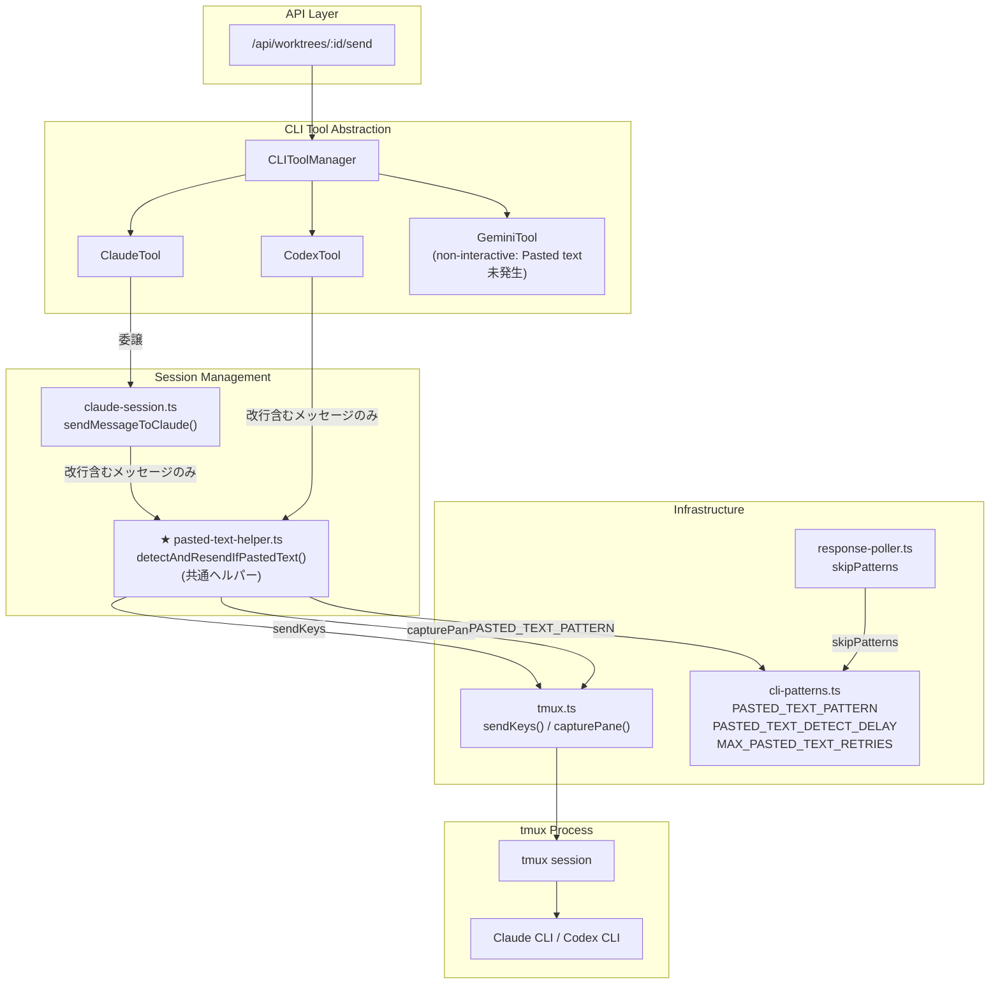

# 設計方針書: Issue #212 - 複数行メッセージ送信時の[Pasted text]検知 + Enter自動送信

## 1. 概要

### 目的
複数行メッセージ送信後、Claude CLIが `[Pasted text #N +XX lines]` と表示して処理を開始しない場合に、自動的にEnterキーを追加送信して処理を開始させる。

### 背景
Issue #163 で7回の実装試行（PR #171, #172, #173, #175, #176, #183, #184）を行い、全てRevert済み。過去のアプローチ（paste-buffer、bracketed paste markers等）はClaude CLIのink-based TextInputと互換性がなかった。本Issueではペースト検出を**回避**するのではなく、CLIの挙動に**追従**するアプローチを採用する。

### スコープ
- Claude CLI: `sendMessageToClaude()` へのPasted text検知 + Enter再送ロジック追加
- Codex CLI: `CodexTool.sendMessage()` への同様ロジック追加
- Response Poller: `[Pasted text]` パターンのレスポンス混入防止
- 共通ヘルパー: 検知ループ本体の共通関数化（`detectAndResendIfPastedText()`）
- テスト: ユニットテスト追加（cli-patterns, claude-session, codex, response-poller）

---

## 2. アーキテクチャ設計

### システム構成図



### レイヤー構成と変更箇所

| レイヤー | ファイル | 変更内容 |
|---------|---------|---------|
| API | `src/app/api/worktrees/[id]/send/route.ts` | **変更なし** |
| CLI Tool | `src/lib/cli-tools/claude.ts` | **変更なし**（claude-session.tsに委譲） |
| CLI Tool | `src/lib/cli-tools/codex.ts` | 共通ヘルパー呼び出し追加 |
| CLI Tool | `src/lib/cli-tools/gemini.ts` | **変更なし**（non-interactiveモードのためPasted text未発生。将来インタラクティブモード対応時は共通ヘルパー呼び出し追加が必要） |
| Session | `src/lib/claude-session.ts` | 共通ヘルパー呼び出し追加 |
| Helper | `src/lib/pasted-text-helper.ts` | **新規**: `detectAndResendIfPastedText()` 共通ヘルパー |
| Pattern | `src/lib/cli-patterns.ts` | `PASTED_TEXT_PATTERN` + `PASTED_TEXT_DETECT_DELAY` + `MAX_PASTED_TEXT_RETRIES` 定数追加 + skipPatterns追加 |
| Poller | `src/lib/response-poller.ts` | skipPatternsにパターン追加 |

---

## 3. 設計パターン

### 3.1 Detect-and-Retry パターン（新規）

Pasted text検知 + Enter再送ロジックのコアパターン。**共通ヘルパー関数として実装する。**

```typescript
// pasted-text-helper.ts
import { capturePane, sendKeys } from './tmux';
import { stripAnsi, PASTED_TEXT_PATTERN, PASTED_TEXT_DETECT_DELAY, MAX_PASTED_TEXT_RETRIES } from './cli-patterns';
import { createLogger } from './logger';  // MF-S2-001: Logger型を使用

const logger = createLogger('pasted-text');  // SF-S2-002: ヘルパー内部でlogger生成

/**
 * Pasted text検知 + Enter再送ヘルパー
 *
 * 改行を含むメッセージ送信後に呼び出し、tmuxバッファ内の
 * [Pasted text #N +XX lines] パターンを検知してEnterを再送する。
 *
 * @designNote PASTE-HELPER: 検知タイミングは呼び出し側で制御する。
 *   claude-session.ts: sendKeys(Enter)後に呼び出し
 *   codex.ts: execAsync(C-m)後に呼び出し
 * @designNote SF-S2-002: loggerは外部注入ではなくヘルパー内部で生成する。
 *   理由: 呼び出し元（claude-session.ts, codex.ts）にlogger生成・注入の
 *   責務を持たせる必要がなく、ヘルパーの独立性を高めるため。
 */
export async function detectAndResendIfPastedText(
  sessionName: string
): Promise<void> {
  for (let attempt = 0; attempt < MAX_PASTED_TEXT_RETRIES; attempt++) {
    // SF-S2-005: プロジェクト既存パターンに合わせてsetTimeout + Promiseを使用
    await new Promise(resolve => setTimeout(resolve, PASTED_TEXT_DETECT_DELAY));
    const output = await capturePane(sessionName, { startLine: -10 });
    if (!PASTED_TEXT_PATTERN.test(stripAnsi(output))) {
      return; // 正常: Pasted text未検知
    }
    await sendKeys(sessionName, '', true); // Enter再送
    if (attempt === MAX_PASTED_TEXT_RETRIES - 1) {
      // SF-S4-001: attempt回数を追加し、リトライ経過を記録
      logger.warn('Pasted text detection: max retries reached', {
        sessionName,
        maxRetries: MAX_PASTED_TEXT_RETRIES,
        finalAttempt: attempt,
      });
    }
  }
}
```

**設計判断（Stage 1 レビュー反映: SF-001）**: claude-session.tsとcodex.tsの検知ロジックは本質的に同一処理（setTimeout待機 -> capturePane -> stripAnsi -> PASTED_TEXT_PATTERN.test -> sendKeys Enter）であり、2箇所での同時実装が確定しているため、共通ヘルパーとして切り出す。検知タイミングの違いは呼び出し位置で吸収する。

**設計判断（Stage 2 レビュー反映: SF-S2-002）**: loggerはヘルパー内部で `createLogger('pasted-text')` により生成する。外部からの注入は不要とし、関数シグネチャを `detectAndResendIfPastedText(sessionName: string): Promise<void>` に簡素化する。呼び出し元にlogger管理の責務を持たせない設計とする。

**設計判断（Stage 2 レビュー反映: SF-S2-005）**: `sleep()` 関数はプロジェクト内に存在しないため、既存パターン `await new Promise(resolve => setTimeout(resolve, delay))` を使用する（claude-session.ts, codex.ts等と同一パターン）。

### 3.2 改行ガード条件（Stage 1 レビュー反映: MF-001）

**全ての呼び出し箇所で、改行を含むメッセージのみ検知ロジックを実行する。**

```typescript
// claude-session.ts / codex.ts の呼び出し側
if (message.includes('\n')) {
  await detectAndResendIfPastedText(sessionName);
}
```

**設計根拠**:
- tmux send-keysは改行なしテキストでペースト検出しない（send-keysの仕様上、改行なしテキストはペーストとして扱われない）
- 代替案B（メッセージ長での条件分岐）とは異なり、「改行の有無」で判定するため閾値の問題は発生しない
- 単一行メッセージ（大半の操作）に対する不要な+500ms遅延を排除し、UXを維持する

### 3.3 既存パターンとの整合

| パターン | 既存適用箇所 | Issue #212での適用 |
|---------|-------------|------------------|
| Strategy パターン | CLI Tool抽象化（ICLITool） | 各CLIToolのsendMessage()から共通ヘルパーを呼び出し |
| Export定数パターン | claude-session.ts定数群 | cli-patterns.tsに定数を集約（SF-002対応） |
| Pattern Registry | cli-patterns.ts | PASTED_TEXT_PATTERN追加、skipPatterns追加 |
| Facade パターン | session-cleanup.ts | pasted-text-helper.tsが検知ループを隠蔽 |

---

## 4. 詳細設計

### 4.1 定数設計

#### cli-patterns.ts に追加する定数（SF-002対応: 全定数をcli-patterns.tsに集約）

```typescript
/**
 * Pasted textパターン
 *
 * Claude CLIが複数行テキストのペーストを検知した際に表示する
 * 折りたたみ表示パターン。
 *
 * @example "[Pasted text #1 +46 lines]"
 * @see Issue #212, #163
 * @designNote PASTE-001: パターンは先頭部分のみマッチ。
 *   行数部分(+XX lines)は可変のため省略し、false negativeを最小化。
 *   false positiveリスク: Claude CLIの出力で "[Pasted text #" から始まる
 *   他の文字列が出現する可能性は極めて低い（CLIのink描画が生成する
 *   固有フォーマットのため）。現時点のパターンで十分と判断。
 * @designNote PASTE-001-FP (SF-S4-002): skipPatternsでの使用時のfalse positiveシナリオ:
 *   response-poller.tsのskipPatternsで使用される場合、行単位マッチとなるため、
 *   Claude CLIの応答内容に "[Pasted text #" を含む文字列（例: ユーザーがペースト
 *   検知について質問した場合の応答テキスト）があると正当な応答行がフィルタリング
 *   される可能性がある。ただし、応答内容の損失は当該行のみであり、機能的影響は
 *   許容範囲内と判断する。行頭アンカー（^）の付与で更にリスク低減可能だが、
 *   tmuxバッファ上での表示位置によってはインデントが入る可能性があるため、
 *   現行パターンの維持が妥当。
 */
export const PASTED_TEXT_PATTERN = /\[Pasted text #\d+/;

/**
 * Pasted text検知待機時間（ミリ秒）
 *
 * sendKeys後、tmuxバッファにPasted text表示が反映されるまでの待機時間。
 * CLAUDE_POST_PROMPT_DELAY（プロンプト検出後の安定化待機）とは
 * 異なるタイミング・目的の待機。
 *
 * @see Issue #212
 * @designNote PASTE-002: 500msはClaude CLIのink描画完了に必要な実測値。
 *   短すぎるとPasted text表示がまだバッファに反映されていない。
 *   長すぎるとUXが低下する。
 */
export const PASTED_TEXT_DETECT_DELAY = 500;

/**
 * Pasted text検知リトライ上限
 *
 * @see Issue #212
 * @designNote PASTE-003: 3回 x 500ms = 最大1500msの追加遅延。
 *   通常は1回目で検知+解消されるため、実効的な追加遅延は500ms。
 */
export const MAX_PASTED_TEXT_RETRIES = 3;
```

**設計判断（SF-002）**: PASTED_TEXT_DETECT_DELAYとMAX_PASTED_TEXT_RETRIESをclaude-session.tsではなくcli-patterns.tsに配置する。理由:
- codex.tsでも同じ値が必要であり、claude-session.tsに配置するとcodex.tsがclaude-session.tsに依存する不適切な関係が生まれる
- PASTED_TEXT_PATTERNと同じモジュールで管理することで、Pasted text関連定数の一元管理を実現する

### 4.2 claude-session.ts の変更設計

#### sendMessageToClaude() の変更フロー

```
既存フロー（sendMessageToClaude関数内、行番号は目安）:
  1. セッション名取得・存在確認 (L398付近〜L406)  ※SF-S2-001: hasSession呼び出しはL400-401付近
  2. プロンプト状態確認 + waitForPrompt (L409-413付近)
  3. 安定性待機: CLAUDE_POST_PROMPT_DELAY (L421付近)
  4. sendKeys(message, false) (L424付近)
  5. sendKeys('', true) = Enter (L425付近)
  6. ログ出力 (L426付近)

追加フロー（Step 5の後に挿入）:
  7. ★ 改行ガード: message.includes('\n') チェック（MF-001対応）
     7a. 改行なし → スキップ（追加遅延なし）
     7b. 改行あり → detectAndResendIfPastedText(sessionName) 呼び出し
         ※SF-S2-002: loggerパラメータは不要（ヘルパー内部で生成）
         内部処理:
         - PASTED_TEXT_DETECT_DELAY ms 待機（SF-S2-005: setTimeout+Promise使用）
         - capturePane(sessionName, { startLine: -10 })
         - stripAnsi() + PASTED_TEXT_PATTERN.test()
         - 検知した場合 → sendKeys('', true) でEnter再送
         - 検知しない場合 → return（正常終了）
         - リトライ上限到達 → logger.warn で構造化ログ出力（SF-004対応）
```

#### ログ出力（SF-004対応 + SF-S4-001対応）

リトライ上限到達時のログは `console.warn` ではなく、プロジェクトの既存パターンに合わせて構造化ログ（`createLogger` パターン）を使用する。loggerはpasted-text-helper.ts内部でモジュールレベルで生成する（SF-S2-002対応: 外部注入不要）:

```typescript
// pasted-text-helper.ts
import { createLogger } from './logger'; // 既存のログ基盤を使用

const logger = createLogger('pasted-text'); // モジュールレベルで生成（SF-S2-002）

// リトライ上限到達時（detectAndResendIfPastedText内部）
// SF-S4-001: attempt回数を追加し、リトライ経過を記録
logger.warn('Pasted text detection: max retries reached', {
  sessionName,
  maxRetries: MAX_PASTED_TEXT_RETRIES,
  finalAttempt: attempt,
});
```

**操作コンテキストの補完方針（SF-S4-001）**: ヘルパーのシグネチャを変更せずに操作コンテキスト（worktreeId、メッセージの改行数等）との紐付けを可能にするため、**呼び出し元（claude-session.ts, codex.ts）で補完ログを出力する**方針とする。ヘルパー呼び出し前後のログにより、sessionName からworktreeIdへのトレースが可能となる:

```typescript
// claude-session.ts / codex.ts の呼び出し側（推奨）
if (message.includes('\n')) {
  logger.info('Pasted text detection: starting', {
    sessionName,
    messageLineCount: message.split('\n').length,
  });
  await detectAndResendIfPastedText(sessionName);
}
```

#### タイミングチャート

**改行を含むメッセージの場合**:
```
|-- CLAUDE_POST_PROMPT_DELAY (500ms) --|
                                        |-- sendKeys(msg) --|-- sendKeys(Enter) --|
                                                                                   |-- PASTED_TEXT_DETECT_DELAY (500ms) --|
                                                                                                                          |-- capturePane --|
                                                                                                                                             |-- 検知? --|
                                                                                                                                                Yes: |-- sendKeys(Enter) --|-- DETECT_DELAY --|-- capturePane --| ...
                                                                                                                                                No:  -> 正常終了
```

**単一行メッセージの場合（MF-001対応）**:
```
|-- CLAUDE_POST_PROMPT_DELAY (500ms) --|
                                        |-- sendKeys(msg) --|-- sendKeys(Enter) --|
                                                                                   -> 即座に正常終了（検知ループスキップ）
```

最悪ケース実行時間:
- 単一行メッセージ: 既存フロー + 0ms（検知スキップ）
- 複数行（Pasted text未発生）: 既存フロー + 500ms（1回の検知確認）
- 複数行（1回で解消）: 既存フロー + 500ms + Enter + 500ms
- 最悪（3回リトライ）: 既存フロー + 500ms x 3 = +1500ms

### 4.3 codex.ts の変更設計

#### sendMessage() の変更フロー

```
既存フロー:
  1. セッション存在確認 (L112-119)
  2. sendKeys(message, false) (L124)
  3. 100ms待機 (L127)
  4. execAsync(tmux send-keys C-m) (L130)
  5. 200ms待機 (L133)

追加フロー（L133の後に挿入）:
  6. ★ 改行ガード: message.includes('\n') チェック（MF-001対応）
     6a. 改行なし → スキップ
     6b. 改行あり → detectAndResendIfPastedText(sessionName) 呼び出し
         ※ SF-S2-002: loggerパラメータは不要（ヘルパー内部で生成）
         ※ Enter再送はsendKeys(sessionName, '', true)で統一
            （codex.tsの既存execAsync(C-m)ではなく）
```

#### 新規import（MF-S2-002対応: ヘルパーのimportのみ）

```typescript
// MF-S2-002: stripAnsi, PASTED_TEXT_PATTERNはpasted-text-helper.ts内部で使用される
// codex.tsからは共通ヘルパーのみをimportする（責務分離の徹底）
import { detectAndResendIfPastedText } from '../pasted-text-helper';
```

**設計判断（Stage 2 レビュー反映: MF-S2-002）**: codex.tsは共通ヘルパーを呼び出すのみであり、`stripAnsi` や `PASTED_TEXT_PATTERN` を直接使用しない。これらの不要なimportを追加すると、SF-001で目指した「ヘルパーへの責務集約」と矛盾する。`capturePane` の追加importも不要（ヘルパー内部で処理される）。

### 4.4 pasted-text-helper.ts の設計（新規ファイル: SF-001対応）

#### sessionNameパラメータのバリデーション方針（MF-S4-001）

`detectAndResendIfPastedText(sessionName)` の `sessionName` パラメータは `capturePane()` / `sendKeys()` を経由して最終的に tmux コマンドへ文字列展開される。セキュリティ上の前提条件と防御方針を以下に明記する。

**前提条件**:
- `sessionName` は `getSessionName()` により `'mcbd-claude-{worktreeId}'` または `'mcbd-codex-{worktreeId}'` の固定形式で生成される
- `worktreeId` は API 層（route.ts）で DB 存在確認済みの数値 ID であり、外部からの任意入力が直接渡されることはない
- `getSessionName()` で固定形式に変換された後に本ヘルパーに渡されるため、コマンドインジェクションに使用可能な文字（`$()`, バッククォート等）が混入する経路は存在しない

**防御レイヤー**:
1. **API層**: `worktreeId` は `route.ts` のパスパラメータから取得され、DB 存在確認で検証済み
2. **セッション名生成**: `getSessionName()` が固定プレフィックス + worktreeId で生成（英数字・ハイフンのみ）
3. **tmux.ts層**: `sendKeys()` / `capturePane()` 内でダブルクォートによるエスケープ処理を実施

**設計判断（MF-S4-001）**: 本ヘルパーを独立した共通関数として公開する以上、sessionName の形式前提を明示する。現時点では tmux.ts 側の既存防御（ダブルクォートエスケープ）に依存し、ヘルパー内での追加バリデーション（`/^[a-zA-Z0-9_-]+$/` 検証）は行わない。理由: 呼び出し経路が `getSessionName()` 経由に限定されており、二重バリデーションは過剰防御となるため。将来的にヘルパーが新しい経路から呼び出される場合は、バリデーション追加を検討する（C-S4-005参照）。

```typescript
import { capturePane, sendKeys } from './tmux';
import { stripAnsi, PASTED_TEXT_PATTERN, PASTED_TEXT_DETECT_DELAY, MAX_PASTED_TEXT_RETRIES } from './cli-patterns';
import { createLogger } from './logger';

// SF-S2-002: loggerはモジュールレベルで内部生成（外部注入不要）
const logger = createLogger('pasted-text');

/**
 * Pasted text検知 + Enter再送ヘルパー
 *
 * claude-session.tsとcodex.tsで共通の検知ループ本体を提供する。
 * 検知タイミング（いつこのヘルパーを呼ぶか）は呼び出し側が制御する。
 *
 * @param sessionName - tmuxセッション名。getSessionName()で生成された
 *   'mcbd-claude-{worktreeId}' 形式の文字列であること（MF-S4-001）。
 *   英数字・ハイフンのみで構成される前提。
 * @returns Promise<void>
 *
 * @see Issue #212
 * @designNote PASTE-HELPER: 呼び出し側の責務と本ヘルパーの責務を分離。
 *   呼び出し側: message.includes('\n') ガード + 呼び出しタイミング制御
 *   本ヘルパー: 検知ループ（setTimeout待機 -> capturePane -> test -> Enter再送）
 * @designNote MF-S4-001: sessionNameはgetSessionName()で固定形式に変換された
 *   値を前提とする。tmux.tsのダブルクォートエスケープが防御レイヤーとして機能。
 *   ヘルパー内での追加バリデーションは現時点では不要（呼び出し経路が限定的）。
 * @designNote SF-S2-002: loggerは外部注入ではなく内部生成する。
 *   呼び出し元にlogger管理の責務を持たせない設計。
 * @designNote SF-S2-005: sleep()関数は使用せず、プロジェクト既存パターンの
 *   await new Promise(resolve => setTimeout(resolve, delay)) を使用する。
 */
export async function detectAndResendIfPastedText(
  sessionName: string
): Promise<void> {
  // 実装は Section 3.1 参照
}
```

### 4.5 response-poller.ts の変更設計

#### 2系統のskipPatterns

**系統1: response-poller.ts cleanClaudeResponse() のローカルskipPatterns**

```typescript
// response-poller.ts L135-159付近 の skipPatterns 配列に追加（SF-S2-004: ファイル名・行番号を明示）
const skipPatterns = [
  // ... 既存パターン（19パターン） ...
  PASTED_TEXT_PATTERN,  // 追加: [Pasted text #N +XX lines] 除外
];
```

**系統2: cli-patterns.ts getCliToolPatterns('claude') のskipPatterns**

`cli-patterns.ts` の `getCliToolPatterns()` 内で追加（SF-S2-004: response-poller.tsではなくcli-patterns.tsの行番号）:

```typescript
// cli-patterns.ts L133-141付近 (getCliToolPatterns('claude') 内)
skipPatterns: [
  // ... 既存パターン ...
  PASTED_TEXT_PATTERN,  // 追加
],
```

### 4.6 cli-patterns.ts の変更設計

1. `PASTED_TEXT_PATTERN` 定数をexport
2. `PASTED_TEXT_DETECT_DELAY` 定数をexport（SF-002対応: claude-session.tsから移動）
3. `MAX_PASTED_TEXT_RETRIES` 定数をexport（SF-002対応: claude-session.tsから移動）
4. `getCliToolPatterns('claude')` のskipPatternsに追加
5. `getCliToolPatterns('codex')` のskipPatternsにも追加（Codexでも同様のPasted text表示が発生する可能性）

**設計注意（Stage 3 レビュー反映: SF-S3-003）**: `getCliToolPatterns('codex')` への `PASTED_TEXT_PATTERN` 追加は防御的措置である。Codex CLIでの `[Pasted text]` 発生有無は実測未確認のため、実装前にCodex CLIで複数行メッセージを送信し、`[Pasted text]` 表示が実際に発生するかを確認する。発生しない場合でも、防御的追加としてskipPatternsへの追加は維持する（将来的な互換性を考慮）。確認結果を本セクションに追記すること。

---

## 5. テスト設計

### 5.1 テスト戦略

| テスト種別 | ファイル | テスト内容 |
|-----------|---------|-----------|
| パターンUT | `cli-patterns.test.ts` | PASTED_TEXT_PATTERNのマッチ/非マッチ検証 |
| ヘルパーUT | `pasted-text-helper.test.ts` | 共通ヘルパーの検知ループ検証（新規） |
| ロジックUT | `claude-session.test.ts` | 改行ガード条件 + ヘルパー呼び出し検証 |
| ロジックUT | `codex.test.ts` | 改行ガード条件 + ヘルパー呼び出し検証（基盤構築含む） |
| フィルタUT | `response-poller.test.ts` | cleanClaudeResponse()のPasted textフィルタリング検証 |
| 回帰テスト | `api-send-cli-tool.test.ts` | 既存APIインターフェースの不変性確認（SF-S3-004: sendMessageToClaudeがモックされているため、新機能の動作検証ではなく、既存のAPI呼び出しインターフェースが変更されていないことの確認が目的） |

### 5.2 pasted-text-helper.test.ts テスト設計（新規: SF-001対応）

```typescript
describe('detectAndResendIfPastedText()', () => {
  // テスト1: Pasted text未検知時（正常フロー）
  it('should not send extra Enter when no Pasted text detected', async () => {
    // capturePane -> Pasted text なし
    // sendKeys: 呼ばれない（Enter再送なし）
  });

  // テスト2: Pasted text検知時のEnter再送
  it('should send extra Enter when Pasted text detected', async () => {
    // capturePane -> 1回目: [Pasted text #1 +XX lines] あり
    //             -> 2回目: なし
    // sendKeys: 再送Enter 1回
  });

  // テスト3: リトライ上限到達（SF-004対応）
  // SF-S2-002: loggerは内部生成のため、createLoggerモジュールをモックして検証
  it('should log warning with structured logger after max retries', async () => {
    // capturePane -> 常に [Pasted text] あり
    // createLogger('pasted-text').warn が呼ばれることを検証
    // sendKeys: 再送Enter x MAX_RETRIES
  });

  // テスト4: リトライ上限到達時にエラーをスローしないことの確認（SF-004対応）
  it('should not throw error after max retries', async () => {
    // capturePane -> 常に [Pasted text] あり
    // 例外がスローされず、正常にreturnすることを検証
  });

  // テスト5: capturePane失敗時の挙動（C-S2-003検討項目）
  // CON-S2-003: エッジケース - capturePaneがエラーをスローした場合
  it('should propagate error when capturePane fails', async () => {
    // capturePane -> エラーをスロー
    // detectAndResendIfPastedTextがエラーを伝播することを検証
    // （try-catchで握りつぶさない設計）
  });
});
```

**設計注意（SF-S2-002）**: loggerパラメータが削除されたため、テスト3のlogger検証は `vi.mock('./logger')` で `createLogger` をモックし、返されるloggerオブジェクトの `warn` 呼び出しを検証する。

### 5.3 claude-session.test.ts テスト設計

```typescript
describe('sendMessageToClaude() - Pasted text detection (Issue #212)', () => {
  // テスト1: 単一行メッセージ時は検知スキップ（MF-001対応）
  it('should skip Pasted text detection for single-line messages', async () => {
    // message = 'hello' (改行なし)
    // detectAndResendIfPastedText が呼ばれないことを検証
    // sendKeys: message + Enter の2回のみ
  });

  // テスト2: 複数行メッセージ時は検知ロジック実行
  it('should run Pasted text detection for multi-line messages', async () => {
    // message = 'line1\nline2'
    // detectAndResendIfPastedText が呼ばれることを検証
  });

  // テスト3: 既存動作への非影響確認
  it('should not affect existing message sending flow', async () => {
    // sendKeys(message, false) -> sendKeys('', true) の順序が維持されることを検証
  });
});
```

### 5.4 codex.test.ts テスト設計

**前提: モック基盤の新規構築**

**設計方針（Stage 3 レビュー反映: SF-S3-002）**: モック基盤は既存テスト（isRunning, isInstalled等）に影響しない形で追加する。具体的には以下の方針を採用する:

1. **独立したdescribeブロック内でのモック設定**: Pasted text検知関連のテストは独立したdescribeブロック内に配置し、`vi.mock()` の影響範囲を限定する
2. **既存テストとの分離**: 既存テスト（プロパティ確認レベル）は `vi.mock()` の影響を受けない位置に維持する。特に `isRunning` テストの `'should return false for non-existent session'` は実際のtmuxコマンドを実行しているため、`vi.mock('@/lib/tmux')` により挙動が変わるリスクがある
3. **代替案**: 既存テストへの影響が避けられない場合は、新規テストファイル `tests/unit/cli-tools/codex-pasted-text.test.ts` として分離する選択肢も許容する。この場合、実装順序 Step 10 のファイル名を変更すること

```typescript
// 以下のモック設定はPasted text検知テスト用のdescribeブロック内、
// またはbeforeEach/afterEachでのモック復元を伴う形で配置する
vi.mock('@/lib/tmux', () => ({
  hasSession: vi.fn(),
  createSession: vi.fn(),
  sendKeys: vi.fn(),
  capturePane: vi.fn(),
  killSession: vi.fn(),
}));

vi.mock('child_process', () => ({
  exec: vi.fn((cmd, opts, cb) => {
    if (typeof opts === 'function') { opts(null, '', ''); }
    else if (cb) { cb(null, '', ''); }
  }),
}));

// MF-S2-002: codex.tsはcli-patternsを直接importしないため、cli-patternsのモックは不要
// stripAnsi, PASTED_TEXT_PATTERNはpasted-text-helper.ts内部で使用される

vi.mock('@/lib/pasted-text-helper', () => ({
  detectAndResendIfPastedText: vi.fn(),
}));
```

**テストケース（SF-003対応: 2つのEnter送信方式の混在を明示的に検証）**:

```typescript
describe('CodexTool.sendMessage() - Pasted text detection', () => {
  // テスト1: 単一行メッセージ時は検知スキップ（MF-001対応）
  it('should skip Pasted text detection for single-line messages', () => {
    // message = 'hello'
    // detectAndResendIfPastedText が呼ばれないことを検証
  });

  // テスト2: 複数行メッセージ時の呼び出し順序検証（SF-003対応）
  it('should call detectAndResendIfPastedText after execAsync(C-m)', () => {
    // 呼び出し順序を検証:
    //   1. sendKeys(message, false)
    //   2. execAsync(tmux send-keys C-m)  -- 通常のEnter送信
    //   3. detectAndResendIfPastedText()   -- Pasted text検知（内部でsendKeys('', true)）
    // execAsync(C-m)の後にdetectAndResendIfPastedTextが呼ばれることを検証
  });

  // テスト3: Enter再送にsendKeysを使用（sendKeys('', true)であってexecAsync(C-m)ではない）
  it('should use sendKeys for Enter resend inside helper, not execAsync', () => {
    // ヘルパー内部のsendKeys('', true)呼び出しを検証
    // 通常のEnter: execAsync(C-m)
    // 再送のEnter: sendKeys('', true) via helper
    // この2方式が混在することを正しくテスト
  });
});
```

### 5.5 cli-patterns.test.ts テスト設計

**テストファイル配置方針（Stage 3 レビュー反映: SF-S3-001）**: cli-patternsのテストファイルは以下の2箇所に存在する:
1. `src/lib/__tests__/cli-patterns.test.ts` -- 既存テスト（レガシー配置）
2. `tests/unit/lib/cli-patterns.test.ts` -- 既存テスト（標準配置）

Issue #212のPasted text関連テストは **`tests/unit/lib/cli-patterns.test.ts`** に追加する（標準配置を正とする）。`src/lib/__tests__/cli-patterns.test.ts` はレガシーテストであり、本Issue では変更しない。実装時に `src/lib/__tests__/cli-patterns.test.ts` の内容を確認し、重複テストがないことを確認すること。

```typescript
describe('PASTED_TEXT_PATTERN', () => {
  it('should match standard Pasted text format', () => {
    expect(PASTED_TEXT_PATTERN.test('[Pasted text #1 +46 lines]')).toBe(true);
    expect(PASTED_TEXT_PATTERN.test('[Pasted text #2 +3 lines]')).toBe(true);
    expect(PASTED_TEXT_PATTERN.test('[Pasted text #10 +100 lines]')).toBe(true);
  });

  it('should not match normal text', () => {
    expect(PASTED_TEXT_PATTERN.test('Hello world')).toBe(false);
    expect(PASTED_TEXT_PATTERN.test('[Some other text]')).toBe(false);
    expect(PASTED_TEXT_PATTERN.test('Pasted text')).toBe(false);
  });
});

describe('getCliToolPatterns("claude") skipPatterns', () => {
  it('should include PASTED_TEXT_PATTERN', () => {
    const patterns = getCliToolPatterns('claude');
    const hasPastedTextPattern = patterns.skipPatterns.some(
      p => p.test('[Pasted text #1 +46 lines]')
    );
    expect(hasPastedTextPattern).toBe(true);
  });
});

describe('Pasted text constants', () => {
  it('should export PASTED_TEXT_DETECT_DELAY as 500', () => {
    expect(PASTED_TEXT_DETECT_DELAY).toBe(500);
  });

  it('should export MAX_PASTED_TEXT_RETRIES as 3', () => {
    expect(MAX_PASTED_TEXT_RETRIES).toBe(3);
  });
});
```

### 5.6 response-poller.test.ts テスト設計（C-002対応）

```typescript
describe('cleanClaudeResponse() - Pasted text filtering', () => {
  it('should filter out lines containing Pasted text pattern', () => {
    const input = 'Some response\n[Pasted text #1 +46 lines]\nMore response';
    const result = cleanClaudeResponse(input);
    expect(result).not.toContain('[Pasted text #1');
  });

  it('should preserve normal response lines', () => {
    const input = 'Normal response line';
    const result = cleanClaudeResponse(input);
    expect(result).toContain('Normal response line');
  });
});
```

---

## 6. セキュリティ設計

### リスク評価

| リスク | 影響度 | 対策 |
|-------|-------|------|
| sessionNameインジェクション（MF-S4-001） | 低 | `getSessionName()` で固定形式（英数字・ハイフンのみ）に変換。tmux.tsのダブルクォートエスケープが追加防御。Section 4.4にバリデーション方針を明記 |
| Pasted textパターン偽装 | 低 | `capturePane` は tmux バッファを直接読み取るため、外部入力による偽装リスクは極めて低い |
| 過剰Enter送信 | 低 | MAX_PASTED_TEXT_RETRIES=3で上限を設定。リトライ後は構造化ログ（warn）のみで処理継続 |
| タイミング攻撃 | なし | ローカルtmuxセッション内のため外部からの介入不可。tmuxソケットはOSユーザーレベルの権限で保護されており（ソケット所有者のみアクセス可能）、同一マシン上の他ユーザーからの操作も不可（C-S4-003） |

### セキュリティ対策

- `capturePane` の出力に対して `stripAnsi()` を適用し、ANSIエスケープによる誤検知を防止
- 正規表現パターンは定数化し、ReDoS（正規表現DoS）リスクを排除（`/\[Pasted text #\d+/` は線形時間で評価される）
- sessionNameは `getSessionName()` による固定形式生成に依存し、ダブルクォート内コマンド置換（`$()`、バッククォート）のリスクを排除（MF-S4-001）

### 入力バリデーションマトリクス（Stage 4 セキュリティレビュー反映）

| 入力 | バリデーション箇所 | 方式 | OWASP分類 |
|------|-------------------|------|-----------|
| sessionName | getSessionName() + tmux.ts | 固定形式生成 + ダブルクォートエスケープ | A03:2021 - Injection |
| message | API層（route.ts L63-68） | リクエストボディバリデーション | A03:2021 - Injection |
| capturePane出力 | pasted-text-helper.ts | stripAnsi() + PASTED_TEXT_PATTERN照合 | A04:2021 - Insecure Design |

---

## 7. パフォーマンス設計

### 実行時間影響

| シナリオ | 追加遅延 | 発生頻度 |
|---------|---------|---------|
| 単一行メッセージ | +0ms（検知スキップ: MF-001対応） | 高（大半の操作） |
| 複数行（Pasted text未発生） | +500ms（1回の検知確認） | 中 |
| 複数行（1回で解消） | +1000ms（検知+再送+再確認） | 中 |
| 複数行（最悪ケース） | +1500ms（3回リトライ） | 低 |

### 最適化方針

- **改行ガード条件による条件分岐（MF-001対応）**: `message.includes('\n')` で判定し、改行を含まない単一行メッセージは検知ループをスキップする。tmux send-keysは改行なしテキストでペースト検出しないため、この条件分岐は安全である
- **capturePane のキャプチャ範囲**: `{ startLine: -10 }` で直近10行のみ。バッファ全体の読み取りは不要
- **早期break**: Pasted text未検知の場合、即座にループを抜ける

### API レスポンスタイム

`POST /api/worktrees/:id/send` のレスポンスタイムへの影響:
- 単一行メッセージ: 影響なし（+0ms）
- 複数行メッセージ: 最大1500ms増加
フロントエンドはsend APIの完了を待って次の操作を受け付けるため、UX影響は限定的。

---

## 8. 設計上の決定事項とトレードオフ

### 採用した設計

| 決定事項 | 理由 | トレードオフ |
|---------|------|-------------|
| 共通ヘルパー関数（SF-001対応） | 2箇所での同時実装が確定。検知ループ本体は同一処理。呼び出しタイミングの違いは呼び出し位置で吸収可能 | 新規ファイル追加（pasted-text-helper.ts） |
| 改行ガード条件（MF-001対応） | tmux send-keysの仕様上、改行なしテキストはペースト検出しない。+500msの不要遅延を排除 | 改行なし長文テキストでPasted text発生時は未対応（現実的に発生しない） |
| 定数をcli-patterns.tsに集約（SF-002対応） | codex.tsからclaude-session.tsへの不適切な依存を回避。Pasted text関連定数の一元管理 | cli-patterns.tsのexport数が増加 |
| 構造化ログ（SF-004対応） | プロジェクト既存のcreateLoggerパターンに合わせ、運用時のモニタリングを容易にする | console.warnよりセットアップが複雑 |
| Enter再送にsendKeys()を使用 | テスト時のモック設定が簡潔。claude-session.tsとcodex.tsで統一 | codex.tsの既存execAsync(C-m)とは異なる方式 |
| Logger型を`Logger`に統一（MF-S2-001対応） | `src/lib/logger.ts`のexport済みinterfaceを使用。`ReturnType<typeof createLogger>`は冗長 | なし |
| codex.tsのimportを最小化（MF-S2-002対応） | ヘルパーへの責務集約と整合。不要な依存を排除 | なし |
| logger内部生成方式（SF-S2-002対応） | 呼び出し元のlogger管理責務を排除。ヘルパーの独立性向上 | テスト時にloggerモジュール全体のモックが必要 |
| setTimeout+Promiseパターン（SF-S2-005対応） | プロジェクト既存パターンとの整合。新規ユーティリティ関数の追加不要 | sleep()に比べてコードが冗長 |
| リトライ上限3回 | 3回 x 500ms = 1500msで十分。通常は1回で解消 | 3回でも解消しないケースは放置（警告ログのみ） |
| パターン定数をcli-patterns.tsに配置 | 他のCLIパターンと同じモジュール。DRY原則 | response-poller.tsからの間接参照が増える |

### 代替案との比較

| 代替案 | メリット | デメリット | 採否 |
|-------|---------|-----------|------|
| A: 共通ヘルパー関数（handlePastedText） | DRY、テスト容易、将来のCLIツール追加時のコピーリスク回避 | 新規ファイル追加 | **採用**（SF-001対応） |
| B: メッセージ長で条件分岐 | 短いメッセージの遅延なし | 閾値の決定が困難。改行なしでも長い場合がある | 不採用 |
| B': 改行の有無で条件分岐 | 単一行の遅延なし。tmuxの仕様に基づく正確な判定 | なし（tmux仕様と一致） | **採用**（MF-001対応） |
| C: tmux paste-bufferの無効化 | 根本対策 | 過去7回のPR試行で失敗済み | 不採用 |
| D: 検知せず常にEnter2回送信 | シンプル | 単一行で二重Enter -> 意図しない動作 | 不採用 |
| E: Pasted text検知 + Enter再送 | シンプル、低リスク、既存インフラ活用 | 複数行メッセージに+500ms遅延 | **採用** |

---

## 9. 実装順序

| 順序 | 対象 | 内容 |
|------|------|------|
| 1 | `src/lib/cli-patterns.ts` | `PASTED_TEXT_PATTERN` + `PASTED_TEXT_DETECT_DELAY` + `MAX_PASTED_TEXT_RETRIES` 定数追加 + skipPatterns追加 |
| 2 | `tests/unit/lib/cli-patterns.test.ts` | パターンマッチテスト + 定数値テスト追加 |
| 3 | `src/lib/pasted-text-helper.ts` | 共通ヘルパー `detectAndResendIfPastedText()` 新規作成 |
| 4 | `tests/unit/lib/pasted-text-helper.test.ts` | 共通ヘルパーテスト新規作成 |
| 5 | `src/lib/claude-session.ts` | 改行ガード条件追加 + 共通ヘルパー呼び出し追加 |
| 6 | `tests/unit/lib/claude-session.test.ts` | 改行ガード条件テスト + ヘルパー呼び出し検証追加 |
| 7 | `src/lib/response-poller.ts` | cleanClaudeResponse() skipPatterns追加 |
| 8 | `tests/unit/lib/response-poller.test.ts` | Pasted textフィルタリングテスト追加 |
| 9 | `src/lib/cli-tools/codex.ts` | import追加 + 改行ガード条件 + 共通ヘルパー呼び出し追加 |
| 10 | `tests/unit/cli-tools/codex.test.ts` | モック基盤構築 + 呼び出し順序テスト追加 |
| 11 | 回帰テスト | 既存テスト全パス確認 |

---

## 10. 影響範囲サマリー

### 変更ファイル一覧

| ファイル | 変更種別 | 変更規模 |
|---------|---------|---------|
| `src/lib/cli-patterns.ts` | 定数追加 + skipPatterns追加 | 小（~15行） |
| `src/lib/pasted-text-helper.ts` | **新規**: 共通ヘルパー | 小（~30行） |
| `src/lib/claude-session.ts` | import追加 + ガード条件 + ヘルパー呼び出し追加 | 小（~10行） |
| `src/lib/cli-tools/codex.ts` | import追加 + ガード条件 + ヘルパー呼び出し追加 | 小（~10行） |
| `src/lib/response-poller.ts` | skipPatterns追加 | 小（~2行） |
| `tests/unit/lib/cli-patterns.test.ts` | テスト追加 | 小（~25行） |
| `tests/unit/lib/pasted-text-helper.test.ts` | **新規**: テスト追加 | 中（~60行） |
| `tests/unit/lib/claude-session.test.ts` | テスト追加 | 小（~30行） |
| `tests/unit/lib/response-poller.test.ts` | **新規**: テスト追加（SF-S2-003対応） | 小（~15行） |
| `tests/unit/cli-tools/codex.test.ts` | モック基盤+テスト追加 | 大（~100行） |

### 間接影響確認済み（Stage 3 レビュー反映: MF-S3-001）

| ファイル | 依存関係 | 影響内容 | リスク |
|---------|---------|---------|-------|
| `src/lib/assistant-response-saver.ts` | `cleanClaudeResponse()` を response-poller.ts からimport（L24） | **正の影響**: `cleanClaudeResponse()` のskipPatternsに `PASTED_TEXT_PATTERN` が追加されるため、`cleanCliResponse()` -> `cleanClaudeResponse()` パス経由でもレスポンス保存時に `[Pasted text]` 行がフィルタリングされる。これは望ましい動作であり、assistant response に `[Pasted text #N +XX lines]` が混入することを防止する | 低 |
| `src/lib/cli-tools/claude.ts` | `sendMessageToClaude()` を claude-session.ts からimport | 変更が自動的に反映される（設計書記載済み） | 低 |
| `src/app/api/worktrees/[id]/send/route.ts` | `cliTool.sendMessage()` 経由で間接的に影響 | APIレスポンスタイムに複数行メッセージ時のみ最大+1500ms影響 | 低 |

### 影響なし確認済み

- `src/lib/auto-yes-manager.ts` - cli-patterns.tsのstripAnsi, detectThinking, buildDetectPromptOptionsをimportしているが、PASTED_TEXT_PATTERNは使用しない。1行応答のみでPasted text未発生
- `src/lib/prompt-detector.ts` - パターン非マッチ確認済み
- `src/lib/status-detector.ts` - cli-patterns.tsのstripAnsi, detectThinking, getCliToolPatterns, buildDetectPromptOptionsをimportしているが、skipPatternsを直接使用しないため影響なし
- `src/lib/cli-tools/gemini.ts` - non-interactiveモードで未発生（将来インタラクティブモード対応時は変更必要）
- `src/app/api/worktrees/[id]/send/route.ts` - API層変更なし（間接影響はレスポンスタイムのみ、上記「間接影響確認済み」参照）
- `src/app/api/worktrees/[id]/prompt-response/route.ts` - cli-patterns.tsのstripAnsi, buildDetectPromptOptionsをimportしているが、PASTED_TEXT_PATTERNは使用しない
- `src/app/api/worktrees/[id]/current-output/route.ts` - cli-patterns.tsのstripAnsi, buildDetectPromptOptionsをimportしているが、PASTED_TEXT_PATTERNは使用しない
- `src/lib/claude-poller.ts` - claude-session.tsのcaptureClaudeOutput, isClaudeRunningのみをimport。sendMessageToClaudeの変更は影響しない

---

## 11. 制約条件

### CLAUDE.mdの設計原則への準拠

| 原則 | 準拠状況 |
|------|---------|
| **SOLID - SRP** | OK: 各モジュールの責務を維持。パターン定義はcli-patterns、検知ヘルパーはpasted-text-helper、セッション管理はclaude-session |
| **SOLID - OCP** | OK: skipPatternsへの追加で既存コードの変更を最小化 |
| **KISS** | OK: 改行ガード条件で不要な遅延を排除（MF-001対応）。検知+Enter再送のシンプルなアプローチを維持 |
| **YAGNI** | OK: 共通ヘルパー化は2箇所同時実装のため妥当（SF-001対応）。過度な抽象化は回避 |
| **DRY** | OK: 検知ループ本体を共通ヘルパーとして切り出し（SF-001対応）。定数もcli-patterns.tsに集約（SF-002対応） |

### 技術的制約

- Claude CLIの `[Pasted text]` 表示フォーマットはClaude CLIのバージョンに依存
- tmux send-keys のペースト検知閾値はtmuxバージョンに依存
- capturePane の出力にはANSIエスケープシーケンスが含まれるため、stripAnsiが必須

### 定数管理の制約（SF-S4-003）

`PASTED_TEXT_DETECT_DELAY`（500ms）と `MAX_PASTED_TEXT_RETRIES`（3回）はハードコード定数として `cli-patterns.ts` に定義される。現時点では環境変数による上書き手段を提供しない。

**設計根拠**: プロジェクト全体の定数管理方針（ハードコード）と一貫している。既存の `CLAUDE_INIT_TIMEOUT`、`CLAUDE_POST_PROMPT_DELAY` 等も同様にハードコードされており、本定数のみ環境変数対応とすることは整合性を欠く。

**将来的な拡張可能性**: 高負荷環境で tmux 応答が遅延し、500ms では不十分な場合等に対応するため、将来的に環境変数での上書きを検討可能。拡張時は既存の `CLAUDE_INIT_TIMEOUT` 等と同様のパターン（`process.env.CM_PASTED_TEXT_DETECT_DELAY || 500`）を適用する。ただし、現時点ではアプリケーション再ビルドでの調整で十分と判断する。

---

## 12. レビュー履歴

### Stage 1: 通常レビュー（設計原則）

- **レビュー日**: 2026-02-10
- **ステータス**: conditionally_approved（スコア: 4/5）
- **レビュー結果**: `dev-reports/issue/212/multi-stage-design-review/stage1-review-result.json`

### Stage 1 レビュー指摘事項サマリー

| ID | 分類 | 重要度 | タイトル | 対応状況 |
|----|------|--------|---------|---------|
| MF-001 | パフォーマンス/KISS | Must Fix | 単一行メッセージへの不要な+500ms遅延 | 対応済み: `message.includes('\n')` ガード条件追加 |
| SF-001 | DRY | Should Fix | 検知ロジックの共通ヘルパー化 | 対応済み: `detectAndResendIfPastedText()` をpasted-text-helper.tsに切り出し |
| SF-002 | OCP/テスト容易性 | Should Fix | 定数配置をcli-patterns.tsに変更 | 対応済み: PASTED_TEXT_DETECT_DELAY, MAX_PASTED_TEXT_RETRIESをcli-patterns.tsに移動 |
| SF-003 | テスト設計 | Should Fix | codex.tsテストでのEnter送信方式混在の検証 | 対応済み: execAsync(C-m)とsendKeys('', true)の呼び出し順序テスト追加 |
| SF-004 | 設計完全性 | Should Fix | リトライ上限到達時の構造化ログ | 対応済み: createLoggerパターンでwarnレベルの構造化ログ出力 |
| C-001 | YAGNI/拡張性 | Consider | Gemini CLIでのPasted text未発生理由の明記 | 記録済み: gemini.tsの変更なし理由をレイヤー構成表に追記 |
| C-002 | テスト設計 | Consider | response-poller.tsのskipPatterns追加テスト | 記録済み: テスト設計セクション5.6に追加 |
| C-003 | パフォーマンス | Consider | capturePane範囲の妥当性検証 | 記録済み: 実装時に実測確認（必要に応じてキャプチャ範囲調整） |
| C-004 | セキュリティ | Consider | PASTED_TEXT_PATTERNのfalse positive/negative評価 | 記録済み: PASTE-001コメントにfalse positiveリスク評価を追記 |

### Stage 2: 整合性レビュー

- **レビュー日**: 2026-02-10
- **ステータス**: conditionally_approved（スコア: 4/5）
- **レビュー結果**: `dev-reports/issue/212/multi-stage-design-review/stage2-review-result.json`
- **フォーカス**: コードベース整合性、内部整合性、テスト設計整合性、CLAUDE.md整合性

### Stage 2 レビュー指摘事項サマリー

| ID | 分類 | 重要度 | タイトル | 対応状況 |
|----|------|--------|---------|---------|
| MF-S2-001 | コードベース整合性 | Must Fix | Section 3.1のloggerパラメータ型がSection 4.4と不一致 | 対応済み: `Logger`型に統一し、import修正。さらにSF-S2-002と併せてloggerパラメータ自体を削除（内部生成方式に統一） |
| MF-S2-002 | 内部整合性 | Must Fix | codex.tsの新規importに不要なstripAnsi/PASTED_TEXT_PATTERNが含まれる | 対応済み: Section 4.3のimportを`detectAndResendIfPastedText`のみに限定。設計根拠を追記 |
| SF-S2-001 | コードベース整合性 | Should Fix | claude-session.tsのsendMessageToClaude行番号ずれ | 対応済み: Section 4.2の行番号を「目安」表記に変更し、hasSession呼び出し位置を補足 |
| SF-S2-002 | コードベース整合性 | Should Fix | logger生成方式の統一（外部注入 vs 内部生成） | 対応済み: ヘルパー内部で`createLogger('pasted-text')`を生成する方式に統一。関数シグネチャからloggerパラメータを削除 |
| SF-S2-003 | テスト設計整合性 | Should Fix | response-poller.test.tsの変更種別が「テスト追加」だが実際は新規作成 | 対応済み: Section 10の変更種別を「**新規**: テスト追加」に修正 |
| SF-S2-004 | コードベース整合性 | Should Fix | Section 4.5の行番号参照にファイル名が明示されていない | 対応済み: 系統1にresponse-poller.ts、系統2にcli-patterns.tsのファイル名を明示 |
| SF-S2-005 | 内部整合性 | Should Fix | sleep()関数が未定義 | 対応済み: `await new Promise(resolve => setTimeout(resolve, delay))`に置き換え。設計根拠を追記 |
| C-S2-001 | 設計完全性 | Consider | codex.tsのmessage変数スコープの明示 | 記録済み: 実装時に自明（sendMessage第2引数）のため設計書では暗黙的に維持 |
| C-S2-002 | CLAUDE.md整合性 | Consider | pasted-text-helper.tsのCLAUDE.mdモジュール表への追記 | 記録済み: 実装完了後のCLAUDE.md更新タスクとして記録 |
| C-S2-003 | パターン整合性 | Consider | sendKeys('', true)呼び出しの意味の明確化 | 記録済み: 既存パターン（claude-session.ts L360）と整合確認済み。変更不要 |
| C-S2-004 | テスト設計整合性 | Consider | codex.test.tsのモック基盤構築が大規模 | 記録済み: 既存テストのdescribeブロック構造を維持しつつ、新しいdescribeブロックとして追加 |

### 整合性検証結果（Stage 2）

| 検証対象 | ステータス | 備考 |
|---------|-----------|------|
| Issue vs 設計書 | consistent | 目的・影響範囲が一致 |
| コードベース vs 設計書 | minor_discrepancies（修正済み） | 行番号ずれ、不要import、sleep未定義を修正 |
| 設計書内部整合性 | minor_discrepancies（修正済み） | logger型不一致、logger生成方式を統一 |
| CLAUDE.md整合性 | consistent | 実装後にモジュール表更新が必要（C-S2-002） |

### Stage 3: 影響分析レビュー

- **レビュー日**: 2026-02-10
- **ステータス**: conditionally_approved（スコア: 4/5）
- **レビュー結果**: `dev-reports/issue/212/multi-stage-design-review/stage3-review-result.json`
- **フォーカス**: 影響範囲分析、間接依存の評価、テスト影響範囲、パフォーマンス影響

### Stage 3 レビュー指摘事項サマリー

| ID | 分類 | 重要度 | タイトル | 対応状況 |
|----|------|--------|---------|---------|
| MF-S3-001 | 間接影響の見落とし | Must Fix | assistant-response-saver.tsのcleanClaudeResponse()依存に対する影響が未評価 | 対応済み: Section 10に「間接影響確認済み」サブセクションを追加。assistant-response-saver.tsの正の影響（[Pasted text]行のフィルタリング）を明記 |
| SF-S3-001 | テスト影響範囲 | Should Fix | cli-patterns.test.tsのテストファイル二重存在に関する対応方針が未記載 | 対応済み: Section 5.5にテストファイル配置方針を追記。`tests/unit/lib/cli-patterns.test.ts`を正とし、`src/lib/__tests__/cli-patterns.test.ts`はレガシーとして注記 |
| SF-S3-002 | テスト影響範囲 | Should Fix | codex.test.tsの既存テストがモック不足でsendMessage()テスト追加に支障 | 対応済み: Section 5.4にモック基盤の影響分離方針を追記。独立describeブロック方式を推奨し、代替案（別ファイル分離）も許容 |
| SF-S3-003 | 間接影響 | Should Fix | Codex CLIでの[Pasted text]発生確認の必要性 | 対応済み: Section 4.6にCodex CLIでの実測確認方針を追記。防御的追加として維持する方針を明記 |
| SF-S3-004 | 統合テスト影響 | Should Fix | api-send-cli-tool.test.tsの回帰テスト目的が不明確 | 対応済み: Section 5.1の回帰テスト欄にAPIインターフェース不変性確認が目的である旨を明記 |
| C-S3-001 | パフォーマンス影響 | Consider | capturePane({ startLine: -10 })のキャプチャ範囲と既存-50との整合性 | 記録済み: [Pasted text]は常に直近の数行に表示されるため-10で十分。実装時にPASTE-002コメントに選択理由を追記 |
| C-S3-002 | 互換性影響 | Consider | Claude CLIバージョンアップ時の[Pasted text]フォーマット変更リスク | 記録済み: パターン不一致時はgraceful degradation（Issue #212以前の状態に戻るのみ）。PASTE-001コメントに追記 |
| C-S3-003 | 将来の拡張性 | Consider | Gemini CLIの将来インタラクティブモード対応時の互換性 | 記録済み: YAGNI原則に従い現時点での対応は不要。設計書の既存記載で十分 |
| C-S3-004 | テスト影響範囲 | Consider | response-poller.test.tsの命名妥当性 | 記録済み: response-poller.test.tsの命名で問題なし。将来的にextractResponse()テストも追加される可能性あり |
| C-S3-005 | 間接影響 | Consider | claude-poller.ts（レガシーポーラー）への影響 | 記録済み: 影響なし確認済み。captureClaudeOutput/isClaudeRunningのみ使用のためsendMessageToClaude変更の影響を受けない |

### 影響分析結果（Stage 3）

| 分析対象 | 評価 | 備考 |
|---------|------|------|
| 直接変更ファイル | adequate | 5ファイル（cli-patterns, pasted-text-helper, claude-session, codex, response-poller） |
| 間接影響 | minor_gap（修正済み） | assistant-response-saver.tsの間接依存を追記（MF-S3-001） |
| API互換性 | maintained | シグネチャ変更なし。レスポンスタイムのみ影響 |
| データベース | no_change | スキーマ変更なし |
| パフォーマンス | acceptable | 単一行: +0ms、複数行: 最大+1500ms |
| 全体リスク | low | 技術・セキュリティ・運用いずれも低リスク |

### Stage 4: セキュリティレビュー

- **レビュー日**: 2026-02-10
- **ステータス**: conditionally_approved（スコア: 4/5）
- **レビュー結果**: `dev-reports/issue/212/multi-stage-design-review/stage4-review-result.json`
- **フォーカス**: OWASP Top 10準拠、入力バリデーション、エラーハンドリング、セキュリティログ

### Stage 4 レビュー指摘事項サマリー

| ID | 分類 | 重要度 | タイトル | 対応状況 |
|----|------|--------|---------|---------|
| MF-S4-001 | A03:2021 - Injection | Must Fix | sessionNameのバリデーション不足 - tmuxコマンドインジェクションの経路 | 対応済み: Section 4.4にsessionNameバリデーション方針を追記。getSessionName()による固定形式生成 + tmux.tsのダブルクォートエスケープに依存する設計を明示。Section 6にセキュリティ対策と入力バリデーションマトリクスを追加 |
| SF-S4-001 | A09:2021 - Security Logging | Should Fix | リトライ上限到達時のログに操作コンテキスト不足 | 対応済み: logger.warnにattempt回数を追加。呼び出し元での補完ログ（worktreeIdとの紐付け）方針をSection 4.2に追記 |
| SF-S4-002 | A04:2021 - Insecure Design | Should Fix | PASTED_TEXT_PATTERNのfalse positiveシナリオ文書化 | 対応済み: PASTE-001コメントにskipPatternsでの使用時のfalse positiveシナリオ（Claude応答内に"[Pasted text #"を含むケース）と許容判断根拠を追記 |
| SF-S4-003 | A05:2021 - Security Misconfiguration | Should Fix | 定数の環境変数上書き可能性を制約条件に注記 | 対応済み: Section 11にハードコード定数の設計根拠と将来的な環境変数拡張パターンを追記 |
| C-S4-001 | A04:2021 - Insecure Design | Consider | capturePane出力のstripAnsi制限事項（SEC-002参照） | 記録済み: cli-patterns.tsのSEC-002コメントが適用される。追加対応不要 |
| C-S4-002 | A08:2021 - Software Integrity | Consider | Claude CLIバージョンアップ時の[Pasted text]フォーマット変更耐性 | 記録済み: Stage 3 C-S3-002で確認済みのgraceful degradation方針で対応 |
| C-S4-003 | A01:2021 - Broken Access Control | Consider | tmuxセッションへのアクセス制御前提条件の明示 | 対応済み: Section 6のリスク評価表にtmuxソケットのOSレベルアクセス制御前提を補足 |
| C-S4-004 | A09:2021 - Security Logging | Consider | Pasted text検知成功時のデバッグログ追加検討 | 記録済み: 実装時にlogger.info/debugレベルでの成功パスログ追加を検討 |
| C-S4-005 | A03:2021 - Injection | Consider | sessionName形式の将来拡張時のバリデーション強化 | 記録済み: Section 4.4にヘルパーが新経路から呼び出される場合のバリデーション追加方針を記載 |

### OWASP Top 10 チェックリスト結果（Stage 4）

| カテゴリ | ステータス | 備考 |
|---------|-----------|------|
| A01: Broken Access Control | pass | tmuxソケットのOSレベル権限保護 |
| A02: Cryptographic Failures | N/A | 暗号化・機密データ取り扱いなし |
| A03: Injection | conditional_pass | sessionName固定形式生成 + tmux.tsエスケープ（MF-S4-001対応で方針明示済み） |
| A04: Insecure Design | pass | リトライ上限・graceful degradation設計 |
| A05: Security Misconfiguration | pass | ハードコード定数はプロジェクト方針と一貫（SF-S4-003注記済み） |
| A06: Vulnerable Components | N/A | 新規外部依存なし |
| A07: Authentication Failures | N/A | 認証・認可への影響なし |
| A08: Software/Data Integrity | pass | skipPatternsによるデータ整合性向上 |
| A09: Security Logging | conditional_pass | リトライ上限ログ設計済み。成功パスログは検討項目（C-S4-004） |
| A10: SSRF | N/A | ネットワークリクエスト発行なし |

### セキュリティリスク評価（Stage 4）

| 評価項目 | リスクレベル |
|---------|-------------|
| 技術リスク | low |
| セキュリティリスク | low |
| 運用リスク | low |

---

## 13. 実装チェックリスト

### Must Fix（Stage 1）

- [ ] **MF-001**: `message.includes('\n')` ガード条件を `claude-session.ts` の検知呼び出し箇所に追加
- [ ] **MF-001**: `message.includes('\n')` ガード条件を `codex.ts` の検知呼び出し箇所に追加
- [ ] **MF-001**: 単一行メッセージのテストケース追加（検知スキップの検証）

### Must Fix（Stage 2）

- [ ] **MF-S2-001**: `pasted-text-helper.ts` のlogger型を `Logger` に統一（`ReturnType<typeof createLogger>` は使用しない）
- [ ] **MF-S2-002**: `codex.ts` の新規importは `detectAndResendIfPastedText` のみとする（`stripAnsi`, `PASTED_TEXT_PATTERN`, `capturePane` は不要）

### Should Fix（Stage 1）

- [ ] **SF-001**: `src/lib/pasted-text-helper.ts` に `detectAndResendIfPastedText()` 共通ヘルパーを新規作成
- [ ] **SF-001**: `claude-session.ts` から共通ヘルパーを呼び出し
- [ ] **SF-001**: `codex.ts` から共通ヘルパーを呼び出し
- [ ] **SF-001**: `tests/unit/lib/pasted-text-helper.test.ts` に共通ヘルパーのテスト追加
- [ ] **SF-002**: `PASTED_TEXT_DETECT_DELAY` を `cli-patterns.ts` に配置
- [ ] **SF-002**: `MAX_PASTED_TEXT_RETRIES` を `cli-patterns.ts` に配置
- [ ] **SF-003**: `codex.test.ts` に execAsync(C-m) と sendKeys('', true) の呼び出し順序テスト追加
- [ ] **SF-003**: `codex.test.ts` に通常Enter(execAsync)と再送Enter(sendKeys)の混在検証テスト追加
- [ ] **SF-004**: リトライ上限到達時のログを `console.warn` から `createLogger` パターンに変更
- [ ] **SF-004**: `pasted-text-helper.test.ts` にリトライ上限到達時のログ出力テスト追加
- [ ] **SF-004**: `pasted-text-helper.test.ts` にリトライ上限到達時にエラーをスローしないテスト追加

### Should Fix（Stage 2）

- [ ] **SF-S2-001**: Section 4.2の行番号参照を「目安」表記に変更し、行番号への過度な依存を回避
- [ ] **SF-S2-002**: `detectAndResendIfPastedText()` のloggerパラメータを削除し、ヘルパー内部で `createLogger('pasted-text')` を生成する方式に統一
- [ ] **SF-S2-003**: `tests/unit/lib/response-poller.test.ts` を**新規ファイル**として作成（既存ファイルへの追加ではない）
- [ ] **SF-S2-004**: response-poller.ts/cli-patterns.tsの行番号参照にファイル名を明示
- [ ] **SF-S2-005**: `sleep()` 関数を使用せず、`await new Promise(resolve => setTimeout(resolve, PASTED_TEXT_DETECT_DELAY))` を使用

### Consider（Stage 1 - 実装時判断）

- [ ] **C-001**: Gemini CLIのnon-interactiveモード理由のコメント追記（設計書に記載済み）
- [ ] **C-002**: `response-poller.test.ts` にPasted textフィルタリングテスト追加（テスト設計に追加済み）
- [ ] **C-003**: capturePane `{ startLine: -10 }` の妥当性を実測確認。必要に応じて範囲調整
- [ ] **C-004**: PASTED_TEXT_PATTERNのfalse positive発生有無を実測確認。問題なければ現パターン維持

### Consider（Stage 2 - 実装時判断）

- [ ] **C-S2-001**: codex.ts sendMessage()内のmessage変数スコープを実装時に確認（第2引数で自明）
- [ ] **C-S2-002**: 実装完了後に `CLAUDE.md` の主要機能モジュール表に `pasted-text-helper.ts` を追加
- [ ] **C-S2-003**: `sendKeys('', true)` による Enter再送が既存パターン（claude-session.ts L360）と整合することを確認済み
- [ ] **C-S2-004**: `codex.test.ts` のモック基盤構築時、既存テストのdescribeブロック構造を維持しつつ新ブロックとして追加

### Must Fix（Stage 3）

- [ ] **MF-S3-001**: Section 10の影響範囲サマリーに `assistant-response-saver.ts` の間接影響を追記（`cleanClaudeResponse()` 経由の `[Pasted text]` フィルタリング）
- [ ] **MF-S3-001**: `assistant-response-saver.ts` 経由の `cleanClaudeResponse()` パスが正しく動作することを回帰テストで確認

### Should Fix（Stage 3）

- [ ] **SF-S3-001**: `tests/unit/lib/cli-patterns.test.ts` をPasted textテストの追加先として採用（`src/lib/__tests__/cli-patterns.test.ts` はレガシー配置として変更しない）
- [ ] **SF-S3-001**: 実装時に `src/lib/__tests__/cli-patterns.test.ts` の内容を確認し、重複テストがないことを確認
- [ ] **SF-S3-002**: `codex.test.ts` のモック基盤を既存テスト（isRunning, isInstalled等）に影響しない形で追加（独立describeブロック or 新規ファイル分離）
- [ ] **SF-S3-002**: 既存の `isRunning` テスト（`'should return false for non-existent session'`）が `vi.mock('@/lib/tmux')` の影響で失敗しないことを確認
- [ ] **SF-S3-003**: Codex CLIで複数行メッセージ送信時の `[Pasted text]` 発生有無を実測確認し、結果をSection 4.6に追記
- [ ] **SF-S3-004**: `api-send-cli-tool.test.ts` の回帰テストは「sendMessageToClaudeがモックされているため、新機能の動作検証ではなく既存APIインターフェースの不変性を確認する」ことを明確化

### Consider（Stage 3 - 実装時判断）

- [ ] **C-S3-001**: `capturePane({ startLine: -10 })` の選択理由（[Pasted text]は直近数行に表示、50行取得は不要）をPASTE-002コメントに追記
- [ ] **C-S3-002**: PASTED_TEXT_PATTERNのPASTE-001コメントに、パターン不一致時の挙動がgraceful degradation（Issue #212以前の状態に戻るのみ）である旨を追記
- [ ] **C-S3-003**: Gemini CLIの将来インタラクティブモード対応は現時点では不要（YAGNI原則）
- [ ] **C-S3-004**: `response-poller.test.ts` のファイル名はモジュール名での命名を維持（将来的にextractResponse()テストも追加可能）
- [ ] **C-S3-005**: `claude-poller.ts`（レガシーポーラー）への影響なし確認済み（captureClaudeOutput/isClaudeRunningのみ使用）

### Must Fix（Stage 4）

- [ ] **MF-S4-001**: `pasted-text-helper.ts` の `detectAndResendIfPastedText()` JSDocに `sessionName` の前提条件を明記（`getSessionName()` で生成された固定形式であること）
- [ ] **MF-S4-001**: `pasted-text-helper.ts` のモジュールレベルコメントまたはJSDocに、tmux.tsのダブルクォートエスケープに防御を依存する設計根拠を記載
- [ ] **MF-S4-001**: Section 6のセキュリティ設計にsessionNameインジェクションリスクと対策を反映（設計書対応済み）

### Should Fix（Stage 4）

- [ ] **SF-S4-001**: `detectAndResendIfPastedText()` のリトライ上限到達時ログに `finalAttempt` フィールドを追加
- [ ] **SF-S4-001**: `claude-session.ts` の検知ヘルパー呼び出し前に、`logger.info('Pasted text detection: starting', { sessionName, messageLineCount })` で操作コンテキストログを出力
- [ ] **SF-S4-001**: `codex.ts` の検知ヘルパー呼び出し前に、同様の操作コンテキストログを出力
- [ ] **SF-S4-002**: `cli-patterns.ts` の PASTE-001 コメントに skipPatterns での使用時の false positive シナリオと許容判断根拠を追記
- [ ] **SF-S4-003**: Section 11（制約条件）に定数管理方針（ハードコード）と将来的な環境変数拡張パターンを記載（設計書対応済み）

### Consider（Stage 4 - 実装時判断）

- [ ] **C-S4-001**: `stripAnsi()` の制限事項（SEC-002: 8-bit CSI、DEC private modes非対応）が `pasted-text-helper.ts` にも適用されることを認識。現行のcli-patterns.tsのSEC-002コメントで十分
- [ ] **C-S4-002**: Claude CLIバージョンアップ時のパターン変更リスクはStage 3 C-S3-002で評価済み。graceful degradation方針で対応
- [ ] **C-S4-003**: Section 6のリスク評価表に tmux ソケットの OS レベルアクセス制御前提を補足（設計書対応済み）
- [ ] **C-S4-004**: `detectAndResendIfPastedText()` 内でPasted text検知成功時に `logger.info('Pasted text detected, sending Enter', { sessionName, attempt })` を追加することを検討。debugレベルでも可
- [ ] **C-S4-005**: 将来的にヘルパーが `getSessionName()` 以外の経路から呼び出される場合、`/^[a-zA-Z0-9_-]+$/` によるsessionNameバリデーション追加を検討

---

*Generated by design-policy command for Issue #212*
*Date: 2026-02-10*
*Updated: 2026-02-10 (Stage 1 review findings applied)*
*Updated: 2026-02-10 (Stage 2 review findings applied)*
*Updated: 2026-02-10 (Stage 3 review findings applied)*
*Updated: 2026-02-10 (Stage 4 security review findings applied)*
