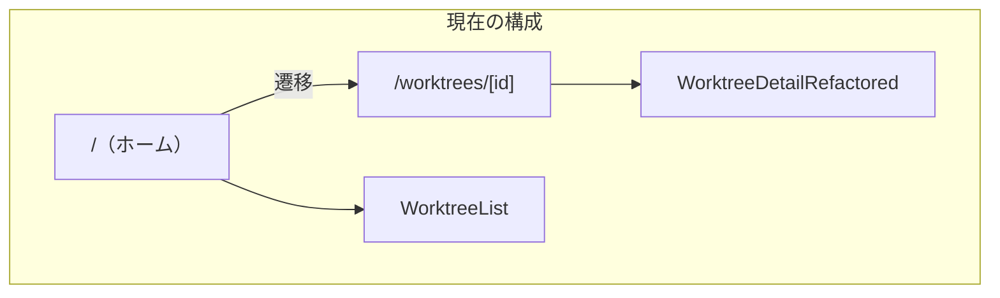
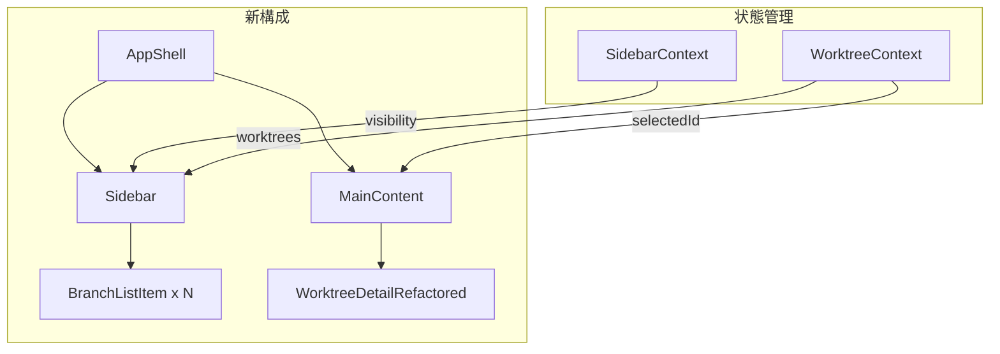
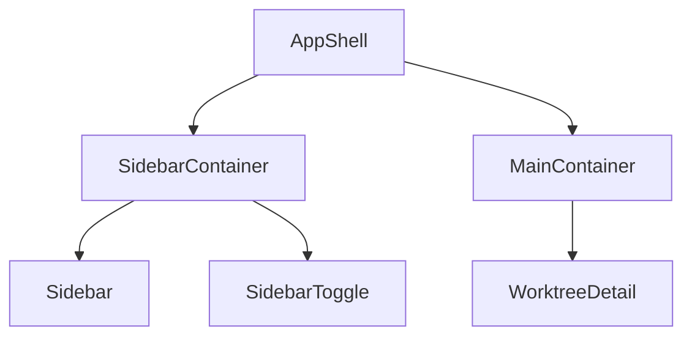
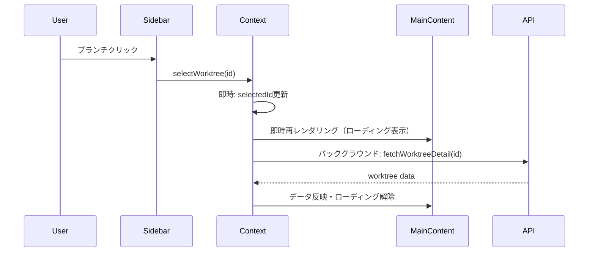
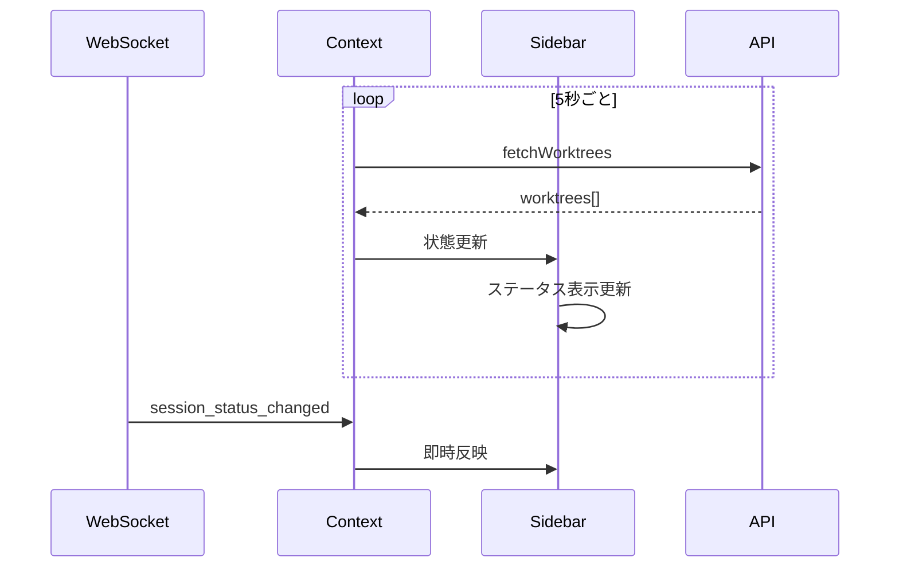
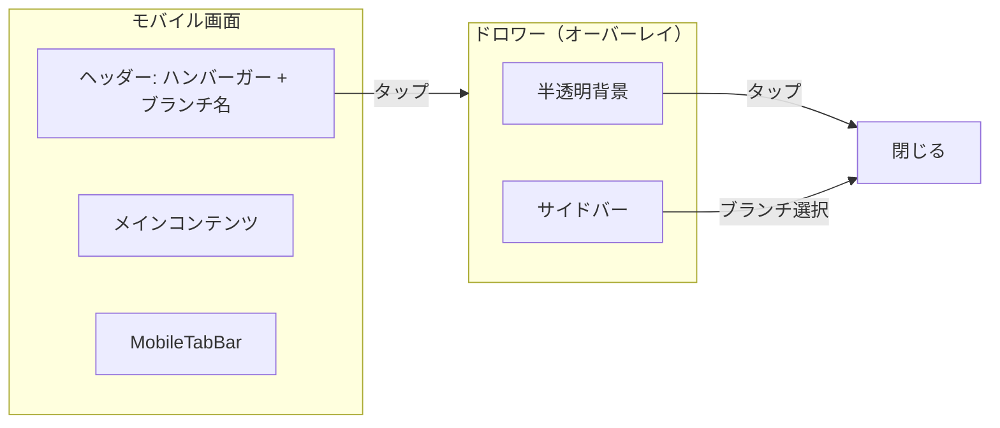

# Issue #22: マルチタスク強化 - 設計方針書

## 1. 概要

### 1.1 Issue要件

| 要件ID | 要件 | 目的 |
|--------|------|------|
| R1 | サイドバーを追加し、サイドバーからブランチを選択可能にする | チャットするように各ブランチに対して指示を行いたい |
| R2 | サイドバーの表示・非表示を切り替え可能にする | 表示領域を最大化したい |
| R3 | 現在実行中のブランチの状況（応答待ち、応答済み）をサイドバーから確認可能にする | 切り替えなくても状況が把握可能にし生産性を向上 |
| R4 | モバイルでもサイドバーを表示可能にする（デフォルト非表示、手動で表示） | スマホからも複数ブランチを切り替えて作業したい |

### 1.2 対象ユーザー

- PCブラウザからの利用者
- スマートフォンからの利用者
- 複数ブランチで並行作業するユーザー

---

## 2. アーキテクチャ設計

### 2.1 現在のシステム構成



**課題**: ブランチ間の移動にはページ遷移が必要で、他ブランチの状態を確認できない

### 2.2 新システム構成



### 2.3 レイヤー構成

```
src/
├── app/
│   └── page.tsx                    # AppShellをラップ
├── components/
│   ├── layout/
│   │   ├── AppShell.tsx            # 新: サイドバー+メイン統合レイアウト
│   │   ├── Sidebar.tsx             # 新: サイドバーコンポーネント
│   │   ├── SidebarToggle.tsx       # 新: 表示切替ボタン
│   │   └── MainLayout.tsx          # 既存（変更なし）
│   ├── sidebar/
│   │   ├── BranchListItem.tsx      # 新: ブランチ一覧アイテム
│   │   ├── BranchStatusIndicator.tsx # 新: ステータスインジケーター
│   │   └── SidebarHeader.tsx       # 新: サイドバーヘッダー
│   └── mobile/
│       ├── MobileDrawer.tsx        # 新: モバイル用ドロワー
│       ├── MobileHeader.tsx        # 既存を拡張（ハンバーガーメニュー追加）
│       └── MobileTabBar.tsx        # 既存（変更なし）
├── contexts/
│   ├── SidebarContext.tsx          # 新: サイドバー状態管理（モバイル対応含む）
│   └── WorktreeSelectionContext.tsx # 新: 選択ブランチ管理
└── hooks/
    ├── useSidebar.ts               # 新: サイドバー操作Hook
    └── useSwipeDrawer.ts           # 新: スワイプジェスチャーHook
```

---

## 3. 技術選定

| カテゴリ | 選定技術 | 選定理由 |
|---------|---------|---------|
| 状態管理 | React Context + useReducer | 軽量、既存パターン踏襲、Prop drilling回避 |
| アニメーション | Tailwind CSS transition | 既存技術スタック、CSS-in-JSオーバーヘッド回避 |
| レイアウト | CSS Flexbox | シンプル、ブラウザ互換性高い |
| 永続化 | localStorage | サイドバー状態の維持（表示/非表示） |
| リアルタイム更新 | 既存WebSocket + ポーリング | 既存インフラ活用 |

---

## 4. 設計パターン

### 4.1 Compound Component パターン

サイドバー関連コンポーネントの組み合わせを柔軟に

```typescript
// 使用例
<Sidebar>
  <Sidebar.Header>
    <SearchInput />
  </Sidebar.Header>
  <Sidebar.Content>
    {branches.map(branch => (
      <Sidebar.Item key={branch.id} branch={branch} />
    ))}
  </Sidebar.Content>
</Sidebar>
```

### 4.2 Context Provider パターン

サイドバー状態とブランチ選択状態を分離

```typescript
// src/contexts/SidebarContext.tsx
interface SidebarState {
  isOpen: boolean;
  width: number;
}

interface SidebarContextValue {
  state: SidebarState;
  toggle: () => void;
  setWidth: (width: number) => void;
}
```

```typescript
// src/contexts/WorktreeSelectionContext.tsx
interface WorktreeSelectionState {
  selectedWorktreeId: string | null;
  worktrees: Worktree[];
}

interface WorktreeSelectionContextValue {
  state: WorktreeSelectionState;
  selectWorktree: (id: string) => void;
  refreshWorktrees: () => Promise<void>;
}
```

### 4.3 Custom Hook パターン

ロジックの再利用とテスタビリティ向上

```typescript
// src/hooks/useSidebar.ts
export function useSidebar() {
  const context = useContext(SidebarContext);
  const { isOpen, toggle, setWidth } = context;

  // localStorage永続化
  useEffect(() => {
    localStorage.setItem('sidebar-open', JSON.stringify(isOpen));
  }, [isOpen]);

  return { isOpen, toggle, setWidth };
}
```

---

## 5. データモデル設計

### 5.1 既存データモデル（変更なし）

```typescript
// src/types/models.ts - Worktree型
interface Worktree {
  id: string;
  name: string;
  path: string;
  repositoryPath: string;
  repositoryName: string;
  isSessionRunning?: boolean;
  isWaitingForResponse?: boolean;
  sessionStatusByCli?: {
    claude?: { isRunning: boolean; isWaitingForResponse: boolean };
    // ...
  };
  // ...その他既存フィールド
}
```

### 5.2 サイドバー表示用派生型

```typescript
// src/types/sidebar.ts
export type BranchStatus =
  | 'idle'           // セッション停止中
  | 'running'        // セッション実行中
  | 'waiting'        // 応答待ち（ユーザー入力待ち）
  | 'generating';    // AI応答生成中

export interface SidebarBranchItem {
  id: string;
  name: string;
  repositoryName: string;
  status: BranchStatus;
  hasUnread: boolean;
  lastActivity?: Date;
}

// Worktreeからの変換関数
export function toBranchItem(worktree: Worktree): SidebarBranchItem;
```

---

## 6. コンポーネント設計

### 6.1 AppShell（新規）



```typescript
// src/components/layout/AppShell.tsx
interface AppShellProps {
  children: React.ReactNode;
}

export function AppShell({ children }: AppShellProps) {
  const { isOpen } = useSidebar();

  return (
    <div className="h-screen flex">
      {/* サイドバー */}
      <aside className={cn(
        "h-full bg-gray-900 transition-all duration-300",
        isOpen ? "w-72" : "w-0"
      )}>
        <Sidebar />
      </aside>

      {/* トグルボタン */}
      <SidebarToggle />

      {/* メインコンテンツ */}
      <main className="flex-1 min-w-0">
        {children}
      </main>
    </div>
  );
}
```

### 6.2 Sidebar（新規）

```typescript
// src/components/layout/Sidebar.tsx
export function Sidebar() {
  const { worktrees, selectedId, selectWorktree } = useWorktreeSelection();
  const [search, setSearch] = useState('');

  const filteredBranches = useMemo(() =>
    worktrees
      .map(toBranchItem)
      .filter(b => b.name.toLowerCase().includes(search.toLowerCase())),
    [worktrees, search]
  );

  return (
    <div className="h-full flex flex-col">
      <SidebarHeader />
      <SearchInput value={search} onChange={setSearch} />
      <div className="flex-1 overflow-y-auto">
        {filteredBranches.map(branch => (
          <BranchListItem
            key={branch.id}
            branch={branch}
            isSelected={branch.id === selectedId}
            onClick={() => selectWorktree(branch.id)}
          />
        ))}
      </div>
    </div>
  );
}
```

### 6.3 BranchListItem（新規）

```typescript
// src/components/sidebar/BranchListItem.tsx
interface BranchListItemProps {
  branch: SidebarBranchItem;
  isSelected: boolean;
  onClick: () => void;
}

export function BranchListItem({ branch, isSelected, onClick }: BranchListItemProps) {
  return (
    <button
      onClick={onClick}
      className={cn(
        "w-full px-4 py-3 flex items-center gap-3 hover:bg-gray-800 transition-colors",
        isSelected && "bg-gray-700 border-l-2 border-blue-500"
      )}
    >
      <BranchStatusIndicator status={branch.status} />
      <div className="flex-1 min-w-0 text-left">
        <p className="text-sm font-medium text-white truncate">{branch.name}</p>
        <p className="text-xs text-gray-400 truncate">{branch.repositoryName}</p>
      </div>
      {branch.hasUnread && (
        <span className="w-2 h-2 rounded-full bg-blue-500" />
      )}
    </button>
  );
}
```

### 6.4 BranchStatusIndicator（新規）

```typescript
// src/components/sidebar/BranchStatusIndicator.tsx
interface BranchStatusIndicatorProps {
  status: BranchStatus;
}

const statusConfig: Record<BranchStatus, { color: string; label: string; animate?: boolean }> = {
  idle: { color: 'bg-gray-500', label: 'Idle' },
  running: { color: 'bg-green-500', label: 'Running', animate: true },
  waiting: { color: 'bg-yellow-500', label: 'Waiting', animate: true },
  generating: { color: 'bg-blue-500', label: 'Generating', animate: true },
};

export function BranchStatusIndicator({ status }: BranchStatusIndicatorProps) {
  const config = statusConfig[status];

  return (
    <span
      className={cn(
        "w-3 h-3 rounded-full",
        config.color,
        config.animate && "animate-pulse"
      )}
      title={config.label}
      aria-label={config.label}
    />
  );
}
```

---

## 7. 状態管理設計

### 7.1 状態構造

```typescript
// グローバル状態
interface GlobalState {
  sidebar: {
    isOpen: boolean;
    width: number;         // ピクセル（将来のリサイズ対応）
  };
  selection: {
    worktreeId: string | null;
    worktrees: Worktree[];
    loading: boolean;
    error: string | null;
  };
}
```

### 7.2 状態更新フロー（楽観的UI更新）

ブランチ選択時のUI応答性を確保するため、**楽観的UI更新パターン**を採用します。



#### 楽観的UI更新の実装

```typescript
// src/contexts/WorktreeSelectionContext.tsx
interface WorktreeSelectionState {
  selectedWorktreeId: string | null;
  worktrees: Worktree[];
  selectedWorktreeDetail: Worktree | null;
  isLoadingDetail: boolean;  // ローディング状態
  error: string | null;
}

// ブランチ選択アクション
const selectWorktree = useCallback(async (id: string) => {
  // Step 1: 即時 - 選択状態とローディングを更新
  dispatch({ type: 'SELECT_WORKTREE', id });
  dispatch({ type: 'SET_LOADING_DETAIL', isLoading: true });

  // Step 2: バックグラウンド - 詳細データ取得
  try {
    const detail = await fetchWorktreeDetail(id);
    dispatch({ type: 'SET_WORKTREE_DETAIL', detail });
  } catch (error) {
    dispatch({ type: 'SET_DETAIL_ERROR', error: 'Failed to load worktree' });
  } finally {
    dispatch({ type: 'SET_LOADING_DETAIL', isLoading: false });
  }
}, []);
```

#### ローディング状態の表示

```typescript
// MainContent でのローディング表示
function MainContent() {
  const { selectedWorktreeId, selectedWorktreeDetail, isLoadingDetail } = useWorktreeSelection();

  if (!selectedWorktreeId) {
    return <EmptyState message="ブランチを選択してください" />;
  }

  if (isLoadingDetail) {
    return <WorktreeDetailSkeleton />;  // スケルトンUI表示
  }

  return <WorktreeDetailRefactored worktree={selectedWorktreeDetail} />;
}
```

### 7.3 リアルタイム更新



---

## 8. API設計

### 8.1 既存API活用（変更なし）

```
GET /api/worktrees              # 一覧取得（サイドバー用）
GET /api/worktrees/:id          # 詳細取得
GET /api/worktrees/:id/current-output  # リアルタイム出力
```

### 8.2 WebSocket（既存活用）

```typescript
// 既存のWebSocketメッセージ
interface SessionStatusPayload {
  type: 'session_status_changed';
  worktreeId: string;
  isRunning: boolean;
}
```

---

## 9. レスポンシブ設計

### 9.1 ブレークポイント

| ブレークポイント | サイドバー | 挙動 |
|-----------------|-----------|------|
| デスクトップ (>=1024px) | 固定表示 | サイドに常駐、トグルで開閉 |
| タブレット (768-1023px) | オーバーレイ | オーバーレイ表示、背景クリックで閉じる |
| モバイル (<768px) | ドロワー | デフォルト非表示、ハンバーガーメニューで表示 |

### 9.2 モバイル対応方針

#### 9.2.1 モバイルサイドバー（ドロワー）

- **デフォルト**: 非表示（画面左外に隠れている）
- **表示トリガー**: ヘッダー左上のハンバーガーアイコンをタップ
- **非表示トリガー**:
  - オーバーレイ背景をタップ
  - ブランチを選択
  - 左スワイプ
- **アニメーション**: 左からスライドイン（300ms ease-out）



#### 9.2.2 モバイルレイアウト構成

```typescript
// モバイル時のAppShell
<div className="h-screen flex flex-col">
  {/* ヘッダー（ハンバーガー + 現在のブランチ名） */}
  <MobileHeader
    onMenuClick={openDrawer}
    currentBranch={selectedBranch}
  />

  {/* メインコンテンツ */}
  <main className="flex-1 overflow-hidden">
    {children}
  </main>

  {/* タブバー */}
  <MobileTabBar />

  {/* ドロワー（オーバーレイ） */}
  <MobileDrawer isOpen={isDrawerOpen} onClose={closeDrawer}>
    <Sidebar onBranchSelect={handleBranchSelect} />
  </MobileDrawer>
</div>
```

#### 9.2.3 MobileDrawer コンポーネント（新規）

```typescript
// src/components/mobile/MobileDrawer.tsx
interface MobileDrawerProps {
  isOpen: boolean;
  onClose: () => void;
  children: React.ReactNode;
}

export function MobileDrawer({ isOpen, onClose, children }: MobileDrawerProps) {
  return (
    <>
      {/* オーバーレイ背景 */}
      <div
        className={cn(
          "fixed inset-0 bg-black/50 z-40 transition-opacity duration-300",
          isOpen ? "opacity-100" : "opacity-0 pointer-events-none"
        )}
        onClick={onClose}
        aria-hidden="true"
      />

      {/* ドロワー本体 */}
      <aside
        className={cn(
          "fixed left-0 top-0 h-full w-72 bg-gray-900 z-50",
          "transform transition-transform duration-300 ease-out",
          isOpen ? "translate-x-0" : "-translate-x-full"
        )}
        aria-label="Branch navigation"
      >
        {children}
      </aside>
    </>
  );
}
```

#### 9.2.4 モバイルヘッダー拡張（後方互換性対応）

既存の `MobileHeader` を拡張する際、**後方互換性**を確保するため `onMenuClick` をオプショナルとします。

```typescript
// src/components/mobile/MobileHeader.tsx
interface MobileHeaderProps {
  worktreeName: string;
  status: WorktreeStatus;
  onBackClick?: () => void;
  onMenuClick?: () => void;  // オプショナル: 後方互換性のため
}

export function MobileHeader({
  worktreeName,
  status,
  onBackClick,
  onMenuClick  // 未指定時はハンバーガーメニュー非表示
}: MobileHeaderProps) {
  return (
    <header className="fixed top-0 left-0 right-0 h-14 bg-white border-b z-30">
      <div className="flex items-center h-full px-4">
        {/* ハンバーガーメニュー: onMenuClick が指定された場合のみ表示 */}
        {onMenuClick && (
          <button
            onClick={onMenuClick}
            className="p-2 -ml-2 text-gray-600 hover:text-gray-900"
            aria-label="Open branch menu"
          >
            <MenuIcon className="w-6 h-6" />
          </button>
        )}

        {/* ブランチ名 + ステータス */}
        <div className={cn(
          "flex-1 flex items-center gap-2",
          onMenuClick ? "ml-2" : "ml-0"  // ハンバーガーの有無で余白調整
        )}>
          <BranchStatusIndicator status={status} />
          <span className="font-medium truncate">{worktreeName}</span>
        </div>

        {/* 戻るボタン（オプション） */}
        {onBackClick && (
          <button onClick={onBackClick} className="p-2">
            <ArrowLeftIcon className="w-5 h-5" />
          </button>
        )}
      </div>
    </header>
  );
}
```

#### 後方互換性の確認事項

| 既存使用箇所 | 影響 | 対応 |
|-------------|------|------|
| `WorktreeDetailRefactored` 内の `MobileHeader` | なし | `onMenuClick` 未指定で従来動作 |
| 将来の新規使用 | なし | `onMenuClick` 指定でハンバーガー表示 |

```typescript
// 既存コード（変更不要）- ハンバーガーなし
<MobileHeader
  worktreeName={worktreeName}
  status={worktreeStatus}
  onBackClick={handleBackClick}
/>

// 新規コード（AppShell内）- ハンバーガーあり
<MobileHeader
  worktreeName={worktreeName}
  status={worktreeStatus}
  onMenuClick={openDrawer}  // ドロワーを開く
/>
```

### 9.3 タッチジェスチャー対応

| ジェスチャー | 操作 |
|-------------|------|
| 画面左端から右スワイプ | ドロワーを開く |
| ドロワー上で左スワイプ | ドロワーを閉じる |
| オーバーレイタップ | ドロワーを閉じる |

```typescript
// src/hooks/useSwipeDrawer.ts
export function useSwipeDrawer(onOpen: () => void, onClose: () => void) {
  // 既存のuseSwipeGesture hookを活用
  useSwipeGesture({
    onSwipeRight: (startX) => {
      // 画面左端20%からのスワイプでのみ開く
      if (startX < window.innerWidth * 0.2) {
        onOpen();
      }
    },
    onSwipeLeft: onClose,
    threshold: 50,
  });
}
```

### 9.4 状態管理の拡張

```typescript
// src/contexts/SidebarContext.tsx の拡張
interface SidebarState {
  isOpen: boolean;
  width: number;
  isMobileDrawerOpen: boolean;  // 追加: モバイルドロワー状態
}

interface SidebarContextValue {
  state: SidebarState;
  toggle: () => void;
  setWidth: (width: number) => void;
  openMobileDrawer: () => void;   // 追加
  closeMobileDrawer: () => void;  // 追加
}
```

### 9.5 既存MobileTabBarとの共存

- `MobileTabBar` は引き続きターミナル/履歴/ファイル/メモ切り替えに使用
- サイドバー（ドロワー）はブランチ切り替え専用
- 役割を明確に分離することでUXを維持

---

## 10. キーボード操作

| キー | 操作 |
|------|------|
| `Cmd/Ctrl + B` | サイドバー表示/非表示トグル |
| `Cmd/Ctrl + ↑/↓` | ブランチ選択移動 |
| `Enter` | 選択ブランチを開く |
| `Escape` | 検索クリア |

---

## 11. 設計上の決定事項とトレードオフ

### 11.1 採用した設計

| 決定事項 | 理由 | トレードオフ |
|---------|------|-------------|
| React Context使用 | 軽量、学習コスト低い | 大規模スケールには向かない |
| ページ遷移なし（SPA的） | UX向上、状態維持 | 初期ロード重くなる可能性 |
| localStorage永続化 | シンプル、サーバー不要 | デバイス間同期なし |
| ポーリング + WebSocket | 既存インフラ活用 | ポーリング負荷 |
| **楽観的UI更新** | ブランチ選択時の即時応答性確保 | ローディング状態の管理が必要 |
| **MobileHeader後方互換** | 既存使用箇所への影響回避 | オプショナルpropsによる分岐増加 |

### 11.2 代替案との比較

#### 代替案1: URL遷移維持（Next.js Router）
- **メリット**: ブラウザ履歴対応、ディープリンク可能
- **デメリット**: ページ遷移でサイドバー状態リセット、UX低下
- **不採用理由**: マルチタスク体験を損なう

#### 代替案2: 状態管理にZustand/Jotai使用
- **メリット**: より洗練されたAPI、DevTools対応
- **デメリット**: 依存追加、学習コスト
- **不採用理由**: 現時点では過剰、将来必要に応じて移行可能

#### 代替案3: Server Actions + Server Stateでのデータ取得
- **メリット**: サーバーキャッシュ活用
- **デメリット**: リアルタイム性の低下、複雑性増加
- **不採用理由**: リアルタイム更新要件に合わない

---

## 12. 実装フェーズ

### Phase 1: 基盤構築
1. `SidebarContext` / `WorktreeSelectionContext` 作成
2. `AppShell` コンポーネント作成
3. 基本的なサイドバーレイアウト実装（デスクトップ）

### Phase 2: ブランチ一覧
1. `BranchListItem` 実装
2. `BranchStatusIndicator` 実装
3. ブランチ選択機能

### Phase 3: モバイル対応
1. `MobileDrawer` コンポーネント実装
2. `MobileHeader` 拡張（ハンバーガーメニュー追加）
3. `useSwipeDrawer` hook実装（スワイプジェスチャー）
4. モバイル用状態管理（`isMobileDrawerOpen`）

### Phase 4: 状態同期
1. WebSocket連携
2. ポーリング更新
3. ステータス表示のリアルタイム更新

### Phase 5: UX向上
1. キーボードショートカット（デスクトップ）
2. サイドバーリサイズ機能
3. アニメーション調整

---

## 13. テスト戦略

### 13.1 単体テスト

```typescript
// BranchStatusIndicator.test.tsx
describe('BranchStatusIndicator', () => {
  it('displays correct color for each status', () => {
    // ...
  });
  it('shows pulse animation for active statuses', () => {
    // ...
  });
});
```

### 13.2 統合テスト

```typescript
// Sidebar.integration.test.tsx
describe('Sidebar', () => {
  it('updates branch status when WebSocket message received', () => {
    // ...
  });
  it('selects branch and updates main content', () => {
    // ...
  });
});
```

### 13.3 E2Eテスト

```typescript
// sidebar.e2e.test.ts
test('desktop: sidebar branch selection workflow', async ({ page }) => {
  await page.setViewportSize({ width: 1280, height: 720 });
  await page.goto('/');
  await page.click('[data-testid="branch-item-feature-123"]');
  await expect(page.locator('[data-testid="worktree-detail"]')).toContainText('feature-123');
});

test('mobile: drawer opens on hamburger click', async ({ page }) => {
  await page.setViewportSize({ width: 375, height: 667 }); // iPhone SE
  await page.goto('/');

  // ドロワーは初期状態で非表示
  await expect(page.locator('[data-testid="mobile-drawer"]')).not.toBeVisible();

  // ハンバーガーメニューをタップ
  await page.click('[data-testid="hamburger-menu"]');

  // ドロワーが表示される
  await expect(page.locator('[data-testid="mobile-drawer"]')).toBeVisible();
});

test('mobile: drawer closes on branch selection', async ({ page }) => {
  await page.setViewportSize({ width: 375, height: 667 });
  await page.goto('/');

  // ドロワーを開く
  await page.click('[data-testid="hamburger-menu"]');
  await expect(page.locator('[data-testid="mobile-drawer"]')).toBeVisible();

  // ブランチを選択
  await page.click('[data-testid="branch-item-feature-123"]');

  // ドロワーが閉じる
  await expect(page.locator('[data-testid="mobile-drawer"]')).not.toBeVisible();

  // 選択したブランチが表示される
  await expect(page.locator('[data-testid="current-branch-name"]')).toContainText('feature-123');
});

test('mobile: drawer closes on overlay tap', async ({ page }) => {
  await page.setViewportSize({ width: 375, height: 667 });
  await page.goto('/');

  await page.click('[data-testid="hamburger-menu"]');
  await page.click('[data-testid="drawer-overlay"]');

  await expect(page.locator('[data-testid="mobile-drawer"]')).not.toBeVisible();
});
```

---

## 14. 制約条件の確認

### CLAUDE.md原則への準拠

| 原則 | 対応 |
|------|------|
| SOLID - 単一責任 | コンポーネント分離（Sidebar, BranchListItem, StatusIndicator） |
| KISS | 既存パターン活用、最小限の新規依存 |
| YAGNI | リサイズ機能はPhase 4、必要に応じて |
| DRY | 既存のWorktree型、WebSocket hook再利用 |

---

## 15. 次のステップ

1. `/issue-split` で実装Issueに分割
2. `/work-plan` で各Issueの作業計画立案
3. `/tdd-impl` でTDD実装開始

---

## 付録: 参照ファイル

- `src/components/layout/MainLayout.tsx` - 既存レイアウト
- `src/components/worktree/WorktreeDetailRefactored.tsx` - 詳細コンポーネント
- `src/components/worktree/WorktreeList.tsx` - 一覧コンポーネント
- `src/hooks/useWebSocket.ts` - WebSocket hook
- `src/types/models.ts` - データモデル定義
