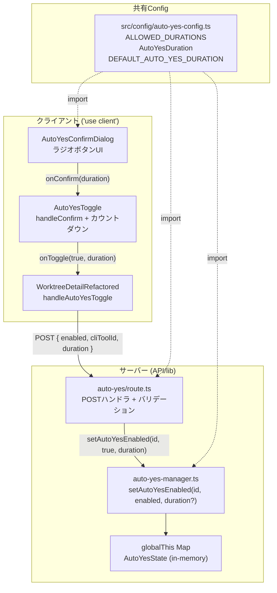

# 設計方針書: Issue #225 Auto-Yes有効時間選択機能

## 1. 概要

Auto-Yesモード有効化時に、有効時間を「1時間」「3時間」「8時間」から選択できるようにする。
現在の1時間固定（ハードコード）を、ユーザーが用途に応じて選択可能にする変更。

### 設計目標

- 既存のAuto-Yesアーキテクチャへの最小限の変更
- Server/Clientバンドル境界の適切な分離
- 型安全なduration伝搬
- 後方互換性の維持

## 2. アーキテクチャ設計

### システム構成図



### レイヤー構成

| レイヤー | ファイル | 役割 |
|---------|---------|------|
| **Config** | `src/config/auto-yes-config.ts` | 定数・型定義（Server/Client共有） |
| **Presentation** | `AutoYesConfirmDialog.tsx` | duration選択UI（ラジオボタン） |
| **Presentation** | `AutoYesToggle.tsx` | duration伝搬 + カウントダウン表示 |
| **Presentation** | `WorktreeDetailRefactored.tsx` | API呼び出し |
| **API** | `auto-yes/route.ts` | バリデーション + マネージャー呼び出し |
| **Business Logic** | `auto-yes-manager.ts` | 状態管理（expiresAt計算） |

### 設計根拠

**共有Configファイルの分離 (src/config/auto-yes-config.ts)**:

`auto-yes-manager.ts`はサーバー専用モジュール（tmux, cli-session, prompt-detectorなどNode.js依存をトップレベルでimport）。`'use client'`コンポーネント（AutoYesConfirmDialog）から直接importすると、Next.jsのバンドラがサーバー専用モジュールをクライアントバンドルに含めようとしてエラーまたはバンドルサイズ肥大を引き起こす。

プロジェクトの既存パターン（`src/config/status-colors.ts`, `src/config/z-index.ts`等）に従い、純粋な定数・型のみを含む共有configファイルに分離する。

### 影響範囲分析（Stage 3）

#### 直接変更対象ファイル

| ファイル | 変更内容 | リスク |
|---------|---------|-------|
| `src/config/auto-yes-config.ts` | 新規: ALLOWED_DURATIONS, AutoYesDuration, DEFAULT_AUTO_YES_DURATION, DURATION_LABELS | 低 |
| `src/lib/auto-yes-manager.ts` | AUTO_YES_TIMEOUT_MS削除、duration引数追加、DEFAULT_AUTO_YES_DURATION import | 低 |
| `src/app/api/worktrees/[id]/auto-yes/route.ts` | durationバリデーション追加（ホワイトリスト）、setAutoYesEnabledへのduration伝搬 | 低 |
| `src/components/worktree/AutoYesConfirmDialog.tsx` | ラジオボタンUI、selectedDuration状態、onConfirm型変更 | 低 |
| `src/components/worktree/AutoYesToggle.tsx` | onToggle型変更、handleConfirmのduration伝搬、formatTimeRemaining H:MM:SS対応 | 低 |
| `src/components/worktree/WorktreeDetailRefactored.tsx` | handleAutoYesToggle にduration引数追加、API bodyにduration含む | 低 |

#### 影響なし確認済み間接依存ファイル（Verified No-Impact Dependencies）

> **[Stage 3 MF-001/SF-002]** 以下のファイルは`auto-yes-manager.ts`をimportしているが、本変更の影響を受けない。理由を明記し、実装時に追加変更が不要であることを確認済みとする。

| ファイル | importしている関数/値 | 影響なしの理由 |
|---------|---------------------|--------------|
| `src/app/api/worktrees/[id]/current-output/route.ts` | `getAutoYesState`, `getLastServerResponseTimestamp` | `AutoYesState`インターフェースに変更なし（durationフィールド非追加の設計判断による）。クライアントはカウントダウン表示に`expiresAt`のみを使用するため、duration情報のレスポンス追加は不要。 |
| `src/lib/session-cleanup.ts` | `stopAutoYesPolling` | `stopAutoYesPolling`のシグネチャに変更なし。セッション停止処理はdurationと無関係。 |
| `src/hooks/useAutoYes.ts` | なし（prompt-response APIを使用） | Auto-Yes APIではなくprompt-response APIを使用するクライアント側フック。`UseAutoYesParams`はdurationを扱わない。duration選択はAutoYesConfirmDialog経由で行われ、useAutoYesフックは関与しない。 |
| `src/lib/auto-yes-resolver.ts` | `pollAutoYes`から呼び出される | プロンプト応答判定ロジックであり、タイミング制御（duration/expiresAt）とは無関係。durationの変更が応答判定に影響することはない。 |

## 3. 技術選定

| カテゴリ | 選定 | 理由 |
|---------|------|------|
| duration定数 | `as const` タプル | リテラル型による型安全性 |
| UI | HTMLラジオボタン + Tailwind CSS | 既存UIパターンに準拠、追加ライブラリ不要 |
| バリデーション | ホワイトリスト方式 | `ALLOWED_DURATIONS.includes()` でサーバー側検証 |
| 状態管理 | 既存のglobalThis Map | DB変更不要、既存パターン維持 |
| テスト | Vitest (unit) | 既存テストフレームワーク |

### 代替案との比較

| 代替案 | メリット | デメリット | 判定 |
|-------|---------|-----------|------|
| ドロップダウン（select） | コンパクト | 3択には過剰、ラジオの方が視認性高い | 不採用 |
| 自由入力（分指定） | 柔軟性 | バリデーション複雑、UX低下 | 不採用 |
| DB永続化 | サーバー再起動後も保持 | 既存設計（in-memory）との乖離大 | 不採用 |
| ALLOWED_DURATIONSをauto-yes-manager.tsに配置 | ファイル数削減 | Server/Clientバンドル問題 | 不採用 |

## 4. データモデル設計

### DB変更: なし

Auto-Yes状態は既存のインメモリ管理（globalThis Map）を維持。durationはサーバー側で`expiresAt`に変換されるため、新しいフィールドの永続化は不要。

### 型定義

```typescript
// src/config/auto-yes-config.ts

/** 許可されるAuto-Yes有効時間（ミリ秒） */
export const ALLOWED_DURATIONS = [3600000, 10800000, 28800000] as const;

/** Auto-Yes有効時間の型（リテラルユニオン） */
export type AutoYesDuration = typeof ALLOWED_DURATIONS[number];

/** デフォルトのAuto-Yes有効時間（1時間 = 3600000ms） */
export const DEFAULT_AUTO_YES_DURATION: AutoYesDuration = 3600000;

/** duration値のUI表示ラベル */
export const DURATION_LABELS: Record<AutoYesDuration, string> = {
  3600000: '1時間',
  10800000: '3時間',
  28800000: '8時間',
};
```

> **[SF-002] コンパイル時キー補完保証**: `DURATION_LABELS`の型を`Record<AutoYesDuration, string>`とすることにより、`ALLOWED_DURATIONS`に新しい値を追加した場合、`DURATION_LABELS`に対応するキーが存在しないとTypeScriptコンパイラがエラーを報告する。これにより、ALLOWED_DURATIONSとDURATION_LABELSの同期は手動管理ではなくコンパイラによって強制される。選択肢追加のワークフローは2ステップ（配列追加 + ラベル追加）だが、ラベル追加漏れはビルドエラーとして検出されるため、ランタイムエラーのリスクはない。

### 既存インターフェース変更

```typescript
// auto-yes-manager.ts - AutoYesState（変更なし）
export interface AutoYesState {
  enabled: boolean;
  enabledAt: number;
  expiresAt: number; // 計算値のみ保持、durationは保持しない
}
```

**設計判断**: `AutoYesState`にdurationフィールドを追加しない。`expiresAt`は`enabledAt + duration`で計算される結果であり、クライアントに必要な情報は`expiresAt`のみ。durationを保持すると冗長になり、矛盾の温床となる。

## 5. API設計

### エンドポイント

`POST /api/worktrees/:id/auto-yes`（既存エンドポイントの拡張）

### リクエストスキーマ

```typescript
interface AutoYesPostRequest {
  enabled: boolean;      // 必須
  cliToolId?: string;    // 任意（デフォルト: 'claude'）
  duration?: number;     // 任意（デフォルト: 3600000）
}
```

### バリデーションルール

```typescript
// route.ts 内のバリデーション

// 0. [SEC-SF-001] JSON パースエラーハンドリング
// request.json() の呼び出しで不正な JSON（空ボディ、テキスト等）が送信された場合、
// 明示的に 400 エラーを返す。500 エラーとして伝播させない。
let body;
try {
  body = await request.json();
} catch {
  return NextResponse.json({ error: 'Invalid JSON body' }, { status: 400 });
}

// 1. [SEC-MF-001] worktreeId 形式検証（validateWorktreeExists の前に実施）
// isValidWorktreeId() で形式を検証し、不正な場合は 400 を返す。
// これにより不正な形式の worktreeId が DB クエリやエラーメッセージに到達することを防ぐ。
if (!isValidWorktreeId(params.id)) → 400

// 2. enabled: boolean必須（既存）
if (typeof body.enabled !== 'boolean') → 400

// 3. [SEC-SF-002] duration: enabled=true時のみ検証（typeof チェック付き）
// typeof チェックにより、文字列やオブジェクト等の不正な型を明示的に拒否する。
// Array.includes() は厳密等価（===）を使用するため文字列 '3600000' はマッチしないが、
// 中間処理での型強制リスクを排除するため、明示的な型チェックを追加する。
if (body.enabled && body.duration !== undefined) {
  if (typeof body.duration !== 'number' || !ALLOWED_DURATIONS.includes(body.duration)) → 400
}

// 4. duration省略時 → DEFAULT_AUTO_YES_DURATION適用（後方互換）
const duration = body.duration ?? DEFAULT_AUTO_YES_DURATION;
```

### レスポンススキーマ

```typescript
// 成功 (200) - 既存のAutoYesResponse型と同一
{
  enabled: boolean;
  expiresAt: number | null;
  pollingStarted?: boolean;
}

// バリデーションエラー (400)
{
  error: "Invalid duration value. Allowed values: 3600000, 10800000, 28800000"
}
```

### 後方互換性

- `duration`フィールドはオプショナル（省略時はデフォルト1時間）
- 既存のAPIクライアント（useAutoYes.ts等）はdurationを送信しないため、従来通り1時間で動作
- レスポンス形式に変更なし

## 6. コンポーネント設計

### 6-1. AutoYesConfirmDialog

```typescript
// Props変更
export interface AutoYesConfirmDialogProps {
  isOpen: boolean;
  onConfirm: (duration: AutoYesDuration) => void;  // 変更: () => void → (duration: AutoYesDuration) => void [SF-003]
  onCancel: () => void;
  cliToolName?: string;
}

// 内部状態
const [selectedDuration, setSelectedDuration] = useState<AutoYesDuration>(DEFAULT_AUTO_YES_DURATION);

// ラジオボタンUI
ALLOWED_DURATIONS.map(duration => (
  <label>
    <input type="radio" checked={selectedDuration === duration} onChange={...} />
    {DURATION_LABELS[duration]}
  </label>
))

// 動的テキスト
<p>{DURATION_LABELS[selectedDuration]}後に自動でOFFになります。</p>

// 確認ボタン
onClick={() => onConfirm(selectedDuration)}
```

> **[SF-003] 型安全なコールバック**: `onConfirm`の型を`(duration: number) => void`ではなく`(duration: AutoYesDuration) => void`とすることで、ダイアログからの戻り値が型レベルで`ALLOWED_DURATIONS`のいずれかであることが保証される。`number`型だと中間レイヤーで不正な値が混入する余地があるが、`AutoYesDuration`リテラルユニオン型を使用することで、クライアント側のデータフロー全体で型安全性が向上する。

### 6-2. AutoYesToggle

```typescript
// Props変更
export interface AutoYesToggleProps {
  // ... 既存props
  onToggle: (enabled: boolean, duration?: AutoYesDuration) => Promise<void>;  // duration追加、AutoYesDuration型使用 [SF-003]
}

// handleConfirm変更
const handleConfirm = useCallback((duration: AutoYesDuration) => {  // AutoYesDuration型使用 [SF-003]
  setShowConfirmDialog(false);
  setToggling(true);
  onToggle(true, duration).finally(() => setToggling(false));
}, [onToggle]);

// AutoYesConfirmDialog のonConfirmに直接handleConfirmを渡す
<AutoYesConfirmDialog
  isOpen={showConfirmDialog}
  onConfirm={handleConfirm}  // handleConfirmが(duration: AutoYesDuration)を受け取る
  onCancel={handleCancel}
  cliToolName={formatCliToolName(cliToolName)}
/>
```

### 6-3. formatTimeRemaining（HH:MM:SS対応）

```typescript
function formatTimeRemaining(expiresAt: number): string {
  const remaining = Math.max(0, expiresAt - Date.now());
  const hours = Math.floor(remaining / 3600000);
  const minutes = Math.floor((remaining % 3600000) / 60000);
  const seconds = Math.floor((remaining % 60000) / 1000);

  if (hours > 0) {
    return `${hours}:${minutes.toString().padStart(2, '0')}:${seconds.toString().padStart(2, '0')}`;
  }
  return `${minutes.toString().padStart(2, '0')}:${seconds.toString().padStart(2, '0')}`;
}
```

**設計判断**: 1時間未満はMM:SS（既存互換）、1時間以上はH:MM:SSを使用。HHではなくH（ゼロパディングなし）とする理由：最大8時間=1桁で十分、"08:00:00"より"8:00:00"の方が自然。

> **[SF-001] 配置場所の設計判断**: `formatTimeRemaining`は現在`AutoYesToggle.tsx`内のモジュールスコープ関数として定義されており、本変更でもその配置を維持する。この関数はAutoYesToggle専用であり、現時点で他のコンポーネントから参照する計画はないため、SRP観点での問題はない。**将来的に時間フォーマットロジックを他の箇所（例: セッション残時間表示等）でも使用する場合は`src/lib/utils.ts`への抽出を検討する**。抽出の判断基準は「2箇所以上から同一のフォーマットロジックが必要になった時点」とする。

### 6-4. WorktreeDetailRefactored

```typescript
// handleAutoYesToggle変更
const handleAutoYesToggle = useCallback(async (enabled: boolean, duration?: AutoYesDuration): Promise<void> => {  // AutoYesDuration型使用 [SF-003]
  try {
    const response = await fetch(`/api/worktrees/${worktreeId}/auto-yes`, {
      method: 'POST',
      headers: { 'Content-Type': 'application/json' },
      body: JSON.stringify({ enabled, cliToolId: activeCliTab, duration }),
    });
    // ... 既存のレスポンスハンドリング
  }
}, [worktreeId, activeCliTab]);
```

### 6-5. auto-yes-manager.ts

> **[MF-001] AUTO_YES_TIMEOUT_MSの削除と移行**: 現在`auto-yes-manager.ts`にハードコードされている`AUTO_YES_TIMEOUT_MS = 3600000`定数は、本変更で新設する`DEFAULT_AUTO_YES_DURATION = 3600000`（`src/config/auto-yes-config.ts`）と意味的に同一の値である。DRY原則に従い、**`AUTO_YES_TIMEOUT_MS`を完全に削除**し、`DEFAULT_AUTO_YES_DURATION`に一本化する。`auto-yes-manager.ts`は`src/config/auto-yes-config.ts`から`DEFAULT_AUTO_YES_DURATION`をimportして使用する。

```typescript
// [MF-001] 削除対象:
// - auto-yes-manager.ts内の AUTO_YES_TIMEOUT_MS 定数定義を削除
// - AUTO_YES_TIMEOUT_MS を参照している全箇所を DEFAULT_AUTO_YES_DURATION に置換

// 移行前（削除対象）:
// const AUTO_YES_TIMEOUT_MS = 3600000;

// 移行後:
import { DEFAULT_AUTO_YES_DURATION } from '@/config/auto-yes-config';

// setAutoYesEnabled変更
export function setAutoYesEnabled(
  worktreeId: string,
  enabled: boolean,
  duration?: AutoYesDuration  // 追加: オプショナル、AutoYesDuration型 [SF-003]
): AutoYesState {
  if (enabled) {
    const now = Date.now();
    const effectiveDuration = duration ?? DEFAULT_AUTO_YES_DURATION;  // [MF-001] AUTO_YES_TIMEOUT_MSではなくDEFAULT_AUTO_YES_DURATIONを使用
    const state: AutoYesState = {
      enabled: true,
      enabledAt: now,
      expiresAt: now + effectiveDuration,
    };
    autoYesStates.set(worktreeId, state);
    return state;
  }
  // ... disable処理は変更なし
}
```

## 7. セキュリティ設計

### 入力バリデーション

| 層 | バリデーション | 実装 | Stage 4 補足 |
|---|------------|------|-------------|
| **API** | JSONパースエラー | try-catch で 400 レスポンス | **[SEC-SF-001]** 不正JSONに対して500ではなく明示的に400を返す |
| **API** | worktreeId形式検証 | `isValidWorktreeId(params.id)` を `validateWorktreeExists()` **の前に**呼び出し | **[SEC-MF-001]** route.tsレベルで明示的に形式検証を実施 |
| **API** | durationホワイトリスト | `typeof body.duration !== 'number' \|\| !ALLOWED_DURATIONS.includes(body.duration)` | **[SEC-SF-002]** typeof チェック追加 |
| **API** | cliToolIdホワイトリスト | 既存の`isValidCliTool()` | - |
| **Client** | 型制約 | `AutoYesDuration`リテラル型 | - |

> **[SEC-MF-001] route.ts レベルの worktreeId 形式検証**: `isValidWorktreeId()` は `startAutoYesPolling()` 内で適用されているが、route.ts の POST ハンドラでは `validateWorktreeExists()` が DB 検索のみで形式検証を行っていない。route.ts の POST ハンドラの先頭で `isValidWorktreeId(params.id)` を呼び出し、不正な形式の場合は `{ error: 'Invalid worktree ID format' }` で 400 エラーを返す。これにより、不正な形式の worktreeId が DB クエリに到達する前にブロックされる。バリデーション順序は以下の通り:
>
> 1. `isValidWorktreeId(params.id)` -- 形式検証（400エラー）
> 2. `validateWorktreeExists(params.id)` -- DB存在確認（404エラー）
> 3. `body.enabled` / `body.duration` -- リクエストボディ検証（400エラー）

### リスク評価

| リスク | 対策 | 評価 | OWASP カテゴリ |
|-------|------|------|---------------|
| 任意のduration値注入 | サーバー側ホワイトリストバリデーション + typeof チェック [SEC-SF-002] | 対応済み | A03:2021 Injection |
| 最大8時間のAuto-Yes有効化 | 上限設定（8時間）+ ユーザー同意ダイアログ | 許容範囲 | A04:2021 Insecure Design |
| duration省略による意図しない動作 | デフォルト値（1時間）でフォールバック | 後方互換 | A05:2021 Security Misconfiguration |
| 不正なworktreeId形式 | `isValidWorktreeId()` によるroute.tsレベル形式検証 [SEC-MF-001] | 対応済み | A03:2021 Injection |
| worktreeId のエラーメッセージ反射 | `isValidWorktreeId()` による事前形式検証が緩和策として機能 [SEC-MF-002] | 既存課題（本Issue外） | A01:2021 Broken Access Control |
| 不正JSONボディの送信 | try-catch による明示的 400 レスポンス [SEC-SF-001] | 対応済み | A03:2021 Injection |
| UI表示における自動応答内容のXSS | React JSX デフォルトエスケープ + resolveAutoAnswer() 出力制約 [SEC-SF-004] | リスクなし | A03:2021 Injection (XSS) |

> **[SEC-MF-002] エラーメッセージにおけるユーザー入力反射**: `validateWorktreeExists()` は 404 エラーレスポンスに worktreeId をそのまま含めている（`Worktree '${worktreeId}' not found`）。これはユーザー入力の反射パターンであり、潜在的な情報漏洩リスクである。**本Issue (#225) での対策**: SEC-MF-001 の `isValidWorktreeId()` 形式検証により、不正な形式（スクリプト注入等を含む文字列）は validateWorktreeExists() に到達する前にブロックされる。これにより、反射されるのは形式検証を通過した正当な形式の worktreeId のみとなり、リスクが緩和される。なお、worktreeId 反射パターン自体の根本的な改善はプロジェクト全体の方針として本Issue外で検討する。

> **[SEC-SF-004] UI表示における自動応答内容の安全性分析**: `AutoYesToggle.tsx` では `lastAutoResponse` 値を通知テキストに組み込んでいる（`Auto responded: "${lastAutoResponse}"`）。この値のセキュリティは以下の2層で保証されている:
>
> 1. **出力制約**: `lastAutoResponse` は `resolveAutoAnswer()` の戻り値であり、`'y'` または番号文字列（`'1'`, `'2'` 等）に限定される。任意のユーザー入力が混入する経路は存在しない。
> 2. **レンダリングエスケープ**: React の JSX レンダリング（`{notification}`）はデフォルトでHTMLエスケープを行うため、仮に想定外の文字列が混入した場合でもXSSは発生しない。
>
> 結論: Auto-Yes の自動応答内容表示において XSS リスクは存在しない。

### セキュリティドキュメント更新

> **[Stage 3 SF-003]** `docs/TRUST_AND_SAFETY.md`の更新内容を以下に具体化する。
> **[SEC-SF-003]** Stage 4セキュリティレビューにより、具体的なリスクシナリオとベストプラクティスを追記。

- **対象ファイル**: `docs/TRUST_AND_SAFETY.md`
- **更新箇所**: 「Auto Yes mode」セクション（現在の記載付近、L48-49あたり）
- **追記内容**:
  - Auto-Yesモードの最大選択可能時間が従来の1時間固定から最大8時間に拡大された旨を明記
  - 選択可能な時間は1時間、3時間、8時間の3択であり、デフォルトは1時間であることを記載
  - セキュリティ観点での推奨事項: 必要最小限の時間を選択することを推奨する文言を追加

- **[SEC-SF-003] 8時間使用に関する具体的リスクシナリオと緩和策**:

  **リスクシナリオ**:
  - **離席中の広範なファイル操作**: 8時間のAuto-Yes有効化中にユーザーが離席した場合、Claude CLIが確認プロンプトに対して自動で「y」を応答し続ける。例えば、広範なファイル削除やリファクタリングの確認に自動承認されるリスクがある
  - **予期しないワークツリー外操作**: CM_ROOT_DIRの設定が広範な場合、意図しないディレクトリへの操作が自動承認される可能性がある
  - **長時間にわたる自動応答の蓄積**: 8時間の間に多数の自動応答が蓄積され、レビューが困難になる可能性がある

  **緩和策（既存）**:
  - サーバー側ホワイトリストバリデーションにより、8時間を超える値は設定不可
  - ユーザーは有効化時にダイアログで明示的に時間を選択・承認する
  - カウントダウン表示により残り時間を常時確認可能
  - 手動でいつでもOFFに切替可能

  **ベストプラクティス（TRUST_AND_SAFETY.mdに追記する内容）**:
  - **最小権限の時間選択**: 作業に必要な最小限の時間を選択する。迷った場合はデフォルトの1時間を推奨
  - **CM_ROOT_DIRの限定設定**: 長時間Auto-Yes使用時は、CM_ROOT_DIRを作業対象のworktreeディレクトリに限定し、影響範囲を制限する
  - **離席時のOFF推奨**: 長時間離席する場合は、残り時間に関わらずAuto-Yesを手動でOFFにすることを推奨
  - **8時間使用の想定ユースケース**: 長時間のバッチ処理的な開発タスク（大規模リファクタリング、テスト網羅的実行等）で、ユーザーが定期的に進捗を確認できる状況での使用を想定

## 8. パフォーマンス設計

### 影響分析

| 観点 | 影響 | 理由 |
|------|------|------|
| レンダリング | 軽微 | ラジオボタン3個の追加のみ |
| ポーリング | なし | 間隔・バックオフロジックに変更なし |
| メモリ | なし | AutoYesStateのフィールド数変更なし |
| ネットワーク | なし | POSTリクエストに1フィールド（数値）追加のみ |

### キャッシュ戦略

変更なし。Auto-Yes状態はリアルタイム性が必要なため、キャッシュは不使用（既存設計通り）。

## 9. テスト設計

### テスト対象と方針

| テスト種別 | 対象 | 主要テストケース |
|-----------|------|----------------|
| **Unit** | `auto-yes-config.ts` | 定数値の妥当性（間接カバー） |
| **Unit** | `auto-yes-manager.ts` | デフォルトduration、duration指定、後方互換性、AUTO_YES_TIMEOUT_MS不使用の確認 |
| **Unit** | `AutoYesConfirmDialog.tsx` | ラジオボタン表示、選択変更、onConfirm引数、動的テキスト変化 |
| **Unit** | `AutoYesToggle.tsx` | onToggle伝搬、formatTimeRemaining（MM:SS/HH:MM:SS） |
| **Unit** | `WorktreeDetailRefactored.test.tsx` | AutoYesToggleモックの新シグネチャ互換性 [Stage 3 SF-001] |
| **Integration** | `auto-yes-persistence.test.ts` | デフォルトduration適用の確認（既存テスト動作維持） |
| **Integration** | `auto-yes-persistence.test.ts` | カスタムduration（3時間）のモジュールリロード後永続性 [Stage 3 SF-004] |
| **E2E/Manual** | route.ts | 不正duration値の400レスポンス |

### 既存テスト破壊的変更の影響（Stage 3 MF-002）

> **[Stage 3 MF-002]** 以下の既存テストアサーションは、onConfirm/onToggleシグネチャ変更により失敗するようになる。実装時にこれらのアサーションを更新する必要がある。

#### AutoYesConfirmDialog.test.tsx

- **L66付近**: `expect(defaultProps.onConfirm).toHaveBeenCalledTimes(1)` -- このアサーション自体は通るが、引数の検証が不足する
- **更新内容**: `expect(defaultProps.onConfirm).toHaveBeenCalledWith(3600000)` に変更（デフォルトdurationで呼ばれることを検証）
- **追加テスト**: 非デフォルトduration選択時のテスト（ラジオボタンで3時間を選択後、`expect(defaultProps.onConfirm).toHaveBeenCalledWith(10800000)`）

#### AutoYesToggle.test.tsx

- **L43付近**: `expect(defaultProps.onToggle).toHaveBeenCalledWith(true)` -- シグネチャ変更後は`(true, duration)`で呼ばれるため失敗する
- **更新内容**: `expect(defaultProps.onToggle).toHaveBeenCalledWith(true, 3600000)` に変更（デフォルトdurationが伝搬されることを検証）

#### WorktreeDetailRefactored.test.tsx（Stage 3 SF-001）

> **[Stage 3 SF-001]** `tests/unit/components/WorktreeDetailRefactored.test.tsx`はAutoYesToggleコンポーネントをモックしている。AutoYesToggleのpropsインターフェース（onToggleシグネチャ）が変更されるため、モックの互換性を確認・更新する必要がある。

- **確認項目**: AutoYesToggleモックがonToggle propsの型を検証しているか確認
- **更新内容**: モックのonToggleが新シグネチャ`(enabled: boolean, duration?: AutoYesDuration) => Promise<void>`と互換であることを確認。必要に応じてモック定義を更新

### 既存テスト更新

```typescript
// tests/unit/lib/auto-yes-manager.test.ts
describe('setAutoYesEnabled', () => {
  it('should enable with default duration (1 hour)', () => {
    // [MF-001] 既存テストのリファクタリング: 3600000 → DEFAULT_AUTO_YES_DURATION参照
    // AUTO_YES_TIMEOUT_MSへの参照が残っていないことを確認
  });

  it('should enable with specified duration (3 hours)', () => {
    const state = setAutoYesEnabled('wt-1', true, 10800000);
    expect(state.expiresAt).toBe(now + 10800000);
  });

  it('should enable with specified duration (8 hours)', () => {
    const state = setAutoYesEnabled('wt-1', true, 28800000);
    expect(state.expiresAt).toBe(now + 28800000);
  });

  it('should use default duration when duration is undefined', () => {
    // 後方互換性テスト
    const state = setAutoYesEnabled('wt-1', true);
    expect(state.expiresAt).toBe(now + 3600000);
  });
});

// [MF-001] AUTO_YES_TIMEOUT_MS削除後の回帰テスト
describe('AUTO_YES_TIMEOUT_MS migration', () => {
  it('should not export AUTO_YES_TIMEOUT_MS from auto-yes-manager', () => {
    // auto-yes-manager.tsからAUTO_YES_TIMEOUT_MSがexportされていないことを確認
    // DEFAULT_AUTO_YES_DURATIONがauto-yes-config.tsからimportされていることを確認
  });
});
```

### [CO-003] 動的テキストの検証テスト

```typescript
// tests/unit/components/AutoYesConfirmDialog.test.ts
describe('AutoYesConfirmDialog', () => {
  it('should display dynamic duration text based on selected radio', () => {
    // selectedDuration変更時に「X時間後に自動でOFFになります」テキストが動的に変化することを確認
    // ハードコードされた「1時間後に...」が残っていないことを確認
  });
});
```

### [Stage 3 SF-004] カスタムduration永続性の結合テスト

```typescript
// tests/integration/auto-yes-persistence.test.ts（追加テストケース）
describe('custom duration persistence across module reload', () => {
  it('should persist 3-hour duration in-memory state after module reload', () => {
    // 1. setAutoYesEnabled('test-duration-reload', true, 10800000) で3時間durationを設定
    // 2. モジュールをリロード（既存テストのreloadパターンに従う）
    // 3. getAutoYesState('test-duration-reload') で状態を取得
    // 4. state.expiresAt が enabledAt + 10800000 を反映していることを確認
    // 目的: インメモリ状態がカスタムdurationを正しく保持し、
    //       モジュールホットリロード時にデフォルト値に戻らないことを検証
  });
});
```

## 10. 設計上の決定事項とトレードオフ

| 決定事項 | 理由 | トレードオフ |
|---------|------|-------------|
| 共有configファイル分離 | Server/Clientバンドル問題回避 | ファイル数1増加 |
| AutoYesStateにduration非保持 | 冗長性排除、矛盾防止 | duration事後参照不可（expiresAtから逆算可能） |
| ラジオボタンUI | 3択の選択に最適、視認性高い | 選択肢追加時のUI拡張が必要 |
| ホワイトリストバリデーション | セキュリティ重視 | 選択肢追加時は定数配列の更新が必要 |
| formatTimeRemaining H:MM:SS | 最大8時間でゼロパディング不要 | HH:MM:SS統一の方が一貫性あり |
| duration省略時デフォルト1時間 | 後方互換性維持 | 明示的なduration指定が推奨だが強制しない |
| **[MF-001]** AUTO_YES_TIMEOUT_MS削除・DEFAULT_AUTO_YES_DURATIONへ一本化 | DRY原則、単一の定数定義源 | 既存テストの定数参照を更新する必要あり |
| **[SF-001]** formatTimeRemainingをAutoYesToggle.tsx内に維持 | 現時点で単一の利用箇所、過度な抽象化回避 | 2箇所以上で必要になったらutils.tsへ抽出 |
| **[SF-003]** コールバック型にAutoYesDuration使用 | クライアント側データフロー全体の型安全性向上 | config/auto-yes-config.tsへのimport依存が増える |

## 11. 実装順序

> **Note**: 本設計書はプレ実装（実装前）の設計文書です。ソースコードへの実装は未着手であり、以下の実装順序に従ってボトムアップで実装を進めてください。Stage 2整合性レビュー（2026-02-10）にて、設計書の完成度は高いが実装が未着手であることが確認されています。

```
1. src/config/auto-yes-config.ts（新規）
   - ALLOWED_DURATIONS, AutoYesDuration, DEFAULT_AUTO_YES_DURATION, DURATION_LABELS定義
   ↓
2. src/lib/auto-yes-manager.ts（duration対応 + [MF-001] AUTO_YES_TIMEOUT_MS削除）
   - AUTO_YES_TIMEOUT_MS定数を削除
   - import { DEFAULT_AUTO_YES_DURATION } from '@/config/auto-yes-config' を追加
   - setAutoYesEnabled()にduration?パラメータ追加
   - AUTO_YES_TIMEOUT_MSを参照していた全箇所をDEFAULT_AUTO_YES_DURATIONに置換
   ↓
3. src/app/api/worktrees/[id]/auto-yes/route.ts（バリデーション追加）
   ↓
4. src/components/worktree/AutoYesConfirmDialog.tsx（ラジオボタンUI）
   - onConfirm型: (duration: AutoYesDuration) => void [SF-003]
   ↓
5. src/components/worktree/AutoYesToggle.tsx（duration伝搬 + HH:MM:SS）
   - onToggle型: (enabled: boolean, duration?: AutoYesDuration) => Promise<void> [SF-003]
   - formatTimeRemainingはコンポーネント内に維持 [SF-001]
   ↓
6. src/components/worktree/WorktreeDetailRefactored.tsx（API呼び出し変更）
   - handleAutoYesToggle型: (enabled: boolean, duration?: AutoYesDuration) => Promise<void> [SF-003]
   ↓
7. テスト更新・追加
   - AUTO_YES_TIMEOUT_MS削除の回帰テスト [MF-001]
   - 動的テキスト変化テスト [CO-003]
   ↓
8. ドキュメント更新
```

**理由**: ボトムアップ（定数定義 → サーバーロジック → API → UIコンポーネント）で実装し、各段階でテスト可能な状態を維持する。ステップ2でAUTO_YES_TIMEOUT_MSの削除を明示的に行い、旧定数への依存を早期に断つ。

## 12. モバイル対応

### ラジオボタンUI

- Modal `size="sm"` 内に3つのラジオボタンを垂直配置
- タッチターゲットは最低44px（WCAG 2.1準拠）
- 既存のTailwind CSS `space-y-*` パターンで間隔確保

### 確認事項

- ラジオボタン追加によりModal高さが増加（約60-80px）
- `size="sm"`でスクロールが発生しないことを確認（既存のModal実装がmax-heightを管理）

---

## 13. 実装ステータス

| 項目 | 状態 |
|------|------|
| **設計書** | 完成（Stage 1/2/3/4レビュー指摘反映済み） |
| **ソースコード実装** | 未着手 |
| **テスト実装** | 未着手 |
| **ドキュメント更新** | 未着手 |

### 現在の状態（2026-02-10時点）

本設計書はStage 1通常レビューにおいて条件付き承認（4/5）を取得し、全指摘事項を設計書に反映済みである。Stage 2整合性レビューにおいて設計書とソースコードの整合性を検証した結果、設計書の品質は高いが実装が完全に未着手であることが確認された（整合性スコア: 2/5）。Stage 3影響分析レビューにおいて条件付き承認（4/5）を取得し、間接依存ファイルの影響分析漏れ4件と既存テスト破壊的変更の未記載2件を設計書に反映済みである。Stage 4セキュリティレビューにおいて条件付き承認（4/5）を取得し、route.tsレベルのworktreeId形式検証、JSONパースエラーハンドリング、duration型チェック、UI表示安全性分析等のセキュリティ指摘6件を設計書に反映済みである。

Stage 2レビューのスコア（2/5）は設計書の不備を示すものではなく、設計書に記載された全11項目の変更がソースコードに未反映であることを示している。設計書自体に修正が必要な箇所はない。Stage 3およびStage 4レビューの指摘事項は全て設計書に反映済みである。

### 次のアクション

1. セクション11「実装順序」に従い、ボトムアップで実装を開始する
2. 実装完了後、セクション15「実装チェックリスト」の全項目を確認する
3. 特に「実装後の整合性検証（Stage 2レビュー対応）」チェックリストにより、Stage 2で検出された全乖離が解消されたことを確認する

---

## 14. レビュー指摘事項サマリー

### Stage 1: 通常レビュー（2026-02-10）

| ID | 分類 | 原則 | タイトル | 対応状況 |
|----|------|------|---------|---------|
| MF-001 | Must Fix | DRY | AUTO_YES_TIMEOUT_MS定数とALLOWED_DURATIONSの重複 | 反映済み: セクション6-5, 10, 11に明記 |
| SF-001 | Should Fix | SOLID/SRP | formatTimeRemainingの配置場所の曖昧さ | 反映済み: セクション6-3に設計判断と抽出基準を追記 |
| SF-002 | Should Fix | SOLID/OCP | DURATION_LABELSとALLOWED_DURATIONSの同期が手動 | 反映済み: セクション4にコンパイル時保証を追記 |
| SF-003 | Should Fix | KISS | onConfirmコールバックの型がnumberではなくAutoYesDurationであるべき | 反映済み: セクション6-1, 6-2, 6-4, 6-5の型定義を更新 |
| CO-001 | Consider | YAGNI | 選択肢の妥当性（1時間/3時間/8時間） | 参考記録: 将来的にユーザーフィードバックに基づき見直し |
| CO-002 | Consider | SOLID/DIP | route.tsのバリデーション関数抽出 | 参考記録: KISS原則とのバランスで現状維持 |
| CO-003 | Consider | DRY | ハードコードされた時間テキストの動的化 | 参考記録: テスト計画に動的テキスト検証を追加 |

### Stage 2: 整合性レビュー（2026-02-10）

Stage 2レビューでは設計書とソースコードの整合性を検証した。結果として、設計書自体は完成度が高いが、ソースコードへの実装が完全に未着手であることが確認された。以下の9件のMust Fix、2件のShould Fixは全て**ソースコード側の実装タスク**であり、設計書の不備ではない。

| ID | 分類 | タイトル | 対象ファイル | 状態 |
|----|------|---------|-------------|------|
| MF-001 | Must Fix | src/config/auto-yes-config.ts が未作成 | src/config/auto-yes-config.ts | 実装待ち |
| MF-002 | Must Fix | setAutoYesEnabled() に duration パラメータが未追加 | src/lib/auto-yes-manager.ts | 実装待ち |
| MF-003 | Must Fix | AUTO_YES_TIMEOUT_MS 定数が未削除 | src/lib/auto-yes-manager.ts | 実装待ち |
| MF-004 | Must Fix | AutoYesConfirmDialog の onConfirm 型が未変更 | AutoYesConfirmDialog.tsx | 実装待ち |
| MF-005 | Must Fix | ラジオボタンUI / duration選択機能が未実装 | AutoYesConfirmDialog.tsx | 実装待ち |
| MF-006 | Must Fix | AutoYesToggle の onToggle 型が未変更 | AutoYesToggle.tsx | 実装待ち |
| MF-007 | Must Fix | formatTimeRemaining が HH:MM:SS 未対応 | AutoYesToggle.tsx | 実装待ち |
| MF-008 | Must Fix | handleAutoYesToggle に duration パラメータが未追加 | WorktreeDetailRefactored.tsx | 実装待ち |
| MF-009 | Must Fix | route.ts に duration バリデーションが未追加 | auto-yes/route.ts | 実装待ち |
| SF-001 | Should Fix | AutoYesState の JSDoc コメントがハードコード値を参照 | src/lib/auto-yes-manager.ts | 実装待ち |
| SF-002 | Should Fix | テストコードに duration 指定テストが未追加 | auto-yes-manager.test.ts | 実装待ち |

### 整合性マトリクス（Stage 2）

Stage 2レビューで作成された設計書-実装の整合性マトリクスを以下に示す。詳細は `dev-reports/issue/225/multi-stage-design-review/stage2-review-result.json` の `consistency_matrix` を参照。

| 設計項目 | 設計仕様 | 実装状態 | 差分 |
|---------|---------|---------|------|
| src/config/auto-yes-config.ts (新規ファイル) | ALLOWED_DURATIONS, AutoYesDuration, DEFAULT_AUTO_YES_DURATION, DURATION_LABELS | 未実装 | ファイル自体が存在しない |
| auto-yes-manager.ts - setAutoYesEnabled シグネチャ | (worktreeId, enabled, duration?) | 未変更 | duration パラメータ未追加 |
| auto-yes-manager.ts - AUTO_YES_TIMEOUT_MS 削除 | 定数削除、DEFAULT_AUTO_YES_DURATION に一本化 | 未実施 | 旧定数が残存 |
| auto-yes-manager.ts - AutoYesState インターフェース | 変更なし（JSDocコメント更新のみ） | 未更新 | JSDocがハードコード値を参照 |
| route.ts - duration バリデーション | ALLOWED_DURATIONS.includes() + 400エラー + duration伝搬 | 未実装 | duration 関連処理が一切なし |
| AutoYesConfirmDialog - ラジオボタンUI | ラジオボタン3択、selectedDuration状態、動的テキスト | 未実装 | 固定テキストのまま |
| AutoYesConfirmDialog - onConfirm 型 | (duration: AutoYesDuration) => void | 未変更 | () => void のまま |
| AutoYesToggle - onToggle 型 | (enabled: boolean, duration?) => Promise<void> | 未変更 | (enabled: boolean) のまま |
| AutoYesToggle - formatTimeRemaining HH:MM:SS | hours > 0 時に H:MM:SS フォーマット | 未実装 | MM:SS のみ |
| WorktreeDetailRefactored - handleAutoYesToggle | (enabled, duration?) + API body に duration 含む | 未変更 | duration なし |
| テスト - duration指定テスト | 3時間/8時間テスト、後方互換テスト、回帰テスト | 未実装 | テスト計画が未着手 |

### Stage 3: 影響分析レビュー（2026-02-10）

Stage 3レビューでは本変更の影響範囲を分析し、設計書に記載されていない間接依存ファイルやテストの破壊的変更を特定した。

| ID | 分類 | タイトル | 対応状況 |
|----|------|---------|---------|
| MF-001 | Must Fix | 間接依存ファイル（current-output/route.ts、session-cleanup.ts、useAutoYes.ts、auto-yes-resolver.ts）が設計書に未記載 | 反映済み: セクション2に「影響なし確認済み間接依存ファイル」セクションを追加 |
| MF-002 | Must Fix | 既存テストアサーション（AutoYesConfirmDialog L66、AutoYesToggle L43）がシグネチャ変更で失敗する | 反映済み: セクション9に「既存テスト破壊的変更の影響」セクションを追加、セクション15にチェックリスト追加 |
| SF-001 | Should Fix | WorktreeDetailRefactored.test.tsxのAutoYesToggleモック更新が必要な可能性 | 反映済み: セクション9のテスト対象表とセクション15にチェックリスト追加 |
| SF-002 | Should Fix | session-cleanup.tsが影響分析に未記載 | 反映済み: セクション2の「影響なし確認済み間接依存ファイル」に含む（MF-001と統合） |
| SF-003 | Should Fix | TRUST_AND_SAFETY.md更新内容が不具体 | 反映済み: セクション7に具体的な追記内容・リスク評価を明記 |
| SF-004 | Should Fix | カスタムdurationのモジュールリロード永続性テストが未計画 | 反映済み: セクション9にテストケース追加、セクション15にチェックリスト追加 |
| CO-001 | Consider | auto-yes-resolver.tsの影響なし確認 | 参考記録: セクション2の影響なし確認済みテーブルに記載 |
| CO-002 | Consider | H:MM:SSフォーマットのモバイルレイアウト影響 | 参考記録: セクション15に手動テスト項目として追加 |
| CO-003 | Consider | CLAUDE.mdモジュールテーブル更新 | 参考記録: セクション15に記録 |

### Stage 4: セキュリティレビュー（2026-02-10）

Stage 4レビューではOWASP Top 10に基づくセキュリティ分析を実施し、設計書のSection 7（セキュリティ設計）の網羅性と、実装時に適用すべきセキュリティ対策を評価した。

| ID | 分類 | OWASPカテゴリ | タイトル | 対応状況 |
|----|------|--------------|---------|---------|
| SEC-MF-001 | Must Fix | A03:2021 Injection | route.tsのworktreeIdに対するisValidWorktreeId()バリデーション未適用 | 反映済み: セクション5バリデーションルール、セクション7入力バリデーションテーブル、セクション15にチェックリスト追加 |
| SEC-MF-002 | Must Fix | A01:2021 / A05:2021 | 404エラーレスポンスでのworktreeId反射による情報漏洩リスク | 反映済み: セクション7リスク評価テーブルに追記、SEC-MF-001の形式検証が緩和策として機能する旨を明記 |
| SEC-SF-001 | Should Fix | A03:2021 Injection | request.json()のパースエラーハンドリング不足 | 反映済み: セクション5バリデーションルールにJSONパースエラー処理を追加 |
| SEC-SF-002 | Should Fix | A03:2021 Injection | durationの型チェック不足（typeof検証なし） | 反映済み: セクション5バリデーションルールにtypeofチェック追加、セクション7入力バリデーションテーブル更新 |
| SEC-SF-003 | Should Fix | Security documentation | TRUST_AND_SAFETY.mdの更新に8時間リスクの具体的緩和策が不十分 | 反映済み: セクション7セキュリティドキュメント更新に具体的リスクシナリオ・ベストプラクティス追加 |
| SEC-SF-004 | Should Fix | A03:2021 Injection (XSS) | AutoYesToggle通知におけるlastAutoResponseの表示 | 反映済み: セクション7リスク評価テーブルにUI表示安全性分析追加 |
| SEC-CO-001 | Consider | A09:2021 Logging | Auto-Yes有効化の監査ログ（セキュリティイベントログ） | 参考記録: 将来的にsecurity-logger.tsでのイベントログ記録を検討 |
| SEC-CO-002 | Consider | Availability / DoS | Auto-Yes ON/OFF連打によるリソース消費 | 参考記録: ローカルアプリケーションのため緊急度低、将来的にレートリミット検討 |
| SEC-CO-003 | Consider | Security process | duration値の将来的な拡張時のセキュリティレビュープロセス | 参考記録: ALLOWED_DURATIONS上限値拡大時のセキュリティレビュー必須化を検討 |

### レビュー評価

**Stage 1**:
- **スコア**: 4/5（条件付き承認）
- **リスク**: 技術=低、セキュリティ=低、運用=低

**Stage 2**:
- **スコア**: 2/5（needs_major_changes） -- 設計書自体の品質ではなく、実装未着手による設計-コード間の乖離が原因
- **リスク**: 技術=高（実装未着手）、セキュリティ=低（機能未実装のため脆弱性なし）、運用=中

**Stage 3**:
- **スコア**: 4/5（条件付き承認）
- **リスク**: 技術=低、セキュリティ=低、運用=低
- **主要指摘**: 間接依存ファイルの影響分析漏れ（4件）、既存テストの破壊的変更未記載（2件）

**Stage 4**:
- **スコア**: 4/5（条件付き承認）
- **リスク**: 技術=低、セキュリティ=低、運用=低
- **主要指摘**: route.tsレベルのworktreeId形式検証未適用（1件）、JSONパースエラーハンドリング・duration型チェック・UI表示安全性分析の設計書記載不足（4件）
- **OWASPチェックリスト**: 10カテゴリ中、A03 Injection が conditional_pass（SEC-MF-001/SEC-SF-002対応後にpass）、A09 Logging が conditional_pass（SEC-CO-001は将来検討）、他はpass/not_applicable

## 15. 実装チェックリスト

### 必須対応（Must Fix）

- [ ] **[MF-001]** `auto-yes-manager.ts`から`AUTO_YES_TIMEOUT_MS`定数を完全に削除する
- [ ] **[MF-001]** `auto-yes-manager.ts`に`import { DEFAULT_AUTO_YES_DURATION } from '@/config/auto-yes-config'`を追加する
- [ ] **[MF-001]** `AUTO_YES_TIMEOUT_MS`を参照していた全箇所を`DEFAULT_AUTO_YES_DURATION`に置換する
- [ ] **[MF-001]** 既存テストの`AUTO_YES_TIMEOUT_MS`参照を`DEFAULT_AUTO_YES_DURATION`に更新する
- [ ] **[MF-001]** `AUTO_YES_TIMEOUT_MS`がコードベースに残存していないことをgrepで確認する

### 推奨対応（Should Fix）

- [ ] **[SF-001]** `formatTimeRemaining`を`AutoYesToggle.tsx`内のモジュールスコープ関数として維持する（utils.tsに移動しない）
- [ ] **[SF-001]** 将来2箇所以上で同一ロジックが必要になった場合に`src/lib/utils.ts`へ抽出するルールをチームで共有する
- [ ] **[SF-002]** `DURATION_LABELS`の型が`Record<AutoYesDuration, string>`であり、キー不足がコンパイルエラーになることを確認する
- [ ] **[SF-003]** `AutoYesConfirmDialog`の`onConfirm`型を`(duration: AutoYesDuration) => void`にする
- [ ] **[SF-003]** `AutoYesToggle`の`onToggle`型を`(enabled: boolean, duration?: AutoYesDuration) => Promise<void>`にする
- [ ] **[SF-003]** `WorktreeDetailRefactored`の`handleAutoYesToggle`型を`(enabled: boolean, duration?: AutoYesDuration) => Promise<void>`にする
- [ ] **[SF-003]** `auto-yes-manager.ts`の`setAutoYesEnabled`のdurationパラメータ型を`AutoYesDuration`にする

### 影響分析対応（Stage 3）

#### 必須対応（Must Fix）

- [ ] **[Stage 3 MF-001]** 間接依存ファイル4件（current-output/route.ts、session-cleanup.ts、useAutoYes.ts、auto-yes-resolver.ts）が変更不要であることを実装時に再確認する
- [ ] **[Stage 3 MF-002]** `AutoYesConfirmDialog.test.tsx` L66付近: `onConfirm`アサーションを`expect(defaultProps.onConfirm).toHaveBeenCalledWith(3600000)`に更新する
- [ ] **[Stage 3 MF-002]** `AutoYesToggle.test.tsx` L43付近: `onToggle`アサーションを`expect(defaultProps.onToggle).toHaveBeenCalledWith(true, 3600000)`に更新する
- [ ] **[Stage 3 MF-002]** 非デフォルトduration選択時の新規テストケースを追加する（ラジオボタン操作 + onConfirm引数検証）

#### 推奨対応（Should Fix）

- [ ] **[Stage 3 SF-001]** `WorktreeDetailRefactored.test.tsx`のAutoYesToggleモックが新しいonToggleシグネチャと互換であることを確認・更新する
- [ ] **[Stage 3 SF-002]** `session-cleanup.ts`が影響なし確認済みであることを実装時に確認する（stopAutoYesPollingシグネチャ不変）
- [ ] **[Stage 3 SF-003]** `docs/TRUST_AND_SAFETY.md`のAuto-Yesセクションに、最大8時間のduration拡張・リスク評価・推奨事項を追記する
- [ ] **[Stage 3 SF-004]** `tests/integration/auto-yes-persistence.test.ts`にカスタムduration（10800000ms）のモジュールリロード後永続性テストを追加する

### セキュリティ対応（Stage 4）

#### 必須対応（Must Fix）

- [ ] **[SEC-MF-001]** `route.ts`のPOSTハンドラ先頭で`isValidWorktreeId(params.id)`を呼び出し、不正形式の場合は`{ error: 'Invalid worktree ID format' }`で400エラーを返す
- [ ] **[SEC-MF-001]** `isValidWorktreeId()`の呼び出しが`validateWorktreeExists()`の**前**に配置されていることを確認する
- [ ] **[SEC-MF-002]** durationバリデーションエラーメッセージが`'Invalid duration value. Allowed values: 3600000, 10800000, 28800000'`であること（ホワイトリスト値は公開情報と同等のため問題なし）を確認する
- [ ] **[SEC-MF-002]** worktreeId反射パターンについて、SEC-MF-001の形式検証が緩和策として機能していることを確認する

#### 推奨対応（Should Fix）

- [ ] **[SEC-SF-001]** `route.ts`で`request.json()`のパースエラーをtry-catchで捕捉し、明示的に400レスポンス（`{ error: 'Invalid JSON body' }`）を返す
- [ ] **[SEC-SF-001]** 不正JSON送信時に500ではなく400が返ることをテストで確認する
- [ ] **[SEC-SF-002]** durationバリデーションに`typeof body.duration !== 'number'`チェックを追加する（`ALLOWED_DURATIONS.includes()`の前）
- [ ] **[SEC-SF-002]** 文字列'3600000'やオブジェクト`{}`等の不正型がdurationとして送信された場合に400エラーが返ることをテストで確認する
- [ ] **[SEC-SF-003]** `docs/TRUST_AND_SAFETY.md`に8時間使用時の具体的リスクシナリオ（離席中のファイル操作自動承認等）を追記する
- [ ] **[SEC-SF-003]** `docs/TRUST_AND_SAFETY.md`にベストプラクティスを追記する: 最小権限の時間選択、CM_ROOT_DIR限定設定、離席時のOFF推奨、8時間想定ユースケース
- [ ] **[SEC-SF-004]** `AutoYesToggle.tsx`の`lastAutoResponse`表示について、React JSXデフォルトエスケープと`resolveAutoAnswer()`出力制約によりXSSリスクがないことをコードレビューで確認する

### 参考対応（Consider）

- [ ] **[CO-001]** 選択肢（1時間/3時間/8時間）の根拠をIssueまたはPR descriptionに記録する
- [ ] **[CO-003]** ダイアログの動的テキスト（selectedDurationに応じた表示変化）のテストケースを追加する
- [ ] **[Stage 3 CO-001]** `auto-yes-resolver.ts`が影響なしであることをドキュメント上記録する（影響範囲分析セクションに記載済み）
- [ ] **[Stage 3 CO-002]** H:MM:SSフォーマットのモバイルレイアウトへの影響を手動テストで確認する（3時間/8時間での`inline`モードAutoYesToggle表示）
- [ ] **[Stage 3 CO-003]** `CLAUDE.md`のモジュールテーブルに`src/config/auto-yes-config.ts`を追加し、`auto-yes-manager.ts`の説明にdurationサポートを追記する
- [ ] **[SEC-CO-001]** Auto-Yesの有効化/無効化をsecurity-logger.tsでセキュリティイベントとしてログ記録することを将来検討する（特にduration値を含む）
- [ ] **[SEC-CO-002]** Auto-Yes ON/OFF連打に対するレートリミットまたは最小間隔制限の導入を将来検討する
- [ ] **[SEC-CO-003]** ALLOWED_DURATIONSの変更（特に上限値拡大）時にセキュリティレビューを必須とするチームルールを検討する

### 実装後の整合性検証（Stage 2レビュー対応）

以下の検証ステップは、実装完了後にStage 2整合性レビューの指摘事項が全て解消されたことを確認するために実施する。整合性マトリクスの各項目に対応している。

- [ ] **[検証: MF-001]** `src/config/auto-yes-config.ts` が作成され、ALLOWED_DURATIONS, AutoYesDuration, DEFAULT_AUTO_YES_DURATION, DURATION_LABELS が定義されていることを確認
- [ ] **[検証: MF-002]** `setAutoYesEnabled()` のシグネチャに `duration?: AutoYesDuration` パラメータが追加されていることを確認
- [ ] **[検証: MF-003]** `auto-yes-manager.ts` から `AUTO_YES_TIMEOUT_MS` が完全に削除され、`DEFAULT_AUTO_YES_DURATION` に置換されていることをgrepで確認
- [ ] **[検証: MF-004]** `AutoYesConfirmDialog` の `onConfirm` 型が `(duration: AutoYesDuration) => void` になっていることを確認
- [ ] **[検証: MF-005]** `AutoYesConfirmDialog` にラジオボタンUI、selectedDuration状態、DURATION_LABELSによる動的テキストが実装されていることを確認
- [ ] **[検証: MF-006]** `AutoYesToggle` の `onToggle` 型が `(enabled: boolean, duration?: AutoYesDuration) => Promise<void>` になっていることを確認
- [ ] **[検証: MF-007]** `formatTimeRemaining` が1時間以上の場合に H:MM:SS フォーマットを使用することを確認
- [ ] **[検証: MF-008]** `WorktreeDetailRefactored` の `handleAutoYesToggle` が duration を受け取り、API body に含めて送信することを確認
- [ ] **[検証: MF-009]** `route.ts` に duration のホワイトリストバリデーションが実装され、不正値で400エラーが返ることを確認
- [ ] **[検証: SF-001]** `AutoYesState` の JSDoc コメントからハードコード値（3600000ms, 1 hour）の参照が削除されていることを確認
- [ ] **[検証: SF-002]** テストコードに duration 指定テスト（3時間/8時間）、デフォルト後方互換テスト、AUTO_YES_TIMEOUT_MS 回帰テストが追加されていることを確認
- [ ] **[検証: 全体]** `npx tsc --noEmit` が成功し、型エラーがないことを確認
- [ ] **[検証: 全体]** `npm run lint` が成功することを確認
- [ ] **[検証: 全体]** `npm run test:unit` が成功することを確認

---

## 16. レビュー履歴

| 日付 | ステージ | レビュー種別 | 結果 | レビュー結果ファイル |
|------|---------|-------------|------|-------------------|
| 2026-02-10 | Stage 1 | 通常レビュー（設計原則） | 条件付き承認 (4/5) | `dev-reports/issue/225/multi-stage-design-review/stage1-review-result.json` |
| 2026-02-10 | Stage 2 | 整合性レビュー（設計-実装整合性） | needs_major_changes (2/5) -- 実装未着手 | `dev-reports/issue/225/multi-stage-design-review/stage2-review-result.json` |
| 2026-02-10 | Stage 3 | 影響分析レビュー（影響範囲） | 条件付き承認 (4/5) | `dev-reports/issue/225/multi-stage-design-review/stage3-review-result.json` |
| 2026-02-10 | Stage 4 | セキュリティレビュー（OWASP Top 10） | 条件付き承認 (4/5) | `dev-reports/issue/225/multi-stage-design-review/stage4-review-result.json` |

---

## 制約条件

- SOLID原則: 単一責任（configファイル分離）、開放閉鎖（ALLOWED_DURATIONS配列への追加で選択肢拡張可能）
- KISS原則: 既存のインメモリ管理パターンを維持、DB変更なし
- YAGNI原則: カスタム時間入力や無制限オプションは実装しない
- DRY原則: ALLOWED_DURATIONS/DURATION_LABELSの一元管理、AUTO_YES_TIMEOUT_MSはDEFAULT_AUTO_YES_DURATIONに一本化 [MF-001]
- **[SF-002]** ALLOWED_DURATIONSに値を追加した場合、DURATION_LABELSへの対応追加はTypeScriptコンパイラ（`Record<AutoYesDuration, string>`型）が強制する。ランタイムで同期漏れが発生するリスクはない。

---

*Generated by design-policy command for Issue #225*
*Date: 2026-02-10*
*Stage 1 review findings applied: 2026-02-10*
*Stage 2 review findings applied: 2026-02-10*
*Stage 3 review findings applied: 2026-02-10*
*Stage 4 review findings applied: 2026-02-10*
