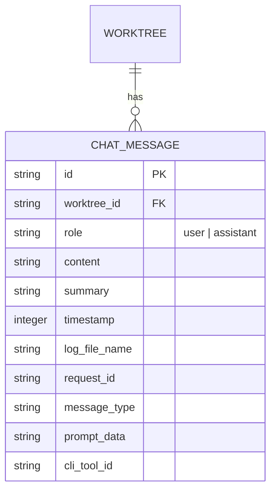
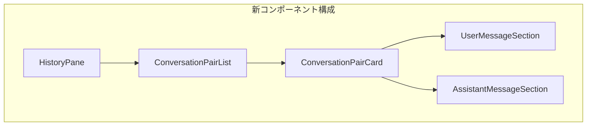

# Issue #23: History表示改善 - 設計方針書

## 1. 概要

### Issue要件
- **タイトル**: History表示改善
- **要件**: ユーザーインプットとAssistantからの回答を1:1の対応関係となるように表示
- **現状の課題**: メッセージがバラバラに表示されている

### 解決すべき課題
現在のHistoryPane/MessageListコンポーネントでは、メッセージがタイムスタンプ順にフラットに表示されており、ユーザーの質問とそれに対するAssistantの回答の対応関係が視覚的に不明確である。

---

## 2. 現状分析

### 2.1 データ構造



**現状のChatMessage型**:
```typescript
interface ChatMessage {
  id: string;
  worktreeId: string;
  role: ChatRole;  // 'user' | 'assistant'
  content: string;
  summary?: string;
  timestamp: Date;
  logFileName?: string;
  requestId?: string;
  messageType: MessageType;
  promptData?: PromptData;
  cliToolId?: CLIToolType;
}
```

**問題点**:
- メッセージ間の親子関係や対応関係を示すフィールドがない
- タイムスタンプ順のフラット表示のみ

### 2.2 現行UIコンポーネント

| コンポーネント | 役割 | 問題点 |
|---------------|------|--------|
| `HistoryPane` | 履歴表示（ダーク系UI） | メッセージをフラットにリスト表示 |
| `MessageList` | メッセージ一覧（ライト系UI） | 同上 |
| `MessageBubble` | 個別メッセージ表示 | 独立したバブルとして表示 |

### 2.3 会話フローの分析

```
典型的な会話パターン:
┌─────────────────────────────────────┐
│ User: "ファイルを作成して"           │ ← timestamp: T1
├─────────────────────────────────────┤
│ Assistant: "了解しました..."        │ ← timestamp: T2
├─────────────────────────────────────┤
│ User: "次にテストを書いて"          │ ← timestamp: T3
├─────────────────────────────────────┤
│ Assistant: "テストを作成します..."   │ ← timestamp: T4
└─────────────────────────────────────┘
```

---

## 3. 設計アプローチの比較

### 3.1 オプション比較

| アプローチ | 実装コスト | DB変更 | 将来拡張性 | 推奨度 |
|-----------|-----------|--------|-----------|-------|
| **A: UI層動的グルーピング** | 低 | 不要 | 中 | **推奨** |
| B: conversation_id追加 | 高 | 必要 | 高 | 将来検討 |
| C: request_id活用 | 中 | 不要 | 中 | 代替案 |

### 3.2 推奨アプローチ: UI層での動的グルーピング

**選定理由**:
1. DBマイグレーション不要で迅速に実装可能
2. 既存データへの影響なし
3. 現在の会話パターン（user → assistant の交互発話）に十分対応可能
4. YAGNI原則に従い、必要最小限の変更

---

## 4. 詳細設計

### 4.1 新しいデータ構造

```typescript
/**
 * 会話ペア: ユーザー入力と対応するAssistant回答をグループ化
 *
 * 設計上の考慮点:
 * - 連続するAssistantメッセージに対応するため配列で保持
 * - 孤立Assistantメッセージ（ユーザー入力なし）に対応するためuserMessageはnull許容
 */
interface ConversationPair {
  /** ペアの一意識別子（ユーザーメッセージのID、または孤立メッセージの場合は "orphan-{id}"） */
  id: string;
  /** ユーザーメッセージ（孤立Assistantメッセージの場合はnull） */
  userMessage: ChatMessage | null;
  /** 対応するAssistantメッセージの配列（複数回答に対応、未応答の場合は空配列） */
  assistantMessages: ChatMessage[];
  /** 会話の状態 */
  status: 'pending' | 'completed' | 'orphan';
}

/**
 * 会話ペアの種類
 * - 'pending': ユーザー入力後、Assistant回答待ち
 * - 'completed': 正常な会話ペア（User + Assistant）
 * - 'orphan': 孤立Assistantメッセージ（Userなし）
 */
type ConversationStatus = 'pending' | 'completed' | 'orphan';

/**
 * 会話履歴: ペアの配列
 */
type ConversationHistory = ConversationPair[];
```

### 4.2 グルーピングロジック

```typescript
/**
 * フラットなメッセージ配列を会話ペアにグループ化
 *
 * アルゴリズム:
 * 1. メッセージをタイムスタンプ順にソート
 * 2. userメッセージを検出したら新しいペアを開始
 * 3. assistantメッセージは現在のペアに追加（配列）
 * 4. 連続するassistantメッセージも同じペアに追加（マルチパート対応）
 * 5. 会話開始前のassistantメッセージは孤立ペアとして処理
 *
 * エッジケース対応:
 * - 連続するAssistantメッセージ → 同一ペアのassistantMessages配列に追加
 * - 孤立Assistantメッセージ（先頭）→ orphanステータスの仮想ペア作成
 * - Userメッセージのみ → pendingステータス、assistantMessagesは空配列
 */
function groupMessagesIntoPairs(messages: ChatMessage[]): ConversationPair[] {
  const sorted = [...messages].sort(
    (a, b) => a.timestamp.getTime() - b.timestamp.getTime()
  );

  const pairs: ConversationPair[] = [];
  let currentPair: ConversationPair | null = null;

  for (const message of sorted) {
    if (message.role === 'user') {
      // ユーザーメッセージで新しいペアを開始
      currentPair = {
        id: message.id,
        userMessage: message,
        assistantMessages: [],  // 空配列で初期化
        status: 'pending'
      };
      pairs.push(currentPair);
    } else if (message.role === 'assistant') {
      if (currentPair) {
        // 既存ペアにAssistantメッセージを追加
        currentPair.assistantMessages.push(message);
        currentPair.status = 'completed';
      } else {
        // 孤立Assistantメッセージ: 仮想ペアを作成
        const orphanPair: ConversationPair = {
          id: `orphan-${message.id}`,
          userMessage: null,
          assistantMessages: [message],
          status: 'orphan'
        };
        pairs.push(orphanPair);
        // 後続のassistantメッセージも同じ孤立ペアに追加できるよう参照を保持
        currentPair = orphanPair;
      }
    }
  }

  return pairs;
}

/**
 * 会話ペアのヘルパー関数
 */

/** ペアが正常な会話かどうかを判定 */
function isCompletedPair(pair: ConversationPair): boolean {
  return pair.userMessage !== null && pair.assistantMessages.length > 0;
}

/** ペアが回答待ちかどうかを判定 */
function isPendingPair(pair: ConversationPair): boolean {
  return pair.userMessage !== null && pair.assistantMessages.length === 0;
}

/** ペアが孤立Assistantメッセージかどうかを判定 */
function isOrphanPair(pair: ConversationPair): boolean {
  return pair.userMessage === null;
}

/** Assistantメッセージを結合して単一の文字列として取得 */
function getCombinedAssistantContent(pair: ConversationPair): string {
  return pair.assistantMessages.map(m => m.content).join('\n\n---\n\n');
}
```

### 4.3 UIコンポーネント設計



#### ConversationPairCard コンポーネント

```tsx
interface ConversationPairCardProps {
  pair: ConversationPair;
  onFilePathClick: (path: string) => void;
  isExpanded?: boolean;
}

/**
 * 会話ペア表示カード
 *
 * 視覚的デザイン（通常の会話ペア）:
 * ┌────────────────────────────────────────┐
 * │ [You] 12:34:56                         │
 * │ ユーザーの入力内容...                   │
 * ├────────────────────────────────────────┤
 * │ [Assistant] 12:34:59        [展開/折畳] │
 * │ Assistantの回答（折り畳み可）...        │
 * │ ─────────────────────────────────────  │
 * │ [Assistant] 12:35:02   (連続回答 2/2)   │
 * │ 追加の回答内容...                       │
 * └────────────────────────────────────────┘
 *
 * 視覚的デザイン（孤立Assistantメッセージ）:
 * ┌────────────────────────────────────────┐
 * │ [System Message]                       │
 * ├────────────────────────────────────────┤
 * │ [Assistant] 12:30:00                   │
 * │ 初期メッセージや通知など...             │
 * └────────────────────────────────────────┘
 *
 * 視覚的デザイン（回答待ち）:
 * ┌────────────────────────────────────────┐
 * │ [You] 12:34:56                         │
 * │ ユーザーの入力内容...                   │
 * ├────────────────────────────────────────┤
 * │ [Assistant] 応答待ち...   ●●● (点滅)   │
 * └────────────────────────────────────────┘
 */
```

#### AssistantMessagesSection コンポーネント

```tsx
interface AssistantMessagesSectionProps {
  messages: ChatMessage[];
  onFilePathClick: (path: string) => void;
  isExpanded?: boolean;
}

/**
 * 複数のAssistantメッセージを表示するセクション
 * 連続する回答がある場合は区切り線で分離して表示
 */
```

#### スタイル設計

```css
/* 会話ペアカードのスタイル */
.conversation-pair-card {
  /* カード全体 */
  @apply border border-gray-700 rounded-lg overflow-hidden mb-4;

  /* ユーザーセクション */
  .user-section {
    @apply bg-blue-900/30 border-l-4 border-blue-500 p-3;
  }

  /* Assistantセクション */
  .assistant-section {
    @apply bg-gray-800/50 border-l-4 border-gray-600 p-3 border-t border-gray-700;
  }

  /* 連続Assistantメッセージの区切り */
  .assistant-message-divider {
    @apply border-t border-dashed border-gray-600 my-2;
  }

  /* 連続回答のカウンター表示 */
  .message-counter {
    @apply text-xs text-gray-500 ml-2;
  }

  /* ペンディング状態（回答待ち） */
  &.pending .assistant-section {
    @apply animate-pulse bg-gray-800/30;
  }

  /* 孤立Assistantメッセージ */
  &.orphan {
    @apply border-l-4 border-yellow-600;

    .orphan-header {
      @apply bg-yellow-900/20 text-yellow-400 text-xs px-3 py-1;
    }
  }
}

/* 複数Assistantメッセージの表示 */
.assistant-messages-list {
  @apply space-y-2;

  .assistant-message-item {
    @apply relative;

    /* 2番目以降のメッセージ */
    &:not(:first-child)::before {
      @apply content-[''] block border-t border-dashed border-gray-600 mb-2;
    }
  }
}
```

### 4.4 状態管理

```typescript
/**
 * 会話履歴のカスタムフック
 */
function useConversationHistory(messages: ChatMessage[]) {
  const pairs = useMemo(
    () => groupMessagesIntoPairs(messages),
    [messages]
  );

  const [expandedPairs, setExpandedPairs] = useState<Set<string>>(new Set());

  const toggleExpand = useCallback((pairId: string) => {
    setExpandedPairs(prev => {
      const next = new Set(prev);
      if (next.has(pairId)) {
        next.delete(pairId);
      } else {
        next.add(pairId);
      }
      return next;
    });
  }, []);

  return { pairs, expandedPairs, toggleExpand };
}
```

---

## 5. ファイル変更計画

### 5.1 新規作成ファイル

| ファイルパス | 説明 |
|-------------|------|
| `src/types/conversation.ts` | 会話ペア関連の型定義 |
| `src/lib/conversation-grouper.ts` | グルーピングロジック |
| `src/components/worktree/ConversationPairCard.tsx` | 会話ペアカード |
| `src/hooks/useConversationHistory.ts` | 会話履歴フック |

### 5.2 変更ファイル

| ファイルパス | 変更内容 |
|-------------|---------|
| `src/components/worktree/HistoryPane.tsx` | ConversationPairListを使用するように変更 |
| `src/components/worktree/MessageList.tsx` | 同上（オプション） |

### 5.3 変更不要ファイル

- `src/lib/db.ts` - DB操作ロジックは変更なし
- `src/types/models.ts` - ChatMessage型は変更なし
- API Routes - サーバー側変更なし

---

## 6. 実装フェーズ

### Phase 1: コア機能（MVP）
1. 型定義の追加 (`conversation.ts`)
2. グルーピングロジック実装 (`conversation-grouper.ts`)
3. ConversationPairCardコンポーネント作成
4. HistoryPaneの更新

### Phase 2: UX改善
1. 展開/折り畳み機能
2. 回答待ち状態のアニメーション
3. キーボードナビゲーション対応

### Phase 3: 拡張機能（将来）
1. MessageListへの適用
2. 会話のフィルタリング機能
3. 会話のエクスポート機能

---

## 7. テスト計画

### 7.1 ユニットテスト

```typescript
// src/lib/__tests__/conversation-grouper.test.ts

describe('groupMessagesIntoPairs', () => {
  // ===== 基本的なグルーピング =====

  it('should group user-assistant messages into pairs', () => {
    const messages = [
      createMessage('user', 'Hello', T1),
      createMessage('assistant', 'Hi there!', T2),
      createMessage('user', 'How are you?', T3),
      createMessage('assistant', 'I am fine.', T4),
    ];

    const pairs = groupMessagesIntoPairs(messages);

    expect(pairs).toHaveLength(2);
    expect(pairs[0].userMessage?.content).toBe('Hello');
    expect(pairs[0].assistantMessages[0].content).toBe('Hi there!');
    expect(pairs[0].status).toBe('completed');
  });

  it('should handle pending responses', () => {
    const messages = [
      createMessage('user', 'Hello', T1),
    ];

    const pairs = groupMessagesIntoPairs(messages);

    expect(pairs).toHaveLength(1);
    expect(pairs[0].status).toBe('pending');
    expect(pairs[0].assistantMessages).toEqual([]);
  });

  // ===== 連続Assistantメッセージ対応 (MF-1) =====

  it('should handle consecutive assistant messages in same pair', () => {
    const messages = [
      createMessage('user', 'Create a file', T1),
      createMessage('assistant', 'Creating file...', T2),
      createMessage('assistant', 'File created successfully!', T3),
    ];

    const pairs = groupMessagesIntoPairs(messages);

    expect(pairs).toHaveLength(1);
    expect(pairs[0].assistantMessages).toHaveLength(2);
    expect(pairs[0].assistantMessages[0].content).toBe('Creating file...');
    expect(pairs[0].assistantMessages[1].content).toBe('File created successfully!');
    expect(pairs[0].status).toBe('completed');
  });

  it('should handle multiple consecutive assistant messages', () => {
    const messages = [
      createMessage('user', 'Run tests', T1),
      createMessage('assistant', 'Running tests...', T2),
      createMessage('assistant', 'Test 1 passed', T3),
      createMessage('assistant', 'Test 2 passed', T4),
      createMessage('assistant', 'All tests passed!', T5),
    ];

    const pairs = groupMessagesIntoPairs(messages);

    expect(pairs).toHaveLength(1);
    expect(pairs[0].assistantMessages).toHaveLength(4);
  });

  // ===== 孤立Assistantメッセージ対応 (MF-2) =====

  it('should handle orphan assistant messages at the beginning', () => {
    const messages = [
      createMessage('assistant', 'Welcome! How can I help?', T1),
      createMessage('user', 'Hello', T2),
      createMessage('assistant', 'Hi there!', T3),
    ];

    const pairs = groupMessagesIntoPairs(messages);

    expect(pairs).toHaveLength(2);
    // 1つ目は孤立メッセージ
    expect(pairs[0].userMessage).toBeNull();
    expect(pairs[0].assistantMessages[0].content).toBe('Welcome! How can I help?');
    expect(pairs[0].status).toBe('orphan');
    expect(pairs[0].id).toMatch(/^orphan-/);
    // 2つ目は通常の会話
    expect(pairs[1].userMessage?.content).toBe('Hello');
    expect(pairs[1].status).toBe('completed');
  });

  it('should group consecutive orphan assistant messages together', () => {
    const messages = [
      createMessage('assistant', 'System initialized', T1),
      createMessage('assistant', 'Ready to assist', T2),
      createMessage('user', 'Hello', T3),
    ];

    const pairs = groupMessagesIntoPairs(messages);

    expect(pairs).toHaveLength(2);
    // 孤立メッセージが1つのペアにまとまる
    expect(pairs[0].userMessage).toBeNull();
    expect(pairs[0].assistantMessages).toHaveLength(2);
    expect(pairs[0].status).toBe('orphan');
  });

  // ===== エッジケース =====

  it('should handle out-of-order timestamps gracefully', () => {
    const messages = [
      createMessage('assistant', 'Response', T2), // 順序がずれている
      createMessage('user', 'Question', T1),
    ];

    const pairs = groupMessagesIntoPairs(messages);

    // タイムスタンプでソートされるので正しくグルーピング
    expect(pairs).toHaveLength(1);
    expect(pairs[0].userMessage?.content).toBe('Question');
    expect(pairs[0].assistantMessages[0].content).toBe('Response');
  });

  it('should handle empty messages array', () => {
    const pairs = groupMessagesIntoPairs([]);
    expect(pairs).toHaveLength(0);
  });

  it('should handle single user message', () => {
    const messages = [createMessage('user', 'Hello', T1)];
    const pairs = groupMessagesIntoPairs(messages);

    expect(pairs).toHaveLength(1);
    expect(pairs[0].status).toBe('pending');
  });

  it('should handle single assistant message', () => {
    const messages = [createMessage('assistant', 'Hello', T1)];
    const pairs = groupMessagesIntoPairs(messages);

    expect(pairs).toHaveLength(1);
    expect(pairs[0].status).toBe('orphan');
    expect(pairs[0].userMessage).toBeNull();
  });
});

// ===== ヘルパー関数のテスト =====

describe('ConversationPair helpers', () => {
  it('isCompletedPair should return true for completed pairs', () => {
    const pair = createPair('user', ['assistant'], 'completed');
    expect(isCompletedPair(pair)).toBe(true);
  });

  it('isPendingPair should return true for pending pairs', () => {
    const pair = createPair('user', [], 'pending');
    expect(isPendingPair(pair)).toBe(true);
  });

  it('isOrphanPair should return true for orphan pairs', () => {
    const pair = createPair(null, ['assistant'], 'orphan');
    expect(isOrphanPair(pair)).toBe(true);
  });

  it('getCombinedAssistantContent should join multiple messages', () => {
    const pair = {
      id: 'test',
      userMessage: createMessage('user', 'Hello', T1),
      assistantMessages: [
        createMessage('assistant', 'Part 1', T2),
        createMessage('assistant', 'Part 2', T3),
      ],
      status: 'completed' as const,
    };

    const combined = getCombinedAssistantContent(pair);
    expect(combined).toBe('Part 1\n\n---\n\nPart 2');
  });
});
```

### 7.2 コンポーネントテスト

```typescript
// src/components/worktree/__tests__/ConversationPairCard.test.tsx

describe('ConversationPairCard', () => {
  // ===== 基本レンダリング =====

  it('should render user and assistant messages', () => {
    const pair = createCompletedPair();
    render(<ConversationPairCard pair={pair} onFilePathClick={jest.fn()} />);

    expect(screen.getByText('You')).toBeInTheDocument();
    expect(screen.getByText('Assistant')).toBeInTheDocument();
  });

  it('should show pending state when assistant messages is empty', () => {
    const pair = createPendingPair();
    render(<ConversationPairCard pair={pair} onFilePathClick={jest.fn()} />);

    expect(screen.getByTestId('pending-indicator')).toBeInTheDocument();
    expect(screen.getByText(/応答待ち/)).toBeInTheDocument();
  });

  // ===== 連続Assistantメッセージ表示 (MF-1) =====

  it('should render multiple assistant messages', () => {
    const pair = createPairWithMultipleAssistantMessages();
    render(<ConversationPairCard pair={pair} onFilePathClick={jest.fn()} />);

    expect(screen.getByText('First response')).toBeInTheDocument();
    expect(screen.getByText('Second response')).toBeInTheDocument();
  });

  it('should show message count for multiple assistant messages', () => {
    const pair = createPairWithMultipleAssistantMessages(3);
    render(<ConversationPairCard pair={pair} onFilePathClick={jest.fn()} />);

    expect(screen.getByText(/1\/3/)).toBeInTheDocument();
    expect(screen.getByText(/2\/3/)).toBeInTheDocument();
    expect(screen.getByText(/3\/3/)).toBeInTheDocument();
  });

  it('should have dividers between multiple assistant messages', () => {
    const pair = createPairWithMultipleAssistantMessages(2);
    render(<ConversationPairCard pair={pair} onFilePathClick={jest.fn()} />);

    const dividers = screen.getAllByTestId('assistant-message-divider');
    expect(dividers).toHaveLength(1); // 2メッセージ間に1つの区切り
  });

  // ===== 孤立Assistantメッセージ表示 (MF-2) =====

  it('should render orphan assistant message with special styling', () => {
    const pair = createOrphanPair();
    render(<ConversationPairCard pair={pair} onFilePathClick={jest.fn()} />);

    expect(screen.getByTestId('orphan-indicator')).toBeInTheDocument();
    expect(screen.queryByText('You')).not.toBeInTheDocument();
    expect(screen.getByText('Assistant')).toBeInTheDocument();
  });

  it('should show system message header for orphan pair', () => {
    const pair = createOrphanPair();
    render(<ConversationPairCard pair={pair} onFilePathClick={jest.fn()} />);

    expect(screen.getByText(/System Message/i)).toBeInTheDocument();
  });

  // ===== インタラクション =====

  it('should toggle expansion on click', () => {
    const pair = createCompletedPair();
    render(<ConversationPairCard pair={pair} onFilePathClick={jest.fn()} />);

    const expandButton = screen.getByRole('button', { name: /expand/i });
    fireEvent.click(expandButton);

    expect(screen.getByRole('button', { name: /collapse/i })).toBeInTheDocument();
  });

  it('should call onFilePathClick when file path is clicked', () => {
    const pair = createPairWithFilePath('/src/test.ts');
    const mockOnClick = jest.fn();
    render(<ConversationPairCard pair={pair} onFilePathClick={mockOnClick} />);

    fireEvent.click(screen.getByText('/src/test.ts'));

    expect(mockOnClick).toHaveBeenCalledWith('/src/test.ts');
  });
});

// ===== テストヘルパー =====

function createCompletedPair(): ConversationPair {
  return {
    id: 'test-1',
    userMessage: { id: 'u1', role: 'user', content: 'Hello', timestamp: new Date() },
    assistantMessages: [{ id: 'a1', role: 'assistant', content: 'Hi!', timestamp: new Date() }],
    status: 'completed',
  };
}

function createPendingPair(): ConversationPair {
  return {
    id: 'test-2',
    userMessage: { id: 'u2', role: 'user', content: 'Question', timestamp: new Date() },
    assistantMessages: [],
    status: 'pending',
  };
}

function createOrphanPair(): ConversationPair {
  return {
    id: 'orphan-a1',
    userMessage: null,
    assistantMessages: [{ id: 'a1', role: 'assistant', content: 'Welcome!', timestamp: new Date() }],
    status: 'orphan',
  };
}

function createPairWithMultipleAssistantMessages(count = 2): ConversationPair {
  const messages = Array.from({ length: count }, (_, i) => ({
    id: `a${i + 1}`,
    role: 'assistant' as const,
    content: `Response ${i + 1}`,
    timestamp: new Date(),
  }));
  return {
    id: 'test-multi',
    userMessage: { id: 'u1', role: 'user', content: 'Hello', timestamp: new Date() },
    assistantMessages: messages,
    status: 'completed',
  };
}
```

### 7.3 統合テスト

```typescript
// src/components/worktree/__tests__/HistoryPane.integration.test.tsx

describe('HistoryPane Integration', () => {
  it('should display messages grouped by conversation pairs', () => {
    const messages = generateTestMessages(10);

    render(<HistoryPane messages={messages} worktreeId="test" />);

    const pairCards = screen.getAllByTestId('conversation-pair-card');
    expect(pairCards.length).toBe(5); // 10メッセージ = 5ペア
  });
});
```

---

## 8. パフォーマンス考慮事項

### 8.1 メモ化戦略

```typescript
// グルーピング結果のメモ化
const pairs = useMemo(
  () => groupMessagesIntoPairs(messages),
  [messages] // messagesが変更された時のみ再計算
);

// カードコンポーネントのメモ化
const ConversationPairCard = memo(function ConversationPairCard(props) {
  // ...
});
```

### 8.2 仮想化（大量メッセージ対応）

大量の会話がある場合は、`react-window`等による仮想スクロールを検討：

```typescript
import { FixedSizeList } from 'react-window';

function VirtualizedConversationList({ pairs }) {
  return (
    <FixedSizeList
      height={600}
      itemCount={pairs.length}
      itemSize={150}
    >
      {({ index, style }) => (
        <div style={style}>
          <ConversationPairCard pair={pairs[index]} />
        </div>
      )}
    </FixedSizeList>
  );
}
```

---

## 9. アクセシビリティ

### 9.1 ARIA属性

```tsx
<div
  role="article"
  aria-label={`Conversation: ${pair.userMessage.content.substring(0, 50)}...`}
>
  <section aria-label="User message">
    {/* ユーザーメッセージ */}
  </section>
  <section aria-label="Assistant response">
    {/* Assistant回答 */}
  </section>
</div>
```

### 9.2 キーボード操作

| キー | 動作 |
|------|------|
| `Tab` | 次の会話ペアへ移動 |
| `Enter/Space` | 選択中のペアを展開/折り畳み |
| `↑/↓` | 会話間をナビゲート |

---

## 10. 設計上の決定事項

| 決定事項 | 選択 | 理由 | トレードオフ |
|---------|------|------|-------------|
| データモデル変更 | 変更しない | 実装コスト削減、リスク低減 | 将来の複雑な会話対応が制限される |
| グルーピング方式 | UI層で動的 | シンプルで既存データに即適用可能 | タイムスタンプ順の整合性に依存 |
| 折り畳み初期状態 | Assistant回答を折り畳み | 情報密度を高める | ユーザーが内容確認に追加操作必要 |
| コンポーネント分離 | カード単位で分離 | 再利用性・テスト容易性 | コンポーネント数増加 |

---

## 11. 将来の拡張可能性

### 11.1 DBスキーマ拡張（将来オプション）

複雑な会話構造が必要になった場合：

```sql
ALTER TABLE chat_messages ADD COLUMN conversation_id TEXT;
ALTER TABLE chat_messages ADD COLUMN parent_message_id TEXT;
CREATE INDEX idx_messages_conversation ON chat_messages(conversation_id);
```

### 11.2 機能拡張候補

- 会話のブックマーク機能
- 会話のエクスポート（Markdown/JSON）
- 会話の検索・フィルタリング
- 会話のスレッド表示（複数回応答対応）

---

## 12. リスクと軽減策

| リスク | 影響度 | 軽減策 |
|--------|--------|--------|
| タイムスタンプの乱れ | 中 | グルーピングロジックで例外処理を実装 |
| 連続assistant回答 | 低 | 直前のペアに追加するロジックを実装 |
| パフォーマンス劣化 | 低 | メモ化、必要に応じて仮想化 |
| 既存UIとの整合性 | 低 | 段階的な移行、フィーチャーフラグ検討 |

---

## 13. 関連ドキュメント

- [CLAUDE.md](../../CLAUDE.md) - プロジェクトガイドライン
- [types/models.ts](../../src/types/models.ts) - 現行データモデル
- [components/worktree/HistoryPane.tsx](../../src/components/worktree/HistoryPane.tsx) - 対象コンポーネント

---

## 14. 承認

| 項目 | ステータス | 備考 |
|------|----------|------|
| 設計レビュー | **完了** | 2026-01-09 アーキテクチャレビュー実施 |
| 指摘事項対応 | **完了** | MF-1, MF-2 対応済み |
| 実装開始承認 | **承認** | 実装開始可能 |

### レビュー指摘事項への対応履歴

| 指摘ID | 内容 | 対応状況 | 対応内容 |
|--------|------|---------|---------|
| MF-1 | 連続Assistantメッセージが上書きされる | **対応済み** | `assistantMessage` → `assistantMessages: ChatMessage[]` に変更 |
| MF-2 | 孤立Assistantメッセージが処理されない | **対応済み** | `userMessage: null` 許容、`orphan`ステータス追加 |

---

*作成日: 2026-01-09*
*最終更新: 2026-01-09*
*レビュー完了日: 2026-01-09*
