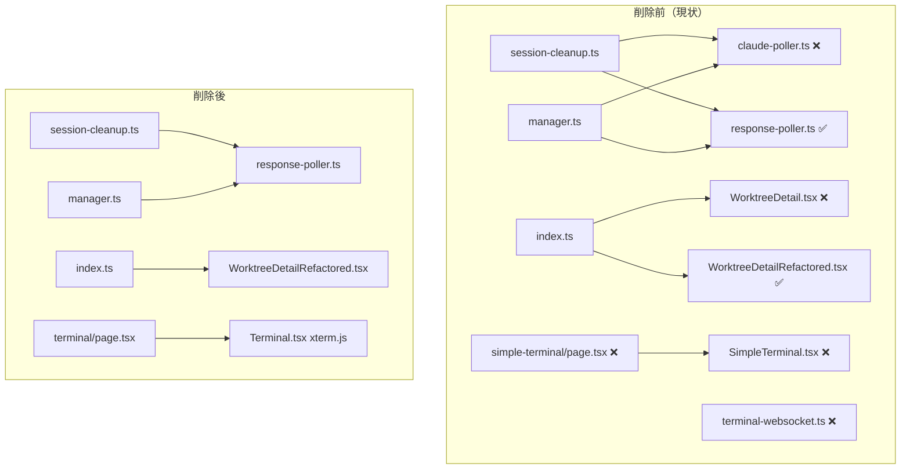

# Issue #237 設計方針書: 未使用コードの削除・リファクタリング

## 1. 概要

### 目的
過去の実装で不要になったモジュール・コンポーネント・ページルートを安全に削除し、コードベースの健全性を維持する。

### スコープ
- 削除対象: 5ファイル（約1,900行）
- 修正対象: 3ファイル（参照の更新）
- テスト修正: 6ファイル（mock/テストケースの削除）
- ドキュメント更新: 1ファイル（`docs/architecture.md`）

### スコープ外（SF-002）
- 内部ドキュメント（`docs/internal/PROMPT_HANDLING_IMPLEMENTATION_PLAN.md` 等）の claude-poller 参照更新は本 Issue の対象外とする。同ドキュメントの L456, L589, L1137 に claude-poller.ts への参照が残存するが、内部設計記録としての履歴的価値を考慮し、別途 Issue での対応とする。

### リスク評価: **低**
全削除対象は未使用コードであり、既に後継実装が稼働中。テストの修正はmock依存の除去が主体。

---

## 2. アーキテクチャ設計

### 2-1. 現状と削除後の構成



### 2-2. レイヤー別影響

| レイヤー | 影響ファイル | 変更種別 |
|---------|------------|---------|
| プレゼンテーション層 | `simple-terminal/page.tsx`, `SimpleTerminal.tsx`, `WorktreeDetail.tsx` | ファイル削除 |
| ビジネスロジック層 | `claude-poller.ts`, `terminal-websocket.ts` | ファイル削除 |
| 共通モジュール層 | `session-cleanup.ts`, `manager.ts` | 参照削除 |
| バレルエクスポート | `index.ts` | export削除 |
| テスト層 | テストファイル6件 | mock/テストケース削除 |
| ドキュメント | `architecture.md` | 記述更新 |

---

## 3. 削除対象の詳細設計

### 3-1. `src/lib/claude-poller.ts`（廃止モジュール）

**削除理由**: Issue #193で`response-poller.ts`に置き換え済み

**エクスポート関数**:
- `startPolling(worktreeId)` - ポーリング開始
- `stopPolling(worktreeId)` - ポーリング停止（`stopClaudePolling`としてimport）
- `stopAllPolling()` - 全ポーリング停止
- `getActivePollers()` - アクティブポーラー取得

**参照元（すべて修正対象）**:
| 参照元 | 使用関数 | 対応 |
|--------|---------|------|
| `session-cleanup.ts` L11 | `stopPolling as stopClaudePolling` | import削除 + 呼び出しブロック削除 |
| `manager.ts` L11 | `stopPolling as stopClaudePolling` | import削除 + 条件分岐削除 |

### 3-2. `src/lib/terminal-websocket.ts`（完全未使用）

**削除理由**: コードベース内で一度もインポートされていない

**エクスポート関数**:
- `initTerminalWebSocket(server)` - WebSocket初期化
- `createDirectTerminal(worktreeId, cliToolId)` - 直接ターミナル接続

**参照元**: なし（完全なデッドコード）

### 3-3. `src/components/worktree/WorktreeDetail.tsx`（旧コンポーネント）

**削除理由**: `WorktreeDetailRefactored.tsx`に置き換え済み

**エクスポート**:
- `WorktreeDetail` コンポーネント
- `WorktreeDetailProps` 型

**参照元**:
| 参照元 | 対応 |
|--------|------|
| `index.ts` L12-13 | export行削除 |

### 3-4. `src/app/worktrees/[id]/simple-terminal/page.tsx`（不要ルート）

**削除理由**: xterm.jsベースの正式Terminalで代替済み

**参照元**:
| 参照元 | 参照形式 | 対応 |
|--------|---------|------|
| Next.js App Router | 自動ルート（ファイルシステムベース） | ディレクトリ削除でルート消滅 |
| `WorktreeDetail.tsx` (L652, L678) | `/worktrees/${worktreeId}/simple-terminal` へのリンク | 同時削除対象（フェーズ3） |

### 3-5. `src/components/SimpleTerminal.tsx`（不要コンポーネント）

**削除理由**: `simple-terminal/page.tsx`削除に伴い不要

**参照元**: `simple-terminal/page.tsx`のみ（同時削除）

---

## 4. 修正対象の詳細設計

### 4-1. `src/lib/session-cleanup.ts`

#### import削除
```typescript
// 削除: L11
import { stopPolling as stopClaudePolling } from './claude-poller';
```

#### JSDocコメント更新
```typescript
// L7: 修正前
// * Abstracts the differences between response-poller and claude-poller.
// L7: 修正後
// * Uses response-poller for CLI tool sessions.

// L54: 修正前（行削除）
// * 3. Stops claude-poller for the worktree
```

#### 関数呼び出しブロック削除
```typescript
// 削除: L100-108
  // 2. Stop claude-poller (once per worktree, not per CLI tool)
  try {
    stopClaudePolling(worktreeId);
    result.pollersStopped.push('claude-poller');
  } catch (error) {
    const errorMsg = `claude-poller: ${error instanceof Error ? error.message : String(error)}`;
    result.pollerErrors.push(errorMsg);
    console.warn(`${LOG_PREFIX} Failed to stop claude-poller ${worktreeId}:`, error);
  }
```

#### コメント番号更新
```typescript
// L110: 修正前
  // 3. Stop auto-yes-poller
// L110: 修正後
  // 2. Stop auto-yes-poller
```

### 4-2. `src/lib/cli-tools/manager.ts`

#### import削除
```typescript
// 削除: L11
import { stopPolling as stopClaudePolling } from '../claude-poller';
```

#### 条件分岐ブロック削除
```typescript
// 削除: L175-179
    // claude-poller is Claude-specific
    if (cliToolId === 'claude') {
      stopClaudePolling(worktreeId);
    }
    // Future: Add other tool-specific pollers here if needed
```

> **SF-001 対応**: L179 の `// Future: Add other tool-specific pollers here if needed` コメントは YAGNI 違反的記述であり、claude-poller の条件分岐削除に伴い不要となるため、合わせて削除する。

### 4-3. `src/components/worktree/index.ts`

#### export削除
```typescript
// 削除: L12-13
export { WorktreeDetail } from './WorktreeDetail';
export type { WorktreeDetailProps } from './WorktreeDetail';
```

**設計判断**: `WorktreeDetailRefactored`のbarrel export追加は必須ではない。`worktrees/[id]/page.tsx`が直接importしており、barrel経由にする技術的理由がない。YAGNI原則に従い、本Issueでは追加しない。

### 4-4. `docs/architecture.md`

#### 記述更新
```markdown
// L569: 修正前
response-poller / claude-pollerを停止
// L569: 修正後
response-pollerを停止
```

---

## 5. テスト修正の詳細設計

### 5-1. 修正方針

| 修正種別 | 対象 | 方針 |
|---------|------|------|
| `vi.mock`行の削除 | 6ファイル | モジュール解決エラー防止のため削除 |
| テストケース削除 | 3ファイル | claude-pollerの動作を検証するテストは不要 |
| import行の削除 | 2ファイル | mock対象のimportを削除 |

### 5-2. 各ファイルの修正内容

| テストファイル | vi.mock削除 | import削除 | テストケース削除 |
|--------------|-----------|-----------|----------------|
| `tests/unit/session-cleanup.test.ts` | L15-17 | L26 | 1件（L58-66） |
| `tests/unit/cli-tools/manager-stop-pollers.test.ts` | L14-17 | - | 3件（L43-71） |
| `tests/integration/api-kill-session-cli-tool.test.ts` | L19-22 | - | - |
| `tests/integration/api-prompt-handling.test.ts` | L53-57 | - | 1件（L239-268） |
| `tests/integration/api-respond-cli-tool.test.ts` | L18-21 | - | - |
| `tests/integration/api-send-cli-tool.test.ts` | L49-51 | - | - |

---

## 6. 削除実行順序

### フェーズ1: テスト修正（安全性確保）

テストファイル6件のmock/テストケースを修正し、テストがGreenであることを確認する。

```
1. tests/unit/session-cleanup.test.ts
2. tests/unit/cli-tools/manager-stop-pollers.test.ts
3. tests/integration/api-kill-session-cli-tool.test.ts
4. tests/integration/api-prompt-handling.test.ts
5. tests/integration/api-respond-cli-tool.test.ts
6. tests/integration/api-send-cli-tool.test.ts
```

**検証**: `npm run test:unit && npm run test:integration`

### フェーズ2: 参照の除去

claude-pollerへの参照を削除し、ソースコードを修正する。

```
7. src/lib/session-cleanup.ts（import + ブロック + JSDoc + コメント番号）
8. src/lib/cli-tools/manager.ts（import + 条件分岐）
9. src/components/worktree/index.ts（export削除）
```

**検証**: `npx tsc --noEmit && npm run test:unit && npm run test:integration`

### フェーズ3: ファイル削除

参照がなくなった状態でファイルを削除する。

```
10. src/lib/claude-poller.ts
11. src/lib/terminal-websocket.ts
12. src/components/worktree/WorktreeDetail.tsx
13. src/app/worktrees/[id]/simple-terminal/page.tsx
14. src/components/SimpleTerminal.tsx
```

**検証**: `npm run build && npm run test:unit && npm run test:integration && npm run lint`

### フェーズ4: ドキュメント更新

```
15. docs/architecture.md
```

---

## 7. 設計上の決定事項とトレードオフ

### 採用した設計判断

| 決定事項 | 理由 | トレードオフ |
|---------|------|-------------|
| 高優先度のみに限定 | KISS原則。確実に安全な削除に集中 | 低優先度の未使用コードは別Issueで対応 |
| テスト修正を先に実施 | テスト整合性を保ちながら段階的に削除 | 一括削除より作業ステップが増える |
| barrel export追加なし | YAGNI原則。現状直接importで問題なし | barrel exportの一貫性は犠牲 |
| simple-terminal削除 | xterm.jsベースのTerminalで完全代替済み | フォールバック手段の喪失（不要） |
| テストケース削除（復元なし） | 検証対象のコードが削除されるため不要 | claude-poller関連のテストカバレッジ消失（意図的） |

### 代替案との比較

| 代替案 | メリット | デメリット | 判定 |
|-------|---------|-----------|------|
| 一括削除（フェーズ分割なし） | 作業が速い | テスト失敗時の原因特定が困難 | 不採用 |
| 段階的PR分割 | 各段階で安全確認可能 | PR数が増えレビュー負荷増 | 不採用（1PR内でフェーズ管理） |
| claude-poller.tsを空ファイル化 | 互換性維持 | デッドコードの残存 | 不採用 |

---

## 8. セキュリティ考慮事項

- 削除対象はすべて内部モジュール。外部インターフェースへの影響なし
- 認証・認可ロジックへの影響なし
- データ永続化への影響なし
- 入力バリデーションへの影響なし

---

## 9. パフォーマンス考慮事項

- 約1,900行のデッドコード削除によりソースコード量が削減
- ビルド時間の微改善（不要ファイルのコンパイル除去）
- 実行時パフォーマンスへの影響なし（削除対象コードは実行されていない）

---

## 10. 受入条件

- [ ] 削除対象ファイル5件がすべて削除されていること
- [ ] 参照ファイル3件のimport/export/呼び出しが正しく更新されていること
- [ ] テストファイル6件のmock/テストケースが修正されていること
- [ ] `docs/architecture.md`のclaude-poller言及が更新されていること
- [ ] `npm run build` が成功すること
- [ ] `npm run test:unit` が全テストパスすること
- [ ] `npm run test:integration` が全テストパスすること
- [ ] `npm run lint` がエラーなしで通ること
- [ ] `npx tsc --noEmit` が成功すること

---

## 11. CLAUDE.md準拠確認

| 原則 | 準拠状況 |
|------|---------|
| SOLID - 単一責任 | ✅ 各モジュールの責任が明確化（重複除去） |
| KISS | ✅ 高優先度の明確な削除対象に限定 |
| YAGNI | ✅ 不要なbarrel export追加を見送り |
| DRY | ✅ 重複コンポーネント（WorktreeDetail/Refactored）の統一 |

---

## 12. レビュー履歴

| Stage | レビュー名 | 日付 | ステータス | スコア |
|-------|-----------|------|-----------|--------|
| Stage 1 | 設計原則レビュー（通常レビュー） | 2026-02-11 | conditionally_approved | 4/5 |

---

## 13. レビュー指摘事項サマリー

### Must Fix

| ID | 原則 | 指摘内容 | 対象セクション | 対応状況 |
|----|------|---------|---------------|---------|
| MF-001 | DRY | simple-terminal/page.tsx の参照元に WorktreeDetail.tsx のリンク参照が未記載 | 3-4 | 反映済み |

### Should Fix

| ID | 原則 | 指摘内容 | 対象セクション | 対応状況 |
|----|------|---------|---------------|---------|
| SF-001 | SRP | manager.ts L179 の Future コメントも削除対象に含めるべき | 4-2 | 反映済み |
| SF-002 | DRY | PROMPT_HANDLING_IMPLEMENTATION_PLAN.md の claude-poller 参照をスコープ外として明記 | 1 (スコープ) | 反映済み |

### Consider（参考情報）

| ID | 原則 | 指摘内容 | 判断 |
|----|------|---------|------|
| CS-001 | KISS | WorktreeDetailRefactored の barrel export 未追加の長期的一貫性 | 現時点の YAGNI 判断を支持。将来のコンポーネント再構成時に検討 |
| CS-002 | SOLID-SRP | session-cleanup.ts の Facade パターン簡素化後の JSDoc 整合性 | セクション 4-1 の JSDoc 更新で対処済み。追加対応不要 |

---

## 14. 実装チェックリスト（レビュー指摘反映）

### MF-001 対応
- [ ] セクション 3-4 の参照元に WorktreeDetail.tsx (L652, L678) を追記済みであること -- **設計書反映済み**
- [ ] フェーズ3 で WorktreeDetail.tsx と simple-terminal/page.tsx が同時削除されること（既存の削除順序で対応済み）

### SF-001 対応
- [ ] セクション 4-2 の manager.ts 削除範囲が L175-179（L179 の Future コメントを含む）に更新済みであること -- **設計書反映済み**
- [ ] 実装時に L179 `// Future: Add other tool-specific pollers here if needed` を確実に削除すること

### SF-002 対応
- [ ] セクション 1（スコープ）に内部ドキュメント除外の明記が追加済みであること -- **設計書反映済み**
- [ ] `docs/internal/PROMPT_HANDLING_IMPLEMENTATION_PLAN.md` の claude-poller 参照更新は別途 Issue で対応すること

---

*Generated by design-policy command for Issue #237*
*Date: 2026-02-11*
*Stage 1 レビュー指摘反映: 2026-02-11*
