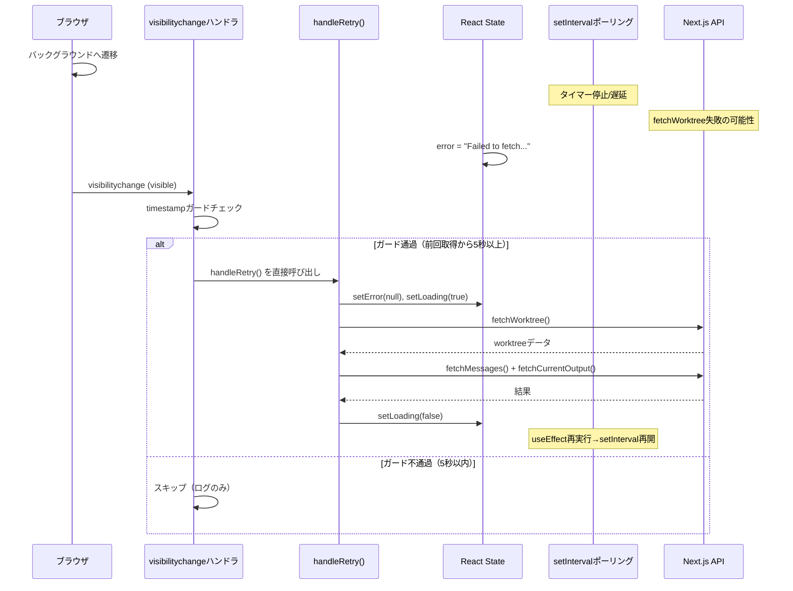
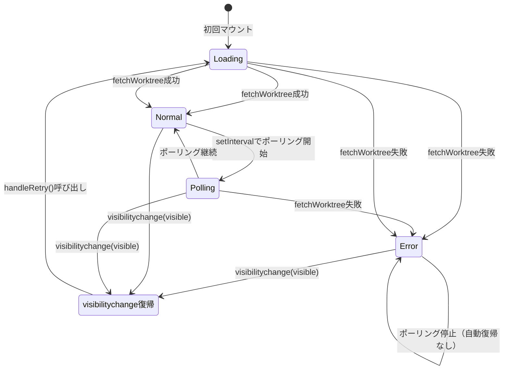

# 設計方針書: Issue #246 スマホバックグラウンド復帰時のエラー自動回復

## 1. 概要

### 1-1. 対象Issue
- **Issue #246**: スマホにて再開時Error loading worktreeとなる
- **種別**: バグ修正
- **緊急度**: 中（UXに直接影響）

### 1-2. 解決すべき課題

スマートフォンでブラウザをバックグラウンドにした後、フォアグラウンドに復帰すると「Error loading worktree」エラーが表示される。根本原因は以下の4つ：

1. `visibilitychange`イベントリスナーの欠如
2. バックグラウンド時のポーリングタイマー停止
3. エラー状態からの自動復帰メカニズムの不在
4. 初期化ガードによる再初期化の防止

### 1-3. 設計スコープ

| 区分 | 対象 |
|------|------|
| **スコープ内** | WorktreeDetailRefactored.tsx, WorktreeList.tsx へのvisibilitychange対応 |
| **スコープ外** | usePageVisibilityカスタムフック化、ExternalAppsManager等への横展開 |

**スコープ外コンポーネントの除外根拠（IA-003対応）**:

以下のコンポーネントもsetIntervalを使用しておりバックグラウンド復帰時のタイマー精度低下の影響を受ける可能性があるが、以下の理由によりスコープ外とする：

| コンポーネント | ポーリング間隔 | 除外理由 |
|--------------|--------------|---------|
| ExternalAppsManager.tsx | 60秒 | ポーリング間隔が十分に長く、バックグラウンド復帰時のタイマー精度低下の影響が軽微。次のinterval発火（最大60秒以内）で自然回復する。また、外部アプリの状態表示が数十秒遅延してもUXへの影響は小さい |
| ExternalAppStatus.tsx | 可変（ヘルスチェック） | ExternalAppsManagerと同様にポーリング間隔が長く、ヘルスチェック結果の遅延はUXに大きな影響を与えない。次のinterval発火で自然回復する |
| AutoYesToggle.tsx | 1秒（残り時間表示） | 表示用途のみであり機能的影響なし。タイマー精度低下による残り時間表示のズレは次のsetInterval発火（1秒以内）で自動修正される（IA-005参照） |

本Issue #246で対応するWorktreeDetailRefactored.txとWorkretList.tsxは、error/loadingガードによるポーリング停止がバグの直接原因であり、visibilitychange対応が必須である。上記スコープ外コンポーネントはポーリング停止のバグが発生しないため、対応の優先度は低い。

---

## 2. アーキテクチャ設計

### 2-1. 変更対象のコンポーネント構成

```mermaid
graph TD
    subgraph "変更対象"
        WDR[WorktreeDetailRefactored.tsx]
        WL[WorktreeList.tsx]
    end

    subgraph "影響を受けるフック"
        UAY[useAutoYes.ts]
        UUIS[useWorktreeUIState.ts]
    end

    subgraph "API層（変更なし）"
        API1[/api/worktrees/:id]
        API2[/api/worktrees/:id/current-output]
        API3[/api/worktrees/:id/messages]
        API4[/api/worktrees]
    end

    WDR -->|fetchWorktree| API1
    WDR -->|fetchCurrentOutput| API2
    WDR -->|fetchMessages| API3
    WL -->|fetchWorktrees| API4

    WDR -->|state.prompt.visible| UAY
    WDR -->|actions.*| UUIS
```

### 2-2. 処理フロー



---

## 3. 技術選定

### 3-1. 使用技術

| カテゴリ | 選定技術 | 選定理由 |
|---------|---------|---------|
| イベント検知 | `document.visibilitychange` | W3C Page Visibility API、全モダンブラウザ対応 |
| 連続発火防止 | timestampベースのガード | debounceと異なり初回即時実行が可能 |
| エラー復帰フロー | **既存handleRetry()の直接呼び出し** | DRY原則に基づき、既存の成功実績のある関数を再利用（MF-001対応） |
| 状態管理 | ローカルuseState | 既存のerror/loading管理と一貫性を維持 |

### 3-2. 不採用とした代替案

| 代替案 | 不採用理由 |
|--------|-----------|
| debounce関数（src/lib/utils.ts） | 最後の呼び出しからN ms後に実行する設計のため、即時復帰が必要なvisibilitychangeには不適切 |
| `focus`イベント | visibilitychangeの方がタブ切り替えやバックグラウンド遷移を正確に検知できる |
| SWR/React Query | 既存のfetch+useState構成への最小変更の方針に反する。将来的な検討対象 |
| usePageVisibilityカスタムフック | YAGNI原則に基づき、現時点では直接実装で十分。**今後visibilitychange対応が3箇所以上必要になった場合はカスタムフックへの抽出を再検討する**（C-001対応） |
| handleRetry同等フローの再実装 | DRY原則に違反するため不採用。既存のhandleRetry()を直接呼び出す設計を採用（MF-001対応） |

---

## 4. 設計パターン

### 4-1. timestampガードパターン

visibilitychangeイベントの連続発火を防止するために、timestampベースのガードを採用する。

```typescript
// 設計概要（擬似コード）
const lastRecoveryTimestampRef = useRef<number>(0);
const RECOVERY_THROTTLE_MS = 5000; // 5秒

const handleVisibilityChange = useCallback(() => {
  if (document.visibilityState !== 'visible') return;

  const now = Date.now();
  if (now - lastRecoveryTimestampRef.current < RECOVERY_THROTTLE_MS) return;
  lastRecoveryTimestampRef.current = now;

  // handleRetry() を直接呼び出す（MF-001: DRY原則対応）
  handleRetry();
}, [handleRetry]);
```

**設計根拠**:
- **即時実行**: ユーザーがフォアグラウンドに復帰した瞬間にデータ再取得を開始できる
- **連続発火防止**: 5秒以内の再発火を抑制し、不要なAPI負荷を回避
- **シンプル**: `useRef`のみで実装可能で、追加のユーティリティ関数が不要
- **5秒の根拠**: 既存のIDLE_POLLING_INTERVAL_MS（5秒）と同等。ポーリング1サイクル分の重複を許容する閾値

**RECOVERY_THROTTLE_MSとIDLE_POLLING_INTERVAL_MSの関係性**（SF-001対応）:
- 両者は現時点で同一の値（5000ms）を持つが、**意味的には異なる概念**である
- `IDLE_POLLING_INTERVAL_MS`: アイドル時のポーリング間隔（定常的なデータ同期頻度）
- `RECOVERY_THROTTLE_MS`: visibilitychange連続発火防止の閾値（復帰時のスロットリング）
- **設計判断**: 将来的に独立して変更する可能性があるため、別定数として定義する。ただし、実装時にコメントで両者の関係性を明記すること
- 例: `// RECOVERY_THROTTLE_MS: IDLE_POLLING_INTERVAL_MS と同値だが、意味的に独立した定数として管理`

### 4-2. handleRetry直接呼び出しパターン（MF-001対応）

**[MF-001] DRY原則に基づき、visibilitychangeハンドラからは既存のhandleRetry関数を直接呼び出す。**

既存の`handleRetry`関数（L1434-1442）は以下のフローを実行する：

```
1. setError(null)        - エラー表示を即座にクリア
2. setLoading(true)      - ローディング表示
3. fetchWorktree()       - Worktreeメタデータ取得
   └─ 成功時のみ以下を実行（失敗時は4,5をスキップ）
4. fetchMessages()       ─┐ Promise.allで並列実行
5. fetchCurrentOutput()  ─┘
6. setLoading(false)     - ローディング解除
```

**IC-001対応**: fetchWorktreeが失敗した場合、fetchMessages/fetchCurrentOutputは実行されない。これはhandleRetry内のtry-catch構造による条件分岐であり、fetchWorktreeの成功が後続API呼び出しの前提条件となっている。

visibilitychangeハンドラでは、timestampガードチェック後に`handleRetry()`を直接呼び出すだけでよい。フローの再実装は行わない。

**設計根拠**:
- `handleRetry`は既に`useCallback`でメモ化されており、依存配列も適切であるため、そのまま呼び出し可能
- フローの重複を完全に排除し、DRY原則を遵守
- 将来的に`handleRetry`のフローが変更された場合、visibilitychange復帰フローも自動的に追従する
- fetchWorktreeが成功した場合のみ他のAPIを呼び出す安全なフロー（条件分岐）はhandleRetryに内包済み（IC-001で整合性確認済み）
- handleRetry()はinitialLoadCompletedRefをリセットしないため、visibilitychange復帰後も初期ロードのuseEffectは再実行されない（これは意図した動作である。IC-006参照）

**注意事項（C-003関連、IA-004補足）**:
- handleRetry()の直接呼び出しにより、正常状態からの復帰時にも一瞬`setLoading(true)`が実行される
- これはhandleRetryの挙動をそのまま維持することで**一貫性**を優先した設計判断である
- **具体的なUI影響（IA-004対応）**: `setLoading(true)`が実行されると、WorktreeDetailRefactored.tsx L1530-1532の`if(loading)`ガードによりコンポーネント全体が`LoadingIndicator`（全画面ローディングスピナー）に置き換わる。これにより、正常状態（error=null）からのvisibilitychange復帰時であっても、API応答が返るまでの間、ターミナル出力やメッセージ履歴といった既存表示コンテンツが一瞬消えてローディングスピナーが表示され、その後再表示される「画面フラッシュ」が発生する
- **将来的な改善案**: error状態の有無に応じてhandleRetry()（エラー復帰用）とサイレント更新（正常復帰用）を分岐する設計に改善可能。サイレント更新ではsetLoading(true)を実行せず、バックグラウンドでAPIレスポンスを取得してstateを更新する方式を採用する

**ポーリングuseEffectライフサイクルへの影響（IA-001対応）**:
- handleRetry()内で`setLoading(true)`が実行されると、ポーリング制御のuseEffect（L1479-1493）の依存配列（loading含む）が変化し、cleanup関数（clearInterval）が実行される。これによりsetIntervalが一旦停止する
- handleRetry()は非同期処理であるため、API呼び出し中はsetIntervalが存在しない状態となる。handleRetry()の非同期処理中にsetIntervalとの競合は発生しない（既にクリア済み）
- handleRetry()完了後に`setLoading(false)`が実行されると、useEffectが再実行されて新しいsetIntervalが作成される
- **重要**: 新しいsetIntervalは作成された時点からinterval時間（IDLE_POLLING_INTERVAL_MSまたはACTIVE_POLLING_INTERVAL_MS）のカウントを開始する。つまり、handleRetry()完了直後にpollDataが即座に実行されるわけではなく、次のinterval発火までの待機時間が発生する
- この挙動はhandleRetry()がデータ再取得を完了した直後であるため、interval待ち時間中のデータ鮮度は問題ない

### 4-3. WorktreeList.tsx タイマー再設定パターン

WorktreeList.tsxの問題は、WorktreeDetailRefactored.tsxとは異なる。setInterval自体にerror/loadingガードがないため、ポーリングは常時動作する。問題は、バックグラウンド中にタイマーの精度が低下し、復帰時にポーリング間隔が正常に戻らない可能性があること。

```typescript
// 設計概要（擬似コード）
useEffect(() => {
  const handleVisibilityChange = () => {
    if (document.visibilityState === 'visible') {
      fetchWorktrees(true); // 即座にサイレント更新
    }
  };

  document.addEventListener('visibilitychange', handleVisibilityChange);
  return () => document.removeEventListener('visibilitychange', handleVisibilityChange);
}, [fetchWorktrees]);
```

**設計根拠**:
- WorktreeList.tsxではerror状態（L35: error useState、L75: setError）は発生し得るが、setInterval（L123-128）にerrorガードがないため**ポーリングはerror状態に関わらず継続する**。したがって、visibilitychange復帰時の明示的なエラーリセットは不要（IC-004対応）
- バックグラウンド復帰時に即座にfetchWorktrees(true)でサイレント更新を実行するだけで十分
- WebSocket再接続とは独立して動作させる（WebSocket接続が再確立されれば、broadcast経由でもデータ更新が行われる）
- **timestampガード不要の根拠**（IC-005対応）: WorktreeList.tsxのfetchWorktrees(true)は軽量なGETリクエスト（Worktree一覧取得のみ）であり、WebSocket broadcastとの二重発火が発生しても冪等性により安全であるため、WorktreeDetailRefactored.tsxのようなtimestampガードは不要と判断

### 4-4. visibilitychangeパターン差異の設計根拠（SF-003対応）

2つのコンポーネントでvisibilitychangeの実装パターンが意図的に異なる。以下にその根拠を明示する。

| 比較項目 | WorktreeDetailRefactored.tsx | WorktreeList.tsx |
|---------|------------------------------|-----------------|
| **エラーによるポーリング停止** | あり（error状態でsetIntervalが実質停止） | なし（常時ポーリング動作） |
| **復帰時のエラーリセット** | 必要（handleRetry()経由でsetError(null)） | 不要（error状態は発生し得るが、ポーリングがerror状態に関わらず継続するため、visibilitychangeでの明示的リセットは不要）（IC-004対応） |
| **ローディング表示** | あり（handleRetry()経由でsetLoading(true)） | なし（サイレント更新） |
| **timestampガード** | あり（API過剰呼び出し防止） | なし（軽量なリスト取得のため不要） |
| **復帰処理の目的** | エラー状態からの回復 + データ再取得 | バックグラウンド復帰時のデータ鮮度確保 |
| **呼び出す関数** | handleRetry() | fetchWorktrees(true) |

**パターンが異なる根本理由**: WorktreeDetailRefactored.tsxはerror/loadingによるポーリング停止がバグの原因であるため、エラーリセットを含むhandleRetry()の呼び出しが必要。一方、WorktreeList.tsxはerror状態が発生してもsetIntervalにerrorガードがないためポーリングが継続する（IC-004対応: WorktreeList.tsxでもfetchWorktrees失敗時にerror状態は発生するが、ポーリング停止には至らない）。したがって、visibilitychange復帰時はデータ鮮度確保のためのサイレント更新のみで十分。

---

## 5. 状態管理設計

### 5-1. 状態遷移図



### 5-2. エラー状態の管理体系

| 状態管理 | 管理先 | 用途 |
|---------|--------|------|
| `error` (useState) | WorktreeDetailRefactored.tsx L939 | API失敗時のエラーメッセージ表示 |
| `loading` (useState) | WorktreeDetailRefactored.tsx L938 | 初期ロード/リトライ時のローディング表示 |
| `clearError` (useReducer) | useWorktreeUIState.ts アクションクリエータ L270 / reducerハンドリング L118-119 | UIState内のエラークリア（本Issue対応では不使用）（IC-003対応） |

**設計判断**: ローカルuseStateの`setError(null)`を使用する。useWorktreeUIStateの`clearError`はUIStateコンテキスト内のエラーを管理するものであり、APIフェッチのエラーとは別の管理系統のため使い分ける。handleRetry()の直接呼び出しにより、状態管理フローはhandleRetryに一元化される。

---

## 6. useAutoYesフック連動の安全対策

### 6-1. リスク分析

visibilitychange復帰時の`fetchCurrentOutput`が`state.prompt.visible`を更新すると、`useAutoYes`フックが自動応答を発火する可能性がある。

```mermaid
graph LR
    VCH[visibilitychangeハンドラ] -->|handleRetry()| HR[handleRetry]
    HR -->|fetchCurrentOutput| PCO[prompt状態更新]
    PCO -->|state.prompt.visible = true| UAY[useAutoYes]
    UAY -->|autoYesEnabled = true| AR[自動応答発火]
```

### 6-2. 安全性評価

| 保護機構 | 有効範囲 | 評価 |
|---------|---------|------|
| `DUPLICATE_PREVENTION_WINDOW_MS` (3秒) | バックグラウンド時間 < 3秒 | 短時間復帰では有効 |
| `autoYesEnabled`フラグ | ユーザー明示的ON時のみ | auto-yes無効時はリスクなし |
| `lastServerResponseTimestamp` | サーバー側重複防止 | **注意: 現在の実装ではCurrentOutputResponseインターフェース（L68-81）にこのフィールドが未定義であり、WorktreeDetailRefactored.tsxからuseAutoYesへの渡し時にも使用されていない。APIレスポンスにはフィールドが含まれるが、クライアント側では未接続の状態（IC-002）。本Issue #246のスコープではuseAutoYesの変更は対象外であり、既存の不整合として記録する** |

### 6-3. 設計判断

**追加対策は不要と判断**する。理由：

1. `autoYesEnabled`はユーザーが明示的に有効化する機能であり、有効時にプロンプトに自動応答するのは期待される動作
2. バックグラウンド中に新しいプロンプトが到着していた場合、復帰時に自動応答するのは正常な動作フロー
3. `DUPLICATE_PREVENTION_WINDOW_MS`による保護機構が存在（注: `lastServerResponseTimestamp`はサーバー側APIレスポンスに含まれるが、現在のクライアント実装ではuseAutoYesに渡されていない。IC-002参照。ただし、サーバー側のauto-yesエンドポイントでは独自にタイムスタンプ検証を行っているため、サーバー側での保護は機能している）
4. 既に応答済みのプロンプトに対しては、サーバー側がプロンプト状態をクリアしているため、復帰時には`isPromptWaiting=false`が返る

ただし、テストケースで以下を確認する：
- auto-yes有効時にvisibilitychange復帰でプロンプトが表示された場合の動作
- 既に応答済みのプロンプトに対して重複応答が発生しないこと

---

## 7. API設計

### 7-1. 使用するAPI（変更なし）

本Issue対応では既存のAPIをそのまま利用する。新規APIの追加は不要。

| メソッド | エンドポイント | 用途 |
|---------|-------------|------|
| GET | `/api/worktrees/:id` | Worktreeメタデータ取得 |
| GET | `/api/worktrees/:id/current-output` | ターミナル出力取得 |
| GET | `/api/worktrees/:id/messages` | メッセージ取得 |
| GET | `/api/worktrees` | Worktree一覧取得 |

### 7-2. API冪等性の確認

すべてのAPIがGETリクエストで冪等であるため、visibilitychangeとsetIntervalの同時発火によるデータ破損リスクはない。

---

## 8. セキュリティ設計

### 8-1. リスク評価

| リスク | 評価 | 対策 |
|--------|------|------|
| API過負荷攻撃 | 低 | timestampガード（5秒）でvisibilitychangeの連続発火を抑制 |
| XSS | なし | visibilitychangeイベントはブラウザネイティブAPI、ユーザー入力を含まない |
| CSRF | なし | GETリクエストのみ使用、状態変更操作なし |
| 情報漏洩 | なし | 既存のAPIを同じ権限で呼び出すのみ |

### 8-2. 安全設計の原則

- `visibilitychange`イベントハンドラ内では、既存のhandleRetry関数のみを呼び出し、新しいAPIエンドポイントやデータフローを追加しない
- timestampガードでAPI呼び出し頻度を制限し、悪意のあるスクリプトによるvisibilitychangeイベントの乱発を防止

### 8-3. OWASP Top 10 チェックリスト（Stage 4 セキュリティレビュー結果）

| OWASP カテゴリ | 判定 | 備考 |
|---------------|------|------|
| A01: Broken Access Control | pass | 既存APIと同一権限で呼び出し、新規APIエンドポイント追加なし。GETリクエストのみ使用で状態変更操作なし |
| A02: Cryptographic Failures | N/A | 暗号化処理の変更なし。機密データの新規取り扱いなし |
| A03: Injection | pass | visibilitychangeハンドラはブラウザネイティブAPIでユーザー入力を含まない。既存のworktreeIdはSQLパラメータバインドで使用され、tmuxセッション名はvalidateSessionName()でバリデーション済み。新たなインジェクションベクトルの導入なし |
| A04: Insecure Design | pass | timestampガードによるAPI過負荷防止、冪等なGETリクエストのみ使用、handleRetry()の直接呼び出しによるDRY原則遵守。設計は安全 |
| A05: Security Misconfiguration | pass | 既存のセキュリティヘッダー（X-Frame-Options、X-Content-Type-Options、CSP等）が適用される。新たな設定変更なし |
| A06: Vulnerable and Outdated Components | N/A | 新たな依存パッケージの追加なし。Page Visibility APIはW3C標準のブラウザネイティブAPI |
| A07: Identification and Authentication Failures | N/A | 認証機構の変更なし。本ツールはローカル開発ツールであり、認証は現在のアーキテクチャのスコープ外 |
| A08: Software and Data Integrity Failures | pass | 全APIがGET冪等。visibilitychangeとsetIntervalの同時発火によるデータ破損リスクなし |
| A09: Security Logging and Monitoring Failures | pass | 既存のconsole.errorによるエラーログは維持。visibilitychangeイベントのthrottleスキップ時のログも設計に含まれている |
| A10: Server-Side Request Forgery | N/A | visibilitychangeハンドラからの外部URLリクエストなし。APIエンドポイントは全て自サーバー内 |

### 8-4. 既存のセキュリティ課題（Issue #246スコープ外、Stage 4で検出）

以下はStage 4セキュリティレビューで検出された既存の課題である。Issue #246の変更自体は新たなセキュリティリスクを導入しないが、既存の改善対象として記録する。

**[SEC-SF-001] APIエラーレスポンスにおけるparams.id反映**（severity: low, OWASP: A01/A05）

既存のAPI実装（`/api/worktrees/[id]/route.ts`など）において、404レスポンスに`params.id`をそのまま埋め込んでいる（例: `Worktree '${params.id}' not found`）。visibilitychange復帰時にAPIエラーが返却された場合、ErrorDisplay経由でユーザー画面にparams.idが表示される。React JSX内でのテキスト表示のため、XSSリスクはないが、内部ID情報がクライアントに露出する。Issue #246の変更自体は新たなAPIを追加しないため直接のリスクではない。

**[SEC-SF-002] Content-Security-Policyにおけるunsafe-inline/unsafe-eval**（severity: low, OWASP: A05）

`next.config.js`のCSPにおいて`'unsafe-inline'`（script-src/style-src）と`'unsafe-eval'`（script-src）が使用されている。Next.js開発モードの要件として記載されているが、本番環境でもこの設定が適用される。Issue #246はvisibilitychangeイベント（ブラウザネイティブAPI）のみを使用するため新たなCSPリスクは追加しないが、nonceベースCSPへの移行を将来検討事項として記録する。

### 8-5. DoS防御の評価（SEC-C-001）

timestampガード（5秒間隔）で連続発火を防止しているが、悪意あるブラウザ拡張やDevToolsスクリプトが`document.dispatchEvent(new Event('visibilitychange'))`を繰り返し発火させた場合でも、timestampガードによりAPI呼び出しは5秒に1回に制限される。現在の設計で十分だが、将来的にAPI側でクライアント毎のレートリミットを導入する場合は包括的な保護が可能になる。

---

## 9. パフォーマンス設計

### 9-1. API呼び出し最適化

| シナリオ | API呼び出し回数 | 対策 |
|---------|----------------|------|
| 通常復帰 | 最大3回（fetchWorktree + fetchMessages + fetchCurrentOutput） | 必要最小限 |
| 連続復帰（5秒以内） | 0回 | timestampガードでスキップ |
| visibilitychange + setInterval同時発火 | 最大6回（各2回） | 冪等性により安全、API負荷は許容範囲。ただしIA-001対応により、handleRetry()のsetLoading(true)でsetIntervalがcleanupされるため、実際には同時発火しにくい |
| visibilitychange + setInterval + WebSocket再接続（IA-002） | 最大7-9回 | 全てGET冪等。復帰直後の1回限りの一時的集中であり定常的負荷増加なし。詳細はSection 9-3参照 |

### 9-2. setIntervalとの競合

visibilitychangeハンドラとsetIntervalのfetchが同時発火する可能性があるが、以下の理由から**setInterval停止は行わない**設計とする：

1. **冪等性**: すべてのAPIがGETで冪等、同時発火してもデータ破損なし
2. **一時的**: 競合は復帰直後の1回のみ、その後はsetIntervalが通常間隔で動作
3. **複雑性回避**: setInterval停止/再開のロジックを追加すると、stateの依存関係が複雑化
4. **API負荷**: 1回の重複呼び出し程度は軽量なGETリクエストのため問題なし

**handleRetry()実行時のsetIntervalライフサイクル（IA-001対応）**:

visibilitychange復帰時にhandleRetry()が呼ばれた場合のポーリングuseEffectの挙動は以下の通り：

```
1. handleRetry() → setLoading(true) を実行
2. useEffect cleanup発火 → clearInterval(既存のsetIntervalを停止)
3. handleRetry()の非同期API呼び出しが進行(この間setIntervalは存在しない)
4. handleRetry() → setLoading(false) を実行
5. useEffect再実行 → 新しいsetIntervalを作成
6. 新setInterval → interval時間経過後にpollDataが初回発火
```

handleRetry()がデータ再取得を完了した直後であるため、ステップ6のinterval待機時間中のデータ鮮度は問題ない。

### 9-3. WebSocket再接続との三者間競合（IA-002対応）

バックグラウンド中にWebSocket接続が切断された場合、復帰時に以下の3つのデータ取得が同時または近接して発火する可能性がある：

| # | トリガー | API呼び出し | 対象コンポーネント |
|---|---------|-------------|------------------|
| 1 | visibilitychangeハンドラ | handleRetry()経由で最大3回（fetchWorktree + fetchMessages + fetchCurrentOutput） | WorktreeDetailRefactored.tsx |
| 2 | WebSocket再接続成功後のbroadcast | fetchWorktrees(true)で1回 | WorktreeList.tsx |
| 3 | setInterval通常ポーリング | pollData()経由で最大3回（fetchWorktree + fetchMessages + fetchCurrentOutput） | WorktreeDetailRefactored.tsx |

**最大API呼び出し数**: 約7-9回のGETリクエストが一時的に集中する可能性がある。

**安全性の根拠**:
- 全てのAPIがGETリクエストで冪等であり、同時発火によるデータ破損や不整合のリスクはない
- API呼び出しの一時集中は復帰直後の1回限りであり、定常的な負荷増加にはならない
- ただし、IA-001で述べたとおり、handleRetry()のsetLoading(true)によりsetIntervalがcleanupされるため、実際にはvisibilitychangeハンドラとsetIntervalの同時発火は発生しにくい（setIntervalはhandleRetry完了後に再作成される）
- WebSocket再接続のタイミングはreconnectDelay（useWebSocket.ts L136-141）に依存し、visibilitychange発火と完全に同期するわけではない

---

## 10. 設計上の決定事項とトレードオフ

### 10-1. 主要な設計決定

| 決定事項 | 選択 | 理由 | トレードオフ |
|---------|------|------|-------------|
| 連続発火防止方式 | timestampガード | 即時実行+抑制が可能 | throttle関数ほど汎用的でない |
| setInterval停止 | 停止しない | 冪等性で安全、実装がシンプル | 復帰直後に1回の重複API呼び出し |
| カスタムフック化 | しない | YAGNI原則、2ファイルのみの対応 | 将来の横展開時に再実装が必要（3箇所目で再検討） |
| エラーリセット方式 | handleRetry()直接呼び出し | DRY原則遵守、即時リセット | 正常状態からの復帰時にも一瞬ローディング表示（一貫性を優先） |
| auto-yes追加対策 | 不要 | 既存の保護機構で十分 | バックグラウンド3秒超時の動作はテストで確認 |
| 復帰フロー実装方式 | **handleRetry()直接呼び出し** | DRY原則（MF-001） | handleRetryの挙動に依存するため、handleRetry変更時の影響を受ける（これは利点でもある） |
| RECOVERY_THROTTLE_MS定義 | 独立した定数 | 将来的に独立変更の可能性（SF-001） | 値がIDLE_POLLING_INTERVAL_MSと重複するが、コメントで関係性を明記 |

### 10-2. 既存コードとの一貫性

| 項目 | 既存パターン | 本Issue対応 | 一貫性 |
|------|-------------|-------------|--------|
| エラーリセットフロー | handleRetry（L1434-1442） | **handleRetry()を直接呼び出し（MF-001対応）** | ✅ DRY |
| 状態管理 | ローカルuseState | ローカルuseState（handleRetry経由） | ✅ |
| API呼び出し | Promise.all並列取得 | handleRetry経由でPromise.all並列取得 | ✅ |
| イベントリスナー管理 | useEffect + cleanup | useEffect + cleanup | ✅ |
| WorktreeList更新方式 | fetchWorktrees(true) silent | fetchWorktrees(true) silent | ✅ |

---

## 11. 変更対象ファイル一覧

| ファイル | 変更種別 | 変更内容 |
|---------|---------|---------|
| `src/components/worktree/WorktreeDetailRefactored.tsx` | 修正 | visibilitychangeイベントリスナー追加、timestampガード、handleRetry()直接呼び出し（MF-001） |
| `src/components/worktree/WorktreeList.tsx` | 修正 | visibilitychangeイベントリスナー追加、復帰時のサイレント更新 |
| `tests/unit/components/WorktreeDetailRefactored.test.tsx` | 修正 | visibilitychangeテストケース追加（4ケース） |

### 新規ファイル

なし

### 定数追加

| 定数名 | 値 | 配置先 | 用途 | 備考 |
|--------|---|--------|------|------|
| `RECOVERY_THROTTLE_MS` | `5000` | WorktreeDetailRefactored.tsx | visibilitychange連続発火防止の閾値 | IDLE_POLLING_INTERVAL_MSと同値だが意味的に独立した定数（SF-001） |

---

## 12. テスト方針

### 12-1. ユニットテスト

**WorktreeDetailRefactored.test.tsx** に追加するテストケース：

| # | テストケース | 検証内容 |
|---|------------|---------|
| 1 | visibilitychange(visible)発火時にhandleRetryフローが実行される | visibilitychangeリスナーが正しく登録され、visible時にhandleRetry()経由でデータ再取得が実行される |
| 2 | error状態からvisibilitychange復帰でエラーがリセットされる | error表示中にvisibilitychange(visible)が発火すると、handleRetry()経由でerror=nullになりデータ再取得が開始される |
| 3 | visibilityState='hidden'時にはfetch呼び出しが行われない | hidden状態ではデータ再取得が発火しないことを確認 |
| 4 | 5秒以内の連続visibilitychange発火でthrottleガードが機能する | timestampガードにより、2回目の発火がスキップされることを確認 |

**テスト手法**:
```typescript
// document.visibilityState のモック
Object.defineProperty(document, 'visibilityState', {
  configurable: true,
  get: () => 'visible', // or 'hidden'
});

// visibilitychange イベントの発火
document.dispatchEvent(new Event('visibilitychange'));
```

### 12-2. WorktreeList.tsxのテスト

WorktreeList.tsxのテストファイルが現在存在しないため、手動テストで代替する。テスト内容：

- バックグラウンド復帰時にWorktree一覧が更新される
- WebSocket再接続とsetIntervalタイマーの両方が正常に動作する

### 12-3. 手動テスト（スマートフォン実機）

| # | テストシナリオ | 確認項目 |
|---|-------------|---------|
| 1 | Worktree詳細画面→バックグラウンド→復帰 | エラーが表示されず、データが再取得される |
| 2 | エラー表示中→バックグラウンド→復帰 | エラーがクリアされ、データが再取得される |
| 3 | 短時間の連続バックグラウンド/復帰 | API呼び出しが過剰に発生しない |
| 4 | Worktree一覧画面→バックグラウンド→復帰 | 一覧が更新される |

---

## 13. 制約条件

### CLAUDE.md準拠の原則

| 原則 | 適用 |
|------|------|
| SOLID - 単一責任 | visibilitychangeリスナーは復帰処理のみを担当 |
| KISS | timestampガードは最小限の実装（useRef + Date.now()） |
| YAGNI | カスタムフック化は行わず、直接実装で対応（3箇所目で再検討: C-001） |
| DRY | **handleRetry()を直接呼び出し、フローの再実装を排除（MF-001対応）** |

### SRP に関する将来の改善方向（SF-002対応）

WorktreeDetailRefactored.tsxは既に2006行あり、APIフェッチ、状態管理、ポーリング、エラーハンドリング、レイアウト制御、イベントハンドリングなど多数の責務を持っている。本Issueではvisibilitychangeハンドラを追加するが、以下を将来の改善方向として記録する：

- **将来検討**: `useVisibilityRecovery`のようなカスタムフックへのvisibilitychange関連ロジックの抽出
- **判断基準**: visibilitychange対応が3箇所以上になった場合、またはWorktreeDetailRefactored.tsxの大規模リファクタリング時
- **現時点の判断**: YAGNI原則に基づき、現時点ではWorktreeDetailRefactored.tsx内への直接実装で対応

### ポーリング制御の将来検討（C-002対応）

現在の設計ではsetIntervalポーリングとvisibilitychangeハンドラが独立して配置される。将来のリファクタリング検討時に、ポーリング制御を統合的に管理する仕組み（カスタムフックやポーリングマネージャー）を検討する可能性がある。

---

## 14. レビュー履歴

| レビュー日 | ステージ | レビュー種別 | ステータス | スコア |
|-----------|---------|-------------|-----------|--------|
| 2026-02-13 | Stage 1 | 設計原則レビュー | 条件付き承認 | 4/5 |
| 2026-02-13 | Stage 2 | 整合性レビュー | 条件付き承認 | 4/5 |
| 2026-02-13 | Stage 3 | 影響分析レビュー | 条件付き承認 | 4/5 |
| 2026-02-13 | Stage 4 | セキュリティレビュー | 承認 | 5/5 |

---

## 15. レビュー指摘事項サマリー

### Stage 1: 設計原則レビュー

#### Must Fix

| ID | 原則 | タイトル | 対応状況 | 対応セクション |
|----|------|---------|---------|---------------|
| MF-001 | DRY | handleRetryとvisibilitychange復帰フローの重複 | 対応済み | Section 3-1, 4-1, 4-2, 2-2, 10-1, 10-2, 11, 13 |

#### Should Fix

| ID | 原則 | タイトル | 対応状況 | 対応セクション |
|----|------|---------|---------|---------------|
| SF-001 | DRY | RECOVERY_THROTTLE_MSとIDLE_POLLING_INTERVAL_MSの値の重複 | 対応済み | Section 4-1, 10-1, 11 |
| SF-002 | SRP | WorktreeDetailRefactored.tsxの責務過多（2006行） | 対応済み | Section 13 |
| SF-003 | KISS | WorktreeList.tsxとWorktreeDetailRefactored.tsxのvisibilitychangeパターン差異 | 対応済み | Section 4-4（新規追加） |

#### Consider（将来検討事項）

| ID | 原則 | タイトル | 対応状況 | 対応セクション |
|----|------|---------|---------|---------------|
| C-001 | YAGNI | usePageVisibilityカスタムフック化の将来判断基準 | 対応済み | Section 3-2, 13 |
| C-002 | OCP | ポーリング制御とイベントハンドリングの分離 | 対応済み | Section 13 |
| C-003 | KISS | setLoading(true)による一瞬のローディング表示 | 対応済み | Section 4-2 |

### Stage 2: 整合性レビュー

#### Must Fix

| ID | 観点 | タイトル | 対応状況 | 対応セクション |
|----|------|---------|---------|---------------|
| IC-001 | 整合性 | handleRetryフロー記載の条件分岐未明示 | 対応済み | Section 4-2（フロー記載を条件分岐付きに修正） |

#### Should Fix

| ID | 観点 | タイトル | 対応状況 | 対応セクション |
|----|------|---------|---------|---------------|
| IC-002 | 整合性 | lastServerResponseTimestampのuseAutoYes未渡し | 対応済み | Section 6-2, 6-3（現在の実装での不整合を注記、Issue #246スコープ外として記録） |
| IC-003 | 整合性 | clearError行番号の指す対象の曖昧さ | 対応済み | Section 5-2（アクションクリエータL270 / reducerハンドリングL118-119を併記） |
| IC-004 | 整合性 | WorktreeList.tsxのerror状態に関する記載不正確 | 対応済み | Section 4-3, 4-4（error状態は発生し得るがポーリング停止に至らない点を明記） |

#### Consider（将来検討事項）

| ID | 観点 | タイトル | 対応状況 | 対応セクション |
|----|------|---------|---------|---------------|
| IC-005 | 整合性 | WorktreeList.tsxのfetchWorktrees二重発火のtimestampガード不要根拠 | 対応済み | Section 4-3（timestampガード不要の設計根拠を追記） |
| IC-006 | 整合性 | initialLoadCompletedRefとvisibilitychange復帰の相互作用 | 対応済み | Section 4-2（handleRetryがinitialLoadCompletedRefをリセットしない旨を注記） |

### Stage 3: 影響分析レビュー

#### Must Fix

| ID | 観点 | タイトル | 対応状況 | 対応セクション |
|----|------|---------|---------|---------------|
| IA-001 | 影響範囲 | handleRetry()呼び出し時のloading=true状態がポーリングuseEffectのガードを再トリガーする副作用 | 対応済み | Section 4-2（ポーリングuseEffectライフサイクル追記）、Section 9-2（handleRetry実行時のsetIntervalライフサイクル追記） |

#### Should Fix

| ID | 観点 | タイトル | 対応状況 | 対応セクション |
|----|------|---------|---------|---------------|
| IA-002 | 影響範囲 | WebSocket再接続とvisibilitychangeの同時発火による一時的なAPI集中 | 対応済み | Section 9-3（新規追加: 三者間競合シナリオと安全性根拠） |
| IA-003 | 影響範囲 | ExternalAppsManager/ExternalAppStatusのvisibilitychange未対応がスコープ外であることの明示不足 | 対応済み | Section 1-3（スコープ外コンポーネントの除外根拠テーブル追加） |
| IA-004 | 影響範囲 | loading=true中のUI表示がvisibilitychange復帰時のUXに与える影響 | 対応済み | Section 4-2（C-003注意事項を拡充: 具体的なUI影響と将来的な改善案を追記） |

#### Consider（将来検討事項）

| ID | 観点 | タイトル | 対応状況 | 対応セクション |
|----|------|---------|---------|---------------|
| IA-005 | 影響範囲 | AutoYesToggle.tsxのsetInterval(1000ms)はvisibilitychange復帰時に残り時間表示がズレる可能性 | 記録済み | Section 1-3（スコープ外コンポーネント除外根拠に記載） |
| IA-006 | 影響範囲 | handleRetry依存配列変更時のvisibilitychangeハンドラへの波及 | 記録済み | Section 16 実装チェックリスト（将来検討セクションに記録） |
| IA-007 | 影響範囲 | fetchCurrentOutput内のstate.prompt.visible参照によるuseCallback再生成チェーン | 記録済み | Section 16 実装チェックリスト（将来検討セクションに記録） |

### Stage 4: セキュリティレビュー

#### Must Fix

なし（セキュリティレビュースコア 5/5）

#### Should Fix

| ID | カテゴリ | タイトル | 対応状況 | 対応セクション |
|----|---------|---------|---------|---------------|
| SEC-SF-001 | 情報漏洩 | APIエラーレスポンスにおけるparams.id反映 | 記録済み（Issue #246スコープ外の既存課題） | Section 8-4, Section 16（将来検討） |
| SEC-SF-002 | CSP設定 | Content-Security-Policyにおけるunsafe-inline/unsafe-eval | 記録済み（Issue #246スコープ外の既存課題） | Section 8-4, Section 16（将来検討） |

#### Consider（将来検討事項）

| ID | カテゴリ | タイトル | 対応状況 | 対応セクション |
|----|---------|---------|---------|---------------|
| SEC-C-001 | DoS防御 | visibilitychangeイベントの人為的高頻度発火に対する二重防御 | 記録済み | Section 8-5（現在の設計で十分、将来的にAPI側レートリミット検討） |
| SEC-C-002 | auto-yes安全性 | lastServerResponseTimestampのクライアント側未接続（IC-002）のセキュリティ影響 | 記録済み | Section 6-2（IC-002として既に記録済み。サーバー側保護は機能しており直接のセキュリティリスクなし） |

### リスク評価サマリー（Stage 4）

| リスク種別 | 評価 |
|-----------|------|
| 技術リスク | low |
| セキュリティリスク | low |
| 運用リスク | low |

---

## 16. 実装チェックリスト

### WorktreeDetailRefactored.tsx

- [ ] **[MF-001]** visibilitychangeハンドラからhandleRetry()を直接呼び出す（フローの再実装は行わない）
- [ ] **[MF-001]** handleVisibilityChangeのuseCallback依存配列にhandleRetryを含める
- [ ] timestampガード用のuseRef（lastRecoveryTimestampRef）を追加
- [ ] **[SF-001]** RECOVERY_THROTTLE_MS定数を定義し、IDLE_POLLING_INTERVAL_MSとの関係性をコメントで明記
- [ ] visibilitychangeイベントリスナーをuseEffect内で登録し、cleanup関数でremoveEventListener
- [ ] visibilityState === 'hidden'時は何もしないガードを実装

### WorktreeList.tsx

- [ ] visibilitychangeイベントリスナーをuseEffect内で登録し、fetchWorktrees(true)をサイレント呼び出し
- [ ] cleanup関数でremoveEventListener

### テスト（WorktreeDetailRefactored.test.tsx）

- [ ] visibilitychange(visible)発火時にhandleRetryフロー（fetchWorktree等）が実行されることを検証
- [ ] error状態からvisibilitychange復帰でエラーがリセットされることを検証
- [ ] visibilityState='hidden'時にfetch呼び出しが行われないことを検証
- [ ] 5秒以内の連続発火でthrottleガードが機能することを検証

### コードコメント

- [ ] **[SF-001]** RECOVERY_THROTTLE_MSの定義箇所に、IDLE_POLLING_INTERVAL_MSとの関係性コメントを記載
- [ ] **[SF-003]** WorktreeList.tsxのvisibilitychangeハンドラに、WorktreeDetailRefactored.tsxとの実装差異の理由コメントを記載
- [ ] **[IC-001]** handleRetry()内でfetchWorktreeが失敗した場合にfetchMessages/fetchCurrentOutputがスキップされる条件分岐が実装に反映されていることを確認（既存コードの確認のみ）
- [ ] **[IC-004]** WorktreeList.tsxのvisibilitychangeハンドラに、error状態でもポーリングが継続する旨のコメントを記載

### コードコメント（Stage 3追加分）

- [ ] **[IA-001]** visibilitychangeハンドラ付近に、handleRetry()呼び出しによるsetLoading(true)→useEffect cleanup(clearInterval)→setLoading(false)→useEffect再実行(新setInterval作成)のライフサイクルについてコメントを記載
- [ ] **[IA-002]** Section 9-2/9-3に記載したWebSocket再接続との三者間競合が実装に反映されていることを確認（追加実装は不要、設計上の認識として記録）

### テスト（Stage 3追加分）

- [ ] **[IA-006]** React StrictMode下でvisibilitychangeリスナーの二重登録/解除が正常に動作することを確認（既存のuseEffect cleanupパターンと同一のためリスクは低いが、テストで検証が望ましい）

### 将来検討（本Issue対応外）

- [ ] **[SF-002/C-001]** visibilitychange対応が3箇所以上になった場合、useVisibilityRecoveryカスタムフックの抽出を検討
- [ ] **[C-002]** ポーリング制御の統合管理（カスタムフックやポーリングマネージャー）を検討
- [ ] **[IC-002/SEC-C-002]** lastServerResponseTimestampをCurrentOutputResponseインターフェースに追加し、useAutoYesへ渡す対応を検討（既存の不整合、本Issue対応外。サーバー側保護は機能しているため直接のセキュリティリスクなし）
- [ ] **[IA-004]** 正常状態からのvisibilitychange復帰時にサイレント更新（setLoading(true)なし）を採用する改善を検討。error状態の有無でhandleRetry/サイレント更新を分岐する設計
- [ ] **[IA-005]** AutoYesToggle.tsxのsetInterval(1000ms)のバックグラウンド復帰時の残り時間表示ズレ対応（表示用途のみ、1秒以内に自動修正されるため優先度低）
- [ ] **[IA-006]** handleRetryを安定した参照にするためのuseRefパターンの採用検討（visibilitychangeリスナーの頻繁な再登録/解除を回避）
- [ ] **[IA-007]** fetchCurrentOutput内のstate.prompt.visible依存によるuseCallback再生成チェーンの最適化検討（既存ポーリングuseEffectと同じ問題を共有、本Issue固有の新規リスクではない）
- [ ] **[SEC-SF-001]** APIエラーレスポンスのparams.id反映を改善し、内部ID情報のクライアント露出を防止（既存課題、severity: low）
- [ ] **[SEC-SF-002]** next.config.jsのCSPをnonceベースに移行し、unsafe-inline/unsafe-evalの使用を排除（既存課題、severity: low）
- [ ] **[SEC-C-001]** API側でクライアント毎のレートリミットを導入し、visibilitychangeのtimestampガードに加えてサーバー側でも包括的な保護を実現（現在の設計で十分だが、将来的な強化として検討）

---

*設計方針書作成日: 2026-02-13*
*Stage 1レビュー反映日: 2026-02-13*
*Stage 2レビュー反映日: 2026-02-13*
*Stage 3レビュー反映日: 2026-02-13*
*Stage 4レビュー反映日: 2026-02-13*
*対象Issue: #246 スマホにて再開時Error loading worktreeとなる*
