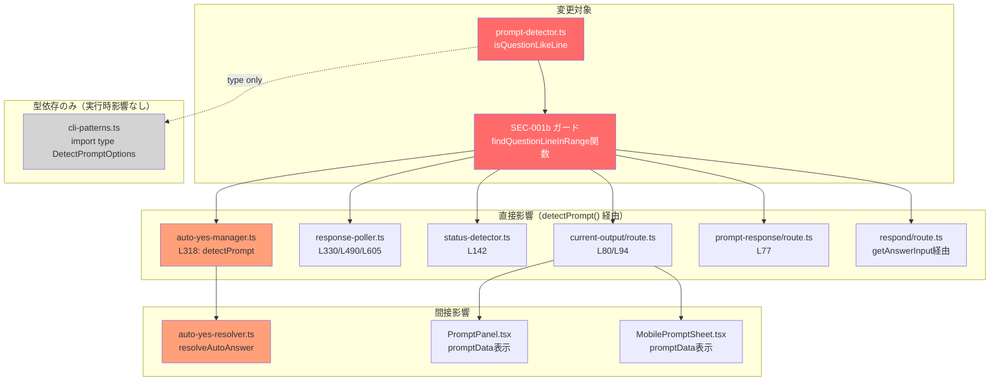
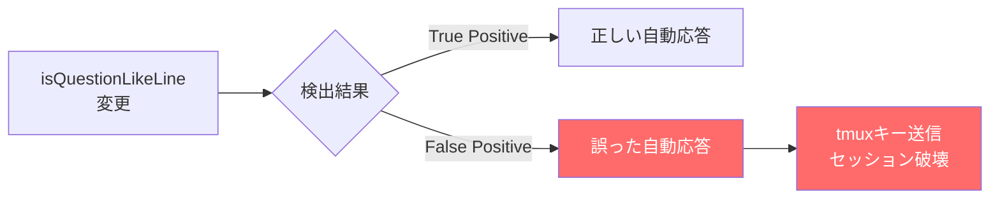

# Issue #256 選択メッセージ検出改善 設計方針書

## 1. 概要

### 対象Issue
- **Issue番号**: #256
- **タイトル**: 選択メッセージが表示されない
- **分類**: バグ修正

### 問題の要約
Claude CLIで選択メッセージ（multiple_choice プロンプト）がアクティブプロンプトパネルに表示されない。
`src/lib/prompt-detector.ts` の `isQuestionLikeLine()` 関数が、以下のパターンで検出に失敗する:

- **パターンA**: 質問文が複数行に折り返され、末尾が「。」（句点）で終わる行
- **パターンB**: model選択等の質問形式でないプロンプト（末尾が `.` で終わる行）

### 修正スコープ
Layer 5 SEC-001b の質問行妥当性検証の拡張。既存のFalse Positive防止機能を維持しつつ、True Positiveを増加させる。

---

## 2. レビュー履歴

| 段階 | 日付 | レビュー種別 | 結果 | スコア |
|------|------|-------------|------|--------|
| Stage 1 | 2026-02-13 | 設計原則レビュー（通常レビュー） | conditionally_approved | 4/5 |
| Stage 2 | 2026-02-13 | 整合性レビュー（設計と実装の差異） | needs_major_changes | 2/5 |
| Stage 3 | 2026-02-13 | 影響分析レビュー（影響範囲の網羅性） | conditionally_approved | 4/5 |
| Stage 4 | 2026-02-13 | セキュリティレビュー | conditionally_approved | 4/5 |

---

## 3. レビュー指摘事項サマリー

### Must Fix

| ID | タイトル | 原則 | 対応状況 |
|----|---------|------|---------|
| MF-001 | isContinuationLine()のQUESTION_KEYWORD_PATTERN除外追加はSRPに抵触 | SRP, OCP | 設計方針書に反映済み |

### Should Fix

| ID | タイトル | 原則 | 対応状況 |
|----|---------|------|---------|
| SF-001 | isQuestionLikeLine()のPattern 2（行内?チェック）はKISS原則に照らしてスコープ制約の明文化が必要 | KISS, SRP | 設計方針書に反映済み |
| SF-002 | QUESTION_SCAN_RANGE=3の変更ガイドライン追記 | YAGNI | 設計方針書に反映済み |
| SF-003 | SEC-001bガード内の複雑度増加に対する関数抽出 | SRP, KISS | 設計方針書に反映済み |

### Consider（将来検討）

| ID | タイトル | 原則 | 備考 |
|----|---------|------|------|
| C-001 | isQuestionLikeLine()の呼び出しがSEC-001bガード内で2箇所に分散 | DRY | findQuestionLineInRange()関数への一元化（SF-003対応で解消） |
| C-002 | isContinuationLine()の条件分岐が複雑化の傾向 | KISS, YAGNI | 将来的なルールエンジンパターン検討。現時点ではYAGNI原則に従い不要 |
| C-003 | SEPARATOR_LINE_PATTERNの再利用はDRY原則に適合 | DRY | 現状維持。良い設計判断 |

### Stage 2: 整合性レビュー指摘事項

> **レビュー結果**: needs_major_changes (スコア: 2/5)
>
> Stage 2整合性レビューは、設計方針書に記載された全10項目が未実装であることを確認した。
> これは実装前の段階としては想定内であるが、実装フェーズで全項目を漏れなく対応する必要がある。
> リスク評価: 技術=high, セキュリティ=medium, 運用=low

#### Must Fix（Stage 2）

| ID | タイトル | 設計セクション | 対象コード | 重要度 | 対応状況 |
|----|---------|--------------|-----------|--------|---------|
| MF-S2-001 | isQuestionLikeLine() Pattern 2（行内?チェック）が未実装 | 5.2 | prompt-detector.ts L315-332 | high | 実装フェーズで対応 |
| MF-S2-002 | findQuestionLineInRange() 関数が未実装 | 5.3 | prompt-detector.ts（関数なし） | high | 実装フェーズで対応 |
| MF-S2-003 | QUESTION_SCAN_RANGE 定数が未実装 | 5.3 | prompt-detector.ts（定数なし） | high | 実装フェーズで対応 |
| MF-S2-004 | SEC-001b ガードの上方走査ロジックが未実装 | 5.3 | prompt-detector.ts L522-528 | high | 実装フェーズで対応 |
| MF-S2-005 | Pass 2 逆スキャンループ内の isQuestionLikeLine() 先行チェックが未実装（MF-001対応） | 5.5 | prompt-detector.ts L482-495 | high | 実装フェーズで対応 |
| MF-S2-006 | 設計方針書記載の全新規テストケースが未実装 | 9.1 | prompt-detector.test.ts（テストなし） | high | 実装フェーズで対応 |

#### Consider（Stage 2）

| ID | タイトル | 設計セクション | 備考 |
|----|---------|--------------|------|
| C-S2-001 | isContinuationLine() のコードは現時点で設計方針書と整合的（変更不要） | 5.5 | 実装時にこの制約が維持されることを確認する |
| C-S2-002 | 影響範囲ファイルの確認 - 現時点で変更不要の整合性は確認済み | 11 | detectPrompt()の内部改善のみで外部インターフェースに変更がないため |

### Stage 3: 影響分析レビュー指摘事項

> **レビュー結果**: conditionally_approved (スコア: 4/5)
>
> Stage 3影響分析レビューは、影響範囲の網羅性に一部欠落があることを指摘した。
> 直接変更対象ファイルと公開インターフェースの不変性は正確に記載されている。
> リスク評価: 技術=low, セキュリティ=low, 運用=low

#### Must Fix（Stage 3）

| ID | タイトル | 影響ファイル | 重要度 | 対応状況 |
|----|---------|-------------|--------|---------|
| MF-S3-001 | respond/route.ts が影響範囲ファイル一覧に未記載 | src/app/api/worktrees/[id]/respond/route.ts | medium | 設計方針書に反映済み |

#### Should Fix（Stage 3）

| ID | タイトル | 影響ファイル | 重要度 | 対応状況 |
|----|---------|-------------|--------|---------|
| SF-S3-001 | cli-patterns.ts の間接依存が影響範囲図に未記載 | src/lib/cli-patterns.ts | low | 設計方針書に反映済み |
| SF-S3-002 | PromptPanel.tsx / MobilePromptSheet.tsx の影響経路の明確化 | src/components/worktree/PromptPanel.tsx, src/components/mobile/MobilePromptSheet.tsx | low | 設計方針書に反映済み |
| SF-S3-003 | Pass 2ループ内のisQuestionLikeLine()先行チェック（MF-001）による既存テスト影響分析の不足 | tests/unit/prompt-detector.test.ts | medium | 設計方針書に反映済み |

#### Consider（Stage 3）

| ID | タイトル | 重要度 | 備考 |
|----|---------|--------|------|
| C-S3-001 | findQuestionLineInRange()関数のexport可能性とテストアプローチ | low | module-private関数のテストはdetectPrompt()経由の間接テストを推奨。T-256-FQ1~FQ4のテストアプローチを明確化する（セクション9.1参照） |
| C-S3-002 | Pattern 2（行内?チェック）のFalse Positive具体シナリオの網羅 | low | URLパラメータ以外の想定外パターン（ファイルパス、JSON等）の分析結果を追記（セクション5.2参照） |
| C-S3-003 | detectPrompt()の外部インターフェースの不変確認の明文化 | low | 公開インターフェース不変宣言をセクション11に追記済み |

### Stage 4: セキュリティレビュー指摘事項

> **レビュー結果**: conditionally_approved (スコア: 4/5)
>
> Stage 4セキュリティレビューは、Auto-Yes安全性・入力検証・防御層の整合性に関する指摘を行った。
> Pattern 2に特化したFalse Positiveテストケースの追加を条件として承認。
> リスク評価: 技術=low, セキュリティ=medium, 運用=low

#### Must Fix（Stage 4）

| ID | タイトル | カテゴリ | 重要度 | 対応状況 |
|----|---------|---------|--------|---------|
| MF-S4-001 | Pattern 2（行内?チェック）のFalse Positive時のAuto-Yes自動応答リスクに対するテストケースの不足 | Auto-Yes安全性 | medium | 設計方針書に反映済み |

#### Should Fix（Stage 4）

| ID | タイトル | カテゴリ | 重要度 | 対応状況 |
|----|---------|---------|--------|---------|
| SF-S4-001 | findQuestionLineInRange()のscanRange引数に対する入力バリデーション不足 | 入力検証 | low | 設計方針書に反映済み |
| SF-S4-002 | QUESTION_KEYWORD_PATTERNの部分マッチ戦略のセキュリティ影響の明文化不足 | セキュリティ設計文書化 | low | 設計方針書に反映済み |
| SF-S4-003 | Pass 2ループ内のisQuestionLikeLine()先行チェック（MF-001）によるquestionEndIndex設定タイミングの安全性 | 防御層の整合性 | low | 設計方針書に反映済み |

#### Consider（Stage 4）

| ID | タイトル | カテゴリ | 重要度 | 備考 |
|----|---------|---------|--------|------|
| C-S4-001 | 正規表現パターンのReDoS安全性アノテーション維持 | ReDoS防御 | info | 新規追加関数のJSDocにReDoS安全性を明記することが望ましい |
| C-S4-002 | isQuestionLikeLine()のPattern 2がSEC-S4-004（制御文字耐性）の影響を受ける可能性 | 制御文字耐性 | info | includes('?')は0x3Fを走査するが、tmux capture-pane出力で制御シーケンス内に0x3Fが出現するケースはほぼなく、実用上のリスクは極めて低い |
| C-S4-003 | Auto-YesポーラーのFalse Positive検出から応答送信までのレースコンディション | Auto-Yes安全性 | info | Pattern 2追加による検出率向上がAuto-Yesフローに影響する可能性を認識しておく。既存設計の範囲内 |

---

## 4. アーキテクチャ設計

### 影響範囲の全体像



### レイヤー構成

```
Layer 1: Thinking check (auto-yes-manager.ts)
Layer 2: 2-pass cursor detection (detectMultipleChoicePrompt Pass 1)
Layer 3: Consecutive number validation
Layer 4: Default indicator check (requireDefaultIndicator)
Layer 5: SEC-001 question line validation  <-- 修正対象
  |-- SEC-001a: questionEndIndex existence check
  +-- SEC-001b: isQuestionLikeLine() validation <-- 拡張
        +-- findQuestionLineInRange() <-- 新規関数（SF-003）
```

---

## 5. 設計方針

### 5.1 修正方針の選定

#### 採用方針: 代替案A（SEC-001bガード内での上方走査）

| 項目 | 内容 |
|------|------|
| **採用案** | 代替案A: SEC-001bガード内で `questionEndIndex` から上方N行走査 |
| **実装位置** | SEC-001bガード内（L514-529）のループ拡張 |
| **理由** | `isQuestionLikeLine()` 自体のインターフェース変更不要。影響範囲が最小限 |

#### 代替案との比較

| 方針 | メリット | デメリット | 採用 |
|------|---------|-----------|------|
| **A: SEC-001b上方走査** | 影響範囲最小、isQuestionLikeLine()変更不要 | 走査範囲の境界条件考慮が必要 | 採用 |
| B: hasDefaultIndicator連携 | シンプル、指標活用 | 指標がないプロンプトに未対応 | 非採用 |
| C: Pattern 4無条件キーワード | 実装シンプル | False Positiveリスク大、T11h-T11m破壊 | 非採用 |
| D: isQuestionLikeLine()拡張 | 関数内で完結 | インターフェース変更、他呼び出し箇所への影響 | 非採用 |

### 5.2 パターンA対応: 行内の `?`/`？` チェック

**修正内容**: `isQuestionLikeLine()` に Pattern 2（行内 `?` チェック）を追加

```typescript
function isQuestionLikeLine(line: string): boolean {
  if (line.length === 0) return false;

  // Pattern 1: Lines ending with question mark (existing)
  if (line.endsWith('?') || line.endsWith('\uff1f')) return true;

  // Pattern 2 (NEW): Lines containing question mark anywhere
  // Handles multi-line question wrapping where '?' is mid-line
  if (line.includes('?') || line.includes('\uff1f')) return true;

  // Pattern 3: Lines ending with colon + keyword (existing, renumbered)
  if (line.endsWith(':')) {
    if (QUESTION_KEYWORD_PATTERN.test(line)) return true;
  }

  return false;
}
```

**False Positiveリスク軽減策**:
- Pattern 2 は SEC-001b ガード内でのみ活用される
- questionEndIndex の行は「オプション直前の非オプション行」であり、スコープが限定的
- URLパラメータ行がquestionEndIndexになるケースは通常想定されない（番号付きオプションの直前に来る行はURL行ではない）

> **[C-S3-002対応] Pattern 2のFalse Positive具体シナリオ分析**
>
> Pattern 2（行内`?`チェック）が誤検出する可能性のあるパターンを以下に分析する。
> いずれもSEC-001bガード内のスコープ制約により実質的なリスクは低い:
>
> | パターン | 例 | リスク | 理由 |
> |---------|-----|--------|------|
> | URLパラメータ | `https://example.com/path?key=value` | 極低 | 番号付きオプション直前にURLが来るケースは想定されない |
> | ファイルパス | `src/components/Header?.tsx` | 極低 | ファイルパスが`questionEndIndex`行になるケースは通常存在しない。番号付きオプション直前の行はプロンプトテキストである |
> | JSONデータ | `{"key": "value?"}` | 極低 | JSON文字列がCLI出力の番号付きオプション直前に来るケースは想定されない |
> | コード行 | `if (condition?) { ... }` | 極低 | コード行がオプション直前に来るのはプロンプト文脈外 |
>
> **結論**: SEC-001bガード内では`questionEndIndex`行および上方走査範囲内の行のみが対象となるため、上記パターンがFalse Positiveを引き起こすリスクは実用上無視できる。将来、新たなFalse Positiveが発見された場合はPattern 2のスコープ制約（SF-001対応）に基づき対処する。

> **[SF-001対応] Pattern 2のスコープ制約**
>
> Pattern 2（行内`?`チェック）は以下のスコープ制約を持つ:
>
> 1. **使用文脈の制約**: Pattern 2は `isQuestionLikeLine()` の内部パターンだが、この関数がFalse Positiveなく機能するのはSEC-001bガード内での使用に限定される。SEC-001bガードは `questionEndIndex`（オプション直前の非オプション行）および上方走査範囲内の行に対してのみ `isQuestionLikeLine()` を呼び出すため、Pattern 2が誤検出を起こすリスクが低い。
> 2. **現時点のアクセス範囲**: `isQuestionLikeLine()` は現在module-private関数（`export` なし）であり、`prompt-detector.ts` 内部からのみ呼び出される。この制約により、外部モジュールからの予期しない呼び出しによるFalse Positiveリスクは排除されている。
> 3. **将来の拡張時の注意**: `isQuestionLikeLine()` を `export` して他モジュールから利用する場合、Pattern 2がURLパラメータ等の `?` を含む行で誤検出する可能性がある。その場合は以下のいずれかを検討すること:
>    - (a) Pattern 2を含まない上位互換関数（例: `isStrictQuestionLikeLine()`）を提供する
>    - (b) Pattern 2をSEC-001b上方走査専用のヘルパー関数（例: `isQuestionLikeLineInContext()`）に分離する
>    - (c) Pattern 2にURL除外ロジック（`/[?&]\w+=/.test(line)` で除外）を追加する

### 5.3 パターンB対応: SEC-001bガード内の上方走査

#### [SF-003対応] 上方走査ロジックの関数抽出

> **設計変更（MF-001 / SF-003 対応）**: 上方走査ロジックはSEC-001bガード内に直接埋め込まず、独立した関数 `findQuestionLineInRange()` として抽出する。これにより:
> - SEC-001bガードの可読性を維持（SF-003）
> - 上方走査ロジックの単体テストが容易になる
> - C-001（isQuestionLikeLine()の2箇所呼び出し）の意図が明確になる

**新規関数**: `findQuestionLineInRange()`

```typescript
/**
 * Search upward from a given line index to find a question-like line.
 * Skips empty lines and separator lines.
 *
 * @param lines - Array of output lines
 * @param startIndex - Starting line index (exclusive, searches startIndex-1 and above)
 * @param scanRange - Maximum number of lines to scan upward (must be >= 0, clamped to MAX_SCAN_RANGE=10)
 * @param lowerBound - Minimum line index (inclusive, scan will not go below this)
 * @returns true if a question-like line is found within the scan range
 *
 * @see IC-256-002: SEC-001b upward scan implementation
 * @see SF-003: Function extraction for readability
 * @see SF-S4-001: scanRange input validation (defensive clamping)
 *
 * ReDoS safe: Uses SEPARATOR_LINE_PATTERN (existing ReDoS safe pattern) and
 * isQuestionLikeLine() (literal character checks + simple alternation pattern).
 * No new regex patterns introduced. (C-S4-001)
 */
function findQuestionLineInRange(
  lines: string[],
  startIndex: number,
  scanRange: number,
  lowerBound: number
): boolean {
  // [SF-S4-001] Defensive input validation: clamp scanRange to safe bounds
  // Currently only called with QUESTION_SCAN_RANGE=3, but guards against
  // future misuse if the function is refactored or exported.
  const safeScanRange = Math.min(Math.max(scanRange, 0), 10);
  const scanLimit = Math.max(lowerBound, startIndex - safeScanRange);
  for (let i = startIndex - 1; i >= scanLimit; i--) {
    const candidateLine = lines[i]?.trim() ?? '';
    if (!candidateLine || SEPARATOR_LINE_PATTERN.test(candidateLine)) continue;
    if (isQuestionLikeLine(candidateLine)) {
      return true;
    }
  }
  return false;
}
```

**SEC-001bガードの更新** （関数呼び出し方式）:

```typescript
// Layer 5 [SEC-001]: Enhanced question line validation
if (!requireDefault) {
  // SEC-001a: No question line found
  if (questionEndIndex === -1) {
    return noPromptResult(output);
  }

  // SEC-001b: Question line validation with upward scan (SF-003: function call)
  const questionLine = lines[questionEndIndex]?.trim() ?? '';
  if (!isQuestionLikeLine(questionLine)) {
    if (!findQuestionLineInRange(lines, questionEndIndex, QUESTION_SCAN_RANGE, scanStart)) {
      return noPromptResult(output);
    }
  }
}
```

**設計定数**:

```typescript
/**
 * Maximum number of lines to scan upward from questionEndIndex
 * when the questionEndIndex line itself is not a question-like line.
 *
 * Design rationale (IC-256-001):
 * - model selection prompts have 1-2 lines between "Select model" and first option
 * - multi-line question wrapping typically produces 2-3 continuation lines
 * - value of 3 covers these cases while minimizing False Positive surface
 *
 * [SF-002] Change guidelines:
 * - Increase this value ONLY if real-world prompts are discovered where
 *   the question line is more than 3 lines above questionEndIndex
 * - Before increasing, verify that the new value does not cause
 *   T11h-T11m False Positive tests to fail
 * - Consider that larger values increase the False Positive surface area
 * - If increasing beyond 5, consider whether the detection approach
 *   itself needs to be redesigned (e.g., pattern-based instead of scan-based)
 * - Document the specific prompt pattern that necessitated the change
 *
 * @see Issue #256: multiple_choice prompt detection improvement
 */
const QUESTION_SCAN_RANGE = 3;
```

**走査ロジック**:
1. `questionEndIndex` の行で `isQuestionLikeLine()` を試行（既存動作）
2. 失敗した場合、`findQuestionLineInRange()` を呼び出し上方走査を実行
3. `findQuestionLineInRange()` 内で空行・セパレータ行はスキップ
4. `isQuestionLikeLine()` を満たす行が見つかれば検出成功
5. 走査は `scanStart` 境界を超えない

### 5.4 question text 抽出への影響

上方走査でquestion行を発見した場合でも、question text 抽出ロジック（L531-546）は変更不要:

```
questionEndIndex - 5 <-- 既存の抽出開始位置
questionEndIndex - 3 <-- 上方走査で見つかるquestion行（QUESTION_SCAN_RANGE内）
questionEndIndex     <-- 既存の抽出終了位置
```

`QUESTION_SCAN_RANGE = 3` は既存の質問テキスト抽出範囲（questionEndIndex - 5）内に収まるため、上方走査で発見されたquestion行は自然に質問テキストに含まれる。

### 5.5 [MF-001対応] isContinuationLine() との相互作用 - 設計方針変更

> **重要な設計変更（MF-001対応）**: 当初の設計方針では `isContinuationLine()` に `QUESTION_KEYWORD_PATTERN` チェックを追加する案を記載していたが、Stage 1レビューにより **SRP違反** と判定された。以下の方針に変更する。

#### 問題の整理

パターンBのmodel選択プロンプトで、インデントされた行がcontinuation lineとして誤分類される可能性がある:

```
行 N:   Select model                    <-- 2+空白、非数字開始 -> hasLeadingSpaces=true?
行 N+1: Switch between...--model.       <-- 2+空白、非数字開始 -> hasLeadingSpaces=true?
```

Pass 2逆スキャン:
1. N+5 -> オプション収集
2. N+4 -> オプション収集
3. N+3 -> オプション収集
4. N+2 -> 空行 -> スキップ
5. N+1 -> `Switch between...` -> isContinuationLine() = true -> スキップ
6. N -> `Select model` -> isContinuationLine() = true -> **continuation lineとしてスキップされる可能性あり**

`Select model` 行もcontinuation lineとしてスキップされる場合、`questionEndIndex` は -1 のまま -> SEC-001a で拒否。

#### 旧設計方針（非採用 - SRP違反）

~~isContinuationLine() に QUESTION_KEYWORD_PATTERN チェックを追加する除外条件~~

```typescript
// [非採用] isContinuationLine()の責務を「継続行かどうか」に保つため、
// 質問キーワード判定の責務をisContinuationLine()に混入させない。
// MF-001: SRP違反。将来新しいキーワード追加時にisContinuationLine()の
// 連動修正が必要になる暗黙の結合が生まれる。
```

#### 新設計方針（MF-001対応 - SRP準拠）

**方針**: `isContinuationLine()` には質問キーワード判定を混入させず、**Pass 2逆スキャンのループ内**で `isContinuationLine()` の**手前**に `isQuestionLikeLine()` チェックを追加する。

```typescript
// Pass 2 reverse scan loop (conceptual)
for (let i = ...; i >= scanStart; i--) {
  const rawLine = lines[i];
  const line = rawLine.trim();

  // ... option collection logic ...

  // After options are collected, check non-option lines:
  if (collectedOptions.length > 0) {
    // NEW (MF-001): Check if line is a question-like line BEFORE continuation check
    // This preserves isContinuationLine()'s SRP by not mixing question detection into it
    if (isQuestionLikeLine(line)) {
      questionEndIndex = i;
      break;
    }

    // EXISTING: Check if line is a continuation line
    if (isContinuationLine(rawLine, line)) {
      continue; // skip continuation lines
    }

    // ... existing questionEndIndex assignment logic ...
  }
}
```

**SRP準拠の根拠**:
- `isContinuationLine()` の責務は「継続行かどうか」の判定のみ。変更なし。
- `isQuestionLikeLine()` の責務は「質問行かどうか」の判定のみ。変更なし。
- 2つの関数の呼び出し順序をPass 2ループ内で制御することで、責務境界を明確に保つ。
- 将来 `QUESTION_KEYWORD_PATTERN` に新しいキーワードが追加されても、`isContinuationLine()` の変更は不要（OCP準拠）。

**IC-256-004の更新**:
- 旧: `isContinuationLine()にキーワード除外追加`
- 新: `Pass 2逆スキャンループ内でisQuestionLikeLine()をisContinuationLine()の手前に追加`

---

## 6. セキュリティ設計

### 6.1 False Positive 防止（SEC-001b維持）

**原則**: 既存のFalse Positive防止テスト（T11h-T11m）を全パスさせる

| テストID | パターン | 期待結果 | 上方走査の影響 |
|---------|---------|---------|--------------|
| T11h | `Recommendations:\n1. A\n2. B` | isPrompt=false | `Recommendations:` は `:` 終端だが QUESTION_KEYWORD_PATTERN にマッチしない -> false |
| T11i | `Steps:\n1. A\n2. B` | isPrompt=false | `Steps:` は `:` 終端だが QUESTION_KEYWORD_PATTERN にマッチしない -> false |
| T11j | `Changes Made:\n1. A\n2. B` | isPrompt=false | `Changes Made:` は `:` 終端だが QUESTION_KEYWORD_PATTERN にマッチしない -> false |
| T11k | `Completed tasks:\n1. A\n2. B` | isPrompt=false | `Completed tasks:` は `:` 終端だが QUESTION_KEYWORD_PATTERN にマッチしない -> false |
| T11l | `Summary of changes:\n1. A\n2. B` | isPrompt=false | `Summary of changes:` は `:` 終端だが QUESTION_KEYWORD_PATTERN にマッチしない -> false |
| T11m | `I did the following:\n1. A\n2. B` | isPrompt=false | `I did the following:` は `:` 終端だが QUESTION_KEYWORD_PATTERN にマッチしない -> false |

**安全性の根拠**:
- 上方走査は `isQuestionLikeLine()` を再利用するため、同じ判定基準が適用される
- `QUESTION_SCAN_RANGE = 3` の狭い範囲で走査するため、偶然のキーワードマッチリスクが低い
- 通常の番号付きリスト（Steps:, Recommendations:等）は見出し行の上方にquestion-likeな行がない

> **[SF-S4-002対応] Pattern 2とQUESTION_KEYWORD_PATTERNの部分マッチの相互作用分析**
>
> QUESTION_KEYWORD_PATTERNは意図的に`\b`ワード境界を使用しておらず、部分マッチを許容している（例: `Selections:` が `select` にマッチ）。Pattern 2（行内`?`チェック）との組み合わせにより、上方走査で以下の相互作用が発生する可能性がある:
>
> | シナリオ | Pattern 2の役割 | KEYWORD部分マッチの役割 | 結果 | リスク |
> |---------|---------------|---------------------|------|--------|
> | 上方走査で`?`を含む行を発見 | `includes('?')` = true | 不使用（Pattern 2で先にマッチ） | isQuestionLikeLine = true | 低: SEC-001bスコープ制約で限定 |
> | 上方走査で`:` + 部分キーワードマッチ行を発見 | 不使用 | Pattern 3でマッチ | isQuestionLikeLine = true | 既存リスク（変更なし） |
> | 上方走査で`?`を含む`:` + 部分キーワードマッチ行を発見 | `includes('?')` = true | 不使用（Pattern 2で先にマッチ） | isQuestionLikeLine = true | 低: Pattern 2が先に評価されるため部分マッチの影響は受けない |
>
> **結論**: Pattern 2とQUESTION_KEYWORD_PATTERNの部分マッチの相互作用によるセキュリティリスクの増加はない。理由:
> 1. Pattern 2は`isQuestionLikeLine()`内でPattern 3（`:` + キーワード）より先に評価されるため、`?`を含む行ではキーワード部分マッチは不使用
> 2. Layer 3の連番検証（`isConsecutiveFromOne()`）により、番号付きリストの形式が正しくない場合は拒否される
> 3. SEC-001bのスコープ制約により、走査対象はquestionEndIndex周辺の限定的な行のみ
> 4. T-256-FP3テストケース（MF-S4-001）により、Pattern 2に特化したFalse Positiveシナリオが検証される

### 6.2 Auto-Yes 安全性



**防御層**:
1. **Layer 1**: `detectThinking()` チェック（thinking中はスキップ）
2. **Layer 3**: 連番検証（番号が連続していること）
3. **Layer 5 SEC-001b**: `isQuestionLikeLine()` + `findQuestionLineInRange()` 上方走査（**本修正**）
4. **T11h-T11m**: False Positive 回帰テスト

### 6.3 MF-001対応によるisContinuationLine()のセキュリティ影響

旧設計では `isContinuationLine()` に `QUESTION_KEYWORD_PATTERN` 除外を追加する予定だったが、MF-001対応でPass 2ループ内の呼び出し順序変更に切り替えた。セキュリティへの影響:

- **変更なし**: `isContinuationLine()` のロジックは一切変更しないため、既存の継続行判定の安全性は維持される
- **新たなリスク**: Pass 2ループ内で `isQuestionLikeLine()` が先に評価されるため、`QUESTION_KEYWORD_PATTERN` にマッチするインデント行が `questionEndIndex` に設定される。これは意図した動作であり、セキュリティリスクの増加はない（`isQuestionLikeLine()` の判定基準がそのまま適用されるため）

> **[SF-S4-003対応] Pass 2先行チェックとSEC-001b上方走査における`isQuestionLikeLine()`共有の設計意図**
>
> MF-001対応により、`isQuestionLikeLine()` は以下の2つの独立した検出パスで使用される:
>
> | 検出パス | 使用箇所 | 目的 | Pattern 2の適用 |
> |---------|---------|------|----------------|
> | **Pass 2先行チェック** | Pass 2逆スキャンループ内（`isContinuationLine()`の手前） | 質問行がcontinuation lineとして誤スキップされることを防止 | 適用される（行内`?`チェック含む） |
> | **SEC-001b上方走査** | `findQuestionLineInRange()` 関数内 | questionEndIndex行が質問行でない場合の上方フォールバック | 適用される（行内`?`チェック含む） |
>
> **設計意図**:
> - 両パスで同一の`isQuestionLikeLine()`を使用することは意図的な設計判断である
> - 質問行の判定基準を一箇所（`isQuestionLikeLine()`）に集約することで、DRY原則を維持し、判定基準の不整合を防止する
> - Pattern 2が両パスで適用されることにより、行内`?`を含む質問行はPass 2先行チェックで早期捕捉される。この場合、SEC-001b上方走査は実行されない（questionEndIndex行自体が`isQuestionLikeLine()`をパスするため）
> - 両パスは排他的ではないが、Pass 2先行チェックで捕捉された場合はSEC-001b上方走査が不要になるという暗黙の最適化が働く
>
> **安全性**: 両パスで同一関数を使用するため、判定基準の乖離によるセキュリティ上の問題は発生しない。将来`isQuestionLikeLine()`のパターンを変更する場合、両パスに同時に影響することを認識しておく必要がある（これは意図された動作である）。

---

## 7. データモデル設計

**変更なし**: 本修正はプロンプト検出ロジックのみの変更であり、データベーススキーマの変更は不要。

---

## 8. API設計

**変更なし**: 既存のAPIエンドポイントの動作は変更しない。プロンプト検出の精度が向上するのみ。

---

## 9. テスト設計

### 9.1 新規テストケース

#### パターンA: 複数行折り返し質問

```typescript
// T-256-A1: 末尾が「。」の折り返し行（上方走査でquestion行を発見）
it('should detect prompt when question wraps and ends with Japanese period', () => {
  const output = [
    '対策方針としてどれが適切ですか？コード調査の結果、',
    'エラー時の自動リトライもないことが原因と推測されます。',
    '1. 方針A',
    '2. 方針B',
    '3. 方針C'
  ].join('\n');
  const result = detectPrompt(output, { requireDefaultIndicator: false });
  expect(result.isPrompt).toBe(true);
});

// T-256-A2: 行内に「？」を含む折り返し行
it('should detect prompt when question mark is mid-line due to wrapping', () => {
  const output = [
    'どれが適切ですか？コード調査の結果、エラー時の自動リトライ',
    'もないことが原因と推測されます。',
    '1. 方針A',
    '2. 方針B'
  ].join('\n');
  const result = detectPrompt(output, { requireDefaultIndicator: false });
  expect(result.isPrompt).toBe(true);
});

// T-256-A3: 1行に収まる質問文の回帰テスト
it('should still detect prompt when question fits in single line', () => {
  const output = [
    'どれが適切ですか？',
    '1. 方針A',
    '2. 方針B'
  ].join('\n');
  const result = detectPrompt(output, { requireDefaultIndicator: false });
  expect(result.isPrompt).toBe(true);
});
```

#### パターンB: 質問形式でないプロンプト

```typescript
// T-256-B1: model選択プロンプト（requireDefaultIndicator: false）
it('should detect model selection prompt with upward scan', () => {
  const output = [
    ' Select model',
    ' Switch between Claude models. For other model names, specify with --model.',
    '',
    ' ❯ 1. Default (recommended) ✔  Opus 4.6',
    '   2. Sonnet                   Sonnet 4.5',
    '   3. Haiku                    Haiku 4.5'
  ].join('\n');
  const result = detectPrompt(output, { requireDefaultIndicator: false });
  expect(result.isPrompt).toBe(true);
});

// T-256-B2: requireDefaultIndicator: true の回帰テスト
it('should detect model selection prompt with default indicator (regression)', () => {
  const output = [
    ' Select model',
    ' ❯ 1. Default (recommended)',
    '   2. Sonnet',
    '   3. Haiku'
  ].join('\n');
  const result = detectPrompt(output);
  expect(result.isPrompt).toBe(true);
});
```

#### False Positive防止

```typescript
// T-256-FP1: 上方走査でもFalse Positive防止が維持される
it('should NOT detect prompt for "Summary of changes" with content above', () => {
  const output = [
    'Here is what I did:',
    'Summary of changes:',
    '1. Updated file A',
    '2. Modified file B'
  ].join('\n');
  const result = detectPrompt(output, { requireDefaultIndicator: false });
  expect(result.isPrompt).toBe(false);
});

// T-256-FP2: 上方にキーワード行があっても番号リストは拒否（走査範囲外）
it('should NOT detect prompt when keyword line is beyond scan range', () => {
  const output = [
    'Which option do you prefer?',
    'Line 1',
    'Line 2',
    'Line 3',
    'Line 4',
    'Summary:',
    '1. Item A',
    '2. Item B'
  ].join('\n');
  const result = detectPrompt(output, { requireDefaultIndicator: false });
  expect(result.isPrompt).toBe(false);
});

// T-256-FP3 [MF-S4-001]: Pattern 2の行内?チェックが直接関与するFalse Positiveシナリオ
// URLパラメータを含む行がquestionEndIndex付近に存在するケースで誤検出しないことを確認
it('should NOT detect prompt when line with URL parameter containing ? is near options', () => {
  const output = [
    'See https://example.com/help?topic=models for details.',
    '1. Updated the configuration',
    '2. Modified the settings'
  ].join('\n');
  const result = detectPrompt(output, { requireDefaultIndicator: false });
  expect(result.isPrompt).toBe(false);
});
```

> **[MF-S4-001] T-256-FP3の設計根拠**
>
> T-256-FP3は、Pattern 2（行内`?`チェック）が直接関与するFalse Positiveシナリオをテストする。
> T-256-FP1/FP2は上方走査の一般的なFalse Positive防止を検証するが、Pattern 2の`includes('?')`が
> URLパラメータ行で誤マッチするシナリオは直接テストしていなかった。
>
> このテストケースは以下を検証する:
> - URLパラメータ（`?topic=models`）を含む行が`isQuestionLikeLine()`でPattern 2にマッチすること自体は許容される
> - しかし、Layer 3の連番検証（`isConsecutiveFromOne()`）により、報告リスト（`1. Updated...`, `2. Modified...`）は
>   番号付きオプションとして扱われたとしても、SEC-001bの他の防御層で最終的にFalse Positiveが防止されることを確認する
> - Auto-Yesが有効な状態でこのパターンが出現した場合に、誤ったキー入力がtmuxセッションに送信されないことの間接的な保証

#### isContinuationLine() 相互作用（MF-001対応テスト）

```typescript
// T-256-CL1: インデントされた質問行がcontinuation lineとして誤分類されない
// MF-001対応: Pass 2ループ内でisQuestionLikeLine()がisContinuationLine()より先に評価される
it('should not misclassify indented keyword line as continuation', () => {
  const output = [
    '  Select model',
    '  Description text ending with period.',
    '  ❯ 1. Option A',
    '    2. Option B'
  ].join('\n');
  const result = detectPrompt(output, { requireDefaultIndicator: false });
  expect(result.isPrompt).toBe(true);
});
```

#### findQuestionLineInRange() 単体テスト（SF-003対応）

> **[C-S3-001対応] テストアプローチの明確化**
>
> `findQuestionLineInRange()` はmodule-private関数（`export`なし）であるため、Vitestから直接テストできない。
> T-256-FQ1~FQ4のテストケースは以下のいずれかのアプローチで実装する:
>
> - **推奨: (b) detectPrompt()経由の間接テスト** - `findQuestionLineInRange()` の各パスを `detectPrompt()` の入出力で間接的に検証する。テストケースの入力データを調整し、上方走査の各分岐（走査範囲内発見、走査範囲外不発見、空行スキップ、lowerBound境界）を網羅する。
> - (a) 関数をexportしてテストする - テスト容易性は高いが、内部関数のexportにより公開APIが増える。
> - (c) テスト用ヘルパーを用意する - `__testing__` namespace等で限定的にexportする方法。過度な複雑性を招く。
>
> 下記のテストコードは概念的な記述であり、実装時は推奨アプローチ(b)に基づき`detectPrompt()`経由のテストに書き換えること。

```typescript
// T-256-FQ1: findQuestionLineInRange() - 質問行が走査範囲内に存在
it('should find question line within scan range', () => {
  const lines = ['Which option?', 'Description.', '', '1. A', '2. B'];
  expect(findQuestionLineInRange(lines, 1, 3, 0)).toBe(true);
});

// T-256-FQ2: findQuestionLineInRange() - 質問行が走査範囲外
it('should not find question line beyond scan range', () => {
  const lines = ['Which option?', 'Line 1', 'Line 2', 'Line 3', 'Line 4', '1. A'];
  expect(findQuestionLineInRange(lines, 5, 3, 0)).toBe(false);
});

// T-256-FQ3: findQuestionLineInRange() - 空行とセパレータのスキップ
it('should skip empty and separator lines during scan', () => {
  const lines = ['Which option?', '', '---', '1. A'];
  expect(findQuestionLineInRange(lines, 3, 3, 0)).toBe(true);
});

// T-256-FQ4: findQuestionLineInRange() - lowerBound境界の遵守
it('should respect lowerBound boundary', () => {
  const lines = ['Which option?', 'Description.', '1. A'];
  expect(findQuestionLineInRange(lines, 2, 3, 2)).toBe(false);
});
```

#### 境界条件

```typescript
// T-256-BC1: scanStart境界での上方走査
it('should respect scanStart boundary during upward scan', () => {
  // 走査がscanStartを超えないことを確認
});

// T-256-BC2: questionEndIndex = 0 での上方走査
it('should handle upward scan when questionEndIndex is 0', () => {
  // 走査範囲がファイル先頭を超えないことを確認
});

// T-256-BC3: 折り返しが6行以上のケース
it('should handle question wrapping exceeding extraction range', () => {
  // question text抽出範囲の境界条件確認
});
```

### 9.2 既存テスト回帰確認

| テストグループ | 件数 | 確認ポイント |
|--------------|------|-------------|
| T11h-T11m (False Positive防止) | 6件 | 全テストパス |
| T11a-T11g (True Positive) | 7件 | 全テストパス |
| T1-T4 (番号リスト拒否) | 4件 | 全テストパス |
| Issue #181 (multiline option) | テスト群 | 全テストパス（MF-001影響分析下記参照） |
| Issue #161 (2パス検出) | テスト群 | 全テストパス |

#### [SF-S3-003対応] Issue #181 テスト群に対するMF-001変更の影響分析

MF-001対応（Pass 2逆スキャンループ内で`isQuestionLikeLine()`を`isContinuationLine()`の手前に追加）がIssue #181のmultiline optionテスト群に与える影響を以下に分析する。

**影響パスの説明**:
- MF-001変更により、Pass 2逆スキャンループ内で`isQuestionLikeLine(line)`が`isContinuationLine(rawLine, line)`より先に評価される
- `isQuestionLikeLine()`がtrueを返す行は`questionEndIndex`に設定されて`break`する
- `isContinuationLine()`は`hasLeadingSpaces`チェック（2+空白のインデント行を継続行として扱う）を含む

**Issue #181テストケースとの相互作用**:
- Issue #181のテストケースはインデント付きの複数行オプション（例: `  1. Option A\n     Detail line`）を扱う
- これらのテストでは、インデント付きオプションの「上方」に位置する行がcontinuation lineとして正しくスキップされることを期待している
- MF-001変更の影響: インデント付き行が`isQuestionLikeLine()`の判定基準（`?`を含む、`:`で終わりキーワードにマッチ等）を満たす場合にのみ`questionEndIndex`に設定される。Issue #181のテストケースに含まれるインデント付き行（詳細説明行、空行等）は通常`isQuestionLikeLine()`の判定基準を満たさないため、従来通り`isContinuationLine()`に到達してスキップされる

**結論**: MF-001変更はIssue #181テスト群に影響を与えない。`isQuestionLikeLine()`の先行チェックは質問行のみを早期捕捉するため、非質問行のcontinuation line判定フローには変更がない。ただし、実装時にIssue #181テスト群の全件パスを回帰テストとして確認すること。

---

## 10. 設計上の決定事項とトレードオフ

### 決定事項

| ID | 決定事項 | 理由 | トレードオフ |
|----|---------|------|-------------|
| IC-256-001 | QUESTION_SCAN_RANGE = 3 | model選択で1-2行、折り返しで2-3行をカバー | 4行以上離れたquestion行は検出不可 |
| IC-256-002 | SEC-001bガード内で実装（findQuestionLineInRange()関数として抽出） | isQuestionLikeLine()のインターフェース変更不要、SEC-001bの可読性維持（SF-003） | 新規関数の追加 |
| IC-256-003 | Pattern 2（行内?チェック）追加 | パターンAの折り返しに対応 | URLパラメータ等のFalse Positiveリスク（低）。スコープ制約を明文化（SF-001） |
| IC-256-004 | **[MF-001変更]** Pass 2逆スキャンループ内でisQuestionLikeLine()をisContinuationLine()の手前に追加 | isContinuationLine()のSRP維持、OCP準拠 | Pass 2ループの制御フロー変更（ただし既存テストで回帰確認可能） |

### SOLID原則への準拠

| 原則 | 準拠状況 | 備考 |
|------|---------|------|
| **SRP**: 単一責任 | 準拠 | `isQuestionLikeLine()` は質問行判定、`findQuestionLineInRange()` は上方走査、`isContinuationLine()` は継続行判定。MF-001対応により `isContinuationLine()` への質問キーワード判定の混入を回避。 |
| **OCP**: 開放閉鎖 | 準拠 | isQuestionLikeLine()のパターン追加はexisting behavior変更なし。MF-001対応により、将来のキーワード追加時にisContinuationLine()の連動修正が不要。 |
| **LSP**: リスコフ置換 | N/A | |
| **ISP**: インターフェース分離 | 準拠 | isQuestionLikeLine()のインターフェース変更なし |
| **DIP**: 依存性逆転 | N/A | |

### KISS / YAGNI / DRY原則

| 原則 | 準拠状況 | 備考 |
|------|---------|------|
| **KISS** | 準拠 | 上方走査ロジックをfindQuestionLineInRange()に抽出し、SEC-001bガード内は関数呼び出しのみで可読性維持（SF-003）。Pattern 2のスコープ制約を明文化（SF-001）。 |
| **YAGNI** | 準拠 | 必要なパターンのみ対応（Pattern 4は過剰として非採用）。QUESTION_SCAN_RANGE=3の変更ガイドラインを明文化（SF-002）。 |
| **DRY** | 準拠 | `isQuestionLikeLine()` をSEC-001bガード内およびfindQuestionLineInRange()で再利用。SEPARATOR_LINE_PATTERNの再利用（C-003: 良い設計判断）。 |

---

## 11. 変更対象ファイル一覧

| ファイル | 変更内容 | 変更規模 |
|---------|---------|---------|
| `src/lib/prompt-detector.ts` | isQuestionLikeLine() Pattern 2追加、findQuestionLineInRange()新規関数（SF-003）、SEC-001b上方走査（関数呼び出し方式）、Pass 2ループ内のisQuestionLikeLine()先行チェック追加（MF-001）、QUESTION_SCAN_RANGE定数（SF-002ガイドライン付き） | 中 |
| `tests/unit/prompt-detector.test.ts` | 新規テストケース追加（パターンA/B/FP/CL/FQ/BC） | 中 |

### 公開インターフェースの不変宣言（C-S3-003対応）

> 本変更は `detectMultipleChoicePrompt()` の内部ロジック変更のみであり、以下の公開インターフェースに変更はない:
> - `detectPrompt()` 関数シグネチャ（引数型、戻り値型）
> - `DetectPromptOptions` 型
> - `PromptDetectionResult` 型
>
> 全ての外部呼び出し元（auto-yes-manager.ts, response-poller.ts, status-detector.ts, current-output/route.ts, prompt-response/route.ts, respond/route.ts）は `detectPrompt()` の戻り値構造のみに依存しており、内部ロジックの変更による影響を受けない。

### 変更不要だが影響確認必要なファイル

| ファイル | 確認ポイント | 追加根拠 |
|---------|-------------|---------|
| `src/lib/auto-yes-manager.ts` | False Positive時の自動応答誤送信がないこと | - |
| `src/lib/auto-yes-resolver.ts` | resolveAutoAnswer()への影響なし | - |
| `src/lib/response-poller.ts` | DBゴーストメッセージ保存がないこと | - |
| `src/lib/status-detector.ts` | ステータス誤判定がないこと | - |
| `src/app/api/worktrees/[id]/current-output/route.ts` | API応答の正確性 | - |
| `src/app/api/worktrees/[id]/prompt-response/route.ts` | レースコンディション防止の維持 | - |
| `src/app/api/worktrees/[id]/respond/route.ts` | getAnswerInput()インターフェースへの影響なし。detectPrompt()の公開インターフェース不変のため実質的な影響はない | MF-S3-001 |

### 間接影響ファイル（影響確認は任意）

| ファイル | 影響経路 | 影響有無 | 追加根拠 |
|---------|---------|---------|---------|
| `src/lib/cli-patterns.ts` | `import type { DetectPromptOptions }` (型のみのインポート) | 実行時影響なし。DetectPromptOptions型に変更がないため型レベルでも影響なし | SF-S3-001 |
| `src/components/worktree/PromptPanel.tsx` | current-output/route.ts -> APIレスポンス -> promptData表示 | promptDataのquestionフィールドに上方走査で発見された質問テキストが含まれることで、表示テキストが変化する可能性がある（意図した動作） | SF-S3-002 |
| `src/components/mobile/MobilePromptSheet.tsx` | current-output/route.ts -> APIレスポンス -> promptData表示 | PromptPanel.tsxと同様。promptDataのquestionフィールドの表示テキストが変化する可能性がある（意図した動作） | SF-S3-002 |

---

## 12. 実装整合性マトリクス（Stage 2レビュー結果）

> **Stage 2整合性レビュー時点のステータス**: 全10項目が未実装（実装前の段階）。
> Stage 4セキュリティレビューにより2項目追加（項目11-12）、合計12項目。
> 実装フェーズで全項目の完了を確認すること。

| # | 設計項目 | 設計セクション | 実装ステータス | ギャップ | 対応するMust Fix |
|---|---------|--------------|--------------|---------|----------------|
| 1 | isQuestionLikeLine() Pattern 2 (行内?チェック) | 5.2 | 未実装 | Pattern 2 が存在しない | MF-S2-001 |
| 2 | QUESTION_SCAN_RANGE 定数 | 5.3 | 未実装 | 定数が存在しない | MF-S2-003 |
| 3 | findQuestionLineInRange() 関数 | 5.3 | 未実装 | 関数が存在しない | MF-S2-002 |
| 4 | SEC-001b 上方走査ロジック | 5.3 | 未実装 | 上方走査フォールバックが存在しない | MF-S2-004 |
| 5 | Pass 2 isQuestionLikeLine() 先行チェック (MF-001) | 5.5 | 未実装 | 先行チェックが存在しない | MF-S2-005 |
| 6 | isContinuationLine() 変更なし (MF-001) | 5.5 | 適合 | 変更なしの制約は現時点で適合（実装前の状態） | C-S2-001 |
| 7 | T-256-A1~A3 テストケース (パターンA) | 9.1 | 未実装 | テストが存在しない | MF-S2-006 |
| 8 | T-256-B1~B2 テストケース (パターンB) | 9.1 | 未実装 | テストが存在しない | MF-S2-006 |
| 9 | T-256-FP1~FP2, CL1 テストケース (FP防止, CL相互作用) | 9.1 | 未実装 | テストが存在しない | MF-S2-006 |
| 10 | T-256-FQ1~FQ4, BC1~BC3 テストケース (単体, 境界) | 9.1 | 未実装 | テストが存在しない | MF-S2-006 |
| 11 | T-256-FP3 テストケース (Pattern 2 False Positive) | 9.1 | 未実装 | テストが存在しない | MF-S4-001 |
| 12 | findQuestionLineInRange() scanRange入力バリデーション | 5.3 | 未実装 | バリデーションが存在しない | SF-S4-001 |

### 実装順序ガイドライン

Stage 2レビューの整合性マトリクスに基づき、以下の順序で実装することを推奨する:

1. **定数定義** (項目2): `QUESTION_SCAN_RANGE = 3` -- 他の実装が依存する
2. **Pattern 2追加** (項目1): `isQuestionLikeLine()` に行内`?`チェックを追加
3. **関数抽出** (項目3): `findQuestionLineInRange()` 関数を新規作成（SF-S4-001: scanRange入力バリデーション含む）
4. **上方走査実装** (項目4): SEC-001bガードで `findQuestionLineInRange()` を呼び出す
5. **Pass 2先行チェック** (項目5): MF-001対応のループ内呼び出し順序変更
6. **isContinuationLine()不変確認** (項目6): 変更が入っていないことを確認
7. **テスト実装** (項目7-11): 全新規テストケースを追加し（T-256-FP3含む）、既存テスト回帰を確認

### 実装完了時の検証手順

実装完了後、以下の検証を行うこと:

- [ ] 整合性マトリクスの全12項目が「実装済み」であることを確認
- [ ] `npm run test:unit` で全テストパス
- [ ] `npm run lint` でリント通過
- [ ] `npx tsc --noEmit` で型チェック通過
- [ ] 影響範囲ファイル（C-S2-002記載の6ファイル + MF-S3-001のrespond/route.ts）に変更が入っていないことを確認
- [ ] 公開インターフェース（detectPrompt(), DetectPromptOptions, PromptDetectionResult）に変更がないことを確認（C-S3-003）
- [ ] Issue #181テスト群の全件パスを確認（SF-S3-003: MF-001影響分析に基づく回帰確認）
- [ ] T-256-FP3テストケースが追加され、パスすることを確認（MF-S4-001: Pattern 2 False Positive防止）
- [ ] `findQuestionLineInRange()` にscanRange入力バリデーションが含まれることを確認（SF-S4-001）

---

## 13. 実装チェックリスト

### Stage 1 Must Fix 対応

- [ ] **[MF-001]** `isContinuationLine()` に `QUESTION_KEYWORD_PATTERN` 除外を追加**しない**（SRP違反のため）
- [ ] **[MF-001]** 代わりにPass 2逆スキャンループ内で `isQuestionLikeLine()` チェックを `isContinuationLine()` の**手前**に追加する
- [ ] **[MF-001]** `isQuestionLikeLine()` がtrueの行を `questionEndIndex` に設定して `break` する
- [ ] **[MF-001]** `isContinuationLine()` のコードは一切変更しないことを確認

### Stage 1 Should Fix 対応

- [ ] **[SF-001]** `isQuestionLikeLine()` のPattern 2にスコープ制約コメントを追加（module-private制約、export時の注意事項）
- [ ] **[SF-002]** `QUESTION_SCAN_RANGE` 定数のJSDocに変更ガイドラインを追記（値を変更する条件、上限目安、ドキュメント要件）
- [ ] **[SF-003]** 上方走査ロジックを `findQuestionLineInRange()` 関数として抽出する
- [ ] **[SF-003]** SEC-001bガード内は `findQuestionLineInRange()` の関数呼び出しのみとする
- [ ] **[SF-003]** `findQuestionLineInRange()` の単体テスト（T-256-FQ1 ~ FQ4）を追加する

### Stage 2 整合性ギャップ対応

> Stage 2レビューで確認された設計と実装の差異。全項目を実装フェーズで解消すること。

- [ ] **[MF-S2-001]** `isQuestionLikeLine()` にPattern 2（行内`?`/`？`チェック）を追加する（設計セクション 5.2）
- [ ] **[MF-S2-002]** `findQuestionLineInRange()` 関数を新規作成する（設計セクション 5.3）
- [ ] **[MF-S2-003]** `QUESTION_SCAN_RANGE = 3` 定数を定義する（SF-002ガイドラインJSDoc付き）（設計セクション 5.3）
- [ ] **[MF-S2-004]** SEC-001bガード内で `findQuestionLineInRange()` を呼び出す上方走査を実装する（設計セクション 5.3）
- [ ] **[MF-S2-005]** Pass 2逆スキャンループ内で `isQuestionLikeLine()` を `isContinuationLine()` の手前に追加する（設計セクション 5.5）
- [ ] **[MF-S2-006]** 全新規テストケースを実装する:
  - [ ] T-256-A1 ~ A3（パターンA: 複数行折り返し質問）
  - [ ] T-256-B1 ~ B2（パターンB: 質問形式でないプロンプト）
  - [ ] T-256-FP1 ~ FP3（False Positive防止、MF-S4-001対応のFP3含む）
  - [ ] T-256-CL1（isContinuationLine相互作用）
  - [ ] T-256-FQ1 ~ FQ4（findQuestionLineInRange単体テスト）
  - [ ] T-256-BC1 ~ BC3（境界条件）
- [ ] **[C-S2-001]** 実装完了後、`isContinuationLine()` に変更が入っていないことを確認する
- [ ] **[C-S2-002]** 影響範囲ファイル（auto-yes-manager.ts, auto-yes-resolver.ts, response-poller.ts, status-detector.ts, current-output/route.ts, prompt-response/route.ts）に変更が入っていないことを確認する

### Stage 3 影響分析ギャップ対応

> Stage 3レビューで確認された影響範囲の欠落。設計方針書への反映は完了済み。
> 実装フェーズでは以下の確認を行うこと。

- [ ] **[MF-S3-001]** respond/route.ts が影響確認必要なファイル一覧に追加されたことを確認し、実装後に `getAnswerInput()` インターフェースへの影響がないことを検証する
- [ ] **[SF-S3-001]** cli-patterns.ts の型依存（`import type { DetectPromptOptions }`）が型レベルでも影響を受けないことを確認する（DetectPromptOptions型に変更がないため）
- [ ] **[SF-S3-002]** PromptPanel.tsx / MobilePromptSheet.tsx の表示テキスト変化が意図した動作であることを確認する（上方走査で発見された質問テキストがpromptDataのquestionフィールドに含まれる）
- [ ] **[SF-S3-003]** Issue #181 テスト群の全件パスを回帰テストとして確認する（MF-001変更との相互作用分析に基づく）
- [ ] **[C-S3-001]** T-256-FQ1~FQ4のテストを推奨アプローチ(b)（detectPrompt()経由の間接テスト）で実装する
- [ ] **[C-S3-003]** 実装完了後、detectPrompt()、DetectPromptOptions、PromptDetectionResultの公開インターフェースに変更がないことを確認する

### Stage 4 セキュリティレビュー対応

#### Must Fix

- [ ] **[MF-S4-001]** Pattern 2（行内`?`チェック）に特化したFalse Positiveテストケース T-256-FP3 を追加する
  - [ ] URLパラメータを含む行（例: `https://example.com/help?topic=models`）がquestionEndIndex付近に存在するケースで`isPrompt=false`となることを確認
  - [ ] Auto-Yesが有効な状態での誤応答リスクが防止されることの間接的な保証を提供

#### Should Fix

- [ ] **[SF-S4-001]** `findQuestionLineInRange()` のscanRange引数に防御的なバリデーションを追加する
  - [ ] `Math.min(Math.max(scanRange, 0), 10)` によるクランプ処理を実装する
  - [ ] JSDocにscanRangeの有効な値の範囲を明記する（`must be >= 0, clamped to MAX_SCAN_RANGE=10`）
- [ ] **[SF-S4-002]** セクション6.1のFalse Positive防止表に、Pattern 2とQUESTION_KEYWORD_PATTERNの部分マッチの相互作用分析を追加する（設計方針書で対応済み、実装時にコード内コメントで補強）
- [ ] **[SF-S4-003]** セクション6.3のMF-001セキュリティ影響分析に、Pass 2先行チェックとSEC-001b上方走査が同じ`isQuestionLikeLine()`を使用する設計意図を追記する（設計方針書で対応済み、実装時にコード内コメントで補強）

#### Consider（実装は任意）

- [ ] **[C-S4-001]** 新規追加関数（`findQuestionLineInRange()`）のJSDocにReDoS安全性アノテーションを追加する
- [ ] **[C-S4-002]** Pattern 2の`includes('?')`が制御文字を含む行で誤マッチする理論的可能性を認識する（実用上のリスクは極めて低い）
- [ ] **[C-S4-003]** Auto-YesポーラーのFalse Positive検出→応答送信フローにおいて、Pattern 2追加による検出率向上の影響を認識する（既存設計の範囲内）

### 基本実装

- [ ] `isQuestionLikeLine()` にPattern 2（行内`?`チェック）を追加
- [ ] `QUESTION_SCAN_RANGE` 定数を定義
- [ ] `findQuestionLineInRange()` 関数を実装（SF-S4-001: scanRange入力バリデーション含む）
- [ ] SEC-001bガードで `findQuestionLineInRange()` を呼び出す上方走査を実装
- [ ] 全新規テストケース（T-256-A1 ~ A3, B1 ~ B2, FP1 ~ FP3, CL1, FQ1 ~ FQ4, BC1 ~ BC3）を追加
- [ ] 既存テスト回帰確認（T11h-T11m, T11a-T11g, T1-T4, Issue #181, Issue #161）

### 実装完了時の追加作業

- [ ] CLAUDE.md の `src/lib/prompt-detector.ts` 説明行に Issue #256 変更概要を追記
  - 追記内容: `Issue #256: isQuestionLikeLine()の複数行質問対応（行内?チェック）、SEC-001b上方走査（findQuestionLineInRange()関数、SF-S4-001 scanRangeバリデーション）、Pass 2ループ内isQuestionLikeLine()先行チェック（MF-001: isContinuationLine SRP維持）、QUESTION_SCAN_RANGE=3`
- [ ] 整合性マトリクス（セクション12）の全12項目のステータスを「実装済み」に更新

---

*Generated by design-policy command for Issue #256*
*Date: 2026-02-13*
*Stage 1 review findings applied: 2026-02-13*
*Stage 2 consistency review findings applied: 2026-02-13*
*Stage 3 impact analysis review findings applied: 2026-02-13*
*Stage 4 security review findings applied: 2026-02-13*
