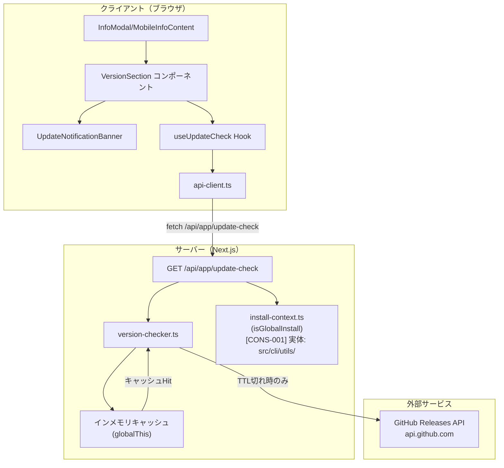
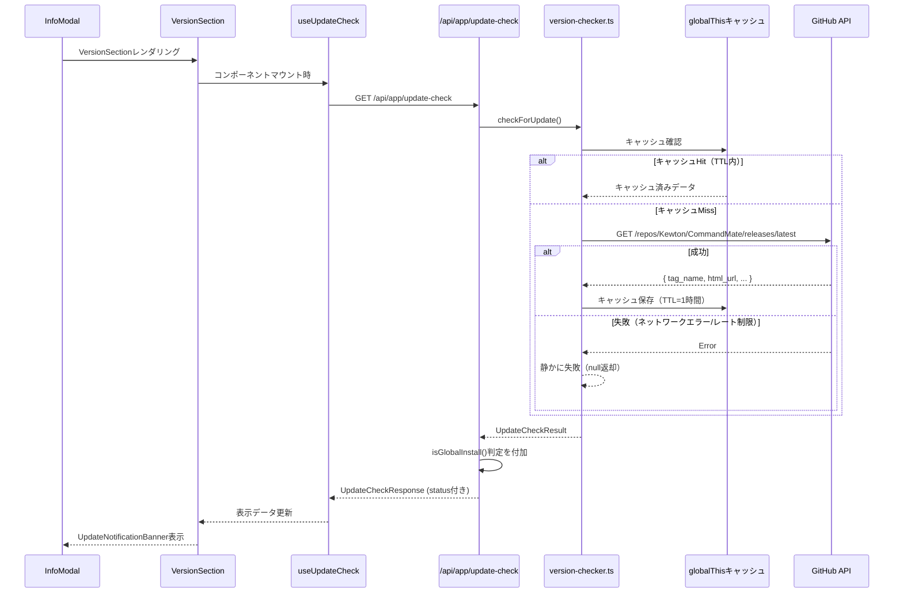

# Issue #257: バージョンアップ通知機能 設計方針書

## 1. アーキテクチャ設計

### システム構成図



### データフロー



### レイヤー構成

| レイヤー | ディレクトリ | 責務 |
|---------|------------|------|
| プレゼンテーション層 | `src/components/worktree/` | VersionSection（バージョン表示+通知バナー統合）、UpdateNotificationBanner（通知UI） |
| フック層 | `src/hooks/` | `useUpdateCheck` - API呼び出し・状態管理 |
| APIクライアント層 | `src/lib/api-client.ts` | `appApi.checkForUpdate()` - type-safe fetch。[CONS-004] `fetchApi`ヘルパーはGETリクエストでもContent-Typeヘッダを自動付与する（動作上問題なし）。[IMP-SF-001] この事実を`appApi.checkForUpdate()`のJSDocに記録し、将来のPOSTエンドポイント追加時の注意喚起とすること |
| API Route層 | `src/app/api/app/update-check/` | リクエスト処理・インストール方式判定 |
| ビジネスロジック層 | `src/lib/version-checker.ts` | GitHub API呼び出し・semver比較・キャッシュ |
| CLIユーティリティ参照 | `src/cli/utils/install-context.ts` | [CONS-001] `isGlobalInstall()` - API Route層から直接importするクロスレイヤー参照。実体はCLI層（`src/cli/utils/`）に配置されているが、`src/lib/db-path-resolver.ts`が同様のimportを行う前例あり。将来的にAPI Route層からの利用が増える場合は`src/lib/install-context.ts`への移設を検討 |
| i18n層 | `locales/` | 通知メッセージの多言語対応 |

---

## 2. 技術選定

### 選定方針

既存技術スタックを最大限に活用し、新規依存を最小限にする。

| カテゴリ | 選定技術 | 選定理由 |
|---------|---------|---------|
| semver比較 | **自前実装** | `x.y.z`形式の比較のみで十分。プレリリース対応不要（CommandMateはプレリリース版を公開しない）。外部ライブラリ追加のオーバーヘッドを回避 |
| バージョン取得 | **`process.env.NEXT_PUBLIC_APP_VERSION`** | [CONS-002] サーバーサイド（`version-checker.ts`の`getCurrentVersion()`）でもクライアントサイドと同一の`process.env.NEXT_PUBLIC_APP_VERSION`を使用する。`next.config.js`で`package.json`から埋め込み済み。直接`require('package.json').version`は使用しない（方式の統一） |
| HTTP クライアント | **Node.js `fetch`** (Node 18+) | Next.js 14のサーバーサイドで利用可能。追加依存不要 |
| キャッシュ | **globalThis パターン** | `auto-yes-manager.ts:99-112` の実績パターン。Next.jsホットリロード耐性あり |
| i18n名前空間 | **既存 `worktree` 名前空間にキー追加** | 新規名前空間作成は`src/i18n.ts`変更が必要で影響範囲が広がる。既存名前空間のネスト（`update.*`）で十分 |
| API呼び出し | **方式(c): カスタムフック `useUpdateCheck`** + **方式(a): `api-client.ts`にAPI追加** | 状態管理とAPI呼び出しの関心分離。既存パターン（`worktreeApi`等）に準拠 |

### semver比較の自前実装について

```typescript
// 比較対象: "v0.2.3" と "0.3.0" のような文字列
// v-prefix除去 → major.minor.patch分割 → 数値比較
// [SF-003] 入力検証を内蔵し、不正な形式に対してfalseを返す
const SEMVER_PATTERN = /^v?\d+\.\d+\.\d+$/;

/**
 * バージョン比較関数
 * @param current - 現在のバージョン (e.g., "0.2.3", "v0.2.3")
 * @param latest - 最新のバージョン (e.g., "0.3.0", "v0.3.0")
 * @returns latest が current より新しい場合 true、不正な形式の場合 false
 */
function isNewerVersion(current: string, latest: string): boolean {
  // [SF-003] 防御的バリデーション: 不正な形式は即座にfalseを返す
  if (!SEMVER_PATTERN.test(current) || !SEMVER_PATTERN.test(latest)) {
    return false;
  }

  const parse = (v: string) => v.replace(/^v/, '').split('.').map(Number);
  const [cMajor, cMinor, cPatch] = parse(current);
  const [lMajor, lMinor, lPatch] = parse(latest);

  if (lMajor !== cMajor) return lMajor > cMajor;
  if (lMinor !== cMinor) return lMinor > cMinor;
  return lPatch > cPatch;
}
```

**代替案と却下理由**:
- `semver` パッケージ: プレリリース版やビルドメタデータの比較機能は不要。依存追加のコストに見合わない
- `compare-versions`: 同上。YAGNI原則に反する

---

## 3. 設計パターン

### 3-1. globalThis キャッシュパターン（既存パターン準拠）

`auto-yes-manager.ts:99-112` のパターンに準拠し、Next.jsホットリロード耐性のあるキャッシュを実装する。

```typescript
// src/lib/version-checker.ts

interface VersionCache {
  result: UpdateCheckResult | null;
  fetchedAt: number;
  rateLimitResetAt: number | null;
}

declare global {
  // eslint-disable-next-line no-var -- [IMP-SF-003] auto-yes-manager.ts:99-103の既存パターンに準拠。実装時にnpm run lintで確認必須
  var __versionCheckCache: VersionCache | undefined;
}

const CACHE_TTL_MS = 60 * 60 * 1000; // 1時間

const cache = globalThis.__versionCheckCache ??
  (globalThis.__versionCheckCache = {
    result: null,
    fetchedAt: 0,
    rateLimitResetAt: null,
  });
```

> **[C-001] レート制限対策の簡素化について**: `rateLimitResetAt`フィールドと専用のレート制限ハンドリング（`handleRateLimit`/`isRateLimited`関数）は、1時間のキャッシュTTLだけで大部分カバーされる可能性がある。実装時にはまず簡素な方式（403受信時にキャッシュTTLを延長する）を検討し、それで不十分な場合にのみ`rateLimitResetAt`を導入すること。

### 3-2. Silent Failure パターン

外部API依存の機能は、障害時にアプリケーション全体に影響を与えてはならない。

```typescript
// [SEC-001] SSRF防止: GitHub API URLはハードコード定数とし、環境変数・設定ファイル・ユーザー入力から
// 導出してはならない。この値を設定可能にするとSSRF攻撃の経路となるため、as const で不変性を保証する。
const GITHUB_API_URL = 'https://api.github.com/repos/Kewton/CommandMate/releases/latest' as const;

async function checkForUpdate(): Promise<UpdateCheckResult | null> {
  try {
    // キャッシュ確認
    if (isCacheValid()) return cache.result;

    // レート制限チェック
    if (isRateLimited()) return cache.result;

    const response = await fetch(GITHUB_API_URL, {
      headers: {
        'Accept': 'application/vnd.github+json',
        'User-Agent': `CommandMate/${getCurrentVersion()}`,  // [SEC-SF-002] GitHub API要件準拠
      },
      signal: AbortSignal.timeout(5000), // 5秒タイムアウト
    });

    if (response.status === 403) {
      handleRateLimit(response);
      return cache.result;
    }

    if (!response.ok) return cache.result;

    // ... パース・比較・キャッシュ更新
    // [SEC-SF-001] レスポンスのhtml_url, releaseName のバリデーション（Section 6-5参照）
  } catch {
    // ネットワークエラー、タイムアウト等は静かに失敗
    return cache.result;
  }
}
```

### 3-3. API Route + サービス層の分離

API Routeは薄いハンドラに留め、ビジネスロジックは`version-checker.ts`に集約する。

```
API Route (route.ts)     → リクエスト処理、レスポンス構築
                         → isGlobalInstall() 呼び出し [CONS-001: src/cli/utils/install-context.ts からのimport]
version-checker.ts       → GitHub API呼び出し、semver比較、キャッシュ管理
```

> **[CONS-001] クロスレイヤー参照について**: `isGlobalInstall()` は `src/cli/utils/install-context.ts` に定義されており、API Route層からCLI層への直接importとなる。`src/lib/db-path-resolver.ts:14` が同様のimportを行う前例があるため、現時点では許容する。ただし、本設計書のシステム構成図ではInstallCtxをサーバー層に記載しているが、実際のファイル配置はCLI層であることを認識すること。将来的にAPI Route層からのCLIユーティリティ参照が増える場合は、`src/lib/install-context.ts` への移設を検討する。

### 3-4. コンポーネント分離パターン [MF-001, SF-001]

**WorktreeDetailRefactored.tsx（2085行）のSRP違反を防止するため、UI責務を専用コンポーネントに分離する。**

```
WorktreeDetailRefactored.tsx
  ├── InfoModal
  │     └── VersionSection (新規)       ← バージョン表示 + 通知を統合
  │           ├── バージョン番号表示
  │           └── UpdateNotificationBanner (新規)
  └── MobileInfoContent
        └── VersionSection (同一コンポーネントを再利用)  ← DRY
              ├── バージョン番号表示
              └── UpdateNotificationBanner (同一コンポーネントを再利用)
```

**設計根拠**:
- **MF-001**: `WorktreeDetailRefactored.tsx`は既に2085行あり、InfoModal、MobileInfoContent、MobileContent等の複数サブコンポーネントを内包している。ここにアップデート通知UIを直接追加するとSRP違反がさらに悪化する。`UpdateNotificationBanner.tsx`として独立させることで、新機能は自己完結的かつ単独テスト可能になる。
- **SF-001**: Versionセクションは現在InfoModal（507-511行目）とMobileInfoContent（775-779行目）で重複している。通知UIを追加するとこの重複が倍増する。`VersionSection`コンポーネントとして抽出し、両方の場所で同一コンポーネントを利用することでDRYを遵守する。

---

## 4. データモデル設計

### 型定義

本機能はDB変更不要。型定義は`version-checker.ts`内に配置する（モジュール外での利用がある場合のみ`src/types/`に移動）。

#### [CONS-002] getCurrentVersion() のバージョン取得方式

サーバーサイドでの現在バージョン取得は `process.env.NEXT_PUBLIC_APP_VERSION` を使用する。これはクライアントサイド（`WorktreeDetailRefactored.tsx:108`）と同一の取得方式であり、`next.config.js` で `package.json` から埋め込み済みの値を参照する。

```typescript
// src/lib/version-checker.ts 内
function getCurrentVersion(): string {
  return process.env.NEXT_PUBLIC_APP_VERSION ?? '0.0.0';
}
```

**代替案と却下理由**:
- `require('../../../package.json').version`: パス依存で壊れやすく、クライアント側と方式が異なりバージョン不一致のリスクがある
- **決定**: `NEXT_PUBLIC_APP_VERSION` で統一。サーバーサイドでも利用可能（Next.jsビルド時に埋め込み）

```typescript
// src/lib/version-checker.ts 内

/** GitHub Releases API のレスポンスから必要なフィールドのみ抽出 */
interface GitHubRelease {
  tag_name: string;       // "v0.3.0"
  html_url: string;       // "https://github.com/Kewton/CommandMate/releases/tag/v0.3.0"
                          // [SEC-SF-001] html_urlはvalidateReleaseUrl()で検証必須（Section 6-5参照）
  name: string;           // "v0.3.0"
                          // [SEC-SF-001] nameはsanitizeReleaseName()で無害化必須（Section 6-5参照）
  published_at: string;   // ISO 8601
}

/** バージョンチェック結果 */
export interface UpdateCheckResult {
  hasUpdate: boolean;
  currentVersion: string;    // "0.2.3"
  latestVersion: string;     // "0.3.0"
  releaseUrl: string;        // GitHub Releases URL
  releaseName: string;       // リリース名
  publishedAt: string;       // リリース日時
}

/**
 * API レスポンス
 *
 * [SF-002] UpdateCheckResult を拡張してAPI固有フィールドを追加する設計。
 * UpdateCheckResult のフィールドは nullable に変換される（API失敗時にnullを返すため）。
 * 明示的なマッピング関数 toUpdateCheckResponse() を提供し、変換ロジックを一元化する。
 */
export interface UpdateCheckResponse {
  /** レスポンスの状態 [SF-004] */
  status: 'success' | 'degraded';
  hasUpdate: boolean;
  currentVersion: string;
  latestVersion: string | null;
  releaseUrl: string | null;
  releaseName: string | null;
  publishedAt: string | null;
  installType: 'global' | 'local' | 'unknown';
  updateCommand: string | null;  // [SEC-SF-004] 固定文字列 "npm install -g commandmate@latest" のみ許容。動的パス情報を含めてはならない
}
```

#### [SF-002] 型マッピングの一元化

`UpdateCheckResult` から `UpdateCheckResponse` への変換は、API Route内の明示的なマッピング関数 `toUpdateCheckResponse()` で行う。これにより：

1. フィールドの対応関係が明確になる
2. nullable変換のミスを防止できる
3. テストで変換ロジックを単独で検証できる

```typescript
// src/app/api/app/update-check/route.ts 内

function toUpdateCheckResponse(
  result: UpdateCheckResult | null,
  installType: 'global' | 'local' | 'unknown'
): UpdateCheckResponse {
  if (!result) {
    return {
      status: 'degraded',
      hasUpdate: false,
      currentVersion: getCurrentVersion(),
      latestVersion: null,
      releaseUrl: null,
      releaseName: null,
      publishedAt: null,
      installType,
      updateCommand: null,
    };
  }

  return {
    status: 'success',
    hasUpdate: result.hasUpdate,
    currentVersion: result.currentVersion,
    latestVersion: result.latestVersion,
    releaseUrl: result.releaseUrl,
    releaseName: result.releaseName,
    publishedAt: result.publishedAt,
    installType,
    // [SEC-SF-004] updateCommandは固定文字列のみ。動的パス情報やユーザー入力を含めてはならない
    updateCommand: result.hasUpdate && installType === 'global'
      ? 'npm install -g commandmate@latest'
      : null,
  };
}
```

---

## 5. API設計

### エンドポイント

```
GET /api/app/update-check
```

### レスポンス形式

**正常時（アップデートあり）**:
```json
{
  "status": "success",
  "hasUpdate": true,
  "currentVersion": "0.2.3",
  "latestVersion": "0.3.0",
  "releaseUrl": "https://github.com/Kewton/CommandMate/releases/tag/v0.3.0",
  "releaseName": "v0.3.0",
  "publishedAt": "2026-02-10T00:00:00Z",
  "installType": "global",
  "updateCommand": "npm install -g commandmate@latest"
}
```

**正常時（最新版）**:
```json
{
  "status": "success",
  "hasUpdate": false,
  "currentVersion": "0.2.3",
  "latestVersion": "0.2.3",
  "releaseUrl": null,
  "releaseName": null,
  "publishedAt": null,
  "installType": "local",
  "updateCommand": null
}
```

**エラー時（静かに失敗）[SF-004]**:
```json
{
  "status": "degraded",
  "hasUpdate": false,
  "currentVersion": "0.2.3",
  "latestVersion": null,
  "releaseUrl": null,
  "releaseName": null,
  "publishedAt": null,
  "installType": "unknown",
  "updateCommand": null
}
```

### レスポンスヘッダ [SEC-SF-003]

API Routeのレスポンスには以下のキャッシュ制御ヘッダを明示的に設定する。サーバーサイドの`globalThis`キャッシュが既にキャッシュ管理を行っているため、中間プロキシやCDNによるHTTPレベルのキャッシュを無効化し、TTLの不整合を防止する。

```typescript
// route.ts の GET ハンドラ内
return NextResponse.json(responseData, {
  headers: {
    'Cache-Control': 'no-store, no-cache, must-revalidate',
    'Pragma': 'no-cache',
  },
});
```

### エラーハンドリング

| シナリオ | HTTPステータス | レスポンス | statusフィールド |
|---------|-------------|----------|----------------|
| 正常（アップデートあり） | 200 | `hasUpdate: true` | `"success"` |
| 正常（最新版） | 200 | `hasUpdate: false` | `"success"` |
| GitHub API失敗 | 200 | `hasUpdate: false, latestVersion: null` | `"degraded"` |
| サーバー内部エラー | 200 | `hasUpdate: false`（静かに失敗） | `"degraded"` |

> **設計判断**: エラー時もHTTP 200を返す。クライアント側でエラーハンドリングが不要になり、既存のInfoModal UIに影響しない。
>
> **[SF-004] statusフィールドの追加**: HTTP 200を維持しつつ、`status: 'success' | 'degraded'` フィールドを追加する。これにより、将来のメトリクス・ログ監視ツールがレスポンスボディを検査することで「正常にチェック完了、更新なし」と「GitHub APIへの到達に失敗」を区別できる。`latestVersion: null` の慣例だけに頼る脆弱な判定を排除する。

### HTTPメソッド制限 [SEC-C-003]

本エンドポイントはGETのみをサポートする。Next.js App Routerは`export async function GET()`のみをエクスポートした場合、POST/PUT/DELETE等に対して自動的に405 Method Not Allowedを返す。この動作をテストケースで検証する（Consider項目として記録）。

---

## 6. セキュリティ設計

### 6-1. CSP（Content Security Policy）

GitHub API呼び出しはサーバーサイド（API Route）のみで行うため、`next.config.js`のCSP `connect-src`変更は**不要**。

### 6-2. 入力バリデーション

- API Routeはパラメータを受け取らない（GETのみ）ため、リクエストバリデーション不要
- GitHub APIレスポンスの`tag_name`からのバージョン文字列は、`/^v?\d+\.\d+\.\d+$/`で検証
- **[SF-003] `isNewerVersion`関数内にバリデーションを内蔵**: バージョン文字列の検証は`isNewerVersion`関数内で行い、呼び出し側が検証を忘れるリスクを排除する。不正な形式（例: `v0.3.0-beta`、`0.3`、`release-0.3.0`、空文字）に対しては`false`を返す。この契約はJSDocで明文化する。

### 6-3. 情報漏洩防止

- GitHub APIレスポンスの全フィールドをクライアントに転送しない
- `installType`のみインストール方式情報として公開（内部パス情報は含めない）
- **[SEC-SF-004]** `updateCommand`フィールドは固定文字列`'npm install -g commandmate@latest'`のみ許容し、動的パス情報を一切含めないこと。`installType`と`updateCommand`の組み合わせでインストール方式は推測可能だが、ローカルデプロイメントモデルのため許容範囲

### 6-4. サーバーサイドのみ

- `isGlobalInstall()`は`__dirname`に依存するため、サーバーサイドでのみ実行（[CONS-001] 実体は `src/cli/utils/install-context.ts`）
- クライアントコンポーネントからは`/api/app/update-check`のレスポンスのみを参照

### 6-5. SSRF防止（Server-Side Request Forgery）[SEC-001]

**OWASP A10:2021 対応。本設計における最重要セキュリティ制約。**

GitHub API呼び出しのターゲットURLは、ハードコード定数として定義し、設定可能にしてはならない。

```typescript
// src/lib/version-checker.ts
// SSRF防止: この値は絶対に環境変数、設定ファイル、ユーザー入力から導出してはならない
const GITHUB_API_URL = 'https://api.github.com/repos/Kewton/CommandMate/releases/latest' as const;
```

**制約事項**:
- `GITHUB_API_URL`は`as const`で型レベルの不変性を保証する
- 環境変数（`process.env.GITHUB_API_URL`等）からのURL取得は**禁止**
- 設定ファイル（`config.json`等）からのURL取得は**禁止**
- URLのパス部分を動的に構築する処理は**禁止**
- コードレビューで`GITHUB_API_URL`の値変更がある場合は必ずセキュリティレビューを実施

### 6-6. GitHub APIレスポンスのバリデーション [SEC-SF-001]

**OWASP A03:2021 Injection対応。DNS汚染やMITM攻撃によるレスポンス改竄を防御。**

GitHub APIレスポンスの`tag_name`は`isNewerVersion()`内で`SEMVER_PATTERN`により検証される（SF-003）。加えて、`html_url`と`name`フィールドもクライアントに渡す前にバリデーション・無害化を行う。

```typescript
// src/lib/version-checker.ts 内

/** [SEC-SF-001] GitHub Releases URLの許可プレフィックス */
const GITHUB_RELEASE_URL_PREFIX = 'https://github.com/Kewton/CommandMate/releases/' as const;

/** [SEC-SF-001] リリース名の許可文字パターン（英数字、ドット、ハイフン、スペース、v-prefix） */
const RELEASE_NAME_PATTERN = /^[a-zA-Z0-9.\-\s_v]+$/;

/**
 * html_urlが正規のGitHub Releases URLであることを検証する
 * @returns 検証済みURL、不正な場合はnull
 */
function validateReleaseUrl(url: string): string | null {
  if (!url.startsWith(GITHUB_RELEASE_URL_PREFIX)) {
    return null;
  }
  return url;
}

/**
 * releaseName を安全な文字セットに制限する
 * @returns 検証済み名前、不正な場合はtag_nameのフォールバック
 */
function sanitizeReleaseName(name: string, tagName: string): string {
  if (RELEASE_NAME_PATTERN.test(name) && name.length <= 128) {
    return name;
  }
  // 不正な名前の場合、tag_name（semver検証済み）をフォールバック値とする
  return tagName;
}
```

**検証ルール**:
- `html_url`: `https://github.com/Kewton/CommandMate/releases/`プレフィックスとの前方一致を検証。不一致の場合はnullとしてクライアントに返す
- `name`（releaseName）: 英数字・ドット・ハイフン・スペース・アンダースコア・v文字のみ許可。128文字以内。不正な場合は`tag_name`（semver検証済み）をフォールバックとする
- `tag_name`: 既存の`SEMVER_PATTERN`（`/^v?\d+\.\d+\.\d+$/`）で検証（SF-003）

### 6-7. API識別ヘッダ [SEC-SF-002]

**OWASP A07:2021 対応。GitHub APIのベストプラクティスに準拠。**

GitHub APIへのリクエストには`User-Agent`ヘッダを付与する。GitHub APIはUser-Agentヘッダなしのリクエストを拒否または優先度低下させる可能性がある。また、アプリケーション識別によりGitHub側での不正利用検知が可能になる。

```typescript
const response = await fetch(GITHUB_API_URL, {
  headers: {
    'Accept': 'application/vnd.github+json',
    'User-Agent': `CommandMate/${getCurrentVersion()}`,  // [SEC-SF-002]
  },
  signal: AbortSignal.timeout(5000),
});
```

### 6-8. HTTPキャッシュ制御 [SEC-SF-003]

**OWASP A05:2021 Security Misconfiguration対応。**

API Routeのレスポンスに明示的な`Cache-Control`ヘッダを設定し、中間プロキシやCDNによるキャッシュを無効化する。サーバーサイドの`globalThis`キャッシュ（TTL=1時間）が唯一のキャッシュ層であり、HTTPレベルのキャッシュとのTTL不整合を防止する。

詳細はSection 5「レスポンスヘッダ」を参照。

### 6-9. OWASP Top 10 チェックリスト

| OWASP カテゴリ | ステータス | 備考 |
|---------------|----------|------|
| A01: Broken Access Control | PASS | 読み取り専用、認証不要（ローカルツールのバージョンチェック）。ユーザー固有データなし |
| A02: Cryptographic Failures | PASS | GitHub APIはHTTPS経由。機密データの保存・送信なし |
| A03: Injection | 条件付きPASS | semver入力はSF-003で検証。html_url/releaseNameはSEC-SF-001で検証・無害化。SQLインジェクションリスクなし（DB変更なし）。コマンドインジェクションリスクなし（exec/spawn不使用） |
| A04: Insecure Design | PASS | Silent Failureパターンでコア機能への影響なし。updateCommandは固定文字列（SEC-SF-004） |
| A05: Security Misconfiguration | 条件付きPASS | CSP変更不要。Cache-ControlヘッダをSEC-SF-003で明示設定 |
| A06: Vulnerable and Outdated Components | PASS | 新規依存なし。semver自前実装。ビルトインNode.js fetch使用 |
| A07: Identification and Authentication Failures | 条件付きPASS | 公開リポジトリのため認証不要。User-AgentヘッダをSEC-SF-002で付与 |
| A08: Software and Data Integrity Failures | PASS | バージョン情報は表示のみ。自動インストール不実施。TLSで転送時保護 |
| A09: Security Logging and Monitoring Failures | 条件付きPASS | Silent Failureは正しいUX判断だが、セキュリティ監視のためdebugレベルログを検討（SEC-C-002） |
| A10: Server-Side Request Forgery | 条件付きPASS | SEC-001でGITHUB_API_URLをハードコード定数化し、SSRF経路を遮断 |

---

## 7. パフォーマンス設計

### 7-1. キャッシュ戦略

| 項目 | 値 | 理由 |
|------|---|------|
| **キャッシュTTL** | 1時間 | GitHub API未認証レート制限（60req/h）に合わせる |
| **キャッシュ方式** | globalThis インメモリ | ホットリロード耐性。サーバー再起動時のみリセット |
| **永続化** | 不要 | バージョン情報は揮発性で問題ない |

### 7-2. レート制限対策

> **[C-001] 簡素化の検討**: 1時間のキャッシュTTLにより、GitHub API未認証レート制限（60req/h）にヒットする可能性は低い。以下の実装では`rateLimitResetAt`による詳細な制御を示しているが、実装時にはまず「403受信時にキャッシュTTLを延長する」という簡素なアプローチを採用し、不十分な場合にのみ下記の詳細方式に切り替えること。

```typescript
function handleRateLimit(response: Response): void {
  const resetTimestamp = response.headers.get('X-RateLimit-Reset');
  if (resetTimestamp) {
    cache.rateLimitResetAt = parseInt(resetTimestamp, 10) * 1000;
  } else {
    // リセット時刻不明の場合は1時間後に再試行
    cache.rateLimitResetAt = Date.now() + CACHE_TTL_MS;
  }
}

function isRateLimited(): boolean {
  if (!cache.rateLimitResetAt) return false;
  if (Date.now() >= cache.rateLimitResetAt) {
    cache.rateLimitResetAt = null;
    return false;
  }
  return true;
}
```

### 7-3. API Routeの非同期処理

- GitHub API呼び出しに5秒タイムアウトを設定（`AbortSignal.timeout(5000)`）
- InfoModal表示時にのみAPI呼び出し（ページロード時の自動呼び出しは行わない）

---

## 8. 設計上の決定事項とトレードオフ

### 採用した設計

| 決定事項 | 理由 | トレードオフ |
|---------|------|-------------|
| semver自前実装（バリデーション内蔵）[SF-003] | YAGNI: x.y.z比較のみ必要。防御的バリデーションで不正形式に安全 | プレリリース版は非対応 |
| globalThisキャッシュ | 既存パターン準拠、ホットリロード耐性 | マルチプロセス非対応（CommandMateは単一プロセス） |
| エラー時HTTP 200 + statusフィールド [SF-004] | クライアント実装の簡素化。statusフィールドで監視・デバッグ対応 | HTTPステータスコードの意味論と乖離（statusフィールドで補完） |
| worktree名前空間にi18nキー追加 | src/i18n.ts変更不要 | 名前空間が肥大化する可能性（[C-002]参照） |
| InfoModal表示時のみAPI呼び出し | 不要なAPI呼び出し回避 | ユーザーがInfoModalを開くまで通知されない |
| サーバーサイドのみGitHub API呼び出し | CSP変更不要、レート制限一元管理 | クライアントサイドレンダリングへの切り替え困難 |
| UpdateNotificationBanner分離 [MF-001] | SRP遵守、WorktreeDetailRefactored.tsxの肥大化防止 | ファイル数増加（許容範囲） |
| VersionSection共通化 [SF-001] | DRY遵守、InfoModal/MobileInfoContentでの重複排除 | コンポーネント間の結合は低い |
| UpdateCheckResult→Response明示的マッピング [SF-002] | 型変換のミス防止、テスタビリティ向上 | マッピング関数の追加コード |
| GitHub API URLハードコード定数化 [SEC-001] | SSRF防止。環境変数・設定ファイル経由のURL注入を根本的に遮断 | テスト時のURL差し替えにはモジュールモック必須 |
| html_url/releaseName バリデーション [SEC-SF-001] | DNS汚染・MITM攻撃によるレスポンス改竄への防御層 | バリデーション関数の追加コード。正規URLプレフィックスの変更時に更新必要 |
| User-Agentヘッダ付与 [SEC-SF-002] | GitHub APIベストプラクティス準拠。リクエスト拒否リスク低減 | バージョン情報がUser-Agentに含まれる（公開リポジトリのため問題なし） |
| Cache-Control: no-store レスポンスヘッダ [SEC-SF-003] | 中間プロキシによるキャッシュ干渉防止 | ブラウザキャッシュも無効化（APIは内部呼び出しのため問題なし） |
| updateCommand固定文字列制約 [SEC-SF-004] | 動的パス情報の漏洩防止 | 将来的にnpm以外のインストール方式をサポートする場合は固定文字列の追加が必要 |

### 代替案との比較

#### semver比較: 自前実装 vs `semver`パッケージ

| 観点 | 自前実装 | `semver`パッケージ |
|------|---------|------------------|
| 依存追加 | なし | `npm install semver` |
| プレリリース対応 | 非対応 | 対応 |
| 実装量 | 15行程度（バリデーション含む） | 0行（import） |
| YAGNI | 準拠 | 過剰機能 |
| 防御的バリデーション | 内蔵 [SF-003] | 内蔵 |

**決定**: 自前実装。CommandMateはプレリリース版を公開しないため。

#### i18n: 既存名前空間 vs 新規名前空間

| 観点 | 既存`worktree`にネスト | 新規`update`名前空間 |
|------|---------------------|---------------------|
| 変更ファイル数 | 2（localesのみ） | 4（locales + `src/i18n.ts`） |
| 関心の分離 | worktreeに混在 | 独立 |
| 複雑さ | 低 | 中 |

**決定**: 既存`worktree`名前空間にネスト（`worktree.update.*`）。変更の最小化を優先。

> **[C-002] 将来のガイドライン**: アプリレベルの機能が増え、worktree名前空間のキーが明らかにworktreeドメイン外に増加した場合は、`app`名前空間の新設を検討すること。閾値の目安として、ドメイン外キーが5つ以上になった場合に分離を検討する。

#### キャッシュ: globalThis vs モジュールレベル変数

| 観点 | globalThis | モジュールレベル変数 |
|------|-----------|------------------|
| ホットリロード耐性 | あり | なし |
| 実装量 | `declare global` + `eslint-disable` 必要 | シンプル |
| 既存実績 | `auto-yes-manager.ts` | `db-instance.ts` |

**決定**: globalThis。開発モードでのGitHub API過剰リクエスト防止を優先。

---

## 9. UI設計

### InfoModal内のアップデート通知配置

```
┌─────────────────────────────┐
│ Info                    [x] │
│─────────────────────────────│
│ Worktree Name               │
│ Description                 │
│ Repository                  │
│ Branch                      │
│ Path                        │
│ Last Updated                │
│                             │
│ ┌─────────────────────────┐ │   <- VersionSection コンポーネント [SF-001]
│ │ Version                 │ │
│ │ v0.2.3                  │ │
│ │ ┌─────────────────────┐ │ │
│ │ │ 新しいバージョンがあり│ │ │   <- UpdateNotificationBanner [MF-001]
│ │ │ v0.3.0 が利用可能    │ │ │
│ │ │                     │ │ │
│ │ │ npm install -g ...   │ │ │   <- installType=globalの場合
│ │ │ [リリースを表示 ->]  │ │ │
│ │ │                     │ │ │
│ │ │ データベースのデータは│ │ │
│ │ │ 保持されます         │ │ │
│ │ └─────────────────────┘ │ │
│ └─────────────────────────┘ │
│                             │
│ Logs                        │
└─────────────────────────────┘
```

### コンポーネント構成 [MF-001, SF-001]

#### UpdateNotificationBanner

- **ファイル**: `src/components/worktree/UpdateNotificationBanner.tsx`
- **責務**: アップデート通知UIの表示のみ
- **Props**: `UpdateCheckResponse` から必要なフィールドを受け取る
- **テスト**: 単独でテスト可能（`WorktreeDetailRefactored.tsx`に依存しない）

#### VersionSection

- **ファイル**: `src/components/worktree/VersionSection.tsx`
- **責務**: バージョン番号表示 + UpdateNotificationBanner の統合
- **利用箇所**: InfoModal と MobileInfoContent の両方で同一コンポーネントを使用
- **Props**: `version: string` と `className?: string` を受け取り、内部で`useUpdateCheck`フックを呼び出す

> **[CONS-005] スタイル差異の吸収**: InfoModal内では `bg-gray-50 rounded-lg p-4`、MobileInfoContent内では `bg-white rounded-lg border border-gray-200 p-4` のスタイルが使用されている。VersionSectionは `className` propを受け取り、外部コンテナのスタイルを呼び出し側が指定できるようにする。これにより、コンポーネント内部のロジックは共通のまま、見た目の差異を吸収する。

```typescript
// VersionSection の Props 定義
interface VersionSectionProps {
  version: string;
  className?: string;  // [CONS-005] コンテナスタイルの外部指定
}

// 利用例
// InfoModal 内:
<VersionSection version={appVersion} className="bg-gray-50 rounded-lg p-4" />

// MobileInfoContent 内:
<VersionSection version={appVersion} className="bg-white rounded-lg border border-gray-200 p-4" />
```

### 通知UI仕様

- **表示位置**: VersionSection内、バージョン番号の直下
- **スタイル**: `bg-blue-50 border border-blue-200 rounded-lg p-3`（info系カラー）
- **表示条件**: `hasUpdate === true` の場合のみ
- **非表示条件**: `hasUpdate === false` または API失敗時（`status === 'degraded'`）
- **リンク**: `target="_blank" rel="noopener noreferrer"` でGitHub Releasesを開く

---

## 10. ファイル構成

### 新規ファイル

```
src/
├── lib/
│   └── version-checker.ts              # GitHub API呼び出し、semver比較（バリデーション内蔵）、globalThisキャッシュ
├── hooks/
│   └── useUpdateCheck.ts               # アップデートチェック用カスタムフック
├── components/
│   └── worktree/
│       ├── UpdateNotificationBanner.tsx # [MF-001] アップデート通知バナーUI
│       └── VersionSection.tsx          # [SF-001] バージョン表示 + 通知バナー統合
└── app/
    └── api/
        └── app/
            └── update-check/
                └── route.ts            # GET /api/app/update-check

locales/
├── en/
│   └── worktree.json                   # update.* キー追加
└── ja/
    └── worktree.json                   # update.* キー追加

tests/
└── unit/
    ├── lib/
    │   └── version-checker.test.ts     # バージョンチェックロジックテスト（バリデーション含む）
    ├── hooks/
    │   └── useUpdateCheck.test.ts      # [IMP-C01] アップデートチェックフックテスト（既存hooksテストパターン準拠）
    ├── api/
    │   └── update-check.test.ts        # [CONS-003] APIエンドポイントテスト（api/ 直下に配置、app/ サブディレクトリなし）
    └── components/
        └── worktree/
            ├── update-notification-banner.test.tsx  # [MF-001] バナーコンポーネントテスト
            └── version-section.test.tsx             # [SF-001] セクションコンポーネントテスト
```

### 変更ファイル

```
src/
├── lib/
│   └── api-client.ts                   # appApi.checkForUpdate() 追加。[IMP-SF-001] fetchApiのContent-Type自動付与をJSDocに記録
└── components/
    └── worktree/
        └── WorktreeDetailRefactored.tsx # [MF-001] VersionSectionを利用するよう変更（直接UI追加はしない）

tests/
└── unit/
    └── components/
        └── worktree/
            └── WorktreeDetailWebSocket.test.tsx  # [IMP-001] バージョン表示DOM構造変更の影響確認・修正が必要な可能性あり
```

### ドキュメント更新

```
CLAUDE.md                               # [IMP-C02] 主要機能モジュールに以下4モジュールを追加:
                                        #   - src/lib/version-checker.ts
                                        #   - src/hooks/useUpdateCheck.ts
                                        #   - src/components/worktree/VersionSection.tsx
                                        #   - src/components/worktree/UpdateNotificationBanner.tsx
docs/implementation-history.md           # Issue #257エントリ追加
```

---

## 11. 制約条件の確認

| 原則 | 適用箇所 |
|------|---------|
| **SOLID - 単一責任** | `version-checker.ts`はバージョンチェックのみ、`route.ts`はリクエスト処理のみ、`UpdateNotificationBanner.tsx`は通知UI表示のみ [MF-001]、`VersionSection.tsx`はバージョン情報セクション統合のみ [SF-001] |
| **SOLID - 開放閉鎖** | 将来的にnpmレジストリチェック等を追加する場合、`version-checker.ts`内にストラテジーを追加可能。`isNewerVersion`は内部バリデーション付きで不正入力にも安全 [SF-003] |
| **KISS** | semver自前実装（15行、バリデーション含む）、エラー時は静かに失敗（複雑なリトライ不要）、statusフィールドで状態区別 [SF-004] |
| **YAGNI** | プレリリース対応なし、通知dismiss機能なし、環境変数による無効化なし |
| **DRY** | `isNewerVersion()`は1箇所に定義、キャッシュロジックは`version-checker.ts`に集約、VersionSectionでInfoModal/MobileInfoContentの重複排除 [SF-001]、型マッピングは`toUpdateCheckResponse()`に集約 [SF-002] |

---

## 12. 実装優先順位

1. **version-checker.ts** - コアロジック（GitHub API + semver（バリデーション内蔵 [SF-003]）+ キャッシュ、[IMP-SF-003] eslint-disableパターン準拠）
2. **version-checker.test.ts** - TDD: テスト先行（不正バージョン形式のテストケース含む）
3. **route.ts** - APIエンドポイント（toUpdateCheckResponse()マッピング [SF-002]、statusフィールド [SF-004]）
4. **update-check.test.ts** - APIテスト（success/degraded statusのテスト含む）
5. **api-client.ts** - クライアントAPI追加（[IMP-SF-001] Content-Type自動付与のJSDoc記録）
6. **useUpdateCheck.ts** - カスタムフック
7. **useUpdateCheck.test.ts** - [IMP-C01] フックテスト（既存hooksテストパターン準拠）
8. **locales/\*/worktree.json** - i18n翻訳キー
9. **UpdateNotificationBanner.tsx** - [MF-001] 通知バナーコンポーネント
10. **update-notification-banner.test.tsx** - [MF-001] バナーコンポーネントテスト
11. **VersionSection.tsx** - [SF-001] バージョンセクション統合コンポーネント
12. **version-section.test.tsx** - [SF-001] セクションコンポーネントテスト
13. **WorktreeDetailRefactored.tsx** - VersionSectionの組み込み（直接UI追加はしない）
14. **WorktreeDetailWebSocket.test.tsx** - [IMP-001] バージョン表示DOM変更の影響確認・修正
15. **CLAUDE.md / implementation-history.md** - [IMP-C02] ドキュメント更新（4モジュール全て追記）

---

## 13. レビュー履歴

| 日付 | ステージ | レビュー名 | 結果 | スコア |
|------|---------|-----------|------|--------|
| 2026-02-13 | Stage 1 | 設計原則レビュー（通常レビュー） | 条件付き承認 | 4/5 |
| 2026-02-13 | Stage 2 | 整合性レビュー | 条件付き承認 | 4/5 |
| 2026-02-13 | Stage 3 | 影響分析レビュー | 条件付き承認 | 4/5 |
| 2026-02-13 | Stage 4 | セキュリティレビュー | 条件付き承認 | 4/5 |

---

## 14. レビュー指摘事項サマリー

### Stage 1: 設計原則レビュー（2026-02-13）

#### Must Fix

| ID | 原則 | 指摘事項 | 対応内容 | 反映箇所 |
|----|------|---------|---------|---------|
| MF-001 | SRP | WorktreeDetailRefactored.tsx（2085行）にアップデート通知UIを直接追加するとSRP違反が悪化する | `UpdateNotificationBanner.tsx`として独立コンポーネントに分離 | Section 1, 3-4, 9, 10, 11, 12 |

#### Should Fix

| ID | 原則 | 指摘事項 | 対応内容 | 反映箇所 |
|----|------|---------|---------|---------|
| SF-001 | DRY | Versionセクションの表示がInfoModal/MobileInfoContentで重複し、通知追加で重複が倍増する | `VersionSection.tsx`コンポーネントとして抽出し両方で再利用 | Section 1, 3-4, 9, 10, 11, 12 |
| SF-002 | DRY/KISS | UpdateCheckResult と UpdateCheckResponse の重複フィールドと微妙なnullable差異 | 明示的な `toUpdateCheckResponse()` マッピング関数で変換を一元化 | Section 4, 11, 12 |
| SF-003 | OCP | isNewerVersion が不正なバージョン形式（beta, 2セグメント等）に対する防御なし | 関数内に `/^v?\d+\.\d+\.\d+$/` バリデーションを内蔵。JSDocで契約を明文化 | Section 2, 6-2, 8, 11, 12 |
| SF-004 | KISS | エラー時HTTP 200では監視・デバッグ時にsuccessとdegradedの区別が困難 | `status: 'success' | 'degraded'` フィールドを追加 | Section 4, 5, 8, 9, 11, 12 |

#### Consider（将来検討）

| ID | 原則 | 指摘事項 | 対応方針 |
|----|------|---------|---------|
| C-001 | YAGNI | rateLimitResetAt フィールドは過剰設計の可能性（キャッシュTTLで十分） | 実装時にまず簡素方式を採用し、不十分な場合のみ詳細方式に切替。Section 3-1, 7-2 にガイダンス追記 |
| C-002 | ISP | update.* キーをworktree名前空間に追加する概念不一致 | 現時点は許容。ドメイン外キーが5つ以上になった場合にapp名前空間新設を検討。Section 8 にガイドライン追記 |
| C-003 | DIP | version-checker.ts が直接fetchでGitHub APIを呼び出す | YAGNI/KISS優先で現時点はアクション不要。将来複数ソース対応時にUpdateSourceProviderインタフェース導入 |

### Stage 2: 整合性レビュー（2026-02-13）

#### Must Fix

| ID | カテゴリ | 指摘事項 | 対応内容 | 反映箇所 |
|----|---------|---------|---------|---------|
| CONS-001 | 整合性 | install-context.ts のモジュール境界違反: CLI層（`src/cli/utils/`）からAPI Route層への直接importがレイヤー構成図と不一致 | システム構成図にCLI層配置を明記。レイヤー構成表にクロスレイヤー参照の説明を追加。`db-path-resolver.ts`の前例を記録し、将来の`src/lib/`移設検討を明記 | Section 1, 3-3, 5, 6-4 |

#### Should Fix

| ID | カテゴリ | 指摘事項 | 対応内容 | 反映箇所 |
|----|---------|---------|---------|---------|
| CONS-002 | 整合性 | getCurrentVersion() のサーバーサイドでのバージョン取得方式が未定義。クライアント側（NEXT_PUBLIC_APP_VERSION）と方式が不統一になるリスク | `process.env.NEXT_PUBLIC_APP_VERSION`使用を明記。`getCurrentVersion()`の実装例とフォールバック値を追加 | Section 2, 4 |
| CONS-003 | 整合性 | テストディレクトリ構造が既存パターンと不一致（`tests/unit/api/app/`サブディレクトリの前例なし） | APIテストパスを `tests/unit/api/update-check.test.ts` に変更（`app/`サブディレクトリなし） | Section 10 |
| CONS-004 | 整合性 | appApi名前空間は既存パターン準拠だが、fetchApiのContent-TypeヘッダがGETリクエストでも自動付与される点の記録 | レイヤー構成表のAPIクライアント層にContent-Type自動付与の注記を追加 | Section 1 |
| CONS-005 | 整合性 | VersionSectionのスタイル差異（InfoModal: bg-gray-50 vs MobileInfoContent: bg-white border）の吸収方法が未定義 | `className` propによるスタイル差異吸収を明記。Props定義と利用例を追加 | Section 9 |

#### Consider（将来検討）

| ID | カテゴリ | 指摘事項 | 対応方針 |
|----|---------|---------|---------|
| CONS-C01 | 整合性 | /api/app/ パスが新規ドメインとして初出。今後の拡張を含めた命名ガイドラインの策定 | 現時点ではアクション不要。アプリケーション全体に関わる機能を `/api/app/` 以下に配置する方針は妥当。ヘルスチェック・設定取得等の追加時に命名規則を策定 |
| CONS-C02 | 整合性 | withLogging() ラッパーの適用有無（外部API呼び出しのデバッグに有用） | 実装時に判断。開発環境でのデバッグ用途で有用であれば適用 |
| CONS-C03 | 整合性 | i18n worktree名前空間に update.* キーを追加する概念不一致（C-002と関連） | C-002で将来検討として記録済み。整合性観点からも同一の方針を維持 |

### Stage 3: 影響分析レビュー（2026-02-13）

#### Must Fix

| ID | カテゴリ | 指摘事項 | 対応内容 | 反映箇所 |
|----|---------|---------|---------|---------|
| IMP-001 | 影響範囲 | WorktreeDetailRefactored.tsx のバージョン表示セクション（507-511行, 775-779行）を VersionSection コンポーネントに置換する際、既存テスト `WorktreeDetailWebSocket.test.tsx` がバージョン表示のDOMを参照している場合にテストが壊れる。テスト影響が未記載 | `WorktreeDetailWebSocket.test.tsx` を影響ファイルリストに追加。実装チェックリストに既存テストのレビュー・修正項目を追加 | Section 10, 15 |

#### Should Fix

| ID | カテゴリ | 指摘事項 | 対応内容 | 反映箇所 |
|----|---------|---------|---------|---------|
| IMP-SF-001 | 影響範囲 | fetchApi の Content-Type ヘッダが GET リクエストで自動付与される点について、クライアント側 `appApi.checkForUpdate()` は fetchApi 経由で GET `/api/app/update-check` を呼ぶ。将来 POST エンドポイントが `/api/app/` 以下に追加された場合の影響を考慮すべき | Content-Type 自動付与の事実を `api-client.ts` の JSDoc に記録し、将来の開発者への注意喚起とする | Section 1, 15 |
| IMP-SF-002 | 影響範囲 | 新規ディレクトリ `src/app/api/app/` の `app/` 名がNext.js App Routerのルートディレクトリと同名で混同を招く可能性。URL上は `/api/app/` でファイルシステム上は `src/app/api/app/` | CONS-C01 でガイドライン策定が記録済み。PRレビュー時に指摘される可能性を認識し、命名の妥当性をPR説明文に記載する | Section 15 |
| IMP-SF-003 | 影響範囲 | `globalThis` 型宣言の `declare global { var ... }` に `eslint-disable-next-line no-var` コメントが必要。ESLint ルール設定によってはCIで警告が出る可能性 | `auto-yes-manager.ts`（99-103行）の既存パターンと完全に同じ `eslint-disable` コメントを使用。実装時に `npm run lint` を必ず実行して確認 | Section 3-1, 15 |

#### Consider（将来検討）

| ID | カテゴリ | 指摘事項 | 対応方針 |
|----|---------|---------|---------|
| IMP-C01 | 影響範囲 | `useUpdateCheck` フックのテストファイル（`tests/unit/hooks/useUpdateCheck.test.ts`）が設計書のファイル構成に記載されていない。既存hooksディレクトリには18個のテストファイルがあり、全フックにテストが存在するパターンが確立 | `tests/unit/hooks/useUpdateCheck.test.ts` をファイル構成に追加し、実装チェックリストにも含める |
| IMP-C02 | 影響範囲 | CLAUDE.md への追記が `version-checker.ts` のみ。`useUpdateCheck.ts`、`VersionSection.tsx`、`UpdateNotificationBanner.tsx` も主要機能モジュール表に追記すべき | CLAUDE.md更新時に4モジュール全てを追記する |
| IMP-C03 | 影響範囲 | `worktree.json` への `update.*` キー追加により、`useTranslations('worktree')` を使用する全コンポーネントのメッセージバンドルサイズが約20-30%増加 | 追加キー数は推定5-8個で影響は軽微。C-002のガイドラインに従い、ドメイン外キーが5つ以上で分離検討 |

### Stage 4: セキュリティレビュー（2026-02-13）

#### Must Fix

| ID | カテゴリ | 指摘事項 | 対応内容 | 反映箇所 |
|----|---------|---------|---------|---------|
| SEC-001 | OWASP A10:2021 SSRF | GitHub API URLがハードコード定数として明示的に宣言されておらず、外部設定から導出されるリスクがある | `GITHUB_API_URL`を`as const`でハードコード定数化。環境変数・設定ファイルからの導出を明示的に禁止。コードレビュー時のセキュリティレビュー必須化 | Section 3-2, 6-5, 8, 15 |

#### Should Fix

| ID | カテゴリ | 指摘事項 | 対応内容 | 反映箇所 |
|----|---------|---------|---------|---------|
| SEC-SF-001 | OWASP A03:2021 Injection | GitHub APIレスポンスの`html_url`と`releaseName`がバリデーション・無害化なしでクライアントに渡される。DNS汚染・MITMによる改竄リスク | `validateReleaseUrl()`でURLプレフィックスを検証。`sanitizeReleaseName()`で文字セット制限と長さ制限を適用。不正値にはnullまたはtag_nameフォールバック | Section 3-2, 4, 6-6, 8, 15 |
| SEC-SF-002 | OWASP A07:2021 Identification | GitHub API呼び出しにUser-Agentヘッダが未設定。リクエスト拒否・優先度低下のリスク | `User-Agent: CommandMate/<version>`ヘッダを付与。GitHub APIベストプラクティスに準拠 | Section 3-2, 6-7, 8, 15 |
| SEC-SF-003 | OWASP A05:2021 Security Misconfiguration | API Routeレスポンスに明示的なCache-Controlヘッダがなく、中間プロキシによるキャッシュ干渉のリスク | `Cache-Control: no-store, no-cache, must-revalidate`と`Pragma: no-cache`をレスポンスヘッダに設定 | Section 5, 6-8, 8, 15 |
| SEC-SF-004 | OWASP A04:2021 Insecure Design | `updateCommand`フィールドが動的パス情報を含む可能性。`installType`との組み合わせで情報開示のリスク | `updateCommand`を固定文字列`'npm install -g commandmate@latest'`に制限。動的パス情報の包含を明示的に禁止 | Section 4, 6-3, 8, 15 |

#### Consider（将来検討）

| ID | カテゴリ | 指摘事項 | 対応方針 |
|----|---------|---------|---------|
| SEC-C-001 | OWASP A08:2021 Software and Data Integrity Failures | GitHub APIレスポンスの完全性検証が未実装。DNS汚染・CDN侵害時にバージョン情報が改竄されるリスク（低確率・高影響） | 将来の拡張として検討。現時点ではTLSによる転送時保護と表示のみ（自動インストールなし）で許容 |
| SEC-C-002 | OWASP A09:2021 Security Logging and Monitoring Failures | バージョンチェック失敗時のログ出力がなく、レート制限ヒット等のセキュリティイベントを監視できない | debugレベルでの失敗ログ出力を検討。CONS-C02の`withLogging()`適用判断と連携 |
| SEC-C-003 | Defense in Depth | APIエンドポイントのHTTPメソッド制限が暗黙的（Next.js自動405）。明示的な検証テストなし | POST/PUT/DELETEに対する405レスポンスのテストケース追加を検討 |

---

## 15. 実装チェックリスト

### Must Fix対応

- [ ] **[MF-001]** `src/components/worktree/UpdateNotificationBanner.tsx` を新規作成
  - [ ] アップデート通知UIを自己完結的なコンポーネントとして実装
  - [ ] Props: UpdateCheckResponseから必要なフィールドを受け取る設計
  - [ ] `WorktreeDetailRefactored.tsx` にUIを直接追加しないこと
  - [ ] 単独テスト: `tests/unit/components/worktree/update-notification-banner.test.tsx`

### Should Fix対応

- [ ] **[SF-001]** `src/components/worktree/VersionSection.tsx` を新規作成
  - [ ] バージョン番号表示 + UpdateNotificationBanner を統合
  - [ ] InfoModal と MobileInfoContent の両方で同一コンポーネントを使用
  - [ ] 既存の重複コード（InfoModal 507-511行, MobileInfoContent 775-779行）を置換
  - [ ] 単独テスト: `tests/unit/components/worktree/version-section.test.tsx`

- [ ] **[SF-002]** `toUpdateCheckResponse()` マッピング関数の実装
  - [ ] `route.ts` 内に明示的な変換関数を定義
  - [ ] null/nullable変換のロジックを一元化
  - [ ] テストケースでマッピングの正確性を検証

- [ ] **[SF-003]** `isNewerVersion()` にバリデーションを内蔵
  - [ ] 関数先頭で `/^v?\d+\.\d+\.\d+$/` パターンチェック
  - [ ] 不正形式（`v0.3.0-beta`, `0.3`, `release-0.3.0`, 空文字等）に対して `false` を返却
  - [ ] JSDocで入力検証の契約を明文化
  - [ ] テストケース: 不正形式バージョンの網羅的テスト

- [ ] **[SF-004]** APIレスポンスに `status` フィールドを追加
  - [ ] `UpdateCheckResponse` 型に `status: 'success' | 'degraded'` を追加
  - [ ] 正常時は `status: 'success'`、エラー時は `status: 'degraded'` を設定
  - [ ] テストケース: success/degraded 両パターンの検証

### Stage 2 Must Fix対応

- [ ] **[CONS-001]** `isGlobalInstall()` のクロスレイヤー参照をドキュメント化
  - [ ] `route.ts` 内の import 文にコメントで CLI層参照であることを明記
  - [ ] 例: `// [CONS-001] CLI層ユーティリティ。db-path-resolver.ts と同様のクロスレイヤーimport前例あり`
  - [ ] `isGlobalInstall()` の import パス: `src/cli/utils/install-context.ts`

### Stage 2 Should Fix対応

- [ ] **[CONS-002]** `getCurrentVersion()` で `process.env.NEXT_PUBLIC_APP_VERSION` を使用
  - [ ] `version-checker.ts` 内に `getCurrentVersion()` 関数を定義
  - [ ] `process.env.NEXT_PUBLIC_APP_VERSION ?? '0.0.0'` でフォールバック
  - [ ] `require('package.json').version` は使用しないこと（方式統一）

- [ ] **[CONS-003]** APIテストファイルパスの修正
  - [ ] テストファイル配置: `tests/unit/api/update-check.test.ts`（`app/` サブディレクトリなし）
  - [ ] 既存パターン（`tests/unit/api/` 直下）に合わせる

- [ ] **[CONS-004]** `appApi` の GETリクエストにおける Content-Type ヘッダの認識
  - [ ] `fetchApi` が全リクエストに `Content-Type: application/json` を付与することを認識
  - [ ] GETリクエストでのContent-Type付与は動作上問題なし（記録のみ）

- [ ] **[CONS-005]** `VersionSection` コンポーネントに `className` prop を追加
  - [ ] `interface VersionSectionProps { version: string; className?: string; }` を定義
  - [ ] InfoModal呼び出し: `className="bg-gray-50 rounded-lg p-4"`
  - [ ] MobileInfoContent呼び出し: `className="bg-white rounded-lg border border-gray-200 p-4"`

### Stage 3 Must Fix対応

- [ ] **[IMP-001]** `WorktreeDetailWebSocket.test.tsx` の影響確認・修正
  - [ ] `tests/unit/components/worktree/WorktreeDetailWebSocket.test.tsx` をレビューし、バージョン表示に関連するアサーション（DOM要素の参照・テキスト検証等）を特定する
  - [ ] VersionSection コンポーネントへの置換後もテストが正常に通過することを確認する
  - [ ] バージョン表示のDOMを参照するアサーションがある場合、VersionSection の新しいDOM構造に合わせてテストを修正する
  - [ ] テスト修正後 `npm run test:unit` で既存テストの全件パスを確認する

### Stage 3 Should Fix対応

- [ ] **[IMP-SF-001]** `api-client.ts` の `appApi.checkForUpdate()` JSDoc にContent-Type自動付与の注記を追加
  - [ ] `fetchApi`ヘルパーがGETリクエストでも`Content-Type: application/json`を自動付与することをJSDocに記録
  - [ ] 将来`/api/app/`以下にPOSTエンドポイントを追加する場合の注意喚起を含める
  - [ ] 例: `// Note: fetchApi attaches Content-Type: application/json to all requests including GET (CONS-004, IMP-SF-001)`

- [ ] **[IMP-SF-002]** PRレビュー時の `/api/app/` パス命名の妥当性説明を準備
  - [ ] `src/app/api/app/` がファイルシステム上で `app` が2階層に出現する点についてPR説明文に記載
  - [ ] URL上の `/api/app/` はアプリケーション全体に関わるエンドポイントのドメインであり、Next.js App Routerの `src/app/` とは無関係であることを明記
  - [ ] CONS-C01 の将来ガイドライン策定方針と整合していることを確認

- [ ] **[IMP-SF-003]** `version-checker.ts` の `declare global` で `auto-yes-manager.ts` と同一の eslint-disable パターンを使用
  - [ ] `auto-yes-manager.ts:99-103` の既存パターンを確認し、完全に同一の `eslint-disable` コメント形式を使用する
  - [ ] 実装後に `npm run lint` を実行し、`no-var` ルールでエラー/警告が出ないことを確認する
  - [ ] CI パイプラインでの lint チェックも問題ないことを確認する

### Stage 4 Must Fix対応

- [ ] **[SEC-001]** `GITHUB_API_URL`をハードコード定数として実装（SSRF防止）
  - [ ] `version-checker.ts`内で`const GITHUB_API_URL = 'https://api.github.com/repos/Kewton/CommandMate/releases/latest' as const;`を定義
  - [ ] コメントで「この値は環境変数・設定ファイル・ユーザー入力から導出してはならない」旨を明記
  - [ ] 環境変数`GITHUB_API_URL`等の設定パスが存在しないことを確認
  - [ ] テストケース: `GITHUB_API_URL`が期待する固定値であることの検証

### Stage 4 Should Fix対応

- [ ] **[SEC-SF-001]** GitHub APIレスポンスの`html_url`と`releaseName`のバリデーション・無害化
  - [ ] `validateReleaseUrl(url)`関数を実装: `https://github.com/Kewton/CommandMate/releases/`プレフィックス検証。不一致時はnull
  - [ ] `sanitizeReleaseName(name, tagName)`関数を実装: `/^[a-zA-Z0-9.\-\s_v]+$/`パターンと128文字制限。不正時はtagNameフォールバック
  - [ ] `GITHUB_RELEASE_URL_PREFIX`をハードコード定数として定義
  - [ ] テストケース: 正常URL、不正URL（異なるドメイン、javascript:プロトコル等）の検証
  - [ ] テストケース: 正常リリース名、不正リリース名（HTMLタグ、スクリプト注入等）の検証

- [ ] **[SEC-SF-002]** GitHub API呼び出しに`User-Agent`ヘッダを付与
  - [ ] fetchリクエストのヘッダに`'User-Agent': \`CommandMate/${getCurrentVersion()}\``を追加
  - [ ] `Accept`ヘッダ（既存）と並列で設定
  - [ ] テストケース: fetchモックでUser-Agentヘッダが送信されることを検証

- [ ] **[SEC-SF-003]** API Routeレスポンスに`Cache-Control`ヘッダを設定
  - [ ] `NextResponse.json()`の第2引数にheadersオプションを追加
  - [ ] `'Cache-Control': 'no-store, no-cache, must-revalidate'`を設定
  - [ ] `'Pragma': 'no-cache'`を設定（HTTP/1.0互換）
  - [ ] テストケース: レスポンスヘッダにCache-Control, Pragmaが含まれることを検証

- [ ] **[SEC-SF-004]** `updateCommand`フィールドの固定文字列制約を実装
  - [ ] `toUpdateCheckResponse()`内で`updateCommand`は`'npm install -g commandmate@latest'`固定文字列のみを使用
  - [ ] 動的パス情報（`__dirname`、`process.cwd()`等）を`updateCommand`に含めないこと
  - [ ] 実装コメント: `// [SEC-SF-004] Fixed string only. Never include dynamic path information.`
  - [ ] テストケース: updateCommandが固定文字列であることの検証

### Consider項目（実装時の判断ポイント）

- [ ] **[C-001]** レート制限対策の簡素化を検討
  - [ ] まず「403受信時にキャッシュTTLを延長する」簡素方式で実装
  - [ ] 不十分な場合のみ `rateLimitResetAt` による詳細方式に切替

- [ ] **[CONS-C01]** `/api/app/` パスの命名ガイドライン策定（今後の拡張時）
- [ ] **[CONS-C02]** `withLogging()` ラッパーの適用判断（実装時）

- [ ] **[IMP-C01]** `tests/unit/hooks/useUpdateCheck.test.ts` をファイル構成に追加済み
  - [ ] 既存hooksテストパターン（18個のテストファイル）に準拠した構成でテストを作成する
  - [ ] `useUpdateCheck` フックのAPI呼び出し、状態管理、エラーハンドリングをカバーする

- [ ] **[IMP-C02]** CLAUDE.md の主要機能モジュール表に4モジュール全てを追記
  - [ ] `src/lib/version-checker.ts` - GitHub API呼び出し、semver比較、キャッシュ
  - [ ] `src/hooks/useUpdateCheck.ts` - アップデートチェック用カスタムフック
  - [ ] `src/components/worktree/VersionSection.tsx` - バージョン表示+通知統合コンポーネント
  - [ ] `src/components/worktree/UpdateNotificationBanner.tsx` - アップデート通知バナーUI

- [ ] **[SEC-C-001]** GitHub APIレスポンスの完全性検証（将来拡張）
  - [ ] 現時点ではTLSによる転送時保護で許容
  - [ ] 自動インストール機能が追加される場合にはTLS証明書ピンニングまたはレスポンス署名検証を検討

- [ ] **[SEC-C-002]** バージョンチェック失敗時のdebugレベルログ出力
  - [ ] CONS-C02の`withLogging()`適用判断と連携して実装を検討
  - [ ] 403レート制限ヒット、ネットワークエラー、タイムアウト等のイベントをdebugレベルで記録
  - [ ] UXに影響しないよう、ユーザー向け表示は変更しない

- [ ] **[SEC-C-003]** HTTPメソッド制限のテスト検証
  - [ ] POST、PUT、DELETEリクエストに対して405 Method Not Allowedが返されることをテストで検証
  - [ ] Next.js App Routerの自動405動作に依存するが、明示的テストで将来の変更に備える

---

*Generated by /design-policy command for Issue #257*
*Date: 2026-02-13*
*Updated: 2026-02-13 (Stage 4 セキュリティレビュー指摘事項反映)*
