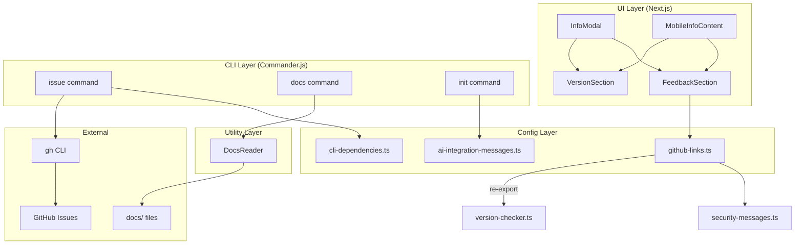
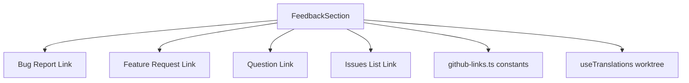

# Issue #264 設計方針書: ユーザーからの問い合わせリンク

## 1. 概要

ユーザーからの要望や質問をIssueとして効率的に登録できる仕組みを追加する。UIにフィードバックリンクを追加し、CLIにissue/docsコマンドを新設して、AIツール（Claude Code / Codex）からの利用を可能にする。

### スコープ

| 機能 | 種別 | 説明 |
|------|------|------|
| (1) FeedbackSection | UI | InfoModal/MobileInfoContentにフィードバックリンクを追加 |
| (2) issueコマンド | CLI | `commandmate issue` (gh CLI連携: create/search/list) |
| (3) AIツール連携ガイド | CLI | `commandmate init` 完了後に連携方法を表示 |
| (4) docsコマンド | CLI | `commandmate docs` (ドキュメント取得、RAG的活用) |
| (5) ドキュメント整備 | Docs | cli-setup-guide.md, support-and-feedback.md |

---

## 2. アーキテクチャ設計

### 2-1. システム構成図



### 2-2. レイヤー構成と変更箇所

| レイヤー | 変更対象 | 変更内容 |
|---------|---------|---------|
| プレゼンテーション層 | `src/components/worktree/` | FeedbackSection新規作成、WorktreeDetailRefactored.tsx組み込み |
| 設定層 | `src/config/` | github-links.ts新規作成（URL定数一元管理） |
| CLI層 | `src/cli/commands/` | issue.ts, docs.ts新規作成 |
| CLIユーティリティ層 | `src/cli/utils/` | docs-reader.ts新規作成（ドキュメント読取・検索ロジック分離） |
| CLI設定層 | `src/cli/config/` | cli-dependencies.ts更新、ai-integration-messages.ts新規作成、security-messages.ts更新 |
| i18n層 | `locales/` | worktree.json (en/ja) にfeedbackキー追加 |

---

## 3. 設計パターン

### 3-1. DRY原則: GitHub URL一元管理 (SF-001)

**設計根拠**: 現在GitHub URLが `version-checker.ts`、`security-messages.ts` に分散している。Issue #264で更にIssue URLが追加されるため、`GITHUB_REPO_BASE_URL` を定義して全URLをここから派生させる。

```typescript
// src/config/github-links.ts
export const GITHUB_REPO_BASE_URL = 'https://github.com/Kewton/CommandMate' as const;

// Issue URL定数
export const GITHUB_ISSUES_URL = `${GITHUB_REPO_BASE_URL}/issues` as const;
export const GITHUB_NEW_ISSUE_URL = `${GITHUB_REPO_BASE_URL}/issues/new` as const;

// テンプレートURL（UI用: ファイル名指定）
export const GITHUB_BUG_REPORT_URL = `${GITHUB_NEW_ISSUE_URL}?template=bug_report.md` as const;
export const GITHUB_FEATURE_REQUEST_URL = `${GITHUB_NEW_ISSUE_URL}?template=feature_request.md` as const;
export const GITHUB_QUESTION_URL = `${GITHUB_NEW_ISSUE_URL}?template=question.md` as const;

// Release URL（version-checker.tsからの移設）
export const GITHUB_RELEASE_URL_PREFIX = `${GITHUB_REPO_BASE_URL}/releases/` as const;

// Security Guide URL（security-messages.tsからの移設）
export const GITHUB_SECURITY_GUIDE_URL = `${GITHUB_REPO_BASE_URL}/blob/main/docs/security-guide.md` as const;
```

**SEC-001 SSRF防止対応**: `GITHUB_API_URL`（`https://api.github.com/repos/Kewton/CommandMate/releases/latest`）は `version-checker.ts` 内にハードコード維持。APIエンドポイントはセキュリティ上の理由から別管理とし、`GITHUB_REPO_BASE_URL` からの派生対象外とする。

**re-exportによる後方互換性維持**:
```typescript
// src/lib/version-checker.ts
export { GITHUB_RELEASE_URL_PREFIX } from '@/config/github-links';
// GITHUB_API_URL はここにハードコード維持
```

**[SF-002] security-messages.tsでの定数参照**: `REVERSE_PROXY_WARNING` 内のSecurity Guide URLは、文字列リテラルのハードコードではなく、必ず `github-links.ts` からimportした `GITHUB_SECURITY_GUIDE_URL` 定数をテンプレートリテラルで埋め込むこと。

```typescript
// src/cli/config/security-messages.ts
import { GITHUB_SECURITY_GUIDE_URL } from '../../config/github-links';

export const REVERSE_PROXY_WARNING = `
...
For more details, see: ${GITHUB_SECURITY_GUIDE_URL}
...
`;
```

**[SF-001-review] 既知のDRY違反（将来対応）**: `version-checker.ts` の `isNewerVersion` と `preflight.ts` の `compareVersions` にsemver比較ロジックの重複が存在する。Issue #264のスコープ外だが、URL一元管理と同じDRY改善の一環として、将来のリファクタリングIssueとして記録する。

### 3-2. SRP原則: FeedbackSectionの独立性 (MF-001)

**設計根拠**: VersionSectionパターン（Issue #257 SF-001）に準拠し、FeedbackSectionを独立コンポーネントとして作成。InfoModal/MobileInfoContentの両方で同一コンポーネントを使用することでDRYを達成。

**[SF-CONS-004] Props設計の補足**: VersionSectionは `version: string` と `className?: string` の2つのpropsを持つが、FeedbackSectionはデータ依存性がないため `className?: string` のみの最小限Props設計とした。「VersionSectionパターンに準拠」とは、CONS-005パターン（className propによる親の背景差異吸収）およびInfoModal/MobileInfoContent両方での共通利用パターンへの準拠を指す。

```typescript
// src/components/worktree/FeedbackSection.tsx
export interface FeedbackSectionProps {
  className?: string;  // CONS-005パターン: 親の背景差異に対応
  // データ依存性なし: VersionSectionと異なりversion等のdata propsは不要
}

export const FeedbackSection: React.FC<FeedbackSectionProps> = ({ className }) => {
  const t = useTranslations('worktree');
  // ...
};
```

### 3-3. OCP原則: 依存関係の拡張 (SF-2)

**設計根拠**: `cli-dependencies.ts` の `DEPENDENCIES` 配列にgh CLIエントリを追加するだけで、既存のPreflightCheckerが自動的にgh CLIの存在チェックを行う。OCP適用により既存コードの変更を最小化。

```typescript
// cli-dependencies.ts に追加
{ name: 'gh CLI', command: 'gh', versionArg: '--version', required: false }
```

### 3-4. Strategy パターン: issueコマンドのサブコマンド

**設計根拠**: `commandmate issue create/search/list` をcommander.jsのサブコマンドとして実装。既存の `start/stop/status` パターンに準拠。

```typescript
// src/cli/commands/issue.ts
const issueCommand = new Command('issue')
  .description('Manage GitHub issues (create, search, list)');

issueCommand
  .command('create')
  .description('Create a new GitHub issue')
  .option('--bug', 'Use bug report template')
  .option('--feature', 'Use feature request template')
  .option('--question', 'Use question template')
  .option('--title <title>', 'Issue title')
  .option('--body <body>', 'Issue body')
  .option('--labels <labels>', 'Labels (comma-separated)')
  .action(async (options: IssueCreateOptions) => { /* ... */ });
```

### 3-5. ホワイトリストパターン: docsコマンドのセクション検証

**設計根拠**: パストラバーサル防止のため、`--section` パラメータはホワイトリストに含まれるセクション名のみを受け付ける。

**[C-CONS-003] SECTION_MAPの定義箇所**: SECTION_MAPは `src/cli/utils/docs-reader.ts`（DocsReaderユーティリティ）に定義する。Section 3-6のSRP分離設計に基づき、コマンドハンドラ（`docs.ts`）ではなくDocsReader側でセクションマップを管理する。

```typescript
// src/cli/utils/docs-reader.ts（Section 3-6で詳細設計）
const SECTION_MAP: Record<string, string> = {
  'quick-start': 'docs/user-guide/quick-start.md',
  'commands': 'docs/user-guide/commands-guide.md',
  'webapp': 'docs/user-guide/webapp-guide.md',
  'workflow-examples': 'docs/user-guide/workflow-examples.md',
  'cli-setup': 'docs/user-guide/cli-setup-guide.md',
  'agents': 'docs/user-guide/agents-guide.md',
  'architecture': 'docs/architecture.md',
  'readme': 'README.md',
};
```

### 3-6. SRP原則: DocsReaderユーティリティの分離 (SF-003)

**設計根拠**: docsコマンドハンドラがファイルI/O、検索ロジック、出力フォーマットを全て担当するとSRP違反になる。ファイル読取と検索ロジックを `DocsReader` ユーティリティに抽出し、コマンドハンドラは引数解析と出力に専念させる。

```typescript
// src/cli/utils/docs-reader.ts
import * as fs from 'fs';
import * as path from 'path';

const SECTION_MAP: Record<string, string> = {
  'quick-start': 'docs/user-guide/quick-start.md',
  'commands': 'docs/user-guide/commands-guide.md',
  'webapp': 'docs/user-guide/webapp-guide.md',
  'workflow-examples': 'docs/user-guide/workflow-examples.md',
  'cli-setup': 'docs/user-guide/cli-setup-guide.md',
  'agents': 'docs/user-guide/agents-guide.md',
  'architecture': 'docs/architecture.md',
  'readme': 'README.md',
};

/**
 * パッケージルートディレクトリを解決する。
 * package.jsonの位置からルートを特定し、構造変更に対する耐性を確保する。
 */
function resolvePackageRoot(): string {
  // require.resolve で package.json の絶対パスを取得し、その親ディレクトリをルートとする
  const packageJsonPath = path.resolve(__dirname, '..', '..', 'package.json');
  return path.dirname(packageJsonPath);
}

export function getAvailableSections(): string[] {
  return Object.keys(SECTION_MAP);
}

export function isValidSection(section: string): boolean {
  return section in SECTION_MAP;
}

export function readSection(section: string): string {
  if (!isValidSection(section)) {
    throw new Error(`Invalid section: ${section}`);
  }
  const packageRoot = resolvePackageRoot();
  const filePath = path.join(packageRoot, SECTION_MAP[section]);
  return fs.readFileSync(filePath, 'utf-8');
}

/**
 * [SEC-SF-002] クエリ長制限: 最大256文字。
 * String.prototype.includes() を使用するためReDoSリスクはないが、
 * 極端に長いクエリによるパフォーマンス劣化を防止する。
 * 正規表現検索への変更は行わない（KISS原則）。
 */
const MAX_SEARCH_QUERY_LENGTH = 256;

export function searchDocs(query: string): Array<{ section: string; matches: string[] }> {
  if (query.length > MAX_SEARCH_QUERY_LENGTH) {
    throw new Error(`Search query exceeds maximum length of ${MAX_SEARCH_QUERY_LENGTH} characters`);
  }
  const results: Array<{ section: string; matches: string[] }> = [];
  const packageRoot = resolvePackageRoot();
  for (const [section, relativePath] of Object.entries(SECTION_MAP)) {
    const filePath = path.join(packageRoot, relativePath);
    try {
      const content = fs.readFileSync(filePath, 'utf-8');
      const lines = content.split('\n');
      const matches = lines.filter(line =>
        line.toLowerCase().includes(query.toLowerCase())
      );
      if (matches.length > 0) {
        results.push({ section, matches });
      }
    } catch {
      // ファイルが存在しない場合はスキップ
    }
  }
  return results;
}
```

**[SF-CONS-005] ログ出力方針**: docs/issueコマンドは `console.log` を直接使用する。これはstatusコマンドと同様に「出力のみ」を目的とするコマンドであるため、CLILoggerではなくconsole.logが適切である。CLILoggerは init/start/stop のようにサーバーライフサイクル管理を伴うコマンドで使用し、docs/issue/statusのような情報表示コマンドはconsole.logを直接使用するパターンとする。

```typescript
// src/cli/commands/docs.ts（コマンドハンドラはDocsReaderに委譲）
import {
  getAvailableSections,
  isValidSection,
  readSection,
  searchDocs,
} from '../utils/docs-reader';

// コマンドハンドラは引数解析と出力フォーマットに専念
// [SF-CONS-005] 出力のみコマンドのため console.log を直接使用（status.ts パターン準拠）
docsCommand
  .option('--section <name>', 'Show specific documentation section')
  .option('--search <query>', 'Search documentation')
  .option('--all', 'Show all section names')
  .action(async (options: DocsOptions) => {
    if (options.all) {
      const sections = getAvailableSections();
      console.log('Available sections:');
      sections.forEach(s => console.log(`  - ${s}`));
    } else if (options.section) {
      if (!isValidSection(options.section)) {
        console.error(`Unknown section: ${options.section}`);
        process.exit(ExitCode.UNEXPECTED_ERROR);
      }
      const content = readSection(options.section);
      console.log(content);
    } else if (options.search) {
      const results = searchDocs(options.search);
      // フォーマットして出力
    }
  });
```

---

## 4. コンポーネント設計

### 4-1. FeedbackSection コンポーネント



**配置先**:
- InfoModal: VersionSection直下（line 509付近）
- MobileInfoContent: VersionSection直下（line 774付近）

**スタイル設計**: 既存InfoModal情報セクションパターンに準拠

```typescript
// InfoModal内 (bg-gray-50パターン)
<FeedbackSection className="bg-gray-50 rounded-lg p-4" />

// MobileInfoContent内 (bg-whiteパターン)
<FeedbackSection className="bg-white rounded-lg border border-gray-200 p-4" />
```

**[SEC-SF-003] URL不変性の保証**: FeedbackSectionのリンクURLは全て `github-links.ts` の定数で完全定義され、ユーザー入力によるURL動的構築は一切行わない。テンプレートURL（`?template=bug_report.md` 等）のクエリパラメータもハードコード定数であり、ランタイムでの文字列連結やユーザー入力の混入は設計上排除されている。将来の変更時にこの不変性を維持するため、URLは必ず `github-links.ts` の定数をそのまま使用すること。

**外部リンクセキュリティ**: UpdateNotificationBannerパターンに準拠
```tsx
<a
  href={GITHUB_BUG_REPORT_URL}
  target="_blank"
  rel="noopener noreferrer"
  className="inline-flex items-center text-sm text-blue-600 hover:text-blue-800 underline"
>
  {t('feedback.bugReport')}
  <span className="ml-1" aria-hidden="true">&rarr;</span>
</a>
```

### 4-2. i18n翻訳キー設計

**[SF-CONS-001] 既存パターン準拠**: 既存のlocales構造に従い、`locales/en/worktree.json` と `locales/ja/worktree.json` に同一キー構造で言語別の値を定義する。1つのJSONに複数言語を混在させない。

```json
// locales/en/worktree.json に追加
{
  "feedback": {
    "title": "Feedback & Support",
    "bugReport": "Report a bug",
    "featureRequest": "Request a feature",
    "question": "Ask a question",
    "viewIssues": "View all issues"
  }
}
```

```json
// locales/ja/worktree.json に追加
{
  "feedback": {
    "title": "フィードバック・サポート",
    "bugReport": "バグを報告",
    "featureRequest": "機能を提案",
    "question": "質問する",
    "viewIssues": "Issue一覧を見る"
  }
}
```

**パリティ保証**: `tests/integration/i18n-translation-keys.test.ts` が en/ja の翻訳キー一致を自動検証するため、両ファイルに同一キー構造で追加する。

---

## 5. CLI設計

### 5-1. issueコマンド

**型定義**:
```typescript
// src/cli/types/index.ts に追加
export interface IssueCreateOptions {
  bug?: boolean;
  feature?: boolean;
  question?: boolean;
  title?: string;
  body?: string;
  labels?: string;
}

// [MF-001 YAGNI対応] IssueOptions interfaceは定義しない。
// 空のinterfaceを「将来拡張用」として事前定義することはYAGNI違反。
// issueコマンド全体のオプションが具体的に必要になった時点で追加する。

export interface DocsOptions {
  section?: string;
  search?: string;
  all?: boolean;
}
```

**gh CLI テンプレート名マッピング**:

| フラグ | gh CLI引数 | 備考 |
|--------|-----------|------|
| `--bug` | `--template "Bug Report"` | front matter name値 |
| `--feature` | `--template "Feature Request"` | front matter name値 |
| `--question` | `--template "Question"` | front matter name値 |

> **Note**: gh CLI の `--template` はファイル名（`bug_report.md`）ではなく、テンプレートのfront matter `name` フィールド値を受け取る。UI側のURLパラメータ（`template=bug_report.md`）とは形式が異なる。

**セキュリティ設計**:
- `execFile` / `spawnSync` で配列引数使用（`shell: true` 禁止）
- ユーザー入力（`--title`, `--body`）は配列引数として渡すことでシェルインジェクションを防止
- 既存 `preflight.ts` の `spawnSync(command, [args])` パターンに準拠

**[SEC-MF-001] 入力長バリデーション**: `--title` と `--body` に最大長バリデーションを実装する。gh CLIへの配列引数渡しによりシェルインジェクションは防止されるが、極端に長い入力によるDoS（プロセスメモリ圧迫、GitHub API側の拒否）リスクを考慮する。既存の `input-validators.ts` の `MAX_BRANCH_NAME_LENGTH` パターンに準拠する。

```typescript
// src/cli/commands/issue.ts 内でのバリデーション
const MAX_TITLE_LENGTH = 256;
const MAX_BODY_LENGTH = 65536;  // 64KB

if (options.title && options.title.length > MAX_TITLE_LENGTH) {
  console.error(`Title exceeds maximum length of ${MAX_TITLE_LENGTH} characters`);
  process.exit(ExitCode.UNEXPECTED_ERROR);
}
if (options.body && options.body.length > MAX_BODY_LENGTH) {
  console.error(`Body exceeds maximum length of ${MAX_BODY_LENGTH} characters`);
  process.exit(ExitCode.UNEXPECTED_ERROR);
}
```

**[SEC-SF-001] --labelsオプションのサニタイゼーション**: `--labels` オプションで受け取るカンマ区切りのラベル値に対して、制御文字およびゼロ幅文字の除去を適用する。既存の `env-setup.ts` の `sanitizeInput()` と同等のサニタイゼーションパターンに準拠する。

```typescript
// ラベル値のサニタイゼーション（制御文字・ゼロ幅文字の除去）
function sanitizeLabel(label: string): string {
  // 制御文字（U+0000-U+001F, U+007F-U+009F）およびゼロ幅文字（U+200B-U+200F, U+FEFF）を除去
  return label.replace(/[\u0000-\u001F\u007F-\u009F\u200B-\u200F\uFEFF]/g, '').trim();
}
```

**[SF-CONS-005] ログ出力方針**: issueコマンドは `console.log` を直接使用する（statusコマンドパターン準拠）。サーバーライフサイクル管理を伴わない情報表示・外部ツール連携コマンドのため、CLILoggerは使用しない。

**[SF-IMP-004] preflight.ts getInstallHint()の更新**: gh CLIを `cli-dependencies.ts` に追加する際、`preflight.ts` の `getInstallHint()` にも対応するインストールヒントを追加すること。具体的なヒント文面は以下のとおり:

```typescript
// src/cli/utils/preflight.ts の hints Record に追加
'gh': 'Install GitHub CLI: https://cli.github.com/ or brew install gh'
```

> **根拠**: `getInstallHint()` は依存チェックで missing 時にインストール方法を表示する関数であり、hints Record にエントリがない場合はフォールバックの汎用メッセージが表示される。gh CLI はオプショナル依存であるため、ユーザーフレンドリーな具体的インストールガイドを提供することが望ましい。

**ExitCode方針**:
| 状況 | ExitCode | 定数 |
|------|----------|------|
| 正常完了 | 0 | `ExitCode.SUCCESS` |
| gh CLI未インストール | 1 | `ExitCode.DEPENDENCY_ERROR` |
| 予期せぬエラー | 99 | `ExitCode.UNEXPECTED_ERROR` |

新規ExitCodeは追加しない（既存のエラーコード体系で十分カバー可能）。

### 5-2. docsコマンド

**[SF-003 SRP対応] アーキテクチャ**: docsコマンドはコマンドハンドラ（`docs.ts`）とDocsReaderユーティリティ（`docs-reader.ts`）に分離する。

- **`src/cli/utils/docs-reader.ts`**: セクションマップ管理、パス解決、ファイル読取、検索ロジック
- **`src/cli/commands/docs.ts`**: 引数解析、DocsReaderへの委譲、出力フォーマット

詳細設計は Section 3-6 を参照。

**[SF-004 KISS対応] パス解決方針**:

```typescript
// パッケージルートからの解決（構造変更に対する耐性を確保）
// dist/cli/utils/docs-reader.js から package.json の位置でルートを特定
const packageRoot = path.resolve(__dirname, '..', '..', 'package.json');
const docsBasePath = path.join(path.dirname(packageRoot), 'docs');
```

**根拠**: `path.join(__dirname, '../../../docs/')` は `tsconfig.cli.json` のコンパイル出力構造に依存しており、ディレクトリ構成の変更に脆弱である。`package.json` をアンカーとしてパッケージルートを特定することで、コンパイル出力構造の変更に耐性のあるパス解決を実現する。

> **変更前（却下）**: `path.join(__dirname, '../../../docs/')` - コンパイル出力のディレクトリ階層に依存
> **変更後（採用）**: `package.json` をアンカーとしたルート解決 - パッケージ構造に対する耐性を確保

**npm配布対応**: `package.json` の `files` フィールドに `docs/` を追加。

**[SF-IMP-002] パッケージサイズ影響の確認**: `docs/` をfilesに追加するとnpmパッケージに含まれるため、パッケージサイズが増加する。以下の点を実装時に確認すること:
- `docs/` 以下に不要なファイル（スクリーンショット、大容量画像、開発用一時ファイル等）が含まれていないこと
- `dev-reports/` ディレクトリはfilesに含めないこと（開発用レポートはnpmパッケージ不要）
- 必要に応じて `.npmignore` で `docs/` 以下の特定ファイルを除外することを検討する

### 5-3. コマンド登録とヘルプ

**[MF-CONS-001] コマンド登録パターンの設計根拠**:

既存のCLIコマンド（init/start/stop/status）は `export async function xxxCommand(options)` 形式でエクスポートし、`src/cli/index.ts` 内でインラインに `program.command('xxx').action()` で登録するパターンを使用している。

一方、issue/docsコマンドでは `createIssueCommand()` / `createDocsCommand()` ファクトリ関数で `new Command()` を返し、`program.addCommand()` で登録する **addCommandパターン** を採用する。

**パターン差異の理由**: issueコマンドはサブコマンド（`create`/`search`/`list`）を持つネストされたコマンド構造が必要であり、commander.jsの `Command` インスタンスに対して `.command()` でサブコマンドを追加する必要がある。既存の `program.command('xxx').action()` パターンではサブコマンドのネスト定義ができないため、`new Command('issue')` をファクトリ関数で生成し `addCommand` する方式が技術的に必要である。docsコマンドはサブコマンドを持たないが、issue/docs両方のコマンド登録パターンを統一する観点からaddCommandパターンに揃える。

| コマンド種別 | 登録パターン | 理由 |
|-------------|------------|------|
| init/start/stop/status | `program.command().action()` (インライン) | サブコマンドなし、既存コード |
| issue | `program.addCommand(createIssueCommand())` | サブコマンド(create/search/list)のネスト定義が必要 |
| docs | `program.addCommand(createDocsCommand())` | issueコマンドとの登録パターン統一 |

```typescript
// src/cli/index.ts
import { createIssueCommand } from './commands/issue';
import { createDocsCommand } from './commands/docs';

// [MF-CONS-001] addCommandパターン: サブコマンドを持つissue/docsはファクトリ関数で生成
program.addCommand(createIssueCommand());
program.addCommand(createDocsCommand());

// AI Tool Integration セクション
program.addHelpText('after', `
AI Tool Integration:
  Use with Claude Code or Codex to manage issues:
    commandmate issue create --bug --title "Title" --body "Description"
    commandmate issue create --question --title "How to..." --body "Details"
    commandmate docs --section quick-start
`);
```

### 5-4. AIツール連携ガイド

```typescript
// src/cli/config/ai-integration-messages.ts
export const AI_INTEGRATION_GUIDE = `
━━━ AI Tool Integration ━━━
CommandMate commands can be used from Claude Code or Codex:

  Issue management:
    commandmate issue create --bug --title "Title" --body "Description"
    commandmate issue create --feature --title "Title" --body "Description"
    commandmate issue create --question --title "Question" --body "Details"
    commandmate issue search "keyword"
    commandmate issue list

  Documentation (RAG):
    commandmate docs                    # Show all documentation sections
    commandmate docs --section <name>   # Show specific section
    commandmate docs --search <query>   # Search documentation

  Tip: Add to your CLAUDE.md or system prompt:
    "Use \\`commandmate --help\\` to see available commands."
━━━━━━━━━━━━━━━━━━━━━━━━━━━
`;
```

---

## 6. セキュリティ設計

### 6-1. セキュリティ要件

| 脅威 | 対策 | 適用箇所 |
|------|------|---------|
| SSRF (A10:2021) | URL定数はハードコード。`GITHUB_API_URL` は `version-checker.ts` 維持 | github-links.ts |
| XSS (A07:2021) | 外部リンクに `rel='noopener noreferrer'` | FeedbackSection |
| コマンドインジェクション (A03:2021) | `execFile` / `spawnSync` 配列引数使用、`shell: true` 禁止 | issue.ts |
| DoS: 入力長 (A03:2021) | `--title` 最大256文字、`--body` 最大65536文字のバリデーション (SEC-MF-001) | issue.ts |
| 入力サニタイゼーション (A03:2021) | `--labels` の制御文字・ゼロ幅文字除去 (SEC-SF-001) | issue.ts |
| パストラバーサル (A01:2021) | セクション名ホワイトリスト方式 | docs.ts, docs-reader.ts |
| ReDoS防止 (A01:2021) | 検索クエリ最大256文字制限、`String.prototype.includes()` 維持 (SEC-SF-002) | docs-reader.ts |
| URL不変性 (A05:2021) | リンクURLは全て定数で完全定義、ユーザー入力による動的構築禁止 (SEC-SF-003) | FeedbackSection |

### 6-2. Cross-Boundary Import方針

`src/config/github-links.ts` は `tsconfig.cli.json` の `include: ['src/cli/**/*']` スコープ外だが、CLI側（`security-messages.ts`）から相対パス（`../../config/github-links`）でimport可能。

**前例**: `src/cli/utils/port-allocator.ts` (line 12) が `import { AppError, ErrorCode } from '../../lib/errors'` で同パターンを使用し、`build:cli` で問題なくコンパイル確認済み。

**[C-CONS-002] コンパイル対象の技術的根拠**: `tsconfig.cli.json` の `include` は `['src/cli/**/*']` のみだが、`rootDir: './src'` が設定されているため、`src/config/` 配下のファイルもTypeScriptコンパイラの解決対象に含まれる。`include` はエントリポイントの指定であり、import先のファイルは `rootDir` の範囲内であればコンパイルされる。このため `src/cli/config/security-messages.ts` から `../../config/github-links` への相対パスimportは `build:cli` で正常にコンパイルされる。

**[MF-IMP-001] ビルド検証ブロッカー**: `github-links.ts` は新規ファイルであり、既存の前例（`port-allocator.ts` -> `../../lib/errors`）とは異なり実績がない。実装段階で `npm run build:cli` を実行し、cross-boundary importがコンパイルエラーなく通ることを必ず検証すること。この検証は実装チェックリストのブロッカー項目とする。

**フォールバック**: ビルドエラー発生時は `src/cli/config/github-links.ts` に CLI用定数を別途配置（DRY違反だがCLIビルド独立性を維持）。フォールバック戦略の適用判断は `build:cli` の検証結果に基づく。

**[SF-002] security-messages.tsの実装要件**: `REVERSE_PROXY_WARNING` 内のSecurity Guide URLは、`github-links.ts` から `GITHUB_SECURITY_GUIDE_URL` をimportし、テンプレートリテラルで参照すること。ハードコードされた文字列リテラルを残さないこと。

---

## 7. テスト設計

### 7-1. テストファイル一覧

| テストファイル | テスト対象 | テスト観点 |
|--------------|-----------|-----------|
| `tests/unit/config/github-links.test.ts` | github-links.ts | URL定数の正当性、GITHUB_REPO_BASE_URL からの派生検証 |
| `tests/unit/components/worktree/feedback-section.test.tsx` | FeedbackSection.tsx | リンク表示、テンプレートURL、rel属性 |
| `tests/unit/cli/commands/issue.test.ts` | issue.ts | gh CLIモック、テンプレート名指定、エラーハンドリング、ExitCode |
| `tests/unit/cli/commands/docs.test.ts` | docs.ts | セクション表示、検索、無効セクション拒否、パス解決 |
| `tests/unit/cli/utils/docs-reader.test.ts` | docs-reader.ts | セクション検証、ファイル読取、検索ロジック、パストラバーサル防止 |
| `tests/unit/cli/config/cli-dependencies.test.ts` | cli-dependencies.ts | gh CLI追加後の `getOptionalDependencies` 検証（更新） |

> **[SF-CONS-002/SF-CONS-003/C-CONS-001] テストファイル命名規則**: FeedbackSectionのテストファイルは `tests/unit/components/worktree/` ディレクトリに配置し（既存のworktreeコンポーネントテスト配置パターンに準拠）、拡張子は `.test.tsx`（Reactコンポーネントテストに必要なJSX対応）を使用する。ファイル名はケバブケース `feedback-section.test.tsx` とする（既存の `version-section.test.tsx`、`update-notification-banner.test.tsx` のケバブケースパターンに準拠）。

### 7-2. テスト方針

**issue.test.ts**: `spawnSync` をモックし、gh CLIへ渡される引数を検証。テンプレート名（`"Bug Report"` 等）が正しく渡されることを確認。gh未インストール時は `DEPENDENCY_ERROR(1)` で終了することを検証。**[SEC-MF-001]** --titleが256文字を超過した場合と--bodyが65536文字を超過した場合にエラー終了することを検証。**[SEC-SF-001]** --labelsに制御文字・ゼロ幅文字が含まれる場合にサニタイズされることを検証。

**docs.test.ts**: DocsReaderへの委譲が正しく行われることを検証。コマンドハンドラはDocsReaderのモックを使用してテスト。

**docs-reader.test.ts**: `fs.readFileSync` をモックし、セクション表示・検索を検証。無効セクション名（パストラバーサル試行含む）の拒否を確認。`package.json` アンカー基準のパス解決を検証。**[SEC-SF-002]** searchDocs()に256文字を超過するクエリを渡した場合にErrorがthrowされることを検証。

**[SF-IMP-001] version-checker.test.ts の re-export 影響確認**: `GITHUB_RELEASE_URL_PREFIX` を `version-checker.ts` から `github-links.ts` への re-export に変更する際、既存の `tests/unit/lib/version-checker.test.ts` で `GITHUB_RELEASE_URL_PREFIX` をimportまたはモックしているケースがあれば、re-export後もimportパスが維持されテストが通ることを確認する。現在は `validateReleaseUrl()` 関数内でのみ使用されているが、テスト側でのモック定義への影響を検証すること。

**[SF-IMP-003] cli-dependencies.test.ts の gh CLI 検証テストケース**: gh CLI追加後の `cli-dependencies.test.ts` には、以下の具体的テストケースを追加すること:
- `getOptionalDependencies()` の戻り値に `'gh CLI'` が含まれること
- gh CLI エントリの `required` が `false` であること
- gh CLI エントリの `command` が `'gh'` であること
- gh CLI エントリの `versionArg` が `'--version'` であること

**feedback-section.test.tsx**: 4つのリンクが正しいURLで表示されること、`rel='noopener noreferrer'` が付与されていること、i18nキーが正しく表示されることを検証。

**[SF-IMP-005] i18n モック方針**: `feedback-section.test.tsx` で `useTranslations` をモックする際は、既存の `VersionSection` テストパターン（`version-section.test.tsx`）を参照し、同一のモック設定方式を採用すること。モックが実際の翻訳キー構造（`feedback.title`, `feedback.bugReport` 等）と一致することを確認するため、テスト内で具体的な翻訳キーを文字列リテラルで指定し、実際のlocalesファイルとの対応関係を明確にすること。i18n-translation-keys.test.ts（結合テスト）がキーパリティを自動検証するため、翻訳キーの追加漏れはCIで検出されるが、コンポーネントテスト側でもキー名の正確性を担保する。

---

## 8. 設計上の決定事項とトレードオフ

### 8-1. 採用した設計

| 決定事項 | 理由 | トレードオフ |
|---------|------|-------------|
| `GITHUB_REPO_BASE_URL` から全URL派生 | URL分散問題の解消、リポジトリ移転時の変更箇所集約 | `GITHUB_API_URL` は SEC-001 のため対象外 |
| gh CLI `required: false` | 既存機能（start/stop/status）への影響を排除 | issueコマンドはgh未インストール時に使用不可 |
| CLI出力は英語固定 | 既存CLIコマンドとの一貫性維持（init/start/stop/statusが全て英語） | 日本語ユーザーへの利便性低下 |
| ドキュメント配置を `cli-setup-guide.md` に変更 | `commands-guide.md` はスラッシュコマンド専門、混在回避 | ドキュメント分散 |
| 新規ExitCode追加なし | 既存コード（DEPENDENCY_ERROR/UNEXPECTED_ERROR）で十分カバー | コマンド固有エラー識別不可 |
| [SF-004] `package.json` アンカーによるパス解決 | コンパイル出力構造変更への耐性確保 | `__dirname` 直接使用より1段階の間接参照が増える |
| [MF-001] IssueOptions interfaceの不作成 | YAGNI原則に従い、空interfaceの事前定義を回避 | 将来オプションが必要になった場合にinterfaceを新規作成する手間 |
| [SF-003] DocsReaderユーティリティ分離 | SRP原則に従い、コマンドハンドラとファイルI/O・検索ロジックを分離 | ファイル数が1つ増加 |
| [MF-CONS-001] issue/docsのaddCommandパターン | サブコマンド(create/search/list)のネスト定義にはCommander.js addCommandが技術的に必要 | 既存コマンド(init/start/stop/status)のインラインパターンとの差異 |
| [SF-CONS-005] docs/issueコマンドのconsole.log使用 | 出力のみコマンドはstatusパターン準拠でconsole.log直接使用 | CLILoggerを使用するinit/start/stopとの出力方式差異 |

### 8-2. 代替案との比較

**代替案1: GitHub URLをenvironment variableで管理**
- メリット: 環境ごとのカスタマイズ
- デメリット: SSRF リスク増大（SEC-001違反）
- **却下理由**: セキュリティリスクが利便性を上回る

**代替案2: issueコマンドでgh CLI不要のHTTP API直接呼び出し**
- メリット: gh CLI依存なし
- デメリット: GitHub認証トークン管理が必要、実装コスト大
- **却下理由**: gh CLIが認証を透過的に処理するため、KISS原則に従う

**代替案3: docsコマンドでファイルシステム直接読み込みではなくHTTP取得**
- メリット: npm配布時にdocs/不要
- デメリット: オフライン動作不可、ネットワーク依存
- **却下理由**: ローカル開発ツールとしてオフライン動作を優先

**代替案4 (SF-004): `path.join(__dirname, '../../../docs/')` による直接パス解決**
- メリット: 実装がシンプル
- デメリット: `tsconfig.cli.json` のコンパイル出力構造変更時にパスが壊れる
- **却下理由**: `package.json` アンカー方式の方が構造変更への耐性が高い

---

## 9. 変更影響範囲マトリクス

### 9-1. 新規ファイル

| ファイル | 責務 |
|---------|------|
| `src/config/github-links.ts` | GitHub URL定数一元管理 |
| `src/components/worktree/FeedbackSection.tsx` | フィードバックセクションUI |
| `src/cli/commands/issue.ts` | issueコマンド（gh CLI連携） |
| `src/cli/commands/docs.ts` | docsコマンド（引数解析・出力フォーマット） |
| `src/cli/utils/docs-reader.ts` | ドキュメント読取・検索ユーティリティ（SF-003 SRP分離） |
| `src/cli/config/ai-integration-messages.ts` | AIツール連携ガイドメッセージ |
| `docs/user-guide/support-and-feedback.md` | サポートガイド |

### 9-2. 変更ファイル

| ファイル | 変更内容 |
|---------|---------|
| `src/components/worktree/WorktreeDetailRefactored.tsx` | FeedbackSection組み込み |
| `src/lib/version-checker.ts` | GITHUB_RELEASE_URL_PREFIX を re-export に変更 |
| `src/cli/config/security-messages.ts` | Security Guide URL を github-links.ts からimport（SF-002: テンプレートリテラル参照必須） |
| `src/cli/config/cli-dependencies.ts` | gh CLI エントリ追加 |
| `src/cli/utils/preflight.ts` | getInstallHint() にgh CLIヒント追加（`'gh': 'Install GitHub CLI: https://cli.github.com/ or brew install gh'`）（SF-IMP-004） |
| `src/cli/index.ts` | issue/docsコマンド登録、AI連携ヘルプ追加、-i/--issue説明統一 |
| `src/cli/types/index.ts` | IssueCreateOptions/DocsOptions型追加（IssueOptionsは追加しない: MF-001） |
| `src/cli/commands/init.ts` | AI連携ガイド表示追加 |
| `locales/en/worktree.json` | feedback翻訳キー追加 |
| `locales/ja/worktree.json` | feedback翻訳キー追加 |
| `package.json` | files に docs/ 追加 |
| `docs/user-guide/cli-setup-guide.md` | issue/docsコマンド追記 |
| `docs/user-guide/commands-guide.md` | cli-setup-guide.md への参照リンク追加 |
| `CLAUDE.md` | 新規モジュール情報追記 |

### 9-3. テストファイル

| ファイル | 変更内容 |
|---------|---------|
| `tests/unit/config/github-links.test.ts` | 新規 |
| `tests/unit/components/worktree/feedback-section.test.tsx` | 新規 |
| `tests/unit/cli/commands/issue.test.ts` | 新規 |
| `tests/unit/cli/commands/docs.test.ts` | 新規（DocsReader委譲の検証） |
| `tests/unit/cli/utils/docs-reader.test.ts` | 新規（SF-003: ファイル読取・検索・パス解決の検証） |
| `tests/unit/cli/config/cli-dependencies.test.ts` | gh CLI追加に伴う更新 |

---

## 10. 制約条件

### CLAUDE.md準拠

| 原則 | 適用 |
|------|------|
| **SOLID** | SRP: FeedbackSection独立、DocsReader分離（SF-003）、OCP: cli-dependencies拡張 |
| **KISS** | gh CLI連携でIssue操作を簡素化、ホワイトリストでセキュリティ、package.jsonアンカーでパス解決（SF-004） |
| **YAGNI** | 新規ExitCode追加なし、必要最小限のURLのみ一元管理、空IssueOptionsの不作成（MF-001） |
| **DRY** | GITHUB_REPO_BASE_URL、FeedbackSection共通化、AI連携メッセージ定数化、security-messages.ts定数参照（SF-002） |
| **整合性** | CLIコマンド登録パターン差異の明示（MF-CONS-001）、i18n構造の既存パターン準拠（SF-CONS-001）、テストファイル配置・命名規則の統一（SF-CONS-002/003/C-CONS-001）、ログ出力方針の明示（SF-CONS-005） |
| **影響分析** | cross-boundary importビルド検証ブロッカー（MF-IMP-001）、re-exportテスト影響確認（SF-IMP-001）、パッケージサイズ確認（SF-IMP-002）、gh CLIテストケース明確化（SF-IMP-003）、installHint追加（SF-IMP-004）、i18nモック方針（SF-IMP-005） |
| **セキュリティ** | 入力長バリデーション（SEC-MF-001）、ラベルサニタイゼーション（SEC-SF-001）、検索クエリ長制限（SEC-SF-002）、URL不変性保証（SEC-SF-003）、OWASP Top 10準拠チェック完了 |

### セキュリティ制約

| 制約 | 根拠 |
|------|------|
| GITHUB_API_URL ハードコード維持 | SEC-001 SSRF防止 |
| gh CLI execFile配列引数使用 | コマンドインジェクション防止（OWASP A03:2021） |
| --title/--body 最大長バリデーション | DoS防止（SEC-MF-001, OWASP A03:2021） |
| --labels 制御文字・ゼロ幅文字サニタイゼーション | 入力バリデーション（SEC-SF-001, OWASP A03:2021） |
| docsセクションホワイトリスト | パストラバーサル防止（OWASP A01:2021） |
| 検索クエリ最大256文字制限 | ReDoS/パフォーマンス劣化防止（SEC-SF-002, OWASP A01:2021） |
| 外部リンク rel='noopener noreferrer' | Tabnabbing防止 |
| FeedbackSection URL不変性 | ユーザー入力によるURL動的構築禁止（SEC-SF-003, OWASP A05:2021） |

---

## 11. レビュー履歴

| ステージ | 日付 | レビュー種別 | 結果 | スコア |
|---------|------|------------|------|--------|
| Stage 1 | 2026-02-14 | 通常レビュー（設計原則） | conditionally_approved | 4/5 |
| Stage 2 | 2026-02-14 | 整合性レビュー | conditionally_approved | 4/5 |
| Stage 3 | 2026-02-14 | 影響分析レビュー | conditionally_approved | 4/5 |
| Stage 4 | 2026-02-14 | セキュリティレビュー | conditionally_approved | 4/5 |

---

## 12. レビュー指摘事項サマリー

### Stage 1: 通常レビュー指摘事項

| ID | 重要度 | 原則 | 指摘内容 | 対応状況 |
|----|--------|------|---------|---------|
| MF-001 | Must Fix | YAGNI | 空のIssueOptions interfaceは不要（将来拡張用の事前定義はYAGNI違反） | 反映済み: Section 5-1で削除、実装チェックリストに記載 |
| SF-001 | Should Fix | DRY | compareVersions重複（version-checker.ts / preflight.ts） | 反映済み: Section 3-1に既知DRY違反として記録（Issue #264スコープ外） |
| SF-002 | Should Fix | DRY | security-messages.tsでGITHUB_SECURITY_GUIDE_URLをハードコードせずimport使用 | 反映済み: Section 3-1, 6-2に実装要件として明記 |
| SF-003 | Should Fix | SRP | docsコマンドがファイルI/O・検索・出力を混在（SRP違反） | 反映済み: Section 3-6にDocsReaderユーティリティ設計を追加 |
| SF-004 | Should Fix | KISS | `__dirname` 相対パスが脆弱（コンパイル出力構造依存） | 反映済み: Section 5-2をpackage.jsonアンカー方式に変更 |

### Stage 2: 整合性レビュー指摘事項

| ID | 重要度 | 観点 | 指摘内容 | 対応状況 |
|----|--------|------|---------|---------|
| MF-CONS-001 | Must Fix | 整合性 | CLIコマンド登録パターンの不整合（addCommand vs インラインパターン） | 反映済み: Section 5-3にaddCommandパターン採用理由と既存パターンとの差異説明を追記 |
| SF-CONS-001 | Should Fix | 整合性 | i18n翻訳キー構造の不一致（1 JSONに複数言語混在の記載） | 反映済み: Section 4-2をen/ja別記載に修正 |
| SF-CONS-002 | Should Fix | 整合性 | FeedbackSectionテストファイルの拡張子不一致（.ts -> .tsx） | 反映済み: Section 7-1, 9-3のテストファイルパスを.tsxに修正 |
| SF-CONS-003 | Should Fix | 整合性 | FeedbackSectionテストファイルのディレクトリパス不一致 | 反映済み: Section 7-1, 9-3のパスをtests/unit/components/worktree/に修正 |
| SF-CONS-004 | Should Fix | 整合性 | FeedbackSectionのProps設計がVersionSectionと異なることの説明不足 | 反映済み: Section 3-2にデータ依存性なしの最小Props設計の根拠を追記 |
| SF-CONS-005 | Should Fix | 整合性 | docs/issueコマンドのログ出力方針（CLILogger vs console.log）が未明示 | 反映済み: Section 3-6, 5-1にconsole.log使用方針を追記 |
| C-CONS-001 | Consider | 整合性 | テストファイル命名規則（パスカルケース -> ケバブケース） | 反映済み: Section 7-1にケバブケースパターンの補足を追記、テストパスをfeedback-section.test.tsxに修正 |
| C-CONS-002 | Consider | 整合性 | tsconfig.cli.json cross-boundary importの技術的根拠補足 | 反映済み: Section 6-2にrootDir: './src'による解決対象の説明を追記 |
| C-CONS-003 | Consider | 整合性 | SECTION_MAPの定義箇所がSection 3-5と3-6で重複記載 | 反映済み: Section 3-5のSECTION_MAP配置先をdocs-reader.tsに修正 |

### Stage 3: 影響分析レビュー指摘事項

| ID | 重要度 | 観点 | 指摘内容 | 対応状況 |
|----|--------|------|---------|---------|
| MF-IMP-001 | Must Fix | ビルドプロセス | tsconfig.cli.json の cross-boundary import（github-links.ts）のコンパイル検証が未実施。新規ファイルのため実績なし | 反映済み: Section 6-2にビルド検証ブロッカーを追記、実装チェックリストにブロッカー項目追加 |
| SF-IMP-001 | Should Fix | テスト範囲 | version-checker.ts の re-export 変更に対する既存テストへの影響確認が必要 | 反映済み: Section 7-2にre-export影響確認の指針を追記、実装チェックリストに追加 |
| SF-IMP-002 | Should Fix | ビルドプロセス | package.json files に docs/ 追加によるパッケージサイズ増加の認識と不要ファイル確認 | 反映済み: Section 5-2にパッケージサイズ影響確認を追記、実装チェックリストに追加 |
| SF-IMP-003 | Should Fix | テスト範囲 | cli-dependencies.test.ts の gh CLI 検証テストケースが不明確 | 反映済み: Section 7-2に具体的テストケースを明記、実装チェックリストに追加 |
| SF-IMP-004 | Should Fix | 既存機能への影響 | preflight.ts getInstallHint() に gh CLI のインストールヒント文面が未定義 | 反映済み: Section 5-1に具体的なヒント文面を追記、実装チェックリストに追加 |
| SF-IMP-005 | Should Fix | テスト範囲 | feedback-section.test.tsx の i18n モックが実際の翻訳キー構造と一致する保証方法が未定義 | 反映済み: Section 7-2にi18nモック方針を追記、実装チェックリストに追加 |
| C-IMP-001 | Consider | 間接影響 | WorktreeDetailRefactored.tsx（2081行）への追加による複雑度増加。将来的にInfoModal/MobileInfoContentの分離を検討 | 記録済み: 将来リファクタリング候補として記載 |
| C-IMP-002 | Consider | 間接影響 | CLI index.ts のコマンド登録パターン混在（インライン vs addCommand）。将来コマンド増加時の統一を検討 | 記録済み: MF-CONS-001で既に文書化済み、将来の統一検討として記載 |
| C-IMP-003 | Consider | 間接影響 | docs コマンドの SECTION_MAP と実ファイルの同期維持リスク | 記録済み: 開発ガイドへのSECTION_MAP更新手順追加を将来検討として記載 |

### Stage 4: セキュリティレビュー指摘事項

| ID | 重要度 | カテゴリ | 指摘内容 | 対応状況 |
|----|--------|---------|---------|---------|
| SEC-MF-001 | Must Fix | コマンドインジェクション (A03:2021) | --title/--bodyに最大長バリデーションが未定義。DoSリスク | 反映済み: Section 5-1にMAX_TITLE_LENGTH(256)/MAX_BODY_LENGTH(65536)を追記、実装チェックリストに追加 |
| SEC-SF-001 | Should Fix | 入力バリデーション (A03:2021) | --labelsオプションの制御文字・ゼロ幅文字バリデーション未記載 | 反映済み: Section 5-1にsanitizeLabel()の設計を追記、実装チェックリストに追加 |
| SEC-SF-002 | Should Fix | パストラバーサル (A01:2021) | searchDocs()のクエリ長制限未定義。ReDoS防止観点 | 反映済み: Section 3-6にMAX_SEARCH_QUERY_LENGTH(256)を追記、実装チェックリストに追加 |
| SEC-SF-003 | Should Fix | セキュリティ設定 (A05:2021) | FeedbackSectionのURL不変性（ユーザー入力混入なし）が明示されていない | 反映済み: Section 4-1にURL不変性保証を追記、実装チェックリストに追加 |
| SEC-C-001 | Consider | 認証/認可 (A07:2021) | gh auth status事前チェックとエラーメッセージの設計が未明示 | 記録済み: 将来検討項目として記載 |
| SEC-C-002 | Consider | 機密データ保護 (A02:2021) | docs/以下のファイルに機密情報が含まれていないことの確認プロセスが未記載 | 記録済み: 将来検討項目として記載 |
| SEC-C-003 | Consider | ログ記録 (A09:2021) | issueコマンドのcreateアクションに対するセキュリティイベントログが未記載 | 記録済み: 将来検討項目として記載 |

### OWASP Top 10 チェックリスト（Stage 4）

| OWASP項目 | ステータス | 備考 |
|-----------|----------|------|
| A01: Broken Access Control | pass | SECTION_MAPホワイトリスト方式で対策済み |
| A02: Cryptographic Failures | pass | 機密データの送受信なし |
| A03: Injection | conditional_pass | 配列引数使用でインジェクション防止。入力長制限追加で対応（SEC-MF-001） |
| A04: Insecure Design | pass | gh CLI委譲パターンは既存パターン準拠 |
| A05: Security Misconfiguration | pass | required:false、GITHUB_API_URLハードコード維持 |
| A06: Vulnerable Components | pass | 新規外部依存の追加なし |
| A07: Identification and Authentication | pass | 認証はgh CLIに委譲、rel='noopener noreferrer'付与 |
| A08: Software and Data Integrity | pass | URLテンプレートはハードコード定数 |
| A09: Security Logging | pass | logSecurityEvent()パターン既存。issue createへの適用推奨（SEC-C-003） |
| A10: SSRF | pass | GITHUB_API_URLハードコード維持（SEC-001） |

### リスク評価

| カテゴリ | リスクレベル |
|---------|------------|
| 技術リスク | Low |
| セキュリティリスク | Low |
| 運用リスク | Low |

---

## 13. 実装チェックリスト

### Must Fix項目

- [ ] **[MF-001]** `src/cli/types/index.ts` に `IssueOptions` interfaceを追加しないこと。`IssueCreateOptions` と `DocsOptions` のみを追加する
- [ ] **[MF-CONS-001]** issue/docsコマンドは `createIssueCommand()` / `createDocsCommand()` ファクトリ関数 + `program.addCommand()` で登録すること。サブコマンド(create/search/list)のネスト定義に必要なaddCommandパターンであり、既存のインライン `program.command().action()` パターンとの差異が意図的であることをコード内コメントに記載する
- [ ] **[MF-IMP-001] (ブロッカー)** `src/config/github-links.ts` 作成後、`src/cli/config/security-messages.ts` から `../../config/github-links` への相対パスimportを記述し、`npm run build:cli` でコンパイルエラーが発生しないことを必ず検証すること。ビルドエラーが発生した場合は、フォールバック戦略として `src/cli/config/github-links.ts` にCLI用定数を別途配置する
- [ ] **[SEC-MF-001]** `src/cli/commands/issue.ts` の `create` アクション内で `--title`（最大256文字）と `--body`（最大65536文字）に最大長バリデーションを実装すること。`input-validators.ts` の `MAX_BRANCH_NAME_LENGTH` パターンに準拠し、超過時は `ExitCode.UNEXPECTED_ERROR` でエラーメッセージを表示して終了する

### Should Fix項目

- [ ] **[SF-001]** `compareVersions` 重複について、将来のリファクタリングIssue作成を検討する（Issue #264実装時は対応不要）
- [ ] **[SF-002]** `src/cli/config/security-messages.ts` で `GITHUB_SECURITY_GUIDE_URL` を `../../config/github-links` からimportし、`REVERSE_PROXY_WARNING` 内でテンプレートリテラルを使用すること。ハードコードされた文字列リテラルを残さない
- [ ] **[SF-003]** `src/cli/utils/docs-reader.ts` を新規作成し、SECTION_MAP管理・パス解決・ファイル読取・検索ロジックをここに集約する。`src/cli/commands/docs.ts` は引数解析と出力フォーマットのみを担当する
- [ ] **[SF-004]** docsコマンドのパス解決を `package.json` アンカー方式に変更する。`path.join(__dirname, '../../../docs/')` は使用しない
- [ ] **[SF-CONS-001]** i18n翻訳キーは `locales/en/worktree.json` と `locales/ja/worktree.json` に同一キー構造で言語別の値を定義すること。1つのJSONに複数言語を混在させない
- [ ] **[SF-CONS-002/SF-CONS-003]** FeedbackSectionのテストファイルは `tests/unit/components/worktree/feedback-section.test.tsx` に配置すること（worktreeサブディレクトリ、.tsx拡張子、ケバブケース命名）
- [ ] **[SF-CONS-004]** FeedbackSectionPropsは `className?: string` のみの最小設計とし、データ依存性がないためVersionSectionのようなdata propsを持たないこと
- [ ] **[SF-CONS-005]** docs/issueコマンドは `console.log` を直接使用すること（statusコマンドパターン準拠）。CLILoggerは使用しない
- [ ] **[SF-IMP-001]** `src/lib/version-checker.ts` の `GITHUB_RELEASE_URL_PREFIX` をre-exportに変更した後、既存の `tests/unit/lib/version-checker.test.ts` が引き続きパスすることを確認する。特にモック定義でimportパスに依存している箇所がないか検証する
- [ ] **[SF-IMP-002]** `package.json` の `files` に `docs/` を追加する際、`docs/` 以下に不要なファイル（スクリーンショット、大容量画像等）が含まれていないことを確認する。`dev-reports/` はfilesに含めないこと
- [ ] **[SF-IMP-003]** `tests/unit/cli/config/cli-dependencies.test.ts` に gh CLI の具体的検証テストを追加する: (1) `getOptionalDependencies()` に `'gh CLI'` が含まれること、(2) `required: false` であること、(3) `command: 'gh'` であること、(4) `versionArg: '--version'` であること
- [ ] **[SF-IMP-004]** `src/cli/utils/preflight.ts` の `getInstallHint()` の hints Record に gh CLI 用のエントリを追加する: `'gh': 'Install GitHub CLI: https://cli.github.com/ or brew install gh'`
- [ ] **[SF-IMP-005]** `feedback-section.test.tsx` の i18n モック設定は既存の `version-section.test.tsx` パターンに準拠すること。モック内で使用する翻訳キー（`feedback.title`, `feedback.bugReport` 等）が実際のlocalesファイルの構造と一致することを確認する
- [ ] **[SEC-SF-001]** `src/cli/commands/issue.ts` の `create` アクション内で `--labels` オプションの各ラベル値に対して制御文字（U+0000-U+001F, U+007F-U+009F）およびゼロ幅文字（U+200B-U+200F, U+FEFF）の除去処理を実装すること。既存の `env-setup.ts` の `sanitizeInput()` パターンに準拠する
- [ ] **[SEC-SF-002]** `src/cli/utils/docs-reader.ts` の `searchDocs()` 関数にクエリ最大長制限（256文字）を実装すること。超過時は `Error` をthrowする。検索は `String.prototype.includes()` を維持し、正規表現検索への変更は行わない
- [ ] **[SEC-SF-003]** `src/components/worktree/FeedbackSection.tsx` のリンクURLは全て `github-links.ts` の定数をそのまま使用すること。テンプレートリテラルやユーザー入力によるURL動的構築は禁止。コンポーネント内コメントでURL不変性の設計意図を明記する

### 既存チェック項目

- [ ] `src/config/github-links.ts` 新規作成: 全GitHub URL定数を一元管理
- [ ] `src/components/worktree/FeedbackSection.tsx` 新規作成: 4つのフィードバックリンク
- [ ] `src/cli/commands/issue.ts` 新規作成: gh CLI連携（create/search/list）、`createIssueCommand()` ファクトリ関数パターン
- [ ] `src/cli/commands/docs.ts` 新規作成: DocsReaderへの委譲、`createDocsCommand()` ファクトリ関数パターン
- [ ] `src/cli/utils/docs-reader.ts` 新規作成: ドキュメント読取・検索ユーティリティ、SECTION_MAP管理
- [ ] `src/cli/config/ai-integration-messages.ts` 新規作成: AIツール連携ガイド
- [ ] `src/lib/version-checker.ts` 更新: GITHUB_RELEASE_URL_PREFIX を re-export
- [ ] `src/cli/config/security-messages.ts` 更新: GITHUB_SECURITY_GUIDE_URL をimport参照
- [ ] `src/cli/config/cli-dependencies.ts` 更新: gh CLI エントリ追加（required: false）
- [ ] `locales/en/worktree.json` 更新: feedbackキー追加（英語値）
- [ ] `locales/ja/worktree.json` 更新: feedbackキー追加（日本語値）
- [ ] テスト作成: github-links, feedback-section(.tsx), issue, docs, docs-reader, cli-dependencies
- [ ] `package.json` 更新: files に docs/ 追加
- [ ] 外部リンクに `rel='noopener noreferrer'` を必ず付与
- [ ] `execFile` / `spawnSync` 使用時は配列引数のみ使用（`shell: true` 禁止）
- [ ] docsコマンドの `--section` パラメータはホワイトリスト検証を通すこと（SECTION_MAPは `docs-reader.ts` で管理）

### 将来検討項目（Consider）

以下はIssue #264のスコープ外だが、将来のリファクタリング候補として記録する。

- **[C-IMP-001]** WorktreeDetailRefactored.tsx（2081行）のファイルサイズ削減。InfoModal と MobileInfoContent を別ファイルに分離するリファクタリングを検討する
- **[C-IMP-002]** CLI index.ts のコマンド登録パターン統一。現在インラインパターン（init/start/stop/status）と addCommand パターン（issue/docs）が混在する。将来コマンドが増加した際にパターンを統一する方向で検討する
- **[C-IMP-003]** SECTION_MAP と docs/ ディレクトリの同期維持手順。ファイル追加・リネーム・削除時に SECTION_MAP の更新を忘れるリスクがあるため、開発ガイドに更新手順を含めるか、自動検証テストの追加を検討する
- **[SEC-C-001]** issueコマンドの `create` アクション内で `gh auth status` を事前実行し、未認証の場合は `'Please run gh auth login first'` のようなユーザーフレンドリーなメッセージを表示して `DEPENDENCY_ERROR` で終了するフローの追加を検討する
- **[SEC-C-002]** `docs/` 以下のファイルに機密情報（APIキー、認証情報、内部IPアドレス等）が含まれていないことの確認プロセスを整備する。npm配布時に `docs/` がパッケージに含まれる点を考慮し、実装チェックリストに「docs/以下のファイルに機密情報が含まれていないことの目視確認」を追加することを検討する
- **[SEC-C-003]** `issue create` は外部サービス（GitHub）への書き込み操作を伴うため、最低限 `create` アクションに `logSecurityEvent()` の使用を検討する。`search`/`list` は読み取り操作のため不要。既存の init/start/stop コマンドが使用する `logSecurityEvent()` パターンとの整合性を考慮する

---

*Generated by design-policy command for Issue #264 at 2026-02-14*
*Updated by apply-review agent (Stage 1) at 2026-02-14*
*Updated by apply-review agent (Stage 2: 整合性レビュー) at 2026-02-14*
*Updated by apply-review agent (Stage 3: 影響分析レビュー) at 2026-02-14*
*Updated by apply-review agent (Stage 4: セキュリティレビュー) at 2026-02-14*
