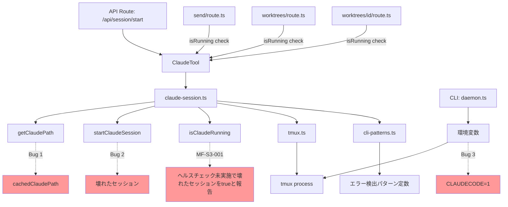

# 設計方針書: Issue #265 - Claude CLIパスキャッシュの無効化と壊れたtmuxセッションの自動回復

## 1. 概要

### 対象Issue
- **Issue #265**: fix: Claude CLIパスキャッシュの無効化と壊れたtmuxセッションの自動回復

### 問題の分類
3つの独立したバグを修正するバグフィックスIssue:

| Bug | 概要 | 影響度 |
|-----|------|--------|
| Bug 1 | `cachedClaudePath` が無効化されない | 高 - 全セッション開始が永続的に失敗 |
| Bug 2 | 壊れたtmuxセッションが放置される | 高 - 手動復旧が必要 |
| Bug 3 | `CLAUDECODE` 環境変数がtmuxセッションに継承される | 高 - Claude Codeセッション内からの起動が不可 |

### 変更対象ファイル
- `src/lib/claude-session.ts` - メイン修正対象
- `src/lib/cli-patterns.ts` - エラーパターン定数の追加 (MF-001)
- `src/cli/utils/daemon.ts` - CLAUDECODE除去（補助対策）
- `tests/unit/lib/claude-session.test.ts` - テスト追加

## 2. アーキテクチャ設計

### 影響範囲



### 影響マトリクス (Stage 3: 影響分析レビュー)

| カテゴリ | ファイル | 変更内容 | リスク |
|---------|---------|---------|--------|
| 直接変更 | `src/lib/claude-session.ts` | 新関数追加、startClaudeSession()フロー変更 | Medium |
| 直接変更 | `src/lib/cli-patterns.ts` | 定数追加のみ | Low |
| 直接変更 | `src/cli/utils/daemon.ts` | env オブジェクトからCLAUDECODE除去 | Low |
| 直接変更 | `tests/unit/lib/claude-session.test.ts` | テスト追加 | Low |
| 間接影響 | `src/lib/cli-tools/claude.ts` | startClaudeSession()のフロー変更が波及 | Medium |
| **間接影響** | **`src/app/api/worktrees/[id]/send/route.ts`** | **isRunning() true時にヘルスチェック未発動 (MF-S3-001)** | **High** |
| 間接影響 | `src/app/api/worktrees/[id]/route.ts` | isRunning()で壊れたセッションもtrueと報告 | Medium |
| 間接影響 | `src/app/api/worktrees/route.ts` | ワークツリー一覧で不正確なステータス | Medium |
| 間接影響 | `tests/integration/trust-dialog-auto-response.test.ts` | sendKeys/execモック呼び出し回数変化 | Medium |
| 間接影響 | `src/lib/cli-tools/codex.ts` | 同種バグの潜在リスク（スコープ外） | Low |

### 後方互換性 (Stage 3)

- **API互換性**: 完全互換。エンドポイントの入出力形式に変更なし
- **動作変更**:
  - `startClaudeSession()`: 壊れたセッション検出時に kill + 再作成を実行（以前は return で再利用）
  - `startClaudeSession()`: 新規セッション作成時に約100-300msの追加遅延（sanitizeSessionEnvironment()）
  - `startClaudeSession()`: 失敗時に cachedClaudePath がクリアされる（以前は残り続けた）
  - `daemon.ts start()`: CLAUDECODE環境変数がspawn対象プロセスに渡されなくなる
- **破壊的変更**: なし

### レイヤー構成（変更箇所）
- **ビジネスロジック層** (`src/lib/claude-session.ts`): Bug 1, Bug 2 の修正
- **パターン定義層** (`src/lib/cli-patterns.ts`): エラーパターン定数の追加 (MF-001)
- **インフラストラクチャ層** (`src/cli/utils/daemon.ts`): Bug 3 の補助対策

## 3. 設計パターン

### Bug 1: キャッシュ再検証 - Invalidation on Failure パターン

セッション開始失敗時にキャッシュをクリアし、次回呼び出しで再検索する。

```typescript
// src/lib/claude-session.ts

/**
 * Clear cached Claude CLI path
 * Called when session start fails to allow path re-resolution
 * on next attempt (e.g., after CLI update or path change)
 * @internal Exported for testing purposes only.
 * Follows the same pattern as version-checker.ts resetCacheForTesting().
 * Function name clearCachedClaudePath() is retained (without ForTesting suffix)
 * because it is also called in production code (catch block), not only in tests.
 * (SF-S2-005: Consistent @internal usage with version-checker.ts precedent)
 */
export function clearCachedClaudePath(): void {
  cachedClaudePath = null;
}
```

#### getClaudePath() の CLAUDE_PATH バリデーション (SEC-MF-001)

**設計決定**: `getClaudePath()` 内で `CLAUDE_PATH` 環境変数の値をバリデーションしてからキャッシュに格納する。バリデーションは `isValidClaudePath()` ヘルパー関数で実施する。

**バリデーション項目**:
1. 正規表現ホワイトリスト（`/^[/a-zA-Z0-9._-]+$/`）によるシェルメタ文字の排除
2. パストラバーサル文字列（`..`）の排除
3. `fs.access(X_OK)` による実行可能ファイルの確認

**フロー変更**:
```
getClaudePath()
  |
  v
process.env.CLAUDE_PATH 取得
  |
  v
isValidClaudePath() でバリデーション  <-- SEC-MF-001: 新規追加
  |-- 失敗 → ログ出力、fallback パスに進む
  |
  v
fs.access(X_OK) で実行権限チェック  <-- SEC-MF-001: 新規追加
  |-- 失敗 → ログ出力、fallback パスに進む
  |
  v
cachedClaudePath に格納
```

詳細な実装方針は Section 6「CLAUDE_PATH 環境変数のバリデーション」を参照。

#### キャッシュクリアの適用箇所と粒度 (MF-S2-002)

**設計決定**: `startClaudeSession()` の外側 catch ブロック内で `clearCachedClaudePath()` を一律呼び出す。

**判断根拠**:
- `getClaudePath()` 以外の失敗（createSession, capturePane, sendKeys 等）でもキャッシュがクリアされるが、**次回成功時に再キャッシュされるため無害**である
- `getClaudePath()` の呼び出しを個別の try-catch で囲む代替案は、コードの複雑さが増す割に実質的な利点がない
- キャッシュクリアのコストはゼロ（null 代入のみ）であり、不要なクリアによるデメリットは次回の `getClaudePath()` で1回だけ `which` コマンドが再実行される程度（~数ms）
- 既存の try-catch 構造（L317-380）を変更せずに済むため、既存コードへの影響が最小限

```typescript
// src/lib/claude-session.ts - startClaudeSession() 内
// MF-S2-002: Cache clear applies to all failures in catch block.
// Rationale: Clearing on non-getClaudePath failures is harmless because
// the cache will be repopulated on the next successful getClaudePath() call.
// The cost of an unnecessary cache clear is negligible (~ms for one `which` re-execution).
try {
  // ... existing logic (createSession, getClaudePath, sendKeys, polling) ...
} catch (error) {
  clearCachedClaudePath(); // MF-S2-002: Safe to clear on all failures
  // SEC-SF-002: Log detailed error server-side, throw generic message to client
  console.log(`[claude-session] Session start failed: ${getErrorMessage(error)}`);
  throw new Error('Failed to start Claude session');
}
```

**設計根拠**:
- TTLベースの定期無効化は不要な複雑さを追加する（YAGNI原則）
- 失敗時のみの無効化で十分（通常パスでは追加コスト0）
- キャッシュクリア関数を export することでテスト可能性を確保
- `@internal` JSDoc タグでテスト用途での公開であることを明記 (C-002, SF-S2-005)

### 共通ヘルパー: getCleanPaneOutput() (SF-001)

`capturePane()` + `stripAnsi()` の呼び出しパターンが複数箇所に分散している。DRY原則に従い共通ヘルパー関数として抽出する。

```typescript
// src/lib/claude-session.ts

/**
 * Capture tmux pane output and strip ANSI escape sequences
 * Consolidates the common capturePane + stripAnsi pattern (SF-001: DRY)
 *
 * @param sessionName - tmux session name
 * @param lines - Number of lines to capture (default: 50, captures from -lines)
 * @returns Clean pane output with ANSI codes removed
 */
async function getCleanPaneOutput(sessionName: string, lines: number = 50): Promise<string> {
  const output = await capturePane(sessionName, { startLine: -lines });
  return stripAnsi(output);
}
```

#### getCleanPaneOutput() の適用範囲 (MF-S2-001)

**設計決定**: `claude-session.ts` 内の全4箇所の `capturePane() + stripAnsi()` パターンを `getCleanPaneOutput()` に置換する。

**適用対象（全4箇所）**:

| # | 関数 | 行番号（参考） | 現在のコード | 置換後 |
|---|------|-------------|-------------|--------|
| 1 | `waitForPrompt()` | L271-274 | `capturePane(sessionName, { startLine: -50 })` + `stripAnsi()` | `getCleanPaneOutput(sessionName)` |
| 2 | `startClaudeSession()` 初期化ポーリング | L343 | `capturePane(sessionName, { startLine: -50 })` + `stripAnsi()` | `getCleanPaneOutput(sessionName)` |
| 3 | `sendMessageToClaude()` | L410-411 | `capturePane(sessionName, { startLine: -50 })` + `stripAnsi()` | `getCleanPaneOutput(sessionName)` |
| 4 | `isSessionHealthy()` | 新規追加 | N/A（新規関数内で直接使用） | `getCleanPaneOutput(sessionName)` |

**注**: 全4箇所とも既存の `startLine: -50` を使用しており、`getCleanPaneOutput()` のデフォルト引数 `lines = 50` と整合する。lines 引数を変更する必要がある箇所はない。

**設計根拠** (SF-001, MF-S2-001):
- `capturePane(sessionName, { startLine: -N })` + `stripAnsi(output)` のパターンが4箇所に分散している
- 全箇所で同一の lines=50 を使用しており、統一が自然
- 共通化により修正箇所を一元化し、テスト時のモック対象も削減
- `claude-session.ts` の内部関数として定義（外部公開不要）

### Bug 2: 壊れたセッションの検出と再作成 - Health Check パターン

tmuxセッション存在確認後、Claude CLIプロセスが実際に動作しているか検証する。

#### エラーパターン定数の定義 (MF-001)

`isSessionHealthy()` で使用するエラー検出パターンを `cli-patterns.ts` に定数として定義する。これにより、パターン管理の責務が `cli-patterns.ts` に一元化され、SRP と DRY の両方が満たされる。

**型宣言スタイル (SF-S2-001)**: `readonly string[] + as const` を採用する。

**選択理由**:
- `response-poller.ts` の `GEMINI_LOADING_INDICATORS`（L67）が同じスタイル（`readonly string[]`）を使用しており、先例がある
- `cli-patterns.ts` 内の既存定数（`CLAUDE_SPINNER_CHARS` 等）は型注釈なしだが、`readonly` + `as const` は型安全性が高く、新規定数には推奨される
- 既存定数のスタイル変更は本Issue のスコープ外とし、新規追加分のみ `readonly string[] + as const` を使用する

```typescript
// src/lib/cli-patterns.ts

/**
 * Error patterns that indicate a Claude session failed to start properly
 * Used by isSessionHealthy() to detect broken sessions (MF-001: SRP)
 * Style: readonly + as const for type safety (SF-S2-001: follows response-poller.ts precedent)
 *
 * SEC-SF-004: Pattern maintenance process:
 * - When Claude CLI is updated, verify that error messages still match these patterns.
 * - Test procedure: Intentionally trigger each error condition (e.g., nested session launch)
 *   and confirm the error message is captured by the patterns.
 * - If Claude CLI introduces localized error messages, add locale-aware patterns or
 *   consider switching to exit code-based detection as a more robust alternative.
 * - Pattern additions should be accompanied by corresponding test cases in
 *   claude-session.test.ts.
 */
export const CLAUDE_SESSION_ERROR_PATTERNS: readonly string[] = [
  'Claude Code cannot be launched inside another Claude Code session',
] as const;

/**
 * Regex patterns for Claude session errors requiring context matching
 * Used by isSessionHealthy() for multi-condition error detection (MF-001: SRP)
 * Style: readonly + as const for type safety (SF-S2-001: follows response-poller.ts precedent)
 *
 * SEC-SF-004: See CLAUDE_SESSION_ERROR_PATTERNS JSDoc for pattern maintenance process.
 */
export const CLAUDE_SESSION_ERROR_REGEX_PATTERNS: readonly RegExp[] = [
  /Error:.*Claude/,
] as const;
```

#### シェルプロンプト検出パターンの定義 (MF-002)

シェルプロンプトの判定をハードコードせず、拡張可能な定数配列として定義する。これにより bash 以外のシェル（zsh の `%`、root の `#` 等）にも関数本体を変更せずに対応可能になる（OCP準拠）。

**配置先の決定 (SF-S2-002)**: `claude-session.ts` 内のプライベート定数として定義する。

**選択理由**:
- `SHELL_PROMPT_ENDINGS` は `isSessionHealthy()` でのみ使用される
- ISP（インターフェース分離原則）および最小公開原則に従い、使用箇所と同じファイルに配置する
- `cli-patterns.ts` に配置すると、他モジュールから不要にアクセス可能になる
- 将来的に他のCLIツール（codex.ts 等）でも同様のヘルスチェックが必要になった場合は、その時点で `cli-patterns.ts` への移動を検討する

```typescript
// src/lib/claude-session.ts (プライベート定数)

/**
 * Shell prompt ending characters for detecting shell-only tmux sessions
 * Extensible array to support multiple shell types (MF-002: OCP)
 * Placed in claude-session.ts as private constant (SF-S2-002: ISP - used only by isSessionHealthy())
 * - '$': bash/sh default prompt
 * - '%': zsh default prompt
 * - '#': root prompt (bash/zsh)
 */
const SHELL_PROMPT_ENDINGS: readonly string[] = ['$', '%', '#'] as const;
```

#### isSessionHealthy() の実装方針

```typescript
// src/lib/claude-session.ts

import {
  CLAUDE_SESSION_ERROR_PATTERNS,
  CLAUDE_SESSION_ERROR_REGEX_PATTERNS,
} from './cli-patterns';
// Note: SHELL_PROMPT_ENDINGS is a private constant in this file (SF-S2-002)

/**
 * Verify that Claude CLI is actually running inside a tmux session
 * Detects broken sessions where tmux exists but Claude failed to start
 *
 * @param sessionName - tmux session name
 * @returns true if Claude CLI is responsive (prompt detected or initializing)
 */
async function isSessionHealthy(sessionName: string): Promise<boolean> {
  try {
    // SF-001: Use shared helper instead of inline capturePane + stripAnsi
    const cleanOutput = await getCleanPaneOutput(sessionName);

    // MF-001: Check error patterns from cli-patterns.ts (SRP - pattern management centralized)
    for (const pattern of CLAUDE_SESSION_ERROR_PATTERNS) {
      if (cleanOutput.includes(pattern)) {
        return false;
      }
    }
    for (const regex of CLAUDE_SESSION_ERROR_REGEX_PATTERNS) {
      if (regex.test(cleanOutput)) {
        return false;
      }
    }

    // MF-002: Check shell prompt endings from extensible array (OCP)
    const trimmed = cleanOutput.trim();
    // C-S2-001: Empty output means tmux session exists but Claude CLI has no output.
    // This is treated as unhealthy because a properly running Claude CLI always
    // produces output (prompt, spinner, or response). An empty pane indicates
    // the CLI process has exited or failed to start.
    if (trimmed === '') {
      return false;
    }
    if (SHELL_PROMPT_ENDINGS.some(ending => trimmed.endsWith(ending))) {
      return false;
    }

    return true;
  } catch {
    return false;
  }
}
```

**適用箇所**:
1. `startClaudeSession()` で `hasSession()` が true を返した場合、`isSessionHealthy()` で検証し、異常ならセッションを kill して再作成する
2. **`isClaudeRunning()` 内でもヘルスチェックを実施** (MF-S3-001): `hasSession()` が true でも壊れたセッションの場合は false を返す

#### isClaudeRunning() のヘルスチェック統合 (MF-S3-001)

**問題**: `isClaudeRunning()` (L224-227) は `hasSession()` のみで判定しており、壊れたセッションを「実行中」と報告し続ける。これにより、`send/route.ts` (L95-100) では `isRunning()` が true のため `startSession()` をスキップし、壊れたセッションに対して `sendMessage()` を試みてエラーになるパスが存在する。

**影響を受けるAPIルート**:
- `src/app/api/worktrees/[id]/send/route.ts` (L95-100) - **最もリスクが高い**: isRunning() true時にstartSession()をスキップ
- `src/app/api/worktrees/[id]/route.ts` (L48)
- `src/app/api/worktrees/route.ts` (L48)
- `src/app/api/worktrees/[id]/current-output/route.ts` (L47)
- `src/app/api/worktrees/[id]/prompt-response/route.ts` (L57)
- `src/app/api/worktrees/[id]/kill-session/route.ts` (L61)
- `src/app/api/worktrees/[id]/interrupt/route.ts` (L67)
- `src/app/api/repositories/route.ts` (L33)

**設計決定**: 方式(A) `isClaudeRunning()` 内でヘルスチェックを実施し、壊れたセッションでは false を返す。

```typescript
// src/lib/claude-session.ts

/**
 * Check if Claude CLI is running in the tmux session
 * MF-S3-001: Includes health check to prevent reporting broken sessions as running.
 * Without this, API routes (especially send/route.ts) would skip startSession()
 * for broken sessions and attempt to send messages to a non-functional CLI.
 *
 * Performance: adds ~50ms overhead (capturePane + pattern match) per call.
 * This is acceptable given that API route response times are typically 100-500ms.
 *
 * @param sessionName - tmux session name
 * @returns true only if session exists AND Claude CLI is healthy
 */
export async function isClaudeRunning(sessionName: string): Promise<boolean> {
  const exists = await hasSession(sessionName);
  if (!exists) {
    return false;
  }
  // MF-S3-001: Verify session health to avoid reporting broken sessions as running
  return isSessionHealthy(sessionName);
}
```

**方式(B)の却下理由**: `send/route.ts` で `isRunning()` が true の場合にも `ensureHealthySession()` を呼ぶガード処理を追加する方式は、全8箇所のAPIルートを個別に修正する必要があり、修正漏れのリスクが高い。方式(A)は `isClaudeRunning()` 1箇所の修正で全APIルートに効果が波及するため、よりシンプルかつ安全。

**パフォーマンス影響**: 各 `isRunning()` 呼び出しにヘルスチェックのオーバーヘッド（約50ms）が加わるが、APIルートのレスポンスタイムに対して十分小さいため許容範囲。

**設計根拠**:
- 既存の `hasSession()` は tmux レベルの存在確認のみで、Claude の動作状態は不明
- ヘルスチェックを独立関数として切り出すことで SRP を維持
- 既存フローへの影響を最小限に抑えつつ、壊れたセッションを自動回復
- エラーパターンを `cli-patterns.ts` に定数として定義し、パターン管理を一元化 (MF-001)
- シェルプロンプト判定を定数配列化し、新シェル対応時の変更を不要に (MF-002)
- 空出力判定の意図をコード内コメントで明記 (C-S2-001)
- シェルプロンプト誤検出リスクは実用上無視可能（C-S2-002: Claude CLI正常動作時に末尾が `$`/`%`/`#` で終わるケースは極めて稀）
- **MF-S3-001**: `isClaudeRunning()` でもヘルスチェックを実施し、全APIルートが壊れたセッションを正しく検出できるようにする
- **SEC-SF-004**: パターンマッチングの限界は認識した上で、既存の `CLAUDE_INIT_TIMEOUT`（15秒）がフォールバックとして機能する。パターン検出漏れ（false-positive）が発生しても、最大15秒でタイムアウトエラーとして検出される。詳細は Section 6「isSessionHealthy() のパターンマッチング回避リスクへの防御設計」を参照

### Bug 2 補足: startClaudeSession() の責務分離 (SF-002)

Bug 2（ヘルスチェック + kill + 再作成）と Bug 3（CLAUDECODE 除去の2段階処理）の追加により `startClaudeSession()` の責務が過大になるリスクがある。SRP を維持するため、以下のヘルパー関数への分離を行う。

#### ensureHealthySession() - セッション健全性保証

```typescript
// src/lib/claude-session.ts

/**
 * Ensure the existing tmux session has a healthy Claude CLI process
 * If unhealthy, kill the session so it can be recreated
 * (SF-002: SRP - session health management separated from session creation)
 *
 * @param sessionName - tmux session name
 * @returns true if session is healthy and can be reused, false if it was killed
 */
async function ensureHealthySession(sessionName: string): Promise<boolean> {
  const healthy = await isSessionHealthy(sessionName);
  if (!healthy) {
    await killSession(sessionName);
    return false;
  }
  return true;
}
```

#### ensureHealthySession() のフロー制御 (SF-S2-004)

**設計決定**: `ensureHealthySession()` が `false` を返した場合（killSession 後）、既存の try ブロック内のセッション作成ロジック（L317以降）にフォールスルーする。

**具体的なフロー制御**:

```typescript
// src/lib/claude-session.ts - startClaudeSession() 内
// SF-S2-004: Explicit flow control for ensureHealthySession()

export async function startClaudeSession(sessionName: string, ...): Promise<void> {
  // Step 1: Check if session already exists
  const sessionExists = await hasSession(sessionName);

  if (sessionExists) {
    // Step 2: Health check on existing session
    const isHealthy = await ensureHealthySession(sessionName);
    if (isHealthy) {
      // Existing session is healthy, reuse it (same as existing early return at L312-315)
      return;
    }
    // If not healthy, ensureHealthySession() already killed the session.
    // Fall through to the session creation logic below.
    // (SF-S2-004: Explicit fall-through instead of hidden re-entry)
  }

  // Step 3: Create new session (existing try block logic, L317-380)
  try {
    await createSession(sessionName);

    // Step 3a: Sanitize environment (SF-S2-003: after createSession, before sendKeys(claudePath))
    await sanitizeSessionEnvironment(sessionName);

    const claudePath = await getClaudePath();
    await sendKeys(sessionName, claudePath, true);
    // ... remaining initialization polling logic ...
  } catch (error) {
    clearCachedClaudePath(); // MF-S2-002
    // SEC-SF-002: Log detailed error server-side, throw generic message to client
    console.log(`[claude-session] Session start failed: ${getErrorMessage(error)}`);
    throw new Error('Failed to start Claude session');
  }
}
```

**設計根拠** (SF-S2-004):
- 既存の `hasSession() === true` 時の早期 return（L312-315）を拡張し、ヘルスチェック結果に応じた分岐を明示的に記述
- `ensureHealthySession()` が `false` を返した場合は既存の try ブロック内のセッション作成ロジックにフォールスルーする
- 新しいセッション作成ロジックを別途用意する必要はなく、既存コードの再利用で済む
- フォールスルーの意図をコメントで明記し、保守性を確保

#### sanitizeSessionEnvironment() - 環境変数サニタイズ

```typescript
// src/lib/claude-session.ts

/**
 * Remove CLAUDECODE environment variable from tmux session environment
 * Prevents Claude Code from detecting nested session and refusing to start
 * (SF-002: SRP - environment sanitization separated from session creation)
 *
 * MF-S3-002: tmux set-environment -g -u operates on the global tmux environment.
 * Impact analysis:
 * - CLAUDECODE is a Claude Code-specific variable, so Codex/Gemini sessions
 *   (CLI_TOOL_IDS: ['claude', 'codex', 'gemini']) are NOT affected by its removal.
 * - Multiple Claude sessions concurrently calling unset (-g -u) is safe because
 *   the unset operation is idempotent (unsetting an already-unset variable is a no-op).
 * - Future consideration: If more tmux global environment operations are added for
 *   other CLI tools, migrate to session-scoped set-environment (without -g flag)
 *   to avoid potential cross-tool conflicts.
 *
 * SEC-SF-001: sessionName is validated by the caller chain:
 * ClaudeTool.startSession() -> BaseCLITool.getSessionName() -> validateSessionName()
 * This ensures sessionName contains only safe characters (alphanumeric + hyphen).
 * Future improvement: Move validation into tmux.ts functions for defense-in-depth.
 *
 * SEC-SF-003: Migration trigger for session-scoped set-environment (without -g flag):
 * - When sanitization of additional environment variables (e.g., CODEX_*, GEMINI_*)
 *   is required, migrate to session-scoped operations to prevent cross-session side effects.
 * - When multiple tmux global environment operations are added, evaluate whether
 *   concurrent modifications from different sessions could cause race conditions.
 * - Current scope (CLAUDECODE only) is safe with global scope due to idempotent unset.
 *
 * @param sessionName - tmux session name
 */
async function sanitizeSessionEnvironment(sessionName: string): Promise<void> {
  // 対策 3-1: tmux グローバル環境から除去
  // MF-S3-002: -g flag affects global tmux environment.
  // Safe because: (1) CLAUDECODE is Claude-specific, (2) unset is idempotent.
  // SEC-SF-003: See JSDoc for migration triggers to session-scoped operations.
  await execAsync('tmux set-environment -g -u CLAUDECODE 2>/dev/null || true');

  // 対策 3-2: セッション内で unset（SF-004 検証結果に基づき判断）
  // 注意: この処理の必要性は対策 3-1 のみのテストケースで検証すること
  // 100ms 待機は sendKeys のコマンド実行完了を確認するための経験的値
  // 根拠: tmux の sendKeys は非同期で、コマンドがシェルに到達するまでの遅延を考慮
  // SF-S3-004: 100ms待機はCLAUDE_INIT_TIMEOUT (15000ms) の1.7%であり許容範囲
  await sendKeys(sessionName, 'unset CLAUDECODE', true);
  await new Promise(resolve => setTimeout(resolve, 100));
}
```

#### sanitizeSessionEnvironment() の呼び出し位置 (SF-S2-003)

**設計決定**: `createSession()` の直後、`sendKeys(claudePath)` の直前に呼び出す。

**呼び出し位置の根拠**:
1. `createSession()` の後でないと、tmux セッションが存在しないため `sendKeys` が失敗する
2. `sendKeys(claudePath)` の前に実行しないと、Claude CLI 起動時に `CLAUDECODE` 環境変数が残り、ネスト検出エラーが発生する
3. `getClaudePath()` の前後は影響しない（パス解決は環境変数に依存しない）

```
createSession(sessionName)
  |
  v
sanitizeSessionEnvironment(sessionName)  <-- SF-S2-003: ここで呼び出す
  |
  v
getClaudePath()
  |
  v
sendKeys(sessionName, claudePath, true)
  |
  v
初期化ポーリングループ
```

**設計根拠** (SF-002):
- `startClaudeSession()` は現在約80行あり、Bug 2/Bug 3 の追加で100行超になるリスク
- セッション健全性チェックと環境変数サニタイズは独立した責務
- ヘルパー関数への分離により、テスト対象の粒度が細かくなる
- 各関数が単一の責務を持つことで可読性・保守性が向上

### Bug 3: CLAUDECODE環境変数の除去 - Environment Sanitization パターン

2段階の対策で確実に除去する。ただし SF-004 の指摘に基づき、対策 3-1 のみで十分かの検証を行う。

**対策 3-1**: tmuxセッション作成時にグローバル環境から除去

```typescript
// sanitizeSessionEnvironment() 内
await execAsync('tmux set-environment -g -u CLAUDECODE 2>/dev/null || true');
```

**対策 3-2**: tmuxセッション内でClaude起動前に `unset CLAUDECODE` を送信

```typescript
// sanitizeSessionEnvironment() 内
await sendKeys(sessionName, 'unset CLAUDECODE', true);
// 100ms 待機: sendKeys の非同期実行完了を確認するための経験的値
// 根拠: tmux の sendKeys はキー入力のエンキューのみで、シェルでの実行完了を保証しない
// この待機により、unset コマンドがシェルに到達・実行される時間を確保する
await new Promise(resolve => setTimeout(resolve, 100));
```

**SF-004 検証方針**:
- 対策 3-1 のみで十分かどうかを検証するテストケースを追加する
- テスト結果に基づき、対策 3-2 が不要であれば削除して KISS を優先する
- 対策 3-2 を残す場合は、100ms の待機理由と根拠をコード内コメントに明記する（既存の DOC パターンを踏襲）

**daemon.ts での補助対策** (SF-003):

```typescript
// src/cli/utils/daemon.ts - start() メソッド内
// SF-003: process.env への直接操作ではなく、spawn に渡す env オブジェクトから除去する
const env = { ...process.env, /* other env vars */ };
delete env.CLAUDECODE;  // env オブジェクトから除去（process.env は変更しない）
// この env を spawn() に渡す
```

**設計根拠**:
- 対策3-1でtmuxグローバル環境の汚染を防止（根本対策）
- 対策3-2でセッション単位の確実な除去（セーフティネット。SF-004 検証結果で判断）
- `daemon.ts` での除去は spawn に渡す env オブジェクトのみを制御（SF-003: DIP準拠）
  - `process.env` を直接変更するとグローバルな副作用が生じるため回避
  - `DaemonManager.start()` 内で既に env オブジェクトを構築するパターンが確立されている
- `2>/dev/null || true` で tmux サーバーが未起動の場合のエラーを無視

## 4. データモデル設計

本Issueではデータモデルの変更なし。

## 5. API設計

本Issueでは API の変更なし。既存の `/api/session/start` エンドポイントの動作が改善される。

## 6. セキュリティ設計

### 環境変数操作のセキュリティ
- `CLAUDECODE` 変数の除去は `tmux set-environment -g -u` コマンドで実行
- セッション名は既存の `getSessionName()` でサニタイズ済み
- `execAsync` 呼び出しにはタイムアウトを設定

### コマンドインジェクション防止
- 新規追加する `execAsync` 呼び出しは固定文字列のみ使用
- ユーザー入力を含むコマンド構築なし

### CLAUDE_PATH 環境変数のバリデーション (SEC-MF-001)

**問題**: `getClaudePath()` は `process.env.CLAUDE_PATH` の値を検証せずにそのまま `cachedClaudePath` に格納し、`sendKeys()` 経由で tmux コマンドとして実行される。悪意のある環境変数値（例: `'/bin/sh -c "malicious command" #'`）が設定された場合、任意コマンド実行が可能。

**OWASP分類**: A03:2021 - Injection

**対策**: `getClaudePath()` 内で `CLAUDE_PATH` 環境変数の値に対して以下のバリデーションを実施する。

```typescript
// src/lib/claude-session.ts - getClaudePath() 内

/**
 * Validate CLAUDE_PATH environment variable to prevent command injection
 * SEC-MF-001: OWASP A03:2021 - Injection prevention
 *
 * @param claudePath - Value from process.env.CLAUDE_PATH
 * @returns true if the path is safe to use
 */
function isValidClaudePath(claudePath: string): boolean {
  // (1) Whitelist validation: only allow alphanumeric, path separators, dots, hyphens, underscores
  // SEC-MF-001: Rejects shell metacharacters (;, |, &, $, `, newlines, spaces in dangerous positions, etc.)
  const SAFE_PATH_PATTERN = /^[/a-zA-Z0-9._-]+$/;
  if (!SAFE_PATH_PATTERN.test(claudePath)) {
    console.log(`[claude-session] CLAUDE_PATH contains invalid characters, ignoring: ${claudePath.substring(0, 50)}`);
    return false;
  }

  // (2) Path traversal prevention: reject ../ sequences
  // SEC-MF-001: Prevents path traversal attacks
  if (claudePath.includes('..')) {
    console.log('[claude-session] CLAUDE_PATH contains path traversal sequence, ignoring');
    return false;
  }

  return true;
}
```

**実行可能ファイルの確認**: `isValidClaudePath()` によるホワイトリスト検証を通過した後、既存の `fallbackPaths` と同様に `fs.access(claudePath, fs.constants.X_OK)` による実行権限チェックを実施する。

```typescript
// src/lib/claude-session.ts - getClaudePath() 内
// SEC-MF-001: Apply validation before using CLAUDE_PATH

const envClaudePath = process.env.CLAUDE_PATH;
if (envClaudePath) {
  if (isValidClaudePath(envClaudePath)) {
    try {
      await fs.access(envClaudePath, fs.constants.X_OK);
      cachedClaudePath = envClaudePath;
      return cachedClaudePath;
    } catch {
      console.log(`[claude-session] CLAUDE_PATH is not executable: ${envClaudePath}`);
      // Fall through to fallback paths
    }
  }
  // If validation fails, ignore CLAUDE_PATH and proceed with fallback resolution
}
```

**設計根拠**:
- ホワイトリスト方式（`/^[/a-zA-Z0-9._-]+$/`）を採用することで、未知のシェルメタ文字にも対応可能
- ブラックリスト方式（特定文字の排除）は排除漏れのリスクがあるため不採用
- パストラバーサル（`../`）の明示的チェックは Defense in Depth として追加
- `fs.access(X_OK)` チェックにより、存在しないパスや非実行ファイルも拒否される
- バリデーション失敗時はログ出力して fallback パスにフォールスルーし、サービス可用性を維持

### sessionName のバリデーション一元化 (SEC-SF-001)

**問題**: `claude-session.ts` 内の `getSessionName()` には `validateSessionName()` 呼び出しがない。`BaseCLITool.getSessionName()` にのみ存在する。`sendKeys(sessionName, ...)` は sessionName を tmux コマンドに埋め込むため、未検証の sessionName はインジェクションリスクとなる。

**OWASP分類**: A03:2021 - Injection

**対策**: tmux.ts 内の各関数（`sendKeys()`, `capturePane()`, `hasSession()`, `killSession()` 等）で sessionName を受け取る際にバリデーションを一元的に実施する方式を推奨する。ただし、tmux.ts の変更は Issue #265 のスコープ外の可能性があるため、段階的に対応する。

**Issue #265 スコープ内の対策**:
- `sanitizeSessionEnvironment()` 内の `sendKeys(sessionName, 'unset CLAUDECODE', true)` で使用される `sessionName` は、`startClaudeSession()` の引数として受け取ったものであり、呼び出し元（`ClaudeTool.startSession()`）で `getSessionName()` → `BaseCLITool.getSessionName()` → `validateSessionName()` を経由して検証済みである
- この呼び出しチェーンの安全性を JSDoc コメントで明記する

```typescript
// src/lib/claude-session.ts - sanitizeSessionEnvironment() JSDoc追記
/**
 * ...existing JSDoc...
 *
 * SEC-SF-001: sessionName is validated by the caller chain:
 * ClaudeTool.startSession() -> BaseCLITool.getSessionName() -> validateSessionName()
 * This ensures sessionName contains only safe characters (alphanumeric + hyphen).
 * Future improvement: Move validation into tmux.ts functions for defense-in-depth.
 */
```

**将来検討**: tmux.ts 内の `sendKeys()` / `capturePane()` 等に sessionName バリデーションを追加し、呼び出し元に依存しない防御的プログラミングを実現する。これは Issue #265 のスコープ外として別 Issue で対応。

### エラーメッセージの情報漏洩防止 (SEC-SF-002)

**問題**: `startClaudeSession()` の catch ブロックで `throw new Error('Failed to start Claude session: ' + getErrorMessage(error))` としており、内部のファイルパス（`cachedClaudePath` の値）やシステム情報がエラーメッセージに含まれる可能性がある。これらのエラーは API ルート経由でクライアントに返却される（`send/route.ts` L120）。

**OWASP分類**: A04:2021 - Insecure Design

**Issue #265 スコープ内の対策**:
- Bug 1 修正で追加する `clearCachedClaudePath()` により、失敗後のキャッシュパスは除去される（ログ出力時点では残る可能性あり）
- `startClaudeSession()` の catch ブロックのエラーメッセージにはファイルパスを明示的に含めないことを設計方針とする

```typescript
// src/lib/claude-session.ts - startClaudeSession() catch block
// SEC-SF-002: Error message should not expose internal paths or system info.
// Server-side logging retains full details; client-facing message is generic.
catch (error) {
  clearCachedClaudePath(); // Bug 1 fix
  // Log detailed error for debugging (server-side only)
  console.log(`[claude-session] Session start failed: ${getErrorMessage(error)}`);
  // Throw generic message to prevent information leakage to client
  throw new Error('Failed to start Claude session');
}
```

**注意**: この対策は Issue #265 の catch ブロック変更に合わせて実施するのが効率的である。ただし、既存の他の catch ブロックでも同様のパターンが存在する可能性があるため、包括的な対応は別 Issue での検討が望ましい。API レイヤー（`send/route.ts` 等）でのエラーメッセージサニタイズは Issue #265 のスコープ外とする。

### tmux set-environment グローバルスコープの移行トリガー明確化 (SEC-SF-003)

**問題**: `sanitizeSessionEnvironment()` の `tmux set-environment -g -u` はグローバル tmux 環境に影響を与える。現時点では CLAUDECODE のみの除去であり安全だが、将来的にサニタイズ対象が増えた場合のセッション単位移行のトリガーが不明確。

**OWASP分類**: A05:2021 - Security Misconfiguration

**対策**: `sanitizeSessionEnvironment()` のコードコメントに、セッション単位の `set-environment`（`-g` フラグなし）への移行を検討すべきトリガー条件を明記する。

```typescript
// src/lib/claude-session.ts - sanitizeSessionEnvironment() 内コメント
// SEC-SF-003: Migration trigger for session-scoped set-environment (without -g flag):
// - When sanitization of additional environment variables (e.g., CODEX_*, GEMINI_*)
//   is required, migrate to session-scoped operations to prevent cross-session side effects.
// - When multiple tmux global environment operations are added, evaluate whether
//   concurrent modifications from different sessions could cause race conditions.
// - Current scope (CLAUDECODE only) is safe with global scope due to idempotent unset.
```

### isSessionHealthy() のパターンマッチング回避リスクへの防御設計 (SEC-SF-004)

**問題**: `isSessionHealthy()` はエラーパターンの文字列マッチング（`includes`, `regex.test`）に依存する。Claude CLI のエラーメッセージが変更された場合やロケールによって異なるメッセージが出力された場合、壊れたセッションを健全と誤判定する可能性がある。

**OWASP分類**: A04:2021 - Insecure Design

**対策（2点）**:

**(1) CLAUDE_SESSION_ERROR_PATTERNS の更新プロセスのドキュメント化**:

`cli-patterns.ts` の `CLAUDE_SESSION_ERROR_PATTERNS` / `CLAUDE_SESSION_ERROR_REGEX_PATTERNS` の JSDoc コメントに、パターン更新の手順とトリガーを明記する。

```typescript
// src/lib/cli-patterns.ts - CLAUDE_SESSION_ERROR_PATTERNS JSDoc追記
/**
 * ...existing JSDoc...
 *
 * SEC-SF-004: Pattern maintenance process:
 * - When Claude CLI is updated, verify that error messages still match these patterns.
 * - Test procedure: Intentionally trigger each error condition (e.g., nested session launch)
 *   and confirm the error message is captured by the patterns.
 * - If Claude CLI introduces localized error messages, add locale-aware patterns or
 *   consider switching to exit code-based detection as a more robust alternative.
 * - Pattern additions should be accompanied by corresponding test cases in
 *   claude-session.test.ts.
 */
```

**(2) false-positive 時のフォールバックメカニズムの設計書明記**:

`isSessionHealthy()` が壊れたセッションを健全と誤判定（false-positive）した場合でも、既存の `CLAUDE_INIT_TIMEOUT`（15秒）によるタイムアウトがフォールバックとして機能することを設計書に明記する。

**フォールバックフロー**:
```
isSessionHealthy() が false-positive（壊れたセッションを健全と誤判定）
  |
  v
startClaudeSession() は既存セッションを再利用しようとする
  |
  v
sendMessageToClaude() が壊れたセッションにメッセージを送信
  |
  v
応答なし → CLAUDE_INIT_TIMEOUT (15秒) でタイムアウト → エラー
  |
  v
catch ブロックで clearCachedClaudePath() が実行される
  |
  v
ユーザーが再試行 → 新規セッション作成で復旧
```

**設計根拠**: パターンマッチング方式の限界は認識した上で、既存のタイムアウト機構が「最終防衛線」として機能する。パターンマッチングの即座の検出（~50ms）とタイムアウトによる遅延検出（~15秒）の2段階構成により、検出漏れがあっても最大15秒でエラーとして報告される。これにより、パターンの完全性に依存しない堅牢な設計となる。

### OWASP Top 10 チェックリスト (Stage 4)

| OWASP カテゴリ | ステータス | 備考 |
|---------------|-----------|------|
| A01: Broken Access Control | N/A | 認証・認可に関する変更なし |
| A02: Cryptographic Failures | N/A | 暗号化処理の変更なし |
| A03: Injection | 条件付きPass | SEC-MF-001（CLAUDE_PATH バリデーション追加で対応）、SEC-SF-001（sessionName 検証チェーンの確認で対応） |
| A04: Insecure Design | Pass | SEC-SF-002（エラーメッセージサニタイズ）、SEC-SF-004（パターンマッチング回避リスクの防御設計）で対応 |
| A05: Security Misconfiguration | Pass | SEC-SF-003（グローバルスコープ移行トリガーの明確化）で対応 |
| A06: Vulnerable Components | N/A | 外部ライブラリの追加なし |
| A07: Auth Failures | N/A | 認証・セッション管理（HTTP）の変更なし |
| A08: Software Data Integrity | Pass | キャッシュクリアは null 代入のみ。デシリアライゼーション処理なし |
| A09: Logging & Monitoring | Pass | 既存パターン踏襲。SEC-C-003 でログ追加を将来検討 |
| A10: SSRF | N/A | サーバーサイドリクエスト発行の変更なし |

### リスク評価 (Stage 4)

| リスク領域 | 評価 | 根拠 |
|-----------|------|------|
| 技術リスク | Low | 既存パターンの拡張であり、新規アーキテクチャの導入なし |
| セキュリティリスク | Medium | SEC-MF-001 対応前は CLAUDE_PATH 経由のインジェクションリスクあり。対応後は Low に低下 |
| 運用リスク | Low | 自動回復により手動介入が減少 |

## 7. パフォーマンス設計

### 通常パスへの影響

| 処理 | 追加コスト | 条件 |
|------|-----------|------|
| Bug 1: キャッシュクリア | 0ms | 失敗時のみ実行 |
| Bug 2: ヘルスチェック（startClaudeSession内） | ~50ms | 既存セッションが見つかった場合のみ |
| Bug 2: ヘルスチェック（isClaudeRunning内） (MF-S3-001) | ~50ms | isRunning()呼び出し毎に実行 |
| Bug 3-1: tmux env 除去 | ~50ms | 毎回実行（1回の execAsync） |
| Bug 3-2: unset コマンド | ~200ms | 毎回実行（sendKeys + 100ms wait）※SF-004検証結果で判断 |

**合計追加コスト**: 通常パス（新規セッション作成）で約 100-300ms（SF-004検証結果依存）。セッション初期化の15秒タイムアウト（CLAUDE_INIT_TIMEOUT）と比較して十分に小さい。

### タイムアウトマージン分析 (SF-S3-004)

`CLAUDE_INIT_TIMEOUT` は 15000ms であり、`sanitizeSessionEnvironment()` による追加遅延の影響を分析する。

| 処理 | 所要時間 | 累計 | INIT_TIMEOUT比 |
|------|---------|------|---------------|
| 対策 3-1: tmux set-environment -g -u | ~50ms | ~50ms | 0.3% |
| 対策 3-2: sendKeys('unset CLAUDECODE') + 100ms wait | ~200ms | ~250ms | 1.7% |
| getClaudePath()（キャッシュヒット時） | ~数ms | ~253ms | 1.7% |
| sendKeys(claudePath) + ポーリングループ | 残り時間 | - | - |

**結論**: 15秒のタイムアウトに対して 250ms は 1.7% であり十分小さい。遅いネットワーク環境やコンテナ環境でも十分なマージンが残る。SF-004 検証で対策 3-2 を削除できれば約50msに削減され、マージンはさらに改善する。

### isClaudeRunning() ヘルスチェックのオーバーヘッド (MF-S3-001)

`isClaudeRunning()` にヘルスチェックを追加することで、全8箇所のAPIルートからの `isRunning()` 呼び出しに約50msのオーバーヘッドが加わる。

| APIルート | 現行コスト | 追加コスト | 影響 |
|-----------|-----------|-----------|------|
| worktrees/[id]/send/route.ts | 100-500ms | +50ms | 許容範囲 |
| worktrees/[id]/route.ts | 50-200ms | +50ms | 許容範囲 |
| worktrees/route.ts | 50-200ms | +50ms | 許容範囲 |
| その他5ルート | 50-500ms | +50ms | 許容範囲 |

### 自動回復パス
壊れたセッション検出→再作成の場合、`killSession()` + 新規 `startClaudeSession()` で追加 1-2秒。手動復旧（サーバー再起動）と比較して大幅に改善。

### キャッシュクリアパス
失敗時の `clearCachedClaudePath()` 後、次回の `getClaudePath()` で `which` コマンドが再実行される（約数ms）。通常パスでのコストは0。

## 8. 設計上の決定事項とトレードオフ

### 採用した設計

| 決定事項 | 理由 | トレードオフ |
|---------|------|-------------|
| 失敗時キャッシュクリア（TTLなし） | YAGNI原則、通常パスへの影響ゼロ | CLI更新中の最初の1回は失敗する |
| capturePane によるヘルスチェック | 既存APIの活用、追加依存なし | エラーメッセージのパターンマッチに依存 |
| エラーパターンを cli-patterns.ts に一元化 (MF-001) | SRP/DRY準拠、保守性向上 | import 依存の追加 |
| シェルプロンプト判定を定数配列化 (MF-002) | OCP準拠、拡張性向上 | 配列チェックの微小なオーバーヘッド |
| SHELL_PROMPT_ENDINGS を claude-session.ts に配置 (SF-S2-002) | ISP/最小公開原則準拠 | 将来的に他モジュールで必要時は移動が必要 |
| getCleanPaneOutput() を全4箇所に適用 (MF-S2-001) | DRY準拠、一貫性 | 全箇所の動作確認テストが必要 |
| catch ブロック全体でキャッシュクリア (MF-S2-002) | シンプルさ、無害な副作用 | 不要なクリアが発生しうる（次回再キャッシュ） |
| startClaudeSession() からヘルパー関数を分離 (SF-002) | SRP準拠、100行超防止 | 関数数の増加 |
| daemon.ts で env オブジェクト経由の除去 (SF-003) | DIP準拠、副作用回避 | 既存パターンへの適合確認が必要 |
| Bug 3 の2段階対策の検証 (SF-004) | KISS原則との両立 | テストケース追加コスト |
| 新規定数に readonly + as const スタイル (SF-S2-001) | 型安全性、response-poller.ts先例 | 既存定数とのスタイル差異 |
| isClaudeRunning() 内でヘルスチェック実施 (MF-S3-001) | 1箇所の修正で全8APIルートに効果波及 | 全isRunning()呼び出しに~50msオーバーヘッド |
| tmux set-environment -g -u のグローバルスコープ維持 (MF-S3-002) | CLAUDECODEはClaude固有で他ツール影響なし、冪等性で安全 | 将来的なグローバル環境操作増加時に競合リスク |
| CLAUDE_PATH のホワイトリスト方式バリデーション (SEC-MF-001) | 未知のシェルメタ文字にも対応可能、ブラックリスト方式の排除漏れリスクを回避 | 正当だが特殊文字を含むパス（スペース等）が拒否される |
| エラーメッセージの汎用化 (SEC-SF-002) | 内部パス・システム情報のクライアント漏洩を防止 | デバッグ時にクライアント側のエラーメッセージから原因特定が困難になる（サーバーログで補完） |
| パターンマッチング + タイムアウトの2段階検出 (SEC-SF-004) | パターン検出漏れがあっても最大15秒で回復、パターンの完全性に依存しない堅牢な設計 | false-positive 時にユーザー体験が15秒遅延する |

### restartClaudeSession() との相互作用 (SF-S3-001)

Bug 2 修正後の `restartClaudeSession()` (L522-535) のフロー:

```
restartClaudeSession()
  |
  v
stopClaudeSession() → killSession(sessionName)
  |
  v
1000ms wait
  |
  v
startClaudeSession()
  |-- hasSession() → false（stopで削除済み）→ 新規作成
  |-- hasSession() → true（stop失敗時）→ ensureHealthySession() → kill → 新規作成
```

**二重回復パスの安全性確認**:
- `stopClaudeSession()` が成功した場合: `hasSession()` は false を返し、通常の新規作成パスに入る
- `stopClaudeSession()` が失敗しセッションが残った場合: `hasSession()` は true を返し、`ensureHealthySession()` で再度 kill が試行される
- **二重 kill は安全**: `killSession()` は tmux セッション未存在時に false を返す冪等な操作であり、二重呼び出しによる副作用はない
- 動作上は問題ないが、この相互作用は設計上確認済みであることをここに記録する

### 代替案との比較

#### Bug 1: TTLベースのキャッシュ無効化
- メリット: 定期的にパスを更新できる
- デメリット: 不要な複雑さ、通常パスでの不要な再検索
- **却下理由**: YAGNI原則。失敗時クリアで十分

#### Bug 1: getClaudePath() 個別 try-catch (MF-S2-002 代替案)
- メリット: キャッシュクリアがパス解決失敗時のみに限定される
- デメリット: コードの複雑さ増加、既存の try-catch 構造の変更が必要
- **却下理由**: 全エラーでのクリアが無害であるため、シンプルさを優先

#### Bug 2: プロセス存在確認（ps コマンド）
- メリット: 直接的なプロセス確認
- デメリット: プロセス名のパターンマッチが必要、クロスプラットフォーム考慮
- **却下理由**: capturePane のエラーメッセージ検出の方がシンプルで信頼性が高い

#### Bug 3: daemon.ts のみでの除去
- メリット: シンプル
- デメリット: `build-and-start.sh` 経由の起動をカバーしない（C-S3-003: `build-and-start.sh` は `nohup npm start` で直接プロセスを起動するため、`daemon.ts` の env オブジェクト経由の除去が適用されない）
- **却下理由**: tmuxレベルでの対策が根本的解決。`build-and-start.sh` パスの存在が、daemon.ts のみでの対策が不十分である根拠を補強する (C-S3-003)

#### MF-S3-001 方式(B): send/route.ts 等の各APIルートに個別ガード追加
- メリット: isClaudeRunning() のオーバーヘッドが増加しない
- デメリット: 全8箇所のAPIルートを個別に修正する必要があり、修正漏れのリスクが高い
- **却下理由**: 方式(A)（isClaudeRunning内でヘルスチェック）は1箇所の修正で全APIルートに効果が波及し、よりシンプルかつ安全

#### SHELL_PROMPT_ENDINGS を cli-patterns.ts に配置 (SF-S2-002 代替案)
- メリット: パターン定数の一元管理
- デメリット: 他モジュールから不要にアクセス可能（ISP違反）
- **却下理由**: 現時点では isSessionHealthy() でのみ使用のため、スコープ最小化を優先。他CLIToolで同様のニーズが発生した場合に移動を検討

## 9. 実装タスク

### タスク一覧

| # | タスク | ファイル | 優先度 | レビュー対応 |
|---|--------|---------|--------|-------------|
| 1 | `clearCachedClaudePath()` 関数追加（`@internal` JSDoc付き、SF-S2-005 準拠） | `claude-session.ts` | P1 | C-002, SF-S2-005 |
| 2 | `startClaudeSession()` catch ブロックでキャッシュクリア（全エラー時、MF-S2-002 判断根拠コメント付き） | `claude-session.ts` | P1 | MF-S2-002 |
| 3 | `CLAUDE_SESSION_ERROR_PATTERNS` / `CLAUDE_SESSION_ERROR_REGEX_PATTERNS` 定数追加（`readonly + as const` スタイル） | `cli-patterns.ts` | P1 | MF-001, SF-S2-001 |
| 4 | `SHELL_PROMPT_ENDINGS` 定数追加（`claude-session.ts` 内プライベート定数として） | `claude-session.ts` | P1 | MF-002, SF-S2-002 |
| 5 | `getCleanPaneOutput()` 共通ヘルパー追加、全4箇所の `capturePane + stripAnsi` を置換 | `claude-session.ts` | P1 | SF-001, MF-S2-001 |
| 6 | `isSessionHealthy()` 関数追加（定数参照版、空出力コメント付き） | `claude-session.ts` | P1 | MF-001, MF-002, C-S2-001 |
| 7 | `ensureHealthySession()` ヘルパー追加 | `claude-session.ts` | P1 | SF-002 |
| 8 | `sanitizeSessionEnvironment()` ヘルパー追加（MF-S3-002 グローバルスコープのコメント付き） | `claude-session.ts` | P1 | SF-002, MF-S3-002 |
| 9 | `startClaudeSession()` で各ヘルパー呼び出し統合（SF-S2-003 呼出位置: createSession後/sendKeys前、SF-S2-004 フロー制御: hasSession時のフォールスルーパターン） | `claude-session.ts` | P1 | SF-002, SF-S2-003, SF-S2-004 |
| 10 | daemon.ts での env オブジェクト経由 CLAUDECODE 除去 | `daemon.ts` | P2 | SF-003 |
| 11 | SF-004 検証テスト：対策 3-1 のみで十分かの確認 | `claude-session.test.ts` | P1 | SF-004 |
| 12 | 単体テスト追加（全修正対象、C-S2-003 テスト構造方針に準拠） | `claude-session.test.ts` | P1 | C-S2-003 |
| 13 | **`isClaudeRunning()` にヘルスチェック統合** (MF-S3-001) | `claude-session.ts` | **P0** | MF-S3-001 |
| 14 | `isClaudeRunning()` ヘルスチェックの単体テスト追加 (MF-S3-001) | `claude-session.test.ts` | P1 | MF-S3-001 |
| 15 | ANSI コード入りモック値を使った getCleanPaneOutput() テスト追加 (SF-S3-002) | `claude-session.test.ts` | P2 | SF-S3-002 |
| 16 | **`isValidClaudePath()` バリデーション関数追加 + `getClaudePath()` 内での適用** (SEC-MF-001) | `claude-session.ts` | **P0** | SEC-MF-001 |
| 17 | `isValidClaudePath()` の単体テスト追加（ホワイトリスト、パストラバーサル、実行権限チェック） | `claude-session.test.ts` | P1 | SEC-MF-001 |
| 18 | `sanitizeSessionEnvironment()` JSDoc に SEC-SF-001 sessionName 検証チェーン + SEC-SF-003 移行トリガーのコメント追加 | `claude-session.ts` | P1 | SEC-SF-001, SEC-SF-003 |
| 19 | `startClaudeSession()` catch ブロックのエラーメッセージサニタイズ（詳細ログ + 汎用 throw） | `claude-session.ts` | P1 | SEC-SF-002 |
| 20 | `CLAUDE_SESSION_ERROR_PATTERNS` JSDoc に SEC-SF-004 パターンメンテナンスプロセスの記載 | `cli-patterns.ts` | P2 | SEC-SF-004 |
| 21 | SEC-SF-004 フォールバックメカニズム（CLAUDE_INIT_TIMEOUT）の動作確認テスト | `claude-session.test.ts` | P2 | SEC-SF-004 |

### 依存関係

```
タスク 1 → タスク 2（キャッシュクリア関数が必要）
タスク 3, 4 → タスク 6（定数が必要）
タスク 5 → タスク 6（共通ヘルパーが必要）
タスク 6 → タスク 7（ヘルスチェック関数が必要）
タスク 6 → タスク 13（isSessionHealthy()が必要）
タスク 8 は独立して実装可能（ただしタスク 11 の結果で対策 3-2 の要否を判断）
タスク 7, 8 → タスク 9（ヘルパー関数が必要）
タスク 10 は独立して実装可能
タスク 11 → タスク 8 の最終判断（SF-004 検証）
タスク 13 → タスク 14（isClaudeRunning変更後にテスト）
タスク 12, 14, 15 は各対象タスク完了後
タスク 16 は独立して実装可能（getClaudePath() のみの変更）
タスク 16 → タスク 17（バリデーション関数が必要）
タスク 18 はタスク 8 と同時実装可能（sanitizeSessionEnvironment のJSDoc追記）
タスク 19 はタスク 2 と同時実装可能（catch ブロックの変更）
タスク 20 はタスク 3 と同時実装可能（cli-patterns.ts のJSDoc追記）
タスク 21 は各対象タスク完了後
```

## 10. テスト方針

### テスト構造方針 (C-S2-003)

テストは既存の `tests/unit/lib/claude-session.test.ts` に追加する。既存テストファイルのパターン（Issue #152/#187 の改善テスト構成）に合わせて、新規トップレベル `describe` ブロックとして追加する。

```typescript
// tests/unit/lib/claude-session.test.ts

// 既存の describe ブロック（Issue #152/#187）
describe('claude-session - prompt detection', () => { ... });

// 新規 describe ブロック（Issue #265）
describe('claude-session - Issue #265 fixes', () => {
  describe('Bug 1: Cache invalidation', () => {
    it('should clear cache on session start failure', () => { ... });
    it('should re-resolve path after cache clear', () => { ... });
  });

  describe('Bug 2: Session health check', () => {
    describe('isSessionHealthy()', () => {
      it('should return true for healthy session', () => { ... });
      it('should return false for error patterns', () => { ... });
      // ... more tests
    });

    describe('ensureHealthySession()', () => { ... });
    describe('getCleanPaneOutput()', () => { ... });
  });

  describe('Bug 3: CLAUDECODE sanitization', () => {
    describe('sanitizeSessionEnvironment()', () => { ... });
  });
});
```

### 単体テスト

| テストケース | 対象Bug | 検証内容 | レビュー対応 |
|-------------|---------|---------|-------------|
| キャッシュクリア後の再検索 | Bug 1 | `clearCachedClaudePath()` 後に `getClaudePath()` が再検索する | - |
| セッション失敗時のキャッシュクリア | Bug 1 | `startClaudeSession()` 失敗後にキャッシュがクリアされる（全エラー種別で確認） | MF-S2-002 |
| 正常セッションのヘルスチェック | Bug 2 | プロンプト検出時に `true` を返す | - |
| 壊れたセッションの検出（エラーパターン） | Bug 2 | `CLAUDE_SESSION_ERROR_PATTERNS` の各パターンで `false` を返す | MF-001 |
| 壊れたセッションの検出（正規表現パターン） | Bug 2 | `CLAUDE_SESSION_ERROR_REGEX_PATTERNS` の各パターンで `false` を返す | MF-001 |
| 壊れたセッションの検出（シェルプロンプト） | Bug 2 | `SHELL_PROMPT_ENDINGS` の各パターン（`$`, `%`, `#`）で `false` を返す | MF-002 |
| 壊れたセッションの検出（空出力） | Bug 2 | 空出力で `false` を返す（C-S2-001 コメント確認） | C-S2-001 |
| 壊れたセッションの自動再作成 | Bug 2 | 異常セッション検出→kill→再作成のフォールスルー動作 | SF-002, SF-S2-004 |
| getCleanPaneOutput の動作確認 | Bug 2 | capturePane + stripAnsi が正しく呼ばれる | SF-001 |
| getCleanPaneOutput のANSIコード除去確認 | Bug 2 | ANSIエスケープシーケンスを含むモック値で stripAnsi が効果を発揮する | SF-S3-002 |
| getCleanPaneOutput の全4箇所適用確認 | Bug 2 | waitForPrompt, startClaudeSession, sendMessageToClaude, isSessionHealthy で使用 | MF-S2-001 |
| isClaudeRunning の壊れたセッション検出 | Bug 2 | hasSession()がtrueでもisSessionHealthy()がfalseなら、isClaudeRunning()はfalseを返す | MF-S3-001 |
| isClaudeRunning のセッション未存在 | Bug 2 | hasSession()がfalseの場合、isClaudeRunning()はfalseを返す（ヘルスチェック不要） | MF-S3-001 |
| isClaudeRunning の正常セッション | Bug 2 | hasSession()がtrue かつ isSessionHealthy()がtrueの場合、trueを返す | MF-S3-001 |
| CLAUDECODE除去コマンド送信 | Bug 3 | tmux env 除去と unset コマンドが送信される | - |
| CLAUDECODE除去エラー時のフォールバック | Bug 3 | tmux未起動時もエラーにならない | - |
| 対策 3-1 のみでの CLAUDECODE 除去検証 | Bug 3 | `tmux set-environment -g -u` のみで CLAUDECODE が除去されることを確認 | SF-004 |
| daemon.ts env オブジェクトからの除去 | Bug 3 | spawn 用 env オブジェクトから CLAUDECODE が除去され、process.env は変更されない | SF-003 |
| sanitizeSessionEnvironment 呼出位置の検証 | Bug 3 | createSession 後、sendKeys(claudePath) 前に実行されることを確認 | SF-S2-003 |
| CLAUDE_PATH バリデーション（正常パス） | Security | 正常なパス文字列（例: `/usr/local/bin/claude`）が受け入れられること | SEC-MF-001 |
| CLAUDE_PATH バリデーション（シェルメタ文字拒否） | Security | シェルメタ文字を含むパス（例: `/bin/sh -c "cmd" #`）が拒否されること | SEC-MF-001 |
| CLAUDE_PATH バリデーション（パストラバーサル拒否） | Security | `../` を含むパス（例: `/usr/../../etc/passwd`）が拒否されること | SEC-MF-001 |
| CLAUDE_PATH バリデーション（非実行ファイル拒否） | Security | 存在するが実行権限のないファイルが拒否されること | SEC-MF-001 |
| CLAUDE_PATH バリデーション失敗時のフォールバック | Security | バリデーション失敗時に fallback パスで正常に解決されること | SEC-MF-001 |
| startClaudeSession エラーメッセージサニタイズ | Security | catch ブロックの throw で内部パスが含まれないこと | SEC-SF-002 |
| startClaudeSession 詳細ログ出力 | Security | catch ブロックで console.log に詳細エラー情報が出力されること | SEC-SF-002 |

### テストモック構造の注意事項 (SF-S3-002)

既存の `claude-session.test.ts` では `capturePane` を直接モック (`vi.mock('@/lib/tmux')`) してテストしている。`getCleanPaneOutput()` が `capturePane + stripAnsi` を内部で呼ぶヘルパーとして導入されると以下の点に留意が必要:

1. **既存テスト（25件以上）の互換性**: 既存テストは ANSI コードを含まないモック返り値を使用しているため、`stripAnsi` が追加適用されても動作に影響はない。修正不要
2. **新規テスト**: Issue #265 の新規テストでは ANSI エスケープシーケンス入りのモック値を用意し、`getCleanPaneOutput()` の `stripAnsi` 効果を検証するテストケースを追加する
3. **テストファイル冒頭コメント**: 既存テストが ANSI コードなしの単純文字列を使用していることと、`getCleanPaneOutput()` 経由でも動作に問題ないことを注記する

### 結合テスト
- 既存の `tests/integration/trust-dialog-auto-response.test.ts` への影響確認
  - **注意**: `sanitizeSessionEnvironment()` 内の `sendKeys('unset CLAUDECODE')` 呼び出しが新たに追加されるため、`sendKeys` のモック呼び出し回数の検証が失敗する可能性がある。`execAsync('tmux set-environment -g -u CLAUDECODE ...')` も追加されるため、exec モックの対応が必要 (SF-S3-002)
- セッション開始→停止→再開始のライフサイクルテスト
- restartClaudeSession() 経由での二重回復パス動作テスト (SF-S3-001)

### テストカバレッジギャップ (Stage 3 + Stage 4)

以下のテストケースは現時点で計画に含まれていないが、将来的な検討が望ましい:

| ギャップ | 説明 | 優先度 | ステージ |
|---------|------|--------|---------|
| APIレベル統合テスト | isClaudeRunning() が壊れたセッションでfalseを返す場合の、send/route.ts等での統合的な動作確認 | Medium | Stage 3 |
| trust-dialog-auto-response.test.ts | sendKeys/execモック呼び出し回数変化の影響確認テスト | Medium | Stage 3 |
| restartClaudeSession() 二重回復 | stop失敗→start内でensureHealthySession()が再度killする動作テスト | Low | Stage 3 |
| tmux set-environment -g -u 競合 | 複数Claudeセッション同時起動時の並行実行テスト | Low | Stage 3 |
| tmux.ts sessionName バリデーション | sendKeys/capturePane 等での sessionName 入力バリデーションテスト（SEC-SF-001 将来対応） | Medium | Stage 4 |
| API レイヤーエラーサニタイズ | send/route.ts 等の既存 catch ブロックでの情報漏洩テスト（SEC-SF-002 将来対応） | Low | Stage 4 |
| Claude CLI バージョンアップ時のパターン確認 | CLAUDE_SESSION_ERROR_PATTERNS が新バージョンのエラーメッセージと整合するかの確認テスト（SEC-SF-004） | Medium | Stage 4 |

## 11. 制約条件の確認

本設計は以下の原則に準拠:

- **SOLID原則**:
  - SRP: `isSessionHealthy()` はヘルスチェックのみ、`clearCachedClaudePath()` はキャッシュ管理のみ、`sanitizeSessionEnvironment()` は環境サニタイズのみ、`ensureHealthySession()` はセッション健全性保証のみ (SF-002)
  - OCP: シェルプロンプト判定を定数配列化し、パターン追加で拡張可能 (MF-002)
  - ISP: `SHELL_PROMPT_ENDINGS` を使用箇所と同じファイルに配置し、不要な公開を回避 (SF-S2-002)。`clearCachedClaudePath()` は `@internal` タグでテスト用途を明示し、公開API拡張を最小限に抑える (SF-S3-003)
  - DIP: daemon.ts では spawn 用 env オブジェクトのみを操作し、process.env への直接変更を回避 (SF-003)
- **KISS原則**: Bug 3 の2段階対策について検証テストを追加し、不要な場合は対策 3-2 を削除 (SF-004)
- **YAGNI原則**: TTLベースのキャッシュ管理は不要と判断、ICLITool へのヘルスチェック追加は現時点では不要 (C-001)
- **DRY原則**: `getCleanPaneOutput()` ヘルパーで capturePane + stripAnsi パターンを全4箇所で一元化 (SF-001, MF-S2-001)、エラーパターンを `cli-patterns.ts` に集約 (MF-001)
- **モジュール管理**: `cli-patterns.ts` への定数追加は既存エクスポートに変更を加えないため、9モジュールのインポートツリーに影響なし (SF-S3-005)。ただしファイル肥大化の監視が必要
- **セキュリティ原則** (Stage 4):
  - **入力バリデーション**: `CLAUDE_PATH` 環境変数にホワイトリスト方式のバリデーションを適用 (SEC-MF-001: OWASP A03 準拠)
  - **Defense in Depth**: sessionName の検証は呼び出しチェーンで保証しつつ、将来的に tmux.ts 内での一元バリデーションを検討 (SEC-SF-001)
  - **情報漏洩防止**: エラーメッセージから内部パスを除去し、サーバーサイドのみ詳細ログを保持 (SEC-SF-002: OWASP A04 準拠)
  - **最小権限**: tmux 環境変数操作のグローバルスコープを維持しつつ、移行トリガーを明確化 (SEC-SF-003: OWASP A05 準拠)
  - **フォールバック設計**: パターンマッチング検出漏れに対し、`CLAUDE_INIT_TIMEOUT` によるタイムアウト検出を「最終防衛線」として設計 (SEC-SF-004: OWASP A04 準拠)

## 12. レビュー履歴

| 日付 | ステージ | フォーカス | 結果 | スコア |
|------|---------|-----------|------|--------|
| 2026-02-14 | Stage 1 | 設計原則（SOLID/KISS/YAGNI/DRY） | 条件付き承認 | 4/5 |
| 2026-02-14 | Stage 2 | 整合性（既存実装との整合性検証） | 条件付き承認 | 4/5 |
| 2026-02-14 | Stage 3 | 影響分析（影響範囲・後方互換性・テストカバレッジ） | 条件付き承認 | 4/5 |
| 2026-02-14 | Stage 4 | セキュリティ（OWASP Top 10・コマンドインジェクション・情報漏洩） | 条件付き承認 | 4/5 |

## 13. レビュー指摘事項サマリー

### Stage 1: 設計原則レビュー (2026-02-14)

#### Must Fix (2件)

| ID | 原則 | タイトル | 対応状況 |
|----|------|---------|---------|
| MF-001 | SRP | isSessionHealthy() のエラーパターン判定がハードコード | 反映済み - cli-patterns.ts に定数として定義 |
| MF-002 | OCP | isSessionHealthy() のシェルプロンプト検出が拡張に閉じていない | 反映済み - SHELL_PROMPT_ENDINGS 定数配列として定義 |

#### Should Fix (4件)

| ID | 原則 | タイトル | 対応状況 |
|----|------|---------|---------|
| SF-001 | DRY | capturePane + stripAnsi の呼び出しパターンが重複 | 反映済み - getCleanPaneOutput() ヘルパー追加 |
| SF-002 | SRP | startClaudeSession() の責務が過大になるリスク | 反映済み - ensureHealthySession() / sanitizeSessionEnvironment() に分離 |
| SF-003 | DIP | daemon.ts での CLAUDECODE 除去が process.env への直接操作に依存 | 反映済み - env オブジェクト経由の除去に変更 |
| SF-004 | KISS | Bug 3 の2段階対策が過剰防御の可能性 | 反映済み - 検証テスト追加、100ms待機理由の明記 |

#### Consider (3件 - 将来検討)

| ID | 原則 | タイトル | 判断 |
|----|------|---------|------|
| C-001 | ISP | ICLITool インターフェースへのヘルスチェック追加 | 現時点では不要（YAGNI）。他CLIToolで同様の問題が発生した場合に再検討 |
| C-002 | YAGNI | clearCachedClaudePath() の export 範囲 | 現設計維持。@internal JSDoc タグを追加 |
| C-003 | LSP | startClaudeSession() の戻り値型の整合性 | 現時点では Promise<void> のまま。将来必要時に SessionStartResult 型を検討 |

### Stage 2: 整合性レビュー (2026-02-14)

#### Must Fix (2件)

| ID | タイトル | 対応状況 |
|----|---------|---------|
| MF-S2-001 | getCleanPaneOutput() の適用範囲が不明確（全4箇所の capturePane+stripAnsi パターン統一方針） | 反映済み - 全4箇所（waitForPrompt, startClaudeSession, sendMessageToClaude, isSessionHealthy）への適用を明示。適用対象テーブルを Section 3 に追加 |
| MF-S2-002 | startClaudeSession() の catch ブロックでのキャッシュクリア位置が既存エラーハンドリングと不整合 | 反映済み - 全エラー時の一律クリアを設計決定とし、判断根拠（無害性、次回再キャッシュ、シンプルさ）を Section 3 に明記。代替案（個別try-catch）を Section 8 に追加 |

#### Should Fix (5件)

| ID | タイトル | 対応状況 |
|----|---------|---------|
| SF-S2-001 | CLAUDE_SESSION_ERROR_PATTERNS の型宣言が既存 cli-patterns.ts のスタイルと不一致 | 反映済み - `readonly string[] + as const` スタイルを明示的に採用。response-poller.ts の先例を根拠として Section 3 に記載 |
| SF-S2-002 | SHELL_PROMPT_ENDINGS の配置先が未確定 | 反映済み - `claude-session.ts` 内のプライベート定数として確定。ISP/最小公開原則を根拠として Section 3 に記載。タスク4、チェックリストの曖昧表記を解消 |
| SF-S2-003 | sanitizeSessionEnvironment() の呼び出しタイミングが不明確 | 反映済み - `createSession()` 直後、`sendKeys(claudePath)` 直前と明示。呼び出し位置の根拠とフロー図を Section 3 に追加。タスク9 に呼出位置を明記 |
| SF-S2-004 | ensureHealthySession() の戻り値使用フローが既存セッション再利用ロジックと不整合 | 反映済み - フォールスルーパターンを具体的なコード例として Section 3 に追加。hasSession true時の分岐（healthy→return、unhealthy→フォールスルー）を明示。タスク9 にフロー制御を明記 |
| SF-S2-005 | @internal JSDoc タグの使用パターンが既存実装で限定的 | 反映済み - version-checker.ts の先例に準拠。ForTesting サフィックスを付けない理由（本番コードでも使用するため）を Section 3 に明記。タスク1 にSF-S2-005 準拠を追加 |

#### Consider (3件 - 将来検討)

| ID | タイトル | 判断 |
|----|---------|------|
| C-S2-001 | isSessionHealthy() の空出力チェックが初期化中セッションを誤判定する可能性 | 空出力判定の意図をコード内コメントで明記。isSessionHealthy() のコード例にコメント追加済み |
| C-S2-002 | SHELL_PROMPT_ENDINGS のシェルプロンプト誤検出リスク | 実用上問題なしと判断。将来誤検出が報告された場合に複数行コンテキスト判定への変更を検討。設計根拠セクションに記載済み |
| C-S2-003 | テストファイルの命名パターンとテスト追加方針 | 新規トップレベル describe ブロック `'claude-session - Issue #265 fixes'` として追加する方針を Section 10 に明記 |

### Stage 3: 影響分析レビュー (2026-02-14)

#### Must Fix (2件)

| ID | タイトル | 対応状況 |
|----|---------|---------|
| MF-S3-001 | isClaudeRunning() がヘルスチェックなしで hasSession() のみに依存 - APIレイヤーとの不整合リスク | 反映済み - isClaudeRunning() 内でヘルスチェックを実施する設計を追加。方式(A)を採用（1箇所の修正で全8APIルートに効果波及）。Section 3 にコード例・影響APIルート一覧・方式(B)却下理由を追加。Section 7 にパフォーマンス影響分析を追加。Section 9 にタスク13/14を追加 |
| MF-S3-002 | tmux set-environment -g -u のグローバルスコープが他ツール（Codex/Gemini）のセッションに波及 | 反映済み - sanitizeSessionEnvironment() のJSDocに影響分析コメントを追加。(1) CLAUDECODEはClaude固有で他ツール影響なし、(2) unset操作の冪等性で複数セッション同時実行も安全、(3) 将来的にセッション単位への移行検討を注記。Section 8 の採用設計テーブルに追加 |

#### Should Fix (5件)

| ID | タイトル | 対応状況 |
|----|---------|---------|
| SF-S3-001 | restartClaudeSession() が Bug 2 修正後のフローと二重回復パスを持つ | 反映済み - Section 8 に restartClaudeSession() との相互作用を記載。二重killの安全性（killSession()の冪等性）を確認済み |
| SF-S3-002 | getCleanPaneOutput() 導入による既存テストのモック構造変更の影響 | 反映済み - Section 10 にテストモック構造の注意事項を追加。既存テスト互換性の確認、新規テストでのANSIコード入りモック値使用、テストファイル冒頭コメント追加を明記。テストタスク15を追加 |
| SF-S3-003 | clearCachedClaudePath() の export が claude-session モジュールの公開 API を拡張する | 反映済み - Section 11 のISP準拠に @internal タグによる公開API拡張の最小化を追記。将来検討として ESLint no-restricted-imports ルールによるテスト以外からのimport禁止を記載 |
| SF-S3-004 | sanitizeSessionEnvironment() の 100ms 待機がセッション初期化のタイムアウトマージンを圧迫 | 反映済み - Section 7 にタイムアウトマージン分析テーブルを追加。15秒に対して250ms(1.7%)で十分小さいことを明記。sanitizeSessionEnvironment() コード内コメントにSF-S3-004準拠を追加 |
| SF-S3-005 | cli-patterns.ts への新定数追加が下流モジュールの import ツリーに影響しない確認 | 反映済み - Section 11 にモジュール管理の注記を追加。定数追加のみで既存エクスポート変更なし、9モジュールへの影響なし。ファイル肥大化の監視と将来的な分割検討を記載 |

#### Consider (3件 - 将来検討)

| ID | タイトル | 判断 |
|----|---------|------|
| C-S3-001 | CodexTool/GeminiTool の同種バグの潜在リスク | C-001 の判断を支持（現時点では対応不要）。Issue #265 修正完了後に Codex/Gemini での同種問題の有無をテスト観点に含め、問題が確認された場合は ICLITool インターフェースへの isSessionHealthy() 追加を検討 |
| C-S3-002 | getClaudeSessionState() が isSessionHealthy を考慮しない | getClaudeSessionState() の呼び出し元を確認し、実際に使用されていれば isClaudeRunning() と同様のヘルスチェック考慮を検討。未使用であれば deprecation を検討 |
| C-S3-003 | build-and-start.sh 経由の起動における CLAUDECODE 環境変数の伝搬パス | sanitizeSessionEnvironment() の対策 3-1（tmux set-environment -g -u）がカバーするため実害なし。Section 8 の代替案比較（Bug 3: daemon.ts のみでの除去の却下理由）に build-and-start.sh パスの存在を根拠として追加済み |

### Stage 4: セキュリティレビュー (2026-02-14)

#### Must Fix (1件)

| ID | OWASP | タイトル | 対応状況 |
|----|-------|---------|---------|
| SEC-MF-001 | A03:2021 Injection | CLAUDE_PATH 環境変数の未検証使用によるコマンドインジェクションリスク | 反映済み - `isValidClaudePath()` バリデーション関数を追加。ホワイトリスト正規表現（`/^[/a-zA-Z0-9._-]+$/`）、パストラバーサル排除、`fs.access(X_OK)` チェックの3段階バリデーション。Section 3 にフロー変更、Section 6 に詳細実装方針を追加。タスク16/17を追加 |

#### Should Fix (4件)

| ID | OWASP | タイトル | 対応状況 |
|----|-------|---------|---------|
| SEC-SF-001 | A03:2021 Injection | sanitizeSessionEnvironment() 内の sendKeys 呼び出しにおける sessionName バリデーション | 反映済み - sessionName の検証チェーン（ClaudeTool.startSession() -> BaseCLITool.getSessionName() -> validateSessionName()）を JSDoc に明記。将来的に tmux.ts 内での一元バリデーションを検討として記載。Section 6 に設計方針を追加。タスク18を追加 |
| SEC-SF-002 | A04:2021 Insecure Design | エラーメッセージにおける内部パス情報の露出リスク | 反映済み - startClaudeSession() の catch ブロックでサーバーサイド詳細ログ + クライアント向け汎用エラーメッセージの分離パターンを採用。Section 3 の catch ブロック設計、Section 6 に詳細方針を追加。タスク19を追加 |
| SEC-SF-003 | A05:2021 Security Misconfiguration | tmux set-environment -g -u のグローバルスコープによる環境汚染リスク | 反映済み - sanitizeSessionEnvironment() の JSDoc にセッション単位移行のトリガー条件を明記。(1) 他CLI用環境変数サニタイズ追加時、(2) 複数グローバル操作追加時に移行検討。Section 3 と Section 6 にコメント追加。タスク18を追加 |
| SEC-SF-004 | A04:2021 Insecure Design | isSessionHealthy() のパターンマッチング回避による検出漏れリスク | 反映済み - CLAUDE_SESSION_ERROR_PATTERNS の JSDoc にパターンメンテナンスプロセスを明記。CLAUDE_INIT_TIMEOUT によるフォールバックメカニズムを設計書に明記。Section 3 設計根拠、Section 6 に防御設計、cli-patterns.ts JSDoc を更新。タスク20/21を追加 |

#### Consider (3件 - 将来検討)

| ID | タイトル | 判断 |
|----|---------|------|
| SEC-C-001 | CLAUDE_PATH 環境変数のドキュメント化とセキュリティガイドライン | SEC-MF-001 のバリデーション追加により技術的な防御は完了。README.md への信頼境界の記載は Issue #265 スコープ外として別途検討 |
| SEC-C-002 | stopClaudeSession() 内の execAsync でのセッション名引用 | Issue #265 のスコープ外。現在は getSessionName() の出力が英数字とハイフンのみであるため実害なし。将来的に sendKeys() / sendSpecialKey() への置き換えを検討 |
| SEC-C-003 | isSessionHealthy() の例外抑制が障害検知を遅延させるリスク | catch ブロック内での console.warn 追加を将来検討。既存の console.log パターンとの統一は別 Issue で対応 |

## 14. 実装チェックリスト

### Must Fix 対応（Stage 1）

- [ ] **MF-001**: `cli-patterns.ts` に `CLAUDE_SESSION_ERROR_PATTERNS` 定数を追加（`readonly string[] + as const` スタイル, SF-S2-001）
- [ ] **MF-001**: `cli-patterns.ts` に `CLAUDE_SESSION_ERROR_REGEX_PATTERNS` 定数を追加（`readonly RegExp[] + as const` スタイル, SF-S2-001）
- [ ] **MF-001**: `isSessionHealthy()` で定数を参照するように変更（ハードコード排除）
- [ ] **MF-001**: エラーパターンの単体テスト追加（各パターンで `false` を返すことを検証）
- [ ] **MF-002**: `claude-session.ts` 内にプライベート定数として `SHELL_PROMPT_ENDINGS` を追加（SF-S2-002: ISP準拠）
- [ ] **MF-002**: `isSessionHealthy()` で `SHELL_PROMPT_ENDINGS.some()` による判定に変更
- [ ] **MF-002**: シェルプロンプトの単体テスト追加（`$`, `%`, `#` の各パターンを検証）

### Must Fix 対応（Stage 2）

- [ ] **MF-S2-001**: `getCleanPaneOutput()` を全4箇所（waitForPrompt L271-274、startClaudeSession 初期化ポーリング L343、sendMessageToClaude L410-411、isSessionHealthy 新規）に適用
- [ ] **MF-S2-001**: 全4箇所で `lines=50`（デフォルト値）を使用していることを確認
- [ ] **MF-S2-001**: 各箇所の置換後の動作テストを追加
- [ ] **MF-S2-002**: `startClaudeSession()` の catch ブロックに `clearCachedClaudePath()` を追加（全エラー時一律クリア）
- [ ] **MF-S2-002**: 判断根拠コメントをコード内に記載（「次回成功時に再キャッシュされるため無害」）

### Should Fix 対応（Stage 1）

- [ ] **SF-001**: `getCleanPaneOutput()` ヘルパー関数を `claude-session.ts` に追加
- [ ] **SF-001**: `isSessionHealthy()` 内の capturePane + stripAnsi を `getCleanPaneOutput()` 呼び出しに置換
- [ ] **SF-001**: `startClaudeSession()` 内の同パターンも `getCleanPaneOutput()` 呼び出しに置換
- [ ] **SF-002**: `ensureHealthySession()` ヘルパー関数を追加
- [ ] **SF-002**: `sanitizeSessionEnvironment()` ヘルパー関数を追加
- [ ] **SF-002**: `startClaudeSession()` からヘルパー呼び出しに整理
- [ ] **SF-002**: `startClaudeSession()` が100行未満であることを確認
- [ ] **SF-003**: `daemon.ts` の `start()` メソッドで env オブジェクトから `CLAUDECODE` を除去
- [ ] **SF-003**: `process.env` への直接操作がないことを確認
- [ ] **SF-004**: 対策 3-1 のみで CLAUDECODE が除去されることを検証するテストケースを追加
- [ ] **SF-004**: テスト結果に基づき、対策 3-2 の要否を判断
- [ ] **SF-004**: 対策 3-2 を残す場合、100ms 待機の理由をコード内コメントに明記

### Should Fix 対応（Stage 2）

- [ ] **SF-S2-001**: `CLAUDE_SESSION_ERROR_PATTERNS` / `CLAUDE_SESSION_ERROR_REGEX_PATTERNS` の型宣言に `readonly T[] + as const` スタイルを使用（JSDocに SF-S2-001 準拠を記載）
- [ ] **SF-S2-002**: `SHELL_PROMPT_ENDINGS` を `claude-session.ts` 内プライベート定数として定義（`cli-patterns.ts` には配置しない）
- [ ] **SF-S2-002**: `isSessionHealthy()` の import 文から `SHELL_PROMPT_ENDINGS` を除外
- [ ] **SF-S2-003**: `sanitizeSessionEnvironment()` を `createSession()` 直後、`sendKeys(claudePath)` 直前に呼び出す
- [ ] **SF-S2-003**: 呼び出し位置の順序が正しいことをテストで検証
- [ ] **SF-S2-004**: `startClaudeSession()` で `hasSession() === true` かつ `ensureHealthySession() === false` の場合にセッション作成ロジックにフォールスルーすることを確認
- [ ] **SF-S2-004**: フォールスルーの意図を示すコメントをコード内に記載
- [ ] **SF-S2-005**: `clearCachedClaudePath()` の JSDoc に `@internal` タグを追加（version-checker.ts の先例準拠）
- [ ] **SF-S2-005**: ForTesting サフィックスは付けない（本番コードでも使用するため）

### Must Fix 対応（Stage 3）

- [ ] **MF-S3-001**: `isClaudeRunning()` を `hasSession()` のみの判定から `hasSession() + isSessionHealthy()` に変更
- [ ] **MF-S3-001**: `isClaudeRunning()` の JSDoc に MF-S3-001 対応コメントとパフォーマンス影響（~50ms）を記載
- [ ] **MF-S3-001**: `isClaudeRunning()` のヘルスチェック単体テスト追加（hasSession=true/isSessionHealthy=false でfalse、hasSession=true/isSessionHealthy=true でtrue、hasSession=false でfalse）
- [ ] **MF-S3-002**: `sanitizeSessionEnvironment()` の JSDoc に tmux set-environment -g -u のグローバルスコープ影響分析を追加
- [ ] **MF-S3-002**: CLAUDECODE が Claude Code 固有で Codex/Gemini に影響しないことのコメントを記載
- [ ] **MF-S3-002**: unset 操作の冪等性（複数セッション同時実行安全）のコメントを記載
- [ ] **MF-S3-002**: 将来的なセッション単位 set-environment への移行検討の注記をコメントに追加

### Should Fix 対応（Stage 3）

- [ ] **SF-S3-001**: Section 8 に `restartClaudeSession()` との相互作用を確認済みとして記載（設計書反映完了）
- [ ] **SF-S3-001**: `killSession()` の冪等性による二重kill安全性をコード内コメントまたはテストで確認
- [ ] **SF-S3-002**: Issue #265 新規テストで ANSI エスケープシーケンス入りのモック値を使用して `getCleanPaneOutput()` の `stripAnsi` 効果を検証するテストケースを追加
- [ ] **SF-S3-002**: テストファイル冒頭に既存テストの ANSI コードなしモック値に関する注記コメントを追加
- [ ] **SF-S3-002**: 既存 `trust-dialog-auto-response.test.ts` への影響（sendKeys/exec モック呼び出し回数変化）を確認
- [ ] **SF-S3-003**: `clearCachedClaudePath()` の `@internal` JSDoc タグが設置されていることを確認（タスク1と重複）
- [ ] **SF-S3-003**: 将来検討として ESLint `no-restricted-imports` ルールによるテスト以外からの import 禁止を検討
- [ ] **SF-S3-004**: `sanitizeSessionEnvironment()` コード内に 100ms 待機の CLAUDE_INIT_TIMEOUT (15000ms) に対する影響が十分小さいことのコメントを記載
- [ ] **SF-S3-004**: SF-004 検証結果で対策 3-2 を削除できれば ~50ms に削減されることを確認
- [ ] **SF-S3-005**: `cli-patterns.ts` への定数追加が既存エクスポートに変更を加えていないことを確認
- [ ] **SF-S3-005**: `cli-patterns.ts` のエクスポート数を監視し、将来的にファイル過大化した場合はカテゴリ別分割（例: `cli-error-patterns.ts`）を検討

### Must Fix 対応（Stage 4）

- [ ] **SEC-MF-001**: `isValidClaudePath()` バリデーション関数を `claude-session.ts` に追加
- [ ] **SEC-MF-001**: ホワイトリスト正規表現（`/^[/a-zA-Z0-9._-]+$/`）によるシェルメタ文字排除を実装
- [ ] **SEC-MF-001**: パストラバーサル文字列（`..`）のチェックを実装
- [ ] **SEC-MF-001**: `fs.access(X_OK)` による実行可能ファイルの確認を実装
- [ ] **SEC-MF-001**: `getClaudePath()` 内で `CLAUDE_PATH` 環境変数取得後に `isValidClaudePath()` を呼び出す
- [ ] **SEC-MF-001**: バリデーション失敗時にログ出力して fallback パスにフォールスルーすることを確認
- [ ] **SEC-MF-001**: `isValidClaudePath()` の単体テスト追加（正常パス、シェルメタ文字拒否、パストラバーサル拒否、非実行ファイル拒否、フォールバック動作）

### Should Fix 対応（Stage 4）

- [ ] **SEC-SF-001**: `sanitizeSessionEnvironment()` の JSDoc に sessionName 検証チェーン（ClaudeTool.startSession() -> BaseCLITool.getSessionName() -> validateSessionName()）を明記
- [ ] **SEC-SF-001**: 将来的に tmux.ts 内での一元バリデーションを検討する旨を JSDoc に記載
- [ ] **SEC-SF-002**: `startClaudeSession()` の catch ブロックで `console.log` に詳細エラー情報を出力
- [ ] **SEC-SF-002**: `startClaudeSession()` の catch ブロックで `throw new Error('Failed to start Claude session')` と汎用メッセージに変更
- [ ] **SEC-SF-002**: 既存の `getErrorMessage(error)` の内容が throw されるメッセージに含まれないことを確認
- [ ] **SEC-SF-002**: エラーメッセージサニタイズの単体テスト追加（throw されるエラーに内部パスが含まれないことを検証）
- [ ] **SEC-SF-003**: `sanitizeSessionEnvironment()` の JSDoc に移行トリガー条件を明記（他CLI用環境変数追加時、複数グローバル操作追加時）
- [ ] **SEC-SF-003**: コード内コメントに SEC-SF-003 準拠を記載
- [ ] **SEC-SF-004**: `cli-patterns.ts` の `CLAUDE_SESSION_ERROR_PATTERNS` JSDoc にパターンメンテナンスプロセスを追加（Claude CLI アップデート時の確認手順、ロケール対応検討、テストケース追加義務）
- [ ] **SEC-SF-004**: `cli-patterns.ts` の `CLAUDE_SESSION_ERROR_REGEX_PATTERNS` JSDoc に SEC-SF-004 参照を追加
- [ ] **SEC-SF-004**: `isSessionHealthy()` の設計根拠に CLAUDE_INIT_TIMEOUT フォールバックメカニズムの記載が含まれていることを確認

### Consider 対応（将来検討）

- [ ] **C-001**: 他 CLITool で壊れたセッションが報告された場合に ICLITool へのメソッド追加を検討
- [ ] **C-002**: `clearCachedClaudePath()` に `@internal` JSDoc タグを追加
- [ ] **C-003**: セッション作成詳細情報が必要になった場合に `SessionStartResult` 型を検討
- [ ] **C-S2-001**: `isSessionHealthy()` の空出力判定コメントが実装に含まれていることを確認
- [ ] **C-S2-002**: シェルプロンプト誤検出が報告された場合に複数行コンテキスト判定への変更を検討
- [ ] **C-S2-003**: テストを `describe('claude-session - Issue #265 fixes', ...)` 構造で追加
- [ ] **C-S3-001**: Issue #265 修正完了後に Codex/Gemini での同種問題（壊れたセッション放置/環境変数継承）の有無をテスト観点に含める
- [ ] **C-S3-002**: `getClaudeSessionState()` の呼び出し元を確認し、使用されていれば `isSessionHealthy` 考慮を追加。未使用なら deprecation を検討
- [ ] **C-S3-003**: 設計方針書の代替案比較に `build-and-start.sh` パスの存在を daemon.ts のみ対策の却下根拠として記載（設計書反映完了）
- [ ] **SEC-C-001**: README.md または環境変数ドキュメントに CLAUDE_PATH の信頼境界を記載
- [ ] **SEC-C-002**: `stopClaudeSession()` の `execAsync` 呼び出しを `sendKeys()` / `sendSpecialKey()` に置き換え検討
- [ ] **SEC-C-003**: `isSessionHealthy()` の catch ブロックに `console.warn` 等のログ出力を追加し、繰り返し発生する異常の検知を改善
