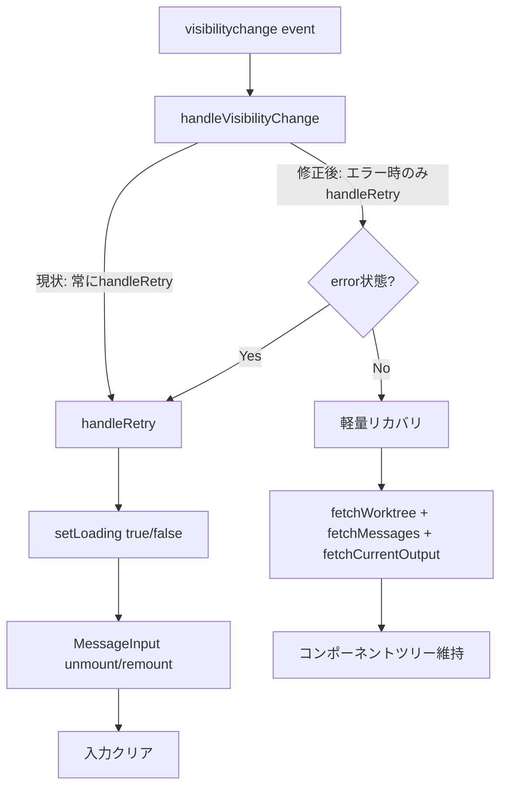

# 設計方針書: Issue #266 - ブラウザタブ切り替え時の入力クリア修正

## 1. 概要

### Issue
- **Issue番号**: #266
- **タイトル**: ブラウザのタブを切り替えると入力途中の内容がクリアされる
- **種別**: バグ修正（bug）

### 問題
デスクトップブラウザでメッセージ入力欄（MessageInput）にテキストを入力中にブラウザのタブを切り替え、元のタブに戻ると入力途中の内容がクリアされる。

### 根本原因
Issue #246で追加された`visibilitychange`イベントハンドラが`handleRetry()`を呼び出し、`setLoading(true)`によりコンポーネントツリーがアンマウントされる。再マウント時に`MessageInput`の`useState('')`で入力内容が初期化される。

```
タブ復帰 → visibilitychange → handleRetry() → setLoading(true)
→ MessageInput アンマウント → setLoading(false) → MessageInput 再マウント
→ useState('') → 入力内容クリア
```

---

## 2. アーキテクチャ設計

### 変更範囲



### レイヤー構成

変更はプレゼンテーション層（`src/components/worktree/`）のみ。

| レイヤー | 変更 | 詳細 |
|---------|------|------|
| プレゼンテーション層 | **変更あり** | `WorktreeDetailRefactored.tsx` の `handleVisibilityChange` |
| ビジネスロジック層 | 変更なし | — |
| データアクセス層 | 変更なし | — |

---

## 3. 設計パターン

### 軽量リカバリパターン（Lightweight Recovery）

`handleRetry()`は`setLoading(true/false)`を伴うフルリカバリ。visibilitychange時にはloading状態を変更しないバックグラウンドデータ再取得のみの軽量リカバリを導入する。

#### 設計根拠

| ID | 原則 | 説明 |
|----|------|------|
| SF-001 | SRP | `handleVisibilityChange`は「バックグラウンド復帰時のデータ同期」に責務を限定。フルリカバリ（`handleRetry`）とは分離 |
| SF-002 | KISS | エラー有無で分岐するシンプルなガード条件 |
| SF-003 | 最小変更 | `handleVisibilityChange`のみ変更。他コンポーネントへの影響なし |

---

## 4. 実装設計

### 4-1. handleVisibilityChange の変更

#### Before（現状）

```typescript
// WorktreeDetailRefactored.tsx L1494-1505
const handleVisibilityChange = useCallback(() => {
  if (document.visibilityState !== 'visible') return;

  const now = Date.now();
  if (now - lastRecoveryTimestampRef.current < RECOVERY_THROTTLE_MS) {
    return;
  }
  lastRecoveryTimestampRef.current = now;

  // [MF-001] Call handleRetry() directly (DRY principle)
  handleRetry();
}, [handleRetry]);
```

#### After（修正）

```typescript
const handleVisibilityChange = useCallback(async () => {
  if (document.visibilityState !== 'visible') return;

  const now = Date.now();
  if (now - lastRecoveryTimestampRef.current < RECOVERY_THROTTLE_MS) {
    return;
  }
  lastRecoveryTimestampRef.current = now;

  // [SF-001] エラー状態の場合のみフルリカバリ（handleRetry）
  // loading状態を変更してUIをリセットする必要がある
  if (error) {
    handleRetry();
    return;
  }

  // [SF-002] 正常時は軽量リカバリ（loading状態を変更しない）
  // コンポーネントツリーを維持し、MessageInput等の入力状態を保持
  // [SF-DRY-001] 注意: このfetch群はhandleRetry()内のfetch呼び出しと同じデータ取得を行う。
  // handleRetryはsetLoading(true/false)を伴うフルリカバリであり、ここではloading変更なしの
  // 軽量リカバリが必要なため、意図的にfetch呼び出しを分離している。
  // fetch関数の追加・変更時は handleRetry() 側も合わせて確認すること。
  //
  // [SF-CONS-001] handleRetryとのfetchパターン差異について:
  // handleRetry()はfetchWorktree()の戻り値を確認してから残り2つを条件付きで実行する
  // 逐次パターンだが、軽量リカバリでは3つ全てをPromise.allで並行実行する。
  // 理由: 軽量リカバリはsetLoadingを使用せずコンポーネントツリーを維持することが目的で、
  // 失敗時はサイレント無視（次回ポーリングで回復）するため、worktreeの存在確認は不要。
  // GETリクエストのためデータ破損リスクもなく、並行実行で応答速度を優先する。
  //
  // [SF-IMP-001] fetchWorktree()内部のsetError()呼び出しへの防御:
  // fetchWorktree()は失敗時に内部でsetError(message)を呼び出すため、try-catchで
  // 例外を捕捉するだけではerror状態の伝播を防げない。軽量リカバリの設計意図
  // （コンポーネントツリー維持）を達成するため、catch内でsetError(null)を呼び出し
  // エラー状態をリセットする。これにより、一時的なネットワーク障害で
  // ErrorDisplayに切り替わることを防ぎ、次回ポーリングでの自然回復を待つ。
  try {
    await Promise.all([
      fetchWorktree(),
      fetchMessages(),
      fetchCurrentOutput(),
    ]);
  } catch {
    // 軽量リカバリ失敗時はサイレント（次回ポーリングで回復）
    // [SF-IMP-001] fetchWorktree()内部でsetError()が呼ばれた場合に備え、
    // エラー状態をリセットしてコンポーネントツリーを維持する
    setError(null);
  }
  // [SF-IMP-002] error依存によるuseCallback再生成の注記:
  // error状態が変化するたびにhandleVisibilityChangeが再生成され、
  // useEffect内のvisibilitychangeリスナーが再登録される。
  // removeEventListener/addEventListenerの連続実行であり
  // パフォーマンス影響は極小だが、依存関係の理由を明示しておく。
}, [error, handleRetry, fetchWorktree, fetchMessages, fetchCurrentOutput]);
```

### 4-2. 設計上の決定事項

| 決定事項 | 選択 | 理由 | トレードオフ |
|---------|------|------|-------------|
| リカバリ方式 | 軽量リカバリ（loading不使用） | 根本原因を解決。remount自体が発生しない | DRY原則の一部緩和（handleRetryとfetch呼び出しの重複）。[SF-DRY-001]コメントで依存関係を明示して同期漏れリスクを低減 |
| エラー時の挙動 | handleRetry維持 | エラー状態からの復帰にはフルリカバリが必要 | --- |
| 軽量リカバリの失敗時 | サイレント無視 + setError(null)（[SF-IMP-001]） | 次回ポーリングで自然回復するため。fetchWorktree()内部でsetError()が呼ばれた場合に備え、catch内でsetError(null)によりエラー状態をリセットしてコンポーネントツリーを維持する | エラー通知がない。一時的にsetError(message)が呼ばれた後にsetError(null)で上書きするため、fetchWorktreeのエラー状態が一瞬だけ有効になりうるが、React batchingにより同一イベントループ内のstate更新はバッチ処理されるため実質的な画面フリッカーは発生しない |
| 軽量リカバリのfetchパターン | Promise.all並行実行（[SF-CONS-001]） | handleRetryの逐次パターン（fetchWorktree成否確認後に残りを実行）とは異なり、3つ全てを並行実行。軽量リカバリは失敗時サイレント無視のためworktree存在確認が不要であり、並行実行で応答速度を優先 | worktreeが取得できない場合でもfetchMessages/fetchCurrentOutputが実行されるが、GETリクエストのためデータ破損リスクなし |
| useCallbackのerror依存（[SF-IMP-002]） | error依存配列に含める | errorガード分岐に必要。error変化時にhandleVisibilityChangeが再生成され、useEffectでリスナーが再登録される | パフォーマンス影響は極小（removeEventListener/addEventListenerの連続実行のみ）。将来の開発者向けにコメントで依存理由を明示 |

### 4-3. 代替案との比較

| 案 | 評価 | 理由 |
|----|------|------|
| useRef/state liftで入力保持 | △ | 根本原因を解決せず、remount自体は起き続ける。PromptPanel等にも同じ対処が必要 |
| **軽量リカバリ（採用）** | **◎** | **根本原因を解決。loading状態を変更しないためremountが発生しない** |
| keyプロップ付与 | △ | 親のloading切替でコンポーネントツリー構造が変わる場合は効果なし |
| handleRetryにskipLoadingオプション追加 | ○ | 可能だがhandleRetryの責務が曖昧になる |
| refreshData()ヘルパー関数抽出（SF-DRY-001代替案） | ○ | DRY原則を厳密に満たすが、現時点ではKISSに反する過度な抽象化。fetchの追加・変更が頻繁になった場合は再検討 |

---

## 5. データモデル設計

本Issue ではデータモデルの変更なし。

---

## 6. API設計

本Issue ではAPI変更なし。既存のAPIをそのまま使用。

| API | 用途 | 変更 |
|-----|------|------|
| `GET /api/worktrees/:id` | ワークツリー情報取得 | なし |
| `GET /api/worktrees/:id/messages` | メッセージ一覧取得 | なし |
| `GET /api/worktrees/:id/current-output` | 現在の出力取得 | なし |

---

## 7. セキュリティ設計

本修正はセキュリティに影響なし。Stage 4セキュリティレビュー（5/5 approved）にて確認済み。

- fetch呼び出しは既存のものと同一
- 新たな外部入力の処理なし
- 認証/認可フローへの影響なし
- OWASP Top 10全項目においてPASSまたはN/A（詳細はSection 13 Stage 4を参照）

### セキュリティ副次効果 [C-SEC-001]

SF-IMP-001の対策（catch内setError(null)）により、fetchWorktree失敗時のHTTPステータスコードを含むエラーメッセージがUI上に一時的にも表示されない。これはセキュリティ観点で好ましい副次効果である。開発時のデバッグ容易性については、C-KISS-001で将来検討されているNODE_ENV=development時のconsole.warn追加で対応可能。

---

## 8. パフォーマンス設計

### スロットリング

既存の`RECOVERY_THROTTLE_MS`（5000ms）によるスロットリングを維持。軽量リカバリでも同じガードが適用される。

### 並行リクエスト

`Promise.all`で3つのfetchを並行実行。Issue #246の[IA-002]で述べられている通り、すべてのfetchはべき等なGETリクエストのため並行実行は安全。

### イベントリスナー再登録 [SF-IMP-002]

`handleVisibilityChange`の`useCallback`依存配列に`error`が含まれるため、`error`状態が変化するたびに`handleVisibilityChange`が再生成される。これにより`useEffect([handleVisibilityChange])`内のvisibilitychangeイベントリスナーが`removeEventListener` / `addEventListener`で再登録される。この処理は同期的で軽量なため、パフォーマンスへの影響は極小である。

### ポーリングとの並行実行 [C-IMP-003]

修正前は`handleRetry()`が`setLoading(true)`を呼び出すことでポーリング`useEffect`内の`if (loading) return`ガードが一時的にポーリングを停止させていた。修正後の軽量リカバリでは`loading`を変更しないため、ポーリングの`setInterval`が中断されずに動作し続ける。結果として軽量リカバリの`fetch`とポーリングの`fetch`が同時実行される可能性がある。全てべき等なGETリクエスト（IA-002）のため安全だが、修正前との振る舞いの違いとして認識しておく。

---

## 9. テスト設計

### ユニットテスト

| テストケース | 検証内容 |
|-------------|---------|
| 正常時のvisibilitychange | `setLoading`が呼ばれないこと |
| 正常時のvisibilitychange | `fetchWorktree`、`fetchMessages`、`fetchCurrentOutput`が呼ばれること |
| エラー状態でのvisibilitychange | `handleRetry`が呼ばれること（フルリカバリ） |
| スロットルガード | `RECOVERY_THROTTLE_MS`以内の再発火で処理がスキップされること |
| 軽量リカバリ失敗時 [SF-IMP-001] | `fetchWorktree`失敗時に`setError(null)`が呼ばれ、コンポーネントツリーが維持されること |

### 受入テスト

| テストケース | 期待結果 |
|-------------|---------|
| デスクトップブラウザでタブ切替後にメッセージ入力内容が保持される | PASS |
| デスクトップブラウザでタブ切替後にPromptPanelの入力内容が保持される | PASS |
| visibilitychangeによるデータ再取得が引き続き動作する | PASS |
| エラー状態からのタブ復帰時は従来通りhandleRetry()で完全リカバリされる | PASS |
| 既存のメッセージ送信フローに影響がない | PASS |

---

## 10. 影響範囲

### 変更対象ファイル

| ファイル | 変更内容 |
|---------|---------|
| `src/components/worktree/WorktreeDetailRefactored.tsx` | `handleVisibilityChange`を軽量リカバリに変更 |

### 影響を受けるコンポーネント（変更不要）

| コンポーネント | 影響 |
|--------------|------|
| `MessageInput` | 入力状態が保持されるようになる（変更不要） |
| `PromptPanel` | 同様に入力状態が保持される（変更不要） |
| `MobilePromptSheet` | モバイル版プロンプトの入力状態も保持される。ポジティブな影響（変更不要） |
| ポーリングuseEffect | loading変更がないため中断されず動作継続。軽量リカバリのfetchと同時実行の可能性あり（GETリクエストのため安全）[C-IMP-003] |

### テストへの影響

| テスト | 影響 |
|--------|------|
| TC-1 (visibilitychange data re-fetch) | 内部経路がhandleRetry経由からfetch直接呼び出し経由に変更。テスト結果はPASSだがコメント更新が望ましい [C-IMP-001] |
| TC-2 (error時のhandleRetry) | errorガード経由でhandleRetryが呼ばれるため動作変更なし [C-CONS-002] |

### 関連Issue

| Issue | 関連 |
|-------|------|
| #246 | visibilitychangeリカバリ機能の追加（本バグの原因） |

---

## 11. 実装タスク

### 実装チェックリスト

- [ ] `handleVisibilityChange()`を`handleRetry()`呼び出しから軽量リカバリに変更
- [ ] エラー状態の場合のみ`handleRetry()`を呼び出すガード追加
- [ ] [SF-IMP-001] 軽量リカバリのcatch内で`setError(null)`を呼び出し、fetchWorktree()内部のsetError()によるコンポーネントツリー崩壊を防御する
- [ ] [SF-IMP-001] useCallbackの依存配列に`setError`を追加する（または安定参照であることを確認する）
- [ ] [SF-DRY-001] 軽量リカバリのfetch呼び出し箇所にコメントで依存関係を明示（handleRetryとのfetch群の対応関係、変更時の同期確認の注意書き）
- [ ] [SF-CONS-001] 軽量リカバリのPromise.all並行実行パターンについて、handleRetryの条件付き逐次パターンとの差異と選択理由をコメントで明示（失敗時サイレント無視のためworktree確認不要、GETのためデータ破損なし、並行で応答速度優先）
- [ ] [SF-IMP-002] error依存によるuseCallback再生成とuseEffectリスナー再登録の影響についてコメントで注記
- [ ] ユニットテスト追加（visibilitychange時にloading状態が変化しないことを検証）
- [ ] ユニットテスト追加（軽量リカバリ失敗時にsetError(null)が呼ばれコンポーネントツリーが維持されることを検証）[SF-IMP-001]
- [ ] [C-IMP-001] 既存テストTC-1のMF-001参照コメントを軽量リカバリ経由に更新
- [ ] [C-CONS-002] 既存テストTC-2が修正後のerrorガード経由で正しく動作することを確認
- [ ] 既存テストが全パスすることを確認

---

## 12. レビュー履歴

| Stage | レビュー名 | 日付 | スコア | ステータス |
|-------|-----------|------|--------|-----------|
| Stage 1 | 通常レビュー（設計原則） | 2026-02-14 | 5/5 | approved |
| Stage 2 | 整合性レビュー | 2026-02-14 | 4/5 | conditionally_approved |
| Stage 3 | 影響分析レビュー | 2026-02-14 | 4/5 | conditionally_approved |
| Stage 4 | セキュリティレビュー | 2026-02-14 | 5/5 | approved |

---

## 13. レビュー指摘事項サマリー

### Stage 1: 通常レビュー（設計原則）

#### Must Fix 項目

なし

#### Should Fix 項目

| ID | カテゴリ | タイトル | 重要度 | 対応方針 |
|----|---------|---------|--------|---------|
| SF-DRY-001 | DRY | fetchWorktree/fetchMessages/fetchCurrentOutputの3連呼び出しの繰り返し | low | コメントで依存関係を明示。refreshData()ヘルパー抽出は現時点ではKISSに反するため見送り |

**SF-DRY-001 詳細**:
- **指摘**: `handleRetry()`内ではfetchWorktree()を先に呼び出し、その戻り値（worktreeData）がある場合のみ`Promise.all([fetchMessages(), fetchCurrentOutput()])`を条件付きで実行する逐次パターンを使用している。一方、修正後`handleVisibilityChange`の軽量リカバリでは`Promise.all([fetchWorktree(), fetchMessages(), fetchCurrentOutput()])`で3つ全てを並行実行する。両者はfetch対象が同じだがパターンが異なり、将来fetchの追加・変更時に同期漏れが発生するリスクがある。[SF-CONS-002]により正確な記述に修正。
- **推奨**: 軽量リカバリ用の`refreshData()`のようなヘルパー関数を抽出し、`handleRetry`から呼び出す形でDRY原則の緩和を最小限にすることを検討。ただし現状の変更範囲では影響は軽微であり、過度な抽象化はKISSに反するため、コメントで依存関係を明示することでも十分。
- **設計方針への反映**: 4-1のAfterコードサンプルにコメントで依存関係を明示。4-2の決定事項テーブルにSF-DRY-001対応およびSF-CONS-001対応を追記。4-3の代替案にrefreshData()抽出案を追加。11の実装チェックリストにコメント追加タスクを追記。

#### Consider 項目（将来検討）

| ID | カテゴリ | タイトル | 備考 |
|----|---------|---------|------|
| C-KISS-001 | KISS | async useCallbackのエラーハンドリング方針 | 現状のサイレント無視は適切。必要に応じてNODE_ENV=development時のみwarnを追加する拡張を将来検討 |
| C-YAGNI-001 | YAGNI | 軽量リカバリのリトライ機構は不要 | 現状維持。YAGNI遵守の好例。ポーリング(setInterval)が既に存在するため追加リトライは不要 |

### Stage 2: 整合性レビュー

#### Must Fix 項目

なし

#### Should Fix 項目

| ID | カテゴリ | タイトル | 重要度 | 対応方針 |
|----|---------|---------|--------|---------|
| SF-CONS-001 | 整合性 | handleRetryの条件付きfetchパターンと軽量リカバリのPromise.all並行パターンの差異 | medium | 設計書に並行実行を選択した理由を明示。Section 4-1のコメントおよび4-2の決定事項テーブルに追記 |
| SF-CONS-002 | 整合性 | Section 13のSF-DRY-001記述におけるhandleRetryのfetchパターン不正確 | low | handleRetryの実際のコード構造（fetchWorktree条件付き + fetchMessages/fetchCurrentOutput並行）に合わせて記述を修正 |

**SF-CONS-001 詳細**:
- **指摘**: 設計書のAfterコードでは軽量リカバリとして3つのfetchを`Promise.all`で並行実行するが、既存`handleRetry`(L1447-1455)では`fetchWorktree`の戻り値を確認してから残り2つを実行する逐次パターンを使用している。軽量リカバリ側ではworktreeDataの存在確認なしに3つ全てを並行実行するため、worktreeが取得できない場合にも不要なfetchMessages/fetchCurrentOutputが実行される。ただしGETリクエストのためデータ破損リスクはなく、実害は小さい。
- **推奨**: 軽量リカバリでもfetchWorktreeの成否を確認する逐次パターンにするか、設計書にて並行実行を選択した理由を明示的に記載する。
- **設計方針への反映**: Section 4-1のAfterコードにSF-CONS-001コメントを追加し、並行実行を選択した設計根拠（失敗時サイレント無視のためworktree確認不要、GETのためデータ破損なし、並行で応答速度優先）を明示。Section 4-2の決定事項テーブルにSF-CONS-001対応行を追加。

**SF-CONS-002 詳細**:
- **指摘**: Section 13のSF-DRY-001記述ではhandleRetry内のfetchパターンを`Promise.all([fetchMessages(), fetchCurrentOutput()])`と記述していたが、実際のhandleRetry(L1450-1453)では`fetchWorktree()`を先に呼び、結果がある場合のみ`Promise.all([fetchMessages(), fetchCurrentOutput()])`という条件付きパターンである。fetchWorktreeの条件分岐が欠落していた。
- **推奨**: SF-DRY-001記述をhandleRetryの実際のコード構造に正確に合わせる。
- **設計方針への反映**: Section 13のSF-DRY-001詳細の指摘文を、handleRetryの実際のfetchパターン（fetchWorktree条件付き + fetchMessages/fetchCurrentOutput並行）を正確に反映する記述に修正。

#### Consider 項目（将来検討）

| ID | カテゴリ | タイトル | 備考 |
|----|---------|---------|------|
| C-CONS-001 | 整合性 | 設計書Before側のコード行番号はスナップショット時点のもの | 対応不要。実装時に実際の行番号を確認すれば問題ない |
| C-CONS-002 | 整合性 | テストケースTC-2のerrorガード分岐対応確認 | 実装時に既存テストTC-2が修正後のerrorガード経由で正しく動作するか確認する。新規テストケース（正常時setLoading不呼出、正常時fetch群呼出）は設計書Section 9に記載済み |
| C-CONS-003 | 整合性 | useCallbackのasync化に伴うReact動作への注記 | 対応不要。async useCallbackのパターンは本プロジェクトの他の箇所（handleRetry等）でも使用されている |

### Stage 3: 影響分析レビュー

#### Must Fix 項目

なし

#### Should Fix 項目

| ID | カテゴリ | タイトル | 重要度 | 対応方針 |
|----|---------|---------|--------|---------|
| SF-IMP-001 | 影響範囲 | fetchWorktree()内のsetError()が軽量リカバリ時にコンポーネントアンマウントを誘発するリスク | medium | 軽量リカバリのcatch内でsetError(null)を呼び出し、エラー状態をリセットしてコンポーネントツリーを維持する |
| SF-IMP-002 | 影響範囲 | useCallbackのerror依存追加によるポーリングuseEffectへの連鎖影響 | low | 設計書およびコードコメントにerror依存によるuseCallback再生成とリスナー再登録の影響を注記 |

**SF-IMP-001 詳細**:
- **指摘**: 軽量リカバリの`Promise.all`内で`fetchWorktree()`が失敗した場合、`fetchWorktree()`は内部で`setError(message)`を呼び出す。これにより`error`状態がセットされ、レンダリング時に`if (error)`ガードにより`ErrorDisplay`が表示される。結果として`MessageInput`がアンマウントされ、軽量リカバリの設計意図（コンポーネントツリー維持）が達成されない。設計書のtry-catchでサイレント無視する意図は、`fetchWorktree`内部の`setError`呼び出しにより無効化される。
- **推奨**: 軽量リカバリのtry-catch内の`catch`で`setError(null)`を呼び出してエラー状態をリセットする。これにより、`fetchWorktree`内部で`setError(message)`が呼ばれた場合でも、直後に`setError(null)`で上書きしてコンポーネントツリーを維持する。React batchingにより同一イベントループ内のstate更新はバッチ処理されるため、実質的な画面フリッカーは発生しない。
- **設計方針への反映**: Section 4-1のAfterコードにSF-IMP-001コメントおよびcatch内setError(null)を追加。Section 4-2の決定事項テーブルの「軽量リカバリの失敗時」行にSF-IMP-001対応を統合。Section 11の実装チェックリストにsetError(null)追加タスクおよびテスト追加タスクを追記。

**SF-IMP-002 詳細**:
- **指摘**: 修正後の`handleVisibilityChange`は`useCallback`の依存配列に`[error, handleRetry, fetchWorktree, fetchMessages, fetchCurrentOutput]`を持つ。`error`状態が変化するたびに`handleVisibilityChange`が再生成される。`handleVisibilityChange`は`useEffect([handleVisibilityChange])`で使用されるため、`error`変化ごとにイベントリスナーの再登録が発生する。ただし、`removeEventListener`/`addEventListener`の連続実行であり、パフォーマンスへの影響は極小。
- **推奨**: 設計書に、`error`依存追加による`useCallback`再生成と`useEffect`リスナー再登録の影響を注記として追加する。影響は軽微であるが、将来の開発者が依存関係の理由を理解できるようにするため。
- **設計方針への反映**: Section 4-1のAfterコードにSF-IMP-002注記コメントを追加。Section 4-2の決定事項テーブルにSF-IMP-002対応行を追加。Section 8にイベントリスナー再登録の注記を追加。Section 11の実装チェックリストにコメント追加タスクを追記。

#### Consider 項目（将来検討）

| ID | カテゴリ | タイトル | 備考 |
|----|---------|---------|------|
| C-IMP-001 | 影響範囲 | 既存テストTC-1の動作変更 | 修正後はhandleRetry経由ではなく軽量リカバリ経由でfetchが呼ばれるため、テスト内のMF-001参照コメント更新が望ましい。テスト結果自体はPASS |
| C-IMP-002 | 影響範囲 | WorktreeList.tsxのvisibilitychangeパターンとの整合 | 修正後のWorktreeDetailRefactored.tsxも正常時は軽量リカバリを使用するようになり、WorktreeList.tsxのパターンと類似性が増す。将来的なvisibilitychange復帰パターン共通化の基盤となる。対応不要 |
| C-IMP-003 | 影響範囲 | ポーリングuseEffectとの並行実行の変化 | 修正前はhandleRetry()のsetLoading(true)によりポーリングが一時停止したが、修正後はloadingを変更しないため停止せず、軽量リカバリとポーリングのfetchが同時実行される可能性あり。全てべき等なGETリクエスト(IA-002)のため安全 |

### Stage 4: セキュリティレビュー

#### Must Fix 項目

なし

#### Should Fix 項目

なし

#### Consider 項目（将来検討）

| ID | カテゴリ | タイトル | 備考 |
|----|---------|---------|------|
| C-SEC-001 | エラー情報露出 | fetchWorktree()のエラーメッセージが軽量リカバリのsetError(null)で抑制されることのセキュリティ副次効果 | 現状の設計で問題なし。C-KISS-001で将来検討されているNODE_ENV=development時のconsole.warn追加と整合する方向性 |
| C-SEC-002 | レースコンディション | 軽量リカバリとポーリングの並行fetch実行におけるレースコンディション | 対応不要。既存のポーリング設計でも同様のレースコンディションが存在しており、新規リスクではない |

**C-SEC-001 詳細**:
- **指摘**: SF-IMP-001の対策としてcatch内でsetError(null)を呼ぶ設計は、セキュリティ観点では好ましい副次効果がある。fetchWorktree失敗時のHTTPステータスコードを含むエラーメッセージがUI上に一時的にも表示されない。ただし、開発時のデバッグ容易性とのバランスに注意。
- **推奨**: 現状の設計で問題なし。C-KISS-001で将来検討されているNODE_ENV=development時のconsole.warn追加と整合する方向性。

**C-SEC-002 詳細**:
- **指摘**: C-IMP-003で記載されている通り、軽量リカバリのfetchとポーリングのfetchが同時実行される可能性がある。全てべき等なGETリクエストのためデータ整合性リスクはないが、React state更新のタイミングによって一時的に古いデータが表示される可能性がゼロではない。セキュリティ上は問題なし。
- **推奨**: 対応不要。既存のポーリング設計でも同様のレースコンディションが存在しており、新規リスクではない。

#### OWASP Top 10 チェックリスト

| カテゴリ | 結果 | 詳細 |
|---------|------|------|
| A01: アクセス制御の不備 | PASS | 変更は既存fetch関数の呼び出し条件変更のみ。新規APIエンドポイントの追加なし。worktreeIdベースのアクセス制御に変更なし |
| A02: 暗号化の失敗 | N/A | 暗号化関連の変更なし |
| A03: インジェクション | PASS | 新規のユーザー入力処理なし。APIルート側ではbetter-sqlite3のプリペアドステートメントを使用しておりSQLインジェクション対策済み |
| A04: 安全でない設計 | PASS | 軽量リカバリパターンの設計は防御的設計。サイレント失敗時のsetError(null)はポーリングによる自然回復を前提 |
| A05: セキュリティ設定ミス | PASS | next.config.jsにCSP、X-Frame-Options(DENY)等設定済み。本変更による影響なし |
| A06: 脆弱なコンポーネント | N/A | 新規依存パッケージの追加なし |
| A07: 認証/認可の失敗 | N/A | 認証/認可フローへの変更なし。ローカル開発ツールであり認証機構を持たない設計 |
| A08: データ整合性の失敗 | PASS | APIレスポンスの処理ロジックに変更なし |
| A09: ログ/モニタリングの失敗 | PASS | 軽量リカバリのサイレント無視は意図的設計判断。既存のfetchMessages/fetchCurrentOutputのcatch内ではconsole.errorでログ出力済み |
| A10: SSRF | N/A | 新規の外部リクエスト先の追加なし。全てのfetchは自サーバーの/api/エンドポイントへの相対パスリクエスト |

### 整合性チェック結果

| チェック項目 | 結果 | 詳細 |
|------------|------|------|
| 設計書 vs 既存実装 (Before) | consistent | 設計書のBeforeコード(Section 4-1)は現在の実装と一致 |
| 設計書 vs 修正後実装 (After) | not_yet_implemented | Afterコードは未実装。設計記述は実装可能であり、SF-CONS-001対応により整合性を明確化 |
| 設計書 vs 既存アーキテクチャ | consistent | 変更範囲がプレゼンテーション層のみ。既存fetch関数・状態管理・イベントリスナーパターンとの整合性確認済み |

### 設計原則チェックリスト結果

| 原則 | 結果 | 詳細 |
|------|------|------|
| 単一責任の原則 (SRP) | PASS | handleVisibilityChangeはバックグラウンド復帰時のデータ同期に責務を限定 |
| 開放閉鎖の原則 (OCP) | PASS | 既存のhandleRetry()を変更せず、ガード条件追加のみ |
| リスコフの置換原則 (LSP) | N/A | 継承関係なし |
| インターフェース分離の原則 (ISP) | N/A | インターフェース変更なし |
| 依存性逆転の原則 (DIP) | PASS | fetch関数はuseCallbackで抽象化済み |
| KISS | PASS | エラー有無で分岐するシンプルなガード条件 |
| YAGNI | PASS | 必要最小限の変更のみ |
| DRY | 条件付きPASS | fetch呼び出し重複は意図的トレードオフ。SF-DRY-001でコメント明示により対応 |

### リスク評価

| カテゴリ | リスクレベル | 備考 |
|---------|------------|------|
| 技術的リスク | medium | SF-IMP-001（fetchWorktree内部のsetError伝播リスク）への対策としてcatch内setError(null)が必要。対策実装後はlowに低減 |
| セキュリティリスク | low | Stage 4セキュリティレビューにてOWASP Top 10全項目PASS/N/A確認済み。C-SEC-001/C-SEC-002はいずれもinfo（対応不要） |
| 運用リスク | low | --- |
