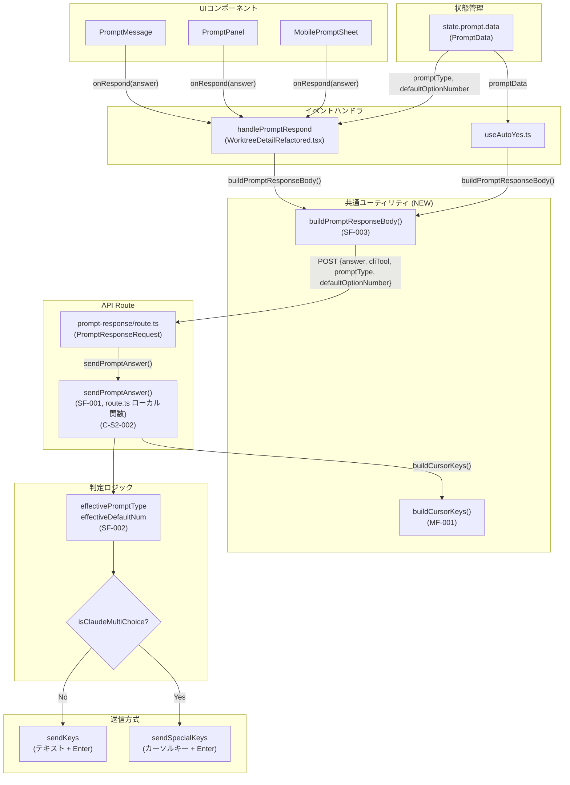

# 設計方針書: Issue #287 - 選択肢プロンプト送信のフォールバック不備修正

## 1. 概要

### 背景
モバイル画面の「Claudeからの確認」ダイアログで選択肢を送信した際、`captureSessionOutput()` の例外発生により `promptCheck` が `null` になると、Claude Codeの選択肢プロンプト（カーソルキーベース）に対してテキスト入力方式で送信してしまい、入力が無視される。

### 目的
`promptCheck` が `null`（再検証失敗）の場合でも、UI側から送信された `promptType` / `defaultOptionNumber` を使用して正しい送信方式（カーソルキー or テキスト）を判定するフォールバック機構を追加する。

### スコープ
- `prompt-response` APIのリクエストボディ拡張
- `handlePromptRespond` / `useAutoYes` からの `promptType` / `defaultOptionNumber` 送信
- カーソルキー送信ロジックの共通ヘルパー抽出（MF-001対応）
- リクエストボディ構築ロジックの共通化（SF-003対応）
- 関連テストの追加・更新

### スコープ外
- `PromptResponseRequest` 型の `src/types/models.ts` への移動（別Issue）
- `route.ts` POST関数の大規模リファクタリング（SF-001は最小限の関数抽出で対応）

---

## 2. アーキテクチャ設計

### 修正対象のデータフロー



### レイヤー構成（変更箇所のみ）

| レイヤー | ファイル | 変更内容 |
|---------|---------|---------|
| 共通ユーティリティ (NEW) | `src/lib/prompt-response-utils.ts` | リクエストボディ構築 `buildPromptResponseBody()` (SF-003) |
| 共通ユーティリティ (NEW) | `src/lib/cursor-key-sender.ts` | カーソルキー送信ロジック抽出 (MF-001) |
| プレゼンテーション | `WorktreeDetailRefactored.tsx` | `handlePromptRespond` 内部で `buildPromptResponseBody()` 呼び出し、`state.prompt.data` は `useRef` 経由でアクセス (C-004) |
| プレゼンテーション | `useAutoYes.ts` | `fetch` リクエストボディを `buildPromptResponseBody()` 経由で構築 |
| API | `prompt-response/route.ts` | `PromptResponseRequest` 拡張、`sendPromptAnswer()` ローカル関数抽出 (SF-001/C-S2-002)、`buildCursorKeys()` への委譲 (MF-001) |
| ビジネスロジック | `auto-yes-manager.ts` | カーソルキー送信を `cursor-key-sender.ts` の共通関数に委譲 (MF-001) |
| テスト | テストファイル群 | テストケース追加・更新 |

### 変更しないレイヤー

| レイヤー | ファイル | 理由 |
|---------|---------|------|
| プレゼンテーション | `PromptMessage.tsx`, `PromptPanel.tsx`, `MobilePromptSheet.tsx` | 非破壊的アプローチにより `onRespond` シグネチャ不変 |
| ビジネスロジック | `tmux.ts`, `prompt-detector.ts`, `cli-session.ts` | 送信・検出ロジック自体は変更不要 |

---

## 3. 技術選定

### 採用するアプローチ: アプローチB（UI側から promptData 情報送信）

| 比較項目 | アプローチA（API側フォールバック） | アプローチB（UI側から情報送信） |
|---------|----------------------------------|-------------------------------|
| 正確性 | 低（promptType不明で推測） | 高（UIが保持するpromptDataを使用） |
| 誤送信リスク | あり（Yes/No vs 選択肢の区別不可） | なし |
| 修正範囲 | route.tsのみ | route.ts + handlePromptRespond + useAutoYes |
| 後方互換性 | - | オプショナルフィールドで維持 |

**選定理由**: `answer="1"` が Yes/No の "Yes" なのか選択肢の1番なのか、API側だけでは区別不可能。UI側は `state.prompt.data` を保持しており、正確な `promptType` を送信できる。

### 実装戦略: 非破壊的アプローチ

| 比較項目 | 破壊的（シグネチャ変更） | 非破壊的（内部取得） |
|---------|------------------------|---------------------|
| `onRespond` シグネチャ | `(answer, promptData?) => void` に変更 | `(answer: string) => void` 不変 |
| 影響ファイル数 | 6ファイル以上 | 3ファイル |
| UI変更 | PromptMessage, PromptPanel, MobilePromptSheet 全修正 | 変更なし |
| データ取得方法 | 引数で受け取り | `state.prompt.data` から内部取得（useRef経由） |

**選定理由**: `handlePromptRespond` は `useCallback` で定義されており、`useRef` 経由で `state.prompt.data` にアクセス可能（C-004対応）。シグネチャ変更は不要な修正範囲の拡大。

---

## 4. データモデル設計

### PromptResponseRequest 型拡張

```typescript
// src/app/api/worktrees/[id]/prompt-response/route.ts (ローカル定義のまま拡張)
interface PromptResponseRequest {
  answer: string;
  cliTool?: CLIToolType;
  // === 新規追加フィールド（Issue #287） ===
  promptType?: 'yes_no' | 'multiple_choice';    // プロンプト種別
  defaultOptionNumber?: number;                   // デフォルト選択肢番号（multiple_choice のみ）
}
```

### フィールド設計方針

| フィールド | 型 | 必須 | 用途 |
|-----------|------|------|------|
| `promptType` | `'yes_no' \| 'multiple_choice'` | オプショナル | フォールバック時のカーソルキー判定 |
| `defaultOptionNumber` | `number` | オプショナル | カーソル移動オフセット計算 |

### defaultOptionNumber の導出ロジック

```typescript
// buildPromptResponseBody() 内部で導出 (SF-003: 共通化)
const promptType = promptData?.type;
const defaultOptionNumber =
  promptData?.type === 'multiple_choice'
    ? promptData.options.find(o => o.isDefault)?.number
    : undefined;
```

### 型の配置方針

`PromptResponseRequest` は本Issueでは `route.ts` 内のローカル定義のまま拡張する。`src/types/models.ts` への移動（クライアント・サーバー型共有）は別Issueとする。

**理由**: 現時点でクライアント側は `JSON.stringify()` で直接オブジェクトリテラルを構築しており、型共有の利点が限定的。スコープの最小化を優先。

**将来検討事項 (C-001)**: 将来の型共有化Issueで、クライアント側に `PromptResponseRequestBody` 型エイリアスを定義し、`JSON.stringify` の引数に型注釈を付けることを検討する。フィールド名のtypoやフィールド漏れのコンパイル時検出が目的。

### promptType フィールドの型拡張性に関する注記 (C-S2-001)

`PromptResponseRequest.promptType` は `'yes_no' | 'multiple_choice'` と定義しているが、`src/types/models.ts` の `PromptType` は `'yes_no' | 'multiple_choice' | 'approval' | 'choice' | 'input' | 'continue'` と幅広い型定義を持つ。

**現時点の整合性**: 本 Issue では `PromptData` union 型（`YesNoPromptData | MultipleChoicePromptData`）に対応するフォールバックのみを扱う。`PromptData` に含まれない型（`approval`, `choice`, `input`, `continue`）は `promptData?.type` から導出されることがないため、`PromptResponseRequest.promptType` に含める必要はない。

**フォールバック動作**: `promptType` が `'yes_no'` でも `'multiple_choice'` でもない値（`undefined` を含む）が送信された場合、`effectivePromptType` は `undefined` となり、`isClaudeMultiChoice` は `false` に評価されるため、テキスト送信方式にフォールバックする（安全側動作）。

**将来の拡張時**: `PromptData` union 型に新しい型（例: `ApprovalPromptData`）が追加された場合、`PromptResponseRequest.promptType` の union にも対応する値を追加し、`buildCursorKeys()` の判定ロジックを拡張する必要がある。

---

## 5. API設計

### エンドポイント: `POST /api/worktrees/:id/prompt-response`

#### リクエストボディ（拡張後）

```typescript
{
  "answer": "1",                      // 必須: ユーザーの応答
  "cliTool": "claude",               // 任意: CLIツール種別
  "promptType": "multiple_choice",    // 任意(NEW): プロンプト種別
  "defaultOptionNumber": 1            // 任意(NEW): デフォルト選択肢番号
}
```

#### 後方互換性

| クライアント | API | 動作 |
|-------------|-----|------|
| 旧 (`promptType` なし) | 新 | `promptCheck` ベースの既存判定（`promptType` 未使用） |
| 新 | 新 | `promptCheck` 優先、`null` 時に `promptType` フォールバック |

新規フィールドはすべてオプショナル (`?`) のため、既存クライアントとの後方互換性を完全に維持。

#### レスポンス（変更なし）

```typescript
// 成功時
{ "success": true, "answer": "1" }

// 失敗時
{ "success": false, "reason": "prompt_no_longer_active", "answer": "1" }
{ "error": "..." }
```

---

## 6. コア判定ロジック設計

### effectivePromptType / effectiveDefaultNum の事前決定 (SF-002対応)

フォールバック判定を読みやすくするため、判定を2段階に分離する。

```typescript
// Step 0: ランタイムバリデーション（SEC-S4-001: body の値を信頼せず検証）
const VALID_PROMPT_TYPES = ['yes_no', 'multiple_choice'] as const;
const validatedPromptType: 'yes_no' | 'multiple_choice' | undefined =
  VALID_PROMPT_TYPES.includes(body.promptType as typeof VALID_PROMPT_TYPES[number])
    ? (body.promptType as 'yes_no' | 'multiple_choice')
    : undefined;
const validatedDefaultOptionNumber: number | undefined =
  typeof body.defaultOptionNumber === 'number' &&
  Number.isInteger(body.defaultOptionNumber) &&
  body.defaultOptionNumber > 0
    ? body.defaultOptionNumber
    : undefined;

// Step 1: 有効な promptType と defaultNum を決定（SF-002: 2段階分離）
const effectivePromptType: 'yes_no' | 'multiple_choice' | undefined =
  promptCheck?.promptData?.type ?? validatedPromptType;  // SEC-S4-001: validatedPromptType を使用

const effectiveDefaultNum: number =
  promptCheck
    ? (promptCheck.promptData?.options?.find(o => o.isDefault)?.number ?? 1)
    : (validatedDefaultOptionNumber ?? 1);  // ?? 1: 後方互換性フォールバック (D-5), SEC-S4-001: validatedDefaultOptionNumber を使用

// Step 2: isClaudeMultiChoice を判定（buildCursorKeys() 内部で実行）(SF-S2-003)
// cliToolId は buildCursorKeys() の引数として渡される
const isClaudeMultiChoice =
  cliToolId === 'claude' &&
  effectivePromptType === 'multiple_choice' &&
  /^\d+$/.test(answer);
```

**設計根拠 (SF-002)**: 1つの条件式にOR演算子で2つのソース（promptCheck と body）を混在させると認知コストが高い。`effectivePromptType` / `effectiveDefaultNum` を事前に決定することで、条件式がシンプルになり、デバッグ時のトレーサビリティも向上する。

### カーソルキー送信ロジック（共通ヘルパー）

```typescript
if (isClaudeMultiChoice) {
  const offset = targetNum - effectiveDefaultNum;
  // ... カーソルキー送信（cursor-key-sender.ts に委譲）
}
```

### 判定優先順位

1. **`promptCheck` が存在する場合**: `promptCheck.promptData` から `effectivePromptType` / `effectiveDefaultNum` を導出
2. **`promptCheck` が `null` の場合**: リクエストボディの `body.promptType` / `body.defaultOptionNumber` から導出
3. **両方ない場合**: テキスト送信方式（既存の else ブロック）

**設計根拠**: `promptCheck` はリアルタイムの画面出力を解析した結果であり、UIが保持する `promptData` より信頼性が高い。ただし、`promptCheck` 取得に失敗した場合のみ、UIの情報をフォールバックとして使用する。

---

## 7. 共通ヘルパー設計

### 7.1 cursor-key-sender.ts (MF-001対応: カーソルキー送信ロジック共通化)

**目的**: `route.ts` (L96-158) と `auto-yes-manager.ts` (L343-399) に重複するカーソルキー送信ロジックを共通ヘルパーに抽出する。Issue #287のフォールバック変更を一箇所に集約し、2つのコードパスの乖離を防止する。

> **注記 (SF-S2-001)**: 上記の行番号（L96-158, L343-399）は設計レビュー時点（実装前）のベースライン行番号であり、`buildCursorKeys()` への置換実装後は大幅に変わる。実装時は行番号ではなくロジックの内容（カーソルキー送信判定、offset計算、keys配列構築）を基準にコードを特定すること。

```typescript
// src/lib/cursor-key-sender.ts

interface CursorKeySendOptions {
  sessionName: string;
  answer: string;
  cliToolId: CLIToolType;  // isClaudeMultiChoice 判定に必要 (SF-S2-003)
  effectivePromptType: 'yes_no' | 'multiple_choice' | undefined;
  effectiveDefaultNum: number;
  options?: PromptOption[];  // multi-select 判定用（promptCheck 経由時のみ）
}

interface CursorKeySendResult {
  method: 'cursor_keys' | 'text';
  keys?: string[];
}

/**
 * カーソルキー送信判定とキー配列構築を一元管理する。
 * route.ts と auto-yes-manager.ts の両方から呼び出す。
 *
 * 責務:
 *   1. isClaudeMultiChoice 判定（cliToolId === 'claude' チェックを含む）(SF-S2-003)
 *   2. offset 計算
 *   3. keys 配列構築（Up/Down + Enter、multi-select の Space + Enter）
 *
 * フォールバック対応:
 *   effectivePromptType / effectiveDefaultNum は呼び出し側で
 *   promptCheck ?? body から事前に決定して渡す。
 */
export function buildCursorKeys(options: CursorKeySendOptions): CursorKeySendResult;
```

**設計ポイント**:
- `cliToolId` を引数で受け取り、`isClaudeMultiChoice` 判定（`cliToolId === 'claude'`）をヘルパー内部で行う (SF-S2-003)。これにより、呼び出し側は `buildCursorKeys()` の結果（`method: 'cursor_keys' | 'text'`）に基づいて送信方式を選択するだけでよくなる
- `effectivePromptType` / `effectiveDefaultNum` を引数で受け取るため、フォールバックロジックはこのヘルパー内部に含まない（呼び出し側の責務）
- `options` パラメータは `promptCheck` 経由で取得できる場合のみ渡す（multi-select 判定用）
- フォールバック時は `options` が `undefined` のため、single-select として処理する（D-6と一致）

**呼び出し側ごとの effectivePromptType 導出方法の違い (SF-S3-003)**:

| 呼び出し元 | effectivePromptType の導出 | body.promptType フォールバック | 理由 |
|-----------|--------------------------|-------------------------------|------|
| `route.ts` (sendPromptAnswer) | `promptCheck?.promptData?.type ?? body.promptType` | 使用する | `promptCheck === null` のフォールバックパスが存在するため |
| `auto-yes-manager.ts` (pollAutoYes) | `promptDetection.promptData?.type` | 不要 | `promptDetection.isPrompt` が `false` なら early return するため、`captureSessionOutput` が常に成功する前提で実行される |

> **実装時注意 (SF-S3-003)**: `auto-yes-manager.ts` での `buildCursorKeys()` 呼び出し時、`effectivePromptType` は常に `promptDetection.promptData?.type` から導出される。`body.promptType` のフォールバックは不要であり、この点を実装時にコードコメントで明示すること。

### 7.2 sendPromptAnswer() の責務範囲の明確化 (SF-001 / C-S2-002)

SF-001 では route.ts の POST 関数から送信方式判定+キー送信ロジックを `sendPromptAnswer()` として抽出することを提案した。C-S2-002 の整合性レビューにより、`sendPromptAnswer()` と `buildCursorKeys()` の責務分担を以下のように明確化する。

**設計決定**: `sendPromptAnswer()` は `buildCursorKeys()` の上位関数として、判定結果に基づく実際の tmux 送信まで担当する。

```typescript
// src/app/api/worktrees/[id]/prompt-response/route.ts 内のローカル関数
// （新規ファイルには抽出しない。SF-001 の「最小限の関数抽出」方針に準拠）

interface SendPromptAnswerParams {
  sessionName: string;
  answer: string;
  cliToolId: CLIToolType;
  effectivePromptType: 'yes_no' | 'multiple_choice' | undefined;
  effectiveDefaultNum: number;
  options?: PromptOption[];
}

/**
 * プロンプト応答の送信方式を判定し、適切な方法で tmux セッションに送信する。
 *
 * 責務:
 *   1. buildCursorKeys() を呼び出してキー配列を取得
 *   2. result.method に基づいて sendKeys / sendSpecialKeys を呼び分ける
 *   3. ログ出力
 *
 * この関数は route.ts のローカル関数として定義する。
 * buildCursorKeys() はテスト可能な純粋関数として cursor-key-sender.ts に配置し、
 * sendPromptAnswer() は tmux 副作用を伴うため route.ts 内に留める。
 */
async function sendPromptAnswer(params: SendPromptAnswerParams): Promise<void>;
```

**責務分担表**:

| 関数 | 配置 | 責務 | 副作用 | テスト方針 |
|------|------|------|--------|-----------|
| `buildCursorKeys()` | `cursor-key-sender.ts` | 判定+キー配列構築 | なし（純粋関数） | 単体テスト |
| `sendPromptAnswer()` | `route.ts` (ローカル) | `buildCursorKeys()` 呼び出し + tmux 送信 | あり（sendKeys/sendSpecialKeys） | 結合テスト |

**データフロー図との整合性**: Section 2 のデータフロー図では `sendPromptAnswer()` を Shared ユーティリティに配置しているが、tmux 副作用を伴うため `route.ts` のローカル関数とする。図中の `SPA` ノードは「route.ts 内のローカル関数」として解釈すること。

**エラーハンドリング方針 (SEC-S4-003対応)**: `sendPromptAnswer()` 内部でエラーが発生した場合、サーバーサイドの `console.error` にのみ詳細情報（worktreeId, sessionName, エラー詳細）を出力する。クライアントへのレスポンスには固定メッセージ（例: `"Failed to send prompt response"`）を返し、ユーザー入力や内部パラメータを含めない。

### 7.3 prompt-response-utils.ts (SF-003対応: リクエストボディ構築共通化)

**目的**: `handlePromptRespond` (WorktreeDetailRefactored.tsx) と `useAutoYes.ts` で重複するリクエストボディ構築ロジックを共通化する。

```typescript
// src/lib/prompt-response-utils.ts

import type { PromptData } from '@/types/models';

interface PromptResponseBody {
  answer: string;
  cliTool?: string;
  promptType?: 'yes_no' | 'multiple_choice';
  defaultOptionNumber?: number;
}

/**
 * プロンプト応答APIのリクエストボディを構築する。
 * promptData から promptType / defaultOptionNumber を導出する。
 *
 * @param answer - ユーザーの応答
 * @param cliTool - CLIツール種別
 * @param promptData - UI側が保持するプロンプトデータ（オプショナル）
 */
export function buildPromptResponseBody(
  answer: string,
  cliTool: string | undefined,
  promptData: PromptData | null | undefined
): PromptResponseBody;
```

**設計ポイント**:
- `promptData` から `promptType` / `defaultOptionNumber` の導出ロジックを一元管理
- 将来フィールドが追加された場合も1箇所の修正で対応可能
- クライアント側コードのため `src/lib/` に配置

---

## 8. 修正ファイル一覧

### 必須修正ファイル

| # | ファイル | 変更内容 | リスク | 関連レビュー |
|---|---------|---------|-------|-------------|
| 1 | `src/lib/cursor-key-sender.ts` (NEW) | カーソルキー送信ロジック共通ヘルパー | Low | MF-001 |
| 2 | `src/lib/prompt-response-utils.ts` (NEW) | リクエストボディ構築共通ユーティリティ | Low | SF-003 |
| 3 | `src/app/api/worktrees/[id]/prompt-response/route.ts` | `PromptResponseRequest` 拡張、`effectivePromptType` / `effectiveDefaultNum` 2段階判定(SF-002)、`buildCursorKeys()` 呼び出しに委譲(MF-001)、`sendPromptAnswer()` ローカル関数抽出(SF-001/C-S2-002) | Medium | MF-001, SF-001, SF-002, C-S2-002 |
| 4 | `src/lib/auto-yes-manager.ts` | カーソルキー送信を `buildCursorKeys()` に委譲 | Medium | MF-001 |
| 5 | `src/components/worktree/WorktreeDetailRefactored.tsx` | `handlePromptRespond` 内で `buildPromptResponseBody()` 呼び出し、`state.prompt.data` を `useRef` 経由でアクセス(C-004)、`cliTool` を `activeCliTabRef.current` から取得(MF-S2-001)、`activeCliTab` を依存配列から除外 | Medium | SF-003, C-004, MF-S2-001 |
| 6 | `src/hooks/useAutoYes.ts` | `fetch` リクエストボディを `buildPromptResponseBody()` 経由で構築 | Medium | SF-003 |
| 7 | `tests/unit/api/prompt-response-verification.test.ts` | `captureSessionOutput` 失敗時テスト更新、`promptType` 付きリクエストのテスト追加、`defaultOptionNumber=undefined` テスト追加 | Low | - |
| 8 | `tests/unit/lib/cursor-key-sender.test.ts` (NEW) | `buildCursorKeys()` の単体テスト | Low | MF-001 |
| 9 | `tests/unit/lib/prompt-response-utils.test.ts` (NEW) | `buildPromptResponseBody()` の単体テスト | Low | SF-003 |
| 10 | `tests/unit/lib/auto-yes-manager.test.ts` | カーソルキー送信関連テスト（L708-945）の更新: `buildCursorKeys()` 委譲後のモック検証パターン移行 | Medium | MF-001, MF-S3-001 |
| 11 | `tests/integration/worktree-detail-integration.test.tsx` | リクエストボディ内容検証テスト追加、既存 Prompt Response テスト（L365-428）のボディ検証強化 | Low | SF-S3-002 |

### 変更不要ファイル

| ファイル | 理由 |
|---------|------|
| `src/components/worktree/PromptMessage.tsx` | `onRespond` シグネチャ不変 |
| `src/components/mobile/MobilePromptSheet.tsx` | 同上 |
| `src/components/worktree/PromptPanel.tsx` | 同上 |
| `src/lib/tmux.ts` | 送信関数自体は変更不要 |
| `src/lib/prompt-detector.ts` | 検出ロジック自体は変更不要 |
| `src/types/models.ts` | 型共有化は別Issue (C-001) |

---

## 9. セキュリティ設計

### 入力バリデーション

| フィールド | バリデーション | 理由 |
|-----------|-------------|------|
| `promptType` | `'yes_no' \| 'multiple_choice' \| undefined` のみ許可 | 型安全性。不正な値はフォールバック不使用 |
| `defaultOptionNumber` | `number \| undefined`。`parseInt` 不要（JSON パース済み） | 数値型の保証 |

### 9.1 ランタイムバリデーション実装 (SEC-S4-001対応)

`JSON.parse` 後の `body.promptType` / `body.defaultOptionNumber` は任意の値が入る可能性があるため、route.ts の POST 関数内で明示的なランタイムバリデーションを実施する。TypeScript の型定義はコンパイル時のみの保証であり、ランタイムでの型安全性を保証しない。

```typescript
// route.ts POST 関数内（body 取得直後に実施）

// promptType バリデーション: ホワイトリスト方式
const VALID_PROMPT_TYPES = ['yes_no', 'multiple_choice'] as const;
const validatedPromptType: 'yes_no' | 'multiple_choice' | undefined =
  VALID_PROMPT_TYPES.includes(body.promptType as typeof VALID_PROMPT_TYPES[number])
    ? (body.promptType as 'yes_no' | 'multiple_choice')
    : undefined;

// defaultOptionNumber バリデーション: 整数かつ正の数であることを検証
const validatedDefaultOptionNumber: number | undefined =
  typeof body.defaultOptionNumber === 'number' &&
  Number.isInteger(body.defaultOptionNumber) &&
  body.defaultOptionNumber > 0
    ? body.defaultOptionNumber
    : undefined;
```

**バリデーション失敗時の動作**: 不正な値はエラーを返さず `undefined` として扱い、テキスト送信方式（安全側）にフォールバックする。これにより後方互換性を維持しつつ、不正入力による予期しない動作を防止する。

**OWASP カテゴリ**: A03:2021 - Injection

**effectivePromptType への反映**: Section 6 の `effectivePromptType` / `effectiveDefaultNum` 計算において、`body.promptType` の代わりに `validatedPromptType` を、`body.defaultOptionNumber` の代わりに `validatedDefaultOptionNumber` を使用する。

```typescript
// Section 6 の effectivePromptType 計算（SEC-S4-001 適用後）
const effectivePromptType: 'yes_no' | 'multiple_choice' | undefined =
  promptCheck?.promptData?.type ?? validatedPromptType;  // body.promptType ではなく validatedPromptType

const effectiveDefaultNum: number =
  promptCheck
    ? (promptCheck.promptData?.options?.find(o => o.isDefault)?.number ?? 1)
    : (validatedDefaultOptionNumber ?? 1);  // body.defaultOptionNumber ではなく validatedDefaultOptionNumber
```

### 9.2 params.id のエントリーポイントバリデーション (SEC-S4-002対応)

route.ts の POST 関数では `params.id` が `getWorktreeById()` と `captureSessionOutput()` に直接渡されている。`getWorktreeById` は prepared statement 経由で SQL インジェクションは防止されているが、`getSessionName()` 経由で tmux コマンドに使用されるため、`validateSessionName()` による間接的な防御に依存している状態である。

**防御の深化 (Defense in Depth)**: route.ts のエントリーポイントで `params.id` の明示的なバリデーションを追加する。

```typescript
// route.ts POST 関数冒頭（body 取得前に実施）
// SEC-S4-002: params.id のバリデーション（防御の深化）
const worktreeId = params.id;
if (!worktreeId || typeof worktreeId !== 'string' || !/^\d+$/.test(worktreeId)) {
  return NextResponse.json({ error: 'Invalid worktree ID' }, { status: 400 });
}
```

**注記**: これは Issue #287 で新規追加されるフォールバック機構に直接関連する問題ではなく、既存の route.ts の問題である。ただし、本 Issue での修正時に合わせて対応することで防御を強化する。

**OWASP カテゴリ**: A03:2021 - Injection

### 9.3 エラーメッセージの固定メッセージパターン (SEC-S4-003対応)

既存の route.ts (L44) では `Worktree '${params.id}' not found` とユーザー入力をエラーメッセージに含めている。JSON レスポンスのため XSS には直接つながらないが、ログインジェクションや情報漏洩のリスクがある。

**新規コードへの方針**: 本 Issue で追加する `sendPromptAnswer()` ローカル関数およびバリデーションエラーのエラーハンドリングでは、固定メッセージパターンを採用する。

```typescript
// 推奨パターン（固定メッセージ）
return NextResponse.json({ error: 'Invalid worktree ID' }, { status: 400 });
return NextResponse.json({ error: 'Worktree not found' }, { status: 404 });

// 非推奨パターン（ユーザー入力を含む）
// return NextResponse.json({ error: `Worktree '${params.id}' not found` }, { status: 404 });
```

**既存コードの修正方針**: 既存の L44 のエラーメッセージについても、本 Issue の修正時に固定メッセージに変更する。`sendPromptAnswer()` 内部のエラーログでは、サーバーサイドの console.error にのみ詳細情報（worktreeId, sessionName 等）を出力し、クライアントへのレスポンスには含めない。

**OWASP カテゴリ**: A09:2021 - Security Logging and Monitoring Failures

### リスク分析

| リスク | 影響 | 対策 |
|-------|------|------|
| `promptType` 偽装 | 低: カーソルキー送信方式が誤って適用される可能性 | `promptCheck` を優先使用し、フォールバックは `null` 時のみ。ランタイムバリデーションで不正値は `undefined` に正規化 (SEC-S4-001) |
| `defaultOptionNumber` 偽装 | 低: 誤った選択肢がカーソル選択される | `promptCheck` 優先。ランタイムバリデーションで非整数・負数・NaN は `undefined` に正規化。フォールバック時も `?? 1` で安全なデフォルト (SEC-S4-001) |
| `params.id` インジェクション | 低: tmux コマンドインジェクションの可能性 | エントリーポイントで数値パターンバリデーション、validateSessionName() による間接防御 (SEC-S4-002) |
| エラーメッセージへのユーザー入力混入 | 低: ログインジェクション、情報漏洩 | 新規コードでは固定メッセージパターンを採用。既存コードも修正 (SEC-S4-003) |

### 将来のセキュリティ改善検討事項

| ID | タイトル | 説明 | 優先度 |
|----|---------|------|--------|
| SEC-S4-C01 | answer フィールドの長さ制限 | `PromptResponseRequest.answer` に合理的な最大長（例: 1000文字）を設定する。`sendKeys` は `execAsync` 経由でシェルコマンドを実行するため、極端に長い文字列はコマンドラインバッファを超過する可能性がある。本 Issue のスコープ外だが、将来の改善として検討する | Low |
| SEC-S4-C02 | クライアントサイド vs サーバーサイドバリデーションの役割分担 | `buildPromptResponseBody()` はクライアントサイドに配置されるが、クライアントサイドのバリデーションは回避可能。セキュリティバリデーションの最終防衛ラインはサーバーサイド（route.ts）の SEC-S4-001 バリデーション。クライアントサイドのバリデーションはユーザビリティ目的と位置づける | Low |
| SEC-S4-C03 | buildCursorKeys() の offset バウンドチェック | `offset = targetNum - effectiveDefaultNum` に上限がない。極端な offset 値（例: targetNum=999999）の場合、大量のキー入力が生成される。現実的なプロンプト選択肢数は多くて10程度であるため、リスクは極めて低いが、offset の絶対値に上限（例: 100）を設けることを検討する | Low |

### OWASP Top 10 チェックリスト

| OWASP カテゴリ | ステータス | 説明 |
|----------------|----------|------|
| A01: Broken Access Control | Pass | ローカルアプリケーション前提。外部アクセスを想定しない設計 |
| A02: Cryptographic Failures | N/A | 本変更では暗号化処理なし。新規フィールドは機密情報ではない |
| A03: Injection | Conditional Pass | tmux コマンドインジェクション防止は validateSessionName() と ALLOWED_SPECIAL_KEYS で実装済み。SEC-S4-001 のランタイムバリデーション追加が条件 |
| A04: Insecure Design | Pass | promptCheck 優先のフォールバック設計は安全側に倒す設計 |
| A05: Security Misconfiguration | Pass | 新規設定項目なし |
| A06: Vulnerable Components | Pass | 新規依存ライブラリの追加なし |
| A07: Auth Failures | N/A | ローカル実行前提。認証機能は対象外 |
| A08: Data Integrity | Pass | JSON パースは Next.js の req.json() 経由で安全に処理 |
| A09: Logging & Monitoring | Conditional Pass | SEC-S4-003 の固定メッセージパターン採用が条件 |
| A10: SSRF | N/A | サーバーサイドの HTTP リクエスト発行なし |

**総合評価**: 新規フィールドはフォールバック用途のみであり、`promptCheck` が正常に機能する通常パスでは使用されない。SEC-S4-001 のランタイムバリデーション追加により、不正入力に対する防御を強化。セキュリティリスクは低い。

---

## 10. パフォーマンス設計

### useCallback dependency 配列への影響

~~`handlePromptRespond` の `useCallback` dependency に `state.prompt.data` を追加すると、ポーリング（2秒/5秒間隔）の度に `promptData` が変化し関数が再生成される可能性がある。~~

**改善策 (C-004対応)**: `state.prompt.data` を `useRef` に格納し、`handlePromptRespond` 内で `ref.current` を参照する。これは既存の `activeCliTabRef` パターンと一致するアプローチであり、`useCallback` の依存配列に `state.prompt.data` を追加する必要がなくなる。

```typescript
// WorktreeDetailRefactored.tsx
const promptDataRef = useRef(state.prompt.data);
useEffect(() => {
  promptDataRef.current = state.prompt.data;
}, [state.prompt.data]);

const handlePromptRespond = useCallback(async (answer: string) => {
  const promptData = promptDataRef.current;
  // MF-S2-001: cliTool は activeCliTabRef.current から取得する。
  // 現行コードでは activeCliTab を直接 useCallback の依存配列に含めているが (L1147)、
  // fetchMessages/fetchCurrentOutput (L994, L1009) では activeCliTabRef を使用するパターンが
  // 確立されている。promptDataRef と同様に ref 経由とすることで、依存配列の一貫性を保つ。
  const cliTool = activeCliTabRef.current;
  const body = buildPromptResponseBody(answer, cliTool, promptData);
  // ... fetch
}, [worktreeId, actions, fetchCurrentOutput]);
// ^^^^^^^^^^^^^^^^^^^^^^^^^^^^^^^^^^^^^^^^^^^^
// MF-S2-001: activeCliTab を依存配列から除外。
// activeCliTabRef.current 経由で最新値を取得するため不要。
// これにより依存配列が fetchMessages / fetchCurrentOutput と同じパターンに統一される。
```

**cliTool の取得方法に関する設計決定 (MF-S2-001)**:

`handlePromptRespond` 内の `cliTool`（`buildPromptResponseBody()` の第2引数）は `activeCliTabRef.current` から取得する。

| 取得方法 | メリット | デメリット | 採用 |
|---------|---------|-----------|------|
| `activeCliTab`（直接参照） | 明示的な依存宣言 | 依存配列が肥大化、他のfetch系関数との不一致 | -- |
| `activeCliTabRef.current`（ref経由） | 依存配列に含めない、既存パターンとの一貫性 | ref の暗黙的な依存 | 採用 |

**根拠**: `fetchMessages` (L994)、`fetchCurrentOutput` (L1009) は既に `activeCliTabRef.current` を使用しており、`handlePromptRespond` も同じパターンに統一する。`promptDataRef` の追加と合わせて、ref 経由のアクセスパターンを一貫させる。

**効果**:
- `useCallback` の依存配列を肥大化させない
- ポーリング更新による不要な関数再生成を防止
- 既存パターン（`activeCliTabRef`）との一貫性を維持

**handleAutoYesToggle との参照方式の差異に関する注記 (SF-S3-001)**:

`handleAutoYesToggle`（L1197）は依然として `activeCliTab` を依存配列に直接含んでいる。`handlePromptRespond` が `activeCliTabRef.current`（ref 経由）に変更される一方で、同一コンポーネント内に直接参照パターンが残る。

| 関数 | activeCliTab アクセス方式 | 依存配列 | 理由 |
|------|-------------------------|---------|------|
| `handlePromptRespond` | `activeCliTabRef.current` (ref) | 含めない | ポーリング頻度の高い `promptDataRef` と合わせて ref パターンに統一 (D-11) |
| `handleAutoYesToggle` | `activeCliTab` (直接参照) | 含める | 本 Issue のスコープ外。タブ切替時の関数再生成は頻度が低く問題なし |
| `fetchMessages` | `activeCliTabRef.current` (ref) | 含めない | 既存パターン（ベースライン） |
| `fetchCurrentOutput` | `activeCliTabRef.current` (ref) | 含めない | 既存パターン（ベースライン） |

> **実装時注意 (SF-S3-001)**: `handlePromptRespond` 内に `activeCliTabRef.current` に変更した理由と、`handleAutoYesToggle` が直接参照を維持している理由の差異をコードコメントで明記すること。将来的に `handleAutoYesToggle` も ref 経由に統一する場合は別 Issue とする。

### useAutoYes.ts における promptData アクセス (SF-S2-002)

> **重要**: C-004 の `useRef` パターンは `WorktreeDetailRefactored.tsx` の `handlePromptRespond` のみに適用する。`useAutoYes.ts` では `useRef` 化は不要である。

**理由**: `useAutoYes.ts` は `promptData` をフックの引数（`UseAutoYesParams.promptData`）として受け取っている（L30, L64）。`useEffect` 内で直接 `promptData` を参照しており、`useCallback` の依存配列問題が発生しない。そのため、`buildPromptResponseBody(answer, cliTool, promptData)` の呼び出しにおいて、引数の `promptData` をそのまま渡すことができる。

```typescript
// useAutoYes.ts -- useRef 化は不要
export function useAutoYes({
  worktreeId, cliTool, isPromptWaiting,
  promptData,  // <-- フック引数として受け取り済み。ref 不要。
  autoYesEnabled, lastServerResponseTimestamp,
}: UseAutoYesParams): UseAutoYesReturn {
  useEffect(() => {
    // ...
    const body = buildPromptResponseBody(answer, cliTool, promptData);
    // ...
  }, [promptData, /* ... */]);  // useEffect の依存配列に含めるのは正しい
}
```

---

## 11. テスト設計

### cursor-key-sender.ts の単体テスト (MF-001対応: NEW)

| # | テストケース | 期待結果 |
|---|------------|---------|
| 1 | `effectivePromptType=multiple_choice`, `answer="1"`, `effectiveDefaultNum=1` | `{ method: 'cursor_keys', keys: ['Enter'] }` |
| 2 | `effectivePromptType=multiple_choice`, `answer="2"`, `effectiveDefaultNum=1` | `{ method: 'cursor_keys', keys: ['Down', 'Enter'] }` |
| 3 | `effectivePromptType=multiple_choice`, `answer="1"`, `effectiveDefaultNum=2` | `{ method: 'cursor_keys', keys: ['Up', 'Enter'] }` |
| 4 | `effectivePromptType=yes_no`, `answer="yes"` | `{ method: 'text' }` |
| 5 | `effectivePromptType=undefined`, `answer="1"` | `{ method: 'text' }` |
| 6 | multi-select options 付き | Space + Enter パターン |

### prompt-response-utils.ts の単体テスト (SF-003対応: NEW)

| # | テストケース | 期待結果 |
|---|------------|---------|
| 1 | `promptData.type=multiple_choice`, `options=[{number:1, isDefault:true}]` | `{ promptType: 'multiple_choice', defaultOptionNumber: 1 }` |
| 2 | `promptData.type=yes_no` | `{ promptType: 'yes_no', defaultOptionNumber: undefined }` |
| 3 | `promptData=null` | `{ promptType: undefined, defaultOptionNumber: undefined }` |
| 4 | `promptData=undefined` | 同上 |

### 単体テスト（`prompt-response-verification.test.ts`）

| # | テストケース | 期待結果 |
|---|------------|---------|
| 1 | `captureSessionOutput` 失敗 + `promptType=multiple_choice` + `answer="1"` | `sendSpecialKeys` が呼ばれる（カーソルキー方式） |
| 2 | `captureSessionOutput` 失敗 + `promptType=yes_no` + `answer="yes"` | `sendKeys` が呼ばれる（テキスト方式） |
| 3 | `captureSessionOutput` 失敗 + `promptType` なし + `answer="1"` | `sendKeys` が呼ばれる（テキスト方式、後方互換性） |
| 4 | `captureSessionOutput` 失敗 + `promptType=multiple_choice` + `defaultOptionNumber=2` + `answer="1"` | `sendSpecialKeys` が `['Up', 'Enter']` で呼ばれる |
| 5 | `captureSessionOutput` 失敗 + `promptType=multiple_choice` + `defaultOptionNumber=undefined` + `answer="2"` | `sendSpecialKeys` が `['Down', 'Enter']` で呼ばれる（`?? 1` フォールバック） |
| 6 | `captureSessionOutput` 成功 + `promptCheck.promptData.type=multiple_choice` | 既存動作と同じ（`promptCheck` 優先） |
| 7 | `captureSessionOutput` 成功 + `body.promptType=multiple_choice` だが `promptCheck.promptData.type=yes_no` | `promptCheck` が優先され、テキスト方式 |

### 結合テスト（`worktree-detail-integration.test.tsx`）

| # | テストケース | 期待結果 |
|---|------------|---------|
| 1 | `multiple_choice` プロンプト表示中に応答送信 | リクエストボディに `promptType`, `defaultOptionNumber` が含まれる |
| 2 | `yes_no` プロンプト表示中に応答送信 | リクエストボディに `promptType` が含まれ、`defaultOptionNumber` は含まれない |

### auto-yes-manager.test.ts のテスト更新方針 (MF-S3-001対応)

`tests/unit/lib/auto-yes-manager.test.ts` にはカーソルキー送信に関するテストが20件以上存在する（L708-945）。これらのテストは `sendKeys` / `sendSpecialKeys` のモック呼び出しを直接検証している。`buildCursorKeys()` への委譲後、内部実装の変更によりこれらのテストが失敗するリスクがある。

**更新方針**:

| 方針 | 説明 |
|------|------|
| モック検証の維持 | `sendKeys` / `sendSpecialKeys` の呼び出し検証は外部観測可能な振る舞いとして維持する |
| `buildCursorKeys` のモック追加 | 必要に応じて `cursor-key-sender.ts` をモックし、`buildCursorKeys()` が呼ばれることを確認するテストを追加する |
| テストパターンの移行 | 内部ロジック（offset計算等）の詳細テストは `cursor-key-sender.test.ts` に委譲し、`auto-yes-manager.test.ts` では入力-出力の振る舞い検証に集中する |

**影響を受けるテストスイート**:
- `pollAutoYes` のカーソルキー関連テスト（Issue #193 テストスイート全体: L708-945）
- `sendSpecialKeys` のモック呼び出し引数の検証テスト

### worktree-detail-integration.test.tsx のベースライン強化 (SF-S3-002対応)

既存の結合テスト（L365-428: Prompt Response テストスイート）は `mockFetch` の呼び出し有無のみを検証しており、リクエストボディの内容（`answer`, `cliTool` フィールド）を検証していない。

**強化方針**: 新規テストケース追加時に、既存の Prompt Response テストのリクエストボディ検証も強化する。

```typescript
// テスト強化例: mockFetch.mock.calls からボディの JSON.parse() で検証
const callBody = JSON.parse(mockFetch.mock.calls[0][1].body);
expect(callBody).toHaveProperty('answer');
expect(callBody).toHaveProperty('cliTool');
// 新規フィールドの検証
expect(callBody).toHaveProperty('promptType');
expect(callBody).toHaveProperty('defaultOptionNumber');
```

### セキュリティバリデーションテスト (SEC-S4-001/002/003対応: NEW)

| # | テストケース | 期待結果 |
|---|------------|---------|
| 1 | `body.promptType="invalid_type"` | `effectivePromptType` は `undefined`（テキスト送信方式） |
| 2 | `body.promptType=123` (数値) | `effectivePromptType` は `undefined`（テキスト送信方式） |
| 3 | `body.promptType=null` | `effectivePromptType` は `undefined`（テキスト送信方式） |
| 4 | `body.defaultOptionNumber=1.5` (float) | `effectiveDefaultNum` は `1`（`?? 1` フォールバック） |
| 5 | `body.defaultOptionNumber=-1` (負数) | `effectiveDefaultNum` は `1`（`?? 1` フォールバック） |
| 6 | `body.defaultOptionNumber=NaN` | `effectiveDefaultNum` は `1`（`?? 1` フォールバック） |
| 7 | `body.defaultOptionNumber="string"` | `effectiveDefaultNum` は `1`（`?? 1` フォールバック） |
| 8 | `params.id="abc"` (非数値) | HTTP 400 `{ error: 'Invalid worktree ID' }` |
| 9 | `params.id="1; rm -rf"` (インジェクション試行) | HTTP 400 `{ error: 'Invalid worktree ID' }` |
| 10 | `params.id=""` (空文字) | HTTP 400 `{ error: 'Invalid worktree ID' }` |
| 11 | Worktree not found エラーレスポンス | エラーメッセージに `params.id` の値が含まれないこと |

### 既存テストへの影響

テストケース `prompt-response-verification.test.ts:163-177`（`captureSessionOutput` 失敗時に `sendKeys` が呼ばれることを期待）は、`promptType` 付きリクエストの場合に `sendSpecialKeys` が呼ばれるよう更新が必要。ただし、`promptType` なしリクエスト（後方互換性）の場合は引き続き `sendKeys` が呼ばれる。

---

## 12. 設計上の決定事項とトレードオフ

### 決定事項

| # | 決定事項 | 理由 | トレードオフ |
|---|---------|------|-------------|
| D-1 | アプローチB採用 | promptType 判定の正確性 | UI修正が必要だが2ファイルのみ |
| D-2 | 非破壊的アプローチ | 修正範囲の最小化 | state.prompt.data へのuseRef依存 |
| D-3 | `promptCheck` 優先 | リアルタイム出力の信頼性 | 二重判定パスの複雑性 |
| D-4 | `PromptResponseRequest` ローカル定義維持 | スコープ最小化 | クライアント・サーバー型非共有 (C-001) |
| D-5 | `defaultOptionNumber ?? 1` | 後方互換性、既存コードとの一貫性 | デフォルトが1でない場合に不正確 (C-002) |
| D-6 | multi-select 判定は promptCheck 依存のまま | フォールバック時は single-select 前提で安全側に倒す | multi-select チェックボックス操作はフォールバック対象外 (C-003) |
| D-7 | カーソルキー送信ロジック共通化 (NEW) | DRY原則準拠、フォールバック変更の一元化 | 新規ファイル追加、auto-yes-manager.ts の修正範囲拡大 (MF-001) |
| D-8 | effectivePromptType 2段階分離 (NEW) | 条件式の可読性向上、デバッグ容易性 | 変数名の追加による行数増加 (SF-002) |
| D-9 | リクエストボディ構築共通化 (NEW) | DRY原則準拠、将来のフィールド追加に対する保守性 | 新規ファイル追加 (SF-003) |
| D-10 | state.prompt.data の useRef 化 (NEW) | useCallback 依存配列の肥大化防止 | ref 更新の useEffect 追加 (C-004) |
| D-11 | handlePromptRespond の cliTool を activeCliTabRef.current から取得 (NEW) | fetchMessages/fetchCurrentOutput との一貫性、依存配列の統一 | ref の暗黙的な依存 (MF-S2-001) |
| D-12 | buildCursorKeys() に cliToolId パラメータを追加 (NEW) | isClaudeMultiChoice 判定をヘルパー内部に完結させる | インターフェースの引数増加 (SF-S2-003) |
| D-13 | sendPromptAnswer() を route.ts ローカル関数として定義 (NEW) | tmux 副作用を伴うためテスト可能な純粋関数と分離 | 共通ユーティリティではなくローカル関数 (C-S2-002) |
| D-14 | auto-yes-manager.test.ts のテスト更新方針 (NEW) | buildCursorKeys() 委譲後のテスト失敗リスクへの対策 | モック検証維持+テストパターン移行の工数 (MF-S3-001) |
| D-15 | handleAutoYesToggle の activeCliTab 直接参照を維持 (NEW) | 本 Issue のスコープ外。タブ切替時の関数再生成は頻度が低く問題なし | 同一コンポーネント内で ref/直接参照が混在 (SF-S3-001) |
| D-16 | promptType / defaultOptionNumber のランタイムバリデーション追加 (NEW) | JSON.parse 後の値は任意の型が入る可能性があるため、ホワイトリスト方式で検証。不正値は undefined に正規化し安全側にフォールバック | バリデーションコードの追加による行数増加 (SEC-S4-001) |
| D-17 | params.id のエントリーポイントバリデーション追加 (NEW) | 防御の深化（Defense in Depth）。既存の間接防御に加えてエントリーポイントで明示的にバリデーション | 既存の問題だが本 Issue で合わせて対応 (SEC-S4-002) |
| D-18 | エラーメッセージの固定メッセージパターン採用 (NEW) | ユーザー入力をエラーレスポンスに含めない。ログインジェクション・情報漏洩の防止 | 既存のエラーメッセージパターンとの不一致（既存コードも修正） (SEC-S4-003) |

### D-6 の補足: multi-select のフォールバック対応

現在の `route.ts:110` では `mcOptions.some(o => /^\[[ x]\] /.test(o.label))` で multi-select を検出しているが、この情報は `promptCheck.promptData.options` に依存する。`promptCheck === null` の場合、`options` データが利用できないため、multi-select 判定は不可能。

**設計判断**: フォールバックパスでは single-select として処理する（`Down`/`Up` + `Enter`）。multi-select プロンプトは通常の使用頻度が低く、`captureSessionOutput` 失敗と multi-select の組み合わせは極めてまれなエッジケースであるため、この制限は許容する。

**根本対策 (C-003)**: `captureSessionOutput` の安定性向上が根本対策であり、フォールバックの充実よりも正常パスの信頼性向上を優先すべき。

---

## 13. 制約条件の確認

### CLAUDE.md 設計原則への準拠

| 原則 | 準拠状況 | 説明 |
|------|---------|------|
| SOLID - SRP | ✅ | route.ts の送信方式判定を `sendPromptAnswer()` ローカル関数に抽出 (SF-001/C-S2-002)。カーソルキー構築を `cursor-key-sender.ts` の純粋関数 `buildCursorKeys()` に分離 (MF-001)。副作用あり/なしで明確に責務分離 |
| SOLID - OCP | ✅ | 既存インターフェース（`onRespond`）は不変で機能拡張 |
| KISS | ✅ | `effectivePromptType` / `effectiveDefaultNum` の2段階分離で条件式をシンプルに (SF-002) |
| YAGNI | ✅ | `PromptResponseRequest` 共有化は将来に延期 (C-001) |
| DRY | ✅ | カーソルキーロジック共通化 (MF-001)、リクエストボディ構築共通化 (SF-003) で重複解消 |

---

## 14. レビュー指摘事項サマリー (Stage 1)

### 概要

| カテゴリ | 件数 | 対応状況 |
|---------|------|---------|
| Must Fix | 1 | 全件対応済み |
| Should Fix | 3 | 全件対応済み |
| Consider | 4 | 2件採用、2件は設計方針書に注記として記載 |

### Must Fix 対応一覧

| ID | タイトル | 対応内容 | 設計方針書セクション |
|----|---------|---------|-------------------|
| MF-001 | route.ts と auto-yes-manager.ts のカーソルキー送信ロジックの重複 | `src/lib/cursor-key-sender.ts` に `buildCursorKeys()` 共通ヘルパーを抽出。`route.ts` と `auto-yes-manager.ts` の両方から呼び出す設計に変更 | 7.1, 8 |

### Should Fix 対応一覧

| ID | タイトル | 対応内容 | 設計方針書セクション |
|----|---------|---------|-------------------|
| SF-001 | route.ts の POST 関数が複数の責務を持つ | 送信方式判定+キー送信ロジックを `sendPromptAnswer()` として route.ts ローカル関数に抽出 (C-S2-002 で責務範囲明確化)。`cursor-key-sender.ts` への委譲と合わせて責務を分離 | 7.1, 7.2, 8 |
| SF-002 | isClaudeMultiChoice の二重条件チェック | `effectivePromptType` / `effectiveDefaultNum` を事前に決定する2段階分離に変更。条件式の可読性とデバッグ容易性を向上 | 6 |
| SF-003 | handlePromptRespond と useAutoYes のリクエストボディ構築の重複 | `src/lib/prompt-response-utils.ts` に `buildPromptResponseBody()` を抽出。両方から共通呼び出し | 7.2, 8 |

### Consider 対応一覧

| ID | タイトル | 対応 | 設計方針書セクション |
|----|---------|------|-------------------|
| C-001 | PromptResponseRequest のローカル定義維持 | 現状維持。将来検討事項として注記を追加 | 4 |
| C-002 | defaultOptionNumber ?? 1 のフォールバックデフォルト値 | 現状維持。トレードオフとして認識済み (D-5) | 12 |
| C-003 | multi-select フォールバック非対応 | 現状維持。根本対策の方向性を注記に追加 | 12 |
| C-004 | useCallback dependency への state.prompt.data 追加の影響 | 採用: useRef パターンに変更。依存配列の肥大化を防止 | 10 |

---

## 15. レビュー指摘事項サマリー (Stage 2: 整合性)

### 概要

| カテゴリ | 件数 | 対応状況 |
|---------|------|---------|
| Must Fix | 1 | 全件対応済み |
| Should Fix | 3 | 全件対応済み |
| Consider | 2 | 全件注記として反映済み |

### 整合性チェック結果

| チェック項目 | 結果 | 詳細 |
|-------------|------|------|
| データフロー図の正確性 | 正確 | Mermaid データフロー図は実際のコード構造と一致 |
| ファイルパスの正確性 | 正確 | 設計方針書記載の全ファイルパスが実在 |
| 行番号の正確性 | 正確 | 全行番号がレビュー時点のベースラインと一致（SF-S2-001 で注記追加） |
| 型定義の整合性 | 正確（注記あり） | PromptResponseRequest と PromptData の型関係を C-S2-001 で補足 |
| 設計決定の整合性 | 一貫 | D-1 ~ D-10 の全決定事項がコード構造と整合 |
| コード重複の検証 | 確認済み | route.ts / auto-yes-manager.ts の重複を実コードで確認 |
| 変更不要ファイルの検証 | 確認済み | onRespond シグネチャの不変性を確認 |

### Must Fix 対応一覧

| ID | タイトル | 対応内容 | 設計方針書セクション |
|----|---------|---------|-------------------|
| MF-S2-001 | handlePromptRespond の cliTool 取得方法が不明確 | Section 10 に `activeCliTabRef.current` からの取得を明記。`fetchMessages`/`fetchCurrentOutput` との一貫性を確保。依存配列から `activeCliTab` を除外する設計に変更 | 10, 12 (D-11) |

### Should Fix 対応一覧

| ID | タイトル | 対応内容 | 設計方針書セクション |
|----|---------|---------|-------------------|
| SF-S2-001 | 行番号参照が実装後に無効化される可能性 | Section 7.1 にベースライン行番号である旨の注記を追加。実装時はロジック内容を基準にコード特定することを明記 | 7.1 |
| SF-S2-002 | useAutoYes.ts の promptData アクセス方法が不明確 | Section 10 に「C-004 は WorktreeDetailRefactored.tsx のみに適用。useAutoYes.ts ではフック引数の promptData を直接使用し、useRef 化は不要」と明記 | 10 |
| SF-S2-003 | buildCursorKeys の CursorKeySendOptions に cliToolId が不足 | CursorKeySendOptions に `cliToolId: CLIToolType` フィールドを追加。isClaudeMultiChoice 判定をヘルパー内部で完結させる設計に変更 | 7.1, 12 (D-12) |

### Consider 対応一覧

| ID | タイトル | 対応 | 設計方針書セクション |
|----|---------|------|-------------------|
| C-S2-001 | PromptType の型定義の整合性確認 | Section 4 に promptType フィールドの型拡張性に関する注記を追加。フォールバック動作（未知の値はテキスト送信方式）を明記 | 4 |
| C-S2-002 | sendPromptAnswer() の責務範囲が曖昧 | Section 7.2 に sendPromptAnswer() のインターフェース定義を追加。buildCursorKeys() との責務分担表を記載。route.ts ローカル関数として定義する設計に変更 | 7.2, 12 (D-13) |

---

## 16. レビュー指摘事項サマリー (Stage 3: 影響分析)

### 概要

| カテゴリ | 件数 | 対応状況 |
|---------|------|---------|
| Must Fix | 1 | 全件対応済み |
| Should Fix | 3 | 全件対応済み |
| Consider | 3 | 全件注記として反映済み（対応不要） |

### リスク評価

| カテゴリ | レベル |
|---------|--------|
| 技術リスク | Medium |
| セキュリティリスク | Low |
| 運用リスク | Low |

### 影響範囲分析結果

| 分類 | ファイル数 | 説明 |
|------|----------|------|
| 直接変更ファイル | 6 | cursor-key-sender.ts (NEW), prompt-response-utils.ts (NEW), route.ts, auto-yes-manager.ts, WorktreeDetailRefactored.tsx, useAutoYes.ts |
| テスト更新ファイル | 5 | prompt-response-verification.test.ts, auto-yes-manager.test.ts, cursor-key-sender.test.ts (NEW), prompt-response-utils.test.ts (NEW), worktree-detail-integration.test.tsx |
| 間接影響ファイル（変更不要確認済み） | 9 | PromptPanel.tsx, MobilePromptSheet.tsx, PromptMessage.tsx, tmux.ts, prompt-detector.ts, auto-yes-resolver.ts, models.ts, useWorktreeUIState.ts, auto-yes-persistence.test.ts |
| 非影響確認済み | 7 | cli-session.ts, cli-patterns.ts, manager.ts, session-cleanup.ts, auto-yes-config.ts, auto-yes/route.ts, current-output/route.ts |

### Must Fix 対応一覧

| ID | タイトル | 対応内容 | 設計方針書セクション |
|----|---------|---------|-------------------|
| MF-S3-001 | auto-yes-manager.test.ts の既存テスト群がカーソルキーロジック抽出後に壊れるリスク | Section 8 の必須修正ファイル一覧に `tests/unit/lib/auto-yes-manager.test.ts` を追加。Section 11 にテスト更新方針（モック検証維持、テストパターン移行）を追記。Section 18 の実装チェックリスト Phase 4 に具体的な更新タスクを追加 | 8, 11, 18 |

### Should Fix 対応一覧

| ID | タイトル | 対応内容 | 設計方針書セクション |
|----|---------|---------|-------------------|
| SF-S3-001 | handlePromptRespond の useCallback 依存配列から activeCliTab を除外する影響 | Section 10 に `handleAutoYesToggle` との参照方式の差異比較表を追加。実装時のコードコメント指針を明記。将来の統一方針は別 Issue とする旨を注記 | 10, 17 |
| SF-S3-002 | worktree-detail-integration.test.tsx のプロンプト応答テストがリクエストボディを検証していない | Section 11 に既存テストのベースライン強化方針を追加。`mockFetch.mock.calls` からのボディ検証例を記載。Section 18 の実装チェックリスト Phase 4 に具体的な強化タスクを追加 | 8, 11, 18 |
| SF-S3-003 | auto-yes-manager.ts の pollAutoYes 内カーソルキーロジック変更時の captureSessionOutput 成功パスへの影響 | Section 7.1 に呼び出し側ごとの `effectivePromptType` 導出方法の差異表を追加。`auto-yes-manager.ts` では `body.promptType` フォールバック不要である旨を明記。Section 18 の実装チェックリスト Phase 2 にコメント追加タスクを追加 | 7.1, 18 |

### Consider 対応一覧

| ID | タイトル | 対応 | 設計方針書セクション |
|----|---------|------|-------------------|
| C-S3-001 | useAutoYes.ts への promptData 追加がポーリング頻度に与える影響 | 現状のまま許容可能。`promptData` の参照変更による `useEffect` 再実行は `isPromptWaiting` のガードで制御されている | - (対応不要) |
| C-S3-002 | cursor-key-sender.ts の新規ファイルがバンドルサイズに与える影響 | `cursor-key-sender.ts` はサーバーサイドのみで使用。`prompt-response-utils.ts` はクライアントサイドだが関数サイズが小さく影響は無視できる | - (対応不要) |
| C-S3-003 | PromptMessage.tsx の onRespond シグネチャ不変の検証 | `PromptMessage` は `/api/worktrees/:id/respond` を呼び出しており、`prompt-response` API とは独立したパス。影響を受けないことを確認済み | - (対応不要) |

---

## 17. レビュー指摘事項サマリー (Stage 4: セキュリティ)

### 概要

| カテゴリ | 件数 | 対応状況 |
|---------|------|---------|
| Must Fix | 1 | 全件対応済み |
| Should Fix | 2 | 全件対応済み |
| Consider | 3 | 全件注記として反映済み |

### セキュリティリスク評価

| カテゴリ | レベル |
|---------|--------|
| 技術リスク | Low |
| セキュリティリスク | Low |
| 運用リスク | Low |

### Must Fix 対応一覧

| ID | タイトル | OWASP | 対応内容 | 設計方針書セクション |
|----|---------|-------|---------|-------------------|
| SEC-S4-001 | promptType / defaultOptionNumber のランタイムバリデーション不足 | A03:2021 - Injection | route.ts POST 関数内でホワイトリスト方式の promptType バリデーションと Number.isInteger() による defaultOptionNumber バリデーションを追加。不正値は undefined に正規化しテキスト送信方式にフォールバック | 6, 9.1, 12 (D-16), 18 |

### Should Fix 対応一覧

| ID | タイトル | OWASP | 対応内容 | 設計方針書セクション |
|----|---------|-------|---------|-------------------|
| SEC-S4-002 | params.id のバリデーション未実装 | A03:2021 - Injection | route.ts POST 関数冒頭で params.id の数値パターンバリデーションを追加（防御の深化）。既存の問題だが本 Issue で合わせて対応 | 9.2, 12 (D-17), 18 |
| SEC-S4-003 | エラーレスポンスへのユーザー入力混入 | A09:2021 - Logging & Monitoring | 新規コード（sendPromptAnswer() 等）では固定メッセージパターンを採用。既存の L44 エラーメッセージも固定メッセージに修正。詳細情報はサーバーサイド console.error にのみ出力 | 7.2, 9.3, 12 (D-18), 18 |

### Consider 対応一覧

| ID | タイトル | 対応 | 設計方針書セクション |
|----|---------|------|-------------------|
| SEC-S4-C01 | answer フィールドの長さ制限 | 現状維持。将来のセキュリティ改善検討事項として Section 9 に記載 | 9 |
| SEC-S4-C02 | クライアントサイド vs サーバーサイドバリデーション | SEC-S4-001 のサーバーサイドバリデーションが最終防衛ライン。クライアントサイドはユーザビリティ目的と位置づけ | 9 |
| SEC-S4-C03 | offset バウンドチェック | 現実的なプロンプト選択肢数は10程度でリスク極めて低い。将来検討事項として Section 9 に記載 | 9 |

---

## 18. 実装チェックリスト

### Phase 1: 共通ヘルパー作成

- [ ] `src/lib/cursor-key-sender.ts` を作成 (MF-001, SF-S2-003)
  - [ ] `CursorKeySendOptions` インターフェース定義（`cliToolId: CLIToolType` を含む）(SF-S2-003)
  - [ ] `CursorKeySendResult` インターフェース定義
  - [ ] `buildCursorKeys()` 関数実装（cliToolId による isClaudeMultiChoice判定、offset計算、keys配列構築、multi-select判定）
  - [ ] JSDoc コメント記述
- [ ] `src/lib/prompt-response-utils.ts` を作成 (SF-003)
  - [ ] `PromptResponseBody` インターフェース定義
  - [ ] `buildPromptResponseBody()` 関数実装（promptData から promptType / defaultOptionNumber 導出）
  - [ ] JSDoc コメント記述
- [ ] `tests/unit/lib/cursor-key-sender.test.ts` を作成
  - [ ] テストケース 1-6 の実装
- [ ] `tests/unit/lib/prompt-response-utils.test.ts` を作成
  - [ ] テストケース 1-4 の実装

### Phase 2: API側修正

- [ ] `src/app/api/worktrees/[id]/prompt-response/route.ts` を修正
  - [ ] `params.id` のエントリーポイントバリデーション追加（数値パターン検証、固定エラーメッセージ） (SEC-S4-002)
  - [ ] `PromptResponseRequest` に `promptType` / `defaultOptionNumber` フィールド追加
  - [ ] `body.promptType` のランタイムバリデーション追加（ホワイトリスト方式: `['yes_no', 'multiple_choice']`。不正値は `undefined` に正規化） (SEC-S4-001)
  - [ ] `body.defaultOptionNumber` のランタイムバリデーション追加（`Number.isInteger()` かつ正の整数。不正値は `undefined` に正規化） (SEC-S4-001)
  - [ ] `effectivePromptType` / `effectiveDefaultNum` の2段階判定で `validatedPromptType` / `validatedDefaultOptionNumber` を使用 (SF-002, SEC-S4-001)
  - [ ] `isClaudeMultiChoice` の条件式を `effectivePromptType` ベースに書き換え
  - [ ] カーソルキー送信ロジックを `buildCursorKeys()` 呼び出しに置換 (MF-001)
  - [ ] `sendPromptAnswer()` ローカル関数を抽出 (SF-001/C-S2-002: route.ts 内に定義、tmux 副作用を含む)
  - [ ] `sendPromptAnswer()` から `buildCursorKeys()` を呼び出す構造にする
  - [ ] `sendPromptAnswer()` のエラーハンドリングで固定メッセージパターンを採用（ユーザー入力を含めない） (SEC-S4-003)
  - [ ] 既存の L44 エラーメッセージ `Worktree '${params.id}' not found` を固定メッセージ `Worktree not found` に修正 (SEC-S4-003)
- [ ] `src/lib/auto-yes-manager.ts` を修正 (MF-001)
  - [ ] カーソルキー送信ロジックを `buildCursorKeys()` 呼び出しに置換
  - [ ] `effectivePromptType` は `promptDetection.promptData?.type` から導出（`body.promptType` フォールバック不要）であることをコードコメントで明記 (SF-S3-003)
  - [ ] 既存の動作が変わらないことを確認

### Phase 3: クライアント側修正

- [ ] `src/components/worktree/WorktreeDetailRefactored.tsx` を修正
  - [ ] `promptDataRef` を `useRef` で作成 (C-004)
  - [ ] `useEffect` で `state.prompt.data` を ref に同期
  - [ ] `handlePromptRespond` 内で `cliTool` を `activeCliTabRef.current` から取得 (MF-S2-001)
  - [ ] `handlePromptRespond` 内で `buildPromptResponseBody()` を使用 (SF-003)
  - [ ] `useCallback` 依存配列から `activeCliTab` を除外 (MF-S2-001)
  - [ ] `useCallback` 依存配列に `state.prompt.data` を追加しないことを確認 (C-004)
  - [ ] `handlePromptRespond` 内に `activeCliTabRef.current` に変更した理由コメントを追加 (SF-S3-001)
  - [ ] `handleAutoYesToggle` が `activeCliTab` 直接参照を維持している理由の差異をコメントで明記 (SF-S3-001)
- [ ] `src/hooks/useAutoYes.ts` を修正
  - [ ] `fetch` リクエストボディを `buildPromptResponseBody()` 経由で構築 (SF-003)
  - [ ] `promptData` はフック引数をそのまま使用（useRef 化は不要）(SF-S2-002)

### Phase 4: テスト更新

- [ ] `tests/unit/api/prompt-response-verification.test.ts` を更新
  - [ ] テストケース 1-7 の実装/更新
  - [ ] 既存テスト (L163-177) の `promptType` 付きリクエスト対応
  - [ ] SEC-S4-001 バリデーションテスト: 不正な `promptType`（例: `"invalid"`, `123`, `null`）が `undefined` に正規化されることを検証
  - [ ] SEC-S4-001 バリデーションテスト: 不正な `defaultOptionNumber`（例: `1.5`, `-1`, `NaN`, `"string"`）が `undefined` に正規化されることを検証
  - [ ] SEC-S4-002 バリデーションテスト: 不正な `params.id`（例: `"abc"`, `"1; rm -rf"`, `""`）が 400 エラーを返すことを検証
  - [ ] SEC-S4-003 テスト: エラーレスポンスにユーザー入力（params.id 等）が含まれないことを検証
- [ ] `tests/unit/lib/auto-yes-manager.test.ts` を更新 (MF-S3-001)
  - [ ] カーソルキー送信関連テスト（L708-945）の `buildCursorKeys()` 委譲後の動作確認
  - [ ] `sendKeys` / `sendSpecialKeys` のモック呼び出し検証を維持
  - [ ] 内部ロジック（offset計算等）の詳細テストは `cursor-key-sender.test.ts` に委譲
  - [ ] `buildCursorKeys()` が呼び出されることを確認するテストパターン追加（必要に応じて）
- [ ] `tests/integration/worktree-detail-integration.test.tsx` を更新
  - [ ] テストケース 1-2 の実装
  - [ ] 既存 Prompt Response テスト（L365-428）のリクエストボディ検証強化 (SF-S3-002)
  - [ ] `mockFetch.mock.calls` からボディの `JSON.parse()` で `answer` / `cliTool` の検証追加

### Phase 5: 検証

- [ ] `npm run lint` -- ESLint パス
- [ ] `npx tsc --noEmit` -- 型チェックパス
- [ ] `npm run test:unit` -- 単体テストパス
- [ ] `npm run build` -- ビルドパス
- [ ] 後方互換性確認: `promptType` なしリクエストが既存動作と同じことを確認

---

*Generated by design-policy command for Issue #287*
*Updated based on Stage 1 review findings (MF-001, SF-001, SF-002, SF-003, C-001, C-002, C-003, C-004)*
*Updated based on Stage 2 review findings (MF-S2-001, SF-S2-001, SF-S2-002, SF-S2-003, C-S2-001, C-S2-002)*
*Updated based on Stage 3 review findings (MF-S3-001, SF-S3-001, SF-S3-002, SF-S3-003, C-S3-001, C-S3-002, C-S3-003)*
*Updated based on Stage 4 review findings (SEC-S4-001, SEC-S4-002, SEC-S4-003, SEC-S4-C01, SEC-S4-C02, SEC-S4-C03)*
