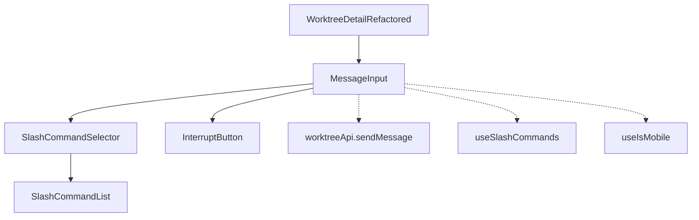
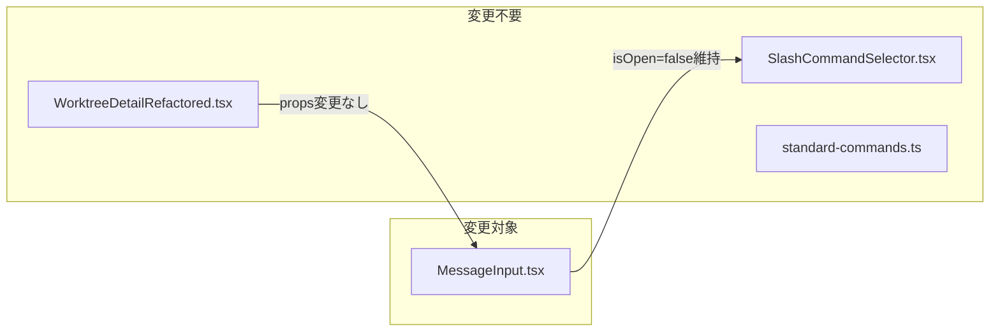
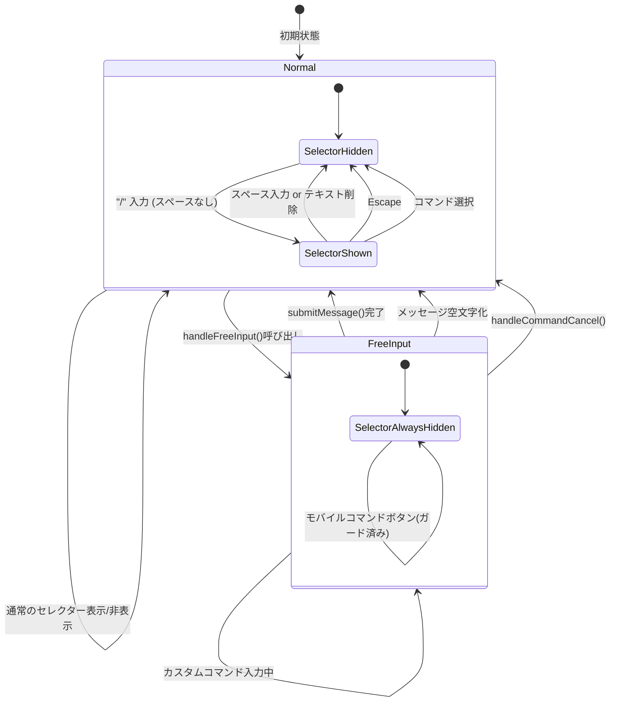

# Issue #288 設計方針書: フリー入力モードのセレクター再表示バグ修正

## 1. 概要

### 対象Issue
- **Issue #288**: Enter custom command選択後、カスタムコマンド入力中にセレクターが再表示されEnterで送信できない

### 問題の本質
`handleFreeInput()` でセレクターを閉じて `/` をセットした後、ユーザーが続けて文字を入力すると `handleMessageChange` のセレクター表示条件 (`newValue.startsWith('/') && !newValue.includes(' ')`) に合致し、セレクターが再表示される。セレクターが開いている間はEnterキーがセレクター操作に消費され、メッセージ送信ができない。

### 設計方針
`MessageInput` コンポーネント内に `isFreeInputMode` フラグ（`useState<boolean>`）を追加し、フリー入力モード中はセレクター再表示ロジックをスキップする。

---

## 2. アーキテクチャ設計

### コンポーネント関係図



### 変更スコープ



**設計原則**: 変更は `MessageInput.tsx` の内部状態追加に限定する。propsインターフェース (`MessageInputProps`) に変更は加えない。

---

## 3. 状態遷移設計

### isFreeInputMode 状態遷移図



### 関数別のフラグ操作

| 関数 | フラグ操作 | 条件 |
|------|----------|------|
| `handleFreeInput()` | `true` に設定 | 常時 |
| `submitMessage()` | `false` にリセット | メッセージ送信成功時（`setMessage('')` と同時） |
| `handleMessageChange()` | `false` にリセット | `newValue === ''` の場合のみ |
| `handleCommandCancel()` | `false` にリセット | 常時 |

### showCommandSelector 変更経路の網羅分析

> **レビュー反映 (Stage 2 SF-001)**: フリー入力モード中に `showCommandSelector` が `true` になる経路を網羅的に分析した結果、以下の経路が存在する。

| # | 経路 | フリー入力モード中の到達可否 | 対応 |
|---|------|--------------------------|------|
| 1 | `handleMessageChange()` 内のセレクター表示ロジック | 到達不可（`isFreeInputMode` 早期リターンでスキップ） | 既存ガードで対応済み |
| 2 | モバイルコマンドボタン `onClick={() => setShowCommandSelector(true)}` (L218) | **到達可能** | Section 4-6 でガード追加 |
| 3 | `handleFreeInput()` 自体 | N/A（`setShowCommandSelector(false)` を実行） | 問題なし |

**経路 2 の問題**: モバイル環境でフリー入力モード中にコマンドボタンをタップすると、`isFreeInputMode` をチェックせずに `setShowCommandSelector(true)` が直接実行される。これにより、フリー入力モード中にセレクターが再表示され、Desktop と同様の問題が発生する。対応方針は Section 4-6 に記載。

---

## 4. 詳細設計

### 4-1. 新規ステート追加

```typescript
const [isFreeInputMode, setIsFreeInputMode] = useState(false);
```

**設計根拠 (SF-001)**: `useRef` ではなく `useState` を使用する。理由：
- テスト時にReactの再レンダリングサイクルで状態を確認可能
- 現時点ではフラグチェックが `handleMessageChange` 内のみだが、`useState` の方がReactの慣例に沿う

> **レビュー反映 (Stage 1 SF-001)**: 当初の根拠に「将来的にフリー入力モードのUI表示が必要になった場合」という記載があったが、YAGNI原則に抵触するため削除した。`useState` 採用の根拠は「テスト容易性」と「React慣例」の2点に限定する。

### 4-2. handleFreeInput() の修正

```typescript
const handleFreeInput = () => {
  setShowCommandSelector(false);
  setIsFreeInputMode(true);  // ← 追加
  setMessage('/');
  setTimeout(() => {
    textareaRef.current?.focus();
  }, 50);
};
```

### 4-3. handleMessageChange() の修正

```typescript
const handleMessageChange = (e: React.ChangeEvent<HTMLTextAreaElement>) => {
  const newValue = e.target.value;
  setMessage(newValue);

  // フリー入力モードのリセット: メッセージ全削除時
  if (newValue === '') {
    setIsFreeInputMode(false);
    setShowCommandSelector(false);
    return;
  }

  // フリー入力モード中はセレクター表示をスキップ
  // NOTE: ここで setShowCommandSelector(false) は不要。
  // handleFreeInput() 内で既に setShowCommandSelector(false) を実行済みであり、
  // handleMessageChange 経由で showCommandSelector が true になる経路は存在しないため。
  // モバイルコマンドボタン経由の経路は Section 4-6 で別途ガード済み。
  // (Stage 1 SF-002: 防御的プログラミングとして冗長な再セットを検討したが、
  //  経路分析の結果、到達不可能なケースへのガードは KISS 原則に反するため不採用)
  // (Stage 2 SF-001: モバイルコマンドボタン経路を追加分析し、Section 4-6 で対応)
  if (isFreeInputMode) {
    return;
  }

  // 通常のセレクター表示ロジック
  if (newValue === '/' || (newValue.startsWith('/') && !newValue.includes(' '))) {
    setShowCommandSelector(true);
  } else {
    setShowCommandSelector(false);
  }
};
```

**設計根拠 (MF-001)**: `isFreeInputMode` チェックは `newValue === ''` チェックの後に配置する。空文字時にフラグをリセットする必要があるため、順序が重要。

**設計根拠 (SF-002-response)**: `isFreeInputMode` 早期リターン時に `setShowCommandSelector(false)` を冗長に呼ばない理由：
- `handleFreeInput()` が `setShowCommandSelector(false)` を実行済み
- `handleMessageChange` 経由で `showCommandSelector` が `true` になる経路は存在しない（セレクター表示ロジックは `isFreeInputMode` チェックでスキップされるため）
- モバイルコマンドボタン経由の経路は Section 4-6 で別途ガード済み（Stage 2 SF-001 で発見）
- 防御的プログラミングとして冗長なセットを追加する案も検討したが、到達不可能なケースへのガードは KISS 原則に反するため不採用とした
- 代わりに、コード内コメントで経路分析結果を明記し、将来のメンテナーへの理解を促進する

### 4-4. submitMessage() の修正

```typescript
const submitMessage = async () => {
  if (isComposing || !message.trim() || sending) {
    return;
  }

  try {
    setSending(true);
    setError(null);
    const effectiveCliTool: CLIToolType = cliToolId || 'claude';
    await worktreeApi.sendMessage(worktreeId, message.trim(), effectiveCliTool);
    setMessage('');
    setIsFreeInputMode(false);  // ← 追加
    onMessageSent?.(effectiveCliTool);
  } catch (err) {
    setError(handleApiError(err));
  } finally {
    setSending(false);
  }
};
```

### 4-5. handleCommandCancel() の修正

```typescript
const handleCommandCancel = () => {
  setShowCommandSelector(false);
  setIsFreeInputMode(false);  // ← 追加
  textareaRef.current?.focus();
};
```

**設計根拠 (SF-002)**: Escapeキー押下でセレクターを閉じた際にもフラグをリセットする。ユーザーがフリー入力モードをキャンセルして通常操作に戻れるようにするため。

### 4-6. モバイルコマンドボタンの isFreeInputMode ガード追加

> **レビュー反映 (Stage 2 SF-001)**: モバイル環境でフリー入力モード中にコマンドボタンをタップした場合のバイパス経路に対するガードを追加する。

**対応方針**: モバイルコマンドボタンのクリックハンドラで `isFreeInputMode` をチェックし、フリー入力モード中はフラグをリセットしてからセレクターを表示する。これにより、ユーザーがフリー入力をやめてコマンド選択に切り替える意図を尊重する。

```typescript
// 変更前 (L218)
onClick={() => setShowCommandSelector(true)}

// 変更後
onClick={() => {
  if (isFreeInputMode) {
    setIsFreeInputMode(false);
  }
  setShowCommandSelector(true);
}}
```

**設計根拠 (Stage 2 SF-001)**: モバイルコマンドボタンをタップする操作は、ユーザーがフリー入力モードを中断してコマンド選択に戻る意図的な操作と解釈する。このため、`isFreeInputMode` をリセットした上でセレクターを表示する。フリー入力モード中にセレクター表示をブロックする（何も起きない）案も検討したが、ユーザーの操作意図を無視することになるため不採用とした。

---

## 5. テスト設計

### 5-1. 新規テストケース（MessageInput.test.tsx）

| テストケース | 検証内容 | 優先度 |
|-------------|---------|--------|
| TC-1 | handleFreeInput後にカスタムコマンド入力してもセレクターが非表示 | Must |
| TC-2 | handleFreeInput後にEnterキーでsubmitMessageが呼ばれる | Must |
| TC-3 | フリー入力モードでメッセージ全削除後、再度`/`入力でセレクター表示 | Must |
| TC-4 | submitMessage後にisFreeInputModeがリセットされる | Must |
| TC-5 | handleCommandCancel後にisFreeInputModeがリセットされる | Should |
| TC-6 | 通常の`/`入力時のセレクター表示は従来通り動作する | Must |
| TC-7 | モバイルでフリー入力モード中にコマンドボタンタップでisFreeInputModeがリセットされセレクター表示 | Must |

### 5-2. テスト実装方針

テストでは `useSlashCommands` モックにコマンドグループを返すように設定し、`SlashCommandSelector` が描画される状態でフリー入力ボタンをクリックしてから各シナリオを検証する。

```typescript
// テスト用モック設定
vi.mock('@/hooks/useSlashCommands', () => ({
  useSlashCommands: vi.fn(() => ({
    groups: [
      {
        name: 'Test',
        commands: [{ name: 'test', description: 'Test command' }],
      },
    ],
  })),
}));
```

---

## 6. 影響範囲

### 変更ファイル

| ファイル | 変更種別 | 変更内容 |
|---------|---------|---------|
| `src/components/worktree/MessageInput.tsx` | 修正 | `isFreeInputMode` ステート追加、4関数の修正、モバイルコマンドボタンのガード追加 |
| `tests/unit/components/worktree/MessageInput.test.tsx` | 追加 | フリー入力モードのテストケース追加 |

### 変更不要ファイル

| ファイル | 理由 |
|---------|------|
| `src/components/worktree/SlashCommandSelector.tsx` | `isOpen=false` により既存のガードで正常動作（L95: `handleKeyDown` 内の `if (!isOpen) return` キーボードハンドラガード + L131: `if (!isOpen) return null` レンダリングガード） |
| `src/components/worktree/WorktreeDetailRefactored.tsx` | `MessageInputProps` 変更なし |
| `src/lib/standard-commands.ts` | コマンド定義に変更なし |

### 破壊的変更
- **なし**: `MessageInputProps` インターフェースは変更されない。`isFreeInputMode` はコンポーネント内部状態。

---

## 7. セキュリティ考慮

- **XSS**: 本変更はUIステート管理のみ。ユーザー入力のサニタイズには影響なし（既存の `message.trim()` による送信処理は変更なし）
- **入力バリデーション**: 既存の `!message.trim() || sending` ガードは維持される
- **リスクレベル**: 低（内部ステート追加のみ）

---

## 8. 設計上の決定事項とトレードオフ

### 採用した設計

| 決定事項 | 理由 | トレードオフ |
|---------|------|-------------|
| `useState` でフラグ管理 | Reactの慣例に沿う、テスト容易性 | `useRef` より再レンダリングコスト（微小） |
| `handleMessageChange` 内でフラグチェック | 既存ロジックの最小変更 | 条件分岐が1段階増える |
| 空文字時にフラグリセット | ユーザーが手動削除→再入力の自然な操作をサポート | なし |

### 不採用の代替案

#### 代替案1: セレクター表示条件にスペース以外のガードを追加
- `handleFreeInput` 呼び出し後のメッセージ（例: `/model`）を正規表現でフィルタ
- **不採用理由**: コマンド名のパターンが不定であり、汎用的なガード条件を定義困難。KISS原則に反する。

#### 代替案2: `handleFreeInput` で特殊プレフィックスをセット
- メッセージに不可視の識別子を埋め込む
- **不採用理由**: メッセージ送信時にプレフィックス除去が必要。副作用が大きく保守性が低い。

#### 代替案3: `SlashCommandSelector` 側で制御
- `SlashCommandSelector` に `disableAutoOpen` propを追加
- **不採用理由**: props変更が必要で影響範囲が拡大。問題の根本は `MessageInput` 側のセレクター表示ロジックにあるため、責務の分離としても不適切。

---

## 9. CLAUDE.md準拠確認

| 原則 | 準拠状況 |
|------|---------|
| SOLID - SRP | ✅ `MessageInput` 内の状態管理修正のみ。他コンポーネントに変更波及なし |
| SOLID - OCP | ✅ 既存インターフェースに変更なし |
| KISS | ✅ booleanフラグ1つの追加で解決。過剰な抽象化なし |
| YAGNI | ✅ 現在の問題解決に必要な最小限の変更のみ |
| DRY | ✅ フラグリセットロジックは各関数の責務に合わせて配置 |

---

## 10. レビュー履歴

| Stage | レビュー名 | 日付 | ステータス | スコア |
|-------|----------|------|----------|--------|
| Stage 1 | 通常レビュー（設計原則） | 2026-02-17 | approved | 5 |
| Stage 2 | 整合性レビュー | 2026-02-17 | conditionally_approved | 4 |

---

## 11. レビュー指摘事項サマリー

### Stage 1: 通常レビュー

#### Must Fix (0件)

なし。

#### Should Fix (2件)

| ID | タイトル | 重要度 | 原則 | 対応状況 |
|----|---------|--------|------|---------|
| SF-001 | useState vs useRef の設計根拠における YAGNI 考慮 | low | YAGNI | 反映済み (Section 4-1) |
| SF-002 | handleMessageChange 内の isFreeInputMode チェックにおける早期リターン後のコメント明確化 | low | KISS | 反映済み (Section 4-3) |

**SF-001 詳細**: 設計書 SF-001 で useState を採用した根拠に「将来的にフリー入力モードのUI表示が必要になった場合に再レンダリングが必要」と記載していたが、YAGNI 原則に抵触するため、根拠を「テスト容易性」と「React慣例」の2点に限定した。

**SF-002 詳細**: handleMessageChange 内で isFreeInputMode が true の場合の早期リターン時に、showCommandSelector を明示的に false にセットする必要がないことの経路分析結果をコードコメントとして残す。handleFreeInput() 内で既に setShowCommandSelector(false) を実行済みであり、フリー入力モード中に showCommandSelector が true になる経路は存在しない。防御的プログラミングとして冗長なセットを追加する案も検討したが、KISS 原則に基づき不採用とした。

#### Consider (3件 - 今後の検討事項)

| ID | タイトル | 原則 | 備考 |
|----|---------|------|------|
| C-001 | SlashCommandSelector の global keydown リスナーと handleKeyDown の責務分離 | SRP | Issue #288 修正範囲外。SlashCommandSelector.tsx の keydown リスナーと MessageInput の handleKeyDown が同じキーイベントを制御している責務重複を将来的に整理すべき |
| C-002 | TC-5 handleCommandCancel テストの優先度昇格検討 | テスト品質 | Escape キー操作はユーザーの自然な操作フローに含まれるため、TC-5 を Must 優先度へ昇格することを検討 |
| C-003 | isFreeInputMode フラグ名の明確性 | KISS/可読性 | isSelectorSuppressed, isCustomCommandEntry 等の代替名を検討可能だが、現在の命名で十分理解可能 |

### Stage 2: 整合性レビュー

#### Must Fix (0件)

なし。

#### Should Fix (2件)

| ID | タイトル | 重要度 | 原則 | 対応状況 |
|----|---------|--------|------|---------|
| SF-001 | モバイルコマンドボタンによる isFreeInputMode バイパス経路の未記載 | medium | 整合性 | 反映済み (Section 3, 4-3, 4-6) |
| SF-002 | SlashCommandSelector ガード行番号の参照先不正確 | low | 整合性 | 反映済み (Section 6) |

**SF-001 詳細**: 設計書 Section 3 の状態遷移図と Section 4-3 の経路分析コメントでは「フリー入力モード中に showCommandSelector が true になる経路は存在しない」と断言していたが、MessageInput.tsx L218 のモバイルコマンドボタン `onClick={() => setShowCommandSelector(true)}` が `isFreeInputMode` をチェックせずに直接 `showCommandSelector` を `true` にセットする経路が存在した。対応として、Section 3 の状態遷移図にモバイルボタン経路を追加し、Section 4-3 のコメントを修正、Section 4-6 にモバイルコマンドボタンへのガード追加の詳細設計を追加した。ガードの方針は「フリー入力モードをリセットしてセレクターを表示する」（ユーザーの操作意図を尊重）。

**SF-002 詳細**: 設計書 Section 6 の変更不要ファイル欄で「L95: `if (!isOpen) return`」と記載されていたが、L95 は `handleKeyDown` コールバック内の早期リターンであり、コンポーネントのレンダリングガード（`return null`）は L131 に存在する。両方のガード（L95 のキーボードハンドラガード + L131 のレンダリングガード）を明記するよう修正した。

#### Consider (2件 - 今後の検討事項)

| ID | タイトル | 原則 | 備考 |
|----|---------|------|------|
| C-001 | handleKeyDown 内の showCommandSelector チェックとの整合性ドキュメント化 | 整合性/ドキュメント品質 | FreeInput 状態での Enter キー処理フロー（showCommandSelector=false のため submitMessage に到達）を状態遷移図に記載することを検討。TC-2 でテストカバーされるため実装上の問題はない |
| C-002 | コンポーネント関係図における InterruptButton の記載と依存関係の正確性 | 整合性 | handleApiError の依存が図に含まれていない点は些末であり修正不要 |

### リスク評価

| カテゴリ | リスクレベル |
|---------|------------|
| 技術リスク | low |
| セキュリティリスク | low |
| 運用リスク | low |

---

## 12. 実装チェックリスト

### コード実装

- [ ] `MessageInput.tsx` に `isFreeInputMode` ステート (`useState<boolean>(false)`) を追加
- [ ] `handleFreeInput()` に `setIsFreeInputMode(true)` を追加
- [ ] `handleMessageChange()` に空文字判定時の `setIsFreeInputMode(false)` を追加
- [ ] `handleMessageChange()` に `isFreeInputMode` 時の早期リターンを追加
- [ ] `handleMessageChange()` の `isFreeInputMode` 早期リターン箇所に経路分析コメントを追加 (Stage 1 SF-002)
- [ ] `submitMessage()` に `setIsFreeInputMode(false)` を追加 (`setMessage('')` と同時)
- [ ] `handleCommandCancel()` に `setIsFreeInputMode(false)` を追加
- [ ] モバイルコマンドボタン (L218) の `onClick` ハンドラに `isFreeInputMode` ガードを追加: フリー入力モード中は `setIsFreeInputMode(false)` してからセレクター表示 (Stage 2 SF-001)

### テスト実装

- [ ] TC-1: handleFreeInput後にカスタムコマンド入力してもセレクターが非表示 (Must)
- [ ] TC-2: handleFreeInput後にEnterキーでsubmitMessageが呼ばれる (Must)
- [ ] TC-3: フリー入力モードでメッセージ全削除後、再度`/`入力でセレクター表示 (Must)
- [ ] TC-4: submitMessage後にisFreeInputModeがリセットされる (Must)
- [ ] TC-5: handleCommandCancel後にisFreeInputModeがリセットされる (Should -> Must昇格検討: Stage 1 C-002)
- [ ] TC-6: 通常の`/`入力時のセレクター表示は従来通り動作する (Must)
- [ ] TC-7: モバイルでフリー入力モード中にコマンドボタンタップでisFreeInputModeがリセットされセレクター表示 (Must) (Stage 2 SF-001)

### 設計根拠確認

- [ ] Stage 1 SF-001: useState 採用根拠が「テスト容易性」と「React慣例」のみであること (YAGNI準拠)
- [ ] Stage 1 SF-002: isFreeInputMode 早期リターン箇所のコードコメントに経路分析結果が含まれていること
- [ ] Stage 2 SF-001: モバイルコマンドボタンに isFreeInputMode ガードが実装されていること
- [ ] Stage 2 SF-001: handleMessageChange のコードコメントにモバイルボタン経路の分析結果が含まれていること
- [ ] Stage 2 SF-002: SlashCommandSelector のガード行番号が L95 (handleKeyDown) と L131 (レンダリング) の両方を参照していること（設計書のみ）

---

*Generated by design-policy command for Issue #288*
*Stage 1 review findings applied on 2026-02-17*
*Stage 2 review findings applied on 2026-02-17*
