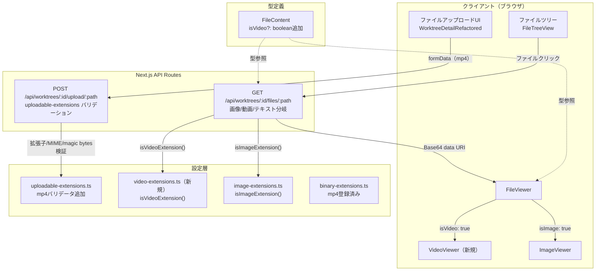

# Issue #302 設計方針書: mp4ファイルアップロード・再生機能

## 1. 概要

ワークツリーのファイル管理機能にmp4動画ファイルのアップロード・ブラウザ内再生機能を追加する。既存の画像ファイルパイプライン（upload→API→viewer）と同一のアーキテクチャパターンを拡張する。

## 2. アーキテクチャ設計

### システム構成図



### レイヤー構成

| レイヤー | ファイル | 役割 |
|---------|---------|------|
| 設定層 | `src/config/video-extensions.ts` | 動画拡張子定義・判定ユーティリティ |
| 設定層 | `src/config/uploadable-extensions.ts` | mp4バリデータ（MIME・magic bytes・サイズ） |
| 設定層 | `src/config/binary-extensions.ts` | `VIDEO_EXTENSIONS`のspread追加（DRY原則）**[DR-008]** |
| 型定義層 | `src/types/models.ts` | `FileContent.isVideo`フラグ |
| API層 | `src/app/api/.../files/.../route.ts` | 動画ファイルのBase64変換・レスポンス |
| API層 | `src/app/api/.../upload/.../route.ts` | サイズ検証最適化 |
| ページ層 | `src/app/worktrees/.../page.tsx` | 直接URLアクセス対応 |
| UI層 | `src/components/worktree/VideoViewer.tsx` | 動画再生コンポーネント |
| UI層 | `src/components/worktree/FileViewer.tsx` | 動画表示分岐・canCopy修正 |
| 設定層 | `next.config.js` | bodySizeLimit・CSP設定 |

## 3. 設計パターン

### 3-1. 既存パターンの拡張（Strategy パターン準拠）

画像ファイルのパイプラインと同一のパターンを動画に適用する:

```
image-extensions.ts  → video-extensions.ts（新規）
ImageViewer.tsx      → VideoViewer.tsx（新規）
isImageExtension()   → isVideoExtension()（新規）
isImage: true        → isVideo: true
```

**設計根拠**: CLAUDE.mdに記載の`ImageViewer`と同じパターンで`VideoViewer`を実装（統一性のある設計）に準拠。

### 3-2. video-extensions.ts の設計

`image-extensions.ts`と同一のインターフェース構造を採用:

```typescript
// src/config/video-extensions.ts

export const VIDEO_EXTENSIONS: readonly string[] = ['.mp4'] as const;

export const VIDEO_MAX_SIZE_BYTES = 15 * 1024 * 1024; // 15MB

export interface VideoExtensionValidator {
  extension: string;
  mimeType: string;
  magicBytes?: number[];
  magicBytesOffset?: number;
}

export const VIDEO_EXTENSION_VALIDATORS: VideoExtensionValidator[] = [
  {
    extension: '.mp4',
    mimeType: 'video/mp4',
    magicBytes: [0x66, 0x74, 0x79, 0x70], // 'ftyp' (ISOBMFF)
    magicBytesOffset: 4, // 先頭4バイトはbox size
  },
];

export function isVideoExtension(ext: string): boolean { /* ... */ }
export function getMimeTypeByVideoExtension(ext: string): string { /* ... */ }
export function validateVideoMagicBytes(extension: string, buffer: Buffer): boolean { /* ... */ }
export function normalizeExtension(ext: string): string { /* ... */ }
```

**[DRY]**: `normalizeExtension()`は`image-extensions.ts`からimportして共通化する（DRY原則）。重複定義は行わない。

> **[DR-001 反映]**: 既に`image-extensions.ts`（L104-107）に定義済みの`normalizeExtension()`を再定義せず、importして利用する。`binary-extensions.ts`や`uploadable-extensions.ts`で行われているインラインの`.toLowerCase()`処理も、将来的には同関数への統一を検討する。

**[DR-003 反映] 共通インターフェース検討**: `VideoExtensionValidator`は`ImageExtensionValidator`（`image-extensions.ts` L38-47）と完全に同一構造である。将来のメディアタイプ追加時には、共通の`BaseMediaExtensionValidator`インターフェースを`src/types/media.ts`に抽出し、`ImageExtensionValidator`と`VideoExtensionValidator`がそれをextendする形に統一することを検討する。`UploadableExtensionValidator`は`maxFileSize`等の追加フィールドがあるため別インターフェースのままとするが、`magicBytes`の定義方法（`magicBytesOffset` vs `MagicBytesDefinition.offset`）は統一が望ましい。

### 3-3. uploadable-extensions.ts のmp4追加

既存の`UPLOADABLE_EXTENSION_VALIDATORS`配列にmp4エントリを追加:

```typescript
// Video files
{
  extension: '.mp4',
  maxFileSize: 15 * 1024 * 1024, // 15MB (VIDEO_MAX_SIZE_BYTES)
  allowedMimeTypes: ['video/mp4'],
  magicBytes: [{ bytes: [0x66, 0x74, 0x79, 0x70], offset: 4 }], // ftyp at offset 4
},
```

### 3-4. FileContent型の拡張

```typescript
// src/types/models.ts
export interface FileContent {
  path: string;
  content: string;
  extension: string;
  worktreePath: string;
  isImage?: boolean;   // 既存
  isVideo?: boolean;   // 追加（オプショナル、後方互換性維持）
  mimeType?: string;   // 既存
}
```

**[後方互換性]**: `isVideo`はオプショナルフィールドのため、既存コードに影響なし。

### 3-5. GET API の動画分岐

`route.ts`のGETハンドラーに画像分岐と同じ構造で動画分岐を追加:

```typescript
// 既存: 画像判定
if (isImageExtension(ext)) { /* Base64変換、isImage: true */ }
// 追加: 動画判定
if (isVideoExtension(ext)) { /* Base64変換、isVideo: true */ }
// 既存: テキストファイル
// ...
```

> **[DR-004 反映] 共通ヘルパー関数の抽出検討**: 画像分岐と動画分岐は同一パターン（readFile -> validate -> Base64変換 -> JSON応答）であり、DRY原則の観点からは`processMediaFile(absolutePath, ext, mediaType)`のような共通ヘルパー関数に抽出することが望ましい。画像と動画で異なるのはバリデーション関数と`isImage`/`isVideo`フラグのみであり、パラメータで切り替え可能である。ただし、現時点ではmp4のみの追加であり、実装の複雑さとの兼ね合いで、直接的なif-else追加を許容する。3つ目のメディアタイプ追加時にはヘルパー関数への抽出を必須とする。

### 3-6. VideoViewer コンポーネント

`ImageViewer`と同一のパターン:

```typescript
// src/components/worktree/VideoViewer.tsx
'use client';

export interface VideoViewerProps {
  src: string;       // Base64 data URI
  alt: string;       // ファイル名
  mimeType?: string;
  onError?: () => void;
}

export function VideoViewer({ src, alt, onError }: VideoViewerProps) {
  // エラー状態管理（ImageViewerと同じパターン）
  // ローディングインジケーター（VideoViewer固有）
  // HTML5 <video controls> タグ
}
```

### 3-7. FileViewer の動画分岐

```typescript
// 既存: content.isImage → ImageViewer
// 追加: content.isVideo → VideoViewer
// canCopy修正: !content.isImage && !content.isVideo
```

> **[DR-002 反映] OCP将来拡張方針**: 現在の`isImage`/`isVideo`による条件分岐はOCP（開放閉鎖原則）に厳密には反するが、現時点ではmp4のみの追加であり、YAGNI原則との兼ね合いでif-else追加は許容範囲内とする。ただし、`canCopy`ロジックの否定条件連鎖（`!content.isImage && !content.isVideo`）が3つ以上のメディアタイプに拡大した場合、以下のリファクタリングを実施すること:
> - `FileContent`型に`mediaType?: 'image' | 'video' | 'audio' | 'text'`フィールドを導入
> - FileViewer内でswitch文またはマッピングテーブル（`Record<MediaType, ComponentType>`）によるViewerコンポーネント選択パターンに変更
> - `canCopy`は`mediaType === 'text' || mediaType === undefined`で判定

### 3-8. page.tsx の型統一・メディア対応

```typescript
// Before: ローカルFileContent型（isImage/isVideo未定義）
interface FileContent { path; content; extension; worktreePath; }

// After: models.tsからimport（DRY原則）
import { FileContent } from '@/types/models';
// + ImageViewer/VideoViewer統合
```

## 4. セキュリティ設計

### 4-1. ファイルアップロードバリデーション（多層防御）

| レイヤー | 検証内容 | 実装箇所 |
|---------|---------|---------|
| 1. 拡張子ホワイトリスト | `.mp4`のみ許可 | `uploadable-extensions.ts` |
| 2. MIMEタイプ検証 | `video/mp4`のみ許可 | `uploadable-extensions.ts` |
| 3. magic bytes検証 | offset 4で`ftyp`シグネチャ | `uploadable-extensions.ts` |
| 4. ファイルサイズ制限 | 15MB上限 | `uploadable-extensions.ts` / upload API |
| 5. ファイル名バリデーション | 既存の`isValidNewName()` | upload API |

### 4-2. MP4 magic bytes仕様

MP4ファイルはISO Base Media File Format (ISOBMFF)に準拠:

```
Offset 0-3: Box size (4バイト、可変)
Offset 4-7: Box type = "ftyp" (0x66, 0x74, 0x79, 0x70)
```

**検証方法**: `magicBytes: [{ bytes: [0x66, 0x74, 0x79, 0x70], offset: 4 }]`

### 4-3. CSP（Content Security Policy）

```
media-src 'self' data:
```

- `'self'`: 同一オリジンからのメディアソースを許可
- `data:`: Base64 data URIを許可
- `blob:`: 現時点では不要（Base64方式のため）。将来ストリーミング方式に移行する場合に追加検討

### 4-4. bodySizeLimit の適用範囲

`next.config.js`の`experimental.serverActions.bodySizeLimit`はServer Actions専用設定:
- Route Handler（upload API）への適用は保証されない
- 実装時に15MBのmp4ファイルで実アップロードテストを行い検証する
- 適用されない場合: upload APIの`route.ts`に個別のサイズ設定を追加

## 5. パフォーマンス設計

### 5-1. Base64 data URI方式

| 項目 | 値 |
|------|-----|
| 最大ファイルサイズ | 15MB |
| Base64エンコード後 | 約20MB（1.33倍） |
| レスポンスJSONサイズ | 約20MB |
| ストリーミング | 不要（15MB以下） |

### 5-2. upload APIのサイズ検証最適化

現状の実装では`file.arrayBuffer()`→`Buffer.from()`の後にサイズ検証を行っている。
15MB上限引き上げに伴い、サイズ超過ファイルを早期に拒否するよう最適化:

```typescript
// Before（現状）:
const arrayBuffer = await file.arrayBuffer();  // メモリ消費
const buffer = Buffer.from(arrayBuffer);       // さらにメモリ消費
// ... magic bytes検証 ...
if (fileSize > maxSize) { /* 拒否 */ }         // 遅すぎる

// After（最適化）:
const maxSize = getMaxFileSize(ext);
if (fileSize > maxSize) { /* 早期拒否 */ }     // メモリ消費前に拒否
const arrayBuffer = await file.arrayBuffer();
const buffer = Buffer.from(arrayBuffer);
```

### 5-3. VideoViewerのUX考慮

- ローディングインジケーター: 大容量データのロード中にスピナー表示
- `<video>`タグの`preload="metadata"`: メタデータのみ先行ロード
- 将来的なストリーミング対応: 利用頻度が高くなった場合に検討

## 6. データモデル設計

### FileContent型（既存拡張）

```typescript
interface FileContent {
  path: string;         // ファイルパス（相対）
  content: string;      // テキスト or Base64 data URI
  extension: string;    // 拡張子（ドットなし）
  worktreePath: string; // ワークツリールートパス
  isImage?: boolean;    // 画像フラグ（既存）
  isVideo?: boolean;    // 動画フラグ（新規、オプショナル）
  mimeType?: string;    // MIMEタイプ（既存）
}
```

### データフロー

```
Upload: mp4 → formData → 拡張子/MIME/size/magic検証 → ディスク保存
表示:   ファイルクリック → GET API → isVideoExtension判定 → readFile → Base64変換
        → { isVideo: true, content: "data:video/mp4;base64,..." }
        → FileViewer → VideoViewer → <video controls>
```

## 7. 設計上の決定事項とトレードオフ

| 決定事項 | 理由 | トレードオフ |
|---------|------|-------------|
| Base64 data URI方式 | 既存画像パイプラインとの統一性、シンプル実装 | 15MBファイルで約20MBのJSONレスポンス（メモリ使用量増加） |
| mp4のみ対応 | スコープ限定、最も普及した動画形式 | webm/movは対象外 |
| 15MBサイズ上限 | デモ動画の想定サイズ | 長時間動画は非対応 |
| video-extensions.ts独立ファイル | image-extensions.tsとの整合性、SRP | ファイル数増加 |
| page.tsxの型をmodels.tsからimport | DRY原則、型乖離防止 | page.tsxの変更が大きくなる（**DR-006**: 独立した改善。コミット分離推奨） |
| controls属性使用 | ブラウザネイティブUI、実装コスト低 | カスタムUIの柔軟性は失う |
| サイズ検証順序最適化 | メモリ効率、大容量ファイル対応 | magic bytes検証前にサイズ拒否（既存の検証順序変更） |

> **[DR-006 反映] page.tsxの型統一に関する注記**: section 3-8 のpage.tsxローカルFileContent型のmodels.tsからのimport統一は、Issue #302（mp4アップロード機能）の直接的なスコープではなく、既存の画像表示に対するDRY改善でもある。Issue #302に含めて実施して問題ないが、変更理由の追跡性向上のため以下の対応を推奨する:
> - コミット分離: `refactor: unify FileContent type in page.tsx (DRY)` と `feat: add mp4 video support` を別コミットとする
> - または、PRの説明で page.tsx の型統一が既存の不整合修正を兼ねていることを明示的に言及する

### 代替案との比較

| 代替案 | メリット | デメリット | 判断 |
|--------|---------|-----------|------|
| ストリーミング方式 | メモリ効率、大容量対応 | 実装複雑、既存パターン逸脱 | 将来検討 |
| uploadable-extensions.tsに直接追加 | ファイル数削減 | SRP違反、image-extensions.tsとの不整合 | 不採用 |
| page.tsxにisVideoのみ追加 | 最小変更 | DRY違反、isImage未対応の不整合残存 | 不採用 |

## 8. テスト設計

### ユニットテスト

| テストファイル | テスト対象 | テストケース |
|-------------|----------|------------|
| `video-extensions.test.ts`（新規） | `isVideoExtension()` | `.mp4`→true、`.avi`→false、大文字→正規化 |
| | `getMimeTypeByVideoExtension()` | `.mp4`→`video/mp4`、未知→`application/octet-stream` |
| | `validateVideoMagicBytes()` | 正常mp4→true、偽装ファイル→false、短いバッファ→false |
| `uploadable-extensions.test.ts` | `isUploadableExtension('.mp4')` | true |
| | `validateMimeType('.mp4', 'video/mp4')` | true |
| | `validateMagicBytes('.mp4', buffer)` | ftyp at offset 4 |
| | `getMaxFileSize('.mp4')` | 15MB |

### 結合テスト

| テストファイル | テスト対象 | テストケース |
|-------------|----------|------------|
| `file-upload.test.ts` | POST upload API | mp4アップロード成功、サイズ超過拒否、magic bytes不正拒否 |
| `api-file-operations.test.ts` | GET files API | mp4ファイル取得→isVideo: true、Base64 data URI |

## 9. 実装順序

```
1. src/config/video-extensions.ts（新規、normalizeExtensionはimage-extensions.tsからimport）+ テスト
2. src/config/uploadable-extensions.ts（mp4追加）+ テスト
3. src/config/binary-extensions.ts（VIDEO_EXTENSIONSのspread追加）[DR-008]
4. src/types/models.ts（isVideoフラグ追加）
5. src/app/api/.../files/.../route.ts（動画分岐追加）
6. src/app/api/.../upload/.../route.ts（サイズ検証最適化）
7. src/components/worktree/VideoViewer.tsx（新規）
8. src/components/worktree/FileViewer.tsx（動画分岐・canCopy修正）
9. src/app/worktrees/.../page.tsx（型統一・メディア対応、コミット分離推奨）[DR-006]
10. next.config.js（bodySizeLimit・CSP）
11. 結合テスト追加
```

## 10. 既知の技術的負債

### 10-1. ERROR_CODE_TO_HTTP_STATUS マッピングの重複 [DR-009]

**問題**: `files/route.ts`（L46-71）と`upload/route.ts`（L41-57）に同一の`ERROR_CODE_TO_HTTP_STATUS`マッピングが重複定義されている。Issue #302で`upload/route.ts`のサイズ検証順序を変更する際に、この重複がさらに乖離するリスクがある。

**推奨対応**: `ERROR_CODE_TO_HTTP_STATUS`を`src/lib/api-error-codes.ts`等の共通モジュールに抽出し、両`route.ts`からimportする形に統一する。

**Issue #302での対応方針**: Issue #302のスコープ外とする。ただし、Issue #302の実装時に両ファイルのマッピングに差異が生じないよう注意すること。将来的なリファクタリングIssueとして別途起票を推奨する。

### 10-2. normalizeExtension() の分散 [DR-001 関連]

**問題**: `normalizeExtension()`は`image-extensions.ts`に定義済みだが、`binary-extensions.ts`や`uploadable-extensions.ts`ではインラインの`.toLowerCase()`処理が行われている。

**Issue #302での対応方針**: `video-extensions.ts`では`image-extensions.ts`からimportして共通化する。既存ファイルのインラインロジック統一はIssue #302のスコープ外とする。

## 11. レビュー履歴

| 日付 | レビューステージ | ステータス | レビュー結果ファイル |
|------|---------------|-----------|-------------------|
| 2026-02-18 | Stage 1: 通常レビュー（設計原則） | 条件付き承認 | `dev-reports/issue/302/multi-stage-design-review/stage1-review-result.json` |

## 12. レビュー指摘事項サマリー

### Stage 1: 通常レビュー（設計原則） - 2026-02-18

| ID | 重要度 | 原則 | タイトル | 反映状況 |
|----|--------|------|---------|---------|
| DR-001 | Must Fix | DRY | normalizeExtension()の重複定義リスク | 反映済み（section 3-2） |
| DR-009 | Must Fix | DRY | ERROR_CODE_TO_HTTP_STATUS マッピングの重複 | 反映済み（section 10-1） |
| DR-002 | Should Fix | OCP | FileViewerのisImage/isVideo条件分岐がOCPに反する | 反映済み（section 3-7） |
| DR-003 | Should Fix | DRY | ImageExtensionValidatorとVideoExtensionValidatorの重複インターフェース | 反映済み（section 3-2） |
| DR-004 | Should Fix | DRY | GET APIの画像/動画処理ロジック重複 | 反映済み（section 3-5） |
| DR-006 | Should Fix | DRY | page.tsxの型統一は独立した改善 | 反映済み（section 7） |
| DR-008 | Should Fix | DRY | binary-extensions.tsへのVIDEO_EXTENSIONSのspread追加が未記載 | 反映済み（section 2） |
| DR-005 | Nice to Have | ISP | VideoViewerPropsのaltプロパティの命名 | スキップ |
| DR-007 | Nice to Have | SRP | video-extensions.tsのSRP準拠は適切 | スキップ（問題なし確認） |
| DR-010 | Nice to Have | KISS | Base64 data URI方式の15MBでの性能影響を明記すべき | スキップ |
| DR-011 | Nice to Have | YAGNI | VIDEO_EXTENSIONS配列が将来拡張を暗示する設計 | スキップ（問題なし確認） |

## 13. 実装チェックリスト（レビュー指摘反映）

### Must Fix

- [ ] **[DR-001]** `video-extensions.ts`の`normalizeExtension()`は`image-extensions.ts`からimportして使用する。独自実装は行わない
- [ ] **[DR-009]** `ERROR_CODE_TO_HTTP_STATUS`の重複に注意し、両`route.ts`のマッピングに差異が生じないようにする。リファクタリングIssue起票を検討

### Should Fix

- [ ] **[DR-002]** FileViewerの動画分岐実装時、3つ目のメディアタイプ追加時のリファクタリング方針をコードコメントとして記載
- [ ] **[DR-003]** `VideoExtensionValidator`は`ImageExtensionValidator`と同一構造であることを認識し、将来的な共通化を視野に入れる
- [ ] **[DR-004]** GET API動画分岐の実装時、画像処理との共通パターンを意識する。3つ目のメディアタイプ追加時には共通ヘルパー関数への抽出を必須とする
- [ ] **[DR-006]** page.tsxの型統一コミットをmp4機能追加コミットと分離する（推奨）
- [ ] **[DR-008]** `binary-extensions.ts`に`VIDEO_EXTENSIONS`をimportしてspreadする。既存のハードコード`.mp4`エントリを置き換える

---

*Issue #302: mp4ファイルをアップロード可能にしたい*
*作成日: 2026-02-18*
*最終更新: 2026-02-18（Stage 1レビュー指摘反映）*
