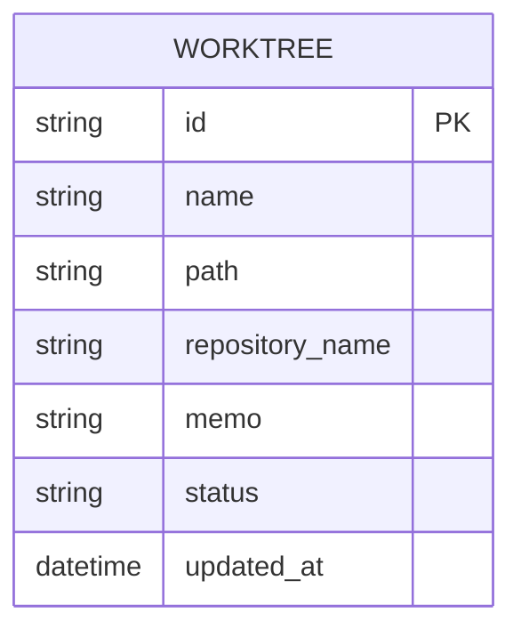

# サイドバーUX改善 設計方針書

**Issue**: #31
**作成日**: 2026-01-10
**ステータス**: Draft

---

## 1. 概要

### 1.1 背景・課題

ブランチ数が増加すると、サイドバーでの目的ブランチの特定が困難になる。また、Claude Codeの対応状況（処理中・完了・指示待ち）がリアルタイムで把握できないため、マルチタスク作業時の効率が低下している。

### 1.2 要件サマリ

| No | 要件 | 優先度 |
|----|------|--------|
| 1 | ソート順を選択可能にする（リポジトリ名、ブランチ名、対応状況） | High |
| 2 | Claude Codeからの対応状況を視覚的に表示（処理中、処理完了、yes/no指示あり） | High |
| 3 | 選択中ブランチにリポジトリ名とメモを表記 | Medium |

---

## 2. アーキテクチャ設計

### 2.1 システム構成図

```mermaid
graph TD
    subgraph Sidebar["サイドバーコンポーネント"]
        SortControl[ソートコントロール]
        BranchList[ブランチリスト]
        BranchItem[ブランチアイテム]
        StatusIndicator[ステータスインジケーター]
    end

    subgraph Context["状態管理"]
        SidebarContext[SidebarContext]
        WorktreeContext[WorktreeSelectionContext]
    end

    subgraph Backend["バックエンド"]
        API[/api/worktrees]
        DB[(SQLite)]
        TmuxCapture[tmuxキャプチャ]
    end

    SortControl --> SidebarContext
    BranchList --> WorktreeContext
    BranchItem --> StatusIndicator
    WorktreeContext --> API
    API --> DB
    TmuxCapture --> DB
```

### 2.2 コンポーネント階層

```
Sidebar.tsx (親コンポーネント)
├── SidebarHeader.tsx (ヘッダー - タイトル)
├── SortSelector.tsx (ソート選択UI) [新規]
├── SearchInput.tsx (検索ボックス) [既存ロジック分離]
└── BranchList (リスト)
    └── BranchListItem.tsx (個別アイテム) [拡張]
        ├── BranchStatusIndicator.tsx [既存]
        └── BranchDetails.tsx [新規: メモ表示]
```

---

## 3. 機能設計

### 3.1 ソート機能

#### 3.1.1 ソートオプション

| ソートキー | 説明 | ソート方向 |
|-----------|------|-----------|
| `updatedAt` | 更新日時（デフォルト） | 降順 |
| `repositoryName` | リポジトリ名 | 昇順（A→Z） |
| `branchName` | ブランチ名 | 昇順（A→Z） |
| `status` | 対応状況 | 優先度順（waiting > running > idle） |

#### 3.1.2 ソート状態管理

**選択肢A: SidebarContext拡張（推奨）**
- ソート設定をグローバルに保持
- ページリロード後も設定維持（localStorage連携）

```typescript
// src/contexts/SidebarContext.tsx 拡張
interface SidebarState {
  isOpen: boolean;
  width: number;
  isMobileDrawerOpen: boolean;
  sortKey: SortKey;        // 追加
  sortDirection: 'asc' | 'desc'; // 追加
}

type SortKey = 'updatedAt' | 'repositoryName' | 'branchName' | 'status';
```

**選択肢B: Sidebar内ローカル状態**
- シンプルだがリロードで設定消失

**決定**: 選択肢Aを採用。ユーザビリティ向上のため設定永続化を優先。

#### 3.1.3 ソートUI設計

```typescript
// src/components/sidebar/SortSelector.tsx
export interface SortSelectorProps {
  currentSort: SortKey;
  onSortChange: (key: SortKey) => void;
}
```

モバイル対応:
- ドロップダウンメニュー形式
- コンパクトなアイコン表示

### 3.2 対応状況表示

#### 3.2.1 ステータス定義

| ステータス | 表示 | 色 | アニメーション | 意味 | Issue #31要件 |
|-----------|------|-----|---------------|------|--------------|
| `idle` | ● | グレー | なし | セッション停止中 | 処理完了 |
| `running` | ● | 緑 | pulse | 処理実行中（AI応答生成含む） | 処理中 |
| `waiting` | ● | 黄 | pulse | ユーザー入力待ち（yes/no等） | yes/no指示あり |

**設計決定（2026-01-10）**:
- `generating`ステータスは使用しない（`running`に統合）
- 理由: ユーザー視点では「処理中」と「生成中」の区別は本質的でない
- 実装工数削減、データモデル変更不要

#### 3.2.2 ステータス判定ロジック

```typescript
// src/types/sidebar.ts - 既存ロジック（変更不要）
function determineBranchStatus(worktree: Worktree): BranchStatus {
  const claudeStatus = worktree.sessionStatusByCli?.claude;

  // AIがユーザーに質問中（yes/no等のプロンプト）
  if (claudeStatus?.isWaitingForResponse) return 'waiting';

  // セッション実行中（処理中 + AI応答生成中を統合）
  if (claudeStatus?.isRunning) return 'running';

  return 'idle';
}
```

**確定事項**:
- `isWaitingForResponse`: AIがユーザーに質問中（yes/no、選択肢等）
- `isRunning`: セッション実行中（ユーザー入力処理 + AI応答生成を含む）
- 既存ロジックで要件を満たすため、変更不要

### 3.3 選択中ブランチ表示改善

#### 3.3.1 表示項目

| 項目 | 現状 | 改善後 |
|------|------|--------|
| ブランチ名 | ○ | ○（太字強調） |
| リポジトリ名 | ○（2行目） | ○（アイコン付き） |
| メモ | × | ○（3行目、truncate表示） |
| ステータス | ○（ドット） | ○（ドット+ラベル） |

#### 3.3.2 レイアウト案

```
┌─────────────────────────────────────┐
│ ● feature/add-login               │ ← 選択中は背景色変更
│   📁 MyCodeBranchDesk             │
│   📝 認証機能の実装中...           │ ← メモ（省略表示）
└─────────────────────────────────────┘
```

**実装**: BranchListItemを拡張し、選択状態でメモを表示

```typescript
// src/components/sidebar/BranchListItem.tsx 拡張
export interface BranchListItemProps {
  branch: SidebarBranchItem;
  isSelected: boolean;
  onClick: () => void;
  showMemo?: boolean; // 追加: 選択時true
}
```

---

## 4. データモデル設計

### 4.1 既存モデルの活用



**変更不要**: 既存のWorktreeモデルでソート・表示に必要な全フィールドを保持済み。

### 4.2 SidebarBranchItem拡張

```typescript
// src/types/sidebar.ts
export interface SidebarBranchItem {
  id: string;
  name: string;
  repositoryName: string;
  status: BranchStatus;
  hasUnread: boolean;
  lastActivity?: Date;
  memo?: string;        // 追加
}
```

---

## 5. API設計

### 5.1 既存APIの活用

現状の`GET /api/worktrees`はソート済みデータ（`updated_at DESC`）を返却。

**クライアントサイドソートを採用**:
- データ量が少ない（通常10-50件）
- リアルタイムソート切り替えが必要
- サーバー負荷軽減

### 5.2 API変更不要

フロントエンドでソート処理を完結させるため、バックエンドAPI変更は不要。

---

## 6. UI/UX設計

### 6.1 ソートコントロール

```
┌─────────────────────────────────┐
│ Branches                     ▼ │ ← ソートドロップダウン
├─────────────────────────────────┤
│ 🔍 Search branches...          │
├─────────────────────────────────┤
│ ● develop                      │
│   MyCodeBranchDesk             │
│ ● feature/add-auth             │
│   MyCodeBranchDesk             │
│   📝 OAuth実装中               │ ← 選択時のみメモ表示
└─────────────────────────────────┘
```

### 6.2 ソートドロップダウンUI

```typescript
// ドロップダウンオプション
const sortOptions = [
  { key: 'updatedAt', label: '更新日時', icon: '🕐' },
  { key: 'repositoryName', label: 'リポジトリ名', icon: '📁' },
  { key: 'branchName', label: 'ブランチ名', icon: '🌿' },
  { key: 'status', label: '対応状況', icon: '📊' },
];
```

### 6.3 モバイル対応

- ソートアイコンのみ表示（スペース節約）
- タップでドロップダウン展開
- スワイプジェスチャーは今回対象外

---

## 7. 設計パターン

### 7.1 採用パターン

| パターン | 適用箇所 | 理由 |
|---------|---------|------|
| **Context Pattern** | ソート状態管理 | グローバル状態の共有 |
| **Compound Component** | SortSelector | 柔軟なUI構成 |
| **Memoization** | ソート結果 | 再計算コスト削減 |

### 7.2 ソート実装

```typescript
// src/lib/sidebar-utils.ts
export function sortBranches(
  branches: SidebarBranchItem[],
  sortKey: SortKey,
  direction: 'asc' | 'desc'
): SidebarBranchItem[] {
  const compareFn = getComparator(sortKey, direction);
  return [...branches].sort(compareFn);
}

function getComparator(
  key: SortKey,
  direction: 'asc' | 'desc'
): (a: SidebarBranchItem, b: SidebarBranchItem) => number {
  const multiplier = direction === 'asc' ? 1 : -1;

  switch (key) {
    case 'repositoryName':
      return (a, b) => multiplier * a.repositoryName.localeCompare(b.repositoryName);
    case 'branchName':
      return (a, b) => multiplier * a.name.localeCompare(b.name);
    case 'status':
      return (a, b) => multiplier * (statusPriority[a.status] - statusPriority[b.status]);
    case 'updatedAt':
    default:
      return (a, b) => multiplier * ((b.lastActivity?.getTime() ?? 0) - (a.lastActivity?.getTime() ?? 0));
  }
}

const statusPriority: Record<BranchStatus, number> = {
  waiting: 0,   // 最優先
  running: 1,
  generating: 2,
  idle: 3,
};
```

---

## 8. 実装計画

### 8.1 フェーズ分割

#### Phase 1: ソート機能（基盤）
1. SidebarContext拡張（ソート状態追加）
2. sortBranches関数実装
3. SortSelectorコンポーネント作成
4. Sidebar.tsxへの統合

#### Phase 2: メモ表示改善
1. SidebarBranchItemにmemoフィールド追加
2. BranchListItem拡張（メモ表示対応）
3. 選択状態での表示切り替え

#### Phase 3: ステータス表示改善
1. ステータスラベル表示オプション追加
2. generating状態の判定ロジック追加

### 8.2 ファイル変更一覧

| ファイル | 変更内容 |
|---------|---------|
| `src/contexts/SidebarContext.tsx` | ソート状態の追加 |
| `src/types/sidebar.ts` | SidebarBranchItemにmemo追加 |
| `src/components/sidebar/Sidebar.tsx` | SortSelector統合 |
| `src/components/sidebar/SortSelector.tsx` | 新規作成 |
| `src/components/sidebar/BranchListItem.tsx` | メモ表示対応 |
| `src/lib/sidebar-utils.ts` | ソートユーティリティ（新規） |

---

## 9. テスト計画

### 9.1 単体テスト

```typescript
// tests/unit/lib/sidebar-utils.test.ts
describe('sortBranches', () => {
  it('リポジトリ名で昇順ソートできる');
  it('ブランチ名で昇順ソートできる');
  it('ステータス優先度でソートできる');
  it('更新日時で降順ソートできる');
});
```

### 9.2 コンポーネントテスト

```typescript
// tests/unit/components/sidebar/SortSelector.test.tsx
describe('SortSelector', () => {
  it('現在のソートキーが選択状態で表示される');
  it('ソートオプション選択でonSortChangeが呼ばれる');
});
```

### 9.3 E2Eテスト

```typescript
// tests/e2e/sidebar-sort.spec.ts
test('サイドバーのソート機能', async ({ page }) => {
  // ソートドロップダウンを開く
  // リポジトリ名ソートを選択
  // ブランチリストの順序を確認
});
```

---

## 10. パフォーマンス設計

### 10.1 最適化戦略

| 対策 | 適用箇所 | 効果 |
|------|---------|------|
| `useMemo` | ソート結果 | 不要な再計算防止 |
| `memo` | BranchListItem | 不要な再レンダリング防止 |
| Virtualization | BranchList | 100件超の場合（将来対応） |

### 10.2 メモ化実装

```typescript
// Sidebar.tsx内
const sortedBranches = useMemo(() => {
  const items = worktrees.map(toBranchItem);
  const filtered = filterBySearch(items, searchQuery);
  return sortBranches(filtered, sortKey, sortDirection);
}, [worktrees, searchQuery, sortKey, sortDirection]);
```

---

## 11. 設計上の決定事項とトレードオフ

### 11.1 採用した設計

| 決定事項 | 理由 | トレードオフ |
|---------|------|-------------|
| クライアントサイドソート | リアルタイム切り替え、サーバー負荷軽減 | 大量データ時のメモリ使用 |
| SidebarContext拡張 | 設定永続化、コード一貫性 | Context肥大化 |
| メモは選択時のみ表示 | UI簡潔さ維持 | 一覧性低下 |

### 11.2 代替案との比較

#### サーバーサイドソート vs クライアントサイドソート

| 観点 | サーバーサイド | クライアントサイド |
|------|---------------|-------------------|
| 初期ロード | 遅い（クエリ変更） | 速い |
| ソート切り替え | 遅い（API再取得） | 即座 |
| 大量データ | 有利 | メモリ制約 |
| 実装複雑度 | 高い | 低い |

**結論**: 現在のデータ量（10-50件）ではクライアントサイドが最適。

---

## 12. セキュリティ考慮

### 12.1 リスク評価

| リスク | 対策 |
|--------|------|
| XSS（メモ表示） | React自動エスケープ、dangerouslySetInnerHTML不使用 |
| 不正入力 | ソートキーのenum制限 |

---

## 13. アクセシビリティ

### 13.1 対応項目

| 要素 | 対応 |
|------|------|
| ソートドロップダウン | `aria-expanded`, `aria-haspopup` |
| ステータスインジケーター | `aria-label`（既存） |
| キーボード操作 | Tab/Enter/Escでドロップダウン操作 |

---

## 14. 制約条件の確認

### CLAUDE.md準拠チェック

| 原則 | 準拠状況 |
|------|---------|
| SOLID | ○ SortSelector単一責任 |
| KISS | ○ 既存構造の最小変更 |
| YAGNI | ○ 必要機能のみ実装 |
| DRY | ○ ソートロジック共通化 |

---

## 15. 関連ドキュメント

- [Issue #31](https://github.com/Kewton/MyCodeBranchDesk/issues/31)
- [Issue #22 マルチタスク強化](https://github.com/Kewton/MyCodeBranchDesk/issues/22)

---

## 16. 承認

| 役割 | 担当 | 日付 | 署名 |
|------|------|------|------|
| 作成者 | Claude Code | 2026-01-10 | - |
| レビュアー | - | - | - |
| 承認者 | - | - | - |
