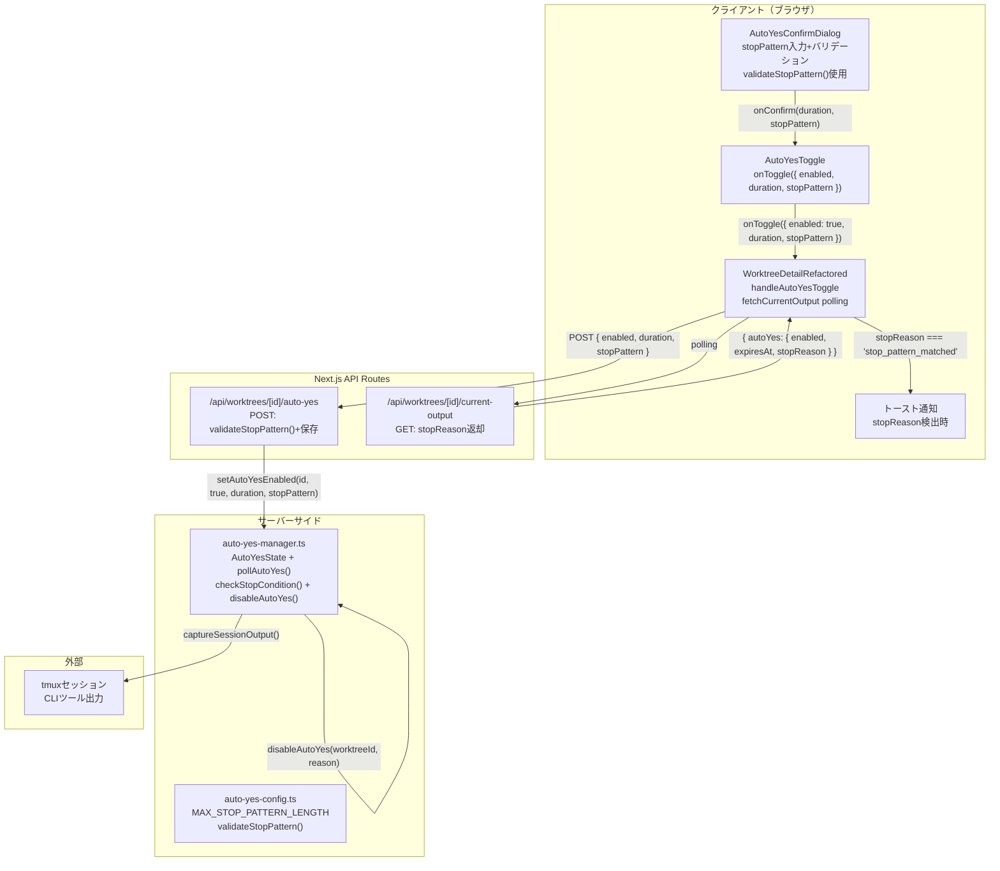
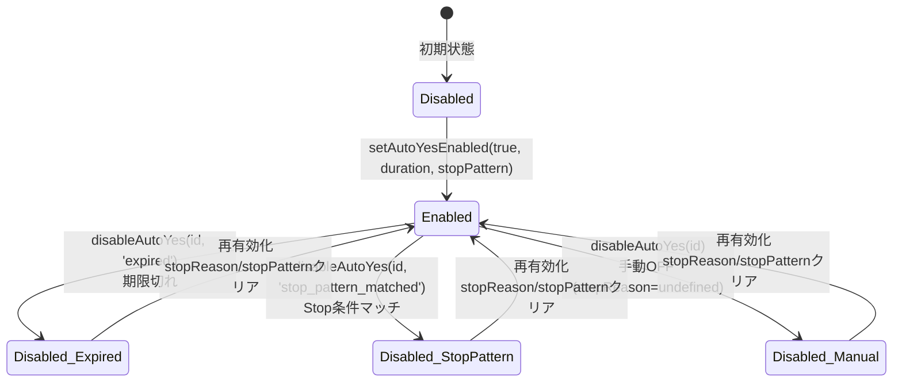

# Issue #314: Auto-Yes Stop条件機能 設計方針書

## 1. 概要

Auto-Yesモードにターミナル出力ベースのStop条件（正規表現）機能を追加する。ユーザーが指定した正規表現パターンにターミナル出力がマッチした場合、Auto-Yesを自動停止する。

### 対象Issue
- GitHub Issue #314: feat: Auto-Yesにターミナル出力のStop条件（正規表現）を追加

### 設計方針策定日
- 2026-02-19

### レビュー履歴

| Stage | レビュー日 | ステータス | スコア | 反映日 |
|-------|-----------|-----------|--------|--------|
| Stage 1: 設計原則 | 2026-02-19 | conditionally_approved | 4/5 | 2026-02-19 |
| Stage 2: 整合性 | 2026-02-19 | conditionally_approved | 4/5 | 2026-02-19 |
| Stage 3: 影響分析 | 2026-02-19 | conditionally_approved | 4/5 | 2026-02-19 |
| Stage 4: セキュリティ | 2026-02-19 | conditionally_approved | 3/5 | 2026-02-19 |

---

## 1.5. レビュー指摘事項サマリー

### Stage 1: 設計原則レビュー（2026-02-19）

| ID | 重要度 | カテゴリ | タイトル | 対応状況 |
|----|--------|---------|---------|---------|
| DS1-F001 | should_fix | SRP | pollAutoYes()への責務追加が過度に集中 | 反映済: checkStopCondition()独立関数を設計 |
| DS1-F002 | should_fix | DRY | 正規表現バリデーションロジックの重複 | 反映済: validateStopPattern()共通関数を設計 |
| DS1-F003 | must_fix | OCP | setAutoYesEnabled()のdisableパスでspread operatorによる暗黙的フィールド保持は脆弱 | 反映済: disableAutoYes()専用関数を設計 |
| DS1-F004 | nice_to_have | KISS | prevAutoYesEnabledRefによるトースト重複防止の複雑性 | 将来検討: useAutoYesStopNotificationフック抽出 |
| DS1-F005 | nice_to_have | YAGNI | stopReason 'expired'の新規追加は現時点で必要か | 現設計維持: 対称性の観点からexpiredも同時実装 |
| DS1-F006 | should_fix | ISP | AutoYesToggle.onToggleシグネチャの肥大化 | 反映済: オブジェクト引数パターンに変更 |
| DS1-F007 | nice_to_have | API設計 | stopReasonフィールドがenabled状態と独立して返却される | 反映済: API解釈ルールをJSDocで明記する方針追加 |
| DS1-F008 | nice_to_have | コンポーネント設計 | AutoYesConfirmDialogのstopPattern状態がダイアログ再表示時にリセットされない可能性 | 反映済: isOpen変更時のリセットuseEffectを追加 |
| DS1-F009 | should_fix | DIP | pollAutoYes()内でautoYesStates Mapを直接操作 | 反映済: disableAutoYes()経由でMap操作を排除 |

### Stage 2: 整合性レビュー（2026-02-19）

| ID | 重要度 | カテゴリ | タイトル | 対応状況 |
|----|--------|---------|---------|---------|
| DS2-F001 | must_fix | consistency | globalThis型宣言への影響が設計書に未記載 | 反映済: セクション3にglobalThis型宣言の注記を追加 |
| DS2-F002 | must_fix | consistency | setAutoYesEnabled()テスト呼び出し箇所（約15箇所）の影響未記載 | 反映済: セクション9にテスト影響を追記 |
| DS2-F003 | should_fix | consistency | disableAutoYes()への委譲と実装順序の注意 | 反映済: セクション13に実装順序を明記 |
| DS2-F004 | should_fix | consistency | stopPatternバリデーションの挿入位置が不明確 | 反映済: セクション4にバリデーション挿入位置を明記 |
| DS2-F005 | should_fix | consistency | current-output/route.tsのJSDoc追加が変更概要に未記載 | 反映済: セクション12の変更概要にJSDoc追加を明記 |
| DS2-F006 | should_fix | accuracy | onConfirm呼び出し時のstopPattern空文字正規化が不明確 | 反映済: セクション5にonConfirm呼び出し実装例を明記 |
| DS2-F007 | must_fix | consistency | AutoYesToggle.test.tsxテスト変更の具体的Before/After対応表が未記載 | 反映済: セクション9にBefore/After対応表を追加 |
| DS2-F008 | should_fix | consistency | fetchCurrentOutput()内のstopReason読み取り挿入位置が不具体的 | 反映済: セクション5にfetchCurrentOutput()挿入位置の詳細を追記 |
| DS2-F009 | nice_to_have | completeness | validateStopPattern()のモジュールJSDocにクライアント/サーバー共用の記載がない | 反映済: セクション7にモジュールJSDoc更新方針を追記 |
| DS2-F010 | should_fix | accuracy | captureSessionOutput()の第3引数が文字数上限である旨が不明確 | 反映済: セクション8にバッファサイズの明確な説明を追記 |
| DS2-F011 | nice_to_have | internal_consistency | i18n翻訳キーの具体的一覧が未記載 | 反映済: セクション12にi18n翻訳キー一覧を追加 |
| DS2-F012 | nice_to_have | internal_consistency | validateStopPattern()のエラーメッセージ方針が不明確 | 反映済: セクション7にエラーメッセージ方針を追記 |
| DS2-F013 | nice_to_have | completeness | checkStopCondition()のテスト戦略（export方針）が不明確 | 反映済: セクション9にcheckStopCondition()テスト戦略を追記 |

### Stage 3: 影響分析レビュー（2026-02-19）

| ID | 重要度 | カテゴリ | タイトル | 対応状況 |
|----|--------|---------|---------|---------|
| DS3-F001 | must_fix | type_impact | AutoYesToggleProps.onToggle変更がWorktreeDetailRefactoredの2箇所のレンダリング（L1811, L1950）とhandleAutoYesToggle（L1188）に影響 | 反映済: セクション5にWorktreeDetailRefactoredの2箇所レンダリングとhandleAutoYesToggleシグネチャ変更（L1188）を明記 |
| DS3-F002 | must_fix | type_impact | WorktreeDetailRefactored.tsx L85-88のCurrentOutputResponse型にstopReasonフィールド追加が必要 | 反映済: セクション5とセクション12に行番号付きの変更要件を明記 |
| DS3-F003 | must_fix | api_impact | AutoYesConfirmDialog.onConfirmシグネチャ変更とAutoYesToggle.handleConfirmのアトミック実装が必要 | 反映済: セクション13の実装チェックリストにアトミック実装の注意事項を追加 |
| DS3-F004 | should_fix | test_impact | AutoYesConfirmDialog.test.tsxの3テストケース（L119, L127, L135）への影響と新規テスト追加 | 反映済: セクション9にテスト後方互換性の注記と新規テストケース一覧を追加 |
| DS3-F005 | should_fix | test_impact | AutoYesToggle.test.tsx L45, L59, L81のアサーションがオブジェクト引数変更で破壊的変更となる | 反映済: セクション9のBefore/After対応表にmockシグネチャ変更（L17）を追記 |
| DS3-F006 | should_fix | test_impact | auto-yes-manager.test.tsに約12-15個の新規テストケースが必要 | 反映済: セクション9にテスト規模見積もりとdescribeブロック構成を追加 |
| DS3-F007 | should_fix | backward_compatibility | globalThis既存AutoYesStateインスタンスの新フィールド欠落は正常動作する | 反映済: セクション3にホットリロード時の後方互換性注記を追加 |
| DS3-F008 | should_fix | concurrency | checkStopCondition()とpollAutoYes()の並行アクセスはNode.jsシングルスレッドで安全 | 反映済: セクション6に並行性安全性の分析注記を追加 |
| DS3-F009 | should_fix | performance | RegExpオブジェクトがポーリング毎に再生成されるが初期実装では許容 | 反映済: セクション8にRegExpキャッシュの将来最適化注記を追加 |
| DS3-F010 | should_fix | i18n | 6個の新規i18nキーの追加方針（既存キー構造との整合性） | 反映済: セクション12のi18n翻訳キー一覧にキー配置方針を追記 |

### Stage 4: セキュリティレビュー（2026-02-19）

| ID | 重要度 | カテゴリ | タイトル | 対応状況 |
|----|--------|---------|---------|---------|
| DS4-F001 | must_fix | ReDoS | ReDoS対策が長さ制限とtry-catchのみでカタストロフィックバックトラッキングを防止できない | 反映済: validateStopPattern()にsafe-regex2による安全性チェックを追加、checkStopCondition()にタイムアウト保護を追加する設計に変更 |
| DS4-F002 | must_fix | ReDoS | checkStopCondition()のRegExp.test()にタイムアウトが設計されていない | 反映済: regex.test()実行に100msタイムアウト保護（vm.runInNewContext方式）を追加する設計に変更 |
| DS4-F003 | should_fix | injection | validateStopPattern()がパターンの複雑性チェックを行わない | 反映済: safe-regex2によるネストされた量指定子・再帰的パターン検出を追加する設計に変更 |
| DS4-F004 | should_fix | information_disclosure | stopReasonフィールドのAPI公開範囲の制限 | 反映済: APIレスポンスセキュリティ方針を追記（enum値のみ返却、パターン内容・マッチ詳細は返却しない） |
| DS4-F005 | should_fix | logging | console.warnログにworktreeIdが直接出力されログインジェクションのリスク | 反映済: 構造化ログ形式の採用方針を追記 |
| DS4-F006 | should_fix | access_control | current-output/route.tsにworktreeIdフォーマット検証がない | 反映済: GET関数にisValidWorktreeId()チェック追加を変更対象に追記 |
| DS4-F007 | should_fix | data_persistence | globalThisのstopPatternスコープ分離の前提条件 | 反映済: ローカル単一ユーザー環境前提を明記、認証不要の設計前提を追記 |
| DS4-F008 | should_fix | XSS | validateStopPattern()のエラーメッセージXSSリスク評価 | 反映済: 固定メッセージ返却方針の維持を明記、error.message返却禁止を追記 |
| DS4-F009 | nice_to_have | rate_limit | Stop条件マッチング評価のレートリミット | 反映済: ReDoSタイムアウト検出時のstopPattern自動無効化フェイルセーフを追記 |
| DS4-F010 | nice_to_have | data_persistence | サーバー再起動時のstopPattern状態クリアの明記 | 反映済: セクション3にサーバー再起動時の状態クリア動作を追記 |
| DS4-F011 | nice_to_have | injection | RegExpフラグ制御方針 | 反映済: セクション6にRegExpフラグ方針を追記 |

---

## 2. アーキテクチャ設計

### システム構成図



### レイヤー構成

| レイヤー | 変更ファイル | 責務 |
|---------|------------|------|
| プレゼンテーション層 | `AutoYesConfirmDialog.tsx`, `AutoYesToggle.tsx`, `WorktreeDetailRefactored.tsx` | stopPattern入力UI、バリデーションUI、トースト通知 |
| APIルート層 | `auto-yes/route.ts`, `current-output/route.ts` | stopPatternの受け渡し・サーバーサイドバリデーション、stopReasonの返却 |
| ビジネスロジック層 | `auto-yes-manager.ts` | AutoYesState管理、pollAutoYes()内Stop条件チェック、disableAutoYes()専用関数、checkStopCondition()独立関数 |
| 設定層 | `auto-yes-config.ts` | MAX_STOP_PATTERN_LENGTH定数、validateStopPattern()共通バリデーション関数 |
| i18n層 | `locales/ja/autoYes.json`, `locales/en/autoYes.json` | 翻訳キー |

---

## 3. データモデル設計

### AutoYesState インターフェース拡張

```typescript
/** Auto yes state for a worktree */
export interface AutoYesState {
  /** Whether auto-yes is enabled */
  enabled: boolean;
  /** Timestamp when auto-yes was enabled (Date.now()) */
  enabledAt: number;
  /** Timestamp when auto-yes expires (enabledAt + selected duration) */
  expiresAt: number;
  /** Stop condition regex pattern (optional) */
  stopPattern?: string;
  /** Reason for auto-yes stop (undefined = manual OFF / initial state) */
  stopReason?: 'expired' | 'stop_pattern_matched';
}
```

**globalThis型宣言への影響（DS2-F001）**:

`auto-yes-manager.ts` L116-121 の `declare global` ブロックで `var autoYesStates: Map<string, AutoYesState>` が型宣言されている。AutoYesStateインターフェースに `stopPattern` / `stopReason` フィールドを追加すると、この `declare global` ブロック内の `Map<string, AutoYesState>` は自動的に拡張後のAutoYesStateインターフェースを参照するため、globalThis型宣言自体のコード変更は不要である。ただし、実装時に以下を確認すること:

- `declare global` ブロックの型宣言が正しくAutoYesStateインターフェースを参照していること
- TypeScriptのコンパイルが正常に通ること（`npx tsc --noEmit`）
- globalThis経由でアクセスした場合も新フィールドが型推論で認識されること

**ホットリロード時の後方互換性（DS3-F007）**:

Next.js開発モードのホットリロード時、`globalThis.__autoYesStates` Map内に新フィールド（`stopPattern`/`stopReason`）を持たない旧フォーマットのAutoYesStateオブジェクトが残存する可能性がある。この場合の動作は以下の通り正常である:

- `getAutoYesState()` で取得した旧フォーマットオブジェクトでは `stopPattern` が `undefined` となる
- `checkStopCondition()` は `autoYesState?.stopPattern` が `undefined` の場合 `false` を返しスキップする（正常動作）
- `disableAutoYes()` は全フィールドを明示的に設定するため、一度disableを経由した状態は正しいフォーマットに更新される
- マイグレーションロジックは不要である

**サーバー再起動時の状態クリア（DS4-F010）**:

サーバー再起動時に `globalThis.__autoYesStates` Mapがクリアされ、全てのstopPattern/stopReasonが初期化される。これはセキュリティ上の正しい動作であり、残留パターンによるリスクを排除する。stopPatternを含むAutoYesState全体がインメモリ管理のため、サーバー再起動後にAuto-Yesが無効状態になることは既存の動作と一致し、Stop条件のみが消失する特殊なケースは発生しない。データの永続化（DB保存等）は行わない設計方針とする。

**ローカル単一ユーザー前提とスコープ分離（DS4-F007）**:

`autoYesStates` は `Map<string, AutoYesState>` でworktreeIdをキーとしてスコープされている。異なるworktreeのstopPatternを参照・変更するにはworktreeIdを知る必要があり、`validateWorktreeExists()` でDB上の存在確認を行っている。ただし、認証・認可メカニズムは実装しない。これは、CommandMateがローカル単一ユーザー環境での使用を前提としたツールであり、worktreeIdによるスコープ分離のみで十分であるためである。将来的にマルチユーザー対応を行う場合は、worktreeIdに対するオーナーシップ検証が必須となる。

### 状態遷移図



### 設計判断: stopReasonの型

| 値 | 意味 | 設定経路 |
|----|------|---------|
| `undefined` | 手動OFF / 初期状態 | `disableAutoYes(worktreeId)` （reason省略時） |
| `'expired'` | 期限切れ | `disableAutoYes(worktreeId, 'expired')` via `getAutoYesState()` |
| `'stop_pattern_matched'` | Stop条件マッチ | `disableAutoYes(worktreeId, 'stop_pattern_matched')` via `checkStopCondition()` |

`'manual'` を排除し `undefined` で手動OFF/初期状態を表現する（S5-F003設計根拠）。

### 設計判断: stopReason 'expired' の同時実装について（DS1-F005回答）

`stopReason: 'expired'` は現時点でクライアント側のトースト表示には使用しないが、以下の理由から初期実装に含める:

1. **対称性**: disableAutoYes()のreason引数としてstop_pattern_matchedのみでは型の網羅性が不完全
2. **低コスト**: getAutoYesState()内の期限切れ処理にreason引数を渡すだけの追加実装
3. **将来対応**: 期限切れ通知UIを追加する際にサーバーサイド変更が不要

ただし、将来のIssueでの対応に先送りすることも許容可能である。

---

## 4. API設計

### POST /api/worktrees/[id]/auto-yes（既存拡張）

**リクエストボディ（変更箇所のみ）**:
```typescript
interface AutoYesRequestBody {
  enabled: boolean;
  duration?: AutoYesDuration;   // 既存
  cliToolId?: CLIToolType;      // 既存
  stopPattern?: string;         // 新規: 正規表現パターン（空文字→undefined正規化）
}
```

**サーバーサイドバリデーション**:
1. `body.stopPattern?.trim() || undefined` で空文字列を正規化
2. `validateStopPattern(stopPattern)` で共通バリデーション実行（DS1-F002）
3. 無効な場合: `400 { error: validationResult.error }`

**バリデーション挿入位置（DS2-F004）**:

現在の `auto-yes/route.ts` POSTハンドラ (L85-158) の処理順序は: `body.enabled` 検証 -> `duration` 検証 (L120-129) -> `cliToolId` 検証 -> `setAutoYesEnabled()` 呼び出し。stopPatternバリデーションは `body.enabled=true` のスコープ内で、duration検証ブロック (L120-129) の直後に挿入する。具体的な挿入位置:

```typescript
// L120-129: 既存のduration検証
// ...

// ★ DS2-F004: stopPatternバリデーション（duration検証の直後、cliToolId検証の前）
// enabled=true時のみstopPatternが意味を持つため、このスコープ内に配置
const stopPattern = body.stopPattern?.trim() || undefined;
if (stopPattern) {
  const result = validateStopPattern(stopPattern);
  if (!result.valid) {
    return NextResponse.json({ error: result.error }, { status: 400 });
  }
}

// L130+: 既存のcliToolId検証
```

**setAutoYesEnabled()への渡し方**:
```typescript
// enabled=true時のみstopPatternを渡す
setAutoYesEnabled(
  params.id,
  body.enabled,
  body.enabled ? duration : undefined,
  body.enabled ? stopPattern : undefined
);
```

### GET /api/worktrees/[id]/current-output（既存拡張）

**worktreeIdフォーマット検証追加（DS4-F006）**:

現在の `current-output/route.ts` のGETハンドラにはworktreeIdフォーマット検証がない。`auto-yes/route.ts` のPOSTハンドラには `isValidWorktreeId(params.id)` による入力検証が実装されているため、Defense in Depthの観点から `current-output/route.ts` のGET関数冒頭にも同様の検証を追加する:

```typescript
// current-output/route.ts GET関数冒頭に追加
if (!isValidWorktreeId(params.id)) {
  return NextResponse.json({ error: 'Invalid worktree ID format' }, { status: 400 });
}
```

SQLiteのプリペアドステートメントによりSQLインジェクションは防止されるが、不正なフォーマットのIDがDB層まで到達すること自体を防止する。

**レスポンス変更（autoYesオブジェクト）**:
```typescript
autoYes: {
  enabled: boolean;
  expiresAt: number | null;
  stopReason?: 'expired' | 'stop_pattern_matched';  // 新規
}
```

- `stopReason` は `enabled` の値に関わらず `autoYesState?.stopReason` をそのまま返却

**APIレスポンスセキュリティ方針（DS4-F004）**:

stopReasonはenum値（`'expired'` | `'stop_pattern_matched'`）のみを返却する。以下の情報はAPIレスポンスに含めてはならない:

- stopPatternの内容（正規表現パターン文字列）
- マッチ詳細（マッチ位置、マッチ文字列、キャプチャグループ）
- ターミナル出力の内容

これにより、攻撃者がstopPatternの存在やマッチ状態を推測できる情報経路を最小限に抑える。JSDocのAPI解釈ルールにも「stopReasonはenum値のみを返し、パターン内容やマッチ詳細は一切返却しない」旨を明記すること。

**API解釈ルールのドキュメント化（DS1-F007対応）**:

stopReasonの解釈ルールをJSDocで明記する:

```typescript
/**
 * GET /api/worktrees/[id]/current-output
 *
 * Response field: autoYes.stopReason
 *
 * Interpretation rules:
 * - enabled=false && stopReason='stop_pattern_matched': Auto-Yes was automatically
 *   stopped because the terminal output matched the configured stop pattern.
 * - enabled=false && stopReason='expired': Auto-Yes was automatically stopped
 *   because the configured duration expired.
 * - enabled=false && stopReason=undefined: Auto-Yes was manually disabled or
 *   was never enabled (initial state).
 * - enabled=true && stopReason=undefined: Auto-Yes is currently active.
 *
 * Clients should detect the enabled: true -> false transition and check
 * stopReason at that point to show appropriate notifications.
 */
```

---

## 5. コンポーネント設計

### AutoYesConfirmDialog 変更

```typescript
// Props変更
onConfirm: (duration: AutoYesDuration, stopPattern?: string) => void;

// 内部状態追加
const [stopPattern, setStopPattern] = useState<string>('');
const [regexError, setRegexError] = useState<string | null>(null);

// DS1-F008: ダイアログ再表示時の状態リセット
useEffect(() => {
  if (isOpen) {
    setStopPattern('');
    setRegexError(null);
  }
}, [isOpen]);

// DS1-F002: 共通バリデーション関数によるリアルタイムバリデーション
useEffect(() => {
  if (!stopPattern.trim()) { setRegexError(null); return; }
  const result = validateStopPattern(stopPattern);
  setRegexError(result.valid ? null : result.error ?? t('invalidRegexPattern'));
}, [stopPattern]);

// ボタン無効化条件
const isConfirmDisabled = regexError !== null;

// DS2-F006: onConfirm呼び出し時のstopPattern正規化
// 空文字列はundefinedに正規化してonConfirmに渡す
const handleConfirmClick = () => {
  onConfirm(selectedDuration, stopPattern.trim() || undefined);
};
```

**設計根拠（DS1-F002）**: `validateStopPattern()` を `auto-yes-config.ts` からインポートして使用する。`MAX_STOP_PATTERN_LENGTH` チェックと `new RegExp()` 構文検証を一元管理し、クライアント・サーバー間でバリデーション条件の不整合を防止する。

**onConfirm呼び出し時のstopPattern正規化（DS2-F006）**: stopPattern入力が空の場合、`stopPattern.trim() || undefined` により `undefined` に正規化してからonConfirmに渡す。これにより、stopPatternが未入力の場合は `onConfirm(selectedDuration, undefined)` が呼ばれ、AutoYesToggle側で `stopPattern` パラメータが省略された場合と同じ振る舞いになる。空文字列がサーバーまで伝播することを防止する。

### AutoYesToggle 変更（DS1-F006対応: オブジェクト引数パターン）

```typescript
// DS1-F006: onToggleシグネチャをオブジェクト引数に変更（ISP/OCP準拠）
interface AutoYesToggleParams {
  enabled: boolean;
  duration?: AutoYesDuration;
  stopPattern?: string;
}

// Props変更
onToggle: (params: AutoYesToggleParams) => Promise<void>;

// handleConfirm変更
const handleConfirm = useCallback((duration: AutoYesDuration, stopPattern?: string) => {
  setShowConfirmDialog(false);
  setToggling(true);
  onToggle({ enabled: true, duration, stopPattern }).finally(() => setToggling(false));
}, [onToggle]);

// handleDisable変更
const handleDisable = useCallback(() => {
  setToggling(true);
  onToggle({ enabled: false }).finally(() => setToggling(false));
}, [onToggle]);
```

**設計根拠（DS1-F006）**: optional引数のpositional patternは3つ以上で可読性が低下し、将来のパラメータ追加時にもシグネチャ変更が必要となる。オブジェクト引数パターンに変更することで、OCP準拠となり、将来の拡張（例: stop条件の種類追加）でもインターフェース変更が不要になる。既存テスト修正のコストは発生するが、長期保守性の観点で採用する。

**AutoYesToggleParamsのexport方針（DS3-F011）**: `AutoYesToggleParams` インターフェースは `AutoYesToggle.tsx` からexportし、`WorktreeDetailRefactored.tsx` の `handleAutoYesToggle` 関数シグネチャでインポートして使用する。インラインの型定義や重複した互換型の定義はDRY原則に違反するため避ける。

### WorktreeDetailRefactored 変更

**DS3-F001: AutoYesToggleレンダリング箇所と影響範囲**

`WorktreeDetailRefactored.tsx` は `AutoYesToggle` を以下の**2箇所**でレンダリングしている:

| 箇所 | 行番号 | 用途 |
|------|--------|------|
| デスクトップ表示 | L1811-1817 | デスクトップレイアウトのAutoYesToggle |
| モバイル表示 | L1950-1957 | モバイルレイアウトのAutoYesToggle |

両方とも `onToggle={handleAutoYesToggle}` を渡しているため、`handleAutoYesToggle` 関数のシグネチャ変更（L1188）のみで両箇所が同時に対応される。ただし、実装時に以下を確認すること:

- L1188の `handleAutoYesToggle` が `(enabled: boolean, duration?: AutoYesDuration)` から `(params: AutoYesToggleParams)` に変更されること
- L1811-1817 および L1950-1957 の `onToggle` プロップが `AutoYesToggleParams` 型を受け入れる新シグネチャと一致すること
- e2eテストやintegrationテストで `handleAutoYesToggle` を直接モック/呼び出ししている箇所がないことを確認すること

```typescript
// DS1-F006/DS3-F001: handleAutoYesToggleもオブジェクト引数パターンに対応
// L1188: シグネチャ変更（2箇所のAutoYesToggleレンダリングから参照される）
const handleAutoYesToggle = useCallback(
  async (params: AutoYesToggleParams) => {
    const response = await fetch(`/api/worktrees/${worktreeId}/auto-yes`, {
      method: 'POST',
      headers: { 'Content-Type': 'application/json' },
      body: JSON.stringify({
        enabled: params.enabled,
        cliToolId: activeCliTab,
        duration: params.duration,
        stopPattern: params.stopPattern,
      }),
    });
    // ...
  }, [worktreeId, activeCliTab]
);

// トースト重複防止
const prevAutoYesEnabledRef = useRef<boolean>(false);

// fetchCurrentOutput内またはuseEffectでstopReason検出
// enabled: true -> false 遷移時のみstopReasonチェック+トースト表示
```

**fetchCurrentOutput()内のstopReason検出挿入位置（DS2-F008）**:

現在の `fetchCurrentOutput()` (L1009-1045) 内で `data.autoYes` の処理は L1037-1041 で行われている。stopReason検出ロジックはこの既存処理の直後に挿入する:

```typescript
// L1037-1041: 既存のautoYes処理
if (data.autoYes) {
  // ... existing enabled/expiresAt processing ...

  // ★ DS2-F008: stopReason検出（L1041の直後に挿入）
  // enabled: true -> false の遷移を検出
  if (prevAutoYesEnabledRef.current && !data.autoYes.enabled) {
    if (data.autoYes.stopReason === 'stop_pattern_matched') {
      // トースト表示: Stop条件マッチ通知
      showToast(t('stopPatternMatched'), 'info');
    }
  }
  prevAutoYesEnabledRef.current = data.autoYes.enabled;
}
```

**将来改善（DS1-F004）**: prevAutoYesEnabledRefとstopReason検出ロジックを `useAutoYesStopNotification` カスタムフックに抽出し、WorktreeDetailRefactoredの責務を軽減することを検討する。現時点ではRef管理のコード複雑性は許容範囲内だが、WorktreeDetailRefactoredへの機能追加が続く場合は抽出を実施する。

### CurrentOutputResponse型変更（DS3-F002）

**DS3-F002: ローカル型定義の更新が必須**

`WorktreeDetailRefactored.tsx` の L76-89 にある `CurrentOutputResponse` はクライアントローカルの型定義（共有モジュールではない）である。この型の `autoYes` フィールド（L85-88）に `stopReason` を追加しないと、以下の問題が発生する:

- TypeScript型安全性: `data.autoYes.stopReason` へのアクセスがコンパイルエラーになる
- トースト通知ロジック（fetchCurrentOutput内のstopReason検出）が `as any` キャストなしでは実装不可能

```typescript
// WorktreeDetailRefactored.tsx L76-89 内の CurrentOutputResponse型
// L85-88: autoYesフィールドにstopReasonを追加
autoYes?: {
  enabled: boolean;
  expiresAt: number | null;
  stopReason?: 'expired' | 'stop_pattern_matched';  // DS3-F002: 新規追加
};
```

**実装時の注意**: この型変更はトースト通知ロジック（セクション5のfetchCurrentOutput挿入位置）と同時に実装すること。型定義のみ先行して変更しても実害はないが、stopReason参照コードとアトミックに実装することが望ましい。

---

## 6. サーバーサイド処理設計

### disableAutoYes() 専用関数（DS1-F003/DS1-F009対応: 新規追加）

```typescript
/**
 * Disable auto-yes for a worktree with an optional reason.
 *
 * DS1-F003: Dedicated function that encapsulates all state transitions for
 * disabling auto-yes, eliminating the need for direct Map operations in
 * pollAutoYes() and preventing spread operator field retention vulnerabilities.
 *
 * DS1-F009: All auto-yes state mutations go through public API functions,
 * ensuring consistency and making the state management auditable.
 *
 * @param worktreeId - Worktree identifier
 * @param reason - Optional reason for disabling ('stop_pattern_matched' | 'expired').
 *                 When omitted, stopReason is set to undefined (manual OFF).
 * @returns The updated AutoYesState
 */
export function disableAutoYes(
  worktreeId: string,
  reason?: 'stop_pattern_matched' | 'expired'
): AutoYesState {
  const existing = autoYesStates.get(worktreeId);
  const state: AutoYesState = {
    enabled: false,
    enabledAt: existing?.enabledAt ?? 0,
    expiresAt: existing?.expiresAt ?? 0,
    stopPattern: existing?.stopPattern,  // 明示的に保持
    stopReason: reason,                   // 明示的に設定（undefinedも含む）
  };
  autoYesStates.set(worktreeId, state);
  return state;
}
```

**設計根拠（DS1-F003）**:
- 旧設計の問題: pollAutoYes()内で `autoYesStates.set()` による直接Map操作（Step 1）と `setAutoYesEnabled(false)` 呼び出し（Step 2）の2段階更新は、状態変更の順序依存性が高く、将来のAutoYesStateフィールド追加時に保持漏れが発生しやすい
- 新設計: `disableAutoYes()` が disable時の全ての状態遷移を一元管理し、stopReasonの設定もこの関数内で完結する
- これにより、pollAutoYes()からのMap直接操作（DS1-F009指摘）も完全に排除される

### checkStopCondition() 独立関数（DS1-F001対応: 新規追加）

```typescript
/**
 * Check if the stop condition is met for a worktree.
 *
 * DS1-F001: Extracted from pollAutoYes() to maintain SRP.
 * pollAutoYes() is already responsible for 7 concerns; this function
 * encapsulates the stop condition matching logic (RegExp generation,
 * test execution, state update, poller stop, logging) as an independent
 * unit that is separately testable.
 *
 * DS2-F013: @internal export for testing (same pattern as clearAllAutoYesStates()).
 *
 * @internal Exported for testing only.
 * @param worktreeId - Worktree identifier
 * @param cleanOutput - ANSI-stripped terminal output
 * @returns true if stop condition was matched (caller should return early)
 */
export function checkStopCondition(worktreeId: string, cleanOutput: string): boolean {
  const autoYesState = getAutoYesState(worktreeId);
  if (!autoYesState?.stopPattern) {
    return false;
  }

  try {
    // DS4-F011: RegExpはフラグなしで構築する。test()メソッドによる真偽判定のみを行うため、
    // g/m/sフラグは不要である。ユーザーがインラインフラグ(?i)等を使用することは許容される。
    const regex = new RegExp(autoYesState.stopPattern);

    // DS4-F002: regex.test()実行にタイムアウト保護を適用
    // vm.runInNewContext方式で100msタイムアウトを設定し、
    // カタストロフィックバックトラッキングによるイベントループブロックを防止する
    const matched = executeRegexWithTimeout(regex, cleanOutput, REGEX_EXECUTION_TIMEOUT_MS);

    if (matched) {
      // DS1-F003/DS1-F009: Use dedicated disableAutoYes() instead of direct Map operation
      disableAutoYes(worktreeId, 'stop_pattern_matched');
      // Stop poller
      stopAutoYesPolling(worktreeId);
      // DS4-F005: 構造化ログ形式（ユーザー入力値をメッセージ文字列に直接連結しない）
      console.warn('[Auto-Yes] Stop condition matched', { worktreeId });
      return true;
    }
  } catch (error) {
    // DS4-F002: タイムアウト発生時もこのcatchブロックで処理される
    // DS4-F009: タイムアウト検出時、当該worktreeのstopPatternを自動無効化（フェイルセーフ）
    if (isRegexTimeoutError(error)) {
      disableAutoYes(worktreeId);  // パターンを無効化（stopReason=undefined: 安全停止）
      stopAutoYesPolling(worktreeId);
      // DS4-F005: 構造化ログ（stopPattern内容はログに含めない）
      console.warn('[Auto-Yes] Regex execution timeout, pattern disabled for safety', { worktreeId });
      return true;
    }
    // Invalid regex (should not reach here due to validation, but defensive)
    // DS4-F005: 構造化ログ形式
    console.warn('[Auto-Yes] Invalid stop pattern', { worktreeId });
  }

  return false;
}
```

### executeRegexWithTimeout() ヘルパー関数（DS4-F002対応: 新規追加）

```typescript
/**
 * Execute regex.test() with a timeout to prevent ReDoS attacks.
 *
 * DS4-F002: Uses Node.js vm.runInNewContext with timeout option to
 * isolate regex execution. If the regex takes longer than the timeout,
 * a timeout error is thrown, preventing event loop blocking.
 *
 * @param regex - Compiled RegExp object
 * @param input - Input string to test against
 * @param timeoutMs - Maximum execution time in milliseconds
 * @returns true if the pattern matches the input
 * @throws Error if execution exceeds timeout
 */
function executeRegexWithTimeout(
  regex: RegExp,
  input: string,
  timeoutMs: number
): boolean {
  const vm = require('vm');
  const context = vm.createContext({ regex, input });
  return vm.runInNewContext('regex.test(input)', context, { timeout: timeoutMs });
}

/**
 * Check if an error is a regex execution timeout error.
 */
function isRegexTimeoutError(error: unknown): boolean {
  return error instanceof Error && error.message.includes('Script execution timed out');
}
```

**REGEX_EXECUTION_TIMEOUT_MS定数**:

```typescript
// auto-yes-config.ts に追加
/** Maximum execution time for regex matching (ReDoS protection) */
export const REGEX_EXECUTION_TIMEOUT_MS = 100;
```

**設計根拠（DS4-F002）**: Node.jsの `vm.runInNewContext` はV8のサンドボックスコンテキストで正規表現を実行し、`timeout` オプションにより指定時間を超えた場合に例外をスローする。これにより、カタストロフィックバックトラッキングパターン（例: `(a+)+$` に対する `'aaaaaaaaaaaaaaaaX'`）がメインスレッドのイベントループをブロックすることを防止する。100msのタイムアウトは通常の正規表現マッチ（マイクロ秒オーダー）に対して十分な余裕を持ちつつ、ReDoSパターンを早期に検出できる閾値である。

**代替案**: Worker threadによる実行分離も検討したが、2秒間隔のポーリングに対してスレッド生成のオーバーヘッドが相対的に大きいため、`vm.runInNewContext` のタイムアウト方式を採用する。

### pollAutoYes() 内のStop条件チェック（挿入ポイント）

```typescript
async function pollAutoYes(worktreeId: string, cliToolId: CLIToolType): Promise<void> {
  // ... 既存コード ...

  // 2. Strip ANSI codes
  const cleanOutput = stripAnsi(output);

  // 2.5. thinking state check (既存)
  // ...
  if (detectThinking(cliToolId, recentLines)) { ... }

  // ★ 新規: Stop条件チェック（thinking後、プロンプト検出前）
  // DS1-F001: 独立関数に委譲（SRP準拠）
  if (checkStopCondition(worktreeId, cleanOutput)) {
    return;
  }

  // 3. Detect prompt (既存)
  // ...
}
```

**設計根拠（DS1-F001）**: pollAutoYes()は既に出力キャプチャ、ANSI除去、thinking検出、プロンプト検出、重複防止、応答送信、エラーハンドリングの7つの責務を持つ。Stop条件チェックのロジック（RegExp生成、テスト実行、状態更新、ポーラー停止、ログ出力）を `checkStopCondition()` に抽出することで、SRP準拠かつ単体テストでのStop条件ロジック検証が容易になる。

**並行性安全性分析（DS3-F008）**:

`checkStopCondition()` と `pollAutoYes()` は同じ `autoYesStates` Mapを共有するが、Node.jsのシングルスレッド特性により真のデータ競合は発生しない。以下のシナリオを分析し、安全性を確認した:

1. `pollAutoYes()` が `await captureSessionOutput()` で非同期yield中に、APIルート経由で `setAutoYesEnabled()` が呼ばれ、auto-yesが新しい `stopPattern` で再有効化される
2. yield復帰後、`checkStopCondition()` が `getAutoYesState()` を**新鮮に呼び出す**ため、最新のstopPatternが取得される
3. 照合対象のoutputはyield前にキャプチャされたものだが、最新のstopPatternで照合される

この動作は許容可能であり、コード変更は不要である。`checkStopCondition()` が常に `getAutoYesState()` で最新状態を取得する設計が、並行状態変更の正確性を保証している。

### setAutoYesEnabled() 修正（DS1-F003対応）

```typescript
export function setAutoYesEnabled(
  worktreeId: string,
  enabled: boolean,
  duration?: AutoYesDuration,
  stopPattern?: string
): AutoYesState {
  if (enabled) {
    const now = Date.now();
    const effectiveDuration = duration ?? DEFAULT_AUTO_YES_DURATION;
    const state: AutoYesState = {
      enabled: true,
      enabledAt: now,
      expiresAt: now + effectiveDuration,
      stopPattern,       // 新規
      // stopReasonは設定しない（undefined = 初期状態）
    };
    autoYesStates.set(worktreeId, state);
    return state;
  } else {
    // DS1-F003: disable時はdisableAutoYes()に委譲
    return disableAutoYes(worktreeId);
  }
}
```

**設計根拠（DS1-F003）**: setAutoYesEnabled()のdisableパスで旧設計のspread operator `...(existing && { stopReason: ... })` を使用していた問題を解消。disableAutoYes()に委譲することで、disable時の状態遷移ロジックが一元管理される。外部からsetAutoYesEnabled(id, false)を呼んだ場合は手動OFF（stopReason=undefined）として処理される。

### getAutoYesState() 期限切れ処理修正

```typescript
export function getAutoYesState(worktreeId: string): AutoYesState | null {
  const state = autoYesStates.get(worktreeId);
  if (!state) return null;

  if (isAutoYesExpired(state)) {
    // DS1-F003: disableAutoYes()を使用して期限切れ処理
    return disableAutoYes(worktreeId, 'expired');
  }

  return state;
}
```

---

## 7. セキュリティ設計

### ReDoS対策（DS4-F001/DS4-F002/DS4-F003対応: 多層防御）

**リスク評価（DS4-F001修正）**: 500文字以下のパターンであっても、カタストロフィックバックトラッキングパターン（例: `(a+)+$`, `(a|a)+$`, `([a-zA-Z]+)*$`）は構文的に正しく、try-catchでは検出できない。これらのパターンは5000文字の入力に対してO(2^n)の計算量を要し、Node.jsのイベントループを長時間ブロックする可能性がある。pollAutoYes()が2秒間隔で実行されるため、1回のReDoSで後続の全てのポーリングサイクルがブロックされ、Auto-Yes機能全体およびAPIリクエスト処理が停止するリスクがある。以前の設計書で「実用的なReDoSリスクは低い」としていた評価は不正確であり、以下の多層防御を初期実装に含める。

| 層 | 対策 | 実装方法 | 備考 |
|----|------|---------|------|
| 第1層 | パターン長制限 | `MAX_STOP_PATTERN_LENGTH = 500` | `auto-yes-config.ts`に定義（既存） |
| 第2層 | 構文検証 | `new RegExp(pattern)` 構文チェック | `validateStopPattern()`内（既存） |
| 第3層 | **パターン安全性検証** | **`safe-regex2`ライブラリによる構造検証** | **DS4-F001/DS4-F003: validateStopPattern()に追加（初期実装に含める）** |
| 第4層 | **実行タイムアウト保護** | **`vm.runInNewContext` + 100msタイムアウト** | **DS4-F002: checkStopCondition()で使用（初期実装に含める）** |
| 第5層 | 照合対象サイズ制限 | `captureSessionOutput()` 5000文字上限 | 既存の設計（変更なし） |
| 第6層 | **フェイルセーフ自動無効化** | **タイムアウト発生時にstopPatternを自動無効化** | **DS4-F009: checkStopCondition()のcatchブロックで実装** |

**設計根拠（DS4-F001）**: 第3層のsafe-regex2は登録段階でカタストロフィックバックトラッキングパターン（ネストされた量指定子、再帰的後方参照、過度にネストされたグルーピング）を検出し、危険なパターンの登録自体を拒否する。第4層のタイムアウト保護は、safe-regex2をすり抜けた未知の危険パターンに対する最終防御線として機能する。両方を実装することで、検証段階と実行段階の二重防御が実現される。

**safe-regex2不使用からの設計変更理由**: 以前の設計では「依存関係増加・メンテナンスコストとの比較衡量により初期バージョンでは見送る」としていたが、セキュリティレビューにより以下の理由で初期実装に含めることに変更した:
- safe-regex2は軽量ライブラリ（依存なし、~3KB）であり、メンテナンスコストは最小限
- パターン長制限とtry-catchのみではカタストロフィックバックトラッキングを防止できない
- Node.jsシングルスレッドの特性上、ReDoSの影響がサーバー全体に波及する
- 実装コストも低い（validateStopPattern()に1行の安全性チェックを追加するのみ）

### バリデーション（Defense in Depth）

| レイヤー | 検証内容 | 使用関数 | エラー応答 |
|---------|---------|---------|----------|
| クライアント | `validateStopPattern(pattern)` | `auto-yes-config.ts` からインポート | インラインエラー+ボタン無効化 |
| サーバー | `validateStopPattern(pattern)` | `auto-yes-config.ts` からインポート | 400 Bad Request |

**DS1-F002対応: validateStopPattern() 共通バリデーション関数**

**モジュールJSDoc更新方針（DS2-F009）**: 現在の `auto-yes-config.ts` のモジュールJSDocは "Shared config for Auto-Yes duration settings" であり、バリデーション関数の記載がない。`validateStopPattern()` 追加時にモジュールJSDocを以下のように更新する:

```typescript
/**
 * Shared configuration for Auto-Yes settings.
 * Includes duration settings and stop pattern validation.
 * Used by both client (AutoYesConfirmDialog) and server (auto-yes/route.ts).
 */
```

```typescript
// auto-yes-config.ts に追加

/** Maximum length for stop pattern (ReDoS mitigation) */
export const MAX_STOP_PATTERN_LENGTH = 500;

/** Maximum execution time for regex matching (ReDoS protection, DS4-F002) */
export const REGEX_EXECUTION_TIMEOUT_MS = 100;

/**
 * Validate a stop pattern string.
 *
 * DS1-F002: Centralized validation function used by both client
 * (AutoYesConfirmDialog) and server (auto-yes/route.ts) to ensure
 * DRY compliance. Validation conditions (length check + syntax check
 * + safety check) are managed in a single location.
 *
 * DS4-F008 SECURITY NOTE: This function MUST NOT return error.message from
 * new RegExp() or safe-regex2 in its error response. Always return fixed
 * message strings to prevent XSS and information disclosure. Do NOT modify
 * the catch blocks to expose error.message to callers.
 *
 * @param pattern - The regex pattern string to validate
 * @returns Validation result with valid flag and optional error message
 */
export function validateStopPattern(
  pattern: string
): { valid: boolean; error?: string } {
  // Length check
  if (pattern.length > MAX_STOP_PATTERN_LENGTH) {
    return {
      valid: false,
      error: `Pattern must be ${MAX_STOP_PATTERN_LENGTH} characters or less`,
    };
  }

  // Syntax check
  try {
    new RegExp(pattern);
  } catch {
    // DS4-F008: Fixed message only. Do NOT return error.message (XSS/info disclosure risk)
    return { valid: false, error: 'Invalid regular expression syntax' };
  }

  // DS4-F001/DS4-F003: Pattern safety check (catastrophic backtracking detection)
  // safe-regex2 detects nested quantifiers, recursive backreferences,
  // and overly nested groupings that cause exponential matching time.
  try {
    const safeRegex = require('safe-regex2');
    if (!safeRegex(pattern)) {
      return {
        valid: false,
        error: 'Pattern is potentially unsafe (may cause excessive computation)',
      };
    }
  } catch {
    // DS4-F008: Fixed message only
    return { valid: false, error: 'Pattern safety validation failed' };
  }

  return { valid: true };
}
```

**safe-regex2のクライアントサイド使用について**: `safe-regex2` はNode.js向けライブラリであり、クライアントサイド（ブラウザ）での直接使用は想定されていない。`validateStopPattern()` はクライアント・サーバー共用関数であるため、以下の方針を採用する:

- **サーバーサイド**: safe-regex2による完全な安全性チェックを実行
- **クライアントサイド**: safe-regex2チェックは実行されない（`require('safe-regex2')` がブラウザ環境で失敗した場合、catchブロックでエラーメッセージを返す）
- **Defense in Depth**: クライアントサイドでsafe-regex2チェックが実行されなくても、サーバーサイドのバリデーション（auto-yes/route.ts）で必ず検証されるため、安全性は保証される

**代替案**: クライアントサイド専用のバリデーション関数を分離し、safe-regex2チェックをサーバー専用にする方式も検討可能だが、DRY原則に反するため採用しない。サーバーサイドでの最終防御を前提とし、クライアントサイドではLength check + Syntax checkのみが確実に実行される設計で十分である。

### validateStopPattern()のエラーメッセージ方針（DS2-F012/DS4-F008）

`validateStopPattern()` はクライアント・サーバー共用の関数であるが、エラーメッセージについては以下の方針を採用する:

| 使用場所 | エラーメッセージ方針 | 理由 |
|---------|-------------------|------|
| サーバー (auto-yes/route.ts) | `validateStopPattern()` の英語エラーメッセージをそのままAPIレスポンスに使用 | APIレスポンスは英語が標準 |
| クライアント (AutoYesConfirmDialog) | `validateStopPattern()` のerrorメッセージをそのまま表示する | サーバーとの整合性、メッセージは十分に明確 |

**エラーメッセージセキュリティ方針（DS4-F008）**:

`validateStopPattern()` は以下のセキュリティ原則を厳守すること:

1. **固定メッセージのみ返却**: `new RegExp()` のcatchブロックや `safe-regex2` のcatchブロックで `error.message` を返却しない。常に固定の英語メッセージ文字列を返す
2. **ユーザー入力の非反映**: エラーメッセージにユーザーが入力したパターン文字列を含めない
3. **将来のリファクタリング防止**: コードコメントに「error.messageを返却しないこと」の注記を追加し、将来のリファクタリングで安全性が損なわれることを防止する

この方針の理由:
- `new RegExp()` のエラーメッセージにはユーザー入力パターンが含まれる場合があり、ReactのJSXエスケーピングに依存しない防御が望ましい
- 固定メッセージによりXSSリスクを根本的に排除し、情報漏洩も防止する

**将来改善**: validateStopPattern()がエラー種別コード（例: `'too_long'`, `'invalid_syntax'`, `'unsafe_pattern'`）を返し、UI側でi18nキーにマッピングする方式への移行を検討する。ただし初期実装では英語メッセージ直接表示で十分であり、i18nマッピングの追加は将来のIssueで対応する。

### 入力サニタイズ

- `body.stopPattern?.trim() || undefined` で空文字列をundefinedに正規化
- サーバーサイドで必ず `validateStopPattern()` による再バリデーション

---

## 8. パフォーマンス設計

### ポーリング負荷

| 項目 | 値 | 影響 |
|------|-----|------|
| ポーリング間隔 | 2000ms（POLLING_INTERVAL_MS） | 変更なし |
| 照合対象 | cleanOutput全体（最大5000文字） | 新規 |
| 正規表現マッチ（安全なパターン） | ~数マイクロ秒（5000文字） | 無視可能 |
| 正規表現マッチ（タイムアウト上限） | 最大100ms（REGEX_EXECUTION_TIMEOUT_MS） | DS4-F002: vm.runInNewContextによるタイムアウト保護 |

**DS4-F002注記**: 安全なパターンの正規表現マッチはマイクロ秒オーダーで完了する。ただし、safe-regex2による事前検証をすり抜けたパターンが存在する可能性があるため、実行時のタイムアウト保護（100ms）を設けている。タイムアウトが発生した場合、当該worktreeのstopPatternは自動無効化される（DS4-F009フェイルセーフ）。

**captureSessionOutput()のバッファサイズについて（DS2-F010）**:

`pollAutoYes()` 内の `captureSessionOutput()` (L358) の第3引数 `5000` は **文字数上限**（行数ではない）であり、tmuxペインから取得するターミナル出力の最大バッファサイズを指定している。Stop条件チェックの照合対象 `cleanOutput` はこのバッファサイズ以内であるため、正規表現マッチの対象も最大5000文字に制限される。これはReDoS緩和策（パターン長500文字 x 照合対象5000文字）としても機能する。

**初期実装は全文照合方式を採用**。5000文字程度のRegExpマッチはCPU負荷として無視可能。差分照合方式（`lastCheckedOutput`フィールド）は将来最適化として検討。

**RegExpオブジェクトの再生成コスト（DS3-F009）**:

`checkStopCondition()` はポーリングサイクル毎（2秒間隔）に `new RegExp(autoYesState.stopPattern)` で新しいRegExpオブジェクトを生成し、`vm.runInNewContext` でタイムアウト保護付きのマッチを実行する（DS4-F002）。安全なパターンに対する5000文字のoutputへのマッチは約1マイクロ秒、`vm.runInNewContext` のコンテキスト生成オーバーヘッドを含めても約0.1-1ms程度であり、2秒のポーリング間隔に対して初期実装では無視可能である。

**将来最適化**: パフォーマンスプロファイリングでRegExpコンパイルのオーバーヘッドが検出された場合、コンパイル済みRegExpオブジェクトを `Map<string, RegExp>` にキャッシュし、`worktreeId` をキーとして管理する方式を検討する。キャッシュの無効化は `stopPattern` 変更時（`setAutoYesEnabled()` 呼び出し時）に行う。

### メモリ影響

- `AutoYesState.stopPattern`: 最大500文字 x worktree数
- globalThisパターンによる永続化に影響なし（optionalフィールド追加のみ）

---

## 9. テスト設計

### ユニットテスト

| テスト対象 | テスト内容 |
|-----------|----------|
| `auto-yes-manager.ts` | stopPatternフィールドのsetAutoYesEnabled/getAutoYesState |
| `auto-yes-manager.ts` | **disableAutoYes()の各reason別テスト**（DS1-F003） |
| `auto-yes-manager.ts` | **disableAutoYes()のstopPattern保持テスト**（DS1-F003） |
| `auto-yes-manager.ts` | **checkStopCondition()のマッチ/不マッチテスト**（DS1-F001） |
| `auto-yes-manager.ts` | **checkStopCondition()の無効パターン防御テスト**（DS1-F001） |
| `auto-yes-manager.ts` | **checkStopCondition()のタイムアウト保護テスト**（DS4-F002）: 危険パターンがタイムアウトし自動無効化されること |
| `auto-yes-manager.ts` | **checkStopCondition()の構造化ログテスト**（DS4-F005）: ログにstopPattern内容が含まれないこと |
| `auto-yes-manager.ts` | Stop条件マッチ時のdisableAutoYes呼び出し・ポーラー停止 |
| `auto-yes-manager.ts` | Stop条件不マッチ時のポーリング継続 |
| `auto-yes-manager.ts` | 空パターン時のStop条件スキップ |
| `auto-yes-manager.ts` | 再有効化時のstopReason/stopPatternクリア |
| `auto-yes-config.ts` | MAX_STOP_PATTERN_LENGTH定数 |
| `auto-yes-config.ts` | **validateStopPattern()の有効/無効パターンテスト**（DS1-F002） |
| `auto-yes-config.ts` | **validateStopPattern()の長さ制限テスト**（DS1-F002） |
| `auto-yes-config.ts` | **validateStopPattern()のsafe-regex2安全性チェックテスト**（DS4-F001）: `(a+)+$`等の危険パターンが拒否されること |
| `auto-yes-config.ts` | **validateStopPattern()のエラーメッセージ固定文字列テスト**（DS4-F008）: error.messageがユーザー入力を含まないこと |
| `AutoYesConfirmDialog` | stopPattern入力フィールドのレンダリング |
| `AutoYesConfirmDialog` | **validateStopPattern()呼び出しによるバリデーション**（DS1-F002） |
| `AutoYesConfirmDialog` | **ダイアログ再表示時のstopPattern/regexErrorリセット**（DS1-F008） |
| `AutoYesConfirmDialog` | onConfirm呼び出し引数（duration, stopPattern） |
| `AutoYesConfirmDialog` | 既存テスト修正（lines 119, 127, 135） |
| `AutoYesConfirmDialog` | **新規: stopPattern入力時のonConfirm第2引数検証**（DS3-F004） |
| `AutoYesConfirmDialog` | **新規: stopPattern空入力時のonConfirm第2引数=undefined検証**（DS3-F004） |
| `AutoYesConfirmDialog` | **新規: バリデーションエラー時の確認ボタン無効化検証**（DS3-F004） |
| `AutoYesToggle` | **onToggle呼び出し引数のオブジェクト形式テスト**（DS1-F006） |
| `AutoYesToggle` | 既存テスト修正（lines 39-62）- **オブジェクト引数パターンに対応**（DS1-F006） |

### 既存テストへのsetAutoYesEnabled()影響（DS2-F002）

`setAutoYesEnabled()` に第4引数 `stopPattern?: string` を追加する変更により、以下の既存テストファイルに影響がある。第4引数はoptionalであるため既存の3引数呼び出しは引き続き動作するが、実装時にテストが正常にパスすることを確認する必要がある:

| テストファイル | 影響箇所 | 対応方針 |
|--------------|---------|---------|
| `tests/unit/lib/auto-yes-manager.test.ts` | setAutoYesEnabled()の呼び出し約10箇所 | 既存テストは3引数のまま動作する（stopPattern=undefined扱い）。新規テストでstopPattern引数ありの呼び出しを追加 |
| `tests/integration/auto-yes-persistence.test.ts` | setAutoYesEnabled()の呼び出し約5箇所 | 既存テストは3引数のまま動作する。stopPattern永続化の新規テストを追加 |

**確認事項**: 実装後に `npm run test:unit` および `npm run test:integration` を実行し、既存テストが全てパスすることを確認すること。

### AutoYesConfirmDialog.test.tsxの既存テスト後方互換性（DS3-F004）

`AutoYesConfirmDialog.tsx` の `onConfirm` に第2引数 `stopPattern?: string` を追加する変更において、既存テストの `toHaveBeenCalledWith` アサーション（L119, L127, L135）は単一引数のみを検証しており、`toHaveBeenCalledWith` は指定された引数のみをチェックするため、既存テストは**そのまま動作する**（破壊的変更ではない）。

ただし、以下の新規テストケースを追加する必要がある:

| テストケース | 検証内容 |
|------------|---------|
| stopPattern入力時 | `onConfirm` が `(selectedDuration, 'error\|fatal')` で呼ばれること |
| stopPattern空入力時 | `onConfirm` が `(selectedDuration, undefined)` で呼ばれること（空文字正規化） |
| バリデーションエラー時 | 無効な正規表現入力時に確認ボタンが `disabled` であること |

### auto-yes-manager.test.ts 新規テスト規模見積もり（DS3-F006）

`auto-yes-manager.test.ts` にStop条件機能のテストとして約**15-20個**の新規テストケースを追加する必要がある（DS4-F002/F005のテスト追加により当初見積もりから増加）。以下の `describe` ブロック構成を推奨する:

```typescript
describe('Issue #314: Stop condition', () => {
  describe('setAutoYesEnabled with stopPattern', () => {
    // ~3 test cases: stopPattern設定、undefined、再有効化でクリア
  });

  describe('disableAutoYes', () => {
    // ~4 test cases: reason別（expired, stop_pattern_matched, undefined）、stopPattern保持
  });

  describe('checkStopCondition', () => {
    // ~8 test cases: マッチ、不マッチ、空パターン、無効パターン、stopPattern未設定、
    // タイムアウト発生時の自動無効化（DS4-F002）、構造化ログ検証（DS4-F005）、
    // タイムアウト後のstopReason検証
  });

  describe('getAutoYesState with stopReason', () => {
    // ~2 test cases: 期限切れ時のstopReason='expired'、有効時のstopReason=undefined
  });
});
```

### AutoYesToggle.test.tsx テスト変更 Before/After 対応表（DS2-F007）

`AutoYesToggle.tsx` の `onToggle` をpositional引数からオブジェクト引数パターンに変更するため、`tests/unit/components/worktree/AutoYesToggle.test.tsx` の以下の行で `toHaveBeenCalledWith` の引数形式を変更する必要がある:

| 行番号 | テストケース | Before | After |
|--------|------------|--------|-------|
| L45 | 有効化時の呼び出し | `toHaveBeenCalledWith(true, DEFAULT_AUTO_YES_DURATION)` | `toHaveBeenCalledWith({ enabled: true, duration: DEFAULT_AUTO_YES_DURATION })` |
| L59 | 無効化時の呼び出し | `toHaveBeenCalledWith(false)` | `toHaveBeenCalledWith({ enabled: false })` |
| L81 | duration指定有効化 | `toHaveBeenCalledWith(true, <specific_duration>)` | `toHaveBeenCalledWith({ enabled: true, duration: <specific_duration> })` |
| L86 | stopPattern付き有効化（新規） | N/A | `toHaveBeenCalledWith({ enabled: true, duration: DEFAULT_AUTO_YES_DURATION, stopPattern: 'error.*fatal' })` |

**注意（DS3-F005）**: L45, L59, L81は既存テストの**破壊的変更**であり、オブジェクト引数パターンへの移行と同時に修正しなければテストが失敗する。L86は新規テストケースの追加である。

**mockシグネチャの変更（DS3-F005）**: `defaultProps` のmock（L17付近）も新しいシグネチャに合わせて変更する必要がある:

```typescript
// Before (L17付近)
onToggle: vi.fn<[boolean, AutoYesDuration?], Promise<void>>()

// After
onToggle: vi.fn<[AutoYesToggleParams], Promise<void>>()
```

これらの3つのアサーション変更とmockシグネチャ変更は、`AutoYesToggle.tsx` のソースコード変更と**同時に実装**すること。

### checkStopCondition()のテスト戦略（DS2-F013）

`checkStopCondition()` はmodule-private関数（exportなし）として設計されているため、直接インポートしてテストすることはできない。テスト戦略として以下の方針を採用する:

**採用方針**: `checkStopCondition()` を `@internal` exportとしてテスト用にエクスポートする（`clearAllAutoYesStates()` と同様のパターン）。

```typescript
// auto-yes-manager.ts

/**
 * @internal Exported for testing only.
 * Check if the stop condition is met for a worktree.
 */
export function checkStopCondition(worktreeId: string, cleanOutput: string): boolean {
  // ...
}
```

これにより、以下のテストが直接実行可能になる:
- パターンマッチ/不マッチの単体テスト
- 無効な正規表現の防御テスト
- stopPatternが未設定時のスキップテスト

### 結合テスト

| テスト対象 | テスト内容 |
|-----------|----------|
| `auto-yes-persistence.test.ts` | stopPatternフィールドのglobalThis永続化 |
| `auto-yes-persistence.test.ts` | **disableAutoYes()後のstopReason永続化** |

---

## 10. 設計上の決定事項とトレードオフ

| 決定事項 | 採用理由 | トレードオフ | 関連指摘 |
|---------|---------|-------------|---------|
| stopReasonにundefined=手動OFFを使用 | 'manual'設定経路の新設コスト削減 | 明示的でない | - |
| 全文照合方式（初期） | 実装シンプル、パフォーマンス問題なし | 過去出力への重複マッチリスク（軽微） | - |
| **safe-regex2使用（DS4-F001変更）** | **ReDoSカタストロフィックバックトラッキング防止** | **依存関係追加（軽量~3KB）** | **DS4-F001** |
| **regex.test()タイムアウト保護** | **safe-regex2すり抜け時の最終防御線** | **vm.runInNewContextオーバーヘッド（~0.1-1ms）** | **DS4-F002** |
| **構造化ログ形式** | **ログインジェクション防止** | **既存console.warnスタイルからの変更** | **DS4-F005** |
| **エラーメッセージ固定文字列方針** | **XSS/情報漏洩防止** | **詳細なエラー情報がユーザーに提供されない** | **DS4-F008** |
| useRefによるトースト重複防止 | ポーリングごとの重複表示防止 | Ref管理のコード複雑性微増 | DS1-F004 |
| **validateStopPattern()共通関数** | クライアント・サーバーのバリデーションDRY化 | auto-yes-config.tsへの関数追加 | DS1-F002 |
| **disableAutoYes()専用関数** | disable時の状態遷移一元管理、Map直接操作排除 | 関数増加（既存APIとの共存） | DS1-F003/F009 |
| **checkStopCondition()独立関数** | pollAutoYes()のSRP維持、テスタビリティ向上 | 関数呼び出しオーバーヘッド（無視可能） | DS1-F001 |
| **onToggleオブジェクト引数パターン** | ISP/OCP準拠、将来の拡張に対応 | 既存テスト全修正が必要 | DS1-F006 |
| **stopReason 'expired' 同時実装** | 対称性、低コスト、将来対応容易 | YAGNIの可能性あり | DS1-F005 |

### 代替案との比較

| 代替案 | 不採用理由 |
|-------|----------|
| DB保存方式 | Auto-YesはインメモリMap（globalThis）管理。DBは過剰 |
| Workerスレッドでの正規表現実行 | vm.runInNewContext + timeoutで十分な保護が得られ、スレッド生成オーバーヘッドが不要（DS4-F002） |
| safe-regex2不使用（旧設計） | **DS4-F001により却下**: 長さ制限+try-catchのみではカタストロフィックバックトラッキングを防止できない |
| re2ライブラリ（RE2エンジン） | ネイティブバインディングのビルド依存性が高く、safe-regex2 + vm.runInNewContextタイムアウトで同等の安全性を実現可能 |
| stopReasonの専用Map管理 | AutoYesStateに統合する方が凝集度が高い |
| onToggle positional引数維持（DS1-F006代替） | 3つ以上のoptional引数は可読性低下、将来拡張困難 |
| setAutoYesEnabled()のstopReason直接パラメータ追加（DS1-F003代替案1） | パラメータ数が更に増加し同じISP問題を再生成 |

---

## 11. 制約条件

CLAUDE.mdの以下の原則に準拠:

- **SRP**: checkStopCondition()の独立関数抽出でpollAutoYes()の責務集中を防止（DS1-F001）
- **OCP**: AutoYesState拡張はoptionalフィールド追加で既存コードに影響なし。onToggleオブジェクト引数で将来拡張に対応（DS1-F006）
- **DIP**: disableAutoYes()経由での状態変更によりMap直接操作を排除（DS1-F009）
- **ISP**: onToggleのオブジェクト引数パターンでシグネチャ肥大化を防止（DS1-F006）
- **KISS**: 全文照合方式、validateStopPattern()のシンプルな実装
- **YAGNI**: 差分照合・デフォルトプリセットは初期スコープ外（safe-regex2はDS4-F001により初期スコープに含める）
- **DRY**: validateStopPattern()をauto-yes-config.tsで一元管理（DS1-F002）

---

## 12. 変更対象ファイル一覧

| ファイル | 変更概要 |
|---------|---------|
| `src/lib/auto-yes-manager.ts` | AutoYesState拡張、setAutoYesEnabled()パラメータ追加、**disableAutoYes()専用関数追加（DS1-F003）**、**checkStopCondition()独立関数追加（DS1-F001）**にexecuteRegexWithTimeout()タイムアウト保護追加（DS4-F002）、構造化ログ形式採用（DS4-F005）、pollAutoYes()にStop条件チェック追加（disableAutoYes経由） |
| `src/config/auto-yes-config.ts` | MAX_STOP_PATTERN_LENGTH定数追加、**REGEX_EXECUTION_TIMEOUT_MS定数追加（DS4-F002）**、**validateStopPattern()共通バリデーション関数追加（DS1-F002）**にsafe-regex2安全性チェック追加（DS4-F001） |
| `src/components/worktree/AutoYesConfirmDialog.tsx` | stopPattern入力UI、**validateStopPattern()によるバリデーション（DS1-F002）**、**isOpen変更時のリセットuseEffect（DS1-F008）** |
| `src/components/worktree/AutoYesToggle.tsx` | **onToggleオブジェクト引数パターンに変更（DS1-F006）** |
| `src/components/worktree/WorktreeDetailRefactored.tsx` | handleAutoYesToggle拡張（L1188シグネチャ変更、DS3-F001）、**CurrentOutputResponse型変更（L85-88にstopReasonフィールド追加、DS3-F002）**、トースト通知、デスクトップ（L1811-1817）/モバイル（L1950-1957）の2箇所のAutoYesToggleレンダリングに影響 |
| `src/app/api/worktrees/[id]/auto-yes/route.ts` | **validateStopPattern()によるバリデーション（DS1-F002）**・保存 |
| `src/app/api/worktrees/[id]/current-output/route.ts` | **GET関数にisValidWorktreeId()チェック追加（DS4-F006）**、stopReasonフィールド返却（L128-131に1行追加）、**GET関数のJSDoc API解釈ルール追加（DS1-F007/DS2-F005）**、**APIレスポンスセキュリティ方針コメント追加（DS4-F004）** |
| `package.json` | **safe-regex2依存関係追加（DS4-F001）** |
| `locales/ja/autoYes.json` | 日本語翻訳キー追加（下記一覧参照） |
| `locales/en/autoYes.json` | 英語翻訳キー追加（下記一覧参照） |
| `tests/unit/lib/auto-yes-manager.test.ts` | **disableAutoYes()テスト追加（DS1-F003）**、**checkStopCondition()テスト追加（DS1-F001）**、Stop条件テスト追加 |
| `tests/unit/config/auto-yes-config.test.ts` | MAX_STOP_PATTERN_LENGTHテスト追加、**validateStopPattern()テスト追加（DS1-F002）** |
| `tests/unit/components/worktree/AutoYesConfirmDialog.test.tsx` | 既存テスト修正+新規テスト（**validateStopPattern使用テスト、リセットテスト**） |
| `tests/unit/components/worktree/AutoYesToggle.test.tsx` | **既存テスト修正（オブジェクト引数パターン対応: DS1-F006）**+新規テスト |
| `tests/integration/auto-yes-persistence.test.ts` | stopPattern永続化テスト追加、**disableAutoYes永続化テスト追加** |

### i18n翻訳キー一覧（DS2-F011）

Stop条件機能で追加が必要な翻訳キー:

| キー | 英語 (en) | 日本語 (ja) | 使用箇所 |
|------|----------|------------|---------|
| `stopPatternLabel` | Stop Pattern (regex) | 停止パターン（正規表現） | AutoYesConfirmDialog: 入力ラベル |
| `stopPatternPlaceholder` | e.g. error\|fatal\|failed | 例: error\|fatal\|failed | AutoYesConfirmDialog: 入力プレースホルダー |
| `stopPatternDescription` | Auto-Yes will stop when output matches this pattern | 出力がこのパターンにマッチするとAuto-Yesを停止します | AutoYesConfirmDialog: 説明テキスト |
| `invalidRegexPattern` | Invalid regular expression syntax | 無効な正規表現構文です | AutoYesConfirmDialog: バリデーションエラー |
| `patternTooLong` | Pattern must be 500 characters or less | パターンは500文字以下にしてください | AutoYesConfirmDialog: 長さ超過エラー |
| `stopPatternMatched` | Auto-Yes stopped: output matched stop pattern | Auto-Yes停止: 出力が停止パターンにマッチしました | WorktreeDetailRefactored: トースト通知 |
| `unsafePattern` | Pattern is potentially unsafe (may cause excessive computation) | パターンが安全でない可能性があります（過度な計算を引き起こす可能性） | AutoYesConfirmDialog: 安全性チェックエラー（DS4-F001） |

**注意**: 現在の `autoYes.json` (ja/en) には19個のキーがあり、新規7キー追加後は合計26キーとなる。新規キーはcamelCase命名規則（既存キーとの整合性）で追加する。

**キー配置方針（DS3-F010）**: 新規6キーはJSONファイルの末尾にまとめて配置する（既存のネストされた `durations` オブジェクトとは別に、トップレベルに配置）。既存キーとの構造的な整合性は維持される。`next-intl` の `getRequestConfig` は同一名前空間（autoYes）内の全キーを自動的にロードするため、キー追加によるi18nロード機構への影響はない。

---

## 13. 実装チェックリスト

### 実装順序（DS2-F003）

`disableAutoYes()` が未作成の状態で `getAutoYesState()` の期限切れ処理を変更すると実行時エラーになるため、以下の順序で実装すること:

| 順序 | 対象 | 依存関係 |
|------|------|---------|
| 0 | **`safe-regex2` 依存関係追加 (`package.json`)** | **なし（DS4-F001）** |
| 1 | AutoYesState型拡張（stopPattern, stopReason追加） | なし |
| 2 | `validateStopPattern()` 関数追加 (`auto-yes-config.ts`) + **safe-regex2安全性チェック（DS4-F001）** + **REGEX_EXECUTION_TIMEOUT_MS定数（DS4-F002）** | safe-regex2 |
| 3 | `disableAutoYes()` 関数追加 (`auto-yes-manager.ts`) | AutoYesState型 |
| 4 | `setAutoYesEnabled()` 修正（第4引数追加 + disable委譲） | disableAutoYes() |
| 5 | `getAutoYesState()` 修正（期限切れ処理をdisableAutoYes()に委譲） | disableAutoYes() |
| 6 | `checkStopCondition()` 関数追加 + **executeRegexWithTimeout()ヘルパー追加（DS4-F002）** | disableAutoYes(), getAutoYesState(), REGEX_EXECUTION_TIMEOUT_MS |
| 7 | `pollAutoYes()` 修正（checkStopCondition()呼び出し挿入） | checkStopCondition() |
| 8 | API層修正（auto-yes/route.ts, current-output/route.ts） | setAutoYesEnabled(), validateStopPattern() |
| 9a | **AutoYesConfirmDialog.onConfirm変更 + AutoYesToggle.handleConfirm変更（アトミック実装、DS3-F003）** | validateStopPattern() |
| 9b | AutoYesToggle.onToggleオブジェクト引数パターン変更 | 9aと同時実装推奨 |
| 9c | WorktreeDetailRefactored変更（handleAutoYesToggle L1188、CurrentOutputResponse L85-88、トースト） | 9a, 9b |
| 10 | テスト追加・修正 | 全実装完了後 |

### Must Fix

- [ ] **DS1-F003**: `disableAutoYes(worktreeId, reason?)` 専用関数を `auto-yes-manager.ts` に実装
  - `reason` 引数で `'stop_pattern_matched' | 'expired'` を受け取る
  - `stopPattern` を明示的に保持（spread operator不使用）
  - `stopReason` を `reason` 引数から明示的に設定
  - `setAutoYesEnabled()` の disable パスから `disableAutoYes()` に委譲
  - `getAutoYesState()` の期限切れ処理から `disableAutoYes(worktreeId, 'expired')` を呼び出し
  - `pollAutoYes()` 内の `autoYesStates.set()` 直接操作を完全に排除

### Should Fix

- [ ] **DS1-F001**: `checkStopCondition(worktreeId, cleanOutput): boolean` 独立関数を `auto-yes-manager.ts` に実装
  - RegExp生成・テスト・状態更新・ポーラー停止・ログ出力を一体化
  - `pollAutoYes()` 内では `if (checkStopCondition(...)) { return; }` で呼び出し
  - 単体テストで独立したStop条件ロジック検証を可能にする

- [ ] **DS1-F002**: `validateStopPattern(pattern): { valid, error? }` 共通関数を `auto-yes-config.ts` に実装
  - `MAX_STOP_PATTERN_LENGTH` チェック + `new RegExp()` 構文検証を一元管理
  - `AutoYesConfirmDialog.tsx` のリアルタイムバリデーションで使用
  - `auto-yes/route.ts` のサーバーサイドバリデーションで使用
  - 単体テスト追加

- [ ] **DS1-F006**: `AutoYesToggle.onToggle` をオブジェクト引数パターンに変更
  - `AutoYesToggleParams` インターフェース定義
  - `onToggle: (params: AutoYesToggleParams) => Promise<void>`
  - `WorktreeDetailRefactored.handleAutoYesToggle` を対応変更
  - 既存テストの引数形式を修正

- [ ] **DS1-F009**: `pollAutoYes()` 内の Map 直接操作を排除（DS1-F003 と連動）
  - `autoYesStates.set()` の直接呼び出しを `disableAutoYes()` に置換
  - pollAutoYes() から autoYesStates への直接アクセスを完全に排除

### Stage 2 Must Fix

- [ ] **DS2-F001**: `auto-yes-manager.ts` の `declare global` ブロック (L116-121) がAutoYesState拡張後も正しく動作することを実装時に確認
  - TypeScriptコンパイル (`npx tsc --noEmit`) で型エラーがないこと
  - globalThis経由のアクセスで新フィールドが型推論で認識されること

- [ ] **DS2-F002**: 既存テストのsetAutoYesEnabled()呼び出し（約15箇所）が3引数のまま正常動作することを確認
  - `tests/unit/lib/auto-yes-manager.test.ts` の既存テスト全パス
  - `tests/integration/auto-yes-persistence.test.ts` の既存テスト全パス

- [ ] **DS2-F007**: `AutoYesToggle.test.tsx` のtoHaveBeenCalledWith引数をオブジェクト引数形式に変更
  - L45: `(true, DEFAULT_AUTO_YES_DURATION)` -> `({ enabled: true, duration: DEFAULT_AUTO_YES_DURATION })`
  - L59: `(false)` -> `({ enabled: false })`
  - L81: `(true, <specific_duration>)` -> `({ enabled: true, duration: <specific_duration> })`
  - L86: 新規テスト追加（stopPattern付き有効化）

### Stage 2 Should Fix

- [ ] **DS2-F003**: 実装順序（本セクション上部参照）に従って段階的に実装する
- [ ] **DS2-F004**: stopPatternバリデーションを `auto-yes/route.ts` のduration検証 (L120-129) 直後に挿入する
- [ ] **DS2-F005**: `current-output/route.ts` のGET関数にJSDoc API解釈ルールを追加する
- [ ] **DS2-F006**: `AutoYesConfirmDialog` のonConfirm呼び出しで `stopPattern.trim() || undefined` による空文字正規化を実装する
- [ ] **DS2-F008**: `fetchCurrentOutput()` 内のstopReason検出ロジックをL1037-1041の直後に挿入する
- [ ] **DS2-F010**: `captureSessionOutput()` の第3引数がバッファ文字数上限であることをコードコメントに明記する

### Stage 3 Must Fix

- [ ] **DS3-F001**: `WorktreeDetailRefactored.tsx` の `handleAutoYesToggle`（L1188）のシグネチャを `(params: AutoYesToggleParams)` に変更し、デスクトップ（L1811-1817）とモバイル（L1950-1957）の2箇所のAutoYesToggleレンダリングが正しく動作することを確認
  - e2e/integrationテストで `handleAutoYesToggle` を直接モック/呼び出ししている箇所がないことを確認

- [ ] **DS3-F002**: `WorktreeDetailRefactored.tsx` の `CurrentOutputResponse` 型（L85-88）に `stopReason?: 'expired' | 'stop_pattern_matched'` フィールドを追加
  - トースト通知ロジック（fetchCurrentOutput内）と同時に実装すること

- [ ] **DS3-F003**: `AutoYesConfirmDialog.onConfirm` シグネチャ変更と `AutoYesToggle.handleConfirm` の変更をアトミックに実装
  - `AutoYesConfirmDialog.onConfirm`: `(duration: AutoYesDuration)` -> `(duration: AutoYesDuration, stopPattern?: string)`
  - `AutoYesToggle.handleConfirm`: stopPatternをオブジェクト引数に転送 `onToggle({ enabled: true, duration, stopPattern })`
  - 片方のみの変更ではstopPatternがコンポーネント境界で消失するため、必ず同時に実装すること

### Stage 3 Should Fix

- [ ] **DS3-F004**: `AutoYesConfirmDialog.test.tsx` に新規テストケース3件を追加（stopPattern入力時のonConfirm検証、空入力時のundefined正規化検証、バリデーションエラー時のボタン無効化検証）
  - 既存テスト（L119, L127, L135）はoptional第2引数の後方互換性により修正不要

- [ ] **DS3-F005**: `AutoYesToggle.test.tsx` のL45, L59, L81のアサーションをオブジェクト引数形式に変更、L17のmockシグネチャを `vi.fn<[AutoYesToggleParams], Promise<void>>()` に変更
  - ソースコード変更と同時に実装すること（破壊的変更のため）

- [ ] **DS3-F006**: `auto-yes-manager.test.ts` に `describe('Issue #314: Stop condition')` ブロックを追加し、約12-15個の新規テストケースを実装
  - setAutoYesEnabled with stopPattern: ~3テスト
  - disableAutoYes: ~4テスト
  - checkStopCondition: ~5テスト
  - getAutoYesState with stopReason: ~2テスト

- [ ] **DS3-F007**: globalThis既存状態の後方互換性がoptionalフィールドアクセスにより正常動作することを実装時に確認（コード変更不要、動作確認のみ）

- [ ] **DS3-F008**: checkStopCondition()とpollAutoYes()の並行性安全性が設計通りに動作することを確認（コード変更不要、動作確認のみ）

- [ ] **DS3-F009**: RegExpオブジェクト再生成のパフォーマンスが許容範囲内であることを確認（初期実装ではキャッシュ不要）

- [ ] **DS3-F010**: i18n新規6キーを `autoYes.json` (ja/en) の末尾にまとめて配置し、`next-intl` ロードが正常動作することを確認

### Stage 4 Must Fix

- [ ] **DS4-F001**: `validateStopPattern()` に `safe-regex2` ライブラリによるパターン安全性チェックを追加
  - `npm install safe-regex2` で依存関係を追加
  - Length check + Syntax check の後に `safeRegex(pattern)` による安全性チェックを実行
  - カタストロフィックバックトラッキングパターン（`(a+)+$`, `(a|a)+$`, `([a-zA-Z]+)*$`）が拒否されることをテストで検証
  - catchブロックでは固定メッセージのみ返却（DS4-F008: `error.message` を返さない）

- [ ] **DS4-F002**: `checkStopCondition()` に `executeRegexWithTimeout()` タイムアウト保護を追加
  - `REGEX_EXECUTION_TIMEOUT_MS = 100` 定数を `auto-yes-config.ts` に追加
  - `vm.runInNewContext` でRegExp.test()実行にタイムアウトを設定
  - タイムアウト発生時は例外をスローし、catchブロックで処理
  - タイムアウト発生時のフェイルセーフ: 当該worktreeのstopPatternを自動無効化（DS4-F009）
  - `isRegexTimeoutError()` ヘルパー関数を追加しタイムアウト例外を識別
  - テスト: 安全なパターンが100ms以内に完了すること、危険なパターンがタイムアウトすることを検証

### Stage 4 Should Fix

- [ ] **DS4-F003**: `validateStopPattern()` のsafe-regex2チェックでネストされた量指定子・再帰的パターンが検出されること（DS4-F001実装に含まれる）

- [ ] **DS4-F004**: `current-output/route.ts` のAPIレスポンスセキュリティ方針を実装
  - stopReasonはenum値のみ返却
  - パターン内容・マッチ詳細・ターミナル出力内容はAPIレスポンスに含めない
  - JSDocにセキュリティ方針コメントを追記

- [ ] **DS4-F005**: `checkStopCondition()` のログ出力を構造化ログ形式に変更
  - `console.warn('[Auto-Yes] Stop condition matched', { worktreeId })` 形式
  - ユーザー入力値（worktreeId、stopPattern）をメッセージ文字列に直接連結しない
  - stopPatternの内容はログに出力しない
  - pollAutoYes()のcatchブロック内のgetErrorMessage()がstopPattern内容を含まないことを確認

- [ ] **DS4-F006**: `current-output/route.ts` のGET関数にworktreeIdフォーマット検証を追加
  - `isValidWorktreeId(params.id)` チェックをGET関数冒頭に追加
  - 無効なフォーマットの場合は `400 { error: 'Invalid worktree ID format' }` を返却
  - 既存の `auto-yes/route.ts` と同様のDefense in Depthパターン

- [ ] **DS4-F007**: セクション3に追記したローカル単一ユーザー前提・スコープ分離方針が実装コードのJSDocコメントにも反映されていることを確認

- [ ] **DS4-F008**: `validateStopPattern()` のエラーメッセージが全て固定文字列であることを確認
  - `error.message` を返却するコードがないこと
  - コードコメントに「error.messageを返却しないこと」の注記を追加
  - テスト: 無効パターン入力時のエラーメッセージにユーザー入力が含まれないことを検証

### Nice to Have（将来検討）

- [ ] **DS1-F004**: `useAutoYesStopNotification` カスタムフック抽出（WorktreeDetailRefactored軽量化）
- [ ] **DS1-F005**: `stopReason: 'expired'` の実装判断（現設計では同時実装を採用）
- [ ] **DS1-F007**: API JSDoc に stopReason 解釈ルールを明記（本設計書に記載済み、実装時に反映）
- [ ] **DS1-F008**: `AutoYesConfirmDialog` の `isOpen` 変更時リセット `useEffect` 追加（本設計書に記載済み、実装時に反映）
- [ ] **DS2-F009**: `auto-yes-config.ts` のモジュールJSDocにクライアント/サーバー共用である旨を追記
- [ ] **DS2-F011**: i18n翻訳キーを本設計書のi18n翻訳キー一覧に従って追加
- [ ] **DS2-F012**: `validateStopPattern()` のエラーメッセージ種別コード化は将来検討（初期は英語メッセージ直接使用）
- [ ] **DS2-F013**: `checkStopCondition()` を `@internal` exportとしてテスト用にエクスポート
- [ ] **DS3-F011**: `AutoYesToggleParams` インターフェースを `AutoYesToggle.tsx` からexportし、`WorktreeDetailRefactored.tsx` でインポートする（DRY原則）
- [ ] **DS3-F009-future**: RegExpコンパイル済みオブジェクトの `Map<string, RegExp>` キャッシュ（パフォーマンス問題検出時に実装）
- [ ] **DS4-F009**: ReDoSタイムアウト検出時のstopPattern自動無効化フェイルセーフ（DS4-F002のcatchブロックで実装済み、追加の自動通知UIは将来検討）
- [ ] **DS4-F010**: セクション3に追記したサーバー再起動時の状態クリア動作を実装コードのJSDocにも反映
- [ ] **DS4-F011**: checkStopCondition()のRegExpフラグ方針コメントの追加（フラグなし構築、test()のみ使用、インラインフラグ許容）

---

*Generated by design-policy command for Issue #314*
*Updated by apply-review (Stage 1: 設計原則レビュー) on 2026-02-19*
*Updated by apply-review (Stage 2: 整合性レビュー) on 2026-02-19*
*Updated by apply-review (Stage 3: 影響分析レビュー) on 2026-02-19*
*Updated by apply-review (Stage 4: セキュリティレビュー) on 2026-02-19*
