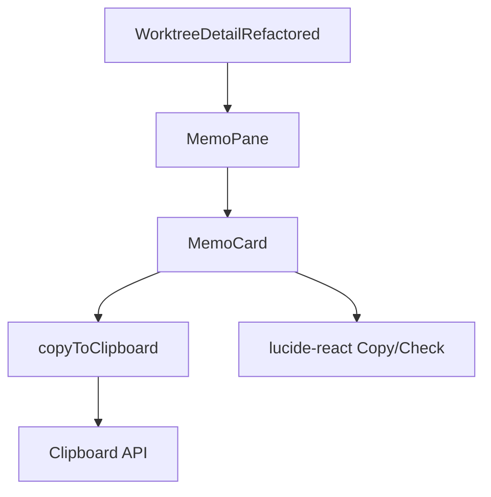

# Issue #321 メモのコピー機能 - 設計方針書

## 1. 概要

MemoCardコンポーネントにコピーボタンを追加し、メモの`content`フィールドをクリップボードにコピーできるようにする。

### 対象Issue

- Issue #321: メモのコピー機能

### スコープ

- MemoCard.tsxへのコピーボタンUI追加
- 既存`copyToClipboard()`ユーティリティの利用
- 単体テストの追加

## 2. アーキテクチャ設計

### コンポーネント構成



### レイヤー構成

本変更はプレゼンテーション層のみに閉じる。

| レイヤー | 変更 | 説明 |
|---------|------|------|
| プレゼンテーション層（`src/components/`） | **変更あり** | MemoCard.tsxにコピーボタン追加 |
| ビジネスロジック層（`src/lib/`） | 変更なし | clipboard-utils.tsを利用（変更不要） |
| データアクセス層（`src/lib/db.ts`） | 変更なし | DB変更なし |
| 型定義（`src/types/`） | 変更なし | WorktreeMemo型変更なし |

### 変更の閉じ込め

コピー機能はMemoCard内部に完全に閉じ込める設計とする。

- `useState(copied)` による状態管理 → MemoCard内部
- `handleCopy` コールバック → MemoCard内部
- `copyToClipboard()` 呼び出し → MemoCard内部

**MemoCardPropsに変更は発生しない**。これにより、MemoPane.tsxやWorktreeDetailRefactored.tsxへの影響を完全に排除する。

## 3. 技術選定

| カテゴリ | 選定技術 | 選定理由 |
|---------|---------|---------|
| クリップボードAPI | `src/lib/clipboard-utils.ts` `copyToClipboard()` | プロジェクト既存ユーティリティ。ANSI除去・空文字バリデーション済み |
| アイコン | lucide-react `Copy` / `Check` | FileViewer.tsxで使用済み。プロジェクト標準 |
| UIパターン | FileViewer方式（Copy/Checkアイコン切替） | Toast不要でpropsの変更が不要。変更範囲最小化 |
| フィードバック | アイコン切替（2秒タイムアウト） | サイレントエラーハンドリング。FileViewerと一貫 |

### 不採用とした技術

| 技術 | 不採用理由 |
|------|-----------|
| Toast通知方式 | MemoCardはshowToast propsを持たない。採用するとMemoPane側の変更も必要になり、変更範囲が拡大する |
| インラインSVGアイコン | 既存削除ボタンはインラインSVGだが、コピーボタンではlucide-reactを使用。アイコン方式統一は別Issueスコープ |

## 4. 設計パターン

### 適用パターン: FileViewerコピーパターンの改善版

FileViewer.tsx（L53-75, L153-167）のコピー実装パターンをベースに、S1-002で指摘されたタイマークリーンアップを追加した改善版を実装する。

> **注**: 実際のFileViewer.tsxにはuseRef/useEffect cleanupによるタイマー管理は存在しない。本設計ではFileViewerのCopy/Checkアイコン切替パターンを基盤としつつ、MemoCard固有の操作パス（コピー直後の削除によるアンマウント）に対応するため、S1-002の指摘に基づきクリーンアップ機構を追加している。FileViewer/MarkdownEditorへの同様の改善適用は本Issueスコープ外とし、将来のS1-001カスタムフック抽出時に一括対応する。

```typescript
// パターン: Copy/Check アイコン切替（S1-002対応: タイマークリーンアップ付き）
const [copied, setCopied] = useState(false);
const timerRef = useRef<ReturnType<typeof setTimeout>>();

// S1-002: アンマウント時のタイマークリーンアップ
useEffect(() => {
  return () => {
    if (timerRef.current) {
      clearTimeout(timerRef.current);
    }
  };
}, []);

const handleCopy = useCallback(async () => {
  if (!content) return;  // ガード条件
  try {
    await copyToClipboard(content);
    setCopied(true);
    // S1-002: 前回のタイマーをクリアしてから新規設定（高速連打対策にも有効）
    if (timerRef.current) {
      clearTimeout(timerRef.current);
    }
    timerRef.current = setTimeout(() => setCopied(false), 2000);
  } catch {
    // サイレントエラー（アイコンが変わらないことでユーザーに通知）
  }
}, [content]);
```

#### S1-002: setTimeoutクリーンアップの設計根拠

MemoCardでは削除ボタンとコピーボタンが同一ヘッダー行にあるため、ユーザーがコピー直後にメモを削除する操作パスが自然に発生する。コンポーネントアンマウント後に`setCopied(false)`が呼ばれるとReact警告が発生するため、以下の3点でタイマーを管理する。

1. **`useRef`でタイマーIDを保持**: コンポーネントのライフサイクルを跨いでタイマーIDを追跡
2. **`useEffect` cleanupでクリーンアップ**: アンマウント時に未完了タイマーをキャンセル
3. **新規`setTimeout`前に`clearTimeout`実行**: 高速連続クリック時のタイマー競合を防止（S1-004関連）

### 設計根拠

| 原則 | 適用 |
|------|------|
| DRY | `copyToClipboard()`を再利用。独自コピー実装を作らない |
| KISS | FileViewerの既存パターンをベースに最小限の改善（タイマークリーンアップ）のみ追加 |
| YAGNI | Toast通知やショートカットキーは追加しない。最小限の変更で機能を実現 |
| SRP | コピー機能はMemoCard内部に閉じ込め。MemoCardPropsへの変更なし |

## 5. UI設計

### ボタン配置

```
┌─────────────────────────────────────────────────┐
│ [Title Input (flex-1)] [Saving...] [📋] [🗑️]  │
│                                                   │
│ ┌───────────────────────────────────────────────┐ │
│ │ Content textarea                              │ │
│ │                                               │ │
│ └───────────────────────────────────────────────┘ │
│                                                   │
│ [Error message]                                   │
└─────────────────────────────────────────────────┘
```

- コピーボタン（📋）は削除ボタン（🗑️）の左に配置
- ヘッダー行の`flex items-center gap-2`レイアウトに追加

### ボタンスタイル

```typescript
// 削除ボタンのベーススタイル（p-1, text-gray-400, transition-colors, rounded）に合わせつつ、
// hover色はコピー操作に適した gray-600 を使用（削除ボタンは hover:text-red-500 で危険操作を示す）
className="p-1 text-gray-400 hover:text-gray-600 transition-colors rounded"
```

- 通常時: Copy アイコン（gray-400）
- ホバー: gray-600
- コピー成功後2秒間: Check アイコン（green-600）

### aria-label

- `aria-label="Copy memo content"`
- 既存パターン準拠（aria-label命名規則の参考のみ）: FileViewer `'Copy file content'`、ConversationPairCard `'Copy message'`
  - **注（S2-002）**: ConversationPairCardのコピー実装はonCopyコールバックprops方式であり、FileViewerのコンポーネント内部完結パターンとは異なる。ここではaria-labelの命名パターン（`'Copy [対象]'`形式）のみを参考としている

### 空コンテンツ時の振る舞い

- `content`が空文字または空白文字のみの場合: `copyToClipboard()`の空文字バリデーション（SF-S4-1）により早期リターン
- UI側ガード: `handleCopy`で`!content`チェック
- 2段階防御: UI側ガード + ライブラリ側バリデーション

## 6. データモデル設計

変更なし。

既存の`WorktreeMemo`型（`src/types/models.ts`）をそのまま使用する。

```typescript
// 既存の型定義（変更なし）
export interface WorktreeMemo {
  id: string;
  worktreeId: string;
  title: string;     // コピー対象外
  content: string;   // コピー対象
  position: number;
  createdAt: Date;
  updatedAt: Date;
}
```

## 7. API設計

変更なし。新規API追加なし。

## 8. セキュリティ設計

| 観点 | 対応 |
|------|------|
| XSS | `copyToClipboard()`がANSIエスケープコードを除去。クリップボードへの書き込みのみで、HTML/DOMへの挿入なし |
| 入力バリデーション | `copyToClipboard()`の空文字バリデーション（SF-S4-1）を利用 |
| Clipboard API | `navigator.clipboard.writeText()`はSecure Context（HTTPS）でのみ動作。既存実装と同一の制約 |

### 8.1 ANSI除去パターンの既知制限（S4-001）

`clipboard-utils.ts`の`ANSI_PATTERN`正規表現には、SEC-002として既知の制限がある。

**未対応のANSIシーケンス:**

- 8-bit CSI（`0x9B`）
- DEC private modes
- Character set switching
- 一部RGB color形式

**メモ機能における実質リスク評価: なし**

メモの`content`フィールドはユーザーが手動入力するテキストであり、上記のANSIシーケンスが混入する可能性は極めて低い。コピー対象がターミナル出力やCLI応答テキストであれば注意が必要だが、メモ機能ではユーザーの意図的な入力のみを扱うため、SEC-002の制限は実質的なリスクとならない。

**将来の対応方針**: `cli-patterns.ts`のSEC-002コメントに記載の方針と一致し、将来的に`strip-ansi` npmパッケージの導入を検討する。ただし、メモコピー機能に限定すれば現状で十分である。

### 8.2 Permissions-Policyヘッダーの補足（S4-002）

`next.config.js`の`Permissions-Policy`ヘッダーは`camera=()`, `microphone=()`, `geolocation=()`のみを制限しており、`clipboard-write`/`clipboard-read`は明示されていない。

**動作への影響: なし**

ブラウザのデフォルト動作では、Secure Context内で`navigator.clipboard.writeText()`は許可される。既存のCSP設定（`default-src 'self'`）とSecure Context要件により、クリップボードAPIは正常に動作する。

**推奨対応（別Issue）**: `Permissions-Policy`に`clipboard-write=(self)`を明示的に追加することで、セキュリティポリシーの明示性を向上させることを検討する。本Issue #321のスコープ外とし、プロジェクト全体のPermissions-Policy見直しIssueとして対応する。

**OWASP分類**: A05:2021 Security Misconfiguration（現状は許容可能レベル）

### 8.3 サイレントエラー設計の根拠（S4-003）

`handleCopy`のcatchブロックではエラーを握りつぶすサイレントエラー設計を採用している。

```typescript
try {
  await copyToClipboard(content);
  // 成功フィードバック（Checkアイコン表示）
} catch {
  // サイレントエラー（アイコンが変わらないことでユーザーに通知）
}
```

**セキュリティ上の設計根拠:**

1. **情報漏洩防止**: エラーメッセージをUIに表示しないことで、ブラウザ環境情報やClipboard APIの内部エラー詳細がユーザーに露出することを防ぐ
2. **環境情報の保護**: Clipboard APIのエラーにはブラウザバージョンやPermissions状態に依存する情報が含まれる可能性があり、サイレント処理が適切
3. **既存パターンとの一貫性**: FileViewer.tsxの既存コピー実装と同一のエラーハンドリング方針を踏襲
4. **ユーザー体験**: コピー失敗時はアイコンがCopyのまま変化しないことで、暗黙的に失敗を通知する。これは非破壊的操作（コピー）において十分なフィードバックである

### 8.4 OWASP Top 10 チェックリスト

Stage 4セキュリティレビューで全項目を確認済み。

| OWASP項目 | ステータス | 備考 |
|-----------|----------|------|
| A01: Broken Access Control | 該当なし | クライアントサイドのみ。サーバーアクセス制御変更なし |
| A02: Cryptographic Failures | 該当なし | 暗号化処理の変更なし |
| A03: Injection | Pass | writeText()のみ使用。HTML/DOM挿入なし。ANSI除去あり |
| A04: Insecure Design | Pass | 2段階防御。タイマークリーンアップ。サイレントエラー |
| A05: Security Misconfiguration | Pass | CSP適切。Secure Context要件あり |
| A06: Vulnerable Components | Pass | 新規依存追加なし。既存ユーティリティ再利用 |
| A07: Auth Failures | 該当なし | 認証・認可の変更なし |
| A08: Data Integrity | Pass | 読み取り専用操作。DB変更なし |
| A09: Logging/Monitoring | 該当なし | コピー操作のログ不要 |
| A10: SSRF | 該当なし | サーバーサイドリクエスト変更なし |

## 9. テスト設計

### テストファイル

`tests/unit/components/worktree/MemoCard.test.tsx`に追加する。

### モック設定

```typescript
// 既存のuseAutoSaveモックに加え、clipboard-utilsのモックを追加
vi.mock('@/lib/clipboard-utils', () => ({
  copyToClipboard: vi.fn(),
}));
```

### テストケース

| # | テストケース | 検証内容 |
|---|------------|---------|
| 1 | コピーボタンのレンダリング | `screen.getByRole('button', { name: /copy memo content/i })`で取得可能 |
| 2 | クリック時のcopyToClipboard呼び出し | `copyToClipboard`がmemo.contentで呼ばれること |
| 3 | 成功後のCheckアイコン表示 | `data-testid="copy-check-icon"`が表示されること |
| 4 | 2秒後のCopyアイコン復帰 | `vi.advanceTimersByTime(2000)`後にCopyアイコンに戻ること |
| 5a | 空コンテンツ時の振る舞い（空文字） | `content: ''`時に`handleCopy`のUI側ガード（`!content`）により`copyToClipboard`が呼ばれないこと |
| 5b | 空コンテンツ時の振る舞い（空白文字のみ、S2-005） | `content: '   '`時に`copyToClipboard`が呼ばれるがライブラリ側バリデーション（`text.trim().length === 0`）によりクリップボードへの書き込みが行われないこと。2段階防御のライブラリ層カバレッジを検証 |
| 6 | 高速ダブルクリック時の振る舞い（S1-004） | コピーボタンを素早く2回クリックした場合、Checkアイコンが2回目のクリックから2秒間表示され続けること。1回目のsetTimeoutで早期にCopyアイコンに戻らないことを検証 |
| 7 | コピーフィードバック中のアンマウント（S1-005） | コピーボタンをクリック後、2秒以内にコンポーネントをアンマウントしてもReact警告（state update on unmounted component）が発生しないこと。`vi.advanceTimersByTime(2000)`後にエラーがないことを検証 |

### モバイル実機確認（S3-001）

実装後に以下のモバイルレイアウト確認を行う。

- **対象**: 320px幅端末でのMemoCardヘッダー行4要素レイアウト（[Title(flex-1)] [Saving...] [Copy] [Delete]）
- **確認内容**: Saving表示中にタイトル入力領域が極端に短縮されないこと
- **根拠**: ボタン群は固定幅（p-1 w-4 h-4 = 約24px x2 + gap-2 x3 = 約72px）に収まり、320px幅でもタイトル入力領域は約240px確保される見込みだが、実機での目視確認を推奨

### 既存テストへの影響

- MemoCard.test.tsx: 既存テスト全パス（コピーボタン追加で`getByRole('button')`結果が増えるが、既存テストはaria-label指定のため影響なし）
- MemoPane.test.tsx: 影響なし（`getAllByRole('button', { name: /delete/i })`で絞り込み済み）

## 10. 変更ファイル一覧

| ファイル | 変更種別 | 変更内容 |
|---------|---------|---------|
| `src/components/worktree/MemoCard.tsx` | 修正 | Copy/Checkアイコンimport追加、useState(copied)追加、useRef(timerRef)追加、useEffect cleanup追加、handleCopyコールバック追加（clearTimeout付き）、ヘッダー部にコピーボタンJSX追加 |
| `tests/unit/components/worktree/MemoCard.test.tsx` | 修正 | clipboard-utilsモック追加、コピー機能テスト7件追加（S1-004高速ダブルクリック、S1-005アンマウントテスト含む） |
| `CLAUDE.md` | 修正 | MemoCard.tsxモジュール説明追加 |

## 11. 設計上の決定事項とトレードオフ

| 決定事項 | 理由 | トレードオフ |
|---------|------|-------------|
| FileViewerパターンベースの改善版（S2-001） | 変更範囲最小化、UI一貫性、タイマー安全性 | 将来Toast通知が必要になった場合の再変更コスト。FileViewer自体には未適用の改善を含む |
| MemoCardPropsを変更しない | MemoPane/WorktreeDetailRefactoredへの影響排除 | コンポーネント外部からのコピー状態制御が不可 |
| contentのみコピー | 既存パターン準拠（FileViewer、ConversationPairCard） | title+contentの一括コピー要望には別Issue対応が必要 |
| アイコン方式の混在許容 | スコープの限定。インラインSVG統一は別Issue | 同一コンポーネント内でのアイコン方式不統一 |

## 12. 将来の改善検討事項

### S1-001: `useCopyToClipboard()`カスタムフックの抽出

Copy/Checkアイコン切替パターン（`useState(copied)` + `handleCopy` + `setTimeout(2000)`）が以下の3コンポーネントに重複している。

- `src/components/worktree/FileViewer.tsx`
- `src/components/worktree/MarkdownEditor.tsx`（MarkdownEditorHeader内）
- `src/components/worktree/MemoCard.tsx`（本Issue追加分）

**将来の改善**: `useCopyToClipboard(content: string)`カスタムフックを抽出し、状態管理ロジックを一元化する。

```typescript
// 将来の統一パターン案（本Issueスコープ外）
const { copied, handleCopy } = useCopyToClipboard(content);
```

**本Issueでの対応**: 既存パターンの踏襲（YAGNI原則）。フック抽出は別Issueで対応する。

### S3-003: FileViewer/MarkdownEditorのtimerRefクリーンアップ統一

本IssueではMemoCardにuseRef + useEffect cleanupによるsetTimeoutクリーンアップを追加するが、以下のコンポーネントには同様のクリーンアップが未実装である。

- `src/components/worktree/FileViewer.tsx`（L66-74）
- `src/components/worktree/MarkdownEditor.tsx`（L321-325、MarkdownEditorHeader内）

これらのコンポーネントでも、コピー成功後のsetTimeoutによるアイコン復帰処理にクリーンアップが欠如している。ただし、FileViewer/MarkdownEditorではMemoCardのような「コピー直後の削除」操作パスが発生しにくいため、実際のReact警告リスクは低い。

**対応方針**: S1-001の`useCopyToClipboard()`カスタムフック抽出Issueを作成する際に、FileViewer/MarkdownEditorへのtimerRefクリーンアップ適用も併せて対応する。フック抽出により3コンポーネントのクリーンアップロジックを一元化し、技術的負債を解消する。

---

## 13. レビュー履歴

| Stage | レビュー名 | 日付 | スコア | ステータス |
|-------|-----------|------|--------|-----------|
| Stage 1 | 通常レビュー（設計原則） | 2026-02-20 | 4/5 | approved |
| Stage 2 | 整合性レビュー | 2026-02-20 | 4/5 | conditionally_approved |
| Stage 3 | 影響分析レビュー | 2026-02-20 | 5/5 | approved |
| Stage 4 | セキュリティレビュー | 2026-02-20 | 5/5 | approved |

## 14. レビュー指摘事項サマリー

### Stage 1: 通常レビュー（設計原則）

| ID | 重要度 | カテゴリ | タイトル | 対応状況 |
|----|--------|---------|---------|---------|
| S1-001 | Nice to Have | DRY | Copy/Check切替パターンの3重複 | 将来改善事項として記載 |
| S1-002 | Should Fix | Component | setTimeoutのクリーンアップ未実装 | 設計方針に反映済み |
| S1-003 | Nice to Have | Component | アイコン実装方式の混在 | スキップ（Section 11に既記載） |
| S1-004 | Nice to Have | Testing | 高速ダブルクリックのテストケース未記載 | テスト設計に追記済み |
| S1-005 | Nice to Have | Testing | アンマウント時のテストケース未記載 | テスト設計に追記済み |

### Stage 2: 整合性レビュー

| ID | 重要度 | カテゴリ | タイトル | 対応状況 |
|----|--------|---------|---------|---------|
| S2-001 | Should Fix | pattern_consistency | FileViewerにtimerRefクリーンアップが未実装であり「踏襲」表現が矛盾 | 設計方針に反映済み（Section 4修正） |
| S2-007 | Should Fix | internal_consistency | 「そのまま踏襲」と改善版コード例の齟齬 | 設計方針に反映済み（Section 4修正、S2-001と同時対応） |
| S2-002 | Nice to Have | pattern_consistency | ConversationPairCardのaria-label参考範囲の明示 | 設計方針に反映済み（Section 5注記追加） |
| S2-003 | Nice to Have | design_code_consistency | ボタンスタイルコメントの不正確さ | 設計方針に反映済み（Section 5コメント修正） |
| S2-005 | Nice to Have | test_consistency | 空白文字のみのテストケース未記載 | テスト設計に反映済み（テストケース5b追加） |
| S2-004 | Nice to Have | design_code_consistency | WorktreeMemo型定義のJSDocコメント差異 | スキップ（設計書の簡略化として許容範囲） |
| S2-006 | Nice to Have | scope_consistency | memo化コンポーネント内useCallback依存配列設計 | スキップ（技術的に問題なく実装で対応可能） |

### Stage 3: 影響分析レビュー

| ID | 重要度 | カテゴリ | タイトル | 対応状況 |
|----|--------|---------|---------|---------|
| S3-001 | Nice to Have | mobile_ui_impact | モバイル320px幅端末でのヘッダー行4要素レイアウト確認 | テスト設計に追記済み（Section 9） |
| S3-002 | Nice to Have | test_impact | 既存テストへの間接影響ゼロの確認 | スキップ（設計書の記述が既に正確で変更不要） |
| S3-003 | Nice to Have | future_consideration | FileViewer/MarkdownEditorのtimerRefクリーンアップ未適用 | 将来改善事項に追記済み（Section 12） |

### Stage 4: セキュリティレビュー

| ID | 重要度 | カテゴリ | タイトル | 対応状況 |
|----|--------|---------|---------|---------|
| S4-001 | Nice to Have | ANSI除去の網羅性 | clipboard-utils.tsのANSI_PATTERNにSEC-002既知制限（8-bit CSI等未対応） | 設計方針に反映済み（Section 8.1） |
| S4-002 | Nice to Have | Permissions-Policy | Permissions-Policyにclipboard-write=(self)が未記載 | 設計方針に反映済み（Section 8.2、別Issue対応） |
| S4-003 | Nice to Have | エラーハンドリング | サイレントエラー設計の妥当性確認（確認的指摘） | 設計方針に反映済み（Section 8.3、設計根拠追記） |

## 15. 実装チェックリスト（レビュー指摘反映）

### S1-002: setTimeoutクリーンアップ（Should Fix）

- [ ] `MemoCard.tsx`: `useRef`をimportに追加
- [ ] `MemoCard.tsx`: `const timerRef = useRef<ReturnType<typeof setTimeout>>()`を追加
- [ ] `MemoCard.tsx`: `useEffect`でアンマウント時の`clearTimeout`クリーンアップを追加
- [ ] `MemoCard.tsx`: `handleCopy`内で`clearTimeout(timerRef.current)`を`setTimeout`の前に実行
- [ ] `MemoCard.tsx`: `timerRef.current = setTimeout(...)`でタイマーIDを保存

### S1-004: 高速ダブルクリックテスト（Nice to Have）

- [ ] `MemoCard.test.tsx`: テストケース#6を追加 - コピーボタン2回連続クリック後、2回目のクリックから2秒間Checkアイコンが表示され続けることを検証

### S1-005: アンマウントテスト（Nice to Have）

- [ ] `MemoCard.test.tsx`: テストケース#7を追加 - コピー後のアンマウントでReact警告が発生しないことを検証

### S1-001: 将来改善（スコープ外）

- [ ] 別Issueで`useCopyToClipboard()`カスタムフック抽出を検討

### S2-005: 空白文字のみテストケース追加（Nice to Have）

- [ ] `MemoCard.test.tsx`: テストケース#5bを追加 - `content: '   '`（空白文字のみ）時に`copyToClipboard`が呼ばれるが、ライブラリ側バリデーションによりクリップボード書き込みが行われないことを検証

### S3-001: モバイル320px幅レイアウト確認（Nice to Have）

- [ ] 実装後にモバイル実機またはブラウザDevTools（320px幅）で、MemoCardヘッダー行の4要素（Title/Saving/Copy/Delete）レイアウトを目視確認
- [ ] Saving表示中にタイトル入力領域が極端に短縮されないことを確認

### S3-003: FileViewer/MarkdownEditorのtimerRefクリーンアップ（将来対応）

- [ ] S1-001の`useCopyToClipboard()`カスタムフック抽出Issue作成時に、FileViewer.tsx/MarkdownEditor.tsxへのtimerRefクリーンアップ適用を要件に含める

### S4-001: ANSI_PATTERNのSEC-002既知制限（情報記録のみ）

- [ ] 設計書Section 8.1に既知制限が記載されていることを確認（コード変更不要）

### S4-002: Permissions-Policy clipboard-write（別Issue対応）

- [ ] プロジェクト全体のPermissions-Policy見直しIssueを将来作成する（本Issueスコープ外）

### S4-003: サイレントエラー設計根拠（情報記録のみ）

- [ ] 設計書Section 8.3にサイレントエラーの設計根拠が記載されていることを確認（コード変更不要）

---

*Generated by design-policy command for Issue #321*
*Date: 2026-02-20*
*Stage 1 review findings applied: 2026-02-20*
*Stage 2 review findings applied: 2026-02-20*
*Stage 3 review findings applied: 2026-02-20*
*Stage 4 review findings applied: 2026-02-20*
