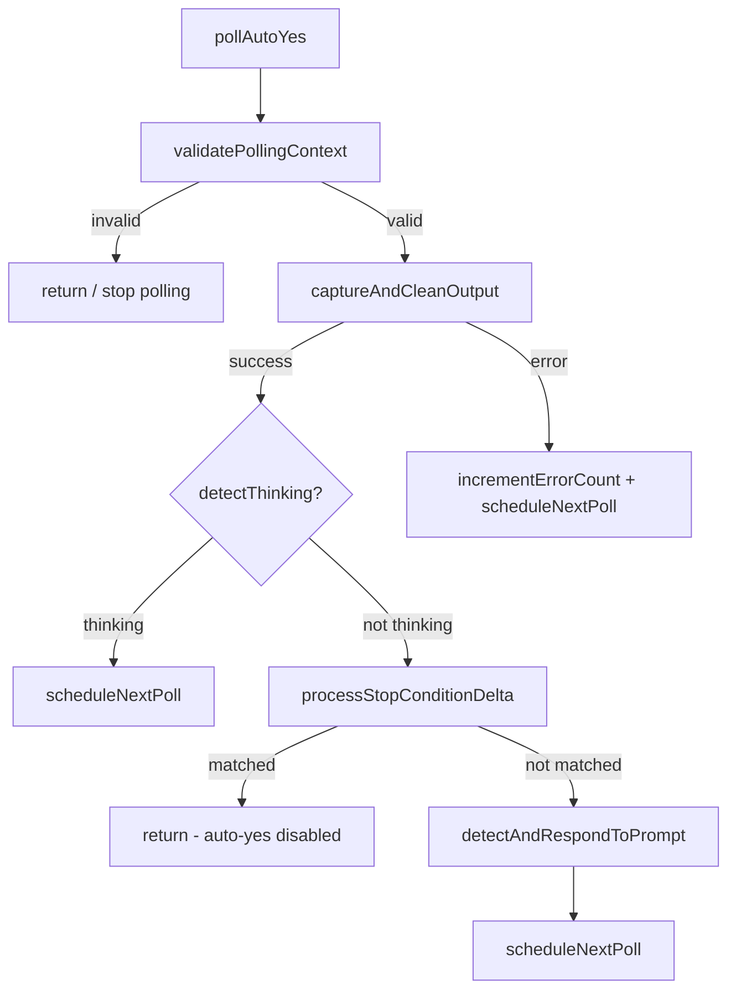

# Issue #323 設計方針書: auto-yes-manager.ts pollAutoYes() リファクタリング

## 1. 概要

### 目的
`src/lib/auto-yes-manager.ts` の `pollAutoYes()` 関数（139行、7責務、条件分岐14個）を責務別の関数に分割し、テスタビリティを向上させるリファクタリング。

### スコープ
- `pollAutoYes()` の責務分割（4-5関数）
- 停止条件デルタ判定ロジックの抽出
- pollerState存在確認パターンの共通化
- **機能変更なし**（外部インターフェース維持）

### 設計原則
- **SRP（単一責務原則）**: 各関数が1つの責務を持つ
- **DRY（重複排除）**: pollerState存在確認の共通化
- **KISS（単純化）**: 最小限の抽象化レベルで分割
- **YAGNI**: 必要最小限の変更のみ

---

## 2. アーキテクチャ設計

### 2-1. 現状の構造

```
pollAutoYes() [139行, 7責務]
├── 1. pollerState存在確認 (L457-458)
├── 2. autoYes有効性チェック (L461-465)
├── 3. tmux出力キャプチャ + ANSI除去 (L469-472)
├── 4. thinking状態検出 + ウィンドウイング (L492-496)
├── 5. 停止条件デルタチェック (L508-525)
├── 6. プロンプト検出 + 重複チェック (L527-543)
└── 7. 自動応答 + 後処理 (L545-582)
```

### 2-2. リファクタリング後の構造

```
pollAutoYes() [オーケストレーター, ~30行]
├── validatePollingContext()     [前提条件チェック, ~15行]
├── captureAndCleanOutput()     [出力取得+ANSI除去, ~10行]
├── (thinking検出)              [pollAutoYes内に残留, ~5行]
├── processStopConditionDelta() [停止条件デルタ判定, ~25行]
└── detectAndRespondToPrompt()  [プロンプト検出+応答, ~55行]
```

### 2-3. 関数間の呼び出しフロー



> **注記**（IC004対応）: `captureAndCleanOutput` 失敗時のエラーパスは `pollAutoYes()` の外側 catch ブロックで処理され、`incrementErrorCount()` + `scheduleNextPoll()` を経由する。`detectAndRespondToPrompt()` 内部のエラーは関数内で完結し（`'error'` 返却）、外側 catch には到達しない。

---

## 3. 詳細設計

### 3-1. validatePollingContext()

**責務**: ポーリング実行前の前提条件チェック

```typescript
/**
 * Validate that polling context is still valid.
 * Checks pollerState existence and auto-yes enabled state.
 *
 * @internal Exported for testing purposes only.
 * @precondition worktreeId is validated by isValidWorktreeId() in startAutoYesPolling() gateway before being registered in globalThis Map. This function assumes worktreeId has already passed that validation.
 * @param worktreeId - Worktree identifier
 * @param pollerState - Current poller state (or undefined if not found)
 * @returns 'valid' | 'stopped' | 'expired'
 */
export function validatePollingContext(
  worktreeId: string,
  pollerState: AutoYesPollerState | undefined
): 'valid' | 'stopped' | 'expired';
```

**判定ロジック**:
- `pollerState` が undefined → `'stopped'`
- `autoYesState` が無効 or 期限切れ → `'expired'`（`stopAutoYesPolling()` を呼び出す）
- それ以外 → `'valid'`

**副作用についての注記**（DR002）:

`validatePollingContext()` は `'expired'` 判定時に `stopAutoYesPolling()` を内部呼び出しする副作用を持つ。`validate` という命名は通常、副作用のない純粋検証関数を暗示するため、以下のトレードオフを検討した上で現行設計を採用する。

| 選択肢 | メリット | デメリット |
|--------|---------|-----------|
| (A) 純粋関数化: 戻り値のみ返し、`pollAutoYes()` 側で `stopAutoYesPolling()` を呼ぶ | テスト時にモック不要、命名と挙動が一致 | オーケストレーターの分岐が増加 |
| (B) 命名変更: `ensurePollingContext()` 等に改名 | 副作用を名前で表現 | 既存コードとの一貫性が低下 |
| (C) 現行維持: `validatePollingContext()` + JSDocで副作用を明記 | 現行 `pollAutoYes()` L462-464のパターンを忠実に抽出 | `validate` 名と副作用の不一致 |

**採用**: 選択肢(C)を採用する。理由: 現行 `pollAutoYes()` のL462-464では `getAutoYesState()` が期限切れ時に自動で `disable` し、その直後に `stopAutoYesPolling()` を呼ぶという一連の処理が密結合しており、この2つを分離すると呼び出し漏れのリスクが生じる。JSDocの `@param` / `@returns` に加え、副作用を明示する `@sideeffect` コメントを追加する。実装時に選択肢(A)の方が優れると判断した場合は切り替えて良い。

**設計根拠**: L457-465の2段階チェックを1関数に統合。戻り値を文字列リテラル型にすることで、呼び出し側の分岐が自己文書化される。

---

### 3-2. captureAndCleanOutput()

**責務**: tmux出力のキャプチャとANSIコード除去

```typescript
/**
 * Capture tmux session output and strip ANSI escape codes.
 *
 * @internal Exported for testing purposes only.
 * @precondition worktreeId is validated by isValidWorktreeId() in startAutoYesPolling() gateway before being registered in globalThis Map. This function assumes worktreeId has already passed that validation.
 * @param worktreeId - Worktree identifier
 * @param cliToolId - CLI tool type being polled
 * @returns Cleaned output string (ANSI stripped)
 */
export async function captureAndCleanOutput(
  worktreeId: string,
  cliToolId: CLIToolType
): Promise<string>;
```

**処理内容**:
1. `captureSessionOutput(worktreeId, cliToolId, 5000)` を呼び出し
   - **出力行数の上限: 5000行**（IC002対応）: `captureSessionOutput()` のデフォルト値は1000行だが、tmuxバッファ全体をキャプチャするために現行 `pollAutoYes()` と同じ5000行を指定する
2. `stripAnsi(output)` でANSIコード除去
3. cleanOutputを返却

**スコープ外**:
- thinkingウィンドウイング（`split→slice→join`）は `pollAutoYes()` 内に残留
- `detectThinking()` 呼び出しは `pollAutoYes()` 内に残留

**設計根拠**: thinkingチェックは「何行を検査するか」というポリシー判断を含むため、captureAndCleanOutput()の責務（出力取得・クリーニング）と分離する。

---

### 3-3. processStopConditionDelta()

**責務**: 停止条件のデルタベース判定（ベースライン管理 + 新規コンテンツ抽出 + パターンマッチ委譲）

```typescript
/**
 * Process stop condition check using delta-based approach.
 * Manages baseline length, extracts new content, and delegates
 * pattern matching to existing checkStopCondition().
 *
 * Note: This is a higher-level function that internally calls
 * checkStopCondition() (L409, Issue #314) for regex pattern matching.
 *
 * @internal Exported for testing purposes only.
 * @precondition worktreeId is validated by isValidWorktreeId() in startAutoYesPolling() gateway before being registered in globalThis Map. This function assumes worktreeId has already passed that validation.
 * @param worktreeId - Worktree identifier
 * @param pollerState - Current poller state (mutated: stopCheckBaselineLength updated)
 * @param cleanOutput - ANSI-stripped terminal output
 * @returns true if stop condition matched and auto-yes was disabled
 */
export function processStopConditionDelta(
  worktreeId: string,
  pollerState: AutoYesPollerState,
  cleanOutput: string
): boolean;
```

**判定ロジック**（3パターン + 初回設定）:

| 条件 | アクション |
|------|---------|
| `stopCheckBaselineLength < 0`（初回） | ベースライン設定、false返却 |
| `cleanOutput.length > baseline` | デルタ抽出 → `checkStopCondition()` 委譲 |
| `cleanOutput.length < baseline` | ベースラインリセット、false返却 |
| `cleanOutput.length === baseline` | スキップ、false返却 |

**デルタ渡しの設計意図**（IC001対応）:

`processStopConditionDelta()` は `cleanOutput` 全体を受け取るが、内部で `cleanOutput.length > baseline` の場合にデルタ部分（`newContent = cleanOutput.substring(baseline)`）のみを抽出し、そのデルタ部分を `checkStopCondition()` の第2引数に渡す。`checkStopCondition()` は渡された文字列全体に対してパターンマッチを行うため、デルタ抽出は呼び出し側（`processStopConditionDelta()`）の責務である。

> **注記**: `checkStopCondition(worktreeId, cleanOutput)` の第2引数名は `cleanOutput` だが、実際には「チェック対象テキスト（出力全体またはデルタ部分）」を受け取る汎用パラメータである。実装時に `cleanOutput` を `textToCheck` にリネームすることを検討する（意味的一貫性の向上）。

**既存checkStopCondition()との関係**:
- 既存 `checkStopCondition(worktreeId, cleanOutput)` (L409): 正規表現パターンマッチング担当、変更なし（パラメータ名リネームは検討事項）
- 新規 `processStopConditionDelta()`: デルタ計算 + 上記関数への委譲（デルタ部分のみを渡す）

**設計選択: 関数群方式（選択肢B）を採用**

Issueで提示された2つの設計選択肢を評価:

| 比較項目 | (A) StopConditionCheckerクラス | (B) 関数群 |
|---------|-------------------------------|-----------|
| 既存パターンとの整合性 | 不整合（モジュール全体が関数ベース） | 整合 |
| AutoYesPollerState変更 | インスタンス保持フィールド追加必要 | 既存フィールドのみ |
| テスト容易性 | クラスインスタンス生成が必要 | 関数直接呼び出し可 |
| 複雑度 | クラス定義+メソッド群 | 関数1つ（processStopConditionDelta） |

**判定**: 選択肢(B)を採用。理由:
- `auto-yes-manager.ts` の全既存コードが関数ベース + `globalThis` Map パターンで統一されている
- `stopCheckBaselineLength` フィールドは `AutoYesPollerState` に既存のため、インターフェース変更不要
- 停止条件ロジックは `processStopConditionDelta()` 1関数で十分に表現可能（`setBaseline`, `shouldCheck`, `getDelta` に分けると過剰抽象化）

---

### 3-4. detectAndRespondToPrompt()

**責務**: プロンプト検出→自動応答→後処理の一連フロー

```typescript
/**
 * Detect prompt in terminal output, resolve auto-answer, and send response.
 * Handles the complete flow: detection → duplicate check → answer resolution →
 * tmux send → timestamp/error-count update → promptKey recording.
 *
 * Note: Cooldown scheduling is NOT this function's responsibility.
 * The caller (pollAutoYes() orchestrator) determines scheduling interval
 * based on the return value ('responded' → cooldown, others → normal interval).
 *
 * @internal Exported for testing purposes only.
 * @precondition worktreeId is validated by isValidWorktreeId() in startAutoYesPolling() gateway before being registered in globalThis Map. This function assumes worktreeId has already passed that validation.
 * @param worktreeId - Worktree identifier
 * @param pollerState - Current poller state (mutated: lastAnsweredPromptKey updated)
 * @param cliToolId - CLI tool type
 * @param cleanOutput - ANSI-stripped terminal output
 * @returns 'responded' | 'no_prompt' | 'duplicate' | 'no_answer' | 'error'
 */
export async function detectAndRespondToPrompt(
  worktreeId: string,
  pollerState: AutoYesPollerState,
  cliToolId: CLIToolType,
  cleanOutput: string
): Promise<'responded' | 'no_prompt' | 'duplicate' | 'no_answer' | 'error'>;
```

**処理ステップ**:
1. `buildDetectPromptOptions(cliToolId)` + `detectPrompt(cleanOutput, promptOptions)`
2. プロンプト未検出 → `pollerState.lastAnsweredPromptKey = null` → `'no_prompt'`
3. `generatePromptKey()` + `isDuplicatePrompt()` → `'duplicate'`
4. `resolveAutoAnswer()` → null の場合 `'no_answer'`
5. `CLIToolManager.getInstance()` → `sendPromptAnswer()`
6. `updateLastServerResponseTimestamp()` + `resetErrorCount()`
7. `pollerState.lastAnsweredPromptKey = promptKey` → `'responded'`
8. catch → `incrementErrorCount()` → `'error'`

**エラーハンドリングと二重incrementErrorCount防止**（IC003対応）:

`detectAndRespondToPrompt()` はステップ8で内部 try-catch により `incrementErrorCount()` を呼び出した上で `'error'` を返す。この関数は例外を throw しないため、Section 3-5 の `pollAutoYes()` 外側 catch ブロックには `detectAndRespondToPrompt()` 由来のエラーは到達しない。外側 catch は `captureAndCleanOutput()` や `processStopConditionDelta()` の失敗（tmuxセッション不存在等）のみを処理する。これにより `incrementErrorCount()` の二重呼び出しは発生しない。

**クールダウンスケジューリングの責務分離**（DR001）:
- クールダウンスケジューリング（`scheduleNextPoll(worktreeId, cliToolId, COOLDOWN_INTERVAL_MS)`）は `detectAndRespondToPrompt()` の責務に**含まない**
- `pollAutoYes()` オーケストレーターが戻り値 `'responded'` を判定し、`scheduleNextPoll()` にクールダウン間隔を渡す
- この設計により、スケジューリングポリシー（通常間隔 vs クールダウン間隔の選択）がオーケストレーターに集約され、SRPが維持される
- Section 3-5 のリファクタリング後コードがこの設計を反映している

**行数**: 約55行（8ステップ）

**設計根拠**: 20-40行目標を超過するが、プロンプト検出→応答は凝集度の高い一連フロー。途中で分割すると `promptDetection`, `promptKey`, `answer` 等の中間状態を関数間で受け渡す必要が生じ、かえって複雑化する。

**戻り値の文字列リテラル型**: テスト時に各ケースをassert可能にする。

---

### 3-5. リファクタリング後の pollAutoYes()

```typescript
async function pollAutoYes(worktreeId: string, cliToolId: CLIToolType): Promise<void> {
  // 1. Validate context
  const pollerState = autoYesPollerStates.get(worktreeId);
  const contextResult = validatePollingContext(worktreeId, pollerState);
  if (contextResult !== 'valid') return;
  // pollerState is guaranteed non-null after 'valid' check

  try {
    // 2. Capture and clean output
    const cleanOutput = await captureAndCleanOutput(worktreeId, cliToolId);

    // 3. Thinking check (inline - policy decision about window size)
    const recentLines = cleanOutput.split('\n').slice(-THINKING_CHECK_LINE_COUNT).join('\n');
    if (detectThinking(cliToolId, recentLines)) {
      scheduleNextPoll(worktreeId, cliToolId);
      return;
    }

    // 4. Stop condition delta check
    if (processStopConditionDelta(worktreeId, pollerState!, cleanOutput)) {
      return;
    }

    // 5. Detect and respond to prompt
    const result = await detectAndRespondToPrompt(worktreeId, pollerState!, cliToolId, cleanOutput);
    if (result === 'responded') {
      scheduleNextPoll(worktreeId, cliToolId, COOLDOWN_INTERVAL_MS);
      return;
    }
  } catch (error) {
    // IC003: このcatchはcaptureAndCleanOutput()またはprocessStopConditionDelta()の
    // エラーのみを処理する。detectAndRespondToPrompt()は内部でtry-catchし
    // 'error'を返すため、ここには到達しない（二重incrementErrorCount防止）。
    incrementErrorCount(worktreeId);
    console.warn(`[Auto-Yes Poller] Error for worktree ${worktreeId}: ${getErrorMessage(error)}`);
  }

  scheduleNextPoll(worktreeId, cliToolId);
}
```

**変更点**: 139行 → 約30行。各責務が明確な関数呼び出しに置換。

---

## 4. pollerState存在確認の共通化

### 現状の重複パターン

以下6箇所で同一パターンが重複:

| 関数 | 行 | パターン |
|------|-----|---------|
| `pollAutoYes()` | L457-458 | `get → if (!state) return` |
| `scheduleNextPoll()` | L606-607 | `get → if (!state) return` |
| `stopAutoYesPolling()` | L680-681 | `get → if (!state) return` |
| `updateLastServerResponseTimestamp()` | L318-319 | `get → if (state) { ... }` |
| `resetErrorCount()` | L329-330 | `get → if (state) { ... }` |
| `incrementErrorCount()` | L342-343 | `get → if (state) { ... }` |

### 共通化方針

**方針**: 既存の `getAutoYesState()` パターンに倣い、getter関数で統一。

```typescript
/**
 * Get poller state for a worktree.
 * Returns undefined if no poller state exists.
 *
 * @param worktreeId - Worktree identifier
 * @returns Poller state or undefined
 */
function getPollerState(worktreeId: string): AutoYesPollerState | undefined {
  return autoYesPollerStates.get(worktreeId);
}
```

**適用範囲**: `updateLastServerResponseTimestamp()`, `resetErrorCount()`, `incrementErrorCount()` は引き続き `getPollerState()` + guard pattern を使用する。共通のgetter経由に統一することで、既存の `getAutoYesState()` パターンとの一貫性を維持する。

**設計根拠**（DR003）: `getPollerState()` 導入の主たる根拠は「既存の `getAutoYesState()` パターンとの一貫性」である。`getAutoYesState()` は `autoYesStates.get(worktreeId)` のラッパーとして期限切れ自動無効化ロジックを含んでおり、`getPollerState()` は同一のアクセスパターンに揃えることでコードベースの一貫性を保つ。現時点では `Map.get()` の1行ラッパーであり、ロジックの変更はない。

**判断**: `getPollerState()` の導入は最小限の変更。6箇所の `autoYesPollerStates.get(worktreeId)` を `getPollerState(worktreeId)` に置換するのみ。

---

## 5. @internal export 方針

### エクスポート対象

| 関数 | export種別 | 理由 |
|------|-----------|------|
| `validatePollingContext()` | `@internal export` | テスト専用 |
| `captureAndCleanOutput()` | `@internal export` | テスト専用 |
| `processStopConditionDelta()` | `@internal export` | テスト専用 |
| `detectAndRespondToPrompt()` | `@internal export` | テスト専用 |
| `getPollerState()` | private (export不要) | 内部ヘルパーのみ |

### 既存の @internal export パターンとの整合

- `checkStopCondition()` (L409): 既に `@internal export` でテスト公開済み
- `executeRegexWithTimeout()` (L384): 既に `@internal export` でテスト公開済み

新規関数も同一パターンに従う。

---

## 6. テスト設計

### 6-1. 既存テストの維持（変更最小化）

| テストカテゴリ | 対応方針 |
|--------------|---------|
| `pollAutoYes` 統合テスト（vi.useFakeTimers） | そのまま維持（importに分割関数を追加するのみ） |
| `checkStopCondition` 単体テスト | そのまま維持（関数自体は変更なし） |
| `executeRegexWithTimeout` 単体テスト | そのまま維持 |

**モック依存チェーンの補足**（IA003対応）:

分割後、`detectAndRespondToPrompt()` 内で `sendPromptAnswer()` を呼び出す。`sendPromptAnswer()` は `prompt-answer-sender.ts` に定義されているが、既存テストではこのモジュールを直接モックしていない。代わりに `sendKeys` / `sendSpecialKeys` が `vi.mock('@/lib/tmux')` 経由でモジュールレベルでモックされている。`sendPromptAnswer()` は内部で `sendKeys` / `sendSpecialKeys` を呼び出すため、間接的にモックが効く構造になっている。

**既存テストの修正が不要である根拠**: `sendPromptAnswer()` は現行の `pollAutoYes()` 内で既に使用されている関数であり、リファクタリングによる移動先（`detectAndRespondToPrompt()` 内）でも同一のモック依存チェーン（`sendPromptAnswer` -> `sendKeys`/`sendSpecialKeys` -> `vi.mock('@/lib/tmux')`）が維持される。したがって、import文の追加以外に既存テストの修正は不要である。

### 6-2. 新規テスト（分割関数の個別テスト）

**原則**: タイマー非依存（`vi.useFakeTimers` 不使用）、直接関数呼び出し

#### validatePollingContext テスト

```typescript
describe('validatePollingContext', () => {
  it('returns stopped when pollerState is undefined', () => {
    const result = validatePollingContext('test-wt', undefined);
    expect(result).toBe('stopped');
  });

  it('returns expired when auto-yes is disabled', () => {
    // Setup: autoYesState を disabled 状態にする（IC005対応）
    // setAutoYesEnabled() で有効化してから disableAutoYes() で無効化、
    // または autoYesStates に enabled: false の状態を直接セットする。
    // getAutoYesState() が null を返す場合（未設定）と
    // disabled state を返す場合は異なる挙動になり得るため、
    // テスト意図に合わせて明示的にセットアップする。
    setAutoYesEnabled('test-wt', true);
    disableAutoYes('test-wt', 'manual'); // 明示的に無効化
    const pollerState = createTestPollerState();
    const result = validatePollingContext('test-wt', pollerState);
    expect(result).toBe('expired');
  });

  it('returns valid when context is OK', () => {
    // Setup: valid autoYesState + pollerState
    setAutoYesEnabled('test-wt', true);
    const pollerState = createTestPollerState();
    const result = validatePollingContext('test-wt', pollerState);
    expect(result).toBe('valid');
  });
});
```

#### processStopConditionDelta テスト

```typescript
describe('processStopConditionDelta', () => {
  it('sets baseline on first call (stopCheckBaselineLength === -1)', () => {
    const pollerState = createTestPollerState({ stopCheckBaselineLength: -1 });
    const result = processStopConditionDelta('test-wt', pollerState, 'output text');
    expect(result).toBe(false);
    expect(pollerState.stopCheckBaselineLength).toBe('output text'.length);
  });

  it('checks delta when output grows', () => {
    // Setup: baseline shorter than current output
    // checkStopCondition will be called with the delta
  });

  it('resets baseline when output shrinks', () => {
    // Buffer shrank scenario
  });
});
```

**テスト方式**: `processStopConditionDelta()` → `checkStopCondition()` の統合的単体テスト（同一モジュール内モック回避）

#### detectAndRespondToPrompt テスト

```typescript
describe('detectAndRespondToPrompt', () => {
  it('returns no_prompt when no prompt detected', async () => {
    // Mock: captureSessionOutput returns non-prompt output
    const pollerState = createTestPollerState();
    const result = await detectAndRespondToPrompt('test-wt', pollerState, 'claude', 'thinking...');
    expect(result).toBe('no_prompt');
    expect(pollerState.lastAnsweredPromptKey).toBeNull();
  });

  it('returns duplicate for already-answered prompt', async () => {
    // Mock: prompt detected, but key matches lastAnsweredPromptKey
  });

  it('returns responded after successful answer', async () => {
    // Mock: full flow through prompt detection → send
  });
});
```

### 6-3. テストヘルパー

```typescript
/**
 * Create a test AutoYesPollerState with defaults.
 */
function createTestPollerState(
  overrides?: Partial<AutoYesPollerState>
): AutoYesPollerState {
  return {
    timerId: null,
    cliToolId: 'claude',
    consecutiveErrors: 0,
    currentInterval: POLLING_INTERVAL_MS,
    lastServerResponseTimestamp: null,
    lastAnsweredPromptKey: null,
    stopCheckBaselineLength: -1,
    ...overrides,
  };
}
```

---

## 7. パフォーマンス設計

### 影響なし

リファクタリングは関数呼び出しの抽出のみ。ランタイムパフォーマンスへの影響は無視可能（関数呼び出しのオーバーヘッドは μs 単位、ポーリング間隔は 2000ms）。

---

## 8. セキュリティ設計

### 既存セキュリティ機構の維持

- `WORKTREE_ID_PATTERN` バリデーション: `startAutoYesPolling()` 内に維持（分割対象外）
- `checkStopCondition()` の `safe-regex2` + `executeRegexWithTimeout()`: 変更なし
- `@internal export`: テスト専用エクスポート、既存パターン踏襲

### @internal export関数のworktreeId前提条件（SEC001対応）

新規に追加する4つの `@internal export` 関数（`validatePollingContext`, `captureAndCleanOutput`, `processStopConditionDelta`, `detectAndRespondToPrompt`）は、いずれも `worktreeId` パラメータを受け取るが、関数内部では `isValidWorktreeId()` によるバリデーションを行わない。これは以下の設計に基づく安全な前提条件である。

**前提条件の保証メカニズム**:
1. `startAutoYesPolling()` が唯一の外部エントリポイントであり、`isValidWorktreeId()` によるバリデーションをゲートウェイとして実行する
2. バリデーション通過後のworktreeIdのみが `autoYesPollerStates` Map（globalThis）に登録される
3. `pollAutoYes()` は Map に登録された worktreeId のみを処理し、分割関数に渡す
4. したがって、分割関数に到達する worktreeId は必ず検証済みである

**リスク軽減策**: 各関数のJSDocに `@precondition` タグを追加し、「worktreeIdは `startAutoYesPolling()` による `isValidWorktreeId()` 検証済みであることを前提とする」旨を明記する（Section 3-1〜3-4のJSDoc参照）。これにより、`@internal export` を直接呼び出すテストコードや将来のメンテナーが、未検証のworktreeIdを渡すリスクを軽減する。

### cleanOutputパラメータの信頼境界分析（SEC002対応）

`processStopConditionDelta()` と `detectAndRespondToPrompt()` が受け取る `cleanOutput` パラメータの信頼境界を以下に明記する。

**データの出自**: `cleanOutput` は `captureSessionOutput()` によるtmuxバッファ取得 -> `stripAnsi()` によるANSIエスケープコード除去を経て生成される。外部ネットワーク入力ではないが、CLIツール（Claude/Codex/Gemini）の出力内容を含むため、ユーザーの直接制御下にない準信頼データである。

**安全性の根拠**:
- `checkStopCondition()`: 正規表現マッチのみを実行し、`exec` / `eval` 等の動的コード実行には渡されない
- `detectPrompt()`: パターンマッチのみを実行する
- `sendPromptAnswer()` に渡されるのは `resolveAutoAnswer()` の結果（固定値セット）であり、`cleanOutput` の内容がそのままコマンドとして実行されることはない

したがって、`cleanOutput` を介したコマンドインジェクションのリスクは実質的にない。

---

## 9. 設計上の決定事項とトレードオフ

| 決定事項 | 理由 | トレードオフ |
|---------|------|-------------|
| 関数群方式（選択肢B）採用 | 既存の関数ベース設計パターンとの整合性 | クラスによるカプセル化の恩恵なし |
| thinkingチェックはpollAutoYes内に残留 | ウィンドウサイズのポリシー判断は上位に属する | captureAndCleanOutputが純粋でないI/O関数のまま |
| detectAndRespondToPrompt ~55行を許容 | 凝集度の高い一連フロー。分割すると状態受け渡しが複雑化 | 20-40行の目標からの逸脱 |
| processStopConditionDelta内でpollerState直接変更（mutation） | 既存コードと同一パターン維持 | 純粋関数ではない |
| getPollerState() getter導入 | 既存のgetAutoYesState()パターンとの一貫性維持 | 1行のラッパー関数追加 |

---

## 10. 変更対象ファイル一覧

| ファイル | 変更種別 | 変更内容 |
|---------|---------|---------|
| `src/lib/auto-yes-manager.ts` | 修正 | pollAutoYes()分割、4関数追加、getPollerState()追加 |
| `tests/unit/lib/auto-yes-manager.test.ts` | 修正 | import拡張、分割関数の個別テスト追加 |
| `tests/integration/auto-yes-persistence.test.ts` | 確認対象 | 新規@internal export関数がモジュールリロード後のglobalThis参照チェーン（特にvalidatePollingContext() -> getAutoYesState()）で正しく動作することを確認。import文自体の変更は不要の可能性あり。変更が必要な場合のみ修正する |
| `CLAUDE.md` | 修正 | auto-yes-manager.tsモジュール説明の更新（下記IA002参照） |
| `docs/implementation-history.md` | 修正 | Issue #323エントリ追加 |

### CLAUDE.md 更新内容の具体化（IA002対応）

CLAUDE.md の `auto-yes-manager.ts` エントリに以下の内容を追記する。

**追記するエントリ文案**:

> **Issue #323: pollAutoYes()リファクタリング** - 関数群方式（設計選択肢B）による責務分割。validatePollingContext()/captureAndCleanOutput()/processStopConditionDelta()/detectAndRespondToPrompt()（全て@internal export）、getPollerState()内部ヘルパー追加

**記載方針**:
- 新規追加される4つの@internal export関数名を列挙する: `validatePollingContext`, `captureAndCleanOutput`, `processStopConditionDelta`, `detectAndRespondToPrompt`
- 内部ヘルパー `getPollerState()` も記載する（export不要だが設計上の変更点として）
- 設計選択結果（関数群方式 = 選択肢B）を明記し、クラス方式を不採用とした経緯を示す
- 既存の Issue #306, Issue #314 エントリに続けて追記する形式とする

---

## 11. 受入条件

- [ ] 既存テスト全パス
- [ ] `pollAutoYes()` が4-5個の関数に分割済み
- [ ] 停止条件デルタ判定が `processStopConditionDelta()` に抽出済み
- [ ] 分割関数名が既存関数と衝突しない
- [ ] pollerState存在確認が `getPollerState()` で共通化済み
- [ ] 分割関数の個別テスト追加（タイマー非依存）
- [ ] 分割関数は pollerState を引数として受け取る設計
- [ ] 機能変更なし（外部インターフェース維持）
- [ ] CLAUDE.md 更新
- [ ] docs/implementation-history.md 更新

---

## 12. レビュー指摘事項サマリー

### Stage 1: 通常レビュー（2026-02-21）

**レビュー結果**: 条件付き承認（スコア: 4/5）

| ID | 重要度 | カテゴリ | タイトル | 対応状況 |
|----|--------|---------|---------|---------|
| DR001 | should_fix | SRP | detectAndRespondToPrompt()の責務にcooldownスケジューリングが混在 | 対応済み: Section 3-4にクールダウンスケジューリングの責務分離を明記、JSDocからcooldown記述を除去 |
| DR002 | should_fix | 関数設計 | validatePollingContext()が副作用を持つ設計 | 対応済み: Section 3-1に副作用トレードオフ表と採用判断を追記 |
| DR003 | should_fix | DRY | getPollerState()導入の効果が限定的 | 対応済み: Section 4からYAGNI抵触記述を削除、getAutoYesState()パターン一貫性を主根拠に変更 |
| DR004 | nice_to_have | 関数設計 | processStopConditionDelta()のmutation設計ドキュメント補強 | 省略（nice_to_have） |
| DR005 | nice_to_have | 可読性 | pollAutoYes()内のpollerState! non-null assertionの使用 | 省略（nice_to_have） |
| DR006 | nice_to_have | KISS | detectAndRespondToPrompt()の戻り値リテラル型が5種類と多い | 省略（nice_to_have） |
| DR007 | nice_to_have | YAGNI | captureAndCleanOutput()の分割効果が限定的 | 省略（nice_to_have） |

### Stage 2: 整合性レビュー（2026-02-21）

**レビュー結果**: 条件付き承認（must_fix: 1件, should_fix: 4件, nice_to_have: 3件）

設計方針書と既存コード・型定義の整合性を6観点から詳細に検証。関数シグネチャ・フロー図・型定義はおおむね正確だが、設計書内のコードサンプルとフロー図に既存実装との不一致が5件確認された。

| ID | 重要度 | カテゴリ | タイトル | 対応状況 |
|----|--------|---------|---------|---------|
| IC001 | must_fix | コードサンプル | processStopConditionDelta()がcheckStopCondition()に渡す引数の不整合 | 対応済み: Section 3-3に「デルタ渡しの設計意図」セクションを追加、checkStopCondition()のパラメータ名リネーム検討事項を明記 |
| IC002 | should_fix | シグネチャ | captureAndCleanOutput()の5000行指定の意味補足 | 対応済み: Section 3-2の処理内容ステップ1に行数上限5000の理由（デフォルト1000からの変更理由）を注記 |
| IC003 | should_fix | コードサンプル | Section 3-5のcatchブロックにおける二重incrementErrorCount防止 | 対応済み: Section 3-4にエラーハンドリング説明を追記、Section 3-5のサンプルコードcatchブロックにスコープ説明コメントを追加 |
| IC004 | should_fix | フロー図 | Section 2-3のフロー図にerrorパスが未記載 | 対応済み: mermaidフロー図にCACO-->errorパスを追加、注記で外側catch/内部catchの責務分離を説明 |
| IC005 | should_fix | テスト設計 | validatePollingContextテストの'returns expired'ケースの前提条件不備 | 対応済み: Section 6-2に具体的セットアップコード（setAutoYesEnabled + disableAutoYes）とgetAutoYesState() null vs disabled の違いに関する注記を追加 |
| IC006 | nice_to_have | 型定義 | AutoYesPollerState.timerIdの型について設計書で言及なし | 省略（nice_to_have） |
| IC007 | nice_to_have | コードサンプル | detectAndRespondToPrompt()のステップ5でsessionName取得の中間処理が省略 | 省略（nice_to_have） |
| IC008 | nice_to_have | フロー図 | Section 2-3のフロー図でdetectAndRespondToPrompt -> scheduleNextPollの分岐不足 | 省略（nice_to_have） |

### Stage 3: 影響分析レビュー（2026-02-21）

**レビュー結果**: 条件付き承認（must_fix: 0件, should_fix: 3件, nice_to_have: 3件）

設計方針書の影響分析を6観点から実施。@internal export追加による外部インターフェースへの影響はなく、既存テストの安定性も確保されている。変更対象ファイル一覧に1件の漏れ（結合テスト）と、CLAUDE.md更新内容の具体性不足を確認。globalThisパターンへの影響はなし。

| ID | 重要度 | カテゴリ | タイトル | 対応状況 |
|----|--------|---------|---------|---------|
| IA001 | should_fix | ファイル漏れ | Section 10の変更対象に結合テスト（auto-yes-persistence.test.ts）が未記載 | 対応済み: Section 10にtests/integration/auto-yes-persistence.test.tsを「確認対象」として追記 |
| IA002 | should_fix | ドキュメント | CLAUDE.md更新内容の具体的な記述方針が不足 | 対応済み: Section 10にCLAUDE.md更新内容の具体化セクションを追加（関数名列挙、設計選択結果の記載方針を明記） |
| IA003 | should_fix | テスト影響 | 既存タイマーベーステストにおけるモック範囲拡大の影響評価が不足 | 対応済み: Section 6-1にsendPromptAnswer()の間接的モック依存チェーン（vi.mock('@/lib/tmux')経由）の補足と既存テスト修正不要の根拠を追記 |
| IA004 | nice_to_have | 波及範囲 | session-cleanup.tsのstopAutoYesPolling() importに対する影響なし確認 | 省略（nice_to_have） |
| IA005 | nice_to_have | 外部インターフェース | AutoYesPollerStateのexport型定義への@internal export関数パラメータの影響 | 省略（nice_to_have: 既存パターン（checkStopCondition等）と同一、Section 5に既存の注記で十分） |
| IA006 | nice_to_have | 波及範囲 | getPollerState()導入による6箇所の変更が自動テストでカバーされるか | 省略（nice_to_have: 既存テスト全パスで十分カバー） |

### Stage 4: セキュリティレビュー（2026-02-21）

**レビュー結果**: 承認（must_fix: 0件, should_fix: 1件, nice_to_have: 2件）

設計方針書のセキュリティ観点レビューを6項目について実施。WORKTREE_IDバリデーション、ReDoS防止、DoS保護、globalThis状態管理の4項目は現行設計で適切に保護されている。@internal exportのアクセス制御に関する設計書補足が1件（should_fix）、cleanOutputの信頼境界に関する注意喚起が1件（nice_to_have）確認された。

**セキュリティチェックリスト結果**:

| 検証項目 | 結果 | 備考 |
|---------|------|------|
| WORKTREE_IDバリデーション | PASS | startAutoYesPolling()のゲートウェイで維持、分割関数は検証済みIDのみ受取 |
| ReDoS防止 | PASS | checkStopCondition()のsafe-regex2 + executeRegexWithTimeout()は変更なし |
| @internal exportアクセス制御 | CONDITIONAL | JSDocに@precondition追記で対応（SEC001） |
| 信頼境界 | PASS | cleanOutputは正規表現マッチ・パターン検出のみ、exec/evalには不使用 |
| globalThis状態管理 | PASS | シングルスレッド前提で安全、validatePollingContext()の副作用パスも問題なし |
| DoS保護 | PASS | MAX_CONCURRENT_POLLERS制限はstartAutoYesPolling()内に維持 |

| ID | 重要度 | カテゴリ | タイトル | 対応状況 |
|----|--------|---------|---------|---------|
| SEC001 | should_fix | アクセス制御 | @internal export関数がworktreeIdバリデーションを前提条件として明記していない | 対応済み: Section 3-1〜3-4のJSDocに@preconditionタグを追加、Section 8にworktreeId前提条件の保証メカニズムとリスク軽減策を追記 |
| SEC002 | nice_to_have | 信頼境界 | cleanOutputパラメータの信頼境界に関する設計書内の明示が不足 | 対応済み: Section 8にcleanOutputの信頼境界分析（データ出自・安全性根拠）を追記 |
| SEC003 | nice_to_have | 状態管理 | validatePollingContext()の副作用によるglobalThis Map操作の安全性 | 省略（nice_to_have: Node.jsシングルスレッドの既知動作であり、セキュリティチェックリストのglobalThis状態管理=PASSで十分カバー） |

---

*Generated by /design-policy command for Issue #323*
*Date: 2026-02-21*
*Stage 1 review applied: 2026-02-21*
*Stage 2 review applied: 2026-02-21*
*Stage 3 review applied: 2026-02-21*
*Stage 4 review applied: 2026-02-21*
