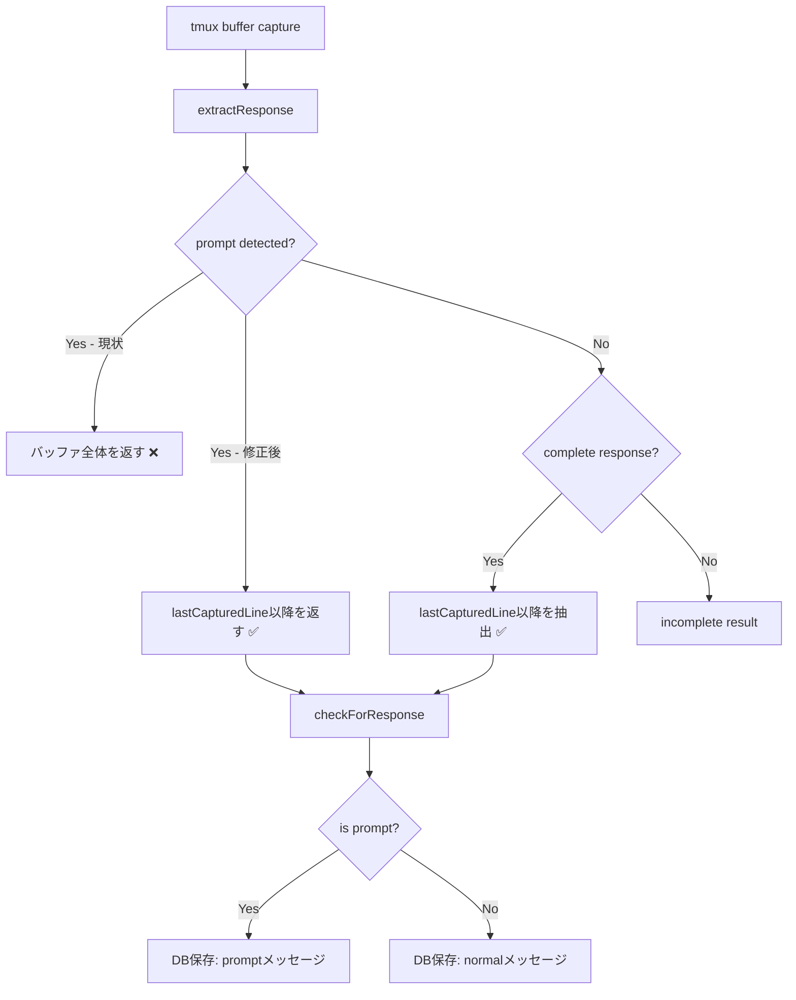

# 設計方針書: Issue #326 インタラクティブプロンプト検出時のレスポンス抽出修正

## 1. 概要

### 対象Issue
- **Issue #326**: fix: インタラクティブプロンプト検出時にtmuxバッファ全体がレスポンスとして保存される

### 問題の要約
`response-poller.ts`の`extractResponse()`関数で、インタラクティブプロンプト（選択肢形式の質問等）が検出された場合、`lastCapturedLine`を無視してtmuxバッファ全体をレスポンスとして返している。これにより、前の会話の内容がAssistantメッセージに混入する。

### 修正対象
- `src/lib/response-poller.ts` - `extractResponse()`関数内の2か所

## 2. アーキテクチャ設計

### 変更対象のデータフロー



### 修正箇所の位置づけ

`extractResponse()`は内部関数（非export）であり、唯一の呼び出し元は`checkForResponse()`である。修正はextractResponse内部に閉じるため、外部API変更なし。

## 3. 設計方針

### 3-1. 核心方針: 検出と抽出の分離

**原則**: プロンプト検出はバッファ全体で行い（検出精度維持）、返却するresponse contentのみ`lastCapturedLine`以降に限定する。

```
検出範囲: lines[0] ~ lines[totalLines-1]  (全体)
抽出範囲: lines[startIndex] ~ lines[totalLines-1]  (lastCapturedLine以降)
```

### 3-2. startIndex決定ロジック: 方針A（既存ロジック再利用）を採用

通常レスポンス抽出（行364-386）と同一の4分岐startIndex決定ロジックを再利用する。

| 条件 | startIndex | 理由 |
|------|-----------|------|
| bufferWasReset | findRecentUserPromptIndex(40) + 1 or 0 | バッファリセット時はユーザープロンプトを基点に |
| cliToolId === 'codex' | Math.max(0, lastCapturedLine) | Codex固有処理（負値ガード付き） |
| lastCapturedLine >= totalLines - 5 | findRecentUserPromptIndex(50) + 1 or totalLines - 40 | バッファスクロール考慮 |
| 通常 | Math.max(0, lastCapturedLine) | 最も一般的なケース（負値ガード付き） |

> **注記（Stage 2 SF-001対応）**: 実コードではCodex分岐と通常分岐で `Math.max(0, lastCapturedLine)` が使用されており、`lastCapturedLine` が負値の場合のガードが適用されている。Stage 1 C-001で指摘された `Math.max(0, ...)` ガードと同様の問題であり、テーブル全体で統一的に記載する。

**採用理由**:
- 通常レスポンスとプロンプトレスポンスで同一ロジックを使うことで一貫性を確保
- バッファリセット・スクロールのエッジケースが自動的にカバーされる
- 関数抽出により重複コードを排除できる

**不採用案（方針B: 簡略版）の理由**:
- `lastCapturedLine`のみだとバッファリセット時に全バッファが返されるリスクが残る

### 3-3. ヘルパー関数抽出

startIndex決定ロジックを共通ヘルパー関数として抽出し、通常レスポンス抽出とプロンプト検出の両方から使用する。

```typescript
/**
 * Determine the start index for response extraction based on buffer state.
 * Shared between normal response extraction and prompt detection paths.
 *
 * bufferWasReset is computed internally from lastCapturedLine, totalLines,
 * and bufferReset. Callers do NOT need to pre-compute bufferWasReset.
 *
 * @internal Exported for testing only
 */
export function resolveExtractionStartIndex(
  lastCapturedLine: number,
  totalLines: number,
  bufferReset: boolean,
  cliToolId: CLIToolType,
  findRecentUserPromptIndex: (windowSize: number) => number
): number
```

#### 3-3-0. 入口の防御的バリデーション（Stage 4 SF-001対応）

`resolveExtractionStartIndex()`は`@internal` exportであり、テストコードや将来の内部モジュールから直接呼び出される可能性がある。呼び出し元（`extractResponse()`）では`sessionState?.lastCapturedLine || 0`により0以上が保証されるが、ヘルパー関数自体の堅牢性のために、**関数冒頭で`lastCapturedLine`の防御的バリデーションを一律適用する**ことを推奨する。

```typescript
// 関数冒頭で一律適用（負値入力の防御）
lastCapturedLine = Math.max(0, lastCapturedLine);
```

これにより、Codex分岐・通常分岐の個別`Math.max(0, lastCapturedLine)`に加え、bufferWasReset判定前の段階で負値が排除される。既存の個別ガードとの二重適用となるが、防御的プログラミングの観点から許容される冗長性である。

#### 3-3-1. bufferWasReset再計算の責務境界（MF-001対応）

ヘルパー関数は引数として`bufferReset`（外部イベントフラグ）を受け取り、**関数内部で**`bufferWasReset`を再計算する。

```typescript
// ヘルパー関数内部の先頭で計算
const bufferWasReset = lastCapturedLine >= totalLines || bufferReset;
```

**この設計の理由**:
- `bufferWasReset`は`lastCapturedLine`と`totalLines`のバッファ状態比較と、`bufferReset`外部イベントの論理和であり、startIndex決定に不可欠な前提条件である
- この計算をヘルパー関数内部に含めることで、呼び出し側が事前計算を忘れるリスクを排除する
- SRPの観点: 「startIndex決定に必要な前提条件の計算」もstartIndex決定の責務に含まれるため、関数の責務境界内である
- 呼び出し側は`bufferReset`のみを渡し、`bufferWasReset`の計算は関数に委譲する

#### 3-3-2. findRecentUserPromptIndexをコールバック引数とする設計選択理由（SF-001対応）

`findRecentUserPromptIndex`はクロージャとして`extractResponse`内部で`lines`配列・`totalLines`・`cliToolId`・`stripAnsi`をキャプチャしている。設計の選択肢として以下の2案を検討した。

| 案 | 内容 | メリット | デメリット |
|----|------|---------|-----------|
| **A: コールバック引数（採用）** | クロージャを`(windowSize: number) => number`として注入 | 引数数を抑制（5個）、テスト時のモックが容易、関数シグネチャがシンプル | 呼び出し側がクロージャ構築を担う間接性 |
| **B: 依存値直接渡し** | `lines`, `totalLines`, `cliToolId`, `stripAnsi`を直接引数に追加 | 純粋関数化、副作用の可能性を排除 | 引数が8個以上に増加、KISS違反、テスト時のセットアップが複雑化 |

案Aを採用した理由: `findRecentUserPromptIndex`の内部実装（行走査、ANSI除去、パターンマッチング）は`resolveExtractionStartIndex`の責務外であり、その詳細を引数として露出させると関数の凝集度が低下する。コールバック引数により、startIndex決定ロジックと行走査ロジックの責務分離を維持しつつ、テスト時は`(windowSize) => fixedValue`のような簡易モックで済む。

**設計根拠**:
- SRP: startIndex決定の責務を独立関数に分離
- DRY: 通常レスポンス抽出パスとプロンプト検出パスで同一ロジックを共有
- テスタビリティ: `@internal` exportでユニットテスト可能
- 既存の`findRecentUserPromptIndex`クロージャは引数として注入（テスト時にモック可能）

### 3-4. 箇所別の修正設計

> **行番号に関する注記（SF-002対応）**: 本セクションおよびセクション3-5の行番号は、設計時点（2026-02-20）の`src/lib/response-poller.ts`のスナップショットに基づく。今後のコード変更により行番号がずれる可能性があるため、実装時は関数名・コメント・コードパターンで該当箇所を特定すること。

#### 箇所1: Claude早期プロンプト検出（行326-341）

**設計上の注記（Stage 2 MF-001対応）**: この箇所は `if (cliToolId === 'claude')` ブロック内に位置するため、`resolveExtractionStartIndex()` に渡される `cliToolId` は常に `'claude'` である。したがって、ヘルパー関数内部の `cliToolId === 'codex'` 分岐はこのコンテキストでは到達不能（dead code）となる。しかし、`resolveExtractionStartIndex()` は汎用ヘルパー関数として設計されており（通常レスポンスパスや箇所2からも呼ばれる）、関数の汎用性を維持するために引数として `cliToolId` を渡す設計は正しい。実装への影響はない。

**現状**:
```typescript
if (cliToolId === 'claude') {
    const fullOutput = lines.join('\n');
    const promptDetection = detectPromptWithOptions(fullOutput, cliToolId);
    if (promptDetection.isPrompt) {
      return {
        response: stripAnsi(fullOutput),  // ← バッファ全体
        isComplete: true,
        lineCount: totalLines,
      };
    }
}
```

**修正後**:
```typescript
if (cliToolId === 'claude') {
    const fullOutput = lines.join('\n');
    const promptDetection = detectPromptWithOptions(fullOutput, cliToolId);
    if (promptDetection.isPrompt) {
      // プロンプト検出はバッファ全体で行うが、返却は lastCapturedLine 以降に限定
      const startIndex = resolveExtractionStartIndex(
        lastCapturedLine, totalLines, bufferReset, cliToolId, findRecentUserPromptIndex
      );
      const extractedLines = lines.slice(startIndex);
      return {
        response: stripAnsi(extractedLines.join('\n')),
        isComplete: true,
        lineCount: totalLines,
      };
    }
}
```

#### 箇所2: フォールバックプロンプト検出（行487-499）

**現状**:
```typescript
const fullOutput = lines.join('\n');
const promptDetection = detectPromptWithOptions(fullOutput, cliToolId);
if (promptDetection.isPrompt) {
    return {
      response: fullOutput,  // ← バッファ全体（stripAnsiなし）
      isComplete: true,
      lineCount: totalLines,
    };
}
```

**修正後**:
```typescript
const fullOutput = lines.join('\n');
const promptDetection = detectPromptWithOptions(fullOutput, cliToolId);
if (promptDetection.isPrompt) {
    const startIndex = resolveExtractionStartIndex(
      lastCapturedLine, totalLines, bufferReset, cliToolId, findRecentUserPromptIndex
    );
    const extractedLines = lines.slice(startIndex);
    return {
      response: stripAnsi(extractedLines.join('\n')),  // stripAnsi追加（箇所1と統一）
      isComplete: true,
      lineCount: totalLines,
    };
}
```

**注意（Stage 2 SF-002対応）**: 箇所2の現状コードで`stripAnsi`が未適用であることは**既存バグ**である（意図的な設計ではない）。箇所1では`stripAnsi(fullOutput)`が適用されているにもかかわらず、箇所2では`fullOutput`がそのまま返されており、ANSIエスケープコードがDB保存される可能性がある。修正後は両箇所で`stripAnsi`を適用し、この非対称性を解消する。

**セキュリティ上の必須修正（Stage 4 MF-001対応）**: 箇所2の`stripAnsi`未適用は、`MessageList.tsx`の`hasAnsiCodes()`→`dangerouslySetInnerHTML`描画パスを意図せず有効化するため、セキュリティリスクとなる。`AnsiToHtml`の`escapeXML:true`オプションでXSSは緩和されているが、`dangerouslySetInnerHTML`パスの使用自体が攻撃面の拡大につながる。この修正は**確実に実装されなければならない**。詳細はセクション5-1-1を参照。

### 3-5. 通常レスポンス抽出パスのリファクタリング

既存の行364-386のstartIndex決定ロジックを`resolveExtractionStartIndex()`呼び出しに置換する。

**現状** (行364-386):
```typescript
let startIndex: number;
const bufferWasReset = lastCapturedLine >= totalLines || bufferReset;
if (bufferWasReset) { ... }
else if (cliToolId === 'codex') { ... }
else if (lastCapturedLine >= totalLines - 5) { ... }
else { ... }
```

**修正後**:
```typescript
const startIndex = resolveExtractionStartIndex(
  lastCapturedLine, totalLines, bufferReset, cliToolId, findRecentUserPromptIndex
);
```

## 4. checkForResponse内のpromptDetection再検出への影響

> **行番号に関する注記（Stage 2 SF-003対応）**: セクション3-4冒頭のSF-002注記と同様に、本セクション（4-1, 4-2, 4-3）で参照する行番号も設計時点（2026-02-20）の`src/lib/response-poller.ts`のスナップショットに基づく。今後のコード変更により行番号がずれる可能性があるため、実装時は関数名・コメント・コードパターンで該当箇所を特定すること。

### 4-0. cleanClaudeResponse/cleanGeminiResponseへの入力変更の影響（Stage 3 SF-002対応）

`checkForResponse()`のnormal responseパス（L641-646付近）では、`promptDetection.isPrompt === false`の場合に`result.response`を`cleanClaudeResponse()`または`cleanGeminiResponse()`に渡してクレンジング処理を行う。修正後、`result.response`は`lastCapturedLine`以降に限定された部分出力となるため、これらクレンジング関数への入力も変わる。

具体的には、`cleanClaudeResponse()`内の「最後のユーザープロンプト以降を抽出」ロジック（L149-156付近）が受け取る入力が、バッファ全体から部分出力に変わる。結果としてcleaned responseはより正確になる方向の変化であり、前の会話の混入が除去されるため品質向上に寄与する。既存のクレンジングロジック自体に変更は不要だが、入力範囲の変化が間接的に影響するパスとして認識しておく必要がある。

### 4-1. 影響分析

`checkForResponse()`行605:
```typescript
const promptDetection = detectPromptWithOptions(result.response, cliToolId);
```

修正後、`result.response`は`lastCapturedLine`以降の部分出力となる。プロンプト検出に必要なコンテキスト（質問文+選択肢）は通常、tmuxバッファの末尾に位置するため、`lastCapturedLine`以降に含まれる。

### 4-2. rawContentへの影響

- `prompt-detector.ts`行583: `rawContent: truncateRawContent(output.trim())`
- 修正後、`rawContent`は`lastCapturedLine`以降の出力のみを含む
- Issue #235の設計意図（「完全なプロンプト出力をDB保存」）に対して:
  - 「完全なプロンプト出力」の定義を「現在の会話のプロンプト出力」と解釈する
  - 前の会話の混入を除去することは#235の意図に反しない（むしろ品質向上）

### 4-3. 安全性の確認

`extractResponse()`内の早期プロンプト検出（箇所1）でバッファ全体を`detectPromptWithOptions`に渡してプロンプトを検出し、返却時のみ切り出す。その後`checkForResponse()`内で再度`detectPromptWithOptions(result.response)`を呼ぶが、この部分出力にはプロンプトの質問文+選択肢が含まれるため、再検出にも成功する。

## 5. セキュリティ設計

### 5-1. 変更に伴うセキュリティリスク

- **リスク低（セキュリティ上の必須修正あり）**: 今回の修正はデータフィルタリングの範囲変更に加え、箇所2への`stripAnsi`追加がセキュリティ上の必須修正として含まれる
- 入力バリデーション、認証・認可、外部通信には影響なし

#### 5-1-1. 箇所2のstripAnsi未適用によるXSSリスク（Stage 4 MF-001）

**現状の脅威**: 箇所2（フォールバックプロンプト検出、L487-499付近）では`stripAnsi()`が適用されておらず、ANSIエスケープコードがDBにそのまま保存される。`MessageList.tsx`では`hasAnsiCodes()`でANSIコードを検出した場合に`dangerouslySetInnerHTML`で描画するパスが存在する。`AnsiToHtml`の`escapeXML:true`オプションによりXSSは緩和されているが、以下のリスクが残る:

- `stripAnsi`未適用のまま保存されたデータが`hasAnsiCodes()`を`true`にし、意図しない描画パス（`dangerouslySetInnerHTML`）を通る
- `dangerouslySetInnerHTML`パスの使用自体がセキュリティ攻撃面を拡大する

**必須対応**: 設計書セクション3-4（箇所2）の修正方針に従い、`stripAnsi()`を必ず適用すること。実装時のテストで箇所2のレスポンスにANSIコードが含まれないことを検証すること。この修正は既存バグの修正（Stage 2 SF-002）であると同時に、セキュリティ上の必須修正である。

#### 5-1-2. stripAnsi()のSEC-002既知制限（Stage 4 SF-003）

`cli-patterns.ts`の`stripAnsi()`にはSEC-002として以下の未対応エスケープシーケンスが存在する:
- 8-bit CSI（0x9B）
- DEC private modes
- character set switching

修正後も箇所1・箇所2の双方で`stripAnsi()`に依存するため、tmuxバッファにこれらの非対応エスケープシーケンスが含まれた場合、DB保存データに残留する可能性がある。**これは本修正のスコープ外であり、既存リスクの継承である**。本修正により新たなセキュリティリスクが追加されるものではない。

## 6. テスト設計

### 6-1. テスト戦略: ヘルパー関数のユニットテスト（方針A）

`resolveExtractionStartIndex()`を`@internal` exportし、直接テストする。

### 6-2. テストケース

| # | テストケース | 入力 | 期待値 |
|---|------------|------|-------|
| 1 | 通常ケース | lastCapturedLine=50, totalLines=100, bufferReset=false, claude | startIndex=50 |
| 2 | バッファリセット（ユーザープロンプトあり） | lastCapturedLine=200, totalLines=80, bufferReset=true, findRecentUserPromptIndex→60 | startIndex=61 |
| 3 | バッファリセット（ユーザープロンプトなし） | lastCapturedLine=200, totalLines=80, bufferReset=true, findRecentUserPromptIndex→-1 | startIndex=0 |
| 4 | Codexの通常ケース | lastCapturedLine=50, totalLines=100, bufferReset=false, codex | startIndex=50 |
| 5 | バッファスクロール境界 | lastCapturedLine=96, totalLines=100, bufferReset=false, claude, findRecentUserPromptIndex→85 | startIndex=86 |
| 6 | バッファスクロール境界（プロンプトなし） | lastCapturedLine=96, totalLines=100, bufferReset=false, claude, findRecentUserPromptIndex→-1 | startIndex=60 |
| 7 | Codex lastCapturedLine=0（SF-001: Math.maxガード検証） | lastCapturedLine=0, totalLines=100, bufferReset=false, codex | startIndex=0 |
| 8 | 通常 lastCapturedLine=0（SF-001: Math.maxガード検証） | lastCapturedLine=0, totalLines=100, bufferReset=false, claude | startIndex=0 |
| 9 | 負値入力（Stage 4 SF-001: 防御的バリデーション検証） | lastCapturedLine=-1, totalLines=100, bufferReset=false, claude | startIndex=0 |
| 10 | totalLines=0エッジケース（Stage 4 SF-002: 空バッファ） | lastCapturedLine=0, totalLines=0, bufferReset=false, claude, findRecentUserPromptIndex→-1 | startIndex=0 |

### 6-3. 結合テスト（推奨）

`cleanClaudeResponse()`の既存テストに加え、プロンプト検出時のレスポンス内容が`lastCapturedLine`以降のみを含むことを検証するテストを追加。

### 6-4. テストファイル構成

```
tests/unit/lib/
├── response-poller.test.ts              # 既存テスト（変更なし）
└── resolve-extraction-start-index.test.ts  # 新規テスト
```

## 7. 影響範囲

### 7-1. 直接変更ファイル

| ファイル | 変更内容 |
|---------|---------|
| `src/lib/response-poller.ts` | `resolveExtractionStartIndex()`追加、箇所1/箇所2修正、通常レスポンスパスリファクタリング（Claude/Codex/Gemini全completionパスに影響: Stage 3 SF-003対応） |

> **注記（Stage 3 SF-003対応）**: セクション3-5で記載した通常レスポンスパスのリファクタリング（L364-386のstartIndex決定ロジックを`resolveExtractionStartIndex()`呼び出しに置換）は、`isCodexOrGeminiComplete || isClaudeComplete`条件ブロック（L357付近）内に位置する。すなわち、このリファクタリングはClaude completionパスだけでなく、Codex/Geminiの完了パスにも同様に影響する。`resolveExtractionStartIndex()`は`cliToolId`引数により各CLIツール固有の分岐を処理するため、Codex/Gemini使用時も正しくstartIndexが決定される。

### 7-2. 新規ファイル

| ファイル | 内容 |
|---------|------|
| `tests/unit/lib/resolve-extraction-start-index.test.ts` | `resolveExtractionStartIndex()`のユニットテスト |

### 7-3. 影響なし（確認済み）

- `src/lib/auto-yes-manager.ts` - 独自にtmuxバッファ取得、extractResponse経由しない
- `src/lib/assistant-response-saver.ts` - cleanClaudeResponse/cleanGeminiResponseのみimport。ただし、`savePendingAssistantResponse()`は`response-poller`の`checkForResponse()`と同一のtmuxバッファに対して独立にDB保存を行うため、`extractResponse()`の返却値変更が`sessionState.lastCapturedLine`の更新タイミングを介して間接的に`savePendingAssistantResponse()`のduplication check（`currentLineCount <= lastCapturedLine`）に影響する可能性がある。直接のコード変更は不要だが、タイミング依存の間接影響として認識しておくこと（Stage 3 SF-001対応）
- `src/lib/session-cleanup.ts` - stopPollingのみimport
- `src/lib/prompt-detector.ts` - API変更なし
- `src/lib/cli-patterns.ts` - API変更なし
- DBマイグレーション不要

### 7-4. 明示的なスコープ除外（Stage 3 MF-001対応）

以下のコードパスは本修正のスコープ外であり、`resolveExtractionStartIndex()`による置換対象外である。

- **`response-poller.ts` 部分レスポンスパス（L501-533付近）**: このパスは完全なレスポンスが未到着の場合に部分レスポンスを返す処理であり、セクション3-2で定義した4分岐startIndex決定ロジックとは異なる独自のstartIndex決定ロジック（`partialBufferReset`判定、`windowSize=80`）を使用している。`resolveExtractionStartIndex()`の4分岐ロジック（`bufferWasReset`判定、`windowSize=40/50`）とは条件・パラメータが異なるため、共通化は適切ではない。Stage 2 C-003でも検討事項として言及されたが、影響範囲分析の網羅性のためここに明示的に除外対象として記載する。

## 8. 設計上の決定事項とトレードオフ

| 決定事項 | 理由 | トレードオフ |
|---------|------|-------------|
| 方針A（既存ロジック再利用）採用 | バッファリセット・スクロールのエッジケースを自動カバー | ヘルパー関数のインターフェースがやや複雑 |
| ヘルパー関数を@internal exportする | テスタビリティ確保 | 内部実装の露出 |
| 箇所2にstripAnsi追加 | 箇所1との一貫性、ANSIコードのDB保存防止、dangerouslySetInnerHTMLパス経由のXSSリスク軽減（Stage 4 MF-001） | 機能的影響なし |
| resolveExtractionStartIndex冒頭の防御的バリデーション | @internal exportとして外部から呼び出される可能性に対する堅牢性（Stage 4 SF-001） | 個別分岐のMath.maxとの二重適用（許容される冗長性） |
| rawContentの縮小を許容 | 前の会話の混入除去は品質向上 | Issue #235の「完全な出力」が「現在の会話の出力」に変更 |

## 9. CLAUDE.md準拠確認

| 原則 | 準拠状況 |
|------|---------|
| **SRP** | resolveExtractionStartIndexはstartIndex決定の単一責務。bufferWasResetの再計算もstartIndex決定に不可欠な前提条件であり、この関数の責務境界内に含める（MF-001対応） |
| **DRY** | 1か所の既存startIndex決定ロジックを関数に抽出し、既存1か所+新規2か所の計3か所で共有（Stage 2 SF-004対応） |
| **KISS** | 既存ロジックの再利用、新規概念の導入なし。findRecentUserPromptIndexのコールバック引数パターンは間接的だが、引数数抑制とのトレードオフで採用（SF-001対応、詳細はセクション3-3-2） |
| **YAGNI** | 必要な修正のみ（2か所の修正 + 1関数抽出）。**例外**: 箇所2への`stripAnsi`追加はIssue #326の最小修正範囲外だが、箇所1との一貫性確保およびANSIエスケープコードのDB保存防止のためYAGNI例外として意識的に含める（SF-003対応）。**なお、Stage 4 MF-001にてこの修正はセキュリティ上の必須修正と判定された（dangerouslySetInnerHTMLパス経由のXSSリスク）** |

## 10. Stage 1 レビュー指摘事項サマリー

Stage 1（通常レビュー）の結果、スコア4/5、conditionally_approvedの評価を受けた。以下の指摘事項を本設計書に反映済み。

### 10-1. Must Fix（必須修正）

| ID | タイトル | 対応セクション | 対応内容 |
|----|---------|---------------|---------|
| MF-001 | bufferWasReset再計算の責務境界が未記載 | 3-3-1 | ヘルパー関数が内部で`bufferWasReset = lastCapturedLine >= totalLines \|\| bufferReset`を計算する責務を持つことを明記。呼び出し側は`bufferReset`のみ渡す設計とした。 |

### 10-2. Should Fix（推奨修正）

| ID | タイトル | 対応セクション | 対応内容 |
|----|---------|---------------|---------|
| SF-001 | findRecentUserPromptIndexのコールバック引数設計の複雑さ | 3-3-2 | コールバック引数 vs 依存値直接渡しのトレードオフ比較表を追加し、コールバック引数を選択した理由を明記。 |
| SF-002 | 行番号参照と実コードの不一致リスク | 3-4冒頭 | 行番号が設計時点のスナップショットである旨の注記を追加。実装時はコードパターンで特定するよう記載。 |
| SF-003 | 箇所2のstripAnsi追加がYAGNI例外であることの明示不足 | 9 (YAGNI欄) | YAGNI例外として意識的に含める判断であることを補記。 |

### 10-3. Consider（検討事項） - 記録のみ

以下はレビューで「検討事項」として提起されたもの。本設計書への反映は任意だが、実装時の参考として記録する。

| ID | タイトル | 概要 |
|----|---------|------|
| C-001 | Math.max(0, lastCapturedLine)ガード | ヘルパー関数内で`Math.max(0, ...)`を一律適用するかの検討。テストケースに`lastCapturedLine=0`や負値のケース追加を推奨。 |
| C-002 | checkForResponse再検出の部分出力での動作保証 | `lastCapturedLine`が質問文途中を指す場合のrawContent品質低下リスク。結合テストでの検証を推奨。 |
| C-003 | @internal exportの命名規約 | `resolveExtractionStartIndex`は本番コードからも呼び出されるため`ForTesting`接尾辞は不適切。現命名が適切。 |

## 11. Stage 2 レビュー指摘事項サマリー

Stage 2（整合性レビュー）の結果、スコア4/5、conditionally_approvedの評価を受けた。以下の指摘事項を本設計書に反映済み。

### 11-1. Must Fix（必須修正）

| ID | タイトル | 対応セクション | 対応内容 |
|----|---------|---------------|---------|
| MF-001 | 箇所1のcliToolIdガード条件の補記 | 3-4 (箇所1) | 箇所1は `cliToolId==='claude'` ブロック内で呼ばれるためcodex分岐は到達不能だが、関数の汎用性維持のためcliToolIdを渡す設計は正しい旨を補記。 |

### 11-2. Should Fix（推奨修正）

| ID | タイトル | 対応セクション | 対応内容 |
|----|---------|---------------|---------|
| SF-001 | 4分岐テーブルのMath.max(0, ...)ガード未記載 | 3-2, 6-2 | Codex分岐と通常分岐に`Math.max(0, lastCapturedLine)`を追記。テストケース#7, #8を追加。 |
| SF-002 | 箇所2のstripAnsi未適用が既存バグであることの明記 | 3-4 (箇所2) | stripAnsi未適用が意図的設計ではなく既存バグであることを明記。 |
| SF-003 | 行番号注記のcheckForResponse()内参照への適用 | 4 (冒頭) | セクション4冒頭にもセクション3-4と同様の行番号注記を追加。 |
| SF-004 | DRY記載の不正確な表現修正 | 9 (DRY欄) | 「3か所のstartIndex決定ロジックを1つの関数に統合」を「1か所の既存ロジックを関数に抽出し、計3か所で共有」に修正。 |

### 11-3. Consider（検討事項） - 記録のみ

| ID | タイトル | 概要 |
|----|---------|------|
| C-001 | truncateRawContent()との相互作用 | 部分出力がtruncate制限（200行/5000文字）内に収まることがほとんどであるため実害はないが、セクション4-2での言及を追加検討。 |
| C-002 | テストケース#2のbufferResetパラメータの冗長性 | lastCapturedLine=200 >= totalLines=80だけでbufferWasReset=trueとなり、bufferReset=trueは冗長。bufferResetフラグのみでtrueとなるケースのテスト追加を検討。 |
| C-003 | 部分レスポンスパス（行501-533）のスコープ外明記 | 部分レスポンスパスのstartIndex決定ロジックは4分岐ロジックとは異なるため本修正のスコープ外とする旨の明記を検討。 |

## 12. Stage 3 レビュー指摘事項サマリー

Stage 3（影響分析レビュー）の結果、スコア4/5、conditionally_approvedの評価を受けた。以下の指摘事項を本設計書に反映済み。

### 12-1. Must Fix（必須修正）

| ID | タイトル | 対応セクション | 対応内容 |
|----|---------|---------------|---------|
| MF-001 | 部分レスポンスパス(L501-533)のスコープ外明記 | 7-4 | 部分レスポンスパスは4分岐ロジックとは異なる独自のstartIndex決定ロジック（partialBufferReset判定、windowSize=80）を使用しており、`resolveExtractionStartIndex()`による置換対象外であることをセクション7-4に明記。Stage 2 C-003の検討事項を正式に反映。 |

### 12-2. Should Fix（推奨修正）

| ID | タイトル | 対応セクション | 対応内容 |
|----|---------|---------------|---------|
| SF-001 | assistant-response-saver.tsへの間接影響の分析不足 | 7-3 | `savePendingAssistantResponse()`が`sessionState.lastCapturedLine`の更新タイミングを介して間接的にduplication checkに影響する可能性をセクション7-3に補記。直接のコード変更は不要だが、タイミング依存の間接影響として認識すべき旨を記載。 |
| SF-002 | cleanClaudeResponse/cleanGeminiResponseへの入力変更の影響 | 4-0 | `checkForResponse()`のnormal responseパスで`result.response`が部分出力に変わることにより、`cleanClaudeResponse()`/`cleanGeminiResponse()`の入力が変わる影響パスをセクション4-0として新設・明記。結果は品質向上方向の変化であり、クレンジングロジック自体の変更は不要。 |
| SF-003 | Codex/Gemini completionパスへの影響明示 | 7-1 | 通常レスポンスパスリファクタリングが`isCodexOrGeminiComplete \|\| isClaudeComplete`条件ブロック内に位置し、Claude/Codex/Gemini全completionパスに影響することをセクション7-1の変更内容欄および注記として明記。 |

### 12-3. Consider（検討事項） - 記録のみ

| ID | タイトル | 概要 |
|----|---------|------|
| C-001 | auto-yes-manager.tsとの二重プロンプト検出の整合性 | auto-yes-manager.tsはバッファ全体に対してdetectPrompt()を呼び出し、response-pollerは部分出力に対してdetectPromptWithOptions()を呼ぶ。両者は独立パスだが、同一バッファに異なるスコープの検出が走る点を運用上認識すべき。設計書7-3の「影響なし」記載は正しい。 |
| C-002 | Codex/Geminiプロンプト検出パスの結合テストカバレッジ | 箇所2（フォールバックプロンプト検出）がCodex/Gemini使用時にresolveExtractionStartIndex()を用いた動作確認の結合テスト追加を検討。 |
| C-003 | lineCountフィールドの不変性明記 | 箇所1/箇所2の修正後もlineCount: totalLinesは変更されない。checkForResponse()でのsessionState更新に影響がないことを確認済みだが、影響分析としての明記を検討。 |

## 13. 実装チェックリスト

以下は本設計書に基づく実装時の確認事項である。

### 13-1. ヘルパー関数実装

- [ ] `resolveExtractionStartIndex()`を`src/lib/response-poller.ts`に追加
- [ ] 関数冒頭で`lastCapturedLine = Math.max(0, lastCapturedLine)`を一律適用（Stage 4 SF-001: 防御的バリデーション）
- [ ] 関数内部で`bufferWasReset = lastCapturedLine >= totalLines || bufferReset`を計算（Stage 1 MF-001）
- [ ] Codex分岐・通常分岐で`Math.max(0, lastCapturedLine)`を使用（Stage 2 SF-001）
- [ ] `findRecentUserPromptIndex`はコールバック引数として受け取る（Stage 1 SF-001）
- [ ] `@internal` exportとしてJSDocコメントを付与
- [ ] JSDocにbufferWasReset内部計算の旨を記載（Stage 1 MF-001）

### 13-2. 箇所1修正（Claude早期プロンプト検出）

- [ ] `resolveExtractionStartIndex()`を使ってstartIndexを計算
- [ ] `lines.slice(startIndex).join('\n')`でレスポンスを抽出
- [ ] `stripAnsi()`を適用（既存動作維持）
- [ ] 箇所1は`cliToolId==='claude'`コンテキスト内であり、ヘルパー関数内のcodex分岐は到達不能であることを理解した上で実装（Stage 2 MF-001）

### 13-3. 箇所2修正（フォールバックプロンプト検出）

- [ ] `resolveExtractionStartIndex()`を使ってstartIndexを計算
- [ ] `lines.slice(startIndex).join('\n')`でレスポンスを抽出
- [ ] **[セキュリティ必須]** `stripAnsi()`を追加（既存バグの修正: Stage 2 SF-002、YAGNI例外: Stage 1 SF-003、**XSSリスク軽減: Stage 4 MF-001**）
- [ ] テストで箇所2のレスポンスにANSIコードが含まれないことを検証（Stage 4 MF-001）

### 13-4. 通常レスポンスパスリファクタリング

- [ ] 既存のstartIndex決定ロジック（4分岐）を`resolveExtractionStartIndex()`呼び出しに置換
- [ ] この置換がClaude/Codex/Gemini全completionパスに影響することを確認（Stage 3 SF-003）
- [ ] 部分レスポンスパス（L501-533付近）は置換対象外であることを確認（Stage 3 MF-001）

### 13-5. テスト

- [ ] `tests/unit/lib/resolve-extraction-start-index.test.ts`を新規作成
- [ ] 設計書セクション6-2の10テストケースを実装（Stage 2 SF-001で#7, #8追加、Stage 4 SF-001で#9追加、Stage 4 SF-002で#10追加）
- [ ] テストケース#9: lastCapturedLine=-1の負値入力で startIndex=0 を検証（Stage 4 SF-001）
- [ ] テストケース#10: totalLines=0の空バッファでstartIndex=0を検証（Stage 4 SF-002）
- [ ] 箇所2修正後のレスポンスにANSIコードが含まれないことを検証するテスト追加（Stage 4 MF-001）
- [ ] (推奨) Stage 1 C-002: 部分出力での再検出の結合テスト追加を検討
- [ ] (推奨) Stage 2 C-002: bufferResetフラグのみでbufferWasReset=trueとなるケースのテスト追加を検討
- [ ] (推奨) Stage 3 C-002: Codex/Geminiでのフォールバックプロンプト検出パスの結合テスト追加を検討

### 13-6. 影響確認（Stage 3対応）

- [ ] `assistant-response-saver.ts`のduplication checkがlastCapturedLine更新タイミング変更で影響を受けないことを動作確認（Stage 3 SF-001）
- [ ] `cleanClaudeResponse()`/`cleanGeminiResponse()`が部分出力入力で正しく動作することを確認（Stage 3 SF-002）
- [ ] 部分レスポンスパス（L501-533付近）に変更を加えていないことを確認（Stage 3 MF-001）

## 14. Stage 4 レビュー指摘事項サマリー

Stage 4（セキュリティレビュー）の結果、スコア4/5、conditionally_approvedの評価を受けた。以下の指摘事項を本設計書に反映済み。

### 14-1. Must Fix（必須修正）

| ID | タイトル | 対応セクション | 対応内容 |
|----|---------|---------------|---------|
| MF-001 | 箇所2のstripAnsi未適用によるANSIエスケープコードのDB保存とXSSリスク | 5-1-1, 3-4(箇所2), 13-3 | セキュリティ設計セクションに`MessageList.tsx`の`hasAnsiCodes()`→`dangerouslySetInnerHTML`描画パスを経由するXSSリスクを明記。箇所2修正設計にセキュリティ必須修正である旨を追記。実装チェックリストにANSIコード非含有の検証テストを追加。 |

### 14-2. Should Fix（推奨修正）

| ID | タイトル | 対応セクション | 対応内容 |
|----|---------|---------------|---------|
| SF-001 | lastCapturedLineの負値入力に対する防御的バリデーション | 3-3-0, 6-2(#9), 13-1 | `resolveExtractionStartIndex()`冒頭での`lastCapturedLine = Math.max(0, lastCapturedLine)`一律適用を推奨としてセクション3-3-0に追加。テストケース#9（負値入力）を追加。実装チェックリストに防御的バリデーション項目を追加。 |
| SF-002 | totalLines=0エッジケースのテスト追加 | 6-2(#10), 13-5 | テストケース#10（totalLines=0、空バッファ）を追加。bufferWasReset=trueとなりfindRecentUserPromptIndex→-1でstartIndex=0となる動作を文書化。 |
| SF-003 | stripAnsi()のSEC-002既知制限への言及 | 5-1-2 | セクション5-1-2を新設し、`stripAnsi()`の8-bit CSI/DEC private modes/character set switching未対応パターンがDB保存データに残留する可能性を明記。本修正のスコープ外であり既存リスクの継承である旨を記載。 |

### 14-3. Consider（検討事項） - 記録のみ

| ID | タイトル | 概要 |
|----|---------|------|
| C-001 | @internal exportのセキュリティ影響評価 | プロジェクト内で確立されたパターンであり、I/O操作を含まないため追加リスクなし。対応不要。 |
| C-002 | 前の会話内容の混入防止のセキュリティ上の意義 | lastCapturedLine以降への制限はCWE-200（情報の公開）リスク軽減に寄与。修正方針は情報漏洩防止の観点でも適切。 |
| C-003 | rawContentの縮小とDB保存データ量の変化 | truncateRawContent()の既存制限で十分に制御されている。追加対応不要。 |
| C-004 | SQLインジェクション防御の確認 | better-sqlite3のprepared statement使用により安全。追加対応不要。 |

### 14-4. OWASPチェックリスト

| カテゴリ | 評価 | 備考 |
|---------|------|------|
| A01: Broken Access Control | N/A | 認証・認可には影響なし |
| A02: Cryptographic Failures | N/A | 暗号化処理に関与しない |
| A03: Injection | PASS | prepared statement使用、stripAnsi()追加でANSI混入防止 |
| A04: Insecure Design | PASS | lastCapturedLine以降への制限はデータ最小化原則に合致 |
| A05: Security Misconfiguration | N/A | セキュリティ設定の変更なし |
| A06: Vulnerable Components | N/A | 新規依存パッケージの追加なし |
| A07: Identification and Authentication | N/A | 認証機能への影響なし |
| A08: Data Integrity | PASS | stripAnsi()統一によりDB保存データの一貫性が向上 |
| A09: Logging and Monitoring | N/A | ログ出力への影響なし |
| A10: SSRF | N/A | 外部リクエストに関与しない |

### 14-5. リスク評価

| カテゴリ | レベル |
|---------|--------|
| 技術リスク | Low |
| セキュリティリスク | Low |
| 運用リスク | Low |

---

*Generated by design-policy command for Issue #326*
*Date: 2026-02-20*
*Stage 1 review applied: 2026-02-20*
*Stage 2 review applied: 2026-02-20*
*Stage 3 review applied: 2026-02-20*
*Stage 4 review applied: 2026-02-20*
