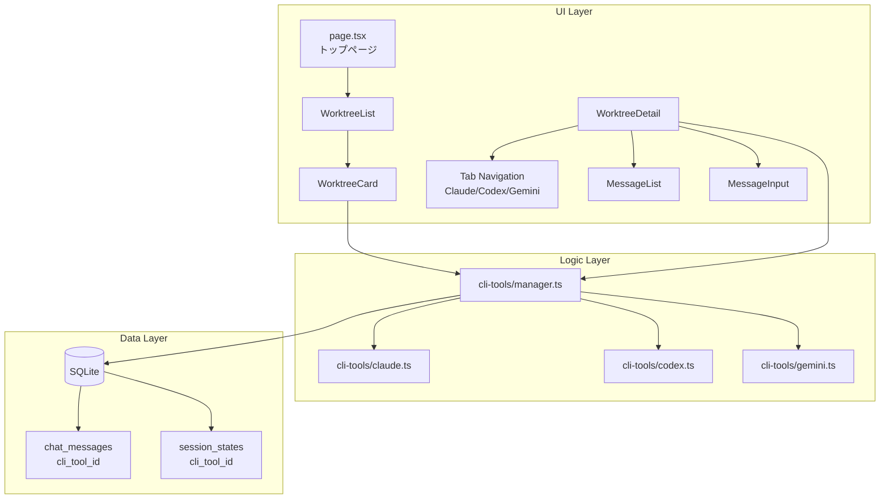
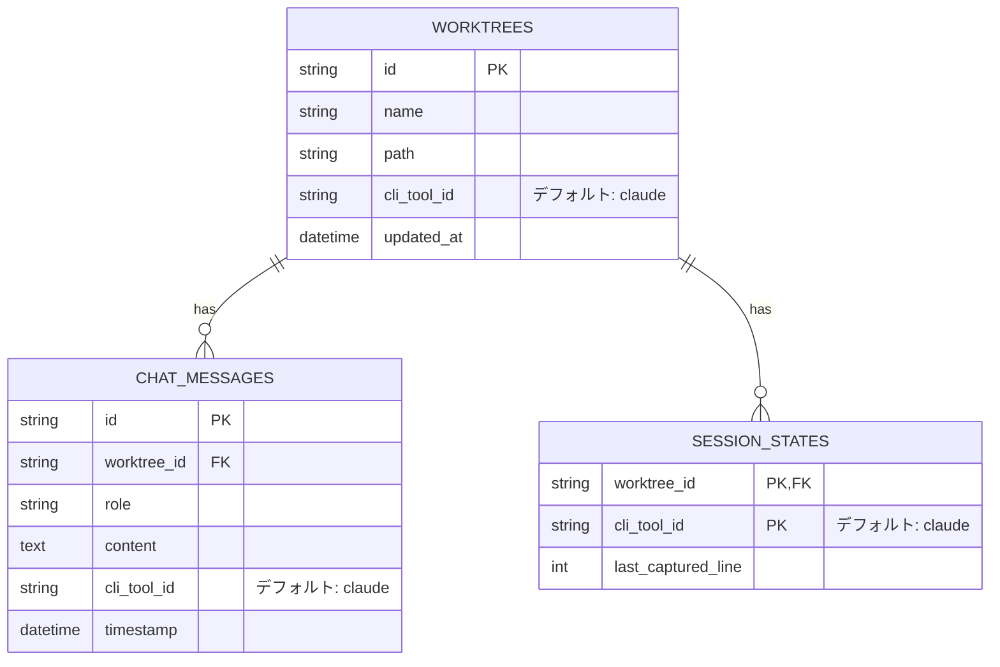

# 設計方針書: Issue #33 Codex/Gemini文言削除

**Issue**: [#33 codex geminiの文言の削除](https://github.com/Kewton/MyCodeBranchDesk/issues/33)

**作成日**: 2026-01-11

**ステータス**: 承認済み（2026-01-11 アーキテクチャレビュー通過）

---

## 1. 概要

### 1.1 要件
トップページにて、codexとgeminiの表記があるため、現状Claude Codeのみをターゲットとしているので一旦削除したい。

### 1.2 背景
Issue #4で実装された「複数CLIツールサポート」機能により、Claude Code / Codex CLI / Gemini CLIの3つのツールに対応している。しかし、現時点ではClaude Codeのみを対象とするため、UIからcodex/geminiの表記を削除する必要がある。

### 1.3 キーワード
「一旦削除」という表現から、将来的に再導入する可能性を考慮した設計が求められる。

---

## 2. 現状分析

### 2.1 システム構成図



### 2.2 影響範囲の特定

| カテゴリ | ファイル数 | 出現回数 | 影響度 |
|---------|-----------|---------|--------|
| **UIコンポーネント** | 5 | 45 | 高 |
| **APIルート** | 8 | 18 | 中 |
| **CLIツール実装** | 6 | 73 | 高 |
| **データベース層** | 2 | 9 | 低〜中 |
| **型定義** | 2 | 8 | 高 |
| **ユーティリティ** | 4 | 60 | 中 |
| **テスト** | 11 | 215 | 高 |
| **合計** | **38** | **428** | - |

### 2.3 主要な影響箇所

#### UI層（ユーザーに見える部分）

| ファイル | 行 | 内容 |
|---------|-----|------|
| `WorktreeDetail.tsx` | 28-31 | `TabView`型定義、`CLI_TABS`配列 |
| `WorktreeDetail.tsx` | 554-583 | タブナビゲーション（Claude/Codex/Gemini） |
| `WorktreeCard.tsx` | 54 | 確認ダイアログ「Claude/Codex/Gemini」 |
| `WorktreeCard.tsx` | 244-277 | Last Messages表示（Codex/Gemini Badge） |
| `MessageList.tsx` | - | CLIツール別メッセージフィルタリング |

#### ロジック層

| ファイル | 内容 |
|---------|------|
| `cli-tools/types.ts` | `CLIToolType = 'claude' \| 'codex' \| 'gemini'` |
| `cli-tools/codex.ts` | Codex CLI実装（31行） |
| `cli-tools/gemini.ts` | Gemini CLI実装（31行） |
| `cli-tools/manager.ts` | 3ツールの登録・管理 |
| `cli-patterns.ts` | ツール別パターン定義（22箇所） |

#### データ層

| テーブル | カラム | 影響 |
|---------|--------|------|
| `chat_messages` | `cli_tool_id` | デフォルト値'claude'で維持可能 |
| `session_states` | `cli_tool_id` | 複合キーの一部 |

---

## 3. 設計アプローチの比較

### 3.1 候補アプローチ

| アプローチ | 概要 | 工数 | 可逆性 | リスク |
|-----------|------|------|--------|--------|
| **A. UI非表示化** | UIからcodex/gemini表示を削除、内部ロジック維持 | 低 | 高 | 低 |
| **B. Feature Flag** | 設定でcodex/gemini機能を切り替え可能に | 中 | 高 | 低 |
| **C. 完全削除** | codex/gemini関連コードを全削除 | 高 | 低 | 中 |

### 3.2 推奨アプローチ: A. UI非表示化

#### 選定理由

1. **「一旦削除」の意図に合致**: 将来の再導入が容易
2. **YAGNI原則**: 必要最小限の変更で目的達成
3. **リスク最小化**: データベーススキーマ変更なし
4. **工数最小化**: UI層のみの変更で完了

#### トレードオフ

| 採用事項 | メリット | デメリット |
|---------|---------|-----------|
| 内部ロジック維持 | 再導入が容易 | 未使用コードが残る |
| DB構造維持 | マイグレーション不要 | データ整合性維持が必要 |
| 型定義維持 | 影響範囲最小化 | 型の一貫性が低下 |

---

## 4. 詳細設計

### 4.1 変更対象ファイル

#### Phase 1: UI表示の削除（必須）

```
src/components/worktree/
├── WorktreeDetail.tsx   # タブからCodex/Gemini削除
├── WorktreeCard.tsx     # Last Messages表示からCodex/Gemini削除
└── MessageList.tsx      # CLIツール選択UI削除（あれば）
```

#### Phase 2: 関連テキストの更新（推奨）

```
src/components/worktree/
└── WorktreeCard.tsx     # 確認ダイアログの文言修正
```

### 4.2 具体的な変更内容

#### 4.2.1 WorktreeDetail.tsx

**変更前:**
```typescript
type TabView = 'claude' | 'codex' | 'gemini' | 'logs' | 'info' | 'memo';

const CLI_TABS: CLIToolType[] = ['claude', 'codex', 'gemini'];
```

**変更後:**
```typescript
type TabView = 'claude' | 'logs' | 'info' | 'memo';

const CLI_TABS: CLIToolType[] = ['claude'];
```

**タブナビゲーション（554-583行付近）:**

Codex/Geminiタブボタンを削除:
```tsx
{/* 削除: Codexタブ */}
{/* 削除: Geminiタブ */}
```

**直接的な条件分岐の修正（166行目、620行目）:**

`isCliTab()`を使用していない直接的な条件分岐も修正が必要:

変更前:
```typescript
// 166行目
if (activeTab === 'claude' || activeTab === 'codex' || activeTab === 'gemini') {

// 620行目
{(activeTab === 'claude' || activeTab === 'codex' || activeTab === 'gemini') && (
```

変更後:
```typescript
// 166行目 - isCliTab()を使用するか、直接修正
if (isCliTab(activeTab)) {
// または
if (activeTab === 'claude') {

// 620行目 - 同様に修正
{isCliTab(activeTab) && (
// または
{activeTab === 'claude' && (
```

> **注意**: `CLI_TABS`配列の変更だけでは、これらの直接的な条件分岐は自動的に修正されない。明示的な修正が必要。

#### 4.2.2 WorktreeCard.tsx

**確認ダイアログ（54行付近）:**

変更前:
```typescript
if (!confirm(`「${name}」の全てのセッション（Claude/Codex/Gemini）を終了しますか？...`))
```

変更後:
```typescript
if (!confirm(`「${name}」のセッションを終了しますか？...`))
```

**Last Messages表示（244-277行付近）:**

Codex/Geminiの表示ブロックを削除

#### 4.2.3 MessageList.tsx

CLIツール選択に関するUIがあれば、Claudeのみに固定

### 4.3 変更しない箇所（維持）

以下は変更せず、将来の再導入に備えて維持:

| カテゴリ | ファイル | 理由 |
|---------|---------|------|
| 型定義 | `cli-tools/types.ts` | 内部ロジックへの影響回避 |
| CLI実装 | `cli-tools/codex.ts`, `gemini.ts` | 再導入時の再実装コスト削減 |
| Manager | `cli-tools/manager.ts` | 拡張性維持 |
| DB | `db.ts`, マイグレーション | スキーマ変更リスク回避 |
| API | 各APIルート | 後方互換性維持 |

---

## 5. データモデル

### 5.1 現行ER図（変更なし）



### 5.2 データ整合性

- `cli_tool_id`のデフォルト値は`'claude'`のまま維持
- 既存のcodex/geminiデータがあっても、UIでは表示されないだけで保持される
- 将来の再導入時にデータが失われない

---

## 6. API設計

### 6.1 変更なし

APIエンドポイントは変更しない。`cliTool`パラメータを受け付けるが、UIからは常に`'claude'`が送信される。

```
GET /api/worktrees/:id/messages?cliTool=claude
POST /api/worktrees/:id/send { cliToolId: 'claude' }
```

### 6.2 後方互換性

- 既存のAPI仕様は完全に維持
- `cliTool=codex`や`cliTool=gemini`でのリクエストも引き続き動作
- 将来の再導入時にAPI変更が不要

---

## 7. テスト戦略

### 7.1 変更が必要なテスト

#### 7.1.1 E2Eテスト詳細修正計画

**対象ファイル**: `tests/e2e/cli-tool-selection.spec.ts`

| # | テストケース | 対応 | 優先度 | 修正内容 |
|---|-------------|------|--------|---------|
| 1 | `should display CLI Tool badge in worktree card` | 修正 | 高 | Claudeのみ確認するよう変更 |
| 2 | `should navigate to worktree detail and display CLI Tool in Information tab` | 削除 | 高 | CLI Tool選択UIが存在しないため |
| 3 | `should display Edit button for CLI Tool in Information tab` | 削除 | 高 | 該当機能がUIに存在しない |
| 4 | `should show radio buttons when editing CLI Tool` | 削除 | 高 | Codex/Gemini選択UIを削除するため |
| 5 | `should display Save and Cancel buttons when editing CLI Tool` | 削除 | 高 | 同上 |
| 6 | `should cancel CLI Tool editing` | 削除 | 高 | 同上 |
| 7 | `should be responsive on mobile` | 修正 | 中 | Claudeのみ確認するよう変更 |
| 8 | `should display CLI Tool with correct badge color` | 維持 | 低 | 汎用的なバッジテストのため |

#### 7.1.2 修正例

**テストケース1の修正例:**
```typescript
// 変更前
const claudeVisible = await claudeBadge.count() > 0;
const codexVisible = await codexBadge.count() > 0;
const geminiVisible = await geminiBadge.count() > 0;
expect(claudeVisible || codexVisible || geminiVisible).toBe(true);

// 変更後
const claudeBadge = firstCard.getByText('Claude', { exact: true });
expect(await claudeBadge.count()).toBeGreaterThan(0);
// Codex/Geminiバッジは表示されないことを確認
const codexBadge = firstCard.getByText('Codex', { exact: true });
const geminiBadge = firstCard.getByText('Gemini', { exact: true });
expect(await codexBadge.count()).toBe(0);
expect(await geminiBadge.count()).toBe(0);
```

### 7.2 維持するテスト

以下のテストは内部ロジックの動作確認のため維持:

- `cli-tools/codex.test.ts`
- `cli-tools/gemini.test.ts`
- `api-*-cli-tool.test.ts`（統合テスト）

### 7.3 追加テスト

| テスト | 目的 |
|-------|------|
| UIにCodex/Geminiタブが表示されないこと | 削除の確認 |
| Claude機能が正常に動作すること | 機能影響なしの確認 |

---

## 8. 実装計画

### 8.1 タスク分解

| # | タスク | 影響ファイル | 見積もり |
|---|-------|-------------|---------|
| 1 | WorktreeDetail.tsxからCodex/Geminiタブ削除 | 1ファイル | S |
| 2 | WorktreeCard.tsxからCodex/Gemini表示削除 | 1ファイル | S |
| 3 | 確認ダイアログの文言修正 | 1ファイル | XS |
| 4 | E2Eテストの更新 | 1ファイル | S |
| 5 | 動作確認・回帰テスト | - | M |

### 8.2 チェックリスト

#### WorktreeDetail.tsx
- [ ] `TabView`型定義の変更（codex/gemini削除）
- [ ] `CLI_TABS`配列の変更（claudeのみ）
- [ ] タブナビゲーションからCodex/Geminiボタン削除
- [ ] 直接的な条件分岐の修正（166行目）
- [ ] 直接的な条件分岐の修正（620行目）

#### WorktreeCard.tsx
- [ ] Last Messages表示からCodex/Gemini削除
- [ ] 確認ダイアログ文言修正

#### E2Eテスト
- [ ] テストケース1の修正（Claudeのみ確認）
- [ ] テストケース2〜6の削除
- [ ] テストケース7の修正（Claudeのみ確認）

#### 品質確認
- [ ] ユニットテスト通過確認
- [ ] ビルド成功確認
- [ ] 手動動作確認（トップページでCodex/Geminiが非表示）
- [ ] 手動動作確認（詳細ページでCodex/Geminiタブが非表示）

---

## 9. リスク評価

### 9.1 リスク一覧

| リスク | 影響 | 発生確率 | 対策 |
|-------|------|---------|------|
| 内部ロジックへの予期せぬ影響 | 中 | 低 | UI層のみの変更に限定 |
| 将来の再導入時の工数増加 | 低 | 中 | ロジック・データ維持で軽減 |
| テスト漏れによるバグ | 中 | 低 | 既存テスト維持 |

### 9.2 ロールバック計画

UI層のみの変更のため、Git revertで即座にロールバック可能。

---

## 10. 設計上の決定事項

### 10.1 採用した設計判断

| 決定事項 | 理由 | 代替案 |
|---------|------|--------|
| UI非表示化アプローチ | YAGNI原則、「一旦削除」の意図 | 完全削除 |
| 型定義維持 | 影響範囲最小化 | 型からcodex/gemini削除 |
| テスト維持 | 内部ロジックの品質担保 | テストも削除 |
| DB構造維持 | マイグレーションリスク回避 | カラム削除 |

### 10.2 CLAUDE.md準拠

- **SOLID原則**: 単一責任（UI層のみ変更）
- **KISS原則**: 最小限の変更で目的達成
- **YAGNI原則**: 将来必要になるかもしれない削除は行わない
- **DRY原則**: 既存コードの再利用性維持

---

## 11. まとめ

### 11.1 推奨アプローチ

**UI非表示化アプローチ**を採用し、以下の方針で実装:

1. `WorktreeDetail.tsx`のタブナビゲーションからCodex/Geminiを削除
2. `WorktreeCard.tsx`のLast Messages表示からCodex/Geminiを削除
3. 確認ダイアログの文言を修正
4. 内部ロジック・データベース・型定義は維持

### 11.2 期待効果

- トップページからcodex/gemini表記が削除される
- Claude Code専用UIとしてシンプル化
- 将来の複数CLI対応再導入が容易

### 11.3 次のアクション

1. 本設計方針のレビュー・承認
2. `/work-plan`でタスク詳細化
3. `/tdd-impl`または直接実装

---

## 付録

### A. 参考Issue

- Issue #4: 複数CLIツールサポート（元の実装）
- Issue #33: codex geminiの文言の削除（本Issue）

### B. 関連ドキュメント

- [アーキテクチャ](../../docs/architecture.md)
- [CLIツール抽象化層](../../src/lib/cli-tools/README.md)（存在する場合）
