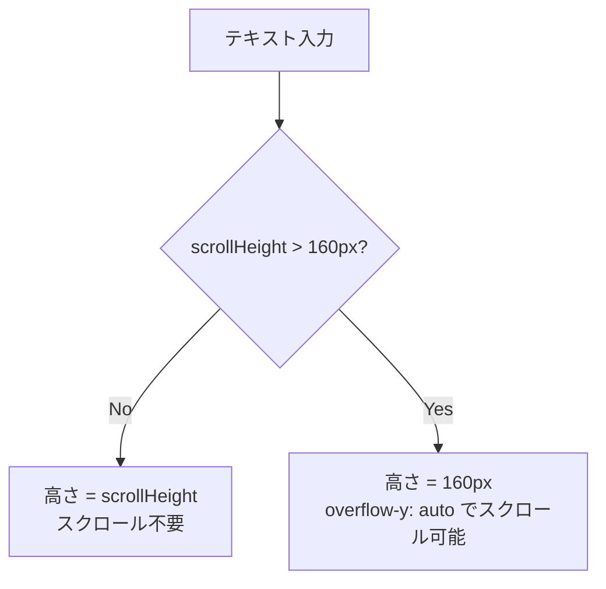

# 設計方針書: Issue #34 スマホ利用時メッセージ入力欄をスクロール可能に

## 概要

| 項目 | 内容 |
|------|------|
| **Issue** | #34 |
| **タイトル** | スマホ利用時メッセージ入力欄をスクロール可能にしてほしい |
| **作成日** | 2026-01-12 |
| **ステータス** | Draft |

### 要件サマリ

スマートフォンでメッセージ入力欄に長文を入力した際、現在は入力内容がmaxHeight(160px)を超えるとテキストが見えなくなる。**入力欄内でスクロールして全文を確認・編集できる**ようにする。

---

## 1. 現状分析

### 1.1 現在の動作

| 項目 | 現在の設定値 |
|------|-------------|
| minHeight | 24px |
| maxHeight | 160px |
| overflow | `overflow-hidden` |
| resize | `resize-none` |

**問題**: maxHeightを超えると`overflow-hidden`によりテキストがクリップされ、スクロールできない。

### 1.2 問題の詳細

1. **長文入力時の視認性問題**
   - 160pxを超える長文を入力すると、超えた部分が見えない
   - モバイルではスクロールバーがないため、ユーザーが内容を確認できない

2. **編集の困難さ**
   - 既に入力した内容の前半を編集したい場合、アクセスできない
   - カーソル移動も困難

3. **ユーザー体験の悪化**
   - 入力した内容の確認ができずに送信してしまうリスク
   - LINE、Slackなどの主要アプリと異なる挙動

### 1.3 関連コンポーネント

```
src/
├── components/
│   └── worktree/
│       └── MessageInput.tsx    ← 主要変更対象 (219行目)
├── hooks/
│   └── useIsMobile.ts          ← 既存（参考）
└── app/
    └── globals.css             ← スクロールバースタイル追加
```

### 1.4 現在のコード

```typescript
// MessageInput.tsx (46-54行目)
useEffect(() => {
  const textarea = textareaRef.current;
  if (textarea) {
    textarea.style.height = 'auto';
    textarea.style.height = `${Math.min(textarea.scrollHeight, 160)}px`;
  }
}, [message]);

// MessageInput.tsx (219行目)
<textarea
  ref={textareaRef}
  ...
  className="flex-1 outline-none bg-transparent resize-none py-1 overflow-hidden"
  style={{ minHeight: '24px', maxHeight: '160px' }}
/>
```

---

## 2. 設計方針

### 2.1 基本方針

**textareaにoverflow-y: autoを適用し、maxHeightを超えた場合にスクロール可能にする**

| 項目 | 変更前 | 変更後 |
|------|--------|--------|
| overflow | `overflow-hidden` | `overflow-y-auto` |
| maxHeight | 160px (維持) | 160px (維持) |
| minHeight | 24px (維持) | 24px (維持) |

### 2.2 設計原則

1. **最小限の変更**
   - CSSクラスの1箇所変更のみ
   - 自動リサイズロジックは維持

2. **既存動作の維持**
   - 160px未満の場合は現在と同じ自動リサイズ
   - デスクトップでの動作にも影響なし

3. **モバイルUX最適化**
   - スクロールバーはシンプルに（モバイルではシステムデフォルト）
   - タッチスクロールの自然な動作を維持

---

## 3. アーキテクチャ設計

### 3.1 変更箇所



### 3.2 コード変更

#### MessageInput.tsx

```diff
- className="flex-1 outline-none bg-transparent resize-none py-1 overflow-hidden"
+ className="flex-1 outline-none bg-transparent resize-none py-1 overflow-y-auto scrollbar-thin"
```

**変更内容**:
- `overflow-hidden` → `overflow-y-auto`: 縦方向のスクロールを有効化
- `scrollbar-thin` 追加: 既存のカスタムスクロールバースタイルを適用

### 3.3 期待される動作

| テキスト量 | 高さ | スクロール |
|-----------|------|-----------|
| 1-2行 (< 40px) | コンテンツに合わせて拡大 | 不要 |
| 3-6行 (40-160px) | コンテンツに合わせて拡大 | 不要 |
| 7行以上 (> 160px) | 160px固定 | 可能 |

---

## 4. 代替案との比較

### 4.1 採用案: overflow-y: auto

| 観点 | 評価 |
|------|------|
| 実装コスト | 低（1行変更） |
| ユーザー体験 | 良好（自然なスクロール） |
| 既存動作への影響 | なし |
| ブラウザ互換性 | 良好 |

### 4.2 代替案1: maxHeightを増やす

| 観点 | 評価 |
|------|------|
| 実装コスト | 低 |
| ユーザー体験 | 改善するが根本解決ではない |
| 問題点 | 画面を圧迫、スクロールは依然として必要になり得る |

**不採用理由**: 長文入力では依然として同じ問題が発生する

### 4.3 代替案2: maxHeight制限を撤廃

| 観点 | 評価 |
|------|------|
| 実装コスト | 低 |
| ユーザー体験 | 短文時は問題なし |
| 問題点 | 長文時に画面全体が入力欄になる可能性 |

**不採用理由**: メッセージ表示領域が見えなくなる恐れがある

---

## 5. テスト計画

### 5.1 手動テストケース

| No | テストケース | 期待結果 |
|----|-------------|---------|
| 1 | 短文（1-2行）入力 | 高さが自動調整、スクロールバー非表示 |
| 2 | 中文（3-6行）入力 | 高さが自動調整、スクロールバー非表示 |
| 3 | 長文（7行以上）入力 | 高さ160px固定、スクロール可能 |
| 4 | 長文入力後に全削除 | 高さが24pxに戻る |
| 5 | スクロール後にテキスト編集 | 正常に編集可能 |
| 6 | モバイル（iOS Safari） | タッチスクロール正常動作 |
| 7 | モバイル（Chrome） | タッチスクロール正常動作 |
| 8 | デスクトップ | 既存動作維持 |

### 5.2 E2Eテスト（推奨）

```typescript
// e2e/mobile-textarea-scroll.spec.ts
test('long text should be scrollable in message input', async ({ page }) => {
  // モバイルビューポート設定
  await page.setViewportSize({ width: 375, height: 667 });

  // 長文入力
  const longText = 'Line '.repeat(50);
  await page.fill('[data-testid="message-input"]', longText);

  // スクロール可能かどうか確認
  const textarea = page.locator('[data-testid="message-input"]');
  const scrollHeight = await textarea.evaluate(el => el.scrollHeight);
  const clientHeight = await textarea.evaluate(el => el.clientHeight);

  expect(scrollHeight).toBeGreaterThan(clientHeight);
});
```

---

## 6. 実装手順

### 6.1 実装ステップ

1. **MessageInput.tsx の修正**
   - `overflow-hidden` を `overflow-y-auto scrollbar-thin` に変更

2. **動作確認**
   - 開発サーバーで手動テスト
   - モバイルエミュレーションでの確認

3. **テスト実行**
   - 既存テストが通ることを確認
   - 必要に応じてE2Eテスト追加

### 6.2 見積もり

| 作業 | 内容 |
|------|------|
| 実装 | CSS変更1箇所 |
| テスト | 手動確認 + 既存テスト |
| リスク | 低（既存動作への影響なし） |

---

## 7. リスク評価

### 7.1 技術リスク

| リスク | 影響度 | 発生確率 | 対策 |
|--------|--------|---------|------|
| モバイルでスクロールが効かない | 中 | 低 | 事前にエミュレーターで確認 |
| スクロールバーが邪魔になる | 低 | 低 | scrollbar-thinクラスで最小化 |
| タッチスクロールと競合 | 低 | 低 | overflow-y-autoは標準的な実装 |

### 7.2 UXリスク

| リスク | 影響度 | 発生確率 | 対策 |
|--------|--------|---------|------|
| スクロールに気づかない | 低 | 中 | 標準的なUIパターンなので問題なし |

---

## 8. セキュリティ設計

この変更にセキュリティ上の影響はありません。

- 入力内容の処理ロジックに変更なし
- サニタイズ処理に変更なし
- API通信に変更なし

---

## 9. パフォーマンス設計

この変更によるパフォーマンス影響は最小限です。

| 項目 | 影響 |
|------|------|
| レンダリング | 影響なし（CSSのみ） |
| メモリ | 影響なし |
| ネットワーク | 影響なし |

---

## 10. アクセシビリティ

| 項目 | 対応状況 |
|------|---------|
| キーボードナビゲーション | 維持（既存動作） |
| スクリーンリーダー | 維持（既存動作） |
| タッチ操作 | 改善（スクロール可能に） |

---

## 11. 設計上の決定事項

### 11.1 採用した設計

| 決定事項 | 理由 | トレードオフ |
|---------|------|-------------|
| overflow-y: auto 使用 | 最小限の変更で問題解決 | なし |
| maxHeight 160px 維持 | 画面占有を制限 | 非常に長い文章は全て表示できない |
| scrollbar-thin クラス適用 | 既存スタイルを再利用 | なし |

### 11.2 見送った設計

| 決定事項 | 見送った理由 |
|---------|-------------|
| 拡大表示モーダル | 過度な実装（YAGNI原則） |
| 入力文字数制限 | 要件にない追加制約 |
| maxHeight動的調整 | 複雑性が増す |

---

## 12. 関連ドキュメント

- [Issue #20 設計方針書](./issue-20-mobile-enter-key-design-policy.md) - モバイルEnterキー動作変更
- [globals.css](../../src/app/globals.css) - scrollbar-thinクラス定義

---

## 13. 承認

| 役割 | 担当者 | 日付 | 承認 |
|------|--------|------|------|
| 設計者 | Claude | 2026-01-12 | - |
| レビュアー | - | - | - |
| 承認者 | - | - | - |
