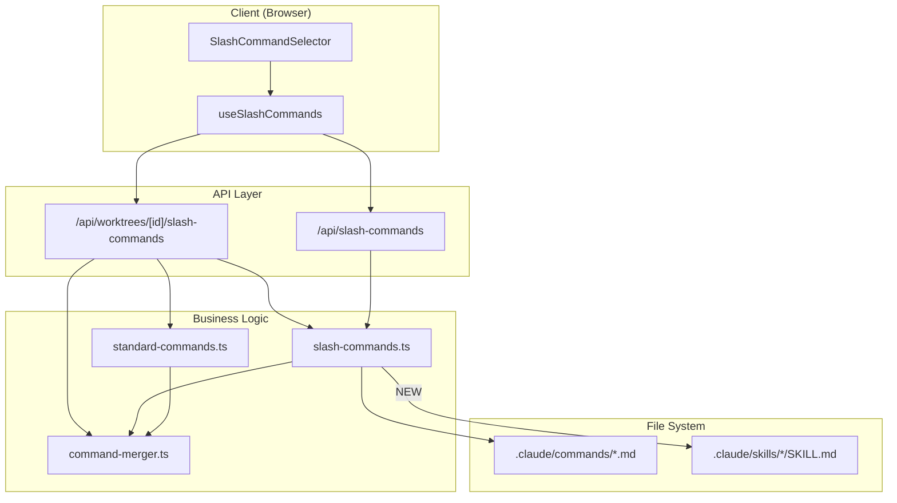

# 設計方針書: Issue #343 - スラッシュコマンドセレクターで .claude/skills も表示する

## 1. 概要

### 目的
スラッシュコマンドセレクター（「/」入力時のドロップダウン）で、既存の `.claude/commands/*.md` に加え `.claude/skills/*/SKILL.md` も読み込み、「Skills」カテゴリとして統合表示する。

### スコープ
- skills の読み込み・パース機能の追加
- 既存の型定義・カテゴリ・マージロジックの拡張
- API レスポンスへの skills カウント追加
- 既存テストの更新

### スコープ外
- skills 固有の UI 表示（アイコン・バッジ等）
- argument-hint の高度な表示
- Codex/Gemini CLI ツール向けの skills 対応

## 2. アーキテクチャ設計

### システム構成図



### データフロー

```
1. Client: useSlashCommands() -> fetch("/api/worktrees/[id]/slash-commands")
2. API: getStandardCommandGroups() -> standardGroups
3. API: getSlashCommandGroups(worktree.path) -> worktreeGroups
   +-- 内部:
      a. loadSlashCommands(basePath) -> commands
      b. loadSkills(basePath) -> skills     <-- NEW
      c. 名前ベース重複排除 (Map<string, SlashCommand>) -> deduplicated
      d. groupByCategory(deduplicated)
4. API: mergeCommandGroups(standardGroups, worktreeGroups) -> mergedGroups
5. API: filterCommandsByCliTool(mergedGroups, cliTool) -> filteredGroups
6. Client: groups を受け取り表示
```

## 3. 変更対象ファイル

### 3-1. `src/types/slash-commands.ts` - 型定義拡張

#### 変更内容

**SlashCommandCategory に 'skill' 追加**:
```typescript
export type SlashCommandCategory =
  | 'planning'
  | 'development'
  | 'review'
  | 'documentation'
  | 'workflow'
  | 'skill'                     // <-- NEW: Issue #343
  | 'standard-session'
  | 'standard-config'
  | 'standard-monitor'
  | 'standard-git'
  | 'standard-util';
```

**SlashCommandSource に 'skill' 追加**:
```typescript
export type SlashCommandSource = 'standard' | 'mcbd' | 'worktree' | 'skill';  // <-- 'skill' 追加
```

**CATEGORY_LABELS に 'skill' 追加**:
```typescript
export const CATEGORY_LABELS: Record<SlashCommandCategory, string> = {
  planning: 'Planning',
  development: 'Development',
  review: 'Review',
  documentation: 'Documentation',
  workflow: 'Workflow',
  skill: 'Skills',              // <-- NEW: Issue #343
  'standard-session': 'Standard (Session)',
  // ... 省略
};
```

#### 設計根拠
- `Record<SlashCommandCategory, string>` 型のため、`SlashCommandCategory` に `'skill'` を追加した場合、`CATEGORY_LABELS` への追加は **コンパイル時に強制** される（追加しないとコンパイルエラー）
- `SlashCommandSource` への追加は API レスポンスの `sources` カウント（`cmd.source === 'skill'`）で必要

---

### 3-2. `src/lib/slash-commands.ts` - skills 読み込みロジック追加

#### 変更内容

**新規関数: `loadSkills(basePath?: string)`**

```typescript
/**
 * Skills directory path
 */
function getSkillsDir(basePath?: string): string {
  const root = basePath || process.cwd();
  return path.join(root, '.claude', 'skills');
}

/**
 * Parse a SKILL.md file
 *
 * [D005] 引数名 skillDirPath は個別スキルのサブディレクトリパス
 * (.claude/skills/{skillName}) であり、skills ルートディレクトリではない。
 *
 * [S001] frontmatter パースには safeParseFrontmatter() を使用し、
 * gray-matter の JavaScript エンジンを無効化する。
 *
 * [S002] ファイルサイズを MAX_SKILL_FILE_SIZE_BYTES で事前チェックし、
 * 上限超過時は警告ログを出力してスキップする。
 *
 * [S007] name/description フィールドに長さ制限を適用する。
 */
function parseSkillFile(skillDirPath: string, skillName: string): SlashCommand | null {
  const skillPath = path.join(skillDirPath, 'SKILL.md');
  try {
    // [S002] ファイルサイズの事前チェック
    const stat = fs.statSync(skillPath);
    if (stat.size > MAX_SKILL_FILE_SIZE_BYTES) {
      console.warn(`Skipping oversized skill file (${stat.size} bytes): ${skillPath}`);
      return null;
    }

    const content = fs.readFileSync(skillPath, 'utf-8');
    // [S001] safeParseFrontmatter() で JS エンジンを無効化
    const { data: frontmatter } = safeParseFrontmatter(content);
    return {
      // [S007] フィールド長制限を適用
      name: truncateString(frontmatter.name || skillName, MAX_SKILL_NAME_LENGTH),
      description: truncateString(frontmatter.description || '', MAX_SKILL_DESCRIPTION_LENGTH),
      category: 'skill',
      source: 'skill',
      // cliTools: undefined (Claude-only, see [D009])
      filePath: path.relative(process.cwd(), skillPath),
    };
  } catch (error) {
    // [D003] parseCommandFile() と同様にエラーログを出力する。
    // サイレントに null を返すだけでは、SKILL.md のフォーマット不正や
    // 設定ミスを開発者が気づけない。
    console.error(`Error parsing skill file ${skillPath}:`, error);
    return null;
  }
}

/**
 * Load all skills from .claude/skills/*/SKILL.md
 *
 * [D004] 既存の loadSlashCommands() のシグネチャと統一するため async を付与している。
 * 内部では同期 API（fs.existsSync, fs.readdirSync, fs.readFileSync）のみを使用するが、
 * 将来的にファイル I/O の非同期化を行う場合にシグネチャ変更が不要となる。
 */
export async function loadSkills(basePath?: string): Promise<SlashCommand[]> {
  const skillsDir = getSkillsDir(basePath);
  if (!fs.existsSync(skillsDir)) {
    return [];
  }
  const entries = fs.readdirSync(skillsDir, { withFileTypes: true });
  const skills: SlashCommand[] = [];
  for (const entry of entries) {
    // [S002] 走査上限チェック
    if (skills.length >= MAX_SKILLS_COUNT) {
      console.warn(`Skills count limit reached (${MAX_SKILLS_COUNT}). Remaining entries skipped.`);
      break;
    }
    // セキュリティ: シンボリックリンク不追跡
    if (!entry.isDirectory()) continue;
    // セキュリティ: .. を含むエントリを拒否
    if (entry.name.includes('..')) continue;
    // セキュリティ: パス検証
    const resolvedPath = path.resolve(skillsDir, entry.name);
    if (!resolvedPath.startsWith(path.resolve(skillsDir))) continue;

    const skill = parseSkillFile(resolvedPath, entry.name);
    if (skill) {
      skills.push(skill);
    }
  }
  skills.sort((a, b) => a.name.localeCompare(b.name));
  return skills;
}
```

**skillsCache の追加とキャッシュ戦略**:

```typescript
let commandsCache: SlashCommand[] | null = null;
let skillsCache: SlashCommand[] | null = null;  // <-- NEW

export function clearCache(): void {
  commandsCache = null;
  skillsCache = null;          // <-- 両方クリア
}
```

**getSlashCommandGroups の拡張（名前ベース重複排除付き）**:

```typescript
/**
 * [D001] 名前ベースの重複排除を行うヘルパー関数。
 * skills を先に登録し commands で上書きすることで、
 * 同名の command が skill を上書きする（command 優先）。
 *
 * groupByCategory() は category をキーとした Map であり、
 * name ベースの重複排除は行わない。そのため、getSlashCommandGroups() 内で
 * 明示的に重複排除を行う必要がある。
 */
function deduplicateByName(skills: SlashCommand[], commands: SlashCommand[]): SlashCommand[] {
  const map = new Map<string, SlashCommand>();
  // skills を先に登録
  for (const skill of skills) {
    map.set(skill.name, skill);
  }
  // commands で上書き（command 優先）
  for (const cmd of commands) {
    map.set(cmd.name, cmd);
  }
  return Array.from(map.values());
}

export async function getSlashCommandGroups(basePath?: string): Promise<SlashCommandGroup[]> {
  if (basePath) {
    // worktree 用: 常に再ロード
    const commands = await loadSlashCommands(basePath);
    const skills = await loadSkills(basePath);
    // [D001] 明示的に名前ベースの重複排除を行う
    const deduplicated = deduplicateByName(skills, commands);
    return groupByCategory(deduplicated);
  }

  // MCBD 用: キャッシュ使用（両方 null でない場合のみ）
  if (commandsCache === null || skillsCache === null) {
    // [D011] 片方だけ失敗するケースを考慮し、個別にキャッシュを管理する。
    // loadSkills() が失敗した場合でも skillsCache = [] を設定して
    // 「ロード試行済み」を表現する。これにより、loadSkills() が毎回失敗する場合でも
    // loadSlashCommands() の不必要な再実行を防ぐ。
    if (commandsCache === null) {
      commandsCache = await loadSlashCommands();
    }
    if (skillsCache === null) {
      skillsCache = await loadSkills().catch(() => []);
    }
  }
  // [D001] 明示的に名前ベースの重複排除を行う
  const deduplicated = deduplicateByName(skillsCache, commandsCache);
  return groupByCategory(deduplicated);
}
```

#### 設計根拠

1. **[D001] 名前ベースの明示的重複排除**: `groupByCategory()` は category をキーとした Map でグルーピングするのみであり、同名コマンドの name ベースの重複排除は行わない。`[...skills, ...commands]` の単純結合では同名の skill と command が両方とも表示される。そのため、`deduplicateByName()` ヘルパー関数で `Map<string, SlashCommand>` を使い、skills を先に登録してから commands で上書きする明示的な重複排除ロジックを実装する。

2. **キャッシュ分離**: `commandsCache` と `skillsCache` を別変数にすることで、commands のみのロード済み状態（過去の呼び出しによる）で skills が欠落するバグを防止

3. **[D011] キャッシュ片方失敗時の耐障害性**: `commandsCache` と `skillsCache` を個別にロードし、`loadSkills()` が失敗した場合は `.catch(() => [])` で空配列を設定する。これにより「ロード試行済み」を表現し、毎回の再ロードを防ぐ。`loadSlashCommands()` も同様に、既にキャッシュ済みの場合は再ロードしない。

   **[C004] commandsCache の二重代入に関する注意**: 既存の `loadSlashCommands()` は内部（L91）で `commandsCache = commands` と直接代入しており、`getSlashCommandGroups()` 側の `commandsCache = await loadSlashCommands()` は二重代入となる。動作上は同等だが、キャッシュ管理の責務が `loadSlashCommands()` 内部と呼び出し側の2箇所に分散する。本設計では `getSlashCommandGroups()` 側での代入を維持する（`loadSlashCommands()` の戻り値を明示的に受け取ることでコードの意図が明確になるため）。ただし、`loadSlashCommands()` 内部のキャッシュ代入との関係を実装時のコードコメントで明記すること。

4. **セキュリティ多層防御**:
   - `entry.isDirectory()` でシンボリックリンクを除外（`readdirSync({ withFileTypes: true })` の `Dirent.isDirectory()` はシンボリックリンクに対して `false` を返す）
   - `entry.name.includes('..')` で相対パストラバーサルを拒否
   - `path.resolve()` + `startsWith()` で最終パスが skills ディレクトリ配下であることを検証
   - [S001] `safeParseFrontmatter()` で gray-matter の JavaScript エンジンを無効化し RCE を防止
   - [S002] `MAX_SKILLS_COUNT` (100) と `MAX_SKILL_FILE_SIZE_BYTES` (64KB) で DoS を防止
   - [S007] `MAX_SKILL_NAME_LENGTH` (100) と `MAX_SKILL_DESCRIPTION_LENGTH` (500) でフィールド長を制限

5. **[D003] エラーログ出力**: `parseSkillFile()` の catch ブロックで `console.error()` によるエラーログ出力を行う。既存の `parseCommandFile()` と同様のアプローチにより、SKILL.md のフォーマット不正や設定ミスを開発者が検出できるようにする。

6. **[D004] async 宣言の理由**: 既存の `loadSlashCommands()` のシグネチャとの一貫性を優先し async を付与。将来の非同期 I/O 移行を見据えた設計判断でもある。JSDoc コメントにその意図を明記する。

7. **[D005] 引数名の明確化**: `parseSkillFile()` の第1引数を `skillDirPath` に変更し、skills ルートディレクトリとの混同を防ぐ。

8. **[C008] loadSkills() ディレクトリ不在時のサイレント動作**: `loadSlashCommands()` はディレクトリ不在時に `console.warn()` でログ出力するが、`loadSkills()` はサイレントに空配列を返す。この差異は意図的である。`.claude/commands/` ディレクトリはプロジェクトで一般的に存在することが期待されるが、`.claude/skills/` ディレクトリは多くのリポジトリでオプショナルであり存在しないことが通常の状態である。skills ディレクトリ不在時に warn ログを出力すると、skills を使用しないプロジェクトで大量のログノイズが発生するため、サイレントに空配列を返す設計とする。

---

### 3-3. `src/lib/command-merger.ts` - CATEGORY_ORDER 更新

#### 変更内容

```typescript
export const CATEGORY_ORDER: SlashCommandCategory[] = [
  'planning',
  'development',
  'review',
  'documentation',
  'workflow',
  'skill',              // <-- NEW: workflow と standard-session の間（6番目）
  'standard-session',
  'standard-config',
  'standard-monitor',
  'standard-git',
  'standard-util',
];
```

#### 設計根拠
- `CATEGORY_ORDER` はカテゴリ表示順序の single source of truth
- `'skill'` を `'workflow'` と `'standard-session'` の間に配置することで、カスタムコマンドの下、標準コマンドの上に表示
- `mergeCommandGroups()` 自体は変更不要（skills のマージは `getSlashCommandGroups()` 内で完結するため）

---

### 3-4. `src/app/api/worktrees/[id]/slash-commands/route.ts` - API レスポンス拡張

#### 変更内容

**SlashCommandsResponse 型の更新**:
```typescript
interface SlashCommandsResponse {
  groups: ReturnType<typeof getStandardCommandGroups>;
  sources: {
    standard: number;
    worktree: number;
    mcbd: number;
    skill: number;          // <-- NEW
  };
  cliTool: CLIToolType;
}
```

**カウント計算の追加**:

```typescript
// [D012] flatMap を1回だけ実行してカウントを集計する（DRY 原則）
const allFilteredCommands = filteredGroups.flatMap(g => g.commands);
const filteredStandardCount = allFilteredCommands.filter(cmd => cmd.source === 'standard').length;
const filteredWorktreeCount = allFilteredCommands.filter(cmd => cmd.source === 'worktree').length;
const filteredSkillCount = allFilteredCommands.filter(cmd => cmd.source === 'skill').length;

return NextResponse.json({
  groups: filteredGroups,
  sources: {
    standard: filteredStandardCount,
    worktree: filteredWorktreeCount,
    mcbd: 0,
    skill: filteredSkillCount,        // <-- NEW
  },
  cliTool,
});
```

#### 設計根拠
- `getSlashCommandGroups(worktree.path)` の戻り値に skills が含まれるため、`mergeCommandGroups()` 呼び出し後の `filteredGroups` にも skills が反映される
- route.ts 側では `source === 'skill'` でカウントするだけで済む
- [D012] `flatMap()` を1回に統合し、そこから各 source のカウントを取得する
- [C010] route.ts のデータフローでは `mergeCommandGroups()` が `cmd.source || 'worktree'` のフォールバックを提供するため、`parseCommandFile()` が source を設定しなくても worktreeCount は正確にカウントされる。ただし [D008]/[C002] の対応として `loadSlashCommands()` で source を明示的に設定する場合は、このフォールバックへの暗黙的な依存が解消される

---

## 4. 変更不要ファイル

| ファイル | 理由 |
|---------|------|
| `src/app/api/slash-commands/route.ts` | `getSlashCommandGroups()` を呼ぶだけ。内部で skills 統合済み。[D010] MCBD API は groups のみを返し sources フィールドは対象外のため、skill カウントの追加は不要。[I009] MCBD API のレスポンスには `process.cwd()` の `.claude/skills/` から読み込まれた skills が groups に含まれる。クライアント側（`useSlashCommands` フック）は groups をそのまま表示するため追加対応は不要 |
| `src/hooks/useSlashCommands.ts` | `groups` フィールドのみ使用。`sources` は未参照 |
| `src/components/worktree/SlashCommandSelector.tsx` | `groups` を受け取り表示するだけ。skills 固有ロジックなし |
| `src/components/worktree/SlashCommandList.tsx` | `CATEGORY_LABELS` から自動取得のため変更不要 |
| `src/lib/api-client.ts` | `SlashCommandsResponse` は `groups` のみで `sources` 非参照。[C003] 注意: api-client.ts の `SlashCommandsResponse` は `/api/slash-commands`（MCBD）用であり、route.ts の `SlashCommandsResponse` は `/api/worktrees/[id]/slash-commands` 用。同名だが異なるスコープの型であり、本 Issue では route.ts 側のみ変更する。将来的な型の統合・共通化は別途検討する |

## 5. 設計パターン

### 5-1. 既存パターンの踏襲

| パターン | 適用箇所 | 説明 |
|---------|---------|------|
| **Strategy** | `parseCommandFile` / `parseSkillFile` | ファイル種別に応じたパース戦略。同じ `SlashCommand` 型を返す |
| **Cache-aside** | `commandsCache` / `skillsCache` | 初回アクセス時にロードし、以降はキャッシュから返す。[D011] 個別キャッシュ管理で片方失敗に対応 |
| **Facade** | `getSlashCommandGroups()` | commands + skills のロード・重複排除・グルーピングを一つの関数で提供 |

### 5-2. 新規パターンの適用なし

既存のアーキテクチャに自然に収まるため、新しい設計パターンの導入は不要。KISS 原則に従い、既存の関数ベースのアプローチを維持する。

### 5-3. 将来の拡張に関する設計ノート

- **[D002] パースロジック共通化**: `parseCommandFile()` と `parseSkillFile()` は frontmatter パースという同じパターンを踏襲している。差異は (1) name 取得方法、(2) category 決定方法、(3) source フィールド、(4) 取得する frontmatter フィールド（parseCommandFile: name/description/model、parseSkillFile: name/description のみ）の4点。[C009] 現時点では KISS 原則を優先し分離を維持するが、将来的にパース対象が増える場合は共通の `parseFrontmatterFile(filePath, defaults)` ヘルパーの抽出を検討する。
- **[D006] Facade 責務の上限**: `getSlashCommandGroups()` は現在 (1) commands ロード、(2) skills ロード、(3) 重複排除、(4) グルーピング、(5) キャッシュ管理の5つの責務を持つ。3つ以上の新しいソース種別が追加される場合は `loadAllSources()` のような統合関数の抽出を検討する。
- **[I003] api-client.ts の SlashCommandsResponse 型の将来的な sources フィールド対応**: route.ts の `SlashCommandsResponse` に `sources.skill` が追加されるが、api-client.ts の同名型は `groups` のみを定義している。将来 api-client.ts 側で `sources` フィールドを参照するケースに備え、route.ts に `// TODO: api-client.ts の SlashCommandsResponse との型統合を検討する（sources フィールドの共有）` という TODO コメントを記載する。
- **[I004] worktree パスの skills 走査パフォーマンス**: basePath 指定時は `loadSlashCommands()` と `loadSkills()` を毎回再ロードする（キャッシュ不使用）。既存の `loadSlashCommands()` と同じ方針であり一貫性はあるが、skills の追加により API リクエスト毎の同期ファイルシステム走査が増加する。パフォーマンス問題が顕在化した場合に備え、将来的な worktree パスのキャッシュ（TTL 付き）導入を検討事項として記録する。
- **[I008] skills の cliTools 拡張パス**: 現時点では skills の `cliTools` を `undefined`（Claude-only）としているが、将来的に SKILL.md の frontmatter に `cliTools` フィールドを追加してパースする拡張パスを検討する。`parseSkillFile()` の frontmatter パースに `cliTools` フィールドの読み取りを追加し、`filterCommandsByCliTool()` で Codex/Gemini ユーザーにも skills を表示可能にする。現時点では YAGNI に基づき未実装で問題ない。

## 6. セキュリティ設計

### skills ディレクトリ走査時のセキュリティ

| 対策 | 実装方法 | 防御対象 | OWASP |
|------|---------|---------|-------|
| シンボリックリンク不追跡 | `Dirent.isDirectory()` | ディレクトリ外への脱出 | A01 |
| `..` エントリ拒否 | `entry.name.includes('..')` | パストラバーサル | A01 |
| パス検証 | `path.resolve()` + `startsWith()` | 正規化後のパス脱出 | A01 |
| 既存パス検証 | `isValidWorktreePath()` (route.ts) | worktree パスの妥当性 | A01 |
| gray-matter JS エンジン無効化 | `safeParseFrontmatter()` | RCE (任意コード実行) | A03 |
| skills 走査上限 | `MAX_SKILLS_COUNT` / `MAX_SKILL_FILE_SIZE_BYTES` | DoS (リソース枯渇) | A05 |
| フィールド長制限 | `MAX_SKILL_NAME_LENGTH` / `MAX_SKILL_DESCRIPTION_LENGTH` | UI 破壊・レスポンス肥大化 | A06 |

### [S001] gray-matter JavaScript エンジン RCE 対策（CRITICAL）

gray-matter@4.0.3 は frontmatter 区切り文字として `---js` および `---javascript` をサポートしており、内部で `eval()` を使用して JavaScript コードを実行する。悪意ある SKILL.md ファイルが `---js` 区切り文字を使用した場合、`parseSkillFile()` の `matter(content)` 呼び出し時にサーバー上で任意の JavaScript コードが実行される（`require('child_process').execSync('whoami')` 等のコマンド実行が可能）。

**対策**: `safeParseFrontmatter()` ラッパー関数を導入し、gray-matter の JavaScript エンジンを無効化する。

```typescript
/**
 * gray-matter の安全なラッパー関数。
 * JavaScript エンジン（---js, ---javascript 形式）を無効化し、
 * YAML frontmatter のみをパースする。
 *
 * [S001] gray-matter はデフォルトで JavaScript エンジンを有効にしており、
 * eval() による任意コード実行が可能な CRITICAL 脆弱性が存在する。
 * このラッパー関数で engines オプションを指定し、JS エンジンを明示的に無効化する。
 */
function safeParseFrontmatter(content: string): matter.GrayMatterFile<string> {
  return matter(content, {
    engines: {
      js: {
        parse: () => { throw new Error('JavaScript engine is disabled for security'); },
        stringify: () => { throw new Error('JavaScript engine is disabled for security'); },
      },
      javascript: {
        parse: () => { throw new Error('JavaScript engine is disabled for security'); },
        stringify: () => { throw new Error('JavaScript engine is disabled for security'); },
      },
    },
  });
}
```

**適用範囲**:
- `parseSkillFile()` -- 本 Issue で新規追加する関数。`safeParseFrontmatter()` を使用する
- `parseCommandFile()` -- 既存関数にも同一の脆弱性が存在する。本 Issue のスコープとして `safeParseFrontmatter()` への置き換えを実施する（既存コードの脆弱性修正）

### [S002] skills 走査上限（DoS 防御）

攻撃者が worktree リポジトリの `.claude/skills/` 配下に数千のサブディレクトリや巨大な SKILL.md ファイルを配置した場合、同期的なファイルシステム走査（`readdirSync` + `readFileSync`）によりメモリ枯渇やレスポンスタイム悪化を引き起こす可能性がある。

**対策**: 以下の上限定数を定義し、`loadSkills()` および `parseSkillFile()` で適用する。

```typescript
/** skills サブディレクトリ走査の上限数 */
const MAX_SKILLS_COUNT = 100;

/** SKILL.md の最大ファイルサイズ (64KB) */
const MAX_SKILL_FILE_SIZE_BYTES = 65536;
```

**動作仕様**:
- `loadSkills()`: `MAX_SKILLS_COUNT` を超えた場合、`console.warn()` で警告ログを出力し、残りのサブディレクトリをスキップする
- `parseSkillFile()`: `fs.statSync(skillPath).size` で事前チェックし、`MAX_SKILL_FILE_SIZE_BYTES` を超過した場合は `console.warn()` で警告ログを出力して `null` を返す
- ファイルサイズ上限は YAML ボム（Billion Laughs）攻撃に対する実質的な緩和策としても機能する（S005 参照）

### [S007] frontmatter フィールド長制限

frontmatter から取得した `name` と `description` が極端に長い文字列や制御文字を含む場合、UI レイアウトの破壊や API レスポンスサイズの肥大化につながる可能性がある。React の JSX テキストノード描画による XSS 防御は維持されるが、入力段階での長さ制限が必要である。

**対策**: 以下の上限定数を定義し、`parseSkillFile()` で適用する。

```typescript
/** skill name の最大長 */
const MAX_SKILL_NAME_LENGTH = 100;

/** skill description の最大長 */
const MAX_SKILL_DESCRIPTION_LENGTH = 500;
```

**実装方法**: `src/lib/utils.ts` の既存の `truncateString()` を使用して切り詰める。

```typescript
return {
  name: truncateString(frontmatter.name || skillName, MAX_SKILL_NAME_LENGTH),
  description: truncateString(frontmatter.description || '', MAX_SKILL_DESCRIPTION_LENGTH),
  // ...
};
```

### [S003] 既存 loadSlashCommands() のパストラバーサル保護に関する注意事項

設計方針書では `loadSkills()` に 3 層防御（`isDirectory()`、`..` 拒否、`startsWith()` 検証）を適用しているが、既存の `loadSlashCommands()` には同等の防御が存在しない。`loadSlashCommands()` は `readdirSync` で取得したファイル名に対して `path.join(commandsDir, file)` で結合しているだけで、`..` チェックや `startsWith()` 検証を行っていない。

**本 Issue のスコープでの対応**: 既存の `parseCommandFile()` への `safeParseFrontmatter()` 適用（S001）は本 Issue で実施するが、`loadSlashCommands()` へのパストラバーサル保護の追加は本 Issue のスコープ外として記録する。将来的に共通のパス検証ヘルパー関数を抽出し、`loadSkills()` と `loadSlashCommands()` の両方で使用することを推奨する。

### 入力バリデーション
- SKILL.md の frontmatter パースは `safeParseFrontmatter()` ラッパー経由で `gray-matter` ライブラリに委譲（JavaScript エンジン無効化済み）
- 既存の `parseCommandFile()` も `safeParseFrontmatter()` に置き換え（S001 対策の一環）
- `name` フィールドがない場合はディレクトリ名をフォールバック（最大 100 文字に切り詰め）
- `description` フィールドがない場合は空文字列（最大 500 文字に切り詰め）
- SKILL.md のファイルサイズは最大 64KB に制限（S002）
- skills サブディレクトリの走査は最大 100 件に制限（S002）

## 7. テスト影響と戦略

### 既存テスト修正が必要な箇所

| テストファイル | 修正箇所 | 内容 |
|-------------|---------|------|
| `tests/unit/slash-commands.test.ts` | `validCategories` (L126) | [C005] 変更不要。このテストは `loadSlashCommands()` の結果のみを検証しており、`loadSkills()` で読み込まれる skill カテゴリは対象外。`'skill'` カテゴリの検証は `getSlashCommandGroups()` の新規テストで行う |
| `tests/unit/slash-commands.test.ts` | `labelMap` (L154-160) | `skill: 'Skills'` を追加 |
| `tests/unit/slash-commands.test.ts` | `SlashCommandCategory` テスト (L48-57) | [C006] categories 配列に `'skill'` リテラルを追加し、`toHaveLength(6)` に変更。具体的には: `const categories = ['planning', 'development', 'review', 'documentation', 'workflow', 'skill'];` とし `expect(categories).toHaveLength(6)` に更新する |
| `tests/integration/api-worktree-slash-commands.test.ts` | `sources` プロパティ (L87-91) | [I007] `sources.skill: number` の追加を検証するアサーション追加。具体的には: `expect(data.sources).toHaveProperty('skill')` および `expect(typeof data.sources.skill).toBe('number')` で `sources.skill` プロパティの存在と型を検証する。モック環境では `.claude/skills/` が存在しないため `sources.skill` は 0 となるが、プロパティ自体がレスポンスに含まれることを保証する |

### 新規テストケース

| テストケース | カテゴリ | 説明 |
|-------------|--------|------|
| `loadSkills` - skills ディレクトリが存在する場合 | unit | SKILL.md の frontmatter パースを検証 |
| `loadSkills` - skills ディレクトリが存在しない場合 | unit | 空配列を返すことを検証 |
| `loadSkills` - 不正な SKILL.md | unit | エラーログ出力後 null を返しスキップすることを検証 [D003] |
| `loadSkills` - セキュリティ（シンボリックリンク） | unit | スキップされることを検証 |
| `loadSkills` - セキュリティ（.. パス） | unit | 拒否されることを検証 |
| `getSlashCommandGroups` - skills 統合 | unit | commands + skills がグルーピングされることを検証 |
| `getSlashCommandGroups` - 名前衝突時の command 優先 | unit | 同名の場合 command が返ることを検証 [D001] |
| `deduplicateByName` - 重複排除 | unit | skills 先登録・commands 上書きを検証 [D001] |
| `skillsCache` - 独立管理 | unit | clearCache() で両方クリアされることを検証 |
| `skillsCache` - loadSkills 失敗時 | unit | skillsCache = [] となり再ロードされないことを検証 [D011] |
| `CATEGORY_ORDER` - skill 配置 | unit | [I010] `command-merger.test.ts` に追加。`CATEGORY_ORDER.indexOf('skill')` が `CATEGORY_ORDER.indexOf('workflow') + 1` であることを検証 |
| API - sources.skill カウント | integration | レスポンスに skill カウントが含まれることを検証 |
| `getSlashCommandGroups` - skills のみリポジトリ | unit | [I006] commands ディレクトリ不在・skills ディレクトリのみ存在する場合に `getSlashCommandGroups()` が skill カテゴリのグループを正しく返すことを検証 |
| `safeParseFrontmatter` - JS エンジン無効化 | unit | [S001] `---js` / `---javascript` 区切り文字を含む入力でエラーがスローされることを検証 |
| `safeParseFrontmatter` - 通常 YAML パース | unit | [S001] 通常の YAML frontmatter が正しくパースされることを検証 |
| `parseCommandFile` - safeParseFrontmatter 使用 | unit | [S001] 既存の `parseCommandFile()` が `safeParseFrontmatter()` を使用していることを検証 |
| `loadSkills` - MAX_SKILLS_COUNT 上限 | unit | [S002] 101 件以上のサブディレクトリが存在する場合、100 件で走査が停止し警告ログが出力されることを検証 |
| `parseSkillFile` - MAX_SKILL_FILE_SIZE_BYTES 上限 | unit | [S002] 64KB を超えるファイルがスキップされ警告ログが出力されることを検証 |
| `parseSkillFile` - name/description 長さ制限 | unit | [S007] 100 文字超の name と 500 文字超の description が切り詰められることを検証 |

### テスト戦略の補足 [D007]

**[I012] getCachedCommands テスト (L169-193) への影響分析**: [C002] で `loadSlashCommands()` が source フィールドを追加するため、`commandsCache` に source が付与された `SlashCommand` が格納される。`toEqual` 比較はオブジェクト参照ではなく構造比較のため source フィールドの存在がテストを変更する可能性がある。具体的には、`loadSlashCommands()` を basePath なしで呼んだ場合に `source = 'mcbd'` が設定され、`getCachedCommands()` の結果にも `source: 'mcbd'` が含まれる。`toEqual` の期待値に `source` フィールドを追加するか、`toMatchObject` を使用することを検討する。なお、`loadSlashCommands()` の結果と `getCachedCommands()` の結果は同一のキャッシュを参照するため、両方に同じ `source` 値が付与される。そのため `toEqual` 比較自体は成功するが、テストの期待値にも `source` フィールドを明示することで意図を明確にすべきである。

**[I001] labelMap テストの非決定的動作リスク**: `tests/unit/slash-commands.test.ts` L150-165 の `'should have localized labels for categories'` テストは `getSlashCommandGroups()` を basePath なしで呼び出しており、テスト環境の `.claude/skills/` ディレクトリ有無に依存して `category='skill'` のグループが返されるかが変わる非決定的テストとなるリスクがある。テスト環境の `.claude/skills/` ディレクトリ有無に依存しないよう `vi.mock` を使用してファイルシステムをモックするか、basePath を指定してテストフィクスチャを使う方式への変更を検討する。

テストでは以下の2つのアプローチを状況に応じて使い分ける:

1. **実ファイルシステムベース**: 現在の `slash-commands.test.ts` のアプローチを踏襲。テスト用 skills ディレクトリ（テストフィクスチャ）を `tests/fixtures/skills/` に配置し、実際の SKILL.md ファイルを使ってパース結果を検証する。
2. **vi.mock('fs') ベース**: ファイルシステム異常系（パーミッションエラー、シンボリックリンク）のテストでは `vi.mock('fs')` を使用してモックする。

テストフィクスチャの配置方針:
- `tests/fixtures/skills/valid-skill/SKILL.md` - 正常な SKILL.md
- `tests/fixtures/skills/no-frontmatter/SKILL.md` - frontmatter なしのケース
- `tests/fixtures/skills/invalid/SKILL.md` - 不正フォーマットのケース

[C011] テストフィクスチャの具体的な frontmatter サンプル:

```markdown
<!-- tests/fixtures/skills/valid-skill/SKILL.md -->
---
name: test-skill
description: A test skill for unit testing
---
This is the skill content body.
```

```markdown
<!-- tests/fixtures/skills/no-frontmatter/SKILL.md -->
This file has no frontmatter.
The name should fallback to the directory name "no-frontmatter".
```

## 8. 設計上の決定事項とトレードオフ

### 採用した設計

| 決定事項 | 選択 | 理由 | トレードオフ |
|---------|------|------|------------|
| skills のマージ場所 | `getSlashCommandGroups()` 内部 | route.ts や command-merger.ts の変更を最小化 | `getSlashCommandGroups()` の責務がやや増大 [D006] |
| キャッシュ戦略 | 分離キャッシュ（`commandsCache` + `skillsCache`）、個別ロード | 部分キャッシュによる skills 欠落を防止。片方失敗時の非効率な再ロードを回避 [D011] | メモリ使用量がわずかに増加 |
| cliTools の初期方針 | `undefined`（Claude-only） | 既存の `filterCommandsByCliTool()` の `undefined` = Claude-only 動作に従う。SKILL.md の `allowed-tools` は Claude CLI のツール許可設定であり、CommandMate の `cliTools`（対応 CLI ツール種別）とは意味が異なるためマッピングは行わない [D009] | Codex/Gemini ユーザーには skills が表示されない |
| 名前衝突の解決 | `deduplicateByName()` による明示的な `Map<string, SlashCommand>` 重複排除 [D001] | `groupByCategory()` は category ベースのグルーピングのみで name 重複排除は行わない。暗黙的な動作に依存せず、明示的なロジックで command 優先を保証 | ヘルパー関数の追加 |
| エラーハンドリング | `parseSkillFile()` で `console.error()` 出力 [D003] | `parseCommandFile()` と同様のアプローチ。設定ミスの検出可能性を確保 | ログノイズの可能性（SKILL.md が意図的に不正な場合） |
| セキュリティ | 多層防御 | `Dirent.isDirectory()` + `..` 拒否 + `startsWith()` + `safeParseFrontmatter()` [S001] + 走査/サイズ上限 [S002] + フィールド長制限 [S007] | パース処理がわずかに遅延 |
| source フィールドの対称性 | `parseSkillFile()` で明示的に `source: 'skill'` を設定。`loadSlashCommands()` で basePath に応じた source を設定 [D008][C002] | `parseCommandFile()` では source 未設定だったが、[C002] 対応として `loadSlashCommands()` 内で basePath ありなら `'worktree'`、なしなら `'mcbd'` を明示設定する。`mergeCommandGroups()` のフォールバックへの暗黙依存を排除 | `parseCommandFile()` 自体は source を返さない（`loadSlashCommands()` で付与する形式） |
| async 宣言 | `loadSlashCommands()` と統一して async 付与 [D004] | 一貫性の維持と将来の非同期 I/O 移行への備え | 内部は同期処理のみ |

### 代替案と却下理由

| 代替案 | 却下理由 |
|-------|---------|
| `command-merger.ts` に `mergeWithSkills()` 関数を追加 | 責務分散が過度になり、`getSlashCommandGroups()` からの呼び出し元が複雑化する |
| skills を `SlashCommand` とは別の型で管理 | UI 表示では commands と同じ構造が必要。型統一の方がシンプル |
| `filterCommands()` を skills 対応にする | 初期実装では commands のみの検索で十分。YAGNI 原則に従いスキップ |
| キャッシュ統合（1つの配列で管理） | commands のみの既存呼び出し元との後方互換性が損なわれる |
| `[...skills, ...commands]` の単純結合 | [D001] `groupByCategory()` は name 重複排除を行わないため、同名 skill と command が両方表示される。明示的な `deduplicateByName()` が必要 |
| キャッシュ一括ロード（commandsCache === null || skillsCache === null で両方再ロード） | [D011] 片方だけ失敗するケースで不必要な再ロードが発生する。個別キャッシュ管理で回避 |

### [D008] source フィールドに関する実装上の注意事項

`parseCommandFile()` は既存コードで `source` フィールドを設定していない。`mergeCommandGroups()` 内で `cmd.source || 'worktree'` のフォールバックにより worktree として扱われるが、`getSlashCommandGroups()` 内で `deduplicateByName()` を経由して直接結合する場合は `mergeCommandGroups()` を経由しないため source が undefined のままとなる。

**[C002] 対応方針（本 Issue のスコープに含める）**: `getSlashCommandGroups()` の worktree パス（basePath あり）において、`deduplicateByName()` で直接結合された commands の source が undefined のまま `mergeCommandGroups()` に渡される。`mergeCommandGroups()` 内の `cmd.source || 'worktree'` フォールバックにより route.ts のカウントは正確に動作するが、データフローの明確性を確保するため、`loadSlashCommands()` に basePath パラメータに応じた source 設定を追加する:

```typescript
// loadSlashCommands() 内で source を明示的に設定する
// basePath あり: 'worktree'、basePath なし: 'mcbd'
export async function loadSlashCommands(basePath?: string): Promise<SlashCommand[]> {
  // ... 既存のロジック ...
  const command = parseCommandFile(filePath);
  if (command) {
    command.source = basePath ? 'worktree' : 'mcbd';
    commands.push(command);
  }
  // ...
}
```

これにより、`deduplicateByName()` で直接結合された場合でも commands の source が正しく設定され、route.ts の `cmd.source === 'worktree'` カウントが `mergeCommandGroups()` のフォールバックに暗黙的に依存しなくなる。

> **[C010] 補足**: route.ts のデータフローでは、`getSlashCommandGroups()` の結果が `mergeCommandGroups()` を経由して処理される。`mergeCommandGroups()` が `cmd.source || 'worktree'` のフォールバックを提供するため、上記の `loadSlashCommands()` 変更を行わなくても route.ts 側のカウントは正確に動作する。しかし、暗黙的なフォールバック依存を排除するため、明示的な source 設定を推奨する。

## 9. 制約条件

### CLAUDE.md 原則への準拠

| 原則 | 準拠状況 |
|------|---------|
| **SOLID - SRP** | `loadSkills()` は skills 読み込みのみに責務を限定。`deduplicateByName()` を独立ヘルパーとして抽出 [D001] |
| **SOLID - OCP** | 既存の `loadSlashCommands()` は変更せず、`loadSkills()` を追加して拡張 |
| **KISS** | 既存のアーキテクチャを踏襲し、新しいパターンを導入しない |
| **YAGNI** | 初期実装では必要最小限のフィールド（name, description）のみ取得 |
| **DRY** | `groupByCategory()` を共有し、`parseSkillFile()` は `parseCommandFile()` と同じ `gray-matter` を使用。[D012] カウント計算の flatMap 統合 |

### 後方互換性
- 既存の `loadSlashCommands()` は [C002] 対応として source フィールドの明示設定を追加するが、既存の動作に影響はない（`mergeCommandGroups()` のフォールバックと同じ値を設定するため）
- `filterCommands()` は `commandsCache` のみ参照（既存動作維持）。[I002] skills は `filterCommands()` の検索対象に含まれない。UI のフィルタリングには `filterCommandGroups()`（command-merger.ts）を使用しており、`filterCommands()` は直接使用されていないため実用上の問題はないが、`filterCommands()` の JSDoc に「この関数は commandsCache のみを対象とし skills は含まない。UI のフィルタリングには `filterCommandGroups()` を使用すること」という注意を追加する
- `getCachedCommands()` は `commandsCache` のみ返す（既存動作維持）
- skills ディレクトリが存在しないリポジトリでは空配列を返し、動作に影響なし

---

## 10. レビュー履歴

| 日付 | ステージ | レビュー種別 | 結果 |
|------|---------|------------|------|
| 2026-02-22 | Stage 1 | 設計原則レビュー（通常レビュー） | Must Fix: 2件、Should Fix: 4件、Nice to Have: 5件 |
| 2026-02-22 | Stage 2 | 整合性レビュー | Must Fix: 2件、Should Fix: 5件、Nice to Have: 5件 |
| 2026-02-22 | Stage 3 | 影響分析レビュー | Must Fix: 2件、Should Fix: 5件、Nice to Have: 5件 |
| 2026-02-22 | Stage 4 | セキュリティレビュー | Must Fix: 2件、Should Fix: 5件、Nice to Have: 3件 |

## 11. レビュー指摘事項サマリー

### Stage 1: 設計原則レビュー

#### Must Fix

| ID | タイトル | 対応状況 | 反映セクション |
|----|---------|---------|--------------|
| D003 | parseSkillFile のエラーハンドリングがサイレントすぎる | 反映済み | 3-2 parseSkillFile, 設計根拠 5 |
| D011 | キャッシュ片方失敗時の非効率な再ロード | 反映済み | 3-2 getSlashCommandGroups, 設計根拠 3 |

#### Should Fix

| ID | タイトル | 対応状況 | 反映セクション |
|----|---------|---------|--------------|
| D001 | 名前衝突解決が暗黙的な Map.set() 後勝ち特性に依存 | 反映済み | 2 データフロー, 3-2 deduplicateByName, 設計根拠 1, 8 設計決定 |
| D002 | parseCommandFile と parseSkillFile の責務重複 | 反映済み | 5-3 将来の拡張に関する設計ノート |
| D004 | loadSkills が async 宣言だが同期処理のみ | 反映済み | 3-2 loadSkills JSDoc, 8 設計決定 |
| D006 | getSlashCommandGroups() の責務増大 | 反映済み | 5-3 将来の拡張に関する設計ノート |
| D008 | source フィールドの非対称性 | 反映済み | 8 設計決定, 8 実装上の注意事項 |

#### Nice to Have

| ID | タイトル | 対応状況 | 反映セクション |
|----|---------|---------|--------------|
| D005 | 引数名 skillDir の明確化 | 反映済み | 3-2 parseSkillFile 引数名変更 |
| D007 | テスト戦略の明記 | 反映済み | 7 テスト戦略の補足 |
| D009 | cliTools フィールドの意図明記 | 反映済み | 8 設計決定（cliTools の初期方針） |
| D010 | MCBD API の skills カウント対応の明記 | 反映済み | 4 変更不要ファイル（注記追加） |
| D012 | route.ts の source カウント計算 DRY 改善 | 反映済み | 3-4 カウント計算 |

### Stage 2: 整合性レビュー

#### Must Fix

| ID | タイトル | 対応状況 | 反映セクション |
|----|---------|---------|--------------|
| C001 | SlashCommand.source フィールドの型が 'skill' 値を受け入れられない（型アサーション除去） | 反映済み | 3-2 parseSkillFile コードスニペット（as キャスト除去）、12 実装チェックリスト（実装順序明確化） |
| C002 | parseCommandFile() の source 未設定問題が getSlashCommandGroups() の新データフローで顕在化 | 反映済み | 8 [D008] 実装上の注意事項（対応方針を具体化、本 Issue スコープに含める）、12 実装チェックリスト |

#### Should Fix

| ID | タイトル | 対応状況 | 反映セクション |
|----|---------|---------|--------------|
| C003 | route.ts と api-client.ts の SlashCommandsResponse 型名重複の注記 | 反映済み | 4 変更不要ファイル（api-client.ts 行に注記追加） |
| C004 | commandsCache の二重代入（loadSlashCommands 内部と呼び出し側） | 反映済み | 3-2 設計根拠 3（[C004] 注記追加） |
| C005 | validCategories テストに skill 追加は不適切（loadSlashCommands テスト対象外） | 反映済み | 7 既存テスト修正（L126 行を変更不要に修正） |
| C006 | SlashCommandCategory テストのカテゴリ数更新の具体的修正内容不足 | 反映済み | 7 既存テスト修正（配列変更と toHaveLength(6) の詳細追記） |
| C007 | システム構成図に SC->CM と StdCmd->CM の依存矢印が不足 | 反映済み | 2 システム構成図（依存矢印追加） |

#### Nice to Have

| ID | タイトル | 対応状況 | 反映セクション |
|----|---------|---------|--------------|
| C008 | loadSkills() のディレクトリ不在時サイレント動作の設計根拠 | 反映済み | 3-2 設計根拠 8 |
| C009 | parseSkillFile と parseCommandFile の frontmatter フィールド差異の明記 | 反映済み | 5-3 [D002]（差異リストに (4) 追加） |
| C010 | route.ts のカウント計算と mergeCommandGroups フォールバック依存の明記 | 反映済み | 3-4 設計根拠、8 [D008] 補足 |
| C011 | テストフィクスチャ SKILL.md の具体的 frontmatter サンプル | 反映済み | 7 テスト戦略の補足（サンプル追加） |
| C012 | parseSkillFile の cliTools 省略の意図明示コメント | 反映済み | 3-2 parseSkillFile コードスニペット（コメント追加） |

### Stage 3: 影響分析レビュー

#### Must Fix

| ID | タイトル | 対応状況 | 反映セクション |
|----|---------|---------|--------------|
| I007 | 統合テスト api-worktree-slash-commands.test.ts の sources アサーションが skill プロパティ未検証 | 反映済み | 7 既存テスト修正テーブル（api-worktree-slash-commands.test.ts 行追加） |
| I012 | loadSlashCommands() への source フィールド設定 [C002] が既存テストのアサーションを破壊する可能性 | 反映済み | 7 テスト戦略の補足（getCachedCommands テスト影響分析追記） |

#### Should Fix

| ID | タイトル | 対応状況 | 反映セクション |
|----|---------|---------|--------------|
| I001 | getSlashCommandGroups テストの labelMap 検証が skill カテゴリ追加後に失敗する | 反映済み | 7 テスト戦略の補足（labelMap テスト非決定的動作リスク追記） |
| I002 | filterCommands() が commandsCache のみ参照するため skills が検索対象外になる | 反映済み | 9 後方互換性（注記強化） |
| I003 | API レスポンスの sources フィールドに skill プロパティ追加による既存クライアントへの影響 | 反映済み | 5-3 将来の拡張に関する設計ノート（TODO 記載） |
| I004 | worktree パスでのリクエスト毎にキャッシュ無しで skills ディレクトリを走査する | 反映済み | 5-3 将来の拡張に関する設計ノート（パフォーマンス検討追記） |
| I008 | filterCommandsByCliTool() で cliTools 未定義の skills が Claude 以外で非表示になる影響 | 反映済み | 5-3 将来の拡張に関する設計ノート（cliTools 拡張パス追記） |

#### Nice to Have

| ID | タイトル | 対応状況 | 反映セクション |
|----|---------|---------|--------------|
| I005 | skills が大量に存在する場合の走査パフォーマンスに上限がない | 記録済み | 本サマリーに記録（YAGNI に基づき現時点では対応不要） |
| I006 | skills のみのリポジトリでの動作確認テスト不足 | 反映済み | 7 新規テストケース（skills のみリポジトリテスト追加） |
| I009 | MCBD API のレスポンスに暗黙的に skills が含まれる | 反映済み | 4 変更不要ファイル（MCBD API 注記強化） |
| I010 | command-merger.test.ts の CATEGORY_ORDER テスト配置場所が不明確 | 反映済み | 7 新規テストケース（配置場所明記） |
| I011 | groupByCategory の fallback ブランチが skill カテゴリを二重表示する可能性 | 反映済み | 12 実装チェックリスト（注記追加） |

### Stage 4: セキュリティレビュー

#### Must Fix

| ID | タイトル | 対応状況 | 反映セクション |
|----|---------|---------|--------------|
| S001 | gray-matter の JavaScript エンジンによるリモートコード実行 (RCE) | 反映済み | 6 セキュリティ設計（safeParseFrontmatter 追加）、3-2 parseSkillFile コード更新、12 実装チェックリスト |
| S002 | skills ディレクトリ走査およびファイル読み込みに上限がない (DoS) | 反映済み | 6 セキュリティ設計（MAX_SKILLS_COUNT / MAX_SKILL_FILE_SIZE_BYTES 追加）、3-2 loadSkills / parseSkillFile コード更新、12 実装チェックリスト |

#### Should Fix

| ID | タイトル | 対応状況 | 反映セクション |
|----|---------|---------|--------------|
| S003 | loadSlashCommands() のパストラバーサル対策が loadSkills() と非対称 | 反映済み | 6 セキュリティ設計（注意事項として記録、本 Issue スコープ外） |
| S004 | SKILL.md ファイル自体がシンボリックリンクである場合の検証不足 | 記録済み | 本サマリーに記録（S001/S002 を優先し、将来的な対応として検討） |
| S005 | parseSkillFile() の frontmatter パースに対する YAML ボム攻撃の考慮不足 | 記録済み | 6 セキュリティ設計（S002 のファイルサイズ上限が実質的な緩和策である旨を記載） |
| S006 | console.error() でのフルパスおよびエラースタック情報の出力 | 記録済み | 本サマリーに記録（既存の parseCommandFile() と同等のパターンのため現時点では対応保留） |
| S007 | frontmatter の name/description フィールドの長さ制限がない | 反映済み | 6 セキュリティ設計（MAX_SKILL_NAME_LENGTH / MAX_SKILL_DESCRIPTION_LENGTH 追加）、3-2 parseSkillFile コード更新、12 実装チェックリスト |

#### Nice to Have

| ID | タイトル | 対応状況 | 反映セクション |
|----|---------|---------|--------------|
| S008 | XSS リスクの明示的分析と React エスケープへの依存ドキュメント化 | 記録済み | 本サマリーに記録（React JSX テキストノード描画による自動エスケープで防御済み） |
| S009 | filePath フィールドの path.relative() 出力にパストラバーサル文字列が含まれる可能性 | 記録済み | 本サマリーに記録（将来的に basePath を基準パスに統一することを検討） |
| S010 | セキュリティ設計セクションに OWASP Top 10 マッピングが不足 | 反映済み | 6 セキュリティ設計テーブルに OWASP 列追加 |

## 12. 実装チェックリスト

> **[C001] 実装順序の制約**: `SlashCommandSource` 型への `'skill'` 追加（3-1）を最初に実装すること。型定義変更が先行しないと、`parseSkillFile()` の `source: 'skill'` が型エラーとなる。同様に `SlashCommandCategory` への `'skill'` 追加も先行して実施する。

### 実装順序

1. **[S001] safeParseFrontmatter() の実装（最優先）**: gray-matter の JavaScript エンジンを無効化するラッパー関数を作成し、既存の `parseCommandFile()` も `safeParseFrontmatter()` に置き換える
2. **型定義拡張** (3-1): `SlashCommandSource` と `SlashCommandCategory` に `'skill'` を追加
3. **CATEGORY_ORDER 更新** (3-3): `command-merger.ts` に `'skill'` を追加。[I011] `CATEGORY_ORDER` への追加を忘れた場合、`groupByCategory()` の fallback ブランチで処理され意図しない表示順序となるため、テスト（`command-merger.test.ts`）で配置位置を検証すること
4. **loadSlashCommands() の source 設定** [C002]: basePath 有無に応じた source 明示設定
5. **skills 読み込みロジック** (3-2): `loadSkills()`、`parseSkillFile()`、`deduplicateByName()`（S002 走査上限、S007 フィールド長制限を含む）
6. **API レスポンス拡張** (3-4): route.ts の sources.skill カウント追加
7. **テスト更新** (7): 既存テスト修正と新規テスト追加（S001/S002/S007 のセキュリティテスト含む）

### 必須対応（Must Fix）

- [ ] **[S001]** `safeParseFrontmatter()` ラッパー関数を `src/lib/slash-commands.ts` に実装する。gray-matter の `engines` オプションで `js` および `javascript` エンジンを無効化する。`parseSkillFile()` と既存の `parseCommandFile()` の両方で `safeParseFrontmatter()` を使用するよう置き換える（最優先で実施）
- [ ] **[S002]** `MAX_SKILLS_COUNT = 100` と `MAX_SKILL_FILE_SIZE_BYTES = 65536` (64KB) の定数を定義する。`loadSkills()` で走査上限チェックを追加し、`parseSkillFile()` で `fs.statSync()` によるファイルサイズ事前チェックを追加する。上限超過時は `console.warn()` で警告ログを出力してスキップする
- [ ] **[D003]** `parseSkillFile()` の catch ブロックに `console.error()` によるエラーログ出力を追加する
- [ ] **[D011]** `getSlashCommandGroups()` のキャッシュロジックで `commandsCache` と `skillsCache` を個別にロードし、`loadSkills()` 失敗時は `skillsCache = []` を設定する（`.catch(() => [])`）
- [ ] **[C001]** `parseSkillFile()` のコードスニペットで `as SlashCommandSource` / `as SlashCommandCategory` の型アサーションを使用しない。`SlashCommandSource` 型と `SlashCommandCategory` 型への `'skill'` 追加を先行実装することで型安全性を保証する
- [ ] **[C002]** `loadSlashCommands()` 内で `parseCommandFile()` の結果に source フィールドを明示的に設定する。basePath ありなら `'worktree'`、なしなら `'mcbd'` を設定する。これにより `deduplicateByName()` 経由で直接結合された場合も source が正しく設定される

- [ ] **[I007]** `tests/integration/api-worktree-slash-commands.test.ts` の `sources` アサーション (L87-91) に `sources.skill` プロパティの存在検証（`expect(data.sources).toHaveProperty('skill')`）と型検証（`expect(typeof data.sources.skill).toBe('number')`）を追加する
- [ ] **[I012]** `tests/unit/slash-commands.test.ts` の `getCachedCommands` テスト (L169-193) で、`toEqual` の期待値に `source` フィールドを追加する。`loadSlashCommands()` が basePath なしで呼ばれた場合 `source: 'mcbd'` が設定されるため、期待値にも `source: 'mcbd'` を含めるか、`toMatchObject` を使用する

### 推奨対応（Should Fix）

- [ ] **[S003]** 既存の `loadSlashCommands()` にもパストラバーサル保護が不足していることを認識し、コードコメントに記録する。本 Issue のスコープ外として、将来的に共通のパス検証ヘルパー関数を抽出することを TODO コメントで記載する
- [ ] **[S007]** `MAX_SKILL_NAME_LENGTH = 100` と `MAX_SKILL_DESCRIPTION_LENGTH = 500` の定数を定義し、`parseSkillFile()` で `truncateString()` を使用して name/description フィールドに長さ制限を適用する
- [ ] **[D001]** `deduplicateByName()` ヘルパー関数を実装し、`getSlashCommandGroups()` 内で skills と commands の明示的な名前ベース重複排除を行う
- [ ] **[D002]** `parseCommandFile()` と `parseSkillFile()` の共通ロジック抽出は初期実装ではスキップし、将来の拡張時にコメントで検討ポイントを記載する
- [ ] **[D004]** `loadSkills()` の JSDoc に async 宣言の理由（`loadSlashCommands()` との一貫性維持）を記載する
- [ ] **[D006]** `getSlashCommandGroups()` の JSDoc に責務増大のトレードオフと将来の分割基準（3つ以上のソース種別追加時）を記載する
- [ ] **[D008]** `parseSkillFile()` で `source: 'skill'` を明示的に設定する。`parseCommandFile()` の source 未設定問題は [C002] で対応する
- [ ] **[C003]** api-client.ts の `SlashCommandsResponse` と route.ts の `SlashCommandsResponse` が同名であることの注意コメントを route.ts に記載する
- [ ] **[C004]** `getSlashCommandGroups()` の MCBD キャッシュロジックに、`loadSlashCommands()` 内部でも `commandsCache` を代入している旨のコードコメントを追加する
- [ ] **[C005]** `tests/unit/slash-commands.test.ts` の `validCategories` (L126) は変更しない（`loadSlashCommands()` テストのため skill は対象外）
- [ ] **[C006]** `tests/unit/slash-commands.test.ts` の `SlashCommandCategory` テスト (L48-57) で categories 配列に `'skill'` を追加し、`toHaveLength(6)` に更新する
- [ ] **[C007]** システム構成図の依存関係が正しいことを実装後に検証する
- [ ] **[I001]** `tests/unit/slash-commands.test.ts` の `labelMap` テスト (L150-165) がテスト環境の `.claude/skills/` ディレクトリ有無に依存しないよう `vi.mock` を使用してファイルシステムをモックする。または basePath を指定してテストフィクスチャを使う方式に変更する
- [ ] **[I002]** `filterCommands()` の JSDoc に「この関数は commandsCache のみを対象とし skills は含まない。UI のフィルタリングには `filterCommandGroups()` を使用すること」という注意コメントを追加する
- [ ] **[I003]** route.ts に `// TODO: api-client.ts の SlashCommandsResponse との型統合を検討する（sources フィールドの共有）` という TODO コメントを記載する
- [ ] **[I004]** 将来的な worktree パスの skills キャッシュ（TTL 付き）導入を検討事項としてコードコメントに記録する（現時点では実装不要）
- [ ] **[I008]** 将来的に SKILL.md の frontmatter に `cliTools` フィールドを追加する拡張パスについて、`parseSkillFile()` の JSDoc にコメントを記載する

### 改善検討（Nice to Have）

- [ ] **[D005]** `parseSkillFile()` の第1引数名を `skillDir` から `skillDirPath` に変更する
- [ ] **[D007]** テスト用 skills ディレクトリ（テストフィクスチャ）を `tests/fixtures/skills/` に配置する
- [ ] **[D009]** `cliTools` に関するコードコメントに「SKILL.md の allowed-tools と CommandMate の cliTools は意味が異なる」旨を記載する
- [ ] **[D010]** MCBD API（`api/slash-commands/route.ts`）が sources フィールドを返さないことの確認（変更不要であることの検証）
- [ ] **[D012]** route.ts のカウント計算で `flatMap()` を1回に統合し、`allFilteredCommands` から各 source のカウントを取得する
- [ ] **[C008]** `loadSkills()` のディレクトリ不在時にサイレントに空配列を返す理由をコードコメントに記載する
- [ ] **[C009]** `parseSkillFile()` と `parseCommandFile()` の差異を JSDoc またはコードコメントで明記する（frontmatter フィールドの差異含む）
- [ ] **[C011]** テストフィクスチャの SKILL.md ファイルに設計方針書記載のサンプル frontmatter を使用する
- [ ] **[C012]** `parseSkillFile()` に `// cliTools: undefined (Claude-only, see [D009])` コメントを追加する
- [ ] **[I006]** `getSlashCommandGroups` のテストに commands ディレクトリ不在・skills ディレクトリのみ存在するケースを追加する
- [ ] **[I009]** MCBD API のレスポンスに skill カテゴリが追加されることの影響を実装後に検証する
- [ ] **[I010]** `CATEGORY_ORDER` の skill 配置テストを `command-merger.test.ts` に追加し、`CATEGORY_ORDER.indexOf('skill')` が `CATEGORY_ORDER.indexOf('workflow') + 1` であることを検証する
- [ ] **[I011]** `CATEGORY_ORDER` への `'skill'` 追加がステップ2で確実に実施されることを検証する（テストとの二重防御）

---

*Generated for Issue #343 - 2026-02-22*
*Stage 1 review findings applied - 2026-02-22*
*Stage 2 review findings applied - 2026-02-22*
*Stage 3 review findings applied - 2026-02-22*
*Stage 4 review findings applied - 2026-02-22*
