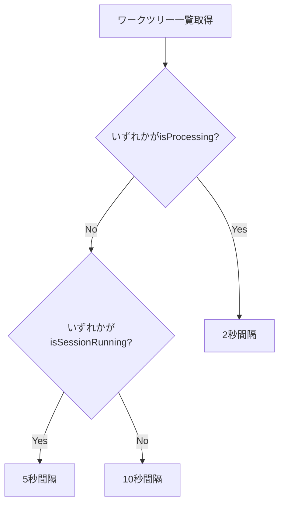

# Issue #35: 動的ポーリング間隔の設計方針書

## 概要

サイドバーのワークツリー一覧取得のポーリング間隔を、ステータスに応じて動的に変更することでパフォーマンスを改善する。

## 現状分析

### 現行アーキテクチャ

```mermaid
graph TD
    subgraph "WorktreeSelectionContext"
        Provider[WorktreeSelectionProvider]
        Reducer[worktreeSelectionReducer]
        State[State管理]
    end

    subgraph "Polling"
        Timer[setInterval 2000ms固定]
        API[worktreeApi.getAll]
    end

    subgraph "API Route"
        Route[/api/worktrees]
        DB[(SQLite)]
        CLI[CLIツールステータスチェック]
    end

    Provider --> Timer
    Timer --> API
    API --> Route
    Route --> DB
    Route --> CLI
    CLI -->|tmux capture| Terminal[ターミナル]
```

### 現行コード（WorktreeSelectionContext.tsx:194-207）

```typescript
// Polling for worktree status updates
useEffect(() => {
  const intervalId = setInterval(() => {
    // Silent refresh (don't show loading state during polling)
    worktreeApi.getAll()
      .then((response) => {
        dispatch({ type: 'SET_WORKTREES', worktrees: response.worktrees });
      })
      .catch((err) => {
        console.error('[WorktreeSelectionContext] Polling error:', err);
      });
  }, WORKTREE_POLLING_INTERVAL_MS);  // 常に2000ms固定

  return () => clearInterval(intervalId);
}, []);
```

### パフォーマンス問題

| 項目 | 現状 | 問題点 |
|------|------|--------|
| ポーリング間隔 | 2秒固定 | アイドル時も高頻度でAPI呼び出し |
| APIコール回数/分 | 30回 | サーバー負荷が常に高い |
| tmuxチェック | N個のworktree × 3 CLI | 全worktreeを毎回チェック |

## 設計方針

### 1. アーキテクチャ設計

#### 変更後のデータフロー

```mermaid
graph TD
    subgraph "WorktreeSelectionContext"
        Provider[WorktreeSelectionProvider]
        Reducer[worktreeSelectionReducer]
        State[State管理]
        IntervalCalc[getPollingInterval関数]
    end

    subgraph "Dynamic Polling"
        Timer[動的setInterval]
        Decision{ステータス判定}
        Fast[2秒: 処理中あり]
        Medium[5秒: セッション実行中]
        Slow[10秒: アイドル]
    end

    subgraph "API Route"
        Route[/api/worktrees]
        DB[(SQLite)]
        CLI[CLIステータスチェック]
    end

    Provider --> IntervalCalc
    IntervalCalc --> Decision
    Decision --> Fast
    Decision --> Medium
    Decision --> Slow
    Fast --> Timer
    Medium --> Timer
    Slow --> Timer
    Timer --> Route
    Route --> DB
    Route --> CLI
    State -->|worktrees| IntervalCalc
```

### 2. 技術選定

| カテゴリ | 選定技術 | 選定理由 |
|---------|---------|---------|
| 状態管理 | React useReducer（既存） | 既存のパターンを維持 |
| タイマー制御 | setTimeout + useRef | 動的間隔変更に対応 |
| ステータス判定 | 既存のWorktree型を活用 | 型安全性を維持 |

### 3. 設計パターン

#### Strategy パターン（ポーリング間隔決定）

```typescript
// src/contexts/WorktreeSelectionContext.tsx

/**
 * ポーリング間隔の定数
 */
const POLLING_INTERVALS = {
  /** 処理中のワークツリーがある場合: 即時性重視 */
  PROCESSING: 2000,
  /** セッション実行中（処理中以外）: 適度な反応性 */
  SESSION_RUNNING: 5000,
  /** アイドル状態: 低頻度でOK */
  IDLE: 10000,
} as const;

/**
 * ワークツリーのステータスに応じて最適なポーリング間隔を決定する
 *
 * 優先度:
 * 1. 処理中（isProcessing）のワークツリーがある → 2秒
 * 2. セッション実行中（isSessionRunning）のワークツリーがある → 5秒
 * 3. 全てアイドル → 10秒
 *
 * @param worktrees - ワークツリー一覧
 * @returns ポーリング間隔（ms）
 */
function getPollingInterval(worktrees: Worktree[]): number {
  // 処理中のワークツリーがあるか
  const hasProcessing = worktrees.some(wt => wt.isProcessing);
  if (hasProcessing) {
    return POLLING_INTERVALS.PROCESSING;
  }

  // セッション実行中のワークツリーがあるか
  const hasRunning = worktrees.some(wt => wt.isSessionRunning);
  if (hasRunning) {
    return POLLING_INTERVALS.SESSION_RUNNING;
  }

  // 全てアイドル
  return POLLING_INTERVALS.IDLE;
}
```

### 4. 実装設計

#### 4.1 ポーリングロジックの変更

**現行**: `setInterval`による固定間隔ポーリング

```typescript
useEffect(() => {
  const intervalId = setInterval(() => {
    worktreeApi.getAll().then(...);
  }, WORKTREE_POLLING_INTERVAL_MS);
  return () => clearInterval(intervalId);
}, []);
```

**変更後**: `setTimeout` + `useRef`による動的間隔ポーリング

```typescript
useEffect(() => {
  const timeoutRef = { current: null as NodeJS.Timeout | null };
  let isMounted = true;

  const poll = async () => {
    if (!isMounted) return;

    try {
      const response = await worktreeApi.getAll();
      dispatch({ type: 'SET_WORKTREES', worktrees: response.worktrees });

      // 次回ポーリング間隔を動的に決定
      const nextInterval = getPollingInterval(response.worktrees);
      if (isMounted) {
        timeoutRef.current = setTimeout(poll, nextInterval);
      }
    } catch (err) {
      console.error('[WorktreeSelectionContext] Polling error:', err);
      // エラー時はデフォルト間隔で再試行
      if (isMounted) {
        timeoutRef.current = setTimeout(poll, POLLING_INTERVALS.SESSION_RUNNING);
      }
    }
  };

  // 初回は即座にポーリング開始
  poll();

  return () => {
    isMounted = false;
    if (timeoutRef.current) {
      clearTimeout(timeoutRef.current);
    }
  };
}, []);
```

#### 4.2 参考実装（WorktreeDetail.tsx:429-433）

既存の`WorktreeDetail.tsx`では類似の動的ポーリングを実装済み:

```typescript
const getPollingInterval = () => {
  if (waitingForResponse) return 2000;
  if (wsConnected) return 10000;
  return 5000;
};
```

この実装パターンを踏襲しつつ、サイドバー用のステータス判定ロジックを適用する。

### 5. ステータス判定ロジック

#### 5.1 判定フロー



#### 5.2 ステータス定義（types/sidebar.ts より）

| ステータス | 条件 | ポーリング間隔 |
|-----------|------|---------------|
| running | `isProcessing === true` | 2秒 |
| waiting | `isWaitingForResponse === true` | 2秒 |
| ready | `isSessionRunning === true` && not processing | 5秒 |
| idle | `isSessionRunning === false` | 10秒 |

#### 5.3 判定ロジック詳細

```typescript
function getPollingInterval(worktrees: Worktree[]): number {
  // isProcessing または isWaitingForResponse がある場合は高頻度
  const hasActiveProcessing = worktrees.some(wt =>
    wt.isProcessing || wt.isWaitingForResponse
  );
  if (hasActiveProcessing) {
    return POLLING_INTERVALS.PROCESSING;
  }

  // セッション実行中（処理待ち状態）
  const hasRunning = worktrees.some(wt => wt.isSessionRunning);
  if (hasRunning) {
    return POLLING_INTERVALS.SESSION_RUNNING;
  }

  // 全てアイドル
  return POLLING_INTERVALS.IDLE;
}
```

### 6. 期待される効果

#### 6.1 APIコール削減率

| 状態 | 現在 | 変更後 | 削減率 |
|-----|------|-------|-------|
| アイドル時（10分間） | 300回 | 60回 | **80%削減** |
| セッション実行時（10分間） | 300回 | 120回 | **60%削減** |
| 処理中（10分間） | 300回 | 300回 | 維持 |

#### 6.2 サーバー負荷

- **アイドル時**: tmuxコマンド実行回数が1/5に削減
- **平均的な使用パターン**: 50-70%のAPI呼び出し削減が期待

### 7. エッジケース対応

#### 7.1 ワークツリーが0件の場合

```typescript
function getPollingInterval(worktrees: Worktree[]): number {
  if (worktrees.length === 0) {
    return POLLING_INTERVALS.IDLE;
  }
  // ... 通常のロジック
}
```

#### 7.2 エラー発生時

```typescript
// エラー時は中間の間隔で再試行（デグラデーション）
catch (err) {
  console.error('[WorktreeSelectionContext] Polling error:', err);
  if (isMounted) {
    timeoutRef.current = setTimeout(poll, POLLING_INTERVALS.SESSION_RUNNING);
  }
}
```

#### 7.3 コンポーネントアンマウント時

```typescript
return () => {
  isMounted = false;
  if (timeoutRef.current) {
    clearTimeout(timeoutRef.current);
  }
};
```

### 8. テスト設計

#### 8.1 ユニットテスト（getPollingInterval関数）

```typescript
describe('getPollingInterval', () => {
  it('should return 2000ms when any worktree is processing', () => {
    const worktrees = [
      { id: '1', isProcessing: true, isSessionRunning: true },
      { id: '2', isProcessing: false, isSessionRunning: false },
    ];
    expect(getPollingInterval(worktrees)).toBe(2000);
  });

  it('should return 2000ms when any worktree is waiting for response', () => {
    const worktrees = [
      { id: '1', isWaitingForResponse: true, isSessionRunning: true },
    ];
    expect(getPollingInterval(worktrees)).toBe(2000);
  });

  it('should return 5000ms when session is running but not processing', () => {
    const worktrees = [
      { id: '1', isProcessing: false, isSessionRunning: true },
    ];
    expect(getPollingInterval(worktrees)).toBe(5000);
  });

  it('should return 10000ms when all worktrees are idle', () => {
    const worktrees = [
      { id: '1', isProcessing: false, isSessionRunning: false },
    ];
    expect(getPollingInterval(worktrees)).toBe(10000);
  });

  it('should return 10000ms when worktrees array is empty', () => {
    expect(getPollingInterval([])).toBe(10000);
  });
});
```

#### 8.2 統合テスト（動的ポーリング動作）

```typescript
describe('Dynamic polling behavior', () => {
  it('should adjust polling interval based on worktree status', async () => {
    // Mock API to return different statuses
    const mockGetAll = vi.fn()
      .mockResolvedValueOnce({ worktrees: [{ isProcessing: true }] })
      .mockResolvedValueOnce({ worktrees: [{ isSessionRunning: true }] })
      .mockResolvedValueOnce({ worktrees: [{ isSessionRunning: false }] });

    // Verify polling intervals change dynamically
    // ...
  });
});
```

### 9. 設計上の決定事項とトレードオフ

#### 9.1 採用した設計

| 決定事項 | 理由 | トレードオフ |
|---------|------|-------------|
| setTimeout使用 | 動的間隔変更が容易 | setIntervalより若干複雑 |
| クライアント側判定 | サーバー変更不要 | 判定ロジックの重複 |
| 3段階の間隔 | シンプルで予測可能 | きめ細かな制御は不可 |

#### 9.2 代替案との比較

**代替案1**: サーバー側で間隔を返す

```typescript
// API Response
{
  worktrees: [...],
  suggestedPollingInterval: 5000
}
```

- メリット: サーバー側で一元管理
- デメリット: API変更が必要、クライアント側の判断が遅れる
- 不採用理由: 変更範囲が大きい、クライアント側の方が即座に判断可能

**代替案2**: WebSocketによるプッシュ通知

- メリット: リアルタイム性が最も高い
- デメリット: 実装コスト大、インフラ変更が必要
- 不採用理由: 今回のスコープ外、将来の拡張として検討

**代替案3**: 5段階の細かい間隔設定

```typescript
const INTERVALS = {
  PROCESSING: 1000,
  WAITING: 2000,
  READY: 5000,
  IDLE_SHORT: 10000,
  IDLE_LONG: 30000,
};
```

- メリット: より細かな制御
- デメリット: 複雑性増加、効果が限定的
- 不採用理由: KISS原則に反する、3段階で十分な効果

### 10. 実装チェックリスト

- [ ] `POLLING_INTERVALS`定数の追加
- [ ] `getPollingInterval`関数の実装
- [ ] ポーリングロジックを`setInterval`から`setTimeout`に変更
- [ ] エラーハンドリングの追加
- [ ] ユニットテストの追加
- [ ] 既存テストの更新（タイマーモック）
- [ ] 動作確認（各ステータスでの間隔変更）

### 11. 対象ファイル

| ファイル | 変更内容 |
|---------|---------|
| `src/contexts/WorktreeSelectionContext.tsx` | ポーリングロジック変更 |
| `tests/unit/contexts/WorktreeSelectionContext.test.tsx` | テスト追加 |

### 12. 制約条件の確認

本設計は以下の原則に準拠:

- **SOLID原則**: 単一責任（`getPollingInterval`は間隔決定のみ担当）
- **KISS原則**: 3段階のシンプルな間隔設定
- **YAGNI原則**: 必要最小限の実装（WebSocket等は将来検討）
- **DRY原則**: 既存の`WorktreeDetail.tsx`パターンを踏襲

## 関連ドキュメント

- [Issue #35](https://github.com/Kewton/MyCodeBranchDesk/issues/35)
- [Issue #31: サイドバーUX改善](./issue-31-sidebar-ux-design-policy.md)
- [サイドバーステータスインジケーター](../../docs/features/sidebar-status-indicator.md)
