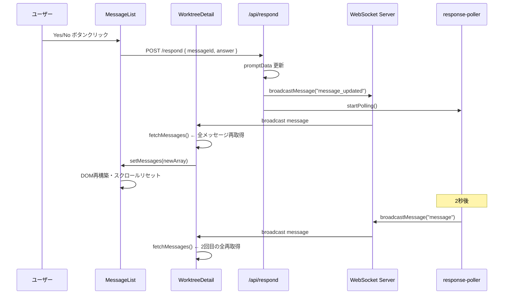
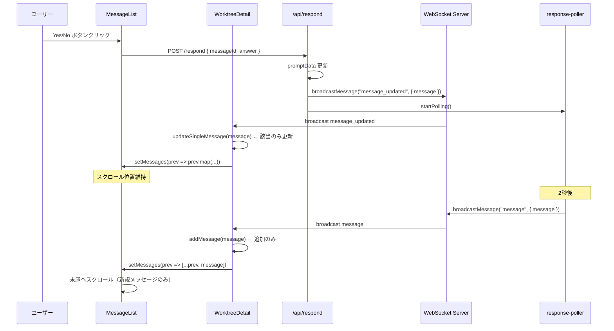
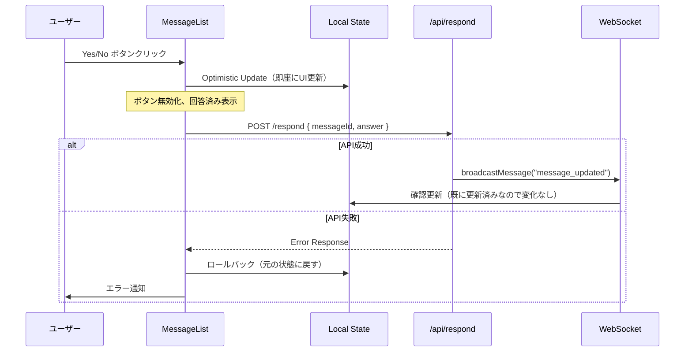
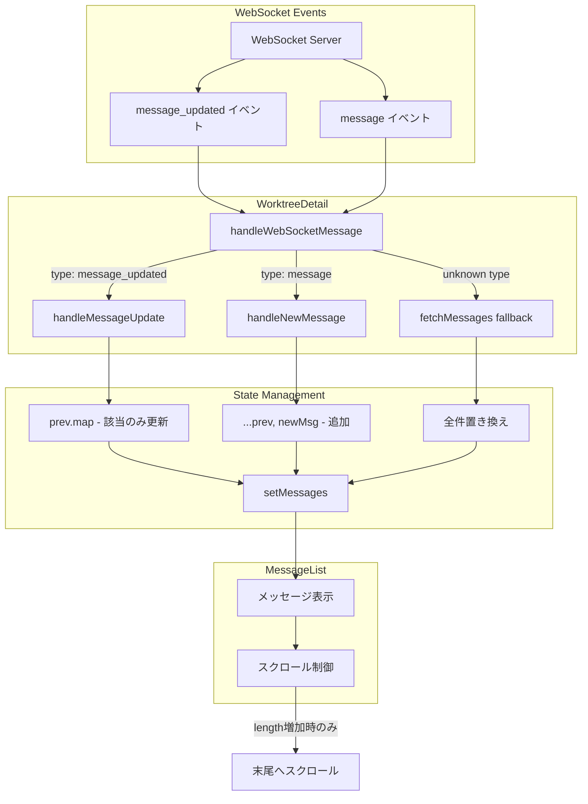

# Issue #36: Yes/No回答時のリロード・スクロールリセット修正 設計方針書

## 概要

Yes/Noプロンプトに回答すると、画面がリロードされたように見える（先頭から末尾までスクロール）問題を修正する。全メッセージ再取得を避け、該当メッセージのみを更新することでUXを改善する。

## 現状分析

### 現行アーキテクチャ



### 問題点の詳細

#### 1. WebSocketメッセージ処理の非効率性（WorktreeDetail.tsx:308-322）

```typescript
// 現行コード
if (message.type === 'broadcast' && message.worktreeId === worktreeId) {
  setWaitingForResponse(false);
  setPendingCliTool(null);
  setGeneratingContent('');
  // 問題: イベント種類を区別せず、全メッセージを再取得
  fetchMessages(targetCliTool);  // ← 全件再取得
  setShowNewMessageNotification(true);
  // ...
}
```

#### 2. ブロードキャストイベントの種類

| イベント | 発生タイミング | 現在の処理 | あるべき処理 |
|----------|---------------|-----------|-------------|
| `message_updated` | プロンプト回答時 | fetchMessages() | 該当メッセージのみ更新 |
| `message` | 新規メッセージ追加時 | fetchMessages() | メッセージ追加のみ |
| `session_status_changed` | セッション状態変更時 | 条件付きクリア | 維持 |

#### 3. スクロール位置リセットの原因

```typescript
// MessageList.tsx:392-399
useEffect(() => {
  // メッセージ数が増えた場合のみスクロール
  if (messages.length > prevMessageCountRef.current) {
    messagesEndRef.current?.scrollIntoView({ behavior: 'smooth' });
  }
  prevMessageCountRef.current = messages.length;
}, [messages.length]);
```

**問題**: `setMessages(newArray)` でReact配列参照が変わると、全DOMが再レンダリングされる。メッセージ数が同じでも、配列参照の変更でスクロール位置がリセットされる可能性がある。

### 発生フロー（詳細）

```
1. ユーザーがYes/Noボタンをクリック
   ↓
2. POST /api/worktrees/[id]/respond
   ↓
3. API: updatePromptData() でDBを更新
   ↓
4. API: broadcastMessage('message_updated', { worktreeId, message })
   ↓
5. API: startPolling() を呼び出し
   ↓
6. WorktreeDetail: WebSocketメッセージ受信
   ↓
7. WorktreeDetail: fetchMessages() ← 全メッセージ再取得（1回目）
   ↓
8. MessageList: setMessages() → DOM全体が再構築
   ↓
9. MessageList: スクロール位置がリセット（または末尾へ自動スクロール）
   ↓
10. response-poller: 2秒後に新しい応答検出
   ↓
11. response-poller: broadcastMessage('message', { worktreeId, message })
   ↓
12. WorktreeDetail: fetchMessages() ← 全メッセージ再取得（2回目）
```

## 設計方針

### 1. アーキテクチャ設計

#### 変更後のデータフロー



### 2. 技術選定

| カテゴリ | 選定技術 | 選定理由 |
|---------|---------|---------|
| 状態管理 | React useState（既存） | 既存パターンを維持 |
| 差分更新 | Array.map による immutable 更新 | React の最適化を活用 |
| イベント判定 | WebSocket payload の type フィールド | 既存の型定義を活用 |
| スクロール制御 | useRef + 条件分岐 | 既存パターンを拡張 |

### 3. 設計パターン

#### Observer パターン（イベント種類別処理）

```typescript
// src/components/worktree/WorktreeDetail.tsx

/**
 * WebSocketメッセージタイプに応じた処理を分岐
 */
const handleWebSocketMessage = useCallback((message: WebSocketMessage) => {
  // セッションステータス変更
  if (isSessionStatusPayload(message.data) && message.data.worktreeId === worktreeId) {
    if (message.data.messagesCleared) {
      setMessages([]);
      // ...
    }
    return;
  }

  // ブロードキャストメッセージの処理
  if (message.type === 'broadcast' && message.worktreeId === worktreeId) {
    const payload = message.data;

    // イベントタイプに応じて分岐
    if (payload?.type === 'message_updated' && isChatPayload(payload)) {
      // 既存メッセージの更新（該当メッセージのみ）
      handleMessageUpdate(payload.message);
    } else if (payload?.type === 'message' && isChatPayload(payload)) {
      // 新規メッセージの追加
      handleNewMessage(payload.message);
    } else {
      // 未知のイベントはフォールバックとして全取得
      fetchMessages(targetCliTool);
    }
  }
}, [worktreeId, activeTab, fetchMessages, resolveActiveCliTool]);
```

### 4. 実装設計

#### 4.1 メッセージ更新ハンドラの追加（エラーハンドリング強化版）

```typescript
// src/components/worktree/WorktreeDetail.tsx

/**
 * 既存メッセージの更新（promptData更新など）
 * 該当メッセージのみを更新し、スクロール位置を維持
 *
 * @param updatedMessage - 更新されたメッセージ
 */
const handleMessageUpdate = useCallback((updatedMessage: ChatMessage) => {
  // 入力検証: 不正なメッセージ形式への対応
  if (!updatedMessage?.id) {
    console.warn('[WorktreeDetail] Invalid message update received: missing id', updatedMessage);
    return;
  }

  setMessages(prevMessages =>
    prevMessages.map(msg =>
      msg.id === updatedMessage.id ? updatedMessage : msg
    )
  );
  // スクロール位置は変更しない（既存メッセージの更新のため）
}, []);

/**
 * 新規メッセージの追加
 * メッセージ配列に追加し、末尾へスクロール
 *
 * @param newMessage - 新規メッセージ
 */
const handleNewMessage = useCallback((newMessage: ChatMessage) => {
  // 入力検証: 不正なメッセージ形式への対応
  if (!newMessage?.id) {
    console.warn('[WorktreeDetail] Invalid new message received: missing id', newMessage);
    return;
  }

  setMessages(prevMessages => {
    // 重複チェック（同じIDのメッセージが既に存在する場合は追加しない）
    if (prevMessages.some(msg => msg.id === newMessage.id)) {
      console.log('[WorktreeDetail] Duplicate message ignored:', newMessage.id);
      return prevMessages;
    }
    return [...prevMessages, newMessage];
  });
  // 新規メッセージ通知を表示
  setShowNewMessageNotification(true);
  setTimeout(() => setShowNewMessageNotification(false), 3000);
}, []);
```

#### 4.2 WebSocketメッセージハンドラの修正

```typescript
// src/components/worktree/WorktreeDetail.tsx

/**
 * WebSocketメッセージを処理
 */
const handleWebSocketMessage = useCallback((message: WebSocketMessage) => {
  // セッションステータス変更の処理（既存）
  if (isSessionStatusPayload(message.data) && message.data.worktreeId === worktreeId) {
    if (message.data.messagesCleared) {
      console.log('[WorktreeDetail] Session killed, clearing messages');
      setMessages([]);
      setWaitingForResponse(false);
      setPendingCliTool(null);
      setGeneratingContent('');
    }
    return;
  }

  // ブロードキャストメッセージの処理
  if (message.type === 'broadcast' && message.worktreeId === worktreeId) {
    const payload = message.data as BroadcastPayload;

    // message_updated: 既存メッセージの更新（promptData変更など）
    if (payload?.type === 'message_updated' && isChatPayload(payload)) {
      console.log('[WorktreeDetail] Message updated:', payload.message.id);
      handleMessageUpdate(payload.message);
      return;
    }

    // message: 新規メッセージの追加
    if (payload?.type === 'message' && isChatPayload(payload)) {
      console.log('[WorktreeDetail] New message received:', payload.message.id);
      setWaitingForResponse(false);
      setPendingCliTool(null);
      setGeneratingContent('');
      handleNewMessage(payload.message);
      return;
    }

    // フォールバック: 未知のイベントタイプは全取得
    console.log('[WorktreeDetail] Unknown broadcast type, fetching all messages');
    setWaitingForResponse(false);
    setPendingCliTool(null);
    setGeneratingContent('');
    const cliToolFromMessage = isChatPayload(payload)
      ? payload.message.cliToolId as CLIToolType | undefined
      : undefined;
    const targetCliTool = isCliTab(activeTab)
      ? activeTab
      : cliToolFromMessage || resolveActiveCliTool();
    fetchMessages(targetCliTool);
  }
}, [worktreeId, activeTab, fetchMessages, resolveActiveCliTool, handleMessageUpdate, handleNewMessage]);
```

#### 4.3 型定義の拡張（必要に応じて）

```typescript
// src/hooks/useWebSocket.ts

export interface ChatBroadcastPayload {
  type: 'message' | 'message_updated';
  worktreeId: string;
  message: ChatMessage;
}

// 型ガードの追加
export function isChatBroadcastPayload(payload: BroadcastPayload): payload is ChatBroadcastPayload {
  return (
    payload &&
    typeof payload === 'object' &&
    ('type' in payload) &&
    (payload.type === 'message' || payload.type === 'message_updated') &&
    ('message' in payload)
  );
}
```

### 5. Optimistic Update の実装

ボタンクリック時に即座にUIを更新し、ネットワーク遅延を感じさせないUXを実現する。

#### 5.1 Optimistic Update のデータフロー



#### 5.2 MessageList.tsx の handlePromptResponse 修正

```typescript
// src/components/worktree/MessageList.tsx

/**
 * Handle prompt response with Optimistic Update
 * ボタンクリック時に即座にUIを更新し、失敗時にロールバック
 */
const handlePromptResponse = async (messageId: string, answer: string) => {
  // 1. 元の状態を保存（ロールバック用）
  const originalMessages = messages;
  const targetMessage = messages.find(msg => msg.id === messageId);

  if (!targetMessage?.promptData) {
    console.warn('[MessageList] Target message not found or has no promptData:', messageId);
    return;
  }

  // 2. Optimistic Update: 即座にUIを更新
  const optimisticMessage: ChatMessage = {
    ...targetMessage,
    promptData: {
      ...targetMessage.promptData,
      status: 'answered' as const,
      answer,
      answeredAt: new Date().toISOString(),
    },
  };

  // 親コンポーネントに更新を通知（WorktreeDetailのsetMessagesを使用）
  onOptimisticUpdate?.(optimisticMessage);

  try {
    // 3. API呼び出し
    const response = await fetch(`/api/worktrees/${worktreeId}/respond`, {
      method: 'POST',
      headers: { 'Content-Type': 'application/json' },
      body: JSON.stringify({ messageId, answer }),
    });

    if (!response.ok) {
      const error = await response.json();
      throw new Error(error.error || 'Failed to send response');
    }

    // 成功: WebSocketで確認更新が来るが、既に更新済みなので変化なし
    console.log('[MessageList] Prompt response sent successfully:', messageId);

  } catch (error) {
    // 4. 失敗時: ロールバック
    console.error('[MessageList] Failed to send prompt response:', error);
    onOptimisticRollback?.(originalMessages);

    // エラー通知（オプション）
    // toast.error('回答の送信に失敗しました。もう一度お試しください。');
  }
};
```

#### 5.3 WorktreeDetail.tsx への Optimistic Update 対応追加

```typescript
// src/components/worktree/WorktreeDetail.tsx

/**
 * Optimistic Update: 即座にメッセージを更新
 */
const handleOptimisticUpdate = useCallback((updatedMessage: ChatMessage) => {
  setMessages(prevMessages =>
    prevMessages.map(msg =>
      msg.id === updatedMessage.id ? updatedMessage : msg
    )
  );
}, []);

/**
 * ロールバック: 元のメッセージ状態に戻す
 */
const handleOptimisticRollback = useCallback((originalMessages: ChatMessage[]) => {
  console.log('[WorktreeDetail] Rolling back to original messages');
  setMessages(originalMessages);
}, []);

// MessageList に props として渡す
<MessageList
  messages={messages}
  worktreeId={worktree!.id}
  loading={false}
  waitingForResponse={waitingForResponse}
  generatingContent={generatingContent}
  realtimeOutput={realtimeOutput}
  isThinking={isThinking}
  selectedCliTool={messageListCliTool}
  onOptimisticUpdate={handleOptimisticUpdate}
  onOptimisticRollback={handleOptimisticRollback}
/>
```

#### 5.4 MessageListProps の型定義更新

```typescript
// src/components/worktree/MessageList.tsx

export interface MessageListProps {
  messages: ChatMessage[];
  worktreeId: string;
  loading?: boolean;
  waitingForResponse?: boolean;
  generatingContent?: string;
  realtimeOutput?: string;
  isThinking?: boolean;
  selectedCliTool?: string;
  // Optimistic Update 用コールバック
  onOptimisticUpdate?: (message: ChatMessage) => void;
  onOptimisticRollback?: (messages: ChatMessage[]) => void;
}
```

### 6. React.memo による MessageBubble 最適化

差分更新時の再レンダリングを最小化するため、MessageBubble コンポーネントをメモ化する。

#### 6.1 MessageBubble のメモ化

```typescript
// src/components/worktree/MessageList.tsx

/**
 * Message bubble component (Memoized)
 * promptData.status が変更された場合のみ再レンダリング
 */
const MessageBubble = React.memo(function MessageBubble({
  message,
  onFilePathClick,
  onPromptRespond
}: {
  message: ChatMessage;
  onFilePathClick: (path: string) => void;
  onPromptRespond?: (messageId: string, answer: string) => void;
}) {
  // ... 既存の実装
}, (prevProps, nextProps) => {
  // カスタム比較関数: 以下が同じなら再レンダリング不要
  return (
    prevProps.message.id === nextProps.message.id &&
    prevProps.message.content === nextProps.message.content &&
    prevProps.message.promptData?.status === nextProps.message.promptData?.status &&
    prevProps.message.promptData?.answer === nextProps.message.promptData?.answer
  );
});
```

#### 6.2 メモ化の効果

| シナリオ | メモ化なし | メモ化あり |
|---------|-----------|-----------|
| message_updated 受信時 | 全 MessageBubble 再レンダリング | 該当 MessageBubble のみ再レンダリング |
| 100件のメッセージ | 100回のレンダリング | 1回のレンダリング |
| パフォーマンス | O(n) | O(1) |

#### 6.3 注意事項

- `onFilePathClick`、`onPromptRespond` は `useCallback` でメモ化されている前提
- カスタム比較関数は必要最小限の項目のみ比較（過剰な比較はオーバーヘッド）
- `message.summary`、`message.logFileName` は変更頻度が低いため比較対象外

### 7. スクロール制御の改善

#### 7.1 現行ロジック（MessageList.tsx:392-399）

```typescript
// 問題: messages.length のみで判定
useEffect(() => {
  if (messages.length > prevMessageCountRef.current) {
    messagesEndRef.current?.scrollIntoView({ behavior: 'smooth' });
  }
  prevMessageCountRef.current = messages.length;
}, [messages.length]);
```

#### 7.2 改善案

スクロール制御は現行のままで問題なし。重要なのは `messages` 配列の更新方法:

- **`handleMessageUpdate`**: `map()` で該当メッセージのみ更新 → `messages.length` 変化なし → スクロールなし
- **`handleNewMessage`**: 末尾に追加 → `messages.length` 増加 → 末尾へスクロール

これにより、明示的なスクロール制御フラグは不要。

### 8. データフロー図



### 9. エッジケース対応

#### 9.1 重複メッセージ防止

```typescript
const handleNewMessage = useCallback((newMessage: ChatMessage) => {
  setMessages(prevMessages => {
    // 同じIDのメッセージが既に存在する場合は追加しない
    if (prevMessages.some(msg => msg.id === newMessage.id)) {
      console.log('[WorktreeDetail] Duplicate message ignored:', newMessage.id);
      return prevMessages;
    }
    return [...prevMessages, newMessage];
  });
}, []);
```

#### 9.2 タブ切り替え時の整合性

```typescript
// タブ切り替え時は引き続き fetchMessages() を使用
useEffect(() => {
  if (isCliTab(activeTab)) {
    fetchMessages(activeTab);  // タブ切り替え時は全取得が適切
    // ...
  }
}, [activeTab, worktreeId, fetchMessages]);
```

#### 9.3 WebSocket切断時のフォールバック

```typescript
// 定期ポーリングは維持（WebSocket切断時のバックアップ）
useEffect(() => {
  // ...
  const pollingInterval = wsConnected ? 15000 : 5000;
  const interval = setInterval(pollMessages, pollingInterval);
  // ...
}, [activeTab, fetchMessages, wsConnected]);
```

### 10. テスト設計

#### 10.1 ユニットテスト

```typescript
// tests/unit/components/worktree/WorktreeDetail.test.tsx

describe('WorktreeDetail WebSocket message handling', () => {
  describe('handleMessageUpdate', () => {
    it('should update only the target message without changing array length', () => {
      const initialMessages = [
        { id: '1', content: 'msg1', promptData: { status: 'pending' } },
        { id: '2', content: 'msg2', promptData: null },
      ];
      const updatedMessage = { id: '1', content: 'msg1', promptData: { status: 'answered' } };

      // handleMessageUpdate を呼び出し
      // 結果: messages[0] のみ更新、length は変わらない
    });

    it('should preserve scroll position when message is updated', () => {
      // スクロール位置が維持されることを確認
    });
  });

  describe('handleNewMessage', () => {
    it('should add new message to the end of the array', () => {
      const initialMessages = [{ id: '1', content: 'msg1' }];
      const newMessage = { id: '2', content: 'msg2' };

      // handleNewMessage を呼び出し
      // 結果: messages.length が 2 に増加
    });

    it('should not add duplicate message', () => {
      const initialMessages = [{ id: '1', content: 'msg1' }];
      const duplicateMessage = { id: '1', content: 'msg1' };

      // handleNewMessage を呼び出し
      // 結果: messages.length は 1 のまま
    });

    it('should trigger scroll to bottom when new message is added', () => {
      // 末尾へのスクロールが発生することを確認
    });
  });
});
```

#### 10.2 統合テスト

```typescript
// tests/integration/yes-no-response.test.tsx

describe('Yes/No response flow', () => {
  it('should update prompt status without full reload', async () => {
    // 1. メッセージリストを表示
    // 2. Yes ボタンをクリック
    // 3. WebSocket message_updated イベントを受信
    // 4. 該当メッセージのみ更新されることを確認
    // 5. スクロール位置が維持されることを確認
  });

  it('should add new assistant response without flickering', async () => {
    // 1. Yes/No 回答後
    // 2. response-poller から message イベントを受信
    // 3. 新規メッセージが末尾に追加されることを確認
    // 4. 末尾へスムーズスクロールすることを確認
  });
});
```

### 11. 期待される効果

#### 11.1 UX改善

| 項目 | 現状 | 改善後 |
|------|------|--------|
| Yes/No回答後のちらつき | あり | なし |
| スクロール位置 | リセット | 維持 |
| API呼び出し回数 | 2回/回答 | 0回/回答 |
| DOM再構築 | 全メッセージ | 該当メッセージのみ |

#### 11.2 パフォーマンス改善

| 指標 | 現状 | 改善後 | 改善率 |
|------|------|--------|--------|
| Yes/No回答時のAPI呼び出し | 2回 | 0回 | **100%削減** |
| DOM更新範囲 | 全メッセージ | 1メッセージ | **O(n) → O(1)** |
| React再レンダリング | 全MessageBubble | 1 MessageBubble | **O(n) → O(1)** |

### 12. 設計上の決定事項とトレードオフ

#### 12.1 採用した設計

| 決定事項 | 理由 | トレードオフ |
|---------|------|-------------|
| WebSocketイベント種類別処理 | 差分更新が可能 | 条件分岐の複雑化 |
| `Array.map()` による更新 | React最適化を活用 | immutable更新のコスト |
| フォールバック全取得 | 未知イベントへの対応 | 一部ケースで全取得が発生 |

#### 12.2 代替案との比較

**代替案1**: React Query / SWR によるキャッシュ管理

```typescript
// useSWR で自動的に差分更新
const { data, mutate } = useSWR(`/api/worktrees/${id}/messages`);
```

- メリット: キャッシュ管理が自動化、optimistic update が容易
- デメリット: ライブラリ追加、既存コードの大幅変更
- 不採用理由: 変更範囲が大きい、現行パターンで十分対応可能

**代替案2**: `useReducer` によるメッセージ状態管理

```typescript
const messageReducer = (state, action) => {
  switch (action.type) {
    case 'UPDATE_MESSAGE': return state.map(...);
    case 'ADD_MESSAGE': return [...state, action.message];
    // ...
  }
};
```

- メリット: 状態更新ロジックの一元化
- デメリット: 既存の `useState` からの移行コスト
- 不採用理由: 現状の `useState` + callback で十分シンプル

**代替案3**: 仮想スクロールの導入

```typescript
import { FixedSizeList } from 'react-window';
```

- メリット: 大量メッセージでのパフォーマンス向上
- デメリット: 実装複雑化、UX変更
- 不採用理由: 今回のスコープ外、メッセージ数は通常100件未満

### 13. 実装チェックリスト

#### 基本実装
- [ ] `handleMessageUpdate` 関数の実装（エラーハンドリング付き）
- [ ] `handleNewMessage` 関数の実装（エラーハンドリング付き）
- [ ] `handleWebSocketMessage` のイベント種類別分岐追加
- [ ] 重複メッセージ防止ロジックの追加
- [ ] 型ガード `isChatBroadcastPayload` の追加（必要に応じて）

#### 推奨改善項目
- [ ] Optimistic Update の実装（`handlePromptResponse` 修正）
- [ ] `onOptimisticUpdate`、`onOptimisticRollback` props の追加
- [ ] `MessageBubble` の `React.memo` 化
- [ ] カスタム比較関数の実装

#### テスト・動作確認
- [ ] ユニットテストの追加
- [ ] 統合テストの追加
- [ ] 動作確認（Yes/No回答 → 即座にUI更新）
- [ ] 動作確認（API失敗時 → ロールバック）
- [ ] 動作確認（スクロール位置維持）
- [ ] 動作確認（新規メッセージ → 末尾スクロール）

### 14. 対象ファイル

| ファイル | 変更内容 |
|---------|---------|
| `src/components/worktree/WorktreeDetail.tsx` | WebSocketメッセージ処理の分岐追加、差分更新ハンドラ、Optimistic Update対応 |
| `src/components/worktree/MessageList.tsx` | `handlePromptResponse` のOptimistic Update実装、`React.memo` 化、型定義更新 |
| `src/hooks/useWebSocket.ts` | 型定義の拡張（必要に応じて） |
| `tests/unit/components/worktree/WorktreeDetail.test.tsx` | ユニットテスト追加 |
| `tests/unit/components/worktree/MessageList.test.tsx` | Optimistic Update、React.memo のテスト追加 |
| `tests/integration/yes-no-response.test.tsx` | 統合テスト追加 |

### 15. 制約条件の確認

本設計は以下の原則に準拠:

- **SOLID原則**:
  - 単一責任: `handleMessageUpdate` は更新のみ、`handleNewMessage` は追加のみ
  - 開放閉鎖: 新しいイベントタイプを追加しても既存ロジックに影響なし
- **KISS原則**: シンプルな条件分岐とArray操作
- **YAGNI原則**: 必要最小限の変更（React Query等は導入しない）
- **DRY原則**: 既存の型定義・型ガードを活用

## 関連ドキュメント

- [Issue #36](https://github.com/Kewton/MyCodeBranchDesk/issues/36)
- [Issue #35: 動的ポーリング間隔](./issue-35-dynamic-polling-design-policy.md)
- [Issue #31: サイドバーUX改善](./issue-31-sidebar-ux-design-policy.md)
