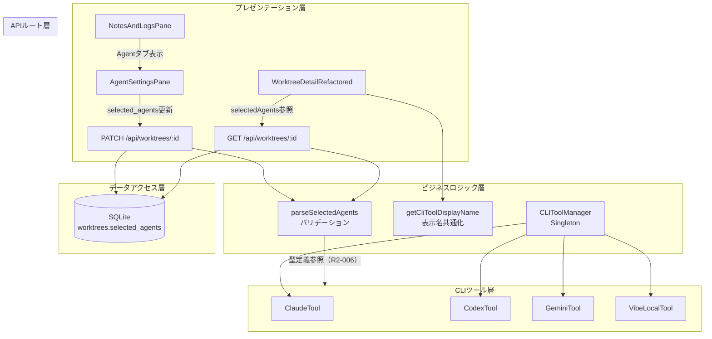
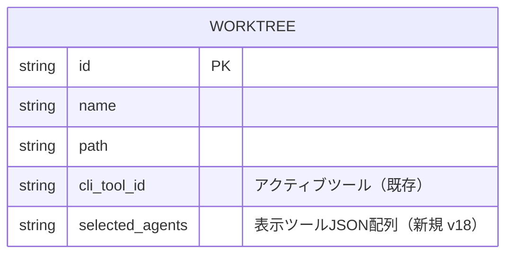

# Issue #368 設計方針書: CMATEタブAgent設定タブ追加

## 1. 概要

### 機能要件
CMATEタブに「Agent」サブタブを追加し、ユーザーがUIに表示するコーディングエージェント2つをWorktree単位で選択できるようにする。また、`vibe-local`を4つ目のCLIツールとして追加する。

### スコープ
1. CLI_TOOL_IDSハードコード箇所の一元化リファクタリング（前提作業）
2. vibe-localのCLIツール追加
3. CMATEタブにAgentサブタブ追加
4. エージェント選択のDB永続化
5. ターミナルヘッダーの動的レンダリング

## 2. アーキテクチャ設計

### システム構成図



> **R2-006注記**: `selected-agents-validator.ts`（ビジネスロジック層）は `cli-tools/types.ts`（CLIツール層）の `CLI_TOOL_IDS` / `CLIToolType` 型定義を参照する。この依存方向はコードベース既存パターン（`db.ts` → `cli-tools/types.ts`、`claude-executor.ts` → `cli-tools/types.ts` 等）と一致しており、型定義のみの参照であるため許容する。

### レイヤー構成

| レイヤー | 変更対象 | 責務 |
|---------|---------|------|
| プレゼンテーション | `NotesAndLogsPane`, `AgentSettingsPane`(新規), `WorktreeDetailRefactored` | UI表示・ユーザー操作 |
| APIルート | `worktrees/[id]/route.ts` | selected_agents CRUD |
| ビジネスロジック | `parseSelectedAgents`(新規), `getCliToolDisplayName`(新規) | バリデーション・表示名変換 |
| データアクセス | `db-migrations.ts`(v18), `db.ts` | DBスキーマ・クエリ |
| CLIツール | `vibe-local.ts`(新規), `types.ts`, `manager.ts` | ツール管理・セッション操作 |

## 3. データモデル設計

### ER図（変更部分）



### selected_agents カラム設計

| 項目 | 内容 |
|------|------|
| カラム名 | `selected_agents` |
| 型 | `TEXT` (JSON文字列) |
| デフォルト値 | `'["claude","codex"]'` |
| 制約 | 2要素のCLIToolType配列、重複不可 |
| マイグレーション | version 18 |

### Worktree インターフェース拡張方針（R2-005対応）

`src/types/models.ts` の `Worktree` インターフェースに `selectedAgents` フィールドを追加する。

```typescript
// src/types/models.ts
export interface Worktree {
  // ... 既存フィールド
  selectedAgents?: [CLIToolType, CLIToolType]; // R2-005: GETレスポンスで返却、PATCH入力で使用
}
```

**方針:**
- `Worktree` 型に直接 `selectedAgents` オプショナルフィールドを追加する（レスポンス専用型は作成しない）
- `db.ts` の `getWorktreeById()` および `getWorktrees()` で `selected_agents` カラムを取得し、`parseSelectedAgents()` で変換した結果を `selectedAgents` フィールドに格納する
- APIレスポンス専用型を別途定義する案は、既存パターン（`isSessionRunning` 等の追加フィールド）との一貫性を優先して不採用とする

### cli_tool_id と selected_agents の役割分離

| カラム | 役割 | 用途 |
|--------|------|------|
| `cli_tool_id` | アクティブツール | セッション開始、スケジュール実行、メッセージ送受信 |
| `selected_agents` | 表示ツール | ターミナルヘッダータブ表示、Agentサブタブ設定 |

**整合性ルール:**
- `selected_agents` は常に2要素
- `cli_tool_id` が `selected_agents` に含まれない場合 → `cli_tool_id` を `selected_agents[0]` に自動更新（PATCH API内でトランザクション処理）

### DBマイグレーション v18

```sql
-- Step 1: カラム追加
ALTER TABLE worktrees ADD COLUMN selected_agents TEXT;

-- Step 2: 既存データの初期化（cli_tool_id考慮）
-- 注意(R1-010): 以下のSQL内リテラル値 ('claude', 'codex') は TypeScript の
-- CLI_TOOL_IDS 定数と同期が保証されない。SQLマイグレーションは実行時に固定されるため、
-- CLI_TOOL_IDS の変更がマイグレーション済みデータに遡及適用されない点に留意すること。
-- マイグレーションテストで全CLIToolType値についてテストケースを用意すること。
UPDATE worktrees SET selected_agents =
  CASE
    WHEN cli_tool_id NOT IN ('claude', 'codex')
    THEN json_array(cli_tool_id, 'claude')
    ELSE '["claude","codex"]'
  END;
```

**マイグレーション結果の期待値（R1-010対応）:**

| 既存 `cli_tool_id` | マイグレーション後 `selected_agents` | 備考 |
|---------------------|--------------------------------------|------|
| `claude` | `["claude","codex"]` | デフォルト値 |
| `codex` | `["claude","codex"]` | デフォルト値 |
| `gemini` | `["gemini","claude"]` | geminiが第1エージェント、claudeが第2エージェント |
| `vibe-local` | `["vibe-local","claude"]` | vibe-localが第1エージェント、claudeが第2エージェント |

> **注意**: 上記の期待値が要件と一致していることを確認すること。特に `gemini` / `vibe-local` が `cli_tool_id` に設定されている場合に、第2エージェントを `claude` 固定とする動作が意図通りであるか検証が必要。マイグレーションテストでは全CLIToolType値に対するケースを網羅すること。

## 4. API設計

### エンドポイント変更

#### GET /api/worktrees/:id（既存拡張）

レスポンスに `selectedAgents` フィールドを追加:

```typescript
// レスポンス追加フィールド
{
  // ... 既存フィールド
  selectedAgents: [CLIToolType, CLIToolType], // e.g. ["claude", "codex"]
}
```

#### PATCH /api/worktrees/:id（既存拡張）

リクエストボディに `selectedAgents` を追加:

```typescript
// リクエスト追加フィールド
{
  selectedAgents?: [string, string], // バリデーション後にCLIToolType[]に変換
}
```

**処理フロー:**
1. `isValidWorktreeId(params.id)` でworktree IDフォーマット検証（**R4-002対応**: 他ルート `auto-yes/route.ts` L91、`schedules/route.ts` L31/L69 と一貫したDefense-in-Depth。不正フォーマットのIDがDB層・セッション名生成に到達することを防止）
2. `parseSelectedAgents()` でバリデーション
3. `selected_agents` をDB更新
4. `cli_tool_id` の整合性チェック → 必要に応じて自動更新
5. 同一トランザクション内で処理

> **R4-002注記**: GETハンドラにも同様に `isValidWorktreeId(params.id)` チェックの追加を推奨する。エラーレスポンス内の `params.id` 直接埋め込み（L27: `Worktree '${params.id}' not found`）は、検証済みIDのみが使用されることで間接的に保護される。

**cliToolIdバリデーション更新（R2-001対応）:**
既存のPATCH APIにはcliToolId設定時のバリデーションとして `const validCliTools: CLIToolType[] = ['claude', 'codex', 'gemini']`（route.ts L165）がハードコードされている。このバリデーション配列を `CLI_TOOL_IDS` からの導出に変更し、vibe-localを含む全ツールIDが有効値として受理されるようにする。

```typescript
// 変更前（route.ts L165）
const validCliTools: CLIToolType[] = ['claude', 'codex', 'gemini'];

// 変更後
const validCliTools: readonly CLIToolType[] = CLI_TOOL_IDS;
```

**レスポンス:** 現行のまま維持（`sessionStatusByCli` は追加しない）。既存ポーリング機構でUI更新。

#### cli_tool_id 自動更新の動作仕様（R1-007対応）

PATCH APIで `selectedAgents` を更新した際に、現在の `cli_tool_id` が新しい `selectedAgents` に含まれない場合、`cli_tool_id` は `selectedAgents[0]` に自動更新される。この副作用的な動作は驚き最小の原則に反する可能性があるため、以下の方針でAPI仕様を明示化する。

**方針:**
- APIドキュメント（本設計方針書およびコード内JSDocコメント）に自動更新ルールを明記する
- PATCH APIのレスポンスボディに `cliToolIdAutoUpdated: boolean` フラグを追加し、自動更新が発生したことをクライアントに通知する
- サーバーサイドで自動更新が発生した場合、`console.info` ログを出力する

**レスポンス拡張例:**
```typescript
// PATCH /api/worktrees/:id レスポンス（自動更新発生時）
{
  // ... 既存フィールド
  cliToolIdAutoUpdated?: boolean, // true: cli_tool_idが自動更新された
}
```

> **注意**: クライアント側は `cliToolIdAutoUpdated: true` を受け取った場合、UIのアクティブツール表示を更新する必要がある。

#### cli_tool_id 自動更新時のセッション・ポーラーへの影響方針（R3-003対応）

`cli_tool_id` が自動更新される場合（例: `cli_tool_id='gemini'` の状態で `selectedAgents` を `['claude','codex']` に変更）、アクティブなtmuxセッション、response-poller、auto-yes-pollerに対する副作用が発生し得る。以下の方針を採用する。

**採用方針: (C) cli_tool_idのみ自動更新、既存セッションは自然終了**
- `cli_tool_id` のDB値を `selectedAgents[0]` に自動更新する（既存仕様）
- アクティブなtmuxセッション（旧cli_tool_id）は明示的に停止しない
- response-poller / auto-yes-pollerは次回ポーリングサイクルで自然に新しい `cli_tool_id` に基づく状態に遷移する
- 旧cli_tool_idのセッションは、ユーザーが明示的に停止操作を行うか、次回のセッションクリーンアップ時に回収される
- クライアント側には `cliToolIdAutoUpdated: true` を通知し、UIからセッション再起動を促す

**不採用とした代替案:**
- (A) セッション稼働中はselectedAgents変更を拒否（400エラー）: UXが悪化するため不採用
- (B) 自動更新時にアクティブセッション停止+ポーラークリーンアップ: PATCH API内での副作用が大きく、エラーハンドリングが複雑化するため不採用

> **実装時の注意**: 自動更新が発生した場合のログ出力（`console.info`）に、旧cli_tool_idと新cli_tool_idの両方を含めること。

### エラーハンドリング

| HTTP | コード | 条件 |
|------|--------|------|
| 400 | `INVALID_SELECTED_AGENTS` | 配列長≠2、不正なツールID、重複 |
| 404 | `WORKTREE_NOT_FOUND` | 存在しないworktree ID |
| 500 | `DB_ERROR` | DB更新失敗 |

## 5. バリデーション設計

### parseSelectedAgents() 関数

**配置先:** `src/lib/selected-agents-validator.ts`（新規）

```typescript
import { CLI_TOOL_IDS, type CLIToolType } from './cli-tools/types';

const DEFAULT_SELECTED_AGENTS: [CLIToolType, CLIToolType] = ['claude', 'codex'];

export function parseSelectedAgents(raw: string | null): [CLIToolType, CLIToolType] {
  if (!raw) return DEFAULT_SELECTED_AGENTS;
  try {
    const parsed = JSON.parse(raw);
    if (!Array.isArray(parsed) || parsed.length !== 2) return DEFAULT_SELECTED_AGENTS;
    if (!parsed.every(id => (CLI_TOOL_IDS as readonly string[]).includes(id))) return DEFAULT_SELECTED_AGENTS;
    if (parsed[0] === parsed[1]) return DEFAULT_SELECTED_AGENTS;
    return parsed as [CLIToolType, CLIToolType];
  } catch {
    return DEFAULT_SELECTED_AGENTS;
  }
}

export function validateSelectedAgentsInput(input: unknown): {
  valid: boolean;
  value?: [CLIToolType, CLIToolType];
  error?: string;
} {
  if (!Array.isArray(input) || input.length !== 2) {
    return { valid: false, error: 'selected_agents must be an array of 2 elements' };
  }
  if (!input.every(id => typeof id === 'string' && (CLI_TOOL_IDS as readonly string[]).includes(id))) {
    return { valid: false, error: 'Invalid CLI tool ID' };
  }
  if (input[0] === input[1]) {
    return { valid: false, error: 'Duplicate tool IDs not allowed' };
  }
  return { valid: true, value: input as [CLIToolType, CLIToolType] };
}
```

**バリデーション観点:**
1. JSON.parseエラー防止（try-catch）
2. 型チェック（配列であること）
3. 長さチェック（2要素）
4. CLI_TOOL_IDS包含チェック（XSS/インジェクション防止）
5. 重複チェック
6. フォールバック（デフォルト値を返却、クラッシュしない）

### バリデーションロジック共通化方針（R1-001対応）

`parseSelectedAgents()` と `validateSelectedAgentsInput()` はバリデーションロジック（配列長チェック、CLI_TOOL_IDS包含チェック、重複チェック）が実質的に重複しているため、共通のコア関数を抽出する。

```typescript
// 共通バリデーションコア関数
function validateAgentsPair(input: unknown[]): {
  valid: boolean;
  value?: [CLIToolType, CLIToolType];
  error?: string;
} {
  if (input.length !== 2) return { valid: false, error: 'Must be 2 elements' };
  if (!input.every(id => typeof id === 'string' && (CLI_TOOL_IDS as readonly string[]).includes(id))) {
    return { valid: false, error: 'Invalid CLI tool ID' };
  }
  if (input[0] === input[1]) return { valid: false, error: 'Duplicate tool IDs' };
  return { valid: true, value: input as [CLIToolType, CLIToolType] };
}
```

**parseSelectedAgents()**: `validateAgentsPair()` を内部で利用し、`valid: false` の場合にデフォルト値にフォールバック。フォールバック発生時には `console.warn` で警告ログを出力し、DB内の不正データを検出可能にする。

```typescript
export function parseSelectedAgents(raw: string | null): [CLIToolType, CLIToolType] {
  if (!raw) return DEFAULT_SELECTED_AGENTS;
  try {
    const parsed = JSON.parse(raw);
    if (!Array.isArray(parsed)) {
      console.warn(`[selected-agents] Invalid format in DB, falling back to default: ${raw}`);
      return DEFAULT_SELECTED_AGENTS;
    }
    const result = validateAgentsPair(parsed);
    if (!result.valid) {
      console.warn(`[selected-agents] Invalid data in DB (${result.error}), falling back to default: ${raw}`);
      return DEFAULT_SELECTED_AGENTS;
    }
    return result.value!;
  } catch {
    console.warn(`[selected-agents] JSON parse error in DB, falling back to default: ${raw}`);
    return DEFAULT_SELECTED_AGENTS;
  }
}
```

**validateSelectedAgentsInput()**: `validateAgentsPair()` を内部で利用し、`valid: false` の場合にエラーメッセージを返却（APIレスポンス用）。

### parseSelectedAgents() console.warn出力のログインジェクション対策（R4-005対応）

`parseSelectedAgents()` のフォールバック発生時に出力する `console.warn` のログメッセージに、DB由来の `raw` 値が直接含まれる設計（R1-001対応で追加）について、以下のログインジェクション対策を実施する。

**リスク**: DBに不正データが挿入された場合、`raw` 値に改行文字（`\n`, `\r`）やANSIエスケープシーケンスが含まれる可能性があり、ログの可読性破壊やターミナル操作の悪用リスクがある。

**対策方針:**
1. `raw` 値に対して `stripAnsi()` を適用し、ANSIエスケープシーケンスを除去する
2. 改行文字を除去する（`raw.replace(/[\n\r]/g, ' ')`）
3. 出力長を制限する（`.substring(0, 100)`）

**実装例:**
```typescript
// console.warn出力時のrawサニタイズ
const sanitizedRaw = stripAnsi(raw).replace(/[\n\r]/g, ' ').substring(0, 100);
console.warn(`[selected-agents] Invalid format in DB, falling back to default: ${sanitizedRaw}`);
```

> **注意**: `stripAnsi` は `src/lib/clipboard-utils.ts` で既に使用されているユーティリティであり、新たな依存追加は不要。

## 6. 表示名共通化設計

### getCliToolDisplayName() 関数

**配置先:** `src/lib/cli-tools/types.ts`（既存ファイルに追加）

```typescript
const CLI_TOOL_DISPLAY_NAMES: Record<CLIToolType, string> = {
  claude: 'Claude',
  codex: 'Codex',
  gemini: 'Gemini',
  'vibe-local': 'Vibe Local',
};

export function getCliToolDisplayName(id: CLIToolType): string {
  return CLI_TOOL_DISPLAY_NAMES[id] ?? id;
}
```

### tool.name と getCliToolDisplayName() の使い分け方針（R2-004対応）

| プロパティ | 用途 | 例（Claude） | 例（Vibe Local） |
|-----------|------|-------------|-----------------|
| `BaseCLITool.name` (`CLIToolInfo.name`) | ツール正式名称。ログ出力、セッション管理の内部識別 | `'Claude Code'` | `'Vibe Local'` |
| `getCliToolDisplayName(id)` | UI表示用短縮名。タブヘッダー、メッセージ一覧、設定画面 | `'Claude'` | `'Vibe Local'` |

> **方針**: UI表示には常に `getCliToolDisplayName()` を使用し、内部ログ・デバッグ出力には `tool.name` を使用する。両者の値が一致するケース（Vibe Local）もあるが、Claude Code/Codex CLI/Gemini CLIでは短縮名が異なる。新規ツール追加時は `CLI_TOOL_DISPLAY_NAMES` への登録を必須とする。

**統一対象:**
- `MessageList.tsx` `getToolName()`（2箇所） → `getCliToolDisplayName()` に置換
- `WorktreeDetailRefactored.tsx` L127 `capitalizeFirst()` → `getCliToolDisplayName()` に置換
- `AutoYesToggle.tsx` L42 `formatCliToolName()` → `getCliToolDisplayName()` に置換
- `log-manager.ts` L91/L101の表示名ハードコード（三項演算子）→ `getCliToolDisplayName()` に置換（**R2-003対応**）
- `log-manager.ts` L137の表示名ハードコード → `getCliToolDisplayName()` に置換（**R2-003対応**）

## 7. UIコンポーネント設計

### 7-1. NotesAndLogsPane 変更

```typescript
// 変更: SubTab型拡張
type SubTab = 'notes' | 'logs' | 'agent';
```

- 3つ目のタブ「Agent」を追加
- `activeSubTab === 'agent'` の場合に `AgentSettingsPane` を描画

### 7-2. AgentSettingsPane（新規コンポーネント）

**配置先:** `src/components/worktree/AgentSettingsPane.tsx`

```typescript
interface AgentSettingsPaneProps {
  worktreeId: string;
  selectedAgents: [CLIToolType, CLIToolType];
  onSelectedAgentsChange: (agents: [CLIToolType, CLIToolType]) => void;
}
```

**UI仕様:**
- `CLI_TOOL_IDS` から全エージェント一覧を表示
- チェックボックスで2つまで選択可能
- 2つ選択済みの場合、未選択の項目はdisabled
- 変更時にPATCH APIを呼び出してDB永続化
- 各エージェント名は `getCliToolDisplayName()` で表示

### 7-3. WorktreeDetailRefactored 変更

**ハードコード置換:**
- L1795, L2081: `(['claude', 'codex'] as const)` → `selectedAgents` state変数
- `selectedAgents` はGET APIレスポンスの `selectedAgents` フィールドから取得

**activeCliTab連動:**
- `useState<CLIToolType>('claude')` → `useState<CLIToolType>(selectedAgents[0])`
- `selectedAgents` 変更時に `useEffect` で `activeCliTab` を同期

### 7-4. sidebar.ts 型変更

```typescript
// 変更前
cliStatus?: { claude: BranchStatus; codex: BranchStatus; };

// 変更後
cliStatus?: Partial<Record<CLIToolType, BranchStatus>>;
```

- `toBranchItem()` に `selectedAgents` 引数を追加
- `selectedAgents` の2ツールのみステータスを格納

## 8. CLIツール設計

### 8-1. vibe-local ツール実装

**配置先:** `src/lib/cli-tools/vibe-local.ts`

```typescript
export class VibeLocalTool extends BaseCLITool {
  readonly id: CLIToolType = 'vibe-local';
  readonly name = 'Vibe Local';
  readonly command = 'vibe-local'; // 技術調査フェーズで確定

  async isRunning(worktreeId: string): Promise<boolean> { /* ... */ }
  async startSession(worktreeId: string, worktreePath: string): Promise<void> { /* ... */ }
  async sendMessage(worktreeId: string, message: string): Promise<void> { /* ... */ }
  async killSession(worktreeId: string): Promise<void> { /* ... */ }
}
```

**技術調査依存事項:**
- 実行コマンド名（`vibe-local` or `python vibe-local`）
- 起動引数（インタラクティブ/非インタラクティブモード）
- プロンプト検出パターン
- ステータス検出パターン

> 技術調査の結果次第で、vibe-local実装を別Issueに分離する判断もあり得る。

### 8-2. CLI_TOOL_IDS 更新

```typescript
// src/lib/cli-tools/types.ts
export const CLI_TOOL_IDS = ['claude', 'codex', 'gemini', 'vibe-local'] as const;
```

### 8-3. CLIToolManager 登録

```typescript
// src/lib/cli-tools/manager.ts (constructor内)
this.tools.set('vibe-local', new VibeLocalTool());
```

### 8-4. switch文 exhaustive guard 導入

5箇所のdefaultフォールバックに `never` 型ガードを導入:

| ファイル | 関数 | 対応 |
|---------|------|------|
| `cli-patterns.ts` | `detectThinking()` | vibe-local用パターン追加 + exhaustive guard |
| `cli-patterns.ts` | `getCliToolPatterns()` | vibe-local用パターン追加 + exhaustive guard |
| `assistant-response-saver.ts` | `cleanCliResponse()` | vibe-local用分岐追加 + exhaustive guard |
| `claude-executor.ts` | `buildCliArgs()` | **R1-005対応**: 引数型を`string`から`CLIToolType`に変更 + vibe-local用引数追加 + exhaustive guard |
| `MessageList.tsx` | `getToolName()` | `getCliToolDisplayName()` に統一 |

### 8-5. BaseCLITool.isInstalled() のシェルインジェクション対策（R4-003対応）

`BaseCLITool.isInstalled()` では `execAsync(`which ${this.command}`)` でシェルコマンドを実行している（`base.ts` L29）。`exec()` はシェル解釈を経由するため、将来のツール追加でスペースや特殊文字を含む `command` 値が設定された場合にシェルインジェクションが可能になるリスクがある。Defense-in-Depth原則に基づき、以下の対策を実施する。

**方針:** `execFile('which', [this.command])` に変更し、シェル解釈を回避する。

- `claude-executor.ts` では既に `execFile` が使用されており、このパターンとの一貫性も向上する
- vibe-localの `command` プロパティが `'vibe-local'`（ハイフン含み）であることへの対応も兼ねる
- 現時点ではハードコード定数のため直接的リスクは低いが、予防的対策として実施する

### 8-6. vibe-local ALLOWED_CLI_TOOLS追加チェックリスト（R4-004対応）

vibe-localを `ALLOWED_CLI_TOOLS`（インタラクティブ/非インタラクティブいずれか）に追加する場合、以下のセキュリティチェック項目を全て満たすことを前提条件とする。技術調査フェーズの完了条件としてこれらを明記する。

| # | チェック項目 | OWASP関連 | 確認ステータス |
|---|------------|-----------|-------------|
| 1 | 非インタラクティブモードでのサンドボックス設定（ファイルシステムアクセス範囲、ネットワークアクセス制限）の確認 | A05, A06 | 未確認 |
| 2 | `env-sanitizer.ts` の `SENSITIVE_ENV_KEYS` がvibe-localプロセスにも適用されることの確認 | A05 | 未確認 |
| 3 | vibe-localの出力サイズ制限（`MAX_OUTPUT_SIZE` 相当）の確認 | A05 | 未確認 |
| 4 | vibe-localが任意のコードを実行する能力の範囲の確認と文書化 | A06 | 未確認 |

> **注意**: 上記チェック項目を全て満たすまで、vibe-localを `ALLOWED_CLI_TOOLS` に追加してはならない。

### 8-7. ALLOWED_CLI_TOOLS 方針

```typescript
// 現状維持（vibe-local/geminiは技術調査後に判断）
export const ALLOWED_CLI_TOOLS = new Set(['claude', 'codex']);
```

- `selected_agents` とは独立管理（連動しない）
- gemini/vibe-localの非インタラクティブモード確認後にSet拡張を判断

## 9. セキュリティ設計

### 入力バリデーション
- `selected_agents` のPATCH API: `validateSelectedAgentsInput()` で型・長さ・包含・重複チェック
- DB読み取り: `parseSelectedAgents()` で不正値にフォールバック
- CLI_TOOL_IDS ホワイトリストによるインジェクション防止

### セッション名
- `BaseCLITool.getSessionName()` の既存パターン `mcbd-{tool}-{id}` はハイフン許容済み
- `validateSessionName()` でコマンドインジェクション防止（既存）

### スケジュール実行
- `ALLOWED_CLI_TOOLS` はセキュリティホワイトリストとして `selected_agents` と独立管理
- 未検証ツールのスケジュール実行を防止

### UIコンポーネントでのXSS防御方針（R4-006対応）

AgentSettingsPaneを含む本Issue新規コンポーネントでは、以下のXSS防御方針を遵守する。

| # | 方針 | 理由 |
|---|------|------|
| 1 | `dangerouslySetInnerHTML` を使用しない | ツール表示名・IDがHTML挿入されるリスクを排除。将来的にDB由来のカスタムツールIDが導入された場合のXSSベクターを予防 |
| 2 | ツール表示名はReact JSXのテキストノードとして描画し、HTMLとして挿入しない | Reactの自動エスケープ機構に依存することを明示的に保証 |
| 3 | `getCliToolDisplayName()` のフォールバック値（`CLI_TOOL_DISPLAY_NAMES[id] ?? id`）で未知のIDがそのまま返却される点に留意し、表示時はテキストノードとして扱う | フォールバック値がHTMLコンテキストで解釈されないことを保証 |

> **コードレビューチェックポイント**: 本Issue関連のPRレビューにおいて、新規コンポーネント内に `dangerouslySetInnerHTML` が含まれていないことを確認する。

### バリデーション配列の役割区別（R2-001対応）

| 配列 | 配置場所 | 用途 | vibe-local含む |
|------|---------|------|---------------|
| `validCliTools` (→ `CLI_TOOL_IDS`) | `route.ts` PATCH API | UI操作時の `cliToolId` 設定バリデーション | Yes（`CLI_TOOL_IDS` 導出後） |
| `ALLOWED_CLI_TOOLS` | `auto-yes/route.ts`, `claude-executor.ts` | スケジュール実行・自動応答のセキュリティホワイトリスト | No（技術調査後に判断） |

> **重要**: `validCliTools` はUI操作でユーザーが選択可能な全ツールIDを許容するバリデーション。`ALLOWED_CLI_TOOLS` は自動実行（スケジュール・Auto-Yes）で許可されるツールを制限するセキュリティホワイトリスト。両者は目的が異なるため独立管理する。

## 10. パフォーマンス設計

### DB
- `selected_agents` は既存の `worktrees` テーブルに追加（新規テーブル不要）
- JSON文字列は最大約50バイト程度でオーバーヘッドは無視できる
- 既存インデックスへの影響なし

### UI
- `selectedAgents` 変更時のUI更新は既存ポーリング機構に依存（追加通信なし）
- `AgentSettingsPane` はCMATEタブ内の1サブタブで、常時レンダリングされない

## 11. テスト設計

### ユニットテスト

| テスト対象 | テスト内容 |
|-----------|-----------|
| `parseSelectedAgents()` | 正常値、不正JSON、配列長不正、不正ツールID、重複、null |
| `validateSelectedAgentsInput()` | バリデーション成功/失敗ケース |
| `getCliToolDisplayName()` | 全ツールID、ハイフン付きID |
| `VibeLocalTool` | セッション管理、インストール確認 |

### 統合テスト

| テスト対象 | テスト内容 |
|-----------|-----------|
| PATCH API | selected_agents更新、バリデーションエラー、cli_tool_id自動更新 |
| GET API | selectedAgentsフィールドの返却 |
| DBマイグレーション | v18の正常適用、既存データのデフォルト値設定 |

### 既存テスト影響

| テストファイル | 影響内容 | 備考 |
|-------------|---------|------|
| `tests/unit/cli-tools/*.test.ts` | CLI_TOOL_IDS.length アサーション更新（3→4） | 既存ファイル（`tests/unit/cli-tools/types-cli-tool-ids.test.ts` 等） |
| `tests/unit/models.test.ts` | sessionStatusByCli型変更対応 | **新規作成**（現時点では存在しない）（**R2-007対応**） |
| `tests/integration/api/file-upload.test.ts` | APIレスポンス形式変更の間接的な影響確認 | 既存ファイル |
| `tests/integration/api/memos.test.ts` | APIレスポンス形式変更の間接的な影響確認 | 既存ファイル |
| `tests/unit/sidebar.test.ts` | cliStatus型変更対応 | **新規作成**（現時点では存在しない）（**R2-007対応**） |

> **R2-007注記**: worktrees APIの統合テスト（`tests/integration/api/worktrees.test.ts`）は現時点では存在しない。PATCH/GET APIのselected_agents対応テストはセクション11「統合テスト」の項目として新規作成する。

## 12. 実装順序

| 順序 | 内容 | 依存関係 |
|------|------|---------|
| 1 | CLI_TOOL_IDSハードコード一元化（セクション0） | なし（前提作業） |
| 2 | DBマイグレーション v18 + `parseSelectedAgents()` | ステップ1 |
| 3 | API拡張（GET/PATCHにselected_agents対応） | ステップ2 |
| 4 | AgentSettingsPane + NotesAndLogsPane拡張 | ステップ3 |
| 5 | WorktreeDetailRefactored動的レンダリング | ステップ3 |
| 6 | sidebar.ts型変更 + toBranchItem()更新 | ステップ3 |
| 7 | vibe-local技術調査（並行可能） | ステップ1 |
| 8 | vibe-local実装 + switch文対応 | ステップ1-6, 7 |
| 9 | テスト + リファクタリング | 全ステップ |

## 13. 設計上の決定事項とトレードオフ

| 決定事項 | 理由 | トレードオフ |
|---------|------|-------------|
| JSON文字列でDB保存 | SQLiteでの配列表現、シンプルなスキーマ | パースコスト（軽微） |
| selected_agentsとcli_tool_id分離 | 既存API/セッション管理への影響最小化 | 2カラムの整合性管理が必要 |
| PATCH レスポンス現行維持 | API変更最小化、既存ポーリングで十分 | 即時反映ではなく数秒の遅延 |
| exhaustive switchガード導入 | 将来のツール追加時の安全性 | 既存コード変更量増加 |
| ALLOWED_CLI_TOOLSとselected_agents非連動 | セキュリティホワイトリストの独立管理 | 設定の二重管理 |

### 代替案との比較

| 代替案 | メリット | デメリット | 採否 |
|--------|---------|-----------|------|
| selected_agentsを別テーブルに分離 | 正規化 | Over-engineering、JOINコスト | 不採用 |
| WebSocketで即時通知 | 即時UI更新 | 複雑性、既存アーキテクチャとの乖離 | 不採用 |
| cli_tool_idを廃止してselected_agentsに統合 | シンプル化 | 既存API/セッション管理の大規模改修 | 不採用 |
| CLI_TOOL_IDSをDB管理に変更 | 動的追加可能 | Over-engineering、型安全性喪失 | 不採用 |

## 14. 変更対象ファイル一覧

### 新規ファイル
- `src/lib/cli-tools/vibe-local.ts` - VibeLocalToolクラス
- `src/components/worktree/AgentSettingsPane.tsx` - エージェント選択UI
- `src/lib/selected-agents-validator.ts` - バリデーション関数

### 変更ファイル（コア）
- `src/lib/cli-tools/types.ts` - CLI_TOOL_IDS拡張、getCliToolDisplayName()追加
- `src/lib/cli-tools/manager.ts` - VibeLocalTool登録
- `src/lib/db-migrations.ts` - v18マイグレーション追加
- `src/lib/db.ts` - `getLastMessagesByCliBatch()` L143 の SQL IN句 `AND cli_tool_id IN ('claude', 'codex', 'gemini')` を**IN句除去方式**で対応する（**R3-002対応、R4-001対応**）。IN句を除去して全cli_tool_idを取得する方式を採用し、SQLインジェクションリスクを根本的に排除する。ツール数は高々4-5であるため、不要なcli_tool_idのレコードが含まれるパフォーマンス影響は無視できる。返値型を `Partial<Record<CLIToolType, string>>` に変更（**R2-002対応**）
- `src/app/api/worktrees/[id]/route.ts` - selected_agents対応、PATCHハンドラ内 `validCliTools` を `CLI_TOOL_IDS` 参照に変更（**R2-001対応**）
- `src/components/worktree/NotesAndLogsPane.tsx` - Agentサブタブ追加
- `src/components/worktree/WorktreeDetailRefactored.tsx` - 動的レンダリング

### 変更ファイル（リファクタリング）

> **R1-003対応**: 以下のハードコード除去には、APIルート内の `const allCliTools = ['claude', 'codex', 'gemini']` 等のローカル配列も `CLI_TOOL_IDS` からの導出に変更する作業を含む。また、`auto-yes/route.ts` の `ALLOWED_CLI_TOOLS` 定義と `claude-executor.ts` の `ALLOWED_CLI_TOOLS` の関係を整理し、重複定義を解消する。
>
> **R3-006対応**: `ALLOWED_CLI_TOOLS` は現在2箇所で異なる値で定義されている。`claude-executor.ts` では `Set(['claude', 'codex'])`（非インタラクティブ実行用）、`auto-yes/route.ts` では `['claude', 'codex', 'gemini']`（セッションベースの自動応答用）。この差異は意図的なものであり、以下の方針で統一する:
> - **`auto-yes/route.ts` の `ALLOWED_CLI_TOOLS`**: セッションベース（tmux）の自動応答で許可するツール。tmuxセッションが動作確認済みの全ツールを含む。vibe-localはtmuxセッション動作確認後に追加する。
> - **`claude-executor.ts` の `ALLOWED_CLI_TOOLS`**: 非インタラクティブ（`-p` フラグ）実行のスケジュール機能で許可するツール。`-p` フラグ動作確認済みのツールのみ含む。
> - **命名の区別**: 混乱を防ぐため、`auto-yes/route.ts` 側を `INTERACTIVE_ALLOWED_CLI_TOOLS`、`claude-executor.ts` 側を `NON_INTERACTIVE_ALLOWED_CLI_TOOLS` にリネームすることを推奨する。リネームが影響範囲的に困難な場合は、各定義箇所にJSDocコメントで用途の違いを明記する。

- `src/app/api/worktrees/route.ts` - ハードコード除去（L31のリテラル配列を `CLI_TOOL_IDS` 参照に変更）、L36-40の `sessionStatusByCli` ローカル型定義を `Partial<Record<CLIToolType, ...>>` に変更（`worktrees/[id]/route.ts` のGETハンドラと同パターンのコードであり同時修正が必要）（**R3-008対応**）
- `src/app/api/worktrees/[id]/send/route.ts` - ハードコード除去
- `src/app/api/worktrees/[id]/current-output/route.ts` - ハードコード除去
- `src/app/api/worktrees/[id]/interrupt/route.ts` - ハードコード除去
- `src/app/api/worktrees/[id]/auto-yes/route.ts` - ハードコード除去（L23の `ALLOWED_CLI_TOOLS` 定義を `claude-executor.ts` のものと統一検討）
- `src/app/api/worktrees/[id]/cli-tool/route.ts` - ハードコード除去
- `src/app/api/worktrees/[id]/start-polling/route.ts` - ハードコード除去
- `src/app/api/worktrees/[id]/messages/route.ts` - ハードコード除去
- `src/lib/log-manager.ts` - ハードコード除去（L91/L101/L137の表示名三項演算子を `getCliToolDisplayName()` に統一、L187/L221のリテラル配列 `['claude', 'codex', 'gemini']` を `CLI_TOOL_IDS` 参照に変更）（**R2-003対応**）
- `src/types/models.ts` - sessionStatusByCli型を`Partial<Record<CLIToolType, { isRunning: boolean; isWaitingForResponse: boolean; isProcessing: boolean }>>`に変更、lastMessagesByCliも`Partial<Record<CLIToolType, string>>`に変更（**R1-002対応**）、`Worktree` インターフェースに `selectedAgents?: [CLIToolType, CLIToolType]` フィールド追加（**R2-005対応**）
- `src/types/sidebar.ts` - cliStatus型変更
- `src/components/sidebar/BranchListItem.tsx` - `branch.cliStatus.claude` / `branch.cliStatus.codex` のハードコード参照をOptional Chaining（`branch.cliStatus?.claude`）に変更、`sidebar.ts` の `cliStatus?: Partial<Record<CLIToolType, BranchStatus>>` 型変更への追従。`selectedAgents` に基づく表示CLIツールの動的化、またはOptional Chainingによる既存claude/codex固定表示の維持を判断する（**R3-001対応**）
- `src/app/api/worktrees/[id]/route.ts` - GETハンドラ内ローカル型定義をCLIToolType参照に置換（**R1-002対応**）
- `src/lib/api-client.ts` - リテラル型をCLIToolType参照に変更
- `src/lib/standard-commands.ts` - 型アサーション修正
- `src/components/worktree/LogViewer.tsx` - cliToolFilter型修正
- `src/lib/cli-patterns.ts` - vibe-localパターン追加
- `src/lib/assistant-response-saver.ts` - vibe-local分岐追加
- `src/lib/claude-executor.ts` - ALLOWED_CLI_TOOLS拡張判断、buildCliArgs()
- `src/components/worktree/MessageList.tsx` - getToolName()→getCliToolDisplayName()
- `src/components/worktree/AutoYesToggle.tsx` - formatCliToolName()→getCliToolDisplayName()

### i18n
- `locales/en/schedule.json` - agentキー追加
- `locales/ja/schedule.json` - agentキー追加

## 15. レビュー履歴

| 日付 | ステージ | レビュー種別 | 指摘数（Must/Should/Nice） |
|------|---------|-------------|--------------------------|
| 2026-02-25 | Stage 1 | 通常レビュー（設計原則） | 1 / 5 / 4 |
| 2026-02-25 | Stage 2 | 整合性レビュー | 2 / 5 / 3 |
| 2026-02-25 | Stage 3 | 影響分析レビュー | 2 / 6 / 3 |
| 2026-02-25 | Stage 4 | セキュリティレビュー（OWASP Top 10準拠） | 2 / 4 / 2 |

## 16. レビュー指摘事項サマリー（Stage 1）

| ID | 重要度 | 原則 | タイトル | 対応状況 |
|----|--------|------|---------|---------|
| R1-001 | should_fix | SRP | parseSelectedAgents()とvalidateSelectedAgentsInput()のバリデーション共通化 | 設計方針書に反映済み |
| R1-002 | must_fix | DRY | models.ts sessionStatusByCli型定義のハードコード残存 | 設計方針書に反映済み |
| R1-003 | should_fix | DRY | APIルート内allCliToolsハードコードの一元化対象追加 | 設計方針書に反映済み |
| R1-004 | nice_to_have | YAGNI | 「2要素固定」制約の将来拡張性 | 今後の検討事項として記録 |
| R1-005 | should_fix | OCP | buildCliArgs()引数型のCLIToolType化 | 設計方針書に反映済み |
| R1-006 | nice_to_have | SRP | AgentSettingsPaneのAPI呼び出し責務 | プロジェクト慣習に従い現行維持 |
| R1-007 | should_fix | KISS | cli_tool_id自動更新動作のAPI仕様明示 | 設計方針書に反映済み |
| R1-008 | nice_to_have | DRY | getCliToolDisplayName()のnull合体演算子 | 今後の検討事項として記録 |
| R1-009 | nice_to_have | Other | 実装順序ステップ4-5-6の並列化 | 今後の検討事項として記録 |
| R1-010 | should_fix | TypeSafety | DBマイグレーションv18 CASE文のCLI_TOOL_IDS非同期 | 設計方針書に反映済み |

## 17. 実装チェックリスト（Stage 1 レビュー反映）

### Must Fix

- [ ] **R1-002**: `src/types/models.ts` の `sessionStatusByCli` 型を `Partial<Record<CLIToolType, { isRunning: boolean; isWaitingForResponse: boolean; isProcessing: boolean }>>` に変更する
- [ ] **R1-002**: `src/types/models.ts` の `lastMessagesByCli` 型を `Partial<Record<CLIToolType, string>>` に変更する
- [ ] **R1-002**: `src/app/api/worktrees/[id]/route.ts` のGETハンドラ内ローカル型定義を `CLIToolType` 参照に置き換える
- [ ] **R1-002**: 変更対象ファイル一覧（セクション14）に `src/types/models.ts` の型変更を明示的に含める（反映済み）

### Should Fix

- [ ] **R1-001**: 共通バリデーションコア関数 `validateAgentsPair()` を抽出し、`parseSelectedAgents()` と `validateSelectedAgentsInput()` の両方から利用する
- [ ] **R1-001**: `parseSelectedAgents()` でフォールバック発生時に `console.warn` で警告ログを出力する
- [ ] **R1-003**: `src/app/api/worktrees/[id]/route.ts` 内の `const allCliTools = ['claude', 'codex', 'gemini']` を `CLI_TOOL_IDS` 参照に変更する
- [ ] **R1-003**: `src/app/api/worktrees/route.ts` 内のハードコードリテラル配列も `CLI_TOOL_IDS` 参照に変更する
- [ ] **R1-003**: `src/app/api/worktrees/[id]/auto-yes/route.ts` の `ALLOWED_CLI_TOOLS` 定義と `claude-executor.ts` の `ALLOWED_CLI_TOOLS` の関係を整理する
- [ ] **R1-005**: `src/lib/claude-executor.ts` の `buildCliArgs()` 引数型を `string` から `CLIToolType` に変更する
- [ ] **R1-005**: 各switch文のdefaultケースに `const _exhaustive: never = cliToolId` パターンを適用し、コンパイル時に未対応ツールを検出可能にする
- [ ] **R1-007**: PATCH APIのレスポンスまたはAPIドキュメントに、`cli_tool_id` が `selected_agents` に含まれない場合の自動更新動作を明示的に記述する
- [ ] **R1-010**: DBマイグレーションv18のCASE文が `CLI_TOOL_IDS` と同期していないことの注意事項をコードコメントに記載する
- [ ] **R1-010**: `cli_tool_id='gemini'` 等、全CLIToolType値に対するマイグレーション結果のテストケースを用意する

## 18. レビュー指摘事項サマリー（Stage 2 - 整合性レビュー）

| ID | 重要度 | カテゴリ | タイトル | 対応状況 |
|----|--------|---------|---------|---------|
| R2-001 | must_fix | 設計-実装整合性 | PATCH APIのvalidCliToolsにvibe-localが含まれない問題の設計漏れ | 設計方針書に反映済み（セクション4処理フロー、セクション9バリデーション配列区別、セクション14変更ファイル一覧） |
| R2-002 | must_fix | 設計-実装整合性 | getLastMessagesByCliBatch()の返値型ハードコードが変更対象から漏れている | 設計方針書に反映済み（セクション14のdb.ts変更内容に明記） |
| R2-003 | should_fix | 設計-実装整合性 | log-manager.tsの表示名ハードコードが変更対象ファイルから漏れている | 設計方針書に反映済み（セクション6統一対象、セクション14の具体的な対象箇所を明記） |
| R2-004 | should_fix | 命名一貫性 | VibeLocalToolのname属性が設計書とBaseCLIToolパターンで不統一 | 設計方針書に反映済み（セクション6にtool.name vs getCliToolDisplayName()の使い分け方針を追記） |
| R2-005 | should_fix | インターフェース整合性 | WorktreeインターフェースにselectedAgentsフィールドが未定義 | 設計方針書に反映済み（セクション3にWorktreeインターフェース拡張方針を追記、セクション14のmodels.ts変更に追加） |
| R2-006 | should_fix | 依存関係整合性 | selected-agents-validator.tsからcli-tools/types.tsへの依存パスの層構造確認 | 設計方針書に反映済み（セクション2アーキテクチャ図に依存関係矢印と注記を追加） |
| R2-007 | should_fix | テスト整合性 | テスト設計で参照している既存テストファイルの一部が存在しない | 設計方針書に反映済み（セクション11の既存テスト影響テーブルを修正、存在しないファイルに「新規作成」を明記） |
| R2-008 | nice_to_have | 設計-実装整合性 | sessionStatusByCli型のGETハンドラローカル定義が2箇所で重複 | 今後の検討事項として記録 |
| R2-009 | nice_to_have | 命名一貫性 | getCliToolDisplayName()のnull合体演算子のフォールバック値の整合性 | 今後の検討事項として記録（Stage 1 R1-008と関連） |
| R2-010 | nice_to_have | インターフェース整合性 | cliToolIdAutoUpdatedフラグの既存PATCHレスポンス型との整合性 | 今後の検討事項として記録 |

## 19. 実装チェックリスト（Stage 2 レビュー反映）

### Must Fix

- [ ] **R2-001**: `src/app/api/worktrees/[id]/route.ts` L165 の `const validCliTools: CLIToolType[] = ['claude', 'codex', 'gemini']` を `CLI_TOOL_IDS` 参照に変更する
- [ ] **R2-001**: `validCliTools`（cliToolId設定バリデーション）と `ALLOWED_CLI_TOOLS`（スケジュール実行ホワイトリスト）の役割の違いを実装時にコードコメントで明記する
- [ ] **R2-002**: `src/lib/db.ts` の `getLastMessagesByCliBatch()` 返値型を `Partial<Record<CLIToolType, string>>` に変更する
- [ ] **R2-002**: `row.cli_tool_id as CLIToolType` キャストが vibe-local 含む4つの値に対して安全であることをテストで担保する

### Should Fix

- [ ] **R2-003**: `src/lib/log-manager.ts` L91/L101/L137 の表示名ハードコード（三項演算子）を `getCliToolDisplayName()` に置換する
- [ ] **R2-003**: `src/lib/log-manager.ts` L187/L221 のリテラル配列 `['claude', 'codex', 'gemini']` を `CLI_TOOL_IDS` 参照に変更する
- [ ] **R2-004**: UI表示には `getCliToolDisplayName()` を使用し、内部ログには `tool.name` を使用する方針に従って実装する
- [ ] **R2-005**: `src/types/models.ts` の `Worktree` インターフェースに `selectedAgents?: [CLIToolType, CLIToolType]` フィールドを追加する
- [ ] **R2-005**: `src/lib/db.ts` の `getWorktreeById()` および `getWorktrees()` で `selected_agents` カラムを取得し、`parseSelectedAgents()` で変換して `selectedAgents` フィールドに格納する処理を追加する
- [ ] **R2-006**: `selected-agents-validator.ts` から `cli-tools/types.ts` への依存が既存パターンと一致していることを実装時に確認する
- [ ] **R2-007**: `tests/unit/models.test.ts` と `tests/unit/sidebar.test.ts` を新規作成する
- [ ] **R2-007**: `tests/unit/cli-tools/types-cli-tool-ids.test.ts` の `CLI_TOOL_IDS.length` アサーション（3→4）を更新する
- [ ] **R2-007**: worktrees API統合テスト（PATCH/GET selected_agents対応）を新規作成する

## 20. レビュー指摘事項サマリー（Stage 3 - 影響分析レビュー）

| ID | 重要度 | カテゴリ | タイトル | 対応状況 |
|----|--------|---------|---------|---------|
| R3-001 | must_fix | 型変更 | BranchListItem.tsxのcliStatusハードコードが変更対象ファイル一覧から漏れている | 設計方針書に反映済み（セクション14変更ファイル一覧にBranchListItem.tsx追加、Optional Chaining適用方針明記） |
| R3-002 | must_fix | DB変更 | db.ts getLastMessagesByCliBatch()のSQL IN句がvibe-localを含まない | 設計方針書に反映済み（セクション14のdb.ts変更内容にSQL IN句の動的化を具体的に明記） |
| R3-003 | should_fix | セッション管理 | cli_tool_id自動更新時のアクティブセッション・ポーラーへの副作用が未定義 | 設計方針書に反映済み（セクション4に方針(C)採用の詳細と代替案不採用理由を追記） |
| R3-004 | should_fix | 型変更 | LogViewer.tsxのcliToolFilterリテラル型がvibe-localを含まない | 既にセクション14にLogViewer.tsxのcliToolFilter型修正として記載済み（追加対応不要） |
| R3-005 | should_fix | DB変更 | DBマイグレーションv18のロールバック（down関数）戦略が未定義 | 今後の検討事項として記録（selected_agentsはNULL許容TEXTカラムであり既存処理に影響しないため、down関数はconsole.logのみで許容） |
| R3-006 | should_fix | スケジューラー | ALLOWED_CLI_TOOLS二重定義の統一方針が曖昧 | 設計方針書に反映済み（セクション14リファクタリングノートにINTERACTIVE/NON_INTERACTIVEの命名区別方針を追記） |
| R3-007 | should_fix | UI | selectedAgents state変更時のactiveCliTab同期によるレンダリングチェーン | 今後の検討事項として記録（useEffect連鎖による2回レンダリングは許容範囲） |
| R3-008 | should_fix | 型変更 | sessionStatusByCli型変更のAPI利用箇所の波及漏れ（worktrees/route.ts） | 設計方針書に反映済み（セクション14のworktrees/route.ts変更内容にsessionStatusByCliローカル型定義の修正を追記） |
| R3-009 | nice_to_have | 型変更 | session-cleanup.tsのCLI_TOOL_IDS反復がvibe-localセッションを自動的に含む影響 | 今後の検討事項として記録 |
| R3-010 | nice_to_have | その他 | 既存APIクライアント（api-client.ts）への後方互換性影響 | 今後の検討事項として記録（parseSelectedAgents()のデフォルト値フォールバック設計により後方互換性は保たれている） |
| R3-011 | nice_to_have | 型変更 | CLIToolManager Singleton再生成の必要性 | 今後の検討事項として記録（constructorへの追加で十分、テストでのSingleton再初期化ケースを考慮） |

## 21. 実装チェックリスト（Stage 3 レビュー反映）

### Must Fix

- [ ] **R3-001**: `src/components/sidebar/BranchListItem.tsx` の `branch.cliStatus.claude` / `branch.cliStatus.codex` 参照をOptional Chaining（`branch.cliStatus?.claude`）に変更する
- [ ] **R3-001**: `BranchListItem.tsx` で表示するCLIツールを `selectedAgents` に基づいて動的化するか、既存claude/codex固定表示をOptional Chainingで維持するかを実装時に決定する
- [ ] **R3-002 / R4-001**: `src/lib/db.ts` L143 の `getLastMessagesByCliBatch()` SQL IN句 `AND cli_tool_id IN ('claude', 'codex', 'gemini')` を**IN句除去方式**で対応する（R4-001セキュリティレビューにより方針確定: IN句除去方式を採用し、SQLインジェクションリスクを根本的に排除）

### Should Fix

- [ ] **R3-003**: `cli_tool_id` 自動更新時のセッション・ポーラーへの副作用について、方針(C)（cli_tool_idのみ自動更新、既存セッションは自然終了）に従って実装する
- [ ] **R3-003**: 自動更新発生時のログ出力（`console.info`）に旧cli_tool_idと新cli_tool_idの両方を含める
- [ ] **R3-006**: `auto-yes/route.ts` の `ALLOWED_CLI_TOOLS` と `claude-executor.ts` の `ALLOWED_CLI_TOOLS` の用途の違いをJSDocコメントで明記する。可能であれば `INTERACTIVE_ALLOWED_CLI_TOOLS` / `NON_INTERACTIVE_ALLOWED_CLI_TOOLS` にリネームする
- [ ] **R3-008**: `src/app/api/worktrees/route.ts` L36-40 の `sessionStatusByCli` ローカル型定義を `Partial<Record<CLIToolType, ...>>` に変更する（`worktrees/[id]/route.ts` と同時修正）

## 22. レビュー指摘事項サマリー（Stage 4 - セキュリティレビュー）

| ID | 重要度 | OWASPカテゴリ | タイトル | 対応状況 |
|----|--------|-------------|---------|---------|
| R4-001 | must_fix | A03 | getLastMessagesByCliBatch() SQL IN句の動的生成方法が未規定 | 設計方針書に反映済み（セクション14のdb.ts変更内容にIN句除去方式の採用を明記） |
| R4-002 | must_fix | A01 | PATCH /api/worktrees/:id のworktree IDフォーマット検証が欠如 | 設計方針書に反映済み（セクション4の処理フローにisValidWorktreeId()チェックを追記） |
| R4-003 | should_fix | A03 | BaseCLITool.isInstalled()のシェルインジェクションリスク | 設計方針書に反映済み（セクション8-5にexecFile変更方針を追記） |
| R4-004 | should_fix | A05 | vibe-localのALLOWED_CLI_TOOLS追加判断のセキュリティチェックリスト不足 | 設計方針書に反映済み（セクション8-6にチェックリストを追記） |
| R4-005 | should_fix | A09 | parseSelectedAgents()のconsole.warn出力時のログインジェクション対策 | 設計方針書に反映済み（セクション5にraw値サニタイズ方針を追記） |
| R4-006 | should_fix | A07 | AgentSettingsPaneのXSS防御（dangerouslySetInnerHTML禁止方針） | 設計方針書に反映済み（セクション9にUIコンポーネントXSS防御方針を追記） |
| R4-007 | nice_to_have | A01 | worktree IDのオーナーシップ検証の不在（マルチユーザーシナリオ） | 今後の検討事項として記録（シングルユーザー前提のため現時点では対応不要） |
| R4-008 | nice_to_have | A05 | DBマイグレーションv18のCASE文内リテラル値のセキュリティ影響 | 今後の検討事項として記録（parseSelectedAgents()のフォールバック機構で救済されるため優先度低） |

## 23. 実装チェックリスト（Stage 4 レビュー反映）

### Must Fix

- [ ] **R4-001**: `src/lib/db.ts` の `getLastMessagesByCliBatch()` L143 の SQL IN句 `AND cli_tool_id IN ('claude', 'codex', 'gemini')` を除去し、全cli_tool_idを取得する方式に変更する（IN句除去方式の採用）
- [ ] **R4-001**: IN句除去後、不要なcli_tool_idのレコードがレスポンスに含まれることが呼び出し元に影響しないことをテストで確認する
- [ ] **R4-002**: `src/app/api/worktrees/[id]/route.ts` PATCHハンドラの冒頭に `isValidWorktreeId(params.id)` チェックを追加する
- [ ] **R4-002**: GETハンドラにも同様に `isValidWorktreeId(params.id)` チェックの追加を検討する

### Should Fix

- [ ] **R4-003**: `src/lib/cli-tools/base.ts` L29 の `execAsync(`which ${this.command}`)` を `execFile('which', [this.command])` に変更し、シェル解釈を回避する
- [ ] **R4-004**: vibe-localを `ALLOWED_CLI_TOOLS` に追加する前に、セクション8-6のセキュリティチェックリスト（4項目）を全て満たすことを確認する
- [ ] **R4-005**: `parseSelectedAgents()` の `console.warn` 出力で `raw` 値に対して `stripAnsi()` + 改行除去 + 出力長制限（100文字）のサニタイズを適用する
- [ ] **R4-006**: `AgentSettingsPane` を含む新規コンポーネントで `dangerouslySetInnerHTML` を使用しないことをコードレビューで確認する
- [ ] **R4-006**: ツール表示名はReact JSXのテキストノードとして描画し、HTMLとして挿入しないことを遵守する

---
*Generated by design-policy command for Issue #368*
