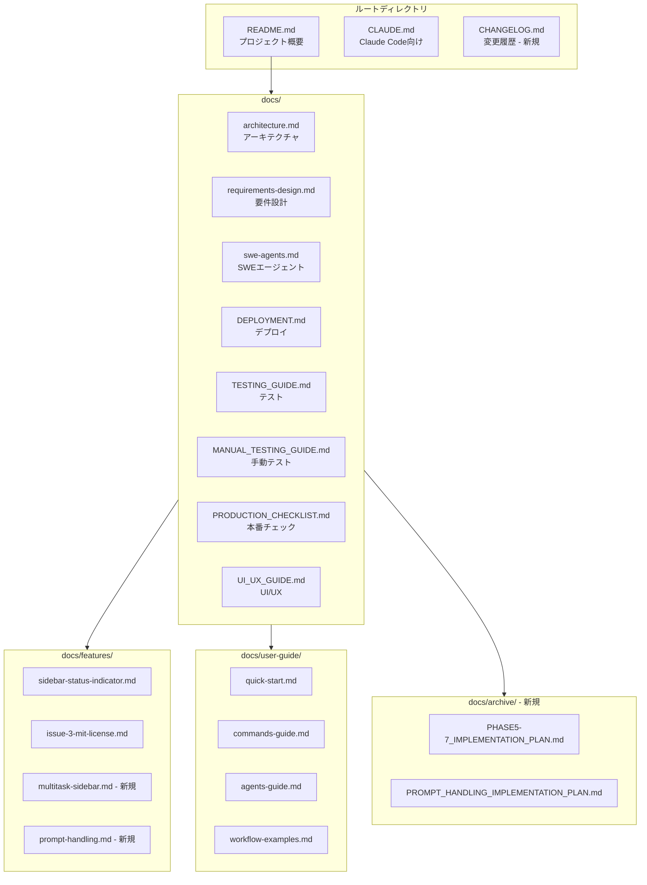

# Issue #37 ドキュメント最新化 設計方針書

## 概要

Issue #33（Codex/Gemini UIからの削除）に伴うドキュメント更新と、全体的なドキュメント整理を行う。

---

## 1. アーキテクチャ設計

### 1.1 ドキュメント構成図



### 1.2 ドキュメント分類と役割

| カテゴリ | 対象読者 | 目的 |
|---------|---------|------|
| **ルート文書** | 全員 | プロジェクト概要、貢献ガイド |
| **技術文書** | 開発者 | アーキテクチャ、設計仕様 |
| **機能文書** | 開発者/ユーザー | 個別機能の詳細説明 |
| **ユーザーガイド** | エンドユーザー | 使い方、ワークフロー |
| **運用文書** | 運用者 | デプロイ、テスト、本番運用 |
| **アーカイブ** | （参照用） | 実装完了した計画文書 |

---

## 2. 変更対象と作業内容

### 2.1 Phase 1: 緊急更新（Issue #33対応）

| ファイル | 現状 | 変更内容 | 優先度 |
|---------|------|---------|--------|
| **README.md** | 3ツール対応と記載 | Claude Code専用に修正、将来対応予定として言及 | 高 |
| **docs/architecture.md** | 複数CLI対応記載 | 現状はClaude専用と明記、コード上の拡張性は残存と注記 | 高 |
| **CLAUDE.md** | Issue #4が最新と記載 | Issue #33で一時的に単一ツール化と更新 | 高 |
| **docs/features/sidebar-status-indicator.md** | 3ツール対応テーブル | Claude以外の行を削除または将来対応と注記 | 高 |

### 2.2 Phase 2: 整理・削除

| ファイル | 作業内容 | 理由 |
|---------|---------|------|
| **PHASE5-7_IMPLEMENTATION_PLAN.md** | `docs/archive/` に移動 | 実装完了済み |
| **PROMPT_HANDLING_IMPLEMENTATION_PLAN.md** | `docs/archive/` に移動 | 実装完了済み |
| **docs/命名規則** | 統一（小文字ケバブケース推奨） | 一貫性向上 |

### 2.3 Phase 3: 新規作成

| ファイル | 内容 | 必要性 |
|---------|------|--------|
| **CHANGELOG.md** | バージョン履歴、主要変更点 | リリース管理、変更追跡 |
| **docs/features/multitask-sidebar.md** | Issue #22の機能ドキュメント | 主要機能の文書化 |
| **docs/features/prompt-handling.md** | プロンプト処理機能 | 主要機能の文書化 |
| **CONTRIBUTING.md** | コントリビューションガイド | 貢献者向け指針 |

### 2.4 Phase 4: 品質向上

| 対象 | 作業内容 |
|-----|---------|
| 全体 | リンク切れチェック |
| 全体 | スクリーンショット更新（必要に応じて） |
| user-guide/ | 実際の画面に合わせた修正 |

---

## 3. 設計パターン

### 3.1 ドキュメント命名規則

**推奨形式**: 小文字ケバブケース

```
✅ 推奨
docs/features/sidebar-status-indicator.md
docs/user-guide/quick-start.md
docs/architecture.md

❌ 非推奨
docs/PHASE5-7_IMPLEMENTATION_PLAN.md
docs/TESTING_GUIDE.md
```

**移行方針**:
- 新規文書は小文字ケバブケースで作成
- 既存のALL_CAPSファイルはアーカイブ対象のため、命名変更は不要

### 3.2 ドキュメントテンプレート

#### 機能ドキュメント（docs/features/）

```markdown
# 機能名

> 概要を1行で

## 概要

機能の説明（2-3段落）

## 使用方法

具体的な操作手順

## 技術詳細

### 実装ファイル
- `src/path/to/file.ts` - 説明

### API
- `GET /api/xxx` - 説明

## 設定オプション

| オプション | 説明 | デフォルト |
|-----------|------|-----------|

## 注意事項

制約や既知の問題

## 関連Issue

- #XX - 説明
```

#### CHANGELOG形式

```markdown
# Changelog

All notable changes to this project will be documented in this file.

The format is based on [Keep a Changelog](https://keepachangelog.com/en/1.0.0/).

## [Unreleased]

### Added
### Changed
### Deprecated
### Removed
### Fixed
### Security

## [0.1.0] - 2025-01-XX

### Added
- 初期リリース
```

---

## 4. 詳細変更仕様

### 4.1 README.md 変更箇所

**変更前（3-11行目付近）**:
```markdown
git worktree ごとに SWE CLI tool (Claude Code / Codex / Gemini) / tmux セッションを張り...
...
**対応CLI tool:**
- Claude Code (デフォルト)
- Codex CLI
- Gemini CLI
```

**変更後**:
```markdown
git worktree ごとに Claude Code / tmux セッションを張り、スマホブラウザからチャット操作できる開発コンパニオンツール。

> **Note**: 本プロジェクトは現在 Claude Code のみをサポートしています。
> Codex CLI / Gemini CLI 等への対応は、将来のアップデートで検討予定です。
```

### 4.2 architecture.md 変更箇所

**セクション 1.3** を以下のように更新:

```markdown
### 1.3 現在の実装状況

- **CLIツールサポート**: 現在は Claude Code のみ
  - コードベースには複数CLI対応の抽象化レイヤー（Strategy パターン）が残存
  - UI/UXの観点から、Issue #33 で一時的に Claude Code 専用化
  - 将来的な他CLIツール対応の拡張性は維持

> 関連: Issue #4（複数CLI実装）、Issue #33（UI簡素化）
```

**セクション 6.1.5** に注記追加:

```markdown
> **注意**: Issue #33 により、UI上ではClaude Code のみ選択可能。
> 以下のコード構造は将来の拡張のために維持されています。
```

### 4.3 CLAUDE.md 変更箇所

**Issue #4 記載部分**を更新:

```markdown
### Issue #4: 複数CLIツールサポート（休止中）
- **現状**: Issue #33により、Claude Code専用に一時変更
- **コード**: 抽象化レイヤー（Strategy パターン）は維持
- **将来**: UI/UX改善後に再有効化を検討
```

### 4.4 sidebar-status-indicator.md 変更箇所

**CLIツール別対応テーブル**を更新:

**変更前**:
```markdown
| CLIツール | 思考パターン | プロンプトパターン |
|-----------|-------------|-------------------|
| Claude | `✻ Thinking…` | `❯` |
| Codex | `• Planning` | `›` |
| Gemini | - | `%` / `$` |
```

**変更後**:
```markdown
| CLIツール | 思考パターン | プロンプトパターン | 状態 |
|-----------|-------------|-------------------|------|
| Claude | `✻ Thinking…` | `❯` | ✅ 対応 |

> **Note**: Codex CLI / Gemini CLI のパターンはコードベースに定義済みですが、
> 現在のUIでは Claude Code のみサポートしています（Issue #33）。
```

---

## 5. 新規ドキュメント仕様

### 5.1 CHANGELOG.md

```markdown
# Changelog

All notable changes to this project will be documented in this file.

The format is based on [Keep a Changelog](https://keepachangelog.com/en/1.1.0/).

## [Unreleased]

### Changed
- ドキュメント全体を最新化 (#37)

## [0.2.0] - 2025-01-XX

### Changed
- Codex/Gemini選択UIを一時的に非表示化 (#33)
- モバイル入力エリアのスクロール改善 (#34)
- Yes/Noレスポンス時のスクロール・リロード問題を修正 (#36)

### Added
- サイドバーリアルタイムステータスインジケーター (#31)
- マルチタスクサイドバー (#22)
- 履歴表示の改善 (#28)

## [0.1.0] - 2024-11-XX

### Added
- 初期リリース
- git worktree検出・管理
- Claude Code / tmuxセッション統合
- チャットUI（送信・受信・履歴表示）
- Markdownログ保存
- WebSocketリアルタイム更新
- モバイル対応UIレイアウト
```

### 5.2 docs/features/multitask-sidebar.md

```markdown
# マルチタスクサイドバー

> Issue #22 で実装されたデスクトップ向けサイドバー機能

## 概要

デスクトップ環境で常時表示されるサイドバーにより、複数ブランチの状態を
一覧で確認しながら作業できます。

## 機能

### 2カラムレイアウト
- **デスクトップ**: サイドバー（左）+ メインエリア（右）
- **モバイル**: タブ切り替え方式

### ブランチ一覧
- リアルタイムステータス表示
- 最終更新日時
- 最後のメッセージプレビュー

### ソート機能
- 更新日時（デフォルト）
- リポジトリ名
- ブランチ名
- ステータス

## 関連
- [ステータスインジケーター](./sidebar-status-indicator.md)
- Issue #22
```

### 5.3 CONTRIBUTING.md

```markdown
# Contributing to MyCodeBranchDesk

プロジェクトへの貢献をお待ちしています！

## 貢献方法

### バグ報告
1. Issueを検索して重複がないか確認
2. 新しいIssueを作成
3. 再現手順、期待動作、実際の動作を記載

### 機能提案
1. Issueを作成して背景と提案内容を共有
2. ディスカッション後、実装方針を決定

### Pull Request
1. featureブランチを作成: `feature/<issue番号>-<説明>`
2. 変更をコミット（コミットメッセージ規約に従う）
3. テストを実行: `npm test`
4. PRを作成

## コーディング規約

- TypeScript: strict mode
- コンポーネント: 関数コンポーネント
- スタイル: Tailwind CSS
- テスト: Vitest + Playwright

詳細は [CLAUDE.md](./CLAUDE.md) を参照してください。
```

---

## 6. 実装手順

### Phase 1: 緊急更新（推定作業量: 小）

1. README.md の更新
   - 複数CLI記載を削除
   - Claude Code専用と明記
   - 将来対応予定の注記追加

2. docs/architecture.md の更新
   - セクション1.3, 6.1.5 に注記追加
   - 現状と将来計画を明確化

3. CLAUDE.md の更新
   - Issue #4 記載を更新

4. docs/features/sidebar-status-indicator.md の更新
   - CLIツールテーブルを修正

### Phase 2: 整理・削除（推定作業量: 小）

1. `docs/archive/` ディレクトリ作成
2. 実装計画ファイルの移動:
   - `PHASE5-7_IMPLEMENTATION_PLAN.md`
   - `PROMPT_HANDLING_IMPLEMENTATION_PLAN.md`

### Phase 3: 新規作成（推定作業量: 中）

1. CHANGELOG.md 作成
2. docs/features/multitask-sidebar.md 作成
3. CONTRIBUTING.md 作成

### Phase 4: 品質向上（推定作業量: 小〜中）

1. リンク切れチェック（markdownlint等）
2. 各ドキュメントの相互参照確認
3. スクリーンショット更新（必要に応じて）

---

## 7. 受入条件チェックリスト

### Phase 1
- [ ] README.md がClaude Code専用と記載されている
- [ ] README.md に将来対応予定の注記がある
- [ ] architecture.md の記載が現状を反映している
- [ ] CLAUDE.md が最新状態に更新されている
- [ ] sidebar-status-indicator.md が更新されている

### Phase 2
- [ ] `docs/archive/` ディレクトリが存在する
- [ ] 実装計画ファイルがアーカイブに移動されている

### Phase 3
- [ ] CHANGELOG.md が作成されている
- [ ] docs/features/multitask-sidebar.md が作成されている
- [ ] CONTRIBUTING.md が作成されている

### Phase 4
- [ ] リンク切れがない（手動またはツールで確認）
- [ ] 主要ページ間の相互参照が正しい

---

## 8. トレードオフと決定事項

| 決定事項 | 採用理由 | トレードオフ |
|---------|---------|-------------|
| 実装計画をアーカイブ移動（削除ではなく） | 参照価値あり、経緯追跡可能 | ディレクトリ増加 |
| 命名規則は新規文書のみ適用 | 既存文書のリンク切れ回避 | 一時的な不統一 |
| CHANGELOGはKeep a Changelog形式 | 標準的、可読性高い | 学習コスト |
| prompt-handling.md は Phase 3 から除外 | 機能詳細の調査が別途必要 | 機能文書の不足 |

---

## 9. 関連Issue

| Issue | 関連内容 |
|-------|---------|
| #33 | Codex/Gemini UIからの削除（本Issue発端） |
| #22 | マルチタスクサイドバー（機能ドキュメント対象） |
| #4 | 複数CLIツールサポート（経緯参照） |
| #31 | サイドバーステータス（ドキュメント更新対象） |

---

## 10. 次のステップ

1. 本設計方針の承認
2. Phase 1 から順次実装
3. 各Phase完了後に動作確認
4. 全Phase完了後にIssue #37 クローズ

---

**作成日**: 2025-01-12
**作成者**: Claude Code
**対象Issue**: #37
